# 第 1 章 社会学视角

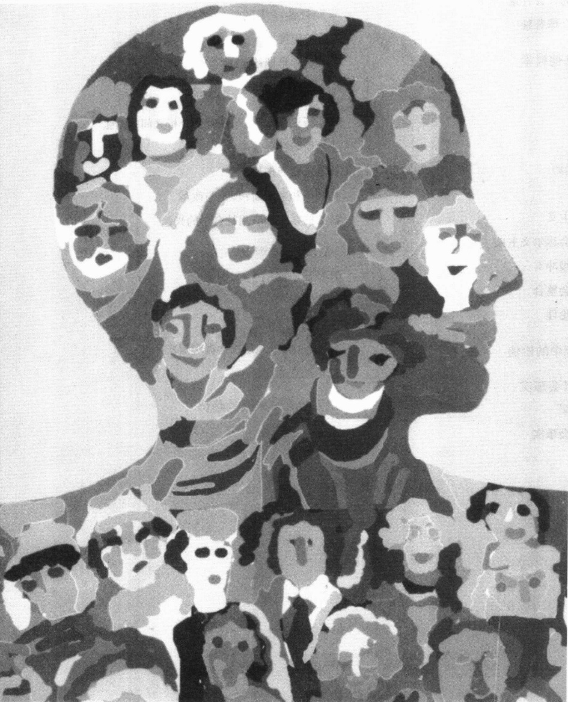

---

· 社会学视角

认识更广泛的社会背景

日益增长的全球背景

· 社会学与其他科学

自然科学

社会科学

科学的目标

· 社会学的起源  

传统与科学  

孔德和实证主义  

斯宾塞和社会达尔文主义  

马克思和阶级冲突  

涂尔干和社会整合  

韦伯和新教伦理

· 社会学研究中的价值

社会事实怎样与“理解”结合在一起

·早期社会学中的性别歧视

当时的态度

·早期社会学中的性别歧视

当时的态度

马蒂诺和早期社会研究

·“理解”与社会事实  

韦伯和“理解”  

涂尔干和社会事实

·北美的社会学

早期历史：社会改革和社会分析之间的紧张

亚当斯与社会改革

杜波依斯与种族关系

帕森斯和米尔斯：理论与改革

持续的紧张和应用社会学的兴起

· 社会学理论观点

符号互动论

功能分析

冲突论

分析层次：宏观层次和微观层次

理论观点的综合

---

### 第 1 章 社会学视角

紧急出口的灯发出昏暗的微光，淡淡地照在双层床的上铺。我看着脏兮兮的床单久久不能入睡。又是一个时醒时睡的夜晚，我不情愿地蜷缩在床上，裹了裹身上的衣服，仿佛置身于蚕茧之中。

第二天早上，我挤在长长的一队人中，他们衣衫不整，斜靠着铁丝防护网，面色阴郁，死气沉沉。

没有人说话，人们默默地往前移动。轮到我，有人给了我一杯咖啡、一些塑料容器和一碗糊状的东西。我以前从没见过这种食品，也从没尝过这种味道。

糟糕的味道让人难以下咽，每一口都是一场战役。但我早已下定决心。“我要体验他们所体验的，”我不断地告诉自己。我的胃渐渐不再反抗，不情愿地接受了这顿早餐。

屋子里静得出奇。几百个男人正在吃饭，每个人都似乎沉浸在各自的失望、悔恨和苦涩之中，默默地低头吃着自己碗中的饭。

当我盯着手中的舒泰龙塑料泡沫杯，里面盛着咖啡，庆幸自己至少还能享有这点小小的快乐，忽然看到杯子边沿似乎有个牙印。我尽力不让自己往那上面去想，我告诉自己，未来几个星期终于要对无家可归者进行社会学式的观察了。“杯子上的痕迹一定是手工制作时留下的折痕，”我想。

人们依旧安静地排队送回碗和杯子，我看到柜台后的人把塑料杯子在一盆水中涮来涮去，我感到一阵恶心。我明白，杯子上的那个痕迹确实是别人咬的。

这项观察要进行多久？我感到了对回家的深切渴望——回到一个温暖的世界，那里有干净的床单、健康的食品和“正常”的谈话。

### 社会学视角

这些人为何如此安静？他们为何受到这种让人厌恶的对待？我在那个无家可归者的庇护所干什么？毕竟，我有一份受人尊敬的职业，有自己的家庭和房子。

社会学提供了一个视角，一种看待世界的视角。社会学视角(或想象力)为我们打开了陌生世界的一扇窗户，并使我们重新看待熟悉的世界。在本书中，你将置身于德国纳粹分子、南美武士，甚至是在我最近发现的生活在柬埔寨一个城市垃圾场的人们中间。但你也将会以一种不同的方式来看待自己的世界。当你看待其他(或者你自己的)世界的时候，社会学视角将会使你获得对社会生活的新看法。实际上，这也是许多人发现的社会学的迷人之处。

社会学视角一直是我生命中的激励力量。从我第一次上社会学入门课开始，我就被社会学提供的视角给迷住了。我尽情享受观察其他群体并质疑我对生活的假设的种种快乐。我真诚地希望这也会同样发生在你身上。

---

### 认识更广泛的社会背景

社会学视角强调人们生活于其中的社会背景,研究这些背景如何影响人们的生活。处于社会学视角中心的是这样一个问题:群体如何影响人们,特别是人们如何被他们的社会(共享文化和地域的一群人)所影响。

为了弄明白人们为什么会像他们所做的那样行动，社会学家从社会位置(social location，即人们因其在一个社会中所处的位置而在生活中占据的角落)入手。社会学家认为，职业、收入、教育、性别、年龄以及种族具有重要意义。例如，想一想当我们成长时，对一个被称为女性或男性群体的认同，是如何影响我们对自己是谁以及应该在生活中获得什么的看法的。成为一名男人或一名女人，不仅影响到我们的志向，而且影响到我们如何感受自己，以及在约会、婚姻、工作中如何与人相处。

社会学家米尔斯(Wright Mills,1959)曾这样说过：“社会学视角使我们能够把握历史和人生阅历之间的关联。”米尔斯所说的“历史”是指每个社会在更广的事件中所经历的东西。因为这一点，每个社会才有自己的特质(如它对男人和女人适宜角色的看法)。“人生阅历”是指个人的特殊体验。简单来说，人们并非因为遗传下来的内在机制(如本能)而这样或那样行事。相反，外在影响(我们的体验)成为我们思想和动机的一部分。我们成长于其中的社会，以及我们在那个社会中所处的特定位置，对我们做什么、怎样思考具有核心作用。

拿一个新生儿来说，假如我们把这个婴儿从其美国父母身边带到南美雨林中的亚诺马莫(Yanomamō，巴西北部和委内瑞拉南部一个好战的原始民族)印第安部落，你知道，当这个孩子开始说话时，他或她将不会说英语，而且这个孩子也不会像一个美国人那样思考。例如，他或她长大后将不会使信用卡、穿名牌牛仔服、要一辆新汽车，以及玩最新的电子游戏。与此同时，这个孩子将顺理成章地获得

考察人们生活所在的广阔社会背景对于社会学视角来说至关重要，因为这个背景形塑了我们的信仰和态度，为我们的所作所为提供指引。从这幅图片中你可以看到，生活在巴西和委内瑞拉边境的亚诺麻莫印第安人，他们的这些生活原则是多么的与众不同。想一想图中这位亚诺麻莫男人是怎样受到其群体影响的？而你的行为又是如何受到你所在群体影响的？

其在亚诺马莫社会中的一席之地——也许是做一位食物采摘者、一位猎人或是一位武士，而他或她甚至根本不知道其出生前的世界。而且，无论是男性或女性，这个孩子长大后都会认为要很多孩子是很自然的，他们不会为是否要一个、两个还是三个孩子而讨论不休。

世界各地的人们都认为自己的具像世界是理所当然的。在我们美国人的内心里有某种东西告诉我们：汉堡包美味可口、小一些的家庭更好、名牌服装很有吸引力。但生活在西奈沙漠中一些阿拉伯部族成员心底的某种东西却告诉他们：温暖新鲜的骆驼血液是美味可口的饮料，每个人都应有一个大家庭并且穿着宽松的长袍(Murray, 1935; McCabe and Ellis, 1990)。

---

这个“东西”当然不是一种本能，正如社会学家彼得·伯杰(Peter Berger, 1963)所说，这个“东西”是“我们心中的社会”。

这一点虽然显而易见，我们却经常忘记。我们经常思考和谈论人们的行动，仿佛它是由人们的性别、种族或由基因传递的一些其他因素造成的。社会学视角通过揭示人们行为后面更广泛的社会背景，可以帮助我们摆脱这种狭隘的个人视野。它有助于我们认识到人们做什么和形成人们行为的社会环境之间的联系。

这样一来也就把我们带到你的面前——使你了解社会群体如何塑造你的观念和愿望。在本书中你将不断看到，你看待世界的方式是你接受人类群体影响的结果。我想你会喜欢上社会学提供的这次自我发现之旅的。

### 日益增长的全球背景

从我们衣服上的标签到汽车中的配件都在很明显地告诉我们，我们所处的世界正在变成一个全球村。我们的祖先生活在相互隔离的农场和小镇上，对社区之外的世界，他们只能模糊地感受到。沟通是如此缓慢，以至于在1812年美国独立战争中，在美国和英国已经签署和平协议两星期之后，仍然发生了新奥尔良战役，因为当地的军队不知道战争已经结束了(Volti，1995)。

与之形成对照的是，现今的沟通使我们能与世界上的偏远地区保持即时联系。庞大的经济系统使我们不仅与加拿大和墨西哥，而且与爱尔兰、印度联系起来。与此同时，虽然我们已生活在一个全球互联的时代，我们仍然处在由家庭背景、宗教、工作、性别、种族和社会阶级划分出来的小的生活角落。在这些角落中，我们习得了看待世界的各种不同方式。

社会学最美丽也是最引人入胜之处就在于它能分析我们当前现实的这两个方面：把我们融入一个全球网络中的变迁和我们在较小的生活角落中独特的体验。本书将考察我们生活中这两个重要方面。

### 社会学与其他科学

正如今人非常渴望揭开身边的谜团，古人也曾试图认识他们的世界。然而，他们的解释却并不只是基于观察，而是混杂着巫术和迷信。

为了满足对周围世界根本的好奇心，人类逐渐发展出科学(science)——研究社会和自然世界的系统方法，以及通过这些方法获得的知识。社会学(sociology)，作为对社会和人类行为的科学研究，是现代文明发展形成的科学之一。

比较这些科学的一个有用方法(这也使我们能更好地理解社会学的位置)，是把科学划分为自然科学和社会科学。

### 自然科学

自然科学（natural sciences）是旨在解释和预测自然环境中发生的事件的学科。自然科学依照研究对象划分成各个不同的专业领域，如生物学、地质学、化学、物理学等。它们还可以被进一步划分为更加专门的领域。生物学可分为植物学和动物学，地质学可分为矿物学和地貌学，化学可分为有机化学和无机化学，

---

物理学则可分为生物物理学和量子力学。每个研究领域研究自然的一个特定“部分”（Henslin, 2003a）。

### 社会科学

人们并不局限于研究自然界。为了获得对生活更全面的理解，人们也发展了关注社会世界的科学领域。社会科学研究人类关系。正如自然科学试图客观地理解自然世界，社会科学也试图客观地理解社会世界。正如自然界里有隐蔽的、必须通过控制观察才能发现的“有序”（或法则式）关系，人类或社会世界的有序关系同样不是显而易见的，同样必须通过重复观察的方法才能被揭示出来。

同自然科学一样，社会科学基于各自的研究对象被分成许多专业领域，如人类学、经济学、政治科学、心理学和社会学等。这些社会科学还可以进一步划分为更加专门的领域。比如人类学又分为文化人类学和体质人类学，经济学分成宏观(大规模)和微观(小规模)两个方向，政治学分为理论和应用两个分支，心理学分为临床心理学和实验心理学，而社会学则有定量与定性之分。因为我们的关注点在于社会学，下面就让我们把社会学与其它社会科学一一作番比较。

人类学 人类学是社会学的姊妹学科。人类学家的主要旨趣在于理解文化（一种人类生活的整体方式）。文化包括一个群体的（1）人工制品，如它的工具、艺术品、武器；（2）结构，即决定其成员如何互动的模式（如需要尊重的地位）；（3）观念和价值，特别是它的信仰系统如何影响人们的生活；（4）沟通形式，特别是语言。人类学的传统关注点是部落居民。要拿到博士学位，人类学家通常要在一个群体内生活一段时间。在他们的研究报告中，他们着重强调这个群体的家庭（亲属）关系。因为世界上已经没有“未被发现”的群体，对部落群体的关注渐渐也就让位于对工业化环境下的群体研究。当人类学家与社会学家研究同一个群体时，人类学家往往更看重人工制品、权威（等级制）和语言，特别是亲属术语。

经济学 经济学集中研究一种专门的社会制度。经济学家研究一个社会中物质商品和服务的生产和分配。他们想要知道正在生产的是什么产品？以何种速度生产？成本是多少？这些商品是如何分配的？经济学家同样对人们决定生产和消费的选择感兴趣，例如，他们研究是什么促使人们去买某种商品而不是另一种。

政治学 政治学关注政治和政府。政治学探讨政府的形式以及这些形式如何与其他社会制度相联系。政治学家对人们如何在其社会中获得统治地位、如何维持这种地位，以及他们的政治行为对被统治者的影响特别感兴趣。在研究像美国这样的宪制政府中，政治学家也会分析投票行为。

心理学 心理学的关注点是发生在个人内心(即心理学家所说的“裹皮的有机体”)的过程。心理学家主要关心心理过程(发生在脑中或心灵中)。他们研究智力、情感、认知、记忆、甚至梦。有些人则研究人格是如何形成的，还有人关注精神错乱(心理变态或精神疾病)。许多心理学家自己开业经营，并作为学校和工作场所的咨询师进行人格测试、智商测试以及职业倾向测试。作为医师，他们关注解决个人问题，有时帮助病人从诸如虐待引起的心灵创伤中恢复，有时帮助病人从毒瘾、酒瘾或赌瘾中解脱出来。

社会学 社会学与其他社会科学有很多相似之处。同人类学家一样，社会学家也研究文化，同样也对群体的结构和信仰系统以及人们如何相互沟通感兴趣。同经济学家一样，社会学家也关心一个社会中的商品和服务，但社会学家的关注点在于不平等的社会后果。同政治学家一样，社会学家也研究人们

---

如何相互统治，特别是政府如何影响人们的生活。同心理学家一样，社会学家也关心人们如何调适生活中遇到的困难。

既然有这么多相似之处，社会学与其他社会科学的区别在什么地方呢？不同于人类学家，社会学家主要关注工业化社会。不同于政治学家和经济学家，社会学家并不只关注某一专门的社会制度。不同于心理学家，社会学家强调决定是外在于个人的因素，并以此判断是什么影响了人们的行为。下面的“现实社会学”专栏谈到了不同学科的成员如何认知同一个老故事。

## 现实社会学

### 瞎子摸象新说

据说，在不久之前，五位聪明人被蒙上眼睛带到一头大象面前，要求说出他们“看”到了什么。第一位是个心理学家。他抚摸着大象的脑袋说：“这里是唯一重要的。所有的感知和思考都在这里面发生。要理解这头大象，只要研究这里就可以了。”

第二位是个人类学家。他轻轻地触摸大象的鼻子和长牙，微笑着说：“这是真正原始的东西，我觉得在这里很舒服，我就研究它们了。”

第三位是个政治学家。他摸着大象巨大的耳朵宣布：“这里是权力中心。在这里听到的将控制其全身运动。研究这里吧。”

第四位是个经济学家。他摸着大象的嘴说：“这才是真正重要的。通过嘴，吃的东西被全身消化吸收。我们应该研究食物是如何被分配的。”

（当然了）接下来就轮到了社会学家。他摸完大象的整个身体，然后说：“你们只研究大象身体的某一部分，不可能真正理解它。每个部分都不过是整体的一部分。头、鼻、牙、耳朵、嘴固然很重要，但你们没有提到的其他部分同样也很重要。我们必须摘掉眼罩，这样才能看得更广。我们要弄明白这一切是如何一同发挥作用形成这头大象的。”

社会学家顿了顿，以示强调，然后补充说：“而且我们还有必要理解这一生物如何与类似生物互动，它在群体中的生活如何影响了它的行为。”

我希望故事的结局是心理学家、人类学家、政治学家、经济学家被社会学家的真知灼见深深吸引。在惊叹之余，他们摘下眼罩，开始一起研究整头大象。但遗憾的是，听过社会学家的一番话，专家们却把眼罩蒙得更紧了。这样他们就可以更加专注于各自的特定部分。而且，如果你仔细去听，你还会听到他们嘴里在哪嘟囔囔：“脑袋是我的——你别碰它。”“别碰我的象牙。”“不要摸我的耳朵。”“不许碰嘴——那是我的地盘。”

### 科学的目标

每个科学学科的第一个目标都是要解释为什么某种事情发生了，第二个目标是将这种解释概括化（generalization），即超越单独的事例并得出一个适用于更广泛的群体或情境的陈述。例如，一位社会学家不仅想要解释为什么玛丽去上大学或是成为武装抢匪，还想解释为什么像她这样的人会比其他人更容易上大学或成为武装抢匪。要进行概括，社会学家就要借助于模式（patterns），即反复发生的特征和事件。第三个目标则是进行预测，根据当前的知识推出未来将会发生什么。

要实现这些目标，科学家们并不依靠巫术、迷信或普遍信仰，而是要做系统研究。他们要详细说明他们是如何做的研究，从而可以被其他人检验。保密、成见或其他种种偏见都与科学格格不入。

---

社会学家和其他科学家也要超越常识(common sense)，即一个社会中盛行的观点，或者所谓“路人皆知”的事情。即便是在今天，“人人皆知的”也可能是错的，就像早先的常识曾认为世界是平的或者没有人能在月球上行走一样。当社会学家审视人们对世界的假设时，他们所发现的结果很可能会与社会生活的常识相冲突。要检验自己的“常识”，请读下面的“现实社会学”专栏。

## 现实社会学

### 社会学小测验——社会学发现与常识

有些社会学发现与人们关于社会生活的常识相一致，而有些则不一致。你能对其进行区分吗？为了享受测验的乐趣，请先做完全部题目(判断真假)再翻看下页答案。

1. 比起 10 或 15 年前，现在有更多的美国学生在校园枪击中丧生。

2. 美国妇女的收入刚刚追上男人的水平。

4. 大多数强奸犯精神都不正常。

3. 当面对洪水和地震等自然灾害时，人们惊慌失措，社会组织解体。

5. 依赖福利的大多数人是懒惰的并且等待别人的施舍，如果他们想工作是可以找到工作的。

6. 与妇女相比，男人在面对对话中使用更多的眼神交流。

7. 婚前同居的夫妇通常比婚前没有同居的夫妇对婚姻更满意。

8. 妻子有工作而自己失业在家的大多数丈夫都会利用空闲时间做更多的家务活。

9. 因为骑自行车的人比前几年更多地戴头盔，他们的头部受伤率下降了。

10. 由于日本学生的学习压力很大,他们的自杀率大约是美国学生的两倍。

有时，社会学家的探索会把人们带到他们不想探究的隐秘角落。例如，社会学家可能会研究人们如何作出犯罪或对配偶不忠的决定。因为社会学家迫切想要理解社会生活，他们不能因为人们感到不舒服就停止其研究工作。社会学家认为人类生活的所有领域都是可以被探究的，他们的发现常常会对一些为人珍视的观念提出挑战。

当社会学家研究群体如何运作时，他们经常发现人们试图隐藏秘密。看上去每个组织、每个群体都有给别人看的好的一面。但社会学家却要弄清楚在表面现象下真正发生了什么，于是他们就想透过粉饰的表象进行观察(Berger,1963)。这种方法有时会引起社会学家与感觉受到真实信息威胁的人们之间的冲突，但这些都是社会学家探险路上的一部分。

### 社会学的起源

### 传统与科学

社会学是如何形成的？在某种意义上，我们很难回答这个问题。甚至古人都在尝试了解社会生活。他们追问：为什么会有战争？为什么有些人会比其他人更有权力？为什么有些人会变得富有？不过他们经常是根据迷信、神话甚或星座来回答这些问题，并且没有检验过其假设。

科学则与之不同，它要求能被系统研究所验证的理论的发展。用这一标准来衡量，社会学只是近来

---

才登上人类舞台。它大约出现在19世纪中期，当时社会观察者开始采用科学方法来验证他们的观点。

社会学诞生于社会剧变中。当时工业革命刚刚开始。到19世纪中期，欧洲经济正从农业生产向工业生产转变。人们大批涌入城市寻找工作，他们与土地(以及与那个提供现成答案的文化)的纽带被打破了。城市里等待他们的是恶劣的工作条件：低工资、漫长而让人精疲力尽的工作时间、危险的工作。为了生存，甚至儿童也要在这种条件下工作；为了防止工人逃跑，工人甚至被锁在工厂机器旁边。生活不再与从前一样，曾为社会生活问题提供答案的传统再也不能被指望了。

传统受到了进一步的打击。美国革命和法国革命的成功鼓励人们重新思考社会生活。许多新观念纷纷出现，例如认为个人拥有不可剥夺的权利。当这种新观念大行其道时，许多传统的西方君主体制也就让位于更加民主的政府形式。人们发现包括宗教在内的传统所提供的现成答案是不够的。

当传统盛行时，它提供了现成答案：“我们这么做是因为一直这么做。”传统不鼓励首创性思考。既然答案已被给出，为什么还要寻找解释呢？然而，横扫一切的变革却与传统正好相反：通过推翻既有秩序，它鼓励提问，并要求新的答案。

随后又出现了当时的帝国主义。欧洲人征服了世界上许多地方，他们的新殖民帝国从亚洲、非洲一直扩展到南北美洲。这使他们遇到一些与其自身完全不同的生活方式，并开始思考文化为什么会不同。

促动社会学发展的另一个因素是自然科学的成功。当传统被打破，人们开始质疑生活方式的基本问题时，使用客观、系统的观察去验证理论的科学方法（scientific method）正在化学和物理学上取得成功。自然界中许多隐藏的秘密都被揭示出来。当传统不再为社会生活问题提供答案时，人们自然而然地开始使用科学方法来回答这些问题。结果就是社会学的诞生。

现实社会学

### 社会学发现与常识——小测验答案

1. 假。在20世纪90年代早期，美国学校中因枪击丧生的学生比现在要多。参见第17章。

2. 假。多年来，两性之间的工资差异正在减少，但只是减少了一点点。平均来说，全职工作妇女的收入只及全职工作男子的70%，而这个数字已经是多年来逐步改善的结果。参见第11章图11.7。

3. 假。自然灾害发生后，人们会同心协力，形成社会组织来应对灾难。参见第4章。

4. 假。社会学家比较了强奸犯与其他罪犯的心理资料，没有发现有何不同。与抢劫一样，强奸也是一种习得行为。参见第5章。

5. 假。依赖社会福利的人大多是儿童、老人、病人、精神和身体残障人士或是没有技术的年轻妈妈。与人们想象的不同，在依赖社会福利的人中，只有不到2%的人的身体状况适于工作。参见第10章。

6. 假。妇女有更多的眼神接触(Henley et al., 1985)。

7. 假。恰恰相反。研究人员认为，原因在于许多婚前同居的夫妇原本就对婚姻不太有承诺感，而婚姻成功的关键就在于相互之间的强烈承诺(Larson,1988)。

8. 假。妻子有工作而自己失业的丈夫们大多减少了他们做的家务劳动。参见第16章的一个解释。

9. 假。恰恰相反。骑自行车的人在今天更可能戴头盔，但他们的头部受伤率反而更高。显然，戴头盔让他们觉得更安全，因而他们也就更容易冒险(Barnes,2001)。(功能主义者研究人们行动带来的未预料的后果，参见第27页。)

10. 假。美国学生的自杀率是日本学生的2倍（Haynes and Chalker, 1997）。

---

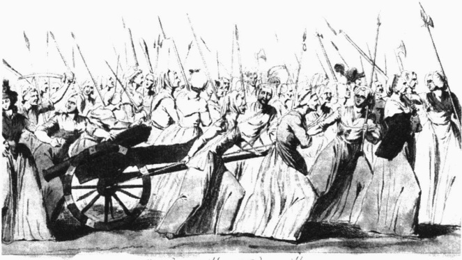

d’Étude de Vérité = 100–789

这幅作于18世纪（作者未知）的油画描绘了巴黎的妇女在1789年10月5日加入法国军队向凡尔赛宫进发的场面。1789年的法国大革命不仅推翻了贵族统治，而且颠覆了整个社会秩序。这场深刻而广泛的变革使过去不再是现在的明示。这场革命促使奥古斯特·孔德去分析社会如何变迁。他的著作常被认为是社会学的开端。

### 孔德和实证主义

把科学方法应用到社会世界的想法，也即众所周知地实证主义（positivism），显然首先是由孔德（Auguste Comte，1798—1857）提出的。由法国大革命而引发的思想混乱对孔德产生了深刻影响，他离开了他成长的保守小镇，来到巴黎。他所经历的变迁，加上他在法国大革命中所经历的事情，使他开始对是什么将社会联结成一体这个问题产生兴趣。他在思考：是什么产生了社会秩序而不是无政府或混乱状态？一旦社会步入特定进程，是什么导致它的变革？

在思考这些问题的时候，孔德认为回答问题的正确方法是把科学方法应用到社会生活中。正如这种方法发现了引力定律一样，它也可以揭示社会的基本定律。孔德把这一新科学称为社会学（sociology）——“对社会的研究”（来自希腊文 logos，“研究”的意思，以及拉丁文 socius，“同伴”或“和其他人在一起”的意思）。孔德强调这门新科学不仅将发现社会原理，而且将把它们应用到社会改革中。社会学家将会改革整个社会，使它成为一个更加适合人们生活的地方。

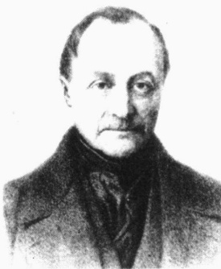

奥古斯特·孔德(1798—1857)，被认为是社会学的创始人。他重视分析社会秩序的基础。尽管他强调应该把科学方法运用到社会研究中，但他自己却没有做到这一点。

不过对于孔德来说，把科学方法应用到社会生活中意味着从对社会生活非正式的观察中得出结论，也就是我们所说的“安乐椅哲学”。孔德并不做现代社会学家所做的研究工作，因而他的结论已被抛弃。然而他所坚持的我们必须观察并区分人类行为以揭示社会基本规律的思想却被很好地继承了下来。因为他发展了这种观点并创造了“社会学”一词，孔德常被誉为社会学的创始人。

### 斯宾塞和社会达尔文主义

斯宾塞(Herbert Spencer, 1820—1903) 在英国长大, 有时被称为社会学第二创始人。斯宾塞坚决反对孔德认为的社会学应指导社会改革

---

这一主张。斯宾塞认为社会是从低级(原始)形式进化到高级(文明)形式。随着一代代的发展，社会成员中最有能力、最聪明的(“最适合的”)生存下来，而不太有能力的则被淘汰出局，社会从而渐渐进步。如果我们帮助低等阶级，我们将会干涉自然过程。最适合的社会成员将会产生一个更加发达的社会——除非误入歧途的好心人横加干涉，帮助不适合的人生存下来。

斯宾塞把这一原理称为“适者生存”。尽管是斯宾塞发明了这个短语，它却被归功于与斯宾塞同时代的查尔斯·达尔文，后者主张有机体在适应环境的进程中逐步进化。因为斯宾塞的观点与达尔文非常相似，斯宾塞的社会进化观就被称为社会达尔文主义(social Darwinism)。

斯宾塞关于慈善和帮助穷人是错误的观点使许多人都感到震惊。然而当时有钱的企业家，因为认为自己是“最适合的”从而也更优秀，因而非常乐于接受斯宾塞的观点。毫不奇怪，斯宾塞的观点使他们在周围人挨饿的时候仍然可以过着奢侈生活而不感到内疚。

像孔德一样，斯宾塞更多的是一位社会哲学家而不是社会学家。而且与孔德一样，他也没有进行科学研究，而只是提出了一些有关社会的观点。斯宾塞在英国和美国得到了广泛支持，他被当做一位代言人而受到追捧，但最终社会达尔文主义遭到了普遍质疑并名誉扫地。

### 马克思和阶级冲突

马克思 (Karl Marx, 1818—1883) 不仅影响了社会学，而且在世界历史上也留下了他的印记。他的影响是如此之大，以至于坚定拥护资本主义的《华尔街日报》（Wall Street Journal）也称他为三位最伟大的现代思想家之一（另两位是弗洛伊德和爱因斯坦）。

同孔德一样，马克思也认为人们应当尝试去改变社会。他曾因宣传革命而被其祖国德国驱逐出境并来到英国。他相信人类历史的动力在于阶级冲突（class conflict）。他认为资产阶级（bourgeoisie，即资本家，指那些拥有像资本、土地、工厂、机器等生产资料的人）必定与无产阶级（proletariat，没有生产资料而受剥削的人）发生冲突。这场残酷的阶级斗争只有当工人们在革命中团结起来并卸去身上的枷锁时才会结束，而结果将会是一个无阶级的社会。在这个社会里没有剥削，人们各尽所能，各取所需（Marx and Engels，1848/1967）。

马克思主义不等于共产主义。尽管马克思认为革命是工人控制社会的唯一办法，但他并没有提出一个叫做共产主义的政治体制。这

赫伯特·斯宾塞(1820—1903)，有时被称为社会学的第二创始人。他首创了“适者生存”这一术语。斯宾塞认为帮助穷人是错误的，这只会帮助那些“不适应”的人生存下去。

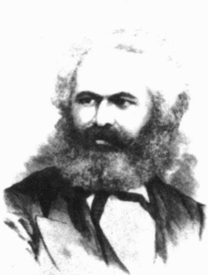

卡尔·马克思（1818—1883）相信人类苦难的根源在于阶级冲突，即那些拥有生产资料的人剥削工人阶级。马克思认为，无产阶级推翻资产阶级统治的社会革命不可避免。尽管马克思不认为自己是社会学家，但他的观点深深地影响了许多社会学家，尤其是冲突理论家们。

---

是后人对他思想的应用。实际上马克思听到就他对社会生活的洞见而展开的讨论时，他感到很厌烦。当听到一些据说是他的观念立场时，他摇着头说：“我不是一个马克思主义者。”（Dobriner,1969b:222；Gitlin,1997:89）

不同于孔德和斯宾塞，马克思并不认为自己是一位社会学家。他常年在英国伦敦大英博物馆的图书馆学习研究，就历史、哲学、经济学和政治学进行广泛的创作。因为他对社会阶级之间的关系，尤其是“有产”和“无产”阶级之间斗争的洞见，许多社会学家都认为马克思是一位重要的早期社会学家。他也引入了社会学的重要视角之一——冲突理论，我们将在第29页对该理论进行讨论。

### 涂尔干和社会整合

涂尔干 (Emile Durkheim, 1858—1917, 也译迪尔凯姆) 的主要职业目标是使社会学被承认为一门独立的学科 (Coser, 1977)。当时社会学被看做是历史学和经济学的一部分。在法国东部长大并在德国和法国接受教育的涂尔干实现了他的目标，1887 年他接受了波尔多大学提供的首个社会学教职。

涂尔干还有一个目标：揭示社会力量如何影响人们的行动。为此他进行了严格的研究。通过比较几个欧洲国家的自杀率，涂尔干（Durkheim，1897/1966）发现每个国家的自杀率各不相同，但一个国家的自杀率却常年保持稳定。他还发现一个社会中不同的群体有着不同的自杀率，而且也都各自保持稳定。例如，新教徒、男性、未婚者要比天主教徒、犹太人、女性、已婚者有更高的自杀率。由此涂尔干得出了一个富有洞见的结论：自杀不只是这里或那里的某些人出于个人原因决定杀死自己的个人事件，在自杀的后面还有社会因素，这也是使一个群体的自杀率长期相当稳定的原因所在。

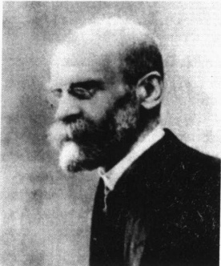

法国社会学家埃米尔·涂尔干（1858—1917）为社会学贡献了许多重要概念。他对几个国家的自杀率所做的系统比较研究揭示了一个潜在的社会规律：如果人们与其社区里其他成员的关系纽带较弱，则他们更有可能自杀。涂尔干认为社会整合是社会生活的关键所在。直到今天，这仍是社会学的主要观点。

涂尔干提出社会整合(social integration, 即人们与其社会群体结合的程度) 是自杀的一个关键社会因素，并由此推论出：有较弱社会纽带的人更有可能自杀。他说，这个因素可以解释为什么新教徒、男性、未婚者有较高的自杀率。原因如下：新教主义鼓励思想和行动的更大自由，男性比女性更加独立，未婚者缺乏婚姻带来的关联和责任。换言之，因其社会整合较弱，这些群体的成员之间有较少的能使其远离自杀的社会纽带。

尽管较强的社会团结一般会保护人们免于自杀，但涂尔干指出，在某些例子中较强的社会团结也会鼓励自杀。例如，人们会因为对配偶去世过于悲伤而自杀。他们自己的感情与其配偶的感情过于整合一体，以至于因为失去了能带来生命意义的人，他们宁愿去死。

100 年过去了，涂尔干的研究仍在被人不断引用。他的研究是如此透彻，以至于他发现的原理依旧适用：较少社会整合的人有较高的自杀率。即使在今天，涂尔干划分的这些类别（新教徒、男性和未婚者）仍然更有可能自杀。

从涂尔干对自杀的研究中，我们可以看到其研究的核心原理：人类行为不能仅仅通过个人化的术语来理解，我们必须总是留意影响人

---

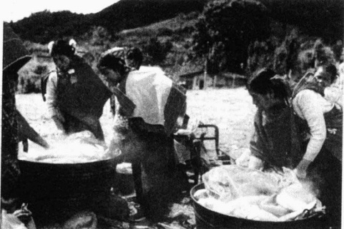

涂尔干相信现代社会制造了更多的疏离感，这在很大程度上根源于劳动分工。比较而言，在传统社会里，与家人和邻居一起从事类似工作的社会成员体验到高度的社会整合。右图展示的是墨西哥齐那康塔的工人们一起煮玉米的场面。

我们生活的社会力量。例如，自杀乍看起来是一个非常个人化的行动，好像应该由心理学家而不是社会学家来研究它。然而，正如涂尔干指出的那样，如果我们只从个人方面入手去了解人类行为（如自杀），我们就会忽视其社会基础。为了更清楚涂尔干的意思，请看图1.1。非裔美国人和白人自杀的方式如此相似，意味着存在某种超出个人之上的东西。因为这些模式常年保持相对稳定，它们反映了社会的某些状况，如枪支的泛滥和容易获取。

### 韦伯和新教伦理

作为一位与涂尔干同时代的德国社会学家，韦伯（Max Weber，1864—1920）也在这一新兴的社会学学科中拥有教授身份。同涂尔干和马克思一样，韦伯也是最有影响的社会学家之一，在接下来的几章中你将会读到他的作品和理论。下面让我们先来看一下韦伯提出的今天依旧存有争议的两个问题。

图1.1 美国人如何自杀？

注：资料来源没有列出拉美裔的情况。

资料来源：作者根据 Centers for Disease Control (2002) 整理而成。

---

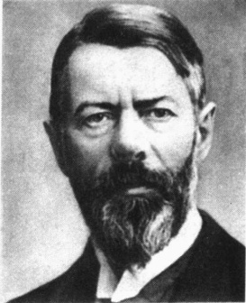

马克斯·韦伯（1864—1920）是另一位对社会学产生重大影响的早期社会学家。他运用跨文化方法和历史资料去寻找社会变迁的缘由，以及社会群体会在多大程度上影响人们的生活取向。

宗教和资本主义的起源 韦伯不同意马克思持有的经济是社会变迁的核心力量这一主张。他认为起这一作用的应该是宗教。韦伯（Weber，1904/1958）的理论认为，罗马天主教信仰体系鼓励信徒们坚守传统的生活方式，而新教信仰体系则鼓励其成员接受变迁。他说，新教教义破坏了人们的精神安全感。罗马天主教徒相信因为他们是教会成员，他们一定可以去天国。但不同意这种信仰的新教徒则去寻找能够证明他们符合上帝意志体现的“标志”，经济成功是表明其上帝子民身份的主要标志。从而，新教徒过一种勤俭的生活，把钱节省下来并用多余的钱投资以得到更多的钱。韦伯说，这导致了资本主义的诞生。

韦伯把这种对生活自我否定的方式称为新教伦理（Protestant ethnic），并把积极进行资本投资以赚取更多金钱的意愿称为资本主义精神（spirit of capitalism）。为了验证他的理论，韦伯比较了罗马天主教国家和新教国家资本主义发展的程度。与他的理论一致的是，他发现资本主义在新教国家更可能迅速发展。韦伯关于宗教是资本主义兴起的关键因素的结论一经提出就引起了争论，直到今天仍有很大争议性（Kaelber，2001）。我们将在第7章更详细地讨论这些观点。

### 社会学研究中的价值

韦伯还提出了另一个直到今天社会学家仍有争议的问题，即认为社会学应该价值无涉（value free）。他的意思是说，一位社会学家的价值观（values，即有关生活中什么是好的或值得做的以及世界应该是什么样的这些个人信念）不应该影响到研究。韦伯希望客观性（objectivity）、完全的中立性能成为研究的标志。他认为，如果价值影响了研究，社会学的发现将是有偏见的。

研究中不应该带有偏见是毋庸置疑的。所有社会学家都认为不应该扭曲数据以使其符合预想的观点和个人的价值观。然而，同样清楚的是，因为社会学家与其他人一样，也是历史进程中某一个点上、某一特定社会中的成员，他们也被灌输了各种各样的价值观。这些价值观不可避免地会在我们的研究中发挥作用。例如，从某种意义上来讲，价值观是某位社会学家选择去研究黑手党、而另一位社会学家则去研究幼儿园学生的部分原因。

因为价值观可以导致我们在解释发现时产生无意的扭曲，社会学家强调重复性(replication)，即研究者重复一项研究以比较它们的结果与最初的发现是否一致。如果价值观扭曲了研究发现，其他社会学家通过重复研究就可以发现偏见并纠正它。

尽管在这方面人们看法一致，价值观仍然是社会学中引起激烈讨论的话题（Buraway，2003；Gans，2003）。分歧集中在社会学正确的目的和使用上。关于它的目的，一些社会学家主张他们的目标只应该是增进对社会生活的理解。他们会在任何感兴趣的问题上收集资料并用现有最适合的理论来解释他们的发现。另外一些社会学家则坚信他们有责任研究危害人们的社会安排——贫困、犯罪、战争及其他形式的人类剥削的原因。

---

图 1.2 社会学研究中有关价值的争论

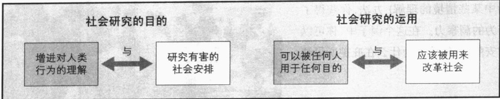

正如图 1.2 所示，在社会学的应用上也存有争议。那些主张理解是社会学应有目标的人认为，通过社会研究获得的知识属于科学共同体（scientific community，即科学家群体）和全世界。相应地，它可以被任何人用于任何目的。相反，那些主张社会学家应该关注有害社会条件的人则认为，社会学家应该成为社会变革的先锋。他们说，社会学家应该运用其研究来减缓人们的痛苦并使社会变得更加美好。

尽管这场讨论远比这里总结的要更为复杂(很少有哪位社会学家会采取极端态度)，但这里的简述已经列出了它的主要问题所在。也许社会学家约翰·加勒赫(John Galliher,1991)最好地表达了当今多数人的立场：

有些人认为社会学家与政治家和宗教领袖不同，他们要做的应该只是描述和解释世界上发生的事情，而不应该根据这些观察作出价值判断。但在一个经历过大屠杀的世界，在一个曾有过奴隶制的世界，在一个永远有强奸和其他性犯罪威胁的世界，在一个社会高层中有着频繁的、未受惩罚的犯罪的世界——包括工厂主明知会造成死亡和伤害却仍然组织生产（如石棉和烟草工业）并将继续生产下去，在一个正因一些大型跨国公司造成的污染而渐渐死去的世界，价值无涉和不加判断的社会科学毫无立足之地。

### “理解”与社会事实

### 韦伯和“理解”

韦伯还强调：要理解人类行为，我们应用“理解”（Verstehen，德文单词，意为“去理解”）的方法。或许对这个词最恰当的表述是“通过洞察去把握”。通过强调“理解”，韦伯认为对人类行为最好的解释者是“一直在那里”的人，是能理解被研究者的感受和动机的人。简单来说，我们必须注意被称为“主观意义”（subjective meanings）的东西，即人们解释自己行为的方式。韦伯坚持认为，我们不可能理解人们在做什么，除非我们注意到人们如何看待和理解自己的行为。

为了更好地理解这个术语,我们不妨回到本章开篇的小短文中。那些男人为什么如此安静?为什么他们与那些挤满宿舍和食堂的吵闹的、有时甚至是喧闹的大学生会如此不同?

“理解”方法可以帮助解释这一现象。当我们访问庇护所里的男人(  $ \underset{\cdot}{以} $ 及其他情况下那些无家可归的妇女)时,他们显露出绝望之色。由于你至少在某种程度上知道人们的绝望情绪是怎么回事,你就可以马上理解他们的处境。你知道绝望中的人看不到希望。未来是如此苍白,几乎不值得走下去。那么,它还值得去谈论吗?谁还想去听另一个倒霉的故事?

---

通过运用“理解”（你对它对人意味着什么和你对生活中某些情境的理解）方法，你获得了理解人们行为的洞察力。在这个例子中，你可以理解他们的安静，理解他们为什么在庇护所里缺乏沟通。

### 涂尔干和社会事实

与韦伯对“理解”和主观意义的强调不同，涂尔干则强调他所说的“社会事实”(social facts，即一个社会群体特有的行为方式)。在美国，社会事实的例子包括六月是结婚最多的一个月、老年人自杀率较高、星期二是一周内出生人数最多的一天等。

涂尔干认为，我们必须用社会事实来解释社会事实。或者说，每个模式都反映了社会的某些状况。全国各地的人们并非出于巧合而做类似的事情，无论是结婚还是自杀。如果是出于巧合，在

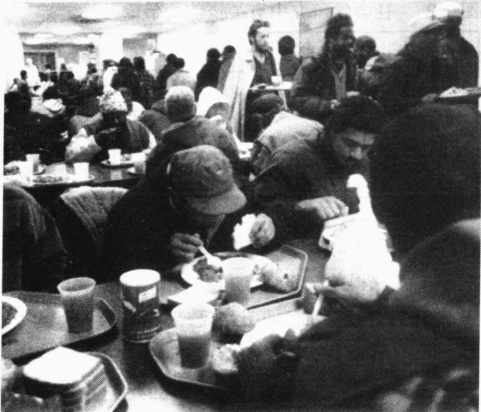

由于贫困无助，无家可归者显然不会持乐观主义的态度。这幅纽约市曼哈顿下城基督教慈善机构包厘街救济所(The Bowery Mission)的图片很典型，它让我回想起在为穷人免费提供食物的施食处吃到的食物、遇到的人。

某些年份中，中年人会最有可能自杀，而在另一些年份则会是年轻人，等等。长年保持不变的模式表明，在千百万人作出他们的个人决定时，他们受到了某种社会条件的影响并作出了反应。社会学家的工作正在于发现这些社会事实并通过其他社会事实加以解释。下面就让我们看一看我提到的这些关于婚姻、自杀和出生的社会事实是如何被其他社会事实所解释的。

### 社会事实怎样与“理解”结合在一起

社会事实和“理解”密切相连。作为美国社会的一员，你知道六月的婚礼与学年结束有关。它受传统共同情感和广告的影响，并具有自己的趋势。关于老年人的自杀(见第13章)，你可能已经知道许多这个年龄的美国人有更多的绝望感。这都是你对社会事实的“理解”。

但你知道为什么星期二出生人数最多吗？你可能会觉得星期二没有什么不一样的。以前或许如此，但现在就不同了。要理解这一变化，我们需要把社会事实与“理解”结合起来。这里有四个相关的社会事实：第一，因为技术发展，医院已经成为美国医疗系统中一个决定性的力量；第二，目前的技术使剖腹产手术很安全；第三，如在第19章将会看到的，医生们掌管婴儿的分娩；第四，利润是美国执业行医的头号目标。作为这些社会事实的一个结果，原来作为紧急情况下最后手段的手术变得如此普遍，以至于近四分之一（23%）的美国婴儿都是以这种方式出生的（Statistical Abstract 2002: Table 79）。这个比例在世界上也是最高的（Wolff et al., 1992）。

如果我们把“理解”加到这些社会事实上，我们看到的就不只是一些冷冰冰的统计数字。我们知道，大多数即将成为妈妈的人都更希望在医院分娩，而且在这样一个心情紧张的时刻，面对着医生的强大影

---

响,她们几乎别无选择。我们还知道,对医生服务的需求很紧张,医生经常都是根据他们最方便的时间来安排接生,而星期二对他们来说就是最合适的时间。

### ☑ 早期社会学中的性别歧视

### 当时的态度

你可能已经注意到了,我们已经讨论过的社会学家都是男性。在19世纪,性别角色是被严格定义的,女性的角色就是妻子和母亲。在经典的德语短语中,妇女被期望围绕四个K——Kirche、Küchen、Kinder与Kleider（教堂、做饭、儿童和衣服）——生活。如果试图打破这种模式,就会招致严厉的指责。

无论男性还是女性，当时很少有人受过比基本读写更高的教育。少数人接受的高等教育也是仅为男性设立的。但是，一些富裕家庭的妇女也接受了高等教育，有些甚至还学习了社会学。但大学中根深蒂固的性别歧视，阻止她们获得高等学位或成为教授。与其时代相符，女性作品几乎被完全忽略。例如弗罗霍克(Jane Frohock)、莫特(Lucretia Mott)和斯坦顿(Elizabeth Cady Stanton)在一个小圈子之外几乎无人知晓。弗朗西丝·珀金斯(Frances Perkins)，一位社会学家和内阁成员中的首位女性(时任罗斯福总统的劳工部长)也不再被人们提起。

### 马蒂诺和早期社会研究

一个典型的例子是马蒂诺(Harriet Martineau，1820—1876)，她出生于英国一个富裕的家庭。当马蒂诺开始分析社会生活的时候，如果有人进来，她会把自己的作品藏在针线活下，因为写作是“男人的事”，而针线活则是“女人的事”(Gilman，1911：88)。尽管如此，马蒂诺一直坚持自己的兴趣并最终研究了英国和美国的社会生活。1837年，也就是涂尔干和韦伯出生前二三十年，马蒂诺出版了《美国社会》(Society in America)，介绍了这个新国家的风俗——家庭、种族、性别、政治和宗教。尽管她对美国生活的洞悉直到今天仍值得一读，但马蒂诺的研究却同其他早期女性社会学家的作品一样无人知晓，直到近来才被人注意。而她为人所知主要还是因为她把孔德的思想介绍到了英国。下面的“现实社会学”专栏介绍了《美国社会》的一些内容。

### 北美的社会学

### 早期历史：社会改革和社会分析之间的紧张

19世纪晚期被移植到美国的社会学，1890年首先在堪萨斯大学扎根，1892年被引入芝加哥大学，1897年被引入当时的黑人大学亚特兰大大学。从此，社会学传遍北美。然而，它的发展却是平缓的。麦克吉尔大学直到1922年才成立了加拿大的首个社会学系。哈佛大学直到1930年、加州大学伯克利分校直到20世纪50年代才成立社会学系。

起初，由斯莫尔(Albion Small, 1854—1926)创立的芝加哥大学社会学系主导了北美社会学(斯莫尔也是《美国社会学杂志》的创办者，并在1895—1925年间担任主编)。在这一早期的社会学系中涌现

---

### 现实社会学

### 听听一位早期女性主义者的话

1834年9月，一位来自英国的早期女性主义社会学家马蒂诺，开始了其为期两年的美国之行。她坐着公共马车到处旅行，既访问穷人们，也访问了美国前总统詹姆斯·麦迪逊。她与奴隶主和废奴主义者进行交流，参观监狱，参加美国高等法院的开庭。她在这次旅行中观察到的美国妇女状况都选自其1837年出版的《美国社会》一书。

### 关于妇女不被允许投票：

《独立宣言》中的一个基本原则是政府在被治理者的许可下获得合法权力。妇女的政治情况能与此相符吗？

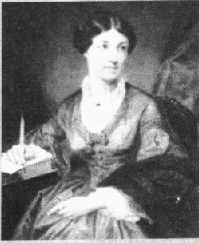

美国的政府有权向拥有财产的妇女征税、罚款、监禁，甚至可以因某些罪名处死她们。政府的权力从哪里来呢？他们是“不公正的”，因为他们没有从被治理的妇女那里得到许可……

### 关于性、奴隶以及南方白人妇女与男子的关系：

民主原则认为这是错误的，并要求所有理性的人是平等的政治代表。儿童、白痴、罪犯……是仅有的例外……

[美国白人妇女]都很早结婚……不幸的女性一直以来就是奴仆式的性别阶级，[女奴般地]成为白人男性奴隶主的泄欲工具……[大多数]男人对妻子隐瞒不忠而妻子必定是最后知晓的……根本就没有什么有益健康的信赖和同情。妇女仅仅成为丈夫房子里的装饰品，是他产业的管家，而不是无话不谈的知心朋友……让我痛心的是，我看到南方丈夫们对妻子所谓的礼节、殷勤根本就谈不上是爱……我知道当男人们与妇女交谈时，他们谈

由于热衷于社会改革，哈丽亚特·马蒂诺（1802—1876）转向了社会学，在那里她发现了孔德的著作。她是一位积极的废奴主义者，并且到处旅行。她的考述题材广泛且内容深刻。

论的问题、说话的方式和口吻，与男人们之间的对话是多么的不同。我听到有人在吹嘘他们对妇女是如何有骑士风度，好像妇女们都生活在天堂里，实际上我却看到妇女们因自尊被伤害而感受到的某种痛苦，以及那些看到这种体系的空洞无物的人听到这些吹嘘时所感受到的与内心企望相悖之痛……

### 关于妇女的教育：

妇女的才智受到不公正的限制……因为妇女被认为没有什么需要扩大的教育帮助实现的人生目标，故她们没有受到应有的教育……她们被教授一些东西以打发时间，谈话得体，成为丈夫的助手，教教孩子什么的……却没有人鼓励她们从事学术活动……只要妇女被排斥在男人们受训从事的活动目标以外……她们的学术活动就是危险的，或者正如人们所说，是不合适的。因此，婚姻是对妇女开放的唯一目标。

出了许多至今仍有深远影响的社会学家，如罗伯特·帕克(Robert Park，1864—1944)、欧内斯特·伯吉斯(Ernest Burgess，1886—1966)和乔治·米德(George Mead，1863—1931)。米德发展了符号互动论，我们将在后面介绍这一理论。

北美妇女的状况与欧洲妇女类似，她们对社会学的贡献也遇到了同样的命运。早期的女性社会学家包括简·亚当斯、埃米莉·格林·鲍尔奇、伊莎贝尔·伊顿、索菲·杰曼、夏洛特·吉尔曼、艾丽斯·汉

---

密尔顿、弗洛伦斯·凯利、埃尔茜·帕森斯、艾丽斯·保罗等。因为不能得到社会学教职，她们中的许多人都成为了社会活动者(Young，1995)。

因为这些妇女中有些人与穷人一起工作，而不是成为大学里的社会学教授，许多社会学家都把她们归类于社会工作者。今天，社会学与社会工作之间的界限非常清楚。有一种叫社会工作的职业。人们接受社会工作训练，受雇从事社会工作，并称自己为社会工作者。他们帮助穷人和不适应社会生活的人，在医院和学校以及公共救助领域里工作，有些人则成立了私人诊所并为病人提供咨询。但在社会学发展的早期，社会学与社会工作之间几乎没有区分。这种模糊状况持续了很多年，许多系都是社会学与社会工作在一起，有些系至今仍是如此。

### 亚当斯与社会改革

许多北美社会学家都把社会学与社会改革结合起来，其中最成功的是亚当斯(Jane Addams，1860—1935)。与马蒂诺一样，亚当斯也出身于富贵之家，她曾就读于费城女子医学院，后来因病退学(Addams，1910/1981)。她曾多次去欧洲旅行，其中一次，伦敦穷人的救助工作给她留下了深刻印象。从此以后，她就开始为社会公正而不懈地工作。

1889年，亚当斯与他人共同在芝加哥臭名昭著的贫民窟创立了“赫尔大厦”，对需要避难的人（如移民、病人、老人、穷人）提供帮助。附近芝加哥大学的社会学家也经常到“赫尔大厦”来。凭借她对社会阶级敏感的洞察力，特别是工人如何被剥削以及农民移民如何适应城市生活的了解，亚当斯试图在社会强势与弱势之间搭起桥梁，弥补其鸿沟。她与别人一起争取八小时工作制，并促成立法反对童工，为社会改革付出巨大努力。1931年，她与别人共同获得诺贝尔和平奖，成为唯一获此殊荣的社会学家。

### 杜波依斯与种族关系

面对当时的种族主义，非裔美国专业人员的生活也十分困难。这方面最著名的例子是杜波依斯（W.E.B. Du Bois，1868—1963），他在费斯克大学获得学士学位后，成为第一个获得哈佛大学博士学位的非裔美国人。在柏林大学期间，他曾上过韦伯的课程。在柏林大学结束其教育之后，杜波依斯在威尔伯弗斯大学教授希腊文和拉丁文。1897年他受雇于亚特兰大大学，在那里度过了其大部分学术生涯（Du Bois，1935/1966）。

今天人们已经很难想象杜波依斯曾经面对过的种族主义。例如，他曾看到在佐治亚州一个肉铺里展示着私刑切下的手指(Aptheker，1990)。杜波依斯在1909年被邀请为美国社会学会会议提供论文。尽管他受过

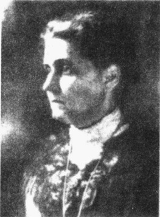

简·亚当斯（1860—1935），诺贝尔和平奖获得者，曾为贫苦的移民积极工作。她与埃伦·G. 斯塔尔一起在芝加哥创立了“赫尔大厦”，一个帮助移民的中心。她也是一位争取妇女权利（妇女普选权）运动以及第一次世界大战中和平运动的领袖。

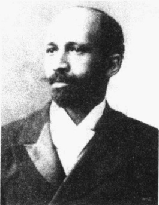

W (illiam)·E (dward)·B (urghardt)·杜波依斯(1868—1963)终生研究非裔美国人和白人的关系。与许多早期北美社会学家一样，杜波依斯认为社会学家也应当是社会改革家。他也是当时有影响的杂志《危机》(Crisis)的编辑。

---

良好教育，拥有大学教职并且成就斐然，他却没钱参加。当他勉强参加后来的会议时，当时盛行的种族歧视却使他不能与白人社会学家一起吃饭，也不能住在同一房间。当他晚年有钱去旅行时，美国国务院由于害怕他会批评政府而拒绝给他签发护照（Du Bois，1968）。

从 1896 年到 1914 年，杜波依斯每年都就非裔美国人与白人的关系出版一本书。在他近 2000 篇作品中，《费城黑人》（The Philadelphia Negro，1899/1967）最为出色。他分析了费城非裔美国人如何应对种族主义并指出，一些较为成功的非裔美国人切断了他们与其他非裔美国人的纽带，以求获得白人的承认。他认为由于剥夺了他们的影响，从而削弱了非裔美国人的社区。《黑人乡亲的灵魂》（The Souls of Black Folk，1903）是杜波依斯的一本细致描述美国内战刚结束时种族关系的用心之作，下面的“现实社会学”专栏的内容就来自这本书。

## 现实社会学

### 北美早期的社会学：杜波依斯与种族关系

杜波依斯表达社会学思想的方式更像是一位老练的小说家，他的著作在社会学界长期被人忽视。为了弥补这一疏漏，我在这里摘录了《黑人的灵魂》(1903)第66—68页中的几段话。在这本书中，杜波依斯分析了美国内战之后30年中非裔美国人社会和经济状况的变化。当杜波依斯在费斯克大学上学时，有两个夏天他在田纳西农村与世隔绝的“山里面”一所木屋学校中教书。下面的节选可以帮助我们了解那时的状况。

学校开学是在7月下旬一个炎热的上午。听到孩子们在土路上踢踢踏踏的脚步声，看到孩子们一张张庄重的小脸和一双双明亮而又渴望的眼睛，我的心微微地有些颤抖……他们坐在粗糙的长凳上，约有30人，脸色从浅灰到深棕色不等，光着的小脚晃荡着，眼神中充满期待，间或有一丝调皮闪过，手中则捧着蓝黑色韦伯斯特拼写课本。我爱我的学校，孩子们对老师的信任真是太棒了。我们在一起读书，拼写，写作，采花，唱歌，倾听山外世界的故事……

星期五晚上我常和一些孩子一起回家，有时就到多克·伯克的农场。他是一位高大消瘦、声音洪亮的黑人。他一直都在不停地工作，想要买下他所住的那块30平方公里的山地和谷地。但人们都说他一定会失败，“白人不会给他留下什么。”他的妻子是一位了不起的高大强悍的女性，藏红色的脸庞，闪亮的头发，不穿胸衣，赤着脚。孩子们也都光着脚，看起来很健壮。他们住在农场里靠近小溪的凹地中一个一间半的小木屋里……

为了维护秩序，我经常必须去那些生活不太美好的地方。例如，泰尔迪的妈妈脏得一塌糊涂，鲁本的食物总是不够，艾丁塞斯的床上有成群的虫子爬来爬去。我最喜欢去约瑟家，坐在门廊里，一边吃桃子，一边听来回忙碌着的妈妈说起约瑟如何买的缝纫机；如何在冬天出去做仆人却只得到“可怜兮兮”的4美元月薪；约瑟多么地想去上学，但他们却“不太可能”有多余的能力帮助她；庄稼歉收，并也没打好，以及有些白人是多么吝啬卑鄙。

有两个夏天我一直住在这个小小的世界里……我把我这个小小的社区叫做小世界，它也的确是与世隔绝。但是，在葬礼、婚礼和婴儿降生的时刻我们却有着共同的欢乐和悲伤，在贫穷、贫瘠的土地和低工资中我们一起体验到生活的艰辛，特别是，我们也一起看到那阻挡我们成功的屏障（即种族之幕，指种族如何笼罩着所有的人际关系。杜波依斯的希望是“在某个时候、某个地方，人们能够根据心灵而不是肤色来评价一个人”）。一种朦胧的共同意识就在我们中间游荡。所有这一切都让

---

我们一起思考；但这些(当时机成熟时)将会以各种语言被说出来。25年来，甚至更多年来，那些看到“主降临之光辉”的人们，在黑暗的宿命论带来的每个现存的阻挠和帮助中看到，一切都将在合适的时候在上帝的旨意下各归其位。对于那些奴隶制只是其儿时模糊记忆的人来说，世界仍让人们迷惑不解：它不向他们索取什么，他们也没有回应什么，但它却嘲笑他们的奉献。他们不明白这个谜团，因此他们要么是倦怠与冷漠，要么是无能为力，要么是不计后果的虚张声势。

起初，杜波依斯满足于收集和解释客观数据。后来，面对当时盛行的种族主义，杜波依斯转向了社会行动。杜波依斯与亚当斯和“赫尔大厦”的其他人一起，创立了“全国有色人种促进会”（National Association for the Advancement of Colored People, NAACP）（Deegan，1988）。同时，作为一位社会学家和新闻工作者，杜波依斯在与种族主义的斗争中最终接受了革命的马克思主义。在他93岁高龄时，由于对在种族关系上取得的进展过于失望，他移居加纳并在那里去世（Stark，1989）。

直到最近，杜波依斯一直被人忽视，其学术贡献也不为人知。以我为例，在我就读华盛顿大学研究生期间，我从未被介绍去了解杜波依斯的书和思想。不过，今天人们正在重新发现杜波依斯，他开始获得应有的尊重。

### 帕森斯和米尔斯：理论与改革

同杜波依斯一样，许多美国早期社会学家都认为社会学家理应也是社会改革家。他们认为社会（或者至少部分社会）是腐败的并需要改革。例如，在20世纪20和30年代，帕克和伯吉斯不仅研究犯罪、吸毒、青少年犯罪、卖淫，而且也就如何缓和这些社会问题提出了他们的建议。

在 20 世纪 40 年代，学科的重点由社会改革转变为社会理论。例如，1979）发展了关于社会的抽象模型，并影响了一代社会学家。帕森斯的模型详细地说明了社会中的各个部分如何协调一致地工作，丝毫不主张去激发社会行动主义。

米尔斯（Wright Mills，1916—1962）反对这一时期的抽象理论，要求社会学家重新回到社会改革中去。他看到由商业、政治和军界的领袖们组成的他称之为权力精英的群体的利益联合即将威胁到自由。米尔斯死后不久，美国就进入了动荡的六七十年代。这引发了人们对社会行动主义的兴趣，米尔斯的思想在新一代社会学家中大受欢迎。

### 持续的紧张和应用社会学的兴起

在社会学中，分析社会与改革社会这两种明显冲突的目标取向导致了持续至今的紧张。一些社会学家相信他们的恰当角色就在于分析社会的某些方面，并在社会学杂志上发表其发现；另一些人则认为这样做是不够的：社会学家有责任运用他们的专业知识来使社会变得更好，并为穷人带来公正。

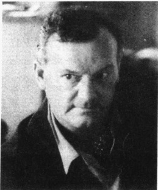

C·赖特·米尔斯是一位有争议的社会学家，他分析了美国社会中权力精英的作用。今天，他的分析已被许多社会学家和普通大众普遍接受。

---

图 1.3 基础社会学和应用社会学的比较

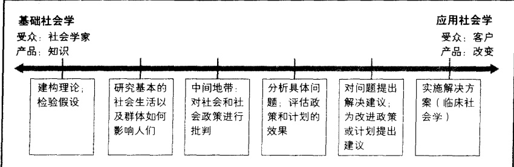

资料来源：DeMartini(1982)。

应用社会学（applied sociology）处于这两个极端之间，它运用社会学来解决问题（图1.3中比较了基础社会学和应用社会学）。应用社会学最早也是最成功的尝试之一是“全国有色人种促进会”（NAACP）的成立。今天的应用社会学家在不同的环境下开展工作（Dentler，2002；Stephens，2004），有人为商业公司解决工作场所问题，有人为政府做研究。他们调查诸如色情业、强奸、环境污染、艾滋病传播等社会问题。还有一些人在高技术行业工作。下面的“现实社会学”专栏给出了应用社会学适用的一些环境。

### 现实社会学

### 社会学的工作: 应用社会学家们做什么?

与你这门课的老师一样，大多数社会学家都在大学里教书，与大学生们分享社会学知识。相比之下，应用社会学家的工作领域就显得更加宽广，例如儿童咨询、疾病传播研究。有的则致力于使软件的界面更加“友好”（他们研究人们如何使用新的计算机产品，并将相关信息反馈给设计这些产品的软件工程师[Guice,1999]）。要了解他们丰富多彩的工作，让我们看看下面这四位应用社会学家。

莱斯莉·格林是在谢本斯堡大学获得其社会学学士学位，现在她在费城万德维尔集团做市场调研工作。她帮助开发一种使医生们开特定处方药的策略。她安排会议，指定讨论组的协调人，并为参与研究的医生支付报酬。她说：“我的社会学训练提高了我‘与人打交道的技术’。它可以帮助我理解不同群体的需要，并改善与他们的互动。”

斯坦利·卡佩拉是在福德汉姆大学获得其社会学硕士学位，现为纽约哈特塞尔人文服务机构的应用社会学家。他评估儿童计划项目（如关注住房、艾滋病、群体家庭以及学前教育）的具体工作情况如何，看看它们与原来设想的情况有何不同。他发现问题并提出解决建议。他的一项任务是研究为什么在有那么多渴望领养的父母的情况下儿童却要等上很长时间才能被收养。卡佩拉指出领养手续是如何在系统中被耽搁的，并给出了如何提高手续办理速度的建议。

劳里·班克斯也是在福德汉姆大学获得其社会学硕士学位，现在她为纽约市卫生局做数据分析工作。当她检查死亡证明时，她发现一个波兰移民社区有很高的胃癌发生率。她向“疾病控制中心”发出了警报。中心在社区作了一些访问，发现原因在于当地居民吃了太多的香肠。还有一次，班克斯比较了出生证明和学校记录。她发现出生时的问题(如体重过轻、缺少产前照料、出生综合症)与上

---

学时阅读能力差和行为问题有关。

乔伊斯·米勒·尤特卡维奇从肯特州立大学获得博士学位，现为坐落于宾夕法尼亚州伊利市开斯通大学研究公司的总裁。她也曾担任过应用社会学协会会长一职。尤特卡维奇主要为政府机构做一些研究咨询工作。在她的一项计划中，她设计了针对儿童看护者的训练项目。她还研究看护者表现如何。她的研究和项目提高了宾州公共福利部对儿童的看护水平。她的组织还管理着“宾州药物滥用和健康信息处理中心”，这个机构每月寄出超过30万份印刷品。

从以上几个例子中,你可以大致了解应用社会学家都在做些什么。有些人在为公司工作,有些人为政府和私人机构所雇佣,有些人则有自己的生意。从中你也可以看到,不一定要有博士学位才能以一个应用社会学家的身份去工作。

应用社会学不同于社会改革，它是在某些特定环境中运用社会学，而不是像早期社会学家所设想的那样去重建社会。这样社会学中又出现了新的紧张。强调社会改革的社会学家认为，应用社会学比起社会改革还差得很远，它只是把社会学应用到社会生活中，而不是去改革社会。强调发展知识的社会学家则认为，当社会学被应用于社会中时它就不再是社会学了。试想，如果社会学家用社会学原理来帮助妓女逃离妓院，这还是社会学吗？

下面我们就来看看理论是如何切入社会学的。

### 社会学理论观点

事实不会自己解释自己。在日常生活中，我们利用常识来解释看到的事物，把所观察到的事物或“事实”放在一个或多或少相互联系的概念框架中。社会学家也是如此，但他们把其观察的事物放在被称为“理论”的概念框架中。一个理论（theory）是关于世界的某些部分是如何关联在一起以及它们如何发挥作用的一般陈述，它是对两个或更多的“事实”如何相互联系的一个解释。

社会学家常用三种主要理论：符号互动论、功能分析论和冲突论。让我们先来看看这些理论的主要要素，然后看看各个理论如何帮助我们理解美国为何有如此高的离婚率。在这个过程中，你将会看到每个理论或观点如何提供了一个对社会生活的不同解释。

### 符号互动论

符号互动论（symbolic interactionism）的起源可以追溯到18世纪苏格兰的一些道德哲学家，他们注意到，个人通过把自己与他人进行比较来评价他/她自己的行为（Stryker，1990）。在美国，有一大批思想家都属于这个分析思路，包括具有开创性的心理学家詹姆斯（William James，1842—1910）、教育家杜威（John Dewey，1859—1952），他们分析了人们如何使用符号从其体验中获取意义。这一理论观点由库利（Charles Horton Cooley，1864—1929）、托马斯（William I. Thomas，1863—1947）和米德（George Herbert Mead，1863—1931）引入社会学。我们将在第3章讨论库利和米德关于符号如何成为自我概念基础的分析。

日常生活中的符号 符号互动论者研究人们如何使用符号（我们赋予意义的事物）以形成他们对世

---

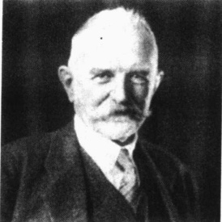

乔治·赫伯特·米德（1863—1931）是社会学重要的理论观点——符号互动论的创始人之一。他执教于芝加哥大学，在那里他的讲座颇受欢迎。尽管他著述不多，但在他去世后，他的学生把他的讲座编成了一本有影响的书——《心智、自我与社会》。

界的看法并相互沟通。没有符号，我们的社会生活不会比动物生活更复杂。例如，没有符号我们就没有姑姑或叔叔、老板或老师，甚至没有兄弟姐妹。我知道这听起来很怪，但正是符号给我们定义了关系是什么样的。当然，人们还会生育，但没有符号我们就不知道我们与亲属的关系是什么，我们将不知道对谁应当尊敬和感激，对谁我们享有特权，也即不知道构成我们关系的东西是什么。

不妨这样看：如果你把某个人看做你的姑姑或叔叔，你会是一种表现；但是如果你把那个人看做你的男朋友或女朋友，你的行为将会完全不同。是符号告诉你，你和其他人是什么关系，以及你应当如何对待他们。

为了使这更容易理解，假设你彻头彻尾地爱上了一个人并且明天你们就要结婚，但就在结婚前一天晚上，你妈妈却向你坦言她在结婚前有过一个孩子并送人收养，而这个孩子正是你要与之结婚的那个人。你可以看到符号如何在一夜之间改变！而你的行动也会改变！

符号不仅使亲属关系得以存在，也使社会得以存在。没有符号，我们无法协调自己与他人的行动，无法为将来约会的时间和地点制定计划。不指定时间、材料、规格或目标，我们无法建造桥梁和高速公路。没有

符号，也将不会有电影和乐器，我们将不会有医院、政府、宗教，你正上的课也将不会存在——就连这本书也不会存在。好的一面是也不会有战争了。

简单来说，符号互动论者分析我们的行为如何依赖于我们定义自己和他人的方式。他们研究面对面的互动，了解人们如何与人相处，如何从生活中以及他们在其中的位置中得出意义。他们指出，甚至自我也是一个符号，因为它包含了我们拥有的关于我们是谁的观念。而且自我是一个不断变化的符号：当我们与他人互动时，我们不断地根据对他人反应的解释调整对自我的看法。关于这些我们后边还会谈到。

符号互动论应用 为了更好地理解符号互动论，我们来看看变化中的符号(意义)是如何帮助解释美国的高离婚率的。你需要了解的背景知识是：婚姻曾被视为终生的承诺，离婚被认为是不道德的，是对公众意见的公然违背，是对成人责任的抛弃。

1. 情感满足。渐渐地，婚姻的意义开始发生变化。1933年，社会学家奥格本观察到个性在配偶选择中正变得越来越重要。1945年，社会学家伯吉斯和洛克注意到婚姻中共同的感情、理解和和睦共处日益增长的重要性。这些社会学家观察到了美国婚姻中一个根本性的转变：丈夫和妻子正在越来越希望和要求对方给予更高的情感满足。

当这种趋势加剧时，亲密感就成为婚姻的核心，美国人也更加看重配偶的身体吸引力（Bus et al., 2001）。与此同时，当社会变得日益复杂和非个人化时，美国人把婚姻看做是对社会紧张的一种解决方案（Lasch, 1977）。这种新的“伴侣式婚姻”导致离婚率上升，因为它鼓励人们去苛求他们的配偶满足“每一个和所有的需要”，因此社会学家说，婚姻成为一个“超载的制度”。

2. 爱的象征。我们关于爱的象征也导致了“超载”的婚姻。人们以为“真爱”会是情感满足的永恒源泉，然而这种期待却使人们陷入破灭的希望之中。因为当婚姻中不可避免地出现不满意时，配偶们会就他

---

们认为的对方的错误相互指责。结婚时爱的象征冲昏了他们的头脑，使他们看不到各自不现实的期望。

3. 孩子的意义。对孩子的看法已经发生了历史性的转变，并为美国家庭带来了深远影响。在中世纪欧洲，孩子被看做是缩小的大人，在成人与儿童的世界之间没有明确的区分(Ariés，1965)。男孩大约7岁就开始当学徒，同龄女孩则学习做与成为妻子有关的家务活。在仅仅三代人之前的美国，孩子八年级毕业后就“成为大人”并开始工作。今天的变化令人吃惊：文化塑造了孩子敏感、脆弱和无辜的形象，而不再是缩小的大人。

4. 父母的意义。这些改变了孩子的观念也深刻地影响到我们对什么是好父母的理解。今天的父母不仅被要求提供无尽的爱和悉心的照顾，而且还要保证他们的孩子“充分发挥潜能”。今天，抚养孩子的时间更长，要求也更高。这些更大的责任给今天的父母增加了更多的负担，也给婚姻带来了更多的紧张。

符号互动论者分析家庭关系是如何随时代变化的，以及这些变化是如何影响离婚的。每个家庭依据其特有的经验也发展出独特的视角。你认为这幅图片中的人会如何看待其家庭关系？

5. 婚姻中的角色。在上几代人的婚姻中，丈夫和妻子的责任和权利是被明确规定了的。新婚夫妇很自然就知道他们可以从对方那里要求什么。今天的情况则大不一样，夫妇双方必须在更模糊的标准中自行确定在各个层面各自担当的角色。许多人都不得不费力地去划分各自在工作、家庭和孩子问题上承担的责任。

6. 对其他选择的认知。在这些变化发生的同时，社会又出现了另一个重要转变：越来越多的妇女外出工作。当拿到自己的工资时，许多妻子都开始考虑要不要将这场不幸福的婚姻延续下去。符号互动论者认为，对其他选择的认知是使离婚成为可能的重要的第一步。

7. 离婚的意义。当这些因素(要求婚姻中更多的情感满足、改变了的婚姻与父母角色、对不幸婚姻的其他选择的新认知)聚到一起时，离婚就开始稳定地增加。如图1.4所显示，离婚从1890年的几乎为零，增长到我们目前的每年110万(1980年以来，结婚和离婚的平缓态势可能是同居增多引起的)。

随着离婚越来越普遍，它的意义也发生了变化。曾经意味着失败(以及不道德和不负责任)的离婚，今天却具有了“自由”等新的意义。离婚不再是一件可耻的事情——以往限制丈夫和妻子们离婚的这一强大约束被瓦解了——促成离婚率大幅增加。

8. 法律的变化。当法律(其本身就是一个强大的符号)开始反映这些变化了的有关离婚的观念时，它成为又一个鼓励离婚的因素。离婚原本只是在有诸如通奸这样严格理由的情况下才能被批准，但立法者后来使“不和睦”也可以成为离婚的理由。各州后来则实行“无过错”离婚，夫妻不必指责对方的过错就可以离婚，一些州甚至开始提供自助离婚套件服务。

---

图 1.4 美国的结婚,美国的离婚

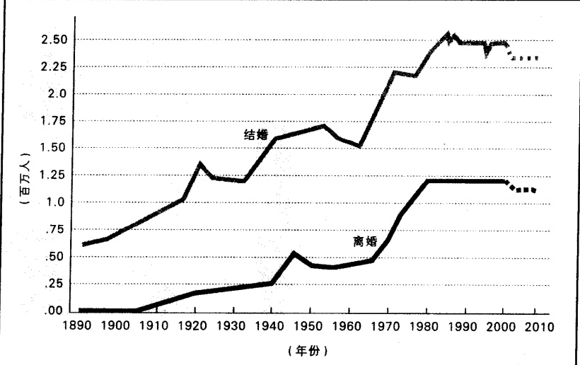

资料来源：作者根据 Statistical Abstract 1998: Table 92 以及以往年份的 Statistical Abstract, Population Update 2000 年版整理而成。虚线部分为作者的预测。

### ▷▷小结

符号互动论者借助于与婚姻和离婚有关的符号(或意义)的改变来解释不断增长的离婚率。人们对离婚、婚姻满足、爱情、孩子和父母抚养的性质、丈夫和妻子的角色等观念的改变，使得婚姻更加脆弱。没有哪一个单独的变化是确切的原因，但放在一起，这些变化强有力地“推动”了离婚。

这些变化是好是坏？符号互动论的核心立场是：要对一个变化（或其他任何事情）作出价值判断，需要事先有一个看待变化的价值框架。符号互动论不提供这种价值框架。简单来说，同其他社会学家一样，符号互动论者可以分析社会变革，但却不能对其加以价值评判。

### 功能分析

功能分析的核心思想是社会是田相互联系、协同反挥作用的各个部分构成的一个整体。功能分析也被称为功能主义和结构功能主义，它可以追溯到社会学的创始人那里(Turner,1978)。孔德和斯宾塞把社会看做某种活的有机体。他们认为：正如人或动物有一起发挥功能的各种器官，社会也是如此。像有机体一样，如果社会要运行顺畅，它的各个部分必须协调工作。

涂尔干也把社会看做是由许多部分构成，每个部分都有自己的功能。当社会的各个部分都实现其功能时，社会就处于“正常”状态；如果不能实现其功能，社会就处于“不正常”或“病态”状态。因此，要理解社会，功能主义者主张应该同时注意结构(社会的各个部分如何构成一个整体)和功能(每个部分在做什么，它对社会有何贡献)。

---

默顿和功能主义 默顿(Robert Merton, 1910—2003) 放弃了有机体类比,但他仍坚持功能主义的核心观点——把社会视为一个由各部分协同工作而构成的整体。默顿的“功能(functions)”一词指的是人们行动的有益结果:功能有助于使一个群体(社会、社会系统)保持平衡,而反功能(dysfunction,也译功能失常)则是危害社会的结果:它们破坏了系统的稳定。

功能既可以是显性的也可以是隐性的。如果某个行动是明确地有助于系统的某部分，它就是一个显性功能（manifest function）。例如，假如政府官员对我们不断降低的出生率感到担忧，国会决定给已婚夫妇每个出生的孩子一万美元的补贴，这个补贴的意图或其显性功能就是有意增加儿童的出生。默顿指出，人们的行动也可以有隐性功能（latent function），它们可能会产生有助于系统进行调整的预料不到的结

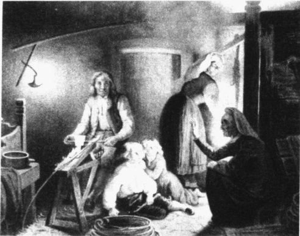

运用功能主义视角的社会学家强调工业化和城市化如何破坏了家庭的传统功能。在工业化之前，家庭成员一起工作，家庭是一个经济单位。随着家庭生产功能的弱化，父亲走出了家庭，然后是母亲。这导致了一个重大的反功能，即家庭纽带的削弱。本图是19世纪的一幅版画。图中，一位木匠正在工作，他的母亲在给孩子们（以及大人）讲故事，而他的妻子则在做晚饭。

果。比如，假如补贴发挥了作用，出生率上升了，它也会引起尿布和婴儿家具销售的增长。因为这些生意带来的好处并非出于事先的考虑，所以它们就是补贴的隐性功能。

当然，人们的行动也可能破坏一个系统。因为这些后果通常并非事先的意图，默顿称其为潜反功能（latent dysfunctions）。比如，假设政府没有为补贴系统指定一个“终止点”，为了得到补贴，有人就会不停地要孩子，然而生的孩子越多，他们就越需要下一笔补贴以求生存，从而使大型家庭变得日益普遍，贫困也会随之增长。福利改革被重新采纳，收税暴增，整个国家陷入一片抗议声中。因为这些结果并非事先的意图，也因为它们打破了社会系统，它们也就反映了补贴计划的潜反功能。

### ▷▷小结

从功能分析的视角来看，群体是一个功能运行单元，每个部分都与整体有关联。当我们研究一个较小部分的时候，我们需要通过寻找它的功能和反功能以看清它如何与较大的单元相关联。这个基本方法可以被用在任何社会群体上，无论是社会整体、一所大学，还是一个小家庭。

功能分析应用 现在让我们把功能分析应用到美国离婚率这件事上。功能主义者认为工业化和城市化破坏了家庭的传统功能。让我们看看家庭的每个基本功能都是如何变化的。

1. 经济生产。在工业化之前，家庭是一个经济单位。当时获得基本的生活必需品并生存下去是很困难的。家庭成员不得不通力合作以生产出他们需要的东西。当工业化把生产从家庭移至工厂，它瓦解了家庭生产单位。这削弱了把家庭成员凝结在一起的纽带，特别是丈夫—父亲离家到工厂工作，这使

---

他们脱离了家庭的日常生活。另外，妻子—母亲和孩子对家庭经济生存的贡献也较少。

2. 儿童的社会化。在这一巨变中，政府变得越来越强大并接管了许多家庭功能。例如，学校把教育儿童的功能从家庭中移走，它们也承担了儿童社会化的更多责任。为了保证家庭配合这一变化，各州通过法律要求儿童入学，并威胁要把不送子女上学的父母关进监狱。

3. 对病弱老人的照顾。随着医疗训练和技术的不断进步，制度化的医疗日益强大，对病人的照料渐渐地从家人转移到外部的医疗专业人士手中。随着中央政府的扩张，它的机构不断膨胀，对老年人的照顾也从家庭事务变成了政府职责。

4. 娱乐。当美国人手中拥有更多的可支配收入时，与之相对应的娱乐行业也在竞争中迅速发展壮大，这大大削弱了家庭的娱乐功能。更多的娱乐和“乐趣”渐渐远离家庭，人们转而外出花钱购买娱乐。

5. 性控制。席卷全国的巨大变化也影响到家庭在控制人们性行为上的作用。传统上只有婚内性关系才被认为是合法的，尽管这种价值观更多只是一种理想而非现实，因为即使清教徒也有许多婚外性行为(Smith and Hindus, 1975); “性革命”为婚外性提供了许多选择。

6. 生育。似乎唯一剩下的家庭功能就是生育，但即便是这样一个似乎不可侵犯的功能也受到了挑战。一个重要的例子就是出现了越来越多的单身母亲，三分之一的婴儿都是未婚出生（Statistical Abstract 2002: Table 74）。甚至学校和医生也接管了一些原本属于家庭的对生育的控制措施。例如，一位已婚妇女可以不经丈夫同意就人工流产，而一些美国高中则给学生分发安全套。

### 往昔生活一瞥 要理解家庭功能上所发生的巨大变化,不妨看看 19 世纪的家庭生活是什么样的。

当非不生病的时候，他的妻子安照料他。她为他做饭，喂饭，换床单，为他读《圣经》，喂他吃药（当然她还要操持家务，照看6个孩子）。菲尔的6个孩子们都围绕在他身边，并承担了一些属于他的家务活。

当菲尔去世的时候，男性邻居和亲属们制作了棺材，他的母亲和其他女性朋友为他洗净身体并穿好衣服，然后菲尔被“摆放”在前厅(正式起居室)，朋友们、邻居们、亲属们来看他并最后一次致敬。从这里朋友们把他的遗体移到教堂，做最后的告别，然后将其送往他们亲手挖成的墓穴。

从上例中我们可以看出，家庭曾经有过很多功能，要处理许多生活和死亡方面的事务。而今天我们却把这些事务都交给了外界机构去做。过去不仅对病人的照料几乎全部由家庭承担，就连死亡(从处理遗体到埋葬)也是家庭事务。今天我们则认为这些功能“理应”由专业机构去做，很少有人能想象自己会为亲属的遗体准备入殓。这些行动甚至看上去都很怪异，几乎带有一些野蛮色彩。这是因为我们目前的习俗引导着我们的感觉，这也是社会生活另一个有趣的方面(我们将在第3章讨论有关情感的话题)。

### ▷▷小结

家庭已经失去了它的许多传统功能，而其剩下的一些功能也正受到侵蚀。其中特别重要的是经济生产上的变化，家庭已不再是丈夫和妻子相互依赖同心协力完成一件共同成果的基于家庭的事情。今天的丈夫和妻子各拿各的工资，越来越成为非个人性的、跨国甚至全球系统中的独立成分。当外界机构

---

在19世纪，美国的贫穷很普遍。大多数人穷得只能负担生存所必需的吃、穿和取暖费用。大多数人只读几年书，更多的正式教育是奢侈品。这幅图片描绘了杜波依斯所接触的人的生活状况(参见前面的“现实社会学”专栏)。

接管家庭功能后，家庭变得更加脆弱，离婚率的增加也就不可避免。家庭成员共同完成的功能越少，他们之间能够帮助丈夫和妻子解决生活中不可避免问题的“联系纽带”也就越弱。

### 冲突论

冲突论为社会生活提供了第三个视角。不同于功能主义者认为的社会是一个各部分协调工作的和谐整体，冲突论者强调社会是由激烈争夺稀缺资源的竞争性群体构成。尽管表面上也会有联盟和合作，但隐藏在表面之下的却是对权力的争夺。

马克思和冲突论 冲突论的创立者马克思，见证了改变欧洲的工业革命。他看到农民离开土地到城市寻找工作，却不得不接受仅够维持生活的工资。恶劣的生活条件使工人平均只能活到30岁，而富人则平均活到50岁（Edgerton，1992：87）。马克思为这里的苦难和剥削所震动并开始分析社会和历史，从而提出了冲突论（conflict theory）。他的结论是：人类历史的核心就在于阶级斗争。在每个社会里，都有一些小群体控制着生产资料，并剥削那些没有控制权的人。在工业社会，斗争是在资产阶级（bourgeoisie，即拥有生产资料的资本家小群体）与无产阶级（proletariat，即受资产阶级剥削的工人大众）之间展开的。资本家还控制着政治，如果工人敢于起来反抗，资本家就会利用其手中的国家权力对其进行镇压（Angell，1965）。

马克思作出他的评论的时候，资本主义正处在发展初期，工人们完全受其雇主摆布。他们没有我们今天视为理所当然的东西——罢工权、最低工资、八小时工作制、工间喝咖啡休息时间、五天工作制、带薪假期、医疗补贴、病假、失业补贴、社会保障。马克思的分析提醒我们，这些进步不是来自慷慨之心，而是工人与雇主斗争的结果。

---

今天的冲突论 一些持冲突论视角的社会学家在更加宽泛的意义上使用冲突论，他们认为冲突内在于所有涉及权威的关系中。他们指出：权威（authority，即人们认为合法的权力）存在于社会的每一个层面上。无论是小群体、组织、社区或是整个社会，位居权威位置的人们都要求服从，这引起了怨恨和反抗。由此在整个社会产生了不断的斗争以决定谁对什么事物拥有权威（Turner，1978；Bartos and Wehr，2002）。

社会学家科塞(Lewis Coser, 1913—2003)指出，冲突最有可能在有着密切关系的人之间产生。他们已经辨认出分配权利与责任、权力与回报的各种方式。对这种关系的任何改动都会导致情感受伤害、不满和冲突。即便在亲密关系中，人们也在不断取得平衡，而冲突就不安地隐藏在表面之下。

女性主义者和冲突论 女性主义者强调男女享有同样的权利。在男女关系中，他们看到自古以来就存在着冲突。正如马克思强调资本家和工人之间的冲突；许多女性主义者强调男性与女性之间也存在着类似冲突。然而，并非全部女性主义者都采用冲突视角，尽管一些女性主义者也比较关注男性对女性的压迫以及女性对压迫的反抗斗争。女性主义者研究所有的社会学主题，并使用任何适用的理论（女性主义将在第11章专门讨论）。

冲突论应用 为了解释为什么美国的离婚率高，冲突论者关注男女之间的关系是如何改变的。几千年来男性一直统治着女性，女性除了接受这种命运外几乎别无选择。然而在工业化的今天，女性能够在婚姻之外满足其基本生存需要。工业化也促进了女性参与家庭之外的社会世界的文化。从而，今天的女性不再背负以往被视为无可逃避的负担。她们在婚姻变得无法忍受的时候，或者只是不令人满意的时候，便有可能选择离婚。

### ▷▷小结

冲突论者认为婚姻反映了一个社会男女之间的根本不平等。传统上被视为理所当然的两性之间的权力不平等，随着妇女获得权力(特别是通过工资收入)已经发生了改变。当妻子们要求更多的平等而丈夫们反对时，离婚率自然就上升了。从冲突视角来看，离婚率上升不是婚姻弱化的表征，而是女性在她们与男性的历史性斗争中取得进展的表现。

### 分析层次: 宏观层次和微观层次

这三种理论观点之间的一个主要区别是它们的分析层次。功能主义者和冲突论者关注宏观层次（macro lever），他们研究社会的大规模模式。与之相反，符号互动论者通常关注微观层次（micro lever），关注社会互动（social interaction，即人们在他人在场时会做些什么）。其区别参见表1.1。

为了让微观和宏观两个层次之间的区别更清楚，我们不妨回到本章开始时所举的无家可归者的例子上。要研究无家可归者，符号互动论者会关注微观层次，他们会分析无家可归者在庇护所和街上时会做什么，他们还会研究无家可归者相互间的沟通，包括他们的谈话和非语言互动（nonverbal interaction，如姿态、沉默、对空间的使用等）。例如，本章开始我对庇护所里无家可归者的沉默的观察，将会引起符号互动论者的兴趣。

---

表 1.1 社会学主要理论观点

<table border=1 style='margin: auto; word-wrap: break-word;'><tr><td style='text-align: center; word-wrap: break-word;'>观点</td><td style='text-align: center; word-wrap: break-word;'>分析层次</td><td style='text-align: center; word-wrap: break-word;'>分析的关注点</td><td style='text-align: center; word-wrap: break-word;'>关键词</td><td style='text-align: center; word-wrap: break-word;'>应用分析美国的离婚率</td></tr><tr><td style='text-align: center; word-wrap: break-word;'>符号互动论</td><td style='text-align: center; word-wrap: break-word;'>微观社会学——考察小规模社会互动模式</td><td style='text-align: center; word-wrap: break-word;'>面对面互动,人们如何使用符号来创造社会生活</td><td style='text-align: center; word-wrap: break-word;'>符号互动意义定义</td><td style='text-align: center; word-wrap: break-word;'>工业化和城市化改变了婚姻角色并导致对爱情、婚姻、孩子、离婚的重新定义</td></tr><tr><td style='text-align: center; word-wrap: break-word;'>功能分析论（又称功能主义和结构功能主义）</td><td style='text-align: center; word-wrap: break-word;'>宏观社会学——考察大规模社会模式</td><td style='text-align: center; word-wrap: break-word;'>社会各部分之间的关系;这些部分如何发挥功能(产生好的结果)和反功能(产生负面结果)</td><td style='text-align: center; word-wrap: break-word;'>结构显性功能隐性功能反功能</td><td style='text-align: center; word-wrap: break-word;'>均衡随着社会变迁侵蚀家庭的传统功能,家庭纽带弱化,离婚率上升</td></tr><tr><td style='text-align: center; word-wrap: break-word;'>冲突论</td><td style='text-align: center; word-wrap: break-word;'>宏观社会学——考察大规模社会模式</td><td style='text-align: center; word-wrap: break-word;'>社会中的群体为争夺稀缺资源而斗争;精英们如何使用权力来控制弱势群体</td><td style='text-align: center; word-wrap: break-word;'>不平等权力冲突竞争剥削</td><td style='text-align: center; word-wrap: break-word;'>当男人控制经济生活时,女人由于几乎没有选择而只能维系坏的婚姻,离婚率低;高离婚率反映了男人和女人间权力平衡的改变</td></tr></table>

然而，这种微观层次却不会 $ \underset{\cdot}{吸} $引功能主义者和冲突论者的注意，他们会去关注宏观层次。功能主义者会研究社会各部分的变化如何会增加无家可归者，他们可能会注意家庭中发生的变化（更少的孩子、更多的离婚）和经济状况变化（更高的租金、更少的不需要技术的工作、海外工作的缺乏）如何导致找不到工作又没有家庭可以依靠的人陷入无家可归的状况。冲突论者对此则会强调社会阶级之间的斗争，尤其是富人的政策如何迫使某些群体失业并无家可归。他们指出，这是导致非裔美国人无家可归者人数过多的原因。第4章将关注宏观层次分析和微观层次分析的区别。

### 理论观点的综合

我们应当使用何种理论视角来研究人类行为？哪种分析层次才是正确的？正如你所看到的，这些理论观点提供了社会生活的不同图景。在离婚一例中，它们的解释与人们通常所认为的两个人仅仅是“合不来”非常不同。因为每种理论关注社会生活的不同特征，它们提供了各自不同的解释，因此我们有必要使用全部三种理论透镜来分析人类行为。通过综合它们的成果，我们可以对社会生活获得一个全面的把握。

### 决定社会学未来的趋势

有两个主要趋势标志着社会学的变化方向。让我们再来看一下社会学与社会改革的关系，然后再看一下全球化。

回到原点的社会学: 改革与研究 在整个社会学发展历史中, 在社会改革和社会分析之间一直存在着一种紧张关系。为了使我们更好地理解这种紧张关系, 有些社会学家把社会学分为三个主要发展

---

阶段 (Lazarsfeld and Reitz, 1989)。在第一个阶段，社会学家强调研究是为了改进社会，美国社会学学会最早的会长之一斯莫尔就很清楚地提出了这个目标。1912年，斯莫尔说社会学的主要存在原因在于其“实践应用以改善社会生活”。他认为社会学家应使用科学获取知识，然后运用知识“实现理想”（Fritz，1989）。这一阶段持续到20世纪20年代。

从 20 年代到第二次世界大战是第二阶段，这时社会学的重点从要使世界更美好变为要使社会学成为受尊重的知识领域。社会学家们强调基础或纯社会学（basic or pure sociology）研究，也就是说，研究和理论致力于能对人类群体生活有所发现，但并不去改变这些群体。通过一代人的努力，他们实现了这个目标。美国几乎所有大学和学院都引进了社会学课程，正是由于这些努力你才可以上这门社会学入门课程。

我们现在正处于第三阶段，它大约开始于二战结束。1954年，美国高等法院在某种程度上根据社会学的研究作出了一个重大判决。当时法院正在裁决实行种族隔离的公立学校是否违宪。那时各州遵循所谓的“隔离但平等”主张，分设了黑人公立学校和白人公立学校（许多人都注意到，这些学校确实是分开的，但却完全谈不上平等）。在这一最终禁止公立学校实行种族隔离的具有历史性的裁决中（Brown v. the Board of Education of Topeka），社会学家出庭举证了种族隔离的有害后果。

法律上的这一重大改变对整个国家的教育产生了直接影响，也使社会学家更加意识到他们推动社会变革的潜力。正如当年社会学家从其最初的关心改进社会转变为发展抽象知识，今天他们则在寻找应用其研究发现的方法。随着应用社会学的发展，他们的努力获得了良好的效果。许多社会学系都开设了应用社会学课程，一些社会学系还为本科生和研究生提供应用社会学的实习机会。

不过这里我要强调指出，社会学中充满了不同的观点。我们并非步调一致地迈向某个单一的目标。把社会学的发展进程分为三个阶段固然能说明一些问题，但在这样做的同时也忽略了许多东西。实际上即使在第一个阶段，涂尔干和韦伯的研究也包含使社会学获得学术尊重的意图。类似地，在第二阶段，许多希望改造社会的社会学家对一味强调理解社会也十分恼火。即便在今天，许多社会学家仍希望学科的重点停留在基础社会学上。一些人甚至不认为应用社会学是“真”的社会学，他们认为那实际上不过是带着社会学面具的社会工作或心理学而已。

然而，每个特定时期也都确有其基本重点所在，社会学三阶段划分法也确实指出了当时出现的主要趋势。放眼未来，一直以来社会学中在获取知识和应用知识之间存在的紧张还将继续下去，只是当前应用社会学知识似乎是潮流所向。

全球化 全球化作为另一个重要趋势也似乎注定要在社会学中留下印记。全球化(globalization)指的是由于交通、贸易、旅游业的进步导致国家边界的日益消解。目前，美国主导着社会学的发展，正如社会学家马丁和比特尔(William Martin and Mark Beittel, 1998)指出的，美国社会学是“全世界无可争议的学科中心”。这种主导性的一个结果是对美国群体的过分重视。美国社会学家习惯于向内看，关注发生在美国国内的事件和关系，我们大都是根据美国的例子得出结果。全球化将会拓宽我们的视野，引导我们思考更加广阔的全球事务，从而促使我们更加严谨地识别普适的原理。

全球化在本书中的应用 每过一年，世界都会变得更小一些，同时我们则越来越被联结到地球村中。发生在其他地方的事务对我们的生活有着直接的影响，并且日甚一日，我们的幸福将会越来越与其他国家人民的幸福息息相关。为了拓宽我们的视野，本书将带我们领略世界各地的许多文化，看看在那

---

些文化中人们是如何生活的。通过观察他们的社会如何影响他们的行为和生活态度,我们可以更好地理解我们的社会如何影响我们所做的事情,以及我们对生活的感受。

全球化是世界历史中最重大的事件之一，你我都正在亲身经历它。在本书中我将强调全球化对你生活的影响，特别是它将会如何塑造你的未来。我们还将讨论资本主义的全球化（globalization of capitalism），关注这一经济体系在世界范围内所带来的后果。在本书中你会不时遇到建立世界新秩序的问题，而这也注定将会在你未来的生活中扮演一个重要角色。

### 本章小结

### ☆社会学的视角

什么是社会学视角？

社会学视角强调人们的社会经历(他们所属的群体以及他们在这些群体中的经历)是其行为的基础。米尔斯把它称为人生阅历(个人)与历史(影响个人的社会因素)的横切面。

### ☆社会学和其他科学

什么是科学？社会学的位置在哪里？

科学是运用系统方法获取知识以及通过这些方法所获取的知识。科学分为自然科学和社会科学，自然科学试图解释和预测自然环境中的事物，社会科学试图通过可控制的和重复的观察客观地理解社会世界。社会学是对社会和人类行为的科学研究。

### ☆社会学的起源

### 从何时起社会学成为独立的学科？

社会学在工业革命开始的时候，也就是19世纪中叶，在西欧开始作为一门独立的学科出现。工业化影响了人类生存的各个方面——人们住在哪里、工作的性质、如何看待生活、人际关系等。关注这些社会变革的早期社会学家包括孔德、斯宾塞、马克思、涂尔干、韦伯、马蒂诺和杜波依斯。

### ☆社会学研究中的价值

社会学研究的目标只是为了增进对人类的理解吗？抑或也是为了改造社会？

社会学家们同意研究发现应当是价值无涉，即研究者的价值和信仰应被搁置以求得客观结论。但社会学家们在社会研究的使用和目的上则意见不一，有人主张它的目的应该仅在于增进对人类行为的理解，而另一些人则主张它的目标应在于改造有害的社会安排。

### ☆“理解”与社会事实

### 社会学家如何使用“理解”和社会事实来研究人类行为？

根据韦伯的观点，要理解人们为何如此行事，社会学家必须设身处地去理解被研究者。他使用了德语单词“理解”（Verstehen，意思是“通过洞察去把握”）来描述这个本质上是主观的方法。尽管没有否认“理解”的重要性，但涂尔干更强调发现“社会事实”（即影响人们行为的客观社会条件）的重要性。当代社会学同时使用这两种方法来理解人类行为。

---

### ★早期社会学中的性别歧视

早期社会学中妇女的地位如何？

社会学出现于性别歧视相当严重的时期，因而少有的几位接受过社会学所需教育的女性(如马蒂诺)也都被忽略了。

### ★北美的社会学

### 美国的社会学是如何建立的？

最早的社会学系成立于19世纪晚期的堪萨斯大学、芝加哥大学和亚特兰大大学。在20世纪40年代，芝加哥大学社会学系在社会学发展中占据主导地位。社会学中一直存在着社会改革和社会研究之间的理论紧张。在社会学发展早期，女性和少数民族族裔社会学家的贡献大都被忽略了。

### 基础(纯) 社会学与应用社会学之间的区别是什么?

基础(纯)社会学是致力于有所发现的社会学研究，而应用社会学则是要使用社会学解决问题。

### ☆社会学理论观点

### 理论是什么？

一个理论是对事实如何相互关联的一般性陈述，它提供了解释事实的概念框架。

### 社会学的主要理论观点是什么？

社会学家使用三种主要的理论框架来解释社会生活。符号互动论研究人们如何使用符号来形成和共享他们的世界观。符号互动论者通常关注微观层次——小规模、面对面的互动；功能分析论者则关注宏观层次——大规模社会模式。功能理论家强调社会系统由许多部分构成，当工作正常时，每一部分都有助于总体的稳定，实现达到系统稳定的功能；冲突论者也强调大规模社会模式，但他们主要强调社会是由争夺资源的竞争群体所构成。

因为每个理论视角都是仅关注社会生活的某些特征并给出独有的解释，没有哪个单一的理论可以满足所有需要。不过所有三个理论视角的综合可以使我们获得对社会生活图景更完备的洞察力。

### ☆决定社会学未来的趋势

### 哪些趋势可能对社会学产生影响？

社会学经历了三个阶段：第一个阶段强调改革社会；第二个阶段强调基础社会学；在今天的第三个阶段，我们又回到原点，更接近运用社会学来改造社会。应用社会学将会继续保持它的影响。第二个主要趋势全球化，将会拓宽社会学视野，将研究重心放在美国之外的研究与理论上。

### 批判思考题

1. 社会学家应该试着改造社会还是客观地研究它？

2. 对于三种理论观点，如果你是一位社会学家，你会使用哪一种？

3. 关于社会学中的宏观方法和微观方法，你认为哪种可以更好地解释社会生活？为什么？