# 第 3 章 社会化

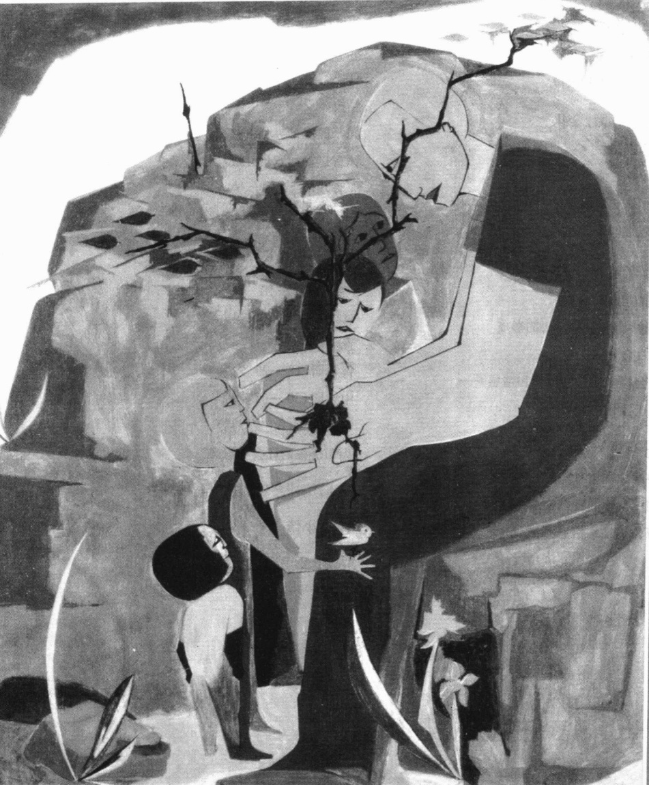

---

· 人类的本性是什么  

野孩  

与世隔绝的儿童  

制度化的儿童  

被剥夺父母抚养的动物

· 自我和意识的社会化  

库利和“镜中我”  

米德和角色扮演  

皮亚杰和认知发展理论  

自我和思维的全球观点

·人格、道德和情感的习得

弗洛伊德和人格发展

科尔伯格、吉利根和道德的形成

情感的社会化

作为社会控制手段的自我和情感——

内在于我们的社会

· 性别社会化

家庭中的性别信息

来自同辈群体的性别信息

大众媒体的性别信息

· 社会化的主体

家庭

邻里社区

宗教

日托

学校

同辈群体

体育运动和竞争性成功

工作场所

· 再社会化

管制机构

一生的社会化

童年期(从出生到约12岁)

青少年期(13—17岁)

青年期(18—29岁)

中年期(30—65岁)

老年期(约65岁以后)

生命历程的社会学意义

我们是社会化的囚徒吗?

· 本章小结

---

### 第 3 章 社会化

老人发现女儿怀孕后惊呆了。自从女儿在两岁时失聪以来，他的生活就从没轻松过。她不会说话，只会用手势比比划划。多年以来，他已经习惯了这样。但是现在……一想到女儿怀孕，他就感到害怕。他知道没有人会愿意娶她。邻居们将一直说三道四。无论他走到哪里，总能听到有人在背后嘀嘀咕咕。

要是他的妻子还在人世,可能会有更好的办法。可是他现在应该怎么办?他不可能将女儿踢出门外置之不理。

孩子出生以后，老人动摇了，但是那种羞耻感并未消失。伊莎贝尔是个很好听的名字，但是每次看到孩子，他就会感到痛苦。

尽管他很不愿这样,但是没有办法,他的女儿和这个小婴儿将不得不住在阁楼上。

很不幸,这是个真实的故事。1938年,在俄亥俄州发现了六岁半的伊莎贝尔,她和她的聋哑妈妈住在一个黑暗的房间里。她不会讲话,只会用手势和妈妈交流。长期的营养不良和缺乏阳光使她得了佝偻病。她的腿

弯曲着，根本站不直，她走路的时候拖着腿。对陌生人(尤其男人)几乎就像动物那样表现出明显的恐惧和敌意，她不会说话，只会发出嘶哑的叫声。(Davis,1942/2003:138—139)

当报纸报道了这件事后，社会学家金斯利·戴维斯决定研究伊莎贝尔被发现后发生在她身上的事情。让我们先来看看这个例子告诉我们的关于人类本性的一些认识，再回头讨论戴维斯的研究。

### 人类的本性是什么

几个世纪以来，人们一直在问：人类的本性到底是什么？人类的特征有多少来自自然本性(遗传)？有多少来自教化(与他人相联系的社会环境，social environment)？回答这个问题的一种方法，就是研究同一对被分开教养的双胞胎(见下面的“现实社会学”专栏)。另一种方法则是研究没有被人类养育的孩子。我们下面看一些这样的孩子。

### 野孩

几个世纪以来，有关野孩的发现时有报道。这些孩子大都是在很小的时候就被父母遗弃或者丢失而被动物抚养大。18世纪末，科学家对一个名叫Aveyron的野孩进行了研究(Itard，1962)。1798年，这个男孩在法国森林里被发现，他用四肢走路，猛扑向小动物而且生吃它们。他不会说话，感觉不到寒冷。关于野孩的其他研究报道声称，那些孩子的行为就像动物：他们不会说话，只会撕咬，搔抓，咆哮，而且用四肢行走；他们舔着喝水，吃草，大口撕咬肉块，对疼痛和寒冷没有感觉(Malson，1972)。

---

# 现实社会学

# 遗传还是环境？一对双胞胎奥斯卡和杰克的案例

一对双胞胎拥有基本一样的遗传基因。一个受精卵分裂发育成两个胚胎。如果说遗传决定个性——态度、气质、技能和智力，那么同一对双胞胎不仅在外貌上而且在个性上也都应是一样的。

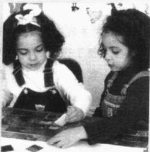

这个关于杰克和奥斯卡的有趣案例将帮助我们揭开这个谜。从他们的经历中，我们能够发现环境的深远影响——社会经历是怎样超越生物属性的。

杰克和奥斯卡是1932年出生在一个由信奉犹太教的父亲和信奉天主教的母亲组成的家庭里的一对双胞胎。因为父母离婚，他们在很小的时候就被分开了。奥斯卡被他在捷克斯洛伐克的外祖母抚养成人，他的外祖母是个虔诚的天主教徒。当奥斯卡

遗传和环境对人类行为的相对影响问题一直吸引着研究者，并让他们为之绞尽脑汁。被分开抚养的一对双胞胎提供了一个机会来检验它们之间的关系。然而，几乎所有的双胞胎（如图片所示的女孩子们）都是被一起抚养长大的，因而也就无法区分遗传和环境所产生的不同影响。

还在学走路的时候，希特勒吞并了捷克斯洛伐克的这个地区。奥斯卡开始崇拜希特勒，并痛恨犹太人。他加入了希特勒青年组织(一个童子军组织，它被用来灌输这样的“美德”——爱国、忠诚、遵从，还有仇恨)。

杰克的成长经历恰好跟奥斯卡相反。他在特立尼达岛被父亲抚养长大，他学到的是对犹太民族的忠诚，及对希特勒和纳粹的憎恨。战后，杰克和他父亲移居以色列，17岁时他开始在以色列的集体农场工作，随后开始服兵役。

1954年，两兄弟见面了，会面很简短。之前杰克被告知不能告诉奥斯卡他们是犹太人。25年后，也就是1979年，他们已经47岁了，明尼苏达大学的社会学家又把他俩召集到一起。这些研究者认为，由于他们拥有一样的基因，他们之间所表现出的不

同就只能归咎于环境——他们不同的社会经历。

奥斯卡和杰克不仅对战争、希特勒和犹太人的看法有分歧，而且对生活的基本定位也不尽相同。在政治观点上，奥斯卡很保守，而杰克则持更自由的看法。奥斯卡喜欢休闲，而杰克则专心工作。而且，就像预料的那样，杰克以是一名犹太人而自豪，而奥斯卡自从知道他是犹太人的一刻起就再也不愿提起这件事。

这个案例似乎很有说服力。但事情并不这么简单。研究者同时还发现，奥斯卡和杰克小时候在运动方面有着同样的优势，但数学却都很差。他们有着一样的语速，同样喜欢甜酒和辛辣食物。

奇怪的是,他们在使用厕所前都会先冲厕所,并且同样喜欢在拥挤的电梯里用打喷嚏来吓唬大家。

### 思考题

遗传？还是环境？每一个方面的影响到底有多大？这个问题还没有解决，但是根据以上事实我们也许可以得出这样一个公正的结论，那就是某些体力和脑力方面的表现程度来自遗传（比如在运动和数学方面的能力），而在对生活的基本定位这样的态度方面，环境的作用更明显。我们可以说：在生活的一些方面，蓝图是由遗传绘制的，即便如此，环境也并非毫无作为，它还有可能重新规划那些线条。在其他方面，个人是块白板，涂抹什么是由环境决定的。

资料来源: Begley (1979), Chen (1979), Wright (1995), Stewart (2000)。

---

现在多数科学家并不非常重视研究野孩的意义。他们认为小孩不可能由动物抚养长大，那些在森林里被发现的孩子在婴儿的时候还是曾经由父母抚养过的，但随后很可能因为智力迟钝而被抛弃。然而，如果事情不是这样呢？如果我们没有接触社会，我们是否生来就会像那些野孩一样？事实有可能是这样吗？

### 与世隔绝的儿童

像开篇介绍的伊莎贝尔这样的例子也时有报道。它们能告诉我们人类的本性是什么吗？首先我们能断定的是，人类没有自然的语言，因为像伊莎贝尔这样被隔离的孩子不会说话。

但也许这是因为伊莎贝尔智力低下，就像多数科学家认为野孩的情况那样。他们因此不能经历正常的生长发育阶段。的确，她的智力测试成绩在当时实际上相当于零，但是经过几个月的强化语言训练，伊莎贝尔就能说一些简短的句子。约一年以后，伊莎贝尔能够写一些单词，做简单的加法和复述故事。又过了几个月她能掌握将近2000个单词。在两年的时间里，伊莎贝尔达到了与她的年龄相当的智力水平。然后她开始上学，“在学校里她聪明、愉快、精力充沛……像其他正常的孩子一样参加学校的各种活动”（Davis，1940/2003：139）。

上述讨论表明，语言对于人类的发展至关重要。没有语言，人类就没有产生思想的机制。与动物不同的是，人类没有任何可以代替语言的本能。如果一个人没有语言，他或她就会生活在一个与世隔绝的世界里，一个内心孤独的世界，没有共享的思想，没有与他人的接触。

没有语言，就没有文化——没有共享的生活方式——而文化则是人之为人的关键。我们每个人都具有生物遗传特征，但我们特定的行为、态度或价值并不是由遗传而是由我们的文化决定的。

我去柬埔寨的目的是访问一个野孩——如图片所示的男孩——他被认为是由猴子抚养长大的。当到达这个男孩居住的遥远村庄时，我失望地发现这个故事并不完全属实。在恐怖统治时期，当男孩两岁的时候，红色高棉射杀了他的父母，留下了他一个人，他被抛弃在一座岛屿上。几个月以后，村民们发现他被一群猴子照顾着。他并不完全是个野孩——但是已经最接近我所了解的野孩的情况了。

### 制度化的儿童

除了语言，一个孩子要成长为我们所要求的那样健康、和谐、聪明，还需要什么呢？我们从20世纪30年代的一个实验里能得到部分答案。那时候，人的寿命很短，孤儿院遍布美国，在孤儿院长大的孩子难以与他人建立紧密的关系——他们的智商较低。“常识”（第1章中讨论过的，它是不可靠的）告诉我们，每个人智力受损的原因是生物性的（“他们天生就是那个样子”）。然而，两个心理学家，H.M.斯基尔斯和H.B.戴伊(Skeels and Dye，1939)开始探察另外一个原因。作为他们的实验背景，斯基尔斯(Skeels，1966)提供了一个对当时所谓“好”的孤儿院的描绘，这个孤儿院位于20世纪30年代的爱荷华州，他们两个人是这所孤儿院的顾问。

六个月以前的婴儿在婴儿室被照顾,他们被放在标准的婴儿床里,床两边带有护板(这有效地

---

限制了视觉刺激)，没有玩具或者其他物体放在婴儿的视线范围内。婴儿只能接触到忙碌的护士，她们换尿布和被褥，给婴儿洗澡喂药，用奶瓶喂他们。

斯基尔斯和戴伊认为，也许缺少社会互动的刺激是问题所在，而不是一些孩子身上的生物性残缺。为了验证这个具有争议性的观点，他们选择了13个婴儿，这些婴儿智力严重迟缓以至于没有人愿意抚养。斯基尔斯和戴伊把他们放到一个专为智力迟缓人所设的机构。每个婴儿，当时大约19个月大，被分配给不同的女性智障人看护，每人负责一个，这些妇女智力年龄在5—12岁之间，实际年龄在18—50岁之间。这些妇女很满意这种分配。她们不仅能很好地照顾好婴儿的各种基本生理需要——换尿布、喂食等等诸如此类的事情，而且愿意和这些孩子玩耍，拥抱他们，给予他们大量的注意力。她们甚至比看看谁的孩子首先学会走路和说话。每个孩子都归一位妇女，她们

给予婴儿特别的关爱和象征性的“领养”。结果，一种强烈的一对一的母子关系形成了，这种关系又由环境中与其他成年人的、不太强烈的、但是频繁的互动所补充。每个孩子都有一个他或她所认同的对象，而且这个对象对他或她以及他或她的成绩有着特定的兴趣。(Skeels,1966)

这两个研究者同时在孤儿院组成了一个由12个孩子形成的控制组。这12个孩子也是智力迟缓但是比那13个孩子智力要高一些。他们接受普通的看护。两年半以后，斯基尔斯和戴伊对所有的孩子进行了智力测试，结果令人震惊：那些被安排给智力迟缓妇女照顾的孩子的智商平均增长了28分，而那些仍然留在孤儿院的孩子则丢失了30分。

这些孩子长大后会发生什么？会和那些最初的区别有关吗？21年后斯基尔斯和戴伊作了追踪调查。那些留在孤儿院控制组里的孩子的教育水平平均低于三年级，四个仍然生活在州机构里，其他人则干着低层次的工作。只有两个结了婚。相比之下，那些在实验组里被个人照顾的13个孩子的平均教育水平是十二年级（在那个时代这属于正常水平），五个完成了一年或更多年的大学教育，一个甚至上了研究生学院，十一个人结婚。所有13个孩子都能自立或者成为家庭主妇(Skeels，1966)。很显然，我们认为理所当然的一个基本“人类”特性——高智力——有赖于早期亲密的互动关系。

让我们看一下另外一个案例，吉尼的故事：

1970年，加州政府发现了吉尼，一个13岁的小女孩。她从20个月大的时候被关在一个小房间里并被绑在椅子上。吉尼的父亲(当吉尼被发现时已经70岁)憎恨小孩，由此可能也导致了吉尼两个兄弟姐妹的死亡。她50岁的母亲眼睛半瞎，并且十分害怕她的丈夫。吉尼不会说话，不知如何咀嚼，不能直立，甚至不能伸直她的手脚。她的智力水平只有一岁。经过训练，吉尼学会了走路并能断断续续说一些话。当她长大后，她的语言能力依然很差，而且只要喜欢，她会抢走任何看到的他人的物品，还随地大小便。21岁的时候吉尼住进了一个专门为无法独立生活的成年人准备的地方。(Pines,1981)

从可怜的吉尼的故事中我们得知,不仅智力,而且与他人建立亲密关系的能力,也都依赖于早期的互动。除此之外,很显然,在13岁前的某个阶段,人类的语言和建立联系的能力必须形成,这样人们才能发展更高的智力,并形成社交和遵循社会规范的能力。

---

### 被剥夺父母抚养的动物

最后，让我们看一下那些被剥夺了正常互动的动物们。在一系列用恒河猴所做的试验中，心理学家哈里·哈洛（Harry Harlow）和玛格丽特·哈洛（Margaret Harlow）证明了早期学习的重要意义。哈洛夫妇（The Harlows，1962）把小猴子们隔离抚养，给每个小猴子两个人造妈妈，如图所示。一个“妈妈”只用电线组成，上面有一个木制头颅，但是有一个奶嘴用来喝奶。另一个“妈妈”没有奶瓶，但是身上裹满了厚厚的软毛绒布。为了得到食物，小猴子在电线妈妈那里喝奶。

当哈洛夫妇(The Harlows, 1965)用大的机器熊或机器狗吓唬小猴子时，它们并没有跑向“电线妈妈”，相反，却是可怜楚楚地紧贴在“绒布妈妈”身上。哈洛夫妇由此论定：婴儿与母亲的联系不是因为喂食，而是他们所谓的“亲密的身体接触”。对我们大多数人而言，这意味着拥抱。

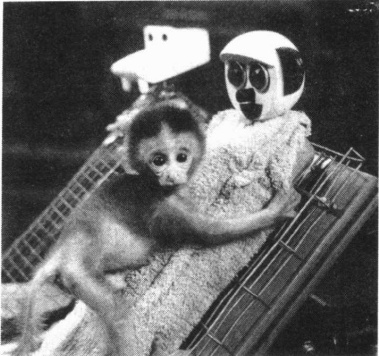

像人类一样，猴子需要互动来生存。那些被隔离抚养的猴子无法与其他猴子正常地互动。从这幅图片中，我们看到文中所描述的一只猴子。受到试验者的有意惊吓，这只猴子紧紧趴在裹满绒布的人造“妈妈”怀里寻求安全。

被孤立抚养的猴子无法适应正常猴子的生活。当它们长大后，与其他猴子放在一起，它们不知道怎样加入“猴子的互动”（嬉戏和假装的打斗）中去——其他的猴子都在排斥它们。尽管做过一些尝试，它们仍然不知道如何交配。试验者设计了一种特殊办法，使雌猴怀孕。但生过小猴后，这些猴子成为“不称职、不合适、残忍的妈妈……[它们]……摔打、抓挠、在地板上挤压它们的孩子。”

在其中一项试验中，哈洛夫妇隔离小猴子不同的时间。他们发现当猴子隔离较短的时间(大约三个月)，它们能够克服隔离产生的后果，而那些隔离长达六个月或更长时间的猴子则无法适应正常猴子的生活。如上所述，它们不能嬉戏和假装打斗，被其他猴子排斥。换言之，越长时间的隔离就越难克服隔离产生的影响。除此之外，可能确实存在一个关键的学习阶段：一旦错过这个阶段，在这个阶段所失去的东西将不可能再弥补。吉尼的例子可能就是这样。

因为人类与猴子不同,所以我们在从动物研究中推断人类行为的时候必须小心谨慎。然而,哈洛夫妇的试验支持了我们关于对被隔绝抚养的孩子的研究结论。

### ▷▷小结

### 社会使我们成为人类

很显然，婴儿无法“自然”成长为成年人。如果小孩被隔离抚养，即使他们在成长，也会变得和动物差不多。没有语言所提供的概念，就无法体验和掌握人与人之间的关系（我们称呼为兄弟、姐妹、父母、朋友、老师等等的“关系”）。没有温暖友好的互动，人们就不会在脑子里有“友好”这个概念，也不会和他人合作。简而言之，正是通过接触沟通，人类学会了如何成为一名社会成员。我们这种学习社会行为方式的过程就是社会化（socialization），即社会学家所说的“社会使我们成为人类”。

---

### ☑ 自我和意识的社会化

我们在出生时并不知道自己是个独立的个体，甚至不知道自己是男是女。我们是怎样形成我们的推理能力、人格、道德和情感的呢？我们又是怎样形成自我（self，即别人怎样看待我们，以及我们自己眼里的自己）的呢？下面就让我们看看这一切是怎样发生的。

### 库利和“镜中我”

追溯到19世纪，执教于密歇根大学的符号互动学派的查尔斯·库利(Charles Cooley，1864—1929)，认为被称为“自我”的这个“人性”的独特方面是社会形成的。他说，我们的自我观念是在与他人的互动交往中形成的。库利(Cooley，1902)创造了“镜中我”(looking-glass self)这个术语，来描述我们自我意识形成的过程。他把这个意思概括为两句话：

每个人都是对方的一面镜子

反映出对方的情况。

“镜中我”这一概念包含三个基本要素：

1. 我们想象我们在别人面前的形象。例如，我们可能会想象别人认为我们聪明或是愚蠢。

2. 我们对别人的反应的解释。我们对别人如何评价自己得出结论，他们是否因为我们聪明而喜欢我们？他们是否因为我们愚蠢而不喜欢我们？

3. 我们形成了自我观念。基于我们对他人评价的解释，我们会形成对自己的感觉和想法。在这个社会镜子中，一种肯定的反应会导致积极的自我观念，一个否定的反应则会导致一个消极的自我观念。

注意：自我的发展并不依赖于准确的评价。即使我们严重误解了别人对自己的评价，这些错误的判断也会成为我们自我观念的一部分。另外，即使自我观念始于童年时代，它仍是一个持续终生的过程。“镜中我”的三个阶段是我们日常生活中的一部分：当我们观察别人对自己的反应时，我们不断地修正自我。因而，自我是一个永远不会完成的产品——它总是在进行中，即使我们已垂垂老矣。

### 米德和角色扮演

符号互动论的另一位著名社会学家是曾在芝加哥大学执教的乔治·米德。他认为游戏对于自我的形成具有重要作用。在游戏中，儿童学会了扮演他人的角色，也就是说，进入他人的世界——理解他人的感受、思想，并预知他人的行动。

儿童是逐渐地获得这种能力的 (Mead, 1934; Coser, 1977)。心理学家弗拉维尔 (John Flavel, 1968) 分别让一名 8 岁和 14 岁的儿童给一群蒙住眼睛和一群没有蒙住

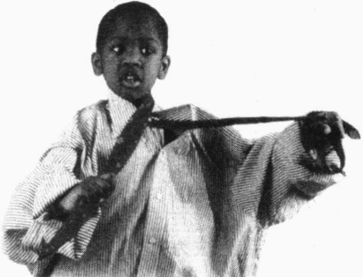

米德把扮演他人角色看成是成长为成熟的社会成员的学习过程中必不可少的一步。开始，我们只能扮演重要他人的角色，就如图片所示的男孩做的那样。随后我们形成了扮演一般化他人的能力，这不仅对扩大合作是重要的，而且对遏制反社交的欲望也是非常重要的。

---

眼睛的儿童讲解一个用棋盘玩的游戏。那个14岁的孩子给那些蒙住眼睛的儿童作了更详细的介绍，但是那个8岁的孩子给每个人都作了同样的介绍。年龄较小的儿童还不能扮演他人的角色，而年龄较大的儿童就可以。

随着这种能力的发展，儿童起初只能扮演“重要他人”（significant others），也就是那些对他们产生重要影响的人，比如父母、兄弟姐妹。儿童在游戏中通过想象和扮演某个角色，比如穿大人衣服，培养了具有重要意义的站在他人立场（思考问题）的能力。

随着自我逐渐形成，儿童学会把越来越多人的期望内化。扮演角色的能力最终扩展到能够扮演“作为整体的群体”的角色。米德用“一般化他人”（generalized other）这个术语来指代我们对他人一般会如何评价我们的感知。

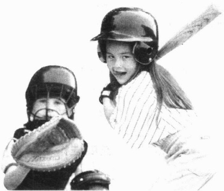

为了帮助学生们理解一般化他人的概念，米德举了棒球的例子。为什么这种团队运动和组织化的游戏可以作为非常适用于解释这个概念的例子？

如果我们想成为群体中的一名合作人员，不管这个群体是我们的家庭、朋友还是同事，扮演他人角色都是至关重要的。这种能力通过预知他人的反应，从而使我们能够修正自己的行为，这是吉尼永远没有学到的。

学会扮演他人必须经历三个阶段(见图 3.1):

1. 模仿阶段(imitation)。三岁以下的儿童只会模仿他人。他们还没有与他人相区分的自我观念，只会模仿他人的姿态和语言(这个阶段实际上不是角色扮演，但却是为其做准备)。

2. 玩耍阶段(play)。三岁到六岁的儿童在第二个阶段开始装扮特殊他人的角色。他们可能会装扮成一个消防员、角斗士、孤独的骑士、超级女孩、西娜、蜘蛛侠等等。他们还乐于装束，喜欢穿父母的衣服，在脖子上缠上毛巾装扮成超人或者女超人的样子。

3. 游戏阶段 (games)。在第三个阶段，玩耍被组织起来成为游戏，恰好与早期学校教育同时。自我的重要性体现在做游戏时个人必须扮演多重角色。米德最喜欢的一个例子就是棒球游戏，其中每个人都要扮演其他任何一个人的角色。在打棒球时，每个人不但必须了解自己的角色，还要能够预测击球和扔球时他人的行动。

米德还认为自我有两部分，“主我”（I）和“客我”（me）。“主我”是作为主体的自我，是自我当中主动、自发和创造性的部分。相反，“客我”是作为客体的自我，它由我们在与他人的社会互动中内化的态度组成。米德之所以选择这两种叫法，是因为在英语中“I”表示行动主体，就像在“我推他”这个句子中“我”表示主动一样，而“me”则表示行动的对象，就像在“他推我”这个句子中“我”表示被动一样。米德强调我们在社会

图 3.1 怎样学会扮演他人的角色：米德的三阶段

---

化过程中不是消极被动的。我们不像机器人，被动机械地接受别人的反应。“主我”是主动的，它会评价他人的反应并将其组织成一个统一的整体。米德还说，“主我”会监督“客我”，帮助我们调整行为使其更符合他人的期待。

米德还得出一个惊人的结论：不仅自我而且人类意识都是社会的产物。米德强调我们离开符号就无法思考，但是符号来自哪里？只能源于社会，社会通过语言产生符号。如果社会没有提供符号，我们就无法思考，就无法具有我们称之为意识的东西，因此，意识就像语言一样是社会的产物。

### 皮亚杰和认知发展理论

人类的一个本质特征是具有推理能力,我们是如何学会这种能力的呢?

这个问题引起了瑞士心理学家皮亚杰(Jean Piager, 1896—1980)的关注。他注意到，当儿童进行智力测验时会犯相同的错误，这也许意味着儿童回答问题时遵循了某种不正确的规则。也许儿童在如何学会推理时经历了一个自然的过程。

为了弄明情况，皮亚杰建立了一个实验室。在这里，他给不同年龄段的儿童一些问题让他们来解决(Piaget,1950,1954; Flavel et al.,2002)。经过几年的研究，皮亚杰认为儿童推理能力的发展经历了四个阶段(如果我们用“推理能力”代替下列解释中的“运演”，会更容易理解他的理论)。

1. 感知运动阶段(0—2岁) 在这个阶段，婴儿只能通过与外部环境的接触(吮吸、触摸、视听)来获得知识。婴儿不会进行我们意义上的思考。最初，他们不会知道自己的身体是与环境相区别的，事实上，他们还没发现自己有脚趾。婴儿也不会认识到因果关系，也就是说，他们不知道自己的行为会导致一定的结果。

2. 前运演阶段（2—7岁）在这个阶段，儿童发展了运用符号的能力。然而他们还是无法明白一般观念，比如大小、速度和因果关系。尽管他们已经学会数数，但是仍然不明白数字的含义。他们也没有扮演他人角色的能力。皮亚杰让这一阶段的孩子描述山脉泥塑模型的样子，他们做得很好，但是当让他们从坐在对面的小孩的视角描述泥塑模型的样子时，他们就无法做到了。他们只能重述从他们的视角所看到的东西。

3. 具体运演阶段（7—12岁）尽管推理能力有了更大的进步，他们还是停留在具体思维上。儿童此时能够理解数字、因果关系和速度，能够扮演他人角色并参与集体游戏。然而，没有具体的实例他们还是无法讨论抽象概念，比如真理、诚实、公正。他们能够解释为什么某个答案是谎言，却不能描述真理本身是什么。

4. 形式运演阶段（12岁以后）这时儿童能够抽象思维。他们可以讨论概念，基于一般原理得出结论，使用规律解决抽象问题。在这个阶段，儿童很可能成为一名哲学家（Kagan，1984）。例如，看到一张奴隶的照片，一个处于具体思维阶段的孩子会说“那是错的”。但是一名处于形式运演阶段的孩子就很可能会问道：“要是我们的国家建立在平等之上，人们怎么会占有奴隶？”

### 自我和思维的全球观点

库利关于“镜中我”的观点具有普遍性。尽管研究者发现自我的发展要早于米德的描述，但米德关

---

于角色扮演及意识是社会产物的理论同样具有普遍性。皮亚杰的认知发展阶段论也具有普遍性，但是研究者发现，不同的人进入发展阶段的年龄不同，因此每个发展阶段也就不像皮亚杰所描述的那样清晰（Flavel et al., 2002）。即使在感知运动阶段，儿童也会显现出推理的迹象，这种迹象表明一种与大脑紧密相连的天生的能力。尽管皮亚杰的理论仍在不断完善，他的理论贡献仍是：我们的认知发展存在着一种基本结构，全世界的儿童的认知发展都是一个从具体到抽象的过程。

有意思的是，一些人似乎停滞在具体的第三阶段而永远无法达到抽象思维阶段(Kohlberg and Gilligan, 1971; Case and Okamoto, 1996)。例如，大学能够培养抽象思维，大多数没有这一经历的人，他们的抽象思维能力就相对会稍弱些。但是社会经验会修正这些阶段。而且，我们尚不清楚文化是怎样影响我们的思维方式的，下面的“世界文化多样性”专栏探讨了这个主题。

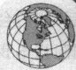

### 世界文化多样性

### 你能看到我所看到的东西吗？——东西方认知和思维的差异

下面哪两个事物更相配：熊猫，猴子，香蕉？在往下读之前请回答。

你可能会说熊猫和猴子。因为它们都是动物，而香蕉是水果。这是合乎逻辑的。

至少这是符合西方逻辑的,我们很难会再想到其他答案。然而日本人的回答却有可能是猴子和香蕉更相配。

为什么？因为西方人通常看到类别(动物和水果)，而亚洲人通常看到关系(猴子吃香蕉)。

在一项研究中，给日本学生和美国学生看一张鱼缸的照片，里面有一条游得很快的大鱼和几条小鱼，也有一些植物、一块石头和水泡。随后，当问他们看到什么时，日本学生记住背景细节的能力要比美国学生高出60%。他们也更多地提及一些关系，比如“粉红小鱼在蓝色石头前面”。

学生们还被展示了一幅有96个物体的图画，然后被要求回答图画中有哪些物体。当物体放在其原来环境中时，日本学生记得更好。美国学生就不行，他们从来没有注意到背景。

西方人更多注意关键的物体，而亚洲学生更加适合思考总体环境。这一差别的深层含义是：东方人把因果关系较少地归因于行动者而较多地归因于背景，西方人则将背景减到最小而更多强调个体行动者。

东西方认知和思维的差异已很明显。但我们实际上并不知道这种差异是怎样起源的，因为这些最初发现表明了在认知和思维上深层的、基于文化的根本差异，这将会是一个迷人的研究领域。

### 思考题

在我们地球村里，认知和思维的差异至关重要，想想美国和朝鲜之间的危机。东方人和西方人怎样不同地看待这个问题？他们怎样不同地归结原因，并且没有意识到“其他可能性”的存在？

资料来源：Nisbett (2003)。

### 人格、道德和情感的习得

人格、道德和情感是我们人类的重要特征。让我们看看我们是如何习得这些重要特征的。

### 弗洛伊德和人格发展

随着意识和自我的发展,我们的人格渐渐形成。对西方思想产生重要影响的人格理论是弗洛伊德

---

(1856—1939)的观点。20世纪初，弗洛伊德是维也纳的一名医生，他创立了精神分析学，这是一种通过长期、细致地研究潜意识来治疗精神问题的方法。让我们来看看他的理论。

弗洛伊德认为人格由三个基本要素组成。首先，每个孩子天生具有本我(id)，本我是弗洛伊德用来描述使我们寻求自我满足感的内驱力。婴儿的本我表现在饥饿或疼痛时会哭。追逐享乐的本我在一生中都存在，它要求基本需要的立即实现：关注、安全、食物、性等。

然而，本我要求立即的满足会与他人(特别是父母)的需要满足产生矛盾。为了解决这种矛盾，人格中的第二个基本要素出现了，即弗洛伊德所称的自我(ego)。自我是本我和限制本我的社会需要之间的平衡力量。自我同时也负责平衡本我和第三个要素——超我(superego)，通常又叫良心。

超我代表了内化于我们的文化，即我们从社会群体中内化的规范和价值。作为人格中的道德成分，当触犯社会规范时，超我会唤起负罪感和羞耻感，当遵从社会规范时则会唤起骄傲感和自我满足感。

根据弗洛伊德的研究，本我失控时我们会满足享乐的需要，破坏社会规范。当超我过头后，我们会完全严格地遵从社会规范，被束缚在规范的紧身衣中动弹不得。自我作为一种平衡力量，试图阻止本我或超我占据主导地位。一个情绪健康的个体的自我能够平衡本我和超我需要之间的矛盾。但是如果个人失调的话，自我就不能控制本我和超我的固有冲突，个人就会内心紊乱并出现行为问题。

社会学评价 社会学家非常重视弗洛伊德对社会化的强调——我们出生于此的社会群体传承着约束我们生物驱动力的规范和价值。然而，社会学家并不认为天生和潜意识的动机是人类行为的首要原因，因为这否认了社会学的核心原则：像社会阶层(收入、教育和职业)和社会角色这样的因素是社会行为的基础(Epstein, 1988; Bush and Simmons, 1990)。

女性主义社会学家一直特别批判弗洛伊德的观点。尽管我们刚才所概述的理论既可适用于男性，也可适用于女性，但是弗洛伊德却假定只有“男性”才是“常态”。他甚至说女性是下等的，是被阉割了的男性(Chodorow, 1990; Gerhard, 2000)。显然，社会学家需要研究人格是怎样形成的。

### 科尔伯格、吉利根和道德的形成

如果你观察儿童，就会发现他们的注意力集中在需要的立即满足上，而对他人很少关心（“这是我的！”一个两岁的孩子在与另外一个孩子抢玩具时会这样大喊）。然而再大一些时候，这个孩子就会考虑他人，想到道德问题。这种变化是怎样产生的呢？

科尔伯格的理论 心理学家劳伦斯·科尔伯格 (Kohlberg, 1975, 1984, 1986; Walsh, 2000) 认为，我们道德的形成经历了一个有序的多阶段过程。在皮亚杰的基础上，他发现儿童是从我刚才描述的非道德阶段 (amoral stage) 开始的。对他们来说没有正确与错误之分，只是满足个人的基本需要。从 7 岁到 10 岁，儿童进入前惯例阶段 (preconventional stage)，他们学习社会规范并遵守它们以免招致麻烦。他们把能否让父母、朋友、老师满意作为对错的标准，他们关心的是避免惩罚。大约 10 岁，儿童进入惯例阶段 (conventional stage)，在这个阶段，道德意味着遵从他们已经学会的规范和价值。在后惯例阶段 (postconventional stage)，科尔伯格认为多数人不会达到这个阶段，人们思考对与错的抽象原则，根据这一原则判断行为。

---

吉利根和道德中的性别差异 另外一位心理学家卡罗尔·吉利根不同意科尔伯格的观点，因为这并不符合她自身的经历。她指出，科尔伯格的研究中只使用了男孩。当时已有越来越多的妇女开始成为社会学家，她们质疑男性研究者的假设——无需研究女性，对于男性研究的结果同样适用于女性。

吉利根（Gillingan，1982，1990）决定研究追德的性别差异。在访问了200名男人和女人后她得出结论：女性更能通过个人关系评价道德。她们想知道一项行动怎样影响他人。她们更关心个人间的忠诚，以及对被爱的人可能带来的伤害。相反，男性则倾向于遵从所定义的对或错的抽象原则。一种行为是符合还是触犯伦理道德，个人关系与这一点并无多大关系。

研究者检验了吉利根的理论，他们发现男性和女性都会使用个人关系和抽象原则作出道德判断（Wark and Krebs，1996）。因此，吉利根不再坚持其当初的看法（Brannon，1999）。然而，事情并没有完全解决，一些研究者已经发现了在作出道德判断时的性别差异（White，1999；Jaffee and Hyde，2000）。

像人格一样，道德也是人类发展的重要方面，但是目前对它的社会学研究仍然特别匮乏。

### 情感的社会化

情感也是人矣本性的里要力面，社会字家最近开始研究“人性”中的这个领域。他们发现情感不单单是生物因素的结果，而且也是像意识一样依赖于社会化(Hochschild，1975；1983；Reiser，1999；Turner，2000)。这听起来很奇怪：不是所有的人都会生气吗？不是每个人都会哭吗？不是每个人都会感到内疚、羞耻、悲伤、幸福和恐惧吗？社会化是如何作用于情感的呢？

普遍的情感 起初，情感看上去与社会化无关。保罗·埃克曼(Ekman, 1980) 是位人类学家，他在多个国家研究过情感。他认为每个人都会体验到六种基本情感：生气、厌恶、害怕、幸福、悲伤和惊奇——当我们产生这些情感时，会有同样的面部表情。例如，一个津巴布韦人能从一个美国人的表情上看出她是否生气、厌恶或恐惧，我们也能从津巴布韦人的表情上看出他是否高兴、悲伤或惊奇。因为当我们产生这六种基本情感时会出现同样的面部表情，埃克曼得出结论，这六种情感建立在我们的生物性基础上，“是我们基因的产物”。

表达情感 六种基本情感的存仕，开小合认社会化会影响我们如何表达它们。面部表达只是我们表现情感的一种方式，还有其他一些随着性别不同而不同的表达方式。例如，美国女性被允许更自由地表达她们的情感，而美国男性则受到较多的限制。女性被允许在公共场合“兴奋地尖叫”，男性则不可以，像这样的表达将从根本上违背他们的性别角色。

另外，还有文化、社会阶层以及关系等都会与情感表达有关。先来看文化的影响。两个好久不见的日本朋友见面后不会握手或拥抱——他们鞠躬。两个阿拉伯人则会相互亲吻。社会阶层的影响也很明显，因为它跨越许多其他因素，甚至包括性别。一看到好久不见的朋友，上层社会的男女会比下层社会的男女会更有节制地表现他们的高兴。关系也有重要影响。如果是和亲密的朋友在一起则会更自由地表达自己的情感，当参加有公司首席执行官出席的员工会议时就会更谨慎地表达自己。儿童社会化的很大一部分就是集中学习“情感规范”，怎样在不同的环境下表达自己的情感。

---

我们的感受 问题并不这么简单。社会化不仅导致不同的情感表达方式，而且会影响我们的感受(Clark,1991；1997)。处在一种文化中的人可以学到其他文化中不存在的情感体验。例如，居住在西密克罗尼西亚西加罗林群岛的Ifaluk人用“fago”一词表达看到别人受苦时的感觉，这极类似于我们所说的同情或是怜悯。但是Ifaluk人遇到高地位的、受到尊敬或崇拜的人时，仍用“fago”形容他们的感受(Kagan，1984)。对我们而言，这是两种不同的情感，要用不同的词汇表达。想要看一下其他文化中不同于我们所想的让人震惊的情感、价值和行为，请看下面专栏。

现 实 社 会 学

### 时代的象征: 我们正在变成 IK 人吗?

人类学家科林·特恩布尔(Turnbull,1972/1995)研究了Ik部落，那是乌干达北部一个曾经辉煌过的游牧民族。现在，政府控制着他们的游牧地。由于干旱、游猎和饥饿的破坏，Ik人变得极端个人化。自私、麻木和冷漠统治了这里。对食物的寻求变成了唯一的“善”，整个社会死气沉沉，个人变得麻木不仁。

可以暂时设想一下你出生在Ik部落，三四岁以后你就被推出家门。从那时起，你一切都得靠自己。你睡在部落的空地上，得到同意后才能坐在父母家的门口，但是不能躺在那儿或睡在那儿。

那里没有学校，也没有教堂。在你的生活中没有类似我们意义上的家庭。你加入了一个由3—7岁孩子组成的群体，最弱小的孩子不久就会死去，只有最强壮的孩子才能存活下来。随后，你进入到由8—12岁孩子组成的群体，12岁或13岁时你自己分离出去单干。

你从周围发生的事物中学习,但你只看到了冷漠。男人们打猎,但是很少游戏。如果他们打到了猎物,他们拒绝带回来与家人分享。他们说:“人人都知道只为自己获得食物,你想别人会把食物带回来给我吗?”

你还看到了残忍。盲人Lo'ono摔倒了滚到沟底，大人们都在嘲笑她四脚朝天，无力地摆动胳膊和双腿。Lolim乞求他的儿子Longoli让他进入家门，因为他就要死了，但是Longoli还是把他赶走了。Lolim一个人孤单地死去。

lk 的孩子们学到了重要的一课：自私是好的，生存是唯一重要的。小孩对大人的冷漠表现出一种幼稚的兴奋。当盲人 Lolin 生病时，小孩子们会跪在他前面戏弄他，嘲笑他的痛苦。他的孙子会爬到他身上，用两根木棍像打鼓一样击打他的秃头。

有一个叫 Adupa 的小孩，她曾对生活所赐予的东西保持了一种敬畏的感觉。当她找到食物时，她将它放在手里，惊喜地看着它。但当她把食物捧到嘴边时，其他孩子却扑向她，一边打她一边嘲笑她。

### 思考题

从 Ik 人得知,我们所认为的为人类独有的价值观念并不是与生俱来的,而是来自社会。一旦作为社会基础的认同感被打破,这些价值观念就会消失。

如果不是亲临其境，我们很容易批判其他社会的成员，所以我们还是批判一下我们自己的社会。想想人们在不被需要时是怎样被当成无用的东西而被抛弃。公司解雇年老的雇员，因为年轻人的薪酬较低；或者在劳动力低廉的地方重新部署工厂，留下成千上百的工人陷入困境。首席执行官们耸着肩膀说“那就是生意”。为了更高的薪水，人们背井离乡。成功的经理主管抛弃了结发妻子，不顾她们也是自己孩子的妈妈，而找一个更年轻漂亮的“战利品”配偶。

最后，想想我们渴望家庭和朋友具有的价值观念——友好、慷慨、耐心、容忍、合作、同情等——是如何不受重视。如果一份工作要求这样的才能，这项工作的工资和声望会很低(Maybury-Lewis, 1995)。

---

需要的研究 尽管埃克曼只确认了人类在感觉和面部表情上共有的六种基本情感，我怀疑在全世界还存在其他一些普遍情感——而且当人们表达同一情感时也会出现一样的面部表情。我认为无助、失望、困惑和震惊也是普遍的情感。我们需要跨文化研究来确认它们，同时也需要研究儿童是如何习得情感和学会表达它们的。

### 作为社会控制手段的自我和情感——内在于我们的社会

社会化大多试图把我们变成社会的顺从成员。自我和情感的社会化就是这个过程中重要的一部分，因为自我和情感会塑造行为。尽管我们认为我们是“自由的”，但是想想某些影响我们如何表现的因素吧：朋友、父母、邻居、老师的期待；教室规范、大学规则；市、州、联邦法律等等。例如，如果你受到沉重的打击，或者内心冒出一个惊人的狂野的欲望——你想撕破衣服在街上裸跑，什么会阻止这样的事情发生？

答案就是社会化——内在于你的社会。你的社会经验导致了按照特定思路来思考和按照特定情感来感

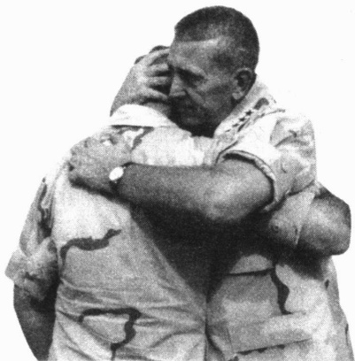

西方男性被社会化的结果是，比女性更不愿表露情感，但是近几年来他们已经开始被允许更公开地表达情感，即使是用那些不久前还被认为是女人气的方式。图中所示的汤姆·弗兰克斯将军，他是美军中央指挥部的指挥官，正在拥抱士兵。在卡塔尔的军事基地，美军正在训练以备战伊拉克。对我们的这种变化的重新定义是从女人气变成了同志间的友爱。

觉的自我。它会让你举止有序。一些想法比如“我会被学校开除吗？”“如果这被我的朋友(父母)知道了会怎样？”代表意识到了自我与他人的关系。避免羞耻感和尴尬也是如此。我们的社会镜子(自我和情感社会化的结果)有效地控制着我们的行为。事实上，自我和情感的社会化是如此有效，以至于很多人一想到在公共场合裸奔就会感到尴尬。

### ▷▷小结

社会化对于人类的发展具有重要意义。通过与他人的互动，我们学会了如何思考、推理和感受，其结果是塑造了我们的行为（包括思维和情感），使之符合文化标准。这就是社会学家所说的“内在于我们的社会”。

### 性别社会化

为了引导我们的行为——包括思想和情感——沿着所期望的轨道发展，社会还运用了性别社会化（gender socialization）这一手段。通过因为是男性和女性而期待有不同的态度和行为，人类群体把男孩和女孩引向生活中不同的方向。这种相互对照的态度和行为的基础是如此牢固，以至于作为大人，我们都会根据符合我们性别文化的原则去行动、思考和感受。

---

我们怎样得到社会性别信息的呢？本书一直都在强调社会性别的重要性，尤其是在第11章中。但现在，我们将先简单地看看家庭和大众媒体的影响。

### 家庭中的性别信息

我们的父母是第一重要他人,他们教会了我们在这个基本符号分化的世界中的角色。或许有时他们会有意识地带有粉红或蓝色的性别意味,这些颜色本身并没有什么意义,但现在却与社会性别相关。但是更多的时候,我们父母的性别取向非常牢固地嵌在脑海里,所以当他们还没有意识到自己正在做性别教育的时候就已经在这么作了。

这已为心理学家苏珊·戈德堡和迈克尔·刘易斯(Goldberg and Lewis, 1969) 做一个经典研究所证实。他们的研究结果也得到了其他研究者的证实(Fagot et al., 1985; Connors, 1996)。

戈德堡和刘易斯让妈妈们带着自己六个月大的孩子来到实验室，声称要观察婴儿的发育情况，但他们同时偷偷地观察妈妈们的举动。他们发现妈妈们让女儿更靠近自己，并且更频繁地抚摸女儿，更多地和女儿而不是儿子讲话。

当孩子 13 个月大的时候，女孩在玩耍时和妈妈待得更近，她们比男孩更快和更频繁地回到妈妈身边。当戈德堡和刘易斯设立障碍分开孩子和拿着玩具的母亲时，女孩更容易哭起来寻求帮助，而男孩则试图爬过障碍。

戈德堡和刘易斯由此得出结论：在我们的社会里，母亲潜意识里鼓励女儿被动和依赖，而鼓励儿子主动和独立。

这种教育贯穿了整个童年，孩子基于性别的不同被给予不同种类的玩具。男孩更能得到玩具枪和毁灭敌人的玩具士兵，而女孩则更能得到洋娃娃和珠宝。一些父母试图选择“中性”的玩具，但是孩子们知道什么流行，如果他们没有其他孩子的玩具，他们就会感到被忽视。玩具在社会化中的重要作用可以归结为：如果有人给他们的儿子芭比娃娃，几乎所有的父母都会感到不自在。

父母也会让处于幼儿园的儿子离家更远些，他们会微妙地鼓励儿子参加比较粗野的游戏，希望儿子变得更脏，更有挑战性，希望女儿变得更有礼貌和顺从(Gilman,1911/1971; Henslin,2003c)。总的来说，父母们都能得偿所愿。

社会化过程中诸如此类的经验是社会学对男女社会性别差异解释的核心。然而，我们还注意到一些社会学家认为生物因素也是造成这些差异的一个原因。例如，在戈德堡—刘易斯研究中，婴儿是否只是表现了内在的生物倾向，而母亲只是强化了——而不是导致——那些性别差异，我们将在第11章再讨论这个具有争议性的话题。

### 来自同辈群体的性别信息

社会学家强调，当儿童开始接触社会的其他方面时，始于家庭的这种分化过程如何得到了强化。在诸多影响因素中，最强大的一个就是同辈群体（peer groups），即由共同兴趣联结、年龄相仿的人所组成的群体。比如朋友、同学、邻里的孩子们。想想美国的男孩怎样互相教会对方什么才是男性的样子、女孩怎样教会彼此什么才是女性的样子。

---

让我们听一下社会学家唐纳·埃德(Eder,2003)的研究中两个8年级女孩的对话。你可以看到,这些女孩如何强化了她们心目中符合女性的外表和行为的形象:

辛迪: 使她美丽的唯一原因就是化妆……

本尼：她有一张照片，摆着这样的姿势。(一只手放在屁股上，另一手放在头的旁边。)

辛迪：她的脸那么瘦，但搽那么多粉让她的脸都胖了起来。

本尼：她好丑，好丑，好丑。

当然，男孩也做同样的事情。社会学家梅莉莎·米尔基(Milkie,1994)研究高中男孩时发现，他们大部分话题都集中在电影和电视节目上。在他们看到的诸多形象中，男孩关注的是性和暴力。他们重复台词，扮演剧中角色，用剧情和人物相互取笑。

如果你认识十来岁的小男孩，你可能已经看到经常会有这样的行为。你或许会觉着好笑，或许会不同意地摇摇头。然而，作为一名社会学家，米尔基看到了表面下的东西。她认为男孩们用媒体上的形象来发现作为男性的自我，他们得到这样的信息：要成为一个“真正”的男人，就要喜欢性和暴力。要是不拿谋杀和性混乱开玩笑，就会被看做一个“娘娘腔”，而这则是一个一定要避免的标签。

### 大众媒体的性别信息

另一个强大的影响来自大众媒体 (mass media)，这是一种直接面向大量观众的信息交流形式。让我们看看广告、电视、电影、电子游戏中的形象怎样强化了社会性别角色，也即适合的性别行为和态度。

广告 广告正在狂轰乱炸着我们，美国每个儿童一年平均能看到 20000 个电视广告（Witt，2000）。面向儿童的商业广告多是表现出女孩合作而男孩是攻击性的，而且女孩多是呆在家里、而男孩则是在外面的场景（Larson，2001）。女孩也多被描述为只会傻笑，而不能胜任任务（Browne，1998）。当面向成年人的电视广告更多地描绘男性的主导性和粗犷强壮、女性的性感和顺从，它也就强化了同样的刻板印象。

结果就是一套文化造就的刻板的性别形象谱系。一端是牛仔们在广阔的空间里驰骋，一端是衣着暴露的妇女，她们依靠身体和姿色推销各种各样的商品，从汽车到汉堡包无所不有。这些对女性身体的不现实的描绘让妇女们感到灰心和自卑（Kibourne，2003）。当然，这又造成了对一批许诺可以获得美丽的脸庞、苗条的身材，以及浪漫的成功产品的需求。

电视和电影 电视和电影强化了性别的刻板印象。在电影里和黄金时段的电视里，男性角色大大多于女性。电视里的男性角色往往地位较高（Glascock，2001）。观众深受影响，因此电视看得越多，他们对妇女能担任的社会角色的看法就越狭窄（Signorielli，1989，1990）。

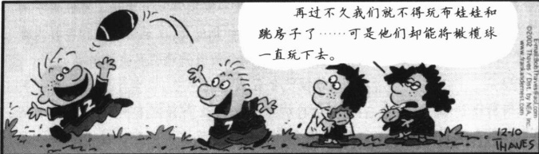

我们从小习得的社会性别角色变成了我们基本生活取向的一部分。尽管随着成长，我们会不断改进对这些性别角色的认识，但是这种改进仍然建立在我们童年期所形成的构架的基础上。

---

打破刻板印象的角色是时代改变的标记。在电视喜剧中，女性比男性更加言词犀利(Glascock，2001)。吸血鬼杀手芭菲从恶魔那里拯救她的同学，但这个拥有超能力的女孩却被开玩笑似的形容成了“有史以来最厉害的幼儿园反犯罪精英”。或许最具打破刻板印象意义的是《武士公主西娜》，一部来自新西兰的电视连续剧。西娜被描绘成具有超级力量的支配者，她克服了所有障碍，打败了所有的对手——无论男人还是女人。

电子游戏 许多年轻人花费很多时间在游戏厅或家里玩电子游戏。甚至一些大学生，尤其是男生，也通过电子游戏来释放压力(Jones,2003)。尽管社会学家开始研究这些游戏中对性别的描述，但是这些游戏是怎样影响玩家的性别意识目前还无法得知(Dietz,2000; Berger,2002)。因为这些游戏处于社会的前沿，它们有时也反映了社会中性别角色的前沿变化，下面的专栏内容就是关于这个问题的。

### 社会生活中的大众媒体

### 从《武士公主西娜》到劳拉·克劳福特的《古墓丽影》：大众媒体中女性角色的变化

大众媒体反映了女性社会角色的变化。尽管媒体仍将女性描述为被动的、顺从的、陪衬性的，但是一个新的女性形象已经出现。尽管这个形象夸大了这种变化，但它确实表明了一种根本性的变化。上文提到的武士公主西娜就是一个突出的例证。

尽管电子游戏不是一种普通的大众媒体形式，但是就像书籍和杂志一样它能为广大观众所获得。随着数字技术的进步，电子游戏超出了传统意义上的游戏，它更像互动电影。

然而在社会学上更有意义的是，电子游戏的内容使它的玩家社会化。当他们在玩游戏时，游戏者不仅仅是在玩，他们也融入了游戏带来的思想和形象之中。电子游戏中的性别形象，就像其他大众媒体一样，传递着强大的性别信息。

劳拉·克劳福特，一个富于冒险精神的考古学家，也是《古墓丽影》及其续集中的大明星。这是一个新的性别形象的代表。劳拉聪明、强健并能最终战胜敌人。她手拿双枪，是21世纪的牛仔，“牛仔”这个术语是特意选择的，因为劳拉打破了刻板的社会性别形象和以前男人为主导的假想。在肌肉发达和持枪横行的男性动漫化的文化领域中，她是第一个这样的女性主角（Taylor，1999）。

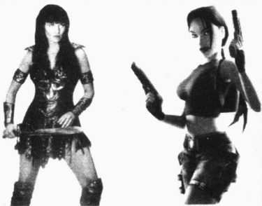

但旧的形象仍然在新的形象面前保存完好。正如右边的图片所示，劳拉是数字时代的年轻男性心目大众媒体不仅反映了社会性别的刻板印象，而且还对改变这种刻板印象发挥作用。它们有时同时起作用。武士公主西娜和劳拉·克劳福特的形象不仅反映了社会中正在改变的女性角色，而且通过夸大这种变化，大众媒体塑造了新的刻板印象。

中的梦想女孩，不管她的敌人是谁，不管面对何种困境，劳拉总是性感迷人。她紧身的装束衬托出娇好的身材，这表明这个数字宝贝实际上反映了男性心中的形象。这种努力是如此成功，以至于男孩和年轻人连珠炮般地询问游戏公司有关她的私生活情况。

劳拉使年轻人如此疯狂，以至于有100多家关于她的网站。劳拉也是两部电影和一部漫画书的主角，甚至还有一种叫劳拉·克劳福特的糖果。

---

### 思考题

一位看过上述文章的社会学家评论道：“看上去女性如果被定义为平等，我们就不得不变成象征性的男人——有乳房的战士。”为什么社会性别的改变大都是单方向的——女性采用传统意义上的男性性格特征？为什么媒体不刊登一个有女性特征的“新男人”？有两个问题有助于我们弄明白为什么男性保持自己的性别角色：谁进入了另一个的传统领域？人们更喜欢模仿权力者还是无权者？

最后，想想到底有多少刻板印象被真正抛弃了吧。在战胜了所有的敌人之后，电子游戏的最终目的，却是为了看到身着内衣的劳拉。

### ▷▷小结

我们都出生在一个“男性”和“女性”为重要符号的社会之中。从童年开始，女孩和男孩就被按照性别分开，他们学习不同的观念，对男孩和女孩应该如何行事有不同的期待。这些形象始于家庭，后被其他社会制度所强化。每个人都知道我们的社会是和性别紧密相关的。这些形象逐渐内化到我们的世界观中，形成了男性“怎样”和女性“怎样”的形象，强迫我们通过社会性别来解读世界。因为社会性别是社会不平等（social inequality，给一类群体中的人以特权和义务而不给予另一类群体）的重要基础，这对理解社会性别形象尤其重要。

### 社会化的主体

那些影响我们自我观念、情感、态度和行为等生活取向的人和群体被称为社会化的主体（agents of socialization）。我们已经了解了家庭和大众媒体这两种主体怎样影响我们的性别观念。现在我们将更多关注社会化的主体是怎样使我们准备好自己的社会位置。下面我们首先看看家庭，然后是邻里社区、宗教、日托（托儿所）、学校、同辈群体、体育运动和工作场所。

### 家庭

在全世界，给予人们重要影响的第一个群体是家庭。不像某些动物，人类无法自己生存，在婴儿时期我们完全依赖家庭。我们的家庭体验是如此强烈，以至于它们会影响我们的一生。它们为自我的形成打下基础，形成了最初的动机、价值和信仰。家庭让我们知道自己是谁、何为生活。正是在家庭中，我们开始思考自己是强是弱，是聪明还是愚钝，是好看还是难看。以及如上文所述，从这里开始了我们定义自己是男性还是女性的终生过程。

微妙的社会化 为了研究这个过程，社会学家观察公共场合中的父母和孩子，这种观察活动不会参与到他们的互动中去。研究者用这种不参与的方法得知他们称之为婴儿车效应（stroller effect）的东西（Mitchell et al., 1992）。当孩子在婴儿车里时，父亲更可能推着孩子。如果孩子不在婴儿车里，母亲更可能推着空车子而由父亲抱着孩子。通过这种以及许多其他方式，父母传达给孩子很微妙的性别信息。父母教育孩子关于男性和女性之间的不同，其中大部分方式都是不用语言的，也没有明确的指示。

家庭和社会阶级 社会学家比较了工人阶级和中产阶级怎样养育儿女(Melvin Kohn, 1959, 1963,

---

1976, 1977; Kohn et al., 1986)。他们发现，工人阶级的父母主要关注不让孩子惹麻烦，更易使用体罚。相反，中产阶级的父母则注重发展孩子的好奇心、自我表现和自控能力，他们会更多采用说服的方法而不是体罚。

这些发现是一个社会学难题。为什么工人阶级和中产阶级的父母养育孩子会有这些不同？科恩知道某种生活经历是关键，这一关键就在工作领域中。老板通常会精确地告诉蓝领工人做什么。既然蓝领工人希望他们的孩子像他们一样生活，他们就会强调遵从。相比之下，中产阶级的父母更强调主动精神。因为希望他们的孩子从事类似的工作，中产阶级父母就将他们认为有价值的品质社会化到孩子身上。

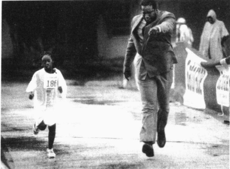

这幅图片抓住了家庭社会化的一种极端模式。这位父亲似乎比他的女儿更热衷于目标而且更加努力，因为在全美三项全能运动少年组的比赛中，是他把女儿推向了终点线。

然而，一些工人阶级的父母的行为更像中产阶级，而一些中产阶级父母的行为则更像工人阶级，这让科恩感到不解。当科恩探察原因时终于发现，关键在于父母工作的类型。比如，中产阶级的办公室人员，他们更多地处于监督之下。科恩发现这些人按照工人阶级的抚育方式养儿育女，强调遵从。而一些蓝领工人，比如修理工，他们有很多的自由，这些工人会按中产阶级的抚育方式养育孩子（Pearlin and Kohn，1966；Kohn and Schooler，1969）。

工人阶级父母和中产阶级父母在孩子怎样发展上也有分歧，单是在对孩子玩耍上就表现出有趣的不同结果(Lareau,2002)。工人阶级父母认为孩子会自然长大，而中产阶级父母则认为孩子需要许多正确的引导。所以，工人阶级父母认为自己的任务就在于为子女提供食物、房子和舒适生活，孩子的发展是他们自己的事情。他们设定限制(“不要接近铁路”)，让孩子自己按照自己的愿望玩耍。相比之下，中产阶级父母想让他们的孩子通过玩耍学习知识和社会技术。比如，他们想让孩子打棒球，但这并不是为了娱乐，而是为了帮助孩子学会怎样与人合作。

### 邻里社区

所有的父母都知道，一些邻里社区要比其他邻里社区对孩子的成长更有好处。他们试图搬到好的邻里社区——如果能负担得起的话。他们这种常识性的定位得到了社会学研究的证实。贫穷的邻里社区里的孩子更可能触犯法律、怀孕、辍学，并最终面对黯淡的人生（Wilson，1987；Brooks-Gunn et al., 1997；Sampson et al., 2001）。

社会学家还发现，富裕邻里社区的居民比贫穷邻里社区的居民会更多地看管孩子(Sampson et al., 1999)。这里的父母更可能了解当地的儿童和他们的父母，以确保孩子的安全和避免麻烦。这真是个讽刺：在那些对孩子更危险的邻里社区(有更多的凶杀和虐待儿童的地方)，父母却较少地看护孩子，而在那些孩子较少需要保护的邻里社区，父母却更加小心。

---

### 宗教

通过影响人们的价值，宗教成为人们对错是非观念中的关键组成部分。宗教对美国人来说至关重要，有68%的人信教。每周有2/5的人参加宗教活动（Statistical Abstract 2002: Table 64）。宗教对那些在非宗教的家庭里长大的人们来说也十分重要——宗教观念渗透整个美国社会，为所有人提供了基本的道德观念。

宗教的影响还扩展到我们生活中的许多领域。比如，参加宗教活动不仅让我们获得了关于来世的信仰，而且教会了我们在正式场合下合适的穿戴、言语和举止。宗教影响巨大，我们将在第18章详细介绍。

### 日托

社会科学研究很少成为全国新闻，但是偶尔也有。最近一个关于日托的研究就引起了很大争议。研究者追踪了10个城市的1300名儿童，从婴儿到幼儿园各阶段都有。他们观察了在家里的孩子和在日托的孩子（日托是指除了母亲以外的照顾——包括其他亲戚和父亲的照顾）。他们还录像并详细记录了儿童与其母亲的互动（National Institute of Child Health and Human Development, 1999: Guensburg, 2001）。这引起了媒体关注：日托更多的孩子和母亲的关系较弱。除此之外，这些孩子更容易打架、更残忍、更“坏”。相反，较少日托的孩子更具合作性，与母亲感情更深。无论日托的质量好坏、家庭的社会阶层高低、男孩还是女孩，结果都是这样。

这项研究设计很好，它的结论也无可争议。但是我们怎样去解释这些发现呢？原因就在日托的时间。研究者认为，那些花更少时间照顾孩子的母亲更少注意她们孩子的情感需要，因为她们不太熟悉她们孩子的“信号系统”。但是或许原因并不在于日托。也许让孩子接受更多日托的母亲起初就不太关心孩子。又或许有职业的母亲更少可能满足孩子的要求，因为她们比家庭主妇更累，压力更大。从这项研究中我们无法获知母子之间弱关系和孩子行为问题的原因。

这些研究者也发现了日托的一个积极方面。日托更多时间的孩子拥有更高的语言技能(Guensburg，2001)。那些得益最多的孩子来自那些低收入的家庭和功能失常的家庭——那些酗酒的、愚笨的、虐待人的父母(Scarr and Eisenberg，1993)。很明显，我们需要更多的研究来梳理出日托的结果。尽管这项纵向研究的结果远非让人振奋，但因此就认为日托制造了一代“坏但是聪明”的儿童也是没有道理的。

### 学校

止式教育的显性功能，或者说有意识的目的是传授知识和技术，比如读、写和算。这些技巧的传授是社会化的一部分，但是学校的隐性功能，也就是有助于社会系统的未预料到的结果，同样是社会化的一部分。让我们看看教育这一看不大到的方面。

在家中，儿童学习符合家庭生活情况的态度和价值。在学校里，他们学习帮助他们准备承担家庭之外社会角色更广阔的视角。例如，在家中，一个孩子可能是溺爱的父母的唯一关注点，但在学校这个孩子就学会了普遍性——同样的规则适用于每个人，不管其父母是谁或者他在家里有多特别。下面的“文化多样性”专栏说明，这些新的看待世界的价值和方式，有时甚至会取代儿童在家里学到的东西。

社会学家还发现学校里存在一门潜在课程。它指的是那些虽然没有明确讲授，却仍然是学校“信息”

---

### 美国文化多样性

### 夹在两个世界之间

学习另外一种新文化是一个痛苦的过程，因为它的行为和思维方式和已有的文化不同，这会引起内心混乱。克服这种冲突的一个方法就是切断与原有文化的联系。但是这样做会产生一种失落感，或许它只有在后来的生活中才能认识到。

理查德·罗德里格斯(Richard Rodriguez)是一名文学教授和散文家，他出生在一个墨西哥移民工人家庭。为了能在美国成功，他的父母给他起名理查德而不是西班牙语名字“Ricardo”。他的英语—西班牙语混合名字表明了他的父母对儿子的期望，同时也预示了理查德将遇到的矛盾。

像其他墨西哥移民的孩子一样，理查德的母语是西班牙语——使他最初了解世界的一门丰富的语言。到5岁开始上学时，他只知道50个英语单词。他描述了开始上学时的经历：

这种改变逐渐地到来了，但却很早。当我开始上学，我就注意到教室环境是如此不同于我自家环境的风格和设想，为了生存我只能二者择其一。当我成为一名学生时，我差不多要“重塑”自己，我和老师都不认为我以前学到的东西有什么用。我不得不忘记大部分原来的文化，因为记住它对我非常不利。我的过去和原来的文化价值观逐渐远去，就像天气变暖后衣服逐渐变重，最终被脱掉一样。

就像在他之前所有的移民孩子(他们的父母说德语、波兰语、意大利语等等)所遇到的一样，学习英语会侵蚀家庭和阶级联系，削弱他的民族根基。对于他来说，语言和教育不单单是帮助他向主流文化转变的工具，它们同时也会强烈冲击曾给予他生命的民族根基。

面临着相互冲突的文化就像面对着岔路口，一些人转向一个方向，从新文化中撤退——这可以解释许多拉美人为什么从美国学校中退学。其他人选择了相反的方向，他们切断与家庭和文化根基的联系，全心全意地适应新文化。

罗德里格斯选择了第二条路。他的新语言学得非常好，他从斯坦福大学毕业，成为加州大学伯克利分校一名英语专业研究生。他甚至获得了有名的富布莱特奖学金，在大不列颠博物馆学习文艺复兴时期的英语文学。

但是，罗德里格斯并没有摆脱过去的印痕。未来的老板对他的文艺复兴知识印象深刻。但是，在面试中他们却略过他的文艺复兴知识，问他是否能教墨西哥小说并成为拉美裔学生的指导老师。他还时常想起他的祖母、他抛弃的文化曾给予的温暖，以及那些早已变得陌生的语言和思想。

理查德·罗德里格斯代表了数百万移民——不仅仅是拉美裔的，还有来自其他文化的人。他们是那些不想背叛原有文化但又想融入美国社会的人。他们害怕整合进美国文化中会失去他们的文化根基。他们在两种文化中陷入了困境，每一个都在召唤他们，每一个都会给他们提供丰厚的报偿。

### 思考题

我曾在我父亲身上亲眼看到过这种冲突。他直到7年级(他的最高学历)以后才学习英语——他的英语还算流利，但口音和不标准的表达仍很多，还存留着对旧有方式的情感联系，以及对更同化了的美国人的怀疑、傲慢和蔑视。通过抓住过去而寻求安全感与新文化的日常现实是结合在一起的。你见过类似的事情吗？

资料来源：Richard Rodriguez (1975, 1982, 1990, 1991, 1995)。

的一部分的那些价值。例如，用来教数学和英语的故事和例子可能捎带着也给他们灌输了爱国心、民主、公正和诚实。还有一门走廊课程——课堂外同学之间彼此教会的东西。不幸的是，学生的潜在课程似乎

---

集中在种族主义、男性至上主义、非法挣钱和冷漠上(Hemmings,1999)。你可以自己判断哪个是有功能的，哪个是功能失调的。

冲突论者指出了社会阶级的重要性。出身富裕的儿童上私立学校，在那里学习适合上层社会的技术和价值。出身较贫穷的儿童上公立学校，在那里他们发现，他们“这类人”很难成为专业人员和领导者。在公立学校，社会阶层也很明显，来自蓝领家庭的孩子较少上大学预科课程。简而言之，全世界的学校都反映和强化了他们国家的社会阶级、经济和政治体制。我们将在第17章再回到教育这个话题上。

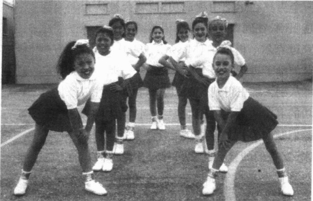

学校是一个主要的社会化主体。它们的一个主要功能是根据适合年轻人的成年社会角色把他们分组，教给他们适合这些社会角色的态度和技巧。你认为那些在加州桑塔莫妮卡高中的低年级女孩子正在被社会化成哪一类的态度和成年社会角色？它是正功能的还是反功能的——或者是两种都有？

### 同辈群体

随着一个孩子经历社会化的主体的扩展，家庭的影响逐步减弱。进入学校仅仅标志着这种转变中的其中一步。教育最重要的一个方面就是让孩子接触同辈群体，这可以帮助他们抵抗家庭和学校社会化的影响。

社会学家帕特里夏·阿德勒和彼得·阿德勒（Patricia and Peter Adler，1992，1998）夫妇观察了科罗拉多州两所小学的孩子。他们观察孩子们如何按照性别分开、如何用某些特定规范建立自己的世界。使一个男孩受欢迎的规范是运动能力、冷静和坚韧。女孩的规范则是家庭背景、外表（穿着和化妆品的使用）和吸引受欢迎男孩的能力。在这个儿童亚文化中，学习成绩的作用完全相反：对男孩来说，好的成绩降低他们的受欢迎程度，但是对女孩来说，好的成绩将提高她们在同辈群体中的地位。

你会从自己的经历中得知同辈群体是多么有强制力，违背一个同辈群体几乎是不可能的，它的主要规则似乎是“遵从或拒绝”。不按照其他人想的那样做的任何人都会变成一个“外来者”、一个“非会员”、一个“被驱逐者”。对于正在学习周围世界的青春期以前的孩子和十几岁的孩子来说，同辈群体的支配力量并不令人吃惊。

结果就是我们同辈群体的规则主导了我们的生活。例如，如果你的同辈们听打击乐、重金属音乐、摇滚乐、乡村音乐或者黑人福音音乐，那么你不可避免地也会喜欢这些种音乐，在其他种类的音乐、衣着风格和约会标准上同样也是如此。同辈影响也会扩及触犯社会规范的行为。如果你的同辈群体都想上大学并努力向上奋斗，很可能你同样会变成那样，但是如果他们吸毒、欺骗和偷盗，你也很可能变成那样。

### 体育运动和竞争性成功

体育运动是另一个强大的社会化的主体。每个人都认识到运动不仅能锻炼身体，还能教给我们价值。事实上，“教会年青人变成团队队员”经常是为有组织的运动筹措资金的理由。

体育运动对自我形象的影响目前还不是很清楚。男孩们知道运动的成就就是获得男性气质地位。

---

一个男孩在运动中越成功，他就会被认为越阳刚，在同辈群体中声望越高。社会学家迈克尔·梅斯纳(Messner，1990)指出，这鼓励了男孩发展工具性关系——基于你能从别人那里得到什么。男孩在竞争性成功的其他方面的社会化具有同样效果，男孩们倾向于和女孩建立工具性关系。反过来，女孩们的社会化更可能基于意义性的关系而不是竞争性成功，来建立她们的身份。随着运动对女性身份的形成变得更加重要，我们将拭目以待运动会对女性产生什么样的影响。

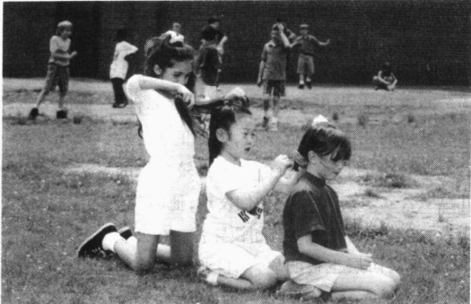

许多希望减少社会性别差异的成年人更愿意男女生同校的小学生共同参与操场活动。尽管有时不是老师有意无意的建议，但小学生们仍会一贯地按照性别分开，他们会寻求不同的兴趣和活动，从而形成了相反的规范。

### 工作场所

人生中较晚发挥作用的一个社会化的主体是工作场所。那些最初在高中和大学从事的工作，不仅仅是一种可以赚钱的方式。从并肩工作的人们中，我们学会的不仅仅是一套技术，还有对世界的看法。

我们大部分人通常在试过多种工作后最终都要从事某种职业。这涉及到预期社会化(anticipatory socialization)，即在进入社会角色前学习它。预期社会化是对未来行动的一种精神上的演习。我们可以和从事某一职业的人们交谈，读关于工作种类的小说或者做个暑期实习生。这使我们逐渐认同社会角色，开始认识到社会对我们的期望。有时这样做可以避免人们从事不适合自己的职业，就像我的一些学生想做老师，却发现他们无法胜任，然后转向其他自己更喜欢的领域。

作为社会化主体的工作的一个有趣方面是，你越多地参与某种工作，工作就越多地变成自我概念的一部分。最后当有人要你描述你自己的时候，你会更多地想到和工作相关的自我，并将工作包含进自我介绍中。你可能会说“我是个老师”、“我是个护士”、“我是名社会学家”。

### 再社会化

一个刚成为修女的女人和一个刚离婚的男人之间有什么共同点？答案就是他们都正在经历再社会化(resocialization)；即他们正在学习新的规范、价值、态度和行为来适应他们新的生活情形。再社会化最普遍的形式发生在每一次重新学习与以前经历相反的经历时。一个坚持用不同方式做事的新老板就是在再社会化你。大部分再社会化都是温和的，只是对原有所学的做轻微的修改。

然而，再社会化也可以是很激烈的。例如，参加戒酒中心的人被那些戒过酒的人包围着，他们不断强调过度饮酒的危害。当一些学生从高中进入大学时——特别是在那些尚未适应的慌乱的日子里，他们经历了一个剧烈再社会化的阶段。加入一个教派或者进行精神疗法更加意义深远，因为它们使人们接触到与以前看待世界的方式相冲突的观念。如果这些观念被“接受”，不仅个人行为会发生改变，而且他或她也学到了一种完全不同的看待生活的方式。

---

### 管制机构

我们很少有人经历过欧文·戈夫曼(Goffman,1961)所称的管制机构(total institution)，一个强大的社会化的主体。他的这一术语指的是一个与社会外界切断联系，几乎全部控制在当局者手中的地方。海军训练新兵的营地、监狱、集中营、女修道院、一些宗教教会、一些寄宿学校比如西点军校，都是管制机构。

一个人进入一个管制机构时会经历一个降身份仪式（degradation ceremony）（Garfinkel, 1956），即试图通过剥掉个人当前的身份和添加新的内容来重塑自己。这种讨厌的仪式包括指纹识别、照相、剃头和禁止有个人身份标识（比如珠宝、发型、衣着和其他表现个性的身体饰物）。新来者被命令脱掉衣服，经历一个检查（通常是在一个羞辱性的、半公开的场合），穿上用来指定新地位的统一制服。（对于犯人来说，公开朗读判决书、带着手铐被武装警察带走也是降低身份仪式的一部分。）

管制机构是和公众隔离的。高墙、铁栏、大门、警卫或者其他障碍，不仅使里面的人出不来，也使外界的人进不去。管制机构压制以前的地位角色：里面的人认识到他们以前的角色比如夫妻、父母、工人或者学生都没有意义，唯一算数的就是目前的角色。管理者控制着信息，用自己的规则、价值和人生观代替了“外面世界”的规范，这使机构可以形塑里面的人的思想和世界的“形象”。管理者控制着奖惩，密切监督居民的日常生活，吃饭、睡觉、洗澡、娱乐——所有的都是标准化的。在被剥夺的情况下，作为顺从的简单奖赏，比如睡觉、一个电视节目、一封家书、额外的食物，甚至一根香烟，都是控制行为的强大刺激。

进入管制机构的人没有能幸免的，这种经历给一个人的自我打上了无法抹去的烙印，影响着我们如何看待世界。就像下页专栏所介绍的，海军新兵训练营的经历虽然残酷但却为时甚短，相比之下监狱的经历则是既残酷又长久。然而，不论新兵还是犯人，都不难指出管制机构是如何影响自我的。

### 一 生的社会化

目前你正处于人生中的一个特殊阶段，大学是其中很好的一个部分。随着生活向前发展，你会经历更多的阶段。从出生到死亡，这些阶段贯穿你的一生，它们被称为生命历程（life course）（Elder，1975；1999）。生命历程的社会学意义是双重的。首先，随着你经历了一个阶段，它将会影响你的行为和定向。你30岁的时候通常已经结婚，有了孩子，贷款买了房子，对生活的思考不可能和在18岁或20岁做单身大学生时一样（实际上，大一和大四的学生对生活想的也不可能一样）。其次，你所处社会的历史时期不同，你的生命历程也不同。最后，你的社会位置会发挥作用——你的社会阶级、种族和性别会产生各种各样的经验世界。从而，男性和女性，富人和穷人等等的典型的生命历程都是不同的。为了强调这一主要的社会学观点，在下面的分析中，我将强调人们生活的历史背景。因为身处特定的社会位置，你自己的生命历程可能与这里所说的不完全相同，它是一个其他人所提出的阶段的复合体（Levinson，1978；Carret al.，1995；Lee，2001）。

### 童年期(从出生到约12岁)

先想一下,如果你出生在中世纪,你的童年会与你经历过的有什么不同。当历史学家菲利普·埃里

---

## 现实社会学

# 一个管制机构——海军陆战队新兵训练营

汽车到达加利福尼亚南部的巴里斯岛是在早晨3点钟，这是有意安排的。新兵们头昏眼花，迷迷糊糊。就在几个小时前，他们还是普通平民，现在，就像教官轻蔑地称他们为“蛆”一样，他们被很快剃成光头(每个新兵25秒)，扔进了严酷的海军陆战队新兵训练营。

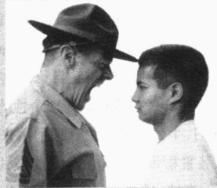

剪掉头发是剥夺他们身份的第一步，以使海军陆战队能重新灌输一个新

再社会化通常是个轻缓的过程。一般我们都是逐渐地表现出不同的思维和行动方式。但是有时再社会化则是急剧而残酷的，就像在海军新兵训练营，这个建在巴里斯岛的秘密场所是用来学习一个非常不同于文明社会的世界的。

身份。穿制服也是出于同样目的。这里禁止使用第一人称“我”。即使简单的要求也必须遵守严格的海军陆战队规则，否则就不被接受。（“长官，新兵约翰要求允许打电话，长官。”）

接下来的11个星期的每一刻都提醒着新兵们，他们进入了一个自律的亚文化群。在这里，享乐可耻，牺牲光荣。随着他们学习海军陆战队的谈话、走路和思考方式，他们无法接触那些曾经认为理应拥有的丰富多彩：电视、香烟、汽车、糖果、软饮料、电子游戏、音乐、酒、毒品和性。

教训是很严厉的。当凯利中士检查黄铜皮带扣时，新兵罗伯特·谢尔顿紧张地脱口而出“我没有”。凯利中士脸色涨红，脖子青筋暴跳，贴近新兵的脸几厘米近，唾沫横飞，咆哮道：“‘我’已经死了。”

“没有人是一个人”是个被一遍遍灌输的教训。“你是一支队伍，一名海军陆战队员，不是一个平民。不是黑人或者白人——拉美裔人或是任何归化的美国公民——你只是一名海军陆战队员。你将像海军陆战队员一样生活、战斗，如果必要，就要像海军陆战队员一样去死。”

伴随着封闭的命令形式，新兵们天没亮就开始了一天的生活。每一天都排满了各种训练：空手格斗、行军、跑步、柔道体操、海军陆战队历史，以及，永远服从命令。

“M-16 自动步枪可以在 500 米远的地方打爆对方的头，”凯利中士说，“这太棒了，是不是？”

“是的，长官！”一个排里59个人异口同声地喊道。

“指着你的鼻子！”59个食指同时指向鼻子。

服从的压力很大。在训练中人们使用抑扬顿挫的语调嘲笑那些因为不服从或者有自杀倾向而被遣返的人。（“希望你喜欢这里的风景 / 巴里斯岛的伤兵们。”）晚上9点终于熄灯了，精疲力竭的新兵完成一天的最后一件任务：全排合唱赞扬海军陆战队精神的歌曲。

新兵们经常被审查。不合格是不能接受的，不管是脏的步枪还是制服上松动的线头。不合格行为会遭到呵斥、嘲笑和羞辱。整个组都会因个人行为受到牵连。如果一个新兵慢下来，整个排都会被惩罚。

系统行之有效。

一名新海军陆战队员(毕业之前一直是新兵，还不是海军陆战队员)说：“我觉得好像加入了另一个社会或宗教。”

他说的一点没错。

### 思考题

新兵的降身份仪式的意义是什么？为什么新兵们不被允许玩电子游戏、吸烟或者打电话回家？为什么海军陆战队不公平地因为个人的失败而处罚整个排？用本章的相关概念解释为什么这个系统行之有效。

资料来源：Garfinkel (1956); Goffman (1961); "Anybody's Son Will Do," , 1983; Ricks (1995); Dyer (2003).

---

斯(Ariès,1965)观察中世纪的绘画时，他注意到儿童总是穿着大人的衣服。如果不是在家庭肖像中摆出僵硬的姿势，他们就是做着各种成年人的活动。由此，埃里斯得出一个在历史学家中颇具争议的结论——那个时候，那个地方，童年不被认为是生命的一个特定阶段。他说大人把孩子看做是具体而微的成年人，让他们很早就工作。比如，7岁的时候，一个男孩可能就会永远离家学习成为一名宝石匠或者石匠。一个女孩待在家里直到她结婚，但是到了7岁她也要承担家务劳动。历史学家承认这些是那个时期的习俗，但是一些历史学家却认为埃里斯的结论是荒谬的，他们说这一时期的其他证据表明童年被看做是生命中的一个特定阶段(Orme,2002)。

这样的经历并没有随着中世纪的过去而消失。它在最不发达国家的孩子当中还很常见，这些孩子和大人一起干活。发达国家和不发达国家的孩子们有不同的活动，这也反映了不同社会对孩子有着不同的看法。

在从前，父母和老师认为吓唬孩子使他们听话是他们义不容辞的道德责任。他们会把孩子关在黑暗的壁橱里，用死亡和地狱之火的睡前故事吓唬他们，迫使他们看到可怕的事物。看下面这个例子：

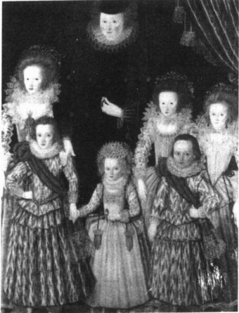

一个基本的道德课程包括带着孩子参观绞刑架[一个树立起来的架子,处死的尸身悬挂在上面],在那里,孩子们被迫

在当代西方社会，比如美国，儿童被视为天真无邪的，需要受到来自成年人的责任比如工作和自立的保护。童年期的看法是随着历史和文化的不同而不同的。从绘画中，比如这副1605年的塔斯伯格夫人和她的孩子们的油画，历史学家得出结论，欧洲人曾把儿童视为小的成年人，他们认为，儿童在童年初期就已经担当起成年角色了。

观看悬挂着的腐烂的尸体，以看到作为坏孩子长大后的一种处罚。整个班级被带出来看绞刑，随后父母会鞭打孩子使他们记住所看的东西。(DeMause,1975)

工业化改变了我们理解孩子的方式。当孩子上学时，他们被认为是稚嫩的和天真的，需要大人更多的关心、照顾和保护。随着时间延续，这样的依赖态度渐渐养成。今天，如果孩子要在情感上、智力上、道德上、身体上健康成长，我们认为孩子需要被小心呵护。我们想当然地认为我们的想法是对的——毕竟它是“一般常识”，然而，就像我们所看到的，我们的观点并不是“自然的”，而是扎根于不同的区域和历史中。

技术也能改变童年期的天性。当电视节目充斥着成年人眼中的世界，诸如谋杀、强奸、战争和其他暴力，年幼的孩子也就看到了一个他们以前不知道的陌生世界(Lee,2001)。

### ▷▷小结

童年期不仅仅是生物性的。每个人的童年都是发生在历史的某一时刻，嵌入特定的社会位置——特别是社会阶级和社会性别之中。这些社会因素和我们的生物属性同样重要，因为它们决定了我们的童年会是什么样的。尽管孩子的生物属性（比如幼小和依赖）是共同的，但其社会经历（由于他人对孩子的期待而发生在孩子身上的事情）却是不同的。因此，社会学家认为童年随着文化的不同而不同。

---

### 青少年期(13—17岁)

青少年期不是一个“自然的”年龄级。它是一种社会产物。早在几个世纪以前，人们从童年期直接进入青年期，中间没有停顿。工业革命带来了大量的物资过剩，这在历史上第一次使得数百万的十几岁的孩子停留在劳动力之外。同时，教育对于以后的成功则越来越重要。这两种力量在工业社会中的集中，导致了童年期和成年期之间出现一个空隙。在20世纪早期，出现了“青春期”这个术语来表示生命中以内部紊乱而著名的这个阶段(Hall，1904)。

部落社会举行成人仪式来为自我认同打下基础，并标志着儿童长大成人。但在工业社会，青少年必须自己“发现”自己。为了区别于已经留在身后的“更小”的世界以及尚未经历的“更大”的世界并开创自己的身份，青少年用独特的衣着、发型、语言、姿态和音乐发展出他们自己的亚文化。我们往往没有认识到是当代社会而不是生物因素，创造了一个叫做青春期的内部紊乱时期。

### 青年期(18—29岁)

如果社会创造了青少年期，它还能创造其他阶段吗？历史学家肯尼思·凯尼斯顿认为确实如此。他发现，工业化的社会给生命历程添加了一个青年延长阶段，在这个阶段人们在度过了青少年期后推延了担负成年人的责任。数百万人在高中毕业后接受进一步的教育，而仍然不用自己养活自己。在这个时期，人们“既不是心理上的青少年也不是社会化的成年”（Keniston，1971）。在这个青年延长阶段的某个时候，年轻人更轻松地逐渐承担起成年人的责任。他们完成学业，找到全职工作，忙着恋爱，结婚——并开始负债。

在许多社会中，只有男子到达一定年龄才能被看做成年。成年在一个社会中，更是意味着一种必须获得的身份。如图片所示，在印尼有种初级仪式，男孩要获得成年地位，必须跳过这个障碍物。

### 中年期(30—65岁)

中年早期(30—49岁) 在中年早期,大部分人对他们自我和自己的生活目标更加确定。然而,同其他生命历程阶段一样,在这个阶段,自我也可能会面临危机——如离婚或被解雇。经此变故,自我或许需要许多年才能重新稳定。

中年早期对美国妇女是个特殊的挑战，特别是通过媒体，她们接收到这样的信息，她们可以“拥有一切”。她们是超级工人、超级妻子、超级妈妈——这些都压在她们的双肩上。然而，现实总是充满了相互冲突的压力——太少的时间和太多的要求。有时不得不放弃。在试图解决这个两难困境时，她们又面临着另一个严峻的现实——在性别社会化中，她们的丈夫学会了认为照顾孩子和做家务不是“男子汉的行为”。简而言之，在这个阶段和一生的各个阶段，人们都在持续不断地调适。

中年晚期(50—65岁) 在中年晚期,随着人们感觉到身体的变化,特别是当看到父母虚弱、生病和死亡的时候,健康和死亡开始成为渐渐逼近的问题。结果就是思维取向的根本性调

---

整——开始时感到人生漫长，现在则感到人生短暂(Neugarten,1976)。随着这个取向的改变，人们试着回顾过去，珍惜未来。他们比较所达到的成就和期望中的成就。许多人发现他们不仅要照顾儿女，还要照顾年迈的父母。因为这些沉重的负担，处于中年后期的人们有时也被称为“夹心三明治的一代”。

这个阶段的生活也并非总是紧张不堪。许多人都发现，中年晚期是他们一生中最舒服的时候。他们工作稳定，享受较高的生活水准；他们有宽敞的房子(或许已经付完款的)、新车和更多的异国假期旅行。孩子们已经长大，自我已经完全巩固，也不大可能发生大的变故了。

然而当他们展望下一个阶段的生活时，大部分人却都不太想看到。

### 老年期(约65岁以后)

老年早期 在工业社会，老年期从65岁左右开始。这同样也是新近的产物。在农业社会，人们死亡早，老年期被认为始于40岁。随着营养、公共卫生和医药护理的改善，工业化延长了人们的寿命。现在，那些健康的65岁以上的人通常不被认为是处于老年期，而是中年期的延续。那些继续自己喜欢的工作的人，很少认为自己是老人（Neugarten，1977）。尽管性生活的次数有所下降，但是大部分60多岁和70多岁的老人依然有积极的性行为（Dennev and Ouada $ \underline{\text{gno.1992）。}} $

因为我们有自我意识并能抽象推理，我们会想到死亡。一开始，死亡是个模糊的概念，一个遥远的可能性。但是眼看着朋友死去，自己的身体功能大不如先，死亡就变得不再那么抽象。在这个人生阶段，人们会越来越感觉到“来日无多”。

老年晚期除了第一个阶段，就像先前的那些阶段一样，这最后一个阶段也没有明确的起点。对一些人来说，过了75岁生日就标志着进入了这个阶段。对其他人而言，可能是80或者85岁的生日。对大部分人来说，这个阶段的标记是衰弱和疾病；这一阶段最终以死亡结束。有些人的衰老很缓慢，但很少有人能在过100岁生日的时候仍然精神矍铄身体康健。

### 生命历程的社会学意义

生命历程的社会学意义在于它不只是代表了生物特征，即随着年纪变大发生在我们身上的事情。社会因素也会影响我们的生命历程。就像看到的那样，你生活在什么时代对于你的生命历程有着重要影响。时间的影响并不需要很大。早出生10年或晚出生10年意味着你经历战争或者和平，经济繁荣或萧条——这些因素将会极大地影响发生在你身上的事情，不单单是在童年期，还在你的一生中。

你的社会位置,比如社会阶级、性别和种族也具有重要意义。你对社会事件的体验,将会和那些与你处于同样社会位置的人的

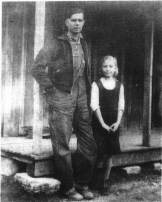

这幅照片于1937年1月摄于美国田纳西州的斯尼德维尔，照片中的人是9岁的尤尼斯·约翰斯和她22岁的丈夫查利·约翰斯。新郎给了他的妻子一个洋娃娃作为结婚礼物。这对新婚夫妇计划建造一个小木屋，查利·约翰斯认为通过它可以“自立门户”了。这幅照片显示了生活阶段的文化相对性，我们有时感到对此不可理解。符号互动论的一个观点很有趣——正是改变了的定义——才会使得我们对这种婚姻感到震惊，这种婚姻即使不是普遍的，也曾被认为是理所当然的。

---

体验类似,但是与那些不同社会位置的人则不同。例如,如果你很贫穷,就会感到自己比那些最富有的人们老得更快,因为他们的生活不那么艰难。生命历程也会受到个人因素的影响——比如你的健康,早婚或者晚上大学——这会使你的生活变得“失序”或者非典型性。

由于以上诸多原因，这一对生命历程的描述或许不能完全反映你的过去、现在和将来。就像社会学家赖特·米尔斯(Mills,1959)说过的，因为老板们器重你，你就会更倾向于结婚、买房子、组建家庭——或者如果没有，就会延迟这些生命历程，甚至永远也不能实现。简而言之，变化的时代改变着生活，带领生命历程驶向不同的方向。

### 我们是社会化的囚徒吗？

从我们关于社会化的讨论中，你可能会得出结论，社会学家认为人类是机器人：输入社会化，行为表现出来。人们无法控制他们的行为、思维和感觉，因为每件事都只是社会化的主体的作用结果。

其实社会学家并不这样看待人。尽管社会化是强有力的，并深刻地影响着我们，但是我们每个人都有一个自我。这个自我建立在童年基础上并在以后的经历中不断进行修正，它是动态的。自我不是海绵，只会被动地吸收环境的影响，而是一个活跃的、我们存在的本质部分，使我们可以作用于环境。

的确，正因每个人不是机器人，他们的行为很难预知。无数的他人的反应融进了每个个人当中。在前面的讨论中，即使同一对双胞胎也无法从他人那里得到同样的反应。随着自我的发展，我们内化这些反应，或者说把它们“结合在一起”，创造了一个唯一的整体，我们称之为个体。每一个唯一的个体都会运用自己的思想去推理并在生活中作出选择。

通过这种方式，我们每一个人都积极地卷入了自我的构建中。例如，尽管我们的家庭经历组成了我们人格的基本元素，其中包括对生活的根本取向，但是我们如果不喜欢，也不是注定非得要它们。我们可以有目的地接触我们喜欢的群体和想法。反过来，那些经历则将会影响自我。简而言之，尽管社会化很强有力，但是在我们所处的社会位置的结构限制内，我们甚至可以改变自我。自我(以及社会)提供的可能选择，是我们行为的关键要素。

### 本章小结

### ☆人类的本性是什么？

人类特征有多少来自“自然本性”(遗传)，多少来自“教化”(社会环境)?

对与世隔绝的儿童、制度化的儿童和野孩的观察有助于回答这个问题，用隔离养育的猴子做的试验也对回答这个问题有帮助。语言和亲密的社会互动——“教化”方面——对于我们认为的人类特征的发展至关重要。

### ☆ 自我和意识的社会化

### 我们怎样获得自我？

人类天生就有形成自我的能力，但是自我必须由社会构建；也就是说，它的内容依赖社会互动。根据库利的“镜中我”概念，自我的发展伴随着我们内化他人对我们的反应。米德证明了扮演他人角色

---

的能力对于自我发展至关重要。米德认为，甚至意识都是一种社会产物。

### 儿童怎样发展推理能力？

皮亚杰认为儿童认知发展经历了四个阶段：(1)感知运动阶段：理解能力仅限于感觉刺激，比如触摸和视觉；(2)前运演阶段：拥有运用符号的能力；(3)具体运演阶段：思维更复杂但是不能进行复杂的抽象思维；(4)形式运演阶段：抽象思维能力。

### 社会学家如何评价弗洛伊德关于人格形成的精神分析理论？

弗洛伊德认为人格的形成是本我(天生的、自我中心的要求)与社会要求冲突的结果。自我用来平衡本我和超我，即良心。相比之下，社会学家不注意天生的和潜意识的动机，而是强调社会因素(社会阶级、社会性别、宗教、教育等)如何成为人格形成的基础。

### 人们怎样形成道德？

儿童天生没有道德，根据科尔伯格的研究，他们在学习中经历了四个阶段：非道德阶段、前惯例阶段、惯例阶段和后惯例阶段。男人或者女人作出道德决定时都会使用个人关系和抽象原则。

### 社会化怎样影响情感？

社会化不仅影响我们怎样表达情感，而且影响我们感觉到什么样的情感。情感社会化是促进社会服从的一种方法。

### ☆性别社会化

### 性别社会化怎样影响我们的自我意识？

性别社会化(即把男性和女性分成不同的社会角色)是控制人类行为的一种主要方法。儿童甚至在婴儿时就接受了性别信息。一个社会理想的性别行为被社会制度所强化。

### ☆社会化的主体

### 主要的社会化的主体是什么？

社会化的主体包括家庭、邻里社区、宗教、日托、学校、同辈群体、体育运动、大众媒体和工作场所。每一个都有特定的影响，使我们社会化为合格的社会成员。

### ☆再社会化

### 什么是再社会化？

再社会化是指学习新的规范、价值、态度和行为的过程。大部分再社会化都是自愿的，但是有一些(例如管制机构中的囚徒)则是被迫的。

### ☆一生的社会化

### 当我们成年后社会化就结束了吗？

社会化贯穿人的一生。在工业化社会，生命历程可以分为童年期、青少年期、青年期、中年期和老年期。典型的西方模式包括获得教育、变得自立、从事工作、寻找配偶、养育孩子和面对年老。生命历程模式有多种变化，随着诸如历史、性别、种族和社会阶级等社会位置的变化而变化，也受健康和结婚年龄等个人经历的影响。

### 我们是社会化的囚徒吗？

尽管社会化是强有力的，但是我们却不仅仅是社会化经历的总和。就像社会化影响人类行为一样，人们也会作用于他们的环境，甚至影响他们的自我观念。

---

### 批判思考题

1. 影响你最大的两种社会化的主体是什么？你能指出它们对你的态度、信仰、价值或者其他生活取向的影响吗？

2. 总结你的社会性别观。在你的性别社会化中，什么使你具有这些观念？

3. 你处于生命历程中的什么阶段？书中对此阶段的描述是否和你的经历相吻合？解释一下它们的相似性和差异性。