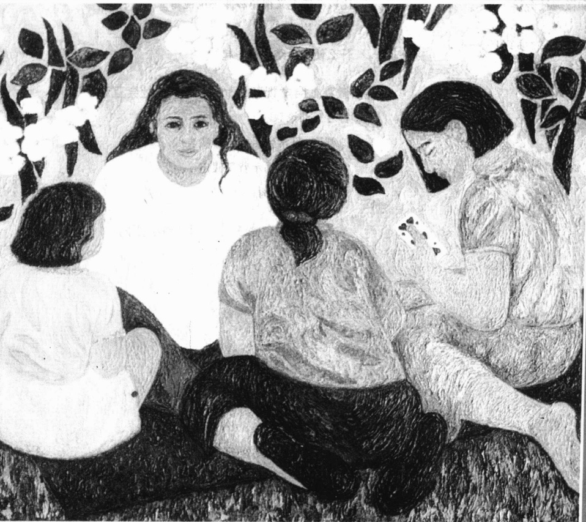
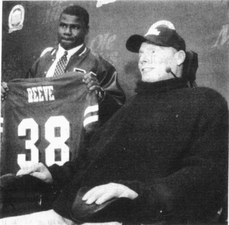
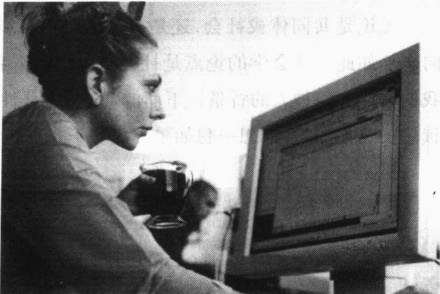
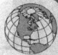
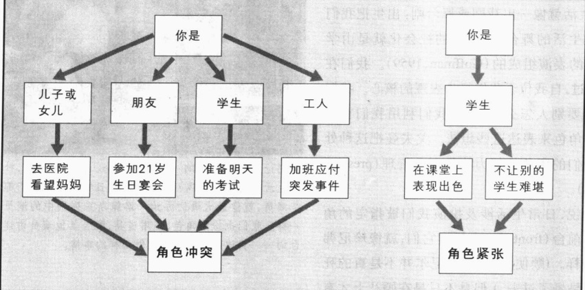
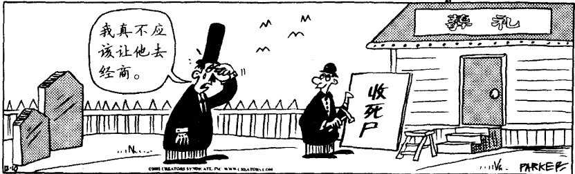

# 第 4 章 社会结构和社会互动

刘德会甘图次豫味一武晋奉聚众大千

文

罗莎·伊瓦拉

《6颗心》(1993)

---

宏观社会学和微观社会学

例子: 大众媒体作为一种新兴的社会制度

社会制度的社会学意义

·宏观社会学和微观社会学都是必要的

·本章小结

---

### 第 4 章 社会结构和社会互动

我的好奇心非常强烈。社会学会议结束之后，我乘上了驶来的第一辆公共汽车。我不知道这辆汽车将会驶向何处，也不知道我将会在哪里过夜。

当汽车沿着陌生的街道行驶时，我想“也许这次我做得有点过分”。事实上，这是我第一次到华盛顿，所以我从未见过这里任何一条街道。我没有目的地，没有计划，甚至没有一份地图。我没有带钱夹，只有塞在牛仔裤里的驾驶执照，那可以在紧急情况下证明我的身份。袜子里塞着点零钱和一张十美元的钞票。我的目标非常简单：如果碰到什么有趣的事情，就下车看个究竟。

汽车驶过一排又一排建筑物和商店，然而，“什么不寻常的事情也没有，”我自言自语道。也许我会整个晚上都坐在公共汽车上。正在这时，我被什么东西吸引住了。其实也没什么与众不同的——只是成群的人聚集在几条街相交的圆形区域。

我下了车，走到被称为杜邦广场的地方，在人行道长凳上找了个座位坐下开始观察。几个在街角一起喝酒和相互开玩笑的男人映入我的眼帘。其中一个人离开他的同伴走过来坐在我的旁边。我们交谈的时候，我主要是听。

夜幕降临的时候,那些人说他们还想再喝一瓶酒。我凑了一份子。他们数了数钱,并问我想不想和他们一起去。

虽然觉得我的肚子有些难受——因为犹豫和害怕——我却听到自己非常自信地说“当然”。我们离开广场以后，这三个人开始拐进一条小胡同。“哦，不，”我心说，“这并不是我想去的地方。”

我只有一瞬间的时间来做决定。我不由自主地继续跟着他们走，只是故意落后半步，以使这三个人没有一个走在我的后面。我们走着的时候，他们轮流喝瓶子里剩下的酒。轮到我时，我不知道该怎么办。一想到瓶子里潜藏的疾病，我就感到不寒而栗。我很快作出另一个决定。半明半暗中，我假装喝了，其实只是让我的拇指和食指碰到嘴唇，并没有真喝进去。

我们回到杜邦广场,这些人又喝光了一瓶雷鸟。灯光下我无法伪装,只好指着肚子以示消化不良掩饰而过。

突然其中一个人跳起来，对着马路牙子摔碎了空酒瓶，并以一种威胁的姿势紧攥着参差不齐的瓶口。他怒视着前面另一个长凳，他认出那里有一个跟他有些过节的家伙。在另外几个人劝他要冷静的时候，我慢慢移向人群的另一边——准备逃跑，以防万一。

### 社会学分析的层次

在这次社会学探险中，我险些让自己玩过了头。幸运的是，一切平安。这个人的“敌人”没有朝我们这边看，摔碎的酒瓶被放在长凳旁边“以防万一”，我的这次“初尝生活”一直持续到黎明，而这种生活我

---

以前只是从书上读到过。

社会学家埃利奥特·利鲍(Elliot Liebow, 1967/1999)、米切尔·邓聂耳(Mitchell Duneier, 1999)和伊莱贾·安德森(Elijah Anderson, 1978, 1990, 1999, 2000)曾经写过关于这类人的有趣的评述。虽然街角人看上去毫无秩序(他们行踪飘忽、率性而为)，利鲍和安德森却分析过这些人如何受到社会的规范和信念的影响，就像我们一样。当我们分析过社会学所使用的两种分析层次之后，这一点会变得更为明显。

### 宏观社会学和微观社会学

第一个层次，宏观社会学（macrosociology），关注社会大的特征。使用这一方法的社会学家分析社会阶级以及群体是如何彼此联系的等等诸如此类的事情。如果宏观社会学家分析街角人，他们将会强调这些人处于美国社会阶级制度的底端。他们较低的社会地位，意味着他们将会失去很多机会：没有工作技术、缺乏教育、几乎没有什么可以让一个老板雇用他们。虽然是一个“正常的”人，但他们却没有资格享受福利，甚至连两年的期限也没有，所以他们生活落魄——结果也就只能流浪街头。

冲突理论和功能主义是宏观社会学分析的典范，两者都侧重更宏观的场景。这些理论的目标是考察那些影响人们的大规模社会力量。

而在第二个层次，即微观社会学(microsociology)层次上，社会学家考察社会互动(social interaction)——当人们在一起的时候，他们都做些什么。使用这一方法研究街角人的社会学家可能会重视他们的规则或相处“章法”；他们的生存策略；他们怎样分钱、酒和其他任何他们所拥有的资源；他们和女朋友、家庭、朋友的关系；他们在哪里消磨时间以及在那里会做些什么；他们的语言；他们在团体中的次序，等等。符号互动论侧重于研究面对面的互动，是微观社会学的典范。

因为每种方法都有其不同的侧重点，而宏观社会学和微观社会学都提供了各自独特的视角，所以两者对于获得关于社会生活的更完整的理解都是有必要的。比如，不使用宏观社会学，我们无法充分

社会学家同时使用宏观和微观分析层次来研究社会生活。使用宏观社会学来分析无家可归者——或者任何一种人类行为——的社会学家把重点放在社会的整体方面，比如经济和社会阶级。使用微观社会学方法的社会学家分析人们彼此之间是怎样互动的。这一图片说明了社会结构：有权势者和无权势者之间的差距是十分明显的。它同时也可说明微观方面——无家可归者的孤独。

地理解街角人。我们有必要把这些人放到美国群体是如何彼此相连的这一广阔的社会背景中去考察——因为，就像我们自己一样，这些人所在的社会阶级对他们态度和行为的形成起到了形塑作用。然而没有微观社会学我们也不能充分地理解这些人，因为他们的日常情况是他们生活中非常重要的一部分。

我们将会逐一考察这两种分析方法是如何帮助我们理解社会生活的。就像我们一样，你也许会发现你自己更喜欢其中的一种方式。社会学家经常会遇到这种情况。因为个人的背景和专业训练的关系，社会学家会发现他们自己更喜欢一种方法并在他们的研究中使用它。虽然如此，这两种方法对我们全面理解社会生活都是非常有必要的。

---

### 宏观社会学视角：社会结构

为什么本章开篇短文中的街角人会通宵达旦地喝酒并随时使用致命武器？为什么我们不会这样做？社会结构可以帮助我们回答这些问题。

### 社会结构的社会学意义

为了更好地理解人类行为,我们需要理解社会结构,即在我们出生之前就已固定下来的社会框架。社会结构(social structure)指的是一个群体的典型模式,比如男女之间或师生之间的一贯的关系。社会结构的社会学意义是,它引导着我们的行为。

由于这一术语有点模糊，让我们来看看你是如何在你自己的生活中经历社会结构的吧。当我写到这些的时候，我不知道你的种族、你的宗教、不知道你是年轻人还是老人、是高还是矮、是男还是女。也不知道你是在农村、郊区还是市中心长大。我也不知道你高中读的是公立学校还是高级预科班。但是我知道你是大学生。单是这一点就可以让我知道很多有关你的事情。

从这一信息出发，我可以假定你所在大学的社会结构正在塑造着你的行为。比如，我们可以假设今天你对一些重大新闻感到非常兴奋。我可以相当肯定地说(注意并不是绝对，只是相对肯定)当你走进教室的时候，社会结构压制着你的情绪。也就是说，你不会声嘶力竭地大喊，也不会兴奋得把课本抛向天空，你会温文尔雅地走进教室，坐在自己的座位上。

相同的社会结构也影响着你的导师，即使他或她正面临离婚、有一个孩子死于癌症，或者，他刚刚得到提升或是获得了百万美元的奖金。导师也许想“偷着乐”或者轰轰烈烈地庆祝一番，但是最有可能的是，他或她仍旧像平常一样上课。简言之，社会结构倾向于压制个人的情感或欲望。

就像社会结构影响你和你的导师一样，它同样给街角人也设定了限制。他们自身也会发现自己在美国社会结构中处于特定位置——尽管与你或你的导师的位置十分不同。因此，他们也就会受到不同的影响。他们的社会位置不会引导他们去做笔记或听讲座。和你的行为一样，他们的行为也是其在社会结构中所处位置的必然产物。就他们在社会结构中的位置而言，彻夜喝酒是非常“自然”的，就像你为了应付一门很关键的考试而熬夜学习一样。对你而言，当在非常拥挤的课堂上迟到时，对在你的座位上放了书本的那个人点头示意和说声“对不起”是非常“自然”的，就如他们摔破酒瓶、怒视敌人一样。

简言之，人们是因为他们在社会结构中的位置而习得了他们的行为和态度(无论他们是拥有特权的还是被剥夺了权力的，或者是处于两者之间的)，并据此行动。这对于街角人和我们自己来说都是一样真实的。行为和态度的差异不是由于生物学特征(种族、性别或任何一个基因因素)，而是由于人们在社会结构中的位置。和街角人交换一下位置，你就会看到自己的行为和态度的变化。

为了更好地理解社会结构，可以阅读一下下面有关橄榄球的“现实社会学”专栏。因为社会结构对我是谁和我是什么样的人有如此重要的影响，我们将会更加详细地考察它的主要组成部分；文化、社会阶级、社会地位、角色、群体和社会制度。

### 文化

我们在第 2 章中考察了文化对我们生活的深远影响。这里我们简单地总结一下它的主要作用。社

---

### 现实社会学

### 作为社会结构的大学橄榄球队

考察一下大学中的橄榄球队，可以更好地理解什么是社会结构（Dobriner，1969a）。你可能知道球队中的各个位置：中锋、后卫、擒抱、前锋、四分卫、跑卫等等。每一个位置都是一种地位，也就是说，每一个位置都是一种社会地位。对这些地位而言，每一个都有一种角色。也就是说，每一位置都有和其相联系的特定期望：中锋被期望抢球、四分卫传球、后卫拦截、擒抱阻挡突破、前锋接传球等等。这些角色期望引导着每一个球员的行动，也就是说，球员努力按照他们的角色所要求的去做。

我们假设橄榄球是你最喜爱的运动，你从来不会错过任何一场在你们大学里举行的主场比赛。再假设你已经毕业，有一份好工作，并且已经搬到很远的地方居住。五年以后，你因为怀念而重游你的校园。访问中最令你兴奋的是这一赛季中最大的橄榄球赛。当你看球的时候，你可能会惊讶地发现教练已经换了，但是你并不惊讶于球队每个位置上都是你不认识的人，因为所有你认识的球员都已毕业，他们的位置已被别人所代替。

这一场景映射着社会结构，即一个群体得以存在的框架。在橄榄球的例子中，这一框架由教练和11名球员的位置组成。比赛并不依赖任何一个特定的个人，而是依赖社会地位，即个人所占据的社会位置。当某一个人离开他的位置时，比赛仍可继续，因为别的人会接替这一职位或地位并扮演这一角色。即使原来的老队员一个也没有了，球赛仍可继续进行。圣母院球队今天仍然存在，即使肯纳特·诺克尼以及他的队员已经去世很久了。

即使你不玩橄榄球，你还是会在一个十分确定的社会结构中生活。你所占据的地位和你扮演的角色在你出生前就已经存在。你获得了生活中特定的位置，别人也是如此，社会一如既往地运行。虽然细节会随着时间而变化，但比赛——无论是生活还是橄榄球——却仍在继续。

会学家使用文化一词来指群体的语言、信念、价值、行为甚至姿态。文化也包括这一群体所使用的物质工具。文化是决定我们将要成为何种人的最宽泛的框架。如果我们是在爱斯基摩、阿拉伯、俄国或美国文化中长大，我们将和大多数爱斯基摩人、阿拉伯人、俄国人或美国人一样。我们不仅看上去长得像他们，也会像他们那样行动；在内心里，我们也会像他们那样思考和感受。

### 社会阶级

要理解人，我们必须考察他们在生活中所占据的社会位置。尤其重要的是社会阶级，它以收入、教育和职业声望为基础。那些在收入、教育水平、职业声望方面大致相当的人们组成一个社会阶级（social class）。重点强调社会结构的这一方面是有必要的，因为社会阶级不仅影响我们的行为，而且影响我们的观念和态度。我们和开篇小短文中描述的街角人在这一点上是一样的——他们和我们都会受到在社会阶级结构中所处位置的影响。他们的位置也许没有什么声望，但并不会因此就对他们的生活有较少的影响。社会阶级如此重要，我们将会拿出一章(第10章)来讨论这个话题。

### 社会地位

当你听到“地位”一词的时候,你很可能会想到声望。在人们的头脑中,这两个词是联系在一起的。

---

尽管如此，社会学家却是以不同的方式使用地位(status，指人们所占据的位置)。这一位置也许声望很高，比如法官和宇航员；也许声望很低，比如便利店职员或快餐店的汉堡师；也有可能被人看不起，比如街角人、有前科的人或小偷。

我们所有的人都同时占据着几种位置。你可能同时是儿子或女儿、工人、恋人和学生。社会学家使用地位丛(status set)一词来指一个人占据的所有地位或位置。很明显，当你的某一地位发生变化的时候，你的地位丛也随之改变。比如，当你大学毕业后找了一份全职工作，并结婚、买房、生孩子，你的地位丛就会发生变化——包括了职员、配偶、房主、父母的位置。

就像社会结构中的其他方面一样，地位是我们在其中生活的基本社会框架的一部分。在前面的例子中，来上课的学生和导师做别人希望他们所做的事情而不能考虑自己特别的情绪，这说明了地位是怎样影响我们以及我们周围的人的行为。我们的地位——无论是女儿或儿子、职员或恋人——引导着我们的行为。

先赋地位和自致地位 先赋地位 (ascribed status) 是自然而然获得的。你并未要求它, 你也不能作选择。有些是你在出生的时候所继承的, 比如种族、性别和你父母的社会阶级, 以及你作为男或女、女儿或儿子、侄女或侄子、外孙女或外孙等的地位。其他的比如青年人或老年人则与第3章中讨论过的生命历程相关联, 它们是在日后的生活中赋予你的。

相反，自致地位（achieved statuses）却是意愿性的，是你得到或者实现的地位。因为你的努力，你成为一个学生、朋友、配偶、犹太教拉比、牧师、神父或修女；或者因为缺乏努力（或是别人难以赏识的努力），你成为一个辍学学生、前任朋友、前配偶、被开除的拉比、牧师或修女。换句话说，自致地位既可以是积极的，也可以是消极的；大学主席和抢银行的人都是自致地位。

每一地位都为我们如何行动和感觉提供了指导。就像社会结构中的其他方面一样，地位限制了我们能做和不能做的事。因为社会地位是社会结构中的基本部分，它们存在于所有的人类群体中。

地位象征 对其独特的社会地位感到满意的人们想让别人认可他们占有那个地位。他们使用地位象征（status symbols，即识别一个地位的标识）来表示这种认可。比如，人们带着戒指来宣称他们的已婚地位；制服、枪、徽章则表明他们是警察（非常明显地宣称其地位赋予他们一种超越你的权威）；而“后翻领”则宣布他们是路德教会的牧师或者是罗马天主教、英国国教的牧师。

有些社会地位是负面的,因此,它们的地位象征也是如此。霍桑的小说《红字》中的“红字”就是一个例子。另一个例子是:一些美国法院要求曾酒后驾车的司机在他们的保险杠上贴上有“曾酒后驾驶”字样的粘贴物,如果他们希望避免坐牢的话。

我们所有的人都使用地位象征对他人宣布我们的地位，并帮助我们在日常生活中的互动顺利进行。不妨想想你自己的地位象征。比如，你的衣着是怎样宣示你的性别、年龄和大学生的地位的？

主导地位 主导地位(master status) 是超越你所占据的其他地位的那一个地位。有些主导地位是先赋的。例如你的性别。无论你做什么，人们都会把你看做一个男性或女性。如果你是通过做各种汉堡包读完大学的，人们不仅会把你看做汉堡包师和学生，而且会把你看做男或女汉堡包师和男或女大学生。其他的主导地位有种族和年龄。

---

主导地位是指那些使我们的其他地位显得不重要的地位。图片中的人物是克里斯托弗·里夫，他因为从马上摔下来而瘫痪了。在这次事故之前，里夫是顶尖的好莱坞演员，因饰演超人的角色而在世界范围内获得成功。今天，他的主导地位是作为一个残疾人。他已经接受了这一地位，现在他是那些忍受脊髓之痛的人们的代言人。里夫是作为克里斯托弗·里夫瘫痪基金会的募捐者而出现在这里的。

有些主导地位是后致的。如果你非常非常富有(无论你的财富是来自于发明还是抽奖——这在社会学家看来仍然是获得的)，你的财富有可能成为一种主导地位。比如，人们也许会说，“她是一个非常富有的汉堡包师”——或者更有可能的说法是，“她很有钱，她以前是做汉堡包的。”

同样地，那些容貌被毁的人将会非常沮丧地发现：他们的状况成了他们的主导地位。比如，一个脸部因严重烧伤而留下疤痕的人，不管其职业或成就，都会被通过这一讨厌的主导地位来看待。残疾人也是如此。那些被轮椅所限的人可以证明，他们的残疾是如何导致他们其他所有地位被忽视的，如何决定了他人看待他们所作每一件事的眼光。

虽然我们的地位通常会很好地吻合起来，但是有些人也会存在着地位之间的矛盾或不相配。这就是地位不符(status inconsistency，或错位)。14岁的大学生就是一个例子，与19岁的大学二年级学生拍拖的40岁已婚妇女也是如此。

这些例子揭示了社会地位的一个本质方面：

就像社会结构的其他组成部分一样，它们与引导我们行为的固有规范（也就是期望）相伴生。通常，各个地位之间会很好地结合，这时我们知道人们会作出什么样的行为。这能帮助社会互动顺利地进行。尽管如此，地位不符仍旧会打乱我们的期望。如果你遇到前面例子中提到的人，你会怎么办？你是应该像对待一个青少年还是像对待你的大学同学那样对待一个14岁的大学生？你会如何对那个已婚妇女作出反应：你是把她当成你朋友的妈妈来对待，还是把她当做你同学的恋人？

### 角色

世界是一个大舞台，

所有的男人和女人都是演员。

他们有的人退场，有的人入场；

而一个人在其一生中要扮演许多角色……

（莎士比亚：《皆大欢喜》第二幕第七场）

像莎士比亚一样，社会学家把角色看做是社会生活所必不可少的。你出生的时候，角色(与地位联系在一起的行为、义务和特权)就已经为你设置好了。社会展开臂膀等待着教你怎样作一个男孩或女孩。无论你出身贫贱、富裕还是介于两者之间，它都会将特定的行为、义务和特权与你的地位相联。

---

角色和地位的区别是：你占据着一个地位，但是却扮演着一个角色(Linton,1936)。比如，儿子或女儿是你的地位，你期望从父母那里获得食物或庇护(就像他们希望你尊重他们一样)就是你的角色。或者，再比如说，你的地位是学生，那么你的角色就是上课、做笔记、做家庭作业和参加考试。

角色的社会学意义就在于，它们表示了人们被希望些什么。它们就像一道藩篱，允许我们有一定范围的自由，但对我们大多人而言自由并没有延伸很远。假定一个妇女决定她不穿礼服——或者一个男人决定他不穿西服、不打领带——无论别人怎么说，在大多数情况下，他们都可以做得到。但在一些正式场合，比如家庭婚礼或葬礼，他们很有可能会屈服于强大的规范。这一藩篱为我们的角色标明了什么是“合适的”，几乎所有人都会呆在这一藩篱以内。大多数人很少会为这样的约束感到困扰，因为我们的社会化是如此彻底，以至于我们通常都会想要去做适合我们的角色的事情。

并不是所有的角色都是永久性的。有些会在规定的时间终结，比如大学毕业。另外一些即使我们不想如此也还是会终结，比如不情愿的离婚。角色退出（role exit）是社会学家用来表示角色终结的术语。角色退出总是涉及调整，因为你不得不习惯于自己不再是以前的“存在状态”（Ebaugh，1988）。角色退出也表示另一角色的开始，这一角色也许受到欢迎，比如大学毕业之后你想得到的职位；也许不受欢迎，甚至很不情愿，比如“离婚的人”，如果你真的希望婚姻能够继续，不希望再次进入约会阶段的话。这里的“如果”是很重要的，因为希望离婚的人和不希望离婚的人对这一角色的看法非常不同。

### 群体

一个群体(group)由经常和有意识互动的人们组成。一般来讲，一个群体的成员拥有相似的价值观、规范和期望。就像社会阶级、地位和角色影响我们的行动一样，我们所属的群体在我们的生活中也是强有力的影响因素。事实上，属于一个群体就意味着把作出自己行为的某些决定的权利出让给他人。如果我们属于一个群体，我们就有义务根据这一群体中其他成员的期望来行动。

虽然这一原则适用于所有群体，但有些群体只对我们行为中的很小一部分产生影响。比如，如果你参加了“集邮”俱乐部，这一群体的影响主要集中在你对邮票知识的展示，或许还有一些会议的参加方面。然而，另外一些群体（比如家庭）则控制着我们很多方面的行为。当父母对他们15岁的女儿说：“你要是还想和我们一起生活，最好午夜之前回家。”他们希望他们的孩子，作为家庭成员，能够遵照他们对生活中许多方面所持有的观念，包括对按时回家的看法。他们要说的是，如果女儿想继续成为这个家庭中的一员，她的行为必须符合他们的期望。

### 社会制度

乍一看，社会制度一词似乎与你的私人生活并没什么关系。这个词似乎有些太过冷漠和抽象。然而，事实上，社会制度（social institution，每一社会发展出来的用以满足其基本需要的组织化方式）对你的生活有着非常重要的影响。通过把社会的结构要素编织到一起，社会制度塑造着你的行为。它们甚至影响着你的想法。怎么会这样呢？想想什么是社会制度：家庭、宗教、教育、经济、医疗、政治、法律、科学、军事和大众媒体。

---

在工业化社会，社会制度倾向于越来越正式；在部落社会，社会制度则比较非正式。比如，工业化社会中的教育是高度结构化的，而在部落社会中，它则通常由向成年人的非正式学习组成。图4.1总结了基本的社会制度。注意：每一制度都有它自己的价值观念、角色和规范。社会制度是如此重要，本书第四部分将重点讲述它们。

图 4.1 工业社会和后工业社会中的社会制度

<table border=1 style='margin: auto; word-wrap: break-word;'><tr><td style='text-align: center; word-wrap: break-word;'>社会制度</td><td style='text-align: center; word-wrap: break-word;'>基本需求</td><td style='text-align: center; word-wrap: break-word;'>某些群体或组织</td><td style='text-align: center; word-wrap: break-word;'>某些地位</td><td style='text-align: center; word-wrap: break-word;'>某些价值</td><td style='text-align: center; word-wrap: break-word;'>某些规范</td></tr><tr><td style='text-align: center; word-wrap: break-word;'>家庭</td><td style='text-align: center; word-wrap: break-word;'>调节生育、社会化和保护儿童</td><td style='text-align: center; word-wrap: break-word;'>亲戚、血缘群体</td><td style='text-align: center; word-wrap: break-word;'>女儿、儿子、父亲、母亲、哥哥、姐姐、姑姑、叔叔、祖父母</td><td style='text-align: center; word-wrap: break-word;'>性忠诚、养家糊口、保持房屋整洁、尊重父母</td><td style='text-align: center; word-wrap: break-word;'>生几个孩子取决于其扶养能力、对你的配偶忠诚</td></tr><tr><td style='text-align: center; word-wrap: break-word;'>宗教</td><td style='text-align: center; word-wrap: break-word;'>关注死后的生活、痛苦和失去的意义；希望和造物主取得联系</td><td style='text-align: center; word-wrap: break-word;'>圣会、犹太教教会、清真寺、教派、慈善会</td><td style='text-align: center; word-wrap: break-word;'>神父、牧师、犹太教拉比、崇拜者、训诫者、信徒、传教士、先知、皈依者</td><td style='text-align: center; word-wrap: break-word;'>阅读和拥护神圣典籍，比如《圣经》、《可兰经》和《希伯来圣经》，尊敬上帝</td><td style='text-align: center; word-wrap: break-word;'>参加拜神仪式、捐助和遵从教导</td></tr><tr><td style='text-align: center; word-wrap: break-word;'>教育</td><td style='text-align: center; word-wrap: break-word;'>代际之间传播知识和技术</td><td style='text-align: center; word-wrap: break-word;'>学校、学院、学生评议会、体育队、家长协会、教师联盟</td><td style='text-align: center; word-wrap: break-word;'>老师、学生、主任、校长、球员、拉拉队队长</td><td style='text-align: center; word-wrap: break-word;'>学术诚实、好成绩、扮“酷”</td><td style='text-align: center; word-wrap: break-word;'>做家庭作业、准备讲座、不告发同班同学</td></tr><tr><td style='text-align: center; word-wrap: break-word;'>经济</td><td style='text-align: center; word-wrap: break-word;'>物品和服务的生产和分配</td><td style='text-align: center; word-wrap: break-word;'>信贷联盟、银行、信用卡公司、购买俱乐部</td><td style='text-align: center; word-wrap: break-word;'>工人、老板、买主、卖主、债权人、债务人、广告客户</td><td style='text-align: center; word-wrap: break-word;'>赚钱、按时付账、有效率地生产</td><td style='text-align: center; word-wrap: break-word;'>利润最大化、“顾客是上帝”、努力工作</td></tr><tr><td style='text-align: center; word-wrap: break-word;'>医药</td><td style='text-align: center; word-wrap: break-word;'>治病救人、临终关怀</td><td style='text-align: center; word-wrap: break-word;'>医疗协会、医院、药房、保险公司、健康保持组织</td><td style='text-align: center; word-wrap: break-word;'>医生、护士、病人、药剂师、医药保险员</td><td style='text-align: center; word-wrap: break-word;'>新开业医生所立之誓约、保持健康、遵循医嘱</td><td style='text-align: center; word-wrap: break-word;'>不能剥削病人、提供所能得到的最好的医疗服务</td></tr><tr><td style='text-align: center; word-wrap: break-word;'>政治</td><td style='text-align: center; word-wrap: break-word;'>确定权力和权威的等级制</td><td style='text-align: center; word-wrap: break-word;'>政治党派、议会、国会、君主政体</td><td style='text-align: center; word-wrap: break-word;'>总统、议员、游说议员者、投票者、候选人、竞选宣传顾问</td><td style='text-align: center; word-wrap: break-word;'>多数原则、作为神圣信仰的投票权利</td><td style='text-align: center; word-wrap: break-word;'>作为一项基本公民权利，每个人只把票投给一个人</td></tr><tr><td style='text-align: center; word-wrap: break-word;'>法律</td><td style='text-align: center; word-wrap: break-word;'>维持社会秩序</td><td style='text-align: center; word-wrap: break-word;'>警察、法院、监狱</td><td style='text-align: center; word-wrap: break-word;'>法官、警察长官、律师、被告、监狱看守</td><td style='text-align: center; word-wrap: break-word;'>被自己的同辈审讯、无罪推定</td><td style='text-align: center; word-wrap: break-word;'>给出真实的证词、遵循证据原则</td></tr><tr><td style='text-align: center; word-wrap: break-word;'>科学</td><td style='text-align: center; word-wrap: break-word;'>控制环境</td><td style='text-align: center; word-wrap: break-word;'>地方的、州的、地区的、国家的和国际的学会</td><td style='text-align: center; word-wrap: break-word;'>科学家、研究者、技术员、教务长、杂志编辑</td><td style='text-align: center; word-wrap: break-word;'>无偏见的研究、学术成果的公开传播、不抄袭</td><td style='text-align: center; word-wrap: break-word;'>使用科学方法、保持客观、充分揭示研究发现</td></tr><tr><td style='text-align: center; word-wrap: break-word;'>军队</td><td style='text-align: center; word-wrap: break-word;'>防御敌人、维护国家利益</td><td style='text-align: center; word-wrap: break-word;'>陆军、海军、空军、海军陆战队、海岸巡逻队、国民警卫队</td><td style='text-align: center; word-wrap: break-word;'>士兵、新兵、军人、军官、战俘、间谍</td><td style='text-align: center; word-wrap: break-word;'>为国家而死是一种荣誉、服从乃至死亡</td><td style='text-align: center; word-wrap: break-word;'>准备好去作战、服从上级长官、不质疑命令</td></tr><tr><td style='text-align: center; word-wrap: break-word;'>大众媒体（一个新兴制度）</td><td style='text-align: center; word-wrap: break-word;'>传播信息、引导民意、报道新闻</td><td style='text-align: center; word-wrap: break-word;'>电视网络、广播站、出版社</td><td style='text-align: center; word-wrap: break-word;'>记者、新闻报道员、作者、编辑、出版商</td><td style='text-align: center; word-wrap: break-word;'>及时、准确、普及性、出版自由</td><td style='text-align: center; word-wrap: break-word;'>准确、公正、及时、有利可图</td></tr></table>

---

### 社会制度的社会学意义

理解了社会制度，我们也就能够认识到社会结构是怎样深深地影响我们的生活的。大多数的影响都超乎我们的日常意识之外。比如，因为我们的经济制度，每周工作五天每天工作八小时是非常普遍的。然而，这一模式并没有什么正常或自然之处。这个成规只是分配工作和闲暇时间的一种随意的安排。但社会制度的这一方面却产生了深远的影响，这不仅体现在人们怎样组织他们的时间和活动上，而且体现在他们怎样处理家庭和朋友的关系，以及怎样满足个人需求上。

其他每一种社会制度也都对我们的生活有着深远的影响。我们的社会制度确定了我们生活的环境、塑造我们的行为、影响我们的想法。社会制度具有如此重要的意义，以至于如果它们不同了，我们也会成为不一样的人。我们当然不会和原来一样了，因为社会制度会影响我们对社会世界乃至生活本身的定位。

### 例子: 大众媒体作为一种新兴的社会制度

大众媒体并不仅仅是信息的来源，它还影响着我们对社会事件、其他人、甚至我们的自我概念的态度。因为媒体对公众观念具有如此深远的影响，所有的专制主义政府都试图紧紧控制它们。

在人类历史上，大众媒体相对而言是件比较新的事物，它们起源于15世纪印刷机的发明。这一发明实际上对所有别的社会制度都有直接和深远的意义。比如，《圣经》的印刷改变了宗教，而政治读物和报纸的出版则改变了政治。从那时开始，从收音机和电影到电视机和最近的微芯片等一系列发明已经使媒体成为一个越来越强大的力量。

我们可以问的有关这一社会制度的最有意义的问题之一是：谁在控制它？这一控制在专制主义国家是明显的，而在民主国家则没有那么明显。功能主义者可能会得出结论说：民主国家中的媒体代表了组成这一国家的许多群体的不同利益。相反，冲突理论家则看到了十分不同的事情：大众媒体——至少是一个国家最有影响力的报纸和电视台——代表了政治精英的利益。富裕阶级和有权力的人利用媒体塑造公共意见，并帮助保护他们的特权地位。

因为大众媒体对我们今天的生活有着如此重要的影响，所以“谁来控制大众媒体”这一问题的答案意义重大。这一问题对我们理解当代社会是非常重要的。

### 比较功能主义视角和冲突论视角

功能主义者和冲突论者对大众媒体的视角不一样,他们对社会制度的本质的观点也不一样。这里我们来比较一下他们的观点。

功能主义视角 功能主义者强调，任何社会都离不开社会制度。这是因为社会制度对我们的社会具有重要的功能。一个群体也许太小，没有专职从事教育的人员，但是它有它自己确定的传给青年人技术和思想的方式。它也许太小，没有军队，但是它有某些自我防御机制。为了生存，每个社会都必须满足其基本需求（或功能先决条件，functional requisites）。根据功能主义视角，这就是社会制度的目的：

基本需求都有哪些呢？功能主义者确定了每个社会要想生存必须完成的五项功能先决条件(Aberle et al., 1950; Mack and Bradford, 1979)。

---

1. 成员更替。如果一个社会不替换它的成员，它就不能继续生存下去。因为生育对一个社会的生存是基本的，也因为所有的社会都有保护婴儿和儿童的重要需求，所有群体都发展出了许多种家庭形式。家庭通过提供“血统”，一种他或她是怎样和他人联系起来的关系，给予社会的新生一代一种归属感。家庭同时也有控制人们的性冲动和维持有序的生育的功能。

2. 新成员社会化。每一个婴儿都应该懂得：成为他出生所在的群体中的一员意味着什么。为了完成这一任务，每一人类群体都发展了保证它的新生儿学习这一群体基本期望的机制。作为主要的“文化承载者”，家庭对这一过程来说自然是必不可少的，但是其他社会制度，比如宗教和教育，也有助于满足这一基本需求。

3. 物品和服务的生产和分配。每个社会都必须生产和分配最基本的资源，从食物和衣服到住房和教育。因此，每个社会都确定了一种经济制度，一种生产物品和服务的方式以及分配它们的常规方法。

4. 维持秩序。社会面临着两种无秩序的威胁：一种是内部的——混乱的潜力；一种是外部的——侵犯的可能性。为了保护自己免受外部侵略，他们发展出一种防御方式——各种形式的军事。为了保护自己免受内部威胁，他们又发展出一种管辖他们自己的制度，范围从正式的武装组织到闲言议论的非正式系统。

5. 提供一种目的感。为了能相互合作，并有利于和他人一起工作及有利于他人的时候能自愿放弃个人所得税，人们需要一种目的感。他们需要使自己确信为公共利益作出牺牲是值得的。人类群体发展了很多方式来灌输这样的信念，但是最主要的还是宗教，它试图回答关于终极意义的问题。事实上，一个社会的所有机制都与满足某一功能需要有关；家庭提供了一套有关目的感的答案，学校提供了另一套，等等。所有的答案都是相互关联的。

冲突论视角 虽然冲突理论家同意社会制度最初旨在满足基本的生存需要，但他们并不认为社会制度是在非常和谐地为公共利益服务。相反，冲突理论家强调有势力的群体控制着社会制度，他们巧妙地操纵它们以维持他们自己的财富和权力特权位置（Useem，1984；Domhoff，1967，1998，1999b）。

作为他们立场的证据，冲突理论者指出，人民中相当小的一个团体占有了国家财富中的绝大部分。这些精英成员在大企业的董事会和国家最有声望的大学里供职。他们通过策略性的竞选捐助来影响（或控制）国家的法律制定者，也正是他们制定了社会中的主要决策：参战或退出战争；提高或降低税收；提高或降低利息率；通过赞成或阻止资金、技术和劳力向国外迁移的法令。

女性主义社会学家(包括女性和男性)使用冲突理论,以期更好地理解社会制度是怎样影响社会性别关系的。他们的基本论点是,社会性别也是社会结构的一个元素,并不仅仅是个体的特征。换言之,在整个世界中,社会制度把男性和女性划分为两个相互区别的群体,每一群体都有获得社会资源的不平等的方式。

### ▷▷小结

冲突理论家认为我们的社会制度只有一个主要目标——维持社会秩序，他们将此解释为维持富裕阶级和有权势者的特权地位。相反，功能主义者则认为社会制度是共同满足普遍的人类需求的。

---

### 社会结构变迁

就像你所看到的一样，我们称之为社会结构的这一范围广泛的系统，极大地影响着我们的生活。这也就意味着，当社会结构发生变化时，我们对生活的定位同样会发生变化。可以考虑一下，面对发展着的价值和新技术，以及来自国内外的创新观念，文化是怎样变化的？“全球化”的新时代，使得我们与许多其他民族的风俗习惯相融合。当全球化促使我们的经济增长或萧条的时候，它也向我们开启或关闭着机遇，改变着我们的生活，有时这是非常残酷的。以前并不存在的群体，比如美国国税局(IRS)，已横空出世，并对我们施加非常大的权力。我们在生活中所占据的角落并非独立于这些力量，而是当社会结构发生变化的时候被推往或拉向各个不同的方向。

### 什么使社会结合在一起？

伴随着众多经常发生冲突的群体，以及广泛的社会变迁，社会是怎样成功地结合在一起的呢？让我们来考察一下社会学家所提出的两种答案。

机械团结和有机团结 社会学家涂尔干(Durkheim,1893/1933)在他所谓的机械团结(mechanical solidarity)中，找到了社会凝聚力(social cohesion，社会成员通过共享价值和其他的社会纽带而团结在一起的程度)的关键。在涂尔干那里，机械团结这一术语指的是，做相似事情的人们发展了一种共享的意识，一种把他们团结成一个共同整体的相似感。想想每个人都参加种植、耕作和收获的农业社会。这一群体的成员拥有如此多的共同点，以至于他们都知道其他大部分人是怎样感觉生活的。机械团结的社会难以容忍思想和态度的多样性，因为他们的团结依赖于相似的思想。

当社会变得更大的时候,他们的劳动分工(division of labor,他们怎样分配工作)也就开始变得更加专门化。一些人开采金子,一些人把它们制成珠宝,一些人则去出售它们。这一劳动分工使人们相互依赖,因为每个人的工作都有利于整体的利益。

温暖的、其乐融融的“共同体”关系在德国慕尼黑的这一餐馆中是显而易见的；而与此同时，“社会”的更加非人际关系在西雅图的这一网吧里也是十分明显的，在这里人们忽略彼此的存在而沉迷于网络的电子互动之中。网络互动难以与标准的社会学模式相符——这是文化滞后的另一个例子。

---

因为这种团结形式以相互依赖为基础，涂尔干把它称作有机团结（organic solidarity）。想想你怎样依赖你的老师引导你完成这一社会学入门课程，你就会知道涂尔干为什么使用这一词语了。同时，你的老师也需要你和别的学生以拥有一份工作。你们两个人就像同一个身体里的器官（在这里，“身体”是指学院或大学）。虽然你们每个人都有不同的工作，但你们却相互依赖。这创造了团结的一种形式。

向有机团结的转变，意味着团结有了新的基础——并不是相似的观点，而是有利于群体整体利益的各自不同的活动。结果，现代社会能够容忍人们之间的不同，并仍可以作为一个整体成功地运转。过去和现在的社会都以社会团结为基础，但是团结的类型则显著不同。

共同体和社会 费迪南·滕尼斯(Ferdinard Tönnies, 1887/1988) 也分析了这一主要的变化。滕尼斯使用“共同体”（又称“亲密社区”）（Gemeinschaft）一词来描述乡村生活。在这一类型的社会中，每个人都认识其他人。他指出，在后来出现的社会中，乡村的个人纽带、家庭联系和长达一生的友谊关系已经被短期关系、个人成就和自我利益所取代。滕尼斯把这种新型社会称作“社会”（Gesellschaft）或“非个人的联盟”。他并不是说我们不再与家庭和朋友有亲密联系，只是这些联系在重要性方面已经大打折扣。比如，契约取代了握手，工作不再以朋友和家庭为中心，而是以陌生人和短期熟人为中心。

这些概念与今天有何关联？我知道，“共同体”、“社会”和“机械团结”、“有机团结”对一般人来说都是一些陌生的词语，而且涂尔干和滕尼斯的观点看上去也有些呆板。尽管如此，这些社会学家所表达的关注——他们的世界已由人们因具有相同的观念和感情而团结起来的共同体转变成建立在个人间、短期联系基础上的匿名联盟——却是非常真实的。很大程度上，这一关注能够解释伊斯兰原教旨主义的兴起（Volti，1995）。伊斯兰领导害怕西方的价值观会冲击他们的传统文化，冷漠的唯理性会代替家庭和家族间温暖的个人联系。因此，他们顺理成章地担心这会改变他们对生活和道德的观念。虽然这些术语听起来比较陌生，甚至晦涩，但你可以看到这一思想仍旧是今天世界的很重要的一部分。

### ▷▷小结

无论是共同体或社会，还是机械团结或有机团结，这些术语都表明社会在变迁，所以人们的生活定向也是如此。社会学的论点是社会结构设定了我们做什么、感觉什么和思考什么的背景，并最终设定了我们将成为何种人的背景。下面的“文化多样性”专栏描述了美国现存的少数几个共同体之一。当你阅读这一专栏的时候，想一想如果你成长于一个门诺教派家庭中，你现在会是什么样？

### 美国文化多样性

### 门诺人——社会中的共同体

用滕尼斯的术语来说，美国是一个“社会”。非个人的团体遍及我们的日常生活。地方、州和联邦政府管理着许多活动。非个人的公司并不在个人关系的基础上雇用和解雇人们，而是以利润底线为基础。也许，更能说明问题的是，成千上万的美国人竟然不认识他们的邻居。

在美国，少数小型共同体具有不同于那些主流社会的特征。古老的门诺教派就是这样一个共同体，它是17世纪从瑞士—德国门诺派教徒中分离出来的一个分支，并于1727年左右在宾西法尼亚州定居下

---

来。今天，约有15万老门诺人居住在美国。大约75%居住在宾西法尼亚州、俄亥俄州、印第安纳州这三个州。最大的一部分，大约2.2万人居住在宾西法尼亚州兰卡斯特地区。门诺人相信生育控制是错误的，他们的人口总数已经在过去的20多年中翻了一番。

因为这些农民使用马而不是拖拉机，所以大多数门诺农场的面积都只有41公顷或更少。对于每年500万到兰卡斯特的旅游者来说，无垠的绿色牧场、白色的牧场房子、简单的谷仓、轻便的马拉车和悬挂着素暗颜色衣服的晒衣绳传递着和平、宁静的气息，让人回忆起以往的一个时代。虽然离费城只有45公里，“门诺乡村”却是另外一个世界。

门诺派生活以与世界分离（从耶稣“山上宝训”里得来的思想）为基础，服从教会的教诲和领导。社会学家唐纳德·克雷比尔在《神秘的门诺文化》(The Riddle of Amish Culture, 1989)一书中写道：这一对世界关注的拒绝，“提供了门诺派价值观念的基础，比如谦卑、诚实、节俭、传统、公共目标、工作的乐趣、缓慢而有节奏的生活，以及对神的眷顾的信任。”

随着工业化的到来，乡村生活的共同体性质逐渐丧失，滕尼斯对这点感到遗憾。但这种共同体仍非常鲜活地存活于门诺派中。门诺人在每周会议上作出他们的决定，在那里，他们根据多数人的意见遵循一系列规则（或称“Ordnung”）来指导他们的行为。宗教和纪律是把他们联合在一起的胶合剂。兄弟般的情感、社区福祉是极为重要的价值观。在一生的生老病死之中，邻居们关切到彼此的家庭琐事之中。通过这些方式，他们维持着亲密共同体的团结。

门诺人之间还有其他联系纽带，包括语言（被称为宾西法尼亚德语的一种德语方言）、风格保持几乎300年不变的黑色服装和由教会主办的学校。几乎所有的门诺人都会结婚，离婚是被禁止的。家庭是门诺人生活中很重要的因素；所有主要的事情都发生在家里，包括婚礼、生育、葬礼和教会仪式。门诺儿童就读于教会学校，但是只读到13岁。（1972年，最高法院裁定门诺父母有权力让自己的孩子在八年级以后离开学校。）如果八年级之后继续上学，则将把他们暴露在使他们和他们的共同体产生隔阂的价值观和“世俗关注”中。门诺人相信暴力甚至是个人的自我防卫都是不好的，甚至在战争期间他们也是尽责的反对者。他们不为任何社会保险付款，也从不接受社会保险。

当然，门诺人不可能抵制所有的变迁。相反，他们尝试以最少破坏他们核心价值的方式来适应变化。因为城市扩张使得农田价格上涨，大约一半门诺人都有固定工作而不再从事农业，大都是与农场有关的商业或者是木工。他们竭力避免离开家。门诺人相信，一旦丈夫离家工作，生活的所有方面（从婚姻关系到养育儿童）都会发生变化——当然这是一个非常敏锐的社会学洞见。他们也相信，如果男人有薪水，他就会认为自己的工作比自己妻子的工作更有价值。对门诺派来说，亲密社区或共同体对维持他们的生活方式是至关重要的。

资料来源: Hostetler (1980); Bender (1990); Kephart and Zellner (2001); Aeppel (1996); Savells (2003); Kraybill (2002); Dawley (2003).

### 微观社会学视角：日常生活中的社会互动

宏观社会学分析强调社会的整体特征，相比之下，微观社会学分析关注的重点则较为狭窄。微观社会学家考察面对面的互动，即人们彼此在场的时候会做些什么。让我们先来考察一些微观社会学家所研究的社会生活领域。

---

### 符号互动论

对于符号互动论者来说，社会生活中最有意义的一部分就是社会互动。符号互动论者尤其对人们使用的符号感兴趣。他们想知道人们是怎样看待事情，以及反过来，这又如何影响到他们的行为和他们对生活的定位。在微观社会学家所研究的社会生活的许多领域中，我们将要考察刻板印象、个人空间、触摸和眼神接触。

日常生活中的刻板印象 你一定知道第一印象非常重要，在生活中它们为互动“奠定基调”。当你第一次遇到某个人的时候，你禁不住会注意到某些非常显著和与众不同的特征，尤其是这个人的性别、种族、年龄和身体特征。虽然你会竭力避免这样去做，但是你对这些特征的设想仍旧塑造着你对此人的第一印象。它们也会影响到你会对这个人采取怎样的行动——以及反过来，那个人会对你采取怎样的行动。有关我们的社会互动中这些吸引人的方面将在下面的专栏中讨论。

## 现实社会学

### 漂亮也许肤浅,但其影响深远:日常生活中的刻板印象

心理学家马克·施奈德想知道刻板印象(我们关于人们是什么样子的假设)是否是自我实现的。他想出了一个具有独创性的方式来检验这一想法。他(Mark Snyder,1993)让大学男生们看一个女人的快照(据说大约在几分钟之前刚刚照出来)，并告诉他们在他们与她通过电话之后他将把他们介绍给她。事实上，无论是漂亮或者不漂亮的女性的照片，都是试验前就已准备好的。照片上的人也并不是这些男生们将要与之谈话的人。

刻板印象即刻就开始起作用了。当施奈德给他们每个人分发照片的时候，他会问“你觉得这个女人是什么样的人”。那些看到非常有吸引力的女人照片的男人说她大概是一个稳重、幽默、外向的女性。而给了一张不吸引人的女人照片的男人，则把她描述为笨拙的、古板的、不喜欢社交活动的。

这些男人的刻板印象影响到他们在电话里与这位女性谈话的方式。看到迷人女性照片的男人是温柔的、友好的和有幽默感的。这就影响到与之讲话的女性，因为她们也会以一种温柔的、友好的、外向的方式作出反应。那么看到不漂亮女性照片的男人呢？在电话里，他们冷淡、缄默、无幽默感，和他们交谈的女性也因之而变得冷淡、缄默、无幽默感。谨记这些女性并不知道她们的相貌已被评价过——甚至那些照片也不是她们本人的。总之，刻板印象往往会产生与之相配的行为。这一原理在图4.2中被阐释了出来。

虽然漂亮可能太过肤浅，但它的影响却渗透到我们的生活中(Katz，2003)。美丽为日常生活中的互动带来了有利条件，但是它也有其他方面的影响。其中之一就是，如果你在外表上具有吸引力，你有可能赚到更多的钱。荷兰和美国的研

图 4.2 刻板印象是怎样自我实现的

研究者发现，有着较好外表的经营主管人员的广告公司有较高的收入(Bosman et al., 1997; Pfann et al., 2000)。原因是什么呢？研究者认为，人们更愿意与他们觉得漂亮的人合作。

---

外表吸引力影响着我们日常生活中多方面的社会互动。这一专栏中所回顾的实验说明了男大学生是怎样根据吸引力调整他们的互动的。你认为男性如果遇到上面照片中的两位女性将会怎样调整他们的互动？女性又会怎样呢？她们是否会以同样的方式改变她们的互动？

### 思考题

刻板印象并没有唯一的、必然的结果。它们并不具有魔力。人们能够抵制住刻板印象并能够改变结果。尽管如此，这些研究仍显示出刻板印象是

怎样深深地影响到我们彼此之间的互动的。

除了漂亮,我们还可以考虑性别和种族。想想它们是怎样影响那些套用刻板印象的人和那些被刻板化了的人的。

个人空间 我们都会在自己周围建起一种我们竭力去保护的“个人外泡”（personal bubble）。我们对非常亲密的人(我们的朋友、孩子、父母等等）打开这层外泡，但是我们小心地不让大多数人进入这一领域。在礼堂里，我们也许会怀抱书籍走路(女性经常选择的一种策略)。我们在饮水处小心地排好队，保证在我们彼此之间有间隔以免碰到前面的人，同时也不被后面的人碰到。

有时我们会扩展我们的个人空间。比如，在图书馆里，你会把外套放在相邻的椅子上——宣称这一空间是你的，即使你并不使用它。如果你真想扩展你的空间，你甚至还会把书放在另一张椅子上，给别人一种只能走开的印象，以保证整张桌子都是你自己的。

人们所喜欢的空间大小因文化不同而有所变化。当与别人说话时，南美洲人喜欢比居住在美国的人离得更近一些。人类学家霍尔（Edward Hall，1959；Hall and Hall，2003）讲述了他与一个参加他的讲座的来自南美的人之间的一次谈话经历。

讲座结束后他走到教室前面……我们开始面对面站着，当他开始讲话的时候，我朦胧地感觉到他站得稍微有点近，于是我打算后退。幸运的是，我能够很快抑制住我的第一冲动并保持不动。因为除了谈话距离，他的行为并没有表现出侵犯的意思。

通过实验我观察到，当我稍微离远一点，互动模式就会发生相应的转变，这时他在表达方面也就会出现更多的麻烦。如果我挪到我自己感到舒服的地方(8厘米左右)，他看起来就会有点迷惑不解和感到受到伤害，他仿佛在说：“他为什么这么做呢？我只是想友好地跟他谈话，而他却向后退。是我做错了什么事吗？是我说了什么不该说的吗？”当确定距离对他的谈话具有直接影响时，我就站在原地，让他来确定距离。

正如你看到的,虽然霍尔具有非常广泛的其他文化的知识,他在谈话中仍会感到不舒服。刚开始时

---

社会空间是关注微观社会学的社会学家所研究的社会生活的许多方面中的一个。你能看出这两幅照片有什么共同之处吗？

他把对个人空间的入侵看成可能的侵犯，因为人们在互相敌视的时候往往靠得很近(并会抬起下巴、挺起胸膛)。但当他认识到事情不是这个样子的时候，霍尔压制住了自己移动的冲动。

在分析了像这样的情况之后，霍尔(Edward Hall, 1969; Hall and Hall, 2003)注意到北美洲人使用四种不同的“距离地带”。

1. 亲密距离 这是南美洲人不经意间侵犯到的地带。它大概延伸到身体以外7厘米的地方。我们保留这一空间来调情、爱抚、保护、摔跤、拥抱和亲密接触。

2. 私人距离 这一范围是 7—19 厘米。我们保留这个空间给朋友、熟人和日常的谈话。这是霍尔所喜欢的和南美洲人谈话的距离。

3. 社会距离 这一空间距我们 19—56 厘米, 标志着非个人的或正式的关系。我们在工作面试之类的事情上使用这一地带。

4. 公共距离 这一距离大于 56 厘米, 标志着更加正式的关系。它用来将重要人物和公开演讲者与一般公众分开。

触摸 不仅在不同文化中(身体)触摸的频率不同,即使在同一文化中,触摸的意义也不一样。一般来讲,较高地位的个体会有更多的主动触摸。这样,相比学生触摸老师、秘书触摸老板,你更有可能看到老师触摸学生和老板触摸秘书。显然,较低地位的个体主动触碰上级会被认为是不得体的。

一项对外科病患者的实验说明了触摸是怎样具有不同的含义的。护士的工作是告诉病人他即将要接受的外科手术。她两次故意碰触到病人，一次是在她介绍自己时轻微地碰到了病人的胳膊，另一次是在说明手术的一分钟里紧紧地握着病人的胳膊。当她离开时，她也握了病人的手(Thayer,1988)。

男人和女人对此有不同的反应。对女患者而言，触摸是令人安慰的。它在手术前和手术后的一个多小时里都降低了她们的血压和焦虑。然而，触摸则使男人感到不安。他们的血压和焦虑都上升了。没人知道这一差异的原因。实验者认为，男人会更加难以承认依赖和恐惧。触摸对他们而言不是安慰，而是对他们的虚弱的一个威胁性的提示。也许，我们并不知道确切的答案。就此而言，我们还需更多的研究。

眼神接触 我们保护个人外泡的一个方式是控制眼神接触。允许某个人凝视着你的眼睛——除非这个人是你的眼医——会非常容易地被理解为这是我们被那个人所吸引的标志，甚至可以看做是一种

---

“眼神接触”是日常生活中吸引人的一个方面。在大多数的互动中，我们使用短暂的眼神互动，比如与收银员和课间在走廊里所碰到的人的眼神互动。正如我们把亲密的个人空间留给我们最亲密的人一样，我们也把持久的眼神接触留给他们。

亲密邀请。伊利诺伊州的很多超市，因为想成为“城里最友好的商店”，命令他们的收款职员和每一位顾客都要有直接的眼神接触。女职员抱怨男顾客会把这种眼神接触误认为是亲密邀请。管理方认为她们是在夸张。职员的回答是，“我们知道这些男人看我们的眼神的意思”，所以她们拒绝与顾客进行直接的眼神接触。

现在让我们转向拟剧论，符号互动论的一个特殊领域。

### 拟剧论：日常生活中的自我表现

经过两年准备，这是他们大喜的日子。珍尼弗·迈凯穿着一件白色的3米长的拖地婚纱，上面装饰着她和妈妈缝在裙子上的24000颗珍珠。在肯塔基州列克星敦市的圣坛上，已经和她定过婚的杰弗里·德格勒西装革履地站在她身旁。他们宣完誓，然后转过来凝视了一会儿400多位客人。就在这时，男傧相丹尼尔·迈凯突然昏倒在地。当震惊的风琴师卖力地演奏门德尔松的《婚礼进行曲》的时候，迈凯先生不省人事的身体被拖了出去，他的脚，重重地敲击着圣坛楼梯的每一个台阶。

“我难以相信他会死在我的婚礼上，”新娘说。(Hughes,1990)

社会学家欧文·戈夫曼 (Erving Goffman, 1922—1982) 提出的拟剧论 (dramaturgy) (又称拟剧分析)，给微观社会学增添了一种新的方法。这一术语的意思是，社会生活就像一出戏剧或舞台剧：出生把我们带入了日常生活的舞台，而我们的社会化就是由学习在舞台上的表演组成的 (Goffman, 1959)。我们在前一章中学过，自我位于我们行为表现的核心。我们知道我们想要别人怎么想我们，我们利用我们在日常生活中的角色来表达这些想法。戈夫曼把这种处理别人对我们的印象的努力称作印象管理 (pression management)。

戈夫曼说，日常生活涉及扮演我们被指定的角色。我们在前台(front stage)扮演它们，就像珍尼弗和杰弗里一样。(顺便说一下，丹尼尔并不是真的死了——他只是晕了过去。)但是不只是在婚礼上才有

拟剧论是社会学中的一种专门理论。在拟剧论中，社会生活被看做是与戏剧相似的。在日常生活中我们都是演员，就像最火爆的乔治·洛佩斯系列剧中的演员一样。我们也扮演角色，使用道具，配合其他演员讲述台词——其他演员也会依次做同样的事情。

---

角色表现是指我们怎样扮演我们的角色。在生活中，我们被指定的主要角色之一是社会性别。在生活早期，我们已经学习了最初的“社会性别课程”，并且小心地塑造与文化刻板印象相匹配的形象。这是帕特，曾经出现在“星期六晚间直播”中的一个人物。经常会有幽默的事发生在那些不知道该把帕特视作男性还是女性的人身上。

前台，日常生活中到处都有。你的老师做讲座的地方就是前台；如果你在晚宴上作了一个演说，你就是在使用前台。事实上，你把你的大部分时间都花在了前台上，因为前台是你表现自己的地方。我们也有后台（back stage），即我们可以撤退、让自己放松下来的地方。比如，当你关上浴室或卧室的门，进入私人空间的时候，你就进入了后台。

同一环境既可被作为前台也可被作为后台。比如，当你坐进车里，在镜子里照一下头发或者检查一下化妆的效果的时候，你就是在把车作为一个后台。但是当你向朋友挥手，或者当你向堵车时塞在你前面的那个人做那个手势时，你就是在把你的车作为前台。

日常生活中我们有很多种角色。同一个人也许是一名学生、一个青少年、一个购物者、一个工人、一个恋人、一个女儿或儿子。虽然一种角色奠定了一种表演的基本框架，但它仍然允许很大程度的自由发挥。我们给予某一角色特定的强调或阐释，或者说我们的“风格”，这就是“角色表现”（role performance）。假定你是儿子或女儿，你可以扮演一个非常理想的女儿或儿子的角色，有礼貌，在父母规定的时间回家等等。或者这一描述与你特定的角色表现相差很远。

一般来说，我们的角色是完全分离的，它们之间的冲突是最小化的。尽管如此，偶尔，某一角色期望我们所做的事情还是会和另一角色的期望不相调和，这叫角色冲突（role conflict）。就像图4.3中所描述的，当家庭、友谊、学生和工作的角色冲撞在一起的时候，这一问题就会让我们感到很不舒服。尽管如此，一般来说，我们都会通过分隔

图 4.3 角色紧张和角色冲突

---

我们的角色来避免角色冲突，有些情况下，这甚至会要求一种强烈的欺骗行为。

有时同一角色会存在着内在的冲突，这一问题叫做角色紧张（role strain）。假定你已经充分准备好了一门课的课外作业，虽然老师问了一个非常难的问题，但你发现只有你自己知道答案。如果你想举手回答，但又不想让你的同学感到非常难堪，你就在经历角色紧张。就像图4.3中所显示的，角色冲突和角色紧张之间的差异是：角色冲突是角色之间的冲突，而角色紧张则是同一角色内的冲突。

角色的一个吸引人的特征是：我们往往会趋向于成为我们扮演的角色。也就是说，角色会和自我观念融合在一起，特别是那些我们辛苦地准备了很久并成为我们日常生活一部分的角色。社会学家伊博（Helen Ebough，1988）曾经是位修女。在研究角色退出的时候，她采访了已经失去婚姻生活、警察工作、军事工作、医疗工作和宗教职业的人。她发现角色已经如此密切地和个人的自我观念结合在一起，以至于它危及到了人的身份。人们非常迷惑的一个问题是“既然我不是修女（或医师、妻子、陆军上校等等），那么我是谁呢？”甚至失去这些角色数年以后，很多人仍旧在梦中扮演它们。

角色已经成为人的一部分,当个人失去它们的时候,它们仍旧逗留不去。这可由我的一个回答者那里表现出来,他说:

在我离开了(新教)牧师的职位后,我感觉我像是离开水的鱼。穿那件后翻领的衣服已经成了我的一部分。星期天早上当我去听另外一个人布道时,我感觉非常奇怪。我知道我应该去那儿讲道。我感觉自己像离开了上帝。

我们使用三种类型的符号—媒介（sign-vehicle）来交流有关自我的信息：社会场景、我们的外表和我们的态度。社会场景是行动展开的地方。这是舞台大幕因你的表演而拉开的地方，是你自己在舞台上扮演角色、说出台词的地方。社会场景有可能是办公室、宿舍、起居室、教堂、体育馆或酒吧。它是你与其他人互动的任何一个地方。你的社会场景包括场景道具，即你用来表达信息的用品，比如桌子、黑板、记分板、沙发等。

第二个符号—媒介是外表，即我们扮演角色时看起来如何。外表包括道具，就像场景道具一样，只是它装饰的是人而不是场景。老师有课本、讲座笔记和粉笔，而橄榄球运动员则穿着一套称作球衣的特制服装。虽然我们很少有人会踢橄榄球，但我们所有人都会使用化妆品、发型、衣服来交流有关我们自己的信息。道具和外表的其他方面能够赋予我们那些帮助我们度过日常生活的线索：通过让我们知道人们会怎样表现，道具告诉我们应如何作出反应。想一想道具所表达的信息。一些人用衣服来告诉我们他们是大学生，另外一些人则在告诉我们他们是年长的成年人。一些人用衣服来告诉我们他们是牧师，另外一些人则告诉我们她们是妓女。与此相似，人们也会选择用香烟、酒和汽车的牌子来传递有关自身的信息。

甚至我们的身体也是道具，体型显示着关于自我的信息。和各种各样的体型相连的信息随着时间而改变，但是就像下页的专栏中所揭示的那样，目前，瘦就是美。

第三个符号——媒介是态度，即我们扮演角色时所表现出的态度。我们用态度来交流有关感受和情绪的信息。比如，如果我们表现出生气或漠不关心、真挚或高兴，我们就是在向别人暗示当我们扮演角色的时候，他们可以对我们有什么样的期望。

---

社会生活中的大众媒体

### 越瘦越好: 身体形象和大众媒体

一则为凯洛格的特殊K谷物食品所作的广告，展示了一个只穿着尿布的18个月大的女孩。她的脸上有种担忧的表情。她头上面的一行泡泡字体说出了她的疑问：“我看着胖吗？”(Krane et al., 2001)

当你站在镜子前，你喜欢你看起来的样子吗？为了使你的身体更有吸引力，你是否注意节食或锻炼减肥？你肯定会有你应该是什么样子的想法。那么你是从哪里得到这种想法的呢？

电视和杂志广告一直在大张声势地传递着这样的信息：我们的身体不够好，我们应该去改善它们。当然，去改善它们的方法就是去买广告产品：假发、假眉毛、头发移植、加厚的胸罩、减肥药和运动器材。女电影明星能够非常容易地通过这种艰苦的训练，甚至不用弄得自己满头大汗。满身肌肉的健身师衬托出那些每天只要几分钟就可以奇迹般地练出钢铁腹肌和不可思议的二头肌的健身器材。女性和男性都会有这样一种感觉：如果他们购买了这种能创造奇迹的健身器材，有吸引力的异性就会聚集在他们周围。

虽然我们试图对这样的信息置之不理，知道它们是被设计来推销产品的，我们仍会注意到它们。它们渗透到了我们的思想和感觉中，帮助我们塑造我们“应该”是怎样的理想形象。当那些模特沿着T型台扭来扭去的时候，她们的衣服和头发都整理得非常有吸引力，她们真是太瘦了。对女性来说，信息非常明显：你不够瘦。对男性来说，信息同样明显：你不够强壮。

男性或女性，你的身材不够好。该结实的地方却垂了。该平坦的地方却凸出了。不该突出的地方突出了，而应该突出的地方却没有足够的突出。

并且——不管你的体重是多少——都太重了。你应当更瘦一些。

运动会花时间，而且塑造体形是件非常痛苦的事。一旦你用它来塑造体形，如果你松懈了，你的身

我们所有的人在照镜子的时候都会把我们看到的现实与我们文化中的理想体形相对照。美国顶尖女演员拉萝·弗林·博伊尔代表了在一部分西方文化中发展起来的理想体形。这些文化形象经常使大部分人很难维持对于他们体形的积极态度。加利福尼亚州洛杉矶的这对双胞胎则已经克服了占主导地位的文化形象。

体要不了几天就会回复到它先前的懒散、单调的外表。因此你不能停止，你运动得不够，你没有尽力节食。

但是有多少人能这样坚持不懈地为了一些不真实的文化理念而长期奋斗呢？当然少数人可以，但为数不多。所以抽脂手术非常吸引人。只是躺在那里，忍受一点点的不安，医生就能把脂肪从你的身体里抽走。外科医生能够在一夜之间把平胸变成丰满的胸部。他们能够使皱褶的额头变得光滑。他们能够不可思议地把腹部褶皱去掉，他们也能通过拉皮和整容手术使你看上去年轻十岁。

看到《海岸救生队》中胸部丰满的女孩，以及《维多利亚的秘密》中内衣模特无人可及的魔鬼身材，结果连青少年都会找整形医生。因为担心他们的孩子被同龄人嘲笑落伍和跟不上流行的步伐，父母来为此买单。有些父母支付25000美元，只为让他们的女儿有一个比较平坦的腹部(Gross，1998)。

来自同龄人的改变体形的压力已经够大的了，外科医生却继续在这上面煽风点火。有则广告是这样写的：“没有如果、并且、或者、除非，你能在几

---

小时内改变你的身体曲线。”一些外科医生甚至提供礼券——你用他们的卡片就可以让你喜欢的人为你做油脂手术或皮下注射(Dowdz,1992)。

瘦身狂热已经蔓延到东方。日本和中国的时尚杂志上满是皮包骨头的模特，并充斥着吹捧减肥药和减肥茶的广告。在中国，饥荒曾经非常普遍，稍微有点胖被看做是健康的标志。今天，减肥已经成为潮流（Rosenthal，1999）。广告毫不掩饰地宣称胖就是丑。有些茶是和一定剂量的减肥药混在一起的。减肥机器，辅以电极与针灸疗法，不仅可以减肥，也可以塑造胸部——至少广告上是这样宣传的。

日本和中国的广告商并没有被我们的规则所限，他们推出了一种据说可以“通过皮肤的毛孔吸收脂肪”的香皂（Marshall，1995）。多么理想的产品！毕竟，尽管那些电视模特看起来很轻松，但运动的确还是非常辛苦的。

这样一来就有了另外一条底线。吸引力确实管用。经济学家研究过外表魅力和收入之间的关系。结果呢？“好看的” $ \underset{\cdot}{男} $性和女性赚得最多，“中等相貌的”男性和女性赚得比相貌平平的人要多，“丑”人只有“微薄的薪俸”（Hamermesh and Biddle, 1994）。来看一下肥胖的妇女：她们的净收入比她们苗条的姐妹要少一半还多（“Fat is a Financial Issue”, 2000）。“有魅力的”女性还有另外一个现金优势——她们能够吸引并嫁给高收入的男性。

想要更加受欢迎和更多的钱吗？也许你再瘦都不够。或许那些运动器材是一个不错的投资。要是你能向日本看齐，发展一种从我们的毛孔里就能吸收脂肪的肥皂，那你就等着发大财吧。

### 思考题

你认为你的身材是什么样的形象？关于“理想”身材的文化期望怎样奠定了你的形象基础？你能否举出一些影响你身材形象的广告或电视节目？

大多数关注体重的广告和电视节目都以女性为目标。女性比男性更加关心体重，更有可能出现饮食混乱，更有可能表达对她们身材的不满（Honeycutt，1995；Stinson，2001）。你认为是广告的女性定位创造了这些态度和行为吗？还是认为即使没有这样的广告，这些态度和行为也依然会存在？为什么？

我们如此习惯于在日常生活中扮演角色，以至于我们往往认为自己“只是在做”事情，而不是像那些在舞台上管理印象的演员。然而每一次我们为去学校或任何一项别的活动梳妆打扮时，我们其实都是在准备印象管理。你注意过那些平常穿着随便的同学在按例向全班作报告的那一天是怎样改变他们的装束的吗？没有人要求他们这么做，但是他们的角色改变了，他们为他们稍微改变的角色而打扮。相似地，你也许注意到当青少年开始约会，他们会一天洗几次澡，在镜子前面站好几个小时把头发梳来梳去，然后把他们的衣服换来换去，一直到他们认为“正好合适”。

尽管我们会尽最大的努力来管理印象，但我们有时还是会失败。我最喜欢的一幕出现在《莫利·道得的日夜》，一个老节目电视秀上。在其中的一期里，莫利·道得试图在一次约会上留下印象。她进了“化妆间”，这是专门为女性准备的后台补妆的地方，在那里她只是作了一些平常的事情。对自己的外表感到满意之后，她试图制造一次高贵的入场，她自信地走着，脸上挂着预期的笑容——脚上却一直拖着一条手纸。这一场面是非常幽默的，因为它强调了创造困窘的不调和因素。在拟剧论词语中，困窘是当我们的表演失败时我们所得到的一种感受。

当我们把自己展示为一个好的角色扮演者的时候，我们就会从别人那里得到积极的赏识。为了达到这一点，戈夫曼说，我们有时使用团队工作（teamwork）——两个或更多的人在一起工作以保证表演能

---

个人和组织都会进行印象管理，以传达最能满足他们的目标的自我(或组织)信息。有时，这些努力也会失败。

按计划进行。当一个表演不能顺利进行的时候，我们就会使用补救行为(face-saving behavior)。我们可以忽略某些人表演中的错误，戈夫曼把这定义为圆场(tact)。假定你的老师即将讲解非常重要的一点。同样假定她的讲座很出色，全班同学都在专注地听着每一个字。在她停下来要讲重点的时候，她的胃发出很大的咕噜声。她可能会随后使用补救技巧，说“我忙于准备讲课了，今天早上没吃早饭。”尽管如此，更有可能的是，全班同学和老师都会很简单地忽略这一声音，给出一种没人听到这一声音的印象——一种被称为故意没注意到的补救技巧。这就允许这位老师继续讲重点，或者按照戈夫曼所说，它将允许表演继续进行。

在结束这一部分之前，我们要记住，印象管理并不仅限于个体。家庭、公司、大学、体育团队，事实上也许是所有的群体，都试着管理印象。政府也是如此。2001年9月11日，阿拉伯恐怖分子劫持四架商用飞机，并把其中三架撞向纽约世界贸易中心和华盛顿五角大楼时，总统正在佛罗里达一所小学做演讲。为了他的安全着想，安全人员仓促地将他隐藏起来，起初是藏在路易斯安那州的一个军事基地里，然后转向内布拉斯加州的另一个基地。一开始，布什是在他隐藏的地方向全国发表演说的。但是为了使人们相信政府仍旧控制着局势，总统不应该在他隐藏的地方发表演说。他只能回到华盛顿。控制针对总统的可能的危险，不及他出现在白宫更加重要。为了使公众恢复信心，布什在美国空军F—16战机的护卫下飞回华盛顿，并于当天晚上在象征着权力的椭圆形办公室向美国人民发表了演说。

### 常人方法论：揭示背景假定

就像第1章中所讨论的，符号互动论者强调生活事件并没有内在意义——我们通过把它们进行分类，赋予其意义。当我们把对象和事件放进我们的文化所提供的类别时，我们不仅仅是在做命名之事——我们还在解释我们的世界。

社会学中最奇怪的词之一就是常人方法论。为了更好地理解这一词语，我们来考察一下这一词的三个基本部分。ethno 的意思是民间或人们；method 的意思是人们怎样做事情；ology 的意思是“关于什么的研究”。因此，把它们放在一起，常人方法论就是指“对人们如何做事的研究”。具体地讲，常人方法论（ethnomethodology）就是关于人们怎样使用常识理解有关生活意义的研究。

我们假定在一次例行的公事拜访中，你的医生说你的头发太长了，然后拿起一把剪子给你理发。你会对此感到非常奇怪，因为你的医生已经违反了背景假定，即你关于生活是什么样的、事情应该怎样做

---

的想法。这些假定，以日常生活为根基，已经深深地嵌入我们的意识之中，以至于我们很少能意识到它们，并且我们大多数人都会不加质疑地完成它们。正常的情况应该是，你的医生不应该给你理发，即使他或她非常擅长理发，而你也正需要理发。

常人方法论的创始人社会学家哈罗德·加芬克尔作了几次有意思的实验，来揭示我们的背景假定。加芬克尔（Garfinkel，1967）要求他的学生像并不理解社会生活的基本规则那样去行动。有些人试图与超市的收款员讲价；有些人则紧贴着别人，并直盯着他们。他们都遭遇了惊奇、困惑，甚至生气。在一项实验中，加芬克尔要求他的学生在他们自己家里要像寄宿者一样行为。他们称呼他们的父母“先生”或“太太”，在使用浴室时要求得到允许，拘谨地坐着，很有礼貌，并且只有在被问及时才开口说话。你能想象出来，家中其他成员根本就不知道这是怎么回事（Garfinkel，1967）：

他们竭力去理解这些奇怪行为，试图把情况恢复到正常状态。学生写的报告中充满了惊讶、困惑、震惊、忧虑、尴尬和气愤的表述，所有的家庭成员都认为这个学生不象话、不顾及别人感受、自私、令人厌恶和不礼貌。家庭成员想要得到解释：到底怎么回事？你这是怎么了？……你病了吗？……你是疯了还是傻了？

在另外一个实验中，加芬克尔要求他的学生按照字面意思来理解字词。一个学生问他的女朋友当她说她的车胎瘪了的时候她是什么意思，她说：“什么意思？”是什么意思？瘪胎了就是瘪胎了。这就是它的意思。没有什么特别的。多傻的问题！

另一个谈话是这样进行的：

熟人：你最近怎么样？

学生：“我怎么样”都指什么？我的健康、我的经济状况、我的学业、我的心平气和、我的……？

熟人(脸红了): 喂！我只是客气一下。说真的，我才不在乎你怎么样呢。

被要求来破坏背景假定的学生具有高度的创造性。有天早上，我的一个学生的小孩子下楼来吃早饭时，惊讶地发现起居室的地板上横放着一条被单。被单上放着碗碟、银器、燃烧的蜡烛——和好几份冰激凌。他们也想知道发生了什么事——但是他们马上吃掉了冰激凌，以免妈妈改变主意。

尽管如此，给学生布置的这个作业还是有风险的，因为破坏一些背景假定会让人们产生怀疑。我的一个同事曾布置任务让他的两个学生在自助洗衣店里洗美钞。当他们正要把洗过的钞票放入干洗机时，警察就赶到了。

### ▷▷小结

常人方法论家探讨了背景假定，这是我们关于世界的理所当然的想法，它决定了我们的行为。这些社会生活的基本规则是社会结构必不可少的一部分，想要违反它是有风险的。通过深深地嵌入我们的思想中，它们也就确定了我们日常生活的基本方向。

### 现实的社会建构

符号互动论者强调了我们的思想是怎样帮助决定我们的现实的。在著名的场景定义或者托马斯定

---

理(Thomas theorem)中,社会学家威廉·托马斯和多萝西·托马斯指出,“如果人们把场景定义为真实的,它们就是真实的。”思考下面这件事:

在去北非摩洛哥访问中，我决定买一个西瓜。当我向街边卖主指出他切瓜的刀脏了时(实际上，上面的污秽都形成了一层硬壳)，他非常殷勤，马上弯下腰在一旁的水坑里清洗刀子。当我看到过往的驴子在它们经过时随便大小便的时候，我感到有些发抖。我赶忙用手势告诉他，这个西瓜还是别切了。

对那个卖主来说，细菌是不存在的。但对我来说，它们却是存在的。我们每个人都是根据我们对场景的定义而行动的。我的认识和行为与其说是基于细菌是真实的这一事实，不如说是因为我成长的社会告诉我们它是真实的。当然，细菌在客观上是存在的，并且我们是否意识到微生物的存在与我们是否会被它们所感染并没有关系。然而，我们的行为，并不依赖某些事情的客观存在，而是依赖我们的主观解释，依赖被社会学家称为对现实的定义的东西。换句话说，并不是微生物的存在这个事实本身，而是告诉我们微生物存在的社会，影响着我们的思想和行为。

我们来看另一个例子。你还记得那对双胞胎兄弟奥斯卡和杰克吗？他们的成长是如此不同。正如第3章所讨论的，杰克居住在特立尼达岛，学会了憎恨希特勒；奥斯卡居住在德国，学会了热爱希特勒。这样，希特勒对奥斯卡和杰克意味着什么(以及他对我们意味着什么)并不依赖于希特勒的行为，而是依赖于我们怎样来看待他的行为，也就是说，依赖于我们的场景定义。

这就是现实的社会建构（the social construction of reality）。我们的社会，或者我们所属的社会群体，有其特定的关于生活的观点。从我们的群体（这一过程的社会部分）那里，我们学会了看待生活的特定方式——不论是对于希特勒的看法（他是好的还是坏的），还是对细菌的看法（它们存在还是不存在），或者是生活中的任何其他方面。简言之，我们通过与他人的互动来建构现实；也就是说，我们学习解释我们的生活经验的方式。

### 妇产科实验 为了更好地理解现实的社会建构,让我们来看一个例子。

妇产科护士梅·比格斯和我做过一个有关阴道检查的研究。在复查过14000例左右的案例后，我们注意到医务人员是怎样建构社会现实以把这一检查定义为无性的(Henslin and Biggs, 1971/2003)。我们发现，骨盆检查是像舞台演出一样展开的。我将使用“他”来指医师，因为只有男医生才可参加这项研究。或许这样得到的结果与女妇科医生得到的结论会有所不同。

场景 1（作为一个人的病人）在这一场景中，医生一直和病人维持着眼神的接触，称呼她的名字，以一种专业方式来讨论她的问题。如果他认为阴道检查是有必要的，他就会告诉护士“第一骨盆室”。通过这一陈述，他是在宣布一个主要的变化将在下一场景发生。

场景 2（从一个人到骨盆） 这一场景是使个人失去个性的舞台。与医生的宣称相符，病人开始了由“个人”到“骨盆”的转变。医生离开房间，一个女护士进来帮助病人完成这一转变。护士准备好了接下来的检查“工具”和回答这个妇女有可能问的任何问题。

这时发生的事情对现实的社会建构是必不可少的，因为医生的不在场消除了性暗示。在他面前脱衣服意味着一场脱衣舞或是亲密性，这就破坏了小心地建立起来的无性的现实。

---

病人也想在接下来的互动中去除掉任何性暗示，在这一场景中，她可能会表达对怎样处理她的内裤的关心。有些人甚至小声地对护士说：“我不想让他看到这些。”大多数女性或是通过把内裤塞到衣服底下，或是把它们放到包里来解决。

场景3（作为骨盆的一个人）当医生进入房间时这一场景就开始了。在他进入之前，这个女性已经躺在了手术桌上，脚放在镫架上，膝盖紧紧地合在一起，身上盖着一张消过毒的帷帘。医生坐在妇女前面的矮凳上，告诉她“把你的膝盖分开一些”（而不是具有性特征的“张开你的腿”），而后开始检查。

这个帷帘在去性化的过程中是非常关键的，因为它把骨盆区从个人中分离了出来：往前弯着腰并且在他的头上有一张消毒帷帘，医生看到的只是阴道，而不是病人的脸。一旦从个体中分离出来，阴道就戏剧化地转变成了检查的对象。如果医生检查病人的乳房，他同样也会把它们从她的身体上隔离出来，一次检查一个，而用毛巾把不检查的那个盖住。就像阴道一样，每一个乳房都成了被从身体上隔离出来的孤立项目。

在这一场景中，病人作为一个物体参与合作，为了实用的目的转变成了一个被检查的骨盆。她收回了与医生的眼神接触，通常也收回了与护士的眼神接触。她很有可能会盯着墙壁或天花板，并避免发起谈话。

场景 4（从骨盆到一个人）在这一场景中，病人“重新成为一个人”。医生已经离开了检查的房间；病人穿上了衣服，梳理一下她的头发，化一下妆。当她问护士“我的裙子没皱，是不是？”的时候，她又又作为一个人重新出现了。这暗示了她需要确信从“骨盆”到“个人”的转变已经成功完成。

场景 5（作为一个人的病人）在这一场景中，病人重新被作为个人而不是物体对待。医生与她进行眼神接触，重新称呼她的名字。她也与医生进行眼神接触，接下来就开始使用中产阶级的日常互动模式。她已经完全恢复过来了。

### ▷▷小结

对于非西方文化来讲，女性让陌生男性进行阴道检查的做法是不可思议的。但对我们来说则不然，我们知道阴道检查是无性的。维持这一定义需要团队工作——病人、医生、护士一起来建构社会现实。

并不是阴道检查或微生物本身构成了我们对现实的定义，而是我们的行为依赖于我们怎样定义现实。我们的定义(或建构)提供了我们做什么和怎样感受生活的基础。因此，要理解人类行为，我们必须知道人类是怎样定义现实的。

### 宏观社会学和微观社会学都是必要的

正如前面所讲述的，微观社会学和宏观社会学对我们理解人类行为都有非常重要的意义。

我们对社会生活的理解，少了一个或者另一个都将是不完整的。为了举例说明这一观点，让我们来考察一下由社会学家威廉·钱布利斯所研究的两组高中男生（William Chambliss，1973/2003）。两组都就读于翰尼伯高中。一组是来自“好”家庭的8个中产阶级男生，他们被这一社区认为会“大展宏图”。

---

钱布利斯把这一组称作“圣徒”。另一组是6个被看做“没有前程”的下等阶级的男孩。钱布利斯把这一组叫做“无赖”。

两组都逃课、酗酒、经常打架和搞故意破坏。“圣徒”的罪责实际上有点更严重，因为他们更频繁地逃课，更热衷于破坏活动。但是“圣徒”却有好的名声，而“无赖”却被老师、警察和一般社区居民看做是不好的，只会惹是生非。

这样的名声带来了严重的后果。八个“圣徒”中有七个人继续学业，直到从大学毕业。三个获得了更高级的学位：一个毕业于法律学校，在州政治中非常活跃；一个毕业于医学院；另一个继续攻读博士学位。另外四个大学毕业生进入了大公司的管理或行政培训项目。一个“圣徒”在他的父母离婚后没有及时地从高中毕业，他不得不重读一年高中。虽然这个男孩试着通过参加夜校升入大学，但他没能毕业。钱布利斯最后一次见到他的时候，他已经失业了。

相反，只有四个“无赖”高中毕业。其中两个男孩在体育方面表现出色并获得了大学的体育奖学金。他们都从大学毕了业，然后成为了高中的教练。另外两个从高中毕业的学生，一个成了三流的赌徒，另一个则在“北上”时消失了，据报道有人最后一次看见他时，他驾驶着一辆卡车。没有高中毕业的这两个人则因分别犯了谋杀罪而被送往州教养所。

为了理解在“圣徒”和“无赖”身上所发生的事情，我们需要同时理解社会结构和社会互动。使用宏观社会学视角，我们可以把这些男孩放入美国社会阶级系统的大框架中。这就揭示了机遇是怎样根据人们所处的社会阶级而开放或关闭，以及当人们成长于十分不同的群体中时他们是怎样学会不同的目标的。下一步，我们可以使用微观社会学来理解他们的日常生活。我们能看到“圣徒”是怎样熟练地操作他们的“好”名声来不断地逃课的，也能看到他们可以开车到其他社区去捣乱，而保护他们在本地的名声。相反，“无赖”因为没有汽车，非常容易被看到。他们破坏法律的行为，只能限制在一个小区域里，很容易被社区所关注。微观社会学也揭示了他们各自的名声是如何向一组男孩打开了机遇之门，而向另一组关闭了机遇之门。

因此，我们同时需要这两种社会学，而它们在接下来的章节中也都会得到强调。

### 本章小结

### ☆社会学分析的层次

社会学家所使用的两种分析层次是什么？

社会学家使用宏观社会学和微观社会学两种分析层次。在宏观社会学中，重点是社会生活的大规模特征，而在微观社会学中，重点则是社会互动。功能主义者和冲突理论家倾向于使用宏观社会学方法，符号互动论学家更有可能使用微观社会学方法。

### ☆宏观社会学视角：社会结构

社会结构是怎样影响我们的行为的？

社会结构 指的是围绕在我们周围的社会景象，它为我们的行为设定了限制。社会结构由文化、社会阶级、社会地位、角色、群体和社会制度所组成。这些一起构成了我们看待这个世界的基础。

---

我们在社会结构中的位置决定了我们的认知、态度和行为。文化铺垫了最广阔的框架，而社会阶级则根据收入、教育和职业声望来划分人们。我们每个人都在出生的时候接受先赋地位；然后，我们获得自致地位。我们的行为和定位进一步受到我们所扮演的角色、我们所属的群体和我们关于社会制度的经验的影响。社会的这些组成部分共同帮助维持社会秩序。

### ☆社会制度

### 什么是社会制度？

社会制度是一个社会发展起来的用以满足它的基本需求的标准手段。就像图 4.1 中总结的那样，工业化社会有 10 种社会制度——家庭、宗教、教育、经济、医疗、政治、法律、科学、军队和大众媒体。从功能主义视角来看，社会制度满足了普遍的群体需要，或功能先决条件。冲突理论家强调社会精英是怎样使用社会制度来维持他们的优势地位的。

### 什么使社会结合在一起？

根据涂尔干的研究，在农业社会人们是以机械团结联系在一起的(相似的观点和感情)。随着工业化的发展，有机团结(人们相互依赖以完成他们的工作)出现了。滕尼斯指出了共同体(小型、亲密)的非正式控制手段已被社会(大型、更加非个人性)的正式机制所代替。

### ☆微观社会学视角：日常生活中的社会互动

### 符号互动论的重点是什么？

与关注“大画面”的宏观社会学家(如功能主义者和冲突论者)相比，符号互动论者作为微观社会学家倾向于把重点放在面对面的社会互动上。符号互动论者分析人们怎样界定他们的世界和他们的定义怎样反过来影响他们的行动。

### 刻板印象怎样影响社会互动？

刻板印象是关于人们是什么样的人的假设。当我们第一次遇到人们的时候，我们根据我们对他们的明显特征的感知来对他们进行分类。我们关于这些特征的观点，引导着我们对他们的行为。反过来，我们的行为也会影响他们以强化我们的刻板印象的方式来行动。

### 所有的人类群体都有着相似的有关个人空间的认识吗？

在检验人们怎样使用身体空间方面，符号互动论者强调我们在自己周围设置了一道我们小心保护着的“个人外泡”。来自不同文化的人们以不同的距离来使用“个人外泡”，所以对这一问题的答案是“不”。美国人通常使用4个不同的“距离地带”——亲密的、个人的、社会的和公共的。

### 什么是拟剧论？

戈夫曼发展 $ \underline{\text{了拟剧论(又称拟剧分析)。在这种分析方法里，日常生活是被当做舞台来分析的。这一分析的核心是印象管理，即我们控制我们留给他人的印象的意图。就此而言，我们使用场景、外表和态度等符号一媒介。我们的表演经常需要团队工作和补救行为。}} $

### 什么是现实的社会建构？

“现实的社会建构”指的是我们怎样建构我们对世界的观点，这一观点反过来奠定了我们的行为基础。常人方法论是关于人们怎样理解日常生活的研究。常人方法论者试图揭示背景假定，即我们关于生活是什么样的一些基本观念。

---

### ☆微观社会学和宏观社会学都是必要的

为什么两种分析层次都很重要？

因为它们各自强调了人类经验的不同方面,所以微观社会学和宏观社会学对我们理解社会生活都是很必要的。

### 批判思考题

1. 社会结构的主要组成部分有文化、社会阶级、社会地位、角色和社会制度。用社会结构来解释为什么土著美国人会有如此低的大学毕业率(参见表 12.2)

2. 拟剧论是微观社会学的一种研究方式。用拟剧论来分析你非常熟悉的一个场景(比如与你的家庭和朋友,甚至是你的社会学系同学的互动)。

3. 用你自己生活中的例子来解释一下为什么我们同时需要宏观社会学和微观社会学来理解社会生活。