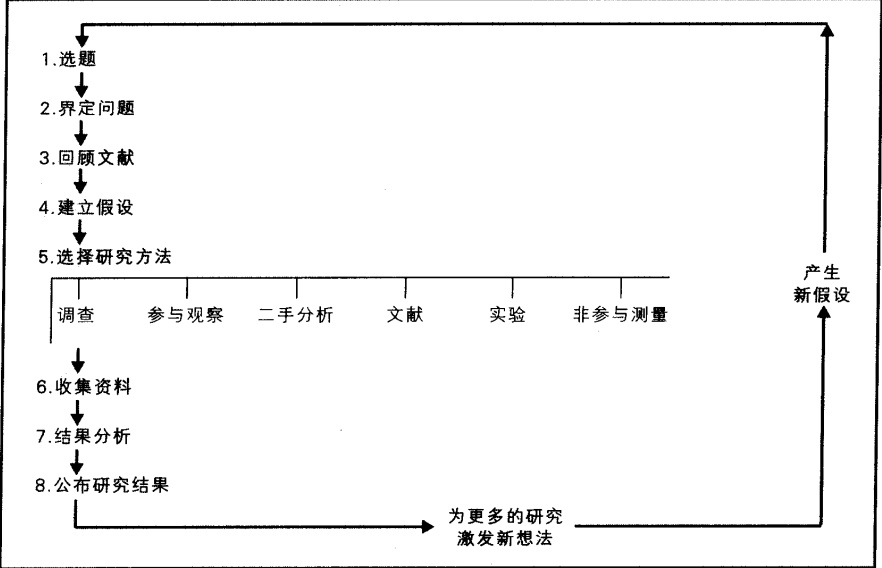
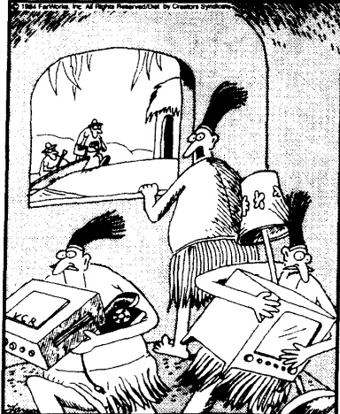
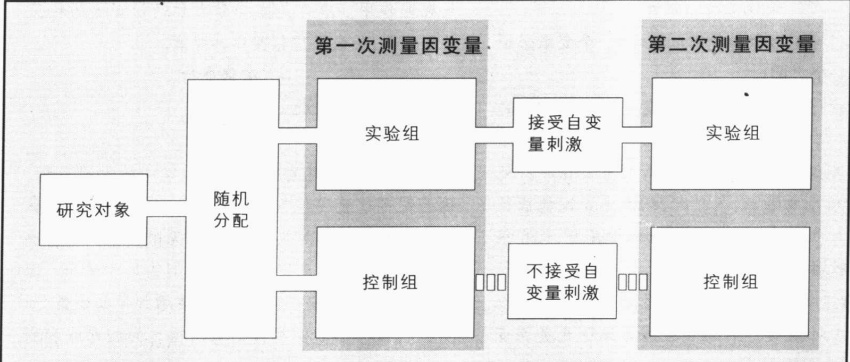

# 第 5 章 社会学家怎样做研究

---

·什么是合适的社会学研究主题？

· 常识和对社会学研究的需要

5. 选择研究方法

8. 公布结果

·研究方法

调查法

参与观察法(田野工作)

选择研究方法

· 社会学研究中的社会性别问题

· 社会学研究中的伦理问题  

保护被调查对象：布拉朱哈的研究  

欺骗被调查者：汉弗莱斯的研究

· 研究和理论怎样结合

真实的世界：当理想遇到现实

·本章小结

---

### 第 5 章 社会学家怎样做研究

在南卡罗莱纳州的查尔斯顿，一位21岁有着两个孩子的年轻母亲辛迪·哈度，被指控谋杀了自己的丈夫布巴。她说：

我开着车在街上行驶，看到布巴正沿街走着，他真的疯了……我把车停到路边，[我说]“抱歉，我不知道要去接你”。他却根本懒得理我，就直接开始打我。当时我只想赶快回家，因为我不想让人看到。我不想让别人看见他打我，因为我不想让他看起来太糟糕。

我是两班倒，半小时后就得去上班。他却对我说，我必须在40分钟内把自己的家具和衣服全都搬走，否则他就会把它们扔掉。我坐在那儿，想说服他。你知道，我不想离开他。我就和他谈话。我说：“布巴，我不想离开。”我说：“这是我的家。”然后他……（含糊不清）……“孩子是我的。”我说：“不，你不能抢走我的孩子，我无法接受。”我接着说：“要让我走，就让我带着孩子。你知道，我会走的，你知道我不会阻止你和孩子来往。”他说：“我会照顾孩子，你给我出去！”

[当他们走进他们住的拖车，布巴威胁要开枪打死辛迪。他把一支装满弹药的猎枪对准她，说：“你要想结束这一切，除非把我杀了，并且我——我也会杀了你。”[布巴给我猎枪]转身走进右边门廊，因为他知道我什么都不会做。我在那儿坐了几分钟。我不知道会发生什么事情。我只是，你知道，我只是走进卧室，我看到他正躺在那里，我就向他开了枪。他动了动，我以为他要起来，我就又开了一枪……

我太爱他了，我只是想帮他。

### ☑ 什么是合适的社会学研究主题？

资料来源：ABC 电视台，《20/20》，1979 年 10 月 18 日。

社会学家研究关于人类行为的各个领域。在宏观层面，他们研究一些宽泛的问题，如种族关系(Wilson,2000)、军队(Moscos and Butler,1997)及跨国公司(Kanter et al.,1997)等。在微观层面，他们研究一些个人事件，如骨盆检查(Henslin and Biggs,1971/2003)、街角的人际互动(Whyte,1989,2001)，甚至是圣诞节时人们如何装饰他们的家(Caplow,1991)等。事实上，无论人们的行为是遵循常理还是与众不同，是值得尊重还是应受谴责，对社会学研究而言，没有什么是不适合研究的。

因此，发生在辛迪和布巴之间的事情也是社会学的一个研究主题。但是你会怎样严格地研究配偶虐待？我们通过看一下社会学家如何开展研究，来试着回答这个问题。

### 常识和对社会学研究的需要

首先,为什么我们需要社会学研究？为什么我们不能简单地依靠一些社会常识,或是依靠“众所周知的事情”？正如第1章中提到的,常识性的观点可能是真的,也可能是假的。例如,常识会告诉我们,配偶

---

虐待对受虐待一方的生活会有显著冲击。

尽管这一具体观点是正确的，但我们也要通过研究来验证这一常识性观点，因为并不是所有这类观点都是真实的。毕竟，常识也告诉我们，如果一个妇女受了虐待，她会收拾东西离开她的丈夫。然而，研究表明，事实要远比这些常识性的认识复杂得多。有些妇女确实会立刻离开丈夫，有些甚至在第一次受虐后就走了。然而，由于种种原因，有些女性却忍受着常年的虐待，主要是因为她们感到自身陷入困境，也看不到有其他更好的选择。

这就产生了对社会学研究的需要，因为我们可能想知道为什么有些妇女能够忍受虐待，而有些妇女不能忍受。或者我们也想知道一些完全不同的事情，如为什么男性往往是虐待者，或是为什么一些人会虐待他们所说的自己爱的人。

要回答问题,我们就要跳出臆测和常识。我们想知道真正发生了什么事。为了找出答案,社会学家对社会生活的各个方面都会进行研究。让我们来看看他们是怎样进行研究的吧。

### 研究模式

如图 5.1 中所示, 科学研究遵循八个基本步骤。不过, 这只是一个理想化模型, 在现实研究中, 其中一些步骤可能需要合并到一起, 有些甚至可以省略。

图 5.1 研究模型

资料来源：根据 Schaefer（1989）图 2.2 修改而成。

---

#### 1. 选题

第一步是选题。你想知道什么？很多社会学家只是受自身好奇心的驱使。他们对某个特定的题目产生了兴趣，就会从事这项研究，就像我对无家可归者的研究。一些社会学家选择某个题目是因为可以得到研究资金，还有的是因为某一社会问题（如配偶虐待）为媒体所关注，社会学家想帮助人们更好地理解或解决这一问题。这里我们就以配偶虐待为例。

#### 2. 界定问题

第二步是界定问题，即详细说明关于这一题目你想了解什么。我研究无家可归者的兴趣越来越浓，直到想要研究全国的无家可归者。通常，社会学家的兴趣点比这更加集中，他们关注某个特殊领域或问题，并提出有研究价值的问题。例如，他们可能想比较无家可归的男性和女性的工作经历，或是想知道怎样才能减少配偶虐待。

社会学家除了研究诸如无家可归者和配偶虐待之类的社会问题，也会就他们感兴趣的社会生活的任何方面开展研究。“问题”可以大至为什么很多国家一直筹备核战争，也可以小到为什么土著美国人喜欢看西部片。

#### 3. 回顾文献

第三步是回顾相关文献，找出有关这一问题的已有研究成果。这有助于帮助研究者缩小问题的范围，明确哪些方面是已知的，哪些还需要进一步研究。回顾文献也可以帮助研究者提出问题。研究者有时甚至会发现这个问题可能已经有了答案，这时就没有必要再做这项研究了，因为没人会想去做重复性的工作。

#### 4. 建立假设

第四步是建立假设，即对你根据某种理论预设想要得出的结论的陈述。假设预言了变量之间的关系，所谓变量（variables）即随人和情景而变化的因素。例如，“社会孤立程度严重的男性比社会整合程度高的男性更有可能虐待他们的妻子”这一陈述就是一个假设。假设需要有操作性定义（operational definitions），即测量变量的明确方法。在这个假设中，我们可能需要社会孤立、社会整合和配偶虐待这三个变量的可操作性定义。

#### 5. 选择研究方法

第五步是选择研究方法(research method,或研究设计),即收集资料的方法。有六种基本研究方法,社会学家会从中选择一种他们认为能够回答他们特定问题的最佳方法。我们将在下一节详细说明这些方法。

#### 6. 收集数据

在这一步你必须确保资料的效度(validity)，即可操作性定义必须准确测量出你想要测量的内容。在我们的例子中，你必须确保你测量的是社会孤立、社会整合和配偶虐待，而不是其他方面。例如，配偶虐待

---

THE FAR SIDE By GARY LARSON

The Far Side by Gary Larson © 1984 FarWorks, Inc. All Rights Reserved. Used with permission

快点！人类学家来了！

社会学家和其他社会科学家很关心的一个问题是他们的研究方法会不会影响他们的发现。被调查对象在得知他们被研究的时候往往会改变其行为。看上去一目了然，然而实际上一些人看做是虐待的行为在另一些人眼里并未构成虐待。你会认为哪些行为是虐待？换句话说就是，你的可操作性定义必须十分明确，让每个人都不会对你在测量什么产生歧义。

你也必须确保你的数据是可靠的。信度(reliability)是指如果其他研究者使用你的可操作性定义进行测量，他们的测量结果将和你的一致。如果你的操作性定义含糊不清，施行同种暴力行为的丈夫可能会被包含在一些研究之中，又被排除在其他的研究之外，那么最终就会得到一些不准确的研究结果。你可能会得出配偶虐待的比率为10%的结论，而其他研究者发现这个比率高达30%，这会使你的研究结果显得不可靠。

#### 7. 分析结果

收集完资料，就要对资料进行分析。你可以选择定性分析方法或定量分析方法。定性分析包括对小说、电影、电视剧和人们的谈话进行分类，以确定它们的主题。目的是忠实地再现研究对象的生活世界。例如，在我关

于计程车司机的研究中(Henslin,1993)，我尝试勾画一个出租车司机眼中的世界，以便每一位读到这份研究报告的人不仅了解计程车司机在做什么，而且知道他们为什么会这样做。一些软件，如Nvivo，为研究者提供了整理资料的工具。

定量分析则涉及对数字的处理。现在我们使用一些软件，几秒钟内就可以检验假设，而此前，这一过程可能需要花费几天甚至几星期的时间。社会学家和很多学生经常使用的两个软件是 Microcase 和社会科学统计分析软件包 (SPSS)。一些软件，如 Methodologist's Toolchest，可以为收集数据甚或是相关伦理问题提供指导。

#### 8. 公布结果

最后一步就是写出研究报告(如果这是一个很大的研究项目，至少要写出部分研究成果)。这时，你要撰写一份报告与科学共同体(即科学家群体)分享你的研究结果。为了帮助其他人评估你的研究，报告要包括对前面各步骤的陈述，也要回顾关于这一主题已经发表了哪些研究成果，说明你的研究与先前这些成果的关系；并论证你的研究怎样支持、反驳或修正了相关的理论。

当研究成果被刊行，通常是发表在某本科学杂志上或印制成书，它就属于科学共同体了。下表 5.1 就是一例已经发表的研究成果。这些结论应该可以找得到，以便被反复验证（replication），即其他人可以重复这项研究，看是否能得出相似的结论。一项项成果不断积累，科学的知识体系就建立起来了。

这里让我们详细看看第五步，看一下社会学家使用了什么研究方法。

---

表 5.1 怎样读表格

标题陈述了主题。它位于表格顶端。这个表格的标题是什么呢？

<table border=1 style='margin: auto; word-wrap: break-word;'><tr><td style='text-align: center; word-wrap: break-word;'>标题陈述了主题。它位于表格顶端。这个表格的标题是什么呢？</td></tr><tr><td style='text-align: center; word-wrap: break-word;'>头注不是在所有表格中都有。如果有头注，它就位于标题之下，其作用是给出关于收集资料或表述资料的细节性信息。这个表格的头注是什么？</td></tr><tr><td style='text-align: center; word-wrap: break-word;'>表头告诉我们表格中包含哪几方面信息。在这一表格中有三个表头。它们分别是什么？第二个表头中，n=25 是什么意思？</td></tr></table>

头注不是在所有表格中都有。如果有头注，它就位于标题之下，其作用是给出关于收集资料或表述资料的细节性信息。这个表格的头注是什么？

表头告诉我们表格中包含哪几方面信息。在这一表格中有三个表头。它们分别是什么？第二个表头中，n=25 是什么意思？

表格是信息的概括。因为社会学的研究成果常用表格形式表示，所以知道怎样阅读表格十分重要。表格包括六个要素：标题、头注、表头、列、行和资料来源。如果你明白这些要素是怎样组合在一起的，你就知道怎样读表格了。

列竖直排列了要陈述的信息，第二列第四个数字和第三列第二个数字分别是什么？暴力丈夫和非暴力丈夫的比较

行水平排列了要陈述的信息。

在第四行，哪种丈夫更可能比他们的妻子受过更少的教育？

基于对一个中西部城市150对正在离婚的夫妇的访谈

<table border=1 style='margin: auto; word-wrap: break-word;'><tr><td style='text-align: center; word-wrap: break-word;'>丈夫的成就感和工作满意度</td><td style='text-align: center; word-wrap: break-word;'>暴力丈夫</td><td style='text-align: center; word-wrap: break-word;'>非暴力丈夫</td></tr><tr><td style='text-align: center; word-wrap: break-word;'>他高中或大学未毕业</td><td style='text-align: center; word-wrap: break-word;'>n=25</td><td style='text-align: center; word-wrap: break-word;'>n=125</td></tr><tr><td style='text-align: center; word-wrap: break-word;'>他对工作非常不满意</td><td style='text-align: center; word-wrap: break-word;'>44%</td><td style='text-align: center; word-wrap: break-word;'>27%</td></tr><tr><td style='text-align: center; word-wrap: break-word;'>他的收入是(夫妻)长期摩擦的根源</td><td style='text-align: center; word-wrap: break-word;'>44%</td><td style='text-align: center; word-wrap: break-word;'>18%</td></tr><tr><td style='text-align: center; word-wrap: break-word;'>他比妻子受教育少</td><td style='text-align: center; word-wrap: break-word;'>84%</td><td style='text-align: center; word-wrap: break-word;'>24%</td></tr><tr><td style='text-align: center; word-wrap: break-word;'>他的工作比他岳父的工作声望低</td><td style='text-align: center; word-wrap: break-word;'>56%</td><td style='text-align: center; word-wrap: break-word;'>14%</td></tr><tr><td style='text-align: center; word-wrap: break-word;'></td><td style='text-align: center; word-wrap: break-word;'>37%</td><td style='text-align: center; word-wrap: break-word;'>28%</td></tr></table>

资料来源：据 O'Brien（1975）表 1 整理而成。

一些表格要比这个复杂得多,但是所有的表格都遵循同样的基本模式。把这些要素应用于有更多信息的表格,参见表 12.1。

资料来源通常位于表格底端，告诉我们表格中所列的数据源于何处。通常这些信息十分具体，你可以据之查询原始数据。这个表格的资料来源是什么？

### 1 研究方法

在说明社会学家使用的六种研究方法(或研究设计)时,我们会继续使用配偶虐待这一例子。正如你将会看到的,你选择的方法取决于你想回答的问题。为给比较找一个准绳,你会想知道在你的研究当中“平均”是什么。表5.2讨论了测量平均值的方法。

### 调查法

假设你想知道每年有多少妻子遭受虐待。当然，有些丈夫也遭受虐待，但是我们假设你仅仅关注妻子们的情况。调查(survey)是研究这个问题的一种合适的研究方法。调查中你要询问被调查对象一系列问题。不过，在你开始研究之前，你必须处理所有研究者都会面临的一些问题。下面就让我们看一下这些问题。

抽样 理想情况下,你可能想调查世界上所有的妻子。显然,现有条件不允许你做这样一个研究,因此你必须缩小总体,即你将要研究的目标群体。

假定你的条件(资金、人手、时间)只允许你在你的大学中进行配偶虐待的调查。再假定你们学校的注册生很多，所以你无法调查所有注册的已婚女性。你现在必须从研究总体中选择一些个体组成样本。怎样选择样本非常重要，因为这会影响到你的研究结果。例如，只调查上社会学导论课的女性和只调查上高等物理课的女性，都会得出不准确的结果。

---

表 5.2 测量“平均”的三种方法

<table border=1 style='margin: auto; word-wrap: break-word;'><tr><td style='text-align: center; word-wrap: break-word;'>均值</td><td style='text-align: center; word-wrap: break-word;'>中位数(中值)</td><td style='text-align: center; word-wrap: break-word;'>众数</td></tr><tr><td style='text-align: center; word-wrap: break-word;'>均值这一概念看起来简单明了。当你在小学学习时,你把一组数字全部加起来,然后以它们的和除以这些数字的个数,就得出这些数的平均数。例如,假设下面列出的数字代表的是殴打妻子的丈夫的数目:</td><td style='text-align: center; word-wrap: break-word;'>第二种计算平均的方法是中位数,首先要把样本按照从小到大或者从最大到最小依序排列。在这个例子中有两种排列方式:57 179557 321136 289229 或 229289 136321 571795 57然后找出位于中间的数值,即到最上面的数值和到最下面的数值距离相等的那个数。这个数是229,有三个数字在它上面,又有三个数字在它下面。当样本中数值的个数是偶数时,中值就是中间两个数值的平均数。</td><td rowspan="3">第三种测量平均水平的方法是众数,指在样本中出现次数最多的数值。在我们举的这个例子当中,众数是57,它和样本中的其他数值相差很大。众数的欺骗性很大,而且接近其他两种平均值的可能性非常小,社会学家很少使用它。除此之外,很明显,并不是每一个样本都会有众数。并且如果有两个或两个以上数字出现的频次相同,你会得出不止一个众数。</td></tr><tr><td style='text-align: center; word-wrap: break-word;'>32122957289136571795</td><td style='text-align: center; word-wrap: break-word;'>321 571795 57</td></tr><tr><td style='text-align: center; word-wrap: break-word;'>总数是2884。除以7（样本中数字的个数）,平均数是412。社会学家称这种平均数为均值。均值可能具有欺骗性,因为它受极端值的影响非常大,无论极端值过高或过低。注意样本中七个数字中有六个要低于均值。计算平均的另外两种方法是中位数(中值)和众数。</td><td style='text-align: center; word-wrap: break-word;'>然后找出位于中间的数值,即到最上面的数值和到最下面的数值距离相等的那个数。这个数是229,有三个数字在它上面,又有三个数字在它下面。当样本中数值的个数是偶数时,中值就是中间两个数值的平均数。</td></tr></table>

要想把你的结果推广到整个校园中的已婚妇女，你需要一个能够代表校园中所有已婚妇女的样本。那么你怎样才能得到一个有代表性的样本呢？

最好的办法是采用随机样本（random sample）。这并不意味着你站在校园的某一角落询问碰巧从那里经过的每位女性。在随机样本中，你的总体中每个人都有同样的机会被选入研究对象。在本章的例子中，因为你的研究对象是大学里注册的每位已婚妇女，所有已婚女子——无论是一年级学生还是研究生，无论是全日制还是半日制的学生——都有同样的机会被包含在你的样本中。

怎样才能得到随机样本呢？第一，你需要一张所有注册在校的已婚妇女的名单，然后给名单中的每一个名字编号。使用随机号码表，然后决定哪些妇女成为你的样本(随机号码可以在统计学书后附的表格中查到，也可由电脑生成)。

因为随机样本代表了你的研究总体，在本案例中即注册在校的已婚妇女，所以你能把研究结果推广到全部注册在校的已婚妇女，即使她们并未被包括在你的样本中。

---

如果你想了解的仅是某些子群体，如大一新生和大四学生，你怎样选取样本呢？你可以使用分层随机样本。你需要大一学生和大四学生中已婚女性的名单，然后利用随机号码，在两个群体中分别抽样。这样你就可以把结论推广到你们学校全部的大一和大四学生，但是你却不能得出有关大二和大三学生的任何结论。

问中立的问题 确定了研究总体和样本之后，下一步就是要确保你的问题是中立的。你的问题必须允许被调查者，即回答问题的人，表达他们自己的观点。否则你就会得出带有偏见的答案，而这将毫无价值。例如，如果你问：“难道你不认为殴打妻子的那个男人应该进监狱吗？”

因为社会学家通常不能够访谈或者观察他想研究的群体中的每一个成员，如塞尔维亚贝尔格莱德的这场足球比赛中的观众和防暴警察，他们必须选择一个能够概括总体的样本。本章解释了怎样选择样本。

这会提示被调查者回答赞成让这个男人入狱。在下面的专栏中，我们给出了一例有问题的研究。

## 现实社会学

### 事先决定成败: 不要这样做研究

科学方法容易被歪曲、不正当地应用，甚或是被用于完全欺骗性的目的。阅读并思考下面的信息。调查显示：

美国人偏爱丰田汽车远远胜于克莱斯勒汽车。

美国人偏爱克莱斯勒汽车远远胜于丰田汽车。

美国人认为布尿布比起一次性尿布要有利于环境保护。

美国人认为一次性尿布比起布料尿布要有利于环境保护。

显然，这些对立的结论，不可能都是真的。实际上，这两组结论都是错误的，尽管每项结论都来自所谓的中立研究者进行的调查。然而，这些研究者是有偏见的，既不中立，也不客观。

这表明有些消费研究中方法有误(事先有结果)。他们受雇于与调查结果利益相关的公司，得出的是其雇主满意的调查结果。六个方面会导致这一问题：

1. 选择有偏样本。如果你想“证明”美国人偏爱克莱斯勒汽车远远胜于丰田汽车，可以访问失业群体中那些把自己失业归因于从日本进口商品的工人。答案可想而知，你会得到想要的结论。

2. 提问有偏问题。即使你选择了一个无偏样本，你仍能把问题表述得让大多数人看来只有一个合乎逻辑的答案，我们引用的尿布研究就是这种情况。当一次性尿布公司出钱作调查时，研究者用了一个非常有代表性的样本，但是他们这样提问：“据估计，一次性尿布在目前的垃圾中所占的比重不到2%。相反，饮料瓶、三级邮件和庭院垃圾能占到21%。基于这种情况，你认为禁止使用一次性尿布合理吗？”

结果,不出所料,84%的被调查者回答一次性尿布要比布尿布更有利于环保。类似地,如果是布尿布公司出资作调查,研究者又会按照对它们有利的方式进行提问。

思考一下下面的调查结论,实际上它和刚才引用的例子在每一点上几乎都很相似:

80% 的美国人支持对外援助。

---

让80%的美国人同意任何事情都是很困难的，但是以“美国是不是至少应该拿出一小部分财富和世界上那些真正需要(帮助)的国家分享？”这样的方式提问，只有80%的美国人同意却很令人吃惊。

很显然，这个问题将人们导向了一个预定的答案——这与科学研究的原则完全相悖。

3. 列出有偏选项。还有种形式是使用封闭式问题迫使人们按照研究者的意愿进行回答，看下面这个结论：

美国大学生对 Levis 501 牛仔裤的偏爱远远超过其他品牌。

听起来没错吧？但在你冲出去买Levis之前，先留心一下这些研究者是怎么做的吧：在询问大学生们明年什么牌子的牛仔裤将最流行时，他们列出的选项中除了Levis 501之外再没有其他选择了！

4. 抛弃不想要的结果。研究者能对令他为难的研究结果闭口不谈，或者继续调查样本直到得出他们想得到的结果为止。

正如本章强调的，要保证研究是科学的，研究者就必须保持客观。显然，前面提到的研究中没有一项是合格的。还有很多诸如此类的研究结论被作为事实在媒体上传播，这背后的问题是调查研究已经成了一项赚钱的大生意。简单说，就是公司给的钱腐蚀了一些研究者。

一开始这种腐蚀是不易察觉的。明尼苏达大学校长保罗·莱特如是说：“一个投资者从不会找到一个学术机构说：‘我想让你帮我找到结果X，这里有100万美元供你作调查。’其潜台词则是，如果研究者得出的正是这个结果，那么更多的基金就会顺其自然地到来。”他补充说：“上船容易下船难。”

上述四种做法是不可原谅的故意欺骗，接下来的两种错误则是由于太过草率，这在科学研究中同样是不允许的。

5. 误解被调查者的世界。这同样会导致前述那些错误。即使研究者使用恰当的样本、正确的提问，并且提供充足的选择项，也会得出不符合事实的结果。例如，他们没有预料到被调查对象可能会窘于表达一些“政治方向不对”的观点。例如，调查显示，80% 的美国人是环保主义者。然而，大多数美国人可能不愿告诉一个陌生人他不是环保主义者。在当今社会，这就像讨厌国旗、母性和苹果派一样不能被人们接受。

6. 资料分析错误。即使研究者力求做到客观、样本具有代表性、问题是中立的、被调查者也作了忠实的回答，结果仍有可能偏离现实情况。研究者可能在分析资料时犯错误，例如，录入电脑的数据是错误的。当然，这种错误在科学研究中是不允许出现的。

资料来源：基于 Crossen（1991）；Goleman（1993）；Barnes（1995）；Resnik（2000）整理而成。

问卷和访谈 即使你有了一个代表性的样本，并且设计了中立的问题，你最后得到的可能还是有偏差的结果，因为问卷（questionnaires，即列出的一些问题）的设计方式可能是有缺陷的。使用问卷调查有两种基本方法。第一种是让被调查者自己填写问卷。这种自填式问卷（self-administered questionnaires）可以以较低的费用调查大量的样本，但是研究者很难对其进行控制，因为研究者很难控制被调查者填答问题时所处的情境。例如，其他人可能会影响他们的回答。

第二种方法是访问（interview）。研究者向被访者提出问题，通常是面对面的，有时也用电话或电子邮件。这种方法的优点是研究者可以用同样的方式提问，缺点是花费时间太长，并且被调查者的数目不能太多。访问法也会产生访员误差（interviewer bias），即访问员的在场可能会影响被调查者的回答。比如，被调查者可能会给出“社会上认可”的答案，而不是说出他们真正的想法。尽管他们可能愿意在匿名问卷中写下真实的想法，但是他们却不愿意说给其他人听。有些人甚至会修改自己的答案，使其符合他们认为的访问者想听到的答案。

---

很多情况下，结构式访问（structured interviews）是最适用的。这种访问使用的是封闭式问题（closed-ended questions）——每一个问题后面都列出一些可能的答案。结构式访问操作简便，答案易于编码（分类）和录入计算机分析。正如表5.3中所示，问卷中列举的答案可能无法包括所有被调查者的观点。因而，一些研究者更喜欢使用非结构式访问（unstructured interviews）。访问者提出开放式问题（open-ended questions），允许被调查者用自己的话回答。尽管开放式问题能使调查者获得被调查者的所有观点，但是对这些答案进行归类整理又会变得很困难。例如你提问：“你认为男人为什么虐待他们的妻子？”

“他们有病。”

“我认为他们和母亲的关系肯定很糟糕。”

“应该把他们绞死！”

你怎样把他们的答案归类呢?

表 5.3 封闭式和开放式问题

<table border=1 style='margin: auto; word-wrap: break-word;'><tr><td style='text-align: center; word-wrap: break-word;'>A.封闭式问题</td><td style='text-align: center; word-wrap: break-word;'>B.开放式问题</td></tr><tr><td style='text-align: center; word-wrap: break-word;'>你认为应该怎样处置被指控虐待配偶的人——下面哪一选项最符合你的观点？1. 缓刑2. 监禁3. 社区服务4. 心理咨询5. 离婚6. 没什么——这是他们的家务事</td><td style='text-align: center; word-wrap: break-word;'>你认为应该怎样处置被指控虐待配偶的人？</td></tr></table>

建立融洽关系 关于配偶虐待的研究引出了另一个很重要的问题。你可能已经在考虑，即使严格按照科学步骤进行，你的调查是否有价值呢？那些被虐待的妇女愿意对一个陌生人作出真实的回答吗？

如果你在大街上走近一个妇女，询问她的丈夫是否打过她，你的研究可能毫无结果。研究者要在自己和被调查者之间建立一种融洽关系，一种可以信赖的感觉，尤其是在涉及一些敏感性话题——那些会引起尴尬、羞愧或其他强烈感情的话题时。

一旦建立了融洽关系(例如，通过一开始先问一些不敏感问题)，受害人就会和研究者谈一些私人的、敏感的问题。关于强奸的调查就是这方面一个好的例子。除了警察局的统计之外，研究者每年都要进行一项全国性的犯罪调查。他们会对一个包括10万名美国人的随机样本进行访问，询问他们是否曾受到盗窃、抢劫等罪行的侵害。在建立融洽关系之后，研究者就会问及强奸问题。他们发现被强奸者会讲出她们的遭遇。全国犯罪受害者调查显示的强奸案例要比官方的统计数字高出三倍(Statistical Abstract 2002: 第180页)。

### 参与观察法(田野工作)

第二种方法是参与观察 (participant observation)，即研究者参与到一个研究环境中，观察在这一环境

---

中发生了什么。但是怎样通过参与观察来研究配偶虐待呢？显然，这种方法不是说你坐在一边看着别人受虐待。不过，配偶虐待是一个很宽泛的题目，很多关于虐待的问题除了使用参与观察的方法很难被充分解答。

假设你想知道配偶虐待对妻子的影响。你可能想知道虐待怎样改变了她们与丈夫之间的关系，怎样改变了她们的希望和梦想，或者她们对男人的看法。当然，这也影响到了她们的自我看法。但是具体情况如何呢？参与观察可以对这些问题提供一些洞见。

例如，如果你的校园里有一个危机干预中心，你就能够在配偶虐待的受害者第一次来咨询并倾诉她们的不幸时观察她们。如果与她们建立起了良好的关系，你甚至可以在其他场合和她们待在一起，观察她们生活中的其他方面。受害者所说的话，以及她们与他人的互动可能会帮助你解答那些问题。相应地，这也可能会使你得出一些改进大学咨询服务的建议。

参与观察面临的一个问题是概括性(generalizability)，即是否能够把研究结果应用于更大的人群。大多数这类研究都是探索性的，记录特定环境下人们的经历的细节。尽管这一研究表明其他人在面临相似的情况时会作出相似的反应，但却很难知道这些发现到底能在多大程度上适用于其他情况。不过，参与观察的结果能够激发可以在其他情况下使用其他研究方法进行验证的假设和理论。

### 二 手资料分析法

研究者运用二手资料分析法(secondary analysis)时，分析的是其他研究者已经收集好的资料。例如，如果你想分析有关受到丈夫虐待的妇女的原始资料，你就是在进行二手资料分析。通常，研究者更愿意自己收集资料，但是由于条件不够，尤其是资金不足，他们的初衷可能无法实现。另外，现有资料中可能会包括一些与原研究者目标关系不大的丰富信息，你可以为了自己的研究目的对其进行分析。

就像其他研究方法一样，二手资料分析法也存在一些问题。研究者如何能确定这些资料是被系统地收集、精确地录入并避免了人为的偏差？这些问题给进行二手资料分析的研究者带来了一个隐患，尤其是当原始资料是由一个研究团队收集的时候，不可能每个人都符合研究的要求。

### 文献研究法

社会学家运用的第四种方法是研究文献(documents, 即文字资料)。为了研究社会生活, 研究者分析各种不同的文献, 如书籍、报纸、日记、银行记录、警局记录、移民档案及由各种组织保存的记录。

要研究配偶虐待,你可以查阅警察局和法庭的案卷记录。这可以揭示出因控告而导致拘捕的比率,以及被拘捕的男人被起诉、判罪、缓刑的比率。如果这就是你想知道的问题,警局的统计将会非常有用。

但是对其他问题而言，这些记录就可能毫无用处。例如，如果你想了解受害者的社会特征和情感状况，这些记录就没什么用处。不过，其他文献会为你提供有用的资料。例如，受害者的日记能够让你了解她们对虐待的内心反应，显示她们的态度和关系的变化。如果没有现成的日记，你可以要求受害者记日记。或许，一个危机干预中心的指导者会让他的委托人（受害者）为你记日记——或者是让你得到受害人的允许以察看他们咨询事项的记录。据我所知，还没有社会学家通过这种方法去研究配偶虐待。

---

当然，我给出的是一种理想的情况，即危机干预中心大开方便之门。实际上，这个中心可能一点都不予合作。他们可能会拒绝让受害者记日记，甚至不让你接近他们的记录。如何获得资料是研究者面临的另一个问题。简言之，除非你能获得关于某一主题的资料，否则你就不能做这项研究。

### 实验法

很多人都说施虐者需要治疗，但却没人知道治疗是否真的起作用。这里我们假设你想要找到这个问题的答案。坦白来说，没有人知道怎样把一个虐待妻子的家伙变成一个疼爱妻子的男人——这或许是不可能的——但是知道治疗是否有效无疑会在正确的方向上推进一步。为了得出结果，你可能想做一个实验(experiment)，因为实验对确定因果关系非常有用。因果关系有三个必要条件，我们将会在表5.4中进行讨论。

#### 表 5.4 原因、结果和虚假相关

因果关系意味着一个变量的变化是由另一个变量引起的。因果关系有三个必要条件：相关、时间次序和非虚假相关。让我们看一下配偶虐待和酗酒的这些条件：

#### 1. 第一个必要条件是相关。

如果两个变量一起存在，它们可以说是相关的。如果施暴者喝过酒，那么打人和酗酒就是相关的。

### 配偶虐待+酗酒

人们有时认为这种相关是因果关系。在这个例子中，他们的结论是：酗酒会引发配偶虐待。

### 酗酒→配偶虐待

但是相关并不表明是因果关系。任何一个变量都可能是另一个变量的原因。或许是打人行为促使男人酗酒。

### 配偶虐待→酗酒

2. 第二个必要条件是时间次序（一个变量必须出现在另一个之前）。

时间次序意味着一件事情发生在其他事情之前。因为一个变量作为原因(自变量)，它必须先于被改变的变量(因变量)。如果这个男人在殴打他的妻子之前没有喝酒，很显然，酗酒不是配偶虐待的原因。尽管时间次序的必要性非常显著，但在很多研究中这并不容易判断。

#### 3. 第三个必要条件是非虚假相关。

这第三个必要条件确实使得弄清因果关系变得很困难。即使我们能够辨明相关，能够判定时间的先后次序，我们仍然不能确定酗酒就是原因。很可能我们得到的是一种虚假相关关系，即，原因可能是潜在的不易察觉的第三个变量。一些社会学家认为男性文化是潜在的第三个变量。

### 男性文化→配偶虐待

一些男人被社会化为支配者，他们习得了把女性视为出气筒的观点。实际上，这个潜在的第三变量很可能是酗酒和配偶虐待的共同原因。

但是，既然只有某些男人殴打他们的妻子，而所有的男性都受男性文化的影响，肯定还有其他变量在起作用。或许是宣扬暴力和轻视女性的特殊的亚文化，导致了虐待配偶和酗酒。

如果是这样，这就意味着它不是唯一的原因变量，因为配偶虐待可能有很多原因。不像变形虫的移动或给某些物体加热，人的行为无限复杂。尤其重要的是人们的情景定义，包括他们的是非观念。因此，为了解释配偶虐待，我们需要增加一些变量，如男人对暴力的看法和他们对两性之间相对权利的

---

定义。很明显，实验可以帮助我们找到人类行为中的这些复杂因素。

### 有关相关关系的进一步说明

简单说来，相关就是两个或多个变量同时出现。它们被同时发现的次数越多，其关系就越强。社会学家使用一个数字表示相关关系的强度，即相关系数。如果两个变量总是相互关联，即它们总是同时出现，它们之间就存在所谓的完全正相关关系。数字1.0就代表着这个相关系数。自然界就有一些强度为1.0的相关关系，如缺水会导致树的死亡。1.0的相关也适用于人的身体状况，比如缺少营养物质就会导致生命的枯竭。但是，社会生活要比身体情况复杂得多，在人类的行为中没有强度为1.0的相关关系。

两个变量之间也可能存在完全的负相关关系。这是说，当一个变量出现，另一个总会消失。数字 -1.0 就是这种相关系数。

正相关系数 0.1、0.2 和 0.3 是指一个变量和另一个变量的相关度是 1/10、2/10 和 3/10。换句话说，在大多数情况下，第一个变量和第二个变量不相关，表明两者之间是一种弱相关关系。相关系数越大，它们之间的关系就越强。强度高的相关关系可能是因果关系，但也不尽然。验证变量之间的关系是一些社会研究的目的。

假设一个法官对你的想法很感兴趣，并且给你机会去接触那些因虐待配偶而被拘捕的男人。你会随机地把这些男人分成两组(见图5.2)，这将帮助你确保他们的个体特征(态度、被捕次数、罪行的严重性、审判次数、教育程度、种族、年龄等等)在两组之间平均分配。然后你安排实验组中的男人接受某种形式的治疗，而控制组中的男人不接受治疗。

你的自变量，即引起其他变量发生变化的变量，就是治疗。你的因变量，即可能被改变的变量，是这些男人的行为：出狱后是否还会继续虐待妻子。为了得出结论，你可能需要依赖一个粗略的可操作性定义：不管妻子报告还是再次因虐待妻子而被捕都属于继续虐待妻子。我们之所以称其为粗略的，是因为有些妇女不会报告她们受到了虐待，并且有些虐待妻子的男人不会再次被捕。但是能这样做最好。

假设你选择因虐妻而再次被拘捕作为可操作性定义。如果你发现那些接受治疗的男人因虐待罪而再次被捕的可能减小，你就可以把这个变化归因于治疗。如果你发现再次被捕的比率没有任何改变，你

图 5.2 实验法

---

就可以得出结论说治疗是无效的。如果你发现接受治疗的男人再次被拘捕的比率反而提高了,你可以下结论说治疗起了反作用。

理想情况下，你应该测试不同的治疗方法，或许只有某种治疗方法能起作用。你甚至可能想测试通过指定文章、书籍和影像资料进行的自我治疗。

正如下面专栏中所描述的一样,一些实验并没有被严格执行。这就增加了原因和结果被混淆的可能性。

### 现实社会学

### 翬藔实验

20 世纪 20 年代著名的霍桑实验已经成为社会学研究的经典。这项研究典型地说明了辨别自变量和因变量的必要性。

西方电气公司的霍桑工厂，位于芝加哥城城郊，其管理人员想知道照明条件是否会影响生产率。几组妇女参加了继电器制造车间试验。在控制车间，照明条件保持不变，而在实验车间，照明条件不断变化。出人意料的是，两个车间的产量都增加了。在实验车间，甚至当光线的状况和月光一样昏暗时——光线暗得已经让工人们几乎看不清他们在做什么了，生产率仍一直保持高水平。

为了解决这一困惑，管理部门请来了一支由哈佛大学的埃尔顿·梅奥领导的研究队伍。他们测试了13种不同的工作条件。当他们把女工的工资由计时制改为计件制(每生产一个元件按照固定的价格付费)，生产率提高了；当他们为女工们提供茶点时，产量也增加了；他们增加了两次五分钟的休息时间，生产率有了跳跃式的提高；当他们把休息时间改为十分钟时，产量又增加了；他们让工人早回家，也得到了相同的结果。当研究者把工作条件变为原来那样，不提供上述任何一项增加的利益，结果如何呢？令人困惑的是，生产率甚至更高。

当他们在接线板制造车间研究观察男工人时，情况甚至变得更加令人费解。这一次，研究者根本没有改变工作环境，他们只是在这些男工人工作时进行观察，并在下班后对他们进行访谈。他们预想生产率不会发生什么变化，结果却是生产率下降了。

这些都让人莫名其妙。最后，梅奥得出结论说，生产率的变化都应归结于研究本身。女工因她们受到了关注而感到高兴，相应地她们就更加努力工作。相反，男工人对研究者的观察感到疑惑。他们担心如果生产率提高了，今后会被要求更高的日产量，或者高生产率会使他们当中的一些人失去工作。所以，他们就降低产量。

霍桑实验的重要之处不在工人生产率上的发现，而是在于它揭示了研究过程本身的问题。现在，研究者很注意控制霍桑效应，即人们知道他们在被研究的情况下发生的行为上的改变。

资料来源：Roethlisberger and Dickson (1939); Mayo (1966); Baron and Greenberg (1990)。

### 隐蔽观察法

研究者有时也会使用隐蔽观察法（unobtrusive measures），去观察那些并不知道自己正在被研究的人的行为。例如，社会研究者通过计算垃圾箱里的空酒瓶研究一个官方禁酒的城市的威士忌消费量。为了研究鬼故事导致的恐惧程度，他们测量围坐一圈的孩子们不断缩小的直径。有些社会学家甚至察看垃圾。他们发现在牛肉短缺时，人们会浪费更多的牛肉——可能是因为人们买的牛肉超过了他们能够

---

正确储藏的量(Lee,2000)。研究者也把高科技手段用于隐蔽观察法中(Selingo,2001)。他们在顾客的购物车上装配了红外线监视器以跟踪顾客通过商店的路径。零售商根据这些研究结果更换商场内的货物的摆放位置(McCarthy,1993)。

运用很多的隐蔽观察法来研究配偶虐待被认为是不道德的。不过，你可以分析911报警电话。如果在因特网上有一些由被虐待者和虐待者建立的公共论坛，你也可以记录和分析网上的对话。伦理仍然是一个争论性话题：秘密记录人们在公共场所的行为，例如一个人群的活动，这是普遍被认为可以接受的，但若这样来研究私人场所，就不被认可。

### 选择研究方法

社会学家怎样在这些方法中进行选择？有四个首要因素会影响他们的选择。第一，研究条件至关重要。研究方法必须与现有的研究条件相适应。例如，尽管他们想开展一项调查研究，他们可能会发现资金条件不允许，于是就改为文献研究。第二，接近研究对象的途径。如果组成样本的人群居住在这个国家的偏远地区，研究者可能将不得不把问卷邮寄给他们，或是进行电话调查，尽管他们更想进行面对面的访谈。第三，研究的目的，即社会学家想要调查和解答的问题。总有一种方法比其他方法更适合解答某种问题。例如，参与观察适于发现人们的态度，而实验更适于解决因果问题。第四，研究者的背景和所受的训练也很重要。在研究生院，社会学家们学习了很多方法，但是他们只能实践其中的一部分。结果，毕业之后，他们通常使用他们了解得最多的方法。

因此，受过定量方法（quantitative research methods）训练的社会学家，强调测量、数字和统计，更倾向于使用调查法。受过定性方法（qualitative research methods）训练的社会学家，重视描述、观察和分析人们的行为，倾向于使用参与观察法。在下面“现实社会学”专栏中，你可以看到应用社会学家是怎样综合使用定量分析和定性分析方法的。

### 现实社会学

### 应用社会学: 综合定量和定性研究方法的市场研究

如果一个公司想在竞争激烈的商界中生存，它必须知道消费者的所需所想并满足之——要不然就得说服人们，这个公司生产的就是他们所需所想的。

### 什么是市场研究？

为了增加销量，厂家会尽力提高它们产品的地位。“市场定位”是形容消费者怎样看待一个产品的市场专用术语。

这就是市场研究者发挥作用的阵地。研究者要弄清楚消费者想要什么，他们怎样选择和使用产品，他们对某种商品或服务的印象怎么样。他们也要研究大众对某个新产品和原有产品的更新有什么样的反应。

市场研究者使用定性研究和定量研究两种方法。定性研究的一个例证是目标群体（focus groups）研究。大约每十个人一组来讨论一个产品。一个协调者带领一组人讨论，其他的市场研究者在一个单面镜后观察或录下整个讨论的全过程。为了控制地区间差异，研究者要同时在其他城市组织目标群体进行讨论。社会学家罗杰·斯特劳斯指出，他从符号互动论中受到的训练对分析这些结果非常有帮助。

市场研究者也使用定量分析。例如，他们可能会开展调查来判定公众怎样看待一种新产品。他

---

们也从产品的“条形码”上收集销售数据。他们使用统计技术来分析数据，并用表格和图表形式向委托人展现其研究结果。

### 一 个社会学争论

市场调查在社会学中的地位颇有争议。大多数市场研究的结果都是专有的(由委托人占有)，因此是保密的。这就意味着，研究结果不会出现在社会学杂志上，也不会被用来创立社会学理论。除此之外，客户通常只关心特殊的市场问题，很少委托调查重大的社会问题。基于这些原因，很多社会学家都认为市场研究不是“合法的”社会学行为。有些社会学家甚至指责市场研究者在浪费其社会学才能。他们斥责这些研究者“出卖”技术——因为他们使用社会学的方法劝说顾客购买他们不需要的物品和服务，从而帮助公司剥削大众。

当然，市场研究者是不会这样看的。他们认为市场研究是一种中立行为，在原则上没有理由反对。他们还说，他们并不仅仅是帮助商家卖啤酒和软饮料，他们还帮助大学吸引更多的学生，让社区更符合公众的要求。他们说，做任何主题研究都涉及研究者自己的价值。研究怎样减少青少年犯罪是这样，研究怎样出售简易去痤疮膏同样如此。他们说，任何人都无权对市场研究作道德评判，好像其他研究具有道德优越性似的。

资料来源：Straus（1991）及与斯特劳斯的通信（1993）。

社会学家有时会发现自己的研究让自己如坐针毡。有些研究闯入了私人生活领域，这让人们感到不安。还有些社会学家调查公共问题，其研究结果却威胁到了与这些问题有利害关系的人。当一项调查发现，如果达成一个和平协议，大多数巴勒斯坦难民都愿意接受补偿而不返回以色列时，一个激怒的暴徒殴打了这个研究者并砸烂了他的办公室（Bennet，2003）。从下面的专栏中你可以看到，即使是关于无家可归者这样一个小问题，应用严格研究方法的社会学家也会陷入争议之中。

### 做争议性研究——统计无家可归者

还有什么能比统计无家可归者的人数更简单？然而，有时即便是这样一些基本的研究，也会让社会学家陷入争议之中。这是发生在社会学家彼得·罗西和他的助手身上的真事。

在无家可归者的支持者和联邦政府之间存在争论。这些支持者们声称有300万—700万美国人是无家可归的；政府却声称无家可归者只占这个数字的1/12—1/28，大约25万人。每一方都指责另一方明显歪曲事实——一方给国会施加过度的压力，另一方则阻止大众了解真实情况有多么严重。

因为双方的数字都仅仅是猜测，只有一个精确的统计才能澄清事实。彼得·罗西和“民意研究中心”决定进行一次精确的计算。他们与争论的任何一方都没有相关利益，不会故意偏向哪一方，仅仅是忠实地回答问题。

这是一个非常大的挑战。研究总体显而易见，就是美国的无家可归者。进行调查可能比较适合，但是怎样选择一个无家可归者的样本？没有一份无家可归者的名单，而且只有一部分无家可归者呆在收容所。为了保证效度，即确保他们统计的是真正的无家可归者，研究者需要一个有关无家可归者的良好的可操作性定义。把不是真正的无家可归者包括在内的话，将会损害这项研究的信度。研究者希望，当其他人重复这项研究时，能够得出相同的结论。作为可操作性定义，研究者使用“真正的无家可归者”，“没有常规住所的人，以及这一术语所包含的任一意义上的无家可归的”人群。因为全国性的调查可能要花费600万美元，远远超过他们的研究条件，这些研究者决定仅仅调查芝加哥的无家可归者。然而这样做的花费仍然很高，大约需要60万美元。

---

他们使用了一个分层随机样本，从而能够涵盖整个城市的无家可归者。既然没有无家可归者的名单，他们是怎样做的呢？对于在收容所睡觉的无家可归者，他们使用了关于收容所的一个分层随机样本。对于在大街上、空房子睡觉的无家可归者，他们使用街区的一个分层随机样本。为了确证他们计量的精确性，研究者实施了两个调查。晚上，经过培训的研究者访问收容所，并搜查街道、桥洞和空房子。

他们发现在芝加哥平均每晚有2722个无家可归者。因为人们不时地陷入和脱离无家可归的状态，一年中这个数字有时会达到5000—7000人。在温暖的夜晚，只有2/5的人睡在收容所，甚至在冬天，也只有3/4的人睡在收容所。无家可归者的平均年龄是40岁，75%是男性，60%是非裔美国人；其中1/4患过精神病，1/5曾是犯人；一个无家可归者一天的全部收入不到6美元。把这些调查结果推广到全美国，会得出全国总计约有35万无家可归者，这个数字更接近于政府估计的25万人，而不是那些支持者所估计的300万—700万。

结果可想而知，政府官员十分高兴，那些震惊的支持者则否认这一结果并抨击这些研究者。

记住，罗西及其助手的兴趣不在于证明争论的哪一方是正确的，他们只想要获得一个可信的数字。使用的研究方法也无可指责，这就是他们所做的一切。

研究者无意掩盖无家可归者问题。他们强调有35万美国人穷困潦倒，露宿街头，生活在收容所，从垃圾箱里捡拾食物，并有严重的健康问题。简单说，这些人过着毫无希望、甚至是绝望的生活。

如本页讨论的，研究有时候会使社会学家处于争议当中。一个例子是判断美国有多少无家可归者的研究。无家可归者号称他们对研究结果不满意。图中，这些在康涅狄格州纽黑文的无家可归者正在照管其他无家可归者的财产，那些人正在附近的贫民施舍处用餐。

知道到底有多少美国人无家可归是有好处的。毫无根据的猜测毫无意义。尽管这个数字远远低于支持者的估计，这一信息却有助于达成他们的目标：无家可归者越少，问题就越容易解决。这也就意味着，如果我们把资源投入这项工作中，成功的可能性就会更大。

然而,那些其观点没有得到研究支持的人,永远不会感到高兴,而且他们会责难研究者。这是做社会学研究的风险之一,因为研究者永远都不知道他们会站到哪一边。

资料来源：Anderson (1986); Rossi et al. (1986); Rossi et al., (1987); Coughlin (1988); Rossi (1989); Rossi (1991); De Parle (1994); Rossi (1999).

### 社会学研究中的社会性别问题

你知道社会性别有多重要，它会怎样影响你的生活取向和态度。你可能也知道社会性别会为你打开或关闭一扇扇门，这一主题我们将会在第11章进行探索。社会性别在社会研究中也是十分重要的，研究者会采取措施防止性别使他们的研究产生偏颇。例如，社会学家戴安娜·斯库利和约瑟夫·马罗拉（Diana Scully and Joseph Marolla，1984，2003）访谈监狱里的强奸犯。他们很担心他们的性别会导致访员偏差——犯人可能会改变他们的答案，对马罗拉讲的是一种经历，表达的是一种态度，对斯库利却

---

换一种说法。为了防止性别误差，他们每人访谈样本的一半。在本章最后，我们会看看他们发现了什么。

社会性别确实是研究中的一大障碍。例如，在我们设想的关于配偶虐待的研究中，一个男人能够对一个正在遭受丈夫殴打的妇女做参与观察研究吗？从技术上讲，我们的回答是肯定的。但是由于这个妇女已经被男人伤害，她可能不愿对一个男人讲述她的经历和感受。如果是这样，可能女性研究者更适合做这项研究，因为她们更可能获得有效成果。然而，受害者更愿意对女性研究者倾吐心声毕竟只是一种假设。研究本身将会证实或否定这一假设。

社会性别在其他方面也很重要。正如女权主义社会学家指出的，假设适用于一个性别的结论也适用于另一个性别是错误的（Bird and Rieker，1999；Neuman，2000）。男性和女性的生活显然有很大不同，如果我们只研究人类的一半，我们的研究将会很不完善。由于当今社会有很多女性社会学家，我们不必担心在现今的研究中会忽视女性。然而，在过去几乎所有的社会学家都是男性的时候，女性的经验往往遭到忽视。

社会性别对社会学研究的影响以一种意外的途径凸显出来。我清楚地记得一件发生在旧金山市的事：

街道变得越来越暗，我仍在搜寻着那些无家可归的人。当我看见一个人蜷缩着躺在一个门廊，我走过去。当我走近时，我开始按一贯的开场白说道：“你好，我是汉斯林博士，我来自……”这个人开始尖叫并开始胡乱扑打。我被吓了一跳，赶紧走开。当我后来分析这件事的时候，我推断自己闯入了一位女士的卧室。

当然，从这件事上我们也可能得到其他教训。研究者会尽最大努力，但仍会出错。有时候这些错误很微小，甚至很可笑。睡在门廊上的妇女并不很害怕。天还没有完全黑下来，而且街上有很多人。她只是果断地表明那是她自己的领地，并让我知道按照不成文的规定，我是一个入侵者。如果我们在研究中犯了错误，我们可以在改进后继续研究。当我们这样做时，我们就要把伦理问题考虑在内，这正是我们下一部分的主题。

### 社会学研究中的伦理问题

除了要选择一种合适的研究方法之外，我们也要遵从社会学的伦理学，它以科学性和道德性为中心(American Sociological Association,1997)。研究的伦理要求开放性(和科学共同体分享发现)、忠实和求真。伦理学明确禁止结果造假。它们也谴责抄袭，即盗窃他人的作品。另一个道德准线是，被研究对象应该被告知他们正在被研究并且不会为这项研究所损害。伦理学还要求社会学家保护那些提供信息者的匿名性。有些时候，人们分析的事情是隐私的、有些尴尬的，或是对他们自己有害的。最后，尽管并不是所有的社会学家都认同，但大体上都认为，对研究者来说，隐瞒自己的身份也是不道德的。

社会学家应严肃对待这些伦理标准。为了说明研究者保护被调查对象的程度,我们可以看一下由马里奥·布拉朱哈开展的研究。

### 保护被调查对象：布拉朱哈的研究

马里奥·布拉朱哈（Mario Brajuha）是纽约州立大学斯托尼布鲁克分校的一名研究生。他正在做一

---

项饭馆工作的参与观察。当他工作的这个饭馆被警察所说的不明原因的大火烧毁之后，他失去了他的侍者工作。当侦探得知布拉朱哈作了现场记录（Brajuha and Hallowell，1986），他们要求查看记录。因为布拉朱哈已经许诺对这些信息进行保密，他拒绝了侦探的要求。地方检察官后来想以传票索取这些记录，布拉朱哈仍然拒绝交出。检察官威胁要把布拉朱哈投入监狱。此时，布拉朱哈的记录已经相当著名，以至于一些臭名昭著的角色——也许就是那些纵火的人——也想知道里面究竟记下了些什么。他们想用其他威胁手段实现他们的要求。布拉朱哈发现自己进退两难。

两年来，尽管布拉朱哈十分焦虑，并且不得不出席数场法庭听证会，他仍拒绝交出他的记录。最后，地方检察官放弃了以传票索取的想法。而当被调查有纵火嫌疑的两个人先后死去后，他们对布拉朱哈及其妻儿的威胁才宣告终结。

### 欺骗被调查者: 汉弗莱斯的研究

社会学家认同保护被调查者的必要性，他们称赞布拉朱哈在约束自己上的专业精神。尽管对研究者是否应向被研究者隐瞒真实身份仍是众说纷纭，但违反这一规范的社会学家也会被伦理问题所困扰。让我们看看劳德·汉弗莱斯（Laud Humphreys）的例子，他的研究迫使社会学家更认真地思考和改善自己的伦理定位。

劳德·汉弗莱斯是我在圣路易斯华盛顿大学的同学，一位决心成为社会学家的圣公会牧师。汉弗莱斯（Humphreys，1970，1971，1975）为了他的博士论文，研究了在“茶室”（一种供一些男人和另一些男人进行匿名的快速口交的公共厕所）中的社会互动。

汉弗莱斯发现我们学校对面的森林公园中的一些厕所就是“茶室”。他通过在这些茶室中转悠，开始了一项参与观察研究。他发现除了两个正在性交的男子，还会有第三个人(被叫做“瞭望女王”)负责警示警察和其他不速之客的到来。汉弗莱斯扮演起瞭望者的角色，不仅守望陌生人，而且观察和系统记录这些男人的行为。

汉弗莱斯决心去了解这些男人更多的日常生活。例如，这些男人中许多人戴的结婚戒指对他们而言有多重要。他用了一种十分巧妙的技术。这些人中许多人都把他们的车停在茶室附近，汉弗莱斯记

对于社会学家来说，社会研究的伦理至关重要。正如本章所讨论的，社会学家可能不会同意这一问题的积极方面，但是没有人会赞同把致幻药LSD发给不知情的被调查对象，如在佛罗里达州迈阿密参加基本训练的陆战队新兵。这一研究是于20世纪60年代在合法测试的名义下针对美国士兵进行的，其目的仅仅是“为了想知道会发生什么”。

---

下了他们的车牌号码。汉弗莱斯在圣路易斯警察局的一位朋友给他提供了所有这些人的住址。大约一年之后，汉弗莱斯安排这些人参与一项由我们系的社会学家开展的医学调查。

用不同的发型、衣着、开不同的汽车伪装好自己，汉弗莱斯挨个拜访了他们的家。他假装是为了医学调查，访谈了这些男人。他发现他们过着很正常的生活。他们参加选举，修剪家里的草坪，带着孩子去参加“小联盟”比赛。很多人提到他们的妻子性冷淡，或是她们害怕怀孕，因为他们的宗教不允许他们采取避孕措施。汉弗莱斯得出结论说，异性恋的男人也会利用茶室进行快速性交。

这项研究在社会学家和非社会学家之间都惹起了争论。汉弗莱斯受到很多社会学家的批评，一个全国知名的专栏作家甚至写了一篇严厉批评“社会学的窥探者”（Von Hoffman，1970）的文章。由于这种争论越来越激烈，并被法庭立案，汉弗莱斯害怕他调查对象的名单会被以传票索取。他把这份名单给了我并让我从密苏里州带到我开始教学的伊利诺伊州。当他打电话让我毁掉它，我就在后院中烧毁了它。

这项研究符合伦理吗？对这个问题开个容易卜结论。尽管很多社会学家都支持汉弗来斯，并且他公布这项研究的书受到了很高的称赞，但批评也很多。一开始，汉弗莱斯坚决捍卫自己的立场，但是五年之后，在此书的第二版(1975)中，他声明他应该把自己看做一个研究者。

### 研究和理论怎样结合

研究不可能独立存在。理论也一样。正如社会学家米尔斯(Mills,1959)强调的，没有理论的研究仅仅是毫无关联的“事实”的堆集。而没有研究的理论，米尔斯补充说，则是抽象和空洞的——不能反映生活的实际情况。

这么说来，研究和理论对社会学而言都十分重要。每个理论都必须通过研究被检验。当社会学家做研究时，他们经常会有惊人的发现。这些发现必须被解释，为此我们需要理论。因此，当社会学家研究社会生活时，他们必须把研究与理论结合起来。

### 真实的世界: 当理想遇到现实

尽管我们可以列出研究的理想状态，但真实的生活状况经常会迫使社会学家解决一些并不是理想状态的问题。在下面的专栏中，让我们看看两个社会学家是怎样面对理想的和真实的情况。

### 强奸犯有病吗？一个近距离的研究视角

两个社会学家，戴安娜·斯库利和约瑟夫·马罗拉，并不满意传统的解释，即说强奸犯是“有病”，在生理上有问题，或与其他男人不同。他们建立了一种假设，即强奸同多数人类行为一样，是在与其他人的互动中习得的。也就是说，一些男人学会了把强奸看做是一种正当行为。

为了验证这一假设，最好有访谈强奸犯的一个随机样本。但这是不可能的。根本就没有强奸犯的名单，所以也没办法给他们每个人同样的被包括进样本之内的机会。你甚至不能使用监狱中的强奸犯人群作随机抽样，因为有很多强奸犯从来没有被捕入狱，有些被抓的人却是没罪的，有些有罪的又被缓刑。还

### 批判性思考

---

有一些被控告强奸的人则是无辜的。结果，斯库利和马罗拉遭遇了社会学家最经典的两难困境——要么不做这项研究，要么在根本达不到理想状态的情况下做研究。

他们选择了做这项研究。当他们有机会访谈监狱中的强奸犯时，他们感到很高兴。他们知道，他们所得出的结论一定会超出我们已知的范围。他们给他们学校所在的弗吉尼亚州的七所监狱的3500名服刑的男犯人发了信。大约有25%的犯人同意接受访谈。他们考虑了这些男人在年龄、教育程度、种族、攻击性程度和以前犯罪记录上的偏差，得到一个由98名被控强奸的犯人组成的样本，和一个由75名被控其他罪行的犯人组成的控制样本。

正如前面所提过的，因为访谈者的性别会使研究结果产生偏差，斯库利和马罗拉每个人访谈样本的一半，大约花了600个小时收集犯人的信息，包括他们的心理的、犯罪的和性的历史。为了防备谎言，他们对照他们的定案记录进行了检查。他们使用12种量表来衡量这些人对女性、强奸和他们自己的态度。为了找到这些男人定义为强奸的情境，或者他们认为什么时候被害者应当自己负责，他们也给这些男人提供了性侵犯的9种论述，并让他们判断每种情况下谁应当负责任。

斯库利和马罗拉发现有些事情与常识相悖——大多数强奸犯并没有病，即他们不是被无法克制的冲动所支配。强奸犯和非强奸犯的心理历史是相似的。他们得出结论，强奸犯是情感上的正常人，他们习得在某种特定情境下把强奸看做是正当的。有些人强奸是出于本能，有些人则出于预谋。对有些人来说，强奸是一种消遣的形式，他们和朋友在周末一起强奸。还有一些人把强奸作为一种复仇的形式，为了报复某人，但是报复的对象并不必然是女性。

斯库利和马罗拉的发现支持了女权主义者已经提出多年的问题，即权力是强奸的一个主要因素。这是一个男人说的一段话：

强奸给我为所欲为的力量，我不用费心取悦性伙伴或对她负责。我感到自己处于控制和支配地位。强奸是不用考虑女人的反应就可以发泄性欲的能力。我完全处于支配地位。

揭示出大多数强奸行为是有预谋的行为——这些强奸者没有“病”；强奸的原动力不是冲动，而是权力；这种犯罪行为源于对快感的犯罪式追求，而不是精神疾病——是很重要的。这使社会学的探索变得十分有价值。

在比较强奸犯样本和非强奸犯控制样本时，斯库利和马罗拉也得出了重要发现：强奸犯更愿意相信“强奸的虚构神话”。他们更愿意相信是女人的行为和衣着导致她们被强奸，他们认为那些控诉受到强奸的妇女其实是在经过自愿的性行为后改变了她们的想法，而多数被指控犯有强奸罪的男人都是无辜的。

### 把经验研究和理论建构结合起来

这种研究结果的价值要远远超出简单地堆积“事实”。正如本章图5.1所示，研究既激发了理论的发展，也产生了对更多研究的需要。斯库利和马罗拉认为强奸的神话是一种软化剂，它们使“潜在的强奸者看不到不能伤害他人的社会禁令”。这一假设进而要求了解这种神话是怎样传递的。哪种男性的亚文化使它们长存至今？大众媒介会促成这种虚构神话吗？家庭、宗教和教育会产生对女性的尊重，并且阻止男性学习这种虚构神话吗？或者它们是否会在某种程度上促成这种虚构神话？如果会，又是怎样促成的？

社会学家们已经开始致力于这项突破性研究，跟以往一样，他们在远非理想状态的情况下进行研究，由此得出的理论和研究可能会有助于减少社会上强奸的发生率。

资料来源: Marolla and Scully (1986); Scully (1990); Hale (2003); Scully and Marolla (1984, 2003).

---

社会学需要更多这样的研究——有想象力的、有时有些大胆的、在达不到理想状态的不完善的条件下进行的研究。这是社会学真正要做的事情。社会学家研究人们做什么，无论他们的行为是循规蹈矩的还是越轨的，无论他们对他人的态度是喜欢、憎恶还是愤恨。无论研究什么样的行为，系统的研究方法和适当的社会学理论会使我们超越常识。它们使我们得以透过表象更好地理解人类行为——并且，在理想情况下，促成改变以使社会生活变得更加美好。

### 本章小结

### ☆什么是合适的社会学研究主题？

任何人类行为都是合适的社会学研究主题，甚至是那些不光彩的行为，例如配偶虐待。社会学的研究基于社会学家的兴趣、接触被调查者的途径、适当的方法和道德上的考虑。

### ☆常识和对社会学研究的需要

为什么光有常识还不够？

常识并不能提供可信的知识。一旦开展科学研究，经常会发现常识是有局限的或是错误的。

### ☆研究模式

科学研究的八个基本步骤是什么？

1. 选题，2. 界定问题，3. 回顾文献，4. 建立假设，5. 选择研究方法，6. 收集数据，7. 分析结果，8. 公布结果。

### ☆研究方法

### 社会学家怎样收集数据？

为了收集数据，社会学家使用六种研究方法(或六种研究设计):调查法、参与观察法(田野工作)、二手分析法、文献研究法、实验法和隐蔽观察法。

### 社会学家怎样选择研究方法？

社会学家选择他们的研究方法是基于以下几点：他们要问的问题、接近潜在研究对象的途径、他们可利用的条件、他们的训练和道德上的考虑。

### ☆社会学研究中的社会性别问题

### 社会性别和研究者之间的关系是什么？

这有两个方面。第一，社会学家过去常常研究男性并假定他们的结论同样适用于女性。随着更多的女性成为社会学家，这种情况已经发生了改变。第二，在某些研究中，如研究监狱中的强奸犯，研究者的性别能够影响到研究结果。

### ☆社会学研究中的伦理问题

### 在社会学研究中伦理到底有多重要？

社会学家要做到开放、忠实、求真和保护研究对象免受伤害，伦理是他们关心的一个基本问题。本章引用了布拉朱哈关于餐馆的研究和汉弗莱斯关于“茶室”的研究，来说明社会学家对伦理问题的关注。

---

### ☆研究和理论怎样结合？

理论和研究之间的关系是什么？

理论和研究是互相依赖的。社会学家用理论来解释他们收集的资料，理论也会提出需要研究解决的问题。反过来，研究也会帮助产生理论：当发现和预期的不相符合时，这就暗示我们需要进行新的思考。

### 批判思考题

1. 为什么我们需要社会学研究？

2. 什么因素会导致拙劣的社会学研究？怎样才能避免？

3. 什么样的伦理在支配着社会学研究？