# 第 6 章 走向社会网络的社会

帕维尔·瓦弗罗米维奇·库斯涅佐夫《推球》(1911)

---

<table border=1 style='margin: auto; word-wrap: break-word;'><tr><td style='text-align: center; word-wrap: break-word;'>· 社会及其变革</td><td style='text-align: center; word-wrap: break-word;'>参照群体</td></tr><tr><td style='text-align: center; word-wrap: break-word;'>狩猎采集社会</td><td style='text-align: center; word-wrap: break-word;'>社会网络</td></tr><tr><td style='text-align: center; word-wrap: break-word;'>游牧和园艺社会</td><td style='text-align: center; word-wrap: break-word;'>一个新群体:电子社区</td></tr><tr><td style='text-align: center; word-wrap: break-word;'>农业社会</td><td style='text-align: center; word-wrap: break-word;'>· 群体动力学</td></tr><tr><td style='text-align: center; word-wrap: break-word;'>工业社会</td><td style='text-align: center; word-wrap: break-word;'>群体规模对群体稳定性与紧密性的影响</td></tr><tr><td style='text-align: center; word-wrap: break-word;'>后工业(信息)社会</td><td style='text-align: center; word-wrap: break-word;'>群体规模对人们态度与行为的影响</td></tr><tr><td style='text-align: center; word-wrap: break-word;'>生物经济社会:一种新型社会出现了?</td><td style='text-align: center; word-wrap: break-word;'>领导</td></tr><tr><td style='text-align: center; word-wrap: break-word;'>· 社会中的群体</td><td style='text-align: center; word-wrap: break-word;'>同辈群体压力的力量:阿希实验</td></tr><tr><td style='text-align: center; word-wrap: break-word;'>初级群体</td><td style='text-align: center; word-wrap: break-word;'>权威的力量:米尔格莱姆实验</td></tr><tr><td style='text-align: center; word-wrap: break-word;'>次级群体</td><td style='text-align: center; word-wrap: break-word;'>群体动力学的全球性影响:群体思维</td></tr><tr><td style='text-align: center; word-wrap: break-word;'>内群体与外群体</td><td style='text-align: center; word-wrap: break-word;'>· 本章小结</td></tr></table>

---

### 第 6 章 走向社会网络的社会

科迪·斯科特加入“L.A.克里普”（一个黑社会帮派）时，入会仪式有两步。这是第一步：

“你多大了？”

“11岁，不过到十一月份就12岁了。”

赫克以前可从没打过我的头。砰！我应声倒地，四脚朝天……我的肚子被不停地踹着，黑暗中我躺在地上眼冒金星。我被抓住衣领一把拽起来，胸部遭到重重一拳，剧烈的疼痛让我的大脑一片空白。砰！一下，又一下，拳头像雨点般从各个方向落到我的身上……

至此我一句话都没有说……然后我就开始抽搐，没有一点办法，只有愤怒和求生的本能……这表明了我在团伙斗殴中的能力。拳打脚踢突然停下……我的耳朵在流血，脸和脖子涨得通红……

挨揍过后马上是入会仪式的第二步，斯科特被授予“怪物”这个名字，为此他很是自豪：

“把气枪(12规格气动枪)给科迪”……特雷·鲍尔用橄榄球教练那样的平静语气说道，“今晚我们将震惊世界。”房间里掌声雷动……

“科迪，你有八发子弹，如果他们还活着，你就别回到汽车上来了。”

“好的，”我应道。我急于展示我的价值……

我们一个跟着一个，贴着楼房、住宅和灌木摸索前进，离布鲁德斯一伙越来越近了……谁也没有意识到有危险，直到赫克和弗莱同时从阴影里跳出来。砰！砰！两声枪响，有身体重重地摔在地上，眩晕、恐惧地喊叫、快跑……射出第六发子弹时，我已经越过第一具倒下的尸体，来到大街上寻找躲在汽车和大树后面的人……

在一个小屋后面,我们抽了很多烟,喝了不少啤酒。我成了这次攻击行动的焦点人物……

特雷·鲍尔说：“你很有潜力，因为你很爱学习。入伙是一项全身心的事，而不是业余工作，它是一项事业。如果没有其他人而只有你一个人被打倒，那你确实被打倒了。你就会被秘密地逮住，被杀掉而不是被照顾，然后无畏地死去。要热爱组织、痛恨敌人，明白我的话吗？”

科迪补充了他颇有见解的一番话：

虽从未明说，可死亡被视为一种奖赏、一枚荣誉勋章，尤其是当一个人以一种英雄的方式死去时……最大的牺牲是“为同伙兄弟吃枪子”。这个组织就像宗教一样在运转。没有人能削弱组织的力量。如果你被一枪打死，“克里普”神一定会对你微笑。

摘自 Scott（1994），第8—13、103页。

群体是社会生活的本质。由于我们的群体成员身份，我们才是我们。正如在第3章中所看到的，甚至我们的心智也是社会的产物，更确切地说，是我们所属群体的产物。

---

本章我们将讨论群体是如何影响我们的生活的，以及群体对我们施加的控制力量。虽然没人认为自己会参与开篇短文中那种杀戮行为，但这可说不准。本章你将会读到关于群体的许多令人吃惊的东西。

### 社会及其变革

为了更好地理解群体(groups,人们相互交往并有一种共同的归属感)，让我们先来看一下更大的社会图景。社会学家所研究的最大、最复杂的群体是社会，它由一些生活在共同地域并有共同文化的人组成。社会为我们的生活搭建了舞台。它不仅为我们的行为提供了宽广的框架，也影响着我们思维

随着社会这个最大也是最复杂的群体的变迁，群体、活动以及组成这个社会的人的形态也在变化。这张关于翠许（加拿大世界女子摔跤冠军）世界摔跤比赛的照片捕捉到了近些年来美国社会所经历的变化。你从这张照片上可以看出什么样的社会变化？

和感知的方式。既然社会在我们的生活中是如此重要，那就让我们看一下它是怎样发展的。在图6.1中，你会看到技术是理解广泛、深刻的社会变迁的关键。正是经过这些变迁，才有了我们现在的社会。当我们总结这些变迁时，请把你自己想象为每种社会的成员，考虑你的生活(甚至是你的思想和价值观)在这些社会中会有怎样的不同。

### 狩猎采集社会

狩猎采集社会(hunting and gathering societies)是一种分工程度最低的社会。正如其名字所说明的,这些群体以捕猎动物和采集植物为生。有的群体是男人打猎,妇女采集。另一些群体则是男人、女人(包括孩子)都采集;大的动物由男人捕杀,小的动物由男人和女人一起捕杀。除了依据性别的基本劳动分工外,几乎没有什么社会分工。群体中通常有一个巫师(shaman),这个人通常被认为可以影响精神的力量,但是,巫师也必须同其他人一样去寻找食物。虽然群体给予男性狩猎者较高的声誉,但是女性通过采集给群体提供了更多食物,大概占到食物总量的4/5(Bernard,1992)。

图 6.1 社会的变革过程

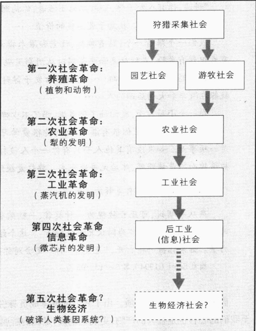

---

除去性别，群体活动的主要单位是家庭。大多数群体成员都有血缘或姻缘关系。因为家庭是这些社会中唯一明显的社会制度，它履行着现代社会中由许多专门制度分别履行的那些功能。家庭为成员分配食物，教育孩子(尤其是生存技能)，照料病人，满足他们几乎所有的其他需要。

由于一个地区不能供养很多狩猎采集者(他们不会种植，只能采集已有的植物)，所以狩猎采集社会的群体规模很小，通常只有25—40个人。这些群体居无定所，当一个地方的食物变少时，他们就迁徙到另一个地方。他们十分重视分享食物，这对于他们的生存十分必要。由于疾病、干旱、瘟疫，儿童的存活率只有50%（Lenski and Lenski，1987）。

在所有的社会中，狩猎与采集社会是最平等的。因为他们猎取的和采集到的食物容易变质，并且他们没有钱，所以人们几乎没有什么个人财产，谁也不比谁更富有。这里没有统治者，大多数决定都是通过全体讨论达成的。因为他们只有基本的需求，也不用为了积蓄财富而工作，狩猎采集者在所有人类群体中是最悠闲的(Sahlins，1972；Lorber，1994；Volti，1995)。

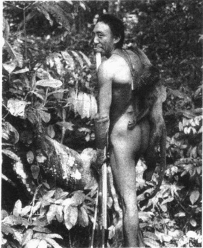

所有的人类群体都曾经历过狩猎米集社会,直到几百年之

最简单的社会形式称为狩猎与采集社会。虽然社会的成员要面对很多的艰难困苦，但是他们已经很好地适应了所处的环境。他们拥有比其他社会更多的闲暇时间。照片中的人是巴西亚马逊河地带狩猎与采集社会中的一个成员。

前这样的社会仍相当普遍。当其他类型的群体占领了他们赖以生存的地方后，他们的末日就来临了。今天，只有一些狩猎采集群体还存留着，如中非的俾格米人、澳大利亚的土著人。这些群体看起来有着相同的命运，而且他们的生活方式很可能会逐渐消亡(Lenski and Lenski, 1987)。

### 游牧和园艺社会

大约一万年前，一些群体发现他们可以驯服和饲养某些捕获的动物——主要是山羊、绵羊、牛和骆驼。另一些群体发现他们可以种植作物。结果，狩猎和采集社会也就开始朝向不同的方向发展。

理解第一个分支的关键词是游牧。游牧(或放牧)社会(pastoral societies)是基于对动物的放养。游牧社会多在干燥地区，这里降雨量少，不可能以种植谷物为生。游牧社会的人们依然居无定所，因为他们要赶着牲畜去新鲜的牧场。理解第二个分支的关键词是园艺，或植物培育。园艺社会(horticulture societies)是基于使用手工工具来种植作物。由于在某个地方的食物量减少时他们也不必离开，所以这些群体建立了长期的居住地。

我们把动植物的养殖称为第一次社会革命。如图 6.1 所示，它改变了人类社会。虽然养殖革命（domestication revolution）是在几千年的时间里缓慢发生的，但它也是人类社会变迁过程中一个根本性的突破。食物供给有了保障，引发了人类生活各个方面的变化。群体规模变大了，因为较为稳定的食物供给能够养活更多的人。因为有了比人们生存所需更多的食物，所以生产食物不再是每个人必须要做的事，这就允许在群体中形成劳动分工。许多人开始专门制作珠宝、工具、武器等等。这导致了产品剩余，反过来，产品剩余又刺激了贸易。在贸易中，群体开始积聚他们珍视的物品，如黄金、珠宝、器皿等。

---

如图6.2所示，这些变化为社会不平等提供了条件。许多家庭(或部落)拥有较多的物品。因为现在群体有了动物、牧场、农田、珠宝和其它人们竞相争夺的物质产品，争端和战争也随之而来。反过来，战争则为奴隶制敞开了大门，因为人们发现让俘虏去作苦工是件十分便利的事情。不过因为产品剩余依然有限，所以社会不平等也保持在一定限度内。随着个人将财产传给后代，财富变得更加集中，权力同样如此。从某种意义上说，在这个时期，许多人成了领袖、群体的领导。

请注意贯穿群体生活转变过程中的主要模式：财产由少变多，平等程度由高变低。人们在一个社会内部所处的位置，对于决定他们的生活状况非常重要。图6.2概括了这些变化是如何导致社会不平等的。

### 农业社会

五六千年前犁的发明，使社会生活又一次发生了大转变。与锄和挖掘木具相比，用畜力拉犁的效率是巨大的。当泥土被犁翻过，更多的营养回到土壤中，土地也就变得更加肥沃。农业革命（agriculture revolution）带来的剩余食物不同于以往的食物剩余，它使得更多的人能够从事耕种以外的其他活动。在这个新的农业社会，人们建立了城市，发展了被普遍认为是“文明”的东西，如哲学、艺术、文学和建筑。伴随着轮车、书写和数字的发明，社会中发生了如此深刻的变化，以至于有时这个时期被称为“文明的拂晓”。

先前社会的不平等趋势只是将要到来的社会的前兆。不平等现在变成了社会生活的基本特征。一些人试图控制不断增加的剩余资源。为保护他们日益扩大的特权和权力，社会精英在自己周围布置了武装人员，他们甚至向那些“附属”于他们的人征税。正如冲突论者所指出的，这种资源和权力的集中——连同无权者所受的压迫——是国家出现的前奏。

没有人确切地知道事情是怎么发生的，但是在这一时期女性变得受制于男性。社会学家埃利斯·博尔丁(Elise Boulding，1976)提出，这种变化的发生是因为男性负责耕种，掌管着耕牛。她提出，当金属出现后，男性承担了将金属绑在木犁的头上和耕地的新工作。结果，

一旦农业生产中的两项工作，即耕地和放牛，专门由男性来做，女性耕种者的地位就可能发生了迅速的改变。妇女只能做一些附辅性的工作，包括除草和抬水到田地。新开垦的农田较大，所以妇女得用更多的时间工作，但是现在她们做的只是次要的工作……这会进一步削弱妇女的地位。

图 6.2 饲养动物和种植作物的基本后果

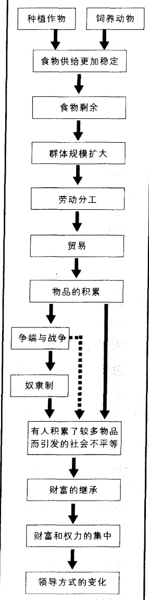

---

然而，这种解释造成的问题比它回答的问题还要多。为什么这样说呢？例如，为什么是男性承担了为木犁绑金属犁头和犁地的工作？为什么不是女性去做这些工作？这个解释同样没有说明，这个由女性负责养牛的社会为什么会被男性控制？总之，对于男性怎样变成主导者，我们还不得而知，答案还需要我们从人类历史中去寻找。

### 工业社会

18 世纪，另一项发明使社会发生了翻天覆地的变化。1765 年，蒸汽机在英国第一次被用于驱动机器时，工业革命（industrial revolution）开始了。在此之前，尽管人们也应用一些机器（如风车和水车）来利用自然力，但是大多数机器都依赖于人力和畜力。因此，社会学家布鲁默（Herbert Blumer，1990）把工业社会（industrial society）定义为一个靠燃料而不是人力或畜力驱动的机器生产物品的社会。

随着蒸汽机的出现，社会不平等进一步扩大。这项新技术创造了比以往任何技术都高的效率，正如它带来了更多的剩余产品一样，它对社会生活的影响也更加深远。那些首先使用蒸汽机的人积累了如此多的财富，其富裕程度超过了王室贵族的想象。由于在市场中占据了最初的有利位置，他们不仅掌握着生产资料（工厂、机器、工具），而且控制着人们的工作环境。封建社会的解体又使他们控制了工人。大批的人们被驱逐出世代耕种和居住的土地，由于无家可归，这些失地的农民迁移到城市中。在那里，他们要么选择偷盗或饿死，要么为挣一份不能果腹的工资而去工厂做工（Chambliss，1964；Michalowski，1985）。

工人们没有获得安全工作环境的合法权利，也没有权利成立工会。雇佣关系是雇主和单个工人之间的私人约定。如果工人联合起来抗议或要求提高工资，他们会被解雇；如果他们回到工厂，他们会以侵犯私人财产的理由被捕。罢工是非法的，并且罢工者会遭到雇主私人保安队的野蛮殴打。20世纪初在美国，罢工者经常被私人保安——甚至被大兵开枪打死。

尽管如此，工人们逐渐赢得了改善工作环境的斗争。随后，更多的人得以分享社会的财富。最后，人们普遍拥有了住房、汽车和丰富的消费品。今天，发达工业社会中的普通工人的生活在物质条件、医疗保健、寿命和受教育机会等方面都达到了很高的水平。这些都远远超出了早期社会改革家的想象。

随着工业化进程的展开，早先的社会发展模式也发生了转变，平等性增加了。平等性的提高主要表现为：良好的住房条件和消费品的巨大增加、奴隶制的废除、君主政体到更具代表性的政治体制的转变、陪审制度的确立、投票的权利、旅游的权利，以及赋予女性和少数民族更多权利等等。

本书中讨论的社会革命的社会学意义是，我们所生活的社会决定着我们成为什么样的人。例如，这个工人的生活取向与第151页上的人是显著不同的，这一点很明显。作为工业社会象征的机器具有正反两方面的影响。一方面，它带来了大量的受欢迎的商品。另一方面，工厂时钟和永不休止的生产线使得人们成为了他们所制造的机器的奴隶。机器控制工人的思想在查理·卓别林的《摩登时代》这部经典影片中得到了体现。

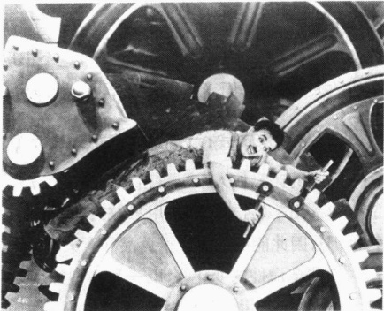

---

我们所在社会的形态决定了我们成为现在的我们，这一社会学原理绝不是夸大其词。让我们看一下工业社会如何影响你的生活吧。很显然，如果没有工业化，你就不会有电脑、汽车、电话、DVD播放器、电视、各式各样的衣服和住宅，甚至不会有电灯。更进一步说，你对生活会有截然不同的感受，你对未来的期望也会不同于现在。事实上，生活的任何一个方面都会不同；你可能会被局限在与农业或园艺社会的生活方式相适应的那种态度和观念中。

### 后工业(信息)社会

如果让你用一个词来描述我们现今所处社会的特征，你会用哪个词？在许多供选择的词语中，“变革”这个词将会排在首位。我们生活中发生的深刻变革主要来源于以微芯片为核心的新技术。当今社会的变革是如此广泛，以至于社会学家宣称一种新型社会已经出现了，他们称之为后工业(信息)社会(postindustrial or information society)。

这个新型社会的主要特征是什么？与工业社会不同，它的特征不是原料和制造，而是信息。老师向学生传授知识，律师、医生、银行家、飞行员和室内装修人员分别将他们关于法律、身体、金钱、气体力学以及色彩搭配的专业知识卖给他们的顾客。与工业社会的工人不同，他们不生产任何东西。相反，他们传播或利用信息为那些愿意付钱的人提供服务。

美国是第一个有一半以上的劳动力就业于教育、卫生、科研、政府、咨询、金融、投资、保险、销售、法律、传媒等服务行业的国家。这样的国家还有澳大利亚、新西兰、西欧和日本。这种从制造商品向销售信息和服务转变的基本趋势方兴未艾。

这种变革的意义如此深远，以至于它导致了第四次社会革命。微芯片正在改变既有的生活方式，剔除旧观念而代之以新思想。这种新技术使得我们可以在家工作；我们乘坐汽车、卡车、飞机时可以同远方城市甚至地球另一端的人讲话；使我们视野所及的范围比以往任何时候都远；它改变了我们的购物方式，网上交易额高达数十亿美元；而且这个小玩艺儿还让成千上万的孩子花费大量时间来对付网络游戏中的敌人。如果想了解其它变革，可以阅读第22章中有关计算机的部分。

### 生物经济社会：一种新型社会出现了？

未来的产品让人难以置信(Elias,2001)。烟草能抗癌(是的，吸烟有益健康！)。玉米能治疗疱疹，还能避孕。山羊奶含有蛛丝(用来做钓鱼线或保护身体)。动物体内含有人的部分基因(人类基因被植入动物基因)，因此能被用来生产药品和意大利奶酪(Kristoff,2002; Osborne,2002)。

这些革命性的变化表明，一种新型社会可能已经出现(Davis and Meyer, 2000; Holloway, 2002)。如果是这样的话，生物经济社会(bioeconomic society)最主要的特点将是，利用动植物的基因结构来生产食品和药品。自然科学将被重新定义。我们已经看到生物技术正在取代植物学，生物化学正在取代化学(Manavalan, 2001)。信息传输将不再局限于数字、文字、声音和图像，它还可以通过气味、味道和触觉进行(Davis, 2001)。

如果说我们正在见证一种新型社会的诞生，那么它到底是从什么时候开始的呢？每种新型社会都与它所取代的社会有交叉重叠，所以如此重大的变革不会有明确的界限。但是我们可以将生物经济的起点追溯到1953年，那一年弗朗西斯·克里克(Francis Crick)和詹姆斯·沃森(James Watson)发现了

---

DNA的双螺旋结构。当然，2001年绘制出人类基因组图谱也是这一新型社会形成中的一个重要时刻——甚至可能标志着它的开始。

在后工业社会或者说信息社会到来之后这么短时间内来定义一种新型社会，是要冒风险并会引起激烈争议的。基因与经济的结合有可能只是信息社会的一部分。但我们有可能会见证一个注定要取代信息社会的新型社会的产生。不管是哪种情况，我们都能预见在卫生保健领域可能发生的革命性的变化(预防而不是去治疗疾病)，甚至伴随克隆技术及生物工程的发展，人类作为物种也会发生变化。下面的“社会学和新技术”专栏将阐述克隆技术所带来的改变。

我们还不能完全了解这些变革的全部意义——它们是否是一种新型社会的组成部分也并非十分重要。这些变革的社会学意义在于，就像我们称之为“社会”的大群体总是深刻地影响人们的思想与行为一样，近来社会的发展也会对我们有深刻的影响。伴随着社会转型，我们也会被卷入社会变迁的过程中，社会生活的广泛变革将会改变我们对自我及生活的思考方式。

社会学和新技术

# “想成为你自己吗？”——未来生物经济中的克隆

没有哪种类型的社会是突然结束的。相反，前后两种类型社会之间总会有交叉重叠。随着信息社会在以后许多年里发展成熟，它将逐渐被生物经济社会所取代。我们来审视一下我们当前的社会，以便对未来的社会进行一下简单描述。生活将会怎样？由于篇幅所限，这里我们只谈一个问题：克隆。

想象一下这样一个场景：

你 4 岁的女儿溺水而死,你沉浸在巨大的悲痛之中。你向克莱塔的克隆诊所求助,在那里你保存了你所有家庭成员的 DNA。你付费之后,技术人员会让一个有偿代孕母亲把你女儿重新生出来。

克隆人会变成现实吗？看起来似乎不可避免，有人正在秘密试验室里做着这件事(“Couple plan…”2002)。克隆往往会造成畸形，目前科学家正在为这一问题而苦恼。我们假定这个问题已经解决了，克隆人已经变得稀松平常。想象一下这些场景：

假定有一对夫妇不能生育。检查表明是丈夫患有不育症。这对夫妇讨论了他们的困境，妻子同意移植丈夫的基因物质。这位妇女会把他丈夫作为一个小孩来抚养吗？

或者假定你非常爱你的母亲，可是她快要死了。经她允许，你决定克隆她。那么这个克隆体是谁？你会抚养你自己的母亲吗？

如果一位妇女有了她自己的克隆体,那么这个克隆体是她的女儿还是她的妹妹?

基因复制体的出现会带来一系列问题。他们与其“父母”之间是什么关系？什么是父母？什么是子女？这些问题将会成为人们饭桌上谈论的话题。

### 思考题

如上所示,克隆会导致很多深刻的问题,最重要的也许是未来的社会会是什么样子。假定大规模克隆成为可能的话。

很多克隆的目的是不道德的，但有人会说恰恰相反。他们会问，我们为什么要让那些有遗传疾病、低智商甚至有犯罪与暴力倾向的人承担人类自身生产的任务？他们会建议我们选择那些创造力强、智商高、有同情心、倾向和平的人。

我们再假定科学家已经探明遗传学上与诗歌、音乐、数学、建筑和爱心有关的特点。你认为我们有义务让社会中全是有以上才能的人吗？我们应不应该努力构建一个对大家来说更好的社会——一个没有恐怖主义、战争、暴力和贪婪的社会？能否以此为我们发展的终极目标？

资料来源: Davis and Meyer (2000); Kaebnick (2000); McGee (2000); Bjerk et al., (2001); Davis (2001).

---

### ▷▷小结

社会为我们的生活设定了界限，它建立了通行的价值观和信仰，并决定着社会不平等的类型与程度。这些方面反过来又决定了男性与女性之间、青年人与老年人之间、种族与种族之间、富人与穷人之间的各种关系。

我们为什么是“我们”？我们的感知方式为什么是这样的？我们为什么会有一些特定的想法？这些都是我们所在社会的类型决定的，这条社会学原理没有言过其实。从浅层来说，如果你生活在狩猎采集社会，你可能欣赏不到你喜欢的音乐、看不到你喜欢的电视节目、不能玩你喜欢的录像游戏。从深层来说，你可能会对生命有不同的感知，你对未来生活的期望也会与现在不同。

最后,应当指出,不是所有社会都会像图6.1中所描述的那样经历所有类型的转变。狩猎与采集社会是否会幸存下去,仍需拭目以待。也许会有少量幸存下来,它们作为“小小的保留地”,将是开发者的禁区,只对有组织的生态旅游者开放——不过费用不菲。

我们已经回顾了各种社会类型的主要历史性变革，下面让我们再来看看社会中的群体，看看它们是如何影响我们的生活的。

### 社会中的群体

社会学家涂尔干(Durkeim,1933)想知道如何能防止社会失范——一种没有归属感的迷惘状态。涂尔干发现，答案在于小群体。他说，小群体是个人与社会之间的缓冲器。要不是有这些小群体，社会这个大而无形的实体就会让我们感到压抑。小群体为我们提供了亲密关系，从而给予我们一种意义感和目的感，有利于防止社会失范。

在具体分析群体之前，我们先来明确几个术语。“集群”与“类群”这两个术语有时易与“群体”混淆。集群（aggregate）是指暂时处于同一空间而互不隶属的个体之和。如在检查线外等候的人或停车等待绿灯的人是一种集群。类群（category）是一种统计量，它是指具有某些相似特点的人，如身高超过1.8米的男人、戴眼镜的女大学生等。同一类别的人既不相互交往，也不考虑彼此，相反，群体成员则认为自己归属这个群体，并彼此互动。

群体对你的生活影响非常广泛，以至于它们能够决定你是谁。如果你觉得这是耸人听闻，就请继续读下去。我们先来看一下社会中有哪些群体类型。

### 初级群体

我们所属的第一个群体——家庭——给了我们基本的生活定向。后来，在朋友当中我们感受到了更多的亲密情感和另一种归属感。这些群体被社会学家库利称为初级群体（primary groups）。初级群体让我们感受到亲密感，面对面地互动，给予我们身份，让我们感受到我们是谁。库利（Cooley，1909）指出，

初级群体,我指的是那些以面对面交往与合作为特征的群体。初级的含义是多方面的,但主要是指它们在形成个人的社会属性与价值理念方面具有基础性作用。

心存明镜 库利把初级群体称作“生活之源”具有重要意义。库利的意思是初级群体对我们形成

---

良好情感至关重要，你可以通过自己生活中的家人和朋友认识到这一点。人类非常需要面对面的互动，在这个过程中人会产生自尊感。只有初级群体才能满足人的这些基本需要——归属感、被欣赏和被爱的感觉等。本章开篇短文中讲的团伙也是初级群体。

初级群体之所以是“生活之源”，还因为其价值观念及思维方式已经融入我们的个性当中。我们学习吸收了他们的看法，这些成为我们观察生活的“镜头”。即使是成年人——不管我们离孩提时代已经多远——初级群体仍然深深隐藏在我们心中，影响着我们对世界的看法。即便可能，我们最终也很难把自己从初级群体中分离出来，因为自我和初级群体已经结合成一个“我们”。

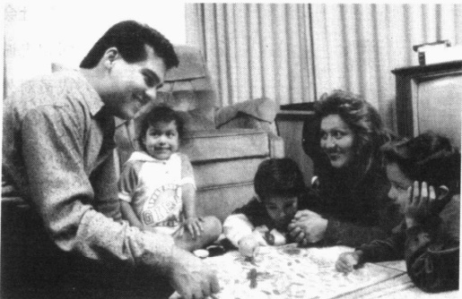

像家庭这样的初级群体在个人的发展中起着关键性的作用。作为一个小群体，家庭也是免受外界社会的大群体威胁的缓冲器。家庭对照片中这对拉美夫妇形成基本生活定位具有重要意义，对于他们的孩子也是一样。

### 次级群体

较之初级群体，次级群体（secondary groups）更大、更正式，具有匿名性和非人格化的特点。次级群体是基于某种利益或活动而组成的，他们的成员以特定的角色进行互动，如总统、经理、工人、学生。像大学中的班级、美国社会学协会及美国民主党等，都是次级群体。

在狩猎采集社会和园艺社会，整个社会构成一个初级群体。在工业社会及后工业社会，我们的福祉与次级群体息息相关，我们受教育、谋生、消费和休闲都是通过次级群体来实现的。

次级群体对当代生活非常必要,但它们经常不能满足我们对亲密关系的深层需要。因而,次级群体大有破坏初级群体之势。在学校与工作场所,我们建立起朋友团伙。朋友间的互动如此重要,以至于有时我们会想,要不是有这些朋友,学习和工作会“让我们发疯”的。这时,存在于次级群体中的初级群体就可作为我们与次级群体对我们的要求之间的缓冲器。

### 内群体与外群体

那些我们对其有忠诚感的群体叫做内群体(in-groups)，而那些我们对其有对立情绪的群体叫做外群体(out-groups)。开篇短文中，对“怪物”科迪来说，他的团伙就是内群体，而“布鲁德斯”和其他所有“敌人”都是外群体。对世界作出“他们”和“我们”的基本划分，对我们的生活有深远的影响。

产生忠诚、优越感和竞争性 确定群体身份不仅能产生归属感，还能产生忠诚感和优越感。这些反过来又会产生竞争。一般来说，竞争是温和的，如相邻两个小镇之间的体育竞赛。最极端的事情可能是为盗取一个吉祥物、或为拔掉一根标杆而偷偷进入外群体的领地。成为内群体成员的后果可能是歧视、仇恨，甚或是像开篇短文中的参与谋杀。

---

The New Yorker Collection, 1979 Robert Weber from cartoonbank.com. All rights reserved.

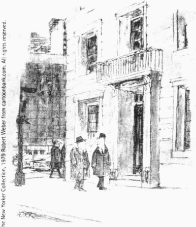

“再见，比尔。这是我的俱乐部，你不能进去。”

我们参与社会群体的方式如何塑造了自我概念是符号互动论者关注的一个问题。在这个过程中，知道我们不是谁与知道我们是谁同等重要。

社会多样性的含义 内群体成员有着强烈的身份认同和忠诚感，所有人都支持内群体成员，由此导致内群体成员对外群体成员的歧视也就不足为奇了。这正是许多社会问题的根源，也是性别和种族之间隔阂的根源。社会学家罗伯特·默顿（Merton，1968）指出，这会导致一种狂热的双重标准。我们将内群体的特征视为美德，而将外群体的同类特征视为恶习。人们会把一个争强好胜的男人看做十分自信，而将一个争强好胜的女人看做自以为是。如果一个男性雇员不说话，他们会认为他“知道什么时候该闭嘴”，如果一个女性雇员不说话，他们就会认为她太缺乏自信以致无法在商界打拼。

在这样一个多元社会，将世界分成“我们”和“他们”是危险的。就像纳粹对待犹太人一样，外群体似乎就象征着邪恶，会引起恐惧、蔑视和痛恨。恐怖分子袭击了纽约和华盛顿以后，对于某些人来说，阿拉伯人就成为这种外群体。他们视阿拉伯人为险恶的“他们”，是可疑、凶残的暴徒——当然与对“我们”群体的评价截然相反（不管那是一个什么群体）。这样极端的观点常常成为攻击外群体的理由。许多德国人将对犹太人的大屠杀说成是一项必要的“不光彩工作”。9·11恐怖事件发生后，有些美国人就支持对美籍阿拉伯人（甚至是长相类似他们的人）的个别攻击。例如，除非强迫有“阿拉伯长相”的乘客下飞机，否则有的飞行员就拒绝起飞。经济衰退也对产生外群体起到推波助澜的作用。如人们会将移民视为从他们的朋友和家人手中“偷走”工作的人，于是就可能会有对移民的攻击、反移民政策的出台、新纳粹组织或三K党的出现等。

总之，把世界分成内群体和外群体是社会生活中一件自然的事情。但除了产生一些有益的效果，它也会带来一些不良的影响。

### 参照群体

假定有份好工作摆在你面前。它的报酬比你大学毕业后的预期报酬还要多一倍。你只有两天时间来做决定。如果你接受它，你就得放弃大学学业。你考虑这事的时候，也许会有这样的想法：“如果我不接受的话，我的朋友会说我是个傻瓜……但爸妈会急得发疯。他们已经为我作出了很多牺牲，如果我不能完成学业，他们会被击垮。他们一直认为只要我完成学业，总会找到好工作……可是如果不接受，我就得看邻居的脸色，他们说过我不会有什么出息！”

这是人们如何使用参照群体的一个例子。参照群体（reference groups）是我们用以自我评价的一个标准。你的参照群体可能包括你的家庭、邻居、老师、同学、同事、或是有相同宗教信仰的人。如果你跟开篇短文中的“怪物”科迪情况差不多，那么该“团伙”就将成为你的主要参照群体。即使你不属于某个

---

群体,也可把它作为一个参照群体。例如,如果你即将毕业,毕业生或从事你的理想职业的人就会成为你的参照群体。你会以他们的标准评定自己的等级或写作水平。

提供衡量标准 参照群体对我们的生活有着重要的影响。例如，如果你想成为一名公司经理，你会开始穿着较为正式、尽量扩大词汇量、读《华尔街日报》、转攻商业或法律专业。反之，如果你想成为一个摇滚乐手，你可能会扎破身上某些地方如舌头，戴上珠宝饰物，多处纹身，穿着另类，读《滚石》，中途辍学，整天出入俱乐部和摇滚乐群体。

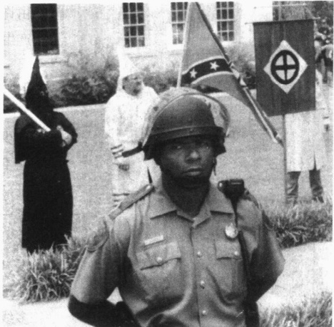

多样性社会中相互矛盾的各种标准 在以上例子中，我们可以把参照群体提供的衡量标准看做一种社会控制形式。当我们自己符合这些标准时，我们感觉不到有什么问题。但是当我们的行为，甚至是我们的愿望，与某个参照群体提供的标准不一致时，就会引起我们内心的混乱。例如，对于我们

我们所有人都有参照群体——这是作为评估自己的标准的群体。你怎样看待正在得克萨斯州的贾斯帕示威的3K党成员的参照群体，与那些保护他们言论自由的警察的参照群体有何不同？虽然3K党和警察运用不同的群体来评价他们的态度和行为，但是过程是一样的。

大多数人来说，想成为一名公司经理不会产生什么问题。但如果我们是在信仰门诺派的家庭中长大的，可能就不行。因为门诺派教徒强烈反对他们的孩子有这种愿望。他们抵制中学和大学教育、反对穿三件套装束及在公司中就职。同样地，如果你想参军而你的父母都是坚定的和平主义者，你也可能会感到一种深深的冲突，因为你的想法与父母的愿望背道而驰。

因为社会的多样性和流动性,我们很多人都要面对许多相互矛盾的观念和标准,这些观念和标准是

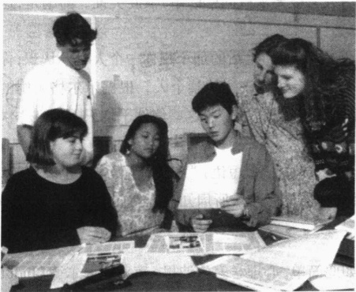

我们都在运用参照群体来评估我们的成就、失败、价值和态度。我们将我们所看到的与我们所想象的参照群体的标准进行比较。正如这两张照片所显示的那样，这些年轻人所用的参照群体将不可能带他们走向相同的社会目的地。

---

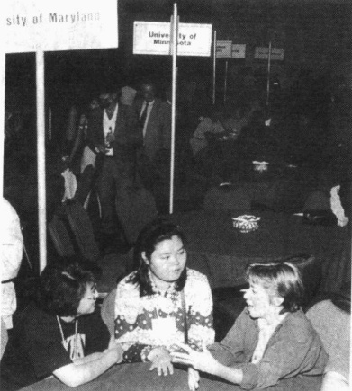

为什么人们在生活中总想出人头地？是他们能力的原因吗？虽然个人的能力和努力对于成功很重要，但社会网络也是非常重要的，它将打开和关闭机会的大门。例如，不管社会惯例的正式规定如何，许多“真正的”生意都是以更新和拓展社会网络为中心的。

由许多对我们很重要的群体提供的。这些由参照群体所产生的矛盾信息，是社会流动性的一种代价。

### 社会网络

如果你是一个大群体的成员之一，你可能只和群体中少数人保持定期联系。在我的一堂社会学课上，六个互不相识的女生选择共同完成一项任务。她们相处得很好，并开始相互交往。最后她们在其中一个人家里举行了一场圣诞晚会。这样一组人或内部集团就被称为“团伙”（cliques）。人们之间的联系——团伙、他们的家庭、朋友、熟人、甚至“朋友的朋友”之间的关系称之为社会网络（social networks）。社会网络就像从你自己延伸出去的许多线，逐渐包括了越来越多的人。

小世界现象 虽然我们生活在一个大社会中，但我们却不与众多不知其姓名的陌生人交往。相反，我们在我们的社会网络中交往互动，社会网络又把我们与大的社会联系起来。社会科学家想弄清楚社会网络之间的联系有多广泛（Watts，2003）。如果你把所有你认识的人全部列出来，而

这些人又把所有他们认识的人全部列出来,依此类推,是不是几乎所有美国人最终都会出现在名单上?

列出这样一个名单来验证这个假设太过繁琐，心理学家斯坦利·米尔格莱姆（Stanley Milgram，1933—1984）提出了一个有趣的办法。在其著名的题为“小世界现象”的经典研究中，米尔格莱姆（Milgram，1967）给他的“目标”——一位在剑桥读神学的学生的妻子和一位波士顿股票经纪人的妻子各写了一封信。他给他的“发起者们”写信，发起者们并不认识上述“目标”。他要求这些发起者把信寄给他们熟悉的人，寄给可能认识“目标”的人。这些收信人又被要求做同样的事，依此类推。问题是，这些信能到达“目标”手中吗？如果能，这个链条会有多长？

假定你也参加了此项研究,你也是一个“发起者”,但在“目标”生活的那个州你一个人也不认识,你会怎么办?你会写信给你认识的一个人,你认为这个人可能会认识该州的某个人。根据米尔格莱姆的研究报告,参与他的研究的人正是这样做的。发信人都不认识目标收信人,这些信件平均只需传递六次就会到达指定的接收人手中。

米尔格莱姆的研究激发了公众的想象力，由此产生了这样一个短语：“六次间隔”。这也就是说，每两个特定美国人之间平均只隔着六个人。米尔格莱姆的结论已经众所周知，甚至连因特网游戏“Six Degrees of Kevin Bacon”也是据此设计的。

小世界现象是一个学术神话吗？但是事情并非如此简单。心理学家朱迪思·克莱因菲尔德(Judith Kleinfeld，2002a，b)决定重新进行米尔格莱姆的这项研究时，她发现其中存在一个问题。当她去耶鲁大学档案室去查找资料时，她发现米尔格莱姆有意选择了大量支持其研究发现的资料。他用通讯录名单来

---

招募“发起者”，1967年时这些人可能是高收入者，因此并不能代表普通民众。另外，他的一个“目标”是股票经纪人，而这个人的“发起者”却是蓝筹股的投资者。克莱因菲尔德还发现另外一个较大的不同——平均只有30%的信件到达“目标”。在米尔格莱姆的一项研究中，这个比例仅为5%。

既然大部分信件没有到达他们的目标，即使有大量资料证明实验是成功的，我们也能得出与米尔格莱姆报告相反的结论。互不相识的人很明显地被社会中的各种界限分隔开来。从其它研究中我们得知，除了地理因素之外，这些界限主要是阶级、种族因素。正如克莱因菲尔德所说：“与其说我们生活在一个小世界里，还不如说我们生活在一碗有许多块状物的燕麦粥里，在这里，许多小世界松散地联系着，也许有些小世界根本就没有联系。”

对社会多样性的意义 因此，与米尔格莱姆所得的结论不同，他的研究实际上可能证明了是各种社会界限把我们分隔在各个不同的小世界里。很难跨越这些界限的原因之一是，我们自己的社会网络也会造成社会不平等，这个问题我们将在下面专栏中探讨。

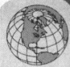

### 美国文化多样性

### 社会网络如何使社会不平等永久化？

思考一下我们已经讨论过的一些原理。人们与跟自己类似的人形成内群体；他们利用参照群体来评判自己的态度与行为；他们在社会网络中进行互动。我们的内群体、参照群体与社会网络很可能由与我们自己背景相似的人们组成。这意味着对我们大多数人来说，就像社会中存在着不平等一样，我们自己的社会关系中也有不平等。其后果之一就是社会不平等的永久化。

为了说明其原因，假定你工作的地方有一份很好的工作：高薪、有趣、有晋升机会。你会告诉谁？非常可能是你认识的人、你喜欢的人或者帮助过你的人。你的社会网络很可能由跟你类似的人组成，尤其是在种族、年龄、社会阶层及性别等方面都与你相似的人。这会使好工作流向与某组织成员相似的人。你可以看出我们的社会网络如何既反映了构成社会特征的不平等，又永久化了这些不平等。

假定存在一个在组织中形成的一个白人网络。当他们获知机会（工作、投资、房地产等等）时，他们会与他们的网络共享这些信息，于是机会与好工作就会流向那些与他们相似的人。反过来，那些从这些信息中受益的人也会用他们得到的类似信息作为回报。其他不具相同特点的人（如女人和少数民族）就不会得到这些信息，这使得“好老男孩”网络得到巩固。这里面没有故意的歧视。

为了克服这一障碍，妇女和少数民族也会组成社会网络。他们尽量去结识那些能够帮助他们事业发展的人。像“好老男孩”一样，他们也去参加聚会、加入俱乐部、去教堂、参加犹太人的集会或去清真寺、参加政治集会等。妇女建立起妇女的网络，美籍非裔领导组成美籍非裔领导的网络。美籍非裔领导非常团结，其中1/5的人相互之间都很熟悉。加上一些“朋友的朋友”，有3/4的美籍非裔领导属于同一网络（Taylor，1992）。那些获得高层职位的女人形成一个被称作“新女孩”的网络，法律界尤为如此。她们念念不忘那些曾帮助过她们的人，同情那些争取成功的人，这些女人往往是把她们的业务转给其他女人。像“好老男孩”一样，这些新的成功人士也认为她们的排他行为没什么不妥（Jacobs，1997）。

### 思考题

社会不平等的永久化并非是因为有意的歧视。正是因为社会中存在不平等，所以我们个人的社会关系中也有了不平等。你认为你的社会网络对社会不平等的永久化有什么影响？你认为我们怎样才能打破这个怪圈子？（答案必须集中于在社会网络中创造多样性。）

---

对科学的意义 克莱因菲尔德对米尔格莱姆研究的新评价，突出了我们上一章讨论过的重复研究的重要性。鉴于我们对社会生活的认识，我们不能只靠一项研究，因为一方面存在普遍性问题，另一方面有些问题会被疏忽掉，甚至存在欺骗性问题。由公正的研究者进行的重复研究，对建立和推动社会学知识非常重要。

### 一 个新群体: 电子社区

20世纪90年代，一个新型人类群体——电子社区（electronic community）出现了。有成千上万人在网络聊天室里会面，“新群体”网上交流的内容无所不包，从赛驴、观鸟到社会学、量子物理等。大多数新群体都只是一种有趣的交流方式。不过也有一些符合群体的定义，群体成员保持互动并有共同的归属感。

有些群体对他们独有的兴趣与知识感到骄傲,这些兴趣与知识使他们拥有共同的特征并把他们联系在一起。下面的“社会学和新技术”专栏将着重介绍这一新型群体。

社会学和新技术

### 电子社区与网上一族

贾森·史密斯是一名大二学生，一直靠在网上销售电脑维持生计。贾森赚的钱交完房租只有一点点剩余。他的网上生意做得很顺利，直到有一次芝加哥的史蒂夫·马修斯要给他上大学的儿子买一台电脑，贾森卖给他一台“苹果牌笔记本电脑”。

马修斯寄给他一张 3052 美元的现金支票，杰森给他交了货。杰森用这些钱付了房租，还买了一个加热器，然后过圣诞假期贾森又花了不少钱。假期过后回学校的路上他得知一个坏消息：银行通知他那张现金支票是假的。

贾森一时不知所措。他从网络世界里走出来，他的活期存款账户已经透支。他向芝加哥警察局报警，但警察说他们很忙，一周之内不能和他讨论这种鸡毛蒜皮的小事。

贾森向其他Mac用户求助。他在MacRumors上发帖子说明他的情况，一些他并不认识的人开始帮助他。他们找到马修斯的真实地址，将他那条街道、他的房子和汽车都拍了照，连汽车牌照都看得清清楚楚。

马修斯其实住在芝加哥郊外的一个小镇上，这回警察局开始着手破这起案子了。贾森又在易趣上发了一则广告，马修斯上钩了。贾森给他发了货，但是这次穿着联邦快递送货员制服的是一名侦探，马修斯签收时被逮捕。

这样贾森又能住在他租的房子里并能继续他的学业了。不过他现在比过去聪明多了，帮助他的网友给了他巨大的鼓舞（Hafner,2002）。

THE FAR SIDE $ ^{*} $ By GARY LARSON

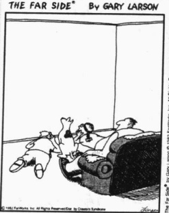

The Fair Side by Gary Lawson © 1982 FarWorks, Inc. All Rights Reserved. Used with permission

“电视机前的日子”

在过去几年里，一种人类历史上从未有过的群体——电子社区——出现了。电子（或在线）社区由那些定期在网上“会面”的人组成。他们有着共同的兴趣爱好：不管是老式汽车、激进的政见或是变态性行为等。有些社区为成员提供支持。如果有人因患上癌症而感到恐惧，承受着外科手术、放疗、化疗的痛苦，网友就会帮他解除包围在身边的压抑与孤独。罹患其他疾病的人同样如此。像贾森这样的情况，网友来自Macintosh的用户，他们曾认为他们不属同一群体，但在某种程度上又属同一

---

群体，因为他们都热爱电脑这种东西。

这种形式的交流形成了电子(或在线)初级群体，尽管人们从未谋面，可他们定期交流，互相帮助。当人们在网上交流的时候，他们能相互结识，发展出一种亲密关系，共享个人信息。网友对有些人来说非常重要，他们的生活离不开网友。每天早上他们起来第一件事就是冲到电脑前急切地读网友发来的电子邮件，光顾“聊天室”聊聊他们近来“现实”(不是在线)关系的进展情况，然后才换好衣服去上班。下班后，他们又回到他们的精神世界。对他们来说，网友就像家人一样真实，有时网友对他们生活的影响比家人都要大。

随着在线交流的加强，这些现实中从未谋面的人们形成了一定的社会关系（Chayko，2002）。他们体验亲密关系却不使之持久，有着深厚的感情却不作出承诺（Cerulo et al., 1992）。如果这种形式的社会关系蔓延开来，它不只会影响我们的社会交往，还会影响我们的文化，甚至影响我们对自己的认识。

### 思考题

社会研究者首先指出，人们在网上呆的时间越长，他们与家人和朋友的关系就越远。新近研究表明，乐于交际的人在精神世界与现实世界中都很开朗。85%的网络用户声称他们与家人和朋友在一起的时间没什么变化(Guernsey,2001)。看上去那些青少年似乎在利用网络来拓展他们的个性(Turkle,1995; Goldsborough,2001)。你体验过网络中的亲密关系吗？

### 群体动力学

从个人经验中你会知道，群体内部活跃的互动——谁做什么事、与谁一起做——对我们适应生活有着重要的影响。社会学家用群体动力学（group dynamics）一词指我们与群体之间如何影响。我们先来讨论一下群体规模有什么差异，然后考察领导、服从与决策。

在此之前，我们先来看一下社会学家对小群体的定义。在一个小群体中，成员很少，每个人都能与其他成员直接互动。小群体可以是初级群体，也可以是次级群体。夫妻子女、在一起休息的工友等是初级小群体，而拍卖会上的投标人和鸡尾酒会上的客人等则是次级小群体。

### 群体规模对群体稳定性与紧密性的影响

社会学家格奥尔格·齐美尔（George Simmel，1858—1918）在其20世纪早期的著作中指出了群体规模的重要性。他用“二人组”（dyad）来指只有两个成员的最小群体。二人组包括有婚姻、恋爱及其它亲密关系的两个人，它有两个明显的特征。首先，它是最紧密的人类群体，因为二人组只包含两个人，所以交流互动也就集中在这两个人身上。其次，因为需要双方共同参与并承担全部义务，二人组也就成为最不稳定的群体。如果有一个成员失去兴趣，二人组就会解体。相反，在较大的群体中，即使有一个人退出，这个群体也可以继续存在下去，因为这个群体的存在并不依赖于某个特定成员（Simmel，1950）。

“三人组”（triad）是由三个人组成的群体。齐美尔指出，第三人的加入从根本上改变了群体关系。因为有三个人，原先两个人之间的互动减少了。这会产生成员关系上的一些紧张。如小孩出生以后，夫妻中的任何一方都不受影响几乎是不可能的。两人的注意力都集中到孩子身上，夫妻之间的交流自然也就减少了。妻子对丈夫的关心少了，很多情况下丈夫都会感到嫉妒，尽管有诸如此类的麻烦，婚姻关系通常却会得到巩固。虽然三人群体中的交流减少，但成员之间的关系却更加稳固。

---

图 6.3 群体规模在关系上的影响

<table border=1 style='margin: auto; word-wrap: break-word;'><tr><td style='text-align: center; word-wrap: break-word;'>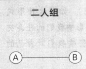[F7]</td><td style='text-align: center; word-wrap: break-word;'>三人组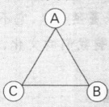</td><td style='text-align: center; word-wrap: break-word;'>四人群体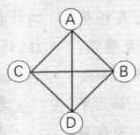</td></tr><tr><td style='text-align: center; word-wrap: break-word;'>1种关系</td><td style='text-align: center; word-wrap: break-word;'>3种关系</td><td style='text-align: center; word-wrap: break-word;'>6种关系</td></tr><tr><td style='text-align: center; word-wrap: break-word;'>五人群体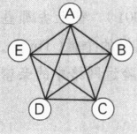</td><td style='text-align: center; word-wrap: break-word;'>六人群体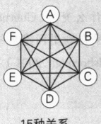</td><td style='text-align: center; word-wrap: break-word;'>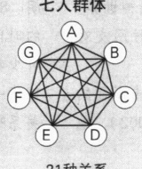</td></tr><tr><td style='text-align: center; word-wrap: break-word;'>10种关系</td><td style='text-align: center; word-wrap: break-word;'>10种关系</td><td style='text-align: center; word-wrap: break-word;'>21种关系</td></tr></table>

然而，齐美尔指出，三人组也有其内存的不稳定性。比如，可能会有两个成员关系较近从而结成联盟(coalition)。某些群体成员联合起来对付别人时就形成了联盟。在三人组中，两个成员形成二人组，另外一个成员感到被排挤而受到伤害。三人组的另一个特点是，三人中往往会产生一个仲裁者或调停者，以解决另外两人之间的争端。在一个三口之家，你往往可以观察到三人组的这两个特点——联盟和仲裁。

其基本原理就是:随着一个小群体逐渐变大,它的稳定性越来越强,但它的紧密性则越来越弱。原因见图6.3。随着新成员的加入,群体中人们的关系会成倍增加。二人组中只有1种关系;三人组中有3种关系;四人群体中有6种关系;五人群体中有10种关系;六人群体中有15种关系,七人群体中有21种关系。如果我们继续增加成员数量,群体中成员的关系可能会难以计数:八人群体中有28种可能的关系;九人群体有36种关系,十人群体中有45种关系……

不仅仅是成员关系的增多会使大群体更加稳定。随着群体规模的扩大，它们趋向于发展出一个更加正式的结构来完成其目标。例如，领导者出现，人们扮演专门的角色并发挥各 $ \underset{\cdot}{自} $的作用。这通常会导致诸如总统、秘书和财务人员这样的职位的出现。这种结构使群体能够长期存在下去。

### 群体规模对人们态度与行为的影响

假定你的社会心理学教授让你跟几个学生一起讨论你们对大学生活的适应情况。他们告诉你讨论要匿名进行，为了不让其他人看见你，你要坐在一个小间里。当麦克风递进来时，你会通过内部通信联络系统来参与这项讨论。教授们说他们不会听到对话的内容，然后他们就离开了。

你发现这种方式有些奇怪，但你还是照办了。在小间里你看不到其他学生，但当他们谈论自己的经历时，你会发现你自己被卷入他们谈论的问题之中。一位学生甚至提到因为他的癫痫病史，他发现大学生活是多么可怕。随后，你将会听到这个人沉重的喘息声从麦克风中传出来，然后是他结结巴巴大声的呼救声，接着是什么东西倒在地上的声音。你想象他正无助地躺在地板上。

剩下的只有可怕的寂静。你会怎么做？

你的教授，约翰·达利和比布·拉塔恩(John Darley and Bibb Latané，1968)导演了整件事，但你事先并不知道。没有人晕倒。事实上，甚至没有人在其他的小间里。除了你说的话，一切都是录音。

---

许多参与者被告知他们将与一个学生一起讨论这个话题，有人被告知是与两个学生一起讨论，还有人被告知是三个学生，等等。约翰·达利和比布·拉塔恩发现，所有学生，只要他们知道自己参加的是二人组的讨论，就会立刻冲出去求救。如果是三人组，只有80%的人去求救——他们离开小间的速度也会减慢。在六人组中，只有60%的人想看看到底发生了什么——他们离开的速度就更慢了。

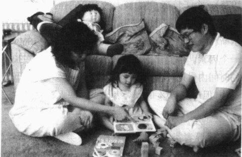

这个实验证明了群体规模对我们态度和行为的影响有多么深刻——它甚至会影响我们去帮助他人的意愿。两人组的学生知道应该由他帮助那个学生。教授已经走了，如果他们不帮助的话，就没有其他人了。在更大的群体中，包括三人组，

群体规模对人们的行为有着显著的影响。当一个群体从二人组变为三人组时，参与者的关系就会起变化。你怎么看待女孩的出生会影响到她父母亲的关系？

群体同样塑造着我们生活的方向。你认为这个女孩的成长会伴随着什么样的假定？

学生们感到了一种责任分散：他们和其他人都没有提供帮助的责任。

你也许已经直接观察到了群体规模的第二个影响。当群体较小时，成员关系是非正式的，但是随着群体变大，成员关系也就失去了亲密性，变得更正式起来。成员们不再认为其他人是对自己的话产生共鸣的“局内人”。现在他们必须考虑“更多的听众”，他们不再是“谈论”，而是开始在群体中“演说”。他们的演讲变得更加正式，并且身体语言也变得程式化。

你也许还观察到了群体动力学的第三个方面。在聚会开始只有几个人到场时，几乎每个人都在互相交谈。但是随着其他人的到来，客人们分成了几个小群体。有的主人设法让客人们像他们想的那样聚成一个群体，结果却让客人们感到厌烦。大群体分成几个小群体是不可避免的，因为它遵循我们前面讲到的基本的社会学准则。正因每个人的加入都使成员间的关系(在这个例子中就是人们的“谈话链”)迅速增加，人们之间的交谈才变得困难起来。客人们分成了几个小群体，在那里他们可以彼此看到，惬意地直接与他人互动。

### 领导

我们所有人都会受到领导者的影响，所以理解领导很重要。让我们看一下人们是如何变为领导者的、有哪些类型的领导者，以及哪些不同的领导方式。在这之前，我们需要知道领导者并不必然在群体中担任正式职位。领导者只是那些影响其他人行为、观点或态度的人。甚至在朋友群体中也有领导者。

谁成为领导者？领导者生来就有出类拔萃的能力吗？社会学家不会同意这种观点。一般来说，成为领导者的人被群体成员认为能强有力地代表他们的价值观，或是有能力使群体摆脱危机（Trice and Beyer, 1991）。领导者还趋向于更加健谈和更能表现自己的坚定和自信。

因为领导者就是具有这些特征，所以研究者的这些发现并不出人意料。然而研究者发现，这些特质与领导能力毫不相关。例如，高大魁梧和长相英俊者看起来更可能成为领导者（Stodgill，1974；Crosbie，

---

1975)。个子较高、魅力较大的人可能挣钱更多，反之亦然（Deck，1968；Feldman，1972；Katz，2003）。

还有许多其他因素影响着人们对领导者的选择，多数因素都很微妙。社会心理学家劳埃德·豪厄尔斯和塞尔温·贝克尔（Lloyd Howells and Selwyn Becker，1962）作了一个简单的实验，揭示了其中的一个因素。他们让互不相识的人五个一组坐在长桌前，三个人在这边，两个人在另一边。每个组在规定的时间内讨论一个话题，然后选出一个领导者。实验结果令人震惊：虽然只有40%的人坐在有两个人的一边，但却有70%的领导者出自这些人。原因在于我们倾向于跟我们对面而不是我们身边的人进行更多的互动。

领导者类型 群体中有两种类型的领导者（Bales，1950，1953；Cartwright and Zander，1968）。第一种很容易辨别，称为工具型领袖（instrumental leader）（或任务取向领袖）。他们带领群体朝着目标前进，这些领导者努力防止群体成员脱离既定轨道，时刻提醒他们要完成自己的任务。相反，情感型领袖（expressive leader）（或社会情感领袖）通常看不出来是一个领导，但事实上他/她的确是。这种人可能会跟群体成员开玩笑，向他们表示同情，或做很多鼓舞群体士气的事情。这两种类型的领导者都是必不可少的：一种使群体走上正轨，另一种使群体增强和谐，减少冲突。

一个人很难同时成为工具型领袖和情感型领袖，因为这两种领导类型是相互矛盾的。工具型领袖是任务取向的，有时在激励群体工作时会与群体成员产生摩擦，他们的做法经常使他们不受欢迎。相反，使群体增进团结减少摩擦的情感型领袖通常更受欢迎（Olmsted and Hare 1978）。

领导风格 假设你的大学校长让你带头完成一项任务，决定在大学校园中怎样改善种族关系。虽然这种位置需要你成为工具型领袖，不过你可以采取不同的领导方式，以不同的方式来表现你的领导者地位。有三种基本的领导方式，它们分别是：好发布命令的独裁型领袖；努力达成一致意见的民主型领袖；十分随意纵容的自由放任型领袖。你会选哪一种？

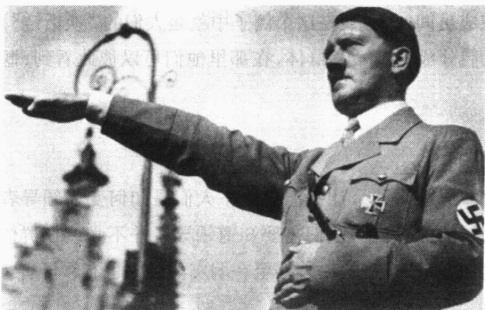

阿道夫·希特勒被评选为20世纪最有影响力的人。他同样也被选为最邪恶的人。为何有如此多的人追随希特勒？这个问题引发了斯坦利·米尔格莱姆的研究，这一照片展现的是希特勒1934年在德国纽伦堡发表演说时的情景。（因为这个城市与纳粹关系最密切，为了说明纳粹党的失败和公开其暴政的邪恶，同盟国把这里作为战争审判地。）

社会心理学家罗纳德·利皮特和拉尔夫·怀特（Ronald Lippit and Ralph White，1958）进行了一项关于领导方式的经典研究。他们把一些在智商、口碑、体力、领导能力等方面水平相当的男孩分成一些五人小组，让他们组成几个“手工艺俱乐部”。实验者对成年男子进行三种领导方式的培训。研究者通过窥孔观察、记录和录像，每个成年人在几个俱乐部中轮流扮演三种风格的领导者，这样就可以控制由他们的个人性格对实验结果带来的可能影响。

独裁型领袖给男孩们分配工作并确切告诉他们应该做什么，还任意表扬或批评他们的工作，对工作的对错不做任何解释。民主型领袖与男孩们一起讨论，说明要完成任务所需要的步骤，提出可供选择的方法让男孩们按符合自己特

---

点的方式工作，以“事实”为依据评价成员的工作。自由放任型领袖很被动。他们给男孩们完全的自由，让他们按自己的意愿做事。当成员请求帮助时他们也会帮忙，但是他们很少对成员提出建议。他们对成员的工作不做任何评价，不管是正面的还是反面的。

结果呢？处在独裁型领袖领导下的男孩对领导者有更多的依赖性，并显示出高度的内部团结。他们还变得好斗而冷漠，对领导者怀有敌意。相反，拥有民主型领袖的男孩们之间更友好，更重视彼此间达成共识。他们不替人受过，领导不在时也能保持稳定的工作节奏。自由放任型领袖领导下的男孩能提出很多问题，但他们做不出什么决定。他们很明显不如其他男孩更能完成任务。研究者得出结论说，民主型的领导方式最理想。然而，他们的结论可能有失偏颇。因为研究者偏爱民主型的领导方式，并且这项研究是在政治管制比较严格的时期做的（Olmsted and Hare，1978）。很显然，这种偏见也出现在以后的同类研究中（Cassel，1999）。

你也许注意到这项研究只涉及男孩和成年男性。如果用女性群体或男女混合群体来重复这项实验，结果可能会十分有趣。或许你就是那个想做这种实验的社会学家呢。

不同情景下的领导方式 不同的情境需要不同的领导方式。例如，假定你正带领一群登山者攀登加利福尼亚的塞拉马德雷山，现在到了晚饭时间。如果登山者自己带了食物，做个自由放任型领导正合适，或者你也可以采用民主型领导方式。而独裁型领导方式——告诉旅行者怎样准备晚饭——也许会招致不满。这可能会与群体最初的目标——有好心情去欣赏大自然——相抵触。

现在设想一下同样的群体处于不同的情境下：一个登山者走丢了，而暴风雨马上就要到来。这时就需要你用独裁型领导方式来控制局面。如果你只是耸耸肩说“一个人丢了”，可能会引来麻烦——说不定会遭到起诉。

### 同辈群体压力的力量: 阿希实验

群体对我们生活的影响有多大？为了回答这个问题，让我们先来看一下在同辈群体中的遵从性（conformity）。同辈群体不对我们施加权力，只是在我们许可的范围内对我们施加影响。

假设你正在上所罗门·阿希博士的社会心理学课，并同意参加一项实验。你走进实验室，看到七把椅子，其中五把椅子上已经坐了其他学生。你被安排坐在第六把上，随后的来人坐到第七把上。阿希博士站在房间前面的一个画架旁边。他说首先要给大家看一张画有一条竖线的卡片，然后是一张有三条竖线的卡片。每个人都要告诉他三条竖线中哪条与第一张图片上的竖线一样长（见图6.4）。

然后阿希博士向大家展示了两张卡片。正确答案很简单，因为有两条线很明显跟第一张卡片上的竖线不一样长，只有一条是一样长的。每个人依次大声说出他或她的答案。你们的回答都是正确的。第二次试验同样简单，你开始怀疑自己为什么坐在这里。

在接下来的第三次实验中，意想不到的事情发生了。跟前两次实验一样，答案很明显。然而第一个学生说出一个错误的答案。第二个学生给出了同样的错误答案。第三个、第四个也都如此。你不知道这是怎么回事。接下来第五个人会怎么回答呢？当他给出相同的错误答案时，你简直不敢相信。然后轮到你，你给出了你所知的正确答案。第七个人给出了与其他人同样的错误答案。

下一次实验中同样的事情又发生了。你知道其他六个人的选择是错误的。显而易见，他们错

---

图 6.4 阿希的卡片

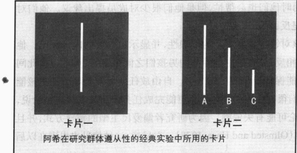

资料来源：Asch（1952），第452—453页。

了。你不知道该怎么去想这件事。为何他们看东西的方式与你不同？有时是一样的，但是在十二次实验中不一样。一定是哪儿出了什么严重的错误，你不再确定该怎么作了。

当第十八次实验完成时，你大大松了一口气。实验全部结束，你就要走出实验室时，阿希博士笑容满面地来到你的面前，感谢你参与了这项实验。他说你是这项实验中唯一的被试！他说：“其他六位都是助手，是我让他

们说出那些错误答案的。”这时你才真正松了口气，毕竟你的眼睛没有欺骗你。

实验结果如何呢？阿希（Asch，1952）对50个人进行了测试，三分之一（30%）的人服从了群体压力，给出了他们明知错误的答案；另一半实验中五分之二（40%）的人给出了错误答案，但是次数不多；四分之一（25%）的人坚持自己的观点，给出了正确的答案。我不知道我在实验中会怎样做（如果事先我什么都不知道的话），但我愿意认为自己是那25%中的一位。或许你也会这么认为吧。但是为何我们会感到我们与大多数人不同呢？

实验结果是令人不安的，很多研究者重复了阿希实验(Levine，1999)。在我们的“个人主义领地”上，群体的力量是如此强大，以至于大多数人都愿意说出他们明知不正确的事情，并且实验中的群体还是由陌生人组成的！如果将其换成朋友群体或我们尊重并朝夕相处的人，我们的遵从性又会有多大？同样可以用女性被试去重复阿希的实验，这个社会学家也许就是你。

### 权威的力量: 米尔格莱姆实验

甚至还有更加令人不安的实验结果，请看下面的“批判性思考”专栏。

### 批判性思考

### 如果希特勒让你处死一个陌生人,你会那样做吗?——米尔格莱姆实验

设想你正在上斯坦利·米尔格莱姆博士（Milgram，1963，1965）的课程，他是阿希博士早期的学生。假设你不知道阿希实验，你来到实验室参加一项关于惩罚和学习的研究。你和另一个学生抽签扮演“老师”和“学生”的角色。现在你是老师，当你看到学生的椅子上带有电极时，你很庆幸自己是老师。米尔格莱姆博士向你展示了你要操作的机器。你看到控制板的一端标有“轻震，15伏特”，中间标有“重震，350伏特”，最远的一端写着“危险：强震”。

“作为老师，你要大声朗读出一对单词，”米尔格莱姆博士说道，“然后你重复第一个单词，学生用第二个单词回答。如果学生记不起单词，你就按下发电机按钮，以电击作为对学生的惩罚。这样我们就能确定这种惩罚能否起到强化记忆的作用。”你点点头，为没有扮演学生的角色而舒了一口气。

---

米尔格莱姆博士指示说：“每当学生犯错时，就增加15伏特作为惩罚。”然后他看着你的脸说：“电击会极其痛苦，但对身体没有任何损害。”他顿了一下，接着说道：“我想让你看看效果。”你跟着他来到“电椅”上，米尔格莱姆博士给了你一次45伏特的电击，“怎么样，感觉不是很糟糕吧，是不是？”“是的。”你咕哝道。

实验开始了。你从学生的角度希望他很聪明，但不幸的是他表现得极其愚钝。虽然有些问题他答对了，但你还是不得不依次提高电击强度，你越来越感到不安。你希望学生不要漏掉另一个答案，可是他偏偏漏掉了。他第一次被电击时发出了呻吟声，但现在他发出了痛苦的尖叫声，他甚至抗议说他的心脏很难受。

### 你会把电击强度提到多高？

现在，你也许已经猜出电极中根本就没通电，“学生”只是一个假装疼痛的实验助手。实验的目的就是想要看看人们在多大程度上会拒绝参与实验。真正有人会一直调到“危险：强震”的程度吗？

米尔格莱姆对他的发现深感不安。许多“老师”紧张得出汗并对实验者抗议说这种惩罚是不人道的，要求立即停止实验。但是当实验者平静地说实验必须继续时，来自“权威”（科学家、医生、大学实验室）的保证足够使得“老师”们继续进行惩罚，甚至在“学生”发出痛苦的尖叫时。甚至在他们话都说不清，“只剩下痉挛时”，“老师”仍在继续执行指令。

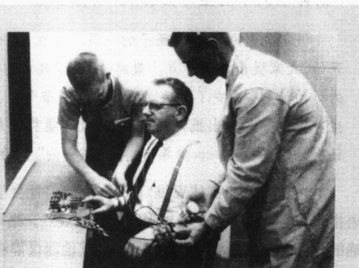

米尔格莱姆对实验作了改动(Miller,1986)。他在试验中同时使用男性和女性被试，并让“老师”和“学生”都呆在同一个房间，在那里“老师”可以清楚地看到“学生”遭受的痛苦。他让“学生”在第一次电击时踢打墙壁然后再作声。实验结果

米尔格莱姆想知道，当纳粹对犹太人、吉普赛人、斯拉夫人、同性恋、残疾人及其他他们认为是“劣等”的人们进行屠杀时，为什么数百万普通人对这种残忍的杀戮会无动于衷。米尔格莱姆想看看一般的、有知识的美国人在类似的情境中会做何反应。

在20世纪60年代，美国社会心理学家实施了一系列具有创造性和争议性的实验。这里所说明的就是这一系列实验中的斯坦利·米尔格莱姆实验。从这张照片中“学生”怎样准备实验，你就能看出此情境对“老师”来说是多么有说服力。

改变了。当“学生”没有作出口头反应时，65%的“老师”一直将强度提到450伏特。那些能看到“学生”的老师中，40%的人一直提高电击强度。当米尔格莱姆增加了一个“老师”——一个反对实施惩罚的实验助手——时，只有5%的人一直提高强度。这个结果部分证明了阿希的实验结果。

这项实验引发了关于实验伦理的激烈争论。研究者不仅对米尔格莱姆的实验结果感到吃惊和不安，而且对他的研究方法也感到恐惧。各大学开始要求社会科学研究中必须把研究的性质和目的告知被试者。研究者一致认为，让被试者到了“痉挛”的地步是不道德的，实验中对被试者的几乎所有欺骗都要被禁止。

### 思考题

米尔格莱姆的实验和开篇短文中“怪物”科迪的行为有什么联系？考虑这些研究结果的意义，你认为科学共同体对米尔格莱姆实验是过分反应吗？我们应该容许进行这种研究吗？思考阿希和米尔格莱姆的实验，并运用符号互动论、功能主义理论和冲突论来解释为何群体对我们会有如此大的影响力。

---

### 群体动力学的全球性影响：群体思维

假定你是总统内部圈子的一员。现在是午夜，总统召开紧急会议来处理一个恐怖袭击事件。开始，大家提出各种观点。最终，圈定了几种方案，在某种程度上似乎大家都对看起来“唯一可行的行动计划”达成了一致。要是在这个节骨眼上表达疑问，会让你与屋子里所有其他重要人士发生冲突。要是提出批评的话，则会让你显得不是“团队成员”。所以你把嘴闭上，结果就是你——还有他们——被一步步导向那个“唯一的”行动计划。

上述过程就叫群体思维（groupthink）。社会学家欧文·贾尼斯（Irving Janis，1972，1982）用这个术语指称有时由群体成员集体形成的狭隘观点。当他们以同样的方式考虑问题时，他们确信只有一个“正确的”观点和行动方案。他们将任何其他建议都看成是对群体不忠的表现。他们的观点如此狭隘，以至于他们趋向于过分自信、无视风险。他们对自己的计划如此坚信不疑，甚至对道德评判也嗤之以鼻（Hart，1991；Flippen，1999）。阿希实验和米尔格莱姆实验可以帮助我们看清群体思维的形成过程。

为了更好地理解群体思维,请思考以下两个事件。

第一个事件发生于1986年。在美国国家航空航天局(NASA)准备发射挑战者号的前一天晚上，位于亚热带的佛罗里达遭遇了冰冻天气。冰覆盖了发射塔，悬挂的冰柱像钟乳石一般。他们应该按计划发射吗？因为国会对空间计划的支持正在削减，所以美国国家航空航天局的官员们需要一次轰动性的成功。公众的兴趣同样高涨，因为第一个普通人克里斯塔·麦考利夫将乘坐挑战者号。她将在太空中为小学生们演示一些小实验，他们可以在教室中收看。延迟发射时间将会带来一场公共关系危机。面对种种压力，美国国家航空航天局的官员们断定冰柱不会构成威胁。虽然有很多证据表明发射是有风险的，他们依然坚持这个决定。挑战者号在发射几秒钟后爆炸。

不幸的是，这并没有让美国国家航空和宇宙航行局学会避免群体思维的错误。2003年发射哥伦比亚号时，泡沫松散开来。工程师们担心泡沫损坏左翼上的瓦片，对返回地球时会构成威胁。他们给官员们发电子邮件报告了这些风险的存在。一个工程师甚至建议宇航员做一次“空中行走”来检查瓦片（Vartabedian and Gold，2003）。但是官员们没有听取这些警告。他们认为一片不到两磅重的泡沫不会对航天飞机有什么影响，甚至拒绝考虑可能发生的事情（Wald and Schwartz，2003）。第二次事件中他们一意孤行导致的后果同样令世人震惊。

正如航天飞机爆炸的悲剧所显示的，群体思维会带来严重后果，有时甚至是巨大的后果。1941年，尽管有证据显示日本准备偷袭珍珠港，罗斯福总统和他的领导班子却不相信日本会挑衅美国。他们让美国海军舰队按原计划行动，结果导致美国海军舰队的毁灭，并使美国卷入第二次世界大战。美国陷入越战及由此导致的巨大人员伤亡，同样是群体思维的结果，美国官员无视足够的证据而坚决否认北方越共的军事力量。水门事件是另一个突出的例子，因为它使美国陷入政治危机，是历史上美国总统第一次遭弹劾而辞职。

上述每个事例中，官员们都意见雷同，并制定了单一的行动方案。提出异议肯定会被视为不忠和对“集体行动”的藐视。掌权者固守先入为主的观点，不考虑其他可选择的观点。当不同观点出现的时候，他们不是客观地衡量，而是把所有的证据都解释为支持他们作出的那个“正确的”决定。

---

群体思维还可导致道德的重新评价。考虑一下目标杀戮。直到近期，美国官员才认为目标杀戮在道德上应受谴责。现在中央情报局用一张官方批准的“打击名单”，派间谍去追捕或追杀名单上的人（Risen and Johnston，2002）。另一个事例发生于9·11之后，记者和政客公开讨论要拷打那些拒不承认的阿拉伯嫌疑犯。他们甚至用道德来为拷打辩护——“以恶治恶”。所幸，那是公开的讨论，群体思维没有占据上风。

防止群体思维 群体思维是政府领导者面临的一个危险，环绕在他们周围的是一个紧密的内部圈子，这个圈子表达的是他们自己的观点。他们高高在上，那些不支持他们自己观点的信息被远远隔离开来。很显然，恐怖袭击后公众的极端感情能为群体思维提供肥沃的土壤。要防止这种思维僵化和头脑麻痹，或许关键就是政府官员要尽可能多地像社会科学家那样自由地调查，像媒体记者那样自由地采集信息做最广泛的传播——政府的高层官员尤其需要这样做。

如果这个结论被理解为社会学研究的自由介入和各种观点的自由交流，那么正是如此。让不同的观点得到自由的表达就能有效阻止群体思维，如果对其不加阻止，就会导致社会的解体，甚至会让人类在这个拥有核生化武器的世界上销声匿迹。

### 本章小结

### ☆群体与社会

### 什么是群体？

社会学家对群体的定义有很多种,但是一般来说,群体由一些互相交往并具有共同归属感的人组成。社会是社会学家研究的最大和最复杂的群体。

### ☆社会变革

### 社会形态的转变与哪些发明有关？

在后工业社会之前，人类历史上有四种社会形态。每种社会形态的出现都源于与新技术相关的社会革命。饲养动物和培育植物的养殖革命，使人类社会从狩猎采集社会转变到游牧和园艺社会。然后犁的发明宣告了农业社会的诞生。工业革命带来了以燃料为动力的机器，从而将人类社会引向工业社会。计算机芯片则催生了一种叫做后工业(或信息)社会的新型社会。另一种新型社会——生物经济社会——可能正在萌生。

### 社会不平等与社会变革的关系如何？

在狩猎与采集社会人们非常平等，但从那以后社会的不平等性就开始增长。社会走向不平等的根源是养殖革命使剩余食物的积累成为可能。这种剩余带来了劳动分工、贸易与物品的积累、女性从属于男性、领导者的出现，以及国家的诞生。

### ☆社会中的群体

### 社会学家怎样对群体进行分类？

社会学家将群体分为初级群体、次级群体、内群体、外群体、参照群体和社会网络。初级群体提供的合作的、亲密的、长期的、面对面互动的关系，是我们感知自我的基础。次级群体比之于初级群体，规

---

模较大、相对短暂、更正式和非个人化、更具有匿名性。内群体为群体成员提供强烈的认同感和归属感。外群体通过显示谁不是内群体成员，同样能提高群体成员的认同感。参照群体是我们以之为标准进行自我评价的群体。社会网络由那些将人们联系在一起的社会纽带组成。新技术带来了一种新型的群体，即电子社区。

### ☆群体动力学

### 群体规模是如何影响群体动力学的？

所谓群体动力学是指个人与群体之间是如何相互影响的。在小群体中，每个人都可以与他人直接互动。随着群体规模的扩大，其紧密性减弱而稳定性增强。由两个人组成的二人组是最不稳定的群体，但是它的紧密性最高，成员关系最密切。由第三个人的加入而形成的三人组，从根本上改变了这种关系。因为趋于形成联盟(群体中某些成员联合起来对付其他人)，所以三人组是不稳定的。

### 领导者有什么特征？

领导者是能够影响其他人的人。工具型领袖努力使群体朝着目标前进，即便这会产生摩擦，使他们不受欢迎。情感型领袖关注创造和谐气氛和鼓舞群体士气。这两种类型对于群体的运行都是必不可少的。

### 三 种主要的领导方式是什么？

独裁型领袖下达命令，民主型领袖努力达成一致意见，自由放任型领袖则对群体成员高度放任纵容。独裁型领导方式在紧急情况下似乎效率较高，民主型领导方式适用于大多数情况，自由放任型方式经常没有效果。

### 群体如何助长遵从性？

引用阿希实验以说明同辈群体对成员的压力，用米尔格莱姆实验来说明权威对群体成员的影响。两个实验都表明我们多么易于屈从于群体思维，一种集体的狭隘观点。防止群体思维需要不同观点的自由表达和交流。

### 批判思考题

1. 如果生于农业社会，你的生活定向（你的思想、态度、价值观、目标）会与现在的你有什么不同？

2. 确认你的内群体和外群体。内群体如何影响你看待世界的方式？

3. 阿希实验表明了同辈群体的压力。同辈群体是如何对你的生活施加压力的？想一想那些你不想做但迫于同辈群体压力又不得不做的事情。