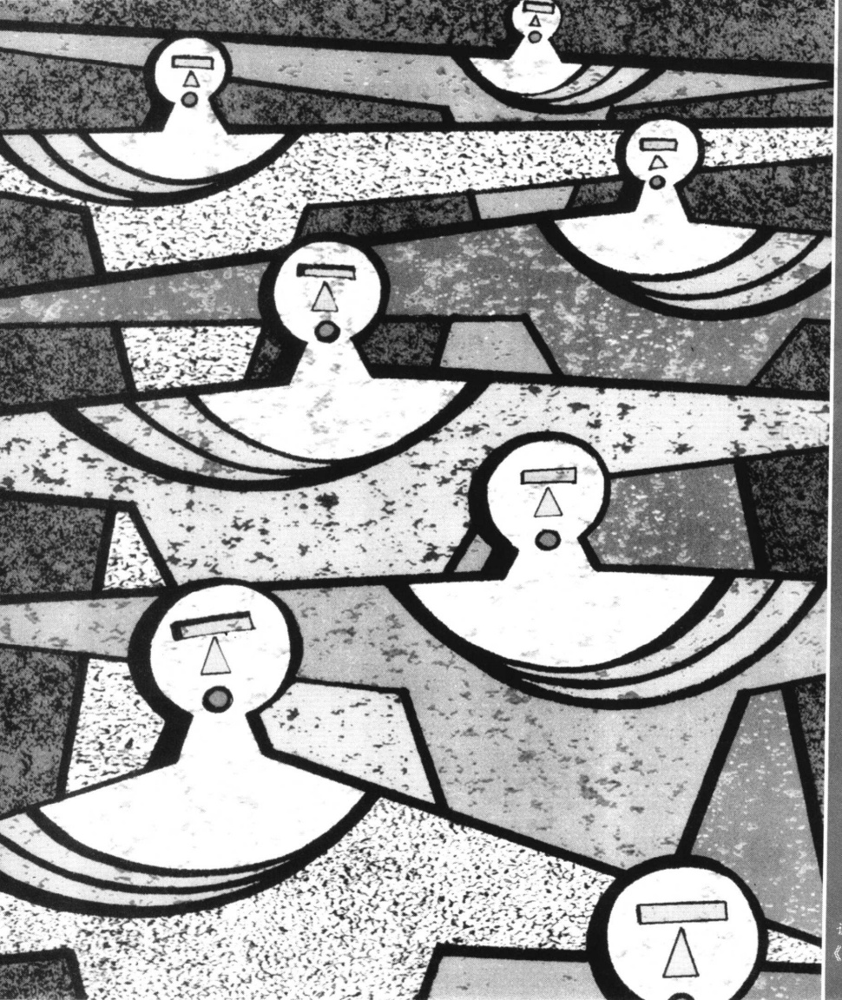
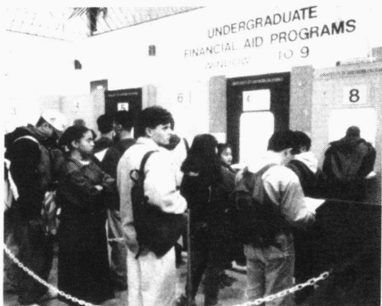
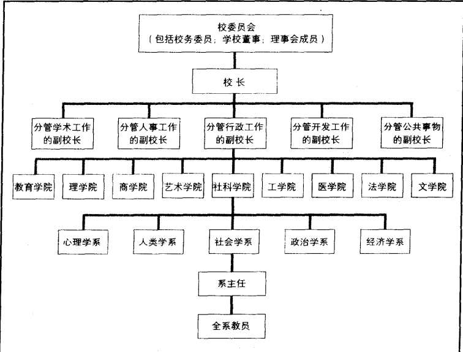
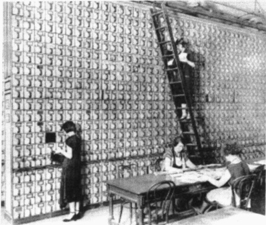
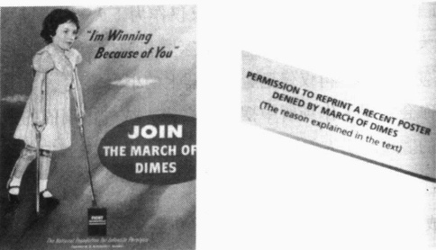
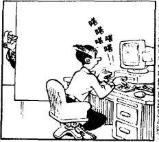
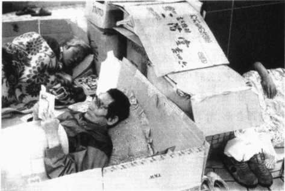
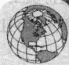

# 第 7 章 科层制与正式组织

2023年1月1日

---

· 社会的理性化

为什么会有社会变迁？

马克思：资本主义打破传统

韦伯：宗教打破传统

· 正式组织与科层制

正式组织

科层制的特征

科层制：“理想”与“现实”

科层制的反功能

目标置换与科层制的永存

科层制的社会学意义

· 志愿者协会

志愿者协会的功能

共同利益

寡头统治问题

· 为公司工作

刻板印象和“潜在的”公司文化

·使公司文化人性化  

使工作环境人性化的尝试  

冲突论视角  

技术和对工人的控制

· 美国和日本的公司比较  

两国公司的差异  

神话与现实

·本章小结

---

### 第 7 章 科层制与正式组织

设想你是名高中生，并且你已经申请入读康奈尔大学。你知道这样做的风险很大，因为你在班里成绩平平——但那又怎么样？既然你已经向州立大学及地方院校提交了申请，所有准备都弄好了，那么再额外付出几小时去填写这个申请又有何妨呢？

现在想象一件不可思议的事。就像下注赌一匹75赔1的马，而你的马跑了第一！康奈尔大学给你寄来一封信，你原以为会是一份礼貌的、直截了当的回绝。但恰恰相反，你用颤抖的双手抓着信并感到喜悦的泪水夺眶而出，信的开头是这样写的：“来自康奈尔大学的问候，您未来的母校！”紧接着是：“康奈尔大学很荣幸地欢迎您成为她的新生。”

你不知道是该大笑、尖叫、大哭或是其他什么。你冲着赶来看究竟出了什么事的父母大喊。他们同样欣喜若狂。当你的父母自豪地说着他们早就知道你能做到的时候，你已迫不及待地冲向电话，想把这个消息告诉你的朋友。

第二天，你成了全班同学的话题。几乎没人能相信这件事，因为你也就是个普普通通的学生。“他们大概是为了让自己的学生更多样性吧。”某些人用嫉妒的口吻小声嘀咕道(这些人刚好学过社会学)。而你原先还把他们当做朋友来看。

“简直太棒了！真难以置信。”想象着自己置身在常春藤校园中，你不停地对自己这样说道。

这确实是难以置信。

来自神圣的康奈尔大学招生委员会的工作人员在电话中对你解释说，他们把包括你在内的550名学生的录取信搞错了。“我们为此引起的任何误会与苦恼而深感歉意。”她说。

误会？那破碎的美梦怎么办？

资料来源：Arenson（2003）。

一些大学招生数以千计，为了使这项工作易于管理，他们把招生过程分成几个步骤，每个步骤都要与整个过程相一致。电脑软件使这一过程变得更加便捷，但这件发生在康奈尔大学的真事说明， $ \frac{a}{b} $ 不总是按计划进行。在这个例子中，一个低级别的科层人员就把信件很轻易地搞错了。

尽管存在缺陷,我们仍然需要科层制。本章我们将看看社会是如何组织起来“履行它的职责”的。在阅读过程中,你也许能发现某些你在社会组织中遇到阻碍的原因,以及你的各项福利保障是如何依赖它而存在的。

### 社会的理性化

在先前的章节中，我们已经讨论了社会是如何在经历广泛的变革后出现新的社会形态。我们也看到自己正身处一场全球性的巨变之中，信息社会(这种社会也许正与生态经济社会融为一体)的基础是

---

就如入学登记所体现的那样，科层制会把工作任务分成不同的构成部分，并找专门人员分别完成。这一过程的效率有时在满足顾客需求方面会毫无用处，图中所示的是南加州一所大学的入学报名情况。

对合理性(rationality)的强调,效率与实用的观念主宰了一切人类事务。让我们仔细看看这样一种对待生活的态度——我们今天已认为这是天经地义的——是如何产生的吧。

### 为什么会有社会变迁？

直到前不久，人们还一直沉浸在一种传统的生活取向中——一种认为过去是现在最好的指导的观念。这种观念认为，存在即是好的，因为它已经经受了时间的检验。传统——以及建立其上的各种关系——曾使人们受益匪浅，因而不能轻易丢弃。传统社会的一个核心取向就是保持现状。变革会遭到质疑，即使不被完全否决，接受起来也会非常缓慢。

这种对生活的传统取向阻碍了工业化的前进道路。

如表 7.1 所示，传统取向是建立在个人关系之上的。沉重的义务与责任——常常是终身的——渗透整个社会。在生产中起决定作用的不是在某件事情上谁做得最好，而是人们彼此之间的关系。建立在历史出身的基础上，每个人（甚至包括儿童）都要扮演固定的角色。要珍视过去，并用它来统治现在。

表 7.1 传统社会与非传统社会的生产模式

<table border=1 style='margin: auto; word-wrap: break-word;'><tr><td style='text-align: center; word-wrap: break-word;'>传统社会(园艺社会、农业社会)</td><td style='text-align: center; word-wrap: break-word;'>非传统社会(工业社会、后工业社会)</td></tr><tr><td style='text-align: center; word-wrap: break-word;'>1. 由家庭成员或同性群体(男性或女性群体)来进行生产2. 生产在家中、田地及其他靠近家的地方进行3. 工作分派依据的是人际关系(男人、女人和孩子依据传统从事特定的工作)4. 关系是历史形成的(一成不变)5. 关系渗透方方面面(关系模糊,涵盖生活许多方面)6. 关系是长期的,常常是终身的7. “如何”生产不在评估之列,主题是“我们要继续一成不变地做下去”8. 假定安排可以无限期地延续下去9. 评价他人依据的是他们履行各自传统角色的情况</td><td style='text-align: center; word-wrap: break-word;'>1. 生产由雇佣工人来完成2. 生产集中在某一专门场所进行(信息社会已出现分散生产的情况)3. 工作分派依据的是协议与培训4. 关系基于合约,随着情况改变而变化5. 关系是具体的,协议(即使非书面达成的)使情形具体化6. 关系是具体的,依据协议的长短而定7. “如何”生产要进行评估,主题是“我们怎么做才能更有效”8. 安排要进行定期评估,以决定是继续使用还是有所改变9. 评价他人依据的是“最终结果”(组织目标)</td></tr></table>

注：这一模式是一种理想类型。不存在完全没有合理性的社会，也不存在完全建立在合理性之上的社会（或组织）。即使是最合理性的组织（指那种最精细甚至毫不留情地讲究“最终结果”的组织），也存在传统成分。为了更恰当地理解这个表，可以想象这9种特征是或多或少地同时并存的。

---

资本主义则需要一种完全不同的对待生活的方式。如果社会要实现工业化，人们的思维必须发生深刻的转变。传统(我们一直以来所遵循的方式)必须被理性(让我们寻找最有效的方式)所代替。如表7.1所示，人际关系被非个人的短期契约所替代。“最终结果”成为首要考虑的问题，而经验法则让位于科学计量。

很难过分强调这种由传统取向到以理性为基础的取向的转变的重要性，因为它贯穿人类历史进程之中。我们把这种崭新的合理性观念——判断事物是依据“最终结果”而非人际关系——当成了理所当然的，以至于很难去把握这种取向在根本上的不同之处。这可能是有用的。这就像一个妻子对她的丈夫说：“我将评估你对家庭财政预算的贡献和你在家务上花费的时间，然后我将根据这些来决定是把你留下还是把你换掉。”

你可以看到这是一种根本性的转变。而这就如同从传统转变到理性。那么这种社会的理性化——普遍接受合理性的理念和主要围绕这一理念建构起来的社会组织结构——是如何出现的呢？

### 马克思：资本主义打破传统

马克思作为一位早期的社会学家，是最早注意到传统是如何让位于理性的人之一。在他思考这种转变为何发生时，他得出结论认为是资本主义打破了传统的束缚。随着有钱人对资本主义的摸索，他们发现资本主义更有效率。资本主义以更丰富的方式生产出人们想要的东西并产生高额利润，这给人们留下深刻的印象。这也鼓励他们投资进行更大规模的生产。随着资本主义的传播，传统思想开始衰退，渐渐地资本主义的合理性替代了传统的生活方式。马克思的结论是：社会向资本主义的转变改变了人们对生活的思考方式。

### 韦伯：宗教打破传统

对社会学家韦伯而言，这一问题就像一宗悬疑命案对一名侦探一样具有诱惑力。韦伯并不满意马克思的回答，他始终在寻找问题的答案。当注意到资本主义仅仅在欧洲部分地区发展壮大时，他发现了线索。“这一定是有原因的。”他暗自沉思道。随着韦伯对这一问题的深入调查，他发现资本主义在新教国家中繁荣昌盛，而罗马天主教国家则因坚持传统而相对地远离资本主义的影响。“因此，不管怎么说，宗教才是关键因素。”他想。

但是为什么罗马天主教会坚持传统，而新教却欢迎变革呢？韦伯在他颇具影响的《新教伦理与资本主义精神》(1904—1905)一书中首次解答了这一问题。这个回答自那以后便一直备受争议。韦伯认为：罗马天主教教义强调对现实安排的接受，而不是改变。“上帝要你各安其位。你要忠于教会，忠于你的家庭和你的君主。接受命运的安排并且保持下去。”与之相反，韦伯指出新教神学却使其信徒走向变革。韦伯对其母亲信仰的加尔文教派非常熟悉。加尔文教教徒(约翰·加尔文宗教学说的追随者)相信他们的命运是生前注定的——而且直到死后才能知道自己的命运。韦伯认为这种宗教学说使加尔文教教徒充满忧虑。救赎成了他们的关注重心——他们想知道自己这辈子死后将会去向哪里？

为了解除自身精神上的两难处境，加尔文教徒们灵机一动，想到了一个巧妙的解决途径：上帝一定不希望那些被他所眷顾的人对自己的命运一无所知。因此，那些被上帝眷顾的人应当知道自己的命运——他们应当会得到来自上帝的神迹。但那是什么样的神迹呢？加尔文教徒们声称；答案不在神秘

---

在传统社会，宗教是一种占据统治地位的力量。在这幅马尔他岛的维多利亚的照片中，大教堂清楚地表明了传统在乡村生活中的支配地位。关于为什么社会由以传统为导向演变为以理性为导向，韦伯和马克思各自有不同观点。

的精神体验之中，而在人们能见到并能度量的尘事之中。受上帝眷顾的神迹就是成就：那些被上帝预先选中的人将得到上天的庇佑，在尘世中获得可观的成就。

这种观念改变了加尔文教徒们的生活。它鼓励人们努力工作，而且因为加尔文教信奉“节约是美德”，所以致力于工作的人们积累了大量的财富。然而，他们却不能把这些钱花在自己身上，因为追逐基本需求以外的享受也被认为是一种罪。因而投资资本以追求利润这种资本主义生产方式，就成了他们富余钱财的出路。投资的成功反过来又更进一步地显示了上帝的眷顾。通过这种方式，加尔文教徒将世俗的成就转化成了一种精神美德。其他新教教派，尽管对宿命论的观点看法并不一致，但却也采纳了勤俭与奋斗的信念。结果，就像

韦伯所说，新教国家迎来了资本主义。

但这与理性化又有何关系呢？显而易见，资本主义要求理性化，即对实际结果进行精确估算。如果你以赢利为目的，你就必须时刻留意你的收入与开销；搞清楚财产清单和工资总额、生产成本与能带来的收益大小；你必须确定“最终结果”。因而，你的步调必须紧跟效益，而不是传统。如果传统的处事方式效率低下，它们就要被替换，因为结果决定一切。韦伯的公式是：思维方式的改变（上帝会给他的选民以神迹）催生了资本主义。

究竟谁对呢？是认为新教主义产生了理性化，并进而为资本主义发展铺平了道路的韦伯？还是认为是资本主义导致了理性化的马克思？直至今日，还没有哪位分析家能协调这两种相反的观点，为社会学家提供一个满意的答案——两种观点至今仍然同时并存。

### 正式组织与科层制

不管马克思与韦伯在这一争论上孰对孰错，理性化确实是一种完全不同的对待生活的方式。随着这种新观点逐渐渗透社会的各个层面，新的组织形态也就由此诞生。其中之一便是正式组织（formal organizations），即为达成明确的目标而建立的次级群体。正式组织如今已经变成我们生活的一项重要特征。尽管它们在人类发展史中还相当年轻，但今天我们大多数人出生时就已身在其中：我们在其中接受教育；我们在里面工作；我们死后也将由其埋葬。

### 正式组织

工业化之前，很少有正式组织。12世纪，西欧的行会组织可算一个例子。在一个地区从事同一类型

---

工作的人组织起来，以便对他们所从事的行业进行控制。他们制订统一的价格与工艺标准（Bridgewater，1953；Volti，1995）。与现代行业协会很相似的是，行会组织也会阻止外来者（非行会会员）从事特定的行业。另一个早期正式组织的例子是军队，正规军队可以追溯至早期历史，士兵、低级军官与高级军官构成了它的等级结构。

伴随着工业化，次级群体变得非常普遍。今天我们将其存在视为理所当然，从入学那天开始，我们所有人便在其中度过了自己大部分的时间。正式组织很容易发展成为科层制组织，而且一般说来，组织规模越大，它就越可能是科层制。

### 科层制的特征

苏联军队、摩门教教会和你所在的大学之间有什么共同点？社会学家的回答是：它们都是科层制（bureaucracies）。就像韦伯（Weber，1913/1947）指出的那样，科层制具有以下特点：

1. 分层，包含上对下的任务下达和下对上的负责制。每一级都要向下级分派任务，下级则要负责完成上级委派的任务。图7.1展示了一所大学的典型科层机构。

#### 图 7.1 一所中等规模大学的典型科层制结构

这是一所大学的科层制结构同比缩小后的版本，一所大学的真实结构可能要比这里描绘的复杂得多。一所规模庞大的大学会有一个名誉校长（chancellor）和下属的几位执行校长，每名执行校长分管一个特定的校区。尽管图中的涉及面仅限于主管行政工作的副校长及下属社会科学学院的部门分布情况，但是其他副校长和下属学院的部门情况也都是类似的。如果这个图要扩大范围的话，应该加上秘书处，以及在某个地方加上学生。

---

作为正式组织的一种主要特征，劳动分工并不是新事物。在这幅弗朗西斯科·巴萨诺（1549—1592）创作的反映意大利农场生活的油画中，你可以看到在16世纪的农庄生产中所要求的精细劳动分工。注意这些人们正在从事的那些专门化的工作，你能区分出它们与今日的劳动分工有何不同吗？

2. 劳动分工。每个人都要完成特定的工作，而所有这些工作都要与组织总体目标相协调。比如，在一所大学中，老师不会去操作供暖系统；校长不会去讲课；秘书也不会去评估教科书。这些工作都分配给了受过专门训练的人员。

3. 成文的规章制度。为了求得高效，科层机构强调成文的规章制度。一般来说，机构存在时间越长，它就发展得越庞大，它的书面规章制度就越多。某些科层机构的规章制度几乎涵盖了所有能想到的情况。比如，在我所在的大学，规章制度被印成了手册出版：教职工、学生、管理人员、文职人员，以及其他我甚至都没听过的工作人员人手一册。

直属主管。”)在某些组织中，工作人员花费大量时间派送备案、收发电子邮件。有时，工作人员必须以书面报告的形式详细记录其活动。比如，我的大学每学期都要求教员们统计其投入在各项活动上的时间。教员必须提交一份年度报告，列举他们在教学、科研及公共事业方面取得的成果——所有这些还要求附带出版物的复本、从事公共事业的证明，以及每门课的书面教学评估。所有材料都将送到一个负责评估

4. 公文传达与记录。一个科层机构中发生的众多事件都要记录在案。（“确保可以抄送给所有的

这幅摄于1907年的照片是技术改变我们生活的一种表现。那位女士正在一面由小抽屉构成的墙中查找资料，那些小抽屉是用于储存大都会人寿保险公司（the Metropolitan Life Insurance Company）的客户档案的。今天，这整个档案库在一台私人电脑上就可以保存，我们也可以用电脑对档案进行检索或修改，这比在梯子上爬上爬下要快得多——当然也更稳。

教师工作成绩的委员会手中。

5. 非人格化。与占据职位的个人比起来，职位本身才是重要的。你是为组织工作，而不是为某些随时可能被替换的组织领导工作。由于每项特定的职务都有许多其他人可以完成，因此每名员工都是可替换的。比如，当某位教授退休或离世时，另一个人就会被派来接替他的职位。这就使得你成为了一架庞大机器上的一个小齿轮。

这五个特征有助于科层制达到其目标，也使其得以发展并持续运作。邮政公司是美国的一个科层制组织，它发展得如此庞大，以至于全国每150个雇员中就有一个是它的员工（Statistical Abstract 2002: Table 573, 1095）。如果一个科层制组织的首脑去世、退休或辞职，组织本身仍会继续运转而不会有丝毫波动，因为科层制不像“夫妻店”，它的运作不依赖于领导它的个人。科层制在当今社会中的发展壮大（某些人会说是主导）在下面的专栏中有所体现。

---

### 社会的麦当劳化

成百上千的麦当劳连锁店遍布美国各地并逐渐向全球蔓延，它们的重要性不仅仅限于它为人们购买现成汉堡和牛奶饮料提供了便利。正如社会学家乔治·瑞泽尔（George Ritzer，1993，1998，2001）所说，我们的日常生活正在被“麦当劳化”（McDonaldized）。让我们看看他说这话的意思是什么。

社会的麦当劳化——即日常生活的标准化——不仅仅是指那种机器人般的食物生产线。就像瑞泽尔说的，这一麦当劳化过程正在全社会展开，而这则正在改变我们的生活。想购物吗？购物中心提供了可控环境下的“一站式”购物；想外出旅游吗？旅行社推出了“包办式”旅游。它们将在两周内带领美国中产阶级游历十个欧洲国家的首都，所有游客都将住同样的宾馆、去同样的饭店以及其他排定的地方——而且人们无需为碰到“真正的”当地人而担心。想了解时事吗？《今日美国》推出了“麦当劳新闻”，您可以在享用麦当劳汉堡或饮料的间隙阅读这些简短、乏味、未经加工的新闻。

效率带来了可靠性，无论是在洛杉矶还是北京，您都能买到同样口味的汉堡和炸薯条。效率降低了价格，但是效率也要付出代价。可预料性消除了自发性的影响，改变了我们的生活质量。它以千篇一律、平淡无奇的方式取代了曾经独一无二的经历。比如，在我自己的旅行中，自我加入包办式旅行以来，我便再未有过有趣和开眼界的经历，使我能加深对人类多样性的认识。

日本东京的麦当劳店

无论是好是坏，我们的生活都正在被麦当劳化，对既定背景的可预期性成了我们社会的主宰。当教育也被理性化时，我们的孩子就不必再听真正的教授授课了，他们总是没完没了地讨论问题，从不给出明确的答案，并且带有明显的个人习性。程序化的教育将会消除我们讨论社会问题的必要性，因为我们有一整套完备的解决社会问题的方案和明确的答案，这些答案如同我们在数学、工程学及电视中找到的一样。计算机化的课程会教给每个人相同的答案，即那种被认可的“政治上正确”的思考社会问题的方式。大众考核制度将保证学生们对问题作出规定的反应。

当然，即将到来的提前包办的社会将会是高效的。但这也将意味着我们会被囚禁于科层制的“铁笼”之中——正像韦伯曾经警告过的那样。

### 科层制：“理想”与“现实”

就像人们有时会不按规则要求行动一样，科层制也会如此。韦伯指出，科层制的特征是理想类型，也就是说，它们是以大量具体事例为基础的多种特征的复合体。例如狗展览中的评判员。他们对每一特定品种的狗应该看上去是什么样和如何表现已经心中有数，他们将会据此对每条狗作出评判。结果，每条狗在各项特征的评比中都是有高有低：有些方面达到要求，有些方面则达不到。同样，某个具体组织所具有的科层制特征也会有高有低，但它们仍然是合格的科层制。与其给组织贴上“科层制”或“非科层制”的标签，或许还不如用“科层化的程度”这一术语来描述组织更有意义（Udy，1959；Hall，1963）。

就组织文化而论，科层制也常常与其理想状态不同。比如，现实中的权力分布（“传输渠道”），就可能与图7.1中所描绘的组织图有所不同。例如，假如大学校长在被任命之前曾在历史系教过书，那么他

---

在历史系的朋友就会拥有直达他 / 她这里的便捷通道。如果他们希望“献计献策”（从解决问题的意见到一些个人不满甚至流言蜚语），这些人就可能会跳过他们的上级甚至院长，直接找到校长这里来。

### 科层制的反功能

正如韦伯指出的，尽管长远看来没有其他任何一种社会组织形式会比科层制更高效，但它也确有其不利的一面。下面就让我们来看看它的某些反功能。

官样文章:规定就是规定 科层制受到官样文章的束缚,所以这些规定会阻碍组织目标的实现。有些规定(用组织行话来说,就是所谓的“正确程序”)简直足以考验一个圣人的耐心。

在布朗克斯，特雷莎教母发现了一处结构完好但却已废弃的建筑，她想把它改建成一所无家可归者的收容所。但是她受到了某一规定的阻碍：建筑物必须设有残疾人专用电梯。因为没有修电梯的资金，所以特雷莎奋力争取，希望有关部门能够略过这一规定。但是经过令人失望的两年时间，她不得不放弃原来的想法。那座废弃建筑物至今仍然荒废着。（Tobias，1995）

科层制已成为社会生活中一股强大和不可抗拒的力量，即使是20世纪后期最著名的宗教人士之一特雷莎教母，也无法在她试图帮助纽约的无家可归者时战胜烦琐的官僚作风。

很明显,这一规定并不是为了阻止特雷莎教母帮助那些无家可归的流浪者而设立的。但是,关键在于:规定就是规定!

部门之间缺乏沟通 科层制内的每个部门都要执行特定的任务，这些任务都服务于组织目标。然而，有时，部门间由于缺乏沟通会分别致力于相逆的工作目标。例如，在西班牙的格兰纳达，当地政府对一条主要街道周边的破败建筑很是关心。因此，一个政府部门修复了这些建筑的外表：修补混凝土、钢筋和石料。结果是令人振奋的，这个部门也为自己的成就感到自豪，但唯一的问题是另一个部门已经决定要拆除这些建筑（Arias，1993）。因为政府组织内各部门都不知道其他部门在干什么，所以一个刚刚将大楼装饰好，另一个就要把它拆掉。

科层制的异化 根据角色、规则和功能来对待工人，而不是将其看做独立的个体，这使许多工人开始觉得自己更像一个物而非一

个人。马克思将这种反应称为异化(alienation)，他说这是由于切断了个人与其最终劳动产品之间的联系。他指出，在工业化以前，工人们使用自己的工具生产整个产品，比如椅子或桌子。现在，资本家拥有生产工具(机器)，他们将每个工人分派到整个生产过程的某一两个步骤中去。由于仅仅从事那些似乎远离最终产品的重复性工作，工人们对他们所生产的产品失去了认同感。他们不仅与其产品相疏离，还与其工作环境相疏离。

对抗异化 因为工人需要被重视并想拥有一种对自己工作的控制感，所以他们开始对抗异化。在工作中形成初级群体是一种主要的对抗形式。工人们在非正式的环境中聚到一起——他们一起吃午饭、坐在桌旁聊天或是在下班后一起出去喝酒。在这种场合下，他们会对他人的工作给予肯定，表达彼此的

---

同情，因为他们都要忍受粗暴的老板、乏味的日常工作 $ \underline{\text{和无数的规则}} $。他们不仅仅作为工人相互联系，而且作为彼此重视的人相互联系。他们一起调侃、大笑，互开玩笑，谈论各自的家庭和理想。工作关系之外的这种多维关系，维持了他们作为个体的意识，使得他们不再仅仅是庞大机器上的小齿轮。

设想一个常见的情景：在参观一间办公室时，你会发现工作场所中摆着许多家人或外出度假的照片。其社会学含义就在于：这是工人奋力对抗异化的表现。工人们通过坚持个人权利，拒绝被当做只会执行命令的机器。

被异化的科层制成员 不是所有的工人都能成功抵制异化。一些被异化者仍会留在组织里，这或者是因为他们看不到其他可行的选择，或者是因为他们“只差几年就该退休了”。他们极度讨厌工作，这表现在他们对待顾客、同事以及组织中权威的态度上。这些被异化的科层制成员从不采取主动，从不会做任何组织要求以外的事，他们利用规则来证明他们做得尽可能少是对的。

尽管态度恶劣，表现也不好，被异化的工人仍能保住自己的工作。有些人是因为资历深，而其他人则是因为如果有人要炒掉他们的话，他们就会以费钱费时又令人为难的法律行动相威胁。有些被异化的工人被分流到小的科层部门的角落中，在那里他们整日做着琐碎的工作，很少有机会与外界接触。当然，这只会使他们进一步被异化。

科层制的非胜任性 在一项对科层制的假想分析中，劳伦斯·彼得提出了著名的彼得原理(Peter principle)：科层制内的每个雇员都会被晋升至他/她不胜任的水平(Peter and Hull, 1969)。在科层制中表现优异的人，会受到处于指挥链高端的人的注意并获得晋升。如果他们继续表现优异，他们就会被再次提升。这一过程会一直持续到他们被提升至已无法再有更好表现的职位为止——即他们的不胜任水平。在这一职位上，他们会隐藏于他人工作之后，依靠其指导下的员工的成就获得好评。在我们的开篇短文中，那个发错了信件的雇员就已经达到了他或她的不胜任水平。

尽管彼得原理有一定的真实性，但如果这是普遍真实的话，那么科层制内配备的就全是不合格人员了，而这些组织也必定无法成功。事实上，科层制异常成功。社会学家彼得·埃文斯和詹姆斯·劳赫（Peter Evans and James Rauch，1999）调查了35个发展中国家的政府科层机构。他们发现，一个国家只有在其中央科层体系是根据个人才能雇用员工，并为其提供有价值的职业的情况下，才会繁荣富强。

### 目标置换与科层制的永存

作为一种强有力的社会组织形式，科层制已成为我们生活的一个标准特征。它们为了达到特定的目标会利用人的一切力量。然而，科层制一经产生便开始谋求自我生存。即使科层制已经实现了目标并失去继续存在的理由，它也会通过所谓的目标置换（goal displacement）过程继续存在下去。

一个经典的例子就是为对抗小儿麻痹症而于20世纪30年代成立的“募集零钱基金会”。当时，小儿麻痹症的病因还是个谜。公众既担心又害怕，因为一夜之间一个健康的儿童就可能染上这种可怕的病症。为了募集治疗资金，“募集零钱基金会”几乎在全美每家商店的收银机旁都张贴了印有拄拐杖儿童的海报(见下面的照片)。他们筹到的资金远远超出他们的设想。当乔纳斯·索尔克博士在50年代发明出预防小儿麻痹症的疫苗后，这一威胁几乎在一夜之间就被清除了。

---

“募集零钱基金会”由富兰克林·罗斯福总统于上世纪30年代发起创建以对抗小儿麻痹症。当一种抗小儿麻痹症的免疫疫苗于上世纪50年代被发现后，该组织并没有宣布胜利然后就地解散。相反，它通过创建新的组织目标而保持了组织的完整：即“对抗先天缺陷”。社会学家用“目标置换”一词来表示这种采纳新的组织目标的过程。“对抗先天缺陷”如今已被一个更含糊的新目标所代替，即“婴儿突破”。这个新的目标置换可以保证组织的永久存在，因为它的目标如此模糊，以至于永远都不可能达到（你能没有“突破”的需要吗？）。

管理“募集零钱基金会”的工作人员并没有就此卷起铺盖走人，相反，他们为了继续自己的事业找到了一个新的目标——对抗先天缺陷。但在2001年，研究人员最终完成了人类基因组的绘制工作。由于敏感地察觉到某一天这一技术将可能消灭先天缺陷(同时也就是他们的工作)，“募集零钱基金会”的工作人员又提出了新的口号：“婴儿突破(Breakthroughs for Babies)”。这个最新目标会确保该组织永久地存在下去：它是如此含糊，以至于我们不可能不再需要这种“突破”。

另外还有北大西洋公约组织(NATO)。它成立于冷战时期，当时是为了防止苏联入侵西欧。冷战的结束消除了其组织目标，因此，西方大国试图为其继续存在寻找新的理由。我的意思是，如此完美的一个科层制为什么要浪费呢？他们看来已经想好了理由——建立“快速反应部队”以对抗恐怖主义和“流氓国家”。为了维持组织的继续存在，他们甚至允许俄罗斯成为其新的合作伙伴。

附带说明一下，科层制对于分析其活动的社会学家十分敏感。当我试图得到“募集零钱基金会”的允许以便去复印一份他们的最新海报时，我遭到了拒绝——除非我改变我的分析以使其更有利于该组织。由于我拒绝这样做，因此上图中就少了一张照片。社会学家经常会在工作中遇到这类阻碍。

### 科层制的社会学意义

或许科层制主要的社会学意义就在于：它代表了人们与他人联系方式的根本性转变(见表7.1)。当工作根植于个人关系中时，除了有效地完成工作和时刻留意最终结果之外，还有更多的利害攸关的事情。比如，确保所有的亲戚朋友都有工作曾是决策制定中的关键因素。而科层制，或社会的理性化，则改变了这一切(Volti，1995)。

### 志愿者协会

尽管对于大型的、任务取向的群体而言，科层制已成为主导的组织形式，但是还有更为普遍的组织形式，即志愿者协会。让我们来研究一下它们的特征。

19世纪30年代，一位名叫亚历克西斯·德·托克维尔的法国人，游历了整个美国，考察这个新国家的风俗。他的报告——《美国的民主》（1835）一书在欧洲和美国广为流传，至今仍因其对美国人特性的深刻见解而常被引用。托克维尔的观察结果之一就是，美国人喜欢加入大量的志愿者协会（voluntary

---

associations)——一种由志愿者在共同利益的基础上构成的群体。

多年来，美国一直保留着这种组织形式，并一直以此为荣。美国各地遍布着成千上万的小镇，进入某个小镇的旅行者经常能在公路旁边看到一个高速公路标志牌，上面标明了小镇上的一些志愿者协会；女童子军、男童子军、基瓦尼斯俱乐部(Kiwanis)、狮子会俱乐部(Lions)、驼鹿会(Elks)、鹰会(Eagles)、哥伦布骑士会(Knights of Columbus)、商会馆(Chamber of Commerce)、美国军团(American Legion)、外战退役军人协会(Veteran of Foreign Wars)，以及大量此类组织。有一类志愿者协会如此普遍，以至于有时要用单独的标志牌把它们标明：如罗马天主教会、基督教浸礼会、路得教教会、循道(Methodist)宗教会、美国新教圣公会等等。另外还有许多其他的志愿者协会没有列在标志牌上：比如政党、工会、健康俱乐部、全国生命权利协会(the National Rights to Life)、全国妇女组织(the National Organization for Women)、嗜酒者互戒协会(Alcoholics Anonymous)、跑马协会(Association of Pinto Racers)，以及为了支持或反对这个那个而成立的各种公民联合会。

美国人热爱志愿者协会，他们借此来表达各种利益取向。有些团体是区域性的，由少数志愿者组成；另一些则是全国性的，里面有领薪水的专职工作人员。有些是暂时性的，它们组织起来只是为了完成某项特殊任务，像筹备国庆日的焰火表演；另一些如童子军与政党则是长期存在的（具有明确指令链的大型次级组织），它们也属于科层制。

### 志愿者协会的功能

不管它们的形式如何，志愿者协会为数众多，因为它们满足了人们的基本需要。人们并非必须参加此类组织，他们之所以加入是因为可以从中获益。功能主义者指出了志愿者协会的七项功能：

1. 志愿组织代表特殊利益群体。比如，关心孩子健康、幸福的家长会成为童子军的志愿者，因为他们认为孩子加入这类组织比在街上闲逛强得多。简言之，志愿者协会可以完成某些事情，不管是筹备焰火表演还是宣传新出台的关于堕胎的法案。

2. 志愿团体给人以认同感。有些甚至为人们提供了人生目标。作为一种内群体，志愿者协会能为成员提供一种亲密感、归属感。在很多情况下，它使成员们觉得自己正在做的事情是有价值的。这一功能对一些个体来说非常重要，以至于加入志愿者协会成为了他们生活的中心。

3. 志愿者协会有利于管理国家和维持社会秩序。比如帮助“完成选举”或协助红十字会应对各种灾难的团体，就是这方面明显的例子。

前两个功能适用于所有的志愿者协会。在通常意义上来讲，第三条也适用于所有的志愿者协会。尽管很少有组织致力于政治，但是志愿者协会有助于将个人融入社会，从而有助于维持社会秩序。

社会学家戴维·西尔斯(David Sills, 1968)指出了其余四种功能，这些功能只适用某些志愿者协会：

4. 有些志愿团体会协调政府与个人间的关系。比如，某些团体会给人们提供一种向立法者施压的途径。

5. 通过培训组织技能，某些团体有助于个人职业地位的提升。

6. 其他一些团体会把人们带入政治主流中。“全国有色人种促进会(NAACP)”就是这类团体的一个例子。

---

7. 最后，某些志愿者协会铺平了社会变革之路。像“绿色和平”组织这类团体就反对在环境问题上想当然的关于“正常”的定义。他们对既定的规则提出挑战，这表明了社会变革的方向。

### 共同利益

志愿者协会决不代表任何单一的利益或目标。它们可能是保守主义的，反对新的处事方式；或者是空想主义的，坚持引领社会进步的方向。不管它们之间有何不同，却都有一条共同的主线贯穿其中，即共同利益。尽管不同团体的特定利益不同，但某些观念或行动中的共同利益却是使成员紧密团结在一起的主线。

加入这些团体的动机，因人而异。有些人加入是因为他们对组织目标抱持坚定的信念；另一些人加入则仅仅是因为这一成员身分会在政治上或职业上对他们有所帮助。一些人加入甚至只是因为他们对集体中的某个成员有爱慕之情。

由于加入动机多种多样，而且某些成员在组织内呆不长，因此志愿者协会常常有很高的人员更换率。某些人进出各类团体几乎和换衣服一样频繁。然而，每个组织内都会有一个核心集团——里面的人会积极推动团体发展，坚定不移地支持组织目标，致力于维持组织自身运转。如果这个核心集团不再履行其义务，该团体就可能会垮掉。

### 寡头统治问题

志愿者协会中一个有趣的、令人烦扰的方面是领导者逐渐远离成员，他们确信他们只能依靠核心集团进行重要决策。为了考察这一运转原则，我们来看一看外战退役军人协会(VFW)。

社会学家伊莱恩·福克斯和乔治·阿尔奎特（Elaine Fox and George Arquitt，1985）研究了VFW的三个地方分会，VFW是一个全国性组织，它由参加过海外战争的美国退伍军人组成。他们发现，尽管组织领导者会对普通成员隐瞒其真实态度，但他们仍将普通成员视为一群无知的酒鬼。因为领导者认为这些人不能在社区或全国性会议上代表他们，所以产生了一种奇特的现象。尽管VFW章程中规定了普通成员有权进入领导层，但实际上他们却从未成为过领导者。事实上，因为领导者能够十分有效地控制高级职位，所以他们甚至能够在选举前就告诉你谁将当选。“你应该见见吉姆，”社会学家们被告知，“因为他将是山姆之后的下任主管。”

最初，研究人员会对此感到困惑，因为选举还没进行。随着调查逐渐深入，他们发现领导人实际上是在幕后决定的。当选的领导者任命自己喜欢的人主持主要委员会。这使成员意识到他们的价值，因此他们会再次选举他为领导人。于是，核心集团仅仅通过委派其成员担任高级职务，就可维持其对整个组织的控制。

像 VFW 一样，大部分组织都由少数成员控制着（Cnaan，1991）。根据寡头统治（即由少数人统治多数人的制度）这一概念，社会学家罗伯特·米歇尔斯（Robert Michels，1876—1936）提出了寡头统治铁律（the iron law of oligarchy），它指的是少数自身永久化的精英控制组织的方式。大部分成员都是被动的，精英核心集团则通过在各个集团成员间延续领导职位而保持了其自身的权力。

许多人所发现的寡头统治铁律令人烦恼的一面是，人们会因为他们不代表核心集团的价值标准或

---

是因其出身而被排除在领导层之外。即使在那些强烈坚持民主原则的组织中也是如此。例如，美国政党——这大概是美国代议制政府的支柱——也成了寡头统治的牺牲品。它同样由核心集团操控，他们将领导职位从一个精英分子传至另一个精英分子。通过对政府机器的控制、对使用免费邮政权利的控制，以及对制作电子邮件视频的税收资金的控制，全美高达98%的众议院议员会再次当选，而在美国参议院，这一比例也达到了80%—90%（Statistical Abstract, 2002: Table 381）。

当然，寡头统治铁律也有其局限性。核心集团成员必须抛弃个人情感，与其他成员保持观点上的一致。如果寡头统治变得日益不协调，那么它就会面临下层民众的反抗，其精英分子就有可能被赶下台。这种威胁迫使领导者必须考虑全体成员，因而它软化了寡头统治铁律。此外，由于并非所有组织都由少数精英控制，因此寡头统治只是一种趋势，而并非不可避免(Fisher，1994；Jarley et al., 2000)。

### 为公司工作

既然你可能会在一个科层制中工作终生，就让我们看一看其特征会对你的职业生涯有何影响。

### 刻板印象和“潜在的”公司文化

谁会在大企业中获得成功？尽管我们愿意认为成功源于才能和辛勤的工作，但是除了才能以外，还有许多因素同样也是加薪、晋升的基础。就如社会学家罗萨贝思·坎特(Rosabeth Kanter，1977，1983)所强调的，公司文化(corporate culture)中包含着“潜在价值”。这些价值孕育了影响人们职业生涯的自我实现预言。

它是这样发生作用的：公司和部门头头对什么是好员工、好同事有一套固定的看法。这并不令人奇怪：符合他们条件的人都是与他们背景相似的人——甚至长得都像他们。他们为这些人提供更多的信息、人际关系网和升职“窍门”。因而，这些人表现优异，对组织贡献更大——从而也就进一步强化了别人对他们的原有期望和看法。与之相反，那些处在外围的人则被认为缺乏能力。因此，他们被给予的机会和挑战也就较少。他们只能在低于其能力水平的岗位上工作，于是他们就会开始看不起自己，对组织也不那么尽力，表现自然也不如以前好——而这也就进一步强化了老板对他们的刻板印象。（你可以再回顾一下第4章关于刻板印象的讨论。）

孕育了自我实现预期的潜在价值和刻板印象是看不到的。人们只看到员工因优良业绩和对公司的巨大贡献而获得提升，却看不到致使这些态度和成就产生的高低不同的期望，以及或开或关的机会之门。

你可以看到这些潜在价值是如何对我们刚刚探讨过的寡头统治铁律起作用的。由于自我实现预言，核心集团通过帮助那些“看上去”像是自己人的人——通常是白人男性——来维持自身的再生产。女人和少数民族，那些不符合刻板印象的人，通常只被当做“摆设”——放置在一个显眼但权力不大的职位上，以显示该组织的开明。然而，这些位置通常都是“冷衙门”，在这些方面获得的成就很少会引起管理高层的注意。

坎特发现，人们在组织中达到的水平，会塑造他们的行为——甚至是态度。总的来说，人们爬得越高，他们的士气就越高涨。“这是个好公司，”他们对自己说，“他们认同我的能力。”由于他们的满意度高，因此身处高位的人也就更乐意帮助其下属，并会采用更加灵活的领导方式。相反，在组织中得不到升迁的人

---

则心灰意冷,士气低落,从而他们也就更可能成为严厉的主管和他们所拥有各类特权的坚定维护者。

科层制的这一重要特性隐藏在表面之下。由于员工通常只能看到表面，因此他们常把人们行为、态度的不同归结为个性上的差异。然而，社会学家却考察了表面之下的因素，他们试图研究公司文化是如何塑造人们的态度并进而影响人们的工作质量的。

伴随着公司日益多样性，潜在的公司文化以及刻板印象的作用可能会逐渐缩小，但这仅仅是缓慢的、不情愿的。在接下来的“批判性思考”专栏中，我们将考察工作场所中其他方面的多样性。

### 批判性思考

### 工作场所中的管理多样性

时代变了。在加利福尼亚州圣何塞市，电话簿上的人名录中“Nguyens”出现的频率高出“Joneses”的八倍(Pauken,2003)。一半以上的美国工人是少数民族、移民和妇女。工作场所的多样性不仅仅是肤色的多样性。多样性的内容包括种族、性别、年龄、宗教、社会阶级和性取向。

过去，人们的想法是加入“大熔炉”，放弃自己的个性，变得与主流群体一样。今天，伴随着民权运动和妇女运动的胜利，人们更看重其独特性。由于认识到同化（被吸纳进主流文化中）可能不会是未来的主流，因此世界500强企业中有四分之三都开展了“多样性培训”。它们举办演讲和研讨会，让雇员们学习如何与其他文化背景及种族—民族背景的同事合作。

库尔斯·布鲁厄里是这种转变的典范，库尔斯的一位同事在上世纪80年代作了一篇带有种族主义色彩的演讲，这使得他们的公司陷入了生存危机。今天，库尔斯举办了多样性讲习班，发起了一场同性恋舞会，出资支持了一个“乳房X光照相术广泛合作计划”。这家公司甚至请到犹太教中的“拉比”来验证它生产的啤酒洁净可食。它引以为豪的新口号是：“库尔斯在乎”（Cloud，1998）。看看吧，这可真是巨大的变化！

当然，库尔斯真正在乎的是它的最终结果，其他公司也是如此。公然的种族主义和性别歧视以前对盈利毫无影响，但现在它们却至关重要。为了提高收益，企业必须提倡多样性——至少也得装装样子。公司首脑的诚意并不重要，重要的是工作场所中的多样性。

多样性培训能够为公司架构桥梁，但也可能会适得其反。这类项目的一些负责人根本不称职，他们会导致彼此间的对立并强化成见。比如，在一次美国交通部的多样性培训期间，提出女性要像男性骚扰她们那样去骚扰男性。黑人与白人也被鼓动去侮辱对方（Reibstein，1996）。这些项目的初衷是好的（通过角色转换来理解对方并使敌对情绪“公开化”），但方法却很拙劣，不但没有解决问题，反而伤害了他人带给人们的心里留下了伤疤。

### 思考题

你认为公司和政府机构应该提供多样性培训吗？如果应该，我们应如何进行多样性培训以促进相互尊重？你能提供一条不依据性别和种族—民族划分工作场所的可行之路吗？

### 使公司文化人性化

科层制为了达到特定目标利用人们的力量，为了实现那些目标而实施监控，这已经改变了社会。韦伯（Weber，1946）曾预言，由于科层制效率高并有能力自我替代，它们将控制社会生活。这个预言远胜过社会学中的其他预言，因为它经受住了时间的考验（Rothschild and Whitt，1986；Perrow，1991）。

---

### 使工作环境人性化的尝试

科层制看上去似乎仍将是一种占据主导地位的社会组织形式，而我们中的大多数人，不管愿不愿意，也都注定要在科层制中度过一生。许多人已经开始关注科层制的消极方面，并想使其变得更加人性化。使工作环境人性化（humanizing a work setting），意味着要以发挥人的潜能而不是阻碍人的潜能的方式组织工作。人性化的工作环境会根据能力和贡献来给人以机会，而不是根据个人特征。其中，权力分配将更加公平，僵化的规章制度将会减少，决策也将更加公开。

科层制能否适应这一模式？与一些人的看法相反，科层制其实并不都是冥顽不灵的石头脑袋。科层制的本质并没有使它们本来就无视人们的需求，也没有阻碍它们培育能够最大限度地发挥人的潜能的公司文化。

但这种转变的代价是什么呢？美国面对着令人生畏的经济对手——日本、西欧及现在的中国，然而使公司文化人性化并不需要付出巨大的代价。社会学家坎特（Kanter，1983）将47家具备严格科层制特征的公司与同等规模的更加灵活的竞争者作了一番比较。他发现公司越灵活其收益就越高——可能因为它们更大的弹性会推动创造力、生产率和公司忠诚度的提高。

依据这一发现，许多公司都开始试着使其工作环境变得人性化。但在往下看时要记住，他们这样做并不是因为受到了利他主义的推动要去改善员工的生活，而是被一直以来的动力——最终结果——所驱使，说白了也就是管理人员希望公司更有竞争力的私利。

工作团队 五分之一的美国公司采用了工作团队。而且人们觉得还应该比这更普及。这些自我管理团队促进了创新性意见和问题解决方案的提出，它向其成员灌输了一种更加强烈的对公司的忠诚意识。团队中的员工工作努力，很少旷工，生产效率更高。他们对因技术革新和竞争对手进展而产生的威胁的反应更加迅速。任何一个不亚于 IBM 的大公司都发现，其员工在小群体中比在中央集权结构中效率更高 (Drucker, 1992)。

我们上一章中讨论的概念有助于解释这些结果。在小型工作群体中，人们会形成初级关系，他们的身份与群体结合在一起。因为人们不会再迷失于科层制的迷宫中，他们的个性受到了重视，他们的贡献更容易获得认可，因此异化减少了。团队的成功也就是个人的成功——当然失败也是如此。作为个人联系扩大化的结果，工人也就更加努力。其结果如此之好，以至于在所谓的“工人授权”活动中，某些自我管理团队甚至取代了老板，掌管了从制订计划到雇佣和辞退员工的一切活动（Lublin，1991）。

公司日托 有些公司通过提供办公场所日托服务来实现工作场所的人性化。这减轻了家长的负担。工作时，他们可以与自己的婴儿或蹒跚学步的小孩保持联系，并可以观察他们孩子所受到的照顾。他们也可以在小憩

使工作场所人性化意味着使工作地点更舒适以便更好地满足员工的需求，你可以看到办公场所的日托是如何把这位父亲的生活变得简单——他和他的儿子在同一时间去同一地方。你也可以看到这种日托的工作人员是多么忙，因为父母们会在一整天中不停地进进出出。这种服务比看上去更能节约成本，因为这能减少员工更替率。

---

或午饭时间与自己的孩子呆在一起，母亲们甚至还可以在看护中心给自己的孩子喂奶。

然而，美国大部分公司并不提供儿童看护。面对全球竞争，尤其是低度工业化国家的廉价劳动力的威胁，美国公司还有余力负担儿童看护费用吗？令人意想不到的是，提供儿童看护反而能降低劳动力成本。加州蒙特里联合银行在计算其日托中心的成本时发现，那些使用此中心的员工的流动率仅为不使用此中心的员工的四分之一。中心使用者的缺勤率更低、产假更短。净支出如何呢？从储蓄中扣除中心的成本，银行反而节约了20多万美元(Solomon，1988)。

提供临时儿童照料介乎办公场所日托和无看护之间。有了这种方法，家长们会先找保姆看孩子，如果保姆不能及时赶来，他们就会使用这项临时服务，这使他们能够安心地去工作(Narayan,1994)。

随着管理层中女性人数的增加,更多的美国公司会把提供儿童看护服务作为全套福利的一部分,并借此吸引、留住能干的员工。

工人持有股份计划 如果工人成为公司股票的持有者，他们的忠诚度和生产效率就会提升。因此，许多公司或是以低价向员工出售股票，或是将其作为工人薪水的一部分支付给他们。约1000万美国工人共拥有11000个公司的股票。结果是什么呢？一些研究表明，这些公司比其他公司更赚钱（White，1991；Logue and Yates，2000）。但另一些研究却得出不同的结论：它们的利润大体相同，尽管这些公司的生产率可能会更高一些（Blassi and Conte，1996）。关于这一问题，我们需要更明确的研究。

如果员工拥有公司的全部股票，工人与管理层之间的矛盾就会消除。这应该是毫无疑问的——毕竟，工人与所有者都是同一批人。但事实却并非如此。联合航空公司的飞行员拥有公司最多的股份，他们在2001年进行劳资协商时发动怠工，使上千次航班被迫取消。机械师们同样也是持股人，但他们也参与其中。机械师工会甚至以罢工相威胁。随着顾客越来越少，公司蒙受了巨大损失，股票价格大跌（Zuckerman，2001）。但其中颇具讽刺意味的是，公司的损失其实也是工人持股者的损失。

因此，公司利益率——而不是公司所有权——看起来才是减少劳资矛盾的关键。公司亏本给其员工持股人带来了巨大压力，而盈利的公司则能更迅速地解决问题。

质量圈 商业做法往往只会风行一时，今天炙手可热的东西，明天就可能会被淘汰。质量圈（quality circles）就是这方面一个典型例子。质量圈由工人和一到两名经理人员组成，他们定期召开会议，商讨如何提高工作环境质量和产品质量。成千上万家美国公司都采用过质量圈，这是因为日本人也用它，而美国的经理人员认为这就是日本人成功的秘诀。在其最风行的1983年，有60个咨询机构专门从事这方面的服务。短短10年过后，其中的55个早已转向其他商业时尚（Strang and Macy，2001），如今，质量圈这个词已经只能到字典中去寻找了。

### 冲突论视角

冲突论者指出，工作是如何组织的并不重要。工人与雇主间的基本关系总是对抗性的（Edwards，1979；Derber and Schwartz，1988）。工人与雇主的生活道路不同，雇主依靠剥削工人榨取更大的利润，而工人则尽力反抗剥削。批评家们强调，由于他们的基本利益是对立的，雇主们试图将工作环境变得人性化（或尝试多样性）的努力只不过是表面上的装饰而已，只是为了掩饰他们剥削工人这一基本目标。这只不过是他们试图操纵工人使其配合他们的剥削的又一次尝试。

---

### 技术和对工人的控制

集成电路给我们提供了高质量的批量生产的产品，并减少了单调乏味的工作。记录更加容易保存，而我们也可以只打一封信，并用电脑将其打印出来，发给十个人——或者一万个人。利用电脑，我可以轻松地修改一句话、一段文章或一本书的任一部分。对电脑的滥用是电脑消极的一面。电脑通过监视我们的一举一动，使政府能够更容易地操纵一个法制国家。奥维尔经典小说《1984》中的“老大(The Big Brother)”，最终很可能就是一台电脑。

或许，正如奥维尔所言，我们的命运将被技术征服，我们注定会成为电脑的奴隶。对此我们很快就会知道结果。在此期间，我们看到经理人员无须再面对面地监督员工，他们可以通过电脑加强对员工的监督。比如，坐在自己办公室里，经理们就能知道工人们每分钟按键的准确数目。他们能够准确地知道每个工人花在打电话上的时间。速度降至平均水平以下的工人会被挑出来接受处罚。速度慢的工人或许更有礼貌，更有用处，但这并不重要，重要的是电脑报告他的速度较慢。

车间里安上了监视摄像头，这样老板就可以在远处监视员工。就如社会学家加里·马克思（Gary Marx，1995）所说，我们或许正在进入一个“最大保安车间”，电脑可以测量动作、空气流动、震动、异味、气压变化和声压。为了防止员工在其他人的考勤卡上打孔，一家大酒店使用设备扫描员工的眼睛。这一设备可将这些影像与电脑资料进行比较。

“最大保安车间”这个词似乎比较恰当，但有了电脑和摄像头，这些车间就只不过成了即将到来的“最大保安社会”的一个方面(Marx,1995)。以下关于“社会学和新技术”的专栏讨论了电脑是如何被用于监视那些自以为可以躲得过去的员工的。

社会学和新技术

### 网络闲客与网络搜客：网上冲浪

极少有人会一直不停地工作。大多数人都要休息，至少要休息一会儿。我们会在饮水机旁遇到同事，我们会在大厅走廊中闲谈。这类互动大多对公司有利，因为它将我们与其他同事及工作联系到了一起。

我们的私人生活甚至也会进入工作中来。有些人在办公室打私人电话，老板们也知道我们要为孩子办理入托登记，或给孩子预约保姆。他们预料到了这类电话。有些老板甚至会在我们定下约会时眨眨眼睛，或在我们为下班后作打算时点点头。而且大多数老板自己也会时不时地打个私人电话。但若滥打这类电话就会让老板讨厌，由于整天因私人原因不停地打电话而被老板炒鱿鱼不足为奇。

工作中最新的做法是网上闲逛，即在工作时将电脑用于个人目的。大部分员工都会将其工作日的部分时间花在网上(Greengard,2000)。许多人互发笑话或发送私人邮件；有些人则是炒股、下载音乐、赌博甚至经营自己在网上的生意；还有些人读书、购物、浏览网上红灯区。打游戏也很普遍。而且有些网络搜客把大部分“工作”时间都花在了与虚拟敌人作战上。一位电脑程序员甚至在工作期间夺得了全国“星际争霸”游戏比赛的冠军。

有些人为其网上闲逛的行为进行辩护。他们强调，既然工作侵入了他们的家庭生活——迫使他们在晚上或周末加班，雇主就应该给予他们享受私人生活的权利。有些网站还维护这些闲客们；他们

---

在显著位置设置了应急按钮以防老板突然检查。点击这个按钮，就会有一个假的空白表格画面盖住你的屏幕，同时音箱里会传出敲击键盘的声音。

还有一种网络搜客。通过特殊软件，搜客们可以检查员工在网上读过、写过的任何东西和浏览过的任何网页（Nusbaum，2003）。他们可以找回任何被员工删掉的文件和消息，因为有些员工不知道（我们有些人也经常忽略）“删除”并不代表完全消除，我们的电脑有一个隐藏备份，其中甚至包括已删除的东西。只需轻轻点击，这些网络搜客，如同魔法墨水一样，就能把我们删掉的信息再变出来，把我们的秘密日记公布于众。

### 思考题

你认为网络搜查是一种权力滥用吗？这是侵

2023 by King Features Smoke City, USA, 2023, 100000

or

犯隐私吗？或者说老板有权在上班期间检查员工的电脑吗？你能设想出一种不对网络闲客们构成侵犯的合理的解决办法吗？

### 美国和日本的公司比较

日本是如何从二战的失败(包括两个主要城市遭受核打击)中恢复过来，并成为今天的经济巨无霸的呢？有些分析家将部分原因归于其公司组织方式。

### 两国公司的差异

一位分析家威廉·乌奇(William Ouchi,1981)找出了日本公司与美国公司之间的五点差异。你会因它们之间的差异感到惊奇。但这些管理做法的不同究竟是真是假呢？

团队雇佣与晋升 在日本，团队工作是主要的。初入公司的大学毕业生都拿同样的薪水。他们作为一个团队共同获得提薪。为了熟悉公司，他们会作为一个团队，在组织的不同方面进行交替轮换。由于个人福利也就等同于大家福利，因此他们发展出一种对公司和他人的高度忠诚。只有在稍后的几年中，个人才会因受到重视而被挑选出来。当公司职位出现空缺时，外人根本不在考虑之列。

而在美国，个人成就是主要的。一个人能否被录用，取决于公司对其个人贡献的看法。雇员们会相互赶超，他们奋力争取加薪、升职，并将其视作个人成功的象征。个人只忠于自己，而不是公司；外人也处于公司空缺职位的候选之列。

终生保障 在日本，终生保障是理所当然的。雇员期望他的余生都能为同一家公司工作。作为对公司不解雇或辞退员工的回报，公司希望员工忠于自己，与公司有福同享、有难同当。员工们不会去另谋高就，因为他们的职业——以及生活的许多方面——都已与这家公司紧密相连。

---

但在美国，终生保障很少见。它主要限于教师和一些法官，他们获得了所谓的终身职位。公司在经济衰退时会裁员。为了保持竞争力，他们甚至会改组或辞退整个部门的人。同样，工人们也在时刻“寻求最好的职业”。他们四处寻找更高的薪水和更好的机会。工作选择与跳槽非常普遍。

全身心投入 在日本，工作就像婚姻：工人与企业间相互承担义务。工人用忠诚和长时间的工作来支持公司；而公司则以终生保障、健康服务、娱乐、体育比赛和社交活动甚至住房抵押贷款来支持员工。员工与公司间的紧密关系甚至在他们下班后也不会终止。他们会参加公司的学习班和培训小组，而且会和同事一起去酒吧或饭店喝酒。

而在美国，工作是一种具体的、常常是暂时性的契约关系。工人受雇是为了从事某一具体工作。当他们完成了工作时，他们也就履行了对公司的义务。业余时间是属于他们自己的。他们会回家享受私人生活，而这往往与公司没有任何关系。

广泛的培训 在日本,工人会在公司内频繁地更换工作。他们不仅不会常年连续从事一项工作,还会更全面地了解公司,并弄清楚如何才能使自己所从事的工作更好地适应公司整体运作。

而在美国，人们期望工人完成一项工作并干好它，只有这样，他们才会被提升至一个承担更多责任的职位。他们对公司的理解主要限于他们所从事的具体工作，这往往使得他们难以明白如何才能使其工作与全局相适应。

集体决策 在日本,决策制定是一个冗长的过程,每个与之相关的人都会被咨询一番。经过漫长的审议,逐渐达成一致。对于哪个建议更好,每个人都必须看法一致。这使员工可以感到自己是组织中不可或缺的一员,而不仅仅是庞大机器上的小小螺丝钉。

但在美国,决策制定的相关部门负责人只会咨询他 / 她认为有必要咨询的那一部分人,而且之后很快就会作出决定。

### 神话与现实

尽管这些差异大体属实，但是如果我们看一下表面背后，就会发现关于日本企业形成的一种歪曲的神话。比如，终生劳动保障本身就很模糊，只有大约1/3的日本员工真正拥有终生保障。不论他们的积蓄是否足以养活他们，大多数员工都要依照法律规定在60岁时退休(Clark and Ogawa，1997)。日本企业已经开始将薪酬与效率挂钩了，因为他们发现，给同年龄组的工人支付同样的工资，会减弱公司在国际市场上的竞争力。一致性决策管理也是个神话。在日本最成功的企业索尼公司中，决策并不是这样制定的。索尼的创始人盛田昭夫是一位与

曾几何时，美国人对日本公司的模式钦佩有加，然而，随着时间的流逝，日本模式许多严重的缺陷也都开始显露出来。比如，终生保障制度就是个假象，这些无家可归的人就住在东京的地铁站里。注意：他们仍旧遵循着日本的习俗，在进到“家”里之前把他们的鞋摆放在外面。

---

比尔·盖茨同类型的成功企业家。盛田昭夫并没有像人们所认为的神话那样，沿着正常渠道在上下级之间发布命令。相反，他所依赖的是对产品的直觉。当他想到随身听时，他没有经过讨论及全体通过，便命令立即投入生产。他决策迅速。一顿饭工夫，他就决定购买CBS录音机，其价格为20亿美元。在我们作为本章结束部分的“文化多样性”专栏中，揭示了日本神话的其他方面。

### 世界文化多样性

### 拜金时代的日本与美国公司

你知道下述观点中哪些是错误的吗？

日本人比美国人效率更高。

美国人的生活水平已落后于日本人。

日本员工享受终生劳动保障。

日本人的薪酬水平比美国人低。

从你刚才读到的内容中,你可以发现第三条是错的。其实,其他三个也不对。

以前，日本公司似乎战无不胜。甚至有人说美国人虽然赢了二战，但却输了经济战。受日本成功的影响，许多国家，包括美国在内，都派出大批主管人员去日本企业中考察学习。之后，美国公司也照搬了日本模式中的某些部分。

但日本公司很快就出现了衰退现象——起初并不严重，但逐渐发展，最后致使一些大企业垮台。这些公司都是建立在个人关系和共同义务基础之上的，共同义务超越了合同契约。这些曾是构成极端忠诚的关键，但这些优势却最终成了企业的致命缺陷。当日本经济开始直线下滑时，公司不肯裁员。裁员不是他们企业文化的一部分。随着成本上升利润减少，公司彻底堕入亏本的深渊。

在措手不及的转变面前，日本公司开始研究美国企业，看其如何保持高效率。它们抛弃以往的传统，也开始裁员并提供业绩奖金。丰田与本田公司率先开始给完成任务的经理人员发放奖金，而这种标准的美国式做法在日本曾是不可想象的（Schlesinger and Sapsford, 1993; Reitman and Suris, 1994; Shirouzu and Williams, 1995; Kanabayashi, 1996）。

最令人震惊的事件之一就是福特收购马自达。当马自达公司徘徊于破产边缘时，其债权人认定福特公司更善于制造和推销汽车，于是邀请福特接管马自达。福特接手后立刻开始按照真正的美国方式进行改革。他们迅速裁员并与供应商商讨新的合同。随着员工人数从46000人缩减到36000人，马自达再次开始盈利。这一过程并未结束，在福特使马自达起死回生后，雷诺汽车又接管了尼桑汽车公司（Shirouzu，2000）。一种更精练、更精打细算的生产机构在日本出现了。

真正的最终结果在于我们正身处一个全球市场之中——既指观念也指产品。不同国家的公司相互学习。日本公司将会学习如何在全球资本主义生产与营销的残酷竞争中取胜。然而，美国公司显然不会去学习存在于日本公司之中的合作，因为那对提高利润并没有太大帮助。

### 本章小结

### ☆社会的理性化

社会的理性化是如何产生的？

社会理性化一词指的是一种思维与行为上的转变，即将问题由遵循以传统为导向的方式转向追求最终结果的高效率。发明这个词的韦伯将这种转变归因于新教伦理，他说是新教伦理带来了资本主义；

---

而马克思则把理性化归因于资本主义本身。

### ☆正式组织与科层制

### 什么是正式组织？

正式组织是旨在达成特定目标的次级群体，其主要形式是科层制。韦伯所说的科层制包括等级分层、劳动分工、书面规章和公文传达，以及职位的非人格化——这些特征使科层制既高效又持久。

### 科层制有哪些反功能？

科层制的反功能包括异化、官样文章、部门间缺乏沟通、目标置换和非胜任性（就如彼得原理所讲的那样）。按照韦伯的观点，科层制的非人格化往往会导致工人的异化——他们觉得自己没人关心，因而他们并不真正属于其中。马克思的异化观点与之略有不同——工人对其劳动产品缺乏认同感，因为他们只参与了生产过程的一个阶段。

### ☆志愿者协会

### 志愿者协会有哪些功能？

志愿者协会是志愿者在共同利益的基础上组织而成的团体。这种协会可以推进共同利益，为人们提供归属感和人生目标，帮助维持现行秩序，调节政府与个人间的矛盾，提供组织技能培训，还能帮助人们获得政治权力，为社会变迁铺路。

### 什么是寡头统治铁律？

社会学家罗伯特·米歇尔斯提到，正式组织中有一种趋势，即它会被核心集团所控制，而核心集团则会将领导职务局限于它自身的成员。正式组织被总是处在权力地位的精英集团所统治，这一现象就叫“寡头统治铁律”。

### ☆为公司工作

### 公司文化如何影响员工？

公司文化一词是指一个组织的传统、价值观念和不成文的规则。大部分公司文化，比如它的潜在价值观和刻板印象，都是不可见的。通常都是自我实现预言在发挥作用：那些符合企业潜在价值观的人，会被纳入有助于提升其成功机会的轨道中来；那些与价值观不符的人，则会被安排到难以有所作为的部门中去。

### ☆使公司文化人性化

### 使工作环境人性化意味着什么？

使工作环境人性化意味着要以发挥人的潜能而不是阻碍人的潜能的方式来规划工作环境。使科层制更加人性化的尝试包括工作团队、公司日托、质量小组。工人持有股票计划使得工人更加关注其工作组织的产出，但这并不能缓解劳资矛盾。冲突论者把使工作人性化的尝试看做是操纵工人的一种手段。

### ★美国与日本的公司比较

### 日本公司与美国公司有哪些区别？

日本公司模式与美国公司模式尖锐对立，这表现在雇佣与晋升、终生保障、工人在业余时间的互动、广泛的员工培训，以及集体决策等方面。这一模式中的大部分都是神话，是对现实的理想化，并不能反映当今日本企业的情况。

---

### ☑批判思考题

1. 科层制是如何影响你的生活的？

2. 你认为文中提到的“彼得原理”正确吗？为什么？

3. 你认为美国公司应该进行多样性培训吗？如果应该，应当如何进行？