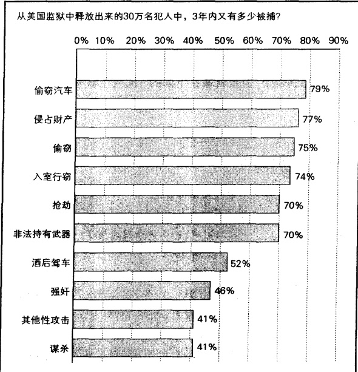
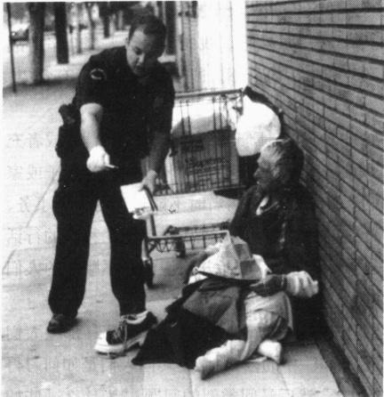

### 第 8 章 越轨和社会控制

bisM

洛伊丝·马娄·琼斯《偶像》(1938)

---

· 什么是越轨？

规范是如何使社会生活成为可能的

认可

羞辱与降身份仪式

对越轨的不同解释——社会学、生物学

和心理学解释

· 符号互动论观点

分帮理论

控制理论

标签理论

· 冲突论观点

阶级、犯罪和刑事司法制度

权力和不平等

作为镇压工具的法律

· 功能主义观点

越轨真的能对社会有正功能吗？

紧张理论：社会的价值观是怎样产生越轨的

违法的机会结构：社会阶级和犯罪

· 对越轨的反应

街头犯罪和监狱

犯罪率的下降

累犯

死刑和偏袒

法律的变化

官方统计数据带来的麻烦

越轨行为的医疗化：精神疾病

无家可归者的精神疾病

我们需要一种更为人道的方法

· 本章小结

---

### 第 8 章 越轨和社会控制

再过一会儿，我就能见到第一个亚诺麻莫人了，我见到的第一个原始人。他会是什么样子呢？……我(从独木舟)向岸上望去，当我看到12个强壮的、赤裸的、肮脏的、丑陋的男人正在顺着一根根拉满了弓的长箭盯着我们看时，我深深地倒吸了一口气。大团大团的绿烟草衔在他们的下槽牙和嘴唇之间，使他们看起来更为恐怖。一道道墨绿色的鼻涕从鼻子里淌下来或者就挂在鼻子上。我们到达村子的时候，男人们正在吸一种致幻剂。这种药物的一个副作用就是爱流鼻涕。那些鼻涕总是被这些绿色的药物给粘住，而这些印第安人就让鼻涕顺其自然地流着，连擦都不去擦一下……我只能惶恐无助地坐在那里，紧紧握住笔记本……

整个处境令人非常沮丧，我真想知道我当时为什么要从土木工程转到人类学专业……（很快）这大约12个人对我全身所作的一番彻底检查的结果是，我全身被涂上了一层红颜色……这持续了一天的检查又让我垂头丧气了一天。这些印第安人把鼻涕擤到手上，使劲甩出去，最后把粘在手上的鼻涕抹在头上，然后再仔细地检查我的脸、胳膊、腿、头发和口袋里的东西。我对他们说（用他们的语言）：“你的手很脏。”我的不满得到了这样的答复：他们向手心吐一大滩粘糊糊的烟草汁，搓一搓，权当“洗手”，然后继续检查。

这就是拿破仑·查格农(Napoleon Chagnon)对巴西热带雨林中的亚诺麻莫人部落令人大开眼界的介绍。历经数月的田野调查给他带来了一个又一个的惊讶，查格农(Chagnon,1977)几乎不能相信自己的眼睛或他的鼻子。

如果我们要列出那些印第安人的越轨行为，我们能从哪里开始呢？从他们裸体出现在公众面前的方式？服用致幻药物？让鼻涕挂在鼻子上？还是他们在受到惊吓而不敢反抗的陌生人面前搓一搓沾满鼻涕、唾液和烟草汁的手？也许可以这样。但事情并没有这么简单，正如我们下面将要看到的，越轨是相对的。

### 什么是越轨？

社会学家用越轨(deviance)这一术语来指任何违反规范的行为，无论这种违规行为是轻微的超速驾车，还是严重的谋杀，或是像查格农遇到亚诺麻莫人时那种搞笑的行为。这一看似简单的定义，把我们带入了关于越轨的社会学视角的核心问题。对此社会学家霍华德·贝克尔(Howard Becker，1966)作了如下解释：导致某种行为越轨的，并不是这种行为本身，而是人们对这种行为的反应。虽然查格农被他所见到的亚诺麻莫人的行为吓倒了，但对亚诺麻莫人来说，这些行为就是正常的，就是日常生活。对查格农来说是违反常规的行为，对亚诺麻莫人来说却是循规蹈矩的行为。在亚诺麻莫人看来，你就应该像他们那样对陌生人进行通体检查，赤裸和致幻药也是正常的，而鼻涕就应该让它“顺其自然”地流淌。

---

我在印度海得拉巴的郊区拍摄了这幅照片。照片中这位男士是否越轨呢？如果他这样站在美国大街上，那肯定是越轨。但是在这里，由于他周围的邻居都没有自来水，所以这位男子和他的妻子、孩子们只能在邻居的抽水机前洗澡。所以，这位男子在他的文化中也许并没有越轨。而且他正冲着我的照相机摆姿势，惹得旁边的三个人笑起来。这个附加的因素是不是也造成了这看似越轨的一幕呢？

查格农对亚诺麻莫人的种种描述，让我们看到了越轨的相对性，这是符号互动论者的一个主要观点。因为不同的群体有不同的规则，对一些群体来说是越轨的行为对另一些群体来说则不然(见左图)。这一原理适用于一个社会中，也适用于不同文化，故被一种文化或一个社会中的某个群体所接受的行为在另一种文化或这个社会中的另一个群体看来就可能是越轨的。这个观点在右边的“文化多样性”专栏中将有进一步的探讨。

这个原理也同样适用于越轨的另一种具体形式即犯罪(crime)，一种写入法律的违反规范的行为。在极端情况下，在一个群体中受欢迎的行为，在另一个群体中可能会受到处罚并将被处以死刑。一个例子就是在商业中赚取巨额利润的行为，美国人就很赞赏这种行为，像唐纳德·特朗普(Donald Trump)，他们甚至写书来介绍怎样赚钱；然而在中国，这种行为在20年前还被看做是一种投机倒把的犯罪行为。

与一般公众不同的是，社会学家使用越轨这个中立的词来指任何被人们否定的行为。社会学家在使用这个词的时候，并不是说他们认为某种行为是错的，而仅仅是表明人们是用否定的态度来对待它。故对社会学家来说，我们所有的人都是一种或另一种行为的越轨者，因为我们都时不时地会违反一些规范。

一个人即便是什么事情都没做，也有可能会被认为是越轨者。社会学家欧文·戈夫曼(Goffman，1963）用污名（stigma）来形容名声不好的人所具有的特征，包括能力方面不同于常人（失明、失聪、精神障碍）和外表的异样（一个面部的胎记、肥胖），也包括非自愿的成员身份，例如艾滋病受害者或是一个强奸犯的兄弟。这种决定他或她成为一名越轨者的污名，会成为一个人的主导地位。这里可以回想一下第4章所讲的内容，一个人的主导地位会掩盖住一个人所获得的其他所有的地位。

### 规范是如何使社会生活成为可能的

没有一个人类群体可以没有规范而存在，因为规范通过使人们的行为可以预期而使社会生活成为可能。如果你不能预期其他人行为的话，生活将会变成什么样子呢？想象一下你去一家商店买牛奶。

假设售货员说：“我不卖给你牛奶。我们这儿积压了许多汽水，我会等到我们的汽水存货减少后才卖给你牛奶。”

---

### 世界文化多样性

### 跨文化视野中的人类性行为

人类学家罗伯特·埃杰顿(Robert Edgerton, 1976)发表了一个关于不同人类群体对一些相似行为有不同反应的报告。在他提到的众多例子中，让我们以性行为为例来说明，决定一种行为是否越轨的是一个群体对该行为的定义，而不是这种行为本身。

关于性行为的规范，在世界范围内的差异是如此之大，以至于在某一个社会中被认为是正常的行为，在另一个社会中就可能被认为是越轨的。例如，肯尼亚西北的 Pokot 人，非常强调性愉悦，希望夫妻双方都能达到性高潮。如果丈夫不能满足妻子，他就倒霉了。Pokot 的男人经常干一些通奸的勾当，如果他不赡满足妻子，就会被归罪为通奸。趁他睡觉时，他的妻子会伙同女伴把他捆起来，她们用下流的语言骂他，狠狠地揍他，最后再吃掉他最喜欢的牛，然后才会放过他。数小时的痛苦和耻辱，是为了让他更尽职地履行妻子所享有的夫妻之间的权利。

人们也可能会由于没能理解一个群体的理想规范与现实规范不是一回事而越轨。就像其他群体一样，墨西哥的 Zapotes 印第安人承认性关系只能发生在夫妻之间。然而，在 Zapotes 人的一个社区里，一个没有婚外性关系的人却会被认为是越轨者。显然，那些人有一条不成文的规定：结婚的人可以通奸，但必须对此保密。妻子知道丈夫通奸后，她通常也会这样做。

一位 Zapotes 妻子没能遵守这项潜规则，她赞扬自己对丈夫的忠贞，然后又说了那件众所周知 的“令人头痛”的事情，还告诉其他人谁在与她的丈夫通奸。结果，这位贞洁的妇女遭到了全村人的谴责。很明显，潜规则可能会与正式规则相违背——这是关于理想和现实文化之间差距的一个例证。

你不喜欢汽水，但你还是决定买一箱。在结账的地方，售货员说：“我希望你不要介意，我们这里每隔14位顾客就收5美元的小费。”你，当然，就是第15位。

就在你打算要离开的时候，另一个售货员忽然拦住你说：“我们现在下班了。我们决定办个聚会。”一台CD播放机突然放出震耳欲聋的声音，然后商店里的每个人都开始跳起舞来。“哦？太好了，你买了一箱汽水。”一个售货员说着就拿过你的购物袋，把汽水分给了其他人。

当然，生活并不是这样子的。你确信百货商店的售货员会卖给你牛奶，你确信你会花同其他人一样的钱来买东西，并且不会被迫在商店里参加什么聚会。为什么你会确信这些呢？因为我们都经过了社会化，我们知道要去遵守规范，要去扮演社会赋予我们的基本角色。

没有规范，就会造成社会混乱。规范为我们怎样扮演社会角色和怎样与他人互动，确立了一套基本的指导原则。简言之，规范带来社会秩序（social order），即一个群体常规的社会安排。我们的生活就是建立在这种安排之上。越轨之所以被认为如此具有威胁性，是因为它破坏了社会生活的基础，即行为的可预期性。正因如此，人类群体才发展出一套正式或非正式的强迫遵循规范的社会控制（social control）体系。

### 认可

正如第 2 章中所讨论的，人们不会去强制执行民间的风俗习惯，但是当有人对其破坏的程度过于严重时，人们就会感到非常不安。对越轨行为的非肯定的表示叫做否定性认可（negative sanctions），它的范

---

围很广，包括对破坏风俗行为的不满和闲话，对破坏伦常的服刑和经济处罚。相反，肯定性认可(positive sanctions)——包括微笑和正式奖赏——则被用来奖赏遵守规范的人。获得升迁是肯定性认可，被解雇则是否定性认可。在社会学考试中获得A是肯定性认可，而获得F就是否定性认可。

许多否定性认可都是非正式的，你可能会对你认为穿着不得体的人瞪上两眼，或者对你认识的那个人与其配偶之外的人过夜这件事说上三两句。但是至于你认为某种违规行为仅仅很滑稽，不会受到严厉制裁；还是认为它是一种严重越轨行为必须受到严厉惩罚，就取决于你自己的看法了。如果一位妇女穿着比基尼出席你的大学毕业典礼，你看着她会觉得好笑，但是如果这位妇女是你的母亲的话，你很可能会采取一些不同的认可方式。同样，如果和一位18岁大一新生过夜的人是你的父亲，你很可能不仅仅是说两句闲话。

### 羞辱与降身份仪式

羞辱是另一种惩罚方式，它对于初级群体的成员来说特别有效。正因如此，人们经常用这种方式使孩子们听话。它在一些小的社区里面也是有效的，因为在这些地方个人的名声至关重要。但在我们的社会不断扩大和城市化的进程中，它已经失去了原来社区的意义，羞辱也失去了其效果。一些人还试图找回这种方法，例如，一位亚利桑那州行政长官让他所管辖的监狱中的男性犯人穿上粉红色的内裤(Boxer,2001)。

羞辱可能是公共仪式中的一个主要形式，目的是给违规者标上越轨的记号，以警示众人。在霍桑的《红字》中，城中的官员强迫赫斯特·普林(Hester Prynne)在她穿的衣服上必须缝上红字A（意为奸妇）。无论去哪儿，普林都必须穿着带有耻辱标记的衣服，而且市里的人们也都希望她每天都穿着它直到死去。

社会学家加芬克尔(Garfinkel,1956)把这种公开宣称某人为越轨者的仪式称为降身份仪式(degradation ceremony)。这个人要在公众面前说明事实情况，目击者会公开谴责他/她，越轨者被宣布有罪，并采取措施取消他/她作为群体成员的资格。在有些军事法庭上，当被指控犯罪的军官的等级徽章被从制服上取下来时，他要向他的同级立正。这个仪式表明，此人已不再是该群体中的一员。赫斯特·普林尽管人身没有被驱逐出群体，但在道德层面已被排斥在群体之外。降身份仪式已宣布她是该社区的一名道德唾弃者，红字A表明她已经不再是他们中的一员。

尽管今天我们已不再使用红字 A，但非正式的降身份仪式仍然存在。考虑一下对约瑟夫·格雷来说，究竟发生了什么（Chivers，2001）：

约瑟夫·格雷，一名纽约市警察队伍中的老兵，卷进了一起命案。《纽约时报》和纽约电视台报道，在格雷的车子撞到载有一名孕妇和孕妇的儿子、妹妹的车之前，他曾在一家提供半裸服务的酒吧中待了整个下午，车祸导致上述三人的死亡，他被起诉为过失杀人和酒后驾车（后来两项指控都被认定）。

新闻媒体反复向公众报道此事，三周后，当格雷辞职离开警察局时，一群愤怒的人包围了他。当在那次车祸中失去妻子和儿子的维克托·赫雷拉跟在他的后面，不断大骂“你是杀人犯”时，格雷在公众鄙夷的目光中低下了头。

---

### ▷▷小结

在社会学中，一切违背社会规范的行为，不管其严重程度如何都叫越轨，这并不是对行为本身的判断。越轨是相对的，在一个群体中是越轨的行为在另一群体中可能是符合常规的。因此，我们必须从一个群体的内部结构中去认识越轨，因为越轨的意义是隐含在他们的行为之中的。下面的“批判性思考”专栏将集中讨论这个问题。

### 是强奸，还是婚姻？一项对文化冲突的研究

被玉米地包围着的内布拉斯加州的首府林肯跟州府所处位置一样偏僻。大多数居民都很少与有不同生活方式的人交往。因此，当他们遭遇与其不同的文化时，不由得感到震惊。

他们的婚礼是传统式的，遵循已有千年历史的伊斯兰惯例(Annin and Hamilton,1996)。一个39岁的伊拉克难民安排他的两个大女儿，分别是13岁和14岁，嫁给了两个伊拉克的难民伙伴，分别为28岁和34岁。一位从俄亥俄州赶来的牧师主持了这场婚礼。内布拉斯加州的人们非常震惊，那些难民也是。对伊拉克人来说是结婚，但在内布拉斯加州的人们看来却是强奸。丈夫被控为强奸，女孩的父亲被指控为虐待儿童，女孩的母亲则被控诉为导致未成年人的不良行为。

这件事被沙特阿拉伯媒体列为头条新闻，这里的人对美国人的行为表示惊讶和不理解，内布拉斯加州的人们也表示惊讶和不满。

在加利福尼亚州的弗雷斯诺，一位年轻的赫蒙难民加入了大学校园中的一个朋友圈，而且他们也接纳了他选择作为自己妻子的女孩(Sherman, 1988; Lacayo, 1993)。这个年轻人把他的女朋友带到了他家，并在女友不同意的情况下强行和她发生了性关系。

赫蒙人把这叫做 zij poj niam，即通过占有而结婚。对他们而言，这是一种可接受的选择配偶的方式，反映出赫蒙人求爱的一种观念，即男人的强壮和妇女的贞节。然而，弗雷斯诺区的律师却把这称为拐骗和强奸。

### 思考题

如果把符号互动论应用到现实生活中，就要看介入者如何解释他们为什么会有这样的行为。如果要使用功能主义的观点，就要看那些被触犯的美国法律是如何“发挥功能”的（也就是说，它们有什么好处及对谁有利）。要应用冲突论的观点，就要看一下在这些事例中，哪些群体是相互冲突的（不要把焦点放在涉入其中的个体，而要关注个体所属的那些群体）。

当文化发生冲突时，从不同的理论来理解并不能告诉我们什么样的行为是“对”的。需要记住的是，科学能够分析事件的因果关系，但并不能决定什么行为是正确的或是错误的。如果你觉得这些事情违背了道德，那也是因为你拥有不同的价值观——这把我们再次带回了最初的话题——越轨的相对性。

### 对越轨的不同解释——社会学、生物学和心理学解释

既然规则对社会是必要的,为什么还会有人违背它呢?为了更好地理解这一现象,了解一下社会学与生物学和心理学的解释有何不同,是非常有用的。

社会生物学家通过从个体内部寻找答案来解释越轨。他们认为是个体生理结构中的某种物质导致他/她越轨。与此相反，社会学家则是从个体之外寻求答案，他们认为是环境中的某些因素导致人们越轨。

---

社会生物学的解释关注基因特质对越轨的影响，例如青少年的行为不良和犯罪（Lombroso，1911；Wilson and Herrnstein，1985；Hauser et al., 1995；Lalumiere and Quinsey，2000）。生物学的解释包括（但并非严格包括）以下三种理论：（1）智力因素——低智商导致犯罪；（2）“xyy”基因理论——男性多一条y染色体导致犯罪；（3）身体类型——“身体结实、肌肉发达”的人更容易街头犯罪，如行凶抢劫、强奸、入室行窃等行为。

这些理论的解释力如何呢？事实证明并不是很好，因为假设的那些具有犯罪特征的人并没有犯罪；有些罪犯的智商非常高，而且绝大多数低智商者也并没犯罪；绝大多数犯罪的男人都拥有正常的“xy”染色体，而绝大部分拥有“xyy”染色体的男人也没有犯罪。除此之外，妇女不存在这种基因对，所以这种解释不适合解释女性犯罪。所有身体类型的人都可能犯罪，而绝大多数具有“身体结实、肌肉发达”特征的人也并没有街头犯罪。

心理学家也关注人类个体内部的变态，他们侧重分析一种被称作人格失调的东西。他们的假设是：越轨者有越轨性人格（Heilbrun，1990；Krueger and Caspi，2000；Barnes，2001），潜意识动机驱使人们越轨。然而，并不是所有具有特殊经历的儿童都和越轨相联系。例如，接受过过度严格的入厕训练、有位专制的母亲或情感冷漠的父亲的儿童，既可能成为挪用公款的档案员，也可能会成为优秀的会计师。就如同学生、老师和政府工作人员都体现了多种或好或坏的童年经历，越轨者也是如此。相似地，有过被压迫经历的人，也可能成为自由狙击手或者军队英雄——或者做其他的事情。简而言之，并不存在童年经历的必然后果，而且越轨也并不与任何特殊人格相关。

与社会生物学家和心理学家相反，社会学家从个体外寻找原因。他们寻找“导致”人们违背规则的社会影响因素。例如为了解释人们为什么犯罪，社会学家分析诸如社会化、亚文化成员和社会阶级这些外部影响。社会阶级这一概念将在第10章中进行深入讨论，它指的是人们在教育、职业、特别是在收入和财富等方面的相对地位。

意识到越轨的相对性，社会学家又提出了一个关键性的问题：“我们怎样才能在人们之间找到一种稳定的因素，来解释在一个社会中被认为是循规蹈矩的行为，在另一个社会中却被认为是越轨的行为？”

为了清楚地理解社会学家是如何解释越轨行为的，下面我们将把符号互动论、功能主义和冲突论三种社会学观点作一对比。

### 符号互动论观点

认真分析符号互动论,我们就会明白为什么社会学家不同意生物学或人格论的解释。符号互动论的一条基本原理就是:我们根据对情境的理解来行动,而不是根据盲目的禀性。考虑一下我们群体中的成员是如何影响我们的行为和日常生活的。

### 分帮理论

理论 与建立在生物学和人格论基础上的理论不同，社会学家强调人们“学会”了越轨。埃德温·萨瑟兰（Edwin Sutherland）创造了分帮（differential association）这一术语来说明我们是学会越轨还是遵循社会的规则，主要取决于我们所交往的不同群体（Sutherland，1924，1947；Sutherland et al., 1992）。最明

---

显的差异是有些青年人加入“撒旦的仆人”，另一些则加入童子军。正如社会学家反复说明的，我们所学到的东西将影响我们是想去还是远离越轨（Alarid et al., 2000；Erickson et al., 2000）。

实际上，萨瑟兰的理论比这还要复杂，但他的基本观点是：越轨是习得的。这就与把越轨的原因归于生物因素或人格特征的理论截然相反。萨瑟兰强调指出，我们所属的不同群体，即我们的“不同帮派”，提供给我们关于遵守规范还是越轨的信息。我们可能会受到各种性质的信息影响，但最终一方面会超过另一方面(如同萨瑟兰举例所说的，是一个概念的胜出)，最后的结果就是态度的失衡——我们更倾向于某一方面。结果，我们要么遵守规则，要么就越轨。

家庭 既然家庭对我们态度的培养如此重要，那么家庭对你是学会越轨还是遵守规则的影响也是巨大的。研究者已经肯定了这个非正式观察结果。他们发现，违法者更多地来自那些因违法而惹上麻烦的家庭。他们研究了被关在高度戒备的收容所中的25000名青少年违法者（Beck et al., 1988），发现其中25%的人的父亲坐过监狱；25%的人的兄弟姐妹中有一人坐过监狱；9%的人的母亲坐过监狱；13%的人有其他亲属坐过监狱。在美国监狱的犯人中，大约一半人有一位坐过监狱的父亲、母亲、兄弟或者姐妹（Sourcebook of Criminal Justice Statistics 1997；483）。总之，卷入犯罪中的家庭更易于把他们的孩子推上犯罪之路。

朋友、邻居和亚文化 大部分人并不知道术语“分帮”，但他们确实知道它在发挥着作用。许多父母都会择邻而居，因为他们知道，如果他们的孩子和不良青年交朋友，他们也会很容易成为不良青年（Miller，1958；Baskin and Sommers，1998；Sampson et al., 2001）。有些居住区甚至形成了暴力亚文化，在这些地区，即使一句玩笑话也可能会导致立刻丧命。如果邻居们觉得一位受害者该杀，他们会拒绝为他出庭作证，“因为他得到了报应”（Kubrin and Weitzer，2003）。一些居住区甚至形成了杀人光荣的亚文化：

社会学家露丝·霍罗威茨(Ruth Horowitz, 1983, 1987)亲身参与了对芝加哥市奇卡诺居住区底层人的观察，发现了与对“光荣”有某种特定理解的人交往的年轻人是如何走上越轨道路的。这种公式很简单，“一个真正的男人拥有自己的名誉，任何侮辱都是对名誉的威胁。”因此，不能对抗那些侮辱自己的人就不是真正的男人。

现在假设你就是在这个社区附近慢慢长大的年轻人，你很可能打过多次架，因为你把许多事情都理解为是对你名誉的侵犯。你甚至可能会随身携带一把刀或一支枪，因为吵架和拳头已经不能解决问题。和你的群体成员在一起，你会采用不同于大部分人的方式来解释打架、持刀砍人和开枪杀人。

黑手党也总是把男人气概与暴力联系到一起。对他们而言，他们的成年标准就是杀人。杀人者不一定会得到同样的荣誉，因为“牺牲者越

归属感是人类的一项基本需要。成为一个群体特别是同龄群体的成员，是人们满足这种需要的基本方式。无论这些群体的定位是什么——服从或者是越轨——事实都是如此。此照片展现的是加利福尼亚州长滩的一个名叫“放弃标志”的黑帮。帮派的成员关系能够给人提供一种重要的身份感。

---

是令人敬畏，越有威力，杀人者就会越有价值，越有功”(Arlacchi，1980)。有些杀人事件是为了遵从规则。例如，一名黑手党成员若是向警察提供信息，就违背了黑手党的秘密誓言。这种罪过是从来没有被容忍过的，因为它威胁到了该组织的生存。这个例子进一步说明，越轨是相对的。尽管对主流社会而言杀人是越轨行为，但对黑手党来说，如果确定的某些规则遭到破坏，如当有人向警察告密而不被杀掉，这才是越轨。

束缚还是自由？我们是不是社会化的囚徒这一话题在社会学中被反复讨论。符号互动论者强调我们不仅仅是他人控制的人质，这不是说我们的命运掌握在我们的群体成员手中，也不是说我们要根据群体的指令思考、行动，而是说我们在创造我们自己的生活方向。我们选择的群体(分帮)有助于形成自我。例如，一位大学生在大学中可能会参加一个力图提高女性待遇、要求男女平等的群体；另一名大学生则可能会与周末到商店扒东西的女性群体搭伙。他们的群体选择，把他们指向了两种不同的发展方向。与商店扒手搭伙的大学生可能会变得更加朝向犯罪方向发展；而加入女性主义群体的大学生则可能会对社会变迁产生越来越浓的兴趣。

### 控制理论

在我们大多数人心中，都有一种可能会使我们陷入麻烦的强烈欲望——内在驱力、诱惑、冲动、敌意等等。不过我们大多数人在大部分时间内都抑制住了这些欲望。为什么呢？

理论 社会学家沃尔特·雷克里斯(Walter Reckless)提出了控制理论(control theory)。他强调有两种控制体系可以抑制我们将越轨动机付诸实施。一种是我们的内在控制，包括被内化的道德观念——良心、宗教原理、是非观念；内在控制还包括对惩罚的恐惧、诚实正直的意识和做一个“好人”的愿望(Hirschi,1969;Rogers,1977;Baron,2003)。外在控制包括那些可以防止我们越轨的外在力量，如家庭、朋友和警察等等。

我们与社会的联系纽带越牢固，我们的内在控制就越有效(Hirsch，1969)。这种联系建立的基础是关切(对遵守社会规范的人表示尊敬和倾慕)、承诺(在这个你不想冒险的社会中设定某种东西，如家庭中受尊敬的地位、大学中的好名望、一份好工作)、投入(在被允许的行为上投入时间和精力)和信仰(相信某种行为在道德上是错误的)。社会学家特拉维斯·赫希(Travis Hirschi)说，这个理论可以被概括为自我控制理论。获得高水平自我控制的关键是社会化，特别是在童年时期，父母通过监督指导他们并惩罚他们的越轨行为，可以帮助他们的孩子习得自我控制(Gottfredson and Hirschi，1990)。

应用该理论 仔细考虑一下吸毒的情况。假设有位朋友邀请你去一家夜总会，当你到那儿以后，却发现每个人都有些不正常的高兴，更确切地说应当是他们言语轻浮，对他们的谈话和舞蹈欣喜若狂。你的朋友告诉你，这里每个人都吃了兴奋剂，并且他也请你尝一尝。

这时你会怎么办？让我们先不要探究在这种场合服用兴奋剂是越轨还是遵守规范的问题，而是集中考虑一下你所感受到的压力和动力。吸毒的推动力是：你的朋友们、这个环境和你的好奇心。当然也有一些内部控制：你的良心和你的父母、内心中老师的声音或者你对被捕的恐惧；当然也有外部控制——或许从你的角度看它们是统一的防卫关卡。

---

那么,你又会怎么做呢？哪一方更有力量：你的内部和外部控制不让你吸毒，还是推动力和压力驱使你吸毒呢？只有你自己才能更好地权衡那些力量，因为我们每个人都与他人不同。

### 标签理论

符号互动论者已经发展出了标签理论(labeling theory)，该理论注重我们所赋予标签(即名字、名声)的重大意义。标签通常会成为我们自我概念的一部分，促使我们走上越轨之路或是偏离越轨之路。让我们看一下人们是如何对待社会标签的——从“娼妓”和“性变态”到“骗子”和“笨蛋”。

“杰里·斯普林格秀”中的越轨者展示使观众觉得自己好像成了某些隐秘事件的参加者。当斯普林格和其他人希望他继续在公众面前进行越轨者游行时，最初的震惊和好奇减弱了，这使得越轨行为看起来“更加”正常。现在正在发生的就是越轨行为的主流化——得不到认同的行为渐渐成为主流或者越来越被社会所接受。

抵制标签: 人们怎样使越轨无效 多数人都会抵制别人试图给他贴上的否定性标签。有

些人在这方面做得非常成功，以至于即使他们继续越轨，他们也认为自己是遵纪守法的。例如，有的人即使打了他人、破坏了财产，仍会认为他们是遵守社会规范的成员。他们是怎样处理这件事的呢？

社会学家格雷沙姆·赛克斯和戴维·马扎（Gresham Sykes and David Matza，1988）研究了处于上述情境中的男孩。他们发现，那些人用五种失效手段（techniques of neutralization）使社会规范发生偏离。

· 对责任的否认 有些男孩说：“我对刚刚发生的事情不负有任何责任，因为……”他们说的理由非常荒唐。他们说刚才发生的事情是件意外；另外一些男孩则把自己看成是社会的“受害者”。你还能期望些什么？他们就像台球桌上被打散的台球一样。

· 对伤害的否认 男孩们热衷的另一个解释是：“我做的并没错，因为没人受到伤害。”他们把恣意破坏公共财产的行为看做是“恶作剧”，把打群架看做是“私人吵架”，把偷车看做是“借车”。他们很可能明白他们所作的是违法的，但他们会声称那样做是件“非常有趣的事”。

· 对受害者的否认 有些男孩把他们自己看做是复仇者。毁坏老师的汽车是为了报复老师给他们不公的分数，到商店扒窃是为了与“奸诈”的老板算账。总之，即使这些男孩接受了惩罚并且也承认那些人受了伤害，他们还是会通过说那些人“罪有应得”来进行自我辩护。

· 对谴责者进行谴责 这些男孩使用的另外一种方法就是否认其他人有对他进行评判的权利。他们可能会指控那些曾用手指过他们的人是群伪君子：警察逢场作戏，老师养宠物，父母偷税。总之，他们会说：“那些谴责我们的人有什么资格谴责我们？”

· 呼吁更高的忠诚 这些男孩用来为其反社会行为进行辩护的最后一种技巧，是把对团伙的忠诚看得比遵循社会规范还重要。他们可能会说：“我不得不帮助我的朋友，那就是我为什么打架的原因。”无独有偶，这样的男孩也很可能会对敌对群体中的两个人开枪，而不是做一个旁观者。

---

### ▷▷小结

这五种使主流社会规范失效的手段，远非只存在于这些男孩之中，因为它们不只为青少年越轨者所使用。重新看一下这五种手段——难道它们听起来不是很熟悉吗？（1）“我控制不住自己”；（2）“谁真正受到了伤害？”（3）“难道你不认为她作了那样的事就该受到惩罚吗？”（4）“你在跟谁说话呢？”（5）“我必须帮助我的朋友——难道你就没做过类似的事吗？”我们所有人都在试图使社会的道德标准失效，因为这能使我们过得心安理得一些。

接受标签: 以飚车族为例 虽然我们绝大多数人都反对那些把我们标为越轨者的企图, 但也有一些人却沉迷于这种越轨者的身份。例如, 一些青少年通过他们的服饰、所听的音乐和发型来确保没人会看不出他们对成年社会的反叛。他们对同龄群体的亚文化圈无比忠诚顺从, 而他们在其中的地位, 与他们在这个圈外的身份地位相比也是无比重要的。

这方面最突出的例子就是魔车族。社会学家马克·沃森（Mark Watson，1988）对魔车族进行了参与观察。他和他们重建了“哈利斯”，在他们的酒吧和家附近游荡，而且经常与他们一起魔车。他说魔车族将这个世界看做是“充满敌意的、衰落的、颓废的”。令他们引以为豪的是他们看起来是“肮脏的、平庸的、而且通常是令人讨厌的”，并且他们以自己的外表能够令人目瞪口呆为乐。带着对传统社会的不屑，他们也以制造麻烦、嘲笑死亡、将妇女看成其主要价值就是向他们提供服务（特别是性服务）的卑微的人引以为豪。魔车族也将自己看成是失落者——这也是他们走向自暴自弃的原因。

标签的力量：圣徒和无赖 当我们再回头看第4章中关于“圣徒”和“无赖”的研究时，我们就能明白标签的力量有多大。你还记得那两组高中男生都“经常逃学、酗酒、野外聚餐、小偷小摸和故意搞破坏”。然而他们的老师却把“圣徒”一组看成是“注定要成功的学生”，而把“无赖”一组看成是“注定要制造麻烦的学生”。当他们结束高中生活时，“圣徒”一组的学生从没被拘捕过，而“无赖”一组的学生则经常与警察局打交道。

为什么这个社区对这两组学生的态度如此不同？钱布利斯(Chambliss，1973/2003)解释说，这两种截然不同的看法，来源于学生所处的社会阶级。正如符号互动论者所强调的，社会阶级会严重影响我们的想法和行为。“圣徒”一组的学生来自受人尊敬的中产阶级家庭，而“无赖”那组学生则来自不受尊重的工人阶级家庭。这两种不同的家庭背景，使得老师和权威者期待“圣徒”一组的学生能有好的行为举止，而对“无赖”一组的学生则时刻提防他们制造麻烦。于是，就像我们一样，老师和警察局看到了他们想要看到的东西。

这些男生们的社会阶级也影响到了他们的透明度。“圣徒”一组的学生有小汽车，他们可以去市郊酗酒和搞破坏。而“无赖”一组的学生因为没有汽车，只能在自己居住的街道上闲逛，于是他们的恶劣行为就引起了警察的注意，而这也正好证实了社区中的人本来就对他们持有的看法。

这些男孩子们的社会阶级也使他们从小就培养出与人不同的互动方式。当被警察或老师质问时，“圣徒”一组的学生会道歉，他们这种对权威者尊重的态度会得到老师或警察积极的反应，而不去追究他们对学校或法律的责任。而“无赖”一组的学生，威廉·钱布利斯说，却是“截然不同的情况”。当被质询时，他们充满敌意。甚至当他们试图表示一种敬重的态度时，也会被看穿。结果，老师和警察对那些“圣徒”

---

一组的学生只是警告几句就让他们离开，而对“无赖”一组的学生则会百般刁难。

虽然生活中发生的事情并不仅仅是由标签决定的，但“圣徒”一组和“无赖”一组的学生还是向着社区里的人给他们贴的标签的方向成长。结果在“圣徒”一组中除了一人之外全部上了大学。一个获得了博士头衔，一个成了律师，一个成了医生，其他人则成为企业管理者。相反，在“无赖”一组中只有两个人上了大学，他们得了体育奖学金成了教练。其他人则没有这么好的运气，有两个高中辍学，随后各自卷入一场人命案，被投进监狱。还有一个成了一个赌徒，至于其他人就无人知晓在干些什么了。

标签是怎样起作用的呢？虽然这个过程很复杂，因为它涉及因人而异的个人定义和反应，但是我们也能注意到标签在为某些人提供一些机会的同时，也剥夺了另一些人的生活机会。在人们的日常生活中，“越轨”这个标签的应用并不像在社会学中所说的那样，它是一种对个人进行判断的方式。标签可以把一个人排斥出常规的群体，所以他只能与那些有类似标签的人们待在一起。

### ▷▷小结

符号互动论者考察的是人们对情景的定义如何决定了他们对社会规范是违背或是服从。他们关注的焦点是不同的群体成员归属(分帮论)、人们如何平衡使他们服从或越轨的两种压力(控制论)和贴在某人身上的标签有何意义(标签理论)。

越轨这个标签涉及对同一种行为的不同定义和反应。符号互动论的这一主要观点在下面的“社会生活中的大众媒体”专栏中有详细阐述。

### 社会生活中的大众媒体

### 网络中的色情: 自由与审查

色情作品可以生动地说明本章所讲的社会学原理——越轨的相对性。不是某种行为，而是对这种行为的反应，造成了某种越轨。这里我们描述一下当今社会中的一个主要社会问题：网络中的色情。

网上关于色情作品的范围很广。一些网站甚至有目录索引：异性恋或同性恋、个人或群体、未成年人、拉拉队队长和一些“认为自己还行”的中老年妇女。一些网站提供照片，另一些则有录像。还有提供现场转播的网站，像有个宣传自己“直接来自阿姆斯特丹”的网站就是。登陆之后，你可以让你的“模特”做任何你心里渴望做的事。男“模特”或女“模特”都有，当然每分钟的费用是不菲的。项服务的话？虽然也有一些人反对任何形式的黄色网站，但令大多数人不满的是那些带有性奴役、性虐待、强奸、尊奸（人与兽性交）和猥亵儿童的栏目。

这有什么问题吗？为什么人们不能在网上传播他们的裸照，如果他们自己愿意的话？或者是，人们为什么不能在网上观看他人做爱，如果有人提供这些网站都设有聊天室，人们在那里可以在线“见面”进行聊天。没有人会被那些主题是罗马建筑或打击乐或龟兔赛跑之类的聊天室所烦扰。但是如果是那些关于如何虐待妇女的聊天，就是另一回事了。类似的还有那些谈论怎样去诱奸小学生——或是大肆渲染与一个三岁儿童性交乐趣之类的网站。

联邦或州政府已经通过了禁止儿童色情的法律，警察部门也购置了电脑来侦查非法图片。法庭将会对他们进行罚款，有些人将被送入监狱。然而，那些关于如何折磨或性虐待妇女的图片却仍然是合法的。

---

### 思考题

有些人认为不管他们如何不同意一种观点或是觉得它是如何令人厌烦，关于这种观点的传播（包括照片）却应当是合法的。如果我们让政府来审查这些行为，它就会对另一些行为也进行审查。你认为传播那种妇女被性虐待或者受折磨的图片应当是合法的吗？你认为谈论怎样诱奸儿童的行为是合法的吗？如果不是，它们应被禁止的理由是什么？如果我们应该禁止这些行为的话，我们还需要禁止其他那些类似的传播行为吗？理由是什么？

在一项6票反对3票赞成的结果中，美国最高法院通过了一项联邦法律，要求所有被联邦政府赞助的公立图书馆在所有连接网络的电脑上都要安装色情过滤设置。你认为这种设置与《第一修正案》中关于保证言论自由——就像一些最高法院的法官所声称的——是不是相互抵触？或者你认为这是一个保护儿童的合理预防措施吗？

最后，你能反驳符号互动论的中心观点——某种行为之所以是越轨的，仅仅因为人们认为它是越轨的——吗？你可以利用本专栏里引用的例子，或是其它你想到的事情。但是，在你的论据里不能借助上帝或是纯粹道德，因为它们是社会学领域之外的东西。从本书第1章中你可以看到，社会学是不能建立在道德观之上的。这也同样适用于其他极端的案例。

### 功能主义观点

当我们考虑越轨时, 最有可能想到的就是它的负功能。相反, 功能主义者在强调越轨的负功能时, 也强调越轨的正功能。

### 越轨真的能对社会有正功能吗？

我们大部分人都做越轨所困扰，特别是犯罪，因此我们可以肯定：如果没有越轨的话，社会将会变得更加美好。然而经典功能主义者涂尔干(Durkheim，1893/1933，1895/1964)，却得出了一个令人惊讶的结论。他说，越轨(包括犯罪在内)对社会是有正功能的，因为它对维护社会秩序作出了贡献。它有以下三方面功能。

1. 越轨能明确道德界限，并认证规范。一个群体关于人们应当如何行动和应有何种思想的观点，标明了它的道德界限，而越轨则触犯了这些界限。让一名越轨者对其行为负责，实际上就是说：“你破坏了一条重要的规则，我们不能容忍。”惩罚越轨者可以肯定群体规范，并明确作为群体的一员应该怎样做。

2. 越轨能促成社会团结。通过惩罚越轨者并阐明一个群体的道德界限，可以在全体成员中培养出一种“我们”感。通过“你不能逃脱惩罚”这种说法，群体一致来肯定他们自己的正义观。

3. 越轨能促进社会变迁。群体并不总是一直都赞成去对付那些触犯他们原先做事规则的人。一些群体成员甚至赞同那些破坏规则的行为。那些获得足够支持的处于道德边缘的越轨行为，则会成为新的被接受的行为方式。这样，越轨就可能会推动一个群体去重新思考和界定它的道德界限，来帮助群体和整个社会去改变他们传统的方式。

---

### 紧张理论：社会的价值观是怎样产生越轨的

功能主义者认为犯罪是社会的自然组成部分，并不是一个失常的或变异的部分。他们说：实际上，一些主流价值观也导致了犯罪。为了理解他们所说的话，想一想被社会学家理查德·克洛尔德和劳埃德·奥林（Richard Cloward and Lloyd Ohlin，1960）确立为工业社会的首要大事：社会需要确立并培养每一代人中最有才能的人——不管他们出生于富裕家庭还是贫困家庭——以使他们能够胜任现代社会中关键的技术性职业。当一个孩子出生时，没有人知道他们中有谁会有能力成为牙医、原子能物理学家或工程师。为了使最有才能的人相互竞争，社会尽力使每一个人都为成功而奋斗。社会通过激起人们的一种不满感——使人们对现状不满，而使人们更努力，使自己更完善。

于是，大多数人就能一直带着对获得像财富或地位此类的文化目标(cultural goals)，或怀着获得一个物质社会提供给他所能拥有的东西的这种强烈渴望而不断拼搏。然而，并不是每个人都平等地享有一个社会的制度化手段(institutionalized mean)，即用合法手段来获得成功。那些发现其接受教育或找到好工作的路被堵塞的人往往会经历挫折和高度紧张，而这则可能导致他们最后采取越轨手段。

这一被称为紧张理论（strain theory）的观点，是由社会学家默顿（Merton，1956，1968）提出的。他说，遇到紧张的人们，很可能会感到反常（一种社会失范的感觉）。因为主流规范（像工作或教

不同的社会阶级有不同的生活方式，所以犯罪的种类也因社会阶级而异。照片中的人叫玛莎·斯图尔特，由于生产了许多产品和电视零部件而家喻户晓。在以前的照片中，斯图尔特总是兴高采烈，因为她创建了自己的公司——玛莎·斯图尔特 Onmimedia。由于被控进行内部交易（为了从“内部”获得信息而进行股票交易），斯图尔特被迫离开纽约股票交易公司董事会并辞去她所创立的公司的领导职务。显然，穷人是没有机会去犯斯图尔特被指控的这一罪行的。

育) 好像并不能接受他们,他们觉得很难认同这些规范。他们甚至可能会感到这些制度伤害了他们,其规则是不合法的(Anderson,1978)。

表 8.1 比较了人们对文化目标和制度手段的反应。默顿认为第一种反应，即遵从——用社会认可的手段来获取文化目标——最为普遍。在工业社会，大多数人都会努力得到一个好工作，受到良好的教育等等。如果高薪酬的工作找不到，他们就会找一个差一点的工作岗位。如果他们被哈佛或斯坦福大学拒绝，他们就去一所公立大学，另一些人则选择上夜校和职业学校。总之，绝大多数人都走上了社会认可的道路。

四种越轨方式 剩下四种越轨反应，代表着对失范的反应。让我们分别看一下：创新者就是那些接受社会的目标，但用一种非法手段去获得它的人们。例如，毒品贩卖者接受了要赚钱的这种目标，但是他们却没有用合法的途径去挣钱。另一些例子如小偷、盗贼和骗人的艺术家。

第二种越轨方式是那些受到挫折后放弃了文化目标的人。但他们仍然接受传统的行为规范。默顿称这种反应方式为仪式主义。虽然仪式主义者放弃了工作中的积极进取，但他们却也因为能遵守它们的工作规则而安然无事。例如失去理想的教师(据说他们的热情已被燃烧殆尽)，会待在教室里继续他们

---

表 8.1 人们如何使他们的目标与手段相一致

<table border=1 style='margin: auto; word-wrap: break-word;'><tr><td style='text-align: center; word-wrap: break-word;'>他们会感到导致失范的紧张吗</td><td style='text-align: center; word-wrap: break-word;'>适应模式</td><td style='text-align: center; word-wrap: break-word;'>文化目标</td><td style='text-align: center; word-wrap: break-word;'>制度化手段</td></tr><tr><td style='text-align: center; word-wrap: break-word;'>否定</td><td style='text-align: center; word-wrap: break-word;'>遵从</td><td style='text-align: center; word-wrap: break-word;'>接受</td><td style='text-align: center; word-wrap: break-word;'>接受</td></tr><tr><td rowspan="4">肯定</td><td style='text-align: center; word-wrap: break-word;'>创新</td><td style='text-align: center; word-wrap: break-word;'>接受</td><td style='text-align: center; word-wrap: break-word;'>拒绝</td></tr><tr><td style='text-align: center; word-wrap: break-word;'>仪式主义</td><td style='text-align: center; word-wrap: break-word;'>拒绝</td><td style='text-align: center; word-wrap: break-word;'>接受</td></tr><tr><td style='text-align: center; word-wrap: break-word;'>隐退主义</td><td style='text-align: center; word-wrap: break-word;'>拒绝</td><td style='text-align: center; word-wrap: break-word;'>拒绝</td></tr><tr><td style='text-align: center; word-wrap: break-word;'>反叛</td><td style='text-align: center; word-wrap: break-word;'>拒绝/取代</td><td style='text-align: center; word-wrap: break-word;'>拒绝/取代</td></tr></table>

毫无激情的教学工作。他们的行为被认为是越轨的，虽然他们仍在坚持工作，但是已经放弃了这种文化目标，而这种文化目标很可能会激励一个年轻的心灵使世界变得更美好。

选择第三种越轨方法的人是隐退主义者。他们同时放弃了文化目标和可以获得目标的制度化手段。那些借用酗酒或毒品来逃避对成功追求的人就是隐退主义者。这些人甚至也不会去试着分享社会的目标。

最后一种越轨方式就是反叛。反叛者认为自己所处的社会是腐败的，他们放弃了社会的文化目标和它的制度化手段。然而，与隐退主义者不同的是，他们试图用一种新的目标来替代原来的目标。革命家就是反叛者最典型的类型。

### ▷▷小结

紧张理论强调了这样的社会学原理，即越轨是社会的产物。由于各自的地位不同，一些人比另一些人面临着更大的压力，迫使他们违背社会规范。简言之，如果一个社会强调物质成功，被剥夺致富手段的群体就更有可能介入非法获取财富的犯罪活动中。

### 违法的机会结构: 社会阶级和犯罪

在社会学关于越轨的研究中,最令人感兴趣的问题是不同的社会阶级有着不同的犯罪形式。让我们看一下在获得成功的制度性手段中的不平等机会是怎样解释这一问题的。

街头犯罪 功能主义者指出，工业化社会在教导穷人去追求他们自己想要的东西方面做得很成功。像其他人一样，穷人也被大量的信息所吸引，这些信息驱使他们去购买精心设计的牛仔服、DVD播放机和新车。电视和电影中都有展示中产阶级人们享受奢华生活的生动画面。这些画面更加渲染了这种神话：所有称职工作的美国人都能享受得起社会的许多物品和服务。

但另一方面却是，穷人却往往享受不到通往成功的最常用途径——学校教育。中产阶级经营着学校，穷人的孩子面对着一个令他们感到困惑的世界，一个与他们的阶级格格不入的世界。他们的语法和不标准的语言可能会不时地带有被一些中产阶级的人们认为是污秽的东西。他们对于“准时”和“整洁”的概念，和他们那种制作纸制铅笔的省钱做法，与他们的新环境一点也不协调。面对这些障碍，穷人家的孩子比那些有特权的孩子更有可能选择辍学。而教育的失败，转过来又关上了许多穷人面前那条通往财富的合法之门。

---

然而，在许多情况下，另一扇门——社会学家克洛尔德和奥林（Cloward and Ohlin，1960）称作违法的机会结构——却为穷人打开了。例如充斥城市贫民窟中的抢劫、行窃、毒品买卖、卖淫、拉皮条、赌博和其他有利可图的犯罪活动，它们通常被称为“非法经营”（Liebow，1967/1997；Bourgois，1994；Anderson，1978，1990，2001）。对许多穷人来说，“生意人”是一种典范榜样——指那些接近成功的文化目标的极少数人，他们富有魅力，拥有控制权，是一夜致富的形象代言人。因为这些原因，这些经营吸引了大量穷人。在“现实社会学”专栏中将要讨论的是黑帮——一种违法的机会结构吸引着处于劣势中的年轻人的方式。

### 现实社会学

### 街道中的独立王国: 美国的城市黑帮

社会学家马丁·扬科夫斯基(Martin Jankowski, 1991)花了十多年时间对波士顿、洛杉矶和纽约市的37个非裔美国人、墨西哥裔美国人、多米尼加人、爱尔兰人、牙买加人和波多黎各人的黑帮组织作了参与观察研究。黑帮赚钱的渠道有赌博、纵火、拦路抢劫、持械抢劫、批发毒品和倒卖私酒和枪支、盗窃汽车零件和收取保护费。扬科夫斯基在黑帮里生活，有时也参与黑帮之间的火拼，但根据合约规定他不参加毒品和其他非法活动。在这项研究中，他受过两回重伤。

与以往俗套说法不同的是，扬科夫斯基发现，人们加入黑帮的目的并不是为了逃避破碎的家庭（来自完整的家庭与来自破碎的家庭的人一样多），也不是为了寻求一种家庭的替代品（那些说他们与家庭联系密切的人与那些说联系不密切的人一样多）。实际上，他们加入黑帮的目的是为了赚钱、为了消遣（包括女人和毒品），为了在犯罪时可以逃遁、为了求得保护、为了帮助社区。这最后一条理由似乎看起来令人很惊讶，但在一些邻近地区，黑帮组织确实帮助过居民去抵抗外来者。男孩子们也把黑帮看做是他们的父母所做的浑浑噩噩的工作之外的另一种职业选择。

邻近地区的居民对黑帮有着矛盾的心理。一方面，他们害怕暴力；另一方面，许多成年人都曾在黑帮干过事，黑帮经常可以提供比警察更好的保护，而且黑帮中的成员也是邻居家的孩子。

具体的某个黑帮会有生有灭,但是黑帮却很有可能一直作为城市的一部分而存在,就像功能主义者所指出的,黑帮满足了那些生活在社会边缘的穷人们的需要。

### 思考题

黑帮(满足人们的需要)的功能是什么？设想你被洛杉矶城聘为一名城市设计者，你会怎样安排通过一种减少暴力和鼓励年轻人服从主流社会规范的方式，来实现那些黑帮所满足的需求。

白领犯罪 当然，更有特权的阶层并不是不会犯罪，而是对他们来说有另外一种犯罪机会在吸引他们。例如，医生不会去拦路抢劫出租车，但是许多医生都会在医疗上作弊。他们发现其他犯罪形式是有用的。你也肯定听说过会计从他们老板那里偷钱。换句话说，更有权力的阶层面临的“机会”并不是拦路抢劫、拉皮条、行窃，而是逃税、贿赂政府官员、盗用公款等等。社会学家埃德温·萨瑟兰（Edwin Southerland，1949）创造了白领犯罪（white-collar crime）这个术语，来指那些受人尊敬和具有较高社会地位的人在他们的职业中的犯罪。

白领犯罪的一种特殊形式就是法人犯罪(corporate crime)，即高级管理者阶层为了公司的利益而犯罪。例如，为了增加公司利润，西尔斯经理有预谋有计划地向穷人诈骗了1亿美元，使他们的受害者穷

---

得只能登记破产。为了避免遭到犯罪审判，西尔斯承认了罪过。这使梅西和布卢明代尔的总公司感到害怕，因为他们也进行过类似的诈骗，于是他们安排与其债主私下了结(McCormick，1999)。最臭名昭著的法人犯罪案之一是燧石(Firestone)的经理们决定对他们生产的销往美国的有缺陷轮胎的小汽车置之不理——尽管他们已经收回了他们在沙特阿拉伯和委内瑞拉的汽车。在右边的图片中可以更清楚地看到其后果是多么具有毁灭性。这些轮胎夺走了大约200名美国人的生命(White et al., 2001)。

对法人犯罪的处罚大都不是很严厉，尽管其结果包括死亡。考虑一下这种事情：根据联邦法律，若是由于故意违反安全条例而导致一名工人死亡的话，只会按轻罪判你在监狱中待上六个月，而如果你在联邦土地上去骚扰一头小野驴则可能会被判上一年监禁（Barstow and Bergman，2003）。

200多人死于燧石公司的轮胎引发的交通事故。照片中的人是维克托·罗德里格斯。他的福特汽车的一个“燧石”轮胎在得克萨斯州的圣安东尼奥爆炸了，由此导致他的10岁孩子丧生。这个错误可能在于燧石公司制造了一个有瑕疵的轮胎；可能在于福特汽车厂安装在这个汽车上的轮胎太小了；也可能是由这两者共同造成的。如果事实如此，这将是一起白领杀人案。但白领杀人犯是不可能会因为他们的杀人罪行而坐牢的。

对于每年 4000 亿美元的数目来说 (Zeune, 2001)，“公寓里的犯罪”确实要比“街道上的犯罪”花费要多，它涉及的不仅是钱。至今还没有人研究出一种方法去比较一下，例如，被强奸所承受的痛苦，与一对老夫妇由于白领诈骗而被骗去所有生活储蓄的痛苦，究竟哪一个更深？

然而，美国人更关心的还是街头犯罪。他们害怕那些暴徒会让他们的生活发生永远的改变。遭遇这种犯罪的几率随着你的居住地的不同而改变，有些地区要比另一些地区更为安全。一般来说，北方各州较为安全，南方各州则比较危险。

性别和犯罪 犯罪性质的一个主要变化是女性犯罪者的大幅增加。在表8.2中可以看出，女性几乎在所有类别的犯罪中所占比重越来越大——从偷车到行窃。例外的是谋杀和非法赌博。随着越来越多的妇女参加工作和进入公司，她们也被犯罪机会所诱惑，所以她们涉入盗用公款、诈骗和伪造等犯罪活动的比例都在增加。

表 8.2 妇女与犯罪：10 年间发生了哪些变化被捕犯人中，妇女占多大比重？

<table border=1 style='margin: auto; word-wrap: break-word;'><tr><td style='text-align: center; word-wrap: break-word;'>犯罪种类</td><td style='text-align: center; word-wrap: break-word;'>1990年</td><td style='text-align: center; word-wrap: break-word;'>2000年 $ ^{1} $</td><td style='text-align: center; word-wrap: break-word;'>变化</td></tr><tr><td style='text-align: center; word-wrap: break-word;'>偷窃汽车</td><td style='text-align: center; word-wrap: break-word;'>10.0%</td><td style='text-align: center; word-wrap: break-word;'>15.7%</td><td style='text-align: center; word-wrap: break-word;'>+57%</td></tr><tr><td style='text-align: center; word-wrap: break-word;'>殴打</td><td style='text-align: center; word-wrap: break-word;'>13.3%</td><td style='text-align: center; word-wrap: break-word;'>20.1%</td><td style='text-align: center; word-wrap: break-word;'>+51%</td></tr><tr><td style='text-align: center; word-wrap: break-word;'>行窃</td><td style='text-align: center; word-wrap: break-word;'>8.8%</td><td style='text-align: center; word-wrap: break-word;'>13.3%</td><td style='text-align: center; word-wrap: break-word;'>+51%</td></tr><tr><td style='text-align: center; word-wrap: break-word;'>侵占财产</td><td style='text-align: center; word-wrap: break-word;'>12.0%</td><td style='text-align: center; word-wrap: break-word;'>17.4%</td><td style='text-align: center; word-wrap: break-word;'>+45%</td></tr><tr><td style='text-align: center; word-wrap: break-word;'>酒后驾车</td><td style='text-align: center; word-wrap: break-word;'>12.8%</td><td style='text-align: center; word-wrap: break-word;'>16.4%</td><td style='text-align: center; word-wrap: break-word;'>+28%</td></tr></table>

---

<table border=1 style='margin: auto; word-wrap: break-word;'><tr><td style='text-align: center; word-wrap: break-word;'>犯罪种类</td><td style='text-align: center; word-wrap: break-word;'>1990年</td><td style='text-align: center; word-wrap: break-word;'>2000年 $ ^{1} $</td><td style='text-align: center; word-wrap: break-word;'>变化</td></tr><tr><td style='text-align: center; word-wrap: break-word;'>抢劫</td><td style='text-align: center; word-wrap: break-word;'>8.3%</td><td style='text-align: center; word-wrap: break-word;'>10.1%</td><td style='text-align: center; word-wrap: break-word;'>+22%</td></tr><tr><td style='text-align: center; word-wrap: break-word;'>盗用公款</td><td style='text-align: center; word-wrap: break-word;'>41.2%</td><td style='text-align: center; word-wrap: break-word;'>50.0%</td><td style='text-align: center; word-wrap: break-word;'>+21%</td></tr><tr><td style='text-align: center; word-wrap: break-word;'>纵火</td><td style='text-align: center; word-wrap: break-word;'>13.0%</td><td style='text-align: center; word-wrap: break-word;'>15.0%</td><td style='text-align: center; word-wrap: break-word;'>+15%</td></tr><tr><td style='text-align: center; word-wrap: break-word;'>伪造和假冒</td><td style='text-align: center; word-wrap: break-word;'>34.6%</td><td style='text-align: center; word-wrap: break-word;'>39.0%</td><td style='text-align: center; word-wrap: break-word;'>+13%</td></tr><tr><td style='text-align: center; word-wrap: break-word;'>偷窃</td><td style='text-align: center; word-wrap: break-word;'>32.0%</td><td style='text-align: center; word-wrap: break-word;'>35.9%</td><td style='text-align: center; word-wrap: break-word;'>+12%</td></tr><tr><td style='text-align: center; word-wrap: break-word;'>非法持有武器</td><td style='text-align: center; word-wrap: break-word;'>7.4%</td><td style='text-align: center; word-wrap: break-word;'>8.0%</td><td style='text-align: center; word-wrap: break-word;'>+8%</td></tr><tr><td style='text-align: center; word-wrap: break-word;'>谋杀</td><td style='text-align: center; word-wrap: break-word;'>10.4%</td><td style='text-align: center; word-wrap: break-word;'>10.3%</td><td style='text-align: center; word-wrap: break-word;'>-1%</td></tr><tr><td style='text-align: center; word-wrap: break-word;'>赌博</td><td style='text-align: center; word-wrap: break-word;'>13.8%</td><td style='text-align: center; word-wrap: break-word;'>11.1%</td><td style='text-align: center; word-wrap: break-word;'>-2%</td></tr><tr><td style='text-align: center; word-wrap: break-word;'>总计</td><td style='text-align: center; word-wrap: break-word;'>18.4%</td><td style='text-align: center; word-wrap: break-word;'>22.2%</td><td style='text-align: center; word-wrap: break-word;'>+21%</td></tr></table>

1 可得的最近的年份

资料来源：Statistical Abstract 1992；Table 302；Statistical Abstract 2002；Table 299。

### ▷▷小结

功能主义者得出结论,许多街头犯罪都是由于社会给人们提供了一个追求最大物质财产的目标,却没有给那些底层阶级提供一个合法的途径去实现这些目标所造成的。较高社会阶级的人们,由于遭遇另外一种犯罪机会结构的诱导而犯罪。

### 冲突论观点

### 阶级、犯罪和刑事司法制度

美国两家最大的航天公司：“休斯电子”和“波音卫星系统”被指控向亚洲国家非法销售导弹。这一技术使亚洲国家改善了其核弹运载系统，使美国处于危险状态之中。这两家公司为其行为进行了辩护并交了罚金，其决策层无人被关进监狱（Gerth，2003）。

把这个置你于危险之中的法人犯罪案例，与你经常在报纸上读到的关于一些年轻人由于偷车而被关在监狱中数年之久的故事做一下比较。一个被认为“法律面前人人平等”的司法制度怎么会如此的不一致呢？根据冲突理论，这是对犯罪和刑事司法制度进行分析的中心问题，刑事司法制度包括警察、法庭和关押那些被判了刑的人的监狱。让我们看一下冲突论者是如何回答这个问题的。

### 权力和不平等

冲突论者将权力和社会不平等看成是社会的主要特征。他们强调一个处于高层的群体，即一个权力精英，控制着刑事司法制度。这个群体要确保制定和执行那些能够维护他们权力的法律。另外一些规范，像那些规定不得体行为的规范(闭着嘴嚼东西、在公共场合出现时要梳理头发等)，可能通过其他渠道来实施，但是它们并不那么重要。这些规范影响到我们每天的生活，但并不能决定谁进监狱或谁不进。

冲突论者认为,资本主义社会最基本的分化,存在于那些占有生产资料的少数人和那些没有生产资

---

料的大多数人之间，那些大多数人出卖劳动力而那些有特权的少数人则购买劳动力。那些购买劳动力因此可以控制工人的人是资产阶级；那些出卖劳动力的人则是工人阶级。工人阶级中最受压迫的底层工人是边缘工人阶层：他们掌握很少甚至没有掌握技术，他们最有可能被解雇，工资低，从事临时性或季节性工作。这一阶层主要是失业者和穷人。美国监狱里的大多数罪犯都来自这一阶层。很明显，这些人涉入的是街头犯罪，因为他们的犯罪活动威胁到了那些旨在维护精英阶层权力的社会秩序，于是他们就被判了很重的刑。

### 作为镇压工具的法律

冲突论者认为，那种认为法律是维护正义并被所有人共享的想法，只是一个由资产阶级创造出来的文化神话。冲突论者把法律看做镇压工具，一个旨在维护特权阶级权力和地位的手段(Spitzer，1975；Chambliss，2000；Sheldon，2001)。因为工人阶级很有可能发动革命、颠覆现存社会秩序，因此当这一阶级有人胆敢越雷池一步，就会被逮捕、判刑、投进监狱。

正因如此，刑事司法制度也就不会将注意力集中在公司所有者和他们进行的不安全产品的生产、过度污染和价格操纵对大众造成的危害上。相反，它把精力主要放在对付工人阶级的越轨者上。(Platt，1978；Chambliss，2000；Reiman，2001)。但是，对资产阶级的越轨行为也不能完全置之不理，因为如果他们变得过于残暴或不公平，工人阶级就可能会起来反抗。为了防止这种情况出现，偶尔有一些资产阶级犯下过于显眼的罪行也会被判刑。公开这些案子有利于维护社会稳定，因为它向人们提供了这个刑事司法制度“公平”执法的生动证据。

然而，有权者通常不是在法庭上露面，而是出现在一个无权判刑的机构中(如联邦贸易委员会)。这些机构面向那些来自富裕阶层并关心商业领域中错综复杂情形的人。这就意味着股票和证券的非法交易、价格操纵、勾结等大多数案子将会按“绅士审绅士”这种方式来解决。这样，你还会惊讶其主要制裁方式就是一笔象征性的罚款吗？相反，那些有权力判刑的法庭办理的则主要是大众关于财产犯罪、入室行窃、持枪抢劫和偷窃等穷人的犯罪活动，因为它们不仅仅威胁到圣洁的私有财产，最终还会威胁到特权阶级的地位。

当那些被拒于权力之外的人们获得权力时，我们可以预想到刑事司法制度将会发生什么样的变化，而这正是现在已经发生的事情。例如，少数民族和同性恋者，在今天比以前拥有更多的政治权力。根据冲突论，一种新的被称为仇恨犯罪的犯罪类型出现了。我们可以通过后面的内容在不同的背景中分析这种变化。

### 批判性思考

### 变化中的观点: 使仇恨变为犯罪

因为犯罪包括任何被权威者贴上“犯罪”这种标签的所有行为，所以新的犯罪行为不断出现。一个主要例子就是青少年犯罪，它是伊利诺伊州的立法者在1899年确定的一个特定的犯罪种类。青少年在以前也犯过罪，但是这些年轻人不被认为是一个特殊的犯罪群体。他们只是一些犯了罪的年轻人，而且他们也和那些犯了同样罪的成年人被同等对待。新技术同样也导致了新的犯罪类型的产生。比如汽车盗窃，这是美国一类独特的犯罪种类，而在汽车被发明出来之前，很明显这种犯罪并不存在。

---

20世纪80年代，当各州政府把仇恨犯罪（hate crime）划分出来之后，一类新的犯罪就又出现了。这是一类由于对某人的种族、宗教信仰、性取向、身体缺陷或国籍的偏见（讨厌或憎恨）所驱动的犯罪。当然在以前，也会有人出于同样的目的去攻击别人或破坏他人的财物，但是在这些案子中动机并不重要。如果一个人因为某人的种族、宗教、性取向、国籍或身体缺陷而去伤害或杀死他们的话，他会被判以伤害罪或谋杀罪。今天，动机成为一个关键性问题，仇恨犯罪将会比其他有类似犯罪行为但没有类似犯罪动机的犯罪处以更加严厉的刑罚。表8.3汇总了仇恨犯罪受害者的总数。

我们可以肯定的是，犯罪的“进化”仍未完成。随着社会变迁，随着不同的群体获得权力，我们可以预想到犯罪的定义也会有相应的变化。

### 思考题

为什么我们应该区分出一类叫仇恨犯罪的犯罪类别？为什么把犯罪划分为伤害罪、抢劫罪和谋杀罪是不够的？就像一名分析家（Sullivan，1999）所说：“1998年发生在怀俄明拉勒米的同性恋大学生马修·谢泼德被残忍杀害（一起仇恨犯罪），与同年发生的一个8岁的拉勒米小女孩被一名恋童癖者绑架、强奸和谋杀（非仇恨犯罪）的案子相比会更糟糕吗？”你认为你的社会定位（种族、性别）、社会阶级、性取向或生理机能是如何影响你的观点的？

表 8.3 仇恨犯罪

<table border=1 style='margin: auto; word-wrap: break-word;'><tr><td style='text-align: center; word-wrap: break-word;'>种族</td><td style='text-align: center; word-wrap: break-word;'>受害人数</td><td style='text-align: center; word-wrap: break-word;'>宗教</td><td style='text-align: center; word-wrap: break-word;'>受害人数</td><td style='text-align: center; word-wrap: break-word;'>性取向</td><td style='text-align: center; word-wrap: break-word;'>受害人数</td><td style='text-align: center; word-wrap: break-word;'>缺陷</td><td style='text-align: center; word-wrap: break-word;'>受害人数</td></tr><tr><td style='text-align: center; word-wrap: break-word;'>非裔美国人</td><td style='text-align: center; word-wrap: break-word;'>3609</td><td style='text-align: center; word-wrap: break-word;'>犹太教徒</td><td style='text-align: center; word-wrap: break-word;'>1285</td><td style='text-align: center; word-wrap: break-word;'>男同性恋者</td><td style='text-align: center; word-wrap: break-word;'>1070</td><td style='text-align: center; word-wrap: break-word;'>身体缺陷</td><td style='text-align: center; word-wrap: break-word;'>20</td></tr><tr><td style='text-align: center; word-wrap: break-word;'>白人</td><td style='text-align: center; word-wrap: break-word;'>1125</td><td style='text-align: center; word-wrap: break-word;'>天主教徒</td><td style='text-align: center; word-wrap: break-word;'>64</td><td style='text-align: center; word-wrap: break-word;'>女同性恋者</td><td style='text-align: center; word-wrap: break-word;'>244</td><td style='text-align: center; word-wrap: break-word;'>智力缺陷</td><td style='text-align: center; word-wrap: break-word;'>18</td></tr><tr><td style='text-align: center; word-wrap: break-word;'>拉美裔人</td><td style='text-align: center; word-wrap: break-word;'>777</td><td style='text-align: center; word-wrap: break-word;'>新教徒</td><td style='text-align: center; word-wrap: break-word;'>62</td><td style='text-align: center; word-wrap: break-word;'>双性恋者</td><td style='text-align: center; word-wrap: break-word;'>233</td><td style='text-align: center; word-wrap: break-word;'></td><td style='text-align: center; word-wrap: break-word;'></td></tr><tr><td style='text-align: center; word-wrap: break-word;'>亚裔美国人</td><td style='text-align: center; word-wrap: break-word;'>347</td><td style='text-align: center; word-wrap: break-word;'>伊斯兰教徒</td><td style='text-align: center; word-wrap: break-word;'>37</td><td style='text-align: center; word-wrap: break-word;'>异性恋者</td><td style='text-align: center; word-wrap: break-word;'>28</td><td style='text-align: center; word-wrap: break-word;'></td><td style='text-align: center; word-wrap: break-word;'></td></tr><tr><td style='text-align: center; word-wrap: break-word;'>土著美国人</td><td style='text-align: center; word-wrap: break-word;'>66</td><td style='text-align: center; word-wrap: break-word;'></td><td style='text-align: center; word-wrap: break-word;'></td><td style='text-align: center; word-wrap: break-word;'></td><td style='text-align: center; word-wrap: break-word;'></td><td style='text-align: center; word-wrap: break-word;'></td><td style='text-align: center; word-wrap: break-word;'></td></tr></table>

* 最近的是 2000 年的数据, 9·11 以后针对穆斯林的侵袭明显增多。

资料来源：Statistical Abstract 2002；Table 292。

### ▷▷小结

从冲突论观点来看，一种刑事司法制度是由精英阶级(资产阶级)设计，用来控制工人、维护他们的权力并最终维护社会秩序的，它对犯了罪的权力阶层只是处以小的惩罚。从这个观点来看，法律的实施是资产阶级用来进行自我保护和推行镇压政策的文化工具。

### 对越轨的反应

无论是在社会学考试中作弊,还是抢劫一家酒店,任何越规行为都会引起社会的反应,这里就让我们来看一下这些反应。

### 街头犯罪和监狱

今天我们不会让人们穿上带有“红字”的衣服了,但是我们却使他们脱离了社会,穿上了监狱的衣服。而且我们仍在使用降身份仪式——公开的审讯和公开宣布某人在某段特定时间内将“不适合生活

---

#### 图 8.2 多少是个够——美国囚犯迅速增长

为了更好地理解这种变化是多么明显，可以比较一下犯人与美国人口的增长情况。在1970年到2000年，美国人口增长了38%，而犯人却增长了16倍（605%）。如果囚犯以美国人口的速度增长，将会有27万名囚犯，现在人口的1/5。（如果美国人口以囚犯的增长速度增长，美国人口将会达到14亿——比中国人口还要多）。

资料来源：作者根据 Statistical Abstract 1995: Table 349; Statistical Abstract 2002: Table 1326 整理而成。虚线部分为作者的估计。

在“守法良好的市民中。图8.2说明了美国囚犯数量显著增长的趋势。这个庞大的数字还不包括拘留所中被监禁的人。如果我们加上这些人，总数会超过200万。美国不仅拥有比其他国家更多的囚犯，而且囚犯人数在总人口中所占的比重也比其它国家更大（“Coming to …”2001）。

监狱里的人都是哪些人呢？看一下表8.4，监狱人口与美国人口相比有什么不同？监狱人口与美国总人口相比更为年轻化，而且其中绝大多数都是男性。这是一个有着显著意义的数据数字。虽然非裔美国人只占美国总人口的11.5%，但在犯人中他们却占到一半。在任何一天里，大约8个非裔美国人中就会有一个20—34岁的人被判刑或被监禁（Butterfield，2003）。最后，你可能会注意到婚姻——社会用来为我们“靠岸”的一种主要手段——是如何提供保护使人们远离监狱的。

表 8.4 美国监狱中犯人的构成

<table border=1 style='margin: auto; word-wrap: break-word;'><tr><td colspan="2">特征</td><td style='text-align: center; word-wrap: break-word;'>具有这些特征的犯人所占比重</td><td style='text-align: center; word-wrap: break-word;'>具有这些特征的美国人所占比重</td></tr><tr><td rowspan="7">年龄</td><td style='text-align: center; word-wrap: break-word;'>17岁以下</td><td style='text-align: center; word-wrap: break-word;'>0.5%</td><td style='text-align: center; word-wrap: break-word;'>25.9%</td></tr><tr><td style='text-align: center; word-wrap: break-word;'>18—24岁</td><td style='text-align: center; word-wrap: break-word;'>19.3%</td><td style='text-align: center; word-wrap: break-word;'>10.2%</td></tr><tr><td style='text-align: center; word-wrap: break-word;'>25—34岁</td><td style='text-align: center; word-wrap: break-word;'>38.1%</td><td style='text-align: center; word-wrap: break-word;'>16.6%</td></tr><tr><td style='text-align: center; word-wrap: break-word;'>35—44岁</td><td style='text-align: center; word-wrap: break-word;'>29.4%</td><td style='text-align: center; word-wrap: break-word;'>15.7%</td></tr><tr><td style='text-align: center; word-wrap: break-word;'>45—54岁</td><td style='text-align: center; word-wrap: break-word;'>9.8%</td><td style='text-align: center; word-wrap: break-word;'>10.7%</td></tr><tr><td style='text-align: center; word-wrap: break-word;'>55—64岁</td><td style='text-align: center; word-wrap: break-word;'>2.2%</td><td style='text-align: center; word-wrap: break-word;'>8.2%</td></tr><tr><td style='text-align: center; word-wrap: break-word;'>65岁以上</td><td style='text-align: center; word-wrap: break-word;'>0.7%</td><td style='text-align: center; word-wrap: break-word;'>12.7%</td></tr></table>

---

<table border=1 style='margin: auto; word-wrap: break-word;'><tr><td colspan="2">特征</td><td style='text-align: center; word-wrap: break-word;'>具有这些特征的犯人所占比重</td><td style='text-align: center; word-wrap: break-word;'>具有这些特征的美国人所占比重</td></tr><tr><td rowspan="4">种族</td><td style='text-align: center; word-wrap: break-word;'>非裔美国人</td><td style='text-align: center; word-wrap: break-word;'>46.5%</td><td style='text-align: center; word-wrap: break-word;'>12.2%</td></tr><tr><td style='text-align: center; word-wrap: break-word;'>白人</td><td style='text-align: center; word-wrap: break-word;'>33.3%</td><td style='text-align: center; word-wrap: break-word;'>68.2%</td></tr><tr><td style='text-align: center; word-wrap: break-word;'>拉美裔人</td><td style='text-align: center; word-wrap: break-word;'>17.0%</td><td style='text-align: center; word-wrap: break-word;'>13.5%</td></tr><tr><td style='text-align: center; word-wrap: break-word;'>其他种族的人</td><td style='text-align: center; word-wrap: break-word;'>3.2%</td><td style='text-align: center; word-wrap: break-word;'>6.1%</td></tr><tr><td rowspan="2">性别</td><td style='text-align: center; word-wrap: break-word;'>男</td><td style='text-align: center; word-wrap: break-word;'>93.7%</td><td style='text-align: center; word-wrap: break-word;'>49.0%</td></tr><tr><td style='text-align: center; word-wrap: break-word;'>女</td><td style='text-align: center; word-wrap: break-word;'>6.3%</td><td style='text-align: center; word-wrap: break-word;'>51.0%</td></tr><tr><td rowspan="3">婚姻状况</td><td style='text-align: center; word-wrap: break-word;'>未婚</td><td style='text-align: center; word-wrap: break-word;'>57.1%</td><td style='text-align: center; word-wrap: break-word;'>23.5%</td></tr><tr><td style='text-align: center; word-wrap: break-word;'>离婚</td><td style='text-align: center; word-wrap: break-word;'>18.6%</td><td style='text-align: center; word-wrap: break-word;'>9.9%</td></tr><tr><td style='text-align: center; word-wrap: break-word;'>已婚</td><td style='text-align: center; word-wrap: break-word;'>16.6%</td><td style='text-align: center; word-wrap: break-word;'>59.7%</td></tr><tr><td rowspan="4">教育</td><td style='text-align: center; word-wrap: break-word;'>高中以下</td><td style='text-align: center; word-wrap: break-word;'>43.1%</td><td style='text-align: center; word-wrap: break-word;'>15.8%</td></tr><tr><td style='text-align: center; word-wrap: break-word;'>高中</td><td style='text-align: center; word-wrap: break-word;'>43.6%</td><td style='text-align: center; word-wrap: break-word;'>33.1%</td></tr><tr><td style='text-align: center; word-wrap: break-word;'>高等专科学校</td><td style='text-align: center; word-wrap: break-word;'>10.7%</td><td style='text-align: center; word-wrap: break-word;'>25.4%</td></tr><tr><td style='text-align: center; word-wrap: break-word;'>大学毕业(硕士及更高)</td><td style='text-align: center; word-wrap: break-word;'>2.7%</td><td style='text-align: center; word-wrap: break-word;'>25.6%</td></tr></table>

资料来源: Sourcebook of Criminal Justice Statistical 2001: Table 6.29; Statistical Abstract 1998: Table 16, 61, 262; Statistical Abstract 2002: Table 210; 本书图 12.5。

你同样也会注意到,社会阶级使某些人触犯司法制度而使另一些人则逃脱了这个制度。如果你看一下这个表中的教育状况,就会更加一目了然。你可以看到那些没有完成中学学业的人进入监狱的可能性有多大——而那些大学毕业生却只有很少的几率走上这条不受欢迎的命运之路。

在过去 15 年间，美国实施了一套 “强硬” 政策，“三次犯法就被踢出局” 的法律规定（一种强制规定的判决，有时为终生监禁——当你被宣判第三次犯重罪时）已经成为一种普遍现象。虽然我们很少会为一个三次犯强奸罪或谋杀罪而被投入监狱的人感到惋惜，但是就像在下面的 “批判性思考” 专栏中所讨论的那样，这些法律却没有得到预期的效果。

### “三次犯法就被踢出局。”愿望良好的法律的非预期结果。

20世纪80年代，暴力犯罪急剧增加。美国人对此感到很恐惧，他们要求他们的法律制定者必须做点事情。政治家收集到这种信息，于是他们通过了一项“三次犯法”的法律。任何一个被判三次重罪的人将会受到一种自动生效的强制规定的判刑。法官也不必考虑当时当地的具体情况。一些强制的判刑包括终身监禁。

为了尽快安抚人心，政治家并未把这种法律局限于暴力犯罪，但他们却没有考虑到一些小偷小摸也会被认为是重罪。就像功能主义者所说，这种法律没有收到预期的效果。

下面是一些真实案例：

· 在洛杉矶，一个男子因为偷了一个比萨被判刑 25 年 (Cloud, 1998)。

·在纽约市，一个男子因倒卖枪支而面临判刑，他对法官说：“我才19岁，这太恐怖了。”然后他纵身跳出法庭的窗户，将自己的性命丢在了这座16层高楼的下面(Cloud,1998)。

· 在洛杉矶,一个把自己打扮成高尔夫球天王老虎伍兹的男人在商店里疯狂购物 17000 美元而

---

被判 200 年监禁 (Reuters, 2001)。

· 在加利福尼亚州，一个男子因从 K-Mart 商场偷了 9 盒录像带而被判了 50 年不得假释的监禁。他向美国高级法院提起上诉，却被宣布维持原判（Greenhouse, 2003）。

### 思考题

分别从符号互动论、功能主义和冲突论的观点来分析一下这种强制性判决。从符号互动论来看，这些法律向公众表达了什么？当涉及不同的“公众”时，你的答案又会有何不同？从功能主义观点来看，谁会从这些法律中受益？其负功能有哪些？从冲突论观点来看，哪些群体处于冲突状态中？谁有权力可以将自己的意志强加到别人身上？

### 犯罪率的下降

你从图 8.2 中可以看到，法庭正在将越来越多的人投进监狱，而且立法者已经通过了“三次犯法”法律并减少了提前释放的人数。当进行了这些改变后，犯罪率急剧下降，这种下降趋势引起社会学界的争议。一些社会学家认为，是上面我们讨论过的那些变化，导致了犯罪率的下降（Conklin，2003）。然而其他一些社会学家则认为这种下降另有原因，如较高的就业率和吸毒者减少（Reiman，2001；Rosenfeld，2002）。目前这个问题尚未定论，但看起来监禁和经济都是重要因素。

图 8.3 美国犯人的累犯情况

个体没必要由于同样的原因再次被捕，因为他们一开始就已经在监狱中了。

资料来源：Langan and Levin（2002）。

### 累犯

监狱的一个主要问题，是它们没能教导犯人远离犯罪活动。我们的累犯率（recidivism rate）——有前科的人再次犯罪的百分比——极高。如果你调查一下普通监狱的话，你会发现3/4的罪犯以前都曾进过监狱。当被判暴力罪的罪犯被释放出来以后，在仅仅3年半的时间内52%的人就会又回到监狱（Sourcebook of Criminal Justice Statistics 2001: Table 6.44）。图8.3说明了各种犯罪活动的累犯率。我们可以很保险地下结论说：如果——而且有很大可能——监狱的目的在于教育犯人不再犯罪的话，它们就可以关门了。

### 死刑和偏袒

极刑(capital punishment)，即死刑，是国家实施的最极端也是最有争

---

议的一种量刑。除去那些围绕这一量刑的有关道德伦理和哲学的争论之外，人们也反对其偏袒。死刑的实施并不公平。考虑一下地理因素：人们犯谋杀罪的地点，对他们是否被判死刑有很大影响。

死刑也带有社会阶级偏袒性。你从有关谋杀和判刑的新闻报道中可以觉察到，很少有富人会被判处死刑。虽然政府没有收集关于社会阶级和死刑之间关系的数据，但这一被普遍关注的事情可以从死刑犯的受教育水平中略窥一斑。大多数死刑犯（52%）都是连中学都没毕业（Sourcebook of Criminal Justice Statistics 2001: Table 6.77）。

表8.5 显示了性别和死刑的关系。妇女被判死刑也是很少的，虽然妇女占谋杀犯的10.3%，但她们只占死刑犯的1.5%。虽然这些数据反映了一种对妇女更多的“性别同情”的偏袒，但这也能反映出对她们所谋杀的人的一种残忍。

表 8.5 妇女和男性的死刑比例

<table border=1 style='margin: auto; word-wrap: break-word;'><tr><td style='text-align: center; word-wrap: break-word;'>妇女</td><td style='text-align: center; word-wrap: break-word;'>1.5%</td></tr><tr><td style='text-align: center; word-wrap: break-word;'>男性</td><td style='text-align: center; word-wrap: break-word;'>98.5%</td></tr></table>

资料来源: Sourcebook of Criminal Justice Statistics 2001: Table 6.77。

表 8.6 3701 名死刑犯的种族构成

<table border=1 style='margin: auto; word-wrap: break-word;'><tr><td style='text-align: center; word-wrap: break-word;'>46%</td><td style='text-align: center; word-wrap: break-word;'>白人</td></tr><tr><td style='text-align: center; word-wrap: break-word;'>43%</td><td style='text-align: center; word-wrap: break-word;'>非裔美国人</td></tr><tr><td style='text-align: center; word-wrap: break-word;'>9%</td><td style='text-align: center; word-wrap: break-word;'>拉美裔人</td></tr><tr><td style='text-align: center; word-wrap: break-word;'>1%</td><td style='text-align: center; word-wrap: break-word;'>土著美国人</td></tr><tr><td style='text-align: center; word-wrap: break-word;'>1%</td><td style='text-align: center; word-wrap: break-word;'>亚裔美国人</td></tr></table>

资料来源: Sourcebook of Criminal Justice Statistics 2001: Table 6.76.

偏袒一旦在死刑判决上起到重要影响，就会令人不能忍受。唐纳德·帕廷顿（Donald Partington，1965），弗吉尼亚的一名律师，最先观察到这种情况，所以他决定用事实来证明它。他分析了弗吉尼亚1908—1963年间对强奸和强奸未遂案的判决资料，发现有2798人被判过此罪——56%为白人，44%为黑人。在强奸案中，有41个人被处决。在强奸未遂案中，有13人被处决。而所有这些被处决的人都是黑人，没有一个白人被处决。

在听到类似的证据材料之后，1972年最高法院在弗曼诉佐治亚州案中，宣布按宪法将取消死刑。对犯人的处决中止了——但没过多久，这些州又重改了法律，1977年它们又恢复了死刑。此后，64%被处死刑的人都是白人，36%的人是非裔美国人（Statistical Abstract 2002: Table 330）。（此数据中，拉美裔人显然包括在白人之中。）表8.6显示了各个种族被处以死刑的犯人数目。

### 法律的变化

你知道在伊朗妇女化妆是违法的吗？你知道在伊利诺伊州的星期天中午之前卖肉或酒精是犯罪吗？你知道在缅因州韦尔斯的墓碑上作广告是违法的吗？像在本章强调过的越轨(包括犯罪这种形式)是相对的一样，每个社会和社会里的每个群体对越轨的定义也是不同的，每个时期也是不一样的，因为思想会发生改变，而且会有不同的群体能获得权力去影响法律。

让我们看一下法律变化。

### 官方统计数据带来的麻烦

不管是符号互动论者的发现(权威者在处理像“圣徒”和“无赖”这两个不同的群体时，刻板印象在起作用)，还是冲突论者的结论(刑事司法制度的存在，是为精英统治服务的)，都说明我们在解释官方数字时需要小心谨慎。犯罪的数据并不是客观的、独立存在的。它们并不像你在一家杂货店拿起的橘子那样实在。相反，犯罪统计数据是一种人为的产物。它们是在一个特定的社会和政治背景下为了某些

---

特殊目的而被创造出来的。如果改变一下背景，那些数据也会发生改变。

思考一下这个问题：根据官方数据，工人阶级的孩子明显要比中产阶级的孩子犯罪的数目更多。但是，就像我们已经看到的，谁真的会因为什么事而被捕，是由他的社会阶级影响所决定的，这一点有着深远的意义。就像符号互动论者所说，警察在执法时奉行着一套符号体系。例如，他们关于“典型犯罪”和“模范市民”的观念渗透到了他们的工作当中。一名嫌疑犯与他们观念中的“罪犯形象”越相似，这个人就越有可能被逮捕。而警察的处置权（police discretion），即决定是否逮捕某人或是否放过某件事，则是警察工作中例行的一部分。结果，官方的犯罪数据总是反映了这些现象和许多其它的偏颇。

### ▷▷小结

对越轨行为的反应是很不同的，包括从像皱眉和瞪眼这些轻微的制裁，到如监禁和死刑一些严厉的刑罚。一些制裁是正式的——如法庭听证，另外一些则是非正式的，像朋友间互不说话。一种制裁是给某人贴上“越轨者”的标签，它会对个人的生活方式产生深刻的影响，特别是如果这个标签使得这个人无法遵守规范，而只能去违背规范时，其影响就会更大。降身份仪式，一种公开宣布某人“不属于我们”的仪式，是一种强有力的惩罚；监禁也是。必须谨慎对待官方的统计数据，因为它们存在某些偏颇。

那些作出越轨行为的人们常常被认为有精神病。“他们怎么会作出这样的事情呢？”这是对那些我们不理解的越轨行为的一个普遍反映。精神病是一个标签，它是指这些人的“脑部”肯定出现了某些问题，从而“引起”了那些不被常人所接受的行为。照片中的这个人把自己的法定名字改为“可怕的人”，但令人惊讶的是，他却在全国各个学校发表演讲，呼吁增进包容、关心、爱和理解。

### 越轨行为的医疗化：精神疾病

社会处理越轨的另一种方法就是将其“医疗化”。这里让我们看一下其具体内容。

不是精神的也不是疾病的？使某物医疗化就是把它当做一个医学问题，把它划为一种适合医生解决的疾病。在过去100多年中，特别是在弗洛伊德创立了精神分析之后，把越轨行为医疗化（medicalization of deviance）的倾向越来越明显。在这种观点看来，越轨，包括犯罪，是精神疾病的一种信号。强奸、谋杀、欺骗等等，是内部生理失调的外部表现，是充满困惑和痛苦的心灵所导致的结果。

托马斯·萨斯(Thomas Szasz, 1986, 1996, 1998)，精神病学领域的一个反叛者，提出精神疾病既非精神的也非疾病的，它们只是有问题的行为。一些被称为精神疾病的东西是有生理原因的；也就是说，它们是生理疾病造成了不正常的想法和行为。例如，一些抑郁症，是由人脑中的化学元素失衡造成的，是可以用药物治疗的。可是，抑郁症本身却可能表现为哭泣、长时间的悲伤，并对家庭、工作、学校或个人形象失去兴趣。当一个人成为一个在某些方面困扰其他人的越轨者，而其他人又找不到一个合适的理由来解释为什么这个人会“那样做”时，他们就会下结论说是“有脑部疾病”导致了这种反常的、令

---

人厌恶的行为。例如一种叫“购物症”（强迫性购物）的新的精神疾病（Chaker, 2003）。

我们所有人都会有烦恼。一些人在生活中还会不停地碰到一大堆难题。我们大多数人都会坚持战斗，由于亲戚和朋友的鼓励，由于工作的压力，由于家庭的义务和生活的目标。即使事情变得没有希望，我们仍然坚持，不求完美，只求尽力。

然而，有一些人却不能很好地应付每天生活中所遇到的挑战，于是他们就变得郁闷，不合群，或者充满敌意。一些人会去攻击其他人，而很多人，用默顿的术语来说就是，变为隐退者，躲进他们的房子或家里而不出去。萨斯强调说，这些是行为方面而非精神方面的疾病。尽管他们当时不能适当地处理事务，但他们毕竟在处理，所以并不是精神疾病。所以萨斯总结说：“精神疾病”是一些医学家用伪科学的行话向天真的公众们兜售的一个神话，他们的目的在于拓展这一领域的控制范围，并迫使那些不顺从的人们接受社会对“正常”的定义。

萨斯这种极端的论断，迫使我们重新审视那些我们通常称为疾病的越轨行为。为了解释那些人们认为奇怪的行为，他没有让我们的注意力指向那些深藏在“潜意识”中的因素，而是转向人们是如何习得这种行为的。如问：“不适当的行为或怪异行为的起源是什么？”然后又问类似的问题：“为什么一些妇女会偷窃？”“为什么一些男人会强奸？”“为什么一些年轻人会顶撞他们的父母，然后冲出房间，‘砰’的一声关上门？”这些问题的答案在于这些人的特殊生活经历，而不是他们精神中的某个疾病。简言之，一些社会学家发现，萨斯的违背精神分析学原理的分析令人耳目一新。因为他指出，是社会经历，而不是某些精神疾病，造成了古怪的行为——也包括一般的越轨行为。

### 无家可归者的精神疾病

杰米坐在一家景色优美的高级宾馆的院墙下，她似乎毫不在意那些由于她那不搭调的衣服、脏兮兮的脸和她那装了几样少得可怜的东西的商店手推车所引来的旁人的注视。

杰米每隔一会儿就会停下来，把注意力集中到街道，慢慢地水平移动手指。我问她正在做什么。

“我正在指挥交通，”她回答说，“我控制着这些车辆的走向，看，那辆车往右拐了。”她说着并收回了她的手指。

“真的？”我说。

过一会儿她又说她的手推车在跟她说话。

“真的吗？”我问道。

“是的。”她回答说，“你也能听到它说话。”说着话，她把手推车向前推动了一点。

“你听到了吗？”她问我。

我摇摇头，她又演示了一遍。我突然醒悟了，她是说吱吱叫的车轮子！

我点点头。

当我离开时，杰米正用手指着天空，因为她曾告诉过我，她也控制着飞机的航向。

对我们绝大多数人来说，杰米的行为和想法是很古怪的。它们与我们知道的任何现实情况都不符合。你或我会变得像杰米一样吗？

设想你是一个无家可归者，不得不坐在街道上，你没有钱，没有地方睡觉，没有浴室。你也不知道你

---

这名洛杉矶的警员正在给躺在马路边一个无家可归的妇女递一张票。设想的理由——听起来很可笑——洛杉矶警察局长命令清除无家可归者，因为这些“违法者若得不到控制就会增加犯罪”。真实的理由是，这名妇女生活的贫民区影响了中上阶级的进一步发展。

想吃饭的话哪里会有，哪怕只有一点点东西。你没有朋友或其他可以信赖的人，而且，你生活在一种对强奸和其他暴力罪行的长久恐惧中，你是否会认为光是这些就已足以让你发疯了？

仅仅考虑一下所有这些问题中不能洗澡这一难题。(庇护所里经常会特别危险,以至于许多无家可归者宁愿睡在公共环境里。)首先,你必须设法在加油站、酒吧、汽车站或是购物中心的洗手间里洗漱一番。但是因为你很脏,当你进去的时候人们就会盯着你,当有人看到你在水池洗脚的话就会叫来管理人员。于是你被轰出去,并被告知无论在什么情况下都不能再回来。所以你会变得越来越脏。最后你会认为脏就是生活事实。可能,要不了不久你就会对此了不在意。被人盯着也不会令你烦恼,至少不会有以前那么烦。

没人会跟你说话，然后你就会越来越缩回自己的小天地里。你开始构建一种空想的生活，你公开地大声自言自语。人们盯着你看，但是那又怎么样呢？愿

咋看就咋看吧。而且，他们对你来说也已不再重要。

杰米可能有精神疾病，一些机体失调，像她的大脑中可能有某种化学物质失调从而导致她古怪的行为，但也可能不是。如果我们成为无家可归者——同时又是失去希望的人，需要多长时间我们也会显出怪异的行为来呢？关键之处在于，仅在街道中生活就能导致精神疾病——或任何被我们贴上此类标签的那些难以归类的与社会不协调行为。无家可归和精神疾病是互为原因的。就像“精神疾病”可能会导致无家可归一样，无家可归，生活在寒冷的、充满敌意的街道上的严酷现实，也会导致异常的、令人无法容忍的思想和行为。

### 我们需要一种更为人道的方法

就像涂尔干(Durkheim, 1895/1964: 68)所指出的，越轨是不可避免的——即使在一个圣徒群体中。

设想一个圣徒社会，一个人都有着高尚人格的完美的修道院。犯罪——可能会被如此称呼——也可能我们不知道它的称呼；但是那些外人可能看不到的瑕疵，可能会导致与普通社会里普通人所做的同样令人愤慨的过错。

由于越轨不可避免，一个社会需要考虑的就是如何对待越轨者。我们社会的犯人肯定不会为美国社会多说好话。庇护所里也挤满了遭人白眼的穷人。它们反映了在我们更大的社会里一种更广范围的歧视。白领罪犯经常把手一甩就走过场似的过去了，而街头罪犯却受到严厉的惩罚。一些越轨者，因为

---

不够资格进监狱或精神病院,只能在庇护所里藏身或躲在城市街道上的大纸箱子里。虽然没人能给他们提供一个解决办法,但是我们需要反思去寻找比现有办法更为人道的方法。

因为越轨是不可避免的，所以更大的问题就是：如何寻找办法保护人们免受那些危害到他们自己或其他人的越轨行为的威胁，如何去宽容那些没有危害的越轨行为，并建立一套更为公正的对待越轨者的制度。如果没有那些能够带来真正平等的社会制度的基本变革的话，绝大多数努力都将只会是治标不治本的解救措施。我们需要的是一个更为人道的社会制度，一个能够防止以下四章我们将集中讨论的那些各种不平等的社会制度。

### 本章小结

### ☆什么是越轨？

从社会学观点来看，越轨(对规范的违背)是相对的。我们怎样看待越轨，不仅各种文化间不同，而且同一社会的不同群体间也不相同。就像符号互动论者所强调的，决定越轨的不是行为本身，而是人们对这种行为的反应。所有群体都会发展出一套社会控制体系，来惩罚那些违背规范的越轨者。社会学与个人主义对越轨的解释有何不同？

为了解释人们为什么会越轨，社会生物学家和心理学家从个体方面寻找原因。例如，遗传特质或人格失调。与其相反，社会学家则从个体之外，在社会关系中寻找原因。

### ☆符号互动论观点

### 符号互动论者怎样解释越轨？

符号互动论者已经发展出了若干理论来解释越轨行为，如犯罪（一种写入法律的违反规范的行为）。根据分带理论，人们在同他人的交往过程中习得越轨。根据控制理论，我们每个人都会面对强迫我们越轨的压力，但我们大多数人仍然服从规范是由于内部和外部有效的控制体系，只有那些控制体系失效的人才会越轨。

标签理论关注标签(名字、声誉)是如何使人们越轨或偏离越轨的。那些越轨者经常用失效手段来使自己认为自己是循规蹈矩的人。

### ☆功能主义观点

### 功能主义者如何解释越轨？

功能主义者指出，越轨(包括犯罪)对社会有正功能。其功能包括确认规范，促进社会团结和社会变迁。根据紧张理论，社会教导它的成员去追求文化目标，但许多人却不能通过社会认可的手段去实现目标——也就是说，不能通过制度性的手段去获得。这时，越轨者就是指那些放弃了目标或用不合法的手段去追求目标的人。默顿根据人们对文化目标和制度手段的反应，将他们分成五类人：遵从者、创新者、仪式主义者、隐退主义者和反叛者。违法的机会结构理论，则强调有一些更方便的途径使人们通过非法手段去实现目标。

### ☆冲突论观点

### 冲突论者如何解释越轨？

冲突论的观点是，处于权力地位的群体(即资产阶级)将他们对越轨的定义强加于其他群体(即工

---

人阶级和边缘工人阶层）。在冲突论者看来，法律是一种压迫工具，它被用来维护少数人统治大多数人的权力和特权。边缘工人阶层只有一点或没有收入，生活无望，因此他们犯的是严重的、比较明显的财产罪。统治阶级指导着司法制度，用它来惩罚穷人的犯罪行为，而使本阶级的犯罪行为逃离了这种惩罚制度。

### ☆对越轨的反应

### 在美国对越轨的一般反应是什么？

为了响应“强硬”的法律政策，美国关押了数百万人。非裔美国人和拉美裔美国人在美国犯人中占有一个很不适当的比例。死刑反映了在地域、社会阶级、种族和性别方面的不平等。根据冲突理论，当群体获得政治权力时，他们的观点会反映在犯罪条例中。仇恨犯罪的立法被认为是在这种背景下通过的。官方关于犯罪的统计数据可靠吗？

不管是符号互动论的结论(警察处置权的误差很大)，还是冲突论的观点(司法制度被资产阶级控制)，都表明我们在使用犯罪统计数据时必须要十分谨慎。

### 什么叫越轨行为医疗化？

医学专家努力使许多越轨行为医疗化，声称它们是一种精神疾病的表现。萨斯则不同意这种观点，认为它们是一些有问题的行为而不是精神疾病。对无家可归者的调查，表明了居住条件的恶劣是如何导致怪异的行为和想法的。

### 什么是一种更加人道的方法？

越轨是不可避免的，所以更为关键之处还在于：如何寻找方法来保护人们免受那些危害到他们自己或其他人的越轨行为的威胁，如何去宽容那些没有危害的越轨行为，以及就越轨这一问题如何创造出一套更为公正的制度。

### 批判思考题

1. 选择一些你自己比较熟悉的越轨行为(它不必非得是你自己的行为——它可以是某个你知道的人做的某件事)，哪一个理论观点可以更好地解释这种越轨？

2. 本章曾说明，越轨也可能是轻微的。回想你以前在言行举止穿戴方面曾经破坏社会规则的例子。人们对此的反应是什么？你认为人们为什么会有这样的反应？

3. 你认为对于美国犯罪问题来说应该做些什么事？哪种社会学理论可以支持你的观点？