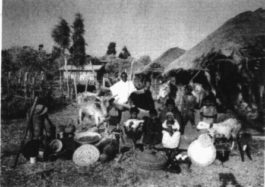
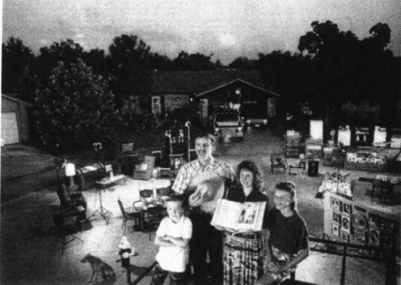
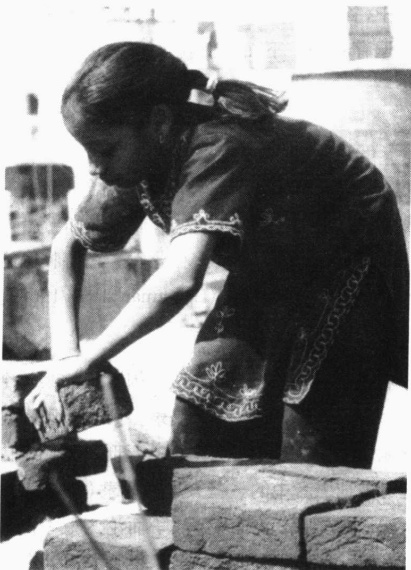
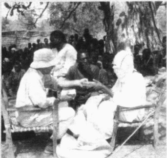
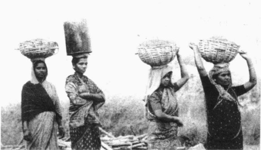
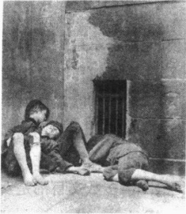
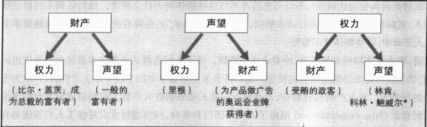
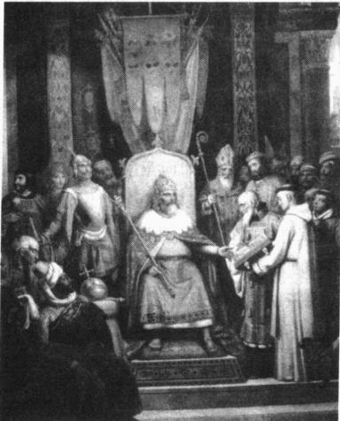
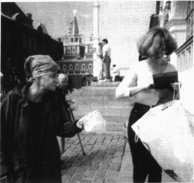
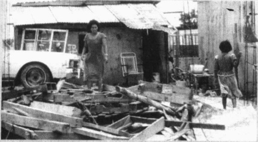

# 第 9 章 全球分层

弗朗西斯科·克莱门特《饥饿》(1980)

---

· 社会分层制度

奴隶制

种姓制

欧洲等级制

阶级制度

全球分层与女性的地位

· 什么决定社会阶级？

马克思：生产资料

韦伯：财产、声望和权力

·为什么社会分层普遍存在？

功能主义观点：激发能干的人

冲突论观点：阶级冲突和稀缺资源

伦斯基的综合观点

·精英如何维持分层？

意识形态与暴力

· 比较社会分层

英国的社会分层

### 前苏联的社会分层

· 全球分层: 三个世界工业化程度最高的国家正在进行工业化的国家工业化程度最低的国家修改模型

· 世界各国是如何层化的？

殖民主义

世界体系理论

贫困文化

理论评价

· 维持全球分层  

新殖民主义  

跨国公司  

技术与全球性统治

· 结束语

· 本章小结

---

### 第 9 章 全球分层

让我们先来对比一下世界范围内的三个“普通”家庭：

在埃塞俄比亚的农村地区，33岁的盖图·马勒塔和他28岁的妻子赞尼布·马勒塔为了养活自己和七个孩子不停地努力工作。他们住在一间96平米的泥坯小屋里，既没有电，也没有煤气和自来水。他们有一台收音机，但电池用完了。他们依靠种植一种名为埃塞俄比亚画眉草的谷物为生，一年收入130美元。

马勒塔一家之所以贫穷，并不是因为他们懒惰。盖图一周工作80个小时，赞尼布的工作时间则更长。赞尼布要做的家务活包括提水、用牛粪做燃料球以便生火做饭和清洁畜舍。同其他埃塞俄比亚妇女一样，赞尼布要在男人吃完之后方能吃饭。

在埃塞俄比亚,男性的平均预期寿命为48岁,女性为50岁。

### * * *

马勒塔一家最值钱的财产就是他们养的牛。他们对未来的期望是：更多的牲畜、更好的种子和一套新衣服。

在墨西哥的瓜达拉哈拉，安布罗西奥和卡曼·卡斯特罗·波德拉斯有五个年龄在2—10岁之间的孩子。他们一家七口生活在一所四居室的房子里，另有一个带围墙的庭院，一家人在庭院中度过了很多时光。他们甚至有一台洗衣机，洗衣机连在花园的水管上，而这一水管又与数百个庭院之外的自来水主管道相连接。同大多数墨西哥人一样，他们既没有电话，也没有汽车。

然而，同很多人不同的是，他们拥有一台冰箱、一台立体音响。而且最近他们还买了一台电视机，这足以令他们的邻居嫉妒。

29 岁的安布罗西奥是一名农产品批发商。业余时间他会做一些焊接工作。安布罗西奥一家的年收入为 3600 美元。他们将收入的 57% 用于购买食品。卡曼一周工作 60 个小时，主要负责照看孩子和打扫房间。他们家里的整洁和周围地区形成了鲜明的对照。周围马路上到处都是垃圾。与墨西哥许多其他居民区一样，这里的公共设施和道路清洁工作同样难以满足人们的需要。

在墨西哥，男性的平均预期寿命为70岁，女性为76岁。

卡斯特罗·波德拉斯一家最值钱的财产是他们的电冰箱和电视机。他们对未来的期望是：一台卡车。

### * * *

伊利诺伊州的斯普林菲尔德是凯利一家的家乡——里克36岁，帕提34岁，莱丽10岁，迈克尔7岁。凯利一家居住在面积为733平米的铺有地毯的房子里，共有四间卧室，两个独立浴室和一个附带式浴室。他们的房子带有壁炉、中央取暖设施、空调、地下室和一个可以停放两辆车的车库。家中配有冰箱、洗衣机、甩干机、洗碗机、垃圾处理器、吸尘器、食品加工机、微波炉、烤面包机。另外，他们还拥有三台收音机、一台CD播放器、五部电话（两部分机）、三台彩色电视机、一部家庭摄像机、

---

这些照片的题目可以定为“不同的世界”。它们表明生活机会依赖于全球分层。左边是开篇短文所描述的埃塞俄比亚的马勒塔一家，他们站在自家房子前，周围是他们所有的物质财产。右边则是得克萨斯州的史金一家，周围摆满了他们的财产。

录影机、DVD 播放机、录音机、几部游戏机、一台电脑、打印机、扫描仪，此外还有两部吹风机、一部答录机、一个搅拌机、一个电动开罐器、两把电动牙刷。这还没有将其敞篷小型载货卡车和汽车上的立体声环绕收音机 CD 播放机包括在内。

里克是一家电话公司的电缆接线工，一周工作40个小时。帕提是一名兼职教师。加上福利金，他们一年可以赚到50890美元。这里有几十家拥有大量存货的超级市场供凯利一家选择。他们在家吃饭花去4237美元，出去吃花去2875美元，合计起来仅占其年收入的14%。

在美国，男性的平均预期寿命为74岁，女性为80岁。

凯利一家的愿望是买一台新的 SUV（运动型多用途汽车）、一台 80 兆的电脑、液晶电视、数码摄像机、一艘小艇、一辆旅行房车、一台全地形汽车，对了，还有一栋远离马路的度假小屋。

资料来源：Menzel（1994）；Population Reference Bureau 1995；Statistical Abstract 2002；Table 91,651,657,922。

### 社会分层制度

世界上有些国家富有，有些国家贫穷，还有一些国家则处于中等水平。国家间的层化以及一国范围内各个群体间的层化被称为社会分层。这将是本书所讨论的最重要的主题之一，因为它影响到我们的生活机会——从我们所拥有的物质财产到我们的死亡年龄，无一不受社会分层的影响，这一点正如你在开篇短文中所看到的。

社会分层也影响到我们看待生活的方式。例如，如果你出生在开篇短文中所讲的埃塞俄比亚家庭中，你会是一个文盲，而且你对你孩子的期望也是如此。你会发现饥饿是生活的一部分。当人们过早死去时，你不会感到过分惊奇。然而，如果你出生于另外两个家庭中的任何一个，你会看到一个完全不同的世界。

社会分层（social stratification）是指一种按照人们相对的权力、财产和声望，将人群划分为不同层级的制度。认识到社会分层并非针对个人这一点十分重要。社会分层是在等级体系中对不同群体进行排列分类的方法，等级体系显示了他们相对的特权。

---

值得注意的是，每个社会中都存在社会分层。农业社会中，各个群体之间界限分明，而在狩猎采集社会中则更为平等。然而不论其形式如何，社会分层都是普遍存在的。下面我们就来看一下四种主要社会分层制度：奴隶制、种姓制、欧洲等级制、阶级制度。

### 奴隶制

奴隶制（slavery）在世界历史中十分普遍，其基本特征是一些人归属于另一些人。《旧约全书》中甚至列出了主人对待奴隶的规则。《古兰经》中也有类似的内容。罗马人曾经有过奴隶，非洲人和希腊人也曾有过。在古希腊和古罗马，奴隶们负责工作，市民们因而可以自由地从事政治和艺术。在游牧民族中，尤其是在狩猎采集社会中，奴隶制很少见。而在农业社会中奴隶制却很普遍（Landtman，1938/1968）。在我们考察奴隶制的主要原因及其状况时，你会发现世界各地的奴隶制有很大差异。

奴隶制的起因 与通常看法不同，奴隶制并非总是基于种族主义，而是以另外三个因素中的某一个为基础。第一个因素是债务。在一些社会，债权人可以令无力偿还债务的人成为奴隶。第二个因素是犯罪。杀人犯或盗贼可以通过给受害者家庭做奴隶来赔偿他们的损失，而无须被处以死刑。第三个因素是战争和征服。当一群人征服另一群人时，他们经常会逼迫被征服者中的一些人成为奴隶（Starna and Watkins，1991）。历史学家格尔达·勒纳（Gerda Lerner，1986）曾提到第一批因为战争而沦为奴隶的人是女性。当部落中的男人们袭击一个村落或营地时，他们往往会杀死男性，强奸女性，然后将女性带回去做奴隶。由于女性能够满足性需要并具有生育能力和劳动能力，因此她们得到了重视。

大约 2500 年以前，希腊是一个城邦联合体。当时，奴隶制相当普遍。一个强大的并且征服了另一个城邦的城邦，会逼迫某些被征服者成为奴隶。奴隶、奴隶主都是希腊人。同样地，在 2000 年前，当罗马成为最高权力中心时，罗马人驱使一些被征服的希腊人成为他们的奴隶。由于希腊人比罗马人受过更多的教育，因此，一些奴隶成为罗马人家中的家庭教师。奴隶身份是负债、犯罪和在战斗中战败的标志，但它并不表明奴隶天生就是劣等的。

奴隶制的状况 奴隶制的状况在世界各地有很大的差异。某些情形下，奴隶身份是暂时的。古代以色列的奴隶可以在每50年一次的大赦年中获得自由。古罗马的奴隶通常有权为自己赎身。他们知道自己的赎身费用是多少，而且有些人能够通过与主人达成协议并向其他人出售服务来挣足这一费用。然而，大多数情况下，奴隶身份都是终生不变的。例如，一些罪犯被判处终生在古罗马战舰上充当桨手。作为奴隶，他们要一直服务到死——事实上他们也常常由于劳累过度而过早死亡。

奴隶身份并不一定是代代相传。在大多数地方，奴隶的孩子都会自动成为奴隶。但是也有例外。服务于某一富裕家庭的奴隶，他的孩子可能会被这一家庭收养并获得这一家庭的姓氏，这样一来，这个孩子就可以与这一家中的其他儿女一起成为继承人之一。在古代墨西哥，奴隶的孩子总是自由的(Landtman, 1938/1968: 271)。

奴隶并不一定是无权力的、贫穷的。虽然几乎在所有的情形下，奴隶们都既没有财产也没有权力。但是在一些群体中，奴隶们可以积聚财产，甚至可以在社区中获得较高的地位。有时，一个奴隶甚至会变得相当富有，并且借钱给他的主人。而且在他仍是一个奴隶时，他可以拥有自己的奴隶(Landtman，1938/1968)。但是，这种现象很少见。

---

我在印度做研究时采访了这位8岁的女孩。Mahashury是一个负债劳力。她的父母以她作为抵押借了2000卢比（大约合14美元）。Mahashury必须作一年的建筑工。她的酬劳是：一天一顿饭，一年一套衣服。由于这一延续了数百年的做法现在是非法的，因此，她的主人贿赂了印度的官员。这些官员会告知他，他们何时去检查。到时，他会把他的负债劳力藏起来。由于我去建筑工地的那天Mahashury的主人不在，因此，我能够采访她并为她拍照。

新大陆的奴隶制 契约和奴隶制之间的灰色地带是抵债劳动(bonded labor)，又称契约服务(indentured service)。当时，很多人想在美洲殖民地开始新生活，但他们没有能力支付自己的路费。船长们便会允许他们赊账乘船。当他们到达目的地，殖民者会与他们签订合同“购买他们的证件”。这种方式为那些身无分文的人开启了通往新生活的道路，为船长支付了路费，为富有的殖民者提供了几年的奴仆。如果他们逃跑，他们会沦为罪犯，遭到逮捕并被遣返回去。在合同期满后，他们将成为正式公民，可以自己选择居住地点，自由出卖劳动力(Main, 1965; Elkins, 1968)。

当没有足够的合同奴仆来满足不断增长的劳动力需求时，殖民者便想尽千方百计奴役美洲土著人。然而，这种尝试最终遭致惨败。原因之一在于，美洲土著人逃跑时知道如何在野外生存，并能顺利回到自己的部落。之后，殖民者将注意力转向非洲人。他们被荷兰人、英国人、葡萄牙人、西班牙人带到了北美洲和南美洲。

因为奴隶制的起因十分广泛，所以一些分析家得出结论说，种族主义不会导致奴隶制，但是奴隶制却会导致种族主义。使人们成为终生的奴隶是有利可图的，因此美国的奴隶主提出了一种证明这种社会安排合理性的意识形态或信条。这一意识形态使得当时的社会安排看上去是不可避免的、必要的、公正的。殖民者提出了“奴隶们是劣等的”这一观点。一些人甚至说他们不

是完全的人类。简言之，在假定自己的群体具有优越性的基础上，殖民者为奴隶制提出了一系列详尽的正当理由。

为了使奴隶制更加有利可图，允许奴隶制存在的州政府，通过法律使奴隶身份具有了传承性；这也就是说，奴隶的孩子们也会成为奴隶主的财产。这些孩子可以被出售，也可以用于交换货物或用于贸易。为了加强控制，这些州政府又通过法律规定：奴隶们集会或擅自离开主人的土地均为违法行为（Lerner，1972）。正如社会学家杜波依斯（Du Bois，1935/1966：12）所讲：“逐渐地，整个南部地区成为了一个武装阵营，他们将黑人控制在奴隶制中，并杀死黑人反抗者。”

内战之后，合法歧视并未结束。例如，直到1954年，美国还在实行两种分离的学校体系。即使到了20世纪50年代，密西西比地区为了防止种族“混淆”，仍规定非裔美国人与白人一起乘坐汽车上的同一座位是违法的。之所以没有彻底禁止黑人和白人同乘一辆汽车，是因为考虑到那些非裔司机。

---

今天的奴隶制 现如今，在苏丹、毛利塔尼亚和非洲的象牙海岸，奴隶制又一次露出了它的丑恶嘴脸（Tandia，2001；Bales，2002；Del Castillo，2002）。在这一地区，奴隶制有着很长的历史。在毛利塔尼亚，奴隶制直到1980年才被正式废除，苏丹则直到1987年才正式废除奴隶制（Ayittey，1998）。虽然官方已经废除了奴隶制，但奴隶制仍然存在。下面这一“社会生活中的大众媒体”专栏的主题，便是苏丹丁卡部落的成员沦为奴隶的故事。

### 社会生活中的大众媒体

### 自由的价值是什么？今天的奴隶制

苏丹农村地区的丁卡部落的孩子们不去上学。他们从事劳作。他们的家庭依靠他们照顾那些对其生活具有重要意义的家畜。

照片中，“利亚森代理网”的一位代表(位于左边)正在赎买苏丹奴隶的自由(背景中的那些人)。

在遭受突袭的那天早上，

10岁的Adhieu一直在照看家畜。“我们很快就要离开家畜棚，回家见父母，因此我们很高兴。但是那天早上，这里发生了枪击，到处都是哭喊声。我叔叔紧紧抓住我的手，我们跑开了。之后我们游过了河。我看到一些孩子溺水。我们躲在岩石后面。”

直到接近中午，共有500个孩子死去或沦为奴隶。袭击者是他们的同胞——苏丹南部的阿拉伯人。不幸被抓住的孩子们，被迫向北行进了数百英里。一些人在路上成功地逃脱出来。另一些人则在试图逃脱时被击毙(Akol,1998)。

自从20世纪80年代苏丹内战爆发以来，成千上万的丁卡人被杀害或沦为奴隶。然而，由阿拉伯人领导的政府组织——国家伊斯兰阵线——却坚称奴隶制并不存在。它声称，这是外国政客、基督教人道主义者和敌对的外国媒体捏造出来的（Akol，1998）。但是目击者和人权团体的证明文件越来越多。另外还有记者们的大量记述：公共广播公司（PBS）甚至曾拍到过被抓的孩子做奴隶的镜头。而且有些奴隶成功逃脱后，极其详尽

地叙述了他们所遭受的折磨（Dottridge, 2001; Salopek, 2003）。

美国曾因科索沃侵犯人权而向其投放炸弹迫使其屈服，然而面对此等暴行，美国却保持沉默。愤世嫉俗者或许会说，那是因为科索沃位于欧洲政治战略要地，而苏丹则地处美国和欧洲强国都不感兴趣的非洲。他们还会补充道，这些强国害怕阿拉伯人采取石油禁运和恐怖主义进行报复，所以对阿拉伯人的暴行置之不理。另外愤世嫉俗者认为，对于这些强国来说，针对非洲黑人的暴行不如针对欧洲白人的暴行重要。最后，他们可能还会补充道，当苏丹地下的石油更加重要时，这种状况会有所改变。

全球最强大的政府对苏丹发生的暴行缺乏回应，个人团体对此极为反感，因此他们便介入进来。以瑞士苏黎世为基地的国际基督徒联合会（CSI）采用了一种有争议的方法。阿拉伯的“奴隶贩子”去苏丹北部购买或绑架奴隶，他们白天藏起来，晚上四处活动。他们要躲避安全部队，将奴隶带往南部。在那里，国际基督徒联合会以每个奴隶50美元的价格从“奴隶贩子”手中将他们赎回（Mabry，1999）。

哥伦比亚广播公司的新闻摄像机曾拍到过援

---

救者支付给奴隶贸易商5万苏丹镑的镜头。按每人50镑计算，这些钱足以使1000名奴隶重获自由。重获自由的奴隶大多是妇女和孩子。获救后他们会返回村子。(Jacobs,1999)

批评者声称：即使是为了解放奴隶而购买奴隶，也会助长奴隶制。钱使奴隶贩子把人变为奴隶，并转手卖掉。50镑在苏丹是很大的一笔钱。苏丹的年人均收入仅为1520镑(Haub,2002)。而且50镑可以买到2只或3只山羊(Gaviak,2000)。

国际基督徒联合会则认为这种观点是伪论点。将女人和孩子丢在奴隶制下并剥夺他们的自由和家庭，任由他们遭受野蛮主人的侮辱、欺凌，才是不可容忍的。

国际基督徒联合会发表声明称，他们已经使4万名奴隶获得了自由(Dottridge,2001)。没有人知道还有多少人身陷奴隶制之中。

#### 思考题

你如何看待赎买奴隶的自由这一做法？你能否提出一种行之有效的解决方法？为什么美国可以因为人权问题而侵犯其他国家，却长期对此不闻不问？你认为，美国插手海地、科索沃等国的事务是否出于政治目的，而和所谓的人权无关？如果不是这样，为什么美国在面对奴隶制时始终保持沉默？

由于媒体对这一问题作了大量报道，因此很多美国人都积极地参与解放奴隶活动。中学甚至小学都在为赎买奴隶计划筹集资金(Schaefer,1999)。如果你是一位学校校长，你是否会鼓励这种做法？为什么？

### 种姓制

第二种社会分层制度是种姓制(或称卡斯特制)。在种姓制(caste system)中，地位由出身决定，而且终生不变。不论他们一生作出了多么大的成就，他们都无法改变自己的地位。出生于低等群体的人们，将永远处于低等地位。运用社会学术语来讲，种姓制的基础是先赋地位。自致地位无法改变一个人在等级体系中的位置。

采用这一分层形式的社会，千方百计想要稳固各个等级之间的界限。他们实行内婚制（endogamy），即在本群体内婚配，禁止族间通婚。为了减少等级间的联系，他们甚至制定了关于仪式玷污的详细规则，教导人们：同较低等级间的联系会玷污特权等级。

印度的宗教种姓制度是典型的种姓等级社会。它的等级划分不是以种族为基础，而是以宗教为基础，其等级体系存在了大约3000年（Chandra，1993；Guru and Sidhva，2001）。表9.1中列出了印度的四个主要种姓。这四个种姓又可进一步划分为2000个次种姓或迦提（jati）。每个次种姓从事一种职业。例如，一个次种姓洗衣服，另一个专职磨刀，还有一个负责修鞋。

表 9.1 印度的种姓制

<table border=1 style='margin: auto; word-wrap: break-word;'><tr><td style='text-align: center; word-wrap: break-word;'>种姓</td><td style='text-align: center; word-wrap: break-word;'>职业</td></tr><tr><td style='text-align: center; word-wrap: break-word;'>婆罗门</td><td style='text-align: center; word-wrap: break-word;'>教士和老师</td></tr><tr><td style='text-align: center; word-wrap: break-word;'>刹帝利</td><td style='text-align: center; word-wrap: break-word;'>统治者和士兵</td></tr><tr><td style='text-align: center; word-wrap: break-word;'>吠舍</td><td style='text-align: center; word-wrap: break-word;'>商人与小贩</td></tr><tr><td style='text-align: center; word-wrap: break-word;'>首陀罗</td><td style='text-align: center; word-wrap: break-word;'>农民和体力劳动者</td></tr><tr><td style='text-align: center; word-wrap: break-word;'>贱民(不可接触者)</td><td style='text-align: center; word-wrap: break-word;'>被剥夺种姓者；从事不体面或肮脏劳动的人</td></tr></table>

---

表9.1中列出的最下等的群体是贱民，他们构成了印度的“不可接触者”。如果贱民碰触了某个处于较高等级的人，被碰触者就会变得不洁。即使是贱民的影子也会将其玷污。清晨和傍晚尤其危险，因为这两个时期的影子更长，这威胁到了每一个处于较高等级的人。因此，一些村庄不允许贱民在清晨和傍晚进入。被玷污的人为了恢复洁净，必须接受斋戒沐浴(Lannoy，1975)。

虽然印度政府在 1949 年正式废除了种姓制，但是延续了数百年的习俗不会如此轻易地被消除，种姓制仍然是印度日常生活的一部分。例如，人们在出生、结婚及死亡时所遵循

在种姓制中，地位是由出身决定的而且终生不变。这些女性一出生就成为了较低等级中的一员，而且由于性别原因，她们在等级制中的位置也已预先决定了。我为她们拍照时，她们正往一幢正在修建的房子的二楼上运送沙子。这幢房子位于印度的安得拉邦。

的仪式都是根据种姓制规定的(Chandra,1993)。上层等级惧怕贱民向上流动，他们厌恶贱民。有时，他们甚至会采用暴力手段和仪式性自杀来阻止此类现象的发生(Cronsette,1996; Filkins,1997; Deliege,2001)。

一位贱民这样总结了他的生活处境：

在茶摊上，我们用另外那些破损的肮脏的杯子喝水。因为村里人不允许我们使用村里上层等级使用的水龙头，所以我们不得不步行15分钟去别处挑水。我们被禁止进入寺庙。去上学时，我的朋友和我被迫坐在教室外面。上层等级的孩子们甚至不允许我们碰触他们玩的足球。没办法，我们只能玩石头。（Guru and Sidhva，2001）

南非 直到最近，南非还保留着以种姓制为基础的社会分层制度。荷兰血统的欧洲人是一个被称为南非荷兰人的少数派群体，但是他们控制着政府、警察和军队。他们运用这些权力机构来加强种族隔离制（apartheid）。依据法律，每个人都被划归为以下四类群体中的一类：欧洲人（白人）、非洲人（黑人）、有色人种（混合种族）、亚洲人。这一分类决定了人们生活、工作、学习的地点。它同样决定了人们游泳、看电影的场所，因为法律禁止白人和其他人种交往。

经受了多年的贸易制裁、运动会联合抵制以及其他压力，南非白人不情愿地废除了其等级制度。非洲黑人无须再走特别通道，公共设施合为一体，所有种族、民族都享有选举权和被选举权。虽然种族隔离政策已被取消，但它仍在困扰着南非。白人仍然控制着这个国家的社会机构，大多数黑人得不到教育，依然处于贫困之中。由于人们无力负担，因此许多新的权利，如接受高等教育的权利、在饭店就餐的权利、看医生的权利等等，对他们来说毫无用处。政治暴力被旧式的犯罪所取代。南非的谋杀率是世界上最高的，比美国超常的谋杀率还要高上9倍（“South African…”2001）。种族隔离带来的偏见、苦涩和仇恨，还将在很长时间内加剧种族间的紧张关系。

美国的种族等级制 在结束种姓制的话题之前，我们来讨论一下美国奴隶制度终结之后，取而代之的种族等级制。在种族等级制下，每个人自出生之日起便被打上了标记(Berger,1963/2003)。所有白人，

---

即使是贫穷的未受过教育的白人，也认为自己的地位高于所有非裔美国人。同在印度和南非一样，上层等级害怕受到下层等级的玷污，因此他们禁止不同等级间通婚，并坚持将学校、旅馆、饭店甚至厕所、饮水器等公共设施分开使用。在南部的人行道上，白人碰到非裔美国人时，非裔美国人不得不给他们让路——印度的贱民在碰到较高等级的人时也必须这样做（Deliege，2001）。

### 欧洲等级制

中世纪，欧洲形成了封建身份等级制度（estate stratification system），共有3个集团或等级。第一等级由贵族、富有的家庭构成，国家由他们统治。他们拥有当时的财富之源——土地。贵族无须亲自耕作或从事任何劳动。劳作被认为是仆人的事情，有损贵族的尊严。贵族负责管理自己的土地，他们过着与其地位相符的高雅生活。

第二等级由牧师组成。罗马天主教会在当时是一股强大的政治势力。它拥有大量的土地，并向生活在教区范围内的人们征收赋税。教会的权力如此之大，以至于国王加冕都必须得到罗马教皇的许可。

为了防止广阔的土地被分割成小块，贵族实行长子继承制，只允许长子继承土地。其他儿子要自己谋生——加入牧师行列是一个很好的选择(其他选择包括在军队中任职或是开业当律师)。神职之所以吸引人，是因为牧师是终生职业，而且可以过着有保障的舒适生活。那时，教会出售职位，富有者可以购买主教的职位以确保获得高收入。

第三等级由平民组成。他们又被称为农奴，他们是依附于土地的。如果某人购买或继承了土地，农奴就会随土地所有权的变动更换主人。农奴生来就处于第三等级，死时也依然如此。只有因在战役中的英勇表现而被授予爵位的人，或被“召入”教会从事宗教天职的人，才能脱离第三等级。

欧洲等级制中的女性 女性附属于她们丈夫的等级。位于第一等级的女性没有工作，因为她们和她们的丈夫一样，也认为工作有损尊严。她们负责料理家务、监管仆人。因为罗马天主教的牧师不结婚，所以女性不会属于第二等级。第三等级的女性同她们的丈夫一起过着艰苦的生活，她们也要从事体力劳动，也要忍饥挨饿。另外，她们还要面对遭受第一等级的男性奸污的危险。引起第一等级男性注意的少数平民女性，确实会成为他们的妻子并加入第一等级，但这很少见。

### 阶级制度

正如我们所见到的，建立在奴隶制、种姓制和欧洲等级制基础上的社会分层制度是僵化的。人们之间的界限明确稳固，很少有或几乎没有群体间的流动。阶级制度（class system）则与之相反。它更为开放，这是因为它主要以可获得的金钱或物质财产为基础。人在出生时被划归于父母所处的地位，但同其他分层制度不同的是，人们能够通过他们生活中所获得的（或是未能获得的）财产改变自己的社会阶级。另外，法律没有规定人们的职业是由出身决定的，也没有禁止各个阶级之间通婚。

阶级制度的主要特征之一是它相对灵活的界限。阶级制度允许社会流动(social mobility)，即人们在阶级阶梯中向上或向下的运动。由于存在着改善个人生活和阶级地位下降的可能性，因此人们去上学并努力工作。在极端的情形下，一个孩子出生时所继承的家庭背景，既可能会成为他(她)向上爬的障碍，也可能会成为防止其阶级地位下降的特权。

---

### 全球分层与女性的地位

在全世界的每个社会中，社会性别都是社会分层的一个基础。在任何社会，性别都不是对人们进行分层的唯一基础，但性别却跨越了所有社会分层制度——奴隶制、种姓制、欧洲等级制和阶级制度（Huber，1990）。在所有体系中，基于性别，人们被划分为不同的种类，而且不同种类的人们获取社会中可供利用的重要物品的途径也不相同。

很明显，这些划分总是有利于男性的。例如，世界上每个社会中男性的收入都明显高于女性。在女性的阴蒂割礼中，男性的支配地位表现得更加显著(参见第11章的专栏)。世界上大多数文盲都是女性，这充分说明了女性的相对地位。在不识字的数亿成人中，大约60%是女性(“Fighting Illiteracy …”2000)。由于性别在我们的生活中如此重要，本书将列出单独一章(第11章)讨论这个话题。

### 什么决定社会阶级？

在社会学发展早期阶段，人们对社会阶级的含义有着不同的认识。下面我们来比较一下马克思和韦伯的观点。

### 马克思：生产资料

正如第1章所讨论的，马克思目睹了社会剧变的影响。封建制度瓦解时，大量的农民脱离了传统的土地和职业。他们逃亡到城市，为了获得那并不多的工作机会而相互竞争。他们的劳动只获取了微薄的工资，他们穿着破烂，忍饥挨饿，睡在桥下和简陋的小屋里。与此形成对照的是那些工厂主们。他们修建宅邸，雇佣工人，生活极尽奢侈。看到了工厂主和工人之间巨大的不平等，马克思得出结论说，社会阶级是由唯一的因素——生产资料，即工具、工厂、土地，以及用于创造财富的投资资金——决定的（Marx，1844/1964；Marx and Engels，1848/1967）。

马克思认为人们之间的差别——诸如穿着、言语、教育、收入或是今天人们开的汽车——都是表面现象。这些东西将真正重要的唯一的分界线掩饰了起来。马克思说，仅存在两个阶级：即拥有生产资料的资产阶级和为雇主工作的无产阶级。简言之，人们同生产资料的关系决定了他们的社会阶级地位。

马克思也分析了其他群体：农场主和农民；流氓无产者（边缘人如乞丐、流浪者、罪犯）；处于中间位置的自雇职业者。然而，因为他们缺乏阶级意识（class consciousness，指基于在生产资料所有制中所处的位置而形成的共同具有的认同感），所以马克思并不将这些群体视为社会阶级。他们认识不到自己是被剥削的工人，其困境可以通过集体行动来解决。因此，马克思认为，在即将到来的注定会推翻资本主义制度的工人革命中，这些群体并不重要。

马克思说，资本家变得越来越富有，冲突也日益升级。当工人们逐渐认识到资本家是他们受压迫的根源时，他们就会联合起来挣脱压迫者的锁链。他们将会采用流血革命的手段夺取生产资料，并成为无产阶级社会的引领者。在无产阶级社会中，不会再有少数人依靠牺牲大多数人的利益变得富有的事情发生。但虚假意识（false consciousness）阻碍了工人的团结和革命，所谓虚假意识是指工人们错误地将自己视为资本家。例如，在银行里有存款的工人会忘记自己的工人身份，将自己看做投资者，或是即将开始成功生意的资本家。

---

这两幅照片拍摄于19世纪末期。它们描绘了资本主义所导致的反差极大的社会阶级世界。雅各布·里斯于1890年拍摄了这幅经典照片，其中那些熟睡的男孩靠在伦敦街头卖报纸为生。他们不仅无学可上，而且无家可归。右边照片中的是科尼利厄斯·范德比尔特和格拉迪丝·范德比尔特，他们站在父母的庄园前。他们不仅有学可上，而且无需工作。你可以看到，这两幅照片所反映的生活情境是如何导致不同的生活取向的——从而导致不同的政治观、婚姻观、价值观等等——即构成生活的一切要素。

因此，值得提及的唯一区别是：一个人究竟是所有者还是工人。这一点决定了其它的一切。马克思强调，财产决定了人们的生活方式，影响了人们的观念，确立了他们彼此之间的关系。

### 韦伯：财产、声望和权力

韦伯是一位直言不讳的马克思批评家。韦伯辩论道，财产仅是阶级的一部分。他说，社会阶级是由财产、声望、权力这三个组成部分构成的（Gerth and Mills，1958；Weter，1922/1968）。有人将其称为社会阶级的3P。[虽然韦伯使用的术语是阶级（class）、地位（status）和权力（power），但一些社会学家认为财产（property）、声望（prestige）和权力（power）三个术语要更清楚明确。为了使之更加清楚，你可能想用财富（wealth）代替财产。]

韦伯认为，财产(财富)在决定个人的社会地位方面十分重要。在这一点上，他与马克思的观点一致。但是韦伯补充道，所有权并不是财产唯一重要的方面。例如，虽然一些有权势的人(如公司经理)并不拥有生产资料，但他们却控制着生产资料。如果经理能够大肆利用财产为自己谋利益——如奖给自己大量奖金和额外津贴，那么他们是否拥有那些财产，实际上无关紧要。

声望，韦伯分析中的第二个因素，经常源于财产，因为人们往往钦佩富有者。然而，声望也可能建立在其他因素之上。例如，奥运会冠军虽然可能没有财产，但是他们拥有较高的声望。一些人甚至会利用声望来换取财产——那些在广告中宣称自己的辉煌开始于“冠军的早餐”的人就获取了一小笔财富。换

图 9.1 韦伯关于社会阶级的三个组成部分：相互之间的联系

 $ ^{*} $科林·鲍威尔的例子表明了这些组成部分间的转换关系。鲍威尔作为参谋长联席会议主席所具有的权力给他带来了声望。反过来，当退役在家的他在乔治·布什的政府中担任国务卿一职时，他的声望又转化为了权力。

---

一句话说，财产和声望之间并不是单向的关系：不仅财产能够带来声望，声望同样能带来财产。

权力，社会阶级的第三个因素，是指控制其他人甚至是其反对者的能力。韦伯与马克思一样，认为财产是权力的主要来源之一，但是他补充说：财产并不是权力的唯一来源。例如，声望能够转化为权力。最恰当的例子便是里根，他曾是一位演员，但是后来他成为了世界上最强大国家的总统。图9.1说明了财产、声望、权力之间的相互关联。

### ▷▷小结

马克思认为，社会阶级建立在个人同生产资料的关系这一基础之上。一个人要么是资产阶级中的一员，要么是无产阶级中的一员。韦伯则辩称：社会阶级是财产、声望和权力的结合体。

### 为什么社会分层普遍存在？

社会生活中是什么使得所有的社会阶层化？下面我们首先看一下功能主义者提出的解释，他们的解释在社会学界引起了太多的争议。然后我们再看一下冲突学派的解释。

### 功能主义观点：激发能干的人

功能主义者认为，一个社会中之所以存在某些独具特色的行为模式，是因为它们对于这个社会来说是有功能的。因为社会不平等普遍存在，所以不平等必定有助于维持社会系统。但是，具体如何解释呢？

戴维斯和穆尔的解释 两位功能主义者戴维斯和穆尔(Davis and Moore, 1945, 1953)试图解决这一问题。他们得出结论说，社会分层之所以不可避免是因为：

1. 社会必须确保某些职位有人承担；

2. 某些职位比其他职位更加重要；

3. 更为重要的职位必须由更能干的人选来承担；

4. 为了激励更能干的人去承担职位，社会必须为他们提供更多的报酬。

下面我们看两个例子，以便进一步理解功能主义的论点。大学校长的职位比学生的职位更加重要，这是因为校长的决定会影响更多的人。他(她)所犯的错误会牵连很多人，包括许多学生。这一对比同样适用于军队中的将军和士兵。将军的决定影响到职业和薪水，甚至决定着生死。

担任重要的职位，就需要担负更大的责任。大学校长和军队中的将军都要对他们的行为表现负责——校长要对董事会负责，将军则要对国家领导人负责。社会如何才能激励具有较高资历的人去承担高压力的职位呢？什么才能防止人们逃避高压力的职位寻找低要求的工作呢？

戴维斯和穆尔的答案是：社会会为要求更高、责任更重的职位提供更多的报酬。如果这些工作无法提供更高的声望、薪金和利益，人们为什么还要竭力去争取它们呢？因此，为了吸引最能干的人相互竞争这些职位，年薪200万、乡间俱乐部的成员资格、私人喷气机、有司机的豪华高级轿车等都是必需的。而没有额外福利金的区区3万美元的薪金，就足以吸引数百名低资历的人去争夺那些低要求的职位。需要严格培训的职业也是如此。如果你能得到与高中文凭相对应的工资，你为什么还要接受大学所需

---

要的大量测验？为什么还要写那些学期论文呢？

功能主义的观点简单明了。如果最能干的人占据着最重要的职位，社会将会运转得更好。例如，有才能的人要成为外科医生——必须接受多年的艰苦培训，之后要每日处理生死攸关的情境，同时还要承受所谓的达摩克利斯之剑（Sword of Damocles），即因医疗事故而被起诉——所以社会必须为他们提供高薪。

图明对戴维斯和穆尔的批评 戴维斯和穆尔力图解释社会分层普遍存在的原因，而不是要证明社会不平等的合理性。但是，他们的观点使许多社会学家感到很不舒服，因为他们认为这近似于为社会不平等进行辩护。

梅尔文·图明(Tumin,1953)是第一位指出功能主义观点主要缺陷的社会学家。下面介绍他的三个论点。

第一,功能主义者说,承担最重要的职位能够得到更高的报酬。但是,我们怎么知道具有最高报酬的职位就是最重要的呢?例如,外科医生的收入比清洁工高很多,但这并不意味着清洁工对社会不太重要,因为他们有助于防止传染性疾病的发生。我们需要用各种相互独立的方法测量职位的重要性,但我们却没这样去做。

第二，如果分层真像戴维斯和穆尔所描述的那样运作的话，那么社会实行的将是一种任人唯贤的制度；也就是说，所有的职位都是基于人们的实际能力进行分配的。但是，事实如何呢？例如，能力不是决定谁能上大学的最佳预测依据，收入才是：一个家庭的收入越多，他们的孩子就越有可能去上大学。这不是实际才能，而是构建于社会中的不平等。社会中一些人继承了财产和与之相伴随的机会——这与才能毫不相干。最后，我们谈一下性别。假如一个分层体系将多数男性置于多数女性之上，那么它与才能、能力是承担重要职位的基础这一论点就不相符。简言之，人们在社会中承担职位，并不仅仅是因为他们的才能，而是还有许多其他原因。

第三，如果社会分层是功能性的，那么它应该有益于每一个人。然而，社会分层对许多人来说都具有反功能。试想一下，如果他们不是出生于贫民窟，也没有为了养家糊口而被迫辍学去从事低下的工作，他们完全有可能成为对社会作出巨大贡献的人。还有很多人就因生为女性，被分配作了“女人的工作”，而无法最大限度地发挥其思维能力。

### 冲突论观点：阶级冲突和稀缺资源

冲突理论家并没有批评功能主义者观点中的细节。他们抨击了其基本前提。他们强调，冲突，而不是功能，才是社会分层存在的原因。在每个社会中，各个群体为了获取更大份额的社会资源相互之间不断斗争。当一个群体获得权力时，它就会利用权力来榨取下层群体的资源。精英群体也会利用社会制度来保持自己的权力。

莫斯卡的论点 意大利社会学家加埃塔诺·莫斯卡(Gaetano Mosca)认为每个社会都会进行权力分层。他在其1896年出版的《统治阶级》(The Ruling Class)一书中探讨了这一现象必然存在的原因：

1. 除非社会是有组织、有系统的，否则它不会存在。为了协调人们的行动，保证社会正常运转，需要某种领导。

---

2. 领导(或政治组织)就意味着权力的不平等。一些人占据着领导地位，另一些人只能服从领导。

3. 人类的本性是以自我为中心。因此，拥有权力的人往往会利用其职位为自己谋取更多的报酬。

莫斯卡补充道，这些生活事实是必然存在的。它们使得社会分层不可避免，而且每个社会都会以权力为轴线进行分层。

马克思的论点 如果马克思在世时听到功能主义者的观点，他应该会相当气愤。马克思认为，某些人拥有权力并不是因为他们具有超凡的才能。而这一点恰恰是功能主义者力图使我们相信的。功能主义者的观点仅仅是精英人士用于证明他们处于社会顶层具有合理性的意识形态——同时也是为了诱使被压迫者相信他们的福利需要依靠社会稳定。人类历史是阶级斗争的历史，是掌权者利用社会资源为自己谋取利益压迫社会下层人士的历史——同时也是被压迫集团推翻掌权者统治的历史。

马克思预言工人必会反抗。他说，一旦阶级意识战胜蒙蔽工人的意识形态，工人反抗的这一天就会到来。工人们一旦认识到他们共同受到的压迫，他们就会联合起来反抗资本家。开始时，夺取生产资料控制权的斗争是秘密进行的，主要采取消极怠工或蓄意破坏工业生产的手段。然而，抵抗最终将会公开爆发。但革命并不容易，因为资产阶级控制着警察、军队甚至教育，而且他们还利用教育向工人阶级的孩子灌输虚假的阶级意识。

冲突理论的当代应用 就像马克思重点分析非常重要的历史事件——资本、权力的积累以及劳动者与资本家之间的斗争一样，当代的一些冲突学派社会学家也在做着同样的事情。他们的关注点集中于当代资本主义在全球范围内的成功(Sklair,2000)。他们分析了如下内容：运用武装力量维护资本主义国家的统治地位；伴随着资本由工业化程度最高的国家向工业化程度最低的国家转移，工人阶级所遭受的剥削。

与此相反，另一些冲突学派的社会学家则考察在任一方发生的冲突，而非仅仅局限于资本家和工人之间的冲突。他们会考察同一阶级内的群体为了获取更大的利益相互之间如何竞争(Schellenberg，1996；Collins，1988，1999)。例如，即使在同一产业内部，工会为了获得更高的工资、更多的权力及缩短工作时间，相互之间也会发生冲突。这些学者尤其关注种族—民族群体间在教育、住房、声望，以及社会所能提供的任何利益上，因为相互竞争而发生的冲突。冲突学者的另一个关注点是女性与男性之间的关系。他们认为，两性之间的关系最能体现权力冲突——获得社会资源的途径及对社会资源的控制。与功能主义者不同，冲突学派的理论家坚信，在看似平静的社会表面之下隐藏着几乎无法控制的冲突。

### 伦斯基的综合观点

正如你所看到的，功能主义者和冲突学派理论家之间有着很大的分歧。整合他们的观点是否可能呢？社会学家格哈德·伦斯基（Lenski，1966）认为，整合这两种观点是可能的。他提出，剩余产品是关键。伦斯基说，在狩猎采集社会等无法生产剩余产品的社会中，功能主义者的观点是正确的。这些社会将更大份额的资源给予了那些承担重要工作的人，诸如在战争中冒着生命危险的战士。伦斯基认为，在能够积累剩余产品的社会中，情形就不同了。在这些社会中，各个群体间为了剩余产品而斗争，获胜的群体成为精英。统治自上而下，上层群体控制着下层群体。因此，在其形成的社会分层制度中，个人才能并不重要，真正重要的是你出生于社会中的哪个群体。

---

### 精英如何维持分层？

假设你是你所在社会统治精英中的一员，为了确保自己的特权地位不会丧失，你会做些什么？关键在于控制思想和信息，而所有手段中效果最差的就是使用暴力。

### 意识形态与暴力

中世纪的欧洲是运用意识形态力量的最好例子。在我们讨论过的欧洲等级制中，土地是财富的主要来源——只有贵族和教会才能拥有土地。几乎每个人都是平民(或农奴)，他们都要为有权势的土地所有者工作。农奴们耕种土地，照料牲畜，建造道路、桥梁。他们每年都必须上缴规定份额的农作物给他们的封建领主。他们这样作了数个世纪。为什么如此呢？

控制思想为什么农奴们不起来反抗，自己接管土地呢？原因有很多。其中重要的一条便是贵族、教会控制着军队。然而，强制只能到此为止，因为它孕育着敌对，滋养着反抗。促使大众自愿做统治精英所希望的事情的，是一个更加有效的统治手段，即意识形态(证明事物存在合理性的信条)在发挥功效。贵族、牧师最大限度地利用了它。他们提出君权神授(divine right of kings)的思想，即国王的权威直接来自于上帝这一观念。国王将权威授予贵族，他们作为上帝的代表必须得到服从。不服从便犯了违抗

君权神授的思想使得国王成为上帝在尘世的直接代表——使得国王有权执行审判、惩罚为恶者。这一神学的政治观点得到了罗马天主教会的支持，为国王进行加冕的便是教会的代表。本图描绘的是创立了神圣罗马帝国的查理曼大帝的加冕仪式，为其加冕的是教皇利奥三世。这幅画是由琼·维克托·施尼茨（1787—1870）创作的。

上帝之罪；反抗则意味着在世时要接受肉体的惩罚，死后则要在地狱中承受永久的痛苦。

很明显，控制人们的思想比使用野蛮的暴力更加有效。虽然这一特定的意识形态在当今社会控制不了多少人的思想，但是每个社会中的精英都会提出意识形态以证明他们处于社会顶层的合理性。例如，全球范围内的学校都会这样教育孩子：他们国家的政权统治形式——不论其形式是什么——是最好的。宗教领袖这样教导人们：我们要服从权威，服从法律。由于精英集团的意识形态在一定程度上会为大众所接受，所以精英仍牢牢地掌握着权力。

控制信息与使用技术 为了维持自己的权力地位，精英们也力图控制信息。在独裁统治中，信息控制是通过武力威胁实现的。为了压制批评，独裁者控制着新闻界，他们囚禁、折磨甚至杀害那些胆敢发表批评政府文章的记者（Timerman，1981）。民主政权下的统治精英缺乏这种权力，于是他们就通过有选择地发布信息，以及以“维护国家安全”的名义扣发信息来操纵媒体。

新技术是精英操纵的另一种工具。即使(为防止电话打进来而使)听筒不挂上，也可以用做麦克风。另外，还有可以不留痕迹地在一秒钟内读取完电脑内所有信息的机

---

器。监视摄像头——“小兄弟”——几乎到处都有。面部识别系统可以浏览数千人的人群，并立即找到与被浏览者相对应的个人数字化文件。利用这些设备，精英们能够控制市民的活动，而市民则不会知道他们正在受到监视。独裁政府很少会对如何使用此类技术进行限制。但在民主国家，权力制衡（如明确宪法权利以及进行搜查、查封时需要获得法庭的命令等）至少可以部分地抑制对新技术的滥用。

新技术是一把双刃剑。它赋予精英集团强大的监视市民的工具，也使得精英集团更加难以控制信息。卫星通讯技术、电子邮件以及互联网，打破了国际界线。无论政府官员喜欢与否，信息可以通过互联网在数秒内传遍全球。互联网使用者也可以自由运用PGP（最佳私密）进行信息加密，目前还没有哪个政府能够破解它。

### ▷▷小结

为了维持社会分层，精英集团想尽办法控制社会机构。在独裁政府中，精英集团制定法律。在民主政府中，精英集团则去影响法律。在这两类政府中，同样是由司法机关执行法律。精英集团还控制着警察、军队，在工人罢工时他们会发布命令镇压叛乱——或控制邮局，或实行空中交通管制。暴力有其局限性，一个国家的精英集团往往会发现，通过和平手段，尤其是影响人民思想这一手段来维持分层要更加有效。

### 比较社会分层

我们已经考察了社会分层制度，探讨了社会分层普遍存在的原因，以及精英集团维护自身权力地位的方式，下面我们来比较一下英国和前苏联的社会分层状况。在下一章中，我们将会讨论美国的社会分层。

### 英国的社会分层

美国人经常将英国称为英格兰，但实际上，英格兰仅仅是构成大不列颠岛的一部分。另外还有苏格兰和威尔士。北爱尔兰也是大不列颠与北爱尔兰联合王国的一部分。

同其他工业化国家一样，英国的阶级制度可以划分为下层阶级、中层阶级和上层阶级。英国仅有少数的上层阶级，中层阶级和下层阶级（或工人阶级）的人数基本持平。英国的上层阶级可能仅占其总人口的1%，他们是富有的、有权有势的，而且受过高等教育。

同美国人相比，英国人具有更强的阶级意识。与美国人一样，英国人也根据所驾驶的汽车种类或光顾的百货商店的不同，来识别阶级差别。但是，英国的阶级制度中最显著的特征是语言和教育的差别。这主要表现在其独具特色的说话方式上。说话方式对英国人的生活具有强烈的影响。口音总是会显露一个人的阶级地位。某个人一说话，听众便能意识到其阶级身份——而且听众会按照其阶级身份对之采取相应的对待方式(Sullivan，1998)。

教育是世代英国人维护其阶级制度的主要方式。在英国，几乎所有的孩子都会去附近的学校上学。然而，拥有英国一半财富的最富有的5%的人却送他们的孩子去昂贵的私立寄宿学校。在那里，他们会学习那些被认为适合于统治阶级的科目。令人吃惊的是，在牛津、剑桥这两所英国最富盛名的大学中，共有50%的学生来自这最富有的5%的人。为了阐明分层教育体系是多么强有力地影响着英国的国民生活，社会学家伊恩·罗伯森（Robertson，1987）曾说过：

---

伊顿公学是所有私立寄宿学校中最独一无二的，它有18位学生成为了首相。设想一下，一所美国的高中培育出18位总统的可能性有多大。

### 前苏联的社会分层

列宁（1870—1924）和托洛茨基（1879—1940）响应马克思建立无产阶级社会的号召，共同领导了俄国革命。然而，无论是他们，还是追随其旗帜的国家，都从未宣称本国已经实现了共产主义理想。在共产主义社会中，每个人都要为共同利益而劳动，并且实行按需分配。他们使用社会主义这一术语来描述资本主义和共产主义之间的过渡阶段。在社会主义社会，社会阶级已被消灭，但是某些不平等仍然存在。

为了抨击美国，社会主义国家宣扬他们的平等，并公开指责美国社会中显著的不平等。然而，社会主义国家中也存在着巨大的特权差异。他们的分层主要是以共产党员资格为基础。是否是共产党员，决定着谁能进入更好的学校学习，获得更加舒适的工作。如果父母不是共产党员，即使他们同样出色，也会被拒之门外，这是因为这些特权是给予那些明确表示忠于共产党的党员的。

即使是共产党员内部，也已高度分化。大部分党员处于较低的位置，他们负责监管其他工人。因此，他们可以在工厂中得到较轻松的工作，也可以时不时地到特殊商店中购买稀缺商品。处于中间位置的党员主要是官员。他们更容易获得资源和特权。少数精英处于上层：他们不仅仅享有权力，还拥有轿车、进口的佳肴珍品、度假别墅，甚至仆人和狩猎小屋。与世界上其他分层体系一样，女性在党内的位置较低。这一点在每年的五一劳动节庆祝仪式上表现得十分明显——每年“五一”，党内的高层成员都要在莫斯科的红场上检阅列队游行的最新武器装备。这一事件的照片中往往只有男性。

苏维埃社会主义共和国联盟的领导人，对西方的繁荣昌盛十分沮丧。他们国家的官僚机构膨胀，中央计划无效率，工人们也由于不会遭受开除的惩罚而工作效率低下，其军队耗资巨大，花去了八分之一的国家收入(Statistical Abstract 1993: Table 1432；该表在后来的版本中已被删除)。面对这些，国家不得

苏联勉强接受了资本主义制度，这使其发生了许多变化。其中之一便是一个新富阶级的出现——与之相伴的是新贫阶级。这幅来自莫斯科的照片即表明了这个问题。

不想方设法改变局面。由于贫穷不是他们的意识形态的一部分，所以为了扭转局面，苏联领导人着手改革。他们允许实行选举制，即允许多个候选人竞争一个职位。(在此之前，每个职位只有一个候选人，因此投票者只有一个选择。)他们将大量的国有公司出售给公众。一夜之间，原来的犯罪行为(为了赚取利润而投资的行为)就变成了令人尊敬的目标。

俄罗斯在向资本主义转变的过程中遭遇了不寻常的挫折。国家权威瓦解时，强大的黑手党出现了。这些犯罪集团由暴徒、腐败的政府官员和不正当的商人所控制。在某些城镇，他们甚至收买了整个司法系统——警察部队、律师、法官（Tavernise，2002）。他们暗杀商界领导人、记者及拒绝合作的政治家（Zarakhovich，2001；Wines，2002）。黑手党积累财富并储存钱财，以备将来出国隐退时使用，他们

---

往往会选择诸如西班牙哥斯戴尔索尔的马贝拉等湿润的避寒圣地隐居。

当中央政府重新树立起其权威时，俄罗斯的“野蛮西部”时代必然消失。到那时，有组织的犯罪团伙将会摇身变为俄罗斯体面的资本家阶级。

### ☑全球分层: 三个世界

本章开头曾提到过，如同一个国家内部的人们会依据权力、声望和财产进行分层一样，世界上的国家之间也会如此。直到最近，一个包含第一世界、第二世界及第三世界的简单模型仍被用于描述全球分层。第一世界指的是工业化的资本主义国家；第二世界指的是共产主义国家；第三世界则是指不能划归入前两种类型的所有国家。不过随着苏联于1989年解体，这些术语已经过时。另外，虽然第一、第二、第三并不意味着“最好”、“较好”、“最差”，但是它们听起来却似乎含有这种意思。另一种分类方式现在仍在使用——即发达国家、发展中国家和欠发达国家——这一分类方式也有同样的缺点。称呼自己为“发达的”，听起来好像在说我们是充分发展的，而“欠发达”国家则是发展迟缓的。

因此，我选用更加中性的描述性术语：工业化程度最高的国家、正在进行工业化的国家及工业化程度最低的国家。我们可以衡量各个国家的工业化程度，而不必暗含此类判断：即一个国家的工业化水平是否代表了其“发展”程度，是否可以使其位列“第一”，或工业化本身是否就是人们所期望的。

我们的目的是要在全球规模上描述社会分层的三个主要维度：财产、权力和声望。工业化程度最高的国家拥有更多的财产(财富)、更大的权力(它们可以在国际关系中自主行事)，以及更高的声望(它们被看成世界的领导者)。开篇短文中描述了三个不同的家庭，这恰恰说明了全球分层的深远影响。

### 工业化程度最高的国家

工业化程度最高的国家包括：北美洲的美国和加拿大；西欧的英国、法国、德国、瑞士及其他工业化国家；亚洲的日本；大洋州的澳大利亚和新西兰等。虽然这些国家的经济体制有很大差别，但它们本质上都是资本主义。表9.2表明，虽然这些国家仅拥有16%的世界人口，但它们却占据了地球上31%的陆地。它们拥有如此庞大的财富，以至于即使这些国家的穷人，也比工业化程度最低的国家的普通市民生活得更好，活得也更长。下页列表展示了世界上各个国家之间巨大的收入差异。

### 正在进行工业化的国家

正在进行工业化的国家包括前苏联的大部分国家，以及前苏联以前在东欧的附属国。表 9.2 表明，这些国家占据了地球上 20% 的陆地，养活着 16% 的世界人口。

这三类“世界”的分界点较为模糊，因此，对一些国家我们难以分类。正在进行工业化的国家尤其如此。一个国家的工业化究竟发展到何种程度才能归入这一种类呢？虽然界限模糊，但这一种类划分还是准确地指明了国家之间的主

表 9.2 全球陆地与人口分布

<table border=1 style='margin: auto; word-wrap: break-word;'><tr><td style='text-align: center; word-wrap: break-word;'></td><td style='text-align: center; word-wrap: break-word;'>陆地</td><td style='text-align: center; word-wrap: break-word;'>人口</td></tr><tr><td style='text-align: center; word-wrap: break-word;'>工业化程度最高的国家</td><td style='text-align: center; word-wrap: break-word;'>31%</td><td style='text-align: center; word-wrap: break-word;'>16%</td></tr><tr><td style='text-align: center; word-wrap: break-word;'>正在进行工业化的国家</td><td style='text-align: center; word-wrap: break-word;'>20%</td><td style='text-align: center; word-wrap: break-word;'>16%</td></tr><tr><td style='text-align: center; word-wrap: break-word;'>工业化程度最低的国家</td><td style='text-align: center; word-wrap: break-word;'>49%</td><td style='text-align: center; word-wrap: break-word;'>68%</td></tr></table>

资料来源：Computed from Kurian（1990, 1991, 1992）。

---

工业化程度最高的国家与地区

<table border=1 style='margin: auto; word-wrap: break-word;'><tr><td style='text-align: center; word-wrap: break-word;'></td><td style='text-align: center; word-wrap: break-word;'>国家与地区</td><td style='text-align: center; word-wrap: break-word;'>人均收入</td></tr><tr><td style='text-align: center; word-wrap: break-word;'>1</td><td style='text-align: center; word-wrap: break-word;'>卢森堡公国</td><td style='text-align: center; word-wrap: break-word;'>$45470</td></tr><tr><td style='text-align: center; word-wrap: break-word;'>2</td><td style='text-align: center; word-wrap: break-word;'>美国</td><td style='text-align: center; word-wrap: break-word;'>$34100</td></tr><tr><td style='text-align: center; word-wrap: break-word;'>3</td><td style='text-align: center; word-wrap: break-word;'>瑞士</td><td style='text-align: center; word-wrap: break-word;'>$30450</td></tr><tr><td style='text-align: center; word-wrap: break-word;'>4</td><td style='text-align: center; word-wrap: break-word;'>挪威</td><td style='text-align: center; word-wrap: break-word;'>$29630</td></tr><tr><td style='text-align: center; word-wrap: break-word;'>5</td><td style='text-align: center; word-wrap: break-word;'>冰岛</td><td style='text-align: center; word-wrap: break-word;'>$28710</td></tr><tr><td style='text-align: center; word-wrap: break-word;'>6</td><td style='text-align: center; word-wrap: break-word;'>比利时</td><td style='text-align: center; word-wrap: break-word;'>$27470</td></tr><tr><td style='text-align: center; word-wrap: break-word;'>7</td><td style='text-align: center; word-wrap: break-word;'>丹麦</td><td style='text-align: center; word-wrap: break-word;'>$27250</td></tr><tr><td style='text-align: center; word-wrap: break-word;'>8</td><td style='text-align: center; word-wrap: break-word;'>日本</td><td style='text-align: center; word-wrap: break-word;'>$27080</td></tr><tr><td style='text-align: center; word-wrap: break-word;'>9</td><td style='text-align: center; word-wrap: break-word;'>奥地利</td><td style='text-align: center; word-wrap: break-word;'>$26330</td></tr><tr><td style='text-align: center; word-wrap: break-word;'>10</td><td style='text-align: center; word-wrap: break-word;'>荷兰</td><td style='text-align: center; word-wrap: break-word;'>$25850</td></tr><tr><td style='text-align: center; word-wrap: break-word;'>11</td><td style='text-align: center; word-wrap: break-word;'>中国香港</td><td style='text-align: center; word-wrap: break-word;'>$25590</td></tr><tr><td style='text-align: center; word-wrap: break-word;'>12</td><td style='text-align: center; word-wrap: break-word;'>爱尔兰</td><td style='text-align: center; word-wrap: break-word;'>$25520</td></tr><tr><td style='text-align: center; word-wrap: break-word;'>13</td><td style='text-align: center; word-wrap: break-word;'>澳大利亚</td><td style='text-align: center; word-wrap: break-word;'>$24970</td></tr><tr><td style='text-align: center; word-wrap: break-word;'>14</td><td style='text-align: center; word-wrap: break-word;'>德国</td><td style='text-align: center; word-wrap: break-word;'>$24920</td></tr><tr><td style='text-align: center; word-wrap: break-word;'>15</td><td style='text-align: center; word-wrap: break-word;'>新加坡</td><td style='text-align: center; word-wrap: break-word;'>$24910</td></tr><tr><td style='text-align: center; word-wrap: break-word;'>16</td><td style='text-align: center; word-wrap: break-word;'>芬兰</td><td style='text-align: center; word-wrap: break-word;'>$24570</td></tr><tr><td style='text-align: center; word-wrap: break-word;'>17</td><td style='text-align: center; word-wrap: break-word;'>法国</td><td style='text-align: center; word-wrap: break-word;'>$24420</td></tr><tr><td style='text-align: center; word-wrap: break-word;'>18</td><td style='text-align: center; word-wrap: break-word;'>瑞典</td><td style='text-align: center; word-wrap: break-word;'>$23970</td></tr><tr><td style='text-align: center; word-wrap: break-word;'>19</td><td style='text-align: center; word-wrap: break-word;'>英国</td><td style='text-align: center; word-wrap: break-word;'>$23550</td></tr><tr><td style='text-align: center; word-wrap: break-word;'>20</td><td style='text-align: center; word-wrap: break-word;'>意大利</td><td style='text-align: center; word-wrap: break-word;'>$23470</td></tr><tr><td style='text-align: center; word-wrap: break-word;'>21</td><td style='text-align: center; word-wrap: break-word;'>加拿大</td><td style='text-align: center; word-wrap: break-word;'>$21170</td></tr><tr><td style='text-align: center; word-wrap: break-word;'>22</td><td style='text-align: center; word-wrap: break-word;'>以色列</td><td style='text-align: center; word-wrap: break-word;'>$19330</td></tr><tr><td style='text-align: center; word-wrap: break-word;'>23</td><td style='text-align: center; word-wrap: break-word;'>新西兰</td><td style='text-align: center; word-wrap: break-word;'>$18530</td></tr></table>

正在进行工业化的国家

<table border=1 style='margin: auto; word-wrap: break-word;'><tr><td style='text-align: center; word-wrap: break-word;'></td><td style='text-align: center; word-wrap: break-word;'>国家</td><td style='text-align: center; word-wrap: break-word;'>人均收入</td></tr><tr><td style='text-align: center; word-wrap: break-word;'>24</td><td style='text-align: center; word-wrap: break-word;'>西班牙</td><td style='text-align: center; word-wrap: break-word;'>$19260</td></tr><tr><td style='text-align: center; word-wrap: break-word;'>25</td><td style='text-align: center; word-wrap: break-word;'>斯洛文尼亚</td><td style='text-align: center; word-wrap: break-word;'>$17310</td></tr><tr><td style='text-align: center; word-wrap: break-word;'>26</td><td style='text-align: center; word-wrap: break-word;'>韩国</td><td style='text-align: center; word-wrap: break-word;'>$17300</td></tr><tr><td style='text-align: center; word-wrap: break-word;'>27</td><td style='text-align: center; word-wrap: break-word;'>葡萄牙</td><td style='text-align: center; word-wrap: break-word;'>$16990</td></tr><tr><td style='text-align: center; word-wrap: break-word;'>28</td><td style='text-align: center; word-wrap: break-word;'>希腊</td><td style='text-align: center; word-wrap: break-word;'>$16860</td></tr><tr><td style='text-align: center; word-wrap: break-word;'>29</td><td style='text-align: center; word-wrap: break-word;'>捷克</td><td style='text-align: center; word-wrap: break-word;'>$13780</td></tr><tr><td style='text-align: center; word-wrap: break-word;'>30</td><td style='text-align: center; word-wrap: break-word;'>阿根廷</td><td style='text-align: center; word-wrap: break-word;'>$12050</td></tr><tr><td style='text-align: center; word-wrap: break-word;'>31</td><td style='text-align: center; word-wrap: break-word;'>匈牙利</td><td style='text-align: center; word-wrap: break-word;'>$11990</td></tr><tr><td style='text-align: center; word-wrap: break-word;'>32</td><td style='text-align: center; word-wrap: break-word;'>斯洛伐克</td><td style='text-align: center; word-wrap: break-word;'>$11040</td></tr><tr><td style='text-align: center; word-wrap: break-word;'>33</td><td style='text-align: center; word-wrap: break-word;'>爱沙尼亚</td><td style='text-align: center; word-wrap: break-word;'>$9340</td></tr><tr><td style='text-align: center; word-wrap: break-word;'>34</td><td style='text-align: center; word-wrap: break-word;'>南非</td><td style='text-align: center; word-wrap: break-word;'>$9160</td></tr><tr><td style='text-align: center; word-wrap: break-word;'>35</td><td style='text-align: center; word-wrap: break-word;'>智利</td><td style='text-align: center; word-wrap: break-word;'>$9100</td></tr><tr><td style='text-align: center; word-wrap: break-word;'>36</td><td style='text-align: center; word-wrap: break-word;'>波兰</td><td style='text-align: center; word-wrap: break-word;'>$9000</td></tr><tr><td style='text-align: center; word-wrap: break-word;'>37</td><td style='text-align: center; word-wrap: break-word;'>乌拉圭</td><td style='text-align: center; word-wrap: break-word;'>$8880</td></tr><tr><td style='text-align: center; word-wrap: break-word;'>38</td><td style='text-align: center; word-wrap: break-word;'>墨西哥</td><td style='text-align: center; word-wrap: break-word;'>$8790</td></tr><tr><td style='text-align: center; word-wrap: break-word;'>39</td><td style='text-align: center; word-wrap: break-word;'>马来群岛</td><td style='text-align: center; word-wrap: break-word;'>$8330</td></tr><tr><td style='text-align: center; word-wrap: break-word;'>40</td><td style='text-align: center; word-wrap: break-word;'>俄罗斯</td><td style='text-align: center; word-wrap: break-word;'>$8010</td></tr></table>

<table border=1 style='margin: auto; word-wrap: break-word;'><tr><td style='text-align: center; word-wrap: break-word;'>41</td><td style='text-align: center; word-wrap: break-word;'>克罗地亚</td><td style='text-align: center; word-wrap: break-word;'>$7960</td></tr><tr><td style='text-align: center; word-wrap: break-word;'>42</td><td style='text-align: center; word-wrap: break-word;'>白俄罗斯</td><td style='text-align: center; word-wrap: break-word;'>$7550</td></tr><tr><td style='text-align: center; word-wrap: break-word;'>43</td><td style='text-align: center; word-wrap: break-word;'>巴西</td><td style='text-align: center; word-wrap: break-word;'>$7300</td></tr><tr><td style='text-align: center; word-wrap: break-word;'>44</td><td style='text-align: center; word-wrap: break-word;'>博茨瓦纳</td><td style='text-align: center; word-wrap: break-word;'>$7170</td></tr><tr><td style='text-align: center; word-wrap: break-word;'>45</td><td style='text-align: center; word-wrap: break-word;'>拉脱维亚</td><td style='text-align: center; word-wrap: break-word;'>$7070</td></tr><tr><td style='text-align: center; word-wrap: break-word;'>46</td><td style='text-align: center; word-wrap: break-word;'>土耳其</td><td style='text-align: center; word-wrap: break-word;'>$7030</td></tr><tr><td style='text-align: center; word-wrap: break-word;'>47</td><td style='text-align: center; word-wrap: break-word;'>立陶宛</td><td style='text-align: center; word-wrap: break-word;'>$6980</td></tr><tr><td style='text-align: center; word-wrap: break-word;'>48</td><td style='text-align: center; word-wrap: break-word;'>罗马尼亚</td><td style='text-align: center; word-wrap: break-word;'>$6360</td></tr><tr><td style='text-align: center; word-wrap: break-word;'>49</td><td style='text-align: center; word-wrap: break-word;'>泰国</td><td style='text-align: center; word-wrap: break-word;'>$6320</td></tr><tr><td style='text-align: center; word-wrap: break-word;'>50</td><td style='text-align: center; word-wrap: break-word;'>哥伦比亚</td><td style='text-align: center; word-wrap: break-word;'>$6060</td></tr><tr><td style='text-align: center; word-wrap: break-word;'>51</td><td style='text-align: center; word-wrap: break-word;'>委内瑞拉</td><td style='text-align: center; word-wrap: break-word;'>$5740</td></tr></table>

工业化程度最低的国家

<table border=1 style='margin: auto; word-wrap: break-word;'><tr><td style='text-align: center; word-wrap: break-word;'></td><td style='text-align: center; word-wrap: break-word;'>国家</td><td style='text-align: center; word-wrap: break-word;'>人均收入</td></tr><tr><td style='text-align: center; word-wrap: break-word;'>52</td><td style='text-align: center; word-wrap: break-word;'>哥斯达黎加</td><td style='text-align: center; word-wrap: break-word;'>$7980</td></tr><tr><td style='text-align: center; word-wrap: break-word;'>53</td><td style='text-align: center; word-wrap: break-word;'>突尼西亚</td><td style='text-align: center; word-wrap: break-word;'>$6070</td></tr><tr><td style='text-align: center; word-wrap: break-word;'>54</td><td style='text-align: center; word-wrap: break-word;'>多米尼加共和国</td><td style='text-align: center; word-wrap: break-word;'>$5710</td></tr><tr><td style='text-align: center; word-wrap: break-word;'>55</td><td style='text-align: center; word-wrap: break-word;'>巴拿马</td><td style='text-align: center; word-wrap: break-word;'>$5680</td></tr><tr><td style='text-align: center; word-wrap: break-word;'>56</td><td style='text-align: center; word-wrap: break-word;'>赤道几内亚</td><td style='text-align: center; word-wrap: break-word;'>$5600</td></tr><tr><td style='text-align: center; word-wrap: break-word;'>57</td><td style='text-align: center; word-wrap: break-word;'>保加利亚</td><td style='text-align: center; word-wrap: break-word;'>$5560</td></tr><tr><td style='text-align: center; word-wrap: break-word;'>58</td><td style='text-align: center; word-wrap: break-word;'>哈萨克斯坦</td><td style='text-align: center; word-wrap: break-word;'>$5490</td></tr><tr><td style='text-align: center; word-wrap: break-word;'>59</td><td style='text-align: center; word-wrap: break-word;'>加蓬</td><td style='text-align: center; word-wrap: break-word;'>$5360</td></tr><tr><td style='text-align: center; word-wrap: break-word;'>60</td><td style='text-align: center; word-wrap: break-word;'>伯利兹</td><td style='text-align: center; word-wrap: break-word;'>$5240</td></tr><tr><td style='text-align: center; word-wrap: break-word;'>61</td><td style='text-align: center; word-wrap: break-word;'>阿尔及利亚</td><td style='text-align: center; word-wrap: break-word;'>$5040</td></tr><tr><td style='text-align: center; word-wrap: break-word;'>62</td><td style='text-align: center; word-wrap: break-word;'>马其顿</td><td style='text-align: center; word-wrap: break-word;'>$5020</td></tr><tr><td style='text-align: center; word-wrap: break-word;'>63</td><td style='text-align: center; word-wrap: break-word;'>佛得角</td><td style='text-align: center; word-wrap: break-word;'>$4760</td></tr><tr><td style='text-align: center; word-wrap: break-word;'>64</td><td style='text-align: center; word-wrap: break-word;'>秘鲁</td><td style='text-align: center; word-wrap: break-word;'>$4660</td></tr><tr><td style='text-align: center; word-wrap: break-word;'>65</td><td style='text-align: center; word-wrap: break-word;'>斯威士兰</td><td style='text-align: center; word-wrap: break-word;'>$4600</td></tr><tr><td style='text-align: center; word-wrap: break-word;'>66</td><td style='text-align: center; word-wrap: break-word;'>纳米比亚</td><td style='text-align: center; word-wrap: break-word;'>$4560</td></tr><tr><td style='text-align: center; word-wrap: break-word;'>67</td><td style='text-align: center; word-wrap: break-word;'>黎巴嫩</td><td style='text-align: center; word-wrap: break-word;'>$4550</td></tr><tr><td style='text-align: center; word-wrap: break-word;'>68</td><td style='text-align: center; word-wrap: break-word;'>巴拉圭</td><td style='text-align: center; word-wrap: break-word;'>$4450</td></tr><tr><td style='text-align: center; word-wrap: break-word;'>69</td><td style='text-align: center; word-wrap: break-word;'>萨尔瓦多</td><td style='text-align: center; word-wrap: break-word;'>$4410</td></tr><tr><td style='text-align: center; word-wrap: break-word;'>70</td><td style='text-align: center; word-wrap: break-word;'>马尔代夫</td><td style='text-align: center; word-wrap: break-word;'>$4240</td></tr><tr><td style='text-align: center; word-wrap: break-word;'>71</td><td style='text-align: center; word-wrap: break-word;'>菲律宾</td><td style='text-align: center; word-wrap: break-word;'>$4220</td></tr><tr><td style='text-align: center; word-wrap: break-word;'>72</td><td style='text-align: center; word-wrap: break-word;'>约旦</td><td style='text-align: center; word-wrap: break-word;'>$3950</td></tr><tr><td style='text-align: center; word-wrap: break-word;'>73</td><td style='text-align: center; word-wrap: break-word;'>中国</td><td style='text-align: center; word-wrap: break-word;'>$3920</td></tr><tr><td style='text-align: center; word-wrap: break-word;'>74</td><td style='text-align: center; word-wrap: break-word;'>土库曼斯坦</td><td style='text-align: center; word-wrap: break-word;'>$3800</td></tr><tr><td style='text-align: center; word-wrap: break-word;'>75</td><td style='text-align: center; word-wrap: break-word;'>危地马拉</td><td style='text-align: center; word-wrap: break-word;'>$3770</td></tr><tr><td style='text-align: center; word-wrap: break-word;'>76</td><td style='text-align: center; word-wrap: break-word;'>乌克兰</td><td style='text-align: center; word-wrap: break-word;'>$3700</td></tr><tr><td style='text-align: center; word-wrap: break-word;'>77</td><td style='text-align: center; word-wrap: break-word;'>圭亚那</td><td style='text-align: center; word-wrap: break-word;'>$3670</td></tr><tr><td style='text-align: center; word-wrap: break-word;'>78</td><td style='text-align: center; word-wrap: break-word;'>埃及</td><td style='text-align: center; word-wrap: break-word;'>$3670</td></tr><tr><td style='text-align: center; word-wrap: break-word;'>79</td><td style='text-align: center; word-wrap: break-word;'>阿尔巴尼亚</td><td style='text-align: center; word-wrap: break-word;'>$3600</td></tr><tr><td style='text-align: center; word-wrap: break-word;'>80</td><td style='text-align: center; word-wrap: break-word;'>苏里南</td><td style='text-align: center; word-wrap: break-word;'>$3480</td></tr><tr><td style='text-align: center; word-wrap: break-word;'>81</td><td style='text-align: center; word-wrap: break-word;'>斯里兰卡</td><td style='text-align: center; word-wrap: break-word;'>$3460</td></tr></table>

---

<table border=1 style='margin: auto; word-wrap: break-word;'><tr><td style='text-align: center; word-wrap: break-word;'></td><td style='text-align: center; word-wrap: break-word;'>国家</td><td style='text-align: center; word-wrap: break-word;'>人均收入</td></tr><tr><td style='text-align: center; word-wrap: break-word;'>82</td><td style='text-align: center; word-wrap: break-word;'>摩洛哥</td><td style='text-align: center; word-wrap: break-word;'>$3450</td></tr><tr><td style='text-align: center; word-wrap: break-word;'>83</td><td style='text-align: center; word-wrap: break-word;'>牙买加</td><td style='text-align: center; word-wrap: break-word;'>$3440</td></tr><tr><td style='text-align: center; word-wrap: break-word;'>84</td><td style='text-align: center; word-wrap: break-word;'>叙利亚</td><td style='text-align: center; word-wrap: break-word;'>$3340</td></tr><tr><td style='text-align: center; word-wrap: break-word;'>85</td><td style='text-align: center; word-wrap: break-word;'>厄瓜多尔</td><td style='text-align: center; word-wrap: break-word;'>$2910</td></tr><tr><td style='text-align: center; word-wrap: break-word;'>86</td><td style='text-align: center; word-wrap: break-word;'>印度尼西亚</td><td style='text-align: center; word-wrap: break-word;'>$2830</td></tr><tr><td style='text-align: center; word-wrap: break-word;'>87</td><td style='text-align: center; word-wrap: break-word;'>阿塞拜疆</td><td style='text-align: center; word-wrap: break-word;'>$2740</td></tr><tr><td style='text-align: center; word-wrap: break-word;'>88</td><td style='text-align: center; word-wrap: break-word;'>乔治亚</td><td style='text-align: center; word-wrap: break-word;'>$2680</td></tr><tr><td style='text-align: center; word-wrap: break-word;'>89</td><td style='text-align: center; word-wrap: break-word;'>莱索托</td><td style='text-align: center; word-wrap: break-word;'>$2590</td></tr><tr><td style='text-align: center; word-wrap: break-word;'>90</td><td style='text-align: center; word-wrap: break-word;'>亚美尼亚</td><td style='text-align: center; word-wrap: break-word;'>$2580</td></tr><tr><td style='text-align: center; word-wrap: break-word;'>91</td><td style='text-align: center; word-wrap: break-word;'>津巴布韦</td><td style='text-align: center; word-wrap: break-word;'>$2550</td></tr><tr><td style='text-align: center; word-wrap: break-word;'>92</td><td style='text-align: center; word-wrap: break-word;'>吉尔吉斯</td><td style='text-align: center; word-wrap: break-word;'>$2540</td></tr><tr><td style='text-align: center; word-wrap: break-word;'>93</td><td style='text-align: center; word-wrap: break-word;'>洪都拉斯</td><td style='text-align: center; word-wrap: break-word;'>$2400</td></tr><tr><td style='text-align: center; word-wrap: break-word;'>94</td><td style='text-align: center; word-wrap: break-word;'>乌兹别克斯坦</td><td style='text-align: center; word-wrap: break-word;'>$2360</td></tr><tr><td style='text-align: center; word-wrap: break-word;'>95</td><td style='text-align: center; word-wrap: break-word;'>玻利维亚</td><td style='text-align: center; word-wrap: break-word;'>$2360</td></tr><tr><td style='text-align: center; word-wrap: break-word;'>96</td><td style='text-align: center; word-wrap: break-word;'>印度</td><td style='text-align: center; word-wrap: break-word;'>$2340</td></tr><tr><td style='text-align: center; word-wrap: break-word;'>97</td><td style='text-align: center; word-wrap: break-word;'>摩尔多瓦</td><td style='text-align: center; word-wrap: break-word;'>$2230</td></tr><tr><td style='text-align: center; word-wrap: break-word;'>98</td><td style='text-align: center; word-wrap: break-word;'>巴布亚新几内亚</td><td style='text-align: center; word-wrap: break-word;'>$2180</td></tr><tr><td style='text-align: center; word-wrap: break-word;'>99</td><td style='text-align: center; word-wrap: break-word;'>尼加拉瓜</td><td style='text-align: center; word-wrap: break-word;'>$2080</td></tr><tr><td style='text-align: center; word-wrap: break-word;'>100</td><td style='text-align: center; word-wrap: break-word;'>越南</td><td style='text-align: center; word-wrap: break-word;'>$2000</td></tr><tr><td style='text-align: center; word-wrap: break-word;'>101</td><td style='text-align: center; word-wrap: break-word;'>几内亚</td><td style='text-align: center; word-wrap: break-word;'>$1930</td></tr><tr><td style='text-align: center; word-wrap: break-word;'>102</td><td style='text-align: center; word-wrap: break-word;'>巴基斯坦</td><td style='text-align: center; word-wrap: break-word;'>$1860</td></tr><tr><td style='text-align: center; word-wrap: break-word;'>103</td><td style='text-align: center; word-wrap: break-word;'>蒙古</td><td style='text-align: center; word-wrap: break-word;'>$1760</td></tr><tr><td style='text-align: center; word-wrap: break-word;'>104</td><td style='text-align: center; word-wrap: break-word;'>毛里塔尼亚</td><td style='text-align: center; word-wrap: break-word;'>$1630</td></tr><tr><td style='text-align: center; word-wrap: break-word;'>105</td><td style='text-align: center; word-wrap: break-word;'>冈比亚</td><td style='text-align: center; word-wrap: break-word;'>$1620</td></tr><tr><td style='text-align: center; word-wrap: break-word;'>106</td><td style='text-align: center; word-wrap: break-word;'>科摩罗</td><td style='text-align: center; word-wrap: break-word;'>$1590</td></tr><tr><td style='text-align: center; word-wrap: break-word;'>107</td><td style='text-align: center; word-wrap: break-word;'>喀麦隆</td><td style='text-align: center; word-wrap: break-word;'>$1590</td></tr><tr><td style='text-align: center; word-wrap: break-word;'>108</td><td style='text-align: center; word-wrap: break-word;'>孟加拉国</td><td style='text-align: center; word-wrap: break-word;'>$1590</td></tr><tr><td style='text-align: center; word-wrap: break-word;'>109</td><td style='text-align: center; word-wrap: break-word;'>老挝</td><td style='text-align: center; word-wrap: break-word;'>$1540</td></tr><tr><td style='text-align: center; word-wrap: break-word;'>110</td><td style='text-align: center; word-wrap: break-word;'>苏丹</td><td style='text-align: center; word-wrap: break-word;'>$1520</td></tr><tr><td style='text-align: center; word-wrap: break-word;'>111</td><td style='text-align: center; word-wrap: break-word;'>科特迪瓦</td><td style='text-align: center; word-wrap: break-word;'>$1500</td></tr><tr><td style='text-align: center; word-wrap: break-word;'>112</td><td style='text-align: center; word-wrap: break-word;'>塞内加尔</td><td style='text-align: center; word-wrap: break-word;'>$1480</td></tr><tr><td style='text-align: center; word-wrap: break-word;'>113</td><td style='text-align: center; word-wrap: break-word;'>海地</td><td style='text-align: center; word-wrap: break-word;'>$1470</td></tr><tr><td style='text-align: center; word-wrap: break-word;'>114</td><td style='text-align: center; word-wrap: break-word;'>柬埔寨</td><td style='text-align: center; word-wrap: break-word;'>$1440</td></tr><tr><td style='text-align: center; word-wrap: break-word;'>115</td><td style='text-align: center; word-wrap: break-word;'>不丹</td><td style='text-align: center; word-wrap: break-word;'>$1440</td></tr><tr><td style='text-align: center; word-wrap: break-word;'>116</td><td style='text-align: center; word-wrap: break-word;'>多哥</td><td style='text-align: center; word-wrap: break-word;'>$1410</td></tr><tr><td style='text-align: center; word-wrap: break-word;'>117</td><td style='text-align: center; word-wrap: break-word;'>尼泊尔</td><td style='text-align: center; word-wrap: break-word;'>$1370</td></tr><tr><td style='text-align: center; word-wrap: break-word;'>118</td><td style='text-align: center; word-wrap: break-word;'>乌干达</td><td style='text-align: center; word-wrap: break-word;'>$1210</td></tr><tr><td style='text-align: center; word-wrap: break-word;'>119</td><td style='text-align: center; word-wrap: break-word;'>安哥拉</td><td style='text-align: center; word-wrap: break-word;'>$1180</td></tr></table>

<table border=1 style='margin: auto; word-wrap: break-word;'><tr><td style='text-align: center; word-wrap: break-word;'>120</td><td style='text-align: center; word-wrap: break-word;'>中非共和国</td><td style='text-align: center; word-wrap: break-word;'>$1160</td></tr><tr><td style='text-align: center; word-wrap: break-word;'>121</td><td style='text-align: center; word-wrap: break-word;'>塔吉克斯坦</td><td style='text-align: center; word-wrap: break-word;'>$1090</td></tr><tr><td style='text-align: center; word-wrap: break-word;'>122</td><td style='text-align: center; word-wrap: break-word;'>肯尼亚</td><td style='text-align: center; word-wrap: break-word;'>$1010</td></tr><tr><td style='text-align: center; word-wrap: break-word;'>123</td><td style='text-align: center; word-wrap: break-word;'>贝宁</td><td style='text-align: center; word-wrap: break-word;'>$980</td></tr><tr><td style='text-align: center; word-wrap: break-word;'>124</td><td style='text-align: center; word-wrap: break-word;'>布基纳法索</td><td style='text-align: center; word-wrap: break-word;'>$970</td></tr><tr><td style='text-align: center; word-wrap: break-word;'>125</td><td style='text-align: center; word-wrap: break-word;'>厄立特里亚</td><td style='text-align: center; word-wrap: break-word;'>$960</td></tr><tr><td style='text-align: center; word-wrap: break-word;'>126</td><td style='text-align: center; word-wrap: break-word;'>卢旺达</td><td style='text-align: center; word-wrap: break-word;'>$930</td></tr><tr><td style='text-align: center; word-wrap: break-word;'>127</td><td style='text-align: center; word-wrap: break-word;'>乍得</td><td style='text-align: center; word-wrap: break-word;'>$870</td></tr><tr><td style='text-align: center; word-wrap: break-word;'>128</td><td style='text-align: center; word-wrap: break-word;'>马达加斯加岛</td><td style='text-align: center; word-wrap: break-word;'>$820</td></tr><tr><td style='text-align: center; word-wrap: break-word;'>129</td><td style='text-align: center; word-wrap: break-word;'>尼日利亚</td><td style='text-align: center; word-wrap: break-word;'>$800</td></tr><tr><td style='text-align: center; word-wrap: break-word;'>130</td><td style='text-align: center; word-wrap: break-word;'>莫桑比克</td><td style='text-align: center; word-wrap: break-word;'>$800</td></tr><tr><td style='text-align: center; word-wrap: break-word;'>131</td><td style='text-align: center; word-wrap: break-word;'>马里</td><td style='text-align: center; word-wrap: break-word;'>$780</td></tr><tr><td style='text-align: center; word-wrap: break-word;'>132</td><td style='text-align: center; word-wrap: break-word;'>也门</td><td style='text-align: center; word-wrap: break-word;'>$770</td></tr><tr><td style='text-align: center; word-wrap: break-word;'>133</td><td style='text-align: center; word-wrap: break-word;'>赞比亚</td><td style='text-align: center; word-wrap: break-word;'>$750</td></tr><tr><td style='text-align: center; word-wrap: break-word;'>134</td><td style='text-align: center; word-wrap: break-word;'>尼日尔</td><td style='text-align: center; word-wrap: break-word;'>$740</td></tr><tr><td style='text-align: center; word-wrap: break-word;'>135</td><td style='text-align: center; word-wrap: break-word;'>几内亚比绍</td><td style='text-align: center; word-wrap: break-word;'>$710</td></tr><tr><td style='text-align: center; word-wrap: break-word;'>136</td><td style='text-align: center; word-wrap: break-word;'>刚果民主共和国</td><td style='text-align: center; word-wrap: break-word;'>$680</td></tr><tr><td style='text-align: center; word-wrap: break-word;'>137</td><td style='text-align: center; word-wrap: break-word;'>埃塞俄比亚</td><td style='text-align: center; word-wrap: break-word;'>$660</td></tr><tr><td style='text-align: center; word-wrap: break-word;'>138</td><td style='text-align: center; word-wrap: break-word;'>马拉维</td><td style='text-align: center; word-wrap: break-word;'>$600</td></tr><tr><td style='text-align: center; word-wrap: break-word;'>139</td><td style='text-align: center; word-wrap: break-word;'>布隆迪</td><td style='text-align: center; word-wrap: break-word;'>$580</td></tr><tr><td style='text-align: center; word-wrap: break-word;'>140</td><td style='text-align: center; word-wrap: break-word;'>刚果</td><td style='text-align: center; word-wrap: break-word;'>$570</td></tr><tr><td style='text-align: center; word-wrap: break-word;'>141</td><td style='text-align: center; word-wrap: break-word;'>坦桑尼亚</td><td style='text-align: center; word-wrap: break-word;'>$520</td></tr><tr><td style='text-align: center; word-wrap: break-word;'>142</td><td style='text-align: center; word-wrap: break-word;'>塞拉利昂</td><td style='text-align: center; word-wrap: break-word;'>$480</td></tr></table>

石油富国

<table border=1 style='margin: auto; word-wrap: break-word;'><tr><td style='text-align: center; word-wrap: break-word;'></td><td style='text-align: center; word-wrap: break-word;'>国家</td><td style='text-align: center; word-wrap: break-word;'>人均收入</td></tr><tr><td style='text-align: center; word-wrap: break-word;'>143</td><td style='text-align: center; word-wrap: break-word;'>卡塔尔</td><td style='text-align: center; word-wrap: break-word;'>$21200</td></tr><tr><td style='text-align: center; word-wrap: break-word;'>144</td><td style='text-align: center; word-wrap: break-word;'>阿拉伯联合酋长国</td><td style='text-align: center; word-wrap: break-word;'>$19410</td></tr><tr><td style='text-align: center; word-wrap: break-word;'>145</td><td style='text-align: center; word-wrap: break-word;'>科威特</td><td style='text-align: center; word-wrap: break-word;'>$18690</td></tr><tr><td style='text-align: center; word-wrap: break-word;'>146</td><td style='text-align: center; word-wrap: break-word;'>巴林</td><td style='text-align: center; word-wrap: break-word;'>$14410</td></tr><tr><td style='text-align: center; word-wrap: break-word;'>147</td><td style='text-align: center; word-wrap: break-word;'>沙特阿拉伯</td><td style='text-align: center; word-wrap: break-word;'>$11390</td></tr><tr><td style='text-align: center; word-wrap: break-word;'>148</td><td style='text-align: center; word-wrap: break-word;'>利比亚</td><td style='text-align: center; word-wrap: break-word;'>$7600</td></tr><tr><td style='text-align: center; word-wrap: break-word;'>149</td><td style='text-align: center; word-wrap: break-word;'>伊朗</td><td style='text-align: center; word-wrap: break-word;'>$5910</td></tr><tr><td style='text-align: center; word-wrap: break-word;'>150</td><td style='text-align: center; word-wrap: break-word;'>伊拉克</td><td style='text-align: center; word-wrap: break-word;'>$2900</td></tr></table>

* 收入是以美元计算的各国人均国民生产总值。因为每年的总值不同，所以各国的人均收入仅是近似值。

资料来源：作者根据 Famighetti（1999），Statistical Abstract 2000；Table 1364，Haub and Cornelius（2001）整理而成。

---

要差别。与生活在工业化程度最高的国家中的居民相比，在正在进行工业化的国家中生活的大多数人，其工资收入和生活标准都要低很多。但是，他们比起那些工业化程度最低国家的居民则要过得更好。例如，按照用电量、室内管道设施、汽车、电话，甚至食物的状况进行衡量，正在进行工业化国家的居民位列工业化程度最高国家的居民之下，而在工业化程度最低国家的居民之上。正如你在本章开篇短文中看到的，这一理论同样适用于人们的预期寿命。

工业化带来的利益是不均衡的。在正在进行工业化的国家里，很多人仍是文盲，并处于令人绝望的贫困之中。这种状况是人们所不希望见到的。对此，下面的“批判性思考”专栏将会有所讨论。

### 批判性思考

### 揭密: 作为牺牲品的孩子们

在正在进行工业化的国家中，孩子们的童年是怎样的呢？这取决于你的父母是谁。如果你是富人家的孩子，你将拥有一个快乐的童年——一个充满奢侈品甚至仆人的世界。如果你出生在穷人家，但是居住在食物充足的农村地区，你的生活仍然是不错的——虽然你没有书本、电视，也没受过教育。然而，如果你出生在贫民窟，那么生活将是可怕的——你所面临的生活境况，比那些居住在工业化程度最高国家贫民窟中的人们会更加糟糕。下面我们看一下巴西贫民窟中孩子们的生活。

除了破裂的家庭、酗酒、吸毒和大量的犯罪之外，这里没有充足的食物。这是人们可以想象得到的。根据你对工业化程度最高国家的贫民窟的了解，你可以预料到这些事情。然而，巴西贫民窟中的孩子所面临的恶劣的生活条件却是你所猜想不到的。

社会学家玛莎·哈金斯(Martha Huggins, 1993; 2000)曾报告说, 这里的人们如此贫穷, 以至于孩子和大人都不得不一窝蜂地挤在垃圾场周围, 找寻他们赖以为生的腐烂食品。在巴西, 一些垃圾场的场主会雇佣武装保安以防穷人闯入。他们会将垃圾作为猪食出售。对此, 你们可能会感到极为惊讶。而对于巴西的警察和敢死队会杀死孩子这一事实, 你所感到的将不仅仅是惊讶, 而是震惊。一些店主联合会甚至会雇佣杀手。他们通过拍卖的形式, 选择要价最低的竞标人去谋杀指定的对象。时价为月工资的一半, 而月工资则是按下层巴西人的最低工资计算的。

在贫穷的国家中，人们的生命是廉价的——但是怎么会有专门杀害儿童的敢死队呢？为了弄清这一点，我们首先必须知道：巴西有过一段很长的暴力历史。巴西的贫困人口比率过高，中产阶级人数过少。而且巴西为一小群家族势力所操控，他们在民主的掩饰之下，替这个国家做着重大决策。一群群既无学可上又没有工作的无家可归的孩子们，终日在街上流浪。为了生存，他们为人擦鞋，到处乞讨，甚至偷窃，运送毒品。这些在大街上流浪的孩子们被认为是危险的，是社会的危害。

对于“体面的”零售商和顾客来说，这些孩子很麻烦。他们破坏了生意，因为当顾客看到一群乞讨的孩子聚集在商店门前时，他们会觉得自身受到了威胁。由于没有有效的社会机构照料这些孩子，因此人们选择了另一种解决方式：杀死他们。哈金斯提到，谋杀者会发出明确的信息——尤其是当其行为伴随着仪式性的折磨时——如挖出眼珠，割开胸腔，切掉外生殖器，强奸女孩。

在正在进行工业化的国家中,虽然并不是所有的生命都那么不幸,但是他们的生命已经够不幸的了。

### 思考题

你认为工业化程度最高的国家能够为解决这一情形做些事情吗？或者这一情形与它们有关吗？虽然很不幸，但这仅仅是巴西人按照自己意愿自己处理的“内部”事情吗？

---

### 工业化程度最低的国家

在工业化程度最低的国家中,大多数人都是生活在农场中或村子里的自耕农。这些国家占据地球上49%的陆地,却负担着68%的世界人口。

贫穷正困扰着工业化程度最低的国家。虽然富有的国家也有穷人，但是在工业化程度最低的国家中，大多数人仅靠一年不足1000美元的收入生活，很多人的年收入甚至更少。他们中的多数人都没有自来水及室内管道设施，也没有受过正规训练的医生。由于现代医学降低的是婴儿死亡率而非出生率，因此大多数此类国家的人口正在迅速增长。这又给有限的资源加重了负担，致使它们一年比一年更加落后。

### 修改模型

上面介绍的这一国家分类是有用的，因为它清楚地指明了三类国家间的大致差异。但是，它也产生了问题。前面提到过，一个国家为了能被划入工业化程度最高的国家或是正在进行工业化的国家，其工业化分别需要达到何种水平呢？在第6章中我们也曾提到，一些国家已经发展成为“后工业”国家，这个新阶段是否需要单独另列一类呢？最后，中东的石油富国并未实现工业化，但其中一些国家通过向工业化程度最高的国家提供机器所需的石油、汽油已经变得极为富有。因此，简单地将它们归入工业化程度最低的国家，显然掩盖了其重大区别，例如它们已经拥有现代化的医院、全面的产前照料、净化水系统、充足的食物和大量的住房、高识字率，甚至是电脑化的银行业(参见图9.2)。

科威特正是这类问题的一个典型例证。美国和其他工业化程度最高的国家，曾在第一次海湾战争中正式代表它与伊拉克作战。科威特如此富有，以至于其公民几乎都不必为了生计而工作。政府慷慨地支付给所有公民一笔不菲的年薪。来自于贫穷国家的外国工人从事日常生活所需的大多数繁重杂务，而来自工业化程度最高的国家的高级技术工人，则控制着维持科威特经济运转的专业化体系——而且同第一次海湾战争一样，工业化程度最高的国家还会为了科威特而参与战争。表9.3反映了这一重大区别。

表 9.3 全球分层的替代模型

<table border=1 style='margin: auto; word-wrap: break-word;'><tr><td style='text-align: center; word-wrap: break-word;'>发展程度不同的四类世界</td></tr><tr><td style='text-align: center; word-wrap: break-word;'>1. 工业化程度最高的国家</td></tr><tr><td style='text-align: center; word-wrap: break-word;'>2. 正在进行工业化的国家</td></tr><tr><td style='text-align: center; word-wrap: break-word;'>3. 工业化程度最低的国家</td></tr><tr><td style='text-align: center; word-wrap: break-word;'>4. 未完成工业化的石油富国</td></tr></table>

### ☑世界各国是如何层化的？

全球是如何层化为如此不同的世界的呢？常识性的答案是：贫穷国家拥有的资源比富有国家少。然而，同许多常识性答案一样，这个答案也不够准确。很多处于正在进行工业化的国家和工业化程度最低的国家都拥有丰富的自然资源，而日本这一工业化程度最高的国家却处于自然资源匮乏的困境之中。以下四种理论解释了全球分层是如何形成的。

### 殖民主义

第一种理论(即殖民主义)所解释的是首批工业化国家是如何超越世界上其他国家的。工业化于1750年最先开始于英国，之后遍及西欧。由于这些国家将其所获得的部分巨额利润用于研制坚船利炮，

---

所以它们得以入侵弱国，并将弱国变为它们的殖民地(Harrison,1993)。征服这些弱国之后，强国为了剥削弱国的劳动力和自然资源，留下了一股控制力量管理弱国。有时，已完成工业化的欧洲各国为了瓜分整个大陆，相互之间还会发生混战。在瓜分非洲时，甚至连一向弱小的比利时也参与其中，并获得了比其国土大75倍的刚果。

欧洲强国会将国旗竖立在殖民地，并派代表控制殖民地政府。而美国则经常在殖民地竖起公司的旗帜，并让这些公司统治殖民地政府。中美洲和南美洲便是很好的例证。但是也有例外，例如麦金利总统就曾说过：占领菲律宾是“为了教育菲律宾人，激励菲律宾人，使他们开化成为基督徒”(Krugman,2002)。殖民政策的目的是：建立经济殖民地——为了“宗主”国的利益剥削殖民地国的人民和资源。

结果，殖民主义造就了很多工业化程度最低的国家。某些情况下，工业化程度最高的国家十分强大，它们为了划分势力范围，完全不考虑种族和文化因素，在地图上乱划界线，随意创造新国家(Kifner，1999)。英法两国就曾在南非和中东一些地方做过这种事情。因此，利比亚、沙特阿拉伯、科威特和其它国家间的国界线十分笔直。由于在历史上没有丝毫民族认同感的群体被武断地并入同一政治边界之内，因此，欧洲占领的后遗症，至今仍在不时以种族—民族和部落暴力冲突的形式爆发。

### 世界体系理论

为了解释全球分层是如何产生的，伊曼纽尔·沃勒斯坦（Immanuel Wallerstein 1974, 1979, 1984, 1990）提出了世界体系理论（world system theory）。他分析了工业化是如何使得四类国家得以形成的问题。最先完成工业化的国家（英国、法国、荷兰及稍后的德国）变得富有而强大。他称它们为核心国家。地中海周围的国家则变得越来越依靠同核心国家间的贸易，因而它们的经济并不景气。沃勒斯坦将这一类称为半边陲国家。东欧国家向核心国家出售经济作物，它们的经济发展更为缓慢。第三类是边陲或外围国家。第四类国家则被排除在资本主义发展之外。这一外部区域包括大部分非洲国家和亚洲国家。随着资本主义的扩张，这些国家间的关系也会发生改变。现在，最显著的变化就是：亚洲已不再被排除在资本主义之外。

资本主义的全球化 (globalization of capitalism, 即资本主义制度在世界范围内的采用), 在世界各个国家间创造了广泛的联系。由于现在的生产与贸易相互关联, 所以全球范围内的重大事件会影响到我们所有人。有时, 这一影响是直接的, 例如, 一场革命破坏了原材料的输出, 或是恐怖主义分子成功掌握了核武器。而有时, 其影响则如同缓慢散开的涟漪, 例如, 一个政府的政策限制了它在世界市场中的竞争能力。无论它们位于何处, 当代所有的社会都是世界体系的一部分。

在某些情况下，相互联系更加明显，墨西哥和美国的例子尤其如此。右边的“批判性思考”专栏探讨了墨西哥出口加工工厂的意义。

### 贫困文化

经济学家加尔布雷思(Galbraith,1979)提出了一种关于全球分层的截然不同的解释。他声称，在工业化程度最低的国家中，其文化阻碍了他们的发展。以人类学家奥斯卡·刘易斯(Lewis,1966a,1966b)的观点为基础，加尔布雷思提出，一些国家受到贫困文化的束缚。所谓贫困文化(culture of poverty)，是

---

### 全球化回家: 边界南部的出口加工工厂

当汉伯特驾车行驶在华雷斯的破旧小木屋之间时，女人和孩子们围绕在他的周围。那些小木屋是由包装箱、废弃的轮胎和卡纸板拼凑而成的。汉伯特是一名运水工，他那一卡车的水对这里的人来说意味着生命。

这幅照片是在墨西哥雷诺萨的一个出口加工工厂中拍的。工人们正在往铜管上焊接消声器，做好后，它们会被运回美国。

每年有20万墨西哥人迁入华雷斯，他们想要逃离农村地区的绝望生活并过上更好的生活。无论如何，他们在农村本来就没有自来水和管件设施，而在这里，他们也许能够得到一份工作，有一份给孩子买食物的周薪。

他们一天的工资是10美元。

这虽然听起来并不多，但它却是墨西哥最低工资的两倍多。

出口加工装配工厂遍布墨西哥边境。《北美自由贸易协定》允许公司进口原材料到墨西哥，之后再出口制成品到美国，无论进口还是出口都不必交纳关税。这是一笔划算的买卖——公司几乎不必负担关税，而且渴望工作的工人们一天仅需支付10美元的工资。一些公司的买卖更加划算。他们付给工人一天4美元的工资，这是墨西哥最低的日工资。而工人们一天要工作10小时，但却仅有30分钟的休息时间（Darweesh，2000）。

工人们不得不住在没有自来水和污水处理系统的简陋小屋里，对此公司并不关心。

这里存在着污染问题。华雷斯每天会向格兰

这是工人们居住的地方。

德河倾倒 7.5 亿加仑未经处理的污水。边境线上的其他出口加工区城镇也都是这样做的。

美国工人也面临着失业问题。在受到污水侵扰的格兰德河沿岸，便坐落着美国15个最贫穷城市中的6个。《北美自由贸易协定》并没有使这些城市变得贫穷。它们以前就是贫穷的，但是看着工作都转移到边界的另一边，它们感到愤恨不平（Thompson,2001）。

的主要问题在于存在更加廉价的劳动力。危地马拉和洪都拉斯都乐意开办出口加工工厂，中国也愿意这样做（Skiba,2001）。墨西哥的许多出口加工工厂正在向更远的南部迁移，那里工人的生活更加绝望，而且他们对工资的要求更低（Thompson,2002）。

如果工人们组织起来要求提高工资会怎样呢？他们这样做

许多墨西哥人说，这一介绍是片面的。他们说：“问题肯定存在。但是当一个国家进行工业化时，事情都是如此。难道你没有看到出口加工工厂为那些没有工作的人提供了工作吗？它们还为欠发达地区修建了公路、电话线路和电力。”墨西哥总统比森特·福克斯说：“事实上，出口加工工厂的工人们赚得的工资比墨西哥的平均工资更高，因此我们称其为公平的工资。”（Fraser,2001）

### 思考题

让我们用三种理论观点分析一下现实是什么。冲突理论家认为资本家利用工人之间的分化减弱了他们讨价还价的能力。在分化的劳动力市场，资本家为了降低劳动力成本，利用一群工人去抗衡另一群工人。在本书中你见过哪些同类的例子？

功能主义者分析一种情况时往往要确定其功能与反功能。你认为出口加工工厂有何种功能与反功能？

出口加工工厂代表了剥削还是机会？符号互动论者指出，现实是以个人经验为基础的一种视角。在这里，你看到了哪些多重现实？

---

指便贫困一代一代延续下去的一种生活方式。他这样解释道：世界上大多数穷人都居住在农村地区，他们依靠土地只能勉强度日。拮据的生活使得他们难以承担错误和风险，所以他们始终牢牢地固守着经过考验的传统的生活方式。实验新的耕作技术可能会是一场灾难，因为一旦失败就要经饥饿和死亡。

他们的宗教信仰也鼓励他们接受现状，因为它所教导的是宿命论，即一个人在世间的位置是由上帝的意志所决定的。在印度，人们是这样教导贱民的：他们一定是因为前生做过坏事，所以今生才要受苦。他们应该接受现状——因为只有这样，他们来生才有可能重回更高的等级。

### 理论评价

大多数社会学家都更倾向于殖民主义和世界体系理论。他们认为，以贫困文化为基础的解释，将责任推给了受害者——贫穷国家自身。贫困文化理论认为，不是牺牲贫穷国家利益以使工业化程度最高的国家获益的国际政治安排，而是贫穷国家自身的特征，导致了他们的贫穷。但是，即使将各种理论进行综合，它们也仅仅勾画出了整体画面的一部分。例如，这些理论都没能引导人们预想到，日本这个拥有强调宿命论的宗教、两个主要城市遭受原子弹破坏、曾受殖民剥夺的国家，会在二战后成为一个经济强国。

以上每种理论都仅仅提出了一种局部的解释，而综合这一难题各个方面的大理论家还没有出现。

### 维持全球分层

不考虑世界上的国家是如何层化的,为什么富有的国家始终富有,而贫穷的国家却依然贫穷呢?下面我们就来看一下关于全球分层如何维持的两种解释。

### 新殖民主义

社会学家迈克尔·哈林顿(Harrington, 1977)提出，殖民主义过时了，新殖民主义(neocolonialism)已经取代了它。二战改变了公众对于向弱国派遣士兵和殖民者的态度，所以工业化程度最高的国家改用国际市场来控制工业化程度最低的国家。强国从玻利维亚进口锡，从秘鲁进口铜，从巴西进口咖啡，但这些进口货物的价格是由它们自己决定的。它们还将危险工业搬往工业化程度最低的国家。

正如我们中很多人痛苦地发现的一样，如果欠下一大笔钱并且无法偿还的话，我们就要听任债权人的摆布。所谓新殖民主义也是如此。一些国家向工业化程度最低的国家出售武器和其他制成品，并且允许赊账。这一赊账出售的政策，使那些工业化程度最低的国家变成了永久的债务国。他们需要资本发展本国的工业，所以他们不得不借钱。而伴随着不断上涨的利息，债务越积越多，日益膨胀。由于这些国家深陷债务之中，所以他们不得不同意新殖民主义者制定的贸易条款（Carrington，1993；S.Smith，2001）。

中东的石油富国是新殖民主义中的特例。由于这一地区不断发生的重大事件——如两次海湾战争和源于宗教的恐怖主义，考察一下沙特阿拉伯是值得的（Strategic Energy Policy 2001；Prashad，2002）。这个国家是在英国的控制之下建立的，并以英国指派的领导人伊卜恩·沙特的名字命名。为了维持工厂赢利运转，工业化程度最高的国家需要低价的石油。而沙特阿拉伯便是提供低价石油的国家。如果其他国家的石油开采量减少（不论它们是因为革命还是为了提高价格而降低产量），沙特阿拉伯都会将不

---

足的部分补上。作为稳定石油价格的一种交易，美国支持沙特皇室家族，忽视他们的人权侵犯行为。重要的是，美国还为沙特提供新式武器装备。

### 跨国公司

跨国公司(multinational corporations)，是指跨越国界经营的公司。它们有助于维持工业化程度最高的国家在全球范围内的统治地位。一些跨国公司直接剥削工业化程度最低的国家。“联合水果公司”便是一个典型。数十年来，该公司控制着中美洲的国家政治及地方政治。为了本公司的利益，它将这些国家作为领地进行控制。美国海军陆战队随时整装待发，以便在发生紧急情况时维护该公司的利益。

然而，一般来说，跨国公司仅仅通过做生意来维护国际性分层。一家单独的跨国公司可以在一些国家中开办矿场，在另一些国家中进行加工制作，在全球范围内经营运输并开发市场网络。不论利润是在哪里获得的，或将所得利润再次投放在哪里，主要的获益者始终是工业化程度最高的国家，尤其是跨国公司总部所在的那个国家。哈林顿（Harrington，1977）强调说，真正的利润是在加工产品、控制产品分配时获得的——所得的利润不会给予工业化程度最低的国家。若想进一步了解跨国公司，请参考第14章。

跨国公司力图与工业化程度最低的国家中的精英紧密合作(Sklair,2001;Wayne,2003)。这些精英在本国的主要城市中过着讲究的上等阶级生活，他们送孩子去牛津、巴黎及哈佛等有名望的大学读书。跨国公司将大量资金注入这些小型的权力圈中，这些权力圈的成员喜欢在首都建立实验室及计算机中心一类的项目，但这些项目并不能帮助大多数人民，他们居住在贫穷边远的村庄里，依靠小块土地勉强糊口度日。

结果，跨国公司就与工业化程度最低国家中的精英结成了非正式的伙伴关系。为了获得这些国家的原材料、劳动力和市场，跨国公司收买了精英集团（在政治上这被称为“补助金”或“回扣”，而非“贿赂”）。精英不仅用回扣维持着自己上流社会的生活方式，而且利用回扣从跨国公司手中购买先进武器以镇压人民反抗并维持统治。精英集团和跨国公司则均可以从稳定的政治局势中获利，因为政治稳定对于维持他们险恶的伙伴关系是必要的。

然而，故事到此并未结束。跨国公司在改变国际性分层中也发挥了作用。这是他们在世界范围内寻找廉价资源和劳动力所导致的意想不到的结果。通过将制造业从工业化程度最高的国家迁往工业化程度最低的国家，跨国公司不仅可以利用廉价劳动力，而且可以为工业化程度最低的国家带来工作机会和资金。虽然工业化程度最低的国家中的工人仅挣得少量的钱，但是这也比他们在其他地方所赚的钱多。新工厂的建立，为这些国家带来了提高技术、积累资金的机会。

这种情形并没有在所有国家中出现。但是人称“亚洲虎”的太平洋沿岸国家却是这方面一个典型的例子。它们积累了十分雄厚的资金，这使它们有实力与老牌资本主义国家相抗衡。然而，令人痛心的是，这些国家也明显地受到了资本主义声名狼藉的“经济繁荣与萧条交替循环”周期的影响。你刚刚读到的出口加工工厂中的许多工人也有自己的梦想，但是，当资本主义进入下一个衰落期，他们的梦想便随之破灭。

### 技术与全球性统治

工业化程度最高的国家与工业化程度最低的国家之间在进行新技术开发与应用的竞赛，但是这场竞赛却如同一名马拉松选手与一位只有一条腿的残疾人之间的竞赛。结果还会有疑问吗？跨国公司积累的巨额利润使得工业化程度最高的国家能够将大量的资金投入新技术开发。例如，吉列公司在这方面花费

---

了1亿美元，这使得它可以“以小时为基础”调整生产(Zachary，1995)。这1亿美元仅仅来自于一家美国公司。而许多工业化程度最低的国家则宁愿将1亿美元投资在经济全局上，而不愿将其用于调整剃须刀刀片的生产。简言之，在维持全球性统治地位方面，新技术为工业化程度最高的国家积累了更多的优势。

### ■结束语

我们返回本章开头短文中所介绍的三个家庭。注意，这三个家庭分别反映了不同的金钱与权力世界，即全球分层。他们的生活机遇——从获得物质财产的途径到受教育机会乃至死亡的大概年龄——都深刻地受到我们分析过的全球分层的影响。将全球划分为相互关联的拥有不均等财富、权力、声望的国家单位，不仅仅是一个理论兴趣的问题。实际上，它恰恰是我们正在谈论的普通人的生活。

### 本章小结

### ☆社会分层制度

### 什么是社会分层？

社会分层指的是建立在权力、财产和声望基础之上的相对的等级体系。每个社会都对其成员进行分层，而且在每个社会中男性群体都被置于女性群体之上。

### 四 种主要的社会分层制度是什么？

四种主要的社会分层制度分别是奴隶制、种姓制、欧洲等级制和阶级制度。奴隶制的基本特征是一些人拥有另一些人。最初，奴隶制并不是建立在种族基础之上的，它是基于债务、惩罚或战争中的战败而形成的。奴隶身份可能是暂时的或永久的，它并不一定会传给子女。北美的奴隶没有法律权利，那里的奴隶制是由种族主义意识形态支撑的。在种姓制中，地位是由出身决定的，而且终生不变。欧洲封建时期的等级体系包括贵族、教士和平民。因为阶级制度主要是基于金钱或物质财产而形成的，所以阶级制度比其他制度更加开放。工业化促进了阶级制度的形成。性别跨越了各种形式的社会分层。什么决定社会阶级？

马克思认为社会阶级是由唯一的因素决定的：如果你拥有生产资料，你就属于资产阶级；如果你没有生产资料，你就是无产阶级中的一员。韦伯则认为社会阶级是由财产、声望和权力这三个因素决定的。为什么社会分层普遍存在？

为了解释社会分层普遍存在的原因，功能主义者戴维斯和穆尔宣称，为了吸引最有才能的人承担重要职位，社会必须为他们提供更多的报酬。图明则说，如果他们的观点是正确的，那么社会实行的就是任人唯贤的制度，即所有职位的授予都是基于个人的才能。加埃塔诺·莫斯卡则声称，因为每个社会都必须有领导者，所以分层是不可避免的，而从定义上看领导者就意味着不平等。冲突理论家认为，社会分层之所以产生，是因为资源是有限的，当各个群体为了资源而相互斗争时，精英集团便出现了。伦斯基则提出，要综合功能主义观点和冲突论观点。

### 精英如何维持分层？

为了维持一个国家内的社会分层，统治阶级会运用能够证明当前安排合理性的意识形态。他们还会控制信息并利用技术，而当所有其他手段都失败时，他们也就只能依靠残忍的暴力手段。

---

### ★比较社会分层

### 其他国家中社会分层制度的主要特征是什么？

英国阶级制度的最显著特征是语言和教育。在英国，口音会显露一个人的社会阶级身份，几乎所有的精英都去“公立”学校上学(相当于美国的私立学校)。在前苏联，共产主义本应消灭阶级差别。然而，它仅仅引入了另一套不同的阶级制度。

### ☆全球分层：三个世界

世界各国的分层状况如何？

本文提出的模型将世界各国分成三个集团：工业化程度最高的国家、正在进行工业化的国家与工业化程度最低的国家。这一分层代表了各个国家相对的财产、权力和声望。中东石油富国是个例外。

### ☆世界各国是如何层化的？

为什么一些国家富有而另一些贫穷？

解释全球分层的主要理论有：殖民主义、世界体系理论和贫困文化理论。

### ☆维持全球分层

精英如何维持全球分层？

对于世界各国维持分层的原因有两种基本解释。新殖民主义指的是工业化程度最高的国家对工业化程度最低的国家的进一步控制。第二种解释则指出了跨国公司的影响。新技术进一步扩大了工业化程度最高的国家的优势。

### 批判思考题

1. 社会分层制度中的奴隶制、种姓制、欧洲等级制和阶级制度之间有何不同？

2. 为什么社会分层普遍存在？

3. 你认为跨国公司建在墨西哥等国家的低工资工厂代表了剥削还是机会？为什么？