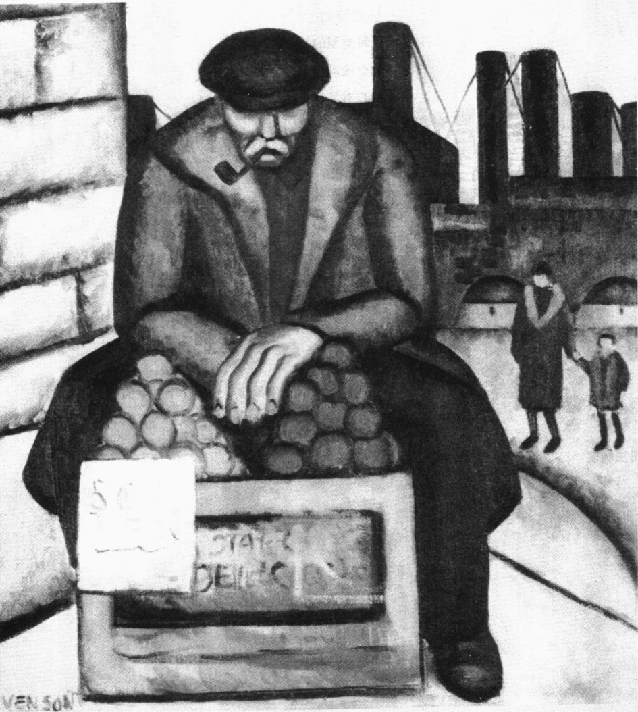
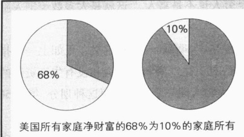
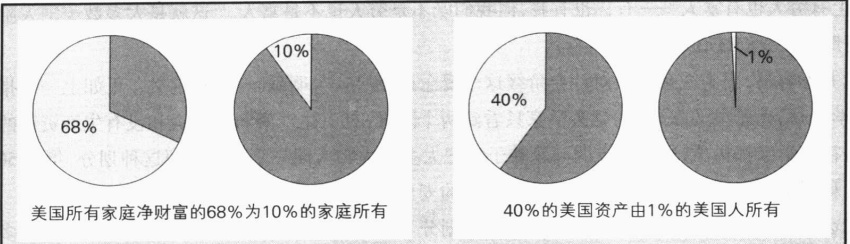
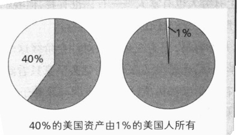
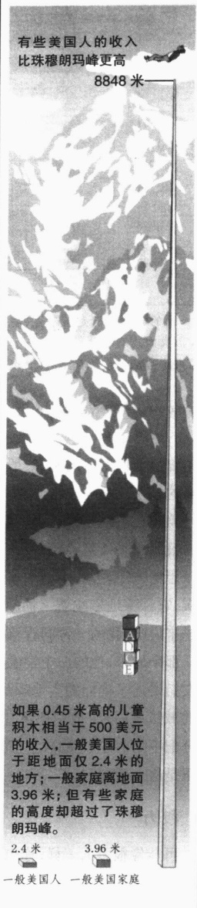
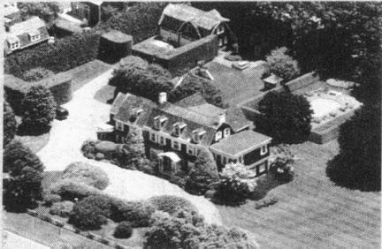
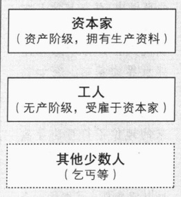
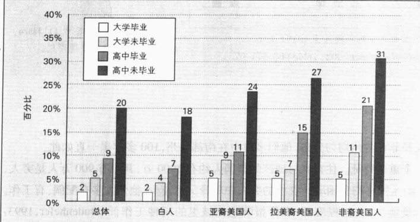
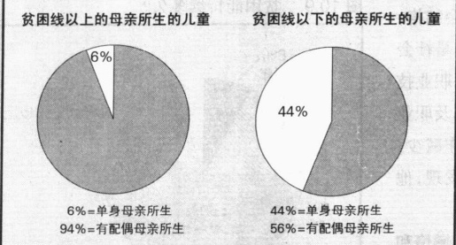
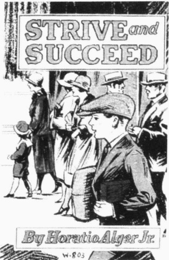

# 第 10 章 美国的阶级

芭芭拉·斯蒂文森

《苹果摊贩》(约 1933—1934)

---

什么是社会阶级？

财富

权力

声望

地位不符

<table border=1 style='margin: auto; word-wrap: break-word;'><tr><td style='text-align: center; word-wrap: break-word;'>·什么是社会阶级？</td><td style='text-align: center; word-wrap: break-word;'>社会阶级与新技术</td></tr><tr><td style='text-align: center; word-wrap: break-word;'>财富</td><td style='text-align: center; word-wrap: break-word;'>·社会流动</td></tr><tr><td style='text-align: center; word-wrap: break-word;'>权力</td><td style='text-align: center; word-wrap: break-word;'>三种类型的社会流动</td></tr><tr><td style='text-align: center; word-wrap: break-word;'>声望</td><td style='text-align: center; word-wrap: break-word;'>社会流动研究中的妇女</td></tr><tr><td style='text-align: center; word-wrap: break-word;'>地位不符</td><td style='text-align: center; word-wrap: break-word;'>解释有关社会流动的统计资料</td></tr><tr><td style='text-align: center; word-wrap: break-word;'>·社会阶级的社会学理论模型</td><td style='text-align: center; word-wrap: break-word;'>社会流动带来的痛苦</td></tr><tr><td style='text-align: center; word-wrap: break-word;'>马克思理论创新</td><td style='text-align: center; word-wrap: break-word;'>·贫困</td></tr><tr><td style='text-align: center; word-wrap: break-word;'>韦伯理论创新</td><td style='text-align: center; word-wrap: break-word;'>确定贫困线</td></tr><tr><td style='text-align: center; word-wrap: break-word;'>汽车工业中的阶级</td><td style='text-align: center; word-wrap: break-word;'>谁是穷人？</td></tr><tr><td style='text-align: center; word-wrap: break-word;'>·社会阶级的影响</td><td style='text-align: center; word-wrap: break-word;'>贫困儿童</td></tr><tr><td style='text-align: center; word-wrap: break-word;'>身体健康</td><td style='text-align: center; word-wrap: break-word;'>贫困的动力机制</td></tr><tr><td style='text-align: center; word-wrap: break-word;'>心理健康</td><td style='text-align: center; word-wrap: break-word;'>贫困的原因是什么？</td></tr><tr><td style='text-align: center; word-wrap: break-word;'>家庭生活</td><td style='text-align: center; word-wrap: break-word;'>福利改革</td></tr><tr><td style='text-align: center; word-wrap: break-word;'>教育</td><td style='text-align: center; word-wrap: break-word;'>为未来储蓄</td></tr><tr><td style='text-align: center; word-wrap: break-word;'>宗教</td><td style='text-align: center; word-wrap: break-word;'>霍雷肖·阿尔杰在哪里？——一个神话的社会功能</td></tr><tr><td style='text-align: center; word-wrap: break-word;'>政治</td><td rowspan="2">·本章小结</td></tr><tr><td style='text-align: center; word-wrap: break-word;'>犯罪和刑事司法制度</td></tr></table>

· 社会阶级的社会学理论模型  

马克思理论创新  

韦伯理论创新  

汽车工业中的阶级

· 社会流动

三种类型的社会流动

社会流动研究中的妇女

解释有关社会流动的统计资料

社会流动带来的痛苦

·贫困

确定贫困线

谁是穷人？

贫困儿童

贫困的动力机制

贫困的原因是什么？

福利改革

为未来储蓄

霍雷肖·阿尔杰在哪里？——一个神话的社会功能

---

### 第 10 章 美国的阶级

啊，新奥尔良，加勒比海岸的传奇城市，一连串的形象掠过我的脑海——海盗、财宝、阴谋。我曾有过一次愉快的加勒比之旅，美妙的记忆让我心潮澎湃——充满异国风情的法国区里飘荡着克里奥式菜肴的诱人香味，土著爵士乐的声音在耳边回响……

然而，我见到的这个无家可归者的收容所，却迫使我回到令人不快的现实。它同我在北部、西部和东部所见到的那些收容所一样，只是更脏。实际上，这是我在调查中遇到的最糟糕的一个收容所，而且也是唯一一个需要交费才能在那污秽的床铺上睡觉的收容所。

这里的人们看起来都是一个模样——衣冠不整，形容枯槁，脸上一律带着绝望的表情——就像这个国家任何地方的无家可归者一样。除去口音，你不会知道自己身处何地。我意识到，贫穷在哪儿都一样，只有口音可能不同。

第二天上午，我感到义愤填膺。我是在贫穷中长大的，我对那种悲苦的景象和气氛一点也不陌生。但是，在距收容所仅一个街区的地方，我被眼前一幅与穷苦和绝望如此格格不入的景象震惊了，我不禁呆立在马路中央。

呈现在我眼前的是公交车站点广告牌上那些真人大小、五颜六色的照片，上面衣冠楚楚的绅士与淑女们正盯着我。他们个个神气十足，大概是因为他们穿着优雅的套装、皮衣，带着昂贵的钻石首饰吧。

我感到一阵恶心。我想，“这个社会里某些东西被扭曲了”，我情不自禁地把眼前的画面和我在收容所里目睹的疾苦放到一起。有时候，社会现实的残酷让人心痛。此时，我就感到了这样的心痛。

我在新奥尔良感受到的社会断裂是由广告牌触发的，但那不是我第一次有这种体会。我从事的研究使我经常从无家可归者的世界转换到其他阶级的世界，每当这时，我就感到一种虚幻的断裂感。每个阶级都有自己的生活方式，并且因为彼此的世界观如此迥异，各个阶级并不能很好地融到一起。

### 什么是社会阶级？

“世界上有穷人也有富人——有你也有我，但我们既不是穷人也不是富人。”这就是大多数美国人阶级意识的写照。让我们试着对此作出解析。

这样做并不容易，因为社会学家对社会阶级这个概念还没有一个明确、一致的定义。正如上一章指出的，冲突学派（马克思主义取向）的社会学家只看到两个阶级：拥有生产资料的阶级和没有生产资料的阶级。多数社会学家都指出，这一观点的问题在于它把太多的人归入同一阶级。按照这种划分，年薪50万美元的内科医生和企业经理们与年收入1.3万美元的麦当劳汉堡工属于同一个阶级。

多数社会学家都同意韦伯的观点，即社会阶级的划分不能仅看一个人与生产资料的关系。因此，多数社会学家也就采用了韦伯提出的多元标准，把社会阶级定义为在财富、权力和声望等方面相近的一大

---

群人。这三个要素，把人们的生活方式分成不同的类别，给予人们不同的生活机会，并使他们看待自我和世界的方式也各不相同。

下面让我们看一下社会学家是如何测量这三方面的要素的。

### 财富

划分社会阶级的首要尺度就是财富(wealth)，即一个人所拥有的财产的价值。财产的形式多种多样，如房屋、土地、牲畜、机器、汽车、股票、债券、商业经营、银行账户等。相反，收入则是从商业经营或工资、租金、利息、版税等中所获得的货币。

财富和收入的区分 财富和收入经常被混淆，但是二者确实有区别。有的人拥有大量的财富，收入却极少。比如，一个农场主拥有大片的土地(财富的一种形式)，但是由于天气恶劣，加上肥料和农用机械价格很高，一年下来，可能他的收入寥寥无几。而有的人收入很高却没有多少财富，一个年收入25万美元的经理可能债务缠身。在表面的风光——出国旅游、加入乡村俱乐部、送孩子上私立学校、开跑车、住豪宅——背后，可能信用卡已经巨额透支，跑车有被索回的危险，抵押付款早已到期。不过，通常来说，财富的增减与收入是一致的。

在美国哪些人拥有财富？当然，有一种答案是“每个人”。虽然这种说法有一定的道理，但是它忽视了这个国家的财富在“每个人”之间是如何分配的。下面让我们看一下两种形式的财富——财产和收入——在美国人中的分配情况。

财富分配 总的来说，美国人拥有巨大的财富，总价值约30万亿美元(Statistical Abstract 2002: Table 679)，这包括了全国所有的房地产、股票、债券和企业资产。图10.1显示了财富的分配是多么的集中：10%的家庭拥有大部分的财富，即68%。并且在收入等级越往上的位置，财富分配就越集中，从图10.1中可以看到，收入最高的1%家庭拥有全部财富的40%。

收入分配 美国的收入分配情况如何？经济学家保罗·萨缪尔森 (Samuelson and Nordhaus, 2000) 是这样描述的：“如果我们用积木来做一个金字塔，每一层代表 500 美元的收入，那么它会比珠穆朗玛峰还要高出好多。不过大多数人都处于离地面只有几英尺的范围内。”

实际上,如果每块积木高0.45米,那么一个普通美国人离地面只有2.4米,因为美国的人均年收入

图 10.1 美国的财富分配

资料来源：Western (2000)。

---

美国超过1/4的国民财富为仅仅0.5%的人口所拥有。在这0.5%的人口中只有很少一部分人是少数民族。奥普拉·温弗里是个例外。她在娱乐业和投资业中获得了巨大的成功，身价达到10亿美元，是全球最富有的500人之一。温弗里为了帮助少数民族的儿童捐献了数百万美元。照片中，她正在采访阿诺德·施瓦辛格及其妻子玛丽亚·施赖弗。

是3万美元(这个平均收入包括了所有的美国人,甚至儿童都计算在内)。一个普通家庭的位置会高一点,因为多数家庭有两个或两个以上的人在外面工作,他们的年均收入能达到5.1万美元。然而,与极少数处于顶峰的家庭相比,一般美国家庭会发现自己离地面只有3.96米(Statistical Abstract 2002: Table 643,660)。图10.2向我们展现了这些差异。

很多美国人都希望能登上珠穆朗玛峰的顶峰，但事实是，大多数人——不管多么努力——都只能停留在2.4—3.96米高的山坡上，这使美国的收入分配呈现惊人的不平等。如果我们把美国人口按收入高低分成五份，又会看到另一个画面。正如图10.3所示，最高的1/5人口占到总收入的近一半(47.4%)，而最低的1/5只占4.3%。

图 10.3 有两个显著特征。首先，请注意随着时间的推移，收入分配不平等保持稳定不变。其次，收入分配中发生的变化表明了不平等的有增无减。美国家庭中最富的 20% 变得更加富有，而最穷的 20% 则变得更加贫穷。尽管实施了不胜枚举的反贫困项目，最穷的五分之一人所得收入占全国总收入的比重却比 20 世纪 40 年代还要低（从 5.4% 下降到 4.3%）。与此形成鲜明对比的是，最富的五分之一人的收入比重则提高了（从约 41% 上升到 47% 以上）。

美国最富有的群体是那些大企业的首席执行官们(CEOs)。《华尔街日报》调查了美国最大的350家公司付给CEO们的报酬

图 10.2 美国的收入不平等

---

图 10.3 增长的不平等：二战后，美国每五分之一家庭所占的收入百分比

注：美国的收入分配是指工资、薪金和获得的其他钱财，不包括资本所得和食品券、医疗保险或住房补贴等形式的政府补助。

资源来源：Statistical Abstract 1947；2002：Table 659。

(“Executive Pay”, 2003)。他们报酬(包括薪金、奖金和股权分红)的中位数每年能达到302万美元。(中位数的意思是有一半人的收入高于这一数字,另一半人的收入则低于这一数字。)CEO们的收入——其中不包括他们所得的利息、股息、租金、资本盈利,公司配给他们的大轿车和司机,在歌剧院和全美棒球联赛的私人包厢——比美国工人的平均工资高85倍(Statistical Abstract 2002: Table 611)。这种悬殊的收入差距还可以这样来考虑:一个普通美国工人要工作3671年才能挣得全球年薪最高的CEO一年所得的报酬(1.164亿美元)。

想象一下，要是有这样一份收入，你会怎样生活？这正是问题所在。冰冷的数字后面是活生生的现实，它深深地影响着人们的生活。位于财富金字塔的顶层和底层意味着判若云泥的生活方式。举个例子来说吧，我的一位同行执教于东部一所顶尖大学，他讲授有关拉美贫困的内容激起了学生们的好奇心。那个周末，他的一个学生用他父母的私人飞机和飞行员去了一趟拉美。在下周一的课上，他和他的朋友们讲述了他们的实地观察所得。相比之下，在收入金字塔底层的美国人没钱去旅行，甚至没钱去邻近的城镇度周末：他们把仅有的一点空闲时间耗费在自助洗衣店里，要么就是给孩子喂奶。总之，财富的分配不是“纯粹”的数字，而是代表着人们生活中迥然相异的机会。右边的“现实社会学”专栏中讨论的正是这个话题。

### 权力

可能像很多人一样，你也曾这样自言自语过：“确实，我可以投票，但是有些重大决策还是不知怎么就作出来了，没有人管我想的是什么。我当然没有作出向阿富汗和伊拉克派兵的决定，我没有向科索沃和巴格达发射导弹，我也没有决定提高税率降低利率，决定改变福利待遇的同样不是我。”

然后另一个你则可能会说：“但是我确实通过投票选举国会议员和总统参与了这些决策过程

---

### 超级富翁怎么生活

了解其他人的生活方式是有好处的，这能给予我们观察生活的不同视角。让我们一瞥约翰·卡斯尔(其真名)的生活吧。约翰在麻省理工学院取得物理学学位，继而又获得了哈佛大学的工商管理硕士学位，之后他就进入金融保险业，并赚得1亿多美元(Lublin,1999)。

为了接近社会名流，约翰买下了前总统肯尼迪的“冬日白宫”（Winter White House），那是一座位于佛罗里达州棕榈海滩的一处临海的地产。约翰花了1100万美元对这座占地1196平米的豪宅进行了改造，包括增修两间浴室，使浴室总数达到15间。他喜欢炫耀肯尼迪卧室里的床和梳妆台，梳妆台的抽屉上有“黑色内衣”字样，是罗斯·肯尼迪精心的手写体。

超级富翁是如何生活的？人们甚至难以想象他们的生活方式，但是这幅照片会使你了解他们的生活方式与我们大多数人的有很大差异。照片中的是玛莎·斯图尔特的豪宅，它位于长岛的东汉普顿。这一地区的许多住宅都是为名人及其他富有的居民所拥有的。

要是约翰在他的海滨豪宅里呆腻了，或者厌倦了那个跟奥运会比赛用的泳池一般大的泳池(肯尼迪在遇刺前一周还在这里游过泳)，他可以在附近那座方圆40469平米的私人牧场里骑上一匹纯种马任意驰骋。如果他还是觉得乏味，他可以乘坐定做的13.7米长的豪华游艇出海消遣。

定做一艘游艇要花多少钱？约翰是不会告诉你的。他说：“我不想知道任何东西的价钱。如果

游艇确实是个供人消遣的好东西，约翰曾经乘坐游艇环游世界。但他并不是一直呆在船上，而是时不时地回到船上。船长和船员们控制着船的航向。什么时候约翰乐意了，就乘飞机到船上待几天，然后飞回美国打理生意。整个航行过程中，他来来回回，飞行距离约有24万公里。这真不失为一种环游世界的有趣方式啊！

你有了足够的钱，价格就没什么意义了。这是作为富人所享有的自由的一部分。”

言之有理。并且对于约翰来说，作为富人还意味着花100万美元包一架私人喷气式飞机运送他的阿巴鲁萨马 Spot 往返接受诊疗，因为约翰不愿让 Spot 受长途颠簸之苦。当然了，他还要再花50万美元支付 Spot 的诊疗费。

还有一些让约翰相形见绌的富人。AutoNation的CEO韦恩·休伊曾加买下了一座方圆800万平米的乡村俱乐部，里面有一个18洞的高尔夫球场，还有一座占地55000平米的俱乐部会所和为参观的船只准备的68个停泊处。这个俱乐部是非常排外的，它的会员只有韦恩和他妻子。

啊。”——这句话确实是真的，但是说得还不够深刻。这种“我是国家‘重大’决策的参与者”的想法，是我们幼年时期所接受的意识形态的重放——马克思说：这种观念是精英们提出来用以使他们的权利合法化和持久化的。社会学家丹尼尔·赫林格和丹尼斯·贾德（Hellinger and Judd，1991）称其为“民主的门面”，它掩盖了美国权力的真正来源。

早在 20 世纪 50 年代, 社会学家米尔斯 (Mills, 1956) 就因强调权力 (不顾他人反抗而实施自己意愿

---

的能力)集中在少数人手中而受到批判,因为他的分析与人人平等的民主观念背道而驰。正如前面章节中提及的,米尔斯创造了权力精英(power elite)这一术语来指那些在美国社会中作出重大决策的人。

米尔斯和其他社会学家重点分析了在一个由具有共同意识形态和价值观念的个体组成的群体中，财富和权力是怎样结合的。这些人加入同样的私人俱乐部，到同样的旅游胜地去度假，甚至为女儿进入社交界举行的舞会请的也是同样的乐队。这些共同的生活背景和既得利益，强化了他们对社会及自己特殊地位的共同认识（Domhoff，1998，1991a）。这些精英在美国社会中拥有超常的权力。虽然也有个别例外，大多数美国总统都是出身名门的白人男性百万富翁（Baltzell and Schneiderman，1988）。

在继承米尔斯观点的基础上，社会学家威廉·多姆霍夫(Domhoff，1990，1998)进而提出这个集群的权力是如此之大，以至于美国政府的重大决策无一不是经过它的赞许才作出的。他分析了这个集群如何在幕后同民主选举的官员一起决定国家的内政外交政策——从制定社会保险税到施加贸易关税。尽管多姆霍夫的结论惹人争议——也令人担忧——但是这些现象确实遵循着一条准则，即财富带来权力，极大的财富带来极大的权力。

### 声望

职业与声望 大学毕业后你想干什么？你不可能选择懒洋洋地坐在海滩上的棕榈树下面，我们中的绝大多数人都必须选择一种职业开始工作。对照表 10.1，看看你选择的职业按声望（prestige）排在什么位置。因为我们正处于全球化过程中，所以表 10.1 把美国和其他 60 个国家的职业声望分别作了对比。

为什么人们赋予某些职业较高的声望，而对另一些职业则相反？观看表 10.1，你会注意到声望较高的职业有下面四个共同特征：

1. 报酬较高。

2. 要求较高的文化程度。

3. 工作中需要更多的抽象思考。

4. 从业者有较多的自主权(自由或自主安排)。

反过来，我们可以发现那些声望得分较低的工作则报酬低，对职业培训和文化程度的要求也较低，需要投入较多的体力劳动，并且工作过程受到严密的监督。简言之，专业性工作和白领工作排在职业声望表的前面，蓝领工作排在后面。

有趣的是，职业声望的排序在不同国家和不同时期基本一致。例如，在各个国家，大学教授的职业声望得分都要高于护士，护士的得分高于社会工作者，社会工作者的得分又高于门卫。同样地，25年前声望较高的职业现在依然在表中位于较高的位置——并且以后也会这样。

声望显示 为了获得一种成就感，人们总想让别人知道他们的声望。以前，有的国家只有皇帝和皇室成员才能穿紫色的衣服，因为紫色象征高贵。在法国，只有贵族才能戴绶带。在英国，当国王坐在王位上时，任何人都不能坐下。有的国王和王后要求侍从后退着离开房间，这样就不会把背部朝向尊贵的国王和王后了。

人们一直都在考虑如何显示声望。对于有些人来说，这是一种必需的礼仪。军人行为手册上规定

---

表 10.1 美国与其他 60 个国家的职业声望表比较

<table border=1 style='margin: auto; word-wrap: break-word;'><tr><td style='text-align: center; word-wrap: break-word;'>职业</td><td style='text-align: center; word-wrap: break-word;'>美国分值</td><td style='text-align: center; word-wrap: break-word;'>其他六十国平均分值</td><td style='text-align: center; word-wrap: break-word;'>职业</td><td style='text-align: center; word-wrap: break-word;'>美国分值</td><td style='text-align: center; word-wrap: break-word;'>其他六十国平均分值</td></tr><tr><td style='text-align: center; word-wrap: break-word;'>内科医生</td><td style='text-align: center; word-wrap: break-word;'>86</td><td style='text-align: center; word-wrap: break-word;'>78</td><td style='text-align: center; word-wrap: break-word;'>运动员教练</td><td style='text-align: center; word-wrap: break-word;'>53</td><td style='text-align: center; word-wrap: break-word;'>50</td></tr><tr><td style='text-align: center; word-wrap: break-word;'>最高法院法官</td><td style='text-align: center; word-wrap: break-word;'>85</td><td style='text-align: center; word-wrap: break-word;'>82</td><td style='text-align: center; word-wrap: break-word;'>社会工作者</td><td style='text-align: center; word-wrap: break-word;'>52</td><td style='text-align: center; word-wrap: break-word;'>56</td></tr><tr><td style='text-align: center; word-wrap: break-word;'>大学校长</td><td style='text-align: center; word-wrap: break-word;'>81</td><td style='text-align: center; word-wrap: break-word;'>86</td><td style='text-align: center; word-wrap: break-word;'>电工</td><td style='text-align: center; word-wrap: break-word;'>51</td><td style='text-align: center; word-wrap: break-word;'>44</td></tr><tr><td style='text-align: center; word-wrap: break-word;'>宇航员</td><td style='text-align: center; word-wrap: break-word;'>80</td><td style='text-align: center; word-wrap: break-word;'>80</td><td style='text-align: center; word-wrap: break-word;'>殡仪员</td><td style='text-align: center; word-wrap: break-word;'>49</td><td style='text-align: center; word-wrap: break-word;'>34</td></tr><tr><td style='text-align: center; word-wrap: break-word;'>律师</td><td style='text-align: center; word-wrap: break-word;'>75</td><td style='text-align: center; word-wrap: break-word;'>73</td><td style='text-align: center; word-wrap: break-word;'>爵士乐音乐家</td><td style='text-align: center; word-wrap: break-word;'>48</td><td style='text-align: center; word-wrap: break-word;'>38</td></tr><tr><td style='text-align: center; word-wrap: break-word;'>大学教授</td><td style='text-align: center; word-wrap: break-word;'>74</td><td style='text-align: center; word-wrap: break-word;'>78</td><td style='text-align: center; word-wrap: break-word;'>房地产代理商</td><td style='text-align: center; word-wrap: break-word;'>48</td><td style='text-align: center; word-wrap: break-word;'>49</td></tr><tr><td style='text-align: center; word-wrap: break-word;'>飞行员</td><td style='text-align: center; word-wrap: break-word;'>73</td><td style='text-align: center; word-wrap: break-word;'>66</td><td style='text-align: center; word-wrap: break-word;'>邮递员</td><td style='text-align: center; word-wrap: break-word;'>47</td><td style='text-align: center; word-wrap: break-word;'>33</td></tr><tr><td style='text-align: center; word-wrap: break-word;'>建筑师</td><td style='text-align: center; word-wrap: break-word;'>73</td><td style='text-align: center; word-wrap: break-word;'>72</td><td style='text-align: center; word-wrap: break-word;'>秘书</td><td style='text-align: center; word-wrap: break-word;'>46</td><td style='text-align: center; word-wrap: break-word;'>53</td></tr><tr><td style='text-align: center; word-wrap: break-word;'>生物学家</td><td style='text-align: center; word-wrap: break-word;'>73</td><td style='text-align: center; word-wrap: break-word;'>69</td><td style='text-align: center; word-wrap: break-word;'>铅管工人</td><td style='text-align: center; word-wrap: break-word;'>45</td><td style='text-align: center; word-wrap: break-word;'>34</td></tr><tr><td style='text-align: center; word-wrap: break-word;'>牙医</td><td style='text-align: center; word-wrap: break-word;'>72</td><td style='text-align: center; word-wrap: break-word;'>70</td><td style='text-align: center; word-wrap: break-word;'>木匠</td><td style='text-align: center; word-wrap: break-word;'>43</td><td style='text-align: center; word-wrap: break-word;'>37</td></tr><tr><td style='text-align: center; word-wrap: break-word;'>土木工程师</td><td style='text-align: center; word-wrap: break-word;'>69</td><td style='text-align: center; word-wrap: break-word;'>70</td><td style='text-align: center; word-wrap: break-word;'>农民</td><td style='text-align: center; word-wrap: break-word;'>40</td><td style='text-align: center; word-wrap: break-word;'>47</td></tr><tr><td style='text-align: center; word-wrap: break-word;'>牧师</td><td style='text-align: center; word-wrap: break-word;'>69</td><td style='text-align: center; word-wrap: break-word;'>60</td><td style='text-align: center; word-wrap: break-word;'>砖瓦匠</td><td style='text-align: center; word-wrap: break-word;'>36</td><td style='text-align: center; word-wrap: break-word;'>34</td></tr><tr><td style='text-align: center; word-wrap: break-word;'>心理学家</td><td style='text-align: center; word-wrap: break-word;'>69</td><td style='text-align: center; word-wrap: break-word;'>66</td><td style='text-align: center; word-wrap: break-word;'>理发师</td><td style='text-align: center; word-wrap: break-word;'>36</td><td style='text-align: center; word-wrap: break-word;'>30</td></tr><tr><td style='text-align: center; word-wrap: break-word;'>药剂师</td><td style='text-align: center; word-wrap: break-word;'>68</td><td style='text-align: center; word-wrap: break-word;'>64</td><td style='text-align: center; word-wrap: break-word;'>商店售货员</td><td style='text-align: center; word-wrap: break-word;'>36</td><td style='text-align: center; word-wrap: break-word;'>34</td></tr><tr><td style='text-align: center; word-wrap: break-word;'>中学教师</td><td style='text-align: center; word-wrap: break-word;'>66</td><td style='text-align: center; word-wrap: break-word;'>64</td><td style='text-align: center; word-wrap: break-word;'>卡车司机</td><td style='text-align: center; word-wrap: break-word;'>30</td><td style='text-align: center; word-wrap: break-word;'>33</td></tr><tr><td style='text-align: center; word-wrap: break-word;'>注册护士</td><td style='text-align: center; word-wrap: break-word;'>66</td><td style='text-align: center; word-wrap: break-word;'>54</td><td style='text-align: center; word-wrap: break-word;'>出租车司机</td><td style='text-align: center; word-wrap: break-word;'>28</td><td style='text-align: center; word-wrap: break-word;'>28</td></tr><tr><td style='text-align: center; word-wrap: break-word;'>会计</td><td style='text-align: center; word-wrap: break-word;'>65</td><td style='text-align: center; word-wrap: break-word;'>55</td><td style='text-align: center; word-wrap: break-word;'>垃圾工</td><td style='text-align: center; word-wrap: break-word;'>28</td><td style='text-align: center; word-wrap: break-word;'>13</td></tr><tr><td style='text-align: center; word-wrap: break-word;'>职业运动员</td><td style='text-align: center; word-wrap: break-word;'>65</td><td style='text-align: center; word-wrap: break-word;'>48</td><td style='text-align: center; word-wrap: break-word;'>服务生</td><td style='text-align: center; word-wrap: break-word;'>28</td><td style='text-align: center; word-wrap: break-word;'>23</td></tr><tr><td style='text-align: center; word-wrap: break-word;'>电气工程师</td><td style='text-align: center; word-wrap: break-word;'>64</td><td style='text-align: center; word-wrap: break-word;'>65</td><td style='text-align: center; word-wrap: break-word;'>酒吧招待</td><td style='text-align: center; word-wrap: break-word;'>25</td><td style='text-align: center; word-wrap: break-word;'>23</td></tr><tr><td style='text-align: center; word-wrap: break-word;'>作家</td><td style='text-align: center; word-wrap: break-word;'>63</td><td style='text-align: center; word-wrap: break-word;'>62</td><td style='text-align: center; word-wrap: break-word;'>旅馆招待</td><td style='text-align: center; word-wrap: break-word;'>25</td><td style='text-align: center; word-wrap: break-word;'>14</td></tr><tr><td style='text-align: center; word-wrap: break-word;'>银行家</td><td style='text-align: center; word-wrap: break-word;'>63</td><td style='text-align: center; word-wrap: break-word;'>67</td><td style='text-align: center; word-wrap: break-word;'>依靠公共援助者</td><td style='text-align: center; word-wrap: break-word;'>25</td><td style='text-align: center; word-wrap: break-word;'>16</td></tr><tr><td style='text-align: center; word-wrap: break-word;'>兽医</td><td style='text-align: center; word-wrap: break-word;'>62</td><td style='text-align: center; word-wrap: break-word;'>61</td><td style='text-align: center; word-wrap: break-word;'>收款员</td><td style='text-align: center; word-wrap: break-word;'>24</td><td style='text-align: center; word-wrap: break-word;'>27</td></tr><tr><td style='text-align: center; word-wrap: break-word;'>警官</td><td style='text-align: center; word-wrap: break-word;'>61</td><td style='text-align: center; word-wrap: break-word;'>40</td><td style='text-align: center; word-wrap: break-word;'>产业工人</td><td style='text-align: center; word-wrap: break-word;'>24</td><td style='text-align: center; word-wrap: break-word;'>29</td></tr><tr><td style='text-align: center; word-wrap: break-word;'>社会学家</td><td style='text-align: center; word-wrap: break-word;'>61</td><td style='text-align: center; word-wrap: break-word;'>67</td><td style='text-align: center; word-wrap: break-word;'>门卫</td><td style='text-align: center; word-wrap: break-word;'>22</td><td style='text-align: center; word-wrap: break-word;'>21</td></tr><tr><td style='text-align: center; word-wrap: break-word;'>新闻记者</td><td style='text-align: center; word-wrap: break-word;'>60</td><td style='text-align: center; word-wrap: break-word;'>55</td><td style='text-align: center; word-wrap: break-word;'>加油站服务员</td><td style='text-align: center; word-wrap: break-word;'>21</td><td style='text-align: center; word-wrap: break-word;'>25</td></tr><tr><td style='text-align: center; word-wrap: break-word;'>古典音乐家</td><td style='text-align: center; word-wrap: break-word;'>59</td><td style='text-align: center; word-wrap: break-word;'>56</td><td style='text-align: center; word-wrap: break-word;'>擦鞋者</td><td style='text-align: center; word-wrap: break-word;'>17</td><td style='text-align: center; word-wrap: break-word;'>12</td></tr><tr><td style='text-align: center; word-wrap: break-word;'>演员</td><td style='text-align: center; word-wrap: break-word;'>58</td><td style='text-align: center; word-wrap: break-word;'>52</td><td style='text-align: center; word-wrap: break-word;'>街道清扫工</td><td style='text-align: center; word-wrap: break-word;'>11</td><td style='text-align: center; word-wrap: break-word;'>13</td></tr><tr><td style='text-align: center; word-wrap: break-word;'>按摩治疗师</td><td style='text-align: center; word-wrap: break-word;'>57</td><td style='text-align: center; word-wrap: break-word;'>62</td><td style='text-align: center; word-wrap: break-word;'></td><td style='text-align: center; word-wrap: break-word;'></td><td style='text-align: center; word-wrap: break-word;'></td></tr></table>

注：因为有五种职业的得分在1994年的资料中没有列出，故使用了1991年的资料。这五种职业分别是：最高法院法官、宇航员、运动员教练、依靠公共援助者、街道清扫工。

资料来源：Treiman（1997：附录A和D）；Nakao and Treas（1991；1994：附录D）。

了谁应该向谁敬礼。美国总统要在其他人到来之后才进入房间(以显示他不需要等其他人)，并且他进入房间时其他人必须起立。在法庭上，有监守官或武装人员确保法官进入法庭时每个人都要站着。

声望的显示渗透在整个社会之中。在洛杉矶，很多人都把他们的地址写为比弗莉山庄并附上正确的邮编(ZIP码)。当东底特律更名为东角并声称跟格罗斯角一样有实力时，它的资产值迅速攀升(Fletcher，1997)。还有许多人花大钱购买带有“设计者”标签的时装。声望还是影响选择上哪所大学的首要因素，

---

谁都知道在州立大学获得的普通文凭与在哈佛、普林斯顿、耶鲁或斯坦福这些名校获得的学位是不可同日而语的。

有趣的是，每个阶级的地位符号是不同的。显然，有些东西只有富人才消费得起，比如游艇。不过除了支付能力，地位符号还受阶级偏好的影响。例如，刚刚崭露头角的年轻职业车手们总是急于炫耀他们的标签，大声喊叫，或者用其它物质符号来显示他们已经“到位了”。而地位更稳定的富人并不在意这些外在形式，在有钱人看来，“大众”阶级带有设计者标签的时装低廉又花哨。他们当然有自己的地位符号，比如价值3万美元的劳力士手表。

### 地位不符

一般说来，一个人在社会阶级的三个维度——财富、权力和声望——方面的等级是相近的。本章开篇短文中的无家可归者就是一个例子，他们在这三方面的地位一致（status consistent）。然而，有时却并非如此，有的人在这三个方面的等级有高有低，这种现象就是地位不符（status inconsistent）。这会导致一些有趣的事情。

社会学家格哈德·伦斯基（Lenski，1954，1966）指出，我们每个人都会努力使自己的社会地位或等级达到最高。所以，那些在某一维度上等级高而在其他维度上等级低的人，就期望人们根据最高等级来评价他们。而其他人由于同样想使自己的地位达到最高，很可能会按其最低等级去评价他们。

社会学家雷·戈尔德(Gold, 1952) 作过一项关于地位不符的经典研究。他发现公寓门卫组成工会后得到的报酬比有些房客还要高，而他们则要为这些房客倒垃圾。房客们看到门卫开的车比自己的好时感到不平衡，有些房客试图通过责骂门卫让他们“呆在自己该在的位置上”。另一方面，门卫们在打扫垃圾时则会因为获知了房客“不可告人”的秘密而窃喜。

地位不符的人可能会面临一系列令人沮丧的情况。他们要求较高的地位，得到的却是较低的等级。这种状况的社会学意义，就是这些人在政治上具有激进倾向（Lenski，1954，Mateju and Kreidl，2001）。例如大学教授，正如我们在表10.1中看到的，他们的声望很高，但其收入相对则较低。美国社会中没有人比他们的文化程度更高，但是他们并不在收入金字塔的高层之列。按照伦斯基的预言，多数大学教授在政治上都有些偏左。学术机构中同样如此，即一个机构中平均工资越高，机构成员在政治上就越不激进。大学里商学系和医学系的教师收入最高，他们在政治上最保守。

下面的“现实社会学”专栏中谈的是关于一夜暴富的话题，讲述了一些有关地位不符的有趣案例。

### 现实社会学

### 中大奖后的生活

“要是我碰巧中了大奖，生活就会好起来，所有的问题都会迎刃而解。”

这就是他们的梦想。许多美国人都在买彩票，全国用于买彩票的钱每周达100万美元。这些人抱着一种侥幸心理：“也许这一周我就中了。”

大多数人可能会幸运地中上10美元，也可能又一次空手而归。

但是那些中了大奖的人怎么样了？他们以后的生活是不是就充满了玫瑰和巧克力？

很遗憾,目前还没有这方面的系统研究,所以

---

我不能告诉你中奖者的生活一般会怎样。但是从记者的报道中可以明显地看到几点。

中了大奖最常见的结果是生活变得一团糟。所有的人都生活在一定的环境中，并与其他人发生着各种联系，这是我们确定人生目标和感知外部世界的基础。突如其来的财富会摧毁生活的道德和精神支柱，随之而来的地位不符可能导致社会学上所说的失范。

对于中奖者来说，地位不符是很普遍的。他们获得了一笔巨大的财富，这远远超出了他们的教育和职业地位。图中是芝加哥的约翰·贾雷尔和桑迪·贾雷尔。他们知道自己将与其他12个家庭共同分享2.95亿美元的头彩。你认为，他们所分得的2200万美元将如何影响他们的生活？

首先是震惊。例如英国新汉普郡多弗尔的一个

接线员玛丽·桑德森中了6600万美元。她说：“当时我不敢相信这是真的，又害怕这不是真的。”她从来没有像变成百万富婆的第一夜那样睡不着，“我整晚都在哭，还不停地呕吐”（Tresniowski，1999）。

记者和摄像机出现在你家门口，他们问：“你想用那些钱干什么？”你一点也不知道怎么回答，但头晕目眩中你还是咕哝了点什么。

然后是接二连三的电话。有些是令人愉快的，比如父母打来的祝贺电话。但是很久不联系的朋友和远亲突然想起来他们和你的关系多么亲密，不过奇怪的是，他们都有急事，需要用你的钱来解燃眉之急。你甚至还接到陌生人的电话，他们的妈妈病了，孩子病了，狗儿病了……

你不得不拔掉电话线,换上一个没人知道的新号码。

一些中奖者对蜂拥而至的求婚者应接不暇。他们当然不是一夜之间变得更有魅力了或更性感了——或者他们确实更有魅力、更性感了？大概钱会让人变得性感吧。

你不能再信任别人,你不知道他们的真实动机。以前,没有人觊觎你的钱,因为你没有钱。你可能还会害怕劫匪。以前,这也不成问题——除非有人想抢劫你那辆开了七年的破车。

很平常的事也变得棘手，甚至挑选一件结婚礼

物都成了难题。如果你送一台普通的烤面包机，人们会觉得你是个吝啬鬼。可是你应该送一张25000美元的支票吗？那样的话，镇上所有的婚礼都会邀请你参加，因为人人都想要这样的礼物。

下面是一些中奖者的遭遇：

汤达·迪克森是亚拉巴马州大湾的一个旅馆侍者，一位客人把一张彩票作为小费送给她，结果她中了1000万美元(是的，就像尼古拉斯·凯奇主演的《倾城佳话》中的情节)。然而，她的同事起诉了她，那人说她们有过约定，这种中奖赢来的钱要两个人分享。(“House Divided” 1999)

还有新泽西州 Rahwa 的迈克尔·克兰贝尔，他中了 200 万美元，他的母亲菲莉丝说多年来他们俩每月存 20 美元用于买彩票(因此她要分享这笔奖金)。迈克尔说这是事实，但是他中奖的那张彩票是他用自己的钱买的。为此，菲莉丝起诉了她儿子。(“Sticky Ticket” 1998)

弗兰克·卡帕西是伊利诺伊州 Streamwood 的一个退休电工，他中了 1.95 亿美元之后，在他多年来常去的酒吧中成了不受欢迎的人。两个酒吧侍者拿着顾客们的 5 美元驾车一小时去威斯康星买了彩票。弗兰克中奖后给了他们每人一万美元，两个侍者却说他答应过要给更多。老朋友们也说卡帕西变得像个“大人物”了，他们买了饮料给每人一份，却说“不给他”，而是给了弗兰克不喜欢的一个人。（Annin，1999）

那些没有经历这种失范的人没有使自己的行为和生活方式发生突变。他们仍然和原来的朋友交往，遵循着原来的生活规律，并坚持着原来的道德观念。有的人甚至还干着原来的工作——当然不是为了挣钱——这能给他们一种熟悉和舒服的稳定感。

换句话说，横财带来了需小心提防的威胁。

但是我却听见你说：“我愿意冒险！”

---

### ☑ 社会阶级的社会学理论模型

有多少个阶级这一问题历来饱受争议，没有定论。社会学家提出了很多理论模型，但是没有一个能得到普遍认同。其中有两个主要的模型，分别是马克思和韦伯提出的。

### 马克思理论创新

马克思认为只有两个阶级：资本家阶级和工人阶级。一个人的阶级属性仅仅基于他与生产资料的关系(见图 10.4)。社会学家对这个观点提出了批判，因为这样的阶级划分过于宽泛。比如，因为经理和管理者没有生产资料，他们就被划入工人阶级。但是他们与流水线上的工人有什么共同之处呢？同样，“资本家”里面也包含了很多类别。有的人雇佣着1000名工人，他们作出的决定直接影响这1000个家庭。把这些人和我在伊利诺伊州戈弗雷认识的一个人比较一下。弗兰克以前是在自家后院里修车的；后来他雇了几个人，就不再亲自干修车的活了；几年后他建了一座有五个修理间和一个办公室的房子。按照马克思理论，现在弗兰克就是一个资本家了，因为他雇了五六个修车工，有工具和厂房（“生产资料”）。但是他与支配着1000人生活的工

图 10.4 马克思的阶级模型

厂主一样吗？不仅仅是他们的工作不同，他们的生活方式和世界观也不一样。

社会学家埃里克·赖特（Wright，1985）通过把有些人同时划入多个阶级解决了这个问题，他说这些人拥有相矛盾的阶级定位（contradictory class locations）。赖特用这个术语指人们在阶级结构中的位置可能产生相互抵触的利益。例如，一个汽车修理工出身的汽修厂老板，可能想给他雇的技工更多工资，因为他也做过同样的工作。但与此同时，他现在的利益——盈利和保持竞争力——却使他不能给工人提高工资。

赖特提出了这种相矛盾的阶级位置，从而修正了马克思的模型。在表10.2中，赖特划分了四个阶级：(1)资本家(capitalists)，即雇佣了许多工人的企业主；(2)小资产阶级(petty bourgeoisie)，即小企业主；(3)管理者(managers)，出卖劳动力但是也对其他雇员行使权力；(4)工人(workers)，仅出卖自己的劳动力。可以看出，这种划分比马克思的模型更加细致，不过还是保留了雇主与雇员之间的根本区别。

但是问题依然存在。例如，我们应该把大学教授归入哪个阶级呢？并且我们还知道，管理者和管理者之间也有很大的差别。通用汽车公司的一个经理可能管理着1000名工人，而麦当劳的一个值班经理可能只负责几个雇员。他们之间同样没有什么共同特征。

### 韦伯理论创新

社会学家约瑟夫·卡尔和丹尼斯·吉尔伯特（Gilbert and Kahl，1998；Gilbert，2003）提出一个六阶级模型来描述美国和其他资本主义国家的阶级结构。如图 10.5 所示，可以把他们的模型看做一个阶梯。我们的讨论从最高层开始，依次下降。

表 10.2 赖特对马克思阶级模型的修正

---

按照韦伯的观点,层级越低,财富、权力就越少,声望也越低。教育程度在这一模型中同样是阶级的一个重要测量尺度。

图 10.5 美国的阶级阶梯

<table border=1 style='margin: auto; word-wrap: break-word;'><tr><td style='text-align: center; word-wrap: break-word;'>阶级类别</td><td style='text-align: center; word-wrap: break-word;'>教育背景</td><td style='text-align: center; word-wrap: break-word;'>职业</td><td style='text-align: center; word-wrap: break-word;'>收入(美元)</td><td style='text-align: center; word-wrap: break-word;'>人口比例</td></tr><tr><td style='text-align: center; word-wrap: break-word;'>资本家阶级</td><td style='text-align: center; word-wrap: break-word;'>毕业于著名大学</td><td style='text-align: center; word-wrap: break-word;'>投资者或资产继承者,少数高级管理者</td><td style='text-align: center; word-wrap: break-word;'>50万以上</td><td style='text-align: center; word-wrap: break-word;'>1%</td></tr><tr><td style='text-align: center; word-wrap: break-word;'>上层中产阶级</td><td style='text-align: center; word-wrap: break-word;'>受过大学教育,通常有硕士学历</td><td style='text-align: center; word-wrap: break-word;'>教授和上层管理者</td><td style='text-align: center; word-wrap: break-word;'>10万以上</td><td style='text-align: center; word-wrap: break-word;'>15%</td></tr><tr><td style='text-align: center; word-wrap: break-word;'>下层中产阶级</td><td style='text-align: center; word-wrap: break-word;'>高中或大学毕业,受过专门培训</td><td style='text-align: center; word-wrap: break-word;'>失业人员、下层管理者、技工、领班</td><td style='text-align: center; word-wrap: break-word;'>约6万</td><td style='text-align: center; word-wrap: break-word;'>34%</td></tr><tr><td style='text-align: center; word-wrap: break-word;'>工人阶级</td><td style='text-align: center; word-wrap: break-word;'>高中毕业</td><td style='text-align: center; word-wrap: break-word;'>工厂工人、职员、低收入的零售商、技术工人</td><td style='text-align: center; word-wrap: break-word;'>约3.5万</td><td style='text-align: center; word-wrap: break-word;'>30%</td></tr><tr><td style='text-align: center; word-wrap: break-word;'>贫困工人阶级</td><td style='text-align: center; word-wrap: break-word;'>部分高中毕业</td><td style='text-align: center; word-wrap: break-word;'>体力劳动者、服务业工人、收入较低的售货员</td><td style='text-align: center; word-wrap: break-word;'>约1.7万</td><td style='text-align: center; word-wrap: break-word;'>16%</td></tr><tr><td style='text-align: center; word-wrap: break-word;'>底层阶级</td><td style='text-align: center; word-wrap: break-word;'>部分高中毕业</td><td style='text-align: center; word-wrap: break-word;'>失业者、兼职者、依靠福利者</td><td style='text-align: center; word-wrap: break-word;'>约1万</td><td style='text-align: center; word-wrap: break-word;'>4%</td></tr></table>

资料来源：根据 Gilbert and Kahl（1998）与 Gilbert（2003）整理而成，收入部分根据 Duff（1995）整理而成。

资本家阶级 位于阶级结构最高层的是仅占美国人口 1% 的权力精英们。正如在图 10.1 中看到的，资本家阶级如此富有，他们占有美国全部资产的 40%。这极少的 1% 人口拥有的财产，比底层的 90% 人口拥有的还要多（Beeghley, 2000）。

这个小的精英集团还有权有势。他们可以直接与高层政客来往，他们的决定影响到数百万人能否就业，他们甚至左右着国家的意识形态：因为他们掌握着主要的报刊、电台和电视台。他们也控制着一流大学的董事会。他们还通过把资产和社会关系网络传给子女，使自己的特权地位长久保持下去。

资本家阶级可以分成“老牌富翁”和“新富”两部分。一个家族拥有财富的时间越长，它的名望就越高。他们的子女很少与“平民百姓”的孩子交往，他们上的是专门的贵族学校，学习有利于他们特权地位的生活观。他们不是为了挣钱而工作；相反，很多人进入商界和法律界，以便将来接管家族的财富。这些老牌的资本家家族（又称“显贵”）拥有很大的权力，他们运用广泛的政治关系来保护自己庞大的经济帝国（Domhoff，1990，1999b；Sklair，2001）。

资本家阶级的下层是暴发户或“新贵”，他们是上层阶级的外围者。虽然他们在商业、股票、投资、娱乐、体育等领域赚得了大量财富，但是他们没有上过“正当的”学校，也没有老牌资本家那样有权有势的社会关系网络。因为不是出身显贵，他们被认为没有正确的生活目标（Burris，2000）。例如，唐纳德·特朗普没有被收入《名流》——一本贵族“白皮书”，里面收录了美国最有名、最富有的万分之一的人。虽然特朗普说他“并不介意”，但是他接着说自己的后代将名列其中，这就暴露了他的真实感受（Kaufman，1996）。他可能是对的，因为新富者的子女有可能上升到资本家阶级的上层——如果他们接受正当的教育并与名门望族联姻的话。

很多资本家也都是慈善家，他们建立基金会，把大笔金钱投入“慈善事业”。他们这么做的动机多种多样。有的人因为自己的财富太多别人的太少而感到内疚；还有的人受责任感——甚至是一种使命感——的驱使，把钱用于行善；还有的人以此来博取声望、褒扬或名声。

---

上层中产阶级 在所有的阶级中，上层中产阶级是受教育影响最大的一个。他们几乎所有人都至少拥有学士学位，很多人还有商学、管理学、法学或管理学的硕士学位。这些人管理着资本家阶级的企业，或者经营着自己的企业或事务所。就像吉尔伯特和卡尔（Gilbter and Kahl，1998）所说的，这些职业

在韦伯时代的德国，其声望可能比不上一个贵族头衔，但在当今美国却是“成功”的标志。……从事这些职业的收入足够用于购买房子、汽车和旅游，这些东西是众人关注、广告极力宣扬的，意味着成功、魅力和高品位。

所以，家长和老师都督促孩子们从小努力，以便将来从事一份上层中产阶级的工作。这一阶级包括大约15%的人口。

下层中产阶级 约有 34% 的人属于下层中产阶级。他们在工作中要服从上层中产阶级的命令，从事专门的技术工作或下层管理工作。他们有着不错的收

埃米纳姆

珍妮弗·洛佩斯

卢西·刘

勒布龙·詹姆斯

社会学家运用收入、教育和职业声望测量社会阶级。这一分类标准适用于大多数人，但并不适用于每一个人。运用这一标准对演艺人员归类是很难的。埃米纳姆、洛佩斯、卢西·刘和詹姆斯究竟属于哪一社会阶级呢？埃米纳姆一年的收入是3500万美元，珍妮弗·洛佩斯一年收入2900万美元，刘一年的收入约为500万美元。勒布龙·詹姆斯高中毕业后，签署了一份价值超过1亿美元的合约，同时，他还签署了一份400万美元的合同，为克里夫兰骑士队打篮球。

入,虽然会感受到税收和通货膨胀的威胁,但基本过着舒适的生活。许多人还有望上升到更高的阶级。

下层中产阶级和工人阶级之间的界限，比其他阶级之间的界限模糊，不过一般而言，下层中产阶级的职业声望和收入都较高。

工人阶级 这个阶级大约占美国总人口的 30%，他们是相对来说没有特殊技能的蓝领和白领工人。与下层中产阶级相比，他们的受教育程度低，收入少。他们的工作也更不稳定，要遵守更多的规章，受到更严密的监督。他们最大的忧虑之一，就是在经济不景气时被解雇。一个普通工人只有高中文凭，因此几乎不可能爬上更高的阶梯。换一份工作通常也不会有什么变化，所以大多数人都想通过增加工作资历来争取出人头地，而不会更换工作。他们认为自己干的是“真正的工作”，而那些高高在上的“锦衣华服”者则没有实际经验，只会纸上谈兵(Gorman，2000)。

负四上八所致 约10%的人属于这个阶级，他们十的是无技术要求、低收入、临时性、季节性的工作，如租种小块土地、季节性农业工人、打扫房间或打短工。他们中多数人高中没毕业，还有许多人是文盲，没有阅读能力，甚至连招聘广告都看不懂。他们不愿参加投票(Gilbert and Kahl, 1998; Beeghley, 2000)，因为他们觉得不管哪个政党上台，他们的境况都不会变好。

---

虽然他们干的是全职工作，仍有几百万贫困工人要靠食品券这样的福利来补充微薄的收入（O'Hare，1996b）。很容易就会弄明白，为什么干全职工作还会陷入贫困。假如你已结婚，两个孩子一个三岁，另一个才三个月大，你的配偶需要在家照看他们，所以全家人都要靠你一个人的收入。但是你高中没毕业，只能找到报酬最低的工作，一个小时挣5.15美元的话，40小时就挣206美元，一年挣10712美元——这还没有扣税。日夜萦绕你心头的忧虑，就是最后会“流落街头”。

底层阶级位于阶级结构的最底层，并且几乎不可能提高地位的，就是底层阶级。他们聚集在城市中心，跟就业市场很少有或没有联系。那些有工作的人——有的人确实有工作——干的是仆役性、报酬低、临时性的工作。福利（如果能得到的话）和食品券是他们的主要生活来源，其他阶级的大多数人可能会认为这些人是社会的累赘。他们的生活是最艰难的，简直充满了绝望。这个阶级大约占4%的人口。

本章开篇短文中描述的那些无家可归者就属于这个阶级。大多数美国人都希望这些人能完全消失。他们出现在城市的街道上，打扰了属于其他阶级的路人——几乎就是所有的人，人们通常的反应可能是：“我们的城市里到处都是这些讨厌、肮脏、恶臭难闻的人，他们在这里干什么？”有的人对他们抱有同情，希望能为他们做点事情。但是能做什么呢？我们大多数人只是耸耸肩，绕开他们走，不相信会有解决问题的办法，甚至还可能害怕见到他们。

无家可归者是高速发展的后工业经济的“废料”。以前，他们有很多工作可做，他们可以养马、种地、挖沟、挖煤、到工厂里织布，有的人可以到西部安家立业，还有的人去加利福尼亚、阿拉斯加、澳大利亚淘金。现在已经没有荒地可以开采，工厂里的工作减少了，农场已经实现了机械化，社会已经不再需要非技术工人了。

### 汽车工业中的阶级

我们可以从汽车工业来看阶级阶梯。例如，拥有并控制着一个制造和金融帝国的福特公司，不仅净资产十分庞大，权力也同样巨大，他们的决定通过跨国公司影响着许多国家的生产和就业。这个积聚巨大财富和权力的家族；已经延续了好几代。因此，福特家族的后代进“正当的”学校，知道怎样“正当地”花钱，能够使家族和阶级利益最大化。毫无疑问，他们处于资本家阶级的最高层。

接下来就是福特的高级经理们。虽然这些人可能年薪高达几十万美元(有人还有股份和红利，年收入可达几百万美元)，但他们当中的多数人都是新近才拥有财富和权力的，所以他们被划入资本家阶级的下层。

一对拥有福特汽车经销权的夫妇属于上层中产阶级。他们的收入高于大多数美国人，在社区里享有很高的声望。他们虽然在社区里有高于一般人的威望，但却没有更大的权力。

福特汽车推销员跟经销店的店员一样，都属于下层中产阶级。虽然有一些优秀的推销员，其中甚至有人靠推销高档车型赚了大钱成为资本家阶级的一员，但是普通的福特车推销员都属于下层中产阶级。与企业所有者相比，他们的收入、受教育水平和职业声望都较低。

为顾客修理汽车的技工属于工人阶级。一个技工被提升为监督整个修理车间的话，他就进入了下层中产阶级。

那些“修饰”二手车(把旧车洗净擦亮、重新描画轮胎上的纹路、在车内喷上“新车味”等)的人属于.

---

贫困工人阶级。他们的收入水平和文化水平都很低，声望也很小。如果销售额下降，他们就会被解雇。

通常来说，底层阶级不参与汽车工业生产。不过也可以想象得到，一个福特车经销店雇用一个底层阶级的人做一份特殊工作，例如修剪草坪或清理旧车库。不过，员工们一般不会信任底层阶级的人，也不想跟他们交往——哪怕只有几个小时。他们更愿意雇用贫困工人阶级的人来干这些活。

### 社会阶级的影响

每个阶级都可以看做一个拥有各自生活方式的宽泛的亚文化群体。这就是说，社会阶级影响着人们的健康状况、家庭生活及其受教育程度，它还影响到人们的宗教信仰、政治倾向，甚至他们的犯罪经历和刑事司法制度。让我们分别看看这些影响，以及新技术与社会阶级的联系。

### 身体健康

社会阶级的影响如此重大，它甚至关系到我们的生存机会。道理很简单：一个人的阶级地位越低，他就越有可能活不到预期寿命。这个道理适合所有的年龄段。穷人家的孩子在一岁之前夭折的可能性更大；在以前的社会，每年死亡的穷人比富人多75%—90%。两个主要原因是生活方式和医疗条件的不同。

社会阶级决定了人们的生活方式，生活方式反过来又影响着人们的健康。下层阶级的人更有可能抽烟，摄入过量脂肪、酗酒、吸毒、不大锻炼身体、有不安全的性行为(Chin et al., 2000; Navarro, 2002)。先不说对身体有什么害处，这些肯定不会增进人们的健康。

死亡率不同的第二个原因是不同的医疗条件。请思考下面这个例子：

特里·塔克维尔(真名)是一个21岁的糖尿病人，住在田纳西州萨默维尔的一个拖车场里。当邻居泽蒂厄·梅·希尔发现这个失业的木匠因高烧而浑身汗水淋漓时，她叫了一辆救护车。塔克维尔被迅速送往附近的循道教医院。在那里，他被开出一张高达9400美元的欠费账单。急救室的门上贴着一张通知，上面写着只要塔克维尔回来，职工就要立即报告医院的管理者。

当他们接到报告时，塔克维尔已被放到一个床位上。他们来到他的病房，把他扶下地，送他回了他住的拖车场。邻居们在一棵树下发现了他并把他带回家。

大约 12 小时后，塔克维尔便死去了。

泽蒂厄·梅·希尔至今仍在为这件事苦恼。她不知道如果让救护车去另一家医院，塔克维尔现在是不是就不会死。她说：“我以为医院不会仅仅因为一个人没钱就让他那样死去”。[据Ansbery（1988）整理而成。]

为什么塔克维尔的生命因得不到救治而突然中断了？根本原因在于医疗在美国不是公民的权利。相反，它被作为一种商品来出售。结果就是一个分为两部分的医疗体系——上面的部分为那些付得起医疗费的人服务，下面的部分则是为那些没钱的人提供的。穷人不像中上层阶级，他们没有私人医生，他们看病通常要在拥挤的公共诊所里等上好几个小时。有人等上一天也见不到医生；相反，他们被告知第二天再来(Fialka，1993)。穷人要住院的话，只能住在医护人员和医疗经费都短缺的公立医院，给他们治疗的是轮班的见习医生，他们不了解病人的情况，也不能跟踪病人的治疗过程。

---

### 心理健康

社会阶级还影响着我们的心理状况。20世纪30年代至今，社会学家已经发现：阶级地位较低的人，其心理健康状况比阶级地位较高的人要差（Faris and Dunham，1939；Srole et al., 1978；Miller，1994；Lichter and Crowley，2002）。主要的心理问题是贫穷带来的压力。与中上阶级的美国人相比，穷人的工作稳定性差、工资低、欠账多、离婚率高、更易酗酒、受犯罪行为侵扰的可能性更大、身体上的病患也更多——同时还要面对被房东赶走的威胁。所有这些都会严重危害人的心理健康。

阶级地位高的人也有压力,但是他们的压力一般较小,而且他们解决问题的途径也较多。他们不仅有钱去度假、看心理医生、聘请法律顾问,而且他们的阶级地位也使他们对生活拥有更大的控制能力,这是具备良好心理状况的关键。

### 家庭生活

社会阶级对家庭生活有重大影响，它甚至影响到人们对配偶的选择、离婚的可能性，以及如何抚育孩子。

选择配偶 资本家阶级十分强调家庭背景，他们重视家族的祖先、历史，甚至生活的目标感（Baltzell，1979；Aldrich，1989）。其子女被告知，他们对配偶的选择不仅仅是他们自己的事，还关系到整个家族，他们的配偶会对“家族血统”产生影响。因为有这种家庭背景的期望，对于资产阶级的子女来说，“美满”婚配对象的范围也就比其他阶级小得多。实际上，父母在子女择偶过程中起着重要作用。

离婚 下层阶级的生活更加艰难，特别是由于工作不稳定、入不敷出造成的紧张状态，使他们婚姻中的摩擦更多，离婚的可能性也更大。因而，穷人的孩子更可能在破裂的家庭中长大。

这两个女人的照片都是在“家”拍的。左面这幅照片中的女人在她位于巴西里约热内卢的家中。右边女人的丈夫是俄罗斯新库兹涅茨克的一名煤矿工人。她们都在自己家里的起居室中。从这些照片的鲜明对比中，你能否了解社会阶级是如何对人们的生活机会产生重大影响的？你能否了解为什么这些女性看待世界的方式如此的不同？为什么她们的政治观点甚至宗教信仰如此的不同？

---

抚育孩子 前面说过，社会学家已经发现在子女的抚育上存在很大的阶级差别。下层阶级的父母更注重让孩子服从权威人物，而中产阶级的父母关心的则是让孩子更有创造力。这种差别可能与父母的职业有关(Kohn，1977)。下层阶级的父母在工作中受到严密监督，并且他们预期自己的孩子也会从事类似的工作，因此他们就教育孩子要服从权威。相反，中产阶级的父母在工作中有更多的自主性，他们希望孩子也做这样的工作，因此鼓励孩子的创造性。除了教育的方向截然相反以外，他们对子女的管教方式也不同：下层阶级的父母更可能采用体罚方式，而中产阶级的父母则更依赖于说服教育。

在孩子的成长和娱乐方面，工人阶级和中产阶级的父母也有不同的观念（Lareau，2002）。前者认为孩子的成长是自然而然的，是一种受内部力量驱动的过程。如果父母让他们无忧无虑，给他们提供食物、住所和其它基本条件，孩子的成长就会水到渠成。所以，孩子只要不触犯他们制定的规矩就可以随意玩耍。中产阶级的父母则认为孩子的健康成长需要很多引导，他们鼓励孩子参加有益于发展智力和社交能力的娱乐活动。

### 教育

从前面的图 10.5 中可以看出，教育能帮助一个人提高自己的阶级地位。起作用的不仅是受教育的时间，还有所受教育的类型。资产阶级的孩子不上公立学校，他们进的是优秀的私立学校，他们在那里接受各种训练，以便将来在社会上扮演领导者的角色。菲利普斯·埃克塞特学院、格罗汤学校和伍德伯里·福利斯特学校这样的预备学校，向学生传授上层阶级的价值观，并为他们进入知名大学做好准备（Beeghley，2000；Higley，2003）。雄心勃勃的上层中产阶级敏锐地察觉到了私立学校的重要性，他们想尽千方百计把子女送入知名的幼儿园——每年的花费高达 17000 美元（Gross，2003）。他们甚至为只有两三岁的孩子写推荐信。父母的期望及其所拥有的资源的差别，是特权阶级的孩子更能接受大学教育的一个重要原因。

### 宗教

有一个领域，我们可能以为它不会受到社会阶级的影响，这就是宗教。（“人们信不信教跟阶级有什么关系？”）然而，在第18章我们将会看到，不同的阶级信仰不同的宗教派别。例如：圣公会教徒更有可能属于中上阶级。礼拜的方式同样遵循着阶级的线索：下层阶级的礼拜有着更富表现力的仪式和较大的音乐声；而中上阶级喜欢的则是比较“含蓄”的礼拜。

### 政治

正如我们整本书所强调的，符号互动学派强调人们都是从自己生活所及的范围出发来看待各种事物的。政治见解同样也不例外，富人和穷人遵循着不同的政治路线。人们的阶级地位越高，就越有可能投共和党的票；相反，工人阶级中多数人认为政府应该干预经济，为公民提供经济保障，他们多为民主党的支持者。虽然工人阶级在经济问题上倾向于自由主义（即提倡提高政府开支），但是在社会问题上则倾向于保守主义（如反对堕胎和《平等权利修正案》）（Lipset，1959；Houtman，1995）。下层阶级的人在政治上也不积极，他们不愿参加候选人的竞争，甚至不参加投票（Soss，1999；Beeghley，2000；Gilbert，2003）。

---

### 犯罪和刑事司法制度

如果司法公正失去了作用，说不定一个人随时都会被捕（Henslin，2003a）。在第8章，我们讨论了阶级地位不同的人其犯罪类型也不同。有较多权力的白领阶层的犯罪，更可能是在司法制度之外解决的，警察和法庭处理的是下层阶级在大街上的犯罪活动。这种阶级区别的后果之一，就是被监禁或处以缓刑的多是下层阶级的人。另外，因为人们一般会在自己的社区内部或附近实施犯罪，所以下层阶级的人们遭到抢劫、盗窃或谋杀的可能性也就更大。

### 社会阶级与新技术

如果美国不跟上全球变化的步伐，并通过降低生产成本、提高产品质量来保持竞争力的话，它的经济地位就会下降，良好的经济局面将不复存在，工作机会会变少，工资也会削减。为了在经济全球化的过程中继续保持领先地位，美国正将高科技应用于生活的各个领域。

对于资产阶级来说，新技术意味着一个梦想的实现：通过使国家间的经济壁垒最小化，资本家将工厂转移到劳动力成本较低的国家。他们在一个国家生产零部件，在另一个国家组装为成品，再把商品销售到世界各地。上层中产阶级已经为这种变化的到来做好了充分准备。他们受过的高等教育，使他们能够为资产阶级管理这个全球化的体系，或者使其能够运用新技术来提高自己的专业地位。

然而，除了这两个最有权力的阶级之外，新技术增加了人们生活的不稳定性。随着职业市场的变动，下层中产阶级中有些人的技能变得过时。某些特殊行业的人开始提心吊胆，因为新技术的应用可能导致对他们技能的需求减少甚至消失。从事低层管理工作的人则安全得多，因为他们可以从一份工作换到另一份工作。

从这个阶级阶梯的中位点越往下，新技术对人们的冲击就越大。工人阶级对应付这些变化毫无准备，工厂可能停产，这让他们苦恼不堪。贫困工人阶级更加脆弱，因为他们不能为新职业市场提供任何有价值的东西。随着不需专门技能的工作越来越少，许多人都将被抛入工业化的垃圾桶里。

底层阶级简直是技术文盲，他们更是被远远甩在后面。当我看到收容所里那些垂头丧气的无家可归者时，我就清楚地明白了这一点。对于这个正在经历着分娩阵痛的新社会，这些高中没毕业的人，这些对技术一无所知的人能有什么用？他们没有什么地方去创造价值，也就丧失了社会归属感和自尊感的基础。

简言之，依据人们所处的阶级位置，新技术给他们打开或关闭了机遇之门，在下面的“社会学和新技术”专栏中会论及这个问题。

### 社会学和新技术

### 数字化分水岭：穷人和少数族裔面前的技术鸿沟

阅读下面的数据资料并思考：

年收入 75000 美元以上的家庭中,有电脑的孩子占到 93%;而在年收入 2000 美元以下的家庭中,这一比例仅为 32% (Statistical Abstract 2002: Table 240)。

高收入家庭上网的机会比低收入家庭多7倍。（Statistical Abstract 2002: Table 240）

同样是贫困家庭,白人孩子上网的机会比非裔

---

或拉美裔孩子多3—4倍。(Lewin,2001a)

在所有的种族—民族群体中，土著印第安人使用电脑的机会最少，并且他们当中只有一半家庭安装了电话。(Romero,2000)

数字化分水岭这个术语指的就是这种使用电脑和网络资源的不平等机会。正如你从上面的例子中看到的，这个技术鸿沟打上了阶级和种族—民族的烙印。

社会学家关注的是贫富分化的结构性原因。也就是说，他们要考察的是造成人们的优势和劣势的社会基础——即家庭出身怎样让有的人在生活中面临许多障碍，而有的人则几乎没有什么困难。问题在于，为了使人们拥有平等的发展机会，我们要做的不是破坏某些人拥有的优势，而是怎样为另一些人消除障碍，增加机会。

如果电脑仅仅是用于玩网络游戏的娱乐工具，那么数字化分水岭也就不成问题了。在今天的高科技社会，利用电脑和网络资源的机会较少的孩子将会在生活中面临更多困难，缺乏电脑技能就意味着得不到信息和工作机会。

### 思考题

你认为怎样才能消除数字化分水岭？例如，政府是否应该花钱为每个美国家庭装上网线，并为每个孩子配备一台电脑？为什么应该？反之，为什么不应该？

让我们这样看一下这个问题吧：互联网已经变成了一个囊括全球信息的庞大的图书馆。试想在我们的市图书馆或学校图书馆，我们是否容许某些少数族裔的人比别人有更多的使用机会？我们是否容许这些公共图书馆只欢迎富人而把穷人拒之门外？最后，你认为这样类比公平吗？因为公共图书馆是用纳税人的钱建的，而购买家用电脑和使用网络资源的钱则是由个人支付的。

### 社会流动

生活的每个方面——从婚姻到教育——无不与社会阶级密切相关。特权阶级的生活要令人满意得多，因此人们努力想爬上更高的阶级梯次。那么什么会影响他们向上爬升的机会呢？

### 三 种类型的社会流动

社会流动的基本类型有三种：代际流动、结构性流动和交换性流动。代际流动（intergenerational

mobility）是指发生在两代人之间的流动，即成年子女获得了不同于父母的阶级地位。如果一个卖二手汽车的人的孩子接受了大学教育，并且还买下了Saturn产品的代理权，那么他就实现了向上社会流动(upward social mobility)。相反，如果Saturn产品代理商的孩子整日参加聚会，从大学里退学，最后成了卖二手车的，他或她就经历了向下社会流动(downward social mobility)。

我们总是认为个人努力是人们阶级地位向上流动的原因，同样，阶级地位向下流动也是由于个人的过错。从大量的例子里，我们一方面

结构性社会流动指的是由社会变迁引起的大批人社会地位的上升或下降。1929年股票市场崩溃便是一个典型的例子，当时数万人突然失去了巨额财富。这幅图片所表现的是：曾经的“成功”人士发现自己正站在街边卖苹果或低价出售自己的财产。

---

能看到努力工作、牺牲和雄心壮志，另一方面又能发现懒惰和酗酒。虽然这些个人因素确实构成了社会流动的基础，但社会学家认为，结构性流动（structural mobility）才是决定性的因素。这第二种基本的社会流动类型指的是由社会变迁引起的大批人社会地位的上升或下降。

为了更好地理解结构性社会流动，想一想电脑问世时大量的就业机会是怎么产生的。新的职业类型在一夜间涌现，人们纷纷参加电脑学习班，接受强化培训，实现了从蓝领向白领的转变。虽然个人的努力不可或缺——因为有的人抓住了机会而有的人却没有——但根本原因还是职业结构的变化。反过来想一下——在经济萧条期就业机会消失了，几百万人的阶级地位下降了。在这一情况下，人们地位的变化同样主要不是由于个人行为引起的，而是因为社会的结构性变迁。

第三种社会流动类型是交换性流动(exchange mobility)，即大批人经历了地位的上升或下降，但是总体而言，各阶级之间的比例保持不变。假设100万工人接受了电脑培训，从事了新职业，提高了社会地位。再假设100万技术工人，由于某种商品的大量进口，不得不改行从事较低级的工作。虽然200万人的阶级地位发生了改变，但实际上在他们之间发生了一种交换。社会流动相互抵消，净结果为零，阶级体系并没有什么变化。

### 社会流动研究中的妇女

在阶级研究中，社会学家得出了这样的结论：有一半的儿子地位高于父亲；三分之一与父亲地位相同；只有六分之一的儿子地位低于父亲(Blau and Duncan, 1967; Featherman and Hauser, 1978; Featherman, 1979)。

女性主义者指出这个结论不科学，因为它只关注儿子而忽视了妇女(Davis and Robinson, 1988)。她们还批评这个结论假定妇女没有自己的阶级地位，并把妻子归入丈夫所在的阶级。男性社会学家为这个结论辩护说，当时参加工作的妇女太少，没有统计意义。

现在有很多妇女外出工作，并有更多新近的研究涉及妇女(Breen and Whelan, 1995; Beeghley, 2000)。例如，社会学家伊丽莎白·希金博特姆和林恩·韦伯(Elizabeth Higginbotham and Lynn Weber, 1992)调查了孟斐斯200名出身工人阶级的女性专业人员和管理者。他们发现，几乎无一例外，父母在她们还是小女孩的时候就鼓励她们晚结婚、多受教育。这项研究证明了家庭在社会化过程中的重要性，也证实了接受高等教育是进入上层中产阶级的首要途径。同时还要注意，如果社会中没有发生结构性变迁，那么数百万妇女现在的职位都不会存在。

### 解释有关社会流动的统计资料

美国的代际流动闻名于世，子女可以取得高于父辈的阶级地位是这个国家的吸引力之一。那么这种代际流动性有多大呢？事实证明，大多数苹果都不会落到离苹果树很远的地方。最穷的10%美国人的孩子长大后，约有1/3依然是最穷的——一半人最终仍属最穷的20%。类似地，最富的10%家庭的子女长大后，也有1/3的人地位相对父辈不变——2/5的人最后位列最富的20%（Krueger，2002）。总之，高收入父母享有的利益，能使其子女保持向上流动，而低收入家庭面临的困难，则会成为其子女提高地位的障碍。

---

那么杯子是半空的还是半满的呢？我们还可以从另一方面来看这些调查结果：穷人的孩子中有2/3地位上升，富人的孩子中有2/3地位下降。请记住：统计数据不会说谎，但是说谎者却会运用统计数据。在这个例子中，你可以强调资料的任一方面，具体取决于你想用资料证明什么。

### 社会流动带来的痛苦

我们知道，阶级地位下降会让人痛苦，可你知道地位上升同样会带来苦恼吗？社会学家劳勒（Lawler，1999）访问了从工人阶级上升到中产阶级的英国妇女。她们被夹在两个世界中间，一个是她们的工人阶级背景，一个是她们现在的中产阶级生活。她们与母亲的关系变得很难处理。母亲对女儿言谈举止的变化及对食物的新口味感到不自在，双方甚至在怎样照看孩子的问题上也会发生争执。社会学家理查德·森尼特和乔纳森·科布（Sennett and Cobb，1972/1988）在波士顿调查了那些作出巨大牺牲供子女上大学的工人阶级父母，发现了类似的情况。父母希望子女报答他们的付出，但是子女受的教育却使他们与父母之间产生得很深的隔阂，于是孩子们疏远了父母。他们彼此间甚至连交谈也难以进行。结果，父母感到孩子背叛了自己，他们心里很痛苦。

总之，社会阶级把人们分隔到彼此迥异的世界，相互间的沟通、理解很难。改变自己的阶级就是将自己连根拔起。可能你会想起第3章“文化多样性”专栏中理查德·罗德里格斯的例子，他发现自己在阶级梯次上攀爬的每一步都付出了痛苦的代价。

### 贫困

许多美国人发现，美国梦赖以实现的“无限可能性”难以把握。正如图 10.5 显示的，贫困工人阶级和底层阶级占了美国人口的 1/10。这是一个庞大的数字，约有 6000 万人。他们都是些什么人呢？

### 确定贫困线

为了确定谁是穷人，美国政府划定了贫困线。这个标准是20世纪60年代制定的，那时候穷人被认为把收入的1/3用于购买食品。正是基于这一假设，政府每年估算出一份低价食品的价格，把这个价格再乘以3，就得出了贫困线。收入低于这一数字的家庭就被划为贫困家庭；收入高于这个数字——哪怕只高1美元——的家庭则被确定为“非贫困”。

这个官方划定的贫困标准显然是不适当的。穷人实际上只把收入的1/5用于购买食品，因此确定贫困线是要乘以5而不是3（Uchitelle，2001）。但是哪个政党也不愿意这么做，因为那会使他们执政期间的贫困人口增加。还有一个问题就是，有的母亲要外出工作，因此不得不雇人照看孩子，而有的母亲则没有这项开支。但是划定贫困线时也没有考虑到这种差别。而且贫困线还对全国各地的情况一刀切，虽然纽约附近的生活费用要大大高于亚拉巴马。另外，出于某种原因，政府也不把食品券算做收入。

贫困线轻微的一点变化，就会使数百万人成为穷人或让他们不再是穷人，如果这件事还不算严重的话，那么也够荒唐可笑的了。尽管这条线是随意定的，但贫困线是政府用于确定谁将获得救助的一条官方标准。按照贫困线的划分，我们来看一下在美国谁是穷人。在此之前，先把你对穷人的印象与下面“现实社会学”专栏中关于穷人的神话作一比较。

---

### 探究关于穷人的神话

神话1 大多数穷人都是懒汉,他们穷是因为不想工作。

约有一半的穷人不是适龄劳动力，40%的穷人是18岁以下的未成年人，10%为65岁以上丧失劳动能力的老年人。30%处于劳动年龄的穷人每年至少有一半时间在工作。

### 神话2 穷人陷入贫困的恶性循环，无法摆脱。

贫困人口是不断变动的。大多数穷人不超过一年就能脱离贫困(Lichter and Crowley,2002)。只有12%的穷人陷入贫困长达5年或5年以上(O'Hare,1996a)。大多数穷人家的孩子并不像大人那么穷(Ruggles,1989)。

### 神话 3 多数穷人都是非裔和拉美裔美国人。

正如图 10.6 所示，非裔和拉美裔美国人的贫困率确实远高于白人。但是因为在美国人口中白人占大多数，所以多数穷人都是白人。美国的 3800 万穷人中，56% 是白人，21% 是非裔，19% 是拉美裔，3% 是亚裔，还有 1% 是土著印第安人（Statistical Abstract 2002: Table 668）。

### 神话 4 单身母亲及其子女占穷人的多数。

图 10.6 按年龄和种族—民族划分的贫困

穷人中的 38% 是单身母亲和她们的孩子,但是 34% 的穷人跟配偶和家人住在一起,22% 的穷人无

亲无故独自一人,还有6%的人住在其它地方。

注：本图依据的贫困线为一个四口之家的年收入为18194美元。

资料来源：作者绘制，据 Statistical Abstract 2002: Table 668、671、673。

神话 5 多数穷人都住在城市中心。

这个说法基本属实。穷人中约有42%住在市中心，36%住在城市郊区，还有22%住在小城镇和农村。

### 神话6 穷人靠福利过活。

成年穷人的收入中有一半来自工资和救济金,25% 来自福利,22% 来自社会保险。

资料来源：主要基于 O'Hare (1996a, 1996b) 等整理而成。

### 谁是穷人？

地理因素 美国的穷人并非在各州均匀分布，他们多集中在南部各州，100多年来一直如此。

穷人的地理分布还有一个重要特征。住在农村地区的美国人约有5900万，其中有900万人是穷人，贫困率为16%，远高于12%的全国平均贫困率。农村的穷人中单身父母较少，他们大多有配偶、有工作。与城市居民相比，他们工作技能少，文化程度低，工作报酬也比城里的同种工作低（Dudenhefer，1993；Lichter and Crowley，2002）。

---

混淆视听的奇才

By permission of Johnny Hart and Creators Syndicate

但是影响贫困的主要因素并不是地理因素，而是种族—民族、教育，还有养家者的性别等。让我们来看一下这三个因素。

种族—民族因素 这是影响贫困的最重要因素之一。图 10.6 显示，只有 9% 的白人是穷人，而非裔和拉美裔美国人的贫困率分别为 22% 和 21%。亚裔美国人的贫困率是 11%，接近白人的比例。虽然白人的贫困率最低，不过因为白人占人口大多数，所以大多数穷人都是白人。

教育 我们知道教育也是一个重要的影响因素，但是可能很多人并不知道它的影响有多大。从图10.7中可以看到，大学毕业的人每100个人中仅有2个是穷人，而高中没毕业的每5个人中就有一个是穷人。一个人的受教育程度越高，成为穷人的可能性就越小，不管他是哪个种族或民族的。不过图中也显示出，相同教育程度的人中，穷人的比率受到了种族—民族因素的影响。

贫困的女性化 养家者的性别也是一个重要的影响因素。靠妇女挣钱养家的家庭陷入贫困的可能性，要比夫妻双方都有收入的家庭高7倍（Lichter and Crowley，2002）。养家妇女的平均收入只有养家男性的2/3（Statistical Abstract 2002: Table 662）。因此，大多数贫困家庭都是靠妇女养家糊口。这种现象就是贫困的女性化（feminization of poverty），其主要原因有三个：离婚、未婚生育、妇女报酬低。

图 10.7 按教育和种族－民族划分的贫困

资料来源：Statistical Abstract 2002：Table 675。

---

老年人 从图 10.6 中可以看出，老年人陷入贫困的可能性低于总体人口，这是一个相当大的变化。以前，随着年龄的增长，人们陷入贫困的可能性也在增大。但是，政府对收入分配作了调整——社会保险、住房、医疗、食品等补贴——大大降低了老年人的贫困率。但是种族—民族因素的影响依然渗透其中。从图 10.6 中可以看出，非裔和拉美裔老年人的贫困率大大高于白人和亚裔老年人。

### 贫困儿童

儿童的贫困率高于成年人和老年人，这在不论哪个种族或民族中都是如此。但是图10.6显示，非裔和拉美裔儿童的贫困率大大高于其他种族的儿童。如果考虑到美国拥有的财富以及儿童应该被给予的充分福利，那么数百万儿童在贫困中长大

大多数美国人并没有注意到诸如肯塔基这个家庭一样的农村贫困人口。这个家庭具有农村贫困人口的典型特征：白人；由女性供养。你认为这些孩子的未来会怎样呢？

### 批判性思考

的事实就会让人感到震惊。下面的“批判性思考”专栏要讨论的正是贫困的这个悲剧性的一面。

### 让儿童身陷贫困是美国的耻辱

图 10.6 显示的最惊人的资料之一就是, 每 7—8 个白人或亚裔儿童中就有一个生活在贫困中, 而在非裔和拉美裔儿童中, 这一比例为 1/3。把图形转换成数字就是, 美国有 1500 万贫困儿童, 其中白人儿童占 700 万, 非裔和拉美裔儿童各占 350 万, 亚裔儿童接近

图 10.8 有多少儿童是未婚母亲所生？

注：这里的总体是白人妇女。资料来源：Murray（1993）。

50万，另外还有约30万土著印地安儿童。

社会学家、前参议员丹尼尔·莫伊尼汉(Daniel Moynihan，1927-2003)说，儿童贫困率如此之高主要是由于非婚生育率的上升。1960年，美国1/20的儿童是单身母亲生的。现在非婚生儿童的总数比那时多6倍，单身母亲的比例也上升到1/3。图10.8显示了母亲的婚姻状况与孩子将来的阶级地位之间的显著联系。贫困线以上的人中只有6%的人是单身母亲所生，而贫困线以下的人中这个比例高出了7倍。

不管儿童贫困的原因是什么(原因很多)，最重要的是数百万儿童正遭受着贫困带来的痛苦，贫困是他们通向幸福生活的障碍。他们很可能幼年夭折、忍饥挨饿、营养不良、发育迟缓、有很多健康问题。他们也可能中途辍学，参与犯罪活动，未成年就有孩子——贫困就这样不断循环下去。

---

### 思考题

许多社会分析家——不管是自由主义者还是保守主义者——都提出，要警惕儿童的高贫困率。他们强调不要再一味谴责穷人，而是要把注意力集中到造成贫困的结构性因素上来。他们说，解决贫困问题需要三个方面的基本变革：（1）消除就业障碍；（2）改善教育；（3）提高家庭的稳定性。为了实现这些变革，你能提出一些具体的变革方案吗？

资料来源: Moynihan (1991); Sandefur (1995); Statistical Abstract 1997; Table 1338; 2002; Table 15, 75, 668, 671。

### 贫困的动力机制

有人提出穷人会陷入一种贫困文化(culture of poverty)（Harrington, 1962; Lewis, 1966a）。他们指出穷人的行为方式和价值观念，“使他们与其他美国人截然不同，这是他们长期贫困的主要原因”(Ruggles, 1987: 7)。

贫困文化这个概念背后有一个预设，即穷人是懒汉，是他们自己招致了贫困。当然有些人确实如此，我们很多人都认识这样的人。但是一种自我延续的文化——一种在代际之间传递并把人们牢牢困在贫困之中的文化——是美国贫困的根本原因吗？

有研究者从1968年跟踪调查了5000个美国家庭，他们得出了一些出人意料的研究结果。与人们通常认为的相反，多数贫困都是暂时的，只持续一年甚至更少的时间。这是因为多数贫困都是由生活中的一些突然变故造成的，比如离婚、失业、孩子的出生（O'Hare，1996a）。从图10.9中可以看到，只有12%的贫困持续了5年或5年以上。人们通常认为穷人满足于依靠政府救济，其实没有人喜欢贫穷——他们总是尽力使自己不再是穷人。

然而，一年又一年，穷人的总数却没什么变化。这是因为有人脱离了贫困，有人又陷入了贫困。新的贫困者多数会在一年内脱离贫困。有的人可能会反复地脱贫——返贫——脱贫。于是贫困也就总是处于这种变动中，它涉及的人数远远大于官方统计的贫困人口数。虽然美国的贫困人口比率一直稳定在12%左右，但是曾经或正在遭受贫困至少一年的人数则是这个数字的两倍，约占美国人口的1/4。

### 贫困的原因是什么？

对贫困的原因有两种解释。一种关注社会结构，这是社会学家更偏好的解释。社会学家认为，是社会的结构性特征让有的人不能受教育，不能学习职业技能。他们强调种族、民族、年龄和性别歧视，以及职业市场的变化——工厂停产、无技术要求的工作减少、报酬很低的边缘性工作增多。总之，一些人发现，他们通向更好生活的道路被堵死了。

另一种解释关注造成贫困的个体特征，即懒惰和智力低下。这种个体性解释遭到社会学家的极力反对，被认为毫无价值。个体性解释指出贫困的原因包

图 10.9 贫困能持续多久？

资料来源：Gottschalk et al. 1994:89。

---

括辍学、未成年生育、子女过多等。多数社会学家都不愿提及这些因素，因为它们似乎在谴责穷人，而这正是社会学家所竭力避免的。

这两种解释之间的对立，不仅仅是理论取向的不同。每种解释都影响着我们对现实的认知，从而产生现实性的后果。下面的“批判性思考”专栏可以说明这一点。

### 福利之争: 该不该救助穷人

一直以来，美国人都把穷人分成两种：应该救助的和不该救助的。在公众心目中，前者是那些并非因自己的过失而导致贫困的人。贫困工人阶级中的大多数人都被认为属于这种类型，如下例中的刘易斯一家。

特德·刘易斯和他妻子南希都30出头，有两个孩子。特德做着三份兼职工作，年收入13000美元；南希在家照看孩子，没有工作。因为入不敷出，刘易斯一家不得不依靠食品券、医疗补助和住房补贴。

相反，不该救助的穷人被认为受穷是自作自受。他们懒惰成性，在酗酒、吸毒和乱交中耗费生命，是一群社会的寄生虫。他们只会把得到的救助浪费在放纵的生活上。琼斯就是一个这样的人：

琼斯及其母亲和三个弟兄、两个姐妹都靠救济生活。她13岁就有了性经历，15岁生下了第一个孩子。现在，23岁的琼斯正怀着第四个孩子。她的前两个孩子是同一个父亲，第三个跟前两个孩子同母异父，至于第四个，连她自己都不知道其父亲是谁。琼斯几乎每晚都参加聚会，在那里酗酒吸毒。她家里污秽不堪，冰箱里总是空空如也，社会工作者已经威胁说要把她的孩子带走。

关于福利制度的激烈争论就是以这种对穷人的划分为基础的。“我们为什么要拿自己辛辛苦苦挣来的钱去帮助他们？他们只会把这些钱浪费了。当然，穷人中也有些自食其力的人，帮助他们才是应该的。”

### 思考题

为什么要把穷人分成两种？因为有的人“穷是自找的”，我们就应该让他们饿死吗？有的孩子因为其父母吸毒就应该挨饿吗？是不是有的人“乱用”给他们的救助，我们就可以说帮助他们“毫无价值”？就可以不帮助他们？

不应该把穷人分成应该受助的和不该受助的。相反，要用社会学视角来解释贫困，而不是一味谴责穷人。我们要探究的问题是：什么样的社会条件制造了贫困，产生了让中产阶级如此藐视的生活方式？

### 福利改革

经过几十年的争论，美国在1996年重新调整了福利制度。一部新的联邦法律——《个人责任与就业机会协调法案》（the Personal Responsibility and Work Opportunity Reconciliation Act）——要求各州制定领取福利救济的时间上限，并且要强迫领取救济的人找工作，干力所能及的活。一个人领取救济的时间最长为5年，在有的州，这个时间比这还要短。未婚的未成年父母必须上学，要住在家里或者有其他成年人监护的地方。

这部法案招来一片反对之声。有人认为它是对穷人的打击。辩护者则回应说，新法律会帮助穷人脱贫，它会把领取救济的人变成自食其力、勤劳肯干的好公民——并且还会减少福利开支。国家用于福利的钱确实大大减少了，比原来降低了60%（Cancian et al., 2003）。2/5的人不再依靠救济，也就是说，他们从贫困中解脱了出来（Hofferth, 2002）。

---

然而，这仅仅是美好的一面。仍有3/5的人处于贫困中，他们还要依靠救济。那些不再领取救济的人中有1/3的人没有工作（Lichter and Crowley，2002）。有的人因为有病不能工作，有的人没有找工作的愿望，有的人沉溺于酒精和毒品。还有的人住在经济萧条的社区，没有工作可干。有的人有工作，但是挣的钱太少，他们依然很穷。请思考下面这个“成功脱贫”的故事。

乔安娜·西姆斯，现年37岁，住在纽约伊利，有一个7岁的女儿，名叫杰敏。乔安娜现在不领救济了，她现在做厨师，每小时挣6.75美元。她每周工作37小时，不扣税的话能拿到239.75美元，加上医疗保险，还有母亲为她照看孩子，乔安娜的日子也能凑合着过。她说：“据我所知，很多人不领救济了，但依然很穷……说实话，过得一点也不容易。”（Peterson，2000）

关于福利制度，冲突理论家有一个很有趣的解释。他们说福利的目的不是帮助穷人，而是供养一支后备工人队伍。制定福利制度就是为了让失业者在经济下滑时活下来，直到下一次经济繁荣到来。通过1996年的法案来削减福利开支，正好符合这种解释，因为那时正是美国历史上最长的经济黄金时期。根据冲突理论，我们可以预言，下一次经济萧条时福利法规就不会这么严格了——以便储备一批失业工人，为再一次的经济复苏做好准备。

### 为未来储蓄

生活中的一些突发事件会给人带来损失，其原因之一就是没有为未来储蓄（deferred gratification）。为未来储蓄实际上就是为了将来获得更多收益而放弃眼前的东西，这个信条被中产阶级奉为美德。如果一个人不像中产阶级那样生活开支有结余，或者没有中产阶级那种存款意识，他就不可能践行这种美德。

早在 1967 年，社会学家埃利奥特·利鲍（Elliot Liebow）就注意到，那些住在街角的黑人不去存钱。他们工作报酬低又不稳定，生活中时常有一些突发事件。他们看不到将来的生活有改善的迹象，仅有的积蓄都被用于应付突发事件，没有钱以备将来之需。在他们看来，唯一有意义的事就是今朝有酒今朝醉。所以，只看眼前利益不是贫困的原因，而是贫困的结果。可是原因与结果又相互影响，一时之需的满足会使他们陷入更长期的贫困中。还可以从另一个角度来看这种恶性循环。在下面的“现实社会学”专栏中，我讲述了自己的经历。

### 现实社会学

### 贫困：我的个人经历

我出生于一个穷苦家庭。我的父母租不起房子，他们住在雇主家一个狭小的储藏室里，那就是我出生的地方。

我父亲慢慢地在阶级阶梯上爬升。他从卖苦力一步步干到卡车司机，后来又作了一些小买卖(修轮胎、开酒吧、开旅馆)，还干过真空吸尘器推销员，最后又回头开了家酒吧。一开始，父亲把一个车库收拾了一下住在里面。虽然没有自来水也没有保暖层(那可是在北明尼苏达！)，但毕竟有了自己的房子。后来，他买了一所房子，又建了一座新房子。那之后我们曾住过拖车，最后又搬回原来的房子。我父亲只上过七年学，受教育程度低是他的绊脚石。虽然他从来都不富有，但是最后贫穷对于他终于成了一个遥远的记忆。

---

我实现了阶级地位的飞跃。当研究生毕业成为大学教授时，我从工人阶级上升到上层中产阶级。我来到一个我父母一无所知的世界，这是一个更自由更有权力的世界。我可以做调查、出书、到国外旅游。我阅读的多是社会学研究方面的书籍，不仅有英文的，还有西班牙语的。而我父亲一辈子也没读过什么书，我母亲只看过侦探小说和平装的爱情小说。这两种生活说不上哪个“更好”，只是我们看待世界的方式截然不同。

我感兴趣的研究方向是贫困，它伴随过我的童年生活。我到过美国和加拿大许多地方的贫民区，同那些无家可归者交谈并住在一起。在我住的城市，我花了大量时间和依靠救济生活的人在一起，观察他们的日常生活。我惊叹于贫困的结构性原因（文化水平低、缺乏劳动技能、交通不便、缺少无技术要求的工作岗位）与个人原因（贫困文化——酗酒、吸毒、大量非婚生育、随便花钱、通宵聚会、每份工作都干不长、盼着得到福利券）之间总是相互关联着。

社会学家还没有理清这二者之间的联系。虽然我们可能希望导致贫困的是结构性原因，但是很显然两方面的原因都在起作用(Duneier,1999:122)。这可以通过下面的例子来理解。我观察的那些穷人存在长期的健康问题——感冒、流鼻涕、背疼、受伤。健康问题的根源在于社会结构(穷人没钱治病、给他们看病的医生医术较差、病房简陋透风、没有受过营养学方面的教育、从事高危险性工作)。同时，个人特征——不良的卫生、饮食习惯，酗酒等——也会引起健康问题。疾病和贫困孰因孰果？二者互为因果。疾病(有个人和社会结构两方面的原因)让深陷贫困的人不能干好工作，甚至不能按时上班。对社会学家来说，这可真是个棘手的问题！

既然这样，为什么社会学家还强调要作出结构性的解释？这里我们先把这个问题放一放，设想一下中产阶级的人开着随时会抛锚的汽车，面临公用事业公司停止供电供暖的威胁，还要在付房租和买药品、食品、尿布之间作出选择，他们还能把存款坚持多久？他们的生活目标很可能要来个U形的大转弯。

所以，社会学家不是把穷人的行为看做他们贫困的原因，而是看做贫困的结果。穷人也愿意有中产阶级那样的机会，能定期存一笔钱。但是他们没有那样的机会，他们没钱可存。

### 霍雷肖·阿尔杰在哪里？——一个神话的社会功能

霍雷肖·阿尔杰是19世纪后期美国最著名的作家之一。他小说中的主人公是从乞丐变为富翁的少年英雄，他们克服种种障碍取得了惊人的成就。这些故事激励了那个年代成千上万的青年人。虽然阿尔杰小说中的人物在今天的美国社会已不复存在，但是他们依然活在美国人的心里。从现实生活中那些出身低微但最后取得成功的人身上，美国人知道，只要真的努力了，人人都可以成功。实际上，他们相信大多数美国人（包括那些最底层的人）都有成功的机会——很显然，从

在一种文化中，人们会运用许多方式强化其主导意识形态，包括利用其文学作品。正如本章所讨论的，霍雷肖·阿尔杰塑造的主人公激励了数千名男孩。这些小说在那个时代十分流行，其主题是布衣变为富翁。一个拥有坚强意志和自我牺牲精神的男孩可以克服似乎难以逾越的障碍，最终达到成功的顶点。（女孩不必为了取得经济上的成功而努力拼搏，她们只需依靠其父亲和丈夫即可。）

---

统计学的角度来看,这是不可能的(Kluegel and Smith, 1986)。

霍雷肖·阿尔杰神话 (Horatio Alger myth) 的现实性并不重要，重要的是这些故事中的信条，即每个人的生活中都有无限的可能性。功能主义者会说，这种信条对社会是有功能的。一方面，它鼓励人们努力提高自己在社会中的地位，就像歌中唱的：“去摘那颗最高的星。”另一方面，它明确地把失败的责任归咎于个人。如果你面临许多出人头地的机会最终却没成功，那肯定是由于你自己的过错。霍雷肖·阿尔杰神话有助于维持社会稳定，因为既然过错被归因于个人而不是社会，那么现存的社会制度就是合理的，这缓解了要求变革的压力。

正如马克思和韦伯指出的，社会阶级渗透在我们的意识当中，塑造着我们的生活观，决定着我们在社会中的“合适的”位置。当富人看待周围的世界时，他们有一种优越感，希望能够控制他们自己的命运；而穷人却有挫败感，想着不可知的力量会摧毁他们的生活。富人和穷人都知道主流的意识形态，即人们在生活中所处的位置取决于自己的努力，成功或失败的原因都在自己。就像鱼察觉不到水的存在，人们也认识不到社会阶级对自己生活的影响力。

### 本章小结

### ☆什么是社会阶级？

### 社会阶级这个术语的意思是什么？

多数社会学家都采用了韦伯对社会阶级的定义，即在财富、权力和声望等方面的地位相近的人的集合体。财富，包括财产和收入，集中在上层阶级手中。美国的财富分配自二战以来变动很少，但是发生的变动却使财富分配的不平等趋势进一步加强了。权力是不顾他人反抗而实施自己意愿的能力。米尔斯用权力精英来指称在工商业、政府、军队中掌握权力的一小部分人。声望与职业地位相联系。

职业声望的顺序几十年来没有发生什么变动，各国之间也很相似。从全球范围来看，那些声望较高的职业报酬较高，要求较高的教育水平和抽象思维能力，也能给从业者提供较大的自主性。

### 地位不符指的是什么？

地位就是社会等级。大多数人都是地位一致的，他们在社会阶级各个维度上的等级高低一致。那些在各个维度上的地位高低不等的人就是地位不符。地位不符带来的挫败感，容易导致政治上的激进主义。

### ☆社会阶级的社会学理论模型

### 用什么模型来描述社会阶级？

埃里克·赖特在马克思阶级模型理论的基础上提出了一个四阶级模型：(1) 资本家(大企业主)；(2) 小资产阶级(小企业主)；(3) 管理者；(4) 工人。卡尔和吉尔伯特在韦伯阶级模型的基础上建立了一个六阶级模型，最上层是资本家阶级，依次往下分别是上层中产阶级、下层中产阶级、工人阶级、贫困工人和底层阶级。

### ☆社会阶级的影响

### 社会阶级怎样影响人们的生活？

社会阶级的影响渗透生活的方方面面。它影响到我们能否从新技术中获益，会不会幼年夭折，是

---

否容易生病，生病后能否得到很好的治疗，以及离婚的可能性。所属的阶级还会影响到子女的抚育、学业成就、宗教派别、政治参与，以及与刑事司法制度的关系。

### ☆社会流动

### 社会流动有哪三种类型？

代际流动指的是两代人之间社会阶级的变化。交换性流动是指大批人的阶级地位发生了变动，但是变动的净结果是各阶级的人口比例相对不变。结构性流动指的是由社会变迁导致的大批人阶级地位的变化。

### ☆贫穷

### 谁是穷人？

穷人在美国人口中不是均匀分布的，少数族裔、儿童、依靠妇女养活的家庭及住在农村的美国人更易陷入贫困。老年人的贫困率低于总体贫困率。

### 贫困的原因是什么？

一些社会分析者认为个体特征，如满足眼前需要的欲求，导致了贫困。相反，社会学家则通过考察社会的结构特征，如就业机会，来发现贫困的原因。社会学家通常认为，生活目标是人们在社会结构中所处位置的后果或结果。

### 霍雷肖·阿尔杰神话有什么社会功能？

霍雷肖·阿尔杰神话——只要足够努力人人都能成功的信条——激励人们努力争取成功。它还把失败的责任从社会转移到个人身上。

### 批判思考题

1. 以为美国遍地都是机会的想法每年吸引着数以百万计的合法或非法移民。本章内容为这种观念提供了支持还是否定？

2. 社会阶级怎样影响人们的生活？

3. 你的家庭经历过怎样的社会流动？你是怎样适应这种变化的？