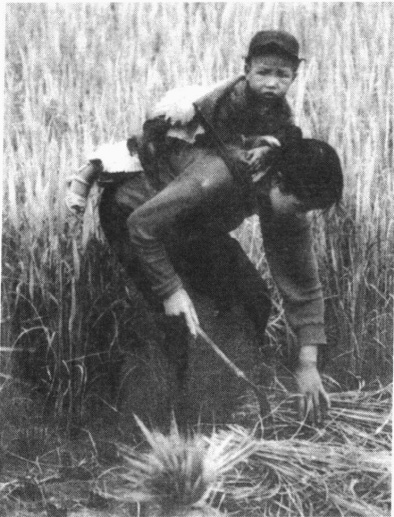
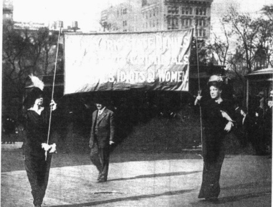
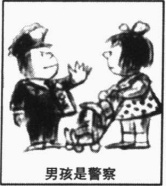
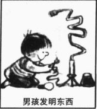
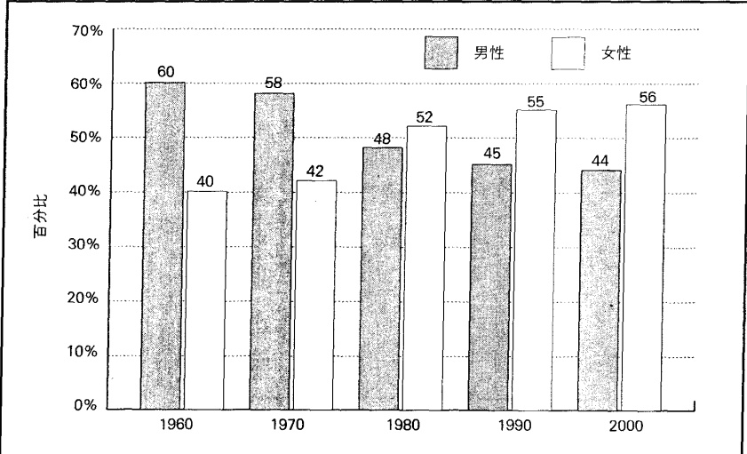
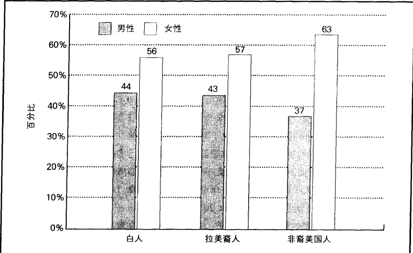
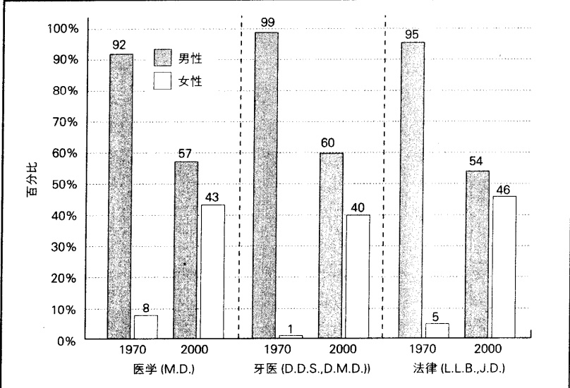
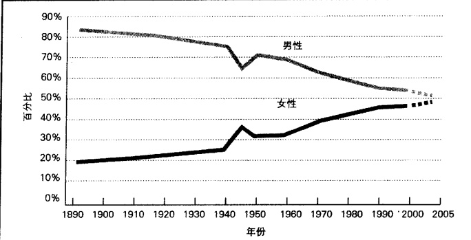
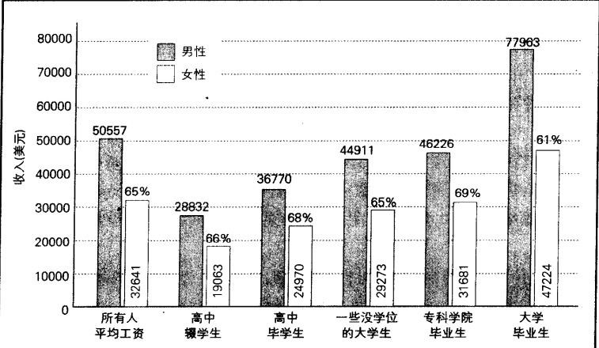
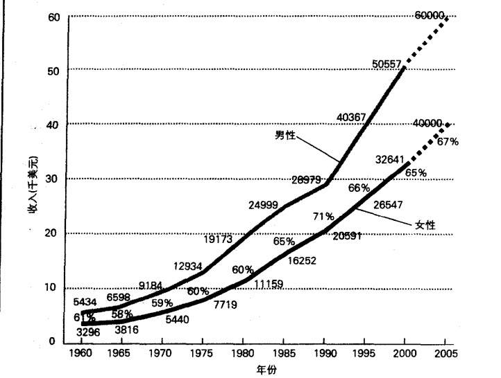

### 第 11 章 性别和社会性别

帕西塔·阿巴德《博卡的女人们》

---

· 性别和社会性别问题

行为的性别差异: 生物学还是文化?

社会学界占统治地位的观点

打开通向生物学之门

· 全球视野中的社会性别不平等

工作的性别分类

工作声望

全球性别歧视的其他领域

印度的劳动妇女

· 女性如何变成一个弱势群体

父权制的起源

<table border=1 style='margin: auto; word-wrap: break-word;'><tr><td style='text-align: center; word-wrap: break-word;'>· 性别和社会性别问题</td><td style='text-align: center; word-wrap: break-word;'>日常生活中的社会性别不平等</td><td style='text-align: center; word-wrap: break-word;'></td></tr><tr><td style='text-align: center; word-wrap: break-word;'>行为的性别差异:生物学还是文化?</td><td style='text-align: center; word-wrap: break-word;'>· 工作场所中的社会性别不平等报酬差距</td><td style='text-align: center; word-wrap: break-word;'></td></tr><tr><td style='text-align: center; word-wrap: break-word;'>社会学界占统治地位的观点</td><td style='text-align: center; word-wrap: break-word;'>玻璃天花板和玻璃自动梯</td><td style='text-align: center; word-wrap: break-word;'></td></tr><tr><td style='text-align: center; word-wrap: break-word;'>打开通向生物学之门</td><td style='text-align: center; word-wrap: break-word;'>“妈妈路”</td><td style='text-align: center; word-wrap: break-word;'></td></tr><tr><td style='text-align: center; word-wrap: break-word;'>· 全球视野中的社会性别不平等</td><td style='text-align: center; word-wrap: break-word;'>社会性别和对工人的控制</td><td style='text-align: center; word-wrap: break-word;'></td></tr><tr><td style='text-align: center; word-wrap: break-word;'>工作的性别分类</td><td style='text-align: center; word-wrap: break-word;'>性骚扰和更糟的情况</td><td style='text-align: center; word-wrap: break-word;'></td></tr><tr><td style='text-align: center; word-wrap: break-word;'>工作声望</td><td rowspan="2">· 社会性别和暴力对女性的暴力</td><td style='text-align: center; word-wrap: break-word;'></td></tr><tr><td style='text-align: center; word-wrap: break-word;'>全球性别歧视的其他领域</td><td style='text-align: center; word-wrap: break-word;'></td></tr><tr><td style='text-align: center; word-wrap: break-word;'>印度的劳动妇女</td><td rowspan="2">· 女性如何变成一个弱势群体</td><td style='text-align: center; word-wrap: break-word;'>女性主义和性别化的暴力对策</td></tr><tr><td style='text-align: center; word-wrap: break-word;'>· 父权制的起源</td><td style='text-align: center; word-wrap: break-word;'></td></tr><tr><td style='text-align: center; word-wrap: break-word;'>· 美国的社会性别不平等</td><td style='text-align: center; word-wrap: break-word;'>· 正在改变的政治形象</td><td style='text-align: center; word-wrap: break-word;'></td></tr><tr><td style='text-align: center; word-wrap: break-word;'>反击:女性主义的兴起</td><td rowspan="2">· 展望未来——充满希望</td><td style='text-align: center; word-wrap: break-word;'></td></tr><tr><td style='text-align: center; word-wrap: break-word;'>医疗保健中的社会性别不平等</td><td style='text-align: center; word-wrap: break-word;'></td></tr><tr><td style='text-align: center; word-wrap: break-word;'>教育中的社会性别不平等</td><td style='text-align: center; word-wrap: break-word;'>· 本章小结</td><td style='text-align: center; word-wrap: break-word;'></td></tr></table>

· 工作场所中的社会性别不平等  

报酬差距  

玻璃天花板和玻璃自动梯  

“妈妈路”  

社会性别和对工人的控制  

性骚扰和更糟的情况

·美国的社会性别不平等  

反击：女性主义的兴起  

医疗保健中的社会性别不平等  

教育中的社会性别不平等

· 社会性别和暴力

对女性的暴力

女性主义和性别化的暴力

对策

---

### 第 11 章 性别和社会性别

在非洲北部海岸突尼西亚的首都突尼斯，我遇到了一些来自美国的大学生，并和他们一块呆了两三天。他们想要看看突尼斯的红灯区，而我则怀疑这次旅行是否值得。我已经看过其他地区的一些红灯区，包括阿姆斯特丹那个非同一般的红灯区。在那里，政府给妓女们发放执照，要求她们做全身健康检查（执照必须出示，顾客可以核查），并为她们制订价格，在妓女退休后政府还会付给她们养老保险金。女人们坐在明亮的景观窗后面，男人们则沿着运河边的街道溜达，并从外面浏览（女人们）。

然而，这一次所看到的景象，却让我恶心不已。

我们来到一个延伸至地中海里的小码头。码头两边各有一排单居室的破烂小木屋，间间紧连。在每扇开着的门前都站着一位年轻女子。从外面看，阴暗狭小的小屋内，仅有一张破床。

这个码头挤满了正盯着那些女人看的男人们。他们中很多人都穿着水手制服，但是我不能确定这些制服是哪些国家的。

当我走得更近一些观察时，可以看见一些女人的大腿上有流脓的伤口。令人难以置信的是，虽然她们有病是再明显不过的，顾客们却仍在不断地进入小屋。显然，2美元的价格低得令人难以抗拒。

胃部的不适和想要呕吐的冲动，使我不得不和那些引诱人的女人们保持着适当的距离。在这两个街区，一次旅行就已经足够了。

我知道，在我看不见的地方，有一群男人，他们的财富来自于对这些女人的剥削，而她们短暂的生命中却充满恐惧和痛苦。

本章我们将考察社会性别分层(gender stratification)，即男性和女性获得权力、声望和财产的不平等的机会。社会性别之所以特别重要，是因为它是一种主导地位；也就是说，它贯穿了社会生活的所有方面。无论我们在生活中获得什么，我们都会被贴上男人或女人的标签。这些标签都带有关于我们应当如何行动的形象和期望。它们不仅会指导我们的行动，同时也是权力和特权的基础。

在这一章的迷人旅程中，我们将仔细审视全世界包括美国的性别不平等。我们将探索一下我们现在之所以这样，到底是由于生物因素还是由于文化因素，并分析一下性骚扰、报酬不平等和对女性的暴力问题。这次短途旅程将会为我们理解男女间的权力差异提供一个很好的知识背景——这种权力差异将会导致诸如我们开篇短文里所描述的那些情景。它也将会使你更加深刻地理解自己有关社会性别问题的体验。

### 性别和社会性别问题

当我们思考女性和男性有何区别时，通常首先进入脑海的就是性别(sex)，即用以区分男性和女性的生物特征。第一性征包括阴道或阴茎以及其他与生殖有关的器官，第二性征是存在于男女两性间那

---

些不直接与生殖有关的身体特征。在青春期，第二性征会变得非常明显，此时，男性形成更多的肌肉，有更低沉的嗓音和更多的体毛，身体也长高了；而女性则形成更多的脂肪组织和更宽大的臀部，同时胸部发育。

相比之下，社会性别是一种社会特征而不是生物特征。社会性别（gender）是由一个群体认为适合于男性和女性的任何行为和态度构成的。因此，社会性别随社会的不同而不同。性别是指男性或女性，社会性别则是指男性气质或女性气质。简言之，自然性别是与生俱来的；社会性别是习得的，即人们通过社会化习得了其所处文化认为适合于其性别的行为和态度。

与社会性别相联系的期望在世界范围内是不同的。它们的差别如此之大，以至于一些社会学家建议，我们应当用复数的男性气质和女性气质代替单数的男性气质和女性气质(Beynon,2002)。

社会性别的社会学意义，就在于它是社会用来控制其成员的一种手段。在性别的基础上社会性别将我们进行分类，使我们具有不同的生活经历。它开启和关闭了通向权力、财产甚至声望之门。与社会阶级一样，社会性别也是社会的一个结构特征。

在考察社会性别不平等之前，让我们先来思考一下为什么男人和女人的行为会有所不同。

### 行为的性别差异: 生物学还是文化?

为什么大多数男性比女性更具攻击性？为什么妇女从事“看护”职业比如护理，在数量上远远多于男人？在回答此类问题时，很多人的答案都是“他们生就如此”一类的说法。

这个回答确切吗？当然，生物因素在我们的生活中起着重要作用。我们每个人都始于一个受精卵。卵细胞来自我们的母亲，而使卵细胞受精的精虫则来自父亲。在卵细胞受精的那一刻，我们的性别就已经被决定了。我们每个人都有来自卵细胞和精虫的各23对染色体。卵细胞中有一个X染色体。如果使之受精的精虫也有一个X染色体，我们就会是一个女孩(XX)；如果精虫有一个Y染色体，我们就会成为一个男孩(XY)。

这是生物学的问题。现在，社会学的问题是：是这种生物性的差异控制着我们的行为吗？举例来说，是它使女性更具教养性和顺从性，而令男性更具攻击性并更加专横吗？让我们来看看社会学家所持的观点。

### 社会学界占统治地位的观点

占统治地位的社会学观点认为：社会因素，而不是生物因素，才是我们现在如此行为的原因。我们表现出的生理性别差异本身并没有什么意义。相反，每个人类群体对这些身体差异都有自己的解释，他们在这个基础上将男性和女性划入不同的群体。在那儿，人们知道对他们的期待是什么，同时被给予获得他们的社会权利的不同机会。

大多数社会学家发现,这个争论的引人注目之处在于,如果生物差异是人类行为不同的主要因素,那么在全世界范围内我们都将发现,女人是一种类型的人,男人是另一种类型的人。事实上,社会性别观念在不同文化之间的差异非常大——结果就是,男性和女性行为同样如此。下面的“批判性思考”专栏会继续讨论这个关于文化的主导性观点。

---

### 生物学与文化：答案是文化

对社会学家辛西娅·爱泼斯坦(Epstein,1986,1988,1989)来说，男女两性间的行为差异，完全是社会因素的结果——特别是社会化和社会控制的结果。她的理由如下：

1. 人类学上的记录表明，在过去，两性间的关系比我们所想象的更加平等。在早期社会，和男人一样，女人也要狩猎小动物、制造工具和采集食物。在狩猎采集社会，男人和女人扮演的角色同人们的刻板印象相比没有那么僵硬。例如，Agta 人和 Mbuti 人都是主张人人平等的。这就证明确实存在性别平等的狩猎和采集社会，在那里，女人并不是附属于男人的。人类学家声称，在这些社会里，在当时的发展水平下，女人有着一种独立但却平等的地位。

2. 在每个社会中，男人和女人所做工作的种类都是由社会安排决定的，而不是由生物因素决定的。很少有人能逃离这些安排，几乎每个人都会在为其指定的狭小的工作领域内工作。工作上的性别分工是为男人的利益服务的，非正式的习俗和正式的法律条文都强化了这一点。当这些社会结构壁垒被消除时，女人的劳动技巧其实和男人的相差并不大。

3. 生物因素会“引起”人类的某些行为，但是这仅限于生殖行为或生理结构上的差异等等。这些差异仅仅和少数活动有关，比如“打篮球”或“钻小洞”。

### 批判性思考

4. 在世界上很多地方，女性犯罪率正在上升。这就表明，攻击性，这种通常被认为是由生物因素所支配的男性行为，相反是与社会因素相联系的。当社会条件允许时，例如当女人成为律师时，她们也会变得“具有对抗性、自信、同时具有统治欲”。这并不是偶然的，女性在学术期刊上对男性提出的有关人类本质的偏见性观点提出了挑战，这是“支配性行为”的另一种表现形式。

简言之，不是“女性无法或不能阅读法律纲要、实施脑部手术、[或者]预言行情看涨的市场”，而是社会因素——社会化、性别歧视与社会控制的其他形式——造成了行为上的社会性别差异。那些以“进化论或基因因素”来解释女性和男性在行为上的差异的理论都过于简单。它们“依赖一种不确定的、经过高度选择的、语焉不详的资料，逻辑粗糙简单、不恰当地通过类比进行推论。”

### 打开通向生物学之门

然而“自然”与“教化”的问题并不会这么容易得到解决，许多社会学家也承认，除了生殖和分娩，某些人类行为也涉及生物因素(Udry，2000)。下面的“批判性思考”专栏提出了这一观点。艾丽斯·罗西，一个女性主义社会学家和美国社会学协会前任主席，暗示说：在“抚养孩子”上，女性的生理准备比男性更加充分。她(Rossi，1997，1984)断言，女性对婴儿柔软的皮肤和他们的非语言交流更为敏感、细致。罗西强调，这个问题不是要么是生物意义的，要么是社会意义的。相反，自然因素提供了生物特性，然后又披上了文化的外衣。

### 生物学与文化——答案是生物学

社会学家戈德堡(Steven Goldberg, 1974, 1986, 1993)认为, 许多人会怀疑“男性和女性内心深处的差异与我们称之为男子气和女人味的气质和情感差异的存在”, 这是令人惊讶的。戈德堡的论点——不是环境而是天生的差异使得男性和女性的情感及行为分别具有男子气和女人味——如下:

### 批判性思考

---

1. 人类学资料表明，有证据证明存在过的所有社会都是(或曾是)父权制社会(男性统治女性的社会)。关于曾长期存在的母权制社会(女性统治男性的社会)都是神话故事。

2. 在所有的社会里，不论是过去的还是现在的，高的社会地位总是与男性相联系。在每一个社会中，政治都是被“特权阶级操纵的，而这些特权阶级又被男性以压倒性的优势控制着”。

3. 男性统治社会是因为他们“有一个实施统治行为的较低门槛……以及在等级制和男女社会关系中，有更大的倾向在任何环境下采取一切必要手段以获得统治地位。”男性更愿意“牺牲掉其他动机的奖励——对爱、健康、家庭生活、安全感、休闲假期等的欲望——以获得统治权和地位。”

4. 正如一个身高 1.8 米的女性不能证明身高的社会基础一样，那些杰出的个体，比如获得很高成就和统治地位的女性，也并不能否定“行为的生理学基础”。

简言之，对于为什么每个社会——从俾格米人社会到瑞典社会——都把统治和成就与男性相联系的问题，仅有一个正确解释。男性统治社会，是“心理—生理学事实自然而然的结果”。社会化和社会制度仅仅反映了——有时夸大了——天生的倾向而已。除了“天生差异”，其他任何一种解释都是“错误的、无知的、有偏见的、内部逻辑混乱的，都与证据不一致，同时也很难令人相信。”认为男性之所以更具攻击性是由于他们以那种方式被社会化了，就相当于说男人能长胡须是因为男孩是那样被社会化了一样。承认这个现实并不是为歧视女性辩护。支持或反对社会如何对待这些基本的生物性差异并非问题所在。关键是生物因素导致了男性和女性不同的行为和态度——无论我们对此感受如何，以及我们是否希望它有所不同。

在社会学领域,为什么通向生物学之门被轻轻地打开了?让我们来看一起医疗事故以及一项关于越南老兵的研究。

一起医疗事故 这个戏剧性的事件始于 1963 年, 当时一对 7 个月大的双胞胎男婴被送到医生处做包皮割除手术 (Money and Ehrardt, 1972)。失职的医生在用一根加热的细针做手术时, 把电流开得过高, 一不小心烧毁了其中一个婴儿的阴茎。你可以想象, 当孩子父母知道发生了什么时, 是多么的不愿相信, 多么的痛心。

在这样的情形下能做些什么呢？伤害是难以挽回的。这对父母被告知，他们的孩子以后将无法与他人发生性关系。在经过几个月痛苦而悲伤的深思和专家咨询后，他们决定给孩子做变性手术。当他22个月大时，外科医生对其实施了阉割手术，使用他身上的皮肤作了一个阴道。之后，他们给他取了个新名字，叫布伦达，用绣满裙边的衣服打扮他，给他留长发，同时把他当成一个女孩子来对待。后来，医生又给布伦达注射了女性类固醇激素，以促进其女性特征的青春期发育（Colapinto，2001）。

一开始,结果是令人鼓舞的。当这对双胞胎4岁时,母亲说(请记住他们在生物学意义上是完全相同的):

真正使我困惑的一件事是她如此的女人气，我从没见过一个小女孩如此干净、整洁……她喜欢我给她洗脸，她不喜欢脏兮兮的。然而我的儿子却完全不同。无论如何我都不能给他洗脸。……当她穿上新裙子或我给她梳头时，她感到非常骄傲……她看上去非常优雅。（Money and Ehrardt，1972）大概一年后，这位母亲描述了他们的女儿是如何模仿她，而他们的儿子是如何模仿父亲的：

我发现我的儿子喜欢选择非常男性化的职业，比如消防员或警察……他想要做父亲做的事，在

---

父亲做事的地方工作，并带上一顿午餐……[女儿]则不喜欢其中任何一件事。她想要成为医生或老师……但是她从没想过要做一个警察或消防员之类的职业，那些对她来说毫无吸引力。（Money and Ehrardt, 1972）

如果事情这样明确，我们就可以用此案例下结论说：社会性别完全是后天培养的结果。然而生活中的事情不会这么简单，故事发生了转变。尽管有一个充满希望的开端和父母的培养，但是布伦达仍然无法很好地适应其女性角色。她更喜欢模仿父亲刮胡须，而不是学母亲涂化妆品。她讨厌洋娃娃，喜欢玩具枪和她兄弟的玩具。她喜欢粗野的和翻筋斗的游戏；同时坚持站着小便。同学们都嘲弄她，叫她“假小子”，因为她走起路来像个男孩子。14岁时，她因为痛打一个嘲笑她的女生而被学校开除。尽管有雌性激素疗法，但她对男孩子来说仍没什么吸引力。同年，因为对自身内部系统紊乱感到绝望，她意图自杀。终于，在一次令人悲伤的谈话中，她的父亲把那起医疗事故和她变性的事告诉了她。

“突然之间一切都豁然开朗了。第一次，事情对我来说有了意义。我终于明白了我是谁，我是什么”，布伦达谈及这次谈话时如是说。之后，大卫(他的新名字)接受了男性荷尔蒙注射，接着作了手术，恢复了部分阴茎。在25岁时，他和一个女人结婚并收养了她的小孩(Diamond and Sigmundson, 1997; Colapinto, 2001)。

关于越南老兵的研究 研究者一次又一次地发现，那些具有更高水平男性荷尔蒙的男孩和男人更具攻击性。在一项研究中，研究者将两个团体中男性大学生的男性荷尔蒙水平进行了比较，这两个团体一个是好争斗的“粗暴”团体，另一个则是因具有学术成就和社会责任感而享有盛名的团体。“粗暴”团体中的男性大学生具有更高水平的男性荷尔蒙（Dabbs et al., 1996）。而在另一项研究中，研究者发现，那些犯性侵犯和暴力犯罪的罪犯比经济罪犯具有更高水平的男性荷尔蒙（Dabbs et al., 1995）。然而，研究者所用的样本很小，这就使人怀疑，这项特定研究的结果也许是出于偶然。

1985年，美国政府开始了一项针对越南老兵健康的研究。为了确保这次研究具有代表性，研究者抽取了一个包含4462个个案的随机样本。在他们收集的数据中，有一项是对男性荷尔蒙的测试。现在，社会学家意外地获得了一个大规模的随机样本，它提供了关于人类行为的令人吃惊的线索。

这个样本支持了先前的研究，它表明：具有更高水平男性荷尔蒙的男人更具攻击性，并因此有更多的问题。在这些具有更高水平男性荷尔蒙的老兵还是小男孩时，他们就更喜欢给父母和老师制造麻烦，慢慢地他们走向了犯罪之路。成年后，他们更喜欢服用致瘾的毒品，和人打架，结果只能从事社会地位低下的工作，同时他们拥有大量的性伙

社会学家强调人类行为背后的社会因素和那些塑造我们的经验，正是这些使我们选择了不同的人生方向。从课文中所讨论的对越南士兵的研究，我们可以看出社会学的大门已慢慢向人类行为背后的生物因素打开。照片中的这个男人是第173空降旅狙击手巡逻队的一员，1966年6月，他们正行进在越南的Tuy省。

---

伴。了解了这些,你可能不会吃惊于他们同样更不太可能结婚——他们低报酬的工作和与警察的麻烦,使得他们不可能成为吸引人的婚姻候选人。而那些结了婚的,则更可能有风流韵事或殴打妻子,于是,他们也更可能离婚(Dabbs and Morris, 1990; Booth and Dabbs, 1993)。

对我们社会学家来说，幸运的是，关于越南老兵的研究，没有使我们把生物因素作为人类行为的唯一基础。并不是所有具有高水平男性荷尔蒙的人都会犯罪、在学校里表现差劲或虐待妻子。实际上，一个主要的差异是社会阶级。同样具有高水平男性荷尔蒙、来自较高社会阶级的男人的反社会行为，比起那些来自较低社会阶级的男人的要低得多(Dabbs and Morris, 1990)。因此，社会因素(社会化、生活目标、自我定位等)同样起了一定作用。此外，冲突会刺激男性荷尔蒙的分泌，因此，我们不能确定，高水平的男性荷尔蒙究竟是冲突的起因还是结果(Mazur and Michalek, 1998)。社会学家十分感兴趣的，便是揭示社会因素，并发现它们是如何与男性荷尔蒙共同发挥作用的。

### ▷▷小结

我们必须等待进一步的研究，但是最初的研究结果也是令人非常感兴趣的。它们揭示了：一些在我们社会学家看来应完全归因于社会化的行为，同样也受生物因素的影响。这些发现虽然是初步的，但却意义重大，同时也颇受争议。在接下来的几年里，这将被证明是一个令人兴奋的——也是有争议的——社会学研究领域。研究的第一个层次是要确定任何行为是否都可以仅仅归因于生物因素。第二个层次是发现社会因素如何影响生物因素。按照社会学家珍尼特·查菲茨（Chafetz，1990：30）的说法，第三个层次则要确定“差异”如何渐渐转化为“不平等”。

### ■全球视野中的社会性别不平等

一些分析家推测，在狩猎采集社会中，女性和男性是平等的社会个体（Leacock，1981；Hendrix，1994）。很明显，园艺社会的性别歧视也比我们现代社会少得多（Collins et al., 1993）。在这些社会，女人对其群体食物总量的贡献率也许会达到60%。然而，在回顾了历史资料之后，历史学家和女性主义者格尔达·勒纳（Lerner，1986）得出结论，“作为一个群体的女性拥有超过男性群体的决策权，这样的社会从未有过。”

让我们简短地概述一下全球社会性别不平等的某些方面。

### 工作的性别分类

人类学家乔治·默多克(Murdock, 1937) 调查了世界上 324 个社会。他发现，在这些社会，所有的活动都是按性别分类的。换言之，每个社会都将活动与一种性别或另一种性别相联系。他同样也发现，在一个社会里被认为是“女性”的活动，在另一个社会里也许会被认为是“男性”的活动。例如，在一些群体中，照看家畜是女人的工作，而另一些群体则把这项工作派给男人去做。

金属加工业是个例外；在乔治·默多克调查的所有社会中，它都被视为男人的工作。另外三种职业——制造武器、追捕海洋哺乳动物与狩猎——也大都由男性来从事。然而，在少数社会，女人也参与这些活动。虽然默多克没有发现普遍地只分派给女人做的特定工作，但是他发现，做衣服、煮饭、担水以及碾米等工作几乎总被认为是女人的工作。但在少数社会，这些活动也被认为是男人的工作。

---

从默多克的跨文化调查中，我们可以得出结论：并不是生物因素要求男女从事不同的工作。生理解剖上的异同，并非一定导致从事特定的职业，正如我们所见到的，在一个社会里被认为是女性的职业，在另一社会里也许会被认为是男性的职业，反之亦然。

### 工作声望

你也许会问,这种劳动分工是否真的说明了社会不平等。它是否只是任意地划分劳动的不同形式,而并非性别歧视呢?

有可能是这样。但我们却发现，普遍来说，男性从事的活动具有更高的声望——不管那些活动是什么(Linton, 1936; Rosaldo, 1974)。如果饲养山羊是男人的工作，人们会认为它很重要并给予它很高的声望；但如果这是女性的工作，人们就会认为它不太重要并给予它较低的声望。或者，举一个与家庭有关的例子，过去，接生是“女人的工作”，而且它是由产婆来做的，所以它的声望很低。但是，当男人接管了这项工作后，它的声望就提高了(Ehrenreich and English, 1973)。简言之，不是工作，而是与之相联系的性别，带来了声望。

### 全球性别歧视的其他领域

让我们简略地看一下全球性别歧视的另外四个方面。之后，当我们集中讨论美国时，我们将会更详细地考察这些方面。

教育 全世界几乎有 10 亿成年人不识字；其中 2/3 是女性（“State of…” 2001）。表 11.1 列出了世界范围内那些会读写的女性人数不足一半的国家，这更进一步说明了这一点。在其中任何一个国家，男性的受教育率都高于女性。该表也表明了文盲是成片存在的，因为这 32 个国家中有 22 个在非洲。

表 11.1 不能读写的女性和男性百分比

<table border=1 style='margin: auto; word-wrap: break-word;'><tr><td style='text-align: center; word-wrap: break-word;'>国家</td><td style='text-align: center; word-wrap: break-word;'>女性</td><td style='text-align: center; word-wrap: break-word;'>男性</td><td style='text-align: center; word-wrap: break-word;'>国家</td><td style='text-align: center; word-wrap: break-word;'>女性</td><td style='text-align: center; word-wrap: break-word;'>男性</td></tr><tr><td style='text-align: center; word-wrap: break-word;'>尼日尔</td><td style='text-align: center; word-wrap: break-word;'>92%</td><td style='text-align: center; word-wrap: break-word;'>76%</td><td style='text-align: center; word-wrap: break-word;'>不丹</td><td style='text-align: center; word-wrap: break-word;'>66%</td><td style='text-align: center; word-wrap: break-word;'>39%</td></tr><tr><td style='text-align: center; word-wrap: break-word;'>布基纳法索</td><td style='text-align: center; word-wrap: break-word;'>86%</td><td style='text-align: center; word-wrap: break-word;'>66%</td><td style='text-align: center; word-wrap: break-word;'>利比亚</td><td style='text-align: center; word-wrap: break-word;'>64%</td><td style='text-align: center; word-wrap: break-word;'>38%</td></tr><tr><td style='text-align: center; word-wrap: break-word;'>几内亚比绍</td><td style='text-align: center; word-wrap: break-word;'>81%</td><td style='text-align: center; word-wrap: break-word;'>40%</td><td style='text-align: center; word-wrap: break-word;'>摩洛哥</td><td style='text-align: center; word-wrap: break-word;'>64%</td><td style='text-align: center; word-wrap: break-word;'>38%</td></tr><tr><td style='text-align: center; word-wrap: break-word;'>巴基斯坦</td><td style='text-align: center; word-wrap: break-word;'>79%</td><td style='text-align: center; word-wrap: break-word;'>40%</td><td style='text-align: center; word-wrap: break-word;'>利比里亚</td><td style='text-align: center; word-wrap: break-word;'>62%</td><td style='text-align: center; word-wrap: break-word;'>30%</td></tr><tr><td style='text-align: center; word-wrap: break-word;'>阿富汗</td><td style='text-align: center; word-wrap: break-word;'>78%</td><td style='text-align: center; word-wrap: break-word;'>48%</td><td style='text-align: center; word-wrap: break-word;'>科特迪瓦</td><td style='text-align: center; word-wrap: break-word;'>61%</td><td style='text-align: center; word-wrap: break-word;'>45%</td></tr><tr><td style='text-align: center; word-wrap: break-word;'>塞拉里昂</td><td style='text-align: center; word-wrap: break-word;'>77%</td><td style='text-align: center; word-wrap: break-word;'>49%</td><td style='text-align: center; word-wrap: break-word;'>布隆迪</td><td style='text-align: center; word-wrap: break-word;'>59%</td><td style='text-align: center; word-wrap: break-word;'>43%</td></tr><tr><td style='text-align: center; word-wrap: break-word;'>尼泊尔</td><td style='text-align: center; word-wrap: break-word;'>76%</td><td style='text-align: center; word-wrap: break-word;'>41%</td><td style='text-align: center; word-wrap: break-word;'>多哥</td><td style='text-align: center; word-wrap: break-word;'>59%</td><td style='text-align: center; word-wrap: break-word;'>25%</td></tr><tr><td style='text-align: center; word-wrap: break-word;'>贝宁</td><td style='text-align: center; word-wrap: break-word;'>75%</td><td style='text-align: center; word-wrap: break-word;'>43%</td><td style='text-align: center; word-wrap: break-word;'>埃及</td><td style='text-align: center; word-wrap: break-word;'>56%</td><td style='text-align: center; word-wrap: break-word;'>33%</td></tr><tr><td style='text-align: center; word-wrap: break-word;'>也门</td><td style='text-align: center; word-wrap: break-word;'>75%</td><td style='text-align: center; word-wrap: break-word;'>32%</td><td style='text-align: center; word-wrap: break-word;'>中非共和国</td><td style='text-align: center; word-wrap: break-word;'>55%</td><td style='text-align: center; word-wrap: break-word;'>40%</td></tr><tr><td style='text-align: center; word-wrap: break-word;'>塞内加尔</td><td style='text-align: center; word-wrap: break-word;'>72%</td><td style='text-align: center; word-wrap: break-word;'>53%</td><td style='text-align: center; word-wrap: break-word;'>厄立特里亚</td><td style='text-align: center; word-wrap: break-word;'>55%</td><td style='text-align: center; word-wrap: break-word;'>33%</td></tr><tr><td style='text-align: center; word-wrap: break-word;'>莫桑比克</td><td style='text-align: center; word-wrap: break-word;'>71%</td><td style='text-align: center; word-wrap: break-word;'>40%</td><td style='text-align: center; word-wrap: break-word;'>印度</td><td style='text-align: center; word-wrap: break-word;'>55%</td><td style='text-align: center; word-wrap: break-word;'>32%</td></tr><tr><td style='text-align: center; word-wrap: break-word;'>孟加拉国</td><td style='text-align: center; word-wrap: break-word;'>70%</td><td style='text-align: center; word-wrap: break-word;'>48%</td><td style='text-align: center; word-wrap: break-word;'>伊拉克</td><td style='text-align: center; word-wrap: break-word;'>54%</td><td style='text-align: center; word-wrap: break-word;'>34%</td></tr><tr><td style='text-align: center; word-wrap: break-word;'>毛里坦尼亚</td><td style='text-align: center; word-wrap: break-word;'>68%</td><td style='text-align: center; word-wrap: break-word;'>47%</td><td style='text-align: center; word-wrap: break-word;'>苏丹</td><td style='text-align: center; word-wrap: break-word;'>54%</td><td style='text-align: center; word-wrap: break-word;'>30%</td></tr></table>

---

<table border=1 style='margin: auto; word-wrap: break-word;'><tr><td style='text-align: center; word-wrap: break-word;'>国家</td><td style='text-align: center; word-wrap: break-word;'>女性</td><td style='text-align: center; word-wrap: break-word;'>男性</td><td style='text-align: center; word-wrap: break-word;'>国家</td><td style='text-align: center; word-wrap: break-word;'>女性</td><td style='text-align: center; word-wrap: break-word;'>男性</td></tr><tr><td style='text-align: center; word-wrap: break-word;'>埃塞俄比亚</td><td style='text-align: center; word-wrap: break-word;'>67%</td><td style='text-align: center; word-wrap: break-word;'>56%</td><td style='text-align: center; word-wrap: break-word;'>马拉维</td><td style='text-align: center; word-wrap: break-word;'>53%</td><td style='text-align: center; word-wrap: break-word;'>25%</td></tr><tr><td style='text-align: center; word-wrap: break-word;'>老挝</td><td style='text-align: center; word-wrap: break-word;'>67%</td><td style='text-align: center; word-wrap: break-word;'>36%</td><td style='text-align: center; word-wrap: break-word;'>海地</td><td style='text-align: center; word-wrap: break-word;'>52%</td><td style='text-align: center; word-wrap: break-word;'>48%</td></tr><tr><td style='text-align: center; word-wrap: break-word;'>马里</td><td style='text-align: center; word-wrap: break-word;'>66%</td><td style='text-align: center; word-wrap: break-word;'>51%</td><td style='text-align: center; word-wrap: break-word;'>查德</td><td style='text-align: center; word-wrap: break-word;'>66%</td><td style='text-align: center; word-wrap: break-word;'>48%</td></tr></table>

识字女性低于半数的国家。

资料来源：“Women of Our World”.2002.

政治 在世界范围内，女性缺乏获得国家事务决策权的平等机会：在任何一个国家的议会里，女性成员的数量都要少于男性。在瑞典，女性几乎拥有平等的代表权，43%的议员是女性。但在某些国家，比如日本和伊朗，女议员所占比例总共只有1%（“Women of …”2002）。在科威特和阿拉伯联合酋长国，女性甚至没有选举权（Crossette，1995a，b）。在大多数国家的议会和国会里，女性大约占11%的席位。

报酬差距 在每一个国家，女性的平均报酬都比男性低。在美国，全职女性的收入平均只有男性收入的65%（图11.8），而在韩国，女性所得收入只有男性的一半（Monk-Turner and Turner, 2000）。

对女性的暴力 一个全球性的人权问题就是对女性的暴力问题。历史上的例子包括：中国的缠足、欧洲的女巫火刑以及印度的殉夫自焚(把活着的寡妇和她死去的丈夫一同火化)。现在我们也有这样的例子：强奸、虐妻、杀害女婴和强迫卖淫，就像我们在开篇短文中所讲的那样。现在最恶名昭著的事件就是女性割礼，即下面“世界文化多样性”中的话题。

### 世界文化多样性

### 女性割礼

“躺在那里，”那个切割者指着地上的席子，突然对我说道[当时她12岁]。我一躺下，立刻就感到我那瘦弱的双腿被人紧紧抓住并被分得很开……在我两边的两个女人将我按在地上固定住……我的小阴唇和部分阴蒂先后被切除。手术好像永无止境。我在肉体和精神上都经历着无比的巨痛，感觉就像整个人被撕裂了。我这个年龄的女孩在这种情况下是不能哭泣的，这是规矩。我打破了这个规矩，我因为疼痛而大声哭泣和尖叫……！

后来他们强迫我，不仅要我走回那些已被实施割礼的女孩中去，而且还要我和她们一起跳舞。我尽力去做，但是稍后我昏厥了……我完全恢复健康足足用了一个月。当我感觉好些时，每个人都嘲笑我，他们说我不够勇敢。（Walker and Parmar，1993：107—108）

在部分非洲穆斯林地区以及马来西亚和印度尼西亚的部分地区，女性割礼非常普遍。它经常被西方人称作女性生殖器的切除，这个风俗习惯也常被称为阴蒂切除、阴蒂切割、阴部扣锁法与阴唇切割，其叫法视被切除部分的多少而定。在全世界，有1亿—2亿女性被实施了割礼。在埃及，则有97%的女性被实施了割礼（Boyle et al., 2001）。

在一些文化里，只切除女孩的阴蒂；而在另一些文化里，被切除的部分则更多。在苏丹努比亚区，人们把女孩的大部分生殖器都切除了，然后把残留的外部边缘缝合起来。他们把女孩的腿从脚踝一直绑至腰部达数周之久，在这期间疤痕组织能使阴道愈合。他们留下一个铅笔大小的小孔作为小便和月经的通道。

在大多数群体里，都是在女孩4—8岁之间做

---

此手术。在一些文化里，则是在孩子出生后7—10天内做此手术。而在另一些文化里，它直到女孩进入青春期后才实施。因为这个手术通常是不实行麻醉的，因此剧烈的疼痛使得成年人不得不将女孩子们紧紧按住。在城市里，医生有时也会做这个手术；而在农村地区，往往是由一个邻家女人来做。

害怕、流血、感染、不育和死亡，种种危险都可能发生。常见的副作用是阴道痉挛、性交疼痛和缺乏高潮。当尿和月经积聚于那个小孔后面时，尿道感染也常发生。

当一个女人结婚后，小孔会被开大些以便性交。在一些群体里，这是丈夫的责任。在女人生孩子之前，这个小孔会被进一步扩大。生产之后，阴道被再次缝合，如外科手术般的开、关循环始于每一次生产之时。

这个习俗的原因是什么呢？一些群体相信它能减少女性对性的欲望，使女性更有可能在婚前保持处女之身，同时，婚后则能确保她对丈夫保持忠贞。另外一些群体则认为，它能提高女性的生育能力和保持阴道清洁。

女性主义者把女性割礼称作控制女性性欲的一种痛苦仪式。他们指出，实行这种习俗的社会是男性统治的社会。母亲帮助实施手术，是因为在这些社会，没有实施割礼的女性被视为是不纯洁的，而且是不允许结婚的。祖母们出于对她们孙女婚姻幸福的关心，而维持了这个习俗。

变革正在来临。布基纳法索、几内亚、马里和尼日利亚四个国家的第一夫人谴责了这一习俗（Lacey，2003）。在肯尼亚，两个女孩接到了法院制止她们的父亲对其实施割礼的判决文件。这使她们所在的社区大为震惊，但是律师提醒法院，肯尼亚已经签署了人权条约。

### 思考题

你认为美国应该尽力使其他国家停止这一习俗吗？或者这是一种种族中心主义的偏见，是西方文化价值对他族文化的强行干预？就像一位索马里妇女所说的，“索马里女性并不需要一个外国女人来告诉她如何对待她的私密处。”你认为，对于一种文化的成员来说，他们介入另一文化的合法基础是什么？

资料来源: Manran（1978, 1981）; Ebomoyi（1987）; Lightfoot-Klein（1989）; Merwine（1993）; Walker and Parmar（1993）; Chalkley（1997）; Collymore（2000）; "Kenya……" 2001。

“为名誉而死”是另一种对女性施暴的形式。在一些社会里，比如巴基斯坦、约旦和库尔德斯坦，如果人们认为一个女人给她的家族带来了耻辱，她将会被一位男性亲属处死——通常是其兄弟或丈夫，但经常也会是她的父亲或叔伯。是什么事如此严重地威胁了其家族荣誉以至于女儿或妻子要被杀死？通常的原因是婚外性行为。在伊拉克，即使一个女人是被强奸的，她也会身处绝境，成为为家族荣誉而死的牺牲品（Banerjee，2003）。杀掉这个女孩或女人就可以消除她带给家族的“污点”，恢复家族在社区里的名誉。警方一般不太重视为名誉而死的事件，他们把这类事看做是家务事。

### 女性如何变成一个弱势群体

在世界上，社会性别是人们之间最主要的划分方式。每个社会都以性别为基础设置了壁垒，使得女性和男性在获得权力、财产和声望方面拥有不平等的机会。因而，社会学家把女性归为一个弱势群体。而在大多数国家，女性在数量上都多于男性，因此你也许会对这种归类感到奇怪。然而，这个术语是恰当的，因为它指的是由于生理或文化特征而受到歧视的人们，并不考虑他们的数量（Hacker，1951）。

女性一直都是弱势群体吗？如我们所见，一些分析家推测，在园艺和渔猎采集社会，女性和男性也许

---

一个关于父权制起源的理论是围绕生育展开的。因为只有女人能够生育孩子，所以她们就要承担与家庭和孩子抚养有关的工作，而男人要去打猎，并且从事维持生存的工作，这种工作需要更强的力量、更快的速度和离开家庭。这个中国贵州的女人，在收割稻谷的同时，还要照顾她的孩子，与她的女性祖先数千年以来所做的一样。

具有社会平等性——或者至少会比我们现在有更少的性别歧视。那么，全球范围内的女性又是如何成为系统地受到歧视的群体呢？让我们来看一下对此所提出的主要理论。

### 父权制的起源

关于父权制(男性统治社会)起源的主要理论，指向了人类再生产的社会结果(Lerner,1986; Friedl,1990)。在早期人类的历史中，人的生命短暂，为了繁殖人类群体，人们不得不多生孩子。因为只有女性才能怀孕，怀胎九个月，生产以及哺乳，因此女性的大部分时间都被限制在这些活动当中。为了能活下去，婴儿需要一个抚养照顾他/她的母亲。因为有一个小孩绑在胸前或孕育在子宫里、背在臀上或背上，女人在体力上受到了阻碍。因而，在全世界，女性承担起了与照顾家庭和孩子相联系的工作，而男人则从事猎取大动物和其他需要更快的速度和长时间远离居住地的工作(Huber,1990)。

结果，男人逐渐成为了统治者。正是他们，离开居住地去猎取动物，同其他部落建立联系，与其他群体做交易，以及同他们争吵打仗。同样也是男人制造和掌管杀人工具和用于狩猎、打仗的武器。他们在交易中积聚财产，并通过带着战俘或所猎取的用以养活全体部落成

员的大猎物耀武扬威地返回赢得声望。相比之下，女人所从事的工作往往是普通的、日常的、被视为理所当然的，她们不被认为是为了群体而冒生命危险，因此，这些工作所获得的声望较低。最终，男人统治了整个社会。他们的武器、贸易条款，以及在与其他群体接触时所获得的知识，逐渐成为他们权力的

阿拉伯妇女身穿的长袍被许多人视为男性统治的一种形式，这种男性统治压迫女人的个性、自由和性。在阿富汗的塔利班政权被美国军队推翻之后，妇女们干的第一件事就是脱掉了她们的长袍和面纱。

来源。女性成为二等公民，服从于男性的决定。

这种理论正确吗？请记住答案早已湮没在历史中，而且也没有方法可以检验它。男性统治也许是因为一些完全不同的原因。例如，人类学家马文·哈里斯（Harris，1977）提出，这是因为大多数男人都比女人强壮，而在部落群体里赤身肉搏的战斗是必要的，男人成为了战士，女人则成为诱使他们进行战斗的奖励。恩格斯提出父权制社会是伴随着私有制的起源而形成的（Lerner，1986；Mezentseva，2001）。然而，他无法解释为什么私有制导致了男性统治。格尔达·勒纳（Lerner，1986）提出，或许父权制社会在不同的地方有不同的起源。

---

不论起源是什么，一种循环思维系统已经形成了。男人开始认为自己天生是优越的——基于他们统治社会这一证据。他们用保密和精心设计的规则和仪式把许多活动包裹起来，以免被女性“玷污”，而女性在那个时代则被公开认为是劣等的。甚至在今天，父权制也常常伴随着文化的支持，这种文化支持意图证明男性统治是合理的，比如将一些活动归入“不适合”女性的范围。

随着部落发展成为更大的群体，享受权力和特权的男人们继续维持着他们的统治。打猎和赤身肉搏战早已不再是日常事务，人们也早已无需生很多孩子以延续人类群体，然而，男人仍然紧抓着他们的权力不放。于是，现代社会的男性统治，就成为具有几千年历史的古老模式的一种延续，而这种模式的源头早已隐入历史。

### 美国的社会性别不平等

社会性别不平等并不是一些偶然的、随意的事情。相反，一个社会的各种制度都会联合起来，共同维持该社会不平等的特定形式。而在整个历史进程中都受到尊崇的习俗，既证明了这些安排的合理性，同时也维持着这些安排。虽然男人拒绝和女人分享他们的特权，但是变革已经到来。

### 反击: 女性主义的兴起

为了看看我们到底走了多远，有必要先看一下我们过去所在的地方。在早期美国社会，女性被理所当然地看做二等公民。一对夫妻在法律上被看做一个人——他（Chafetz and Dworkin，1986）。女人不能进陪审团，也不能参加选举，制订法律合同，或是以她自己的名义拥有财产。我们的时代变化如此之大，以至于这些例子听起来就像是虚构的一样。

冲突理论的一个主要思想是：权力产生特权；像磁铁一样，权力把全社会最好的资源都吸引到精英身边。由于男性紧紧抓住他们的特权不放，并运用社会制度来维持其地位，所以女性的基本权利就只能通过长期而艰苦的斗争来实现。

女性主义认为生物因素不是决定性的，认为社会性别分层是错误的，应当予以抵制。这一观点遭到了强烈的反对——那些害怕失去特权的男人反对它，那些认为在道德上是正确的从而接受自身地位的女人也反对它。例如，1894年，珍妮特·吉尔德认为女人不应当有选举权，因为“政治太具公众性，太令人疲惫，同时也太不适合女人的本性”（Crossen，2003）。

之后被视为参政权扩大论者的女性主义者同这种观点进行了斗争。1916年，她们成立了“全国女党”，1917年她们开始在白宫周围示威抗议。在示威抗议了6个月之后，那些女性被逮捕了。数百人被送进监狱，包括全国女党的两个领导人

妇女争取平等权利的路是漫长而艰难的。这张1919年的照片展现的是女权运动的第一次浪潮。只有抵制住了男人们的强烈反对，美国妇女才赢得了选举权。妇女们在1920年第一次参加了全国选举。

---

卢西·伯恩斯和艾丽斯·保罗。这些女性使男性特权受到威胁的程度，可以从她们在监狱里的遭遇得到证明：

两个男人将多萝西·戴 [一个拥护女性权利的周刊编辑] 带了进来，(他们) 把她的胳膊拧到她的头上面，然后突然把她举起来，两次把她摔在铁板凳上……在被捆绑得像个面粉袋一样的刘易斯夫人被带进来之前，他们已在那里呆了一段时间。她的头撞在铁板床上，然后就不省人事地倒在了地上。至于卢西·伯恩斯，他们把手铐拷在她的手腕上，然后把手铐越过她的头部固定在牢房的门上。(Cowley, 1969)

女权运动的第一次浪潮有一个想要改革全社会所有制度的自由主义分支，以及一个关心赢得女性选举权的保守主义分支(Freedman,2001)。保守派占据主导地位，在1920年赢得选举权后，这次运动就基本上结束了。

图 11.1

通过看过去，我们可以了解我们究竟走了多远。一本20世纪70年代的儿童书本中的插图表明了当时的思想倾向。你可以了解在这段时期长大的孩子被灌输了何种社会性别观和工作观。

资料来源：Anthony Cortese, Provocateur: Images of Women and Minorities in Advertising, 2nd ed. Boulder, CO: Rowman and Little Publishers, 2003.

---

第二次浪潮始于20世纪60年代。社会学家珍尼特·查菲茨(Chafetz，1990)指出，直到现在，大多数女性仍把工作看做用来填补结束学业后和结婚前这段时间的一种暂时性活动。从图11.1中我们可以看到，孩子们的书本是如何强化这种思想的。然而，随着更多的女性参加工作，她们开始把工作视为事业。女性开始将自己的工作条件和男性进行比较。参照群体的转变也改变了她们看待自身工作条件的方式。结果是出现了第二次反对社会性别不平等的浪潮。第二次浪潮(今天仍在继续)的目标非常宽泛，其范围从提高女性的工作报酬到改变侵害女性的有关政策。

女权运动的第二次浪潮同样也有自由主义和保守主义两个分支。虽然双方对于社会性别平等应当是什么样的各持不同观点，但是它们也有一些共同的目标，包括要求工作机会和报酬平等。自由主义和保守主义都有一个极端支翼。在自由主义方面，极端分子要求反对所有男人；在保守主义方面，极端分子更希望回归传统的家庭角色。所有的派别——无论是激进主义还是保守主义——都宣称代表着当今女性的“真正”需求。从这些宣言和对立宣言来看，女权运动将会继续塑造和影响公共政策。

女性主义运动的第三次浪潮正在兴起。有三个主要方面已经变得非常明显。首先是对工业化程度最低国家女性问题的更大关注(Patel，1997；Spivak，2000)。其次是对统治着工作和社会的价值观的批判。一些女性主义者认为，竞争、情绪沉稳、刚毅和独立代表着“男性”品质，它们应当为合作、开放、糅合和相互依赖所代替(England，2000)。再次是去除女性在情感和愉悦方面的障碍物(Gilligan，2002)。随着第三次浪潮的发展，我们同样可以假定，它也会有自由主义和保守主义分支。

虽然当今女性享有了基本的权利，但社会性别不平等仍在社会生活中继续扮演着重要角色。让我们看一下医疗保健、教育和日常生活方面的性别关系，然后更详细地看一下工作领域内的性别歧视。

### 医疗保健中的社会性别不平等

在第 19 章,我们将进一步讨论医学中的性别歧视问题,现在让我们先来思考一下,医疗保健中的性别歧视如何成为一个生死攸关的问题。这是下面的“现实社会学”专栏的话题。

### 现实社会学

### 隐蔽的性别歧视可以是致命的

医学研究者感到很困惑，因为来自全国各地的报告显示：在实施心脏搭桥术后，女性的死亡率是男性的两倍。洛杉矶 Cedars-Sinai 医学中心的研究者核查了他们自己的记录：在 2330 名接受心脏搭桥术的病人中，4.6% 的女性死于此手术，相比之下，男性的死亡率只有 2.6%。

这些发现提出了一个社会学上的难题。为了解决这个难题，研究者首先转向了生物学（Bishop，1990）。在心脏搭桥术里，一条血管被从身体某一部位取出，然后缝合到心脏表面的一条动脉里。也许这个手术在女性身上实施起来更困难，因为她们的心脏动脉较小。为了证实这一点，研究者测算了医生在手术时将病人置于人工心肺机上的时间总量。他们惊奇地发现，女性在心肺机上的时间要比男性少。这表明，对女性实施此手术并不会更困难。

正如研究者所证实的，一个令人惊讶的答案出

---

现了: 无意识的性别歧视。医生在检查女病人的胸部疼痛时并不像检查男病人那么认真。他们更愿意给男病人做压力练习测试和放射性心脏扫描。在发现不正常的压力测试结果时,他们会送男病人去做手术,但是对女病人,却要等到她们出现明显的心脏疾病症状时,才送她们去做手术。在病情恶化后才动手术,肯定会大大降低存活的机会。

随着越来越多的女性成为医生，这种情况也许会有所改变。我们知道，女医生更可能让(女病人)做乳腺切片和乳房X光照片(Lurie et al., 1993)。因此，她们可能会对女性的健康状况更为敏感。如果是这样，更多的女病人都会愿意选择女医生。而为了增强竞争力，男医生同样也不得不对女病人的健康问题更为上心些。

### 思考题

简言之，性别偏见如此普遍，以至于我们无意识中也会受其影响，同时它是如此严重，以至于成了一个生死攸关的问题。值得注意的是，这些被研究的医生并没有歧视任何人的意图。性别偏见以什么样的方式影响着你的观念和行为？

### 教育中的社会性别不平等

同样，对以往教育的简单了解，也能更清楚地说明现在的教育状况。直到1832年，女性才被允许和男性一起进入大学。最早接受女学生的是俄亥俄州的奥柏林学院，但是她们必须在公众集会时保持沉默，给男学生洗衣服，打扫房间，同时还要伺候他们的一日三餐(Flexner，1971)。

教育者认为女性不适合接受高等教育，因为她们的女性器官控制着她们的思想。谈到月经，哈佛大学的埃德华·克拉克博士用下面这种方式表达了那种占统治地位的观点：

在一定时期，因特定原由，女孩受生理所限不得不承受着沉重的生理负担，这致使她们与同样大的男孩相比，无法将同样多的精力用于学校的课业，因为生理因素对这些男孩的限制较少。（Andersen, 1988）

因为女性如此虚弱,所以克拉克极力主张,她们只需学习男性所学知识的1/3即可——同时在月经期间完全不必学习。

像过时的衣服一样，这些观念早已被丢弃，女性进入大学的人数在不断增加。改变是如此之大，以至于如今的大学生中有56%是女性(见图11.2)。女性在所有获得学士学位的学生里占57%，而在获得硕士学位的学生里占58%(Statistical Abstract 2002: Table 276)。因为男性现在落后了，一些人开始要求对男性采取积极行动，特别是对非裔美国男性(Kleinfeld,2002a)。想要知道为什么，可参见图11.3。

图 11.4 显示了另一个主要变化。从此图中你可以看到女性是如何增加她们在专业学位中所占的份额的。最大的改变发生在牙科。1970 年，全美国仅有 34 位女性获得牙科学学位。而在今天，每年大约有 1700 名女性成为牙医。

女性获得比男性更多的学士和硕士学位及其进入专门职业领域的人数不断增长，确实是对过去的突破。然而，如果我们探究表面之下的事实，我们仍能发现一些旧习。例如，人们通常认为女性运动不像男性运动那么重要(Fisher，2002)。每当我参加高中足球或篮球比赛时，都能看见一群穿着鲜艳短裙的女生站在边线上为男生疯狂欢呼——但是在女生比赛时却没有一群这样的男生有组织地为她们欢呼。

---

图 11.2 从性别角度看大学入学率的改变

美国大学生女性和男性的百分比各为多少？

资料来源：Statistical Abstract 1991；Table 261；2002；Table 260。

图 11.3 当今大学生按性别和种族—民族分布

资料来源：Statistical Abstract 2002；Table 260。

注：资料来源中仅包括这些群体。

---

图 11.4 专业学位中的性别比例变化

资料来源：Statistical Abstract 2002；Table 281。

然后还有一个按性别分轨的问题；也就是说，学位倾向于按性别分组，它强化了两性间的差别。这里有两个极端的例子：在工程学这一“男性”领域，男性获得了81%的学士学位；而女性则获得了家政这一“女性”领域内88%的学士学位（Statistical Abstract 2000: Table 279）。因为性别社会化培养了男性和女性不同的生活取向，所以他们带着与性别相关的抱负进入大学。是他们的社会化——而不是一些假定的天生特征——将男性和女性分流至不同的教育轨道。

如果我们进一步跟随学生进入研究生学院，我们会发现每年女性的比例都会下降。表 11.2 使我们简单了解了自然科学领域的博士生分布情况。请注意抱负（入学）和成绩（获得博士学位）是如何与性别相关联的。在这些博士招生领域，男性比女性多的有 5 个，而女性比男性多的有 3 个（其中有两个领域男女数量差别很小）。然而，在所有的领域里，女性都更不可能取得博士学位。

如果我们跟随那些获得博士学位的人考察他们在学院或大学里的教学职业，我们会发现在等级和报酬方面也存在性别分层。在全美国，女性成为正教授、获得最高报酬和最高声望的可能性较小。在私立和公立学院，教授的工资平均是大学讲师的2倍（Statistical Abstract 2002: Table 272）。即使女性成为了正教授，她们的平均工资也要低于男性正教授（Wood, 2001）。

除了报酬差距，还存在着更为微妙和更普遍的歧视。同男教授相比，女教授往往不被认真对待。正如哈佛大学教授芭芭拉·格罗斯指出的(Zernike, 2001b)：

第一次被错认为秘书，你会觉得有趣。而第99次就不会了。那些家伙(男教授)第一次不让

---

表 11.2 科学领域中博士学位的性别分布

<table border=1 style='margin: auto; word-wrap: break-word;'><tr><td rowspan="2">专业领域</td><td colspan="2">录取的学生</td><td colspan="2">授予博士学位的学生</td><td colspan="2">获学位比率(比期望值高或低)</td></tr><tr><td style='text-align: center; word-wrap: break-word;'>女性</td><td style='text-align: center; word-wrap: break-word;'>男性</td><td style='text-align: center; word-wrap: break-word;'>女性</td><td style='text-align: center; word-wrap: break-word;'>男性</td><td style='text-align: center; word-wrap: break-word;'>女性</td><td style='text-align: center; word-wrap: break-word;'>男性</td></tr><tr><td style='text-align: center; word-wrap: break-word;'>计算机科学</td><td style='text-align: center; word-wrap: break-word;'>29%</td><td style='text-align: center; word-wrap: break-word;'>71%</td><td style='text-align: center; word-wrap: break-word;'>16%</td><td style='text-align: center; word-wrap: break-word;'>84%</td><td style='text-align: center; word-wrap: break-word;'>-44</td><td style='text-align: center; word-wrap: break-word;'>+18</td></tr><tr><td style='text-align: center; word-wrap: break-word;'>工程学</td><td style='text-align: center; word-wrap: break-word;'>20%</td><td style='text-align: center; word-wrap: break-word;'>80%</td><td style='text-align: center; word-wrap: break-word;'>16%</td><td style='text-align: center; word-wrap: break-word;'>84%</td><td style='text-align: center; word-wrap: break-word;'>-25</td><td style='text-align: center; word-wrap: break-word;'>+5</td></tr><tr><td style='text-align: center; word-wrap: break-word;'>农学</td><td style='text-align: center; word-wrap: break-word;'>42%</td><td style='text-align: center; word-wrap: break-word;'>58%</td><td style='text-align: center; word-wrap: break-word;'>29%</td><td style='text-align: center; word-wrap: break-word;'>71%</td><td style='text-align: center; word-wrap: break-word;'>-31</td><td style='text-align: center; word-wrap: break-word;'>+22</td></tr><tr><td style='text-align: center; word-wrap: break-word;'>数学</td><td style='text-align: center; word-wrap: break-word;'>35%</td><td style='text-align: center; word-wrap: break-word;'>65%</td><td style='text-align: center; word-wrap: break-word;'>25%</td><td style='text-align: center; word-wrap: break-word;'>75%</td><td style='text-align: center; word-wrap: break-word;'>-29</td><td style='text-align: center; word-wrap: break-word;'>+15</td></tr><tr><td style='text-align: center; word-wrap: break-word;'>物理科学</td><td style='text-align: center; word-wrap: break-word;'>30%</td><td style='text-align: center; word-wrap: break-word;'>70%</td><td style='text-align: center; word-wrap: break-word;'>24%</td><td style='text-align: center; word-wrap: break-word;'>76%</td><td style='text-align: center; word-wrap: break-word;'>-20</td><td style='text-align: center; word-wrap: break-word;'>+9</td></tr><tr><td style='text-align: center; word-wrap: break-word;'>社会科学</td><td style='text-align: center; word-wrap: break-word;'>51%</td><td style='text-align: center; word-wrap: break-word;'>49%</td><td style='text-align: center; word-wrap: break-word;'>43%</td><td style='text-align: center; word-wrap: break-word;'>57%</td><td style='text-align: center; word-wrap: break-word;'>-16</td><td style='text-align: center; word-wrap: break-word;'>+16</td></tr><tr><td style='text-align: center; word-wrap: break-word;'>生物科学</td><td style='text-align: center; word-wrap: break-word;'>52%</td><td style='text-align: center; word-wrap: break-word;'>48%</td><td style='text-align: center; word-wrap: break-word;'>46%</td><td style='text-align: center; word-wrap: break-word;'>55%</td><td style='text-align: center; word-wrap: break-word;'>-12</td><td style='text-align: center; word-wrap: break-word;'>+15</td></tr><tr><td style='text-align: center; word-wrap: break-word;'>心理学</td><td style='text-align: center; word-wrap: break-word;'>72%</td><td style='text-align: center; word-wrap: break-word;'>28%</td><td style='text-align: center; word-wrap: break-word;'>67%</td><td style='text-align: center; word-wrap: break-word;'>33%</td><td style='text-align: center; word-wrap: break-word;'>-7</td><td style='text-align: center; word-wrap: break-word;'>+18</td></tr></table>

* 获学位比率的公式为 $  (X-Y)/Y  $，其中X为被授予博士学位的人的比例，Y为攻读博士学位的人的比例。资料来源：Statistical Abstract 2002: Table 769,771。

你参加会议讨论，你会想，“我才不感兴趣呢。”但是整整一年都不让你参加此类讨论，就是一种明确的侵害。

### 日常生活中的社会性别不平等

我们可以审视日常生活中性别歧视的诸多方面，但是我们的篇幅只允许我们看两个方面：美国社会中女性气质的普遍贬值，以及谈话中的男性统治。

### 对女性一切事情的普遍贬值

斜靠在饮水机上的两个男人(都是下层经理人员)捧着他们的咖啡杯，讨论着上个星期天“巨人队”的比赛，尽可能地推迟回去工作的时间。

一个[男性的]副主管经过时，听到他们正在谈论比赛。他会停下来，勒令他们返回办公桌工作吗？他会皱眉头吗？很可能不会。 $ \underset{\cdot}{作} $为一个男人，他更可能停下来加入谈话，急于证明他也是“男孩中的一员”，佯装对足球感兴趣而实际上他也许根本就不懂。这些男人——办公室所有的男人——都是他的部下，他的战友。现在，让我们假设，两个女人正站在饮水机旁讨论着任何你所感兴趣的话题：女性解放运动、服饰、工作、任何话题——当然，除了足球。这个副主管经过时看见了她们，之后，他会怒气冲冲地走进大厅，不断地谩骂，并且考虑为此事而抱怨那些本该在工作却聚在一块闲聊的坏女人是否值得——抱怨给谁听呢？“难道她们不知道”，他将会用100万个男人说过的话来质问，“这是办公室吗？”(Korda,1973:20—21)

就如这个情节所指明的那样，女性的兴趣、态度和贡献并没有像男人的那样受到认真对待。男性气质被赋予更高的价值，因为它代表着力量和成功；而女性气质则被贬低，因为它被认为是软弱和缺乏成就的象征。

---

社会学家塞缪尔·斯托弗进行了一项针对二战中战斗士兵的经典研究。在《美国士兵》(Stouffer，1949)一书里，他报道说，军官用有关女性的词语作为一种侮辱来激励士兵。如果他们表现出的勇气或忍耐力比人们预期的少，他们就会有不被认为是男人的危险。一个军官也许会说：“怎么回事，兄弟——在绣花吗？”一代人之后，在越战中仍有军官把女性气质作为一种侮辱用于激励士兵作战。教官会以嘲讽的口吻说：“做不到吧，小姑娘？”(Eisenhart，1975)这一习惯仍在继续。那些在演习中稍显迟疑的人会被其他人嘲弄，并被他们称为姑娘(Miller，2001)。

在体育运动中我们可以看到同样的事情。人类学家道格拉斯·弗雷(Foley,2001)曾提到，足球教练会辱骂那些做得不好的男孩，说他们“穿着裙子”，同时社会学家唐纳·埃德(Eder,1995)注意到，如果初中男生踢足球时踢得不够用力的话，他们会被同伴称作“姑娘”。社会学家琼·斯托卡德和米里娅姆·约翰逊(Stockard and Johnson,1980)观察了那些打篮球的男生，听到他们称那个丢了球的人为“女人”。在职业冰球比赛中，那些在冰上不够勇猛的运动员常被叫做“姑娘”(Gallmeier,1988:227)。

这些侮辱代表了对女性的贬低。就像斯托卡德和约翰逊(Stockard and Johnson, 1980: 12)所指出的，“在女性之间并没有这种类似的现象，因为年轻的女孩不会通过称呼对方为‘男人’来侮辱对方。”

谈话中的性别不平等 也许你已经发现,男人比女人更有可能打断谈话。他们也更有可能控制话题的转换。社会学家注意到,一个男人和一个女人之间的谈话经常更像是雇主和雇员之间的谈话,而不像社会平等个体之间的谈话(West and Garcia, 1988; Smith-Lovin and Brody, 1989; Tannen, 1990, 2003)。简言之,男性和女性之间的谈话,反映了他们在社会中的相对权力地位。

打断谈话和用 “女人” 及 “姑娘” 作为一种侮辱性话语，仅仅是冰山的一角。以社会性别为基础的结构性不平等遍布整个社会，潜在于日常生活的方方面面。让我们来看看工作场所中这种结构性特征。

### ☑ 工作场所中的社会性别不平等

分析工作背景,有助于看清男性和女性之间的基本关系。让我们从报酬差距入手,这是工作中性别不平等的一个最值得注意的领域。

### 报酬差距

美国劳动力的最主要特征之一,就是外出就业挣钱的女性数量呈稳定增长趋势。图11.5表明,1890年大约5个工人中有一个是女性。1940年这个比率增至1:4,1960年是1:3,现在则几乎达到1:2。

外出就业的女性在美国各地并不是平均分布的。女性的居住地不同，她们外出就业的可能性也不同。这种地理分布模式，反映了地域性亚文化的差异，而对于这些差异我们现在还知之甚少。

大学毕业后，你也许想休息几年，旅游一下，坐在棕榈树下喝喝菠萝鸡尾酒。但是，你更可能会参加工作。既然你不得不工作，那么通过你的工作再多赚120万美元，你觉得怎么样呢？如果这听起来确实吸引人，就请接着读下去。我将解释一下你如何才能在25—65岁之间每个月多挣2500美元。

这做起来很难吗？实际上，它对某些人来说非常简单，但对有些人来说则是不可能的。就像图 11.6 显示的那样，你所要做的仅仅是生为男人和毕业于大学。如果我们比较一下正式职工，就会发现那些毕

---

图 11.5 美国劳动力中的性别比例

注：在 1940 年之前的总数里包括 14 岁及以上的女性；在 1940 年之后的总数里是 16 岁及以上的女性。虚线部分是作者的推测。

资料来源：作者据1969年Handbook on Women Workers，1969: 10；Manpower Report to the President, 1971: 203，205；Mills and Palumbo, 1980: 6,45；Statistical Abstract 2002；Table 564 整理而成。

业于大学的普通男性在其整个职业生涯中赚了更多的钱。没有任何一个单一因素能比这额外的百万美元更准确地描述性别歧视。但是，这里有另外一个因素。就像你从图 11.6 中所看到的，那些大学毕业的普通女性的报酬，仅仅和那些从大学里辍学的普通男性一样多。你同样可以看到这种报酬差距在教育的各个层面上都有所体现。

图 11.6 按教育划分的报酬的性别差距 $ ^{1} $

1. 各行业的正式职工。

2. 学士学位和所有更高的学位，包括专业学位。

资料来源：作者据 Statistical Abstract 2002, Table 666 整理而成。

报酬差距如此之大，以至于美国女性正式工的报酬平均只有男性的65%。下图11.7表明报酬差距在过去更严重。你可以发现，在20世纪80年代报酬差距有所缩小，但在90年代它又处于增长状态。现在它退回到了15年前的水平。报酬的性别差距不只发生在美国，它在所有工业化国家中都存在。

在报酬的性别差距背后存在着什么逻辑？前面，我们了解了大学学位和性别是相联系的，因此，这

---

图 11.7 各年的报酬差距：女性收入占男性收入的百分比是多少？

注：从 1990 年到 1995 年的收入差别扩大可能是由于统计程序造成的。1995 年的资料（用于 1990 年的收入统计）使用的是“中间收入”，而 1997 年的资料（用于 1995 年的收入统计）仅仅说是“平均收入”。而这个“平均”是怎样计算出来的则没有说明。要想分析这一差别所在，可参看表 5.2。虚线部分是作者的推测。

资料来源：作者据 Statistical Abstract 1995: Table 739; 2002: Table 666，以及更早年份的资料整理。

种差距也许是由于职业选择的不同。也许女性更可能选择低酬劳的工作，比如在小学教书，而男人则更可能进入报酬较高的工作领域，比如商业和工程师行业。事实上，这是真的。研究者已经发现，约有半数报酬差距可归于这些因素。那么，其他因素是什么呢？它包括性别歧视(Kemp，1990；Jacobs，2003)和所谓的“孩子妨碍”——女性在照看孩子时会错失工作经验（“Redefining…”2000；Hundley，2001）。

于是，依据你的性别不同，你要么会从报酬的性别差距中获益，要么会成为它的受害者。因为报酬的性别差距在你自己的工作生活中如此重要，所以我们要对一些大学毕业生进行考察，看看报酬差距实际上是怎么产生的。经济学家雷克斯·富勒和理查德·舍嫩伯格（Fuller and Schoenberger，1991）分析了威斯康辛大学商科专业学生的起薪，其中47%是女生。他们发现女性的起薪平均比男性低11%（1737美元）。

也许你会想到一些造成这种最初报酬差距的可能的合理原因。比如，女性也许不够能干，也许她们的学业成绩较低，或者也许她们完成的实习较少。如果是这样，她们就应该得到较低的工资。为了找出结果，富勒和舍嫩伯格复查了这些学生的大学履历。他们发现，令人惊奇的是，女学生的学业成绩更高，参加的实习也更多。换句话说，如果女性同样能干，她们只能获得较低的工资——同时，如果她们更为能干，她们所获得的工资仍然较低——这是一种经典的双输结局。

在这些毕业生工作一段时间后情况又如何呢？会不会在几年之后，女性渐渐能和男性挣的钱一样多？富勒和舍嫩伯格于5年后核查了他们的工资，结果发现，报酬差距不仅没有变小，反而扩大了。此时，女性挣得的工资比男性低14%（3615美元）。

---

现在来看看关于美国报酬性别差距程度的最后一个指标。在美国500家大企业(所谓的“财富500强”)中，只有5家企业是由女性领导的(Hehir，2001)。5家，这已经是一个破纪录的数字了！我查看了美国最大的350家企业的执行总裁的名字。我发现，你要想爬到最顶端最好叫这样的名字(按下面这个顺序)：约翰、罗伯特、詹姆斯、威廉姆或查尔斯。爱德华、劳伦斯和理查德也不错。然而，安蓓尔、凯瑟琳、莱蒂西亚以及玛莉亚就明显处于不利境地。为你的小女孩取名约翰或罗伯特也许看起来有点残酷，但这能帮助她获得高位(我这样说并不仅仅是开玩笑)。

### 玻璃天花板和玻璃自动梯

是什么使女性不能冲破玻璃天花板（glass ceiling）——使女人无法达到执行主管位置的无形障碍？研究者找到了一条直接影响公司命脉，并能达到高层的职位“渠道”——推销、销售及生产（Reich，1995；Clarke，2000）。那些占据执行主管位置的男人，刻板地认为女性的领导能力不如男性（Heilman，2001）。因为认为女人擅长做“支持者”，他们建议女人进入人力资源部门或公关部门。在那里，成功的项目并不能得到很高的评价，因为它并没有直接给公司带来利益——也没有给经理们带来奖金。

玻璃天花板如此强有力的另一个原因，是女性缺乏优秀的指导者，即对她们感兴趣并愿意传授她们专业技能的成功的执行主管。这一点并非无足轻重，因为指导者能为她们提供机会，帮助她们发展领导技能，从而为她们开启通往执行主管职位的大门(Heilman,2001)。

然而，玻璃天花板正在解体 (Solomon, 2000; Lane, 2002)。看看那些冲破玻璃天花板的女性，她们都是些有着强烈成功动机和竞争意识的人。为了获取职业上的进步，她们甘愿放弃睡眠和娱乐。她们也学会了按“男人的规则”办事，养成了一种使男人觉得舒服的作风。这类女性中的大多数也都有支持她们的丈夫，他们分担家务并调整自己的职业，以适应他们执行官妻子的需要 (Lublin, 1996)。

还有所谓的玻璃自动梯：社会学家克里斯蒂娜·威廉斯(Williams, 1995)访问了在传统的女性工作领域内工作的男性和女性——像护士、小学教师、图书管理员和社会工作者。从事这些工作的男性发现他们自己正坐在了玻璃自动梯(glass escalator)上，因此他们不必用头撞击玻璃天花板。他们被给予了更高的职位、更称心如意的工作任务和更高的薪水。推动玻璃自动梯的动力是社会性别，即因为他们是男性所以是更有能力的这种刻板印象。

### “妈妈路”

大多数女性，即使是全职女性，都承担着照顾小孩和做家务的基本职责。为了帮助解决这个矛盾，费利斯·施瓦茨（Schwartz，1989）建议，公司应该提供给女性两个平行的职业路径，允许她们在这两者之间作出选择。高强度的“快车道”需要女性外出开会，带一个塞满工作的公文包，那些工作有时必须在晚上和周末完成。对于处在“妈妈路”（这一路径既强调工作又强调家庭）上的女人，人们的期望会少一些。

“妈妈路”遭到了猛烈批评。批评家说，它鼓励女性满足于较低的工资和较少的升职机会，并将女性限制在公司的低级职位。除非我们有一个“爸爸路”，否则“妈妈路”也假设抚育孩子是女人的工作（Starrels，1992）。他们认为解决工作与家庭间矛盾的更好方法是，男人担负起家庭中更大的责任，公司为职工提供

---

实地的日护、灵活的工作计划和带薪的父母假期。另一些人则坚持认为，家庭和工作之间的选择是人为的，有大量以家庭为取向的成功女性存在，从美国高等法院的法官桑德拉·奥康纳和鲁思·金斯伯格到物理学家和宇航员安·费希尔，都是很好的榜样。

### 社会性别和对工人的控制

冲突理论家分析了资本家是如何利用工人间的性别划分来控制工人的。这并没有以一种公开的形式出现，比如说“男人们，如果你们不同意我们所提出的，我们将雇佣女人来代替你们。”相反，所有者和经理以一种微妙的方式划分工人。举例来说，一个硅谷制造厂要求工人穿工作服，并规定了工作服的颜色。男人工作服的颜色取决于他所从事的特定工作，但所有的女人，不论她们从事何种工作，都穿同样颜色的工作服。

为什么管理层会有如此一种策略呢？研究这些工人的社会学家卡伦·霍斯菲尔德（Karen Hossfeld，2000）认为，这里的潜台词是：无论你的工作是什么，你首先是个女人。鼓励女性不把自己视作工人而是视作女性工人，会使她们更容易被控制。比如，卡伦·霍斯菲尔德发现，如果她们的老板与其调情，女人们较少提出抱怨。

这家公司的时事通讯上有一个“女士角”。因为在时事通讯上没有“男士角”，所以其所传递的微妙信息，说明这个时事通讯是定向于男性的，只是有一点点的空间留给女人。也就是说，男性是真正的工人，但是这里也有女人。

### 性骚扰和更糟的情况

性骚扰(sexual harassment)——在工作中或学校里令人不悦的对性的关注,它也许会影响一个人的工作表现或导致一种敌对的工作环境——直到20世纪70年代才被视为一个问题。在此之前,女性将令人讨厌的具有性意味的评论、接触、注视和性要求看做是个人私事。

伴随着女性运动的推动，女性认识到工作中和学校里不受欢迎的性接近是结构性问题的一部分。也就是说，她们不再将性骚扰简单地看做是一个男人由于受到一个女人的吸引而作出令人不悦的事情，而是将其视作男人为了将不受欢迎的性行为强加于女性身上而滥用个人的权威地位。由于女性已经拥有了权威地位，因此她们也成为了性骚扰者（Wayne et al. 2001）。然而，由于大多数的权威都授予了男性，所以大多数的性骚扰者也都是男性。

正如符号互动论者所强调的，术语影响了我们的观点。因为我们使用了性骚扰一词，所以我们会以一种不同于我们前辈的观点来理解行为。然而，性骚扰的含义是模糊的、易变的，同时法院诉讼案件也在不断地改变着该词语所包含和不包含的内容。最初，性欲望是性骚扰的一个要素，但是现在则不是了。这种改变源于美国最高法院受理的一个同性恋的诉讼案。此人被他的领导和同事所骚扰，感到痛苦万分。法院裁决，性欲望并非必要的，有关性骚扰的法律同样适用于那些在工作中受到异性恋者骚扰的同性恋者（Felsentha，1998）。

性骚扰的核心是权力的滥用。我们将在下面的“批判性思考”部分深入讨论这个话题。

---

### 军队里的性骚扰和对女性的强奸

有女性在西点军校遭受了强奸！另外还有女性在美国空军学院被强奸！

这些报纸头条和电视新闻插播似乎有些耸人听闻。但就在这一次，事实被证明是令人震惊的。那些军校女学员为了成为美国军队中的军官而在军校中学习，但是她们却被她们军校的同学强暴了。

当这些女学员报告了她们所遭受的攻击时，她们很快受到了惩罚。女学员发现她们自己被指责喝酒和与上等阶级的男性交往，而她们对男性的大部分指控都被忽视了。唯一接受军事法庭审判的那个男性被宣告无罪(Schemo,2003)。

这些引起了国会的注意。随后举行了听证会，空军学院司令官被撤职。

几年前，马里兰阿伯丁实验基地的一些陆军军士因强迫女性新兵与他们发生性关系而受到指控（McIntyre，1997）。这些教官虽宣称其性行为是双方自愿的，但仍被判决为强奸罪名成立。一位已婚的军士承认他与11名新兵发生过双方自愿的性关系（在军队里，通奸是有罪的）。他因先后18次强奸了另外六名新兵而被以强奸罪判处有期徒刑25年。

陆军委派了精干的专门小组调查部队里的性骚扰问题。当在全陆军41万名未受任命的军官里地位最高的吉思·麦金尼少校被任命到这个委员会时，他被指控犯有此罪，以前的下属指控他性骚扰（Shenon，1997）。麦金尼被免职并接受了军事法庭的审判。虽然他的性骚扰罪名未能成立，但他本人却因犯有妨碍司法公正罪而被严厉斥责并被降级。他的那些愤怒的指控者宣称军队为了保全麦金尼牺牲了她们。

一个民间小组建议，整个军队应该保持团结，但是各排(最小的军队单位，由50个士兵组成)应该根据性别分开(Mersereau,1998)。海军部门并不喜欢这种建议，声称它要让男人和女人在一块工作并住在一块，因为他们将呆在同一艘船上。于是陆军和海军仍一切照旧。

虽然军队里的强奸被军队全体人员所掩盖，但它并非一个孤立事件。对女性退伍老兵的一个随机样本进行访问的研究者发现，有4/5的人在她们服役期间受到过性骚扰，有30%的人成为强奸未遂或强奸的受害者。在那些被强奸的女性里，1/3的人被多次强奸。3/4的被强奸女性没有报告她们被人强暴的事情(Sadler et al., 2003)。

### 思考题

我们怎样才能建立一种防线将军队里的性骚扰和强奸减至最低程度？我们能在这样做的同时还将男女放在一起受训吗？还能让男女同睡在一个兵营里、同坐一艘船吗？仔细想想你将要建立的这种防线。

### 社会性别和暴力

美国暴力事件的高发率震惊了外国人，同时也使许多美国人感到害怕。仅仅在两三代人之前，许多美国人还不锁家门和汽车。现在，由于害怕有人劫车，许多人即使在驾车时也将他们的车上锁。由于害怕孩子被强奸或绑架，许多父母亲自护送他们的孩子去上学。隐藏在这些恐惧之后的是暴力的性别不平等——女性更可能成为男性的受害者，而不是相反。让我们简短地分析一下这一几乎是单向的性别暴力。

### 对女性的暴力

在上面的“批判性思考”部分，我们看到了军队里的强奸问题；在前面部分，我们考察了其他文化中对女性的暴力；在第16章我们将分析家庭暴力。在此，由于篇幅所限，我们只能简单地看一下暴力的一些主要特征。

---

暴力强奸 害怕被强奸是美国女性一种普遍的恐惧。就像我们前面所讨论的军队里的强奸一样，她们这种害怕是有根据的。美国联邦调查局的统计资料显示，每年，每一万名12岁以上的女性里就有7个遭到强奸。然而，在全国犯罪受害人调查里，我们发现，仅有32%的强奸受害人向警方报案（Statistical Abstract 2002: Table 290及第180页）。所以更精确的数字是官方统计率的3倍，即每一万人里有21个而不是7个受害人。尽管这些数字很高，但是，女性现在比几年前安全多了，因为在过去十年里强奸案有所减少。

虽然强奸受害人包括小孩、老弱的女人，但是典型的受害人却是12—24岁的年轻女性。与刻板印象相反，大多数受害人都认识强奸她们的人。只有大约2/5（38%）的强奸案是陌生人所犯（Statistical Abstract 2002: Table 295,296）。

监狱里对男性的强奸也是强奸的一个方面，但它通常会被忽视。因为监狱里的官员不愿让公众知晓铁栏背后的可怕情形，我们的研究还远不完善。然而，我们现有的资料表明，在监狱里，大约有15%—20%的男性被强奸。从法庭案件里我们了解到，一些狱警通过把囚犯和性侵犯者关在一间牢房对其进行惩罚（Donaldson, 1993; Lewin, 2001b）。

约会(熟人)强奸 研究表明，令许多人大为震惊的约会强奸(也被称作熟人强奸)并不是由一些孤立事件组成的(Collymore,2000;Goode,2001)。一些研究者甚至报告说，多数女学生都有过不情愿的、被迫的、强迫的性经历(Kalof,2000)。其他人所报告的数字要较小一些。研究者使用了一组有代表性的样本对俄亥俄州一个私立学校(玛丽埃塔学院)的女生进行了调查。他们发现2.5%的女生曾被强迫发生性行为(Felon et al.,2001)。大约有与女性(24%)同样数量的男性(23%)曾在不愿意时，迫于压力而发生性关系，但是——这并不令人吃惊——没有一个男性是完全被逼发生性关系的。

大多数约会强奸都没有报案。一个最主要的原因是，受害人觉得自己应负部分责任，因为她认识这个人并自愿与他在一起。然而，正如一个治疗约会强奸受害人的医生所说，“如果一个人用铲子敲你的头部，你会感到自己也有责任吗——仅仅因为你认识这个人？”(Carpenito,1999)

谋杀 表 11.3 概括了性别与美国谋杀方式间的关系。注意，虽然女性在全国总人口中稍稍多于 51%，但是女性占杀人犯的比例却远低于 51%。同样值得注意的是，1/4 的谋杀受害人是女性——而 9/10 的杀人犯是男性。

表 11.3 杀人犯与受害人

家庭暴力 女性同样是家庭暴力的典型受害者。配偶殴打、婚内强奸和乱伦将在第16章进行讨论。对

<table border=1 style='margin: auto; word-wrap: break-word;'><tr><td style='text-align: center; word-wrap: break-word;'>受害人</td><td style='text-align: center; word-wrap: break-word;'>杀人犯</td></tr><tr><td style='text-align: center; word-wrap: break-word;'>女性 24%</td><td style='text-align: center; word-wrap: break-word;'>女性 10%</td></tr><tr><td style='text-align: center; word-wrap: break-word;'>男性 76%</td><td style='text-align: center; word-wrap: break-word;'>男性 90%</td></tr></table>

资料来源：Statistical Abstract 2002: Table 288, 299。

女性暴力的一种典型形式，女性割礼，是前面的“文化多样性”专栏讨论的焦点。

刑事司法制度中的女性 性别和暴力还有另一面。虽然女性更不可能杀人，但是当她们确实杀了人时，法官往往倾向于对她们更仁慈。如表 11.4 所示，女杀人犯更可能被判缓刑（同抢劫、盗窃和所有列举在此表中的犯罪一样）。对性别的刻板印象很可能存在于这些判决之中——诸如这种想法：女性比男性的威胁更小，应当再给她一次机会。还有可能是因为当女被告被指控犯罪时，她们的犯罪记录（“刑事犯登记表”）更少一些。在这方面我们还需做进一步研究。

---

表 11.4 女性更容易被开脱

当男性和女性犯同样的罪时，谁更容易被开脱？

<table border=1 style='margin: auto; word-wrap: break-word;'><tr><td rowspan="2">罪行</td><td colspan="2">判刑</td><td colspan="2">缓刑</td></tr><tr><td style='text-align: center; word-wrap: break-word;'>男性</td><td style='text-align: center; word-wrap: break-word;'>女性</td><td style='text-align: center; word-wrap: break-word;'>男性</td><td style='text-align: center; word-wrap: break-word;'>女性</td></tr><tr><td style='text-align: center; word-wrap: break-word;'>谋杀</td><td style='text-align: center; word-wrap: break-word;'>97%</td><td style='text-align: center; word-wrap: break-word;'>89%</td><td style='text-align: center; word-wrap: break-word;'>1%</td><td style='text-align: center; word-wrap: break-word;'>5%</td></tr><tr><td style='text-align: center; word-wrap: break-word;'>抢劫</td><td style='text-align: center; word-wrap: break-word;'>78%</td><td style='text-align: center; word-wrap: break-word;'>67%</td><td style='text-align: center; word-wrap: break-word;'>9%</td><td style='text-align: center; word-wrap: break-word;'>13%</td></tr><tr><td style='text-align: center; word-wrap: break-word;'>入室行窃</td><td style='text-align: center; word-wrap: break-word;'>55%</td><td style='text-align: center; word-wrap: break-word;'>43%</td><td style='text-align: center; word-wrap: break-word;'>19%</td><td style='text-align: center; word-wrap: break-word;'>23%</td></tr><tr><td style='text-align: center; word-wrap: break-word;'>恶意伤害</td><td style='text-align: center; word-wrap: break-word;'>54%</td><td style='text-align: center; word-wrap: break-word;'>30%</td><td style='text-align: center; word-wrap: break-word;'>18%</td><td style='text-align: center; word-wrap: break-word;'>26%</td></tr><tr><td style='text-align: center; word-wrap: break-word;'>盗窃罪</td><td style='text-align: center; word-wrap: break-word;'>42%</td><td style='text-align: center; word-wrap: break-word;'>28%</td><td style='text-align: center; word-wrap: break-word;'>24%</td><td style='text-align: center; word-wrap: break-word;'>34%</td></tr><tr><td style='text-align: center; word-wrap: break-word;'>诈骗罪</td><td style='text-align: center; word-wrap: break-word;'>39%</td><td style='text-align: center; word-wrap: break-word;'>31%</td><td style='text-align: center; word-wrap: break-word;'>28%</td><td style='text-align: center; word-wrap: break-word;'>41%</td></tr><tr><td style='text-align: center; word-wrap: break-word;'>贩毒罪</td><td style='text-align: center; word-wrap: break-word;'>50%</td><td style='text-align: center; word-wrap: break-word;'>37%</td><td style='text-align: center; word-wrap: break-word;'>20%</td><td style='text-align: center; word-wrap: break-word;'>26%</td></tr><tr><td style='text-align: center; word-wrap: break-word;'>私藏枪械罪</td><td style='text-align: center; word-wrap: break-word;'>49%</td><td style='text-align: center; word-wrap: break-word;'>28%</td><td style='text-align: center; word-wrap: break-word;'>22%</td><td style='text-align: center; word-wrap: break-word;'>30%</td></tr></table>

资料来源：Sourcebook of Criminal Justice Statistical 1997: Table 5.50。(在后来的版本中此表被删掉了。)

### 女性主义和性别化的暴力

女性主义社会学家曾做过特别有效的努力，以使对女性的暴力问题能引起公众的关注。一些人依据符号互动论指出，把力量和男子气概同暴力联系起来——正如美国文化的许多领域所表现的那样——将会增加暴力。还有一些人采用了冲突理论。他们提出，男性正在失去其权力。因此，一些男人会对女性实施暴力，以此作为维持其日渐降低的权力和地位的一种途径(Resier，1999)。也许这就是下面的“社会生活中的大众媒体”专栏所讲的暴力的原因之一。

### 社会生活中的大众媒体

### 美丽与疼痛：一个广告值多少钱？

“超级能手”（日本一个很受欢迎的电视节目）演播厅的观众满怀期待地等待着。他们以前已经看过了，但却好像永远也看不够。一个穿着暴露的比基尼的年轻女子走上了舞台。恐惧中带着媚笑，她进入一个装满热水的玻璃桶中。

现场观众透过玻璃热切地看着那个女子。全国观众在家里观看。当这个女子因痛苦而扭曲挣扎时，他们都大笑起来。

为了明确表明这个年轻女子得到了真实的对待，一个男人舀起热水泼向她的胸部——就好像他正在为一只鸡去皮。电视摄像机调整镜头给她变红的胸部一个特写。

大多数女性只能坚持3或4秒钟。

镜头继续拍摄，年轻女子爬出了那个桶，她因为疼痛跳上跳下，并用冰块摩擦她的全身。

观众兴奋得大声欢呼。

为什么女性会做这个？因为她们每在热水里站一秒钟，就可以在节目里为她们想要宣传的任何产品做一秒钟广告。大多数女性都是为她们工作的地方做广告，她们的疼痛是为了老板(Strauss, 1998)。

其他文化对此难以理解。“超级能手”在美国将是无法容忍的。如果某一公司试图播送一个美国版本的“超级能手”，将会爆发抗议。演播厅将围满示威抗议者，其赞助商的产品也将被拒绝购买。

不必设法解释那一将此种行为视作有趣的文

---

化的深层原因(“超级能手”只是一场喜剧秀)，相反我们可以把焦点转至我们自己的文化。为什么我们认为对女性的强奸是一种乐趣来源？我怎么能说我们确实如此呢？从我们的电视里看这是明显的——从我们的“情景剧”和警匪片里看也是如此，警匪片故事的主线集中于那些被强奸的女性。当然，为了得到公众的认可，制片人肯定会让强奸犯被捕并受到惩罚。为了进一步证明这种娱乐是有益的，强奸犯也许会畏罪自杀、被警察击毙，或当他试图逃脱时被汽车撞死。

如果你认为我有点过于牵强，那么不妨想一想，我们的社会是否认为杀害女性是一件能愉悦人的事。好莱坞惊险刺激的恐怖电影就是典型的例子。看到疯狂的、带面具的杀手用刀子、斧子甚至电锯将女大学生杀死，观众们感到既兴奋又惊恐。观众似乎认为受害人的尖叫声特别能使人娱悦。同时，受害人越漂亮、身材越好、衣服穿得越少，娱乐的价值就越高。

### 思考题

文化很难理解——特别是在解释人们为什么认为某些事情使人觉得好笑或愉悦时。为什么日本人和美国人都将女性的牺牲视作娱乐的绝佳素材？

### 对策

对性别化的暴力问题来说没有神奇的子弹，但是，任何有效的解决方法都应当打破暴力和男性气质之间的联系。这就要求一种可以把学校、教会、家庭和媒体联合起来的教育计划。考虑到西部蛮荒地区的持枪英雄和其他美国偶像，以及当今大众媒体里盛行的暴力信息，我们很难乐观地相信近期会有大的变化。

然而，我们的下一个话题——政治中的女性——将给予我们更多乐观的理由。

### 正在改变的政治形象

下面这些国家有什么共同的地方？

北美的加拿大

拉美的阿根廷、玻利维亚和尼加拉瓜

西欧的不列颠、芬兰、法国、爱尔兰和葡萄牙

亚洲的菲律宾

中东的以色列

东欧的波兰

次大陆的印度、巴基斯坦和斯里兰卡

答案是,它们都有一位女总统或女首相。我们甚至可以将男性沙文主义基地如海地、土耳其和孟加拉共和国也都加到这张清单上去(Harwood and Brooks, 1993)。

那么，为什么没有美国呢？为什么在数量上处于优势的女性没有掌握国家的政治控制权呢？达到选举年龄的女性比男性多800万，而且在美国的国家选举中，女选民的数量多于男性。然而，如表11.5所示，在政府部门工作的男性数量远多于女性。尽管女性在近年的选举中有所收获，自1789年起共有

---

1800名男性就职于美国参议院，但却仅有33名女性任职于此，其中包括13名现任参议员。直到1992年，第一位非洲裔美国女性（卡罗尔·布朗）才被选入参议院。至今尚没有拉美裔或非裔美国女性被选入参议院（National Women's Political Caucus 1998；Statistical Abstract 2002：Table 382）。

表 11.5 在政府办公室中的美国女性

<table border=1 style='margin: auto; word-wrap: break-word;'><tr><td style='text-align: center; word-wrap: break-word;'>国家办公室</td><td style='text-align: center; word-wrap: break-word;'>妇女所占比例</td><td style='text-align: center; word-wrap: break-word;'>妇女人数</td></tr><tr><td style='text-align: center; word-wrap: break-word;'>美国参议院</td><td style='text-align: center; word-wrap: break-word;'>13%</td><td style='text-align: center; word-wrap: break-word;'>13</td></tr><tr><td style='text-align: center; word-wrap: break-word;'>美国众议院</td><td style='text-align: center; word-wrap: break-word;'>14%</td><td style='text-align: center; word-wrap: break-word;'>60</td></tr><tr><td colspan="3">州办公室</td></tr><tr><td style='text-align: center; word-wrap: break-word;'>州长</td><td style='text-align: center; word-wrap: break-word;'>12%</td><td style='text-align: center; word-wrap: break-word;'>6</td></tr><tr><td style='text-align: center; word-wrap: break-word;'>Lt. 州长</td><td style='text-align: center; word-wrap: break-word;'>36%</td><td style='text-align: center; word-wrap: break-word;'>18</td></tr><tr><td style='text-align: center; word-wrap: break-word;'>检察长</td><td style='text-align: center; word-wrap: break-word;'>14%</td><td style='text-align: center; word-wrap: break-word;'>7</td></tr><tr><td style='text-align: center; word-wrap: break-word;'>各州秘书</td><td style='text-align: center; word-wrap: break-word;'>20%</td><td style='text-align: center; word-wrap: break-word;'>10</td></tr><tr><td style='text-align: center; word-wrap: break-word;'>财务员</td><td style='text-align: center; word-wrap: break-word;'>16%</td><td style='text-align: center; word-wrap: break-word;'>8</td></tr><tr><td style='text-align: center; word-wrap: break-word;'>各州稽查员</td><td style='text-align: center; word-wrap: break-word;'>14%</td><td style='text-align: center; word-wrap: break-word;'>7</td></tr><tr><td style='text-align: center; word-wrap: break-word;'>各州立法委员</td><td style='text-align: center; word-wrap: break-word;'>23%</td><td style='text-align: center; word-wrap: break-word;'>1672</td></tr></table>

资料来源: National Women's Political Caucus 1998; Statistical Abstract 2000; Table 463, 471, 472; 2002: Table 381, 389; 2002 年选举结果。

为什么女性在美国政治里的代表人数不足？首先，女性在法律和商业中的代表人数仍然不足，而这两个职业领域是大多数政治家产生的地方。其次，多数女性认为，参与竞选者的作息时间不规律，这与她们身为母亲的角色不相容。相反，通常父亲这一角色更有可能不顾家庭，因此他们可能较少感受到此种矛盾。女性也不太可能有一个支持她的配偶，她的配偶必须愿意扮演一个谦虚的幕后角色，为其妻子提供慰藉、鼓励、照顾小孩和拉选票。最后，由于男性更喜欢紧抓权力位置不放，因此，他们不愿意吸纳女性进入决策中心或推荐她们做候选人。

然而，这些因素正在改变，我们可以期待更多的女性寻求并进入政府机构。比如，2002年，一个具有分水岭意义的事件发生了。南希·佩洛丝被她的同伴选举为少数派的第一个女性领导人——众议院中最有权力的女性。还有其他一些例子。正如我们在图11.4中所看到的，更多的女性正在进入法律界。商界的情形同样如此。从事这些职业的女性能够更频繁地外出旅游，她们在全州和全国范围都有联系。渐渐地，照看小孩被看做父母双方的一种共同责任。于是，这一代人有可能标志着女性参与政治的根本性变化，同时它也表明，女性占领美国总统办公室仅仅是个时间问题。

### 展望未来——充满希望

女性正在我们社会制度的决策过程中发挥更充分的作用，她们不断地和刻板印象与角色模式做斗争，这种角色模式将男人锁定在独有的男性活动里，而把女性推向所谓的女性角色。随着结构壁垒的崩

---

塌和更多活动的无性别化，男性和女性可以自由从事与其个人能力、意愿更加一致的活动。

正如社会学家珍尼特·查菲茨（Chafetz，1974）、珍妮特·吉勒（Giele，1978）和朱迪思·罗伯（Lorber，1994）所指出的，这最终可能导致对人类个性的一种全新理解。现在，结构壁垒与起协助作用的社会化和刻板印象一起，把大多数男性和女性限定在相当僵硬的角色里。克服这些壁垒和抛弃传统的刻板印象，将使男性和女性对自身以及彼此持有一种全新的观念。女性和男性将能自由地感觉和表达他们的需要和情感，这在现今的社会安排里是不被允许的。女性将可能认识到她们自身将更能控制她们的环境，并开发这方面的人类潜能。男性将可能感觉到和表达更多的情感性——更温和、更亲切、更仁慈，同时更自由地表达现在因其社会性别而被刻意压制的焦虑和压力。将来，我们也许会发现，这种“更完满”的男性和女性会丰富人类个性的其他诸多方面。

由于女性和男性形成了一种关于其自身和他们自己潜力的全新意识，他们的关系将会改变。当然，两性间的差别并不会消失。然而，对于生物学上的差异来说，它没有理由再转化成社会不平等。合理的目标是：机会平等，但承认性别差异——它也许会导致一个转变的社会（Gilman，1991/1971；Offen，1990）。如果出现了这样的社会，就像社会学家艾利森·贾格尔（Jaggar，1990）所说的，社会性别平等将会成为社会中的一种生活背景而非一个目标。

### 本章小结

### ☆性别和社会性别的问题

### 社会性别分层是什么？

社会性别分层这一术语指的是男性和女性获得权力、声望和财产的不平等的机会。每个社会都建立了一种结构，它以性别和社会性别为基础，打开和关闭通向特权之门。

### 性别和社会性别有何不同？

性别指的是男性和女性之间的生物差异，它由第一性征和第二性征组成。相反，社会性别是指一个社会认为对其男女成员来说适当的行为和态度。性别从生理方面将男性和女性区分开来；社会性别则界定了什么是“男性气质”和“女性气质”。

### 为什么男性和女性的行为会有不同？

自然与教化之争涉及，男性和女性行为间的差异是由遗传(生物学的)特征还是由习得的(文化的)特征所引起的。几乎所有的社会学家都支持教化之说。然而在最近几年，社会学家已经谨慎地打开了通向生物学之门。

### ☆全球视野中的社会性别不平等

### 社会性别分层是普遍的吗？

乔治·默多克调查了部落社会的有关信息，发现所有的社会都有与性别相关的活动，同时把更高的声望赋予男性从事的活动。父权制，或者说男性统治，似乎是普遍的。除了工作，其他领域包括教育、政治和暴力，也存在性别歧视。

---

### ☆女性如何变成一个弱势群体

女性如何变成一个弱势群体？

试图解释女性在其社会中是如何成为弱势群体的主要理论所关注的焦点是，由于生育而带来的对女性体力上的限制。然而，这个问题的起源已经湮没于历史之中，没有人知道它是怎样开始的。

### ☆美国的社会性别不平等

女权运动是新事物吗？

在所谓的“第一次浪潮”里，女性主义者在20世纪早期提出政治需求上的改变——他/她们遇到了敌对甚至暴力。“第二次浪潮”始于20世纪60年代并延续至今。“第三次浪潮”正在兴起。

### 教育中的社会性别分层采取什么形式？

虽然有比男性更多的女性进入大学，但每个人都倾向于选择已被分类为“女性的”或“男性的”领域。在自然科学的大部分博士生招生领域中，女性人数都不足，同时她们也更不可能完成此计划。法律和医学领域女性人数的不断增加，则显示了一种根本性的改变。

日常生活中存在社会性别不平等吗？

日常生活里社会性别不平等的两个迹象是对女性一切事情的普遍贬值和谈话中的男性统治。

### ☆工作场所的社会性别不平等

在工作场所,社会性别不平等是如何表现出来的?

所有的职业都显示了一种报酬的性别差距。对大学毕业生来说，一生的报酬差距给男性带来了超过100万美元的利益。性骚扰也仍然是工作场所中的一个现实。

### ☆社会性别和暴力

社会性别和暴力的关系是什么？

大多数情况下，强奸和谋杀的受害人都是女性。女性割礼是对女性暴力的一个特别事例。冲突理论学家指出，男性使用暴力以维持他们的权力和特权。

### ☆ 正在改变的政治形象

政治中社会性别不平等的趋势是什么？

传统的性别角色划分(女性负责照顾孩子和做家务,男性外出工作),过去常使得女性远离政治。女性如今在政治中仍然是代表人数不足,但是更大的政治平等趋势是必定的。

### ☆展望未来——充满希望

性别角色和刻板印象的改变将会如何影响我们的生活？

在美国，女性在我们社会制度的决策过程中发挥着更充分的作用。同样，男性也在审视他们的传统角色。也许会形成一种全新的关于人类个性的观念，也就是能使男性和女性不受性别限制，自由追求其个人利益的观念。

---

### 批判思考题

1. 对“自然与教化”（文化或生物学）这一问题你有什么看法？为什么？

2. 你认为为什么报酬的性别不平等在全世界都存在？

3. 你认为采取什么措施能减少性别不平等？