### 第 12 章 种族和民族

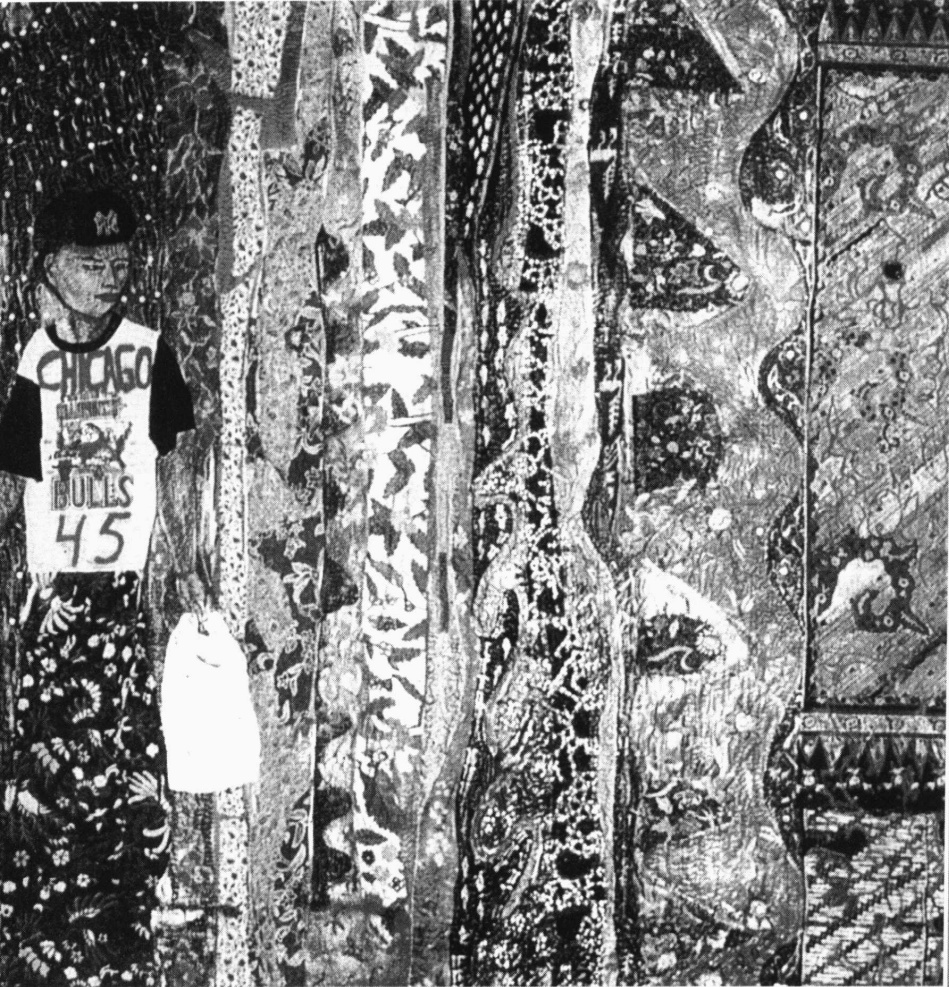

帕西塔·阿巴德

《在你突出出来之前你必须先融入其中》(1995)

---

· 社会学基本问题

种族：神话与现实

族群

弱势群体与优势群体

人们如何确立自己的种族身份

偏见与歧视

个人歧视和制度歧视

· 偏见理论  

心理学观点  

社会学观点

· 种族群体关系的全球模式

种族灭绝

人口迁徙

内部殖民主义

同化

多元文化主义(多元文化论)

- 美国的种族关系

欧洲白人

拉美裔人

非裔美国人

亚裔美国人

土著美国人(印第安人)

·展望未来

移民之争

平权法

迈向一个真正的多元文化社会

·本章小结

---

### 第 12 章 种族和民族

设想你是个非裔美国人，家住亚拉巴马州梅肯县，生活在20世纪30年代的经济大萧条时期；房屋简陋、没有地板；没有电，也没有自来水；你连小学都没念完，仅靠做做零工来维持生计。近来你总感觉身体有些难受，却没钱去看医生。

接着，难以置信的事发生了。你揉揉眼睛，好像自己中了彩票：要是加入“里弗斯小姐会社”（这无须付钱），就能在塔斯基吉大学接受免费体检。来往于医生诊所的路费不用你掏，接受检查时还能吃上热腾腾的饭菜，有个小病小灾也可以免费治疗。

于是，你很踊跃地加入了里弗斯小姐会社。

第一次体检结束后，医生告诉你一个坏消息。他说：“你的血液有问题，所以你才会觉得难受。你可以去找里弗斯小姐要些药，并安排好下一次检查。不过，我得警告你，要是去别的医生那里，以后就不会有免费的检查和药品了。”

其实,你根本就没钱去别的医生那里。你拿了药,盼着再去大学做检查。

事情的真相到底是什么？实际情况是：你卷入了一个无疑是有史以来，除了恶贯满盈的纳粹和日本人做的实验外，最为冷酷无情的实验。美国公共卫生局视人命为草芥，通知399名非裔美国人说他们加入了一个名为“里弗斯小姐会社”的社团组织。然而，这些人并不清楚他们其实已经染上了梅毒。40年来，美国公共保健署对这些梅毒患者没有采取任何治疗措施，只是“静观事态发展”。甚至还成立了一个由201名未感染梅毒的人组成的对照组（Jones，1993）。

顺便说一句,你确实得到了一项实惠——为确认梅毒对你身体的破坏程度而进行的免费尸检。

### 社会学基本问题

尽管有些让人难以置信，但这的确是一个真实事件，实实在在地发生在399个人的身上。当然，种族关系很少恶化到这种程度，但其中陷入困境的却绝非少数。如今，报纸和电视新闻时常报道种族问题。社会学知识对我们理解这一社会生活侧面大有裨益，本章的内容可能会使你瞠目结舌。首先，让我们来考虑一下种族在何种程度上成为了一个神话。

### 种族：神话与现实

地球上的人口超过了60亿，其外形和肤色千差万别，令人眼花缭乱。人类皮肤的颜色有黑色、白色、红色、黄色和棕色；眼睛有深浅不一的蓝色、褐色和绿色；嘴唇有厚薄之分；头发有直的、卷的，还有纽结的、黑的、白的、金的、红的——当然，还有深浅不一的棕色。

由于人类遍布世界各地，他们对不同环境和其他生活条件的适应，生成了丰富多样的肤色和形态。基因变异进一步使地球上居住的种族各具特色。从这一层面来说，种族（race）概念——由于遗传而获

---

得有别于其他群体的身体特征的一群人——是真实的。人类当中的确存在多种多样的肤色和外形。

然而，另一方面，种族又是一个神话，是人类凭空编造出来的。第一个神话是某一种族优于其他种族的观念。所有的种族都是既出天才又出蠢材。与语言一样，没有哪个比其他的更好。

不过，种族优越论却大有市场。这种观念非但是错的，还相当危险。比如，希特勒认为，雅利安是高贵的民族，承担着振兴欧洲文化的职责。他说，雅利安人生来就肩负着建立更为优秀的文化的使命，并且要缔造崭新的世界秩序。雅利安人的这一使命，要求他们不可与低等种族通婚，以杜绝“种族污染”现象。因而，有必要隔离或消灭有可能对雅利安文化构成威胁的种族。

当希特勒的想法被付诸实施，整个世界留下了耸人听闻的后遗症——纳粹屠杀了所有他们认定的低等民族：犹太人、斯拉夫人、吉普赛人、同性恋，以及智力或身体存在缺陷的人们。瓦斯焚烧炉的黑暗景象，以及堆积如山的瘦骨嶙峋的尸骸，令全世界人提心吊胆、夜不能寐。二战结束后，在德国的纽纶堡，大获全胜的协约国对纳粹高级军官进行了审判，将其十恶不赦的罪行公之于众，这震惊了整个世界。每个人都认为，公开的死刑判决为这类恐怖行为画上了一个句号。

显而易见，灾难并未结束。1994年夏，胡图族人在卢旺达屠杀了大约80万名图西人——凶器多为大砍刀(Gourevitch，1995)。数年之后，波斯尼亚的塞尔维亚人有组织地屠杀了成千上万的穆斯林，由此诞生了一个新的术语：“种族清洗”(genocide)。这些事件无不悲哀地证明，种族灭绝这种由于某种族或民族归属而对其加以毁灭的做法依然存在。虽然近来的杀戮中并没有出现纳粹与字标志和瓦斯炉，但犯罪者的目标并没有改变。

人类的差异如此显著，正如文中提到的，没有“纯正的”种族。图中：姚明，体重269斤，身高2.29米；维恩·特罗耶，体重40斤，身高0.85米。

第二个神话是存在着“纯种的”种族。人类在皮肤、眼睛的颜色、头发的质地、鼻子和头的形状等各个身体特征上都显现出混合状，没有哪个种族是纯种的。人类特征并不是彼此截然分开的，并不存在完全不同的类型；而是存在相通之处、共同进化的。

绘制人类基因组图谱的工作显示，人类是同类同质的，所谓的种群相异的几率在基因组亚单元中是千分之一(Angler,2000)。正如老虎伍兹指出的(右边的“文化多样性”专栏中将专门进行讨论)，由于人类之间只存在着细微层别，因而，任何尝试划分界限的企图都不过是主观的臆断。

虽然人类可以通过血型和基因频（gene frequencies）进行划分，但这些分类并不能揭开“种族”这个谜团。由于这些分类相当任意，生物学家和人类学家甚至在有多少个种族这一问题上也存在争议。专家们已经列出了很多清单，“种族”的数目不一。体质人类学家阿什利·蒙塔古（Montagu，1964；1999）指出，一些科学家只将人类分成两个“种族”，而有些科学家已经发现了2000个之多。蒙塔古（Montagu，1960）本人将人类分为40个种群。第327页的“现实社会学”专栏说明，甚至于一次飞机航行就可以改变我们的种族！

当然，种族这一观念绝非神话。它深植于我们的文化中，对人们的

---

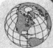

# 泰格·伍兹与正在凸现的多种族身份：绘制崭新的民族蓝图

泰格·伍兹，这位或许是有史以来最顶级的高尔夫球手自称为Cablinasian。伍兹从小便自创了这个名词，试图解释他自己到底是谁——一个高加索人、黑人、印度人和亚洲人的混血体（Leland and Beals，1997；Hall，2001）。伍兹想和家庭的两方面都保持联系。如果外界只承认伍兹属于父亲或母亲的单方种族身份，其实就是否定了另外一方。

和大多数人一样，泰格·伍兹的种族血统很难界定。喜欢量化种族血统的分析家认为伍兹有四分之一

泰格·伍兹，他在桑威治的圣乔治举行的英国冠军公开赛上打出了一杆好成绩。

的泰国血统，四分之一的中国血统，四分之一的白人血统，八分之一的土著美国人血统，还有八分之一的非裔美国人血统。从这一章，你会了解到这种计算是多么的可笑。但是，为什么那么多人都认为泰格·伍兹是非裔美国人？这属于社会学问题。美国的种族状况相当复杂，但是其中很大的一个原因是媒体选择了这样或那样的标签。“凡人皆有出身”似乎就是我们媒体的态度。如果有什么人不这样，我们就会不舒服。对于泰格·伍兹而言，媒体替他选择了非裔美国人这样一个标签。

在美国，曾经存在严格的“肤色线”——即种族之间（特别是在恋爱或结婚方面）难以逾越的障碍。现在，这道无形的障碍已被打破，跨种族婚姻不再是什么新鲜事（Statistical Abstract 2002: Table 47）。不少高校都成立了跨种族的学生组织。哈佛大学有两个这样的组织，其中一个组织面向双亲中有一位是非裔美国人的学生（Leland and Beals, 1997）。

有黑不溜秋的。他们是表亲。按照美国对事物的划分，包括在奥斯陆滑雪的金发家伙在内，他们都是黑人。”(Wright, 1994)

当我们涉足陌生的民族领域时，总是会进行过多的分类。哈佛大学哲学系及非裔美国人研究系的夸亚姆·安东尼·阿皮亚说：“我母亲是英国人，父亲是加纳人，一个姐姐嫁给尼日利亚人，还有一个嫁给挪威人。我的外甥既有白皮肤金头发的，也

在美国，十年一次的人口普查曾要求人们从高加索人、黑人、印度人和东方人这几个选项中选一个。人们被分割开，整整齐齐地码放到这些颇有局限的类别当中。由于多年来人们对此甚为不满，于是，在2000年的人口普查中，选项扩充了不少：问卷中包括是否是“西班牙人、葡萄牙人或拉美裔人”的选项。人们要勾出“认为自己所属的”“一个或几个种族”。可供选择的有白种人；黑种人、非裔美国人或黑人；土著美国人或阿拉斯加土著；亚裔印度人、华人、菲律宾人、日本人、韩国人、越南人、夏威夷土著、关岛人、查莫罗人、萨莫亚人或其他太平洋岛屿的居民。如果这些选项都不符合，可以在一个“其他种族”的选项上划钩，自己填写种族名称。

人口普查中或许还应当列上 Cabinasian；以及 GASH，代表那些带有德国、非洲、瑞典、西班牙血统的美国人；BITE，代表博茨瓦纳、印度尼西亚、土耳其和英国的后裔；STUDY，代表有瑞典、土耳其、乌拉圭、丹麦、南斯拉夫血统的美国人。继续往后翻阅这一章，你就会明白为什么这些术语和我们目前使用的术语具备同样的意义。

### 思考题

为什么我们要以“种族”为标志划分人群？为什么在美国人口普查中不把种族这一项去掉？（在奴隶制时期种族就成为人口普查的一个要素，用来决定一个州应该选举出多少代表来参加国会，而五个黑人才相当于三个白人！）为什么种族对于某些人而言如此重要？或许，你可以应用本章的材料来解答上述问题。

---

日常生活产生着莫大的影响。有没有优等种族，甚至于有没有哪个专家可以确定应该如何在生物学意义上对人类进行种族划分，这些都不重要。人们大多持有这样的态度：“我明白我所看到的，你并不能改变我的看法。”正如第4章曾提到的，社会学家威廉·托马斯和多萝西·托马斯评论说：“如果人们把情境当成是真实的，那么其结果就将成为真实的。”换言之，人们做事时依奉的是观念而不是事实。因此，总会有希特勒这样的人出现；如在本章开篇短文中，那些美国公共卫生局的官员们也觉得用那些看来很低等的人做实验没什么大不了。尽管很少有人抱持这种极端观点，但是绝大多数人都或多或少地会有些种族中心主义，认为自己的种族更为优越。

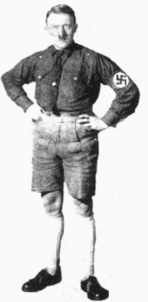

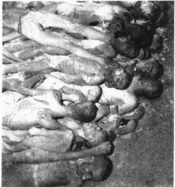

之所以选择这两幅图片，是想要证明一切关于仇恨以及种族优越论的宣讲，即便其出发点看上去构不成任何威胁或者是幽默搞笑的，我们也必须加以重视。左图这个人看上去比较怪异，他是身穿德意志巴伐利亚传统服饰皮短裤的希特勒。是他一手造成了右图中令人发指的惨状：英国军队攻占了德国的布痕瓦尔德集中营，发现成千上万的人由于饥饿和疾病奄奄一息，躺在还未掩埋的腐尸堆中。

### ▷▷小结

因此，种族是用来混淆视听的。人类的体态特征，包括肤色、发质、头和鼻子的形状、眼睛的颜色等等，根本就没有什么必然的、普遍适用的方法能够根据生物学上的差异进行分类。人类特征并不是彼此截然分开的，并不存在完全不同的类型。由于种族划分是任意的，因此，社会不同或者由于时代变迁，人类使用的种族范畴都会有所差异。在这一点上，种族以及由此衍生出的种族优越论都是虚构的。

### 族群

种族这个术语指的是一个民族区别于其他民族的生物学特征，而民族（ethnicity）和民族的（ethnic）则指的是文化特征。“民族”和“民族的”的词源是“ethnos”（拉丁词，意为“人民”或“国家”），这两个词指代的是由于拥有共同的祖先和文化遗产而相互认同的人群。这些人的归属感集中体现在共同的国家、独特的食物、服饰、语言、音乐、宗教、姓氏和亲友关系上。

人们经常混淆种族和族群这两个概念。比如，很多人(包括很多犹太人在内)都以为犹太人是一个种族。其实，说犹太人是一个族群要更合适：犹太人之所以团结在一起，是因为他们在宗教等方面具备独特的文化特征。在犹太人聚居的地方就一定会有通婚现象。所以，居住在中国的犹太人看上去像蒙古人，而居住在瑞典的犹太人则是蓝眼睛、金头发。

### 弱势群体与优势群体

社会学家路易斯·沃斯 (Wirth, 1945) 认为，弱势群体 (minority groups) 指的是那些受到不公平待遇，也把自己视为整个社会歧视对象的人群。生理上 (种族上) 或文化上 (民族上) 的差别都可能引发不公平

---

### 常识与社会学：什么是种族？

在课本的开头几页，我曾提到过，常识和社会学时常有所出入。特别是在种族问题上，更是如此。从常识来说，种族划分反映了人类之间的生物学差异。与之相反，社会学强调，种族是一种社会学分类，而非生物学范畴。

社会学家指出，与人类的生物特征相比，我们所谓的“种族”和人们生活的社会联系更为紧密。举例来说，全世界对体貌特征进行分类的方法数不胜数，而在美国较为常见的种族分类只不过是其中的一种。尽管不同的群体运用不同的分类，但每个群体都认为自己的方法合情合理，符合直观生物学特征。

为了更好地理解“种族与社会的联系比种族与生物学的联系更紧密”这一重要观点，可以考虑一下：在美国，同父同母的人属于同一种族。美国人想：“还有比这更能说得通的吗？”但在巴西，同父同母的人如果样子不同，就可能分属不同种族。巴西人想：“还有比这更能说得通的吗？”

想一想美国人通常会怎样定义母亲是“黑人”而父亲是“白人”的孩子？为什么他们会说这孩子是黑人？要是说这孩子是“白人”不也很合理吗？同样地，如果一个孩子的祖辈中除了奶奶是“黑人”其他人都是“白人”，通常情况下，人们也会认为这个孩子是“黑人”。其实，这个孩子的“白人血统”要更多。那么，为什么还要认为她是个“黑人”呢？其原因决不是出于生物学的考虑，而是源自奴隶制的残余思想。面对父亲是白人奴隶主而母亲是黑奴的众多孩子，白人为了竭力保护其“种族”的“纯洁性”，认定即便血管里仅流淌着“一滴黑人的血”，也“不是白人”。

甚至一段空中旅程就可以改变一个人的种族。在巴西的萨尔瓦多市，人们通过皮肤和眼睛的颜色、鼻子和嘴唇的厚度、头发的颜色和卷曲程度来区分彼此。对于美国人所说的白人和黑人，他们用来指代的名词至少有七八个。倘若一个父母既有“白人”又有“黑人”的孩子飞到了巴西，她就不再是“黑人”了，而是属于巴西人所划分的某个“白人”类别(Fish,1995)。

在上文提到的飞机航程中，那个女孩的“种族”真的发生变化了吗？当然，我们的常识告诉我们并非如此，但事实上，她的种族确实发生了变化。我们试图加以辩解，说她的生物学特征和原来一样，所以其种族也不会变。这是因为我们的出发点是将种族视为生物学范畴，实际它是人们用以描述观察到的生物特征的一个分类标签。简单地说，我们属于哪个种族，取决于我们身处何地，或者说取决于谁在进行分类。

而且，我们对种族的分类时有变动，并非恒久如一。直至现在，美国使用的种族分类法还在改变。比如，“多种族”这一概念就可以证明人们的思想在不断更新。

### 思考题

你怎样向普通大众解释下列社会学上的重要观点：与其说种族是生物学意义上的分类还不如说它是社会学意义上的分类。能不能想出什么论据来驳倒这一观点？你认为以后我们的种族—民族划分会出现什么变化？

待遇。沃斯补充说，社会歧视阻碍了弱势群体充分参与社会的各种活动。

令人吃惊的是，弱势群体并不一定就是数量上较少的群体。例如，在印度1947年宣告独立之前，寥寥可数的英国殖民统治者压制着数以百万计的印度人。与之相仿，当南非实行种族隔离政策时，荷兰人这个小群体对人数多得多的黑人加以歧视。就全球范围来讲，女性都算是弱势群体。因此，社会学家宣称，那些歧视他人的人群并不是多数人群体，而是优势群体（dominant group），一个享有更多权力、特权和社会地位的群体。

---

优势群体掌握政治权力，具有共同的生理和文化特性，这一群体利用自己的地位来歧视那些特性不同或是在他们眼中低下的人群。在优势群体看来，自己天生的优越性造就了他们的特权地位。

弱势群体的出现 一个群体成为弱势群体的方式有两种。一是通过政治疆界的扩张。部落社会中不存在弱势群体(女性群体是例外)。人人享有包括语言在内的共同的文化，同属一个群体。然而，当一个群体扩展其政治疆界，把具备其他习俗、语言、价值观念、生理特征的人群合并到一个政治共同体当中并给予区别对待时，弱势群体就产生了。例如，美国在和墨西哥的战役中获胜之后就接管了西南地区。住在那里的墨西哥人，原本是优势群体，一下子变成了弱势群体，从此以后，他们的这一主导地位一直影响着他们的生活。一位拉美裔人提到自己的祖先时说道：“我们没有跨越边界，是边界在向我们移动。”

一个群体成为弱势群体的第二种途径是通过移民。移民可以是自愿的，就像数以百万计的墨西哥人主动迁徙到美国一样；也可以是非自愿的，就像数以百万计的非洲人被链条捆绑着被迫来到美国一样。(女性成为弱势群体的方式是第三种，但正如前一章提到的，没有人能够弄清楚这个问题。)

共同特征 人类学家查尔斯·韦格利和马文·哈里斯(Wagley and Harris, 1958)发现,无论居住在世界上哪个地区,弱势群体都具备下列五个特征:

1. 弱势群体的成员身份是一种先赋地位，而非自愿获得的，也就是说是生而有之的；

2. 弱势群体特有的生理或文化特征是为优势群体所轻视、不屑一顾的；

3. 弱势群体受到优势群体的不公平待遇；

4. 弱势群体倾向于在本群体内部通婚；

5. 弱势群体容易感受到强烈的内部团结（一种“自己人”的体会）。

这些情况使得弱势群体中易于产生共同的身份认同感，甚至是命运相连的感觉——特别是当他们受到集体性歧视时更是如此。

### 人们如何确立自己的种族身份

一些人有更强的民族感，可以感到在“我们”和“他们”之间存在坚固的屏障；而另外一些人已经广泛融入主流文化，仅仅模糊地意识到他们的民族根源。随着跨民族的婚姻变得日益普遍，有些人甚至不知道自己家族原本繁衍生息的国家是哪里，他们对此也不怎么关心。如果被问及自己的民族，这些人可能会这样回答：“我是海因茨，有德国和爱尔兰血统，还有一点意大利和法国的血缘，好像有人说过我还有十六分之一的印度血统。”

为什么有些人特别在意民族身份，而有些人压根就不在乎呢？图 12.1 展示了社会学家阿什利·多恩（Ashley Doane，1997）指出的可以加强或弱化民族身份认同感的四种因素。从图中可以看出，这四种因素包括相对规模、权力、外貌和歧视。如果一个群体相对规模较小，没什么权力，和社会中大多数人的模样有所差别，还是歧视的对象，其民族身份认同感就会得到加强。相反，如果属于掌握多数权力的优势群体，模样跟社会大多数人相仿，感受不到歧视，就会体会到“归属”感——他们还会奇怪为什么民族身份是个难以解决的问题？

我们可以用民族保护工作（ethnic work）这个名词来指代人们确立民族身份的方式。对于民族身份

---

图 12.1 民族认同感   资料来源：作者根据   Doane（1997）绘制而成。

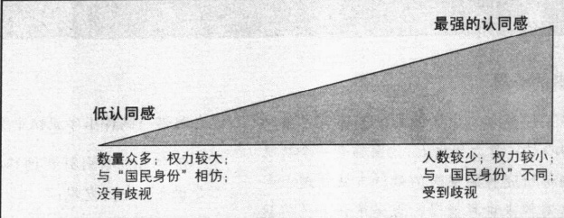

认同感非常强烈的人而言，这个词指的是他们如何通过服饰、食物、语言以及宗教、节日等等途径来加强和保持其群体的特性。对于民族身份认同感不那么强烈的人来说，民族保护工作指他们试图恢复其民族传统的努力，比如挖掘家族史。进行民族保护工作的美国人数不胜数，这让专家们大惑不解，他们本以为美国是个大熔炉（melting pot），其中大多数群体都会不知不觉地融入其中，形成民族大杂拌。但是近年来，美国人开始对他们的“根”产生浓厚兴趣，也越来越为自己的民族背景感到自豪。于是，一些分析家认为，“搅拌沙拉”的说法要比“熔炉”更为贴切。

### 偏见与歧视

偏见和歧视在世界各地都是普遍存在的现象。在墨西哥，西班牙裔墨西哥人歧视本土的美洲墨西哥人；在以色列，大多数身为欧洲后裔的德系犹太人歧视来自穆斯林世界的西班牙系犹太人；在日本，只要不是本国人，就会受到日本人的歧视，尤其是韩国移民和贱民（Eta caste）的后裔。（Eta caste 是日本古代法律所规定的不属于任何社会阶层的群体。该群体世袭，从事着社会中最低下的工作。Eta 和 Eta caste 同义，Burakumin 是 Eta 的现代称谓。——译者注）现在被称为 Burakumin 的 Eta，过去干的大都是社会中的肮脏工作——处理动物尸体（剥去兽皮、晾晒皮革）、当刽子手或监狱保安，因而，他们依然身负耻辱（Deliege，2001）。在某些地区，年长的人歧视年轻的人，而另一些地区则反之。在全世界范围内，男人都是歧视女人的。

从上述清单可以看到，歧视（discrimination）是一种行为——针对某些人的不平等待遇。而基于种族产生的歧视，则被称为种族主义（racism）。不过，除种族之外，歧视还可能基于很多其他特征——比如年龄、性别、身高、体重、收入、受教育程度、婚姻状况、性取向、疾病、残疾、宗教和政治等等。歧视往往由一种称为偏见（prejudge）的态度引起——而偏见通常是一种贬抑的预先判断。也存在过度褒扬的预先判断，即夸大某一群体的美德。在第二种情况下，人们认为某些群体（通常是他们自己的群体）比其他群体更有能力。但是，绝大多数偏见都是贬抑的，即预先假定一个群体低人一等。

有两个群体把其存在建立在偏见和歧视的基础上，这就是新纳粹党和三K党。如果一个犹太人参加了这种仇恨犹太人的群体集会，将会发生什么事情？他或她还能活下来吗？在下面的“现实社会学”专栏中，犹太社会学家拉斐尔·伊齐基尔（Raphael Ezekiel）对这些群体进行了卓有成效的研究，其观点颇有见地。

学习偏见和主导规范的内化和其他后天习得的态度一样，偏见也不是与生俱来的。人们可以从

---

### 现实社会学

### 种族主义者的心思

社会学家拉斐尔·伊齐基尔试图深入了解种族主义者的心思。身为犹太人，他面临着一个特殊问题。从内部研究种族主义的最好方法是进行参与观察。这对他来说可能吗？坦率承认自己的犹太身份后，伊齐基尔询问三K党和新纳粹党的领袖他能否采访他们并参加集会。令人惊奇的是，那些人居然同意了。伊齐基尔在《种族主义者的心思》（The Racist Mind，1995）一书中发表了他的开创性研究。他在那次相当有意思的社会学调查历险中得出了很多真知灼见，这里摘录如下：

[领袖] 统率的基础是对经济安全的集体焦虑，以及将当局视为导致经济恶化原因的普遍倾向。他希望教人们承认当局是犹太人阴谋集团的傀儡。[领袖] 坚信族群应当排外。对白人种族主义者领袖来说，社会上定义的、我们称之为种族的分类就代表了最基本的分类。一个人要么是白人，要么是黑人，不存在中间情况。每一个人属于一个种族类别，一个类别中的成员与另一类别的成员迥然相异。而且，种族代表着人的本质。卡车是卡车，轿车是轿车，猫是猫，狗是狗，黑人是黑人，白人是白人……这些公理在领袖的脑海里固若金汤；而世界由种群构成的这一观念就是为这些领袖而存在的。

还有两个信念在领袖心里占据重要位置。第一，生活即战争。世界由截然不同的种群组成；生活是关于群体之间斗争的。第二，凡事皆有潜在原因，绝不像表面呈现的那样……只要精心布局，任何神话都是合情合理的……对他而言，别人说什么并不重要……他生活在自己的理念当中，在他个人创造的狭小空间内，把那些理念放到很高的位置……黄金能用青蛙的舌头制成；耶和华的声音可以在飘动的纳粹卐字旗帜中听到。

哪些人被吸引到新纳粹党和三K党了呢？以下是伊齐基尔的发现：

[存在着]一个现成的白 $ \underset{\cdot}{人}\underset{\cdot}{群}\underset{\cdot}{体} $，他们乐意听从种族主义者的指挥……这些人总是渴望行动——或是谈论行动——这可以为那些在竞争激烈的社会中辛劳工作的人们带来尊严以及生活的意义……尽管对此我并不相信，但[这种]运动给某些不满现状的人们带来了一种至少是暂时的生活有意义的感受。在一项超越个体的事业中奋斗时，不管这种事业多狭隘，多站不住脚，这种奋斗都会给生活带来意义。对于新纳粹群体中的年轻人来说……其成员身份是原子化和漂浮生活的替代品；在群体中，他们为了一项事业而工作，在同志们的陪伴下尝试冒险……

我在采访底特律的年青新纳粹者的时候，常同他们一道驱车穿过关闭的工厂，那些正逐渐萎缩的制造业基地中的闲置厂房。剩下的能够招聘到受过更好教育、具有更高技能的工人的工厂越来越少。这些失去父亲的纳粹年轻人，这些高中辍学者们，在新兴经济中几乎找不到活儿干……一个长期失业的白人下层阶级成员与永远是下层阶级的黑人处于相同位置。种族的争斗不过是转移了年轻人的注意力，让他们不去面对自己生活中的真实问题罢了。火车上并没有留下多少座位，而火车正在驶离站台。

### 思考题

运用功能主义、冲突论和符号互动论解释：

(1)仇恨群体的领袖及其追随者如何看待世界；

(2)为什么一些人会为仇恨的讯息所吸引。

大众传媒中学会偏见，但更为常见的途径则是通过所交往的人群而学习。在一项很有意思的研究中，社会学家凯瑟琳·布利（Blee，2002）采访了有组织的仇恨群体（诸如3K党和雅利安民族）中的女性成员。正如我们所预想的，大多数女性都是由群体的老成员介绍加入的。但是，布利也发现了一些令人吃惊的

---

事：一些妇女是加入之后才了解种族主义的。此类群体吸引她们的原因，并不是因为那个组织与她们的种族信念相一致，而是因为她们喜欢的人是其中一员。布利发现，其强烈的种族主义不是她们参加这种群体的原因，而是她们成员身份的结果。

人们甚至还能学会对他们自己的群体产生偏见。一项由黑人访问者完成的对黑皮肤美国人的全国性调查显示，非裔美国人认为肤色稍浅的非裔美国女性比肤色较深者更有魅力(Hill,2002)。对此，社会学家称之为优势群体规范的内化。

心理学家安东尼·格林沃尔德(Anthony Greenwald)创制的“内在关联测试”证实了这种主导规范的内化。在该测验的一个版本中，屏幕上闪动着褒义词、贬义词，以及非裔美国人和白种人的照片。受试者更快地将褒义词(例如爱、和平和孩子)联结到白人身上，而将贬义词(如癌症、爆炸和恶棍)和黑人联系到一起。测试结果显示，白人受试者和黑人受试者的反应都是这样的(Chamberlain,1998; Berreby,2000; Dasgupta et al.,2000)。显然，我们都背负着文化中的“民族地图”，从而产生了偏颇的想法。

偏见的程度 社会科学家发现，每个种族群体将其他群体视为低下群体的方式有好几种。在一篇经典文献中，心理学家尤金·哈特利（Hartley，1946）询问人们对某些群体的看法。除了黑人、犹太人等，他还在里面加入了自己编造的群体名称，如Wallonian人、Pirenean人和Danirean人。大多数不喜欢犹太人和黑人的人，也对这三个虚构群体表示了反感。哈特利的研究表明，偏见并非取决于和他人在一起的不愉快经历。而且，对一个种族怀有偏见的人，也容易对其他群体抱有偏见。人们可能会对也的确会对素未谋面的人群，甚至是一个莫须有的群体产生偏见。

社会学家劳伦斯·博博和詹姆斯·克卢格尔（Bobo and Kluegel，1991）发现，年长的人和教育程度低的人较年轻人和教育程度高的人更容易怀有偏见（见图 12.2）。博博和克卢格尔的采访对象是白人；其他研究表明，弱势群体也存在自己的偏见（Brockerhoff，2000；Charles，2000）。

某些群体的成员比另一些群体的更容易怀有偏见。在亚拉巴马大学，社会学家唐纳德·缪尔(Muir，1991)测量了大学生联谊会中白人学生的态度，并同没有参加联谊会的白人学生的态度进行了比较。他

图 12.2 人们偏好的社会距离测量

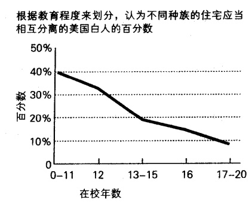

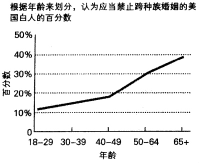

资料来源：Bobo and Kluegel（1991）。

---

询问了一系列范围广泛的问题——包括怎样看待和非裔美国人约会、一起上课等等。在所有的测试中，联谊会成员比非联谊会的人更具有偏见。在其他学校进行的调查也证实了这一发现(Morris,1991)。在下面的“批判性思考”专栏，我们将近距离审视美国校园中的种族关系。

### 批判性思考

### 自我隔离：对校园里的种族关系有益还是有害？

经过长期痛苦而激烈的斗争，到了20世纪60年代，一项禁止校园内种族隔离的联邦民权立法终于获准通过。但是，这些法律并不意味着自我隔离业已结束。一些行为依然继续存在，例如，自助餐厅或休息室中的某个区域总由一个特定群体独占。少数民族学生常常申请单独的宿舍（称为“同族之屋”）和校园中心。布朗大学是一所位于美国罗得岛州首府普罗维登斯的常青藤联盟学校，其原有的男女生宿舍已被哈兰比会馆（为非裔美国人开设）、西班牙会馆、斯拉夫会馆、东亚会馆和德国会馆代替；而康奈尔大学则为非裔美国人、西班牙人和土著美国人提供了“主题宿舍”。

争论围绕着种族群体的自我隔离展开。黑人大学联合基金会主席威廉·格雷认为，非裔美国学生和拉美裔学生的辍学率比白人学生高出很多，所以，学校应当竭尽所能让少数民族学生感到自己受欢迎并为大家所接受。

批评家将这种分开居住的趋势称为“分离主义者运动”，学生们形成了若干“小圈子”。当学生们自我隔离的时候，他们就丧失了跨文化交流的丰富经历。达特茅斯学院的官员说：“我们需要帮助学生在文化方面变得‘多才多艺’或‘富有能力’，帮助他们为适应新的多元社会做准备。因此，他们需要与其他人交往，而不是自我隔离。”(Rimer,2002)

一位布朗大学的白人学生乔舒亚·莱勒说，一些种族和族群群体“正主动同其他人相隔离；然而，当社会疏离他们时，他们却抱怨不已。我觉得这些人要么就别自我隔离，要么就别抱怨。”

### 思考题

将校园内分离的种族住房模式和本章讨论的种族隔离、同化与多元文化论三种模式进行比较。如果少数民族学生愿意，但白人学生反对的话，自我隔离是否可行？解释一下你的立场。

资料来源: Bernstein (1993); Jordon (1996); Terry (2000); Rimer (2002).

### 个人歧视和制度歧视

社会学家强调，我们应当跳出个人歧视（individual discrimination，指一个人对另一个人不能平等相待）的思维方式。尽管产生了很多问题，但这种行为主要还是个体间的问题。社会学家注意到更广泛的图景，他们鼓励我们去分析制度歧视（institutional discrimination），即看一看歧视是如何织入了社会的网络。下面，让我们来看两个例子。

房屋抵押和汽车贷款 银行贷款是制度歧视一个极好的例子。如图 12.3 所示，种族在获得抵押贷款中是一个重要因素。当银行家看到图中的统计数据时，他们会破口大骂。虽然看起来像是歧视，他们说，但事实是白人具有更好的信用记录。为了检验这话的真实性，研究者又仔细检查了一遍数据，然后比较了申请者的信用记录。贷款的差距的确减少了一些。然而，最终结果证明，即使申请者在所有方面的情况都相当，非裔美国人和拉美裔人被拒的可能性也要比白人高 60%（Thomas, 1992; Passell, 1996）。其他研究表明，非裔美国人在抵押贷款（Leonhardt, 2002）和汽车贷款（Henriques, 2001）中比白人支付

---

图 12.3 种族和抵押贷款：制度歧视的例证

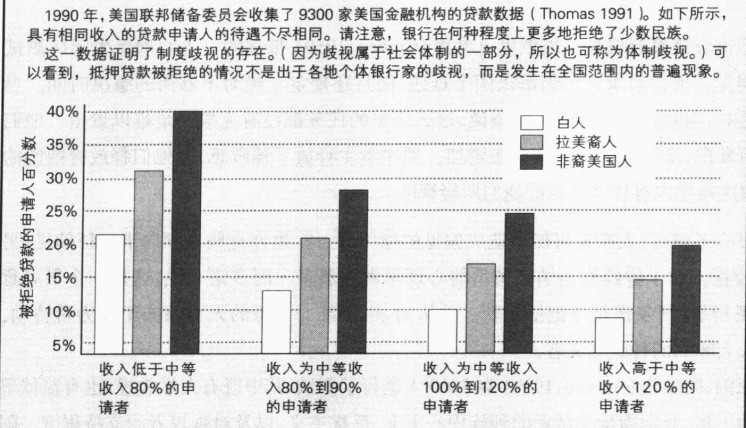

资料来源：作者根据 Thomas(1991) 绘制而成。

了更多的费用。简言之，这并不是某地的银行家由于个人偏见怀有歧视，而是歧视已经内置于国家的金融制度之中了。

医疗保健 歧视不一定是有意而为。即使歧视的人和被歧视的人都意识不到，歧视也会发生。心脏病的医疗保健就是个例子。白人病人比起拉美裔人或非裔美国人来，接受心脏搭桥手术的可能性更大(Smedley et al.,2003)。心脏病发作后的治疗也是如此。一项研究调查了4万例病人之后发现，白人较黑人进行心导管插入(一种检查血管堵塞的检验)的可能性更大。这项研究有一项发现令人吃惊：白人和黑人医生都更倾向于给白人作这项预防性治疗(Stolberg,2001)。

研究者并未弄清为什么种族是影响医疗决定的一个因素。而对于所涉及的白人和黑人医生，我们可以肯定，医生并没有有意歧视。歧视以我们尚未理解的方式存在于医疗中。种族所起的作用恰如性别。正像妇女在心脏搭桥手术中较高的死亡率可归咎于对性别的态度，同样，种族作为一个下意识的原因，也会影响先进医疗方式的获得与否。

### 偏见理论

社会科学家已经提出了许多理论来解释偏见。首先，我们来看看心理学的解释，然后，再看看社会学的解释。

### 心理学观点

挫败感和替罪羊 1939 年，心理学家约翰·多拉德 (John Dollard) 提出，偏见是挫败感的产物。无法对自己产生挫败感的真正原因 (例如低工资) 进行确定的人，会转而责备他人。这种替罪羊

---

(scapegoat)——通常是种族或宗教上的弱势群体——成为他们发泄的靶子。性别和年龄也是成为替罪羊的常见缘由。

甚至轻微的挫败感也会集聚起偏见。埃默里·考恩（Cowen，1959）带领的一支心理医生团队测试了一个学生样本中的偏见。他们要求学生们解决两个难题，而且还规定了绝对不够用的解决时间。当学生们恼火地思索问题时，实验者厌恶地摇着脑袋说，这么简单的任务都没有完成真是难以置信。他们对学生重新进行测试后发现，学生的偏见分数有所增加。那些学生释放了挫败感，而他们释放挫败感的对象则是那些与没有解决难题没有什么关系的他们所轻视的人。

强权人格 你有没有考虑过，人格也可能是造成偏见的原因之一？也许有些人倾向于心怀偏见，另一些人则更愿意做到公正。对于曾经逃离纳粹魔爪的心理学者西奥多·阿多诺来说，这是一个很有意思的问题。对那些恐惧场景，阿多诺至今记忆犹新。他认为，也许某一类型的人更倾向于成为希特勒、墨索里尼、3K党这类人人唾骂的种族主义者。

为了找出其中的原因，阿多诺（Adorno，1950）对2000人进行了测试，其中既有大学教授，也有监狱里的囚徒。他的测试分为三项，分别衡量受试者的种族中心主义、反犹主义，以及对强权者的支持程度。阿多诺发现，那些在某一项测试中得分高的人，同时也在其他两项测试中得到高分。比如，那些同意反犹太主义言论的人认可政府的强权主义路线，而且，他们还认为“美国”方式受到了来自外来生活方式的威胁。

阿多诺得出结论：心怀高度偏见的人都是缺乏安全感的墨守成规者。他们对权威满怀敬意，并屈从于更为强势的人。阿多诺把这定义为强权人格（authoritarian personality）。具有这样人格的人，相信事情总是对错分明；含混不清，尤其是在宗教信仰和性等问题上的含混不清，会极大地困扰他们。当他们遇到与自己不同的规范和价值观时，他们会变得焦虑不安。这些人将持有其他观点的人视为劣等人群，坚信自己的立场才是正确的。

阿多诺的研究在学界引起了轰动，引发了上千个相关的研究课题。一般的观点认为，信奉独裁主义的人大多上了年纪、受教育程度低、缺少才智、来自较低的社会阶层。评论家认为，这并不代表一种特殊人格，只不过说明受教育程度低的人具有更多的偏见——而这一点我们早就知道(Yinger，1965；Ray，1991)。不过研究者仍在就这一概念进行探讨(Whitley and Egisdottir，2000)。

### 社会学观点

社会学家发现，心理学的解释并不充分。他们强调，理解偏见的关键不在于个人内在的东西，而在于外部因素。因此，社会学家着重研究某些环境是怎样促使偏见发生，而某些环境又是怎样抑制偏见发生的。了解了这么多之后，现在让我们比较一下功能主义、冲突论和符号互动论等各个角度对偏见的看法。

功能主义 在一部生动的电视纪录片中，记者比尔·莫耶斯采访了弗里茨·希普尔，一位29岁就接管了全德国电影工业的纳粹知识分子。希普尔讲到，希特勒刚上台时，德国人的反犹倾向并不比法国人多多少，法国人的反犹情绪甚至可能更为强烈。希普尔接到命令，要他渲染反犹太主义的氛围。然后，他就奉命制作了一些反犹影片，影片中有把犹太人比作老鼠的生动场景，指出犹太人的繁衍对人类造成了威胁。

---

为什么希普尔接到制造仇恨的命令？因为偏见和歧视是纳粹的功能性工具。犹太人充当了可怜的替罪羊。一战的战败、战后赔款以及国内严重的通货膨胀，使德国一蹶不振，而纳粹把犹太人树为公众的敌人后，就可以把整个德国联合在一起。另外，纳粹可以吞并犹太人控制的商业、银行账户、工艺品等财产。许多犹太人身居要职（大学教授、记者、法官等等），纳粹也可以让自己的走狗取而代之。最后，仇恨也产生了反功能的方面，如在纽伦堡的纳粹官员被处以绞刑。

当纳粹控制的恐怖机器开始在整个国家范围内运转起来后，纳粹控制了学校、警察局、法庭、媒体，甚至于政府的方方面面，这时的歧视实际上已经势不可挡。我们会想起在第3章“现实社会学”专栏中提到的那对双胞胎。奥斯卡和杰克一出生就被分开，杰克由犹太人抚养，在特立尼达岛长大；而奥斯卡则成长为捷克斯洛伐克的一名天主教徒。在纳粹统治下，奥斯卡学会了仇恨犹太人，但他并不知道自己就是犹太人。

心理学家穆扎夫·谢里夫和卡罗琳·谢里夫（Sherif and Sherif, 1953）证实了偏见的功能作用，及其会受到社会环境的影响。在男孩夏令营，他们将伙伴分到不同的棚屋，然后在各个棚屋之间展开体育竞赛。短短几天时间，男孩们就分化为态度鲜明的内群体，甚至以前关系一直很好的朋友也开始互称“大哭包”、“娘娘腔”，彼此之间流露出强烈的反感。

谢里夫的研究教给我们一些关于社会生活的重要教训。从中我们可以看到，应当怎样安排、设计社会环境来激发我们待人的正面或负面情绪；当各个群体在“你输我赢，你赢我输”的情况下需要彼此较量时，偏见是如何产生的；我们还可以看到偏见是如何发挥功能，促成了内群体团结的形成。当然，还有非常明显的一点：偏见在破坏人与人之间的关系上起到了怎样的不良作用。

冲突理论 同样，冲突理论家也分析了各个群体之间的较量。但是他们所关注的是这种较量如何使掌握权力的一方获益。冲突理论家首先注意到，工人们想要更好的食物、卫生保健、住房和教育条件。为了达到这些目的，工人们需要好的工作。要是他们团结起来，就能一起要求得到更高的工资和更好的工作环境。但是，如果资本家能使工人们彼此不团结，就可以一直付给他们低工资。为此，资本家主要使用了两个武器。

第一个武器是使工人们保持不安全感。对失业的恐惧表现得特别明显。对资本家而言，失业者是后备劳动力（reserve labor force）。经济繁荣时期，资本家依靠失业者这支队伍来扩大生产；经济萎缩时期，资本家又会让那些人重新回到失业者的行列。这对那些想保有工作的人来说无疑是一种冲击。他们害怕被逐出工厂，害怕变卖汽车和家具。很多人心里都很清楚，就是那份薄薄的薪水才使他们不至于落魄到“流落街头”。这在使工人们保持温顺上起了很大作用。

第二个武器是利用种族争斗。工人之间的分裂，会削弱他们讨价还价的力量。在种族群体当中制造恐惧和猜疑——例如让白人知道黑人正等着取代他们的位置，或是让黑人把拉美裔人视为自己的威胁——也会培养出温顺的工人。结果就形成了一个分裂的劳动力市场（split labor market），工人们因其种族或性别的不同而分裂开来（Du Bois，1935/1992；Minchin，1999；Roediger，2002）。

这两种武器形成了毁灭性的后果，冲突理论家如是说。正像谢里夫实验中的男孩一样，非裔美国人、拉美裔人、白人等都认为，只有在其他种族蒙受损害的情况下，自己才能获益。差异更为细微的种族之间也会呈现这种敌对状态，比如迈阿密的海地裔和非裔美国人就是互不信任的竞争关系。工人之间的

---

分化会转移对掌权的精英阶层的愤怒和敌意，并把这些强烈的情感导向其他种族群体。工人们认识不到他们的阶级利益是一致的，应当为共同的福利而努力；相反，他们开始产生恐惧，彼此间不再信任。

符号互动论 冲突论者的研究集中在资产阶级是如何利用种族分裂而受益的；而符号互动主义则探究标签是如何影响人们的认知并产生偏见的。

标签如何产生偏见 符号互动论者强调，标签会对我们如何看待他人产生影响。标签导致选择性感知（selective perception）；也就是说，标签会引导我们看到某些东西，同时也让我们对其他一些东西视而不见。如果对一个群体加上标签，我们就会产生某种倾向，认为这个群体的成员都是一样的，而对不符合标签的证据不予理睬（Simpson and Yinger，1972）。种族标签的作用尤为强烈，它们是受情感控制的刻板印象的一种缩略表达。比如“黑鬼”这个词，就不是一个中性词。白鬼、西班牙佬、爱尔兰佬、犹太佬、英国佬、德国佬、意大利佬、几内亚佬等用来表示轻蔑、贬损种群的词汇，也不是中性词。这样的词语让我们情绪失控，难以对所指人群进行理性思考（Allport，1954）。

刻板印象和歧视：自我实现的预言 由于某些刻板印象的存在，不仅使偏见和歧视变得合理，而且刻板印象所预想的行为也因此而产生。让我们以X群体作为例证。贬抑的刻板印象认定X群体是懒惰的。而如果他们懒惰，就不能得到好的工作(他们懒惰、不可信赖、做不好工作)。这种态度就引发了自我实现预言。由于X群体无法获得需要高度奉献精神和精力干劲的工作，其中的绝大多数人只好去做那些人们认为很适合他们“那类人”干的“脏活”。因为干脏活的机会很零星，人们就会经常看到X群体成员站在街角等待雇主。目睹这样懒散的一幕，人们原先对他们的懒惰的刻板印象也就会进一步加深。而起初滋生“懒惰”这一看法的偏见却被忽视了。

### ☑ 种族群体关系的全球模式

社会学家研究了全世界的种群关系。他们发现了优势群体和少数群体关系的六种基本模式，如图12.4所示。

图 12.4 种族群体关系的全球模式：一个连续统

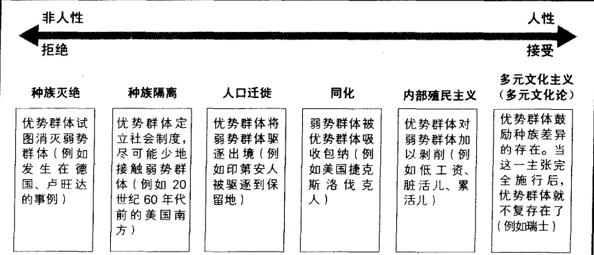

---

### 种族灭绝

上世纪两个最为臭名昭著的种族灭绝的例子发生在欧洲和非洲。20世纪三四十年代的德国，希特勒和纳粹试图消灭所有犹太人。20世纪90年代的卢旺达，胡图族要杀死所有图西族人。这些屠杀中令人惊骇的一点是，那些参与屠杀的人不是从石头缝里蹦出来的野蛮人，而是些普通的市民。他们之所以参与屠杀是受到了怂恿，即因为被屠杀者都贴着标签，属于应该去死的敌人（Huttenbach，1991；Browning，1993；Simmons，1998；Gross，2001）。

为了更好地理解为什么普通人也会参与种族灭绝，我们可以看一个发生在19世纪的例子。美国政府和白色人种的移民选用“野人”这个标签来称呼土著美国人。把土著美国人定义成低于人类的群体，这就为白人屠杀土著美国人来争夺资源或推进西进开发找到了借口。不过，大多数土著美国人并非死于枪弹，而是死于白人带来的各种疾病。土著美国人对天花、麻疹、流感等等新的疾病没有任何免疫力（Dobyns，1983；Schaefer，2000）。同时，那些冷酷的殖民者则摧毁了土著美国人的食物来源（水牛和农作物）。大约有95%的土著美国人因此而丧生（Thornton，1987；Churchill，1997）。

同样的事情也在其它一些地方发生过。在南非，波尔人或荷兰人的后裔把霍屯督土著人视为丛林动物，将其全部消灭。在塔斯马尼亚，英国殖民者追杀当地的土著，目的是进行狩猎运动，有时甚至是为了获取狗食。

标签在人类生活中是一种强大的力量。把别人视作非人类这样一个标签使自我割裂(compartmentalize)——他们把自己的行为和良知隔离开来。如果将某些群体的成员视为非人类，就意味着可以用非人类的方式对待他们，杀死他们而无损于自己的良知（Bernard et al., 1971；Markhusen, 1995）。总而言之，对目标群体贴上非人类的标签促进了种族灭绝。

### 人口迁徙

人口迁徙(population transfer)有两种类型：间接人口迁徙和直接人口迁徙。间接人口迁徙，是弱势民族的成员受生活环境所迫而“自愿”离开造成的。比如，在沙俄独裁时期的恶劣环境下，数百万犹太人“选择”离开。在优势种族驱逐弱势种族时会产生直接人口迁徙，比如印地安人被驱逐到保留地，日裔美国人在二战期间被赶入战俘收容所。

20世纪90年代，种族灭绝和人口迁徙一并出现在前南斯拉夫的波斯尼亚和科索沃地区。在1944—1980年间铁托的铁腕统治下，几个世纪积蓄的仇恨受到了压制。铁托死后，这些积郁的仇恨爆发出来，南斯拉夫解体。塞尔维亚人掌权以后，穆斯林人反叛并开展了游击战争。塞尔维亚人进行了所谓的种族清洗来发泄仇恨：他们通过杀戮和强奸对村民进行恐怖统治；少数幸存者心怀恐惧，不得不背井离乡。

### 内部殖民主义

在第9章中，“殖民主义”指的是工业化程度较高的国家剥削工业化程度较低的国家的一种方式。冲突论者用内部殖民主义（internal colonialism）一词来指代某国内部优势种族为了经济利益而剥削弱势民族的方式。优势种族通过控制社会机构来压制弱势民族，并否认他们享有全部社会利益的权利。第9章谈到的奴隶制就是内部殖民主义的一个极端例子，比如南非的种族隔离政策。尽管占优势的南非

---

白人鄙视少数民族，他们也意识到少数民族存在的必要性。正如辛普森和因戈尔(Simpson and Yinger，1972)所说的那样，除了他们，又有谁来做那些脏活儿、累活儿呢？

### 种族隔离

内部殖民主义经常伴随着种族隔离（segration，即对种族或者族群进行分隔）。种族隔离使得优势群体在社会关系上和弱势群体保持距离，并剥削他们，让他们干厨师、清洁工、司机、管家、保姆、工人等苦工。在美国南方，直到20世纪60年代，法律还规定非裔美国人不得和白人使用相同的公共设施，比如旅馆、学校、游泳池、浴室、甚至饮水器等。有38个州的法律禁止黑人和白人通婚，违反者入狱（Mahoney and Kooistra，1995）。1967年，最后一条类似的法律被废除。在以色列，为以色列人工作的巴勒斯坦人必须在早上持通行证通过武装检查点，工作结束后再返回他们居住的区域。

对大多数美国人来说，住宅区域的种族隔离现象仍是其生活中的一个事实。在下面的“文化多样性”专栏中，将介绍住宅区域的种族隔离与内部殖民主义的关联。

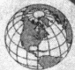

### 美国和世界文化多样性

### 你可以为我们工作,但不要住在我们附近

以前从来没有那么多人拥挤在长岛峡谷海湾市政厅。吸引人们前来的是他们这个社区的前途命运，这个社区已经汇集了来自各个种群和社会阶级的人群。坐在前面的是衣冠楚楚的长岛人。坐在后面的人身穿脏裤子和工作靴，那些布满老茧的手表明他们是庄园劳动力或建筑工人。大多数人逃离萨尔瓦多的内战，到美国寻求庇护和工作。

临时打工者排成长队，寻求工作。

会议由市长主持召开。长岛市长是意大利移民的后代，曾经发起过取消城镇临时佣工市场的计划，命令移民局巡查路边，寻找临时工作人员的聚集地。当晚，市长提议，为了寻找工作而在城市街边聚集的人数为五人或五人以上时，将被视为非法行为。居民们证实说那些人骚扰女性并在公共场合小便；他们把临时佣工市场视为眼中钉。移民代表表示反对，认为移民的集会自由受到宪法保护，况且那些人并没有在街上闲逛，而是在路边静静等待工作。

还有一个问题更加困扰长岛人，只不过他们不愿意公开承认。有人私下告诉我，长岛人害怕移民的到来会给人留下城镇正在衰退的印象，这种感觉会危及房地产的价值，而房地产正是美国中产阶级的保障。甚至于种族种群的轻微变化迹象，也会惊动房屋所有者和持币购买者。这种恐惧导致峡谷海湾发生了一场清除临时用工市场的行动。临时用工市场正是少数民族在此地区定居的一个最鲜明现象。

市镇会议上不会讨论、日常闲谈中也不会涉及的一件事情是：移民之所以被吸引到这里，恰恰是因为城郊居民需要他们的廉价劳动力。几乎所有长岛的庭院设计师都是萨尔瓦多人，而且许多家

---

庭都雇佣移民妇女打扫房屋、照顾老人孩子。有很多移民，尤其是来自萨尔瓦多及其他拉丁美洲的移民，辛苦劳作于长岛的工厂、饭店厨房、洗衣房，以及夜间阴暗的办公楼。对于这些工作，美国工人不愿去干；况且报酬太少，根本不足以养家。

当萨尔瓦多人及其他移民来到长岛谋生时，一开始，他们居住在少数民族密集的地区。然而，当移民居住的区域离工作地点越来越近时，在许多更为传统的居住区（如长岛地区）的移民数量便有所增加。其他一些城镇也开始实施“离开我的后院”政策，它们通过了新的法案或是加强旧法案的力度，甚至拒绝没有身份的移民子女进入公立学校。老一代人认为，只有这样的措施才能阻止生活继续恶化。然而，他们没有认识到，这些移民劳动力怎样维持了他们的生活水平。

（萨拉·马厄，佛蒙特大学，萨尔瓦多郊区）

### 同化

同化（assimilation）是少数民族被主流文化吸收的过程。它可以分为两种类型。被迫同化是优势种族禁止少数民族坚持他们的信仰，禁止他们讲自己的语言或遵循他们自己的习俗。以苏联为例，优势种族的俄罗斯人要求亚美尼亚儿童接受俄语教育，只允许亚美尼亚裔人过俄国节日。相反，许可式同化则允许少数民族以他们自己的速度和方式适应优势种族的生活模式。

### 多元文化主义(多元文化论)

多元文化主义（multiculturalism）政策，又称多元文化论（pluralism），允许甚至鼓励种族或民族的差异。少数民族可以保持他们的独立特性，同时可以自由参加他们国家的社会制度，包括从教育到政治。瑞士就是多元文化主义一个极好的例子。瑞士人由4个民族构成——法国人、意大利人、德国人和罗马人。这些群体都保留了他们自己的语言，在政治经济生活中和平共处。多元文化主义在这里如此成功，以至于把任何群体称为弱势群体都是不恰当的。

### 美国的种族关系

谈及种族问题犹如步入雷区：你永远无法预测何处会有爆炸的危险。即便是最基本的术语都充满争议。比如“非裔美国人”一词就受到很多人的排斥——他们质疑为何这个词语不包括南非白人移民。一些被认为是“非裔美国人”的人也排斥这个词，因为他们认为自己属于黑人。与之类似，一部分拉美裔人喜欢西班牙裔美国人的说法，还有一些拉美裔人认为这个说法忽视了印第安血统。墨西哥裔美国人一般指的是来自墨西哥的美国人。但是一些人只用这个词来指称那些具有压迫感和民族统一感的人群；他们认为这个词不适用于那些被主流文化同化了的人。

我在这里使用的术语中，没有哪一个可以得到所有人的认同。种族身份是不固定的、持续变化的，而且当某个术语被赋予新的政治含义的同时也带来了一种风险。不过，在日常生活中，我们习惯于把自己和别人分类并归属于截然不同的种群。根据这些自我认同，白人占美国人口的68%，少数民族（非裔美国人、亚裔美国人、拉美裔美国人及印地安人）占美国人口的31%，见图12.5。

---

图 12.5 美国的族群

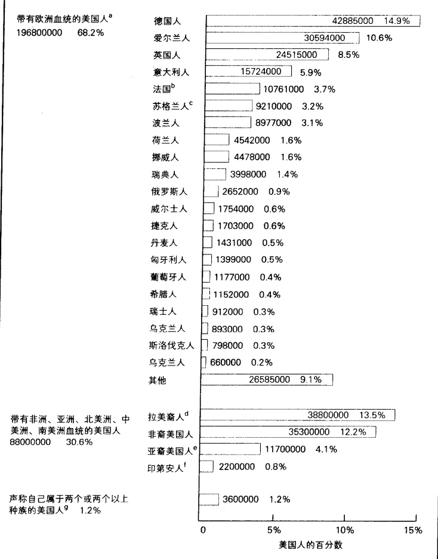

### 注：

a. 表中的数据只是一种粗略的统计。2002年资料中的表1373列出的不同种族—民族类别的人总数为2.94543亿人。2003年资料则列了2.884亿人。百分数的计算依据的是2003年资料。

b. 包括法裔加拿大人。

c. 包括苏格兰-爱尔兰人。

d. 大多数拉美裔人的血统或多或少来自欧洲。

e. 亚裔美国人群体的规模从大到小依次排列如下：中国、菲律宾、印度、日本、韩国和越南。见图 12.9。其中还包括那些自认为是土生夏威夷人及太平洋岛屿居民的人。

f. 包括印地安人、爱斯基摩人和阿留申人。

g. 与 2000 年人口普查的数据相比, 这些人口在数量上少了 120 万。

资料来源：作者根据Statistical Abstract 2002: Table 36, 38, 1373; Bernstein and Bergman (2003) 整理而成。

各州的优势种族与少数民族的分布和全国的平均分布相近。这是因为少数民族倾向于在某些地区聚集。州与州之间的分布很不均匀：缅因州只有3%的少数民族，而夏威夷的少数民族则超过盎格鲁人76到29个百分点。了解了这些背景之后，我们将从最大的一个种群开始，对美国的主要族群逐一进行分析。

### 欧洲白人

发生在美国第一次大陆会议期间的一件事，可能最能说明国家创立者的种族观念。在那次会议上，他们通过了1790年国籍法案，宣布只有白色人种的移民才可以申请国民身份。WASPs（盎格鲁萨克逊

---

白人新教徒)的特权和优越感并不限于其种族观念。他们还把非英格兰的欧洲白人移民也视为劣等民族，并对白种人(white ethnic,那些语言和习俗与他们不同的欧洲移民)持一贯的消极态度。他们尤其鄙视爱尔兰人，认为爱尔兰人是肮脏懒惰的酒鬼；对波兰人、犹太人、德国人、意大利人等其他种族，也抱有类似的轻视态度。

WASPs 的文化和政治优势对其他移民来说是一种压力，这种压力使之融合到主流文化当中。大多数移民的子女都拥有了这种新的生活方式，并很快认定自己是美国人而不是德国人、法国人、匈牙利人或其他什么人。他们放弃了自己的独特风俗(特别是语言)，还把自己的风俗视为羞辱的标志。移民的第二代夹在了两个世界之间，一个是来自“旧国家”的父母的世界，另一个是他们的新家。而他们的孩子即第三代则更容易作出调整，因为第三代需要放弃的习俗更少。当欧洲其他地区的移民被同化为这种盎格鲁文化之后，盎格鲁萨克逊人的含义就扩展了。

总之，由于英格兰新教徒建立了殖民地，他们确定了那里的文化——主流语言和主流信仰。他们有高度的种族优越感，将其他种群的习俗视为劣等习俗。由于欧洲白人移民掌权，因而，他们可以决定国家的议程，而其他种群必须遵循。他们的制度和文化优势也确定了当前种族关系的基础，相关的话题在下面的“现实社会学”专栏中有所分析。

### 现实社会学

### 打开无形背包: 探究文化特权

在美国，公开的种族歧视已经明显减少。但是，事情仍会因我们的肤色差异而有所不同。白人们往往很难意识到由于他们是白人而享受了很多好处。通常他们不会意识到“白皮肤”在他们的生活中所起到的作用。

佩姬·麦金托什具有爱尔兰血统，她发现自己很少会意识到自己的种族血统，但是她的非裔朋友就很在意他们自己的种族。她意识到，当人们对一些事情想当然时，就很少会加以注意。“白皮肤”就是美国社会中一种“理所当然”的属性。为了分析这种现象，她一一列出了所有由于自己的“白皮肤”而让她认为是理所当然的事情，并把这些事情称作“无形背包”。

那么，这个“背包”里包括什么呢？哪一些“平时不加分析的理所当然”是大多数美国白人默许给自己的特权呢？麦金托什(McIntosh,1988)说，由于她是白人，所以：

1. 如果作为一个领导者我做的不好,我可以肯定人们不会把这归咎于我的种族。

2. 购物时，商店保安不会跟踪我。

3. 看电视或读报纸头版时,和我同种族的人大多会以正面形象出现在上面。

4. 学习民族遗产时,我看到的是和我同肤色的人们,正是他们使我们的国家变得伟大。

5. 使用支票或信用卡时,我的肤色不会使店员怀疑我的支付能力。

6. 我不必教育我的孩子们了解种族主义来避免他们受到伤害。

7. 我可以一边吃东西一边说话,别人不会把这和我的肤色联系起来。

8. 我可以穿旧衣服,人们不会因此而联想到我所属种族的贫困。

9. 我在公众场合的言论不会对我的种族制造麻烦。

10. 我可以成功地做好一些事情, 而人们不会认为“那归功于我的种族”。

---

11. 从来没有人要求我代表自己的种族讲话。

12. 如果交警让我靠边停车, 我可以肯定他不是因为我是白人而这么做。

13. 我可以得到一份工作和老板的肯定, 而别人不会认为由于我的种族身份我才得到这份工作。

14. 开会迟到时,别人不会认为我迟到是因为“他们就是这样的人。”

### 思考题

你能想到日常生活中其他一些白人“自然享有的特权”（麦金托什的列表中包括46项）吗？为什么白人很少意识到他们背着这种无形背包？

### 拉美裔人

在说明拉美裔人的特征之前必须强调一点，拉美裔人和西班牙裔这两个词指代的并不是同一个种族，而是一些族群。从种族上说，拉美裔人可以指黑人、白人或土著美国人。随着这种自我认同的变化，一些具有非洲血统的拉美裔人甚至会把自己归为非裔拉美人(Navarro，2003)。

数量、来源、分布 早在用于制造“五月花”号的树木上还筑有鸟巢的时候，拉美裔美国人就已经在佛罗里达和新墨西哥定居下来(Bretos，1994)。今天，拉美裔美国人是美国最大的少数族群。如图12.6

图 12.6 拉美裔美国人原国别示意图

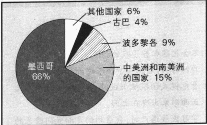

资料来源：作者根据 Statistical Abstract 2002: Table 40 整理而成。

图 12.7 拉美裔美国人在美国的居住分布图

资料来源：作者根据 Statistical Abstract 2002: Table 23 整理而成。

今天，拉美裔美国人是美国最大的少数族群。如图12.6所示，墨西哥裔大约有2200万人，波多黎各裔300万，古巴裔超过100万，中美洲和南美洲人近500万。根据官方统计，拉美裔美国人有3500万，而实际数字应该更多，因为肯定会有许多非法入境的人避开了官方调查和人口普查。尽管大多数拉美裔人都是合法居民，但每年仍会有大约160万人在边界和内地被捕并被遣返墨西哥（Statistical Abstract 2002: Table 301）。另外，也许还有大约100万拉美裔人成功地进入了美国。许多移民在美国工作一段时间之后就会返回墨西哥的家园。

做个比较我们就可以清楚这些人的数量之多：在美国的拉美裔美国人比在加拿大的加拿大人(共计3200万)多出数百万。因为在美国中部一大片区域内都没有拉美裔美国人，因而，这样的对比常常令美国中西部人大吃一惊。如图12.7所示，66%的拉美裔美国人集中在加州、得克萨斯州、佛罗里达州和纽约州这四个州。

西班牙语 西班牙语把大部分拉美裔人和其他种群区分开来。在美国，有2800万人在家中讲西班牙语。美国是世界上讲西班牙语的最大国家之一(Statistical Abstract 2002: Table 1373)。由于大约一半拉美裔人不会讲英语，或者讲英语有困难，因而英语成为数百万人得到好工作的最大障碍。

---

西班牙语日益增长的应用已成为一个备受争议的问题。加州参议员早川认为西班牙语的流行是一种威胁，他在1981年发起了一个“只讲英语”的运动。尽管早川发起的宪法修正案从未付诸实施，但却有23个州通过了一项法律，宣布英语是他们的官方语言(Schaefer，2000)。

多样性 对于拉美裔人来说，其原国籍十分重要。比如那些来自波多黎各的人和那些来自墨西哥、委内瑞拉或萨尔瓦多的人很少有共同之处，就像早先来自德国、瑞典和英格兰的移民彼此之间并不相同一样。拉美裔人之间存在差异的一个标志是许多人以他们的原国籍来区分自己，比如古巴裔美国人、波多黎各裔美国人等等，而不是自称拉美裔美国人或西班牙裔美国人。

同其他种群一样，拉美裔美国人也被分为不同的社会阶层。比如在1959年卡斯特罗上台时逃离的50万古巴人大多是受过良好教育、家境富裕的专业人士或商人；而那些后来逃离古巴的“乘船难民”则大多来自社会底层。早期抵达美国的古巴人在佛罗里达站稳了脚跟，控制了很多商业和财政机构，从而和那些后期到达的古巴人拉开了距离。

这些原国籍和社会阶层的划分，成为拉美裔美国人在政治上达到统一的主要障碍。这一障碍大大削弱了他们在政治上的影响力。拉美裔美国人占美国总人口的13.5%，按比例应当有13或14名参议员是拉美裔美国人。可是实际上有多少人呢？一个也没有。在众议院中，拉美裔美国人也仅占有4%的席位（Statistical Abstract 2002: Table 382）。

拉美裔美国人不单在内部有诸多差异，他们和非裔美国人之间也存在着巨大的鸿沟(Flippen，2001)。由于两个族群的文化和历史截然不同，两者的关系时常会变得非常紧张。随着拉美裔美国人在美国社会中的影响日益扩大，他们要求平等的呼声也愈加强烈。此时，拉美裔美国人和非裔美国人的正面冲突就凸现出来：非裔美国人担心拉美裔美国人会获得更多的工作机会并在选举中对自己产生不利影响。拉美裔美国人和非裔美国人的人口总和占美国总人口的25%。两个族群也许会渐渐认识到，他们的联合在政治上可能会形成一股不可阻挡的力量。

生活状况比较 表 12.1 是拉美裔美国人和其他族群相比较的情况。从表中可以看出，相对于美国白人和亚裔美国人来说，拉美裔美国人的境况指数较差。我们还可以看到，拉美裔美国人和非裔美国人在各项指标上的数据排名比较接近。此表中的数据也说明了原籍国别的重要性。在拉美裔美国人中，古巴裔美国人的境况最好，波多黎各裔美国人的境况最差。表 12.2 显示，每三个拉美人中就有一个没有完成高中学业，只有 11% 的人大学毕业。当今社会，高级的职业技能日益重要，这就意味着大量的拉美人将落后于社会的要求。

### 非裔美国人

奴隶制废除以后，在美国南方，人们仍习惯于称黑人为黑鬼（Jim Crow），并通过了种族隔离法案。1896年，最高法院在普莱西诉弗格森（Plessy v. Ferguson）一案中认定，在公共场所对黑人进行“平等的隔离”是州法律的合理应用。通过这个法令，白人剥夺了黑人在内战后取得的政治权利，禁止黑人在“白人”初选中投票。直到1944年，最高法院才准许非裔美国人在南方初选中进行投票。1954年，黑人获准和白人上同样的公立学校（Schafer，2000）。但直到20世纪60年代，在美国南方，隔离政策依然公开并合法地存在着。

---

表 12.1 种族和富裕程度对照表

<table border=1 style='margin: auto; word-wrap: break-word;'><tr><td style='text-align: center; word-wrap: break-word;'></td><td colspan="2">收入</td><td colspan="2">失业率</td><td colspan="2">贫困率</td><td colspan="2">拥有房产的比例</td></tr><tr><td style='text-align: center; word-wrap: break-word;'></td><td style='text-align: center; word-wrap: break-word;'>家庭收入中位数</td><td style='text-align: center; word-wrap: break-word;'>占白人家庭收入的百分比</td><td style='text-align: center; word-wrap: break-word;'>失业率</td><td style='text-align: center; word-wrap: break-word;'>占白人失业率的百分比</td><td style='text-align: center; word-wrap: break-word;'>低于贫困线的百分比</td><td style='text-align: center; word-wrap: break-word;'>占白人贫困率的百分比</td><td style='text-align: center; word-wrap: break-word;'>拥有房产的百分比</td><td style='text-align: center; word-wrap: break-word;'>占白人拥有房产的百分比</td></tr><tr><td style='text-align: center; word-wrap: break-word;'>美国白人</td><td style='text-align: center; word-wrap: break-word;'>51224美元</td><td style='text-align: center; word-wrap: break-word;'>—</td><td style='text-align: center; word-wrap: break-word;'>2.3%</td><td style='text-align: center; word-wrap: break-word;'>—</td><td style='text-align: center; word-wrap: break-word;'>9.8%</td><td style='text-align: center; word-wrap: break-word;'>—</td><td style='text-align: center; word-wrap: break-word;'>71%</td><td style='text-align: center; word-wrap: break-word;'>—</td></tr><tr><td style='text-align: center; word-wrap: break-word;'>拉美裔美国人</td><td style='text-align: center; word-wrap: break-word;'>31663美元</td><td style='text-align: center; word-wrap: break-word;'>62%</td><td style='text-align: center; word-wrap: break-word;'>3.9%</td><td style='text-align: center; word-wrap: break-word;'>170%</td><td style='text-align: center; word-wrap: break-word;'>22.8%</td><td style='text-align: center; word-wrap: break-word;'>233%</td><td style='text-align: center; word-wrap: break-word;'>48%</td><td style='text-align: center; word-wrap: break-word;'>65%</td></tr><tr><td style='text-align: center; word-wrap: break-word;'>原国籍</td><td style='text-align: center; word-wrap: break-word;'></td><td style='text-align: center; word-wrap: break-word;'></td><td style='text-align: center; word-wrap: break-word;'></td><td style='text-align: center; word-wrap: break-word;'></td><td style='text-align: center; word-wrap: break-word;'></td><td style='text-align: center; word-wrap: break-word;'></td><td style='text-align: center; word-wrap: break-word;'></td><td style='text-align: center; word-wrap: break-word;'></td></tr><tr><td style='text-align: center; word-wrap: break-word;'>墨西哥</td><td style='text-align: center; word-wrap: break-word;'>31123美元</td><td style='text-align: center; word-wrap: break-word;'>61%</td><td style='text-align: center; word-wrap: break-word;'>4.1%</td><td style='text-align: center; word-wrap: break-word;'>178%</td><td style='text-align: center; word-wrap: break-word;'>24.1%</td><td style='text-align: center; word-wrap: break-word;'>246%</td><td style='text-align: center; word-wrap: break-word;'>48%</td><td style='text-align: center; word-wrap: break-word;'>68%</td></tr><tr><td style='text-align: center; word-wrap: break-word;'>波多黎各</td><td style='text-align: center; word-wrap: break-word;'>30129美元</td><td style='text-align: center; word-wrap: break-word;'>59%</td><td style='text-align: center; word-wrap: break-word;'>4.0%</td><td style='text-align: center; word-wrap: break-word;'>174%</td><td style='text-align: center; word-wrap: break-word;'>25.8%</td><td style='text-align: center; word-wrap: break-word;'>263%</td><td style='text-align: center; word-wrap: break-word;'>35%</td><td style='text-align: center; word-wrap: break-word;'>49%</td></tr><tr><td style='text-align: center; word-wrap: break-word;'>古巴</td><td style='text-align: center; word-wrap: break-word;'>38312美元</td><td style='text-align: center; word-wrap: break-word;'>75%</td><td style='text-align: center; word-wrap: break-word;'>2.7%</td><td style='text-align: center; word-wrap: break-word;'>117%</td><td style='text-align: center; word-wrap: break-word;'>17.3%</td><td style='text-align: center; word-wrap: break-word;'>177%</td><td style='text-align: center; word-wrap: break-word;'>59%</td><td style='text-align: center; word-wrap: break-word;'>83%</td></tr><tr><td style='text-align: center; word-wrap: break-word;'>中美洲和南美洲</td><td style='text-align: center; word-wrap: break-word;'>33105美元</td><td style='text-align: center; word-wrap: break-word;'>65%</td><td style='text-align: center; word-wrap: break-word;'>3.5%</td><td style='text-align: center; word-wrap: break-word;'>152%</td><td style='text-align: center; word-wrap: break-word;'>16.7%</td><td style='text-align: center; word-wrap: break-word;'>170%</td><td style='text-align: center; word-wrap: break-word;'>38%</td><td style='text-align: center; word-wrap: break-word;'>54%</td></tr><tr><td style='text-align: center; word-wrap: break-word;'>非裔美国人</td><td style='text-align: center; word-wrap: break-word;'>31778美元</td><td style='text-align: center; word-wrap: break-word;'>62%</td><td style='text-align: center; word-wrap: break-word;'>5.0%</td><td style='text-align: center; word-wrap: break-word;'>217%</td><td style='text-align: center; word-wrap: break-word;'>23.6%</td><td style='text-align: center; word-wrap: break-word;'>241%</td><td style='text-align: center; word-wrap: break-word;'>47%</td><td style='text-align: center; word-wrap: break-word;'>66%</td></tr><tr><td style='text-align: center; word-wrap: break-word;'>亚裔美国人 $ ^{a} $</td><td style='text-align: center; word-wrap: break-word;'>54500美元 $ ^{c} $</td><td style='text-align: center; word-wrap: break-word;'>106%</td><td style='text-align: center; word-wrap: break-word;'>2.6%</td><td style='text-align: center; word-wrap: break-word;'>113%</td><td style='text-align: center; word-wrap: break-word;'>10.8%</td><td style='text-align: center; word-wrap: break-word;'>110%</td><td style='text-align: center; word-wrap: break-word;'>53%</td><td style='text-align: center; word-wrap: break-word;'>75%</td></tr><tr><td style='text-align: center; word-wrap: break-word;'>土著美国人</td><td style='text-align: center; word-wrap: break-word;'>31929美元</td><td style='text-align: center; word-wrap: break-word;'>62%</td><td style='text-align: center; word-wrap: break-word;'>20.2%</td><td style='text-align: center; word-wrap: break-word;'>878%</td><td style='text-align: center; word-wrap: break-word;'>28.4%</td><td style='text-align: center; word-wrap: break-word;'>290%</td><td style='text-align: center; word-wrap: break-word;'>NA $ ^{b} $</td><td style='text-align: center; word-wrap: break-word;'>NA</td></tr></table>

a 包括太平洋岛屿移民。b 数据不详。c 从其他族群的收入变化外推而来。

资料来源：Statistical Abstract 2002: Table 36、37、38、40 和美国人口普查局 2003 年出版的《探究美国真相》(American Fact Finder): Table GCT-P12、P14。

表 12.2 教育程度和种族

<table border=1 style='margin: auto; word-wrap: break-word;'><tr><td style='text-align: center; word-wrap: break-word;'></td><td style='text-align: center; word-wrap: break-word;'>高中教育程度以下</td><td style='text-align: center; word-wrap: break-word;'>高中教育程度</td><td style='text-align: center; word-wrap: break-word;'>接受过1—3年大学教育</td><td style='text-align: center; word-wrap: break-word;'>大学毕业</td><td style='text-align: center; word-wrap: break-word;'>获得博士学位的人数</td><td style='text-align: center; word-wrap: break-word;'>获得博士学位的百分比</td><td style='text-align: center; word-wrap: break-word;'>占全美总人口的百分比</td></tr><tr><td style='text-align: center; word-wrap: break-word;'>美国白人</td><td style='text-align: center; word-wrap: break-word;'>15%</td><td style='text-align: center; word-wrap: break-word;'>33%</td><td style='text-align: center; word-wrap: break-word;'>25%</td><td style='text-align: center; word-wrap: break-word;'>26%</td><td style='text-align: center; word-wrap: break-word;'>23,660</td><td style='text-align: center; word-wrap: break-word;'>79%</td><td style='text-align: center; word-wrap: break-word;'>68.2%</td></tr><tr><td style='text-align: center; word-wrap: break-word;'>拉美裔美国人</td><td style='text-align: center; word-wrap: break-word;'>32%</td><td style='text-align: center; word-wrap: break-word;'>57%</td><td style='text-align: center; word-wrap: break-word;'>NA%</td><td style='text-align: center; word-wrap: break-word;'>11%</td><td style='text-align: center; word-wrap: break-word;'>1,283</td><td style='text-align: center; word-wrap: break-word;'>4%</td><td style='text-align: center; word-wrap: break-word;'>13.5%</td></tr><tr><td style='text-align: center; word-wrap: break-word;'>非裔美国人</td><td style='text-align: center; word-wrap: break-word;'>22%</td><td style='text-align: center; word-wrap: break-word;'>35%</td><td style='text-align: center; word-wrap: break-word;'>27%</td><td style='text-align: center; word-wrap: break-word;'>17%</td><td style='text-align: center; word-wrap: break-word;'>1,760</td><td style='text-align: center; word-wrap: break-word;'>6%</td><td style='text-align: center; word-wrap: break-word;'>12.2%</td></tr><tr><td style='text-align: center; word-wrap: break-word;'>亚裔美国人</td><td style='text-align: center; word-wrap: break-word;'>14%</td><td style='text-align: center; word-wrap: break-word;'>22%</td><td style='text-align: center; word-wrap: break-word;'>20%</td><td style='text-align: center; word-wrap: break-word;'>44%</td><td style='text-align: center; word-wrap: break-word;'>2,327</td><td style='text-align: center; word-wrap: break-word;'>8%</td><td style='text-align: center; word-wrap: break-word;'>4.1%</td></tr><tr><td style='text-align: center; word-wrap: break-word;'>土著美国人</td><td style='text-align: center; word-wrap: break-word;'>28%</td><td style='text-align: center; word-wrap: break-word;'>59%</td><td style='text-align: center; word-wrap: break-word;'>NA</td><td style='text-align: center; word-wrap: break-word;'>13%</td><td style='text-align: center; word-wrap: break-word;'>179</td><td style='text-align: center; word-wrap: break-word;'>0.6%</td><td style='text-align: center; word-wrap: break-word;'>0.8%</td></tr></table>

注：NA 即 Not Available（不详）；除博士学位获得者之外，其他数字的统计对象都是 25 岁或 25 岁以上的人。

资料来源：Statistical Abstract 2000：Table 42、44；Statistical Abstract 2002：Table 36、37、40 和 771；美国人口普查局 2003 年出版的《探究美国真相》（American Fact Finder）：Table GCT-P11。

### 争取民权的斗争

1955年，亚拉巴马州的蒙哥马利。法律规定，公共汽车前部的座位由白人乘坐，黑人只能坐在后面的座位上。当车上坐满人的时候，黑人必须把座位让给白人。

42岁的非裔美国妇女，蒙哥马利“全国有色人种协进会”的秘书罗莎·帕克斯拒绝在公共汽车上给白人让座（Bray，1995）。她固执地坐在自己的座位上，公交车司机对此很恼火，白人认为他们受到了侮辱。罗莎·帕克斯的被捕引发了一场群众示威游行，导致5万黑人抵制城市公交长达一年时间，这也把一个原本默默无闻的传教士推到了历史的前台。

---

此人名叫小马丁·路德·金，毕业于佐治亚州亚特兰大的莫豪斯学院，主攻社会学。他组织了汽车集会并倡导“非暴力抵抗运动”。这位激进的种族领袖以及黑人团体中的反抗情绪，激怒了那些种族隔离者，他们也开始行动起来——着手炸毁黑人的家园和教堂。

上升的期望和国内的斗争 障碍不断被消除，但进程缓慢。直到1964年，国会才通过了“民权法”：发生在饭店、旅馆、剧院等公共场所的种族歧视被视为非法。接着在1965年国会通过了“选举权法”，禁止了南方曾经用于剥夺黑人选举权的欺骗性做法。

这些成果使得非裔美国人普遍受到鼓舞，社会学家称之为上升的期望，即黑人认为他们的生活状况会很快得到改善。然而，他们当中的穷人的境况几乎没有得到任何改善。黑人心中的挫败感不断积聚，终于在1965年的沃茨爆发出来。洛杉矶的非裔美国人第一次拊上街头，并从此揭开了所谓“城市反抗运动”的序幕。1968年4月4日，当金被一名信奉种族至上主义的白人暗杀后，全美各大城市掀起了轰轰烈烈的反抗热潮。由于担心城市遭到毁灭，美国国会终于通过了完全意义上的“1968年民权法”。

后续成果之后，非裔美国人在政治、教育、经济等方面取得了巨大进展。非裔美国人在众议院中的席位在30年间增加到9%，是原来数量的四倍（Rich，1986；Statistical Abstract 2002：Table 382）。随着大学入学率的增长，中产阶级数量不断膨胀。现今，半数非裔美国人的家庭年收入超过35000美元；每三个家庭中就有一个家庭年收入超过50000美元；每六个家庭中就有一个年收入超过75000美元（Statistical Abstract 2002：Table 657）。尽管非裔美国人的贫困率最高（见表12.1），但与原来相比，他们的平均收入水平并不算低。

1984年和1988年，杰西·杰克逊（其专业也是社会学）参加了民主党总统候选人提名的竞争，通过这一事件，人们注意到非裔美国人的政治地位有所上升。1989年，弗吉尼亚的L.道格拉斯·怀尔德成为通过选举产生的第一位非裔美国州长，这是黑人在政治上地位提高的有力佐证。2000年，艾伦·凯斯竞选共和党总统提名人一事，再次使非裔美国人的政治地位引起了全国关注。

当前的不足之处 尽管已经取得了一些成果，但在政治、经济和教育等方面，非裔美国人仍然是落后的：美国参议员中没有非裔美国人，而根据非裔美国人在美国人口中的比例应当大约有12个。如表12.1和12.2所示，非裔美国人的平均收入只有白人的62%；失业和贫困问题更为严重；拥有自己的房子、受大学教育的机会更少。至于有半数非裔美国人家庭年收入超过35000美元只是事情的一个方面；另一方面，每五个家庭中差不多就有一个年收入少于15000美元（Statistical Abstract 2002: Table 657）。

生活在两个世界的非裔美国人进一步分化——一部分人受到良好教育、生活富足，另一部分人则缺少教育、生活贫穷。穷人里面集中了那些没有憧憬、充满绝望的人，暴力事件常常充斥晚间新闻。尽管谋杀率在20年来已经降到了最低点，然而，非裔美国男性的被杀几率是白人男性的7倍，非裔美国女性的被杀几率是白人女性的3倍多（Statistical Abstract 2002: Table 289）。而且，非裔美国人死于艾滋病的几率是白人的8倍（Statistical Abstract 2002: Table 109）。

种族还是红云所致！一场红云字争论 符非裔美国人划分为“昌人”和“贫人”两类人的做法，激化了一场社会学争论。社会学家威廉·朱利叶斯·威尔逊(Wilson 1978, 1987, 2000)认为，在决定非裔美国人生活状况的问题上，社会阶级已经起到了比种族更为重要的作用。他讲到，在民权法颁布之前，种

---

族决定了非裔美国人的生活状况。当时，全美国的黑人都无法获取可以使经济状况好转的有效途径——好的教育和好的工作。当民权法提供了更多可能性时，非裔美国人紧紧抓住了这些机遇。沿着其他种群走过的历程，非裔美国人的经济状况不断得到改善；与此同时，他们也逐步远离了市中心。立法给予了他们机会，但制造业的工作机会却渐渐减少，许多蓝领工作都转移到了城市郊区。结果，受过良好教育的非裔美国人可以获得中产阶级的白领工作。与之相反，那些教育程度差、工作技能少的人则因陷于贫穷而不得不留在市中心。

威尔逊认为，其结果就是出现了两种截然不同的非裔美国人的生活世界。一种人呆在城市内部，生活贫困，上穷人学校，从事的工作没有出路，福利很糟糕。在这个人群中充满了绝望、冷漠和敌意。相反，另外一种进入社会上层的人则拥有舒适的住房和可靠的邻居，工作收入可观，孩子可以上好的学校。中产阶级生活方式已经改变了他们的人生观，其追求和价值观已经和那些贫穷的非裔美国人迥然相异。因此，威尔逊认为，非裔美国人生活中最重要的因素已经不是种族，而是社会阶级。

有些社会学家反驳说，这种分析忽视了仍然深植在非裔美国人生活当中的歧视问题。他们指出，即便是做完相同的工作，黑人的平均收入也比白人少（Willie1991；Herring 2002）。这一点说明了种族歧视问题，而不是社会阶级问题。

那么，这场争论的答案是什么呢？对于上面的质疑，威尔逊说：这不是一个二选一的问题，我的书名是《种族重要性在下降》(The Declining Significance of Race)，而不是《种族的消失》(The Absence of Race)。他进一步补充道：当然，种族主义依然存在，但是在现在的黑人生活中，社会阶级要比种族歧视更为重要。对于那些城市中的贫困者，我们应当给他们提供工作——因为有了工作就有了希望，工作将为一个稳定的生活提供保障(Wilson，1996，2000)。

种族主义成为日常负担 当今的种族主义表现已经远比以前隐蔽，但却依然存在于我们中间。为了研究招聘市场中的种族歧视，研究者根据芝加哥和波士顿周日报纸上的招聘广告发出了5000份简历（Bertrand and Mullainathan，2002）。这些简历是完全相同的，不同的只有应聘者的名字：有的是白人常用的名字，比如艾米莉或布兰顿；有的是黑人常用的名字，比如勒克沙或佳玛。尽管求职者的情况完全相同，但是白人名字比黑人名字得到的电话回复要多一半。下面的“现实社会学”专栏更详尽地研究了细小之处所体现出的种族主义。

### 现实社会学

### 租赁市场中的潜在种族歧视：口音透露出你的信息

大多数明目张胆的种族歧视都已成为过去。以前，白人在黑人家门口燃烧十字架也不会受到惩罚，有人甚至无视法律而对非裔美国人和亚裔美国人动用私刑。现如今，动用私刑和焚烧十字架都将受到调查和起诉。如果地方官员不予以逮捕的话，美国联邦调查局将会介入。同样，公共场所的歧视曾经是人们习以为常的。但是今天，没有任何旅馆、饭店或加油站会由于种族问题而拒绝服务：那样做是违法的。

随着时代变迁，有人会认为种族歧视已不复存

---

在。然而，正如宾州大学的社会学家道格拉斯·马西(Massey and Lundy,2001)所述，尽管公开的种族歧视已经退到社会生活的后台，但潜在的种族歧视仍活跃在生活中。他在本科所上的研究方法课上发现，白人讲中产阶级白人英语，一些非裔美国人讲黑人本地口音，还有一些非裔美国人讲带有黑

图 12.8 房屋租赁市场中的潜在种族歧视

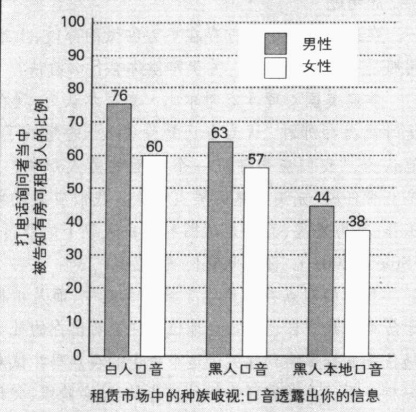

资料来源: Massey and Lundy (2001)。

人口音的中产阶级英语。

众所周知，美国人经常根据言语来确定一个人的种族。马西运用言语这一日常生活的特征，来测试房屋租赁市场中的歧视情况。他和他的学生根据语音群体设计了各种身份(假定收入相当)，同时准备了标准的台词脚本，一组人把台词转换成黑人本地口音。学生们给79个在报纸上刊登广告的房屋租赁者打了电话。测试各自独立进行，黑人学生和白人学生彼此间并不知道对方的测试情况。

和白人相比，黑人能够和租赁代理人通话的可能性较小，因为租赁代理人通常使用自动应答机来筛选来电；被告知房屋仍然可租的几率上，黑人小于白人；索要申请费的可能性上，黑人大于白人；被问及信用问题的可能性上，黑人也大于白人。图12.8描述了打电话询问者当中被告知有房可租的人的比例。扮演下层黑人的学生（使用黑人本地口音）能联系到住房的可能性最低。

正如你所看到的，尽管男女都会受到歧视，对于女性而言歧视现象更为严重。这种情形有时被称作双重束缚（double bind），非裔美国女性会因自己既是黑人又是女性而受到双重歧视。

问题是作为一个非裔美国人，你必须花很多时间考虑一些白人根本无需考虑的问题。当警察让我靠边停车时我会很担心……警察手中都持有枪支，因此，我非常担心白人警察走向我的车子时会想到什么。我很清楚有多少黑人被警察意外击中。走进商店时，我担心有人会认为我可能偷拿商品……我必须考虑很多别人不用考虑的事，而和我政见相同、关系亲密的白人朋友都不必考虑那些问题——对于这一点我感到很是有些愤恨不平。（Feagin，1999：398）

地位更高的非裔美国人机会较多，受到的歧视也会少一些。然而，他们尝到的歧视之苦并不能减轻多少。与白人不同，他们感到，歧视一直在他们周围存在。下面就是一个黑人教授的看法：

下面的“批判性思考”专栏提出了一个对遭受不公待遇的非裔美国人作出补偿的建议。

### 亚裔美国人

本章我已强调过，我们的种族分类更多考虑的是社会因素而不是生理特征。这一点在我们考察亚裔美国人这一类别时尤为明显。如图 12.9 所示，那些被称作亚裔美国人的人，是从不同的国家来到美国的。既然没有统一的文化或者“种族特征”，为什么把他们统统划归到一个种族类别呢——只是由于

---

### 批判性思考

### 奴隶制度的补偿——公平还是愚蠢？

这里的副标题“公平还是愚蠢”旨在描述有关奴隶制度补偿问题的一场针锋相对的争论。事情本身其实很简单：对数百万非洲人的奴役绝对不公平。那些奴隶工作了240年没有得到任何报酬，他们的后代理应得到补偿。这是一个道德问题，同时也是一个法律问题。

关于补偿或赔偿的争论，包含以下相关内容。首先，当今白人的财富是建立在黑奴几个世纪的无偿劳动之上的。其次，如今黑人和白人在教育、住房和收入等方面的不平等状况（“种族差距”），正是奴隶制造成的后果（Marable，2001；Conley，2002）。

简言之，补款是返还工资的一种形式。这些返还的工资应当直接付给那些奴隶的后代或者交给补款信托公司，用于解决整个黑人社会迫在眉睫的问题。

补款的反对者也同意奴隶制度是违背人性的极大罪行。他们强调的是，奴隶制已经是过去式了；而且，奴隶制并不是黑人和白人之间的问题。实际上是非洲人自己先把当囚犯的同胞卖给白人奴隶主的。关于谁应当得到补偿金的问题需要考虑：自由黑人的后代是否应当得到补偿金？拥有自己的奴隶的自由黑人的后代呢？那些在奴隶制度结束以后移民到美国的黑人后代可以得到补偿金吗？现如今的黑人移民呢？

随之而来的问题是，应当由谁来支付那些补偿金？大部分美国人是在奴隶制废除以后来到美国的。他们不仅和奴隶制无关，也不是奴隶主的后代。另外，补偿金来自税收，而纳税人则包括白人、拉美裔美国人、亚裔美国人以及土著美国人，当然，也包括非裔美国人。

### 思考题

在这一争论中双方存在更为细微的分歧，上述问题是一些基本问题。关于赔偿你有什么看法？

非裔美国心理学家谢尔比·斯蒂尔认为，现在是时候抛弃那种“认为自己是受害人”的想法了。他认为，“我们应当建立一个正面的黑人形象，一个有责任感、充满智慧的黑人形象。我们应当投身工作、努力发展，而不是试图利用白人犯下的罪行”（Steele，2001）。你对此有何看法？

我们的观点并非产生于社会真空中，而是植根于历史与我们自己的社会地位。你能看出你的社会地位是怎样影响到你关于这个争论的观点吗？试着分析一下。要考虑到你的种族背景、社会阶级、父母的观点、朋友的看法，以及你的祖先何时到达美国。这些因素怎样从道义和逻辑上影响你关于这件事的观点？

图 12.9 亚裔美国人原国别分布图

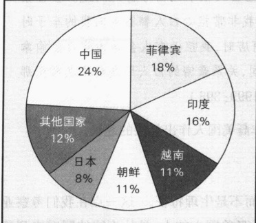

资料来源：作者根据 Statistical Abstract 2002: Table 24 整理而成。

别人视之为整体才这样划分吗？试想一下，萨摩亚人和越南人在文化和种族上难道存在什么共同点吗？老挝人和巴基斯坦人呢？土著夏威夷人和华人呢？印度人和关岛人呢？然而，所有这些种群以及其他一些种群都被划归到了亚裔美国人这一类别里。显然，如果不能把每个人都划归到统一的种族类别里，美国政府就永远不会感到满意。

既然亚裔美国人是一个标准术语。我们就来看一看这些被聚在一起、贴上同一标签、总数接近1100万的人们的典型特征吧。

遭受歧视的历史 从他们踏上海岸的那一刻起，亚裔美国人就面临着歧视问题。由于受到西部淘金热潮的诱惑，

---

同时，修建铁路也需要大量工人从事笨重粗活，1850—1880年间有20万中国人移民美国。盎格鲁人感到廉价劳动力对他们产生了威胁，便组织了暴徒和警员对这些移民进行威逼恐吓。1850年，加利福尼亚通过了外国矿工法，这一法律要求中国工人（和拉美工人）每月交纳20美元——而当时的工人工资是每天1美元。1869年，著名的黄金轨钉在犹他州的普罗蒙特里一槌砸下，标志着横贯美国大陆铁路的完工。然而，白人工人却不准中国工人的形象出现在照片上——尽管中国工人占到“中部太平洋铁路公司”劳动力的90%（Hsu，1971）。加利福尼亚最高法院规定，中国人指证白人的证词在庭上不予认可（Carlson and Colburn，1972）。1882年，国会通过排华法案，十年间暂停所有中国移民入境。四年之后，自由女神像落成。这尊雕像意在欢迎劳苦大众，但是显然，中国人并不在其列。

来自日本的移民到达美国后，遇到的是一种过分偏执的刻板印象，所有亚裔美国人都被描绘成是鬼头鬼脑、懒惰成性、不可信赖。1941年日本偷袭珍珠港之后，那些以美国为家的11万日裔美国人的境况就更加糟糕了。美国官方担心日本会侵略美国，而日裔美国人可能会站在日本人那边。他们还担心日裔美国人会对西海岸的军事设施进行破坏。尽管日裔美国人从未牵扯进任何破坏活动，罗斯福总统依然在1942年2月19号下令对所有带有1/8及1/8以上日本血统的人进行集中管制（即关进“安置营”）。那些人没有被指控任何罪行，也没有接受任何审判。日裔血统就是他们被关入狱的充分理由。

贫富差距悬殊 从表 12.1 可以看出，亚裔美国人的年收入超过了白人。这会误导人们以为所有的亚裔美国人都是成功的，这样一种成见掩盖了亚裔美国人内部的巨大种族差异。观察一下表 12.1，尽管亚裔美国人的贫穷率低于所有其他少数族群，但是仍有超过 100 万的亚裔美国人生活在贫困中。他们的贫困分布并不均匀：贫穷在中国人和日本人中间比较少见，主要集中在那些来自东南亚的移民。

### 成功的原因 亚裔美国人的普遍成功可归结为三个主要因素：家庭生活、教育程度、与主流文化的融合。

在包括白人在内的所有族群中，亚裔美国小孩在父母双亲养育下成长的几率最大，而亚裔美国小孩由单身母亲生养的几率最小(Lee,1998; Statistical Abstract 2002: Table 74)。大多数亚裔美国人的孩子都是在稳定的家庭中长大，这样的家庭强调自我约束、节俭及努力工作(Suzuki,1985; Bell,1991)。这种早期的社会化为其他两个因素提供了强大的推动力。

第二个因素是接受大学教育的比率高。如表 12.2 所示，44% 的亚裔美国人完成了大学教育。把这个数字跟表格上其他种族的数据加以对照，就会发现这是一个令人吃惊的数据。亚裔美国人在教育上取得的成就，为他们进一步打开了通向经济成功的大门。

第三个因素是同化，几个指标可以说明这一点：在所有的群体中亚裔美国人的异族结婚率是最高的，有2/5的人同其他种族成员结婚。亚裔美国人也是最有可能生活在综合居民区中的族群（Lee，1998）。在经济方面最成功的亚裔美国人是日本籍美国人，他们的同化程度也是最高的（Bell，1991；Schaefer，2000）。其中大约73%的人承认自己最好的朋友并不是同族的日籍美国人。

亚裔美国人在政治上的势力日益彰显。夏威夷一半以上的人口是亚裔美国人，数任州长中有不少都是亚裔美国人，还有一些亚裔美国人参议员被选派到华盛顿工作，其中两个现在仍在任职（Lee，1998，Statistical Abstract 2000：Table 25；2002年竞选结果）。在夏威夷之外当选州长的第一位亚裔美国人是加里·洛克，他于1996年当选华盛顿州州长。而在华盛顿的总人口中，亚裔美国人所占的比例还不到6%。2000年，洛克再次当选。

---

### 土著美国人(印第安人)

“我并不认为只有那些已经过世的印第安人才是好的印第安人，但我觉得他们十个人中有九个如此，因而不必进一步询问剩下的十分之一了。最邪恶的牛仔也比普通的印第安人具有更多的道德原则。”

——特迪·罗斯福，1886（1901—1909年间任美国总统）

群体的多样性 上述引文说明了先辈们强烈的种族主义。然而在今天，由于那些充斥市场的 B 级西部片，不少美国人依然对曾生活在边疆的土著美国人抱有成见。他们将土著美国人视为未开化的野蛮人，是可被细分为若干独立部落的单一群体。但是，早期殖民地的欧洲移民遇到的，却是拥有多样化的不同群体——其中有过游牧生活的猎人和采集者，也有定居农业公社、住在木屋里的人群。他们使用的语言超过 700 种（Schaefer，2000）。每一个群体都有自己的规范和价值观，以及那种常见的，对自己文化的民族自豪感。让我们回想一下 1744 年所发生的事：这一年，弗吉尼亚州殖民者为“野蛮孩子”提供了大学奖学金。易洛魁人对此作了如下答复：

“我们当中的一些年轻人曾在北部省份的大学里接受教育。他们接受了你们所有的科学教育。但是，回到我们这里以后，他们却是笨拙的赛跑者，对于丛林中所有的生活方式都一无所知，不能忍受寒冷和饥饿，也不知道如何建造小木屋、抓住一只鹿和杀死敌人……他们完全一无是处。”

又说：“如果英国绅士将他们的一二十个孩子送到奥内达加族，部落委员会将关心他们的教育，以最好的方式培养他们，使他们成为男子汉。”（Nash，1974；McLemore，1994）

土著美国人曾经大约有500万—1000万人，他们对于欧洲人带来的疾病缺乏免疫力。由于疾病——以及战争(这个原因不如疾病那么重要)——他们的人数减少到原来的1/20左右。100多年前，土著美国人的人口达到最低点，不足50万人。现在土著美国人大约有200万人(见图12.5)，说150种不同的语言。像拉美裔美国人和亚裔美国人一样，土著美国人并不认为自己是贴着同一标签的单一群体。

从制定条约到种族灭绝和人口迁徙 起初，欧洲定居者和土著美国人之间的关系大体上是友好的。土著美国人收容了这些陌生人。大量的土地足以满足两者的要求。但是，随着定居者一波又一波的到来，奥塔瓦人的头领庞蒂亚克（Pontiac）预见到了未来，一个他不喜欢的未来。庞蒂亚克说服了几个部落联合起来一起将欧洲人赶到海边。眼看就要成功的时候，英国人增添了新兵，这一行动终于功败垂成（McLemore，1994）。

渐渐地，一种欺骗模式开始酝酿形成：美国政府制定了条约来购买部落的土地，并允诺将永远尊重部落对未出售土地所享有的权利。欧洲移民继续涌进美国而无视这些土地边界。部落奋起抵抗，双方均有伤亡。华盛顿开始进行干预——不是加强这些条约，而是迫使部落离开自己的土地。在无情的西进过程中，美国政府采纳了种族灭绝政策，委任美国骑兵以“安抚”的任务，这一任务可以理解为对领土扩张中“挡道”的土著美国人格杀勿论。

欧洲人对土著美国人的残酷侵入似乎是无休止的，然而，有两件事更为可怕。第一件是感染了天花病毒的毯子被广为散布——毯子伪装成了和平礼物。第二件就是“血泪之路”，土著美国人被迫从卡罗来纳州和佐治亚州迁徙千里之外的俄克拉荷马。在隆冬季节，15000名切罗基人身着单薄的衣衫被迫出发。由

---

于条件恶劣，4000人因此而丧生。1890年发生在南达科他州翁迪德尼的集体屠杀，标志着土著美国人的抵抗就此划上句号。350名男人、女人和儿童中，美国骑兵枪杀了300人，然后把他们草草掩埋在一个巨大的坟坑里（Thornton，1987；Lind，1995；Johnson，1998）。这些事件发生之前，美国政府已经改变了其种族灭绝的政策，转而实施人口迁徙，并着手将土著美国人限定在他们称之为保留地的特定区域。

不受注意的少数民族和自我决断 土著美国人可谓名副其实的不受注意的少数民族：大约一半人生活在

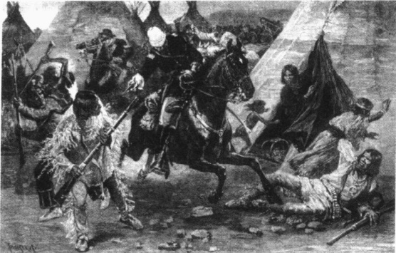

印第安人阻挡了美国政府向西扩张的道路。为了攫取土地，政府先是采取了种族灭绝政策，而后是人口迁徙政策。这幅由德特维尔斯特罗普绘制的木版画发表于1885年的《哈珀斯周刊》(Harpers Weekly)，描绘了美国骑兵袭击苏人村庄的场景。

农村，还有1/3仅生活在三个州——俄克拉荷马州、加利福尼亚州和亚利桑那州——多数美国人并未意识到土著美国人的存在。大约一半土著美国人被隔离在保留地，这进一步减少了其被注意的程度(Statistical Abstract 2000: Table 43; 2002: Table 36)。

欧洲美国人想要摧毁土著美国人的生活方式并阻止他们在保留地再次定居的企图，继续产生着恶劣的影响。表 12.1 显示了土著美国人的高失业率和高贫困率。土著美国人的自杀率是所有种族群体中最高的（Wallace et al., 1996），而其平均寿命则低于美国所有种族的平均寿命（U. S. Department of Health and Human Services, 1990；Lester, 1997）。表 12.2 说明，他们的教育也落后于绝大多数群体；大学毕业的人数仅占总人数的 13%。

这些恶劣境况是英国殖民统治的结果。在19世纪末，美国法院裁定，土著美国人对其定居的土地没有所有权，也不能加以开发。土著美国人被政府监护，印第安人事务局像对待孩子一样对待他们（Mohawk，1991）。20世纪60年代，土著美国人获得了一系列法律上的胜利，恢复了对土地的控制权和决定经济政策的权利。于是，很多印第安部落在他们自己的土地上开展起商务活动——有鱼类罐头厂，也有服务大城市的工业园。

然而，赌场吸引的关注是最多的。1988年，联邦政府通过一项法案，允许土著美国人在保留地建立赌博机构。全国大约340个部落中，半数左右建起了赌场，一年交易额达130亿美元（Barlett and Steele，2002）。一些部落因此而致富。纽约的奥奈达族（Oneida）部落仅有1000人，而其一年的人均赌场净利润则达到23.2万美元（Peterson，2003）。但是，如此巨大的数额，比起康涅狄格州的佩科特族也黯然失色。佩科特族总共才310人，但是他们一天竟有超过200万美元入账（Zielbauer，2000）。更让人难以置信的是，有个部落只有1个人，而这个人自己竟然开了家赌场（Barlett and Steele，2002）。

分离主义是一个充满高度争议的问题。当欧洲人到达时，土著美国人已经是一个独立的群体，他们绝不愿意加入美国，因而，很多部落都保留着与美国政府和美国社会相分离的权力。纽约的奥内达加部

---

落是易洛魁联邦成员之一，其首领这样总结了这一问题：

就整个易洛魁族的历史来说，我们一直坚称自己是独立的民族。我们从未在战争中失败过；我们的管理组织依然在运营；我们拒绝了美国政府对我们的重组计划；我们保持着我们的语言和传统；当我们去日内瓦参加联合国会议时，我们拿着易洛魁族的护照。我们虽然签定了一些使我们丧失了一些土地的条约，但是这也确定了我们独立民族的地位。尽管美国否认上述所有的一切，但事实却不会因此而改变。（Mander，1992）

其中一个最显著的变化是泛印第安主义（pan-Indianism）。它强调贯穿印第安文化的共同因素，其实是试图培养一种跨部落的身份认同感。泛印第安主义（“我们都是印第安人”）是民族可塑性的一个显著例子。最初由英国人强加的身份替代了与部落相联系的身份。正如社会学家欧文·多伊彻（Deutscher，2002:61）所指出的：“事实上，接受了更加宽泛的‘他们是谁’定义的人们之间彼此的共同点，并不比优势群体在标注他们时的成见更多。”

不管印第安人是否希望在泛印第安主义旗帜下共同工作，或是强调分离主义、只认同自己的部落；不管是同化入主流文化，还是保持独立；不管是移到城市，还是继续呆在保留地；不管是经营赌场，还是从事传统活动——“这些决定必须由我们自己作出，”印第安人说，“我们是主权国家，我们将不接受以往战争胜利者的命令。”

### 展望未来

早在 1903 年，社会学家杜波依斯就已指出，“20 世纪的问题是肤色线问题——即黑皮肤种族与白皮肤种族之间的关系问题。”令人难以置信的是，100 年以后，肤色线依然是美国所面临的最易引起震动的话题之一。随着打击恐怖主义的战争和相应的对中东后裔的歧视，肤色线经常呈现出不同的复杂状态。

再过 100 年,会不会还有社会学家悲痛地说人们的肤色仍然在影响着人类的关系？鉴于我们的过去,虽然种族之间的壁垒将会减小,甚至在某些方面会瓦解,但是肤色线不太可能会消失。我们当前面临着两个问题:移民和平权法。

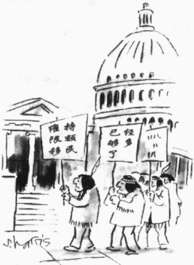

### 移民之争

纵览美国历史，美国既欢迎移民，同时又害怕移民带来的后果。在19世纪末20世纪初的移民潮中，美国国门是大敞的(如果不是在态度上，至少在数目上是)。过去20年间，第二次移民潮每年都给美国带来将近100万新居民。今天，生活在美国的移民(3100万人)比美国历史上任一时期都要多(Statistical Abstract 1989: Table 46; 2002: Table 5, 41)。与人员主要是西欧移民的第一次浪潮不同，第二次浪潮的构成更加多样化。事实上，它正在改变着美国的种族构成。如果当前的移民(和出生率)趋势保持不变，大约再过50年，“普通”美国人的祖先可能会来自非洲、亚洲、南美洲、太平洋诸岛、中东——除欧洲外几乎任一地方。

---

下面的“文化多元性”专栏将专门讨论这一变化。

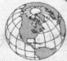

### 美国文化多样性

### 未来仍在不断变动的种族混合体一瞥

在今后25年中，预计美国将增加22%的人口。那么，是不是把美国种族混合体扩大到现有的1.22倍，就可以看出美国25年后的人口情况呢？答案是，这绝对行不通。从图12.10可以看到，某些种族的增长速度要比另外一些快，展现在我们面前的美国种族状况变了样。其中，一些变化相当引人注目：25年后，在美国人中，每19人里面就会有一人具有亚裔背景，而具有拉丁美洲血统的人中每6人里面就有一个。

导致这种根本性变化的基本原因有两个：移民和出生率。到目前为止，移民这个因素起的作用更大。美国的种族群体中，不同种族的移民率、出生率都有所不同，这就会改变他们在美国人口中所占的比例。从图中可以看到，非西班牙裔白人的比例将会减少，土著美国人的比例保持不变，而非裔美国人的比例则略有增加。由于从拉美移民到美国的人口众多，其出生率也高于其他种族，因此，50年后，几乎每4个美国人中就有一个具有拉丁美洲血统。

### 思考题

美国的种族混合体在美国总人口中所占比例的变动是美国发生的最重大事件之一。试着运用下面三种理论观点来解释一下这种变动的深远含义。

从冲突论角度指出哪些群体将会受到这一变动的威胁，对哪些资源的争夺将会加剧？在你看来，这种不断变动的局面会分别对欧洲美国人、拉美裔美国人、亚裔美国人、印第安人产生怎样的影响？你认为移民法（或者移民法的执行）会有哪些变动？

运用符号互动论的理论,考虑一下不同群体在总人口中的比例发生变化后,他们彼此间的看法会不会因此而改变?

运用功能主义的理论观点分析一下面对种族混合体不断变动的局面，每个群体是怎样获益的？社会其他组成部分(比如商业)如何受益？你认为将会产生什么反功能？

图 12.10 美国人口种族构成预测

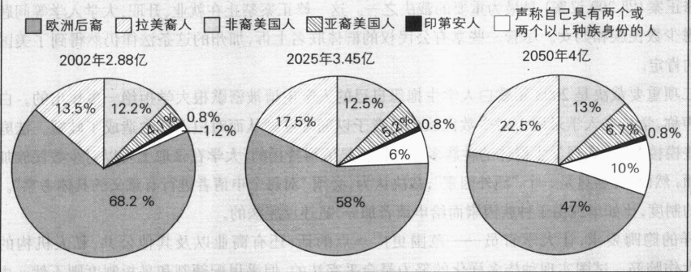

注：根据最新人口普查中对属于两个或以上种族的人员以及跨种族婚姻的调查数据，作者对2050年的预测进行了修改。

资料来源：作者根据 Statistical Abstract 2002: Table 16 和 Bernstein and Bergman 2003 整理而成。

---

在某些州，这一变化将会更快到来。在加州，少数民族已成为主体。加州有1800万少数民族和1600万白人(Statistical Abstract 2002: Table 23)。从太平洋贝尔公司新近申请电话服务的加州人，可以对客服人员说西班牙语、韩国语、越南语、汉语和广东话——或英语。

过去曾经存在着认为“太多”的移民将改变美国的性质这样一种忧虑。社会学家亚历杭德罗·波茨和鲁宾·朗博（Portés and Rumbaut，1990）写道：“害怕‘外来因素’以某种方式侵害国家的制度并导致其解体和衰退，是一条贯穿整部美国移民史的线索。”100年前，人们普遍担忧，大量来自南欧的移民将会带来共产主义。今天，人们担心西班牙语移民会威胁到英语的主导地位。此外，年长的人害怕移民会夺去土生土长、身体健壮的美国人的饭碗。而曾为政治代表权而斗争的弱势群体，则担心新来的群体会以牺牲他们为代价来换取政治权力。

### 平权法

在多元文化的社会中，平权法处于种族和族群关系的争论中心。这项由肯尼迪总统于1961年发起的政策基于种族（和性别），目标涉及雇佣、升职和大学录取。社会学家芭芭拉·雷斯肯（Reskin，1998）分析了平权法产生的影响。与早期研究（Badgett and Hartmann，1995）相一致，她推断，尽管不能将平权法与经济繁荣以及女性劳动力人数增加截然分开，但总的来说平权法的影响非常有限。

平权法的影响可能并不大，但是对于这项政策的反应却绝非微乎其微。平权法成为争论中心，历时已超过一代。自由主义者，不管是白人还是少数民族，都认为这项措施是平衡经济机遇竞技场的最直接方式。如果白人受到忽视，这就是一个我们必须付出的不幸代价：因为我们要为过去的歧视作出弥补。与之相反，保守主义者，不论白人还是少数民族，尽管也同意机会面前人人平等，但是他们声称把种族（或性别）放在个人培训和工作能力之前，是另一种形式的歧视。由于种族（或性别）因素，过去未受到不平等待遇的优秀人才将受到歧视。他们还认为，平权法使受益的人蒙羞，因为这一政策暗示，他们之所以得到工作不是因为能力，而是由于种族（或性别）的缘故。

这一全国性论战随着一系列具有争议性的裁决而变得更加明朗化。其中，1996年对加利福尼亚州宪法的修正案(即209议案)是最为重要的裁决之一。这一修正案禁止在就业、升职、大学入学等问题上优先考虑少数民族和妇女。尽管一些享有公民权的群体联名上诉，加州的这条法律仍然得到了美国最高法院的肯定。

第二项重要裁决是 2003 年就白人学生抱怨自己的入学申请被密歇根大学拒绝一事作出的。白人申请者声称，学校在入学录取上对少数民族申请者予以额外照顾从而对白人学生造成了歧视。法庭的裁决有些模棱两可：实现学生群体的种族多样化目标是值得赞扬的，大学在录取上可以对少数民族加以适当照顾；然而，种族只是一个“额外因素”，裁决认为，必须“对每个申请者进行有意义的具体考察”。一些呆板的制度，比如单纯由于种族因素而给申请者加分，是违反宪法的。

这样的隐晦要求，让大学官员——范围更广一点的话，还有商业以及其他公共、私人机构的官员——大伤脑筋。试图实现种族多样化的努力是合乎宪法的，但采用配额制和呆板制度则不然。由于法院没有提出具体方针来推进平权法，密歇根大学的裁决又可以从不同角度来理解，因此，可以看出，美国最高法院并未对此明确表态。关于平权法在这个多元文化社会中应当起到的作用这一中心问题的争论，很可能仍将持续一段时期。

---

### 迈向一个真正的多元文化社会

美国有可能成为一个真正的多元文化社会：社会中的所有种族不仅能够共存，并且能够为他们共同的利益一起努力、互相尊重、共同繁荣。在一个真正的多元文化社会里，少数民族作为构成美国的一部分能够充分地参与到国家的社会制度当中，同时又保持各自的文化。要做到这一点，我们必须认识到“种族之间的生物差异不过是遗传海洋中的一滴水而已”。在很长一段时间里，我们一直赋予种族范畴一种本不应有的重要性。现在我们需要想办法适当消除那些本来与它们无关的东西。简言之，我们要努力使我们所认定的“平等”这一抽象概念变为现实(Cose,2000)。

### 本章小结

### ☆社会学知识基础

### 为什么说种族既是现实又是神话？

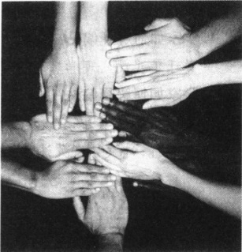

从不同的族群所继承的遗传生理特征各有特色这一点来看，种族的存在是一种现实。不过，对于一个独特种族的构成，甚

美国是世界上种族最为多元化的社会。这应当是我们的核心力量，众多群体齐心协力，构建一个和谐社会，这将是世界上的一个成功范例。否则，这将成为我们的阿喀琉斯之踵，我们将分裂成相互争斗的群体，各种势力割据而治，一个庞大的社会实验宣告失败。而现实恐怕就处于上述两极之间。

至于对于世界上种族的数量问题，都还没有定论。而优等种族和纯种种族的存在，则使种族成为了一个神话。种族观念相当重要，可以左右人类之间的基本关系。

### 种族和民族的差别在哪里？

种族强调遗传下来的生理特征；民族则侧重文化特征。民族群体的成员彼此相系的纽带是共同的祖先和文化遗产。

### 什么是弱势群体？什么是优势群体？

弱势群体指的是受到不公平待遇的人群，这种不公平待遇来自优势群体，后者拥有更多的权力、特殊待遇和更高的社会地位。弱势群体的产生途径是政治疆界的扩张或移民。

### 什么因素可以加强民族认同感？什么是“民族保护工作”？

一个群体的规模、权力、生理特征和受歧视的程度等因素会加强或削弱其民族的身份认同感。民族保护工作指的是人们力图确立民族身份的过程。对于和传统文化联系紧密的人而言，这个词指的是他们努力加强和保持其群体特性。对于民族身份认同感不那么强烈的人而言，民族保护工作指他们试图恢复其民族传统的努力。

### 偏见和歧视是一回事吗？

偏见是一种态度；而歧视则是一种行为。偏见存在的范围非常广泛，就连弱势群体自身都在自觉不自觉地遵从着占优势地位的种族规范。

### 个人歧视和制度歧视有何不同？

个人歧视是他人对某个个人的否认性对待，而制度歧视则是内置于社会制度之内的否认性对待。歧视他人的人和被歧视的人往往都意识不到制度歧视的发生。对心脏问题的医疗保健就是个例子。

---

### ☆偏见理论

心理学家如何解释偏见？

关于偏见的心理学理论强调强权人格，以及将挫败感转嫁给替罪羊。

### 社会学家如何解释偏见？

社会学理论集中研究不同的社会环境怎样使偏见得以增加或减少。功能主义者强调歧视带来的好处和代价；冲突论者关注掌权群体如何利用种族划分来控制工人的工资、掌握权力；符号互动主义者则强调标签如何导致了选择性感知和自我实现的预言。

### ☆种族群体关系的全球模式

少数群体和优势群体关系的基本模式有哪些？

按合乎人道的程度由低到高，可排列如下：种族灭绝、人口迁徙、内部殖民主义、种族隔离、同化和多元文化主义（多元文化论）。

### ☆美国的种族关系

美国有哪些主要民族群体？

按规模由大到小依次为：欧洲美国人、拉美裔美国人、非裔美国人、亚裔美国人和土著美国人。种族关系中存在哪些主要问题？现今的弱势群体有哪些特征？

拉美裔人之间的划分依据是社会阶级和出生国的不同；非裔美国人正在加剧分化，两种生活截然不同；亚裔美国人在很多指标上都比美国白人富有，但来源国不同，富裕程度也不同；土著美国人的主要问题是贫困、民族身份和条约纠纷：少数民族面临的首要问题是克服歧视。

### ☆展望未来

在种族关系中存在哪些突出问题？

主要问题包括移民、平权法，以及如何建立一个真正的多元文化社会。这些问题的答案将直接影响到我们的未来。

### 批判思考题

1. 问问你的朋友：在他们看来，世界上共有多少个种族？他们是否认为某一种族比其他种族更为优越？在社会学上，种族范畴基本上是社会性的。你认为他们对这一观点会持怎样的态度？

2. 100年前，社会学家杜波依斯曾经说过，“20世纪的问题是肤色线问题，即黑皮肤种族与白皮肤种族之间的关系问题。”为什么一直以来，肤色线问题都是美国所面临的最易引起波动的话题之一？谈谈你的看法。

3. 假如你是美国国务服务委员会的首脑，你会首先采取什么措施来缓解美国的种族冲突？要是其中能够运用一些社会学原理的话，将会提高你的提议的成功率，但你要对那些原理加以阐释。