# 第 13 章 老年人

ཤུལ་ཚུལ

1

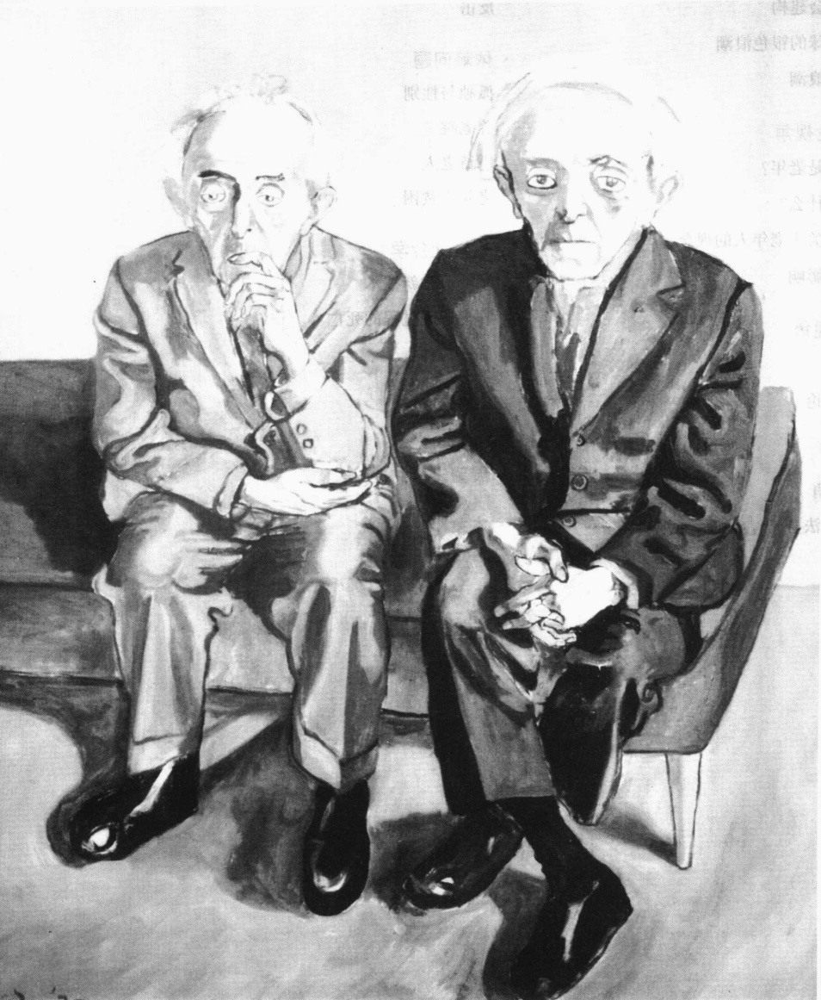

---

- 全球视野中的老龄化

  老龄化的社会建构

  工业化与全球的银色浪潮

  美国的银色浪潮

- 符号互动论视角

  什么时候算是老年？

  老年意味着什么？

  不断改变的关于老年人的观念

  大众媒体的影响

- 功能主义视角

  解约理论

  积极活动理论

  连续性理论

<table border=1 style='margin: auto; word-wrap: break-word;'><tr><td style='text-align: center; word-wrap: break-word;'>· 全球视野中的老龄化</td><td style='text-align: center; word-wrap: break-word;'>代际冲突</td></tr><tr><td style='text-align: center; word-wrap: break-word;'>老龄化的社会建构</td><td style='text-align: center; word-wrap: break-word;'>反击</td></tr><tr><td style='text-align: center; word-wrap: break-word;'>工业化与全球的银色浪潮\n美国的银色浪潮</td><td style='text-align: center; word-wrap: break-word;'>· 依赖问题\n孤独与性别</td></tr><tr><td style='text-align: center; word-wrap: break-word;'>· 符号互动论视角\n什么时候算是老年？\n老年意味着什么？</td><td style='text-align: center; word-wrap: break-word;'>养老院\n虐待老人\n老年人贫困</td></tr><tr><td style='text-align: center; word-wrap: break-word;'>不断改变的关于老年人的观念\n大众媒体的影响</td><td style='text-align: center; word-wrap: break-word;'>· 死亡社会学\n工业化和新技术</td></tr><tr><td style='text-align: center; word-wrap: break-word;'>· 功能主义视角\n解约理论\n积极活动理论\n连续性理论</td><td style='text-align: center; word-wrap: break-word;'>作为一个过程的死亡\n临终关怀\n自杀与年龄\n适应死亡</td></tr><tr><td style='text-align: center; word-wrap: break-word;'>· 冲突论视角\n社会保障立法</td><td style='text-align: center; word-wrap: break-word;'>· 展望未来\n· 本章小结</td></tr></table>

· 依赖问题  

孤独与性别  

养老院  

虐待老人  

老年人贫困

· 冲突论视角  

社会保障立法

· 死亡社会学

工业化和新技术

作为一个过程的死亡

临终关怀

自杀与年龄

适应死亡

· 展望未来

· 本章小结

---

### 第 13 章 老年人

1928年，查尔斯·哈特在攻读他的人类学博士时，对居住在澳大利亚北海岸附近一个海岛上的提维（Tiw）人进行了实地调查。因为每个提维人都属于一个家族，所以他们将查尔斯·哈特分派到了鸟（Jabijabui）家族并告诉他一位特别的女性是他的母亲。查尔斯·哈特将这位女性形容为“没有牙齿、几乎瞎了、干瘪枯槁”。他还补充说：“她不仅外表相当令人讨厌，而且头脑也不清醒了。”他接着讲述了这么一件事：

在我将要离开这里的时候，发生了一件令我惊奇的事情。因为这件事表明，他们当中有些人很严肃地看待我在亲属体系中的出现，比我想象中要严肃得多。大约有八九个我所认识的长者找到我，他们都是鸟(Jabijabui)部落的长者，他们作出了一个决定：是时候抛弃那个衰老的女人了，就是那个一开始称我为“儿子”而现在我称为“母亲”的那个老妇人。正如我知道的，他们告诉我，这是提维人的习俗，当一位年老的女性衰老到无法照顾自己时，便要“把她埋掉”。这件事只能由她的儿子和兄弟们来执行，而所有的人都要事先同意，因为一旦执行完毕，他们不希望在兄弟或部落成员之间出现任何纷争和长期的敌对。我的“母亲”现在已经完全瞎了，她经常撞到木头或火炉。她的年长的族人一致认为她最好离开。我该同意吗？

我已经了解了“把她埋掉”的意思。提维人，像许多其他狩猎采集民族一样，有时会放弃赡养那些年老并体弱多病的女性，其方法便是在某个偏僻的地方挖一个坑，将年老的女性放入坑中，之后用土将坑填上直到仅仅露出她的头。所有人离开一两天后再返回这个坑，他们惊奇地发现，这个老妇人死了，因为她太虚弱了，根本不可能将手臂从土中伸出来。没有人“杀死”她，在提维人眼中，她的死是一件很自然的事。她的亲人们上次看见她的时候，她还是活着的。虽然我知道这是习俗，但是我从未见过它被实施，所以我问我的兄弟们，我是否必须参加“把她埋掉”这件事。他们说没有必要，他们会做这件事，但是只能在他们取得了我的同意之后。当然，我同意了。一两周之后，我们营地里有人说我的“母亲”死了，我们号啕大哭并穿上丧服。（Hart and Pilling，1970：154）

### 全球视野中的老龄化

我们并不想讨论查尔斯·哈特同意那位老妇人被“埋起来”这件事是否符合道德伦理规范。我们所关心的是提维人如何对待他们衰老的老年人——或者更具体地说就是衰弱的老年女性。你可能注意到了提维人“埋掉”的仅仅是年老的女性。正如第11章中提到的，女性在全球范围内受到歧视。这个事例明显地表明了这一点，在一些地方，这种歧视甚至扩展到了死亡。

每个社会都必须应对人口老龄化问题，并且老年人当中有一些会变得非常衰弱。虽然很少有社会选择活埋老年人，但是所有的社会都必须决定怎样在公民间分配有限的资源。在许多国家，随着老年人所占比例的增加，这些决定会在代际间产生紧张关系。

---

### 老龄化的社会建构

提维人对待年老体弱女性的方法，反映了社会如何应对老龄化的一种极端方式。阿布哈西亚人（Abkhasians）则采取了另一种极端方式，这反映了一种完全不同的态度。阿布哈西亚人居住在前苏联格鲁吉亚的多山地区，以农业为生。与把老年人“埋掉”相反，他们十分尊敬老年人并寻求老年人的指导。他们不会抛弃任何一位老年人，正如我们不会“埋掉”生病的小孩一样。

在世界上，阿布哈西亚人是最长寿的。许多人声称活过了100岁——一些人超过了120岁，甚至130岁（Benet，1971）。虽然难以证明这些声明的准确性（Haslick，1974；Harris，1990），但是政府记录表明，阿布哈西亚人中的确有很多人寿命很长。

他们的长寿似乎有三个主要原因。第一个是他们的饮食，其中包括很少的肉，许多的新鲜水果、蔬菜、大蒜、山羊干酪、麦片、酪乳及葡萄酒。第二个因素是他们一生都从事体力活动。80岁以后他们逐渐减少工作。但是即使过了100岁，他们仍会一天工作大约4个小时。第三个因素是一种高度发达的社区感，这是阿布哈西亚文化的核心。自童年时代起，每个人便融入一个初级群体，而且终生都属于这一群体。他们没有养老院，老年人也不会单独生活。由于他们继续工作并对群体福利有所贡献，因此老年

骑马的人名叫泰米尔·塔巴，拍这张相的时候他已经100岁了。正如课文中所讨论的，阿布哈西亚人中老年人数量相当多，但因为缺少记录，人们对于他们的确切年龄仍有疑问。

人不是任何人的负担。他们不会感到单调乏味，也不会觉得需要用赌博和推圆盘游戏来“打发时间”。简而言之，老年人不会感到过去与现在的突然断裂。

提维人和阿布哈西亚人的例子，揭示了一个重要的社会学原理，即与性别一样，老龄化也是社会建构的。也就是说，老龄化本身并不会带来一系列特定的态度。相反，对待老年人的态度植根于社会当中，因此各个社会群体之间的态度是不同的。正如我们将看到的，甚至是人们到什么年龄被视为老年人，也并非取决于生物因素，而是取决于文化因素。

### 工业化与全球的银色浪潮

正如前面的章节中提到的，工业化是一个全球范围的趋势。它提高了人们的生活水平，给人们带来了更多的食物、更好的公共健康设施（尤其是纯净水的供应），以及更加有效的治疗危害儿童疾病的手段。因此，当一个国家进行工业化时，该国会有更多的人活得更长寿，并能达到一个更年老的年龄。

可以看到，工业化国家的老年人比例最高。各个国家间的差距很大，在未实现工业化的苏丹，每48位公民中仅有1位老年人，而在完成了工业化的意大利，每5位公民中便有1位老年人，这一比例比苏丹的高了9倍（Statistical Abstract 2002: Table 1309）。全球的银色浪潮是最近才发生的，所以在世界历史上所有活过50岁的人中，有2/3的人今天仍然健在（Zaslow，2003）。

---

随着一国老年人口的增加，与其相应，它的较为年轻的公民为满足老年人的需要所支付的费用也会增加。这笔费用已经成为一个主要的社会问题。虽然美国人总在抱怨社会保障税收过高，但是美国15.3%的比率实际上还不算高。比利时的工人负担最重，要将工资的56%支付给社会保障。匈牙利、法国、瑞典、德国紧随其后，约为50%（Statistical Abstract 2002: Table 517, 1330）。工业化程度最低的国家中的人们不必交纳社会保障税收。在这些国家，家庭被寄予希望，来照顾自己的老人，政府不给予任何帮助。

伴随着工业化的持续进行和老年人口比例的不断上升，未来照料老年人的责任已经越来越令分析家们担心。德国是一个典型例子。到2020年，大约有30%的德国人口将超过60岁。为了继续提供给他们现有的高水平的照顾，德国将不得不把未来工人的几乎所有收入征作税收（Wessel，1995）。显然，这是不可能的。但是至今仍没有人提出一个可行的方案来解决这个问题。

### 美国的银色浪潮

如图 13.1 所示，美国也存在这种全球化趋势。该图表明了美国人的预期寿命（life expectancy），即人们预计能存活的年数自 1900 年起的增长状态。对我而言，也许对你们也一样，了解到 100 年前一般美国人预期活不到 50 岁是令人

一个群体文化的核心就是看待现实的方式。在远离澳大利亚北海岸的巴瑟斯特和梅尔维尔岛上，提维人与世隔绝地生活了几个世纪，并形成了一种独特的文化，其特征集中表现在“把她埋掉”这篇短文中。这张图片中的是Wurabuti，他准备好了要为他叔叔的葬礼领舞。为了确保他叔叔的灵魂认不出他，Wurabuti“穿了”一件用黄土和粘土画成的“衬衣”，头上戴着美冠鹦鹉的羽毛，还戴上了用鹅毛做成的胡须。

图 13.1 美国的预期寿命

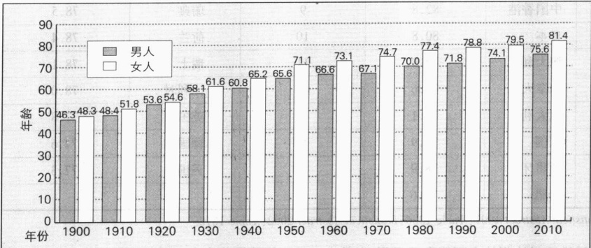

资料来源：作者根据 Historical Statistics of the United States（殖民时期到 1970 年），200 周年版，第一部分 B 系列，107—115；Statistical Abstract 2002：Table 91 整理而成。

---

图 13.2 美国的银色浪潮：65 岁及以上的美国人口

资料来源：作者根据 Statistical Abstract 2002: Table 13, 以及更早的年份整理而成。

图 13.3 美国人口的中位年龄

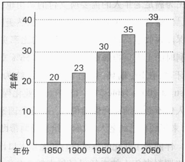

资料来源：作者根据 Statistical Abstract 2002: Table 13; Statistical Abstract 2002: Table 13，以及更早的年份整理而成。

吃惊的。自那以后，我们的平均预期寿命增加了30年。今天出生的美国人预计能活到70岁或80岁。

美国的银色浪潮(graying of America)这个词，指的是在美国人口中不断增长的老龄人口的比例。如图13.2所示，1900年仅有4%的美国人活过了65岁(包括65岁)。今天，大约有13%的人口达到65岁。一个65岁的老人一般还能再活18年(Statistical Abstract 2002: Table 93)。图13.3表明，美国社会的“银色浪潮”如此严重，以至于它的中位年龄自1850年以来已经增长了一倍。现在，美国的老年人数量比青少年人数多了700万(Statistical Abstract 2002: Table 12)。尽管有了这样的变化，如表13.1所示，从全球范围来看，美国人的平均预期寿命仅位列第15名。

表 13.1 全球视野中的美国人的预期寿命

<table border=1 style='margin: auto; word-wrap: break-word;'><tr><td style='text-align: center; word-wrap: break-word;'>世界排名</td><td style='text-align: center; word-wrap: break-word;'>国家或地区</td><td style='text-align: center; word-wrap: break-word;'>出生时预期寿命</td><td style='text-align: center; word-wrap: break-word;'>世界排名</td><td style='text-align: center; word-wrap: break-word;'>国家或地区</td><td style='text-align: center; word-wrap: break-word;'>出生时预期寿命</td></tr><tr><td style='text-align: center; word-wrap: break-word;'>1</td><td style='text-align: center; word-wrap: break-word;'>中国香港</td><td style='text-align: center; word-wrap: break-word;'>82.8</td><td style='text-align: center; word-wrap: break-word;'>9</td><td style='text-align: center; word-wrap: break-word;'>瑞典</td><td style='text-align: center; word-wrap: break-word;'>78.5</td></tr><tr><td style='text-align: center; word-wrap: break-word;'>2</td><td style='text-align: center; word-wrap: break-word;'>日本</td><td style='text-align: center; word-wrap: break-word;'>80.8</td><td style='text-align: center; word-wrap: break-word;'>10</td><td style='text-align: center; word-wrap: break-word;'>荷兰</td><td style='text-align: center; word-wrap: break-word;'>78.4</td></tr><tr><td style='text-align: center; word-wrap: break-word;'>3</td><td style='text-align: center; word-wrap: break-word;'>澳大利亚</td><td style='text-align: center; word-wrap: break-word;'>79.9</td><td style='text-align: center; word-wrap: break-word;'>11</td><td style='text-align: center; word-wrap: break-word;'>瑞士</td><td style='text-align: center; word-wrap: break-word;'>78.1</td></tr><tr><td style='text-align: center; word-wrap: break-word;'>4</td><td style='text-align: center; word-wrap: break-word;'>加拿大</td><td style='text-align: center; word-wrap: break-word;'>79.6</td><td style='text-align: center; word-wrap: break-word;'>12</td><td style='text-align: center; word-wrap: break-word;'>比利时</td><td style='text-align: center; word-wrap: break-word;'>78.0</td></tr><tr><td style='text-align: center; word-wrap: break-word;'>5</td><td style='text-align: center; word-wrap: break-word;'>意大利</td><td style='text-align: center; word-wrap: break-word;'>79.1</td><td style='text-align: center; word-wrap: break-word;'>13</td><td style='text-align: center; word-wrap: break-word;'>英国</td><td style='text-align: center; word-wrap: break-word;'>77.8</td></tr><tr><td style='text-align: center; word-wrap: break-word;'>6</td><td style='text-align: center; word-wrap: break-word;'>法国</td><td style='text-align: center; word-wrap: break-word;'>78.9</td><td style='text-align: center; word-wrap: break-word;'>14</td><td style='text-align: center; word-wrap: break-word;'>德国</td><td style='text-align: center; word-wrap: break-word;'>77.6</td></tr><tr><td style='text-align: center; word-wrap: break-word;'>7</td><td style='text-align: center; word-wrap: break-word;'>西班牙</td><td style='text-align: center; word-wrap: break-word;'>78.9</td><td style='text-align: center; word-wrap: break-word;'>15</td><td style='text-align: center; word-wrap: break-word;'>美国</td><td style='text-align: center; word-wrap: break-word;'>77.3</td></tr><tr><td style='text-align: center; word-wrap: break-word;'>8</td><td style='text-align: center; word-wrap: break-word;'>希腊</td><td style='text-align: center; word-wrap: break-word;'>78.6</td><td style='text-align: center; word-wrap: break-word;'></td><td style='text-align: center; word-wrap: break-word;'></td><td style='text-align: center; word-wrap: break-word;'></td></tr></table>

资料来源：Statistical Abstract 1997；Table 1336；Statistical Abstract 2002；Table 1312。

曾经去过佛罗里达州的人可能会注意到，老龄人口并不是平均分布在全国各地的。(杰里·塞恩弗尔德曾颇具讽刺意味地提到，“有一条定律，当你年老时，你一定会搬往佛罗里达州”。)

---

种族—民族与老龄化正如美国各州老年人的百分比不同，构成美国的各个种族—民族群体间的老年人口的百分比也不相同。从表13.2可以看到，白人的老年人口比例最高，拉美裔人的老年人口比例最低。它们之间的差异相当大，白人中老年人口的比例（13.6%）是拉美裔中老年人口比例（6.3%）的两倍还多。拉美裔美国人当中老年人口所占的百分比之所以这么小，主要原因在于大批年青的拉美人移居到美国。在未来几年，不同文化对待老龄化、家庭关系、工作史以及健康锻炼的态度差异，将会是社会学调查的重要领域。

表 13.2 种族—民族与老龄化

这些群体中的老年人的比例是多少？

<table border=1 style='margin: auto; word-wrap: break-word;'><tr><td rowspan="2"></td><td colspan="4">年龄</td></tr><tr><td style='text-align: center; word-wrap: break-word;'>65—74</td><td style='text-align: center; word-wrap: break-word;'>75—84</td><td style='text-align: center; word-wrap: break-word;'>85+</td><td style='text-align: center; word-wrap: break-word;'>总体65岁及以上</td></tr><tr><td style='text-align: center; word-wrap: break-word;'>白人</td><td style='text-align: center; word-wrap: break-word;'>6.8%</td><td style='text-align: center; word-wrap: break-word;'>4.9%</td><td style='text-align: center; word-wrap: break-word;'>1.9%</td><td style='text-align: center; word-wrap: break-word;'>13.6%</td></tr><tr><td style='text-align: center; word-wrap: break-word;'>非裔美国人</td><td style='text-align: center; word-wrap: break-word;'>4.8%</td><td style='text-align: center; word-wrap: break-word;'>2.7%</td><td style='text-align: center; word-wrap: break-word;'>1.0%</td><td style='text-align: center; word-wrap: break-word;'>8.5%</td></tr><tr><td style='text-align: center; word-wrap: break-word;'>亚裔美国人</td><td style='text-align: center; word-wrap: break-word;'>4.7%</td><td style='text-align: center; word-wrap: break-word;'>2.6%</td><td style='text-align: center; word-wrap: break-word;'>0.8%</td><td style='text-align: center; word-wrap: break-word;'>8.3%</td></tr><tr><td style='text-align: center; word-wrap: break-word;'>美国土著人</td><td style='text-align: center; word-wrap: break-word;'>4.0%</td><td style='text-align: center; word-wrap: break-word;'>2.4%</td><td style='text-align: center; word-wrap: break-word;'>1.1%</td><td style='text-align: center; word-wrap: break-word;'>7.5%</td></tr><tr><td style='text-align: center; word-wrap: break-word;'>拉美裔人</td><td style='text-align: center; word-wrap: break-word;'>3.6%</td><td style='text-align: center; word-wrap: break-word;'>2.0%</td><td style='text-align: center; word-wrap: break-word;'>0.7%</td><td style='text-align: center; word-wrap: break-word;'>6.3%</td></tr><tr><td style='text-align: center; word-wrap: break-word;'>均值</td><td style='text-align: center; word-wrap: break-word;'>6.4%</td><td style='text-align: center; word-wrap: break-word;'>4.5%</td><td style='text-align: center; word-wrap: break-word;'>1.7%</td><td style='text-align: center; word-wrap: break-word;'>12.6%</td></tr></table>

资料来源：Statistical Abstract 2002: Table 19。

虽然越来越多的人能够长寿，但是可能达到的最长寿命，即生命跨度（life span），却并未增长。虽然在人类寿命可能的最大值问题上，专家们各持己见，但至少为122岁，因为法国人珍尼·刘易斯·卡尔蒙特死于1998年，享年122岁，这是有据可查的。如果关于阿布哈西亚人的报告是准确的（这是一个有争议的问题），那么人类的生命跨度甚至会大大超过122岁。另外，遗传学的进步也有可能延长人类的生命跨度。一些遗传学家甚至认为，我们有可能使人类的生命跨度延长一倍（Recer，2000）。

### 符号互动论视角

为了更好地理解老龄化是如何被社会建构的，让我们跳出生物学的观点，来看一下与年龄相关的一些符号。文化是如何向我们表明我们“老了”？刻板印象和大众媒体又是怎样影响我们关于老龄化的观点的？

### 什么时候算是老年？

你可能会记得当你5、6岁时，你不用想就认为12岁以及任何超过12岁的人就是老的了。同样，对于一个12岁的人来说，某个21岁的人似乎就老了。对于21岁的人而言，30岁也许标志着一个人不再年轻，而40岁似乎就相当老了。随着人们年龄的增长，“年老”这个概念逐渐变得越来越模糊。到40岁的人认为50岁似乎是年老的；到了50岁，快70岁而不是60多岁看上去是老的，因为随着我们变老，时间的流逝似乎开始加快，所以到50岁的时候，60岁好像已经近在眼前。

在西方文化中, 大多数人都不愿意将“年老”这个标签贴到自己身上。通常, 人们习惯于看到自己在

---

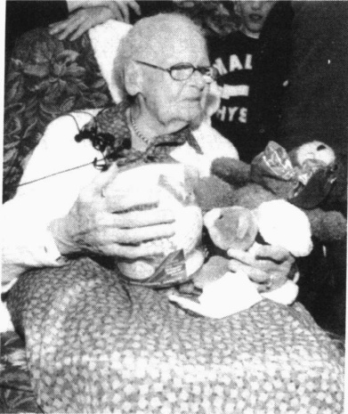

俄亥俄州莱马市的夏洛特·本克纳，于1889年11月16日出生在德国，是世界上仍然健在的最长寿的人。她的年龄是经过官方鉴定的。她与她99岁的妹妹一起住在一所疗养院里。法国的珍尼·卡尔蒙特是世界最长寿纪录的保持者，1997年去世时她122岁，这已经由出生证明证实了。

镜子中的样子。这种样子的变化是逐渐发生的，并且每次变化，只要不是相当大的变化，都会被接受。这样的结果就是，当遇见一个很久未见的朋友时，你会很震惊于他巨大的变化。在同学聚会上，每个人都很难相信其他人怎么会显得如此年老！

如果不存在一个时间点，即人们会自动跨过一条想象中的时间线并步入“老龄”，那么，是什么决定了一个人“年老”了？我们能够指出一些使人们将“年老”这个标签运用于自身的因素。

第一个因素是生物学。一个人也许会比其他人更早地出现年老的“标志”：起皱纹、秃头、全身瘫痪、在做一些过去认为理所当然的事情上力不从心。因此，人们或早或晚都会感到自己“老”了。

第二个因素是个人经历。一个女人如果在16岁时生了一个女儿，这个女儿在18岁时又生了一个小孩，就会使这个女人在34岁的时候成为一个生物学意义上的祖母。当然，她还不太可能开始扮演任何一种刻板角色，比如终日坐在摇椅上，但是意识到她是祖母这个事实会对她的自我概念产生一些影响。至少，她必定会否认自己已经老了。

一场意外限制了某个人的行动，同样也会使这个人比起其他人更早地感觉到老。

接着是性别年龄(gender age)，即一种文化给予男人和女人在年龄上的相对价值。例如，在男人身上出现变白的头发，甚至是一些皱纹，可能会被解释成“成熟”的标志，但同样的情况发生在妇女身上，就意味着“衰老”。在西方文化中，“成熟”与“衰老”当然有着不同的含义。前者是人们渴望的，后者是人们想避开的。同样，在世界上，与女人相比，大多数男人都能与更年轻的配偶结婚。玛利亚也许是一个例外，她与小她14岁的比尔结了婚。但是在存在着14岁年龄差距的婚姻中，大都是妻子是较年轻的一方。当然，生物学与这种社会建构起来的关于外表与性别年龄的现实，没有任何关系。

决定人们何时给自己贴上“年老”标签的第四个因素就是时间表——社会用来提示它的成员老年已经开始的信号。因为不存在一个表明人们“年老”的年龄，所以这些时间表在世界各地各不相同。一个群体可能会选择一个特定的生日，比如60岁或65岁生日来表明老年的开始。其他一些群体甚至没有生日，这就使得年龄变得毫无意义。在西方，退休有时也是老年开始的一个文化信号，这就是一些人不愿意退休的一个原因。

### 老年意味着什么？

为了有助于正确表示人们关于老年的体验如何与非生物学因素相关，我们来看三个跨文化例子。第一个例子来自美国。我所做的关于一些群体不庆祝生日的陈述，也许听起来有些夸张。然而，只

---

有在他们搬到保留地之后，土著美国人才接受盎格鲁人计算生日的习俗。但即便对于今天传统的土著美国人来说，进入老年的信号仍旧更多的是不能从事生产性社会活动，而不是任何特定的生日。因此，那些无法继续从事生产性社会活动的人便倾向于认为自己老了，而不考虑他们自己的实际年龄。例如在一项调查中，一个已经不能从事许多活动的女性土著美国人就将自己描述为是年老的。她当时只有37岁(Kramer，1992)。

### 看看虚构的两个提维男人之间的对话：

Bashti用羡慕的眼神看着Masta。当Masta注意到Bashti看他的这种方式，他心里暗暗得意。他知道Bashti在想什么。早在20年前，他也有着同样的想法。那时他没有妻子，现在他有三个妻子。那时他没有堂皇的茅屋，现在他不仅有了，还是一个妻子一间房子。那时他不受尊敬，没有权力和金钱，现在每个人都尊敬他。Masta想：“白头发是多么神奇和美妙啊。”Bashti耷拉着脑袋，无精打采地走到一边。“但是总会轮到我的，我也会变老，”他这么想，这让他在目前的现实中略感安慰。

为什么一个提维男人会这样期待变老，而在美国却很少有人会这样想呢？传统的提维社会是一个由老年人统治的社会，即老人统治（gerontocracy）。老年人拥有权力，并控制着一切。他们的权力如此广泛，以至于老年男子能与所有的女子结婚，不论年轻的还是年老的，而青年男子则一无所有。只有40岁及其以上的男子才能结婚（Hart and Pilling，1970）。（在提维社会中，女性是附属品，并且年老对她们来说没有任何好处。事实上，在开篇短文中，我们已经看到了年老带给提维女性的一个不利之处。）

另一个例子是传统的爱斯基摩人社会，它也提供了一个与后工业社会形成鲜明反差的对照。

Shantu 和 Wishta 怜爱地吻别了他们的孩子和孙子们。然后，他们悲伤而缓慢地爬上一块大浮冰。他们知道自己不得不为了他们的家庭而忍受这种牺牲。随着浮冰慢慢漂入大洋，痛苦的告别开始了。Shantu 和 Wishta 将会很快饿死。但是他们老了，死亡是必然的，这样可以减少对这个小群体来说宝贵食物的需求。

较年轻的亲戚们目送 Shantu 和 Wishta 渐渐消失在远处，他们知道轮到他们作出这种牺牲的时间也会到来。每个人都被期望能勇敢地面对它。

在传统的爱斯基摩人社会，步入老年意味着一种“自愿”的死亡。在他们那种严酷的环境中生存很不容易，因此除去相当小的孩子，所有人都必须自食其力。食物供给如此有限，以至于没有剩余可以分给那些不能参与生存所必须的劳作的人们。

### ▷▷小结

符号互动论者强调，“年老”自身没有特定的意义。年老并不自动地带来这些反应：荣誉与尊敬（如阿布哈西亚人）、羡慕（如提维男性）或是隐退（如传统的爱斯基摩人）。这个观点有助于我们理解文化在我们对待老龄化过程中所扮演的角色，即社会因素如何更改了生物因素。

### 不断改变的关于老年人的观念

一开始，当开发商解释他们要建造一幢高层公寓的计划时，听众们都还安静地坐着。不久，人

---

我们开始变得不安分起来。随后他们开始表现出明显的敌意。

“在那些老人身上花的钱太多了。”一个人说道。

“你们还想为他们建一个游泳池吗？”另一个人难以置信地问道。

最后，一位年轻女士总结了大家的态度，她说：“谁希望周围都是那些老人啊？”

当罗伯特·巴特勒（Butler，1975，1980）医生听到这些对为老年市民建造公寓的计划的反应时，他开始意识到人们对老年人怀有很深的敌对情绪。他创造了一个名词“年龄歧视”（ageism），指因为人们的年龄而指向他们的偏见、歧视和敌意。让我们来看看年龄歧视在美国社会是怎样形成的。

处于变化中的意义 正如我们所见，年老本身并不对应着某种特定的态度，如否定的或其他的态度。在早期美国社会，年老甚至还曾有过积极意义（Cottin，1979；Kart，1990；Clair et al.，1993）。在殖民地时期，年老曾被视为一种成就，因为很少有人能活那么长。因为没有养老金，老年人继续从事那些随着时间变化改变很少的工作。他们被看做是有关工作技巧和怎样活得长寿的知识宝库。

然而，工业化的到来，瓦解了尊敬的这些基础。伴随着更好的卫生及医疗条件，更多的人得以长寿。成为老年人不再是一种值得尊敬的荣誉，批量生产的新形式使得年轻的工人们像前辈们一样多产。伴随着大众教育的发展，老年人的知识优越性也被剥夺了(Cowgill，1974)。在下面的“文化多样性”专栏里，你会看到，在中国的工业化进程中，同样的一幕也正在发生。

### 世界文化多样性

### 中国: 正在改变的对老年人的感情

当赵春兰(一位71岁的老寡妇)预想未来时，她不好意思地笑了笑，带着明显的满足。她已经听说过儿子抛弃他们年老的父母的事情，甚至还听到有人悄悄谈论虐待老人的事。

但是赵女士没有这种担忧。

这并不是因为她的儿子如此深爱着她，以至于他不会背离对母亲的传统义务。而是一纸文书让赵女士感到安心。她51岁的儿子签署了一份赡养协议：他将给她做饭，带她去做医疗检查，甚至把家中最大的房间给她住，并将彩电放在房间里(Sun,1990)。

老年人在中国享有很高的地位，这在世界上相当有名。老人们被视为智慧的源泉，在家庭和公众场合都被给予很高的荣誉。在古代，甚至在死后，老人们也倍受尊敬。

虽然这种说法可能代表的更多的是一种理想而非现实文化，但事实基本如此。然而，工业化通过带来更长的预期寿命，以及每对夫妇只允许生一个小孩的国策，正在撕裂代际之间的联系纽带。年轻人越来越少，65岁以上人口的百分比则迅速增长，已经达到了8800万，占人口的7%。在接下来50年里，中国的老龄人口也许会猛增至40%（Kinsella and Taeuber，1993；Statistical Abstract 2002: Table 1308, 1309）。

因为中国尚未建起全国性的社会保障体系，所以儿女们必须赡养他们的父辈（Chang，2000）。许多地方官员注意到父母与子女之间的联系纽带正在减弱，他们要求成年子女为他们年老的父母签署赡养协议。有一个省的做法颇有创意：一对新婚夫妇必须签署一份保证在父母60岁后赡养他们的合约，才能领到结婚证书（Sun，1990）。“不管怎样，我相信他（儿子）会很好地照顾我，”赵女士说，“而且我知道他愿意这么做。”

---

符号互动论的一个基本原理，就是人们根据他们文化中的符号来理解自身和他人。因此，随着“老年”意义的转变——当它从一种资本变为一种负担——不仅较为年轻的人会以不同的眼光看待老年人，老年人自己也会开始以一种全新的视角来理解自身。人们适应这种意义上的转变的一个标志，就是他们掩饰自己年龄的方式：过去人们常把自己的年龄说得比实际年龄大些，但现在，他们往往把自己说得更小些(Clair et al.,1993)。

在美国，因为大多数老年人在经济上都能照顾自己——事实上，许多人过得还相当舒适——所以老年的意义再次发生改变。此外，出生在“生育高峰”时期的那代人现在已进入50岁。伴随

查尔斯·舒尔茨创作。

刻板印象在社会生活中具有重大作用。它是社会学研究的一个基本领域。在当代社会，大众媒体是刻板印象的主要来源。

着他们的加入，以及更好的健康和财政支援，他们注定会对我们关于老年人的印象产生积极的影响。现在正在进行的符号转变的下一步，就是把老年当成一个新阶段的开始来庆祝——不是简单地指死亡之前的一个时期，而是指另一个成长阶段。

### 大众媒体的影响

在第 3 章,我们提到过大众媒体帮助我们塑造了有关性别以及男女间关系的观念。作为一种强有力的符号源,媒体也影响了我们对老年人的观念。这是下面“社会生活中的大众媒体”专栏讨论的主题。

### 社会生活中的大众媒体

### 塑造我们对老年人的理解

大众媒体深深地影响着我们的生活。我们在电视和电影中的所见所闻，我们听的歌曲，看的书籍杂志——都成为我们世界观的一部分。媒体在我们不知不觉的情况下塑造着我们对人的印象。它们影响着我们如何看待少数民族、统治群体、男性、女性和儿童、残疾人、来自其他文化的人们，以及老年人。

这种塑造相当微妙，通常我们都意识不到。例如，在电视和许多畅销杂志中，老年人就未被充分表现。这里隐藏的讯息就是老年人不具影响力，可以被放心地忽略掉。或者，我们可以看一下媒体是怎样反映和强化关于性别年龄的刻板印象的。年长的男性新闻广播员有可能被继续雇用，而相同年龄的女性新闻广播员更有可能被调住一些更看不见的职位上。同样，在电影中，年长的男性更有可能扮演罗曼蒂克的主角——而演对手戏的常常是年轻得多的新星。

广告也是如此。“美国退休者协会”指出，电视广告通常将老年人刻画为虚弱的或愚昧的，或是坐在摇椅上打发时光的(Goldman,1993)。“美国退休者协会”宣称，造成这种状况的原因是年轻一代支配着广告公司，他们的广告反映了他们对老年人群

---

的消极印象。他们挑选出了“这个群体(老年群体)最糟糕的品质，并使人们相信这样一件事：年老是人们所不想要的。”

这种暗示到现在仍然存在。随着年岁的增长，我们竭尽全力否认自己正在变老。这一点被广告商所利用。他们利用我们对失去青春的恐惧，销售给我们他们生产的染发剂、润肤霜，以及其他试图掩盖衰老外表的产品。同样道理，美国人还求助于整形外科，以消除那些可见的衰老的痕迹。

正如本书所讨论的，老年人的影响正在增强。这一点转化为经济力量，将会不可避免地使媒体对老年人的印象发生改变。

### 功能主义视角

功能主义者分析社会的各个部分是怎样协调运作的。在社会的组成部分中有一种年龄同期群(age cohorts)，即大致同时出生并有共同生活历程的一批人。虽然我们看不见年龄同期群，但是它们却在影响着我们的生活。比如，如果接近退休的年龄同期群比较庞大(如“生育高峰期”那代人)，许多工作岗位就会同时空缺出来。然而如果这个群体比较小(如“生育低谷期”那代人)，工作空缺就会较少。下面我们来看三种关注人们如何调整以适应退休的理论。

### 解约理论

伊莱恩·卡明和威廉·亨利（Elaine Cumming and William Henry，1961）分析了当老年人离开他们的责任岗位后，社会怎样去防止中断的问题。他们用解约理论（disengagement theory）作了这样的解释：如果老年人只是在死亡或变得无能力时才离开其岗位，社会将会发生混乱。为了避免这种情况，社会给老年人提供养老金，诱使他们将权力交给年轻人。这样，退休（或解约）就成为社会中两大部分间一个相互有益的协定。它有助于代际之间的平稳过渡。

随着美国老年人口的增多，他们的福利也日益受到重视。研究者不仅在研究老年人的精神发展和社会发展，而且也在研究其身体健康的原因。你认为，随着研究的深入，一般老年人的身体状况能否达到图中这位老人的水平？

卡明 (Cumming, 1976) 也从个人角度分析了解约。她指出，早在退休之前的中年，解约就开始了，也就是当一个人意识到自己更靠近生命的末尾而非它的开始的时候。然而，个体并不是立即解约，而是意识到时间是有限的，并开始给目标和任务安排先后。当儿女们离开家庭，解约就真正开始了，然后随着退休而加剧，最终到达寡居状态。

对该理论的评价 解约理论几乎从一提出就受到了抨击(Hatch,2000)。人类学家多萝西·杰罗姆(Jerrome，1992)指出，这个理论包含一种对老年人暗含的偏见，即假设老年人从生产性的社会角色中脱离出来，随即沦落为被忘却的一类人。她自己的研究表明，老年人只是从一套角色转变到另一套角色，而并非解约。经常聚焦于友谊的新角色，比起之前的角色并不会令人失望。只是，那些具有一种青年取向的研究者看不到这一点，并且研究者假定生产和工作是

---

自我价值的唯一度量，这是一种偏见。

退休也在发生着改变。电脑、因特网及新的工作种类，都使工作与退休间的分界线变得越来越模糊。退休不再意味着突然停止工作。许多工作者只是放慢了脚步。有些人继续工作，但是投入的时间更少了。还有些人甚至在60岁时还在更换工作。一些人可能会搬到更温暖的地方去，但是会带着他们的工作。许多人永远不会“退休”——至少不会终日在摇椅或高尔夫训练场上度日。如果解约理论想要再度兴起，它必须抓住这个根本性的变化。

### 积极活动理论

退休的人会不会对生活更满意？亲密活动是否比正式活动更令人满意？这样的问题都是积极活动理论（activity theory）的关注点。该理论认为，老年人参与的活动越多，他们就会发现生活越令人满意。虽然我们也可以从其他视角看待这一理论，但因它的关注点是解约如何具有功能或功能失调的，所以我们可以从功能主义视角对其分析。

对该理论的评价结论是混杂的。一般来说，研究人员发现，人们越活跃就越感到满足。但情况也并非总是如此。一项对法国退休人员的研究发现，一些人是越活跃越开心，另一些人则正好相反(Keith，1982)。同样，大多数人发现，非正式的亲密活动(如与朋友相处)，比起正式活动来要更令人满意。但也并非人人如此。在一项调查中，2000名美国退休人士报告说，正式活动与非正式活动一样重要。甚至像房屋修缮这样的团体活动，也如亲密活动一样，会影响这些人对生活的满意度(Beck and Page，1988)。与成年子女相见的情况也是如此。与成年子女的互动程度会增加对生活的满意度，也是因人而异的——有时，用他们的话来说，他们见子女已经“足够频繁”了(Hatch，2000)。

简言之，只去计算老年人互动或活动的数量未免过于简单化。因此，这个理论也已被抛弃。如果它想再度引起注意，研究者必须考虑各种活动对人们来说意味着什么。

### 连续性理论

另一个关于人们如何适应年老的理论就是连续性理论(continuity theory)。正如它的名字所示，这个理论的焦点在于人们如何通过延续他们生活的特定方面来适应变化，例如他们习惯的角色或是处世技巧。研究人员发现，拥有复合角色的人们(妻子、作家、母亲、亲密朋友、教会成员等)，能更好地应对年老带来的变化。研究人员也发现，来自更高社会阶层的人们拥有更多的资源以迎接年老带来的挑战，他们也能更好地适应年老。

对该理论的评价 对连续性理论的根本批评就是它太宽泛了(Hatch,2000)。在人生经历的基础上，我们都有定位点，并且我们都依赖它们作出调整，以适应在生活中遇到的变化。这适用于除婴儿外所有年龄的人。该理论实际上是一些彼此松散关联的观点的组合，并不特别适用于老年人。

### ▷▷小结

功能主义者从广义的角度讨论了社会的各个组成部分怎样协作以确保其顺利运行。虽然较年轻的工人取代年长的工人是不可避免的，但这种过渡可能会中断。因此，要给老年人提供养老金，诱使他们

---

离开岗位以便年轻人接替。功能主义者还从狭义的角度关注了老年人怎样去适应退休。这样得出的结论由于过于混杂，以至于没有太大的价值——只有一点还是有参考价值的：拥有更多资源的人们(包括复合角色)能够更好地适应老年生活。

当这些理论提出时，65岁退休还是法律所要求的。而现在，人们如果想要工作，他们完全可以继续工作。因此，这些理论需要把选择作为一个考虑因素——尤其是人们如何重构其身份认同，并适应他们所选择的新生活。

### 冲突论视角

在冲突论观点看来，社会生活的主导原则是权力、竞争、不平衡和变革。社会中的老年群体也是如此。不管年轻人和老年人是否意识到这一点，他们都是威胁使社会陷入混乱的基本斗争的一部分。“社会保障立法”的通过就是这种斗争的一个例子。

### 社会保障立法

在 20 世纪 20 年代还没有社会保障为老年人提供收入来源，65 岁以上的居民中有 2/3 的人没有积蓄，不能养活自己（Holtzman，1963；Hudson，1978）。只有 1/5 的工人能在死前退休（O'Rand and Henretta，1999）。在大萧条时期，工人的命运更加悲惨。1930 年，一位名叫弗朗西斯·汤森的医生发起了一场团结老年市民的运动。很快，全美 65 岁以上的老人有 1/3 都加入了他的俱乐部。他们要求联邦政府在全国范围内征收 2% 的营业税，以便给每位 65 岁以上的老人每月提供 200 美元（在今天相当

图 13.5 社会保障费用

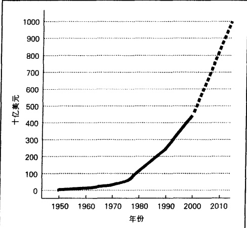

资料来源：作者根据 Statistical Abstract 1997: Table 518 和 Statistical Abstract 2002: Table 518 整理而成。虚线部分是作者的预测。

于每月2025美元）。1934年，国会审议汤森方案。因为该方案要求高额的支付，并且许多人担心它会影响人们为未来储蓄的动力，所以国会议员试图寻求一种方式来拒绝这个方案，同时又不表现出反对老年人的态度。当罗斯福总统在1934年宣布他自己的更为温和的社会保障方案时，国会接受了(Schottland，1963；Amenta et al., 1999)。

为了给年轻人提供工作，该立法要求工人在65岁退休，不论人们工作得如何出色，或是他们多么需要这份工资。几十年来，老年人一直对此表示抗议。最后，国会于1986年取消了强制退休。今天，大约90%的美国人在65岁退休，但他们大都是自愿的。现在已经不再有仅仅因为年龄大而被迫离开工作的事情发生。

冲突理论家指出，社会保障的出台，并非

---

来自国会议员的慷慨之心，而是来自互相竞争的利益群体间的斗争。正如冲突理论家强调的，平衡只是社会力量间一种暂时的平衡，它随时都有可能被打破。未来可能会出现更直接的冲突对抗。下面就让我们看一下这种可能性。

### 代际冲突

未来是否会带来老年人与年轻人的冲突？虽然暴力冲突不太可能发生，但如果你留心注意的话，你会听到许多抱怨——抱怨老年人越来越多，他们得到的超过了他们在社会财富中所应占的合理份额。社会保障与医疗保健的巨额花费，已经成为全国的关注点。这两项各占了税收的1/3（35%）（Statistical Abstract 2000: Table 453）。如图13.5所示，社会保障税收在1950年是7.8亿美元，现在它们升高了600倍。在下面的“现实社会学”专栏中，我们讨论了那些有可能广泛传播的不满情绪。

## 现实社会学

### 正在改变的对美国老年人的感情

以前，很多美国老年人都较为贫穷。但随着社会保障的逐步完善，老年人的贫困率急剧降低。正如我们在图10.5中所看到的，现在老年人的贫困率较低。大家都知道，现在有许多老年人开着旅行房车周游全国，并将大量的钱用于消遣娱乐。他们处境的变化，是否导致了人们对老年人感情的变化？

有迹象表明是有变化的。参议员艾伦·辛普森将老年人称为“贪婪的老家伙”和“在佛罗里达新家附近穿着短裤散步的老人”，这些人要求政府给予施舍（Duff，1995）。在同一家旅馆中，人们为同一个房间所支付的费用要比老年人多，对此一些人也有怨恨。特雷莎·安德森（Anderson，1985）说：“我的父母工作并拥有一些房产。如果不考虑其需要自动赋予人们‘老年公民优惠’的权利，问题就会出现。”

一些人甚至声称，我们应该对老年人的医疗保健进行限定（Perrin，1994）。丹尼尔·卡拉汉（Callahan，1987）追问：“考虑到成本，我们为什么要对80多岁的老年人进行心内手术呢？这只能将他们的生命延长两三年。运用同样的财力为一个孩子进行肾脏移植手术，岂不是更有意义？他们的寿命可以延长50年呢。”

罗伯特·萨缪尔森(Samuelson，1988)谴责老年人强有力的游说团（即“美国退休者协会”）使用具有误导性的刻板印象。他说：“在真实世界中，惯于久坐的、衰弱的、贫穷的老年人形象已经消失很久了，但在政治中，这种刻板印象却被提出并使之永久化。”他还谴责了“美国退休者协会”的伪善：“他们坚持声称（正当地）仅是年龄并不会剥夺老人的生命力和独立自主性，同时他们却又辩称（不受地）仅是年龄就应赋予老人获得特殊照料的权力。”萨缪尔森说，这两个方面不能同时成立。

### 思考题

运用本章的资料分析对待老年人的感情改变的原因。注意凡事都有正反两面。一方面，我们现在65岁以上的老年人一代正享受着美国历史上最高的生活水平。每三个高尔夫球手中就有一个超过65岁，而乘船出游的人中有60%都超过了65岁。另一方面，生活在贫困中的老年人有22%是非裔美国人，19%是拉美裔美国人，10%是亚裔美国人，9%为白种人（Statistical Abstract 2002: Table 671）。另外，请注意他们的对比形象——一方面，他们是“贪婪的吸血鬼”；另一方面，他们是“值得同情的可怜人，他们省下钱所能购买的最好食物是——狗食。”

---

某些冲突形式似乎是不可避免的。美国的银色浪潮使得越来越少的工人去为享受社会保障的庞大人群支付不断增长的社会保障金。这个问题以及其他一些问题在下面的“批判性思考”专栏中有所讨论。

### 批判性思考

### 推翻美国预算盈余的神话: 我们能够凭空支付老年人的社会保障吗?

每个月社会保障管理部门都要给4600万人寄发支票。在美国全国范围内，有1.87亿工人把钱存入社会保障体系，期望它能支付他们在老年时的基本需要——甚至是比那还要多一些(Statistical Abstract 2002: Table 517,519)。

社会保障有多可靠？答案简单说来就是：“不要把你的老年生活押在那上面”。

第一个问题是众所周知。社会保障不是银行存款。从我们的支票中支付的钱，并不存入我们的个人账户。在社会保障体系中，没有一分钱属于任何一个特定的人。退休时，我们没有拿回我们存入社会保障的钱。相反，政府把从现在的工人们那里收来的钱写成支票来支付退休金。当这些工人退休时，他们也将被付给退休金，但这笔钱不是来自他们自己的储蓄，而是来自其他仍在工作的人们那里。

社会保障体系就像一系列巨大的连锁信——只要有足够多的新人加入这个链条，它就能运转。如果你加入的足够早，你将会收入大于支出——但如果你加入的晚，那你的运气就不会太好。一些冲突理论家说，我们正在接近这个链条的末端。依赖率（即从社会保障拿钱的人数与为社会保障供钱的人数的比率）上的转变，尤其令人头痛。如图13.6所示，过去通常是16个工人来供养一个人。现在，依赖率已经降到4个人供养一个人。再下一代，（依赖率）也许将减至2个人供养一个人。当这一天到来时，社会保障税将会变得很高，以至于抑制了国家的经济。为了预防这种情况，国会提高了社会保障税，并建立了一个社会保障信托基金。按照推理，这个基金已经有了数万亿的资金。但是实际情况又是怎样的呢？让我们来看看第二个问题吧。想出了一个巧妙的解决办法：禁止社会保障管理部门除去购买美国国库券以外的任何投资。美国国库券是政府借款的一种形式。这就使得为社会保障而筹集的钱成了普通资金，这样，约翰逊就能调走这笔钱去资助战争。今天的政客们仍在这么做。他们用“预算外支出”这个词来指代他们花掉的社会保障资金，并且每年他们都会将其挥霍一空。

社会保障的第二个问题涉及危机的根源，或者用一些人的话来说，就是欺骗。1965年，约翰逊总统陷入越战的泥潭。为了对公众隐瞒战争费用，他假设你买了一万元的国库券，政府拿走了你的一万元，给你一纸文书表明它欠你一万元并加上利息。社会保障就是这样运作的。社会保障管理部门从工人那里筹集资金，支付给退休人员、残疾人以及伤亡工人的家属，然后把余额交给美国政府。接着，政府又以美国国库券的形式向社会保障管理部门索要巨额的借款。政府把钱花在它想做的事情上——无论那是修建公路和学校，还是补助烟草作物。

用这种方式来思考一下: 假设你的开销大于

图 13.6 越来越少的工人供养越来越多的退休者和伤残工人

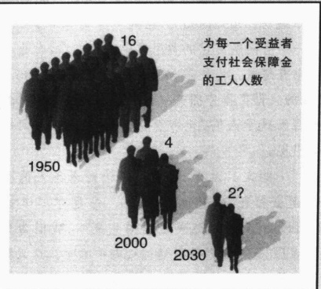

资料来源：作者根据社会保障局；Statistical Abstract 2002；Table 517,519 整理而成。

---

收入，但你提取了玛丽阿姨的银行存款并将她的一部分钱放入你自己的账户。如果不把你欠玛丽阿姨的钱计算在内，你就会有盈余。很简单，政府也不把那些它欠老年人的巨额债务计算在内，并且有时，它还会将一个带有欺骗性的盈余报告给公众。

这种做法是任何一位政客的梦想。每个月政府都将社会保障信托基金一扫而光。政客们攫取资金并发放国库券。旨在限制联邦债务总量的格拉姆－拉德曼法，没有把从社会保障那里“借来”的基金计算在内。（用他们的话来说，这是“预算外”。）这就好像这个政府不存在开销似的——对政客来说确实如此。对他们来说，社会保障是一台造钱机器，凭空产生了数十亿美元。对他们来说，那些只是纸上的数字，不是从工人那里筹集来的钱。正如一位分析家所言，社会保障信托基金不是一种基金，你不该相信它（Sloan，2001）。

### 恩考题

这里有三条建议来解决这个问题。

1. 将退休年龄提到 70 岁。

2. 每个月，在支付完所有的受益者之后，将所有剩下的社会保障税用作国债。在依赖率进一步下降之前，这笔债务能够被付清，使得花费在利息(现在是每年1800亿元)上的钱可以为社会保障的支付所利用。这个建议要想起作用，政府就不能增加其开销，但对政客们来说这几乎是件不可能的事。

3. 改革整个体系。将工人们支付的社会保障税存入他们自己的个人退休账户。一个不受政府管制的委员会将挑选资金经营者，把这些存款投资于房地产、股票和债券上。每年度，委员会将评估资金经营者的表现，留下那些工作出色的人员，替换那些表现一般的人员。所有的投资结果都将被公布于众，并将得到公众的监督。

根据你自己关于社会保障的看法思考一下。你是倾向于保留现有的社会保障体系？还是喜欢这三个建议中的一个？当然，没有一个解决办法是完美的。它们每个都可能存在什么问题？你能想出一个更好的解决办法吗？

资料来源：Smith (1986); Smith (1987); Hardy (1991); Genetski (1993); Stevenson (1998), Statistical Abstract 2000. Monthly Treasury Statement of Receipts and Outlays, Winter Treasury Bulletin, Statement of Liabilities and Other Financial Commitments 等政府出版物列举了社会保障收入赤字状况。

图 13.7 显示了老年人医疗费用的增长状况。鉴于这种情况，一些人担心政府将会减少用于儿童的健康保健的资金，国会将会被迫在老人和儿童之间作出选择。尤其使一些人感到警觉的是图 13.8 所展示的数据。我们看到，直到 20 世纪 90 年代初，老年人的状况一直在改善，但儿童们的状况却在持续恶化。幸运的是，在 20 世纪 90 年代末，全国范围内儿童的贫困率急速下降。与此同时，老年人的贫困率则一直保持低水平。但别忘了，这是一个繁荣的时期，没有更多的社会方案提出——即不存在与老年人社会保障相对应的面向儿童的方案。因此，很有可能当经济衰退时，儿童的贫困率将会再次上升。

### 反击

一些组织致力于保护老年人得来不易的权益。下面两个组织就是例子。

灰豹党 拥有两万名成员的灰豹党(The Gray Panthers)，意识到工人阶级可能会因年龄原因而分裂(Collins,2001)。这个组织是在1970年由玛格丽特·库恩(Margaret Kuhn,1905—1995)创立的，旨在鼓励所有人不分年龄为自身的福利而工作。从微观层面看，其目标是发展积极的自我概念(Kuhn,1990)。从宏观层面看，其目标是要建立一个广泛的基础以挑战任何压迫穷人(不论年龄)的制度，并对

---

图 13.7 用于老年人和残疾人的卫生保健费用

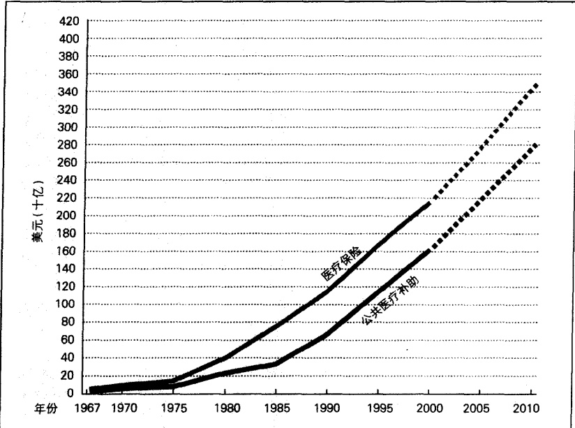

注：虚线部分是作者的预测。

资料来源：作者根据相关年份的 Statistical Abstract 及 Statistical Abstract 2002；Table 128 和 Table 132 整理而成。

图 13.8 贫困的趋势

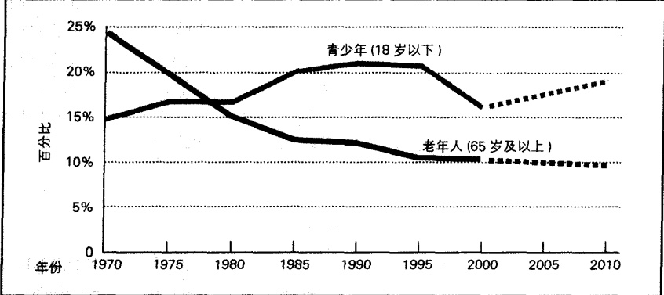

注：政府在计算青少年总数时，有时指18岁以下的人口，有时指15或16岁以下的人口。虚线部分是作者的预测。资料来源：作者根据 Statistical Abstract 1989: Table 738; Statistical Abstract 1992: Table 718 和 721; Statistical Abstract 1997: Table 739; Table 2002: Table 671 整理而成。

---

抗使不同年龄的人群相对立的企图。他们所起作用的一个标志,就是他们经常在有关各项特定立法的国会委员会前做证。

美国退休者协会 美国退休者协会也与那些关于老年人的消极印象进行斗争。这个拥有3500万成员的组织在政治上很有势力。它对联邦及各州的立法进行监督，并动员其成员在与他们的福利有关的问题上采取行动。美国退休者协会能够引出成千上万的来自愤怒的老年居民的电话、电报及信件。政客们知道，为了保护他们重新当选的机会，最好不要与美国退休者协会发生冲突。你可能会想到，批评的意见认为这个组织势力太大，它能够聚集起力量来索取太多的东西，这将超出其在社会财富中应占的份额。

冲突理论家认为,所有这些都有助于证明他们的观点。老年群体仅仅是社会中为获取稀缺资源而争斗的众多群体中的一支,因而冲突的存在是不可避免的结果。

在结束本章之前,我们还要看看依赖问题与死亡社会学。

### 依赖问题

“当我年老时，我能够照顾自己吗？我会不会变得虚弱不堪，无法到处走动？我将会贫穷吗？会不会住在某家养老院，把自己交给那些根本不关心我的陌生人的手中？”这些都是老年人普遍关心的问题。让我们看看老年人的依赖问题：孤独、养老院、虐待，以及贫困。

### 孤独与性别

与一些刻板印象相反，大多数美国老人并不孤独。然而，因为大部分女性比男性长寿，所以女性比起男性来更有可能丧偶并经受孤独。从图13.9可以看出，73%的老年男性与妻子一起生活，但只有41%的老年女性与丈夫一起生活。因此，寡居带来的强烈的失落和孤独感，更有可能是由女性经受的。这种在死亡率上的差异，也意味着女性更可能要照顾虚弱的丈夫，丈夫照顾虚弱的妻子则更少。这也意味着大多数住在养老院的病人都是女性。

### 养老院

在一所养老院，护士在一位病人的病历上写到她的脚有损伤。实际上，在她的伤口上有坏疽及蛆虫（Rhone，2001）。在另一所养老院——也许是南加州一所主要的退休人员之家——一位妇女在房间里中风了。她的“看护者”15个小时后才发现她的状况。她没有被抢救过来（Morin，2001）。

图 13.9 美国的老年人在哪里居住？

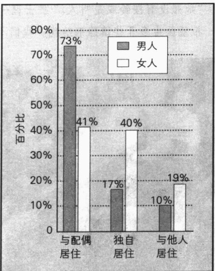

资料来源：作者根据 Statistical Abstract 2002: Table 39 整理而成。

---

虽然大多数老年人都由家人照顾，但还有150万65岁及以上的老人住在养老院。这大约占到全国老年人口的5%（Statistical Abstract 2002: Table11, 168）。一些人待了几个月或几周就返家了。另一些人没待多久就死去了。总的来说，大约1/2的老年女性和1/3的老年男性在养老院住过，至少是待过一段时间。

养老院的住院者并非通常意义上的老年人。大多数(51.5%)都是85岁或更老的人(Statistical Abstract 2002: Table 169)。那些住在养老院的老人们可能是丧偶的，或者终生未婚的，因此没有家人可以照顾他们。一半以上的老人是失禁的(即无法控制大小便)，许多人都丧失了判断力或是失忆(Treas, 1995)。

人员配备不足、人道主义缺乏和死亡要说一些关于养老院的好事很难。有关养老院的文学作品，不论是大众的还是科学的，都充满着有关忽视和虐待病人的恐怖故事，如在本节开头所引的那些事例。因此，国会组织了一次全国范围内对养老院的调查。他们发现，在那些人手不足的养老院里，病人更可能长褥疮、营养不良、体重太轻及脱水。90%的养老院都人手不足（Pear，2002b）。

很容易理解为什么养老院缺少人手。谁愿意为了不高的薪水而在充满尿味的地方工作？在那里，你必须清理排泄物，并且被一群垂死的人给包围着。每年都有40%～100%的员工从养老院离开(DeFrancis,2002)。

即便在少数几家有着充足人手的养老院里，也存在着剥夺人们尊严的一种倾向。让我们来看看社会学家沙伦·柯廷（Curtin，1976）在一所上好的养老院里的发现：

拉森女士于十月底住进了蒙特克里夫养老院……征得她的允许后不久，我于上午7:00到达蒙特克里夫，发现夜班护士正在发怒。拉森女士在晚间翻越了边上的栏杆，并在卫生间中被发现。“她并没有按铃或是叫人。”护士说……“为什么她要这么做，她可能会受伤，她怎么如此糊涂？我希望医生多开些镇静剂给我。我们不能让她胡闹，这会打扰其他病人的。”

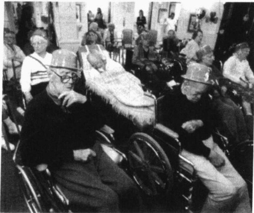

养老院的住院者并非通常意义的老年人。他们的健康状况不太好，而且通常较为孤独。另外，从这幅照片中你可以推断出，为了使他们听话，人们经常给他们药吃。

我走进房间，发现拉森女士处于被管制中……“让我摆脱这一切！”她命令道。“他们怎么能阻止我下床？我晚上要去解手，但他们从来不回答我的服务铃。”

拉森女士并不糊涂，但是在一个所有病人都被注射了镇静剂以至于在夜间很少有活动的地方，她的做法就会被视为一种捣乱。我不希望他们增加她的镇静剂药量，巴比妥酸盐经常导致老年人头脑糊涂并丧失判断力。即便她真的是个讨厌鬼，我也更希望她头脑清醒，有些意识。问题在于她没有权利。她老了，有病，并且异常虚弱。因此，她必须闭嘴，少说话，并带着感激的心情去接受给她的一点点“恩惠”。如果她这样作了，她将成为一个“听话的孩子”。

---

老年人讨厌被当成儿童来对待——不论是在养老院中，还是在其他任何地方。他们会像拉森女士一样去抗拒，但是这种抵抗常常无果而终。我们还可以说，这样无同情心的照顾并不便宜。养老院是项大生意。它们拥有超过100万员工，并且每年收入550亿美元(Statistical Abstract 2002; Table 141)。私人看护如此昂贵，以至于70%没有家人的住院者在三个月内就会中止服务(Ruffenbach, 1988; Treas, 1995)。

但是，所有对养老院的批评，与下面这个发现比较起来都算不上什么：比起那些处于相似情况而仍留在社区中的老人，那些住在养老院里的老人往往病得更重，死得更早（Wolinsky et al., 1997）。因为这样，我们可以略带讽刺地说，养老院一个主要的功能就是帮助除掉那些虚弱且无人问津的老人。换句话说，这种做法与我们本章开篇短文中提到的提维人“埋掉”老人那种行为在本质上并没有什么不同。

这么做其实并非情不得已。我们来看看“世界文化多样性”专栏中的例子，它提供了一个出色的制度化照顾体系。

### 世界文化多样性

### 老年痴呆(阿尔茨海默)症: 来自瑞典的经验

“我准备好了。”克莱在卧室里叫道。

“动作真快啊。”弗吉尼亚心想。她是克莱的妻子，今年48岁。“他可从来没有在去教堂之前准备得这么迅速过。”

弗吉尼亚走进卧室，看见克莱微笑着站在那里准备去教堂——但他却没穿任何衣物，只是在左手腕上带了三只手表。那天后来一些时候，当我问起情况如何时，弗吉尼亚告诉了我这件事。

随着年龄的增长，人们开始担心自己会“丧失智能”。这对他们来说意味着衰老，或者更专业地说，是老年痴呆症。

当人们变得像克莱一样(患有老年痴呆症),我们该如何照顾他们呢?

克莱由他的妻子悉心照顾着。他的妻子仍然健康，并且为人亲切，她能保证克莱吃上有营养的饭菜，出席一些社会活动——当他外出时，还要确保他穿戴整齐，而不仅仅是只带几块手表。

但是,许多人都没有关系密切并能照顾自己的亲属,他们该怎么办?对他们来说,衰老意味着被送进专门机构——即便不像我们所听过的恐怖故事那样,但也绝不是像弗吉尼亚所给予的那种充满爱心的照顾。

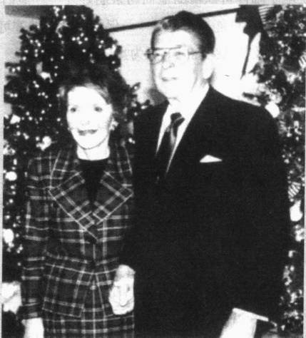

前总统罗纳德·里根患了老年痴呆(阿尔茨海默氏)症。这个病会破坏人们的思维过程，使患者的日常生活无法自理。里根甚至不记得他曾经是总统。随着我们社会中老年人口所占比例的日益增加，患老年痴呆症的人数也在增加——所需要的看护机构也在增多。

当然，被送进专门的机构，并不必然意味着一种不好的经历。为了理解积极照顾的潜力，我们可

---

以看看瑞典的经验。它为老年痴呆症患者创办了小组疗养院（Malmberg and Sundstrom，1996）。小组疗养院由6—8个小公寓房间组成，它们围绕着一个公用的厨房和起居室。虽然住院者有他们自己的膳宿供应，但有一个训练有素且领取高薪的人员24小时提供服务。其目标就是营造一种家庭氛围，使住院者能被悉心照料，被当做个体对待，并能参与到日常活动中来。当然，小组疗养院的好处远不止个性化照顾；伴随着老年痴呆症而来的 $ \underline{\text{次属问题}} $（抑郁、烦躁和焦虑），也都有显著的减轻。

### 思考题

由瑞典开创的小组疗养院的模式值得模仿，但其花费很大。在美国，你认为我们有多大的可能性为老年痴呆症患者提供这样的小组疗养院？假设我们确实提供了这样的疗养院，但是不能照顾到所有的老年痴呆症患者——那么，应该如何分配呢？

技术与养老院 你可能会意识到社会互动对你的幸福来说有多重要。对老年人来说同样如此。孤独可能导致他们智力和身体状况的退化。研究人员已经发现，积极活跃的社交生活，有助于预防大脑功能退化，而这些退化则可能造成老年痴呆症和震颤麻痹症(帕金森氏症)。社交上的孤独不是这些大脑疾病的必然原因，它们会发生在任何人身上，但是那些在社交上孤独的人更可能患上这些病(Ross,2000)。

社交活动有许多形式。一些养老院的住院者发现，电脑和互联网有助于他们克服孤独、寂寞和沮丧。收发电子邮件可以帮助他们与亲朋好友——他们可能分散在一个国家的许多地方，并且随着地球村的形成，他们还可能遍布世界——保持联系。随着可视电子邮件的广泛使用，它将成为一个有益于老年人心智健康及其社会健康的更为重要的因素。

### 虐待老人

虐待老人的事例有很多，虐待现象本身也是这样。在对养老院员工的一个随机抽样样本的采访中，40%的员工承认在过去一年里他们在心理上虐待过病人，10%的员工承认在身体上虐待过病人（Pillemer and Hudson，1993）。然而，大部分对老年人的虐待并不是发生在养老院，而是在家中。大多数施虐者不是拿薪水的员工，而是家庭成员。他们或是施以言语上和感情上的虐待，或是在经济上剥削年老的亲属（Pillemer and Wolf，1987；Shellenbarger，2003）。最有可能的施虐者是配偶（Nachman，1991；Pillemer and Suitor，1992）。

为什么配偶、子女、还有其他亲属会虐待自己家中的老人？社会学家卡尔·皮勒默和吉尔·休特（Pillemer & Suitor，1992）访问了200多人，他们都在照顾着家中患有老年痴呆症的成员。一位丈夫告诉他们，

耐心耗尽时，挫折感就会上升到一定程度。我从来不曾打她，但我不知道有时能否控制得住自己……正是照顾她这件事，使我感到挫折并失去耐心。我告诉她的东西，她都记不住。就像当我告诉她：“你是我的妻子。”她却对我说：“你疯了。”

从这位丈夫的陈述中，我们可以对伴随着照顾一个人而来的压力有所了解，所照顾的这个人是依赖性的、要求多且没有理解能力的。然而，大多数照顾老年人的人虽有压力，但并没有对那些他们照顾的人施以暴力，所以，对于为什么一些照顾者会变得暴力，我们无法回答。这一点，我们必须依靠日后的研究。

---

然而，比理解虐待的起因更为重要的，是从一开始就应防止老年人被虐待。关于家庭虐待，我们能做的很少——除非当虐待引起了政府的注意，才会去诉诸现有的法律。然而，对养老院的工作者而言，我们可以要求背景审查，以排除那些犯有抢劫、强暴及其他暴力罪行的人。这与对幼儿园的工作者进行背景审查，以剔除那些曾犯过骚扰儿童罪行的人是一个道理。大部分州都已通过了这样的法律。不过，这些法律只是解决这个问题的初步手段。它们并不能防止虐待，只是避免了明显的虐待行为。

### 老年人贫困

许多老年人都生活在令人烦恼的对贫困的担忧中。因为他们不知道自己会活多久，也不知道通货膨胀率会是多少，所以他们担心积蓄在有生之年不够用。这种担心在现实中有多大比例？虽然我们不能具体到个人，但可以将老年人看做一个群体来考察。

图 13.10 老年人中的性别与贫困

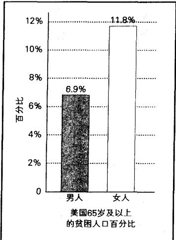

资料来源：作者根据 Statistical Abstract 2002: Table 39 整理而成。

性别与贫困 回顾第 11 章, 我们知道, 大多数女性在工

作期间赚的钱都要少于男性。图 13.10 表明，当女性和男性都进入老年，这种模式将会延续下去。正如你所看见的，老年女性可能贫困的比例要比老年男性高出 70%。

种族—民族与贫困 老年人也可以反映出一般社会中的种族和民族生活模式。如图 13.11 所示，白人和亚裔美国人中的老年人贫困的可能性最小。在非裔和拉美裔美国人中，老年人贫困很普遍，大致是

前者的两倍。

回到20世纪60年代，老年人贫困相当严重，以至于3个美国老年人当中就有1个生活在贫困线以下。联邦政府应大众要求，制定了反贫困方案，并加大了社会保障投入资金。立法也在养老金计划上赋予工人们法定的权利(雇主必须将工人们的退休金存入他们的社会保障账户)。在政府反贫困的运动中，这是少数成功的事例之一。如图13.12所示，这场运动很成功，除了那些75岁及以上的老人以外，今天的老年人贫困的可能性，比起平均年龄的美国人来说还要低。

图 13.11 种族－民族与贫困

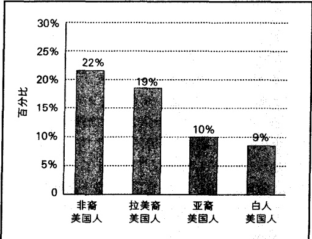

资料来源：作者根据 Statistical Abstract 2002: Table 671 整理而成。

---

图 13.12 贫困与年龄

资料来源：作者根据Statistical Abstract 2002: Table 671 整理而成。

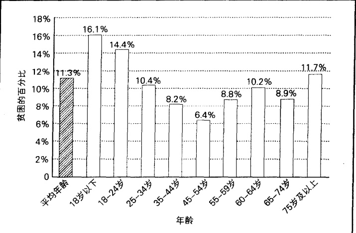

### 死亡社会学

死亡是社会学中一个很有意思的分支领域。尤其是我们怎样使用语言伪装来试图使我们自己远离死亡，这一点很有意思。我们已经建构了一套用于回避的复杂的语言，通过这种方式来指代“死亡”而不是用“死亡”这个词。我们用这样一些词语来代替死亡：“去了”、“过世”、“不再与我们一起”了，以及“安息了”。我们没有篇幅来探讨社会生活的这一特征，但我们可以简要地看看为什么社会学家强调如同年老一样，死亡也不仅仅是生物事件。让我们一起来看看文化是怎样形塑我们体验死亡的方式。

### 工业化和新技术

在工业化以前，死亡(对人们来说并)不是件陌生的事情。病人由家人在家中照顾，并且死在家里。因为生命短暂，大多数儿童都曾目睹过兄弟姐妹或父母死亡(Blauner，1966)。正如第1章中提到的，家人甚至处理好尸体以准备埋葬。然而，工业化却使死亡的过程变得陌生和不同，把它变成了一件由医院里的专业人员来操办的事。现在，死亡发生在紧闭的门之后——隔离、冷淡，并由陌生人来处理。

新技术不仅将死亡移出了我们的视野，而且也创造出了技术生命——一种介于生存和死亡之间的存在形式，但又不是二者中的任何一个(Cerulo and Ruane, 1996)。在医院里，“脑死亡”的人是没有自我意识的。他们的“人”已经去了——死了——然而我们的技术却使其维持着身体的存活。这混淆了生存与死亡的界限，而这一界限在过去曾是十分明确的。

然而，对于我们中大多数人而言，这一界限仍将是确定的，并且我们都将面临死亡。我们中有些人甚至会提前知道我们活不太久。让我们来看看研究人员的发现，这些发现指出我们将可能会怎样应对这类知识。

---

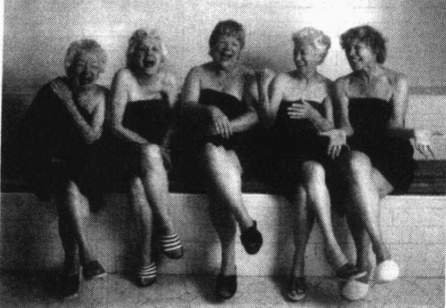

人们步入老年时，同在生命历程的其他阶段一样，如果他们有足够的钱满足个人的需要和欲望，那么生活会变得更加愉快，也更加令人满意。这位老年妇女必须靠她的汽车过活，因此，她不可能觉得，她生命中的这段时间令人满意。然而，在老年阶段，收入并不是能令人满意的唯一决定因素。图中的老年朋友正在纽约市享受桑拿。她们经常聚在一起仅仅是为了相互陪伴。虽然她们不可能欢迎老年的到来，但是，她们会发现，同无家可归的孤独女性相比，她们的这段时光更加令人满意。

### 作为一个过程的死亡

心理学家伊丽莎白·库布勒－罗斯(Elizabeth Kübler-Ross, 1969/1981)研究了人们在生命将要终结这段时间怎样去应对。这段时间从他们发现自己不久将要死去到真正死亡为止。访问完那些被告知患有不治之症的人们之后，她总结出了那些与死亡进行面对面接触的人们将要经历的五个阶段：

1. 拒绝。起初，人们无法相信自己就要死了。（“医生一定是诊断错了。那些检测结果不可能是真的。”）他们回避关于死亡的话题，以及那些提醒他们有关死亡的情景。

2. 愤怒。一段时间过后，他们承认自己将要死去，但是他们将自己的死亡看做是不公平的。（“我没有做什么，不该有这样的结果。某人比我差多了，但他仍然健康。我将要死是不应该的。”）

3. 谈判。接下来，个人试图通过与上帝、与命运、甚或与疾病本身的讨价还价来回避死亡。（“我想要和家人再多过一个圣诞节。我本该很感激他们，但我从未表示过。过完圣诞，我将准备好死亡。”）

4. 沮丧。在这个阶段，人们渐渐 $ \underset{\cdot}{顺} $从于自己的死亡，但他们感到悲伤。因为他们的生命就要结束了，并且他们没有能力去改变这个过程。

5. 接受。在这一最后阶段，人们屈从于即将来临的死亡。他们有条不紊地料理自己的事情——立遗嘱、付债单、教导儿女们照顾仍在世的长辈。他们也表达了当他们有机会时未能去做某些事的遗憾。虔诚的基督徒可能会说些有关被拯救的希望，以及他们渴望在天堂与耶稣基督相伴。

与这个模式相比，死亡更具个人特色。例如，并不是每个人都试图去讨价还价。从社会学意义上说，重要的是死亡是一个过程，而不只是一件事。很快将死去的人们面临的是一种与那些还将活很久的人们所不同的现实。他们那即将来临的死亡，强有力地影响了他们的思想及行为。让我来讲一个来自我自己生活中的直接事例吧。

当我的母亲被告知她患有不宜动手术的癌症后，她马上进入了一个鲜明的拒绝阶段。也许随

---

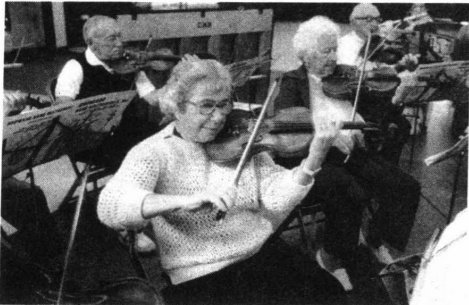

本书曾提到过，老年人的数量正在与日俱增，他们在总人口中所占的比例也在不断提高。由于医疗技术的进步和营养状况的改善，数百万老年人的身体十分健康。人们不再将健康状况下降和死亡视作老年的归宿，老年被重新定义。人们认为，老年这一时期充满了发展兴趣、培养才能的机会，它们为老年人提供了新的视角，也使他们对生活的满意感得以持续。

后她经历了愤怒或谈判，但都没有表现出来。一阵短暂的沮丧过后，她经历了一个很长的质问期，即为什么这一切发生在她身上。随后，她很快进入了第5个阶段，正如库布勒-罗斯描述的那样。她的葬礼过后，我的两位兄弟和我按照她的遗愿一起去了她的公寓。令我们吃惊的是，每个房间的每样物品上都贴着一张我们三人其中一人名字的护条——从床铺到电视到一箱箱的碟子和杂物。起初，我们对这样做感到很奇怪。虽然我们知道她是个有条理的人，但还不至于达到这种程度。随着我们整理她的东西，仔细考虑为什么她将特定的物品留给特定的子女，我们渐渐懂得了她“临终”处理自己物质生活的这一方式。

### 临终关怀

早几代人的时候，生命还很短暂，青壮年就死去被认为并不奇怪。今天，大多数人都将活到老年则被看做是正常的。在美国，绝大多数人（大约75%）的死亡都发生在65岁以后，这应归功于医疗技术的进步，以及更加完善的公共健康服务。人们希望死得有尊严，有朋友和亲属都在场的欣慰环境中。但是，坦率地说，医院是个死亡的糟糕场所。在那里，人们经历社会学家所称的制度死亡——即他们死去时被一群穿着正式制服的陌生人所包围，死在一个将自己的例行手续放在病人的需要之前的组织当中。

临终关怀是作为一种减轻由死亡带来的感情和生理负担的方式而出现的，并且还降低了死亡的花费。临终关怀建立在这样一种理念之上，即对死亡的控制权应属于那些即将要死的人和他们的家人。临终关怀这个词（hospices）最初指的是一个场所，但现在则通常被用来指家庭照顾，为一个临终的人的家庭进行服务——从咨询到一些实际帮助，如提供临时照顾婴儿的人，或是用车送人去医生或律师那里。曾经有一段时间，在美国有将近10万人忙于这种临终关怀的照顾中（Sociological Abstract 2002: Table 166）。

医院致力于延长人的生命，而临终关怀则致力于为人们的死亡提供一种尊严，并使处在生命即将终结这段时间里的人们感到舒适。在医院，焦点在病人身上；在临终关怀中，焦点转变为既包括临终的病人，也包括他或她的朋友及家人。在医院，其目标是要使病人好起来；在临终关怀中，其目标是减轻痛苦和折磨。在医院，最首要关注的是个人的身体健康状况；在临终关怀中，虽然也要去满足医疗的需要，但是最首要关注的是个人社会的（在某些情况下则是精神的）幸福。

### 自杀与年龄

我们在第1章曾提到过，涂尔干强调自杀有其社会基础。他说，自杀不仅仅是一种个体行为。例如，

---

每个国家都有它自己的自杀率。这些自杀率年复一年相当稳定。在美国，我们可以预言说今年将有3万人会自杀。如果我们少预言了1000人，这将是件令人奇怪的事情。正如我们在图1.1中所见，我们同样可以预言说美国人将选择使用枪支作为最普遍的自杀手段，上吊将排在第二位。我们还能确定今年男性自杀的可能性高于女性，因为每年都是如此。

统计数据常常与我们从大众媒体那里获得的关于事实的印象不大相符，这里就有一个这样的例子。虽然年轻人的自杀被给予了很多报道，但是这样的死亡相对来说是稀少的。青少年的自杀率要低于几乎所有其他年龄的人群。然而，因为青少年有一个如此低的死亡率，所以自杀就成为了第三位的主要死因——仅次于意外事故和谋杀（Sociological Abstract 2002: Table 102）。

有关自杀的这些发现实际上是一个例子，说明了贯穿本书的一个最首要的社会学观点：人类行为的重现模式——不论是教育、婚姻、工作、犯罪、对因特网的使用、或自杀——都体现了潜在的社会力量。因此，如果构成美国社会生活的那些群体所赖以生存的社会条件不发生根本性的变化，你就能预测从现在起5—10年里自杀的这些相同模式。

### 适应死亡

随着家庭成员逐渐接受死亡，他们也许会面临不一样的感受。他们可能会极度忧伤，同样也可能会感到矛盾、有罪、愤怒，甚至是解脱。他们主要的调整适应发生在服丧期间，通常会持续一两年。同样，考虑到现在有人已经不在了，他们还必须重组他们的家庭（Anderson and Sabatelli，2003）。

总的来说，当死亡是被事先预料到时，家庭成员的压力会更小一些。他们通过一系列更小的损失来应对最终的死亡，包括渐渐习惯于他或她已经无法履行其通常的角色，或是完成某些特殊的任务。他们也能对他们所爱的人说许多道别的话。无法预料到的死亡——意外事故、自杀及他杀——会带来更强烈的感情冲击。家庭成员还来不及去适应某人即将死去这一事实。这一刻此人还在；而下一刻，他或她就去了。这种突如其来的死亡没有留给他们说再见的机会，也没有留下机会“了断”他们之间的关系。

### 展望未来

我们已经回顾了老龄化中的几个关键问题——从老龄化的社会建构到养老院的种种问题。同时，我们也匆匆浏览了其他社会的老龄化问题。在结束本章之前，我们来思考一下新的百岁老人现象。

### 现实社会学

### 新的百岁老人

运用矛盾修辞法说“新的”百岁老人看上去也许有点奇怪，因为“百岁老人”这个词指的是百岁或百岁以上的老人们。但是，显然，百岁老人对于世界来说是新出现的。一些人口专家认为，在1900年以前，一个世纪（100年）才有一个人能活到百岁或百岁以上（Himes，2001）。

---

然而，虽然今天活到百岁确切说来并不普遍，但至少是时常会有的。在2000年的人口普查中，大约有5万美国人报告说他们的年龄在百岁或百岁以上。美国人口普查局的官员则认为，当人们的年龄很大时，他们可能会有点捏造自己的年龄。把年龄说得很大使他们觉得骄傲，并且他们往往会多报上几岁。即使我们删掉1万人，仍有大约4万人已经达到百岁或百岁以上。

正如你可能预料到的，过百岁的女性要多于男性。事实上，百岁女性与百岁男性在数量上是4:1。（这时候，男性对于配偶有相当多的选择，但却都不感兴趣了。）因为女性平均比男性寿命长，大约25%的百岁男性的配偶还健在，但只有大约4%的百岁女性的配偶还在。然后，还有这样一个令人吃惊的统计：约有20%的百岁老人报告说自己没有任何残疾（Himes，2001）。他们仍然非常健康并感觉良好。

没有人确切地知道为什么在(人类)历史进程的这个时期出现了“新的”百岁老人，但我们改善了的公共健康、现代医学以及丰富的食物供应无疑都与这有一定的关系。从个人层面——为什么简和迪克活到了百岁而苏西和佛瑞德没有活到百岁——来看似乎有三个原因：遗传、生活方式和运气。考虑到遗传，一些人遗传了导致较早死亡的生理疾病。就生活方式而言，一些人能够更好地照顾自己的身体，而一些人却喜欢跳伞。还有运气的问题。你可能仅仅是在错误的时间出现在了错误的地方，比如在2001年9月11日参观世贸中心或是在2003年当SARS成为世界头条新闻时身处多伦多。

由于自然原因,我们这些新的百岁老人已经登上了世界舞台。如果遗传学研究人员知道如何去控制我们的衰老基因,也许不久我们就可以谈论新的百岁老人以及150岁甚至是200岁的老人了。

### 思考题

百岁老人是人口中增长最快的部分之一。虽然现在相对来说仍较少见，但是他们注定在全社会中会变得越来越普遍。你认为这将给社会带来怎样的影响？

### 本章小结

### ☆全球视野中的老龄化

在世界各地，老年人是怎样被对待的？

说到老年人，世界各国都有自己的一整套的态度、信仰或政策。它们各不相同，有的是排斥并消灭老人；有的是整合并尊敬老人。全球的趋势是越来越多的人将活得更长寿。

### 老龄化的社会建构意味着什么？

年老本身并不对应着一系列特定的态度。对待老年人的态度植根于社会当中，并且在各个社会群体之间是不同的。

### “美国的银色浪潮”这个词是什么意思？

“美国的银色浪潮”这个词指的是美国人口中不断增长的老龄人口的比例。为老年人提供的社会保障和健康保健费用已经成为主要的社会问题。

### ☆符号互动论视角

哪些因素影响了关于老龄化的观点？

---

符号互动论者强调老龄化的社会建构，特别是强调年龄没有任何特定固有的意义。他们确认了当人们给自己贴上“年老”这个标签时的四个影响因素：生物学上的变化、个人经历的事件、性别年龄，以及文化的时间表。跨文化的比较——例如传统的土著美国人、提维人与爱斯基摩人——展示了文化在决定个人怎样去经历老龄化过程中的作用。年龄歧视这种对老年人的消极反应是以刻板印象为基础的。

### ☆功能主义视角

### 退休对社会有怎样的功能？

功能主义者关注老年人从责任岗位退出如何有益于社会。

解约理论考察了作为一种手段的退休将确保一个社会的责任岗位平稳地从一代人转交给下一代人。积极活动理论考察了当人们从其生产性的角色中脱离出来时怎样去适应。连续性理论关注人们怎样通过继续其自身的角色和处世技巧来适应年老。

### ☆冲突论视角

### 不同的年龄群体间存在冲突吗？

社会保障立法就是一代人向另一代人索取有限资源的一个例子。随着依赖比率的上升，即供养一位退休人士的工人数量的下降，工人们也许会变得忿忿不平。社会保障信托基金也许是权力精英为全国的老年人准备的一个巨大的骗局。灰豹党和美国退休者协会这样的组织正密切关注着老年人的利益。

### ☆依赖问题

### 今天的老年人面临一些什么样的问题？

女性更有可能独居并陷于贫困。曾经有过一个时期，约有5%的老年人住在养老院。养老院人手不足，住院者常被忽视并受到非人道的虐待。最常见的对老年人的施虐者是他们自己家庭中的成员。老龄人口的贫困模式，也反映了存在一般社会中的贫困的性别模式以及种族—民族模式。通过政府的方案，贫困的老年人数量减少了很多。

### ☆死亡社会学

### 文化是如何影响关于死亡的意义和感受的？

死亡，与老龄化一样，不仅仅是生物学意义上的事件。工业化为死亡带来了现代医学、医院，以及一种习惯，即在一个正式的环境中被一群陌生人包围着而死去。库布勒-罗斯确认了生命即将终结过程的五个阶段。她的观点虽然有洞察力，但却并不适用于所有人。临终关怀是一种文化手段，意在克服由于在医院里去世而带来的消极影响。由于年龄、性别及方法上的差异，自杀呈现出各自独特的模式。科学很可能会延长人类的生命跨度。

### ☆展望未来

### 什么样的技术发展能在为老年人而定的社会规划中发挥作用？

技术上的突破也许能延长人类的生命跨度。如果是这样的话，很难想象年轻的工人们将怎样去供养退休人口100年或更长时间。

---

### ☑ 批判思考题

1. 文化是怎样影响人们的下列观念的: 老年始于何时? 老年的意义是什么?

2. 在老年人问题上，功能主义观点与冲突论观点有何不同？

3. 假设你被任命去管理美国健康和人类服务部门，你会怎样去改善我们的养老院？