# 第 14 章 经济

2024年1月1日

道格拉斯·克罗克韦尔

《造纸工人》(1934)

---

· 经济体制的转变

前工业社会：不平等的诞生

工业社会：机器的诞生

后工业社会：信息时代的来临

生物经济社会：生物学和经济学的结合

· 交换媒介的转变  

最早的交换媒介  

农业社会的交换媒介  

工业社会的交换媒介  

后工业社会的交换媒介

· 世界经济体系

资本主义

社会主义

资本主义与社会主义意识形态

对资本主义和社会主义的批评

资本主义与社会主义的趋同

法人公司的所有权和管理

全球范围的功能

· 关于资本主义全球化的功能主义观点  

新的全球劳动分工  

· 关于资本主义全球化的冲突论观点  

法人资本主义的内圈  

联合董事  

全球性的投资

·美国社会的工作

农业的下降和向后工业社会的转变

妇女和工作

地下经济

停滞和工资萎缩

工作和休闲方式

· 面向未来: 资本主义全球化的意义  

全球贸易: 不平等和冲突  

新技术和解雇: 乌托邦还是噩梦

---

### 第 14 章 经济

如果你像大多数学生一样，你一定想知道经济中怎样的变化将会影响你得到一个好工作的机会。让我们看看是否可以使问题更容易理解。我们将从下面这个故事开始：

闹铃声回响在金的耳边。“又是星期一，”她抱怨道，“星期一真没劲。”她在德国生产的闹钟上按下小睡按钮又小睡了10分钟。好像仅仅过了30秒，闹铃又尖叫起来，坚持要她起来面对这个星期。

淋浴过后，她的眼睛仍然感到有些模糊。金凝视着她的橱柜，挑了一件中国生产的丝绸短衫、一条苏格兰的格子花呢羊毛裙和一双印度产的皮鞋。当她戴上一串中国台湾产的仿真珍珠项链时，她满意地点点头。因为害怕迟到，她匆忙用墨西哥的梳子梳了梳头发。金一边狼吞虎咽地喝着美国产的加牛奶的麦片粥、吃着来自哥斯达黎加的香蕉和多米尼加共和国产的糖，一边打开厨房里的韩国电视收听天气预报。

喝完最后一口巴西咖啡，金抓起她的威尔士的公文包、西班牙的钱包以及马来西亚的短上衣，出了家门，并迅速爬进她的日本造汽车。她瞥了一眼她的瑞士手表，希望不会堵车。当她在英国生产的红灯前停车并注视她的油表时，她对自己低声嘟哝着。当她驶进一个加油站并为汽油(来自沙特阿拉伯)付款时，她再次对周末已经上涨的油价嘟哝着。“我的工资支票从未跟上价格(上涨)”，她抱怨道。

当金赶到办公室，她发现屋里非常吵闹。6个月前，纽约总部已经决定出售公司，但还没有找到接受者。本周一的头条新闻是一家德国和一家加拿大公司本周末已经投标。整个办公室都在推测事情将会如何变化，那天没有人做很多工作。

当金下班后走向停车场时，她看见贴在相邻汽车上的“买美国货”的标语被撕成碎片。“那是正确的”，她对自己说，“如果人们都能像我这样，这个国家将处于良好状态。”

### 经济体制的转变

虽然上面这个故事有点夸张，但是我们中许多人都和金一样——我们使用来自世界各地的产品，而且我们还关心自己国家在世界市场上的竞争力。今天的经济（economy，一个生产、分配货物和服务的系统）与以往的体系都不相同。金所使用的产品明确地告诉我们：今天的经济没有国家界限。为了更好地理解全球力量怎样影响美国经济和你的生活，让我们回顾一下历史上曾经发生的变迁。

### 前工业社会: 不平等的诞生

最早的人类组织狩猎和采集社会，所具有的是一种生存经济(subsistence economy)。大概以每25—40人为群体靠土地为生。他们采集能够得到的东西为食物，当他们的储存减少时，他们就向别处

---

迁移。因为他们没有多余的食物或其它物品，因此他们与其他群体几乎不进行任何交换。由于没有多余的物品，每个人都有同样的财富——实际上一无所有。

后来人们发现了怎样饲养牲畜和耕种作物，这使人们的食物有了一些剩余，并导致了社会不平等。在游牧和园艺社会，更有保证的食物供应允许人类在一个地方定居下来，人类的群居部落变得越来越大，而且一些人开始利用自己的能量进行各种各样的活动而非生产食物。人们开始从事某种专门的事情，例如皮革加工，或者制作武器和珠宝。这个新的劳动分工生产出剩余产品和一些可以互相交换的物品。这些剩余产品和交换的社会学意义就

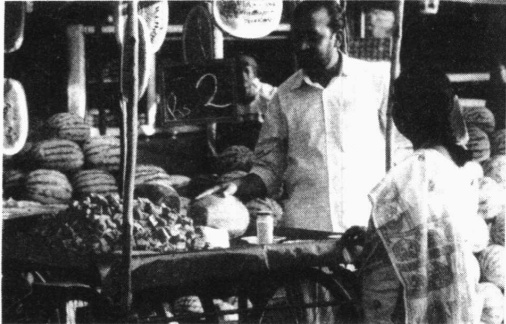

通常意义上的市场指的是人们交换和买卖物品的地方。如此过时的市场形式在工业化程度最低的国家仍然能够找到，例如我曾经到过的印度的海得拉巴。这里的人们把交换物品和金钱看做是一种有益的社会互动。

在于：它们为社会不平等，为一些人积累比他人更多的财富提供了舞台。这一变化的影响一直延续到今天。

犁的发明导致了下一个主要变化。犁耕使食物生产成倍增加，使农业社会开始形成。当越来越多的人从粮食生产中解脱出来，更加专业的劳动分工也便随之而来，结果就是有了更多的剩余产品。随着交换扩大，贸易中心也就发展起来。然后，贸易中心变成了城市。家庭和家族的头人继而成为统治阶级，从而造成了更大的社会、政治和经济不平等。

### 工业社会：机器的诞生

1765年，另一项发明改变了这个世界。以燃料为动力的机器代替了人力和畜力，这带来了不同于历史上任何时期的巨大剩余。在新的工业社会，不平等进一步扩大。少数人开办工厂，剥削很多劳动力。这些工厂的所有者变得很有并能为了他们的个人目的而操纵政治机构。当工人们为提高他们的工作条件而团结起来时，也就为随之而来的流血战争提供了舞台。

后来人们又发明了效率更高的机器。当剩余产品变得更多时，人们慢慢从重视生产物品转变到重视消费物品。1912年，社会学家索尔斯坦·凡勃伦（Thoestein Veblen）用炫耀性消费（conspicuous consumption）这个术语描述了人们生活倾向中的这个变化。凡勃伦认为韦伯所定义的新教伦理（注重努力工作、节俭和对人类灵魂的拯救），正在被一种通过铺张消费来炫耀财富的渴望所代替。

### 后工业社会：信息时代的来临

1973年，社会学家丹尼尔·贝尔（Dianel Bell）宣称一种新型社会正在出现。这种新型社会，他称之为后工业社会，有六个特征：（1）有一个巨大的服务业部门，大部分人都在服务业工作；（2）物品大量剩余；（3）国家之间的广泛贸易；（4）普通人面对更多种类和数量的物品；（5）信息爆炸；（6）地球村——即世界上的国家被快速的通讯、传输和贸易联系在一起。下面的“社会学和新技术”专栏中讨论了地球村相互连接得有多密切。

---

社会学和新技术

“你叫什么名字？住在哪里？但听上去好像你就在隔壁。”

“你好！我是芝加哥的南希·莫里森。需要帮忙吗？”当你就信用卡或预定的某些东西为什么还没到达而询问时，你可能会听到这样的问候。或者你可能会与新泽西州纽瓦克的苏珊·桑德斯交谈。

这毫不稀奇，经常会发生。然而，很有可能的是，你的电话却是被转到远在12800公里外受过严格培训的人员手中。

接电话的这个人名叫尼沙拉·海德拉巴德，也可能是纳拉亚纳·拉姆德斯。她不住在芝加哥或纽瓦克，而是住在印度的班加罗尔。这个声音是如此的完美，以至于从芝加哥和纽瓦克来的人都听不出它有什么不同。在培训过程中，她和她的同事们看电视情节喜剧“六人行”和“每个人都爱雷蒙德”。他们必须能够复述对话，以便掌握英语发音的细微之处。例如，他们必须知道当一个顾客说“不可能，乔斯”时并没有乔斯这个人。

在角色扮演过程中，培训者扮作打进电话来的顾客，并询问他们关于美国电影、电视节目和体育的内容。如果一名顾客问到了他们不熟悉的领域，他们被告知去说：“我们回到正题上好吗？”

印度正在成为“世界办公室”。和许多其他公司一样，通用电气和英国航空公司在班加罗尔建立了巨大的电话接听台，处理顾客大量的日常咨询。当我呼叫一个美国在线的技术支持的时候，我半开玩笑地问技术人员他是否住在印度。他说他住在班加罗尔，而且骄傲地告诉我班加罗尔的科技是多么发达。

我们发现，印度的这些公司非常具有竞争力。那些接电话的大学毕业生比其他印度人能拿到更高的薪水。他们一般一年能挣1600—2100美元。\[Based on Landler（2001）]

### 思考题

技术是怎样影响地球村的？一个印度电话工作人员假扮为美国人，你认为这是公平的商业实践吗？苏珊和南希是在被跨国公司剥削吗？还是受益于它们？

### 生物经济社会：生物学和经济学的结合

由于生物学的发展，特别是2001年人类基因系谱的破解，我们可能快要进入另一个新型社会。尽管这个新型社会的具体特征还不清楚，但生物学和经济学的联姻却将会生产出更多的剩余产品和更广泛的贸易。这种社会也可能会导致人们拥有更长的寿命和更健康的身体。然而历史告诉我们，它同样也会在富国与穷国之间制造出更大的不平等。

社会中广泛的变迁看起来可能有些抽象，但是它们并非与你的生活毫不相干。每当社会发生变革，我们的生活也会发生改变。考虑一下知识爆炸。当你大学毕业时，你将会做某种形式的“知识工作”。你不是在工厂里工作，而是将去管理信息或者设计、出售商品和进行服务。你从事的这种工作将使你生活的含义更加复杂。它产生了社会网络，培养出态度，甚至影响到你的人生观和世界观。

这与地球村是一样的。它把世界分为三部分——工业化的三个世界和后工业化我们已经在第9章讨论过了。一些国家和民族正处在这个村庄的贫困区。他们的公民从事枯燥的工作以勉强糊口。他们中的一些人甚至被饿死。相反在毗邻的富裕区，他们的村民则享受着地球上提供的最好的东西。同样一个村庄，但却有着如此大的差别。

---

现在想象一下这三个部分中的任何一个，你将再次看到所存在的严重的不平等。并不是生活在贫困区的每个人都是贫穷的，富裕区的一些地方同样也聚集着穷人。因为美国是全球经济的领导者，它占用着最豪华的大厦并一直在引导生物经济的发展，就让我们来看一看美国的发展趋势。

### ☑交换媒介的转变

随着每种经济形态的演变,交换媒介(medium of exchange)同样也在变化。交换媒介是指人们衡量货物和服务的价值并进行交换的手段。当我们回顾这种转变时,你将发现,交换媒介不仅反映了一国发展的程度,而且有助于国家的发展。

### 最早的交换媒介

在狩猎、采集和园艺社会，剩余产品的缺乏意味着几乎没有贸易。那时候交换的任何物品都是以物物交换(barter)进行的。后来，剩余产品的出现刺激了贸易，人们需要一个估价商品和服务的新方式，以利于人们交换。让我们看看交换媒介是如何改变的。

### 农业社会的交换媒介

虽然直接的物物交换在农业社会仍然存在，但是人们渐渐开始使用起货币(money)，一种可以衡量其它物品价值的交换媒介。在大多数地方，货币包括金银铸币。一枚铸币的重量和纯度，决定了它可以交换的物品和服务的数量。在一些地方，人们使用存单(deposit receipts)进行交换。这些存单之间的交换，改变了存放在银行或仓库里的一定数量的黄金或谷物，或者其他物品的所有权。在农业社会的末期，存单变成了纸币(currency)。每张纸币都代表着储存在仓库里的一定数量的金银。纸币或存单代表着储存的价值(stored value)。被发行的纸币或存单不能多于储存在仓库里的金银。金银铸币仍然继续与纸币和存单同时流通。

### 工业社会的交换媒介

毫无疑问，在工业社会，直接的物物交换已成为过去。黄金被纸币所取代，并且这种纸币可以兑换成储存在美国诺克斯堡的黄金。这种政策叫做金本位(gold standard)，只要每一美元都代表了一定数量的黄金，那么被发放的纸币数量就会受到限制。在这个时期的末期，美国纸币不再与金银相兑换。相反，政府发行了不以储存价值为依托的法定货币(fiat money)。

当法定货币代替了储存价值，由稀有金属做成的铸币就从流通领域消失了。人们认为这种铸币更加珍贵，而且他们不愿遗弃这些铸币。金币首先消失，其次是最大面额的一美元银币。然后，随着低廉金属(铜、锌、镍)代替了较小面额的银币，人们开始积存这些银币。这样，它们也从流通领域中消失了。

即使没有一个可以按照储存价值来限制纸币发行的金本位政策，政府也能对发行纸币的数量进行切合实际的限制。一般来讲，如果纸币发行率高于国内生产总值（GDP）的增长，价格就会上升。这种状况叫做通货膨胀（inflation），即每一单位纸币能够交换更少的货物和服务。政府会尽力控制通货膨胀，因为高通胀会造成不稳定的影响。

---

图 14.1 下降的美元价值

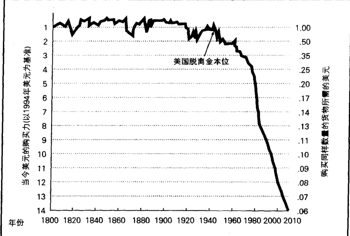

资料来源：根据 Alternative Investment Market Letter, 1991 年 11 月整理而成。

从图 14.1 可以看出，只要金本位政策限制了纸币发行量，美元的购买力就会保持相对稳定。当美国在 1937 年不再使用金本位，美元不再代表储存价值时，美元的价值便骤然下降。今天，美元仍然保留着以前美元的痕迹，但其购买力仅为原来的 7%。

在工业社会，使用支票变得很普通。一张支票实际上就是一种存单。因为它是一种承诺：写支票的人已经在仓库（银行或信用单位）存放了足够的货币来兑付支票。在工业社会后期，信用卡（credit card）开始出现。信用卡允许它的所有者不用直接使用货币（包括金属、纸币和支票）购买物品。信用卡的持有者为账单付账。

### 后工业社会的交换媒介

在后工业(或信息)社会初期，纸币仍然可以自由流通。但是纸币变得越来越少见，它正在逐渐被支票和信用卡所取代。下一步的发展是借记卡(debit card)，一种电子消费方式，可以从持卡人的银行户头中收取款项。同支票一样，借记卡是一种存单，因为它可以转让储蓄的货币所有权。

货币的最后形态是电子货币。电子货币(e-cash)由可以储存在所有者计算机上的数字货币所组成。电子货币可以通过因特网或电子信箱发送。事实上，这种新的交换媒介是信息爆炸的一部分。

### 世界经济体系

既然我们已经梳理了历史上主要的经济变革，现在我们就来比较一下社会主义与资本主义两种经济体系。表 14.1 概括了这一讨论的内容。

---

表 14.1 社会主义和资本主义对比

<table border=1 style='margin: auto; word-wrap: break-word;'><tr><td style='text-align: center; word-wrap: break-word;'>社会主义</td><td style='text-align: center; word-wrap: break-word;'>资本主义</td></tr><tr><td style='text-align: center; word-wrap: break-word;'>1. 生产资料公有</td><td style='text-align: center; word-wrap: break-word;'>1. 个人占有生产资料</td></tr><tr><td style='text-align: center; word-wrap: break-word;'>2. 中央委员会计划生产；没有竞争</td><td style='text-align: center; word-wrap: break-word;'>2. 所有者在竞争的基础上决定生产</td></tr><tr><td style='text-align: center; word-wrap: break-word;'>3. 商品和服务的分配中没有利润的刺激</td><td style='text-align: center; word-wrap: break-word;'>3. 分配商品和服务的目的是追求利润</td></tr></table>

### 资本主义

生活在资本主义社会的人们可能并不理解它的基本原则，即使人们从当地超市和快餐连锁店中看到了这些原则。如果我们从美国众多行业中总结它们的基本方面，我们会看到资本主义（capitalism）有三个基本特征：1，生产资料的私人占有（个人拥有土地、机器和工厂，并决定生产什么）；2，市场竞争（买者和卖者之间的物品交换）；3，追逐利润（以高于物品价值的价格出售商品）。有人认为美国是纯粹资本主义的典型范例，纯粹资本主义也叫自由放任资本主义（laissez-faire capitalism，字面意思是“不许干涉”），指政府不干预市场的运作。然而，美国的情况却并非如此。目前美国资本主义的形式是福利或国家资本主义（welfare or state capitalism）。虽然私人是在一个庞大的法律体系内占有生产资料并追求利润，但这个法律体系却旨在保护全体公众的福利。让我们看看下面这个例子：

假设你发现了一种神奇的保健品：它能使人长头发、消除皱纹和减肥。如果你的产品有效，你将在一夜之间轰动全国，不仅成为百万富翁，还会成为电视谈话节目和好莱坞的红人。

但是先不要考虑你的金钱和名气。你仍然不得不考虑市场的限制，那些能够限制你生产和销售能力的福利资本主义的法律和规则。首先，你必须遵守当地和州的规则。你必须持有一个营业执照和一个州税收号码，这样在购买原料时就不必缴纳销售税。接着是联邦法律，你不能简简单单就把货物带到当地商店并出售它们。你首先必须得到监督执行《联邦食品和药物法》的联邦管理机构的批准。这意味着你必须证明你的产品对大众没有伤害。此外，你必须能够证实你的宣传疗效，否则你的工厂将因诈骗行为被州和联邦管理机构关闭。你的生产过程同样受制于与卫生和危险废物处理有关的联邦、州和当地的法律。

假如你克服了这些障碍，而且你的生意蒸蒸日上。其他联邦机构也将会按照与民族、性别以及残疾人歧视、最低收入保障、社会保险税率有关的法律对你进行管理。州立机构也将检查你的纪录来察看你是否交纳了失业税和销售税。最后，国家税务机构将会盯着你，并要求你上缴35%的利润。

要想了解福利或国家资本主义在美国是如何发展的，就要回溯到更早的时期。当资本主义在19世纪刚发育时，你可能已经在家里制作了“有魔力的”饮品，而且已经有愿意买卖它的经销店出售它。你可能已经刊登广告，说它已经治愈了秃顶、消除了皱纹，而且减肥成功，这些都是因为不存在任何机构来管理你的产品和广告。事实上，这是那个时期成千上万的人所做的事情，他们在其地下室制作灵丹妙药，并给它们起些稀奇的名字，例如“老奶奶灵药”和“健康快乐神丹”。一种产品可以宣称，它能使人恢复性能力，疏通肠胃，而且能使人变得更加聪明。这些保健品通常都会使人们感觉更好一些，因为很多所谓的“灵丹妙药”都包含了酒精，甚至可卡因（Ashley，1975）。(这个时期的可口可乐也是如此，因为直到

---

1903年它都包含着可卡因，这也正是可口可乐中的Coca所指的东西。）为了保护公众的健康，1906年，联邦政府通过了《联邦食品和药物法》，开始规范这些产品。

约翰·洛克菲勒在不规范市场中的成功，有助于解释政府为什么开始干预资本主义。在消除竞争的机制下，洛克菲勒垄断了美国的石油和汽油市场。他会大幅降价，在赶走竞争对手后又涨价一倍。他甚至阴谋破坏竞争者的输油管道和炼油厂（Josephson，1949）。当他的竞争者受到严重损失或消失的时候，他的公司，“标准石油”，就能操纵整个国家的石油价格。洛克菲勒完成了资本家们的梦想——垄断（monopoly），即某一公司对整个行业的控制。

洛克菲勒非常好地玩了资本家的游戏，但他也抹去了资本主义的本质特征之一：竞争。因此，为了保护资本主义的基础，联邦政府通过了《反垄断法》并分解了“标准石油公司”。今天，在每个行业的顶级公司——例如汽车行业的“通用汽车”和家用电器方面的“通用电气”——在兼并同行业另一个公司时，必须得到联邦政府的同意。如果政府发现某个公司在支配市场，它就会强迫这个公司脱离(卖掉)一些业务。

国家资本主义的另一个特征是：虽然政府支持竞争，但是它在所谓“公共物品”项目上却建立了自己的垄断。这些是被认为与公民的公共利益相关的一些行业，例如军火、战争供应物品、高速公路和排水管道。

### 社会主义

社会主义(socialism)也有三个基本要素：(1)生产资料公有制；(2)中央计划；(3)不追求利润的物品分配。

在社会主义经济体系中，政府拥有生产资料。它不仅拥有工厂，还拥有土地、铁路、油井和金矿。在资本主义社会，市场力量（market forces，即供求关系）决定了将要生产什么和价格怎样变化，与之不同的是，社会主义社会有一个中央委员会决定生产的产品和价格。这个委员会决定了国家需要多少牙刷、厕所用品和鞋子。它同样也决定了哪个工厂生产它们，不同型号的价格怎样确定，以及它们将要在哪里分配。

社会主义被设计成消除竞争，因为商品是按预定价格出售的，与某项需求或生产成本无关。利润并不是其目标，在低需求期通过降价鼓励消费及在供应紧张期通过涨价限制消费也都不是其目标。相反，其目标是为公共福利生产物品，并按人们的需要而非其支付能力进行分配。

在社会主义经济中，每个人都为政府工作。制定生产目标的中央委员会的成员是政府雇员，实施这些目标的监督者、工人、司机以及售货员也是政府雇员。那些购买这些商品的人可能工作在不同领域（如在机关、农场或托儿所），但是他们也都是政府雇员。

就像资本主义不是单一的形式一样，社会主义也不是单一的。虽然社会主义的意识形态要求资源按照需要而非支付能力进行分配，但是，与第9章中功能主义者所主张的社会分层观点相吻合，社会主义国家发现，为某些工作提供较高的收入是十分必要的，只有这样，才能使有能力的人更有责任心。结果，在社会主义国家，工厂管理者通常比工人挣的钱更多。努力缩小巨大的收入差距是资本主义国家的特征，但社会主义国家却出现了更大的收入不平等。

由于一方面不满资本主义的贪婪和剥削，另一方面不满社会主义中自由和个性的缺乏，瑞典和丹麦发展了民主社会主义(democratic socialism，又叫福利社会主义，welfare socialism)。在这种形式的社会

---

主义中，国家和个人都在生产、分配商品和服务。政府拥有和管理钢铁、矿产、森林和其他能源，也包括全国的电话、电视台和机场。私人则拥有零售店、农场、工厂和大部分服务业。

### 资本主义与社会主义意识形态

资本主义和社会主义不仅在产品的生产和分配上有不同的特征，而且它们还代表着不同的意识形态。资本家认为应该由市场力量决定生产和价格，他们也认为贪婪是好的。对他们来说，追求利润没有错，因为这将激励他们不断创造新的产品。下面的“社会生活中的大众媒体”专栏考察了资本家是如何为他们的产品创造需求的。

### 社会生活中的大众媒体

### 贪婪是好的——兜售美国梦

广告在我们的生活中变得如此不可缺少，以至于被不断涌现的广告所包围好像成了人类的命运。当我们打开一张报纸或杂志，我们通常都会看到宣传产品和公司的那一版。每当我们打开电视，每半小时就会出现10分钟的广告。一些社会分析家认为，电视的目的是要使人们都看商业广告，而电视节目不过是这项主要工作的陪衬！

广告的力量是如此的强大,它可以刺激我们消费那些我们先前并未感到有什么需要的产品的欲望。充满了小用具的美国厨房,证明了广告的力量。

将人们变成暴食者的广告的力量，远远超过了厨房小用具。很多美国人如果没有洗头并吹干头发，就不会到公共场合去。很多人感到对腋下除臭剂是如此的需要，以至于它掩盖了人出汗的自然需求。对于很多妇女来讲，到公共场合同样要打粉底、擦口红、抹眼影、染眉毛油、涂粉、抹香水。对于很多男人来说，刮须液是必要的。而且仅仅在穿上显示设计者标签的外套之后，美国人才认为他们可以出现在公共场合。

广告不仅影响着我们的身体、我们吃的东西和我们的娱乐，而且影响着我们的自我感觉。关于我们自己是否太胖、太瘦、臀部太大或太丰满，头发是否太油或太干，我们的体毛是否太多或者皮肤是否太粗糙的感觉，大部分都是广告的结果。与每天在商业广告中轮番轰炸我们的完美形象相比，我们的自我形象相形见绌，它使我们相信我们缺乏一些东西。广告向我们保证这是有办法解决的——它们承诺为我们提供我们缺乏的东西。

这个方法既简单又有效: 提供一个不可能实现的理想形象并让我们对自己不满。而且这也确实起了作用, 我们产生了对自己的不满。我们采纳了广告者的解决方式: 我们努力消费公司向我们提供的永不终止的产品, 他们已经决定了我们的需要。

美国梦……是建立在贪婪、不满、诱惑的形象和履行承诺的基础上的。当然，梦想通常与现实并不一致。

相反，社会主义者则认为追求利润是不道德的行为。马克思说，某项物品的价值是建立在生产这项物品的工作的基础上的。他强调，获取利润的唯一方法是付给工人比劳动力价值更低的报酬。因此，利润是工人创造的剩余价值。社会主义者认为政府应该保护工人免受这种剥削。要做到这一点，政府应该占有生产资料，不是用它们生产利润，而是生产人们需要的产品。

这两种意识形态的支持者互相攻击：每一方都认为另一方是一种剥削制度。资本主义者认为社会主义剥夺了人们的基本自由权利。社会主义者则认为资本主义剥夺了人们免于贫穷的基本人权。每一

---

方都标榜自己的优越性而把对方看做是对己方的威胁。因此，在上世纪，世界被划分为两大阵营。在那个所谓的冷战时期，西方保卫自己的资本主义，东方则保卫自己的社会主义。

### 对资本主义和社会主义的批评

对资本主义的主要批评在于它导致了社会不平等。这些批评者认为，资本主义创造了一个很小的有权有势的阶层。这个阶层剥削着大多数处于社会底层的雇佣工人，很多工人处于失业或半失业状态（underemployment，指不得不在你的培训和能力之下工作或者仅仅能够找到一个兼职工作）。另一种批评是这个很小的上层社会掌握着巨大的政治权力。这些占有生产资料的少数人能够获得巨大的利润，掌握强大的权力，而且能够使违背公共利益的法律得以通过。

对社会主义的主要批评是它不尊重个人权利(Berger,1991)。一些人(以政府机关的形式)控制了人们的生活，他们决定了人们在哪里居住、在哪里上学和得到多少报酬。在一些国家，他们甚至决定了妇女可以生多少孩子(Mosher,1983)。批评者同样认为中央计划是低效率的，而且社会主义没有能力生产更多的财富。他们认为社会主义中所谓较大的平等，实际上不过是让每个人同等贫穷。

### 资本主义与社会主义的趋同

姑且不论这些互相批评是否有理，在国家工业化方面，社会主义和资本主义也有相似之处。它们都在进行城市化，有着相似的社会分工，并且都鼓励发展高等教育，甚至显示出相似的价值观(Kerr，1983)。这种趋势将使资本主义和社会主义国家更加相似。但是另一个因素则使它们更加接近(Form，1979)：尽管有着不相调和的意识形态，但是资本主义和社会主义都已开始采纳对方的某些特征。

认为资本主义和社会主义逐渐变得相似的观点被称为趋同理论（convergence theory）。这种观点指出，一种混合经济即将到来。社会主义国家的一个基本变化为趋同理论提供了证据。俄罗斯和中国都曾遭受过劣质商品和商品短缺的侵扰，并且它们的生活标准远远低于西方国家。为了尽快赶上西方国家，俄罗斯和中国于20世纪80年代和90年代重新恢复了市场的作用。它们使私有财产拥有合法性，而且卖掉了很多国有企业。追求利润——以前属于犯罪行为——现在则得到鼓励。他们甚至邀请以前的大敌（西方公司）来开办企业和工厂。关于俄罗斯向资本主义转变的回顾，我们将在下面的“文化多样性”专栏中讨论。

### 世界文化多样性

### 没钱？没问题！前苏联的物物交换

让我们看看正向资本主义转变中的俄国。这

在离 Tserkva 镇大约 80 公里的高速公路上，你会看到沿着高速公路边堆着很多轮胎。一到 Tserkva 镇，黑色轮胎堆得越来越密、越来越高，以至于它们看起来就像是一堵排在路两边浓密的橡胶墙（Brzezinski, 1997）。

是 Tserkva 镇轮胎厂发工资的日子。在资金短缺时，工人们的工资就用轮胎代替。在其它城镇，工人们被付给的是飞机、电视、衣服、甚至是墓碑、性玩具、厕盆。一些被解雇的工人得到了他们的失业救济——肥料（Paddock, 1998；Schmemann, 1998；Powell, 1999）。在伏尔加格勒，工人们被支付的是

---

乳罩。这么多乳罩可以使你去看最近施瓦辛格的电影，或者你可以买一顶帽子、一双鞋、一个冰激凌……

在资金短缺的前苏联地区,不仅个人用物品代

俄罗斯的新资本主义

替现金。在斯摩棱斯克，罐头食品厂用牛肉罐头付税。它用肉罐头来支付宰杀的牛和猪、制作罐头的铝箔、密封肉的设备、开动设备的电和用于运输罐头的硬纸箱(Paddock,1998)。

实物交换链条已经建立起来。乌克兰电力公司收到了以实物形式支付的电费，这些物品包括从军用制服到钢管。这个公司把钢管运给了生产它的俄国公司，那个公司用这些钢管作了自己的管道。那么那些制服呢？它把这些制服付给了俄罗斯国防部代替了税款。

当鞑靼斯坦的公务员早上到市政厅上班的时候，他们发现600辆崭新的卡车停在前面的草坪上。这些卡车都是当地卡车制造工人支付的税款。公务员们还算幸运，卡车至少要比成堆的轮胎和乳罩强多了。

资本主义的变化也支持这个理论。美国已经采纳了很多社会主义国家的实践经验。一个最明显的变化，就是从一些人手中收取资金来补偿另一些人。其中包括失业金(工作者缴纳的税被分配给不再创造财富的人)；住房补贴(这种由许多人负担的庇护所，供那些穷人和老人居住，而不计利润)；福利(把收取的税金分配给需要者)；最低工资(政府，不再是雇主，决定工人的最低工资)；社会保障(退休者拿到的不是自己交付的资金，相反，政府将从在职者中收取资金对他们进行补偿)。这些对许多社会主义原则的采纳，表明美国已经形成了自己一种独特的混合经济类型。

也许，趋同正展开在我们面前。一方面，资本家认为他们的制度应该为工人们在失业、生病和养老期间提供最低生活保障。另一方面，社会主义国家领导者们已经不得不承认，利润和私有制确实能激励人们更加努力工作。

然而，事情并不这么简单。它们互相接受对方的特征，仅仅是我们想象中的一部分，这两个体系离趋同还相距很远。虽然与冷战时期相比，它们的关系已经缓和了很多，但是斗争仍在继续。期望着更加稳定的俄罗斯和波兰人民将共产党重新推上最高统治地位。在美国，共和党试图取消社会主义的政策，重新回到纯粹资本主义的状态，但是遭到民主党的反对。

### 关于资本主义全球化的功能主义观点

“太阳微系统公司”用一个电话号码为全球提供24小时的技术服务。加利福尼亚、英格兰和澳大利亚都组织人马为这个号码提供职员。当另一个国家的人打来电话时，他们组成虚拟团队处理工作。

---

当土耳其的经济陷入困境时，“固特异”公司并没有让它的轮胎在土耳其空闲着。相反，它用精密的轮胎制造技术重新调整了轮胎模型，并出口到了欧洲其它地方。(Zachary,1995)

资本主义全球化可能是过去100年中最有意义的经济变迁。它对我们生活的影响，可与工业革命相媲美。正如一位商业历史学家刘易斯·加兰博斯所说：“这个新的全球商业体系，将会改变我们每个人的生活和工作方式。”(Zachary,1995)

### 新的全球劳动分工

在用功能主义说明资本主义全球化之前，我们必须回过头来先分析一下工作本身。工作对于社会来说是不可缺少的。正是因为工作，我们才有了电、医院、学校、汽车和房子。然而，除了这一明显的观点之外，还有一个基本的社会学观点在于：工作将我们紧密联系在一起。你可以回顾一下第4章，涂尔干认为在农业社会中人们做着相似的工作并在生活的各个方面都是共同的。正因如此，他们用相似的方式来看待这个世界。对于这种通过做相似的活动而产生的团结意识，涂尔干用“机械团结”来定义它。

相反，社会的工业化带来了一个更加广泛的劳动分工。因为人们不再从事同样的工作，所以他们几乎没有感到相互的团结。例如，加利福尼亚的葡萄采摘者可能会感到他们与密苏里州制造飞机的工人几乎没有共同之处。但是，每个工人都承担着一种专门功能，并为他人的福利作出贡献。因为他们就像组成同一个身体的独立组织，涂尔干称这种团结方式为有机团结。

涂尔干观察到了这种后来变成全球化过程的开始阶段。今天，有机团结遍布世界各地。我们现在已经有了全球化的劳动分工，我们每个人都要依靠世界各地的劳动者。住在加利福尼亚或是纽约——甚至是密歇根州——的人，都要依靠东京生产汽车的工人们。同时，日本工人们也要依靠沙特阿拉伯的石油工人、南美洲的船员和为他们的催化炼钢炉提供钯的南非矿工。虽然我们都没有感到一种团结的意识——事实上，我们感到了威胁和敌对——但是相互依赖却将我们紧紧联系在全球经济网内。如果不跨越文化障碍，这个过程是不会发生的。当然，关于这一主题我们将在下面的“文化多样性”专栏中讨论。

### 世界文化多样性

### 在地球村内做生意

资本主义全球化，意味着当生意人在其他文化环境中出售商品时，他们将面对文化障碍。有时候，即使是有经验的公司，也难以突破文化壁垒。例如，通用汽车公司曾成功地在美国市场推出了它的新车Nova，当通用汽车试图向南开拓市场时，墨西哥人偷偷发笑，而且几乎没有人买这种汽车。最终，有人告诉了通用公司这个秘密：在西班牙语中，“No va”是一个完整的句子，它意味着“它不能走”或“它不能工作”。

当福特公司试图在巴西售卖Pinto车时，它的遭遇也没能好到哪去。那里的人们也偷偷地暗笑。原来pinto在葡萄牙语俚语中是“小鸡鸡”的意思。后来福特公司把这款车的名字改成了Corcel，“马”的意思(Archbold and Harmon,2001)。

一些公司试图开发正在增长的墨西哥中间阶层和说西班牙语的美国人的市场，但是这些公司在西班牙语上却屡屡出错。当派克钢笔公司试图翻译“它不会漏进你的口袋而且使你尴尬”时，却被

---

翻译成了“它不会漏进你的口袋而且使你怀孕”。养鸡大王弗朗克·帕杜的可爱的小鸡标语“小鸡虽可爱，养好不容易”，居然被翻译成“小鸡撒娇，男人发飙”。

即使是有很多年跨文化经历的可口可乐公司，同样也出过错。当它第一次试图开发Coke的中国市场时，这个名字的意思是“咬腊蝌蚪”。当美国航空公司以“在皮革中飞行”为广告语来推销配备皮革座椅的头等舱时，他们在墨西哥却碰到了点麻烦。“在皮革中飞行”（vuela eu cuero），按字面意思直译成西班牙语后，含有“一丝不挂地飞行”的意思，或许，这个标语还真能吸引一些人呢。

有的生意人已经成功地避免了这些问题。他们在文化差异中抓住了获益的机会。例如，日本妇女认为在公共厕所里弄出的声音很令人尴尬，为了消除这个可恶的声音，她们用相当于原来2.7倍的水冲厕所（Lori，1988）。当然，这浪费了很多水。一个美国企业家把这种文化特征看成一个机会，他发明了一个可以安装在厕所墙上的电池动力装置。当一名妇女激活这个装置时，它就会发出一段25秒的冲水声音。一个模拟厕所冲水声音的产品在我们的文化中可能是没用的，但是日本人已经购买了成千上万个这种装置。

假设你决定在日本出版一本杂志。你的市场调查显示：一本关于体育英雄的杂志将十分流行。这是毫不惊奇的，你的读者希望你刊登他们的偶像的重要资料、职业生涯和爱好。但是如果你不知道日本人也希望看到他们英雄的血型，你将失去一些重要的东西。他们把这看做是一种占卜出生的标志（Ono，1993）。而且你可能得知日本母亲将他们孩子的脐带储存在木箱中。如果你能得到一个体育明星的脐带，你就能发一笔小财（Shirouzu，1995）。

如果你在日本开了一个高尔夫班，你就需要理解为什么打高尔夫的人害怕一杆进洞。这将使他们有责任为他的伙伴去购买昂贵的礼物、开一个酒会并栽一棵纪念树来为他们的“快乐”做标志。企业家也抓住了这个文化机遇。为了避免这个大灾难，他们用100美元提供5000美元的单洞保险(Hardy,1993)。

### 法人公司的所有权和管理

资本主义正在加速今天的全球性相互依赖。作为世界支配性的经济力量，它的成功可以被追溯到一个被称为法人公司的社会创新。一个法人公司（corporation）是一个依法被作为一个人对待的企业。一个法人公司可以签订合同、承担债务、起诉和被起诉。例如，福特汽车公司的每位股东——无论他或她有1股还是10万股——都拥有这个公司的一部分。然而，负责履行合同和偿还债务的却是福特，而不是它的个人拥有者。为了说明现在法人公司是如何支配经济的，社会学家采用了“法人资本主义”（corporate capitalism）这个概念。

但是，法人公司最令人惊奇的功能之一，是其所有权和经营权相分离。不同于大部分企业，并不是董事们（那些拥有公司股票的人）管理着公司的日常事物。相反，经理们运作着法人公司，而且他们能够把公司当做自己的事情来处理（Walters，1995；Sklair，2001）。其结果就是：“拥有财富的不直接管理，直接管理财富的人则无拥有权”（Berle and Meas，1932）。社会学家迈克尔·尤西姆（Michael Useem，1984）这样写道：

当少数人掌握着一个法人公司的所有或大部分股票时，他们就会很方便地支配着董事会，董事会再选择高层领导者。但是当一个公司的股票被分散在很多不相关的所有者手中时，每个董事都掌握着所有普通股的一小部分。由此造成的权力真空，允许管理层来选择董事会成员，而管理层则产

---

生了自我维持机制，并在实际上控制着公司。

管理层决定他们自己的薪水，订立目标和他们的分红，批准市场调查，雇佣广告代理，决定市场战略，商谈兼并事宜。管理层对所有者首要的责任是创造利润。

使这种所有权和经营权相分离的是利润。当股份的选择和分红与公司的运行联系在一起的时候，管理者受到了相当大的激励来创造利润。在年度董事大会上，所有者考虑公司的重大事务(包括董事会的选举)并审查公司账目和计划。只要管理层报告了好的效益，董事们就会赞同他们的计划和建议。不同意的情况一般是不会发生的，一旦发生就叫持股者闹反(stockholders'revolt)。这种情况一般很少见到，但请记住，在这种情况下，不是工人而是拥有者在进行闹反。

在追求利润的过程中，公司到处寻找市场。“美泰”公司令人吃惊的成功是芭比娃娃，它一年可以带来超过十亿的利润，并且已经产生了大量的模仿者。“布拉兹”（Bratz）公司的洋娃娃比芭比娃娃更时髦、更酷，它们有着Cloe、Jade、Sasha和Yasmin这样的名字，并且已经证明“美泰”的成功只是制造了自己的“城市底层流行的”色情玩具。这两种洋娃娃反映了美国社会的基本变化。你认为它们反映的是什么变化呢？

### 全球范围的功能

资本主义全球化正在导致一个新的世界结构。三个主要区域正在出现：由美国控制的南北美洲；由德国控制的欧洲；由日本控制的亚洲。功能主义者强调这个新的全球分化不仅使跨国巨头受益，而且使全世界人民受益。

再看看自由贸易。自由贸易导致了更大的竞争，这种竞争使人们寻求更高的生产力，这也降低了价格，带来了更高的生活水平。自由贸易同样也有反功能。当生产移向劳动力价格低的国家时，成千上万的美国、英国、法国和德国工人就会失业。功能主义者指出，这仅仅是一个暂时性的混乱。当最发达的工业国家失去了生产性的工作，他们的工人就转到服务业和高科技产业。这时，一些工业化程度最低的国家就被给予了更多的工作机会和一个更好生活的机会。

### ☑关于资本主义全球化的冲突论观点

冲突理论家认为，把关注的焦点放在全球互相依赖上并没有抓住要点。我们应该看看财富是怎样以工人利益的牺牲为代价的。让我们看看这意味着什么。

### 法人资本主义的内圈

跨国公司(multinational corporations, 跨越国家边界开办的公司)是由迈克尔·尤西姆所称作的“内圈”领导的。这个圈子的成员虽然也存在着互相竞争, 但是他们因为资本主义中体现出的共同利益而团

---

结在一起(Mizruchi and Koening, 1991; Sklair, 2001)。在他们自己国家，他们与高层政治家谈判，通过有利于大公司的法律，并成为最有影响的基金会和大学的理事。他们也提升了支持财产私有的政治候选人的地位。在全球范围内，他们宣扬资本主义意识形态，把资金从一个国家移往另一个国家，为的是获取更多、更直接的利益。

表 14.2 列出了世界上效益最好的跨国公司，你可以看出美国是怎样支配世界贸易的。在这 25 个公司中，美国有 16 个。其他没有任何一个国家可以接近这个数字。另外 9 个公司分布在 7 个国家。

表 14.2 世界上效益最好的跨国公司

<table border=1 style='margin: auto; word-wrap: break-word;'><tr><td style='text-align: center; word-wrap: break-word;'>名次</td><td style='text-align: center; word-wrap: break-word;'>公司</td><td style='text-align: center; word-wrap: break-word;'>国家</td><td style='text-align: center; word-wrap: break-word;'>利润（亿美元）</td><td style='text-align: center; word-wrap: break-word;'>员工（人）</td></tr><tr><td style='text-align: center; word-wrap: break-word;'>1</td><td style='text-align: center; word-wrap: break-word;'>埃克森美孚</td><td style='text-align: center; word-wrap: break-word;'>美国</td><td style='text-align: center; word-wrap: break-word;'>153</td><td style='text-align: center; word-wrap: break-word;'>98000</td></tr><tr><td style='text-align: center; word-wrap: break-word;'>2</td><td style='text-align: center; word-wrap: break-word;'>花旗集团</td><td style='text-align: center; word-wrap: break-word;'>美国</td><td style='text-align: center; word-wrap: break-word;'>141</td><td style='text-align: center; word-wrap: break-word;'>268000</td></tr><tr><td style='text-align: center; word-wrap: break-word;'>3</td><td style='text-align: center; word-wrap: break-word;'>通用电气</td><td style='text-align: center; word-wrap: break-word;'>美国</td><td style='text-align: center; word-wrap: break-word;'>137</td><td style='text-align: center; word-wrap: break-word;'>310000</td></tr><tr><td style='text-align: center; word-wrap: break-word;'>4</td><td style='text-align: center; word-wrap: break-word;'>荷兰皇家壳牌石油</td><td style='text-align: center; word-wrap: break-word;'>荷兰</td><td style='text-align: center; word-wrap: break-word;'>109</td><td style='text-align: center; word-wrap: break-word;'>91000</td></tr><tr><td style='text-align: center; word-wrap: break-word;'>5</td><td style='text-align: center; word-wrap: break-word;'>阿尔特里亚</td><td style='text-align: center; word-wrap: break-word;'>美国</td><td style='text-align: center; word-wrap: break-word;'>86</td><td style='text-align: center; word-wrap: break-word;'>175000</td></tr><tr><td style='text-align: center; word-wrap: break-word;'>6</td><td style='text-align: center; word-wrap: break-word;'>英国石油</td><td style='text-align: center; word-wrap: break-word;'>英国</td><td style='text-align: center; word-wrap: break-word;'>80</td><td style='text-align: center; word-wrap: break-word;'>110000</td></tr><tr><td style='text-align: center; word-wrap: break-word;'>7</td><td style='text-align: center; word-wrap: break-word;'>瑞辉</td><td style='text-align: center; word-wrap: break-word;'>美国</td><td style='text-align: center; word-wrap: break-word;'>78</td><td style='text-align: center; word-wrap: break-word;'>90000</td></tr><tr><td style='text-align: center; word-wrap: break-word;'>8</td><td style='text-align: center; word-wrap: break-word;'>国际商用机器</td><td style='text-align: center; word-wrap: break-word;'>美国</td><td style='text-align: center; word-wrap: break-word;'>78</td><td style='text-align: center; word-wrap: break-word;'>320000</td></tr><tr><td style='text-align: center; word-wrap: break-word;'>9</td><td style='text-align: center; word-wrap: break-word;'>美国电话电报</td><td style='text-align: center; word-wrap: break-word;'>美国</td><td style='text-align: center; word-wrap: break-word;'>77</td><td style='text-align: center; word-wrap: break-word;'>118000</td></tr><tr><td style='text-align: center; word-wrap: break-word;'>10</td><td style='text-align: center; word-wrap: break-word;'>微软</td><td style='text-align: center; word-wrap: break-word;'>美国</td><td style='text-align: center; word-wrap: break-word;'>74</td><td style='text-align: center; word-wrap: break-word;'>48000</td></tr><tr><td style='text-align: center; word-wrap: break-word;'>11</td><td style='text-align: center; word-wrap: break-word;'>默克</td><td style='text-align: center; word-wrap: break-word;'>美国</td><td style='text-align: center; word-wrap: break-word;'>73</td><td style='text-align: center; word-wrap: break-word;'>78000</td></tr><tr><td style='text-align: center; word-wrap: break-word;'>12</td><td style='text-align: center; word-wrap: break-word;'>西南贝尔电讯</td><td style='text-align: center; word-wrap: break-word;'>美国</td><td style='text-align: center; word-wrap: break-word;'>72</td><td style='text-align: center; word-wrap: break-word;'>193000</td></tr><tr><td style='text-align: center; word-wrap: break-word;'>13</td><td style='text-align: center; word-wrap: break-word;'>埃尼(ENI)</td><td style='text-align: center; word-wrap: break-word;'>意大利</td><td style='text-align: center; word-wrap: break-word;'>69</td><td style='text-align: center; word-wrap: break-word;'>71000</td></tr><tr><td style='text-align: center; word-wrap: break-word;'>14</td><td style='text-align: center; word-wrap: break-word;'>道达尔菲纳埃尔夫</td><td style='text-align: center; word-wrap: break-word;'>法国</td><td style='text-align: center; word-wrap: break-word;'>69</td><td style='text-align: center; word-wrap: break-word;'>122000</td></tr><tr><td style='text-align: center; word-wrap: break-word;'>15</td><td style='text-align: center; word-wrap: break-word;'>美洲银行</td><td style='text-align: center; word-wrap: break-word;'>美国</td><td style='text-align: center; word-wrap: break-word;'>68</td><td style='text-align: center; word-wrap: break-word;'>143000</td></tr><tr><td style='text-align: center; word-wrap: break-word;'>16</td><td style='text-align: center; word-wrap: break-word;'>沃尔玛商店</td><td style='text-align: center; word-wrap: break-word;'>美国</td><td style='text-align: center; word-wrap: break-word;'>67</td><td style='text-align: center; word-wrap: break-word;'>1383000</td></tr><tr><td style='text-align: center; word-wrap: break-word;'>17</td><td style='text-align: center; word-wrap: break-word;'>范妮梅</td><td style='text-align: center; word-wrap: break-word;'>美国</td><td style='text-align: center; word-wrap: break-word;'>59</td><td style='text-align: center; word-wrap: break-word;'>4500</td></tr><tr><td style='text-align: center; word-wrap: break-word;'>18</td><td style='text-align: center; word-wrap: break-word;'>强生</td><td style='text-align: center; word-wrap: break-word;'>美国</td><td style='text-align: center; word-wrap: break-word;'>57</td><td style='text-align: center; word-wrap: break-word;'>102000</td></tr><tr><td style='text-align: center; word-wrap: break-word;'>19</td><td style='text-align: center; word-wrap: break-word;'>汇丰控股</td><td style='text-align: center; word-wrap: break-word;'>英国</td><td style='text-align: center; word-wrap: break-word;'>54</td><td style='text-align: center; word-wrap: break-word;'>170000</td></tr><tr><td style='text-align: center; word-wrap: break-word;'>20</td><td style='text-align: center; word-wrap: break-word;'>美国国际集团</td><td style='text-align: center; word-wrap: break-word;'>美国</td><td style='text-align: center; word-wrap: break-word;'>53</td><td style='text-align: center; word-wrap: break-word;'>81000</td></tr><tr><td style='text-align: center; word-wrap: break-word;'>21</td><td style='text-align: center; word-wrap: break-word;'>巴斯夫(BASF)</td><td style='text-align: center; word-wrap: break-word;'>德国</td><td style='text-align: center; word-wrap: break-word;'>52</td><td style='text-align: center; word-wrap: break-word;'>93000</td></tr><tr><td style='text-align: center; word-wrap: break-word;'>22</td><td style='text-align: center; word-wrap: break-word;'>百时美施贵宝</td><td style='text-align: center; word-wrap: break-word;'>美国</td><td style='text-align: center; word-wrap: break-word;'>52</td><td style='text-align: center; word-wrap: break-word;'>46000</td></tr><tr><td style='text-align: center; word-wrap: break-word;'>23</td><td style='text-align: center; word-wrap: break-word;'>中国石油天然气</td><td style='text-align: center; word-wrap: break-word;'>中国</td><td style='text-align: center; word-wrap: break-word;'>50</td><td style='text-align: center; word-wrap: break-word;'>1167000</td></tr><tr><td style='text-align: center; word-wrap: break-word;'>24</td><td style='text-align: center; word-wrap: break-word;'>丰田汽车</td><td style='text-align: center; word-wrap: break-word;'>日本</td><td style='text-align: center; word-wrap: break-word;'>40</td><td style='text-align: center; word-wrap: break-word;'>247000</td></tr><tr><td style='text-align: center; word-wrap: break-word;'>25</td><td style='text-align: center; word-wrap: break-word;'>葛兰素史克</td><td style='text-align: center; word-wrap: break-word;'>英国</td><td style='text-align: center; word-wrap: break-word;'>45</td><td style='text-align: center; word-wrap: break-word;'>107000</td></tr></table>

资料来源：2003年《财富》500强名单。

如果这些巨头公司不能获得垄断，它们就会组成寡头垄断(oligopoly)，即几个大的公司控制一个行业，例如石油、早餐麦片和电灯泡。如果它们完成了寡头垄断，他们就可以瓜分整个市场，并规定其产品

---

的质量和价格。为了通过能给予它们特殊税率的法律，寡头们也会加强自身与政治的联系(有人认为它们会“收买”政治家)。

资本主义中更加重要(有人认为是更加邪恶)的发展趋势之一,是不同国家的大公司的合并。合并(或者说一个公司买下另一个公司)减少了竞争,这也使得订立价格、质量和打败弱小竞争者更加容易。简而言之,合并加强了跨国公司的力量,并使其更容易控制国际市场。

力量的巩固是这些跨国公司的首要目标。内圈者寻找可以合作的政治家并同他们建立起友好的关系。如果他们发现了敌对力量，有时他们甚至会采取阴谋暗杀或颠覆政府的手段。1973年，美国电话电报公司参与了中央情报局阴谋推翻智利民选政府的活动。他们首先试图造成智利经济的瘫痪。当他们失败的时候，他们就阴谋发动了政变，导致智利总统萨尔瓦多·阿连德被谋杀(Coleman，1995；Rohter，2002)。

美国的经济力量与美国政府联系得如此密切，以至于内圈者甚至可以使美国总统推销他们的产品。如果这听起来有些夸张，请看下面这份来自“美联社”的报道(1995年10月29日)：

白宫在星期二祝贺与沙特阿拉伯签定60亿美元的美国飞机交易，宣称这是美国制造商和克林顿政府的胜利……克林顿政府帮助安排了这场销售……沙特阿拉伯国防和航空部长宾·班达尔·苏尔坦王子认为，是克林顿促成了这场交易。克林顿个人向沙特阿拉伯国王宾·阿布杜勒·阿齐兹·法哈德宣扬了美国飞机的质量。（斜体字为作者所加）

……克林顿政府为这场销售作了很多非常努力的工作，因为总统致力于推动美国的海外贸易……总统已经习惯于指示他的大使和外交官在外交活动中把美国的经济利益作为头等大事。

虽然总统并没有卖牙膏，但其道理是一样的。

简而言之，跨国公司领导者的利益与政治高官的利益是一致的。政府高官们致力于提高经济领导者的利益，他们一起组成了权力精英。为了保护他们的资源和市场，他们为政权提供武器来维护他们的利益，并武力镇压威胁他们的国家。我们将在下一章再讨论这个问题。

### 联合董事

冲突理论家强调，这些精英通过联合董事(interlocking directorates)来加强他们的权力(Mizruchi and Koenig, 1991; Sklair, 2001)。这些精英们同时担任几个公司的董事。在这个公司的伙伴成员同时也是其它公司的董事之一。就像一个蜘蛛网一样，从中心开始向各个方向扩散，顶级公司被连接在这个网内(Mintz and Schwartz, 1985)。同时担任其他六家公司董事的一位英国首席执行官曾这样说道：

比如，如果你在六家公司董事会兼职，每个董事会都有10个董事，其中有5个是某个领域内的专家，并且你每个月都能遇到这些专家，这样，你就有了一个有着30个专家朋友的交际网，你就能接触到更多的思想和信息。这就是说，你正在加入一个俱乐部，一个非常好的俱乐部。（Useem，1984）

这种权力的集中，使竞争达到了最小化，因为一个董事不会同意对她或他拥有股票的公司有害的计划。那些在美国高级公司的执行官们是强大的资本家阶层的一部分，这在第10章已经讲过了。他们在娱乐场所的共同活动和聚会，也强化了他们的团结、目标和命运(Domhoff，1999)。

---

### 全球性的投资

然而，跨越国界的投资并非只有美国才能做到。如果你从纽约的兰登书屋买了一本书，你可能正与贝塔斯曼（一家德国公司）做交易。举办著名的感恩节游行的梅西百货，为加拿大甘皮奥公司所有。如果你买了一包图姆斯钙片，你就正在从一个老牌美国公司那里购买产品，但现在这个公司属于比彻姆集团，它是一家英国公司。

虽然我们现在认为跨国公司的存在（包括它们丰富的产品）是理所当然的，但它们的力量和存在，对于世界来说却是个新生事物。当跨国公司越过国界做生意的时候，它们就与原来国家的价值和利益离得越来越远。高露洁公司的一名执行官说：“美国政府不能自动要求利用我们的资源，我们也并非一定要把美国的利益放在第一位。”（Greider，2001）出于对利益的考虑，这些公司将投资和生产从一个地方移到另一个地方。他们并不关心他们增加或减少投资会对工人产生怎样的影响。利润作为它们道德的向导，跨国公司的良心被美元符号所支配。

对利益和市场份额的倾心，而不是对某一个国家的忠诚，以及全球相互联系的网络，这些都具有很高的社会学意义。然而，这种取向和组织的转变是如此新颖，以至于我们还不能理解它背后隐藏的意义。但我们可以先看两个鲜明的对照。首先，消除了种族忠诚和国家界别，跨国公司的紧密联系，可能是推动全球和平的一种力量。其次，它们能够创造一个被少数公司领导者所支配的世界新秩序。假如真是这样，我们就会发现自己处在全球精英的控制之下，并且这个紧密联系的社会被跨国公司巨头所控制。我们将在下一章讨论这一可能性。

### 美国社会的工作

在广阔的全球背景下,让我们把焦点转向美国社会的工作。

### 农业的下降和向后工业社会的转变

在本书很多地方，我都是用后工业社会这个概念来描述美国。图 14.2 例证了为什么这个概念是恰当的。这个图显示出了人类历史上前所未有的变化。在 19 世纪，大部分美国人都是农民，今天，农民大约只占劳动力的 2%。在 19 世纪的科技条件下，一个农民生产的食物仅能养活 5 个人。然而，由于今天强大的机械化和杂交种子，一个人可以养活 80 个人。1940 年，大约一半美国工作者身着蓝领。然而，科技进步使得蓝领工作的市场不断萎缩，白领工作的数量则持续上升，并达到了今

图 14.2 美国劳动力的革命性变化

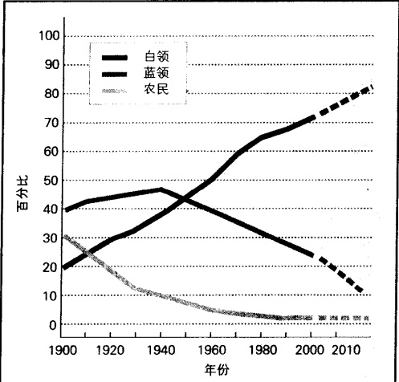

注：1900—1940年间，工人主要是14岁及以上的人，从1970年开始则主要是16岁及以上的人。虚线部分是作者的预测。资料来源：作者根据历年美国的Statistical Abstract和Statistical Abstract 2002: Table 590整理而成。

---

天的支配地位。图 14.2 显示了这一向新社会的大转型。因为这一转型，你的生活也与以前有所不同：不仅你的工作和生活方式发生了转变，你的态度甚至你的世界观也发生了转变。

### 妇女和工作

美国劳动力的主要特点之一，是为工资而外出工作的妇女数目在逐渐上升。在过去一个世纪，这个数目一直在稳步增长。到今天，几乎两个美国工作者中就有一个是妇女。从图 14.3 可以看出，美国和加拿大的劳动妇女百分比是最高的，其次是瑞典。

图 14.3 各国劳动妇女就业百分比是多少？

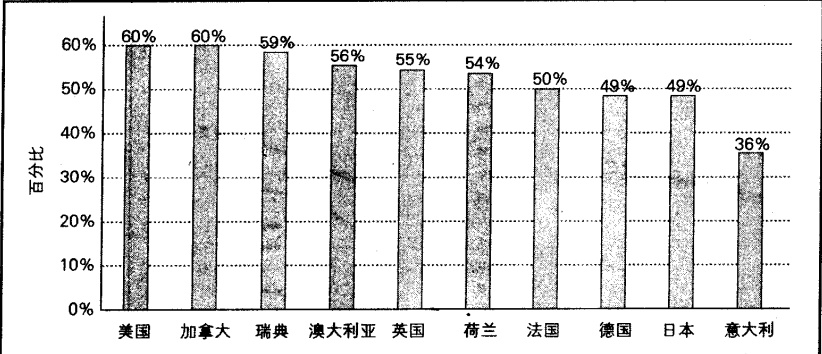

资料来源：作者根据 Statistical Abstract 2002: Table 1336 整理而成。

研究者发现，在工作方面，男人和女人有两个主要的不同。首先，妇女比男人更关心工作和家庭之间的平衡(Statham et al., 1988)。其次，男人和女人会倾向于遵循不同的成功模式：男人们强调个人主义、权力和竞争，而女人们则更可能强调合作、劝服和帮助(Miller-Loessi, 1992)。这为妇女造成了一个进退两难的困境，因为为了事业成功，她们必须在一定程度上接受男人的模式。当然，这些发现只是代表了某种趋势。虽然它们描述了男女的普遍特点，但很多人仍然与此不同。

妇女有多大可能参加工作，要依几个因素而定。图 14.4a 显示：随着教育水平的提高，妇女外出工作的比例也在增加。这可能是因为受过较高教育的妇女找到了更满意的工作，并得到了更高的报酬。图 14.4b 显示了婚姻身份的影响。你可以看到单身女人是最可能出去工作的，结婚的妇女紧随其后，离婚的、寡居的和分居的妇女是最不可能去工作的。从图 14.4c 可以看出，种族几乎没有影响，而且图上的各条线几乎是平行的。

就像第11章所讨论的那样，妇女们在工作中会受到歧视。第407页的“现实社会学”专栏描述了妇女们怎样应付这种歧视。

因为变迁是逐渐的而且具有深远的影响，所以社会学家用“静悄悄的革命”一词，来描述如此多的妇女加入工作行列所带来的结果。这已经导致了家庭消费形式、劳动关系、自我观念和与男朋友、丈夫、孩子之间的关系的转变，所有这些都伴随着观念的根本变化。这里我将仅仅列出一个例子。以前，有学前

---

图 14.4 美国劳动力中妇女的比例

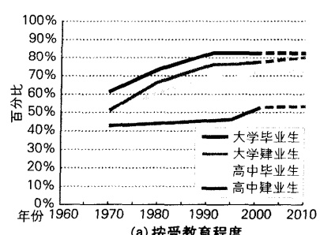

(a) 按受教育程度

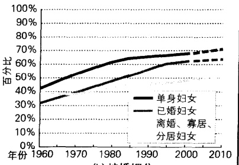

(b) 按婚姻分

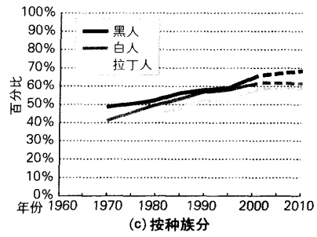

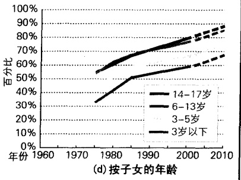

注：虚线部分是作者的预测

资料来源：作者根据 Statistical Abstract 1989: Table 640, Statistical Abstract 2002: Table 501, 561, 564, 569, 570 整理而成。

孩子的妇女出去工作是不受欢迎的，这甚至被认为是不道德的。这些妈妈只有在别无选择时才会这么去做。从图14.4d中你可以看出有学前孩子的工作妇女比例正在逐渐增加。从这个图中你同样可以看到，当孩子长大一些后，越来越多的妇女会进入雇佣劳动的行列中。我们将在第16章讨论这一变化。

### 地下经济

“地下经济”这个词听起来挺吓人的——似乎是与小巷里匆忙进行的毒品交易有关，让人联想起快速塞给对方一卷钱。这些确实是地下经济，但是有些地下交易是无罪的。如果你用一张可以兑换现金的支票支付给水暖工，如果你从路边小摊上买了一副太阳镜或者在一个后院集市上买了一个厨房小用具，如果你将20元交给邻居小孩或保姆，让他帮你修剪一下草坪，那么你就正在参与地下经济。（Pennar and Farrell，1993）

地下经济 (uhderground economy) 被称为非正式经济和记录之外的经济, 它所涉及的活动一般不向政府报告, 无论这些活动是合法的还是不合法的。最使我们感兴趣的并不是那些未经报告的保姆挣到

---

### 商场女性: 巧妙运用男性文化

我为一家大型保险公司工作。在它2500名雇员中，有大约75%是女性。然而，在高管位置上仅有5%是女性。

我是较幸运的女性之一,因为我已经在中层领导岗位上有了一席之地。我同样也是小董事会12个成员之一,其中有9个男性,3个女性。

最近董事会的妇女成员建议公司应该参与“明天的前景”，一个为贫穷年轻人提供实习机会的计划。另外两个妇女和我花了很多天才制定了公司参与的一个方案。

问题是如何把方案送给公司董事长。从过去的经历来看，如果他看到是一个妇女提出的计划，那么这个计划将被放在第二堆“可能”处理的文件里。他讨厌那些“野心勃勃的三八婆们”。

我们三个人不情愿地认为，这份计划只有被一个男人递上去才有机会。我们认为比尔是我们正确的选择。我们也知道想要得到他的合作，就必须“敲打敲打”他。

我们首先问比尔他是否能告诉我们如何实施这个计划。(真是荒谬,有时候我们不得不装作“无能的女性”。但是,不幸的是,公司的文化却迫使我们必须实施这种策略。)为了最终解决这个问题,我们吹捧比尔,甚至对他说:“下一届董事会主席,你是我们最明智的选择。”

比尔当然加入了我们下一次的会议，在会上我们“预授”他应该怎么说。

当我们与董事长一起开会的时候，我们让比尔表达了基本的意见，然后我们支持他，并提出了董事长应该支持这项计划的背景和理由。当我们回答董事长的问题时，我们遵从了比尔的意见。

董事长的反映？“一份非常好的建议”，他总结说，“这对我们公司是一个合适的计划。”

为了成功,我们不得不巧妙地设法通过“秘密文化”的危险水域(实际上,对于那些已经在公司里工作过的妇女来说这并不是什么秘密)。方案本身的价值并不重要,由谁提出方案才是重要的。

“我们再也不玩这种游戏了。”劳拉说。她说出了我们共同的感受。

但我们知道我们没有选择。如果被认为“爱出风头”，那就犯了公司的大忌——我们可不傻。

资料来源:这篇文章由一名保险业的经理在作者的社会学导论课上所写,由于害怕在工作中被报复,她选择了匿名。

的钱，而是那些人们即便想也不能报告的非法活动。我班上一个20岁的学生在外面做护工，而且每周都做2—3晚的妓女，她告诉我说：“我为什么要这样做？为了钱！在哪里我可以在几个小时内挣到这些钱？而且不用缴税！”毒品交易可能是最大的非法收入来源，因为成千上万的钱从使用者流到卖者和由生产者、进口者、加工者、运输者、交易者和黑帮成员组成的网络中。这个特殊的网络是如此的庞大，以至于警察每年都会因非法毒品活动逮捕100多万美国人（Statistical Abstract 2002: Table 299）。

每年进入美国的100万左右的非法移民，也是地下经济的一部分，他们通常叫做无记录工人(墨西哥语称作los sindocumentos)。他们为雇主工作，这些雇主不关心他们伪造的社会保险卡，而是付给他们现金。当恐怖分子袭击世贸中心时，被杀的43个饭店工人中有12个是用假社会保险卡工作的(Cleeland，2001)。一些非法移民者是自己进入这个国家的，另有许多是走私者带进来的(Henslin，2003d：272)。很多来自印度和巴基斯坦的人都在快餐店工作(Rosenbaum，1998)。那些来自墨西哥和中南美洲的人集中

---

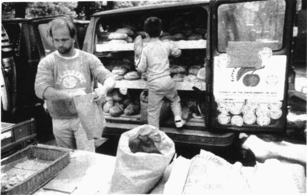

“地下经济”这个词听起来挺吓人的。地下经济的一部分是包括在小黑巷中偷偷的毒品交易，但这个概念所指的是那些没有报告的、没有缴税的商业交易。这些活动大部分就像是这幅纽约的“联合广场市场”的照片所描述的那样是无害的，而且是很平常的。

在加利福尼亚和得克萨斯，但是他们也分散在其他地方。他们做家务劳动，在农场中摘菜，在秘密成衣店缝制衣服，在宾馆中打扫房间，在饭店中做服务生，他们大部分人都做着美国人尽力避免的低薪水且脏的工作。我们这些人从他们的劳动中获益，因为他们给我们带来了更便宜的物品和服务。

因为它的隐蔽性，没有人知道地下经济的规模。但是它可能至少占正常经济的10%（Barber，2003）。美国官方公布的GDP大约是10万亿（Statistical Abstract 2002: Table 63），地下经济的总值很可能超过1万亿。它是如此巨大，以至于使得国民生产总值的官方统计出现误差，并且在一年内就使美国国税局流失了数十亿的税款。

### 停滞和工资萎缩

美国工人是世界上最多产的工人(Statistical Abstract 2002: Table 1353)。因此,有人可能会认为他们的收入也一直在增加。这带给我们一种让人困惑的情况。

看一下图 14.5。灰色的柱图显示了目前的薪水。这是她或他的工资卡上工人们拿到的平均薪水。你可以看到，自从 1970 年以来，美国工人的薪水从 1 小时仅 3 美元涨到 1 小时 14 美元。今天的工人拿回家的是过去工人的 4.5 倍。但是让我们除去幻想，再看一看这个白色的柱图，它显示的是美元的不变价值，即这些工资收入的购买力。它们显示了通货膨胀是怎样削减了美元的价值。今天的工人用 1 小时 14 美元的工资仅仅可以买到 1970 年的工人用 3 美元就能买到的东西。问题并不是“那时的工人怎样依靠 3 美元生活？”而是“今天的工人怎样依靠 14 美元生活？”

### 工作和休闲方式

假设这是在 1860 年，你在马萨诸塞州洛厄尔的一家纺织公司工作。一天，当你来上班时，你发现老板制定了一个新的规则：所有工人必须在同一时间到达，并一直干到下班时间。像其他工人一样，你对此感到极其愤慨。你和他们一起抗议：“这是奴隶制！”并进行了罢工游行，抗议如此荒谬的规定。(Zuboff, 1991)

---

图 14.5 在当前工资和美元不变价值（1982 年）下美国工人的每小时工资

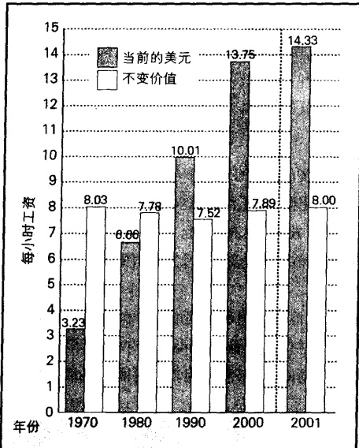

资料来源：作者根据 Statistical Abstract 1999: Table 698 和 Statistical Abstract 2002: Table 608 整理而成。

图 14.6 休闲和生活历程： 休闲的 U 形曲线

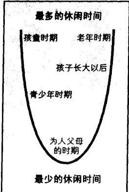

资料来源：由作者整理而成。

这是一个真实的故事。工人们是愤怒的，因为在此以前，他们还能凭自己的意愿来去。让我们来看看工作和休闲的方式与经济转型有怎样的关系。

工业化的影响 狩猎和采集社会提供了大量的休闲时间，即不被工作或必需的活动（例如吃和睡）所占据的时间。假设他们不是住在一个贫瘠的地方或者不必面对一些不寻常的大事，例如干旱和瘟疫，那么人们也不会花太长的时间去狩猎或采集他们一天所需的东西。事实上，他们的大部分时间都是空闲的。自然界的节律是他们生活的本质部分。农业经济同样允许更多的空闲，至少在西半球，种植的高峰季节是在春季，夏季减少，而收获的高峰季节则是在秋季，冬季工作再次减少，因为这个时候收获已经完毕，动物已经宰杀，食物和木材也都被存储好了。

然而，工业化打破了这种随着季节规律变化的劳动性质。与人类历史上其它时期不同，老板们和机器决定了什么时候开始工作，工人们反对这些决定，要求回到传统形式。在工作几周之后——甚至几天——一个工人可能会消失，当钱用光的时候，他又会重新出现。对大多数人来讲，享受空闲被认为比挣钱更重要(Weber，1958/1904—1905)。由于规则的、有效的生产带来了更多的效益，老板们开始要求所有的工人在同一时间开始工作。对这时的工人来说，这听起来就像奴隶制。如今，那些强加给我们的工作模式已被我们视作理所当然，并依靠这些文化节奏调节我们的生活。

休闲的趋势 某项活动是否是休闲的，取决于活动的目的而不是活动本身。比如驾驶汽车，如果你是为了休闲而驾车，那么它就是休闲，但是如果你是正在执勤的警察或你必须驾车上下班，那么就是工作了。如果仅仅是为了娱乐，那么骑马和读书都是休闲。但是这些活动对于骑士和学生而言就是工作了。

图 14.6 中的 U 形图显示，休闲方式随着生活历程的不同而不断变化。年轻孩子享有最多的休闲时间，青少年比他们的父母享受更多的休闲，有了小孩的父母有最少的空闲，但在孩子离家之后，空闲又一次增加

---

了。60岁之后，休闲的时间对于成年人来讲达到最高峰。

与早期工业化时期的工人相比，今天的工人有更多的休闲。100年前，工作周的时间是今天的双倍，因为那时的工人每周不得不在机器旁工作60小时。当工人们团结起来时，他们要求一个更短的工作时间。许多年后，每周工作时间逐渐减少。在德国，一周通常工作35小时，周五下午通常休息。大众汽车是世界上第一个采取一周30小时工作时间的跨国公司(Rifkin，1995)。此外，德国工人一年有六周带薪假期。然而，奇怪的是，在美国，却出现了与更多休闲时间相反的情况。美国工人一年平均工作1978个小时，是所有发达国家中最高的(DeGraaf，2003)。

远程工作正如工业革命将人们从家里带到工厂一样，我们目前的技术革命又让几百万工人回到家中(Wells,2001)。他们在家里做他们的工作，他们用电脑与公司进行电子沟通。这样，公司节省了办公空间，人们避免了交通堵塞。产量也增加了，但是管理者却担心会失去对工人的控制。很多人认为，工人脱离了他们的视野，就会不工作。对工人来说，他们往往担心他们的前程会受影响，因为他们失去了搞办公室政治的机会。

上班不仅仅是工作。工资是从事某种工作的主要激励，但是与同事之间的友好关系也很重要。对远距离工作者来讲，这里就有一个问题，他们失去了与同事之间的友谊。E-mail 虽有帮助，但毕竟与面对面的互动不同。当你开玩笑或复述最近办公室的闲言碎语时，能够看到鲍勃和玛丽的表情。很多远距离工作者发现，在家工作是项枯燥的经历。下面是一位读了本

书之后的学生写的：

我的丈夫是位软件工程师。他的公司让大部分雇员回家工作。因此他现在在家工作，他的老板在另一个州，他很少见到这个人。他想念办公室那个“社区”，而且经常毫无原由地跑去待上几个小时。因为大部分时间都在家里工作，没有人跟他聊天，因此他感到很失望。他的公司将这当做一个大问题。这样不能保持这个团队的激情，因此他们试着一周举行一次午餐聚会，但是这毕竟不能跟每天联系相比。

### 面向未来: 资本主义全球化的意义

我们通过两种当前的趋势可以看到未来，这两种趋势是：全球贸易和新技术。

### 全球贸易：不平等和冲突

巨大的跨国公司正在将整个世界瓜分为几个大的贸易集团，而且推动了关税的减少和消失。结果，我们可以预计国家之间的贸易将以前所未见的速度增长。美国的公司将继续支持全球贸易的扩展，因为世界市场已经对它们的成功变得极为关键。例如，电

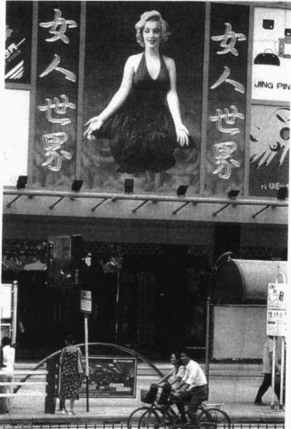

随着资本主义的全球化，不仅仅它们的产品远销世界各地，而且占有优势地位的资本主义文化也在全世界广泛传播。在最初的影像生产者和输出者的推动下，好莱坞形成了一个全球性的影响。这幅中国西安的图片表明了什么是全球的偶像。

---

影制作花费巨大(电影的平均费用约5000万美元), 如果不能在全球上映, 美国电影工业将会走向破产。

当然，并不是所有的国家都能平等获益，工业化程度最高的国家(即使它们已经进入后工业社会)将会获得世界财富的大头(你可以再看看表14.2)。一个主要的问题在于，富国和穷国之间的经济不平等将会继续扩大。控制全球贸易的国家正在增长的财富，并不与最不发达的国家分享。电视中呈现了工业化国家的财富和特权，而不发达国家的贫穷和无助则在悄悄滋养着不满。迅速增加的人口对有限资源的压力正在增加。所有这些都为恐怖分子的成长提供了肥沃的土壤，这些恐怖分子有可能会向那些他们认为剥削了他们的国家发泄不满。

### 新技术和解雇：乌托邦还是噩梦

计算机驱动下的生产将会继续减少生产过程中所需要的工人数量。就像我在1975年所写到的：

虽然这听起来像乌托邦，但是有人预计这一天将要到来。那时候，仅仅2%的人口就能生产出全部人口所需要的物品。那一天的到来离此已经不远，福特汽车目前只用6个工人来生产一部汽车，然而在1910年，福特汽车用104个人来完成同一项工作……一台设备和一名工人生产南加利福尼亚所需要的面包是可能的……不管这种改变是否代表了乌托邦梦想的即将实现，对于那些被代替的工人来讲，这很可能是一场噩梦。（第341页）

乌托邦还是噩梦？从符号互动论的角度来看，这完全取决于你看事物的观点。然而冲突理论家强调，这种观点取决于你站在生产过程的哪一方。新技术革命所造成的工作机会减少，并没有影响跨国公司的高级管理层，也没有影响持有股份的资本家。对于这些人中的大部分来讲，他们对这种变化有着较强的免疫力。虽然他们必须改变他们的投资和管理战略来适应正在改变的市场，但是新技术使他们降低了生产成本，增加了利润，而且增加了他们的分红和股票期权。直接承受这种变革压力的人们，是那些依靠工资生活的底层工人。正是他们，遭受着不确定的掠夺、失业的打击和对工作不得不做的痛苦调整。

因此，就让我们用关注全球经济转变带来的深远影响的“批判性思考”专栏来结束本章。

### 新型社会将是什么样的呢？新技术和工作重构

由于担心自动化带来的失业，许多工人都感到非常苦恼。他们看到：原来处于次要地位的机器慢慢地取代了人，其中一些人幸运地享受了提前退休和一份养老金，其他人则一无所有。

但是机器是否真的把工作抢走了呢？一方面，毫无疑问，新技术使一个接一个的工作变得过时。从这一点来看，工人们的担心并非杞人忧天。汽车工业所生产出的汽车跟30年前一样多，但它需要的产业工人却不及原来的一半。美国钢铁公司的工人数量已从12万人下降到只有2万人——然而产量并没有改变(Volti，1995)。计算机自动化还将继续使数百万制造业工作岗位消失。

我们还应看到事情的另一面，因为技术同样创造了工作机会。汽车工业打破了马贩子的饭碗，同时它也促使更多的人去新兴的钢铁和石油行业工作，另外也出现了大量的机械工程师、销售人员、广告商，以及随处可见的车身修理厂。

每种新技术在破坏原有工作机会的同时，也创造了新的工作机会。其中一些工作已随处可见。另外一些还不是特别明显。以新技术在航空工业

### 批判性思考

---

中的应用为例，它不仅使飞行员、机械工程师和订票员大量涌现，同时也大大刺激了环球旅游业。简而言之：我们当中大多数人正在从事着75年前根本不存在的工作。

将来会怎样呢？新技术的出现是不可避免的。关键是新技术创造工作机会的速度快，还是它破坏工作机会的速度快。由于数百万工人被迫失业，问题的严重性就不只是停留在理论层面上。

有两种情况可能会在今后出现(Rifkin,1995)。第一种是人人富足和康乐的“科技天堂”。那时，每周的工作时间仅有10或15小时，然而每个人都可以享用充足的物品。人们又找回了从前在狩猎和采集社会曾享有的休闲，一些创造性的休闲方式则成为新社会的主要特征。一些人花时间来给自己充电，如学习科学、哲学和语言。一些人选择了艺术——绘画、诗歌、戏剧。许多人喜欢旅游。父母有更多的时间和孩子们待在一起。而其他人则沉迷于肥皂剧、玩视频游戏或是干脆一手拿着啤酒一手拿着遥控器，一动不动地看那些没完没了的体育转播或现场秀。

第二种情况就是社会分成两部分。一部分人虽然人数相对较小但却很富有，他们生活在数量庞大的穷苦工人和失业工人之间，反差是如此之大，以至于他们好像生活在“国中之国”。数百万人在绝望和无助中勉强生存，靠接受别人极不情愿的少量施舍维持生活。由于没有工作的机会，年轻人当中出现了一种暴力犯罪的亚文化。出于对日益增长的暴力行为的恐惧和迷茫，富人们选择了把自己关在封闭的社区里。

我们不能阻挡历史前进的车轮。新技术还会出现，而且它还会一如既往地继续改变工作的性质。关键在于作为一个社会，我们应该如何应对。工作的转变是不可避免的，但是这种重构带来的后果却是可以避免的。

### 思考题

哪种情况更有可能出现呢？在回答这个问题的时候，我们可以参考本章关于新技术对工作的影响、资本主义全球化，以及日益增长的跨国公司的讨论。

日益扩大的贫富差距似乎是一个不祥的趋势。让我们看看图14.7所显示的“倒金字塔”结构，这个图可以说是收入分化的真实写照。左边的每个长方形代表了美国人口的1/5，右边的长方形代表的是每1/5的人口相对应的国民收入的比重。通过这个倒金字塔结构，读者可以看到：47%的国民财富被最富有的1/5的美国人所占有，然而最贫穷的1/5人口所占有的国民财富只有4%。后工业社会的经济并没有带来平等，反而使工业经济时代的收入分配的不平等变得更加稳固和扩大。从这种收入分化的格局当中，你对我们的未来有何感想？

图 14.7 倒转的收入金字塔：每 1/5 美国人口所占收入比例

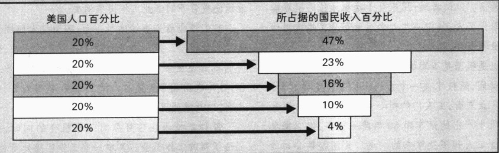

资料来源：作者根据 Statistical Abstract 2002: Table 659 整理而成。

---

### 本章小结

### ☆经济体制的转变

### 经济体制如何与社会形态联系起来？

最早期的狩猎和采集社会是生存经济。小群体到处迁移，生产很少的产品，而且没有剩余。当人们学会如何驯养动物和种植植物(游牧和园艺社会)、耕种(农业社会)、制造(工业社会)时，经济体制变得更加复杂。这些方法允许人们生产剩余产品，并促进了贸易的产生。然而，当人们积累了比他人更多的物品时，贸易就带来了社会不平等。服务业支配着后工业社会。如果说一个生物经济社会正在浮现，那么现在还不能知道它的结果。

### ☆交换媒介的转变

### 交换媒介是怎样发展的？

交换媒介是人们用来交换物品和服务的方式。在狩猎、采集社会和游牧、园艺社会，人们进行直接的物物交换和服务交换。在农业社会，金钱开始被使用，逐渐发展成为代表了一定数量金银的货币和纸币。后工业社会逐渐依赖于以信用卡、借记卡和电子货币形式进行电子转移。

### ☆世界经济体系

### 主要经济体系有什么不同？

世界上两个主要经济体系是资本主义和社会主义。在资本主义社会，私人占有生产资料并追逐利润。在社会主义社会，国家占有生产资料，并决定不以利润为目标的生产。每一方的支持者、拥护者都已经发展了自己的意识形态来保护自己的体系，并将对方描述成是有害的。按照趋同理论的观点，每一方都已经采纳了对方的特征。

### ☆关于资本主义全球化的功能主义观点

按照功能主义观点，劳动是社会团结的基础。传统社会是机械团结：人们从事着相似的工作并互相认同。工业社会带来了有机团结和以社会分工为基础的互相依赖。这个过程还在继续，并正在形成全球性的劳动分工。经营权和所有权相分离的法人公司，是资本主义成功的基石。

### ☆关于资本主义全球化的冲突论观点

将焦点集中于权力的冲突理论家声称，全球资本主义是资本家剥削工人的一种方式。在跨国公司的最高层是“内圈”。当自动化使工人失去工作的时候，“内圈”维持着它的政治权力并从新技术中获益。“法人资本主义”这个概念表明大公司支配着今天的资本主义。

### ★美国社会的工作

### 劳动力是怎样变化的？

在向后工业社会的转变中，农业工人的数量已经逐渐减少，蓝领工人也减少了，而且几乎每个人都在服务部门工作。美国和加拿大有最高的妇女劳动力百分比。

### 地下经济是什么？

地下经济包括不能向政府报告的活动。从保姆到卖淫，地下经济的规模已几乎达到正常经济的10%—15%。

---

### 工作和休闲的方式如何变化？

在狩猎和采集社会，大部分时间是空闲的。在农业社会，工作随着季节而变化。工业社会减少了工人的休闲时间，但是工人们现在又得到了一些空闲时间。美国工人比其他工业化国家的工人一周要工作更多的时间。

### ☆面向未来：全球资本主义的含义

### 什么样的经济趋势将会影响我们的未来？

由于正在扩展的全球贸易、新技术和裁员，劳动的性质将会继续改变。我们现在所做的选择，将会导致一个更好的社会或者是一个噩梦。

### ☑批判思考题

1. 什么样的全球力量正在影响美国经济？它们将会产生怎样的结果？它们可能会怎样影响你的生活？

2. 社会主义和资本主义的主要特征和意识形态是什么？这些与冷战时期的政治和经济竞争有什么关系？

3. 为什么近几年美国工人每小时平均工资已经涨了好几倍但每个人却都在说工人的待遇并没有提高？这对你自己的未来会有什么影响？