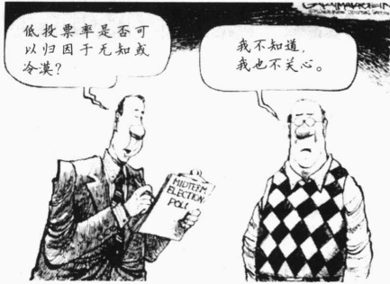
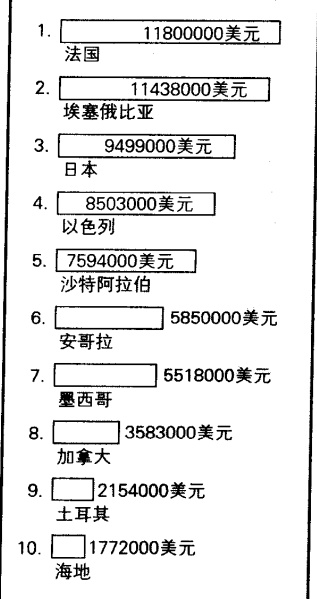
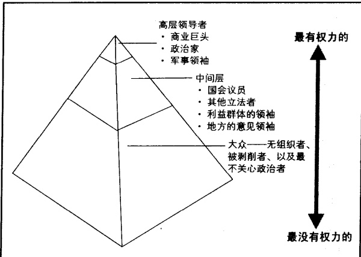

# 第 15 章 政治

林福益印 鄭澤晞 晋 91 7

合

---

·微观政治和宏观政治

· 权力、权威和暴力  

权威和合法暴力  

传统型权威  

法理型权威  

卡里斯马型权威  

作为一种理想类型的权威  

权威的转让

· 政府类型

君主政体：国家的产生

民主政体：公民身份作为革命性观念

独裁政体和寡头政体：政权的夺取

· 美国的政治体制

政党和选举

与欧洲民主体制的比较

选举模式

游说者和特殊利益群体

美国选举中的政治行动委员会

· 谁在统治美国

功能主义视角: 多元化

冲突论视角: 权力精英, 还是统治阶级

哪种观点是正确的?

· 战争和恐怖主义: 实现政治目标的手段  

战争是世界性的吗  

战争到底有多普遍  

国家为什么要发动战争  

战争的代价  

未来战争的播种  

核恐怖主义、生物恐怖主义和化学恐怖主义  

战争和去人性化

---

你可能并未注意到这则消息：

去年(2001年)距圣诞节还有一个月的时候,三个人,极有可能是成年男性,走进了俄克拉何马城一个拥挤的购物中心。他们乔装成维修工的模样,拿着植物喷雾器,穿过假日的购物者,走向用来装饰走廊的盆栽植物。不一会儿,这三个人就走出购物中心的出口,消失在冬天的暮色中。在同一时刻,另外两个团伙在亚特兰大和费城的购物中心也在做着同样的事情。

12月9日凌晨7点，美国总统召集国家安全委员会会议。他略过了开场白，直接严肃地宣布：“在俄克拉何马城已有三例天花被确诊。除此之外，可能还有20多例。这场传染病像是有人蓄意造成的，我们正在遭受生物恐怖分子的攻击。”

在总统发表讲话的时候，俄克拉何马城的一个实验室已确诊了23例天花病例，并宣称还有30多例疑似病例。亚特兰大公布了17例，费城公布了10例。

国土安全部确认，已知的天花传播源仅有亚特兰大的传染病控制中心和俄罗斯研究传染病媒介的实验室。俄罗斯情报人员透露，一位研究天花的专家，前传染病媒介科学家消失了。她可能身在伊朗。

不到一个星期，已有数千名美国人呈现出感染天花的症状，这些人挤满了医院的急诊室。国家的疫苗很快就用完了。电视新闻中播放着母亲抱着患儿流泪和拥挤的人群要求医疗援助的镜头，它们使公众处于恐慌之中。由于担心感染天花，几乎每个人都呆在家里，他们拒绝进入公共场合。整个国家的商业和公共服务都停止了。

截止到12月15日，官方已在15个州确认了2000例天花病例，而加拿大和墨西哥确诊的病例则更多。已有300多人因此失去了生命。一周后，感染人数已达到16000人，死亡人数则达到了1000人。卫生当局估计，仅在美国就有数百万例天花病例，并且死亡人数已超过100万。这场传染病已经扩散到其它12个国家。

### 游戏结束。

这件事的确发生了，不过好在只是场游戏。《黑暗的冬天》于2001年6月在安德鲁斯空军基地（Andrews Air Force Base）上演，由一位前美国参议员扮演总统。结果是令人沮丧的。它向我们展示了在对付生物恐怖分子时，我们是多么的没有准备。

资料来源：Simons（2002）。

生物恐怖主义与这一章的主题——政治——到底有着怎样的联系？我们将会重新回到这一问题上，现在先让我们分析一下权力和政治。

---

### 微观政治和宏观政治

当我们考虑政治的时候，浮现在我们脑海中的是一系列与政府有关的影像：国王、王后、政变、独裁、人们竞争职位、投票选举。这些都是政治的表现，但是这一术语实际上拥有更加广泛的含义。它涉及任何存在权力关系的情况，包括你的日常生活中所发生的(事情)。正如韦伯(Weber，1922/1968)所表述的，权力(power)是一种在面临他人反抗的情况下仍能实施自己意志的能力。如果有两个或三个雇员试图给他们的新上司——这个新上司将会决定他们当中有谁能够被提升为经理——留下深刻的好印象，这就是一个要弄权力手段的典型案例，当然也是一个涉及政治的典型案例。父母排除了不情愿的儿女的反抗，试图让自己的儿女晚上按时回家的努力也属于这种情况。那么，曾经发生的对电视遥控器的竞争呢？这也是一种获得权力的企图，当然也涉及政治。因而，每个群体都会涉及政治，因为在每个群体当中都存在着某种形式的权力斗争。符号互动论者用微观政治(micropolitics)这一术语来指代日常生活中权力的运用(Schwartz，1990)。

相反，宏观政治（macropolitics）——本章讨论的中心——则是指更大群体的权力运用。无论是以独裁方式还是像在美国和加拿大那样以选举方式组成政府，都是宏观政治的典型例子。现在让我们转向宏观政治，首先让我们来分析一下权威问题。

### 权力、权威和暴力

为了存在下去，每个社会都必须拥有一个领导体制。一些人必须能对其他人运用权力。正如韦伯(Weber，1913/1947)所指出的，我们既可以将权力视为合法的，也可以将其视为不合法的。合法的权力被称为权威(authority)，这种权力被人们视为是正当的。与之相反，不合法的权力——被称为强制(coercion)——则被人们视为是不正当的。

试想，你正准备买一台价值250美元的数字平面电视。当你走在去商店的路上，一个人从一条小巷中窜了出来，并将一把枪猛顶到你的脸上。他向你勒索钱财，求生的欲望使你交出了那250美元。在警察局填写了一份报案表后，你返回学校参加一场社会学考试。由于快要迟到了，你加大了油门。当速度达到每小时85英里的时候，你从后视镜中发现了闪烁的蓝红灯。你遭到抢劫的解释既没有打动这位警官，也没有打动几周后处理你这一案件的法官。她先教育你要注意安全，然后命令你缴纳50美元诉讼费，以及由于每小时超过65英里而需缴纳的每公里10美元的超速费。你又缴纳了250美元。

行凶抢劫者、那位警官及法官每个人都拥有权力，在每个事件中，你都失去了250美元。那么，这两者之间的区别是什么呢？区别就在于，那个行凶抢劫者没有权威。他所拥有的权力是不合法的——他没有权利去做他对你所作的事情。相反，你承认那个警官有权利使你停下来，法官有权利对你进行罚款。他们拥有权威，或者说是合法的权力。

### 权威和合法暴力

正如社会学家彼得·伯杰所断言的，无论你是愿意缴纳法官对你征收的罚款，还是拒绝，从结果看这两种选择之间几乎没有什么区别。法庭都将以这样或那样的方式获得金钱。

---

在 [暴力] 运用之前有数不清的措施，如警告和谴责。但是如果所有的警告都被漠视了，即使在缴纳交通违章罚款这样的小事中，最终可能发生的将是，几个携带手铐的巡警和一辆囚车出现在你的家门前。即便是最初将交通违章罚款通知单交给你的那位温和的巡警，也极有可能随身携带着枪支——以防万一。(Berger, 1963)

政府，也被称为国家，要求垄断合法力量或暴力的运用。韦伯（Weber，1946，1922/1968）曾经提出，政府要求享有运用暴力这一独有的权利和惩罚其他任何运用暴力的人的权利，这一点对我们理解政治非常重要。如果有人欠了你的钱，你不能监禁那个人，也不能强行从他那里取钱。但政府却能做到这一点。政府（拥有）权威的基本证据就是，虽然有人作了在你看来是非常恐怖的事情，你却无权夺去他（她的生命，但政府就可以。正如伯杰（Berger，1963）所总结的，“暴力是任何政治秩序的最终根基”。

在探索现代国家的起源之前，让我们先来考察一下政府丧失了合法性的情境。

权威的崩溃 政府有时会压迫它的人民，而人民则会像反抗一个行凶抢劫者那样来反抗他们的政府。人们在盯着政府代理人手中的枪的同时却不得不顺从，有时甚至还要面带微笑。但是，正如对付一个行凶抢劫者那样，他们一旦抓住机会，就会拿起武器来解放自己。革命（revolution）——其目标在于推翻和取代当权政府的武装反抗——不仅是人民对政府统治支配他们的一种抵制，也是他们对政府垄断暴力（使用权）的抵制。在一场革命中人们宣称，这是为自己争取应有的权利。一旦革命成功，他们就会建立一个新政府，而这个新政府同样也会要求垄断暴力的权利。

在一些人看来是强制的东西，可能会被其他人视为一种权威。因此，当一些人准备武装反抗他们政府的时候，另一些人仍会忠于这个政府，并会心甘情愿地去保卫它，甚至于为它献出自己的生命。一个政府的权力越是被视为合法的，这个政府就会越稳固。

但是人们为什么会将权力视为一种合法的(东西)来接受呢？韦伯(Weber,1922/1968)区分了权威的三种来源：传统型的、法理型的、卡里斯马型的。下面让我们来逐个分析。

### 传统型权威

纵观历史，权威最普遍的基础就是传统。建立在习俗基础上的传统型权威（traditional authority）是部落社会的特征。在这些社会中，习俗支配着基本的关系。例如，出生于一个特殊的家庭里，可以使一个人成为首领、国王或王后。对那个社会所有的成员来说，这是决定由谁统治（这个社会）的正确方式，因为“我们一直都是这样做的”。

社会性别关系往往会为我们开启一扇考察传统型权威的窗户。在葡萄牙一个村庄里，寡妇在她们再婚以前只能穿黑色的衣服。这往往意味着，在以后的生活里，她们要一直穿黑色的衣服。从法律上讲，寡妇可以穿任何她喜欢的颜色，但这却为习俗所不容。只能穿黑色的传统是如此强大，如果一个寡妇要违反这种穿着习俗，她将被认为亵渎了对她已逝丈夫的记忆，并会受到她所在社区的排斥。

当一个传统社会走上工业化道路之后，传统型权威就被这种转型瓦解了。社会变迁带来了新的经验。这就为生活提供了新的前景，传统权威不再是不可以挑战的。因此，在葡萄牙，你仍然可以看见一些老年妇女从头到脚都是黑色的打扮——你立刻就会明白她们的精神状态。而那些年轻一点的寡妇，则可能和其他妇女穿的没有什么区别。

---

虽然传统型权威随着工业化进程而衰落，但它永远不会完全消失。例如，父母经常在他们的孩子身上施加权威，因为他们总是拥有这样的权威。从过去的世世代代开始，我们就继承了这样的思想：父母可以惩罚自己的孩子，可以帮他们选择医生和学校，并且教授他们信仰和道德。

### 法理型权威

第二种类型的权威，法理型权威（rational-legal authority），不是建立在习俗的基础上，而是建立在成文规则的基础上。“合理的”意味着是“理性的”，而“合法的”则意味着是法律的一部分。因此，法理是指那些被理智的人们所认可并被写进法律（或某种规章制度）的条文。这些被认可的条文，既可能像能够详细规定所有社会成员权利的宪法那么宽泛，也可能像两个个体之间的契约那么狭窄。由于科层制就是建立在成文规则的基础上，所以法理型权威有时也被称为科层权威。

法理型权威来源于人们所占据的位置，而不是来源于占据这个位置的那个人。例如，在一个民主体制内部，主管人的权威来源于职位，这在成文章程中已有详细规定，而不是来源于习俗和个体特性。在法理型权威中，每个人——无论职位有多高——都必须服从组织的成文规则。在以传统型权威为基础的政府中，统治者发布的命令就是法律，而在以法理型权威为基础的政府中，统治者发布的命令必须服从于法律。

### 卡里斯马型权威

追溯到几个世纪以前，在1429年，英国控制了法国的大部分地区。当英国人不允许给新法国国王加冕的时候，一位农夫的女儿听到了一个声音，这个声音告诉她，上帝派给她一项特殊的任务——她应该穿上男人的衣服，征募一支军队，并发动战争反抗英国。受到这个声音的鼓舞后，贞德（Joan of Arc）组建了一支军队。他们占领了城市，并且打败了英国。随后在那一年里，当她站在正在加冕的法国国王查理七世身边的时候，她的梦想就完全实现了。（Bridgwater，1953）

贞德是卡里斯马型权威（charismatic authority）的例子，这是韦伯所区分的第三种类型的权威。（Charisma 是希腊语，本意是指一种才能，这种才能的赋予是无偿的和神圣的 [Arndt and Gingrich, 1957]。）人们能够被拥有卡里斯马的个体所吸引，因为他们相信这个人已经和上帝接触，或是天生就被赋予了特殊的品质（Lipset, 1993）。在传统型权威中，军队并不会追随贞德，因为习俗不允许他们这么做。同样，在法理型权威中，他们也不会冒着生命危险与贞德并肩作战，因为她占据的（领导）位置并没有被

卡里斯马型权威最好的例证就是贞德，这幅图像是查理七世举行加冕礼时的情形，贞德在把查理七世推上王位的过程中起了很大的作用。由于对贞德只穿了男士兵的盔甲感到不舒服，画家在描绘这幅图像时给贞德画上了足够多的虚构的衣着，并且还加上了一条滑稽可笑的裙子。

---

成文规则所详细规定。相反，人们之所以追随她，是因为被她那突出的优点所吸引，他们将她视为上帝的使者，她是站在正义一边的，正是由于这些对他人有着吸引力的品质，人们认可了她的领导。

卡里斯马型领导者造成的威胁 一个国王忠于传统，一个总统忠于成文的法律。那么，一个卡里斯马型领导者忠于什么呢？由于他们的权威建立在能够吸引追随者的个人能力的基础之上，感召型领导便给现存的政治体制造成了威胁。他们完全根据自己的喜好领导追随者，而不是根据传统做法或是法律条例。所以，他们可以鼓动他们的追随者去漠视——甚至于去推翻——传统型和法理型权威。

这就意味着，卡里斯马型领导者给现有秩序造成了威胁。因此，传统型和法理型权威当局往往给予这些卡里斯马型领导者以迅速的反击。然而，如果他们不谨慎从事，这种反击可能会激起有利于卡里斯马型领导者的更加坚定的情感。这就使得他或她(这个卡里斯马型领导者)被视为受到强权迫害的弱者。有时候，当一位牧师宣称他拥有那些不可思议的力量的时候，而这些力量看起来有着惊

卡里斯马型权威可能出自任何道德观，从神圣的到最邪恶的。像贞德一样，阿道夫·希特勒也吸引了大量的民众，他给民众带来大量的梦想，并使他们燃起了希望。这张标题为Es Lebe Deutschland（德国万岁）的20世纪30年代的海报，向我们展示了那个时代的德国人民从希特勒身上发现了领导者所应具有的品质。

人的治愈(疾病)的效果，罗马天主教会就会面临这种威胁。当人们聚集在这种个人周围的时候，他们就会忽视教区的牧师，以及正式的基督教会组织。这种从忠于组织到忠于个体的转变会威胁到教会的等级结构。因此，教会的要员会要求牧师从公众的视野中消失，比如可能会让他们去一个修道院，在那里重新考虑他们的所作所为。这样，威胁就被解除了，法理权威得到了巩固，组织的稳定性也得以维持。

### 作为一种理想类型的权威

韦伯将权威分为传统型、法理型以及卡里斯马型，这一分类实际上代表了权威的几种理想类型。正如第7章中所提到的，理想类型并不是指那些理想的或想要的事物，而是指从现实生活的例子中发现的多种特征的复合体。一个具体的领导者，有可能会表现出多种特征的结合。

约翰·肯尼迪就是这样一个例子，他结合了法理型权威和卡里斯马型权威。因为他是通过选举成为美国政府首脑的，所以肯尼迪代表了法理型权威。然而他的大众吸引力是如此之大，以至于他的公共演说使大量民众行动起来。肯尼迪在就职演说中提到：“不要问你的国家能为你做些什么；而应扪心自问你能为你的国家做些什么”，数百万美国人都为之感动。当肯尼迪提议派遣一支（美国）和平部队去帮助那些贫穷国家的时候，数千名理想主义的年轻人自愿参加了这次国外服役。

卡里斯马型和传统型权威也可能重叠在一起。例如，伊朗的阿亚图拉·霍梅尼，是一个占据阿亚图拉(对什叶派领袖的称呼)传统位置的宗教领袖。然而，因为他体现了伊朗人民的梦想，以及他那简朴的

---

生活作风和对《可兰经》的虔诚，使他具有了巨大的公众吸引力，因此，他也是一位卡里斯马型领导者。霍梅尼的追随者坚信他是真主选出来的，并且他的演说也使得数万民众行动起来。

在极少数事例中，传统型和法理型领导者会拥有卡里斯马。然而，这种情况极其罕见，最常见的权威不是这种类型就是那种类型。

### 权威的转让

权威从一个领导者到另一个领导者手中的有秩序转让，对于一个社会的稳定是非常重要的。在传统型权威中，人们知道谁将是下一个接替者。在法理型权威中，人们可能不知道谁将是下一个领导者，但是他们知道这个领导者将会如何被选举出来。南非为我们提供了一个引人注目的有关权威在法理型组织中实现有秩序转让的实例。由于几十年的种族冲突以及每一方所实行的恐怖暗杀，这个国家一直处于分裂状态。然而，通过坚持法理型权威，这个国家的权力从德克勒克总统领导的主导群体手中和平转让到了曼德拉领导的弱势群体手中。

然而，卡里斯马型权威却没有这种继任规则。这就使得它没有传统型权威或法理型权威稳定。由于卡里斯马型权威建立在一个特殊的个体的基础上，卡里斯马型领导者的死亡或无能也就意味着一场围绕继任而发生的激烈斗争。为了避免这场斗争，一些卡里斯马型领导者会任命一个继任者，从而为权力的有秩序转让做好准备。当然，这并不足以保证有秩序的继任，因为追随者们并不一定像他们当时认同这位卡里斯马型领导者那样来认同这个指定的继承者。对卡里斯马型领导者来说，第二个策略就是建立一个组织。由于这个组织发展了一整套的规章制度体系，它便使自己转化成了一个法理型组织。韦伯用卡里斯马的例行化（routinization of chrisma）这一术语来指代卡里斯马型领导者的权威向传统型权威或法理型权威的转化。

### 政府类型

各种类型的政府——君主政体、民主政体、独裁政体，以及寡头政体——之间有何不同呢？在比较它们的过程中，让我们也来考察一下国家这个机构是怎样产生的？为什么公民身份这一思想是革命性的？

### 君主政体: 国家的产生

早期的社会是比较小的，不需要强大的政治体制。它们的运转更像一个扩大的家庭。随着剩余产品的出现和社会的扩大，城市逐渐形成——这大约发生在公元前3500年（Fisher，1976）。随后，城邦（city-states）出现了，权力随之像蜘蛛网一样由城市向外围扩散。虽然城市能够控制其附近地区，但城市之间的地区仍处于争夺之中。每一个城邦都拥有独自的君主政体（monarchy），每一个国王或女王的统治权都会传递给他们的后代。如果你开车驶过西班牙、法国或德国，你依然可以看到昔日城邦留下的痕迹。在乡村，你只能看到一些分散的村落。再往前走，你将会被一个坐落在遥远的小山上的城堡的轮廓所吸引。当你走近它的时候，你会发现这个城堡被一个城市环绕着。在几公里之外，你还会发现另外一个城市，也是被一个城堡控制着。每一个城市连同它的城堡，都曾是一个权力中心。

---

城邦之间经常反目，而且战争也非常普遍。胜利者会扩大他们的统治，最终，一个单一的城邦能在整个区域内行使它的权力。随着区域范围的扩大，人们逐渐开始承认这个较大的区域。也就是说，他们开始把较远的居住者看做是“我们”而不是“他们”。这时人们所说的国家——即要求在一定领土上垄断暴力使用的政治实体——就产生了。

### 民主政体：公民身份作为革命性观念

美国没有城邦。然而，每一块殖民地都既小又独立，像一个城邦一样。独立战争之后，美国的各个殖民地联合到一起。这个政治联合体所产生的巨大力量和提供的大量资源，使他们几乎占领了整个北美，并将其置于一个中央政府的权力统治之下。

这个新国家所建立的政府被称为民主政体(democracy——源于两个希腊单词： $ \underline{\text{demos}} $[平民]和 $ \underline{\text{kratos}} $[权力]——照字面意义理解就是“还权于民”)。由于在推翻英国国王统治的过程中所产生的强烈敌对情绪，这个新国家的建立者不再信任君主政体。他们想将政治决策权交到人民手中。这并不是世界上出现的第一个民主政体，但是这一体制以前仅在较小群体中尝试过。希腊的城邦——雅典，曾经在两千年以前实践过民主政体，每个超过一定年龄的自由男性都有发言权和选举权。在一些美洲土著部落中，如易洛魁族（Iroquois），他们的首领也是通过选举产生的，甚至在一些部落中，妇女也能参加选举和成为首领。（墨西哥和中美洲的印加人和阿兹台克人采用君主政体。）

由于领土狭小，部落和城市能够实行直接民主（direct democracy）。也就是说，他们的领土足够小，可以使合格的选民聚集到一起，表达自己的意见，然后开始公开选举，这特别像当今的市政厅集会。但是，像美国这样人口众多、领土广阔的（国家），是无法实行直接民主的，于是，代议制民主（representative democracy）便应运而生。一些公民（一开始仅仅限于白人当中的男性土地所有者）选举成年男性在华盛顿代表他们。后来，选民扩展到没有财产的人、非裔美国人，随后是妇女，然后是其他人。新的通讯技术，不但使“电子镇民会议”成为可能，也为新的直接民主形式的产生提供了可能性。这一问题将在下面的“社会生活中的大众媒体”这一专栏进行探索。

### 社会生活中的大众媒体

### 技术社会的政治和民主政体

“政治就像娱乐行业。”——罗纳德·里根

新技术为民主政体提供了极大的保证，但是，它是否也给民主政体带来了威胁呢？

毫无疑问，新技术是政治竞选活动的有力工具。所有的主要候选人都会运用互联网组织支持者和筹集资金。政治家也会利用电脑、电话、传真、电子邮件，以及互联网站点来掌握公众的动向，并向公众灌输他们的政治纲领和观点。

技术的这种应用，改变了公众和政治家之间的互动方式。现在我们可以通过网络聊天室、“电子镇民会议”，以及电台的广播热线直播节目和电视访谈节目，向候选人和领导者们反馈（信息），而不需要调整收音机的频率来被动收听政治家的演说。

互联网甚至为改变我们选举和立法的方式提供了潜在可能性。如果我们运用“电子投票”，选民就不需要在雨雪天里亲自到投票站去投票。这样一来，很可能会有更多的人投票，因为他们在自己

---

家里或办公室里就可以投票。最终，当几乎每个人都拥有一台电脑的时候，电子投票很可能会以一种直接民主的形式来替代我们的代议制民主。

互联网也为政治家能够更积极地回应我们的意愿提供了潜在可能性。选民可以在网上提出他们的请求，并运用电子签名来署名。实际上，在许多事情上，选民可以完全不通过政治家。在互联网上，他们将可以决定政治家目前正在为他们解决的问题。他们甚至可以在互联网上通过一部法律。

既然有这么多的潜在好处,新技术又是如何给民主政体带来威胁的呢?

一些人担心，在互联网上投票是不安全的。由于没有监票人，一些不适当的操纵（威胁、承诺、对选民的贿赂）将无法被察觉。其他人提出了一些更为基本的问题：直接民主可能会绕过政府机关彼此之间相互制衡的美国宪法体制，这一体制是为我们免受“多数派暴政”而设计的。依据一次投票结果得知有51%的成年人对某一问题持有相同观点（这一信息可以引导我们的领导者）是一码事，但根据51%的电子选民的意见来决定一部法律则是另一码事。它不同于让选举出来的代理人公开地争论一项提议的价值，然后再试图平衡不同选民群体的利益。

其他人反驳道，在电子投票之前，一项提议的价值会在报纸上、广播和电视上、甚至在互联网上得到激烈的争论。（因此）选民显然并不会比他们现在了解的少。就平衡不同的利益群体来说，每个群体都会去保护自己的利益，因为每个利益群体都将参加电子投票。

### 思考题

你是否认为直接民主要比代议制民主优越？“多数派暴政”问题到底是怎么一回事？（这一问题意味着，较小的群体的利益，无论这个群体是种族的、宗教的、还是职业的，都会受到得到多数选票的群体的压制。）我们应如何运用大众媒体来改善我们的政府？

资料来源: Diamond and Silverman (1995); Raney (1999); Seib (2000); Langley (2003).

现在我们认为公民身份这一概念是理所当然的。但是我们往往并不了解的是，这一思想开始时是被强行灌输的。公民身份这一思想并不是自然而然的东西，它是人民选择界定自己的一种方式。纵观大部分人类历史，人民常被认为属于一个氏族、一个部落、或是一个统治者。公民身份（citizenship）这一思想，即人民凭借出生和居住所拥有的基本权利，在人类的舞台上是全新的（Turner，1990；Eisenstadt，1999）。

建立在公民身份基础上的代议制民主这一思想是一场革命，这也许是美国给予世界的最大礼物。权力被授予人民，政府由人民(选举)产生。这一概念是革命性的常会被人们遗忘，但是它的实施却意味着对传统思想的颠覆。它使得政府能够积极回应人民的意愿，而不是人民去积极回应政府的意愿。为了保证政府能够更积极地回应它的公民的需要，人民除了享有权利之外，还有履行表达异议的义务。在一篇被广泛征引的宣言里，托马斯·杰斐逊谈道：

一些不时的小反抗总是件好事……这对政府良性运转来说是一剂必不可少的良药……上帝不允许我们在20年里没有任何的反抗……我们必须不时地用爱国者和暴政者的血来更新自由之树。这是它的天然养料。(Hellinger and Judd, 1991)

普遍公民身份（universal citizenship）这一思想——即每个由于出生在这个国家（或者虽然出生在国外，但通过移民进入这个国家并且加入这个国家国籍）的人都拥有相同的基本权利——发展得非常慢，它仅仅在经过激烈的斗争之后才被付诸实践。例如，当美国刚刚建立的时候，这一思想还在孕育之中。

---

今天，对美国人来说，如果任何人因性别或种族而被剥夺下列权利是不可思议的，这些权利包括选举权、任公职权、建立契约权、出庭作证权和财产拥有权。然而，对早期美国人来说，妇女、少数民族以及穷人如果被允许拥有这样的权利，也是不可思议的。

许多年后，权利的范围扩大了，在美国，公民身份和基本公民权利已适用于全体公民。选举权、出庭作证权等(权利)不再由财产、性别或是种族这些因素来决定。但是，这些特征却会影响一个人是否会参加选举，我们将会在下面的选举模式部分看到这一点。

### 独裁政体和寡头政体：政权的夺取

如果一个人夺取了政权，然后将自己的意愿强加给他的人民，这个政府就被认为是一个独裁政体（dictatorship）。如果是一个小群体夺取了政权，那么这个政府就会被称为寡头政体。在中美和南美以及非洲的那些政变中，国家往往会被军队的领导者所控制，这就是寡头政体的典型。虽然可能会有一个人被命名为总统，但经常会有一群军队的高级官员在幕后操纵，（并代替总统）作出决策。如果他们指定的总统不再合作，他们就会将其从这个位置上赶下来，然后再安排另外的人继任。

君主政体、独裁政体与寡头政体因其在公民身上施加的控制程度不同而有所区别。极权主义政府几乎对它的人民实行全面控制。在纳粹德国，希特勒组织了一支残忍的秘密警察部队，即盖世太保，去捕捉任何不服从迹象。这些侦探甚至监视那些经常看电影的人对新闻影片有什么反应，并举报那些反应“不适当”的人们（Hippler，1987）。萨达姆·侯赛因对伊拉克人非常残忍。任何拒绝参加萨达姆的伊拉克童子军（Saddam's Iraqi Youth）的儿童，都会被关进一个肮脏的监狱，并会遭到殴打。

整个世界的人民都发现了公民身份和代议制民主所固有的自由的吸引力。那些在政府决策中没有发言权的人们，或是由于表达异议而面临监禁甚至死亡的人们，从这些思想中发现了通向一个更加光明的未来的希望。由于当今电子通讯的发展，人们在自己被赋予的基本公民权利比其他人多还是少这一问题上，不再处于一种无知状态。这种认识导致了更大的公民参与政府的压力。随着电子通讯的进一步发展，这种压力将会继续增大。

### 美国的政治体制

让我们在全球化背景下来考察一下美国的政治体制。我们将分析两大政党和选举，将美国的民主体制与其它民主体制相比较，并将考察选举模式以及游说者和政治行动委员会（PACs）所起的作用。

### 政党和选举

美国建立之后，出现了大量政党，但是内战结束后，仅有两个政党主导了美国的政治(Burnham，1983)：民主党，在公众心目中它是和工人阶级联系在一起的；共和党，是与富有阶级联系在一起的。每个政党都提名候选人，在选举之前，也就是初选，选民将会决定由哪位候选人来代表他们的政党。然后每位候选人将会展开竞选运动，力图吸引更多的选民。

虽然民主党和共和党代表了不同的哲学原则，每一方都有着广泛的成员基础，而且也很难将一个保守的民主党人和一个自由的共和党人区分开来。然而，双方的极端做法却是很容易分辨的。执著的民

---

主党支持那些将收入从富裕者手中转到穷人手中的立法，或是那些控制工资、工作条件和竞争的立法。而彻底的共和党则反对这样的立法。

选出的国会议员可能会超越政党之间的界线。也就是说，一些民主党人会投票赞成那些由共和党人提出的立法，反之亦然。这之所以会发生，是因为这些官员虽然支持他们政党的哲学(原则)，但是没有必要去支持它的一些特殊的提案。因此，当一些特殊的议案被提出的时候，譬如提高最低工资，一些保守民主党人可能会认为这项措施对一些小企业的雇主是不公平的，或是认为这项议案的实施需要付出的代价太高了，他们就会站在共和党人那边投票反对这项议案。同样，那些自由的共和党人，如果感觉到这项提案是公平的，或是从他们州的选民中感觉到一种凸出的感情，他们也可能会站在这项提案的民主党支持者那边。

尽管他们之间存有不同之处并会公开争吵，但民主党和共和党都从不同方面体现了核心的东西。虽然一方会嘲笑它的反对派，并会提出不同的立法，但是每一方都坚定地支持美国政治哲学的基础，如免费的公共教育；一支强大的军队；宗教信仰、言论和集会的自由；当然，还有资本主义，尤其是财产的私有性。

（两党之外的）其它政党在美国的政治中也发挥着一定的作用，但是为了获得权力，他们也必须支持这些中性基调。任何提倡激进改革的政党都注定是短命的。因为大多数美国人认为，将选票投给一个两党之外的政党是一种浪费，那些政党经常在投票站一败涂地。但是有两个政党除外，一个是布尔·穆斯党（Bull Moose），它的候选人西奥多·罗斯福在1912年比共和党候选人塔夫特获得了更多的选票，另外一个是由亿万富翁罗斯·佩罗建立的团结一起党（United We Stand，即现在的改革党），在1992年获得了19%的选票。但在内部争吵声中，改革党也迅速地衰落下去，1996年它仅仅获得8%的选票，而其2000年获得的选票数还不足1%（Bridgwater，1953；Statistical Abstract 1995：Table 437；2000：Table 456；election 2000 reports）。

### 与欧洲民主体制的比较

我们经常将我们自己的政治体制视为是理所当然的，并且想当然地认为其它任何民主政体都和我们的一样——也只有两个主要的政党。然而事实却并非如此。让我们来看一下欧洲的民主体制，以对此有一个对比性的了解。

虽然他们的体制和我们的一样，都是民主政体，但是两者之间却有着本质的区别（Domhoff，1979，1983；Lind，1995）。首先，欧洲大多数国家的选举，并不主张胜者全赢。而在美国，选举（的结果）则由简单的多数来决定。例如，如果一个民主党人在一个选区中获得投票总数的51%，他（她）就可以宣誓就职。而共和党候选人，由于仅获得投票总数的49%而失去了一切。相反，大多数欧洲国家都将选举建立在比例代表制（proportional representation）的基础上；也就是说，国家立法机关的席位是根据每个政党所得选票占投票总数的比例来决定的。例如，如果一个政党获得了51%的选票，这个政党就会被授予51%的席位；而另一个获得49%的选票的政党将会获得49%的席位。

其次，比例代表制裁励了那些少数派政党，而胜者全赢制则会使他们为之气馁。大多数欧洲国家实行的比例代表制意味着，如果一个政党有10%的选民支持它的候选人，它将得到10%的席位。这一制度促进了边缘政党（noncentrist parties）的成立，它们会提出一些不太受欢迎的和反传统的思想。例如，一个

---

政党可能会在它的主要纲领中宣称回归金本位，或是关闭核动力反应堆。相反，在美国10%的选票数意味着没有任何席位，49%的选票数同样如此。这就使得各个政党逐渐趋于中性，为了获得“全赢”的机会，一个政党必须努力去获得广泛的支持。由于这个原因，美国有(许多)中间派政党(centrist parties)。

在比例代表制中，即使能在国家立法机关获得少数席位也是非常重要的。它甚至允许一个小政党全年都可以利用媒体。这种公开性，使得它的议题充满活力。人数少的小政党也能获得权力。在那些参加国家选举、互相竞争的团体之间，选票被分散开来，所以几乎没有一个单一的政党能在立法机构中获得多数席位。为了聚集必需的选票，获得最多席位的政党必须与一个或者更多的小政党联盟，并由此组成一个联合政府（coalition government）。一个仅获得10%或15%席位的政党，则能够用它在一些议题上的投票来换取一个较大政党对其它议题的支持。由于这种联合常常会土崩瓦解，这种类型的政府与美国政府相比是较不稳定的。就意大利来说，二战以来曾有59个不同的政府当政，而在美国，二战以来仅更替过11位总统。看到了美国政府的较大稳定性，意大利人民便投票决定，议会席位的3/4将由胜者全赢制来决定（Melloan，1993b；D'Emilio，2000）。

### 选举模式

年复一年，美国都显示出一致的选举模式。从表 15.1 中我们可以看到，选民的百分比随着年龄的增长而上升。但 21—24 岁这个区间是个例外。该表也向我们展示了种族这一因素的重要性。非西班牙裔白人比非裔美国人更有可能参加选举，而拉美裔人则最不可能参加选举。种族这一因素是如此重要，以至于拉美裔人参加选举的可能性仅为非西班牙裔白人的一半。对新到美国的移民来说，其社会化的一个重要方面就是要了解美国的政治体制，这正是 429 页“美国文化多样性”这一专栏的主题。

表 15.1 也向我们表明了,投票人数随着教育程度的提高而增多。与那些高中没有毕业的人相比,大学毕业生的投票可能性是他们的两倍。就业和收入也非常重要。年收入超过 5 万美元的人投票的可能性是年收入不足 1 万美元的人的两倍。最后我们还注意到,妇女比男人更有可能投票。

社会整合 我们应如何解释表 15.1 中所显示出的选举模式？让我们来看一下这些极端情况。最具有投票可能性的是那些年纪较大、受教育程度较高、富裕的并且就业的白人。最不具有投票可能性的是那些贫穷、年轻、受教育程度较低并且失业的拉美裔人。从这两个极端中，我们可以得出如下结论：一个人越是感到自己与政治制度有利害关系，他就越有可能去投票。他们有更多需要保护的东西，并且他们认为投票是很重要的。实际上，那些从政治制度和经济制度中得到更多回报的人会有更多的社会整合感。他们之所以参加选举，是因为他们认为选举会直接影响他们自己的生活，以及他们和他们的后代所居住的社会的类型。

异化和冷漠 相反，那些从各种制度（如教育制度、收入制度、就业制度）中得到较少回报的人，更有可能感觉到与政治之间的异化，并将自己视为一个局外人，许多人还对政府抱有敌意。有些人感觉到自己被背叛了，他们相信政府已经将自己出卖给特殊利益群体。他们确信所有的政治家都是说谎者。那些觉得美国政治制度是“白人”的制度的少数民族，他们投票的可能性是较小的。

从表 15.1 中我们可以看到许多有着可观收入、受过高等教育的人也会不参与投票。许多人不投票

---

表 15.1 谁选举了总统

<table border=1 style='margin: auto; word-wrap: break-word;'><tr><td style='text-align: center; word-wrap: break-word;'></td><td style='text-align: center; word-wrap: break-word;'>1980</td><td style='text-align: center; word-wrap: break-word;'>1984</td><td style='text-align: center; word-wrap: break-word;'>1988</td><td style='text-align: center; word-wrap: break-word;'>1992</td><td style='text-align: center; word-wrap: break-word;'>1996</td><td style='text-align: center; word-wrap: break-word;'>2000</td></tr><tr><td style='text-align: center; word-wrap: break-word;'>总体</td><td style='text-align: center; word-wrap: break-word;'></td><td style='text-align: center; word-wrap: break-word;'></td><td style='text-align: center; word-wrap: break-word;'></td><td style='text-align: center; word-wrap: break-word;'></td><td style='text-align: center; word-wrap: break-word;'></td><td style='text-align: center; word-wrap: break-word;'></td></tr><tr><td style='text-align: center; word-wrap: break-word;'>参加选举的美国人</td><td style='text-align: center; word-wrap: break-word;'>59%</td><td style='text-align: center; word-wrap: break-word;'>60%</td><td style='text-align: center; word-wrap: break-word;'>57%</td><td style='text-align: center; word-wrap: break-word;'>61%</td><td style='text-align: center; word-wrap: break-word;'>54%</td><td style='text-align: center; word-wrap: break-word;'>55%</td></tr><tr><td style='text-align: center; word-wrap: break-word;'>年龄</td><td style='text-align: center; word-wrap: break-word;'></td><td style='text-align: center; word-wrap: break-word;'></td><td style='text-align: center; word-wrap: break-word;'></td><td style='text-align: center; word-wrap: break-word;'></td><td style='text-align: center; word-wrap: break-word;'></td><td style='text-align: center; word-wrap: break-word;'></td></tr><tr><td style='text-align: center; word-wrap: break-word;'>18—20岁</td><td style='text-align: center; word-wrap: break-word;'>36</td><td style='text-align: center; word-wrap: break-word;'>37</td><td style='text-align: center; word-wrap: break-word;'>33</td><td style='text-align: center; word-wrap: break-word;'>39</td><td style='text-align: center; word-wrap: break-word;'>31</td><td style='text-align: center; word-wrap: break-word;'>28</td></tr><tr><td style='text-align: center; word-wrap: break-word;'>21—24岁</td><td style='text-align: center; word-wrap: break-word;'>38</td><td style='text-align: center; word-wrap: break-word;'>44</td><td style='text-align: center; word-wrap: break-word;'>46</td><td style='text-align: center; word-wrap: break-word;'>33</td><td style='text-align: center; word-wrap: break-word;'>24</td><td style='text-align: center; word-wrap: break-word;'>24</td></tr><tr><td style='text-align: center; word-wrap: break-word;'>25—34岁</td><td style='text-align: center; word-wrap: break-word;'>55</td><td style='text-align: center; word-wrap: break-word;'>58</td><td style='text-align: center; word-wrap: break-word;'>48</td><td style='text-align: center; word-wrap: break-word;'>53</td><td style='text-align: center; word-wrap: break-word;'>43</td><td style='text-align: center; word-wrap: break-word;'>44</td></tr><tr><td style='text-align: center; word-wrap: break-word;'>35—44岁</td><td style='text-align: center; word-wrap: break-word;'>64</td><td style='text-align: center; word-wrap: break-word;'>64</td><td style='text-align: center; word-wrap: break-word;'>61</td><td style='text-align: center; word-wrap: break-word;'>64</td><td style='text-align: center; word-wrap: break-word;'>55</td><td style='text-align: center; word-wrap: break-word;'>55</td></tr><tr><td style='text-align: center; word-wrap: break-word;'>45—64岁</td><td style='text-align: center; word-wrap: break-word;'>69</td><td style='text-align: center; word-wrap: break-word;'>70</td><td style='text-align: center; word-wrap: break-word;'>68</td><td style='text-align: center; word-wrap: break-word;'>70</td><td style='text-align: center; word-wrap: break-word;'>64</td><td style='text-align: center; word-wrap: break-word;'>64</td></tr><tr><td style='text-align: center; word-wrap: break-word;'>65岁及以上</td><td style='text-align: center; word-wrap: break-word;'>65</td><td style='text-align: center; word-wrap: break-word;'>68</td><td style='text-align: center; word-wrap: break-word;'>69</td><td style='text-align: center; word-wrap: break-word;'>70</td><td style='text-align: center; word-wrap: break-word;'>67</td><td style='text-align: center; word-wrap: break-word;'>68</td></tr><tr><td style='text-align: center; word-wrap: break-word;'>性别</td><td style='text-align: center; word-wrap: break-word;'></td><td style='text-align: center; word-wrap: break-word;'></td><td style='text-align: center; word-wrap: break-word;'></td><td style='text-align: center; word-wrap: break-word;'></td><td style='text-align: center; word-wrap: break-word;'></td><td style='text-align: center; word-wrap: break-word;'></td></tr><tr><td style='text-align: center; word-wrap: break-word;'>男性</td><td style='text-align: center; word-wrap: break-word;'>59</td><td style='text-align: center; word-wrap: break-word;'>59</td><td style='text-align: center; word-wrap: break-word;'>56</td><td style='text-align: center; word-wrap: break-word;'>60</td><td style='text-align: center; word-wrap: break-word;'>53</td><td style='text-align: center; word-wrap: break-word;'>53</td></tr><tr><td style='text-align: center; word-wrap: break-word;'>女性</td><td style='text-align: center; word-wrap: break-word;'>59</td><td style='text-align: center; word-wrap: break-word;'>61</td><td style='text-align: center; word-wrap: break-word;'>58</td><td style='text-align: center; word-wrap: break-word;'>62</td><td style='text-align: center; word-wrap: break-word;'>56</td><td style='text-align: center; word-wrap: break-word;'>56</td></tr><tr><td style='text-align: center; word-wrap: break-word;'>种族 $ ^{a} $</td><td style='text-align: center; word-wrap: break-word;'></td><td style='text-align: center; word-wrap: break-word;'></td><td style='text-align: center; word-wrap: break-word;'></td><td style='text-align: center; word-wrap: break-word;'></td><td style='text-align: center; word-wrap: break-word;'></td><td style='text-align: center; word-wrap: break-word;'></td></tr><tr><td style='text-align: center; word-wrap: break-word;'>白人</td><td style='text-align: center; word-wrap: break-word;'>61</td><td style='text-align: center; word-wrap: break-word;'>61</td><td style='text-align: center; word-wrap: break-word;'>59</td><td style='text-align: center; word-wrap: break-word;'>64</td><td style='text-align: center; word-wrap: break-word;'>56</td><td style='text-align: center; word-wrap: break-word;'>56</td></tr><tr><td style='text-align: center; word-wrap: break-word;'>非裔美国人</td><td style='text-align: center; word-wrap: break-word;'>51</td><td style='text-align: center; word-wrap: break-word;'>56</td><td style='text-align: center; word-wrap: break-word;'>52</td><td style='text-align: center; word-wrap: break-word;'>54</td><td style='text-align: center; word-wrap: break-word;'>51</td><td style='text-align: center; word-wrap: break-word;'>54</td></tr><tr><td style='text-align: center; word-wrap: break-word;'>拉美裔人</td><td style='text-align: center; word-wrap: break-word;'>30</td><td style='text-align: center; word-wrap: break-word;'>33</td><td style='text-align: center; word-wrap: break-word;'>29</td><td style='text-align: center; word-wrap: break-word;'>29</td><td style='text-align: center; word-wrap: break-word;'>27</td><td style='text-align: center; word-wrap: break-word;'>28</td></tr><tr><td style='text-align: center; word-wrap: break-word;'>教育</td><td style='text-align: center; word-wrap: break-word;'></td><td style='text-align: center; word-wrap: break-word;'></td><td style='text-align: center; word-wrap: break-word;'></td><td style='text-align: center; word-wrap: break-word;'></td><td style='text-align: center; word-wrap: break-word;'></td><td style='text-align: center; word-wrap: break-word;'></td></tr><tr><td style='text-align: center; word-wrap: break-word;'>小学毕业</td><td style='text-align: center; word-wrap: break-word;'>43</td><td style='text-align: center; word-wrap: break-word;'>43</td><td style='text-align: center; word-wrap: break-word;'>37</td><td style='text-align: center; word-wrap: break-word;'>35</td><td style='text-align: center; word-wrap: break-word;'>28</td><td style='text-align: center; word-wrap: break-word;'>27</td></tr><tr><td style='text-align: center; word-wrap: break-word;'>中学肄业</td><td style='text-align: center; word-wrap: break-word;'>46</td><td style='text-align: center; word-wrap: break-word;'>44</td><td style='text-align: center; word-wrap: break-word;'>41</td><td style='text-align: center; word-wrap: break-word;'>41</td><td style='text-align: center; word-wrap: break-word;'>34</td><td style='text-align: center; word-wrap: break-word;'>34</td></tr><tr><td style='text-align: center; word-wrap: break-word;'>中学毕业</td><td style='text-align: center; word-wrap: break-word;'>59</td><td style='text-align: center; word-wrap: break-word;'>59</td><td style='text-align: center; word-wrap: break-word;'>55</td><td style='text-align: center; word-wrap: break-word;'>58</td><td style='text-align: center; word-wrap: break-word;'>49</td><td style='text-align: center; word-wrap: break-word;'>49</td></tr><tr><td style='text-align: center; word-wrap: break-word;'>大学肄业</td><td style='text-align: center; word-wrap: break-word;'>67</td><td style='text-align: center; word-wrap: break-word;'>68</td><td style='text-align: center; word-wrap: break-word;'>65</td><td style='text-align: center; word-wrap: break-word;'>69</td><td style='text-align: center; word-wrap: break-word;'>61</td><td style='text-align: center; word-wrap: break-word;'>60</td></tr><tr><td style='text-align: center; word-wrap: break-word;'>大学毕业</td><td style='text-align: center; word-wrap: break-word;'>80</td><td style='text-align: center; word-wrap: break-word;'>79</td><td style='text-align: center; word-wrap: break-word;'>78</td><td style='text-align: center; word-wrap: break-word;'>81</td><td style='text-align: center; word-wrap: break-word;'>73</td><td style='text-align: center; word-wrap: break-word;'>72</td></tr><tr><td style='text-align: center; word-wrap: break-word;'>婚姻状况</td><td style='text-align: center; word-wrap: break-word;'></td><td style='text-align: center; word-wrap: break-word;'></td><td style='text-align: center; word-wrap: break-word;'></td><td style='text-align: center; word-wrap: break-word;'></td><td style='text-align: center; word-wrap: break-word;'></td><td style='text-align: center; word-wrap: break-word;'></td></tr><tr><td style='text-align: center; word-wrap: break-word;'>已婚者</td><td style='text-align: center; word-wrap: break-word;'>不详</td><td style='text-align: center; word-wrap: break-word;'>不详</td><td style='text-align: center; word-wrap: break-word;'>不详</td><td style='text-align: center; word-wrap: break-word;'>不详</td><td style='text-align: center; word-wrap: break-word;'>不详</td><td style='text-align: center; word-wrap: break-word;'>50</td></tr><tr><td style='text-align: center; word-wrap: break-word;'>离婚者</td><td style='text-align: center; word-wrap: break-word;'>不详</td><td style='text-align: center; word-wrap: break-word;'>不详</td><td style='text-align: center; word-wrap: break-word;'>不详</td><td style='text-align: center; word-wrap: break-word;'>不详</td><td style='text-align: center; word-wrap: break-word;'>不详</td><td style='text-align: center; word-wrap: break-word;'>38</td></tr><tr><td style='text-align: center; word-wrap: break-word;'>劳动力</td><td style='text-align: center; word-wrap: break-word;'></td><td style='text-align: center; word-wrap: break-word;'></td><td style='text-align: center; word-wrap: break-word;'></td><td style='text-align: center; word-wrap: break-word;'></td><td style='text-align: center; word-wrap: break-word;'></td><td style='text-align: center; word-wrap: break-word;'></td></tr><tr><td style='text-align: center; word-wrap: break-word;'>在业者</td><td style='text-align: center; word-wrap: break-word;'>62</td><td style='text-align: center; word-wrap: break-word;'>62</td><td style='text-align: center; word-wrap: break-word;'>58</td><td style='text-align: center; word-wrap: break-word;'>64</td><td style='text-align: center; word-wrap: break-word;'>55</td><td style='text-align: center; word-wrap: break-word;'>56</td></tr><tr><td style='text-align: center; word-wrap: break-word;'>失业者</td><td style='text-align: center; word-wrap: break-word;'>41</td><td style='text-align: center; word-wrap: break-word;'>44</td><td style='text-align: center; word-wrap: break-word;'>39</td><td style='text-align: center; word-wrap: break-word;'>46</td><td style='text-align: center; word-wrap: break-word;'>37</td><td style='text-align: center; word-wrap: break-word;'>35</td></tr><tr><td style='text-align: center; word-wrap: break-word;'>收入 $ ^{c} $</td><td style='text-align: center; word-wrap: break-word;'></td><td style='text-align: center; word-wrap: break-word;'></td><td style='text-align: center; word-wrap: break-word;'></td><td style='text-align: center; word-wrap: break-word;'></td><td style='text-align: center; word-wrap: break-word;'></td><td style='text-align: center; word-wrap: break-word;'></td></tr><tr><td style='text-align: center; word-wrap: break-word;'>5000美元以下</td><td style='text-align: center; word-wrap: break-word;'>38</td><td style='text-align: center; word-wrap: break-word;'>39</td><td style='text-align: center; word-wrap: break-word;'>35</td><td style='text-align: center; word-wrap: break-word;'>不详</td><td style='text-align: center; word-wrap: break-word;'>不详</td><td style='text-align: center; word-wrap: break-word;'>21 $ ^{b} $</td></tr><tr><td style='text-align: center; word-wrap: break-word;'>5000—9999美元</td><td style='text-align: center; word-wrap: break-word;'>46</td><td style='text-align: center; word-wrap: break-word;'>49</td><td style='text-align: center; word-wrap: break-word;'>41</td><td style='text-align: center; word-wrap: break-word;'>不详</td><td style='text-align: center; word-wrap: break-word;'>不详</td><td style='text-align: center; word-wrap: break-word;'>24</td></tr><tr><td style='text-align: center; word-wrap: break-word;'>10000—14999美元</td><td style='text-align: center; word-wrap: break-word;'>54</td><td style='text-align: center; word-wrap: break-word;'>55</td><td style='text-align: center; word-wrap: break-word;'>48</td><td style='text-align: center; word-wrap: break-word;'>不详</td><td style='text-align: center; word-wrap: break-word;'>不详</td><td style='text-align: center; word-wrap: break-word;'>30</td></tr><tr><td style='text-align: center; word-wrap: break-word;'>15000—24999美元</td><td style='text-align: center; word-wrap: break-word;'>59</td><td style='text-align: center; word-wrap: break-word;'>63</td><td style='text-align: center; word-wrap: break-word;'>56</td><td style='text-align: center; word-wrap: break-word;'>不详</td><td style='text-align: center; word-wrap: break-word;'>不详</td><td style='text-align: center; word-wrap: break-word;'>35</td></tr><tr><td style='text-align: center; word-wrap: break-word;'>25000—34999美元</td><td style='text-align: center; word-wrap: break-word;'>67</td><td style='text-align: center; word-wrap: break-word;'>74</td><td style='text-align: center; word-wrap: break-word;'>64</td><td style='text-align: center; word-wrap: break-word;'>不详</td><td style='text-align: center; word-wrap: break-word;'>不详</td><td style='text-align: center; word-wrap: break-word;'>40</td></tr><tr><td style='text-align: center; word-wrap: break-word;'>35000—49999美元</td><td style='text-align: center; word-wrap: break-word;'>74</td><td style='text-align: center; word-wrap: break-word;'>74</td><td style='text-align: center; word-wrap: break-word;'>70</td><td style='text-align: center; word-wrap: break-word;'>不详</td><td style='text-align: center; word-wrap: break-word;'>不详</td><td style='text-align: center; word-wrap: break-word;'>44</td></tr><tr><td style='text-align: center; word-wrap: break-word;'>50000—74999美元</td><td style='text-align: center; word-wrap: break-word;'>不详</td><td style='text-align: center; word-wrap: break-word;'>不详</td><td style='text-align: center; word-wrap: break-word;'>不详</td><td style='text-align: center; word-wrap: break-word;'>不详</td><td style='text-align: center; word-wrap: break-word;'>不详</td><td style='text-align: center; word-wrap: break-word;'>50</td></tr><tr><td style='text-align: center; word-wrap: break-word;'>75000美元及以上</td><td style='text-align: center; word-wrap: break-word;'>不详</td><td style='text-align: center; word-wrap: break-word;'>不详</td><td style='text-align: center; word-wrap: break-word;'>不详</td><td style='text-align: center; word-wrap: break-word;'>不详</td><td style='text-align: center; word-wrap: break-word;'>不详</td><td style='text-align: center; word-wrap: break-word;'>57</td></tr></table>

a. 所有的资料只记录了这些种族群体的情况。

b. 由于 2002 年的资料没有包含 2002 年的以收入为标准划分的选举的细目表，1998 年的数据来源于美国统计局、Current Population Report，P20—523，2000：Table 1、5、7、8、9。

c. 在 1998 年以前, 35000—49999 美元这一类别用 35000 美元及以上这一类别来表示, 除了 1998 年, 这一年是 35000—49999 美元这一类别和 50000 美元以上这一类别的平均数。

资料来源：除去上述，还有 Statistical Abstract 1991：Table 450；1997：Table 462；Statistical Abstract 2002：Table 393。

---

美国文化多样性

### 移民的政治：权力、种族和社会阶层

美国是一个由移民组成的国家，这是不言而喻的。每个学童都知道，自从英国清教徒在朴利茅斯滨岸登陆以来，人们便接连不断地穿过大西洋到达美国海岸。他们当中的一些人，如19世纪末20世纪初的爱尔兰移民者，是为了逃离残酷的贫穷和饥荒。其他人，如处在俄国沙皇政体下的犹太人，是为了逃离迫害。也有一些人到此寻求庇护，以逃离遭受战争重创的国土。一些被称为创业移民的人，是为了寻找更好的经济机会而来到这里。还有一些是计划在一段短暂停留之后就回家的旅居者。他们当中也有一些通常不被称为移民的人，他们是受早期移民者的奴役，带着镣铐来到这里的。

今天，美国正处于第二大移民潮当中。起初，在20世纪早期，移民占了美国人口的15%。几乎所有的移民都来自于欧洲。今天，移民大约占了美国人口的11%，而且这一混合比以前更具多样性（Martin and Midgley，2003）。仅有大约10%的移民来自欧洲（见表20.2）。大部分移民都来自亚洲、墨西哥、南美洲和中美洲。从1980年开始，1500多万合法移民已经在美国定居。另有700万—900万非法移民。

在上世纪，土生土长的美国人担心移民者会给他们带来社会主义或共产主义。现在，有些人则担心来自西班牙语国家的数百万移民会威胁到英语至高无上的地位。像上个世纪一样，土生土长的美国人对于移民会从他们手中夺走工作的恐惧感仍然很强烈。由于来自墨西哥和中美洲以及南美洲的移民壮大了拉美裔人的队伍，非裔美国人开始担心其政治权力的丧失。

来到这个国家以后，这些移民参与政治活动的途径是什么？从根本上来说，他们首先会在种族而不是阶层的基础上建立一个组织。他们会对一些公共问题作出反应，尤其是那些与歧视和接受一种新的生活方式相关的问题。政治活动的第一步就是重新肯定他们的文化认同。正如社会学家亚历杭德罗·波茨和鲁宾·朗博(Rumbaut，1990)所指出的，“通过动员集体投票和竞选上公职，移民的少数民族逐渐了解了民主游戏的规则，并在这个过程中融合了它的价值观”。

波士顿的爱尔兰移民表明了这种在种族基础上结合起来的模式。他们建立了一个权力基地，使这座城市处于爱尔兰人的政治控制之下，最终，我们可以看到，他们当中的一员，约翰·肯尼迪，宣誓就任美国总统。

正如波茨和朗博所断言的，这些移民并不是在一夜之间就变成了“美国人”。相反，他们是从作为一个群体，如爱尔兰人、意大利人等，来争取自己的利益开始的。只有当他们有了足够的政治权力来克服歧视的时候，这些移民群体的成员才能和“其他人别无二致”，也就是说，像那些拥有权力的人一样。（当他们拥有的政治权力）达到这一点时，即当一个群体拥有和它的成员数比例相当的代表权的时候，一个巨大的变迁就会发生。这时社会阶层开始变得比种族重要。这就是移民在社会化过程中逐步进入美国政治体制的典型途径。

资料来源: Portés and Rumbaut (1990); Salholz (1990); Prud'Homme (1991); James (1993); Statistical Abstract 1999: Table 10; 2002: Table 7, 41.

是由于对投票冷漠(voter apathy)，或是漠不关心。他们认为：“不管谁当选总统，下一年都不会与过去有太大差别”。这些冷漠者的一个共同归因就是：“既然已经有数百万的投票者了，那么我这一票还能产生什么不同吗？”许多人都认为两大政党之间没有什么区别。

---

表 15.2 人们是如何分投两党的总统选票的？

<table border=1 style='margin: auto; word-wrap: break-word;'><tr><td style='text-align: center; word-wrap: break-word;'></td><td style='text-align: center; word-wrap: break-word;'>1988</td><td style='text-align: center; word-wrap: break-word;'>1992</td><td style='text-align: center; word-wrap: break-word;'>1996</td><td style='text-align: center; word-wrap: break-word;'>2000</td></tr><tr><td style='text-align: center; word-wrap: break-word;'>女性</td><td style='text-align: center; word-wrap: break-word;'></td><td style='text-align: center; word-wrap: break-word;'></td><td style='text-align: center; word-wrap: break-word;'></td><td style='text-align: center; word-wrap: break-word;'></td></tr><tr><td style='text-align: center; word-wrap: break-word;'>民主党</td><td style='text-align: center; word-wrap: break-word;'>50%</td><td style='text-align: center; word-wrap: break-word;'>61%</td><td style='text-align: center; word-wrap: break-word;'>65%</td><td style='text-align: center; word-wrap: break-word;'>56%</td></tr><tr><td style='text-align: center; word-wrap: break-word;'>共和党</td><td style='text-align: center; word-wrap: break-word;'>50%</td><td style='text-align: center; word-wrap: break-word;'>39%</td><td style='text-align: center; word-wrap: break-word;'>35%</td><td style='text-align: center; word-wrap: break-word;'>44%</td></tr><tr><td style='text-align: center; word-wrap: break-word;'>男性</td><td style='text-align: center; word-wrap: break-word;'></td><td style='text-align: center; word-wrap: break-word;'></td><td style='text-align: center; word-wrap: break-word;'></td><td style='text-align: center; word-wrap: break-word;'></td></tr><tr><td style='text-align: center; word-wrap: break-word;'>民主党</td><td style='text-align: center; word-wrap: break-word;'>44%</td><td style='text-align: center; word-wrap: break-word;'>55%</td><td style='text-align: center; word-wrap: break-word;'>50%</td><td style='text-align: center; word-wrap: break-word;'>47%</td></tr><tr><td style='text-align: center; word-wrap: break-word;'>共和党</td><td style='text-align: center; word-wrap: break-word;'>56%</td><td style='text-align: center; word-wrap: break-word;'>45%</td><td style='text-align: center; word-wrap: break-word;'>50%</td><td style='text-align: center; word-wrap: break-word;'>53%</td></tr><tr><td style='text-align: center; word-wrap: break-word;'>非裔美国人</td><td style='text-align: center; word-wrap: break-word;'></td><td style='text-align: center; word-wrap: break-word;'></td><td style='text-align: center; word-wrap: break-word;'></td><td style='text-align: center; word-wrap: break-word;'></td></tr><tr><td style='text-align: center; word-wrap: break-word;'>民主党</td><td style='text-align: center; word-wrap: break-word;'>92%</td><td style='text-align: center; word-wrap: break-word;'>94%</td><td style='text-align: center; word-wrap: break-word;'>99%</td><td style='text-align: center; word-wrap: break-word;'>92%</td></tr><tr><td style='text-align: center; word-wrap: break-word;'>共和党</td><td style='text-align: center; word-wrap: break-word;'>8%</td><td style='text-align: center; word-wrap: break-word;'>6%</td><td style='text-align: center; word-wrap: break-word;'>1%</td><td style='text-align: center; word-wrap: break-word;'>8%</td></tr><tr><td style='text-align: center; word-wrap: break-word;'>白人</td><td style='text-align: center; word-wrap: break-word;'></td><td style='text-align: center; word-wrap: break-word;'></td><td style='text-align: center; word-wrap: break-word;'></td><td style='text-align: center; word-wrap: break-word;'></td></tr><tr><td style='text-align: center; word-wrap: break-word;'>民主党</td><td style='text-align: center; word-wrap: break-word;'>41%</td><td style='text-align: center; word-wrap: break-word;'>53%</td><td style='text-align: center; word-wrap: break-word;'>54%</td><td style='text-align: center; word-wrap: break-word;'>46%</td></tr><tr><td style='text-align: center; word-wrap: break-word;'>共和党</td><td style='text-align: center; word-wrap: break-word;'>59%</td><td style='text-align: center; word-wrap: break-word;'>47%</td><td style='text-align: center; word-wrap: break-word;'>46%</td><td style='text-align: center; word-wrap: break-word;'>54%</td></tr><tr><td style='text-align: center; word-wrap: break-word;'>拉美裔人</td><td style='text-align: center; word-wrap: break-word;'></td><td style='text-align: center; word-wrap: break-word;'></td><td style='text-align: center; word-wrap: break-word;'></td><td style='text-align: center; word-wrap: break-word;'></td></tr><tr><td style='text-align: center; word-wrap: break-word;'>民主党</td><td style='text-align: center; word-wrap: break-word;'>不详</td><td style='text-align: center; word-wrap: break-word;'>不详</td><td style='text-align: center; word-wrap: break-word;'>不详</td><td style='text-align: center; word-wrap: break-word;'>61%</td></tr><tr><td style='text-align: center; word-wrap: break-word;'>共和党</td><td style='text-align: center; word-wrap: break-word;'>不详</td><td style='text-align: center; word-wrap: break-word;'>不详</td><td style='text-align: center; word-wrap: break-word;'>不详</td><td style='text-align: center; word-wrap: break-word;'>39%</td></tr><tr><td style='text-align: center; word-wrap: break-word;'>亚裔美国人</td><td style='text-align: center; word-wrap: break-word;'></td><td style='text-align: center; word-wrap: break-word;'></td><td style='text-align: center; word-wrap: break-word;'></td><td style='text-align: center; word-wrap: break-word;'></td></tr><tr><td style='text-align: center; word-wrap: break-word;'>民主党</td><td style='text-align: center; word-wrap: break-word;'>不详</td><td style='text-align: center; word-wrap: break-word;'>不详</td><td style='text-align: center; word-wrap: break-word;'>不详</td><td style='text-align: center; word-wrap: break-word;'>62%</td></tr><tr><td style='text-align: center; word-wrap: break-word;'>共和党</td><td style='text-align: center; word-wrap: break-word;'>不详</td><td style='text-align: center; word-wrap: break-word;'>不详</td><td style='text-align: center; word-wrap: break-word;'>不详</td><td style='text-align: center; word-wrap: break-word;'>38%</td></tr></table>

资料来源：Gallup Poll 2000，Los Angeles Times Exit Poll，November 7,2001；Statistical Abstract 1999：Table 464；2002：Table 372。

异化和冷漠是如此的普遍，以至于这个国家有一半合格选民不参与总统选举，甚至不去选举国会候选人(Statistical Abstract 2002: Table 396)。

选举中的性别和种族差异 历史上，男性和女性是以同样的方式参与投票的，但是现在却有了政治上的性别鸿沟。也就是说，当他们走向投票箱的时候，男性和女性在一定程度上可能会投票赞成不同的总统候选人。正如你从表 15.2 中所看到的，男性更有可能支持共和党候选人，而女性则有可能支持民主党候选人。该表也表明了政治中所存在的更大的种族差异。注意，几乎没有多少非裔美国人投票赞成共和党总统候选人。

正如我们在表 15.1 中所观察到的，选举模式反映了(人们的)生活经历，尤其是经济环境。平均来说，女性比男性赚钱要少，非裔美国人比白人赚钱要少。因此，正是基于这一点，女性和非裔美国人更倾向于支持政府的收入再分配方案。

### 游说者和特殊利益群体

假设你是美国总统，你想让穷人能买得起牛奶和面包。当你深入调查这个问题的时候，你会发现价格非常高，因为在价格补助上政府一年要付给农民数亿美元。于是，你提议取消这些补贴。

大量民众立刻便会行动起来。他们与他们的参议员和代表联系，并且召开新闻发布会。你的办公室充满了电话、传真和电子邮件。路透社和美联社将会发布农场家庭的照片——正在满足地吃着草的奶牛构成了整个照片的背景——并且他们会告诉读者，你那苛刻的提议将会毁灭这些正在努力求生的美国人民，他们是那么的勤劳、健康、快乐善良。无论你是否是总统，通过这项立法的机会都是很小的。

究竟发生了什么事？奶制品工业准备去保护它的特殊利益。一个特殊利益群体（special-interest group）是由那些对一个特殊问题持有相同观点的人和那些能被动员起来参加政治运动的人组成的。美国有成千上万雇佣游说者的群体，奶制品工业仅是其中之一，游说者（lobbyists）是一些被雇来从他们委

---

托人的利益出发去影响立法的人。特殊利益群体和游说者已经成为美国政治中一股巨大的力量。那些想再次当选的国会议员必须重视这些人，因为他们代表了一些选民集团，而这些选民都与一些特殊议案的结果有着重要的利益联系。只要能提供数目可观的经费，最好是能提供一大笔，这些游说者就会为你拉来选票——或者是为你的对手拉去选票。

一些在竞选中失败或引退的国会议员变成了游说者。他们熟悉华盛顿周围的情形，并且与其他游说者不同的是，他们可以进入参、众两院。那些领导强势委员会的游说者一年可以获取100多万美元。稍差一些的一年也能获得大约20万美元。总统身边前百名白宫官员当中，有一半都去为那些他们为总统做事期间曾经管理过的公司工作或提建议(Ismail，2003)。

那些禁止公务员和白宫官员在他们离职后的第一年里进行游说工作的法律为什么会无效呢？他们之所以能绕开这些法律，是因为他们宣称自己是“战略建议者”而不是游说者。他们会指导其他游说者，自己则有意在一年内不直接接触政府，因而并没有违反华盛顿一些精细的道德底线（Wayne，2000）。一年之后，他们就会公开出面并以游说者的身份进行登记。

另外一部法律也很容易被绕开。为了防止特殊利益群体过度影响立法，这部法律限定了任何个体、公司，或是一个特殊利益群体能够给予一个候选人的款额，并规定所有超过1000美元的捐款都要上报。为了绕过这部法律，特殊利益群体成立了一些政治行动委员会（PACs）。这些组织从大量捐赠人那里筹集捐款——每笔捐款都在法律限定的范围之内——然后，他们就会运用这笔合在一起的大数目捐款去影响立法。

政治行动委员会的势力非常强大，因为他们能为游说者和立法者提供资金。为了影响政治，大约有4000个政治行动委员会每年直接付给他们的候选人2.6亿美元（Statistic Abstract 2002: Table 399、400）。政治行动委员会也会以非直接的方式捐助数百万美元。有些（政治行动委员会）会给那些允诺在用餐时替他们说几句话的参议员一些“礼金”。少数政治行动委员会也会代表广泛的社会利益，如保护环境。然而，大多数还是代表了特殊群体的经济利益，如奶制品业、产油业、银行业，以及建筑业。那些在金钱和投票方面最具影响力的政治行动委员会可以得到国会的倾听。对政治家来说，有钱人的意见明显可以替代民众的呼声。

### 美国选举中的政治行动委员会

假设你想竞选进入参议院。为了有获胜的机会，你不仅需要到各州向人们表示友善，抱着婴儿照相，到当地市民组织那里吃大量的鸡肉宴，而且需要发出无数封邮件去拉选票和寻求财政支持。在竞选的最后阶段，电视广告宣传费每周大约需要70万美元(Harwood，1994)。如果你只是一个想进入参议院的普通候选人，你将在竞选中花费500万美元。要想进入众议院，80万美元只是小意思(Statistical Abstract 2002: Table 381、403)。

现在我们假设，距离选举结束仅有数周时间，投票结果显示，你和你的对手不相上下，而你为竞选筹措的资金已经用光了。此时，几个政治行动委员会的代表来拜访你。其中一个说，他的组织可以为你支付邮寄费用，而其他的则愿帮你支付电视和广播的广告宣传费。你在一定程度上对他们的建议感到满意，并且接受了。一旦你当选了，你便欠了它们（这些政治行动委员会）的人情。当一部影响到它们利益

---

的立法被提上投票日程的时候，它们的代表就会给你打电话——或是打你的手机，或是打你未登记的家庭电话——并告诉你该如何按照它们的意愿投票。欺骗它们是政治上的愚蠢之举。

据说一个政治家的首要职责就是能够当选，第二大职责就是能够再次当选。如果你是一名普通参议员，为了在争取再次当选的活动中能够有足够的财政支持，在六年任期之内，你每天都必须筹集2400美元。因此，金钱被称为“政治的母乳”是不足为奇的。

对游说者和政治行动委员会的批评 对游说者和政治行动委员会最大的批评，就是他们实际上是在用金钱收买选票。立法者支持的是那些有能力帮助他们掌权的特殊利益群体，而不是代表那些投他们选票的人民。那些外国游说者（对选举）的影响受到了人们更为苛刻的批评。正如图 15.2 所表明的，排在前 10 位的外国游说者每年要花费 6700 万美元来保护他们的利益和影响投票。

即使美国宣布政治行动委员会是不合法的，特殊利益群体也不会从美国的政治中消失。与政治行动委员会相比，游说者很早以前就已经穿梭于参议院的走廊之间了，从亚历山大·贝尔时代起他们就已经掌握了国会议员们未登记的电话号码。不论好坏，游说者在美国政治制度中都扮演了一个重要的角色。

### 谁在统治美国

既然游说者和政治行动委员会有着如此大的影响，那么美国的参议员和众议员到底代表了谁？这一问题在社会学家中间引起了热烈的争论。

图 15.2 支出前 10 位的外国游说者

### 功能主义视角：多元化

注：由于这个报告中的数据仅涉及6个月，为了获得一个全年的总数据，我将涉及到立法的项目翻了一番。

资料来源：作者根据 Foreign Agents Registration Act. 2002 整理而成。

功能主义者认为国家起源于社会群体的基本需要。为了保证自己不受压迫者的迫害，人们成立了政府并给予它暴力垄断权。但这样做也存在一种风险，即国家可能会将这种力量用到它的公民身上。重新回到前面曾提到的一个例子，国家有成为行凶抢劫者的倾向。因此，人们必须在不建立政府——这将会导致一种无政府状态(anarchy)，即一种混乱无序和暴力的状态——和建立一个能够保护他们不受暴力侵犯但也可能转到人们对立面的政府之间寻找一个平衡。当运行良好的时候，这个国家就会成为一个使它的公民免受彼此和政府侵犯的平衡体制。

是什么保证了美国政府没有走向它的公民的对立面？功能主义者认为是多元化(pluralism)，即将权力在许多特殊利益群体之间进行分散，从而防止任何一个群体单独控制政府，并利用这种控制来压迫

---

人民 (Polshy, 1959; Dahl, 1961, 1982; Engeman, 2001)。为了保证政府不处于任何一个群体的单独控制之下，美国的创建者成立了三个政府部门：行政部门 (总统)、司法部门 (法院)、立法部门 (参、众两院)。每个部门都宣誓拥护保障公民权利的宪法，每个部门都可以宣布另外两个部门的行动无效。这一广为人知的 (权力在政府各部门之间) 三权分立制 (checks and balances)，旨在使权力保持分散，防止任何一个部门对政府的支配。

我们这个多元化的社会是由许多部分组成的——女性、男性、种族群体、农民、工厂和政府机关的员工、宗教组织、银行家、老板、失业者、退休者——当然还有如下这些较为概括的分类，如富裕者、中产阶级和贫困者。没有一个群体处于支配地位。更确切地说，当一个群体追求他们自身利益的时候，会被其他也在追求他们利益的群体所制衡。为了达到他们的目标，群体之间必须互相协商和妥协，这就减小了冲突发生的可能性。因为这些群体在投票选举中拥有政治力量，而政治家又需要选票，于是政治家就会制订能取悦尽可能多的不同群体的政策。功能主义者认为，这就使得政治体制能够更好地回应人民，而且没有哪个群体能处于统治地位。

### 冲突论视角：权力精英，还是统治阶级

冲突理论家并不同意上述观点。他们认为，如果关注一下那些奔走于华盛顿周围的游说者，你只会看到一些表面活动的模糊图像。真正有价值的是这幅图像的整体，而不是当中的某个片段。重要的问题是：到底是谁拥有决定这个国家的统治政策的权力。例如，谁决定了利率？这对房价会有什么影响？谁制定了将美国的一些工作转移到劳动力价格较低的国家的政策？以及最根本的权力问题：谁是战争决策的幕后者？

社会学家米尔斯(Mills, 1956)指出，国家最重要的事情并不是由游说者决定的，甚至也不是由国会

决定的。实际上，对美国人，乃至整个世界人民的生活有着巨大影响的决定，都是由权力精英作出的。正如图15.3所描绘的，权力精英包括了资产雄厚的公司巨头，军队中最具影响力的高级将领，以及一些精英政治家——总统、他的内阁，以及一些精选出来的在主要委员会占据要职的高级国会议员。正是他们在运用权力，并作出指引整个国家和震撼世界的决策。

组成权力精英的三个群体——商业巨头、政治家、军事领袖——在权力上是平等的吗？米尔斯认为他们在权力上是不平等

图 15.3 美国的权力：米尔斯提出的模型

资料来源：Mills（1956）。

---

的，但是，他并不认为总统和他的职员或是军队将领拥有最高的权力。他认为，最有权力的是公司巨头。因为权力精英的这三个组成部分都认为资本主义制度对国家的福利来说是不可或缺的，米尔斯认为，在制定国家政策时，商业利益总是被置于优先考虑的地位。（回忆一下前一章所提到的美国总统销售飞机的事件。）

社会学家威廉·多姆霍夫(Domhoff,1990,1999b)用统治阶级(ruling class)这一术语来指代权力精英。他集中关注了第10章分析的属于首富和有钱有势的资本家阶级的美国人，这些人占美国人口的1%。这一阶级的成员控制了我们最有实力的公司和基金会，甚至监督我们重点大学的委员会。多姆霍夫认为这并不是偶然的，正是从这一群体中，总统选出内阁的大部分成员，选出大使并将其派驻到世界上具有影响力的国家。

冲突理论家指出，我们并不应该将权力精英(或者说是统治阶级)视为某种为了在特定问题上达成一致而会面的秘密群体。相反，他们的团结源于他们相似的背景和生活取向。他们当中所有的人都在享有声望的私立学校受过教育，他们是(成员资格)有着严格限制的俱乐部的成员，他们家藏万贯。这里并没有企图控制国家的重大阴谋，相反，决策源于他们在解决重大商业问题时所共有的利益。由于他们的政治关系已经延伸到高层权力中心，因此这些精英能够决定国家其它部分运转的经济和政治条件(Domhoff，1990，1998)。我们过会儿再回到这一探究领域。

### 哪种观点是正确的？

关于美国社会中的权力问题，功能主义者和冲突论者的观点是不可调和的。无论是功能主义者所断言的，竞争利益防止了任何一个群体独自占据支配性的地位，还是冲突论者主张的，一个权力精英监督着美国的重要决策，具体答案都与你所关注的层次有关。也许表15.3中所描述的那些处于权力中层、互相竞争的群体，彼此之间确实能够相互制衡，没有一个能够独自占据支配性地位。若情况的确如此，那么功能主义者的观点就适用于这个层次。但是哪个层次是理解美国权力的关键呢？也许功能主义者看得并不够高，他们没有看到(权力)顶层的活动。在那一层次上，是一个权力精英处于支配性的地位吗？为了保护他们的共同利益，美国的重要决策是由一个小群体作出的吗？

答案并不具有确定性。所以,我们期待(这方面)更多的研究。

### 战争和恐怖主义: 实现政治目标的手段

我们都已注意到，一个国家的重要特征就是要求暴力垄断权。有时候，一个国家可能会用暴力对付其它国家。战争，即不同国家(或是持有不同政治观点的群体)之间的武装冲突，常常是国家政策的一部分。现在让我们来考虑一下政治的这个方面。

### 战争是世界性的吗

虽然在所有人类群体中都有争斗和个体杀害，但却并非都有战争。战争仅仅是群体处理分歧时作出的一个选择。例如，北美的梅森印第安人(The Mission Indians)、澳大利亚的阿兰塔人(Arunta)、南太平洋的安达曼岛民(the Andaman Islanders)和北极的爱斯基摩人，都有一套处理侵略和争吵的程序，但

---

是他们从来没有组织过一个部落或群体反对另一个(部落或群体)的战斗。这些群体甚至没有一个描述战争的单词(Lesser, 1968)。

### 战争到底有多普遍

人类本性的一个自相矛盾之处就是，人们在渴望和平的同时也赞美战争。只要看看一些重要的战役如何在一个国家历史的重述中攫取了中心地位，以及随处可见的为将军、爱国者和战争树立的纪念碑，我们就可以看到人们对战争的赞美。从莫斯科红场的五一阅兵，到美国国庆日的庆祝，以及墨西哥五月节的胜利游行，都在告诉我们战争和革命早已与我们的日常生活息息相关。

战争是如此的普遍，以至于一个愤世嫉俗者可能会宣称，它已经成为一种社会常态。社会学家皮季里姆·索罗金(Sorokin，1937)计算了从公元前500年到1925年之间所发生的战争。有史料记载的战争有967场，平均每两年或三年就会发生一场战争。在计算一个国家有多少年或一年中有多长时间处于战争状态时，索罗金发现28%的比例数使德国成为拥有最少战争纪录的国家。67%的比例数给予西班牙最具战争倾向这一可疑的特征。索罗金也发现俄国，他出生的国家，在上个千年中，只经历了1/4世纪的和平。在英国，征服者威廉于1066年开始掌权，从这个时代起，英国平均每100年就会发生56场战争。西班牙发生的战争更多。我们来看看美国在这个方面的历史记录：从1850年开始，美国在全世界进行了160次武力干涉活动，平均每年一次(Kohn，1988；current events)。

### 国家为什么要发动战争

国家为什么要选择战争作为解决争端的手段？社会学家在回答这一问题时，并未局限于人类自身的因素，如侵略的冲动，而是去寻找社会原因——促进或阻碍国家进行战斗的社会条件。

社会学家尼古拉斯·蒂玛谢夫(Timasheff,1965)指出了战争的三个重要条件。第一个是战争的文化传统。由于他们的国家过去进行过战争，所以一个群体的领导者往往将战争视为解决与其它国家之间严重争端的一种选择。第二个是两个或更多的国家在面对不可调和的目标时所处的一种敌对情境。例如，每个国家都想得到同一土地或资源。第三个是一种“燃料”，这种燃料可以将敌对情境加热到沸点，从而使得那些政治家将发动战争的想法付诸实践。

蒂玛谢夫指出了七种这样的“燃料”。他发现如果一个国家的领导者将敌对情境视为一种达到下列目标的机会，战争就极有可能发生：

1. 复仇：解决以前冲突中的“旧恨”

2. 权力：将它们的意志强加于一个弱小的国家

3. 声望：保全一个国家的“荣誉”

4. 统一：统一他们国家内部的对抗性群体

5. 地位：领导者保护或提高自己的地位

6. 种族划分：把那些生活在它国的“我们的人民”归于自己的统治之下

7. 信仰：强制性地使他人皈依一种宗教或政治信仰

---

蒂玛谢夫的分析非常出色,你可以运用这些基本条件和七种“燃料”去分析任何战争。它们有助于你理解为什么政治家在任何特定时期都会选择这一政治行动。

### 战争的代价

本书强调的新技术带来的后果之一就是增加了致死的可能性。一战期间，在英国和德国，炸弹在每100万人中所造成的死亡数还不足3人，而在二战中，由于使用了更加强大的飞机和炸弹，死亡人数增加了数百倍，每10万市民中就有300人死亡(Hart，1957)。由于当今的武器具有更大的杀伤力，如果在一场战争中使用原子弹，死亡率将达到100%。就金钱来说，战争的代价也是很高的。正如表15.3所表明的，美国在九大战争中花费了4万亿美元。

尽管战争耗费了大量的人力和物力，它仍然是国家追求政治目标的一种普遍方式。越南战争持续了大约7年——以5.9万美国人和大约200万越南人民的生命为代价(Herring，1989；Hellinger and Judd，1991)。苏联发动的阿富汗战争持续了9年，以100万阿富汗人和大约5万苏联士兵的死亡为代价(Armitage，1989；Binyon，2001)。在伊朗和伊拉克的8年战争中，有40万人失去了生命。非洲和南美洲的古巴雇佣军，造

表 15.3 美国的战争耗资

<table border=1 style='margin: auto; word-wrap: break-word;'><tr><td style='text-align: center; word-wrap: break-word;'>美国独立战争</td><td style='text-align: center; word-wrap: break-word;'>1918000000 美元</td></tr><tr><td style='text-align: center; word-wrap: break-word;'>1812年战争</td><td style='text-align: center; word-wrap: break-word;'>615000000 美元</td></tr><tr><td style='text-align: center; word-wrap: break-word;'>墨西哥战争</td><td style='text-align: center; word-wrap: break-word;'>1076000000 美元</td></tr><tr><td style='text-align: center; word-wrap: break-word;'>美国内战</td><td style='text-align: center; word-wrap: break-word;'>45990000000 美元</td></tr><tr><td style='text-align: center; word-wrap: break-word;'>美—西战争</td><td style='text-align: center; word-wrap: break-word;'>5961000000 美元</td></tr><tr><td style='text-align: center; word-wrap: break-word;'>第一次世界大战</td><td style='text-align: center; word-wrap: break-word;'>369580000000 美元</td></tr><tr><td style='text-align: center; word-wrap: break-word;'>第二次世界大战</td><td style='text-align: center; word-wrap: break-word;'>2953716000000 美元</td></tr><tr><td style='text-align: center; word-wrap: break-word;'>朝鲜战争</td><td style='text-align: center; word-wrap: break-word;'>262062000000 美元</td></tr><tr><td style='text-align: center; word-wrap: break-word;'>越南战争</td><td style='text-align: center; word-wrap: break-word;'>553088000000 美元</td></tr><tr><td style='text-align: center; word-wrap: break-word;'>第一次海湾战争</td><td style='text-align: center; word-wrap: break-word;'>80000000000 美元</td></tr><tr><td style='text-align: center; word-wrap: break-word;'>第二次海湾战争</td><td style='text-align: center; word-wrap: break-word;'>? 美元</td></tr><tr><td style='text-align: center; word-wrap: break-word;'>总计</td><td style='text-align: center; word-wrap: break-word;'>4274006000000 美元</td></tr></table>

注：所用资料都是以1967年美元的价值量为标准来列举战争耗资的。为了抵消通货膨胀的影响，我将这些数字在原有的基础上增加了350%，并相应地增加了附加索赔的款额。在资料中用浮动范围表示的地方，我取了其平均值。第一次海湾战争的耗资来源于《纽约时报》，这是以2002年美元的价值量来计算的。

美国在干涉格林纳达、巴拿马、科威特、索马里、海地、科索沃、阿富汗以及在第二次海湾战争中的耗资，所有的资料都没有记录。战争贷款的利率支付也没有包括在内。这些耗资数字没有考虑战争的经济受益，如美国曾在墨西哥战争中得到加利福尼亚州和得克萨斯州。日常军费也没包括在内，现在大约每年要支出3500亿。

资料来源: Statistical Abstract 1993: Table 553; 2002: Table 485; “In Perspective” 2003。

成了无法得知确切数目的死亡人数。在非洲、亚洲和南美洲的内战中有无数人死亡，其中大部分是平民。在反对伊拉克和阿富汗恐怖主义的两场战争中究竟有多少人失去了生命，也是无法得知的。

### 未来战争的播种

将先进的战争技术出售给欠工业化国家，实际上是种下了未来战争的种子。当一个欠工业化国家购买了高技术武器之后，它的周边国家就会变得紧张起来，一场军备竞赛将会由此在它们之间引发(Cole and Lubman, 1994; Ricks, 1994)。表 15.4 表明美国是最大的军火商。英国和法国分居第 2 位和第 3 位，但与美国有较大差距。该表也表明了军火交易的最大客户。有两点值得注意：首先，埃及，这个国家如此贫困，以至于不能使它的人民免予饥饿，但它却是最大的武器购买者之一。这个国家的权力精英要么是感到非常不安全(以至于他们需要通过这些巨大的开销来扩展自己的权力)，要么是因为它购买的

---

表 15.4 军火交易

5 个最大的军火商

<table border=1 style='margin: auto; word-wrap: break-word;'><tr><td style='text-align: center; word-wrap: break-word;'>1.美国</td><td style='text-align: center; word-wrap: break-word;'>318亿美元</td></tr><tr><td style='text-align: center; word-wrap: break-word;'>2.英国</td><td style='text-align: center; word-wrap: break-word;'>66亿美元</td></tr><tr><td style='text-align: center; word-wrap: break-word;'>3.法国</td><td style='text-align: center; word-wrap: break-word;'>59亿美元</td></tr><tr><td style='text-align: center; word-wrap: break-word;'>4.俄罗斯</td><td style='text-align: center; word-wrap: break-word;'>23亿美元</td></tr><tr><td style='text-align: center; word-wrap: break-word;'>5.中国</td><td style='text-align: center; word-wrap: break-word;'>11亿美元</td></tr></table>

10 个最大的武器购买者

<table border=1 style='margin: auto; word-wrap: break-word;'><tr><td style='text-align: center; word-wrap: break-word;'>1.沙特阿拉伯</td><td style='text-align: center; word-wrap: break-word;'>116亿美元</td></tr><tr><td style='text-align: center; word-wrap: break-word;'>2.台湾</td><td style='text-align: center; word-wrap: break-word;'>92亿美元</td></tr><tr><td style='text-align: center; word-wrap: break-word;'>3.日本</td><td style='text-align: center; word-wrap: break-word;'>26亿美元</td></tr><tr><td style='text-align: center; word-wrap: break-word;'>4.英国</td><td style='text-align: center; word-wrap: break-word;'>21亿美元</td></tr><tr><td style='text-align: center; word-wrap: break-word;'>5.科威特</td><td style='text-align: center; word-wrap: break-word;'>20亿美元</td></tr><tr><td style='text-align: center; word-wrap: break-word;'>6埃及</td><td style='text-align: center; word-wrap: break-word;'>16亿美元</td></tr><tr><td style='text-align: center; word-wrap: break-word;'>7.土耳其</td><td style='text-align: center; word-wrap: break-word;'>16亿美元</td></tr><tr><td style='text-align: center; word-wrap: break-word;'>8.美国</td><td style='text-align: center; word-wrap: break-word;'>16亿美元</td></tr><tr><td style='text-align: center; word-wrap: break-word;'>9.阿拉伯联合酋长国</td><td style='text-align: center; word-wrap: break-word;'>14亿美元</td></tr><tr><td style='text-align: center; word-wrap: break-word;'>10.韩国</td><td style='text-align: center; word-wrap: break-word;'>11亿美元</td></tr><tr><td style='text-align: center; word-wrap: break-word;'>11.以色列</td><td style='text-align: center; word-wrap: break-word;'>11亿美元</td></tr></table>

资料来源：Statistical Abstract 2000：Table 571。

武器而感到非常的安全。其次，沙特阿拉伯、科威特以及阿拉伯联合酋长国对武器的购买也向我们表明，美国花费在石油上的美元又重新回到了美国。这实际上是权力和石油之间的交换。

核扩散也同样种下了未来战争的种子。一些欠工业化国家，如印度、巴基斯坦和北朝鲜都拥有核武器。伊朗和利比亚正在加紧尝试发展它们自己的核军火库。当这些核武器被恐怖分子或是被那些运用核武器来解决国家间——甚至是私人间——恩怨的独裁者控制的时候，它们就可能意味着核讹诈或核攻击。

在 1986 年冷战结束之后，虽然美国和俄国仍用一种怀疑的眼光注视着对方，但是它们已经开始相互合作。美国建立了一个称为七国集团（G7）的组织，这个组织包括了七个最富有、最强大、技术发展程度最高的国家（加拿大、法国、德国、英国、意大利、日本与美国）。它们的目标是永远保持自己在全球的优势地位，分割世界市场，并且调节全球的经济活动。虽然就财富、力量或是技术来说，俄罗斯并不符合成员条件，但是其它国家畏惧俄罗斯的核军火库并邀请俄罗斯以一个观察员的身份参加每年的峰会。俄罗斯在 2002 年成为一名正式成员，现在这个组织已被称为八国集团（G8）。中国由于在经济实力和核军火

库这两方面都有了提高，也被邀请充当观察员——这是对成员资格的一种考验形式。

八国集团很快将成为九国集团(G9)，它可能会成为一股维持和平的力量，前提是这些国家在如何分割世界市场上达成一致。然而，在2003年美国向伊拉克发动了军事行动之后，这些国家之间的分歧变得日渐明朗起来，美国在这个集团中仅获得了英国和意大利的支持。但是，随后在针对北朝鲜和伊朗继续它们的核武器计划这一问题上，八国集团通过威胁对这两个国家施加武力而表现出了原有的团结(Tagliabue and Bumiller, 2003)。

### 核恐怖主义、生物恐怖主义和化学恐怖主义

种族群体之间的仇恨已经延续了几代人，有时甚至会持续几个世纪。这些群体通过不断地将它们的主要敌人所犯的暴行载入编年史来滋养它们的怨恨。这样做导致的后果之一就是武装冲突，当一个群体抓住了攻击其敌人的机会——或者试图摆脱敌人的压迫性支配时，这种武装冲突就会不断地爆发。

这种滋养出来的仇恨也使恐怖主义成为一种威胁。如果一个较弱的群体抓住了一个攻击较强群体的机会，其中一个——并且非常具有吸引力的——选择就是自杀性恐怖主义。在巴勒斯坦运用这种手段反对以色列之后，它就被不断地应用，这震惊了世界并吸引了新闻头条。当然，有关自杀性恐怖主义最

---

在局外人看来，要理解困扰一些群体的相互仇恨的深度和复杂性是非常困难的。然而，从这些群体自身的角度来看，滋养仇恨和计划复仇却是非常明确的。那些将自己的孩子装扮成自杀性炸弹的巴勒斯坦父母说，他们这样做仅仅是为了好玩。

引人注目的例子就是，在本·拉登指使下(恐怖分子)对世界贸易中心和五角大楼的攻击。这些攻击产生了有关公民权利的议题，这是下面的“现实社会学”这一专栏的主题。

### 现实社会学

### “老大”已经站在我们的国门口了吗？——公民自由和国土安全

毫无疑问，我们必须拥有安全。我们的国家不能处于危险之中，我们不能住在危险的环境里。但是安全只有在牺牲公民自由的前提下才能到来吗？

美国自有史以来，平衡安全和公民自由一直是一个敏感问题。对于这个问题从来没有一个简单的答案。在战争年代，美国政府剥夺了人民的某些自由。在美国内战期间，林肯甚至禁止了人身保护令(Neely，1992)。这就剥夺了当事人出庭的权利，使他们不能证明自己被非法拘捕和监禁而应当被释放。

在 2001 年恐怖分子袭击了纽约和华盛顿之后，国会批准成立了国土安全部。除了机场增强的安全防备以外，市民们并没有发现他们的日常生活有什么明显变化。然而，那些被怀疑与恐怖主义有关联的人却感受到了政府的措施对他们的生活所产生的巨大影响。即使在法庭上没有受到控诉，他们也会被监禁，而且会被剥夺咨询律师和在法庭上获得听证的权利。

人们对此不以为然。他们说：“这些人极有可能是恐怖分子。”然而，这些普通市民没有意识到的是，他们的自由权也被暗中剥夺了。联邦调查局特工开始在汽车上、建筑物里，以及大街上安装窃听器。他们通过夜间监视设备和配有电子监视设备的飞行器来窃听人们的谈话。这些都是在没有获得授权的情况下进行的(Hentoff,2003)。

接着是运输安全署的“禁飞名单”。任何一个可能与某个恐怖分子有某种联系的人都会被禁止搭乘飞机。这个机构也发展了计算机辅助预扫描系统(CAPPS II)。每个人都要被标以“绿色”、“黄色”或“红色”的安全风险等级。其中红色是为那些已知的恐怖分子准备的。

但是这对那些被标以黄色代码的人意味着什么呢？他们是被怀疑的人。他们不如被标以绿色代码的人那么“清白”、那么“好”、那么“善良”。正如美国公民自由联盟所说，任何人都有可能卷入这一体制，并且无法摆脱。你可能因为读了不正当的书而被打上黄色标记，因为国土安全部的间谍现在拥有记录我们所购买的或在图书馆所借的书籍的权力。现在，这些间谍记录我们在图书馆浏览过的网站也是合法的。

如果这种监视继续下去的话,政府最终将会拥有与我们每一个人有关的信息档案。如果你的档

---

案里记入了黄色代码，其他政府间谍也会知晓这些信息。反过来，这也会影响你得到一份工作或从政府受益，甚至是获得大学学位的机会。

政府官员想要在这方面走多远？与国会通过的国土安全议案伴随而来的是一个整体信息意识计划。这个计划允许政府官员追踪我们的通话内容、信用卡消费状况、电子信件、病例及旅行情况（O'Malley，2003）。国会拒绝通过一个恐怖主义信息和预防系统，这一计划的实施需要志愿侦探。邮递员、卡车司机、电缆安装员，以及公用事业雇工，都有可能被招募来对任何可疑行为进行监视。

有必要对我们每个人建立一个全套的档案吗？政府监察人员有必要细心调查与我们有联系的人，甚至是我们所阅读的书和杂志吗？有必要安装麦克风来偷听我们的谈话吗？

安全对我们来说是必需的,但是这需要我们付出怎样的代价?最终,为了对我们进行更多的监视,是否需要在我们的右手或前额安装一个电脑芯片呢?

### 思考题

你认为，为了免受恐怖分子带来的危险，我们需要放弃哪些公民自由？你希望政府以国土安全的名义来了解你日常生活中的每件事吗？你如何看待政府掌握了你在图书馆借阅过的书籍的清单？如何看待政府派人窃听你的谈话？如何看待政府掌握与你保持联系的人？

正如开篇短文所展现的，真正的危险在于大规模杀伤性武器——生物武器、核武器和化学武器。如果用这种武器攻击平民，就可能导致数百万人死亡。2001年，当炭疽热病毒被寄送到一些选中的受害者那里时，美国注意到了这种武器有多么容易被扩散。苏联帝国的解体，导致生物武器、核武器和化学武器很容易获得，这就为离美国较远的恐怖主义对美国本土进行攻击提供了一个令人不寒而栗的可能性。这一主题将在下面的“现实社会学”专栏进行讨论。

### 现实社会学

### 生物恐怖主义

这一章是以一个有关生物恐怖主义的报道开始的。现在，让我们来考虑下面这个电影剧本，它向我们展示了进行这种攻击的另一种可能方式：

多年以前，一个国家的间谍混入美国，这个国家的领导者憎恨美国并想要解决这一怨恨。许多人都是以大学生的身份潜入进来。所有人都受过他们国家秘密警察的严格训练。在一个预先决定好的日子，一个具体指定的时刻，他们向20个大城市的空气中释放了炭疽和天花病毒。在短短几周内，已有1/3的美国人死亡。

这一电影剧本时常萦绕在美国官员的心头。这里面没有为了勒索数亿美元而将美国作为人质的警告或企图。金钱并不是目标。他们的动机在于对美国进行报复，从而洗刷美国带给他们的耻辱，他们的目标是要彻底地毁灭美国。

正如你在开篇短文中所看到的，军队已经在进行训练，从而在携带转基因细菌的恐怖分子决定发动攻击时，能够应对可能发生的事情，以使其无法造成影响。白宫也在作着同样的准备（Broad and Miller，1998）。在这些训练中，官员们被震惊了，因为这种攻击很容易实施，并且会造成数百万人死亡。为了应对这种攻击，政府官员已在全国储备了疫苗，并在一些大城市成立了急救医疗小组（Broad and Petersen，2001）。国家对军队的全部士兵、公共卫生工作人员，以及急救室的医生都进行了疫苗注射，以防他们感染天花（Buckley and Cohen，2002）。

---

在对待这种威胁方面，官员们到底有多认真呢？9·11事件发生以前，克林顿下达了一个“秘密”指令：如果发生了这样的袭击，一定不能疏散城市的居民。相反，军队将封锁所有的道路。由于人们受到枪击的威胁，军队将会成功地阻止他们逃离城市和扩散疾病。这种做法可能会导致混乱和军队对国家和地方政府的接管（Miller and Broad，1999）。这或许可以解释为什么美国军队已经公开谈论戒严法的合法性（Davies，2000）。这也可以解释世贸中心遭受袭击后所发生的奇怪事件——所有进出曼哈顿岛的公路和桥梁都被封锁了。在几个小时里，身处曼哈顿顿岛的所有人，包括那些从世贸中心逃离出来的人，都被禁止离开这个岛屿。同时，一些专家被派往撞击后的废墟，去确认在这次袭击中，生物药剂是否已被释放。

中国有句古谚语说道：“愿你生活在一个激动人心的时代。”这句看似平淡无味的谚语，实际上是一个诅咒；它表达了一种让敌人的生活永远不得安宁的愿望。我们的生活确实激动人心。希望笼罩我们的祸根——核武器、化学武器以及生物武器的扩散，国与国之间和种族间的敌对与支配，高涨的民族主义(情绪)，日益增长的恐怖主义威胁——并不意味着我们自身的毁灭。

这是本书中最令人难以置信的照片之一，也是我所见过的最具有警示性的照片之一。这个哈萨克斯坦共和国(前苏联的共和国之一)阿拉木图的技术人员，正拿着一听储存在一个旧的豌豆罐里的瘟疫病毒。

### 战争和去人性化

出于对自己技术的自豪，一位美国教官正在向南美洲的士兵示范如何拷问犯人。正当这个受害者在痛苦中惨叫时，这个教官被他妻子的一个电话打断了。他的学员听见他说：“一场晚宴和一场电影听起来不错。工作结束后我立刻回去。”挂上电话，他又开始继续教课。（Stockwell，1989）

战争除了夺取人的生命和毁坏财产之外，还会使人付出许多其他代价。其中一个就是对道德的影响。残忍和屠杀经常会导致去人性化(dehumanization)，即一个把人不当成人对待的过程。

当我们回顾一些对去人性化的发现，观察它是如何导致无情和残酷时，也许我们可以更好地理解为什么那些所谓的“好人”也能拷问政治犯人。现在让我们考虑一下去人性化的四个特征(Bernard et al., 1971):

1. 日益增长的情感疏离。人们不再认同其他人。他们不再认为他人与自己有着相似的品质。这些人经常将他人视为自己的“敌人”，或是某种物体，并且有时候还会将他人视为低于人类的，而不是将他们视为真正的人。

2. 对遵守程序的强调。规章制度是毋庸置疑的，因为它们被视为达到目的的手段。人们可能会说，“我不喜欢做这件事情，但是我必须遵守规则”，或者是“我们在某一天必定会死去。那么让这些人现在死去会有什么区别吗？”

3. 无法抵制压力。与下面这些恐惧相比，即失去工作、失去同等地位的人的尊敬，或是自己的尊严

---

和忠诚被他人质疑，我们的道德观念处于次要地位。

4. 个人责任意识的丧失。人们开始将自己看做仅仅是一个大机器上的小齿轮。他们不需为他们的所作所为负责，因为他们仅仅是在遵守命令。下命令的上司被认为拥有能够证明现在所做事情正当性的更完全的甚至是秘密的信息。他们认为“上司处于判断什么是正确的、什么是错误的位置上，但是处于我这种卑下的位置上，我能向谁去质问这些行动？”

一个读过这一章的越战退役军人评论说：“你忽略了我们曾经用过的一个重要手段。我们杀害过儿童。我们去人性的手法是一句谚语，‘儿童是未来的士兵’。”持有这种想法的人比我们想象中的要普遍得多。我的一个态度温和的西班牙好友，竟然说我们应该消灭恐怖分子的后代。“这就像对付杂草一样”，他告诉我，“你必须铲除那些未长成的杂草，否则它们就会长成大杂草。”

去人性化使我们良心泯灭。正如本部分开始的那个片断所描述的，拷打行为已经与一个人的“正常自我”无关。残暴和屠杀，虽然会令人后悔，但却是完成某项任务的手段。在一定程度上，拷打和屠杀是为了实现更大的计划——而且必须有一些人来做这些“卑鄙的勾当”（Hughes，1962/1993）。这些个体用一种爱国主义的语言表达了这种行为：它们是“士兵的职责”。那些下达命令的人是值得尊敬的，而士兵只不过是在执行命令而已。

正如社会学家塔木苏·希布坦尼（Shibutani，1970）所强调的，去人性化得到了下面这种趋势的支持，即将持久的冲突转化为一场善与恶之间的斗争。当然，在这个等式里敌人代表了恶。有时候，为了对抗绝对的恶需要道德标准的中止——因为人们正在应付一种非常态的情境，正在反对一个非人类的敌人，正在为善的不稳固存在而战。战争吹捧背信弃义、残酷和屠杀，那些在其它任何社会生活背景下都会遭到谴责的行为，却在战争中被授予奖章并得到颂扬。

当士兵们参加他们自己通常都会谴责的行为时，他们就会中立自己的道德观。这就使他们不必去承认他们的行为是恶的，这种承认会威胁到他们的自我概念和心理适应。对病人在普通医疗情境中的需要极度敏感的外科医生们，能从内心抹去自己的人性。在二战期间，因为一些德国的外科医生将犹太人视为注定要死去的“下等人”，他们切断了许多犹太人的肢体，而这么做仅仅是为了进行研究。

然而，去人性化也并非总能使一个人从罪责中解脱出来。当它无法做到这一点时，就会导致一些严重的个人困惑问题。在战争期间，当士兵们周围伴有那些同样认为敌人是非人类、并且应受非人待遇的战友时，这种解释很容易保持其完整性。但是当他们返回家乡后，这些去人性化的解释就无法发挥作用了。许多士兵发现自己被战争中的所作所为所困扰。虽然大多数人最终都调整了过来(恢复了正常)，但有些人却始终无法做到这一点，正如这个来自加利福尼亚的士兵一样，他在写下下面这篇日记之后，开枪射穿了自己的脑门(Smith，1980)：

我再也无法入睡。当我在越南的时候，我们遇到了一个北越士兵和一个男人、女人以及一个三四岁的小女孩。我们不得不将他们全部射死。那个小女孩的面孔一直在我的脑海里挥之不去，我希望上帝能宽恕我……我不能忘记。

---

### ☑ 一个新的世界秩序？

前一章所讨论的资本主义全球化，以及随之而来的信息、资本和商品在全球范围内的流动，丝毫未受到国界的限制。美国、加拿大和墨西哥建立了北美自由贸易联盟(NAFTA)，最终所有南美洲国家都将加入这个联盟。一些南美洲国家已将美元作为一种官方货币，甚至将其与本国货币置于同等重要的地位。大多数欧洲国家超越了各自的国界，成立了一个经济政治统一体(欧盟)。它们也采用了一种超越国界的货币，欧元，它代替了马克、法郎、里拉和比塞塔。欧盟现在正在起草一个独立的章程(Bruni，2003)，并且已经建立了一支“快速反应部队”。这支部队由6万人组成，受统一的命令指挥(Cohen，2001)。同样也是超越了国界，美国向韩国和科索沃派出了“维和”部队。

这一过程会继续持续下去，直到仅仅剩下一个全球国家或帝国吗？这是一种很明显的可能性，这种可能性不仅来源于这些历史性的趋势，也来源于一种推动力，而这一推力则来自一个从全球自由贸易当中获利的强大的资本家群体(Domhoff，1990)。自从俄罗斯加入全球资本主义俱乐部(the global capitalist club)之后，它也在呼吁这一改变。当俄罗斯被北大西洋公约组织(NATO)接纳的时候，这个国家的总理发表了下面这一著名的声明：“我们必须协力建立一个新的世界秩序”（Purdum，2002）。

虽然这种趋于一个国家的趋势正在全速发展，但是我们在有生之年却无法看到它的最终结局，因为国界和爱国主义不是那么容易就能消亡的。下面的“世界文化多样性”专栏将会探讨民族和国家之间的张力，这种张力为新的世界秩序的建立制造了一个顽固的障碍。

### 世界文化多样性

### 通往新世界秩序的障碍: 资本主义全球化与民族主义的复苏

当今世界大约有5000个民族，它们之所以能成为一个民族的原因在于：它们拥有同一的语言、文化、领土和政治组织。相反，一个国家要求在一块领土上的暴力垄断权。一个国家里可能会有许多民族。卡亚波印第安人(Kayapo Indians)是巴西的一个民族。齐佩瓦族(Chippewa)和苏族(Sioux)是美国的两个民族。世界上的这5000个民族，有的已经存在了上百年，有的甚至已存在了上千年。相反，世界上的194个国家则大都是在二战后建立的。

大部分现代国家都是帝国；也就是说，它们将一些民族合并到自己的边界之内——通常是通过征服来达到这一目的。虽然一些国家表现还不错，但总的来说，没有一种意识形态，无论它是偏左或偏右的、宗教的或教派的，能在保护民族或提倡多元化方面，与其它任何一种意识形态有很大的差距。与其它任何一个世纪相比，上个世纪见证了更多种族屠杀和种族灭绝（对一个种族的毁灭）。

对某一个民族的人民来说，群体认同超越了政治归属。生活在以色列境内的巴勒斯坦人从来不认为自己是以色列人。但是，你知道吗，虽然埃塞俄比亚境内的奥洛莫斯族（Oromos）的总人口数比3/4的联合国成员国人口数还要多，他们却从不认为自己是埃塞俄比亚人。拥有2200万人口的库尔德人并不首先认为自己是伊朗人、伊拉克人、叙利亚人或土耳其人。尼日利亚境内大约有450个民族，印度有350个，巴西有180个，前苏联有130个，埃塞俄比亚有90个。这一问题的实质在于，被一个国家强行合并的民族并不认同这个国家。

在大多数国家,权力掌握在精英手中,其运转基于一个简单的信条:胜者全赢。权力精英控制

---

了国外投资和援助，并同时运用这两者来巩固自己的地位。他们控制出口、征税及武器购买。他们会将各个民族的资源充公，无论这些资源是北美洲和南美洲土著居民的土地，还是伊拉克库尔德人的石油。如果这些民族进行反抗，就会导致公开的冲突，甚至是种族屠杀。

欠工业化国家约一半的债务，非洲国家几乎所有的债务，都是由购买武器所致，而这些武器往往被用来镇压它们自己的公民。世界上2200万难民中，大都是这种冲突的受害者。同样是这种情况的，还有在国内背井离乡的1亿人中的大部分。

这是一种恶性循环：对一个民族的资源的占用导致冲突，冲突又导致不安全状态和对武器的购买，武器购买导致债务的产生，而债务又导致对更多资源的占用。这种能使自身永久存在的循环，有助于保证大多数欠工业化国家与八国集团进行合作，这个集团向这些国家提供武器，正如它在其成员国间分配全球资源。

在通往新世界秩序的途中，八国集团遇到了一个很大的障碍，即民族主义（对一个民族的认同和忠诚）的复苏。由于民族主义宣扬对小群体忠诚，而不宣扬对八国集团将全球分割后所形成的各个区域忠诚，从而威胁到新世界秩序的形成。为了解决历史上遗留下来的问题和仇恨，热战还在继续增加。对于外人来说这些事情难以弄清楚，但是它们却清楚生动地存在于这些民族的民间传说和集体记忆中。这些战争威胁到了八国集团在分割世界资源过程中试图建立的脆弱联合。

八国集团将会继续将世界分割为一个个的区域贸易集团，而我们也将会继续看到反抗这种做法的斗争。我们将会看到下面这一貌似矛盾的结果：全球联合的建立，和伴随民族争取独立而爆发的局部战争。

结果如何呢？天平明显地在向高度工业化国家和跨国公司倾斜。大卫现在还无法打败巨人歌利亚。但是，虽然大卫已经拥有五块小石头，并且仅仅需要其中的一块，一些民族却发现了恐怖主义这个强大的武器。这也已经成为平衡政治权力的一部分。

资料来源: Clay (1990); Ohmae (1995); jâuregui (1996); Marcus (1996); Alter (2000), Hechter (2000); Fletcher (2001); kaplan (2003); Simons (2004).

如果全球性的政治经济统一体确实出现了，推测将会出现一种什么类型的政府是很有趣的。毫无疑问，新的世界秩序将会为人类的福祉带来潜在的利益。我们将会在全球范围内拥有和平。如果我们拥有仁慈的政府，我们的生活和政治参与将会非常令人满意。但是，我们一定没有忘记希特勒。如果他的征服导致了对整个世界的支配，我们所有人不仅需要说德语，而且将生活在一个建立在种族区分基础上的极权统治世界里，处在一个独裁者的统治之下。如果整个世界的资源和人民都处在一个独裁政体或寡头政体的控制之下，那么人类的前景将没有希望可言。

所有的政府都会用宣传来影响公众的观点，尤其是当他们准备或发动一场战争的时候。你是如何看待这张北朝鲜的海报——它令人回忆起二战期间在美国普遍张贴的反日海报——所要达到的目的？

---

### 本章小结

### ☆微观政治和宏观政治

### 微观政治和宏观政治有什么不同？

政治的本性是权力，并且每个群体都会涉及政治。微观政治这一术语是指日常生活中权力的运用。宏观政治是指更大范围内的权力，如统治一个国家。

### ☆权力、权威和暴力

### 权威和强制是如何与权力联系在一起的？

权威是一种权力，人们将其运用视为是合法的，而强制则是一种人们视为不公平的权力。国家是一个政治实体，它要求在某一领土上的暴力垄断权。如果有足够多的人认为一个国家的权力是非法的，革命就有可能爆发。

### 权威有哪几种类型？

韦伯区分了三种类型的权威。在传统型权威中，权力来源于习俗。这是一种过去制定的模式，却充当着现代的规则。在法理型权威（又称科层制权威）中，权力建立在法律和成文规定的基础上。在卡里斯马型权威中，权力来源于人们对那个吸引他们的个体的忠诚。削弱了传统型权威和法理型权威基础的卡里斯马型权威，存在着向新领导者转让权力这一固有问题。

### ☆政府类型

### 各种类型的政府是如何与权力联系在一起的？

在君主政体中，权力是建立在世袭制的基础上；在民主政体中，权力是公民赋予统治者的；在独裁政体中，权力是由一个人或一个小群体掌握的。

### ★美国的政治体制

### 美国政治体制的特征是什么？

美国采用“胜者全赢”制，在这一制度中，多数票就可以决定选举结果。相反，多数欧洲民主政体采用的则是比例代表制，国家立法机关的席位是根据每个政党所获得的选票占投票总数的比例分配的。

选民多数是社会整合度较高的人,这些人(如受教育程度较高的人和富人)认为选举的结果与他们有着较大的利害关系。游说者和特殊利益群体,如政治行动委员会(PACs),在美国的政治中起着很大的作用。

### ☆谁在统治美国

### 美国是在一个统治阶级的控制之下吗？

在多元论视角中，功能主义者认为，没有一个群体单独拥有权力，因为国内那些互相竞争的利益群体是互相制衡的。关注权力顶层的冲突论者认为，美国是由权力精英统治的，这是一个由公司巨头、政治首脑及军事首领组成的统治阶级。从这一点上来说，这个问题并没有得到解决。

### ☆战争和恐怖主义：实现政治目标的手段

### 战争是如何与政治联系在一起的——战争的代价是什么？

战争是实现政治目标的一种手段。由于高技术手段在战争中的运用，就人类的生命来说，战争的代

---

价在不断升高。欠工业化国家，也就是最无力承担战争代价的国家，在高技术武器上耗费了巨资。战争的另一个代价就是去人性化，藉此人们不认为其他人应受人的待遇。这就为拷打和屠杀铺平了道路。

### ☆一个新的世界秩序？

### 人类正在迈向一种新的世界秩序吗？

交流、运输和贸易的全球性扩张，资本主义的广泛采用，社会主义的退却，以及区域经济政治统一体这一发展趋势，向我们表明了一个世界政治体系正在逐渐发展起来。另一个截然相反的趋势是强烈的民族主义。如果一个新的世界秩序建立起来，它给人类福祉带来的后果既可能是极好的，也可能是毁灭性的。

### 批判思考题

1. 生物恐怖主义与政治有着怎样的联系？

2. 权威的三种来源是什么？它们之间有什么区别？

3. 应用 “为什么国家会发动战争” 的研究结果来分析美国近来发动的战争。
