# 第 16 章 家庭

查尔斯·H.奥尔斯顿《家庭》(1955)

---

· 全球视野下的婚姻和家庭

什么是家庭？

共同的文化主题

· 关于婚姻和家庭的理论观点  

功能主义观点：功能和反功能  

冲突论观点：社会性别和权力  

符号互动论观点：社会性别和婚姻的意义

· 家庭生活圈  

爱情和求偶面面观  

婚姻  

生育  

抚养孩子  

家庭生活的后期阶段

- 美国家庭的多样性

  非裔美国人家庭

  拉美裔美国人家庭

  亚裔美国人家庭

  土著美国人家庭

  单亲家庭

  丁克家庭

  混合家庭

同性恋家庭

·美国家庭的发展趋势

晚婚

同居

未婚妈妈

祖父母担任父母的角色

“夹层一代”和老年人的照料

· 离婚和再婚

离婚测量中的问题

父母离异的孩子们

父亲的缺失与继父

前夫 / 前妻

再婚问题

· 家庭生活的两个方面

家庭生活的阴暗面：暴力、虐待儿童、婚内强奸和乱伦

虐待儿童

家庭生活光明的一面：成功的婚姻

---

### 第 16 章 家庭

站着别动，我们快要迟到了！”沙伦一边给她两岁的儿子麦克尔穿鞋一边冲他大叫。

终于给麦克尔穿好了鞋，沙伦转过头，看见自己四岁的女儿布里坦尼正在梳理头发。“妈妈，头发都粘住了，”布里坦尼嚷道。

“能梳下来才怪！你怎么把口香糖弄到头发上的？我没时间了布里坦尼，我们必须马上出发。”

比预计的晚了十五分钟才进入车中，沙伦给孩子们系好安全带，然后给自己系好。刚要出发，突然想起还没有检查冰箱上的纸条。

“等一下孩子们，马上我就回来！”

沙伦急忙跑回屋里寻找汤姆的便条。沙伦隐约记起他曾小声咕哝着关于工作的事情。她抓起便条匆忙赶回车里。

“他骂我！”沙伦刚一上车布里坦尼就抱怨起来。

“你给我闭嘴，布里坦尼！”沙伦说道，“他才两岁，不可能骂你！”

“不，他就是骂了！”布里坦尼顶撞道，同时挑衅性地叉起胳膊并伸脚去踢弟弟的座位。

“不许这样！麦克尔脸上怎么会有泥点？是你干的吗，布里坦尼？”

布里坦尼重又叉起胳膊，翘起嘴唇，摆出了她那副惯常的姿势。

沙伦开车来到日托中心，她试图让自己冷静下来。“这周只需再工作两天，剩下的时间就可以过周末了，那时我可以做做家务，还可以剩点时间和孩子们玩，汤姆要把草坪修剪一下，还要去买些日用品。”她想，“如果可能我们还会有时间做爱，天哪，上一次是什么时候来着？”

等红绿灯时，沙伦抽空儿看了汤姆的便条。“啊，不！他原来说的是这个！星期六要加班。天啊！计划又都泡汤了。”

此时沙伦还不知道，她的老板周六也给她安排了工作，并且他们还会找不到临时看孩子的人。麦克尔会得水痘，并且会传染给布里坦尼。还有……

大多数人都会抱怨：没有足够的时间做好每件事情。有小孩子的双职工家庭更是如此。他们发现，已经没有了以往父母们认为理所当然的支持系统，如妈妈们呆在家里，并成为整个街坊的中心；丈夫外出工作，其收入足以养活妻子和几个孩子；即便很小的孩子都可以在外面玩耍，因为有安全的邻里；还有当实在忙不开时，老人也可以过来帮忙。

像这样的日子已经一去不返,现在越来越多的家庭都像沙伦与汤姆夫妇一样,整天忙得焦头烂额,钱却好像总不够花,而且和家人孩子在一起的时间也越来越少。本章我们就来看看在美国以至全世界范围内,家庭正在发生什么样的变化。

---

### 全球视野下的婚姻和家庭

为了更好地理解美国婚姻和家庭的模式，首先让我们了解一下世界各地不同的风俗习惯。这将为解读我们自己在这个重要的社会制度中的体验提供一个参照背景。

### 什么是家庭？

“到底什么是家庭呢？”威廉·塞耶斯（William Sayers，1992）在一篇以此为主题的文章的开头这样问道。他的意思是，虽然家庭对人类而言至关重要并普遍存在（世界上每个群体都是以家庭的形式将其成员组织起来的），但世界文化是如此纷繁复杂，以至于我们很难定义家庭。例如：尽管西方国家认为家庭包括一对夫妇及其孩子，但在其他一些群体的家庭形式中，男人可以拥有几个妻子（一夫多妻制），或者女人可以拥有几个丈夫（一妻多夫制）。最明显的区别是什么呢？我们可以把家庭定义为养育孩子的合法群体吗？但这与新几内亚岛的巴拿洛（Banaro）社会却是大相径庭。在这里，妇女必须先生育后结婚，并且她不能嫁给孩子的父亲（Murdock，1949）。

还不只这些。因为不管你认为哪一因素是婚姻或家庭的必要条件，总会有某个族群有着与此不同的风俗习惯。就拿新郎和新娘的性别来说，尽管几乎在所有情况下新郎和新娘都是男性和女性，但却也有例外。在某些土著美国人部落，一个男人或女人如果想成为另一性别中的一员，他/她只需通过一种宗教仪

通常，家庭中最强的联系莫过于母亲和女儿了。这个11年级的小画家写道：“这幅画表达了和我的孩子在一起的未来。我希望她能够快乐，并且深爱着我，就像我深爱着她一样。这样我们之间会形成一种非常好的关系，任何人都不能把我们分开。我希望这幅画充满活力，所以我用了很多亮色。”

式(berdache)就可以了。在那之后，这一改变性别的“新”男人或女人不仅可以做与新性别相关的事情，而且也可以结婚。在这种关系下，丈夫和妻子是属于同一生物性别的。在20世纪80年代，一些欧洲国家已经正式允许同性结婚。2003年，加拿大的安大略省也通过了同样的规定。

那么我们说家庭是教育孩子和为孩子提供经济支持的单位，又如何呢？这当然也不是普遍适用的。在特罗布里安岛，妻子的长兄负责给他妹妹的孩子提供经济支持，并且在他们越轨时教训他们(Malinowski,1927)。最后，甚至性关系也不能普遍地代表夫妻之间的关系。马拉巴的纳亚尔人(Nayar)从来不允许新郎和新娘发生性关系。在那里，三天的结婚仪式过后，他们就让新郎远走他乡，从此不再允许新郎和新娘见面(La Barre,1954)。(情况是这样：新郎通常来自另一部落。纳亚尔妇女也被允许有性关系，但只能是与情人——且永远不能与其结婚。这种制度保证了母系血统的家庭财产不被侵占。)

家庭有如此多的不同情况，这使我们不得不为其设立一个较广泛的定义。家庭(family)由那些自己认为有血缘、婚姻、收养关系的成员组成。而户(household)则指的是拥有同一居住单元——一个房子、一所公寓或其他居所的一群人。

---

我们可以把家庭划分为核心家庭(neclear family，包括丈夫、妻子、孩子)和扩展家庭(extended family，指除核心家庭成员外还有祖父母、姑婶、叔伯、堂兄妹等)。社会学家还区分了导向家庭(family of orientation，一个孩子成长的家庭)和生育家庭(family of procreation，当第一个孩子出生后形成的家庭)。最后，不管其具体形式如何，婚姻(marry)可被视为一个群体内被许可的配偶安排——通常采取某种仪式(婚礼)来表明这对夫妇新的社会地位。

### 共同的文化主题

尽管家庭和婚姻样式繁多，但也还是存在一些共同的东西。如表 16.1 所示，几乎所有社会都用家庭和婚姻来确立配偶选择、血统关系、继承和权威模式。让我们来具体看看这些模式：

表 16.1 共同的文化主题——传统社会和工业社会的婚姻

<table border=1 style='margin: auto; word-wrap: break-word;'><tr><td style='text-align: center; word-wrap: break-word;'>特征</td><td style='text-align: center; word-wrap: break-word;'>传统社会</td><td style='text-align: center; word-wrap: break-word;'>工业社会</td></tr><tr><td style='text-align: center; word-wrap: break-word;'>婚姻的结构特征是什么？</td><td style='text-align: center; word-wrap: break-word;'>扩展家庭(婚姻把夫妻嵌入在责任明确的大亲属网络中)</td><td style='text-align: center; word-wrap: break-word;'>核心家庭(婚姻并不带来多少对配偶亲属的责任)</td></tr><tr><td style='text-align: center; word-wrap: break-word;'>婚姻的功能是什么？</td><td style='text-align: center; word-wrap: break-word;'>多种多样(详见后文所列六个功能)</td><td style='text-align: center; word-wrap: break-word;'>有限(更多的功能被其他社会制度代替)</td></tr><tr><td style='text-align: center; word-wrap: break-word;'>谁拥有权威？</td><td style='text-align: center; word-wrap: break-word;'>高度的父权制(男性拥有权威)</td><td style='text-align: center; word-wrap: break-word;'>尽管父权特征仍存在,权力倾向于平等</td></tr><tr><td style='text-align: center; word-wrap: break-word;'>同时拥有几个配偶？</td><td style='text-align: center; word-wrap: break-word;'>大多有一个配偶(一夫一妻制),有的有多个(多偶制)</td><td style='text-align: center; word-wrap: break-word;'>一个配偶</td></tr><tr><td style='text-align: center; word-wrap: break-word;'>谁选择配偶？</td><td style='text-align: center; word-wrap: break-word;'>配偶由其父母选择,并且通常是父亲</td><td style='text-align: center; word-wrap: break-word;'>个人自己选择配偶</td></tr><tr><td style='text-align: center; word-wrap: break-word;'>夫妻与谁住在一起？</td><td style='text-align: center; word-wrap: break-word;'>通常住新郎家(从夫居),极少数居住在新娘家(从妻居)</td><td style='text-align: center; word-wrap: break-word;'>夫妇自己建立一个新家庭(独立居住)</td></tr><tr><td style='text-align: center; word-wrap: break-word;'>继嗣人是谁？</td><td style='text-align: center; word-wrap: break-word;'>通常是按男方血统(父亲),很少的是按女方血统(母亲)</td><td style='text-align: center; word-wrap: break-word;'>男方和女方平等(双系)</td></tr><tr><td style='text-align: center; word-wrap: break-word;'>遗产继承人是谁？</td><td style='text-align: center; word-wrap: break-word;'>严格规定,通常是男系继承,但也可能是女系继承</td><td style='text-align: center; word-wrap: break-word;'>高度的个人化,通常是双系的</td></tr></table>

配偶选择 每个群体都确立了婚姻选择的规范。内婚制（endogamy）的规范是人们必须在其群体内部选择伴侣。外婚制（exogamy）则相反，它要求人们必须在其群体外选择伴侣。外婚制最好的例子就是乱伦禁忌（incest taboo），它禁止了某些亲戚之间的性和婚姻关系。在一些社会，这种规范已被写入法律，但大多数情况下这些只是非正式的规范。在美国，大多数白人和白人结婚，黑人和黑人结婚——这并不是因为法律规定如此，而是因为非正式的规范。

继嗣关系 你与你父亲的父亲或母亲的母亲是什么样的关系呢？答案就在你所处社会的继嗣制度(system of descent)上，即人们跨代追溯亲缘关系的方式。我们是父母双系制度(bilateral system)，因为我们认为自己不仅与父亲的家庭有关系，而且与母亲的家庭也有关系。“每个人不都是这样吗？”我们或许会这样问。有趣的是，这只是对继嗣关系的一种解释。某些群体使用父系继嗣制度(patrilineal system)，他们只从父亲的方面来追寻血统，认为孩子与母亲的亲属无关；另外一些则沿用母系继嗣制度

---

(matrilineal system)，只从母亲的方面来追溯血缘，认为孩子与父亲的亲属无关。在中国的纳西族，甚至没有父亲这个词(Hong, 1999)。

遗产继承 婚姻和家庭——无论是哪种具体形式——也被用来确定继承权。在双系制中，财产由男性和女性共同继承，在父系制中只有男性有继承权，在母系制中只有女性有继承权。没有哪种制度是自然而然的，相反，每种制度都与一个群体中人们的公正观和逻辑观相符合。

权威历史上，男性控制女性这种社会制度的父权制（patriarchy）是一条主线，并贯穿所有社会之中。与许多人认为的相反，历史上并没有真正的母权制（matriarchy）记载——母权制是一种女性群体统治男性群体的社会制度。我们的婚姻和家庭形式都是在父权制的框架下发展起来的。尽管美国的家庭形式越来越趋向于平等主义，但现今的许多传统仍反映了它们的父权制的影响。一个最明显的例子就是美国的姓名形式。尽管在这方面已经发生了某些变化，但通常新娘还是取其夫姓为姓，孩子也要继承其父的姓。要了解在一个社会中是什么系统地促进了婚姻中的平等关系，我们可以看一下下面的“文化多样性”专栏。

### 世界文化多样性

### 关注孩子：瑞典的性别平等和家庭生活

瑞典的立法者对于什么是好的家庭有着坚定的信念。他们的信念集中在婚姻中的平等和孩子们的幸福上。为了这个信念，他们的法律支持男人和女人在婚姻中处于平等地位，使父亲和母亲对于家庭和孩子担有相等的责任，并在离婚时保护经济上处于弱势的一方。

家庭法的核心是孩子的福利。不仅孩子的保健是免费的，孕妇的所有保健也是如此。妇产中心也会提供免费课程以帮助准备生孩子的夫妇。

当一个孩子出生时，父母有权得到15个月的带薪假期。父母将自行决定怎样分配这15个月，因为他们不能同时得到补助金。在开始的12个月里，政府提供总工资的90%，然后在剩下的3个月里政府提供一笔可观的固定补助。这种带薪休假可以延续到超过8年。因为大多数母亲都会占用全部的休假，所以现在法律规定了一个“父亲月”——一个不能让给母亲，而只能让父亲休假的月份。

政府也会保证其他的福利。当一个孩子出生时，父亲被赋予10天带薪休假的权利。当孩子生病时，父母中任何一方都可以不工作来照顾孩子，并同时得到全额工资，这种待遇每年每个孩子最长可享有60天。而且根据法律，当地政府也必须提供托儿服务。当一个丈夫变得有暴力倾向，或是威胁到他妻子的时候，妇女可以免费在家中安置安全警报器。

瑞典的离婚法也尽力考虑到孩子的最大利益。当地政府要给有需要的父母提供免费咨询服务。如果夫妻双方都同意离婚并且他们没有16岁以下的孩子，他们便具有自行离婚的权利。或者，法律要求夫妇有6个月的冷静期，以使夫妻能够冷静思考怎样做对孩子是最好的。夫妇对孩子共同的监护权是自动生效的，除非有一方不同意。孩子可能和父母中的一方生活在一起，不与孩子一起生活的一方要根据经济收入按比例付给孩子抚养费。如果父母不这么做，社会保障系统就会介入其中并提供补助。

### 思考题

瑞典的社会福利制度与美国的相比如何？美国有什么样的社会福利制度是关注孩子的福利的？

资料来源: The Swedish Institute 1992; Forman (1994); Bernhardt and Goldscheider (2001).

---

### ☑关于婚姻和家庭的理论观点

从全球来看，人类群体曾经有过许多配偶选择的形式、许多追溯血统出身的方式，并且有过各种各样关于父母对儿女的责任的看法。尽管这些形式都是随意的，但每个群体都把自己的婚姻和家庭形式看做是自然而然的。现在就让我们用三种社会学观点来审视一下。

### 功能主义观点：功能和反功能

功能主义者强调，为了生存，一个社会必须满足一些基本需要，或者说功能。当功能主义者看待家庭时，他们考察的是它怎样和社会其他部分相联系，特别是家庭对社会整体的存在有何贡献。

为什么家庭具有普遍性 功能主义者认为，尽管家庭和婚姻的形式各种各样，但家庭是普遍存在的，这是因为它可以满足六种基本需要，从而使一个社会生存下来。正如第1章描述的那样，这些需要或功能是：(1) 经济生产，(2) 儿童社会化，(3) 照顾病弱老人，(4) 娱乐，(5) 性控制，(6) 生育。为了确保实现这些功能，每个人类社会群体都采用了某种家庭形式。

乱伦禁忌的功能 功能主义者指出，乱伦禁忌避免了家庭中的角色混乱。这有利于儿童的社会化。例如，如果父女通婚被允许，作为妻子该怎样对待自己的女儿？是看做一个女儿、一个妾，还是一个竞争者？女儿是把母亲看做母亲呢，还是第一妻子，还是竞争者？她的父亲到底是父亲还是爱人？妻子是丈夫的妻、妾——或者是其他妻子的母亲(无论什么角色都行)？母方的乱伦同样会导致这样的混乱。

乱伦禁忌也迫使人们到自己家庭之外去寻找婚配对象。人类学家认为，外婚制在部族社会中尤为重要，因为它使原本可能彼此仇视、相互残杀的部落结为联盟。今天，外婚制通过与配偶的亲戚建立关系，从而把夫妇的社会关系网络拓展到核心家庭的界限之外。

孤立和情感超载 功能主义者也分析了核心家庭的相对孤立所导致的反功能。由于不像扩展家庭那样可以嵌入较大的亲属关系网络，核心家庭成员在物质和情感上可以寻求支持的人很少，这就使得小家庭容易出现“情感超载”问题。即各种危机(如失业)等带来的压力，以及如我们开篇短文中描述的生活中的日常压力，集中在几个人身上，这给每个家庭成员都带来了较大的紧张。除此之外，核心家庭的相对孤立还容易导致其“阴暗面”——乱伦和各种形式的虐待。这些问题我们在本章后面还会提到。

### 冲突论观点：社会性别和权力

如你所知，冲突论的中心观点是关于权力的争夺。在婚姻中，妻子的权力在增加，她们对家庭收入作出更多的贡献，并且比起以往，对于家庭事务拥有更多的决策权（Roger and Amato，2000）。在婚姻中，丈夫和妻子对权力的争夺表现在许多方面。由于篇幅所限，我们把讨论集中在家务劳动上。

家务劳动的权力之争 大多数男人都不愿意做家务。正像图 16.1 所示，即使是全职女性在下班后也要比其丈夫做更多的家务劳动。丈夫只做少许的家务劳动，但这却让他们牢骚满腹。虽然他们的妻子几乎作了全部的厨房和打扫工作，他们却以为自己和妻子平分了家务劳动（Galinsky et al., 1993）。一边倒的情况太过明显，以至于感觉家务劳动分配不公的妻子是丈夫的 8 倍（Sanchez, 1994）。

---

图 16.1 双职工家庭中谁做家务劳动

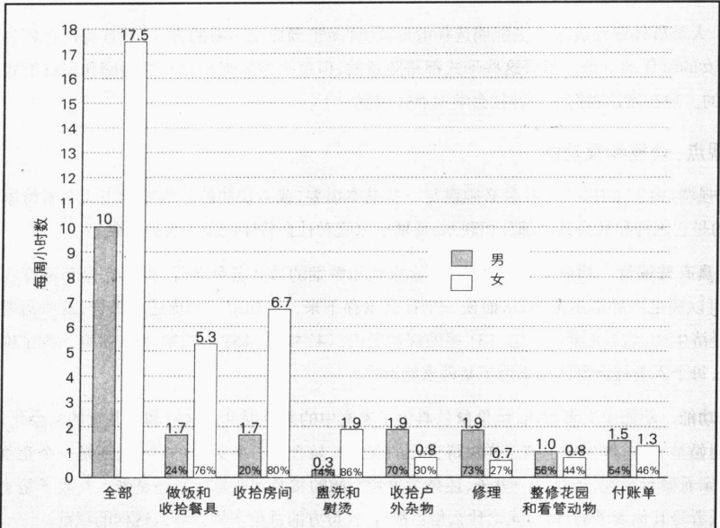

注：全国抽样调查结果。其中，做饭和收拾餐具是据原数据合并得出的。资料来源：作者根据 Bianchi et al., 2000: Table 1 整理而成。

毫不奇怪，每天8小时在外工作的妻子比丈夫平均每周要多做7.5小时的家务劳动(Bianchi et al., 2000)。如果我们加上照料孩子，妻子的总共劳动时间可能会达到一周11个小时(Bianchi and Spain, 1996)。让人难以置信的是，这相当于妻子在一年里一天工作24小时，一共工作24天之多。社会学家阿利·霍克希尔德(Arlie Hochschild, 1989)把这称为外出工作的妻子的“第二轮工作”。为了强调这种一边倒的情况，她引用了加里·特鲁多在讽刺漫画《杜恩斯比利》(Doonesbury)中的一段：

一位“获得了解放”的父亲正坐在电脑前写一本关于如何抚养孩子的书。他写道：“今天一早起来就有许多工作在等着我。当珍尼准备送杰弗瑞到日托中心时，我问她今天是否可以不做家务劳动。珍尼说：‘当然，我会挤出五分钟时间做你的活儿。’”

毫无疑问，繁重的家务劳动使妻子们产生了强烈的不满。这些问题，以及丈夫和妻子如何应对它们，将在下面的“批判性思考”部分进行讨论。

### 符号互动论观点: 社会性别和婚姻的意义

正如第 1 章所说，符号互动论者关注的是人们赋予其生活的意义。让我们用这一理论观点来看看有关丈夫和家务劳动的某些令人惊奇的发现。

---

### 第二轮工作——紧张和策略

为了了解双职工家庭的生活状况，社会学家阿利·霍克希尔德（Hochschild，1989）和她的研究助手采访和重访了50多个家庭。她也对其中12个家庭进行了参与观察。她和“他们一起上街购物，拜访朋友，看电视，吃饭，陪他们送孩子去日托中心”。

尽管现在的男人做的家务比前几年要多（Bianchi et al., 2000），但大多数人仍认为“第二轮工作”——下班后的家务劳动——是妻子的事。但当妻子下班后煮饭、打扫卫生和照料孩子时，许多人已经非常疲惫和情绪紧张。有些妻子以成为能做好一切事情的“超级妈妈”而自豪，但大多数妻子都是在咬牙忍耐着干额外的家务劳动，但她们心里也有气。这种疲惫感经常体现在夫妻的性生活上，妻子往往表现出性冷淡。

这种繁重的家务劳动压力不仅影响了夫妻关系，而且影响了妻子的自我概念。下面就是一个妻子如何试图恢复自尊的故事：

在休完第一个孩子的产假之后，卡罗尔·奥尔斯顿感到情绪沮丧，因为自己“胖了”，而且变成了一个“家庭妇女”。有段时间，当她在超市里购物时，总是想大喊：“我是一名MBA！我是一名MBA！”

为了分担家务劳动，一些丈夫降低了他们的事业心，或者减少其看电影、拜访朋友、做喜爱的事的时间。但多数男人都采取了霍克希尔德所描述的“抵制策略”。她对“抵制策略”是这样描述的：

等靠。许多男人从来不会主动去做家务。因为许多妻子不愿去要求(因为这好像是在乞求)男人做家务,所以这种策略通常都会取得成功。当一些男人被要求干活时,他们常常会故意表现出愤怒或拉长了脸,从而使妻子不愿再提起干活的事。

弄糟。当一些男人被要求做家务时，他们常常笨手笨脚。他们做米饭，常常会烧糊；他们去杂货店买东西，常常会忘记买什么东西；他们永远记不起烧锅放在哪里。霍克希尔德并没有指出他们这种行为是故意的，但她认为男人们根本不把精力放在家务上，他们通过这种“尽力但弄糟”的策略使妻子下次不再要求他们干活。

要求降低。一个典型的例子：两个孩子的爸爸说他不去买东西是因为他从来“不需要任何东西”。他从不熨烫衣服，是因为“他从不介意穿褶皱的衣服”。他从不煮东西，是因为“燕麦稀饭就不错了”。正像霍克希尔德观察到的那样，“通过降低生活需要这种策略，他的妻子不得不为满足自己更大的需要而操心他的穿着……并给他煮东西。”

甜言蜜语。称赞妻子把家务和工作处理得井井有条，不仅可以代替实际的帮忙，而且还可以巧妙地鼓励妻子继续做家务劳动。

ARLO & JANIS ® by Jimmy Johnson

这个漫画家很好地表现了霍克希尔德所讨论的要求降低策略。

---

### 思考题

霍克希尔德(Hochschild,1991)对于家务劳动问题的解决有十足的信心。根据以上材料，

1. 请分析第二轮工作(家务劳动)问题潜在的结构性根源。

2. 根据你对第一题的回答,请指出解决此问题的结构性办法。

3. 考虑双职工夫妇如何能最合理地解决这个问题。

第一个发现或许正是你所预料到的——丈夫和妻子的收入水平越接近，他们就越有可能共同分担家务劳动。尽管在这种家庭中，丈夫并不能和妻子平等地做家务，但他们会比其他家庭的丈夫做得多。然而下面这个发现可能会令人惊奇：当丈夫被解雇时，他可能会做比以前更少的家务。收入比他们的妻子少的丈夫通常会做更少的家务。

我们怎样解释这种现象呢？人们通常认为，如果丈夫失业或比妻子挣得少，他应该做更多而不是更少的家务来平衡和妻子的关系。研究者指出，答案在于社会性别角色上。如果一个妻子挣的比她的丈夫多，这将威胁到丈夫的男子汉形象——他把这看做他传统的供养角色的失败。去做家务——在他眼里是“女人的事”——将会进一步威胁到他的男子汉形象。通过不做家务，他“重新恢复”了自己的男子汉形象（Hochschild，1989；Brines，1994）。

### 家庭生活圈

我们已经看到婚姻和家庭有各种不同的形式，并从三种社会学视角探讨了婚姻和家庭。现在我们来探讨一下爱情、求爱和家庭生活圈。

### 爱情和求偶面面观

在印度人的婚姻中，丈夫和妻子的角色是固定的。无论是我在印度汽图所拍摄的这个妇女，还是她的丈夫，都不会质问为什么她需要将家人要洗的衣服带到村里的压水井那里。印度的妇女数千年以来，一直在从事这种工作。随着印度工业化的推行（就像西方国家所发生过的），谁洗衣服将会被质疑，甚至最终会成为婚姻张力的根源。

不久以前，社会学家还认为浪漫的爱情产生于中世

纪的西欧 (Mount, 1992)。社会学家威廉·扬科夫维克和爱德华·费希尔 (Jankowiak and Fischer, 1992) 在调查了全世界 166 个社会后发现, 事实并非如此。罗曼蒂克爱情 (romantic love) ——人们与异性相互吸引并理想化对方——在 88% 的这些群体中都存在。但是, 爱情的作用在不同的社会完全不同。正像下面的 “文化多样性” 专栏中引用的印度的例子那样, 直到结婚以后, 印度人才指望有爱情产生。

---

# 东方是东方，西方是西方……印度的爱情和包办婚姻

自从阿龙·贝拉特·拉姆带着美国密歇根大学学位证书回到印度，他的母亲便宣布要为他找一个妻子。阿龙在任何地方都是一个“抢手货”：27岁、良好的教育、有教养、聪明、英俊潇洒——并且还将继承大笔财产。

阿龙的妈妈心里已经有了个人选。玛妞来自一个稳定的中产阶级家庭并拥有大学文凭。阿龙和玛妞在一家豪华的酒店咖啡间见了面——双方父母也在场。他发现她很漂亮和安静，他喜欢她这一点。她则对他从不夸耀自己的家庭背景而印象深刻。

四次单独约会过后，他们的父母问他们是否愿意结婚，他们都同意了。

印度内阁总理和 1500 多名客人应邀参加了他们的婚礼。

“我当时并不爱他，”玛妞说，“但是我们交谈时，我们有许多共同点。”她接着又说：“但现在我离开他会活不了。自从见了他以后，我就没有想过别的男人。”

尽管印度已经经历了深刻的社会变革，但印度社会学家估计，仍有95%的婚姻是由父母包办的。不过在今天，像上面例子里的男女对父母的选择可以有自己的否决权。另外一个变革就是两个人在婚前能够交谈——这在一个世纪以前是不被允许的。

为什么印度会有包办婚姻呢？为什么这种风气如此盛行，以至于受过高等教育者和上层社会也是如此呢？我们也可以问：为什么在美国婚姻如此具有个人化特点呢？

我们用两个社会学观点来回答这个问题。首先，一个群体的婚配与它的价值观相符。个人自主婚姻符合美国人追求个人性和独立性的价值观，而包办式婚姻则符合印度人尊重父母权威的价值观。对于印度人来说，允许不受限制的约会，意味着把婚姻这件大事托付给了没有经验的年轻人。

其次，一个群体的婚姻选择与它的社会分层模式相符合。印度的包办式婚姻把婚姻限制在同一种姓内，从而保证了种姓血统。不被监护的约会将会鼓励婚前性行为，而这种婚前性行为将会破坏家族血统。与此相反，婚姻的纯洁性使上层阶级的成员可以确定孩子的父亲是谁。因此，印度人通过社会化使自己的孩子相信，在婚姻问题上父母拥有更多的智慧。在家族血统不重要、不存在种姓制的美国，年轻人自主选择约会对象的做法，则与社会阶级系统的相对开放性相吻合。

甚至对于爱情的看法东西方都不相同。在印度，爱是一种平和的感情，建立在长时间的相互承诺和对家庭的共同热爱上。印度人也相信爱可以在两个人之间“创造”出来。当然，要想产生爱，必须有合适的条件。婚姻就是这种合适的条件之一。

这些不同的文化背景，产生了对爱情和婚姻的不同观念。美国人认为爱情具有神秘的力量，是一种能瞬间产生的激情。印度人认为爱情是一种平和的感情，它产生于男女在生活中建立起一种亲密的、志同道合的关系。但或许最不同的就是：对于美国人来说，爱情导致了婚姻，而对于印度人来说，则是婚姻产生了爱情。

### 思考题

你认为印度人的婚姻和爱情模式各有何优点？你认为印度人的模式在美国能行得通吗？为什么？你认为爱情可以“创造”出来吗？或是人们会一见钟情？你的爱情观是什么？

资料来源：Gupta (1979); Brmiller (1992); Sprecher and Chandak (1992); Whyte (1992); Dugger (1998); Easley (2003)。

印度金奈的这个广告牌吸引了我的注意力。如正文中所指出的，虽然印度正在进行工业化，但是许多人仍然遵循着传统的习俗。这个广告牌是时代转变的标志。

---

因为爱情在西方人眼里如此重要——并经常被认为是婚姻的唯一正当基础，社会学家用下列测量工具——实验、问卷、访谈和观察——来探讨这一概念。在心理学家唐纳德·达顿和阿瑟·阿隆有趣的实验中，他们发现恐惧可以滋生爱情(Rubin，1985)。下面是他们所做的实验。

在距不列颠哥伦比亚省温哥华北郊的卡皮兰诺河69米高的地方，一座人行桥在风中晃来晃去。这使你不想从这座桥上走过，因为你极有可能会掉到布满岩石的深谷中去。另一个更坚固的人行桥横跨在离浅浅的水面只有3米高的地方。实验者让一个漂亮的女人接近那些正在渡河的男人。她告诉他们，她正在研究“看到美丽风景对创造性表达的影响”。她给他们出示一幅画，然后让他们写出自己的联想。实验表明，从那些摇摇晃晃、令人惊慌的人行桥上经过的实验者，比在坚固的桥上经过的人们会更多地产生性联想。这说明从摇晃的桥上经过的人产生了更多的性兴奋。后来在这些人里也有更多的人给这位年轻女人打电话——借口是询问有关她的研究情况。

你可能已经注意到，这项研究其实研究的是性吸引而不是爱情。然而，浪漫的爱情往往始于性吸引。如果某人在性上吸引我们，我们就会和那个人相处。如果我们发现有共同的兴趣，我们可能就会把我们的感觉叫做“爱情”。显然，罗曼蒂克爱情有两个成分。第一个是情感性的，是对性吸引力的感觉。第二个是认知性的，我们把感觉贴上标签。如果我们贴上了这个标签，我们就认为自己已经“坠入爱河”。

### 婚姻

通常情况下，美国的婚姻始于“爱情”，但与俗语说的相反，爱情无论如何都不是盲目的。也就是说，爱情并非造化弄人，丘比特也不会拿着箭向人群中乱射一气。如果那样的话，婚姻的形式将是不可预测的。只要仔细看看谁和谁走到一起，我们就会发现，爱情是遵循其社会渠道的。

爱情和婚姻的社会渠道 当我们结婚时，我们一般会认为我们是自由选择的伴侣。然而，在大多数情况下，我们的选择都遵守了高度的可预测的社会渠道，特别是年龄、教育情况、社会阶级和种族。例如，一个拥有大学学历且父母都是内科医生的拉美裔女人极有可能会爱上一个同样有大学学历且年龄稍大的拉美裔男人并和他结婚。同样，一个中学辍学在家且父母都是靠社会福利机构度日的女孩，则极有可能爱上和她有着同样背景的男人并和他结婚。

社会学家使用同类婚姻（homogamy）来指人们在选择伴侣时倾向于与同类的人结合。同类婚姻大多是因为空间上的接近。也就是说，我们会“爱上”和我们居住接近的或者在学校、教堂或工作场合经常遇见的人并与之结婚。我们与之交往的那些人，远非一个总体中的随机样本，因为社会的过滤机制使邻里社区和学校(以及教堂、寺庙和清真寺)具有种族和社会阶级特征。

同所有的社会模式一样，这里当然也会存在例外。尽管有94%的美国人会选择和自己有同样种族背景的人结婚，但仍有6%的人不这样。在美国，大约有6000万对夫妇，这6%的人加起来总共有360万对。

美国婚姻史上一个显著的转变，就是种族间婚姻的增长。我们可以把这种转变归因于20世纪60年代的社会规范标准的变革。这段时期里产生的变革之一，就是求偶中“肤色界限”的突破。正像你从图16.2中看到的那样，种族间婚姻也表现出特有的模式。

---

图 16.2 丈夫和妻子是白人或黑人的种族背景

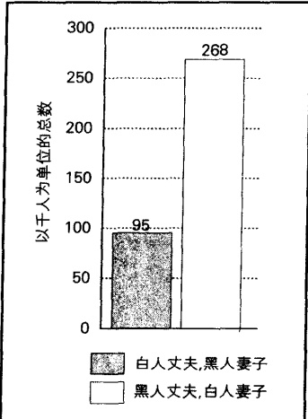

资料来源：作者根据 Statistical Abstract 2002: Figure 47 整理而成。

### 生育

教育和收入在决定妇女生育数量时具有重要作用。例如，大学学历的妇女比没有上大学的妇女有更少的孩子。即便是大学肄业的妇女，也比从未上过大学的妇女生育的数量要少。收入的情况也是如此。一般来说，一个妇女的收入越高，生育的孩子数量越少(Statistical Abstract 2002: Table 82)。

当孩子降临人世后，情况会如何呢？大多数人都认为父母会高兴得发狂，但事实却并非如此。

婚姻满意度 社会学家发现，当孩子出生以后，通常会使矛盾增加，婚姻满意度下降（Whyte，1992；Bird，1997；Rogers and Amato，2000）。为了理解其原因，我们可以回顾一下第6章的观点：两人世界会比三人世界产生更多的亲密感（在增加一人后，互动定被分享）。另外，孩子的出生往往会打破夫妇之间原有的平衡感（Knauth，2000）。更实际地思考一下，当我们必须面对一个24小时需被喂养、换尿片和哄睡的孩子，同时拥有更少的睡觉时间和更多的花费时，婚姻生活会受到什么样的影响？

### 社会阶级 社会学家莉莲·鲁宾 (Rubin, 1976, 1992b) 比

较了50个工人阶级家庭和25个中产阶级家庭的情况，发现不同社会阶级的人对于孩子的到来有着不同的适应性。对于工人阶级家庭来说，第一个孩子一般在结婚9个月后出生。他们几乎还没有适应丈夫和妻子的角色，就又要承担起要求更高的父亲和母亲的角色。结果往往是经济困难、吵架和姻亲的干涉。年轻的丈夫不愿意“安定”下来，他们也埋怨妻子对他们的冷落。一个刚结婚5个月就有了孩子的工人阶级丈夫对鲁宾说的话很有代表性：“在家里，只有我一个孩子，我以为终于找到了一个可以照顾我的人。突然，我却必须照顾一个孩子，并且我妻子忙于照顾孩子，根本就不管我。”

与此相反的是，中产阶级夫妇会推迟他们第一个孩子的出生时间，这样就给予了彼此更多的调整时间。一般说来，他们的第一个孩子在结婚三年后出生。他们较高的经济实力也给他们提供了帮助，使得他们生活更容易，婚姻更美满。

### 抚养孩子

当父母都去工作后，谁来照顾孩子呢？一代人以前这个问题可能是荒谬的，因为那时母亲会在家照顾孩子。但现在，正像开篇短文中的沙伦那样，3/5 的美国母亲要去上班工作，那么谁来照顾孩子呢？

已婚夫妇和单身母亲 图 16.3 比较了已婚夫妇和单身母亲对孩子的照顾情况。正如你所看到的，整体上看情况大致相似。对于每个群体来说，大约 1/3 的孩子是在家庭中被照看的。主要的不同是当母亲去工作后父亲所承担的角色。对于已婚夫妇来说，大约有 1/4 的孩子由父亲来照看，而对于单身母亲来说，这一比率降至只有 1/14。正如你所看到的，祖父母会代替缺位的父亲来帮助照看孩子。

---

图 16.3 当母亲工作时谁来照顾学前儿童   资料来源：O'Connell (1993)。

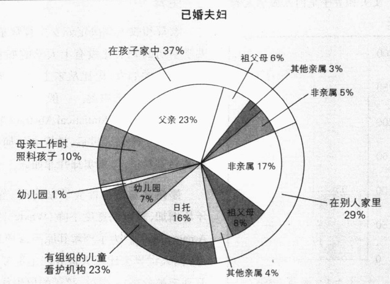

单身母亲

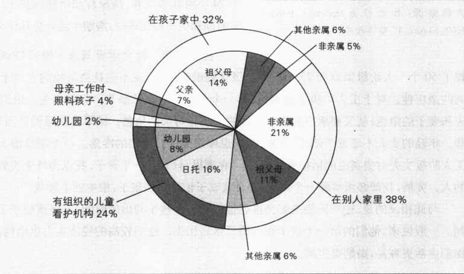

日托中心 如图 16.3 所示，大约 1/6 的孩子会到日托中心。关于日托中心的研究结论在第 3 章中已经提到。很显然，美国只有少数日托中心能提供高质量的服务，如激发学习活动、安全和情感支持（Bergmann，1995；Blau，2000）。造成这种糟糕局面的主要原因是日托工人的工资太低，他们平均每年只有 12000 美元的收入（Statistical Abstract 2002: Table 546, 547）。

父母很难判断日托中心的服务质量如何，因为把孩子送到日托中心后会发生什么他们无从知道。如果你想找日托服务，下面两点提示将会对你有所帮助：拥有早期儿童开发专业训练经验的员工，以及一个员工带数量相对较少的孩子(Blau,2000)。如果你担心你的孩子会受到忽视甚至虐待，你应该选择

---

一个在网上可以看到闭路摄像的日托中心。当你工作时，你可以从网上“浏览”日托中心各个房间的情况，看到你的孩子的活动情况和被照料的情况(Hall,2001)。

保姆 对于中上阶级家庭，雇佣保姆很流行。父母喜欢这种一对一的照顾。他们也喜欢家里看护的方便性，因为这既可以减少孩子得病的可能性，也可以减少不得不把孩子送到陌生环境的麻烦。然而，一个经常出现的问题就是父母和保姆之间的紧张关系：父母会忌妒保姆首先看到孩子迈出第一步，说出第一个字，或者更糟的是被叫做妈妈。在不同的教育风格上，父母和保姆也有矛盾。保姆会鄙视那些不在家和自己的孩子待在一起的母亲。当孩子因保姆离开而不是因母亲上班而大哭时，母亲会感到一种酸涩的负罪感、甚至忌妒感。

社会阶级 社会阶级在孩子的抚养问题上会造成很大的差别。正像第3章中所提到的，社会学家梅尔文·科恩发现，父母通过社会化给孩子灌输他们工作世界里的规范。因为工人阶级的成员在工作中总是被监视，并被要求服从明确的规则，他们在教育孩子时也就总是更多地关注孩子的顺从，而不太关注孩子的动机。因此，他们就会更多地使用体罚。相反，中产家庭父母由于在工作中总是被希望发挥其主动性，因此他们更关心开发孩子的好奇心、自我表现和自控力。因此，他们也就更可能平等理智地来对待自己的子女，而不用体罚。

父母的社会阶级不同，他们对子女成长的看法也会不同（Lareau,2000）。较低阶级的家庭认为孩子是自然而然成长的，而中产阶级父母则认为必须对孩子施加正确的引导。因此，较低阶级的父母往往倾向于给自己的孩子划定一定的范围，然后让他们自由选择其活动，而中产家庭的父母则会帮助孩子在业余活动中开发他们的思维和培养社会技能。

出生顺序 出生顺序也非常重要。父母倾向于给予他们的第一个孩子更多的关心和照料。当第二个孩子出生后，第一个孩子就会为继续受宠而努力。研究者发现，这为第一个孩子注入了更大的成功动机，因此他们比弟弟妹妹们更有可能学习好、上大学并继续深造。第一个孩子也更可能成为宇航员、登上《时代》杂志的封面和成为美国总统。尽管弟弟妹妹们或许没有那么出色，他们本身并不特别地渴望成功，他们也会拥有很好的人际关系（Snow et al., 1981; Goleman, 1985; Storfer, 2000）。第一个孩子更倾向于维持现状，支持保守派的做法，而后来出生的人则更倾向于打破现状，支持自由派（Sulloway, 1997）。

尽管这些倾向很明显,但它们也只是一种倾向而已。出生顺序、社会阶级或任何其他社会特征,并不能产生必然的结果。

### 家庭生活的后期阶段

家庭生活的后期阶段既有它的欢乐之处，也必然会面临一些特有的问题。让我们来看一下空巢家庭、退休和寡居。

空巢家庭 当最后一个孩子离开家后，丈夫和妻子就和他们刚结婚时那样“孤守在家”了。这种情形，有时被叫做空巢（empty nest），被认为是妇女所要艰难面对的一段困难时期，因为她们曾对孩子的成长付出了太多的精力，而现在已经不再需要继续这个角色了。社会学家莉莲·鲁宾（Rubin，1992a）访问了部分职业女性和家庭主妇，发现这在很大程度上是一个神话。与刻板印象完全相反，许多妇女在最后

---

迄今为止，人们还没有发现家庭的合适替代物。虽然家庭的形式和功能在世界各地是不同的，家庭仍然是儿童主要的社会化主体。

一个孩子离开家后，一般来说，满意度会上升。在访谈中，一位45岁的妇女身体前倾坐在椅子上，好像要告诉罗宾一个秘密。她的话可以说很有代表性：

说实话，大多数时候，当他们全离开家后我感到很轻松。或许不应该这样说。但是你知道吗？我认识的许多妇女都会这样想。她们之所以不愿讲出来，只是因为人们都在说当孩子们离开家后，妈妈们有多么的伤心。

其他研究者也得出了类似的结论，他们发现大多数母亲对于又可以有时间发展自己的兴趣爱好感到很高兴。许多夫妇还说，此时彼此间又建立了一种新的亲密感（Mackey and O'Brien，1995）。这种亲密感产生的原因有四个：夫妇双方卸下了抚养孩子的许多事；他们拥有了更多的空闲；他们的收入达到了最高峰；他们没有了更多的经济支出。

“回巢孩子”和非空巢家庭 空巢家庭并非像以前那样空。由于受教育时间延长和建立一个新家庭所需的高额费用，美国孩子现在离家越来越晚。许多人大学期间仍住在家中，有的甚至大学毕业后仍住在家中，还有些人在自己出去闯荡一番后发现生活的艰辛，又跑回父母家。结果，美国24—29岁人中有42%仍与他们的父母住在一起（Statistical Abstract 2000: Table 12,70）。有些人称他们为“回巢孩子”，也有人称他们为“成年青少年”，他们担忧和逃避建立自己独立的生活，喜欢受到家庭的保护，但他们将不得不面对依赖父母的问题。

寡居 女性比男性会更多地面临寡居以及随之而来的问题。这不仅是因为平均来说妻子比丈夫寿命长，而且也因为她们更多地选择比自己年长的伴侣。配偶的死亡使得自我破碎，多年来形成的身份受到威胁。现在，那个生命中极为重要的人不在了，寡居的女性，如同青少年一样，不得不再度面对一个缠人的问题：“我是谁？”

当死亡不期而至时，适应飞是非常困难的(Hiltz,1989)。知道配偶即将去世的人会对这种转变有所准备——从经济上到精神上准备过孤单的生活。有时间说再见，并珍藏最后的记忆，这可以使未亡人更好地适应亲密伴侣的去世。

### ■美国家庭的多样性

认识到没有所谓的“美国家庭”这回事，是非常重要的。在美国，家庭生活多种多样。正如以前所提到的，当我们考查美国家庭的多样性时，社会阶级的重要性仍是显而易见的。

### 非裔美国人家庭

请注意，非裔美国人家庭也是多种多样的。同白人家庭或拉美裔家庭一样，非裔美国人家庭也没有某种固定形式。其重要差异不在种族群体之间，而在社会阶级之间。上层阶级的非裔美国人家庭往往

---

会维护像第10章所提到的本阶级的利益——特权的维护和家族财产的保护——他们特别在乎自己孩子结婚对象的家庭背景(Gatewood,1990)。对他们来说，婚姻是家族的联合。这一阶级的孩子往往比其他阶级的孩子结婚要晚。

中产阶级非裔美国人家庭则对成就和受尊重很感兴趣。丈夫和妻子都很可能要在外工作。他们特别关心孩子能上大学，得到理想的工作，拥有理想的婚姻——也即和他们类似的人(即那些体面的、努力工作的、学业有成、事业心强的人)结婚。

贫困的非裔美国人家庭则要面对与贫困有关的一系列问题(Wilson, 1987, 1996; Anderson, 2001)。因为这一阶级的男人可能没有什么技能来参加工作，很容易失业，他们往往很难胜任丈夫和父亲这一文化角色。因此，这类家庭往往由妇女当家，其中的单身母亲有较高的生育率。离婚和遗弃在这一阶级中也比其他阶级中常见。分享有限的资源和“扩大的亲属关系”，是这一阶级非常重要的生存机制。也就是说，在困难时提供帮助的人被认为是兄弟姐妹，人们像对待真正的亲戚一样对他们承担义务(Stack, 1974)。社会学家使用虚拟亲属(fictive kin)这个术语来指代这种扩大了的亲戚关系。

从图 16.4 中可以看出，与其他族群相比，非裔美国人家庭最没可能由夫妇共同当家，最有可能由妇女当家。由于婚姻挤压——性别比的失衡，在这种情况下，每 1000 个未婚妇女对应更少的男性——非裔美国妇女更可能与比自己文化水平低的人结婚（South, 1991; Eshleman, 2000）。

### 拉美裔美国人家庭

如图 16.4 所示，拉美裔家庭由夫妇双方共同当家和由妇女当家的比例，介于美国白人和非裔家庭之间。刚才提到的社会阶级的作用，同样适用于这类家庭。另外，原国籍不同，所组成的家庭形式也不同。例如，来自古巴的家庭由夫妇共同当家的比例，要比来自波多黎各的家庭大一些（Statistical Abstract 2002；Table 40）。

图 16.4 家庭结构：美国家庭中男性、女性和已婚夫妇为户主的百分比

注：该处资料中的“白人”指非西班牙裔白人。

资料来源：作者根据 Statistical Abstract 2000: Table 44; Statistical Abstract 2002: Table 37, 38, 40 整理而成。

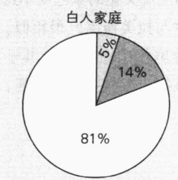

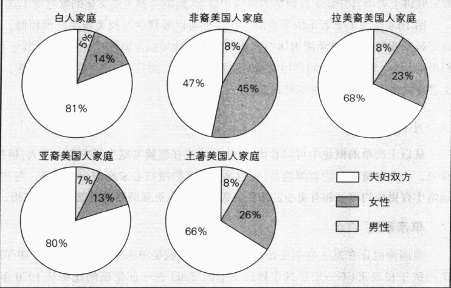

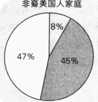

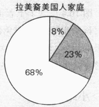

---

拉美裔家庭真正独特的地方在于它的文化——尤其是讲西班牙语、信奉罗马天主教、对离婚的反感和强烈的家庭取向。尽管学者们目前还有很大争议，但多数人都认为其另一特征是大男子主义——强调男性的力量、性活力和男性统治。在来自墨西哥的家庭里，丈夫和父亲扮演着比美国白人和非裔家庭更重要的角色(Vega，1990)。来到美国后，大男子主义一代代地渐渐减弱(Hurtado et al., 1992；Wood，2001)。妻子和母亲通常负责日常事务处理，为家庭作日常安排和管教孩子。她通常会比她的丈夫更以家庭为中心，并对孩子表现出更多的热情和感情。

当然，以上概述并不很准确，同其他类型的家庭一样，单个拉美裔家庭会表现出很大的不同(Baca Zinn, 1994; Carrasquillo, 1994)。

### 亚裔美国人家庭

从图 16.4 中可以看到，亚裔美国家庭的结构和美国白人家庭大致相同。和其他族群一样，亚裔家庭生活也反映了社会阶级的不同。另外，由于亚裔家庭来自不同的亚洲国家，它们的家庭生活也反映了许多不同的文化。和拉美裔家庭一样，移民时间越晚，他们的家庭生活就越会反映出其祖国的文化模式（Kibria，1993；Glenn，1994）。

社会学家鲍勃·苏卒凯（Bob Suzuki，1985）通过研究华裔美国家庭和日裔美国家庭，发现了一些明显的特征。尽管亚裔家庭采用了核心家庭的形式，它们仍然保留着为家庭生活提供独特支撑的一些儒家价值观：仁慈、集体主义、自律、等级制、尊敬长辈、谦逊和责任感。责任感是指家庭每个成员都要尊重其他家庭成员，并且永远不要使家庭蒙羞。亚裔家庭抚养孩子比盎格鲁家庭更娇惯。为了教育孩子，他们不是一味体罚，而是培养他们有羞耻感和内疚感。

### 土著美国人家庭

或许土著美国人家庭面临的最重大的一个问题就是：继续遵守传统价值还是同化到主流文化中去（Yellowbird and Snipp，1994；Garrett，1999）。不同的选择给土著美国家庭带来了不同的重要影响。传统派家庭讲土著语言并强调其独特的价值和信念，而融合到主流文化的家庭则不这么做。

图 16.4 反映了土著美国家庭的结构。你可以看到这与拉美裔家庭很相似。总之，土著美国家庭父母对孩子非常疼爱，避免使用体罚。与大多数其他美国家庭相比，老年人在其子女的家庭里扮演了更为积极的角色：老年人，特别是祖父母，不仅照看孩子，而且担当教育孩子的重任。像其他家庭一样，美国土著家庭也因社会阶级的不同而不同。

### ▷▷小结

从以上简单的概述中可以看出，种族—民族在理解家庭生活中意义不大，但社会阶级和文化却至关重要。一个家庭拥有的资源越多，它越具有中产阶级核心家庭的一些特征。与贫穷家庭相比，中产家庭通常生育更少的孩子和有更少的未婚妈妈。他们也更强调教育成就和远大理想。

### 单亲家庭

美国家庭正在发生深刻变迁的另一个证据，就是单亲家庭的增加。正如你从图 16.5 中所看到的，美国孩子和双亲（不一定是其生物意义上的父母）在一起生活的比率从 1970 年的 85% 下降到今天的

---

69%。对单亲家庭的担忧更多的是其面临的贫困问题，而不在于单亲本身。因为妇女是大多数单亲家庭的户主，这种家庭大多都会陷于贫困之中。尽管大多数离婚妇女挣钱比前夫少，但却有85%的孩子都由其母亲养育（“Child Support” 1995；Aulette，2002）。

为了理解典型的单亲家庭，我们必须从贫困这个视角来考察，因为贫困正是单亲家庭压力的主要来源。不仅是对单亲家庭的父母和孩子，而且对于整个社会来说，贫困的后果都是非常严重的。来自单亲家庭的孩子更可能失学、被捕入狱、出现情感问题并离婚（McLanahan and Sandefur，1994；Menaghan et al.，1997）。如果是女性的话，单亲家庭的孩子更有可能在青少年时期成为未婚妈妈。

### 丁克家庭

尽管大多数已婚妇女都会生育孩子，但仍有大约1/5（19%）的妇女不要孩子。这一现象如此流行，以至于这一比例比20年前翻了一番（Bachu and O'Connell，2000）。从图16.6中可以看出，这一比例因种族不同而有所不同。大多数没有孩子的父母都是主动决定不生育的，为什么呢？当然，有些人仅仅是因为不喜欢孩子，但最主要的原因还是想获得一种自由感——有更少的压力，能够自由转换工作或能够在工作后尽情地放松（Lunneborg，1999）。一些妇女认为一个孩子给家庭带来的压力，将会使婚姻难以维持。另一些人则认为，他们将会被羁绊在家中——无聊、孤独、事业机会渺茫（Gerson，1985）。或许，一则新闻里的一段话说出了最普遍的原因：

我们是丁克家庭(DINKS,双收入,没孩子),我们的婚姻非常幸福。我43岁,我妻子42岁。我们结婚差不多20年了。我们追求的目标与我们的个人哲学密切相关:“要么要孩子,要么要其它东西。”

在当前的趋势下——妇女受教育水平的提高和更多的就业机会；合法堕胎；先进的避孕手段；抚养孩子的高额费用；永无止境的物质需要——妇女不生育孩子的比例将会继续增加。

但也有许多夫妇不是故意不要孩子的。为了得到渴望的孩子，一些人去领养，另一些人寻求别的办法，这些将在下面“社会学和新技术”专栏进行介绍。

图 16.5 双亲家庭的下降

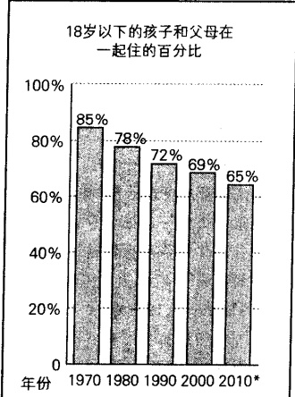

 $ ^{*} $作者估计。

资料来源：作者根据 Statistical Abstract 1995: Table 79; Statistical Abstract 2002: Table 54 整理而成。

图 16.6 美国已婚妇女不要孩子的百分比

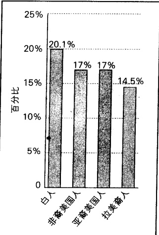

资料来源：作者根据 Bachu and O'Connell (2000): Table A 整理而成。

---

### 社会学和新技术

### 高科技生育技术的未来世界: 对法律和常理的冲击

杰茜有五个妈妈，或者可以说一个也没有，这要看你怎么看这件事。事情是这样的：卢阿妮和约翰·布詹卡不能生育。尽管他们花了超过10万美元的费用进行治疗，但还是没有效果。后来一个生殖中心将一对匿名男女的精子和卵子进行了结合。一位外科医生把这枚受精卵植入一个名叫帕梅拉·斯内尔的女人体内，她生下了杰茜(Davis, 1998a; Foote, 1998)。

当帕梅拉把杰茜交给一直守在身边的卢阿妮的时候，她作为替身母亲的工作就结束了。约翰原本也应在那里，但不幸的是，他在一个月之前就和卢阿妮离了婚。

卢阿妮向约翰索要孩子的抚养费，约翰拒绝了，于是卢阿妮上告到法院。法官判决约翰不必给孩子抚养费。他认为，由于杰茜是由两位匿名男女提供的精子和卵子在有盖培养皿里结合受孕的，约翰并不是孩子的父亲。法官还认为卢阿妮也不是孩子的母亲。

5个父母——或一个都没有？欢迎来到这个由高科技生育技术带来的美丽新世界。尽管大多数通过高科技程序帮助降生的孩子以为只有两个父母，但生育技术对那些不加怀疑的人来说可真是一场噩梦。

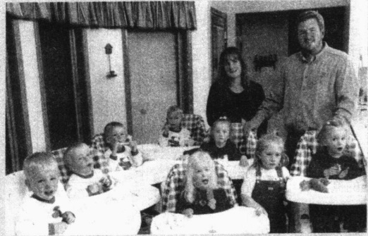

这张照片里是美国爱荷华州卡莱尔的七胞胎与他们父母——博比和肯尼，以及他们六岁的姐姐米凯拉。

### 思考题

那么父亲又是谁？思考一下这个例子：印第安纳州杰克森维尔的伊丽莎白·希金斯一直不孕。她向梅莫瑞尔医院提供了自己的卵子，而她的丈夫则提供了精子。但是医院的技术人员错将他人的精子与伊丽莎白的卵子进行了结合。受精卵被植入伊丽莎白的体内，她后来生下了一对双胞胎女儿。希金斯夫人是白种人，而她的丈夫是黑种人，但希金斯先生发现这对女儿只有白人的特征，一点都不像自己，他不能和她们建立起纽带来。于是希金斯先生和夫人分居了。他们起诉了这家医院，要求医院提供抚养费。他们认为，是这家医院，而不

在我们的新高科技世界，母亲是谁？是生下杰茜的帕梅拉·斯内尔吗？令人惊奇的是，她并不是。那个捐献卵子的人是吗？从生物学上说，是的，但从法律上讲则不是。卢阿妮是孩子的母亲吗？幸运的是，为了杰茜考虑，更高的法院认定她是孩子的母亲。

是希金斯先生，是这对双胞胎女儿的父亲(Davis,1998b)。

在这个未来世界里，如果一家医院能成为孩子的父亲，那么谁是其祖父母呢？新奥尔良的一个男人向一家生育诊所捐赠了自己的精子。他死后，他的女友决定用他的精子进行人工授精。但该男子悲痛欲绝的父母感到很不安，因为他们的孩子虽然死了，却仍可以成为父亲。他们也担心这些孩子——他们的孙子们——会索要他们的财产(Davis, 1998b)。

你怎样用常识来理解这些事情呢？

---

### 混合家庭

美国社会一种日益重要的家庭类型是混合家庭 (blended family)，即家庭成员来自原本另外的家庭。两个离婚的人各自带着自己的孩子组成的一个新的家庭单元就是一个混合家庭。由于如今离婚如此普遍，成千上万的孩子的一部分童年都是在这种混合家庭里度过的。其结果之一就是形成了更为复杂的家庭关系。思考一下一位同学所描述的下列情况：

我和我爸住在一起。确切地说，应该是和我爸、兄弟(他父母也是我父母)、我同父异母的妹妹(她父亲是我父亲、她妈妈是我父亲的上一位妻子)、一个继弟弟、一个继妹妹(他们是我父亲现任妻子带过来的孩子)住在一起。我父亲的妻子(我目前的继母，不是我父亲的第二个妻子)又怀孕了，我们很快又会有一个新的弟弟或妹妹出生，或者同父异母弟弟或妹妹出生。

如果你被搞糊涂了,我不会怪你。我自己也犯难。圣诞节将会特别难堪,我们应全部呆在一起?还是各自回到以前的家庭中去?如果要买礼物,我们究竟该为谁买呢?

### 同性恋家庭，

1989年，丹麦成为世界上第一个使同性婚姻合法化的国家。从那时开始，荷兰、挪威、瑞典和加拿大安大略省也都陆续承认同性婚姻合法。2000年，佛蒙特州成为第一个使“同性恋联盟”合法的州。除了名称，“同性恋联盟”和婚姻并无其他区别。在继承、财产转移、医疗决定、保险及州收入税等诸多方面，“同性恋联盟”的伙伴拥有与合法夫妇一样的权利。如果他们想分开，他们必须通过家庭法院的“解散”程序。2003年，马萨诸塞州高等法院裁定：禁止同性结婚属于违宪。

同性恋家庭在美国的分布不是很均衡，他们主要居住在城市里，并且有一半人高度集中在20个城市里。最集中的地区是旧金山、洛杉矶、亚特兰大、纽约和华盛顿特区。大约1/5的同性恋夫妇先前都有过和异性结婚的历史，大约22%的女同性恋家庭和5%的男同性恋家庭都有以前婚姻留下的孩子(Bianchi and Casper, 2000)。

同性恋婚姻是什么样子的呢？像生活中其他任何事物一样，对同性恋夫妇也不能一概而论。与异性夫妻一样，社会阶级是非常重要的，生活取向也随教育、职业、收入的不同而不同。社会学家菲利普·布卢姆斯坦和佩珀·施瓦茨（Philip Blumstein and Pepper Schwarts，1985）采访了一些同性恋家庭，发现他们主要的矛盾在于家务劳动、钱、职业、与亲戚的矛盾和性别适应——和异性夫妇遇到的问题一样。同性俩人更可能分手，因而要求同性婚姻合法化的一个理由就是，婚姻可以使他们的关系更加稳定。

### 美国家庭的发展趋势

由此可见，美国婚姻和家庭生活正在经历一场深刻的变革。下面让我们来看看这场变革的其他方面。

### 晚婚

图 16.7 揭示了美国婚姻一个非常重要的转变。正像你所看到的，新郎和新娘的平均初婚年龄从1890年到1950年一直在下降。1890年初婚新娘一般是22岁，但到1950年则是刚过20岁。这之后的

---

图 16.7 美国人初婚的中间年龄

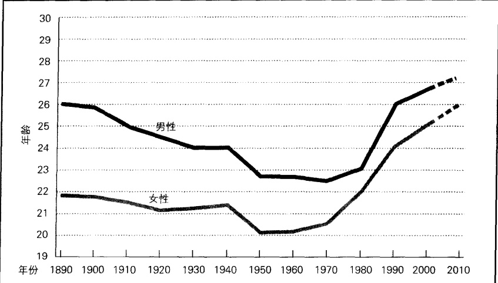

注：虚线部分为作者的估计。

资料来源：作者根据 Statistical Abstract 1999: Table 158; U.S. Bureau of the Census 2003 整理而成。

图 16.8 美国 20—24 岁未婚青年百分比

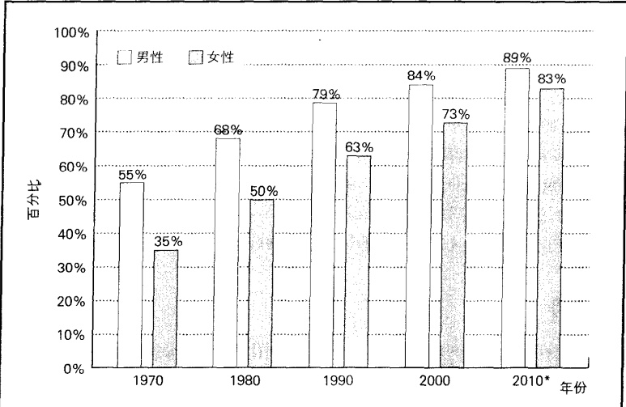

注： $ ^{*} $为作者估计。

资料来源：作者根据 Statistical Abstract 1993: Table 60; Statistical Abstract 2002: Table 48 整理而成。

---

20年经历了较小的变动，但到1970年这一平均年龄却陡然激增。现今美国新郎和新娘的平均初婚年龄比美国历史上任何时代都要大。

因为晚婚已成为今天的趋势，许多读者可能会吃惊地发现，大多数美国妇女过去到24岁时都已结婚。图16.8描绘了这种转变，它显示了美国年轻人未婚比例大幅增长的趋势。现在这一年龄段未婚女性的比例是1970年的两倍还要多。

为什么会发生这种转变呢？原因就是同居(Michael et al. 2004)。尽管美国人推迟了他们第一次结婚的年龄，他们并未推迟他们与异性共同生活的年龄。让我们看一下图 16.9 中列出的同居趋势。

### 同居

图 16.9 显示了同居 (cohabitation, 也就是成年人未婚婚但与性伙伴共同生活在一起) 增加的趋势。该图在社会学中很引人注目, 我们很少看到有这么陡峭和稳定的趋势图。同居者的数量如今是 30 年前的 8 倍。当今已婚夫妇半数以上在婚前同居过。在一代人以前, 这一比例只有 8% (Bianchi and Casper, 2000)。同居现象如今如此普遍, 以至于大约 40% 的美国孩子都将在同居家庭中生活一段时间 (Scommegna, 2002)。

图 16.9 反映了人们态度和行为的显著转变——从一代人以前对“鬼混”的鄙视，到现在的广泛接受。从我的观察得知，现今的父母对于自己儿子或女儿开始同居表现高兴很是平常。一些父

图 16.9 美国的同居增长趋势

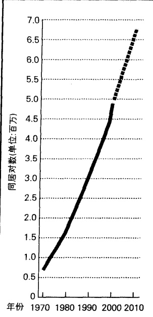

注：虚线部分代表作者的估计。

资料来源：作者根据 Statistical Abstract 1995；Table 60；Statistical Abstract 2002；Table 49 整理而成。

母还帮助他们的孩子搬运家具和装饰房子。比起以往总是阻止同居关系，现在这种态度真是天壤之别。

同居和婚姻的根本区别在哪里呢？唯一最好的答案就是承诺。在婚姻中，有天长地久的承诺；在同居中，双方在一起只是因为“合得来”。在婚姻中，两个人公开宣誓，在法律上结为夫妇；在同居中，他们只是搬到一起居住。已婚者离婚时需要一个法官来正式宣告婚姻的结束；当一个同居关系破裂时，双方只是分开并告诉他们的朋友他们的关系结束了。或许最能说明同居和婚姻在承诺上的差别的是：同居双方很少会像夫妻那样有一个共同的银行账户（Brines and Joyner，1999）。

为什么有的同居双方决定结婚而有的却不会呢？当然了，可能有多种原因，但是社会学家发现，同居对于不同的人来说意义也不同，而这一点对于他们是否会结婚则意义重大。下面的“现实社会学”专栏将会深入探讨这其中的联系。

婚前同居过的夫妻是否会比婚前未同居的夫妻婚姻更加牢固呢？他们是不是在结婚以前就已克服了许多问题呢？社会学家比较了他们的离婚率，结果发现：婚前同居过的夫妻更可能离婚。这又是一道社会学难题。为了弄清楚为什么，社会学家凯瑟琳·科汉和斯泰西·克莱因鲍姆（Catherine

---

### 现实社会学

### “你要我们住到一起？你这么说是什么意思？”

社会学上一个最引人注目的统计数字，就是美国同居者数量的激增。几乎没有什么其他统计数字像图16.9那样会呈现如此急剧的增长曲线。美国文化的两种根本性转变导致了同居的迅猛增长。

第一是性道德观念的转变。今天的大学生很难理解20世纪60年代性革命之前盛行的性道德观念。那时几乎所有人都认为，婚前性行为是不道德的。当然，婚前性行为那时也是存在的，但都是偷偷摸摸的，是一件丢脸的事情。婚前同居被称为“鬼混”，同居的两个人被认为是“不知羞耻”。这里还存在一个双重标准，那就是妇女有责任对婚前性行为说不。因此，她如果在婚前同居，就会被认为更加不可饶恕。

另一个文化转变就是美国离婚率的增加。尽管这一比率在1980年以后有所下降，当前的离婚率仍在美国历史上居于几乎最高的水平。今天，年轻人成年后比以往任何时候都更可能看到父母的离婚。这就使婚姻看起来很脆弱，无论你投入多少都不可能长

表 16.2 同居中的承诺：它们之间有区别吗？

<table border=1 style='margin: auto; word-wrap: break-word;'><tr><td style='text-align: center; word-wrap: break-word;'>承诺的层次</td><td style='text-align: center; word-wrap: break-word;'>百分比</td><td style='text-align: center; word-wrap: break-word;'>分手</td><td style='text-align: center; word-wrap: break-word;'>仍然在一起</td><td style='text-align: center; word-wrap: break-word;'>这些仍然在一起的同居者的情况</td></tr><tr><td style='text-align: center; word-wrap: break-word;'>婚姻的替代物</td><td style='text-align: center; word-wrap: break-word;'>10%</td><td style='text-align: center; word-wrap: break-word;'>35%</td><td style='text-align: center; word-wrap: break-word;'>65%</td><td style='text-align: center; word-wrap: break-word;'>25%</td></tr><tr><td style='text-align: center; word-wrap: break-word;'>通向婚姻之路</td><td style='text-align: center; word-wrap: break-word;'>46%</td><td style='text-align: center; word-wrap: break-word;'>31%</td><td style='text-align: center; word-wrap: break-word;'>69%</td><td style='text-align: center; word-wrap: break-word;'>52%</td></tr><tr><td style='text-align: center; word-wrap: break-word;'>试婚</td><td style='text-align: center; word-wrap: break-word;'>15%</td><td style='text-align: center; word-wrap: break-word;'>51%</td><td style='text-align: center; word-wrap: break-word;'>49%</td><td style='text-align: center; word-wrap: break-word;'>28%</td></tr><tr><td style='text-align: center; word-wrap: break-word;'>另一种形式约会</td><td style='text-align: center; word-wrap: break-word;'>29%</td><td style='text-align: center; word-wrap: break-word;'>46%</td><td style='text-align: center; word-wrap: break-word;'>54%</td><td style='text-align: center; word-wrap: break-word;'>33%</td></tr></table>

久。这实在让人担忧。同居，因为既提供了一种亲密关系，又没有婚姻长久的承诺，降低了这种危机感。

对于局外人，所有同居现象看起来似乎都一样，但对于同居者来说却不是这样。正像你从表16.2中可以看到的那样，对于10%的同居双方来说，同居是婚姻的替代物。这些人认为他们已经结婚了，但只是出于某种原因不想拿那张结婚证书。有些人不结婚是出于哲学立场（有没有这张纸有何不同？）；另一些人是因为没能和其配偶合法离婚。大约一半（46%）的同居者把同居看做是通向婚姻的一条途径。对于他们来说，同居比“情侣”要更稳定，但比婚约要轻。另有15%的人只是想“试一试”。他们想看看和对方结婚会是什么样子。最后是那些承诺最少的人，大约29%的人认为同居只是另一种约会的方式。它提供了性满足和感情支持的可靠来源。

资料来源：Bianchi and Casper（2000）。

这些对于同居的不同看法，会对同居者是否结婚产生影响吗？让我们看一下他们同居6年后的情况。正像你从表16.2中看到的那样，那些把同居看成婚姻替代物的人最没有可能结婚，并且最有可能在几年后仍然同居。那些把同居看成是通向婚姻之路的人们，结果则完全相反——他们最可能结婚并且最没可能继续同居。那些只是想“试一试”和把同居看做约会方式的人，则最有可能分手。

### 思考题

你能解释一下,为什么对同居意义的不同理解会影响到同居者是否会结婚?你能把你认识的同居双方纳入以上四种类型中吗?你认为还有其他类型吗?如果有,它们会是什么呢?

Cohan and Stacy Kleinbaum, 2002) 在夫妻解决婚姻中出现的问题时给他们录了像。他们发现婚前同居过的夫妻会更多地表现出消极情绪，并且对自己的另一半不太关心。这一点显然有损夫妻双方的婚姻纽带。

---

### 未婚妈妈

前面我们曾讨论过美国未婚出生的婴儿数量正在稳步增长。为了更好地理解这一趋势，我们从全世界的角度来看一下。正像图16.10所示，并非只有美国是这样。在我们拥有数据的10个工业化国家中，除了日本，其余所有国家都面临未婚生婴儿激增这一趋势。其中美国的数字还不是最高的，它属于中间的三个国家之一。

从这个图中我们似乎可以推断说，是工业化产生的社会力量促使未婚生育的增加，然而这一推论却存在许多问题。为什么在20世纪60年代和20世纪70年代未婚生的比例要比现在小得多？在那之前工业化已达到相当高的水平。为什么最低的四个国家的比例只是最高的两个国家的一小部分？为什么日本的比例一直较低？为什么瑞典和丹麦如此之高？除了很少的几点例外，今天这些国家的排名仍和40年前一样？因此，仅仅用工业化来做解释似乎过于简单。一个更全面的解释必须关注嵌入这些国家文化中的风俗和价值

图 16.10 10 个工业化国家未婚女性的生育比例

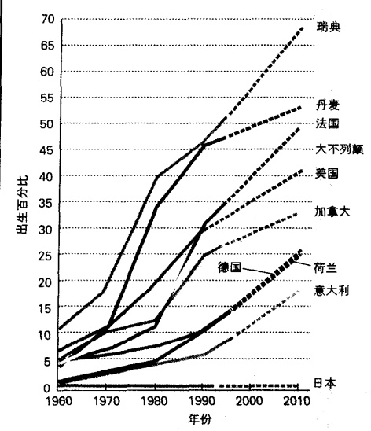

注：虚线部分代表作者的估计。

资料来源：作者根据 Statistical Abstract 1993: Table 138; Statistical Abstract 1998: Table 1347 整理而成。

观。要想回答这些问题，还有待日后进行更深入的研究。

### 祖父母担任父母的角色

现今祖父母养育其孙辈已成为一种越来越普遍的现象。大约4%的白人儿童、7%的拉美裔儿童、14%的非裔美国儿童正在由其祖父母抚养(Waldrop and Weber,2001)。

形成这种跨代家庭的主要原因是孩子的父母没有能力照顾他们的孩子(Goldberg-Glen et al., 1998)。除了父母死亡，最主要的原因是父母生病、无家可归、吸毒或正在坐牢。另外的原因就是父母忽视或虐待自己的孩子，在这种情况下，祖父母不得不介入照顾孩子。

祖父母们面临的主要压力，就是额外的经济负担、在退休后仍需继续工作和与孩子父母的冲突（Waldrop and Weber, 2001）。他们主要的满意感来自于知道他们的孙子孙女们有人关爱、与他们建立起强烈的情感纽带，以及可以把家庭价值观灌输给他们。

### “夹层一代”和老年人的照料

“夹层一代”（“sandwich generation”）指的是那些发现自己夹在两代人中间的人，他们既要照顾自己的父母，又要照料自己的孩子。一般在40—55岁，人们发现自己正处于两代人的夹缝之中。承担着对上下两代人相冲突的巨大责任，他们充满了负罪感和苦恼，因为他们不可能面面俱到。

---

对老年人的照顾已引起企业界的注意。美国1000个最大的公司有一半为其雇员提供了老年人服务帮助(Hewilt Associates 2004)。这些帮助包括开讨论会、参考建议、实行弹性工作计划，以使员工可以兼顾老人和工作。为什么许多公司对于照顾老人比照顾孩子更感兴趣呢？大多数CEO们都是老人，他们的妻子一般都是在家照料孩子，所以他们不懂得平衡工作和孩子之间的紧张关系。与此相对照的是，几乎所有人都有年迈的父母，许多人不得不同时处理父母的需要、工作，以及自己的家庭。

由于人们的寿命正在延长,这个问题很可能会越来越紧迫。

### 离婚和再婚

谈论家庭生活少不了谈论离婚问题。让我们先来确定到底有多少人离婚。

### 离婚测量中的问题

你或许听说过美国的离婚率是 50%，新闻报道员经常会谈到这个数字。确实，每年离婚的人数是结婚人数的一半。具体来说，每年大约有 250 万对结婚，有 125 万对离婚（“Population today” 2002）。

那么说美国的离婚率是 50% 有什么不对呢？问题在于我们为什么要比较同年的结婚数量和离婚数量。离婚的夫妇不会——除了很少的例外——在同年结婚。结婚数量和离婚数量没有任何联系，因此这一统计数字并不能说明离婚率。

那么，我们应该用什么数字呢？离婚双方来自整个美国所有已婚的夫妇。既然美国有6000万已婚夫妇，而在一年里只有125万人离婚，这说明美国离婚率是2%而不是50%。一对夫妇年底仍在一起的几率是98%——很大的一个比率——当然这比媒体大肆渲染的数字要好得多。

随着时间的推移，当然，这2%的离婚率会累积起来。第三种测量离婚率的方法是问：“对于所有美国人来说，有多少比例的人离婚了？”下面的图16.11回答了这个问题。你可以看到随着时间的推移离婚率是如何增加的。你还可以看到，人们的种族差异对于他们是否离婚的影响。另外，你可以看到美国白人的

图 16.11 美国家庭的离婚率

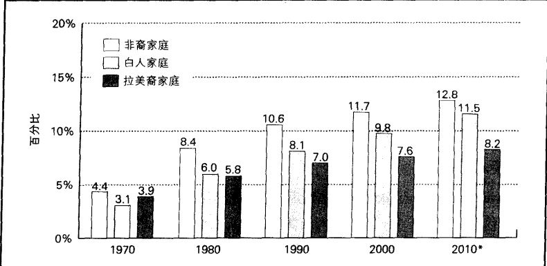

注：本资料中只列出了这些族群。 $ ^{*} $为作者的估计。

资料来源：作者根据 Statistical Abstract 1995: Table 58; Statistical Abstract 2002: Table 46 整理而成。

---

离婚率增长最快，而拉美裔人则最慢。如果你仔细观察可以发现，所有群体的离婚率的增长都在变慢。

下面的“现实社会学”专栏报道了一些关于离婚的“奇特”发现，一些使婚姻幸福美满的因素将在本章末尾加以概括。

### 现实社会学

### 如果你是社会学家：奇特的离婚模式

社会学家亚历克斯·赫克特、托马斯·诺瓦克和凯·斯耐德(Alex Hecket, Thomas Nowak and Kay Snyder, 1995)对5000个具有全国代表性的美国家庭样本进行了二手分析。下面是他们的三个发现：

1. 如果一个妻子比她的丈夫收入多，那么他们的婚姻更容易破裂；反之，婚姻则较稳固。

2. 如果一个妻子比她的丈夫身体健康状况差，他们的婚姻更容易破裂；反之，婚姻较稳固。

3. 妻子做的家务越多，这个家庭越不可能离婚。

你能解释这些发现吗？现在你是社会学家，请在看下面的答案之前思考一下。

### 如果你是社会学家：奇特的离婚模式(续)

这些发现意味着什么？赫克特、诺瓦克和斯耐德提出了下面的解释：

1. 一个妻子如果挣的比丈夫多，对于不幸福的婚姻她会有更多的其他选择，如果比其丈夫挣的少，她将更依赖其丈夫。

2. 要求一个妻子照顾生病的丈夫的社会压力更大一些，要求一个丈夫照顾生病的妻子的压力要小一些。

3. 谁做更多的家务是夫妻双方相对讨价还价权力的反映。那些拥有最多讨价还价权力的妻子会做比较少的家务，并极难忍受不美满的婚姻。

### 父母离异的孩子们

每年有超过100万的美国孩子发现他们的父母正在离婚(Cherlin,2002)。这些孩子在童年期和成年之后，都要比那些父母未离婚的孩子更多地存在精神问题(Amato and Sobolewski,2001; Weitoft et al.,2003)。他们更有可能成为青少年越轨者(Wallerstein et al.,2001)，更不可能完成高中学业、上大学和大学毕业(Mclanahan and Schwartz,2002)。最终，这些孩子自己也更有可能会离婚(Tallman, Rotolo, and Gray,2001)，走上父母之路。

父母离异的儿童有较多的失调，这是不是一个严重的问题呢？这一问题引起了两位倍受尊敬的心理学家的激烈讨论。朱迪丝·沃勒斯坦认为，离婚的伤害给孩子们带来了失落感，以及直到成年后仍然存在的不安全感（Wallerstein，Blakeslee，and Lewis，2001）。梅维斯·赫瑟林顿则反驳说，75%—80%的父母离异的孩子和父母未离异的孩子一样健康成长（Hethering and Kelly，2003）。

我并非刻意要支持某一方，但这显然不是简单地只看到了问题的一面而忽视了另一面的问题。如果说75%—80%的孩子并未受到父母离异的长期伤害，那么剩下的1/4—1/5的孩子则会。无论你怎么看，每年有25万或20万的孩子会因此而面临许多问题，这绝不是一个小数目。

---

我们很难捕捉到生活在离异家庭的孩子的痛苦,但是当我读了下面这两段话,这是那个画了这两幅图片的四年级的孩子写的,我的心被触动了:

我独自一人在公园里，

整个公园都很孤单。

我的爸爸和妈妈离婚了，

这张图片里描绘的是我和我的儿子，我们正在公园里一起散步。我永远不会像我的父亲那样。我永远不会抛弃我的妻子和孩子。

这就是我为什么感到孤单。

从另一方面来说，我们需要更深入的研究。研究者一般比较的是父母离异的孩子和普通家庭的孩子。问题是：父母离异的孩子并不来自于普通家庭。他们来自于矛盾重重的家庭。真正的问题是：怎样把父母离异的孩子与父母未离异但不断争吵的孩子进行比较。社会学家苏珊·杰克里科（Susan Jekielek，1998）在比较之后发现：父母离异的孩子实际上比父母未离异但不断争吵的孩子在情感调整上要稍好一些。别的研究者也得出了同样的发现（Stewart et al., 1997）。

是什么帮助孩子们适应父母离异的呢？那些虽然父母离异但和双方都很亲近的孩子适应得最好；那些和一方更亲近的孩子做得则稍差一些，调整最差的是那些与父母都不亲近的孩子(Richardson and McCabe,2001)。其他研究还发现：如果家庭有足够的金钱来满足其需要、孩子经历较少的冲突、有被关怀感、跟一个调整很好的父母一起居住、生活有规律，那么孩子会适应得很好。初步研究还发现，如果孩子和自己同性别的父母生活在一起，他们会适应得更好一些(Lamb,1977; Clingempeel and Repucci,1982; Peterson and Zill,1986; Wallerstein and Kelly,1992)。如果有另外一个成年人提供情感支持的话，这也更有利于孩子的自我调整(Hayashi and Strickland,1998)。尤里·布朗芬布伦纳(Urie Bronfenbrenner,1992)认为这第二个大人就像一个小板凳的第三条腿，能给这个小家庭提供稳定性。他认为，任何成年人都能成为这第三条腿——一个亲戚、朋友、继母，甚至是同事——但是最有力的支撑腿则是孩子的父亲、妻子的前夫。

正像前面提到的，当这些孩子长大结婚后，他们比那些在完整家庭长大的孩子更有可能离婚。研究者有没有发现一些增加这些孩子婚姻成功可能性的因素？实际上，他们发现了一些。如果他们和来自健全家庭的孩子结婚，那么婚姻更可能成功。这增加了婚姻的信任感而降低了冲突程度。如果丈夫和妻子都来自婚姻破裂的家庭，那么将可能带来不幸的结局。他们的婚姻更可能充满不信任和冲突，最终很可能会导致离婚（Tallman，Rotolo，and Gray，2001）。

---

### 父亲的缺失与继父

由于离婚如此普通并且孩子通常被判给母亲，一个新的父亲形象也就出现了。在这种被称为继父（serial fatherhood）的模式中，离婚的父亲在离婚后一年或两年内与他的孩子保持经常的联系。当他和另外的女人结合后，他开始对那个女人的孩子扮演父亲的角色，并减少了与自己孩子的联系。如果再离婚，事情也会如此重复下去。只有约1/6的孩子和父亲分开后仍能每周见到父亲一次。实际上，大多数离婚的父亲都不再理会自己的孩子（Ahlburg and De Vita，1992；Furstenberg and Harris，1992；Seltzer，1994）。显而易见，对于许多男人来说，作父亲只是一个短期的承诺。

### 前夫／前妻

愤懑、失落和焦虑是离婚者的常见感受。但如释重负也是一种感觉。妇女比男人更多地感受到离婚给自己的生活提供了“新的机会”。也有一些夫妇离婚后会努力保持一种朋友的关系——但他们是例外。首先提出离婚的一方，在离婚后通常很快就会恢复过来(Kelly,1992; Wang and Amato,2000)，他/她通常也会更早再婚(Sweeney,2002)。

离婚也并不一定就意味着两个人关系的终结。许多夫妇离婚后因为孩子而仍保持联系。还有一些人，社会学家把他们称为“丝连者”，藕断丝连（Vaughan，1985；Masheter，1991）。前任丈夫可以帮助他的前妻张贴图画、搬移家具，或者妻子也可能会邀请前夫到家里来吃饭。有些双方离婚后甚至仍保持着性关系。

离婚后夫妇的生活成本都会增加——两个家、两张水电费单等等。但是经济负担对于男人和女人来说是不同的。离婚通常会给妇女带来更大的经济压力(Smock et al., 1999; Wang and Amato, 2000)。尤其是那些孩子还小的母亲，她们的生活水平往往会骤降1/3(Seltzer, 1994)。妇女的受教育程度越高，离婚后在经济上就越能生存下去(Dixon and Rettig, 1994)。

### 再婚问题

尽管许多刚刚从离婚法庭走出的离婚者往往会大喊道：“这辈子再也不结婚了！”许多人却仍会再婚。但他们再婚的比率已明显下降。今天，只有一半的妇女会再婚(Bramlett and Mosher, 2002)。图 16.12 显示了种族对于一个妇女是否再婚的重要影响。目前还没有男性的参考数据。

图 16.13 表明，大多数离婚的人会与其他离婚的人结婚。你可能会对那些年轻的母亲和受教育水平较低的妇女再婚率高这一事实感到惊奇 (Glick and Lin, 1986; Schmiege, Richards, and Zvonkovic, 2001)。显然，那些受教育水平较高并且更独立的 (没有孩子) 妇女更加挑剔。男人比女人更有可能再婚，可能是因为他们有更多潜在的伴侣。

图 16.12 离婚女性在 5 年内的再婚可能性

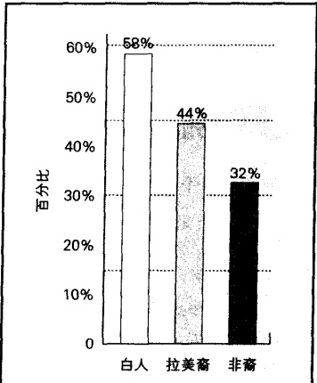

注：本资料只列出了这些族群的情况。

资料来源：作者根据 Bramlett and Mosther（2002）整理而成。

---

再婚者的婚姻状况如何呢？那些没有孩子的再婚者的离婚率和初婚者大致相同。那些带孩子的再婚者则更有可能再次离婚(MacDonald and DeMaris,1995)。显然，这种关系更复杂且更有压力。缺乏可遵守的准则，也可能是一个重要的原因(Coleman et al.2000)。正像社会学家安德鲁·彻林(Andrew Cherlin,1989)认为的那样，我们缺少对于继母、继父、继兄弟、继姐妹、继姨婶、继叔伯、继姑表兄弟姐妹和继祖父母的令人满意的名称。至少，这些都是令人尴尬的名称，它们也代表了难以确定的亲戚关系。

### 家庭生活的两个方面

让我们首先来看一下婚姻和家庭在何种情况下会出现问题,然后我们将探讨一下使婚姻正常维持下去的因素。

图 16.13 美国新娘和新郎的婚姻史

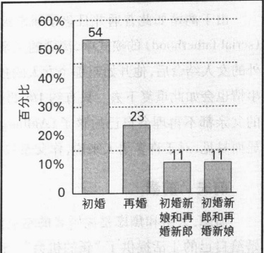

资料来源：作者根据 Statistical Abstract 2000: Table 145 整理而成。

### 家庭生活的阴暗面: 暴力、虐待儿童、婚内强奸和乱伦

家庭生活的阴暗面，涉及那些人们试图加以掩盖的事件。我们来看一下暴力、虐待儿童和乱伦。

暴力 为了研究夫妻虐待问题，一些社会学家深入研究了几个婚姻受害者(Goetting,2001)，而另外一些社会学家则对美国夫妇进行了广泛的访谈(Straus and Gelles,1988; Straus,1992)。尽管没有得到所有社会学家的认可(Dobash et al.,1992,1993; Pagelow,1992)，默里·斯特劳斯认为，丈夫和妻子同样有可能去攻击对方。尽管在这一点上男女都一样，但当涉及婚姻暴力的后果时，就根本谈不上平等了，因为婚姻暴力的受害者85%都是妇女(Rennison,2003)。当然，很大一部分原因在于大多数丈夫都比妻子更加强壮有力，因而在性别之战中妻子往往吃亏。下面的“现实社会学”专栏讨论了为什么有些受虐待的妇女仍然维持婚姻的原因。

### 现实社会学

### “她为什么不离开？”受虐妇女的两难困境

“为什么她要容忍婚姻暴力呢？”人们一直在问这个问题。在外人看来这很容易解决，只要收拾东西走人就可以了。“要是我，我可受不了这些。”

但通常事实却并不是这样。在遭到殴打后，妻子大多仍继续和丈夫呆在一起。一些妇女只和她丈夫呆一小段时间，有的则会长期忍受家庭暴力。这是为什么呢？

社会学家戈廷(Ann Goetting,2001)也对这一问题感到疑惑。为了得到答案，她采访了一些因暴力而离婚的妇女。她想弄清楚是什么使她们与其他妇女不同？为什么她们能够离开，而许多妇女却做不到？她发现因暴力而离婚的妇女有以下特征：

1. 她们有积极的自我概念。简而言之，她们认为自己肯定会过得更好。

2. 她们打破了传统价值观。她们认为一个妻子不能无论丈夫什么样都得跟着他。

---

3.她们有足够的经济来源。对一些妇女来说这很容易，对另一些妇女来说则很难。为了积攒足够的钱离婚，有些妇女要攒好些年，每星期存下一点。

4. 她们有支持自己的家庭和朋友——一个支持性的社会网络作为一种鼓励性资源，可以帮助她们保护自己。

这四点的对立面，就是为什么有些妇女忍受婚姻暴力的原因：她们认为自己不会过得更好，她们认为自己有责任留下来，她们认为自己没有经济能力，以及她们缺少支持性的社会网络。当然，这四个因素并不是对所有妇女都同样重要。对于有些人，缺少经济来源可能是最重要的，而对另外一些人来说则是因为较低的自我概念。但对于所有人，是否拥有支持性的社会网络，都是非常重要的。

### 思考题

根据以上这些发现，你会对一个被丈夫或情人虐待的妇女说些什么？你认为受虐妇女庇护所的建立和这些解释有无关系？你还能想到其他解释吗？例如，爱情在这一问题上扮演着什么角色呢？

对女性的暴力与社会的性别结构有关，这一点我们在第11章已经讲过，还与第3章讨论的社会化过程有关。由于这些男人在鼓励攻击和使用暴力的环境下长大，一些人感到控制妇女是他们的权利。当他们在婚恋关系中受挫时——有时甚至是在婚恋之外的事情上——这些男人都会对自己的妻子或者情人施以暴力。一个基本的社会学问题是：怎样社会化男人才能使其不求助于暴力来解决挫折和争端(Rieker et al., 1997)。我们对此还没有答案。

### 虐待儿童

我和我的妻子根据广告来看一所位于湖边的中产阶级社区的房子。当女房主领着我们参观她那一尘不染的房子时，我们在最小孩子的房间里惊奇地发现了一个胶合板大箱子。这个大箱子大约0.9米高、0.9米宽、1.8米长，箱子上有些小洞和一扇带有挂锁的小门。我好奇地问这是什么。那个妇女毫不在意地说，她的儿子经常调皮捣蛋，这是他们给他“关禁闭”的地方。她还说，有时她会把她儿子放在一个小木筏上，系一根缆绳在码头上，并让小木筏漂到湖里去。

我们听到这儿，立刻就走了。由于脑子里充满了这个孩子被虐待的画面，我向州政府儿童虐待热线报了警。

如你所知，我所看到的让我很担忧。我们中大多数人都对虐待儿童——无助的孩子被自己的父母虐待；这些父母本应该关爱、保护、抚育他们——感到吃惊。一些最残忍的例子上了晚间新闻：一个4岁的小女孩被她母亲的男朋友殴打和强奸，并陷入昏迷，在三天后夭折。一些6—10岁的孩子被其继父强迫发生性行为，并被录像。除了这些我们在本地区报纸头条经常看到的新闻外，大多数虐待儿童的案例并不为人所知：许多孩子居住在肮脏的环境中，父母几个小时甚至好几天都不闻不问，甚至还被用电话线抽打，就像我去买房子时发现的那个小男孩的遭遇一样。

我们知道虐待儿童非常普遍。每年约有300万美国孩子被报告受到虐待和忽视。大约有85万起案例被证实(Statistical Abstract 2002: Table 321)。虐待孩子的父母编造的理由五花八门。我听过的最荒唐的理由，是一个母亲对曼哈顿法官说：“我被气昏了头，所以我的手意外地掐住了我女儿的脖子。”(LeDuff,2002)

---

婚内强奸或亲密关系 强奸社会学家发现，婚内强奸比通常认为的要普遍得多。例如，大约1/3—1/2到受虐妇女庇护所寻求帮助的妇女都是婚内强奸的受害者(Bergen,1996)。但在庇护所里的妇女并不能完全代表美国妇女。为了更好地了解婚内强奸有多普遍，社会学家戴安娜·拉塞尔(Dianna Russell，1990)采用了抽样技术进行概化。她发现14%的已婚妇女报告丈夫对其有过强奸行为。与此类似，社会学家戴维·芬克尔赫和克斯蒂·耶洛(David Finkelhor and Kersti Yllo，1985,1989)针对波士顿妇女的一项访谈调查显示，有10%的人报告说其丈夫曾用暴力强迫她做爱。与被陌生人或熟人强奸的受害者相比，婚内强奸的受害者更少报案(Mahoney，1999)。

随着同居者的大量出现，婚内强奸的含义也应包括在这些关系中发生的性侵犯。或许，我们应使用亲密关系强奸这个术语。亲密关系强奸并不单是男人对女人的性侵犯。在一项开拓性研究中，社会学家洛丽·格施克（Lori Girshick，2002）采访了一些被其伙伴强奸的女同性恋者。在这些案例中，受害者和侵犯者都是妇女。格施克指出，假如把访谈记录中的代词“她”换成“他”，从情节来看，读者很可能会以为这是关于女人被其丈夫殴打和强奸的事情（Bergen，2003）。正像被丈夫强奸的妻子一样，这些受害者同样会感到恐惧、失落和自责。

乱伦 某些亲属(例如，在兄弟和姐妹之间或者父母和子女之间)之间的性关系属于乱伦。乱伦最有可能发生在社会交往上比较孤立的家庭(Smith，1992)。和婚内强奸一样，社会学研究发现，乱伦经常会发生。社会学家戴安娜·拉塞尔(n.d)发现，那些心灵遭到巨大创伤的乱伦事件受害者通常是经常性地、长期性地、更为严重地受到侵害(例如，性交而不是性抚摩)的人。

谁是侵犯者呢？拉塞尔发现叔叔最为经常，其次是第一代堂(表)兄弟、父亲(特别是继父)、兄弟以及包括小叔子和继祖父等别的亲属关系。另外的研究发现，兄弟一姐妹之间的乱伦要比父亲一女儿乱伦高出几倍(Canavan et al., 1992)。母亲和儿子之间发生的乱伦关系则很少。

### 家庭生活光明的一面: 成功的婚姻

成功的婚姻 在考察过离婚和家庭暴力后，大家可能会认为婚姻多数是不成功的。然而，事实并非如此，因为大约2/3的美国家庭都认为他们的婚姻生活“很幸福”（Cherlin and Furstenberg，1988；Whyte，1992）。为了发现婚姻成功的秘密，社会学家珍妮特和罗伯特·劳尔（Robert Lauer，1992）采访了351对结婚长达15年或更久的夫妻。其中有51对感到不幸福，但只是因为宗教、家族传统或是“为了孩子”的缘故而生活在一起。另外300个家庭则都有下面的共同点：

1. 把配偶看做自己最好的朋友；

2. 喜欢配偶这个人；

3. 认为婚姻是一种长久的承诺；

4. 认为婚姻是神圣的；

5. 在目标和追求上认同自己的配偶；

6. 认为配偶比以前更加有趣；

7. 非常想使婚姻关系成功；

8. 在一起谈笑。

---

社会学家尼古拉斯·斯廷尼特(Nicholas Stinnett, 1992)运用采访和问卷方式研究了660户家庭，这些家庭来自美国各地和南美的部分地区。他发现幸福家庭的共同点是：

1. 花大量时间呆在一起；

2. 及时表达欣赏；

3. 愿意努力增进彼此的幸福；

4. 经常谈话和彼此倾诉；

5. 有宗教信仰；

6. 用积极的态度处理危机。

别的社会学家发现: 一对夫妇越是和彼此的姻亲关系良好, 他们的婚姻就越幸福 (Bryant et al., 2001).

符号互动论和统计数据的滥用 我的许多学生表达了对未来婚姻的悲观情绪，这种担心来自于他们的父母、朋友、邻居、亲属、甚至是牧师和拉比的离婚。他们怀疑他们是否能有成功的婚姻。社会学不只是关心抽象的理论，而且也关心生活，所以，强调你是一个个体而不是统计数字是很重要的。也就是说，如果离婚率是33%或50%，这并不意味着如果你结婚，你就有33%或50%离婚的可能性。这是对统计数据的误用，一个常见的误用。离婚统计数据描述的是所有的婚姻状况，与任何具体的婚姻没有任何关系。我们自己到底有多大可能性离婚，这要看我们自己的具体条件——尤其是我们对待婚姻的方式。

为了使这一点更清晰，让我们应用一下符号互动理论。从符号互动理论的观点来看，我们自己创造了我们的世界。意思就是，我们的体验并不依靠与生俱来的意义，相反，我们对自己的体验予以解释，并采取相应的行动。简单说，如果我们认为我们的婚姻可能会失败，我们就会增加其失败的可能性；如果我们认为我们的婚姻将会非常幸福，我们就会增加其成功的可能性。换句话说，我们将会按照我们的观念来行动，从而形成一种自我实现的预言。例如，如果我们认为我们的婚姻可能会失败，我们更可能在遇到问题时放弃。俗语所说的“生活中没有一成不变的事”非常正确，但是相信美好的婚姻是可能的、它值得我们去努力追寻，这将对我们大有裨益。

### 婚姻和家庭的未来

未来的婚姻和家庭生活将会如何呢？尽管存在许多问题，婚姻还远没到退出历史舞台的时候。婚姻所发挥的功能，使它存在于每个社会。因此，绝大多数美国人仍会认为婚姻是幸福的重要一环。

但某些趋势也确实存在。同居、单身妈妈、晚婚和祖父母养育孙辈的趋势将会继续增加。更多的已婚妇女会加入劳动大军，她们会继续获得在婚姻中的权力。然而，婚姻平等并非一朝一夕之功，还有很长的路要走。随着老龄人口的增加，更多的夫妇会发现她们正生活在夹缝中：一方面要照顾老人，一方面要抚养孩子。

我们的文化中会继续充斥着对婚姻和家庭的扭曲：大众媒体描绘出阴暗的一面，而文化神话则给出美好的一面。社会学研究有助于我们纠正这些扭曲，并允许我们看看自己的家庭经历如何与我们的文化模式相适应。社会学研究也会有助于我们回答这样的大问题：如何构建支持和提高家庭生活的社会政策。

---

我们将以下面的“现实社会学”专栏结束本章,我们可以看一看那些已经开始影响家庭的微妙而重要的变化。

## 现实社会学

### 当工作变成了家庭而家庭变成了工作

员工们受不了老板，而且如果有机会，每个人都会离开工作呆在家里，是这样吗？不要如此肯定。

社会学家阿利·霍克希尔德(Arlie Hochschild，1997，2004）对一家她称为Amerco的公司进行了研究。这家公司实行“家庭友好”政策。这里的职工可以只工作部分时间、休父母探亲假、在家里做部分工作，甚至和他人共担工作。令霍克希尔德大惑不解的是，几乎没有人利用这些政策。

霍克希尔德感到非常惊奇，员工们不是嫌工作压力太大吗？为了核实她的观察，她决定对3000名年轻父母进行问卷调查。她发现1/3的父亲和1/5的母亲认为自己是“工作狂”。

于是霍克希尔德进行了更深入的调查。当她在Amerco公司进行参与观察时，她发现工作和家庭都发生了变化。家庭生活变得越来越来匆忙，紧张的工作、孩子上学和个人生活问题全都绞在了一起。就像本章开篇短文中沙伦和汤姆的生活一样，家庭成员被来自各个方面的生活压力压得喘不过气来。正如霍克希尔德所说：

离婚率正在上升，情感需求越来越复杂和棘手。除了孩子出牙、耍脾气和其他成长的烦恼，老年父母也正在对现代家庭提出更多的要求——还有新的继父母、继子女、前夫/前妻、前姻亲的混合、分离以及再混合。

在家庭压力增加的同时，许多人的工作压力正在减轻。他们发现工作不再那么严格，而是变得更轻松、更有意思。正像霍克希尔德所说：

公司广泛采用的新管理技术把工作场所变成了一个更令人舒服、更个人化的社会空间……许多公司现在都在训练他们的员工自行作出工作决策……并且[对他们的]工作业绩予以承认。Amerco公司通过举行“表彰仪式”定期强化员工间的亲情……Amerco的员工认为自己“属于Amerco这个大家庭”……生产小组也有定期的聚会……教育培训部门在上班时间还会提供一些免费课程，如“如何处理愤怒”、“如何表达和接受批评”、“如何与难相处的人打交道”。

家庭成员有什么样的“感谢日”呢？或者有关于“如何处理与母亲的关系”、“如何理解两岁的孩子或不听话的中学生孩子”的免费课程？由于家庭压力正在增加，而工作压力正在减少，霍克希尔德发现许多人自愿加班来“躲避家庭生活”。正如琳达·霍斯查尔德采访过的一个女人所说的：

当我到家以后，从我打开门那一刻起，我的女儿就缠住我不放。她需要向某人倾诉关于她一天的生活……孩子还没睡，他本该在两个小时前就上床了，这让我气不打一处来。盘子堆在那里没人管。一开门我女儿就跑过来向我抱怨她继父所说和所做的一切，并且还想和我说说关于工作的事。我丈夫这时在另一房间向我女儿大喊：“特蕾西，我都没时间和你妈妈说话了，你总是缠住她不放。”他们两个都朝我来了。

经过思考，霍斯查尔德认为对许多人来说，家庭和工作的世界正在开始颠倒过来。家庭正在变得越来越像工作，而工作则正变得越来越有家庭气息。

### 思考题

对刚出现的苗头作出准确的说明是非常困难的，尽管一些社会学家做到了这一点。正如第1章所提到的，社会学家奥格本在1933年就指出，个性在配偶选择中正在变得越来越重要。1945年，社会学家欧内斯特·伯吉斯和哈维·洛克观察到，相互

---

爱恋和合得来在婚姻中正变得越来越重要。这种转变是如此彻底，以至于在今天，我们很难设想没有感情、相互合不来的婚姻。

霍斯查尔德是否也敏锐地触及到了这个刚出现的根本性的、历史性的转变呢？我们看待工作和家庭的方式正在发生倒置吗？在50年左右的时间里，对我们大多数人来说，这种转变是否会变成现实？你怎样认为呢？

### 本章小结

### ☆全球视野下的婚姻和家庭

### 什么是家庭——并且哪种观点是普遍性的？

家庭是很难下定义的。无论哪种普遍性观点，总会有意外发生。因此，家庭的定义要广泛些——指那些被血缘、婚姻关系联系在一起的人。从广义上来说，婚姻和家庭是调节配偶选择的机制，是传宗接代的机制，是确定继承和权威模式的机制。

### ☆婚姻和家庭的理论观点

### 功能主义关于家庭和婚姻的观点是什么？

功能主义者思考了家庭生活的功能和反功能，例子包括亲属之间的乱伦禁忌和家庭功能弱化对离婚率的影响。

### 冲突论者关于婚姻和家庭的观点是什么？

冲突论者注重研究婚姻和家庭是怎样导致了夫妻关系的不平等，特别是男人对女人的统治性。婚姻中的权力之争，例如家务劳动，就是一个例子。

### ☆符号互动论者关于婚姻和家庭的观点

符号互动论者研究了男人和女人对于婚姻的不同经验和看法。他们强调，只有通过对照男女的不同观点，才能理解他们的行为。

### ☆家庭生活圈

### 家庭生活圈主要讲了哪些内容？

主要讲的是爱和情感、出生率、抚养和以后的家庭生活。大多数配偶选择都会遵循某些可预测的标准，例如年龄、社会阶级、种族、民族和宗教。出生率和儿童抚养模式也会因社会阶级的不同而不同。

### ★美国家庭的多样性

### 种族—民族因素在家庭生活中有多重要？

主要的不同是社会阶级，而不是民族或种族。同样社会阶级的家庭很可能非常相似，而无论他们的种族或民族构成。

### ☆美国家庭的其它划分种类

另外被讨论的就是单亲家庭、丁克家庭、混合家庭和同性恋家庭。每类家庭都有其独特特点，但是社会阶级在确定它们的独特特征时是非常重要的。贫困对于单亲家庭来说非常重要。大多数单亲家庭通常都是妇女占据主导地位。

---

### ★美国家庭的发展趋势

### 美国家庭正在经历哪些变化？

三种转变是晚婚、同居者的增加和祖父母介入照顾孙子、孙女。由于人们寿命的普遍延长，更多的中年夫妇发现他们自己正被抚养他们的孩子和照顾他们的父母烦恼着。

### ☆离婚和再婚问题

### 当今的离婚率是多少呢？

根据你选择什么样的人群做比较,你可以得出不同的结论,从75%到2%的比例不等。无论你怎样确定它,美国的离婚率比任何工业化国家都要高。

### 父母和孩子该怎样面对离婚这一困境？

离婚对于孩子来说非常困难,他们的自我调整可能要一直持续到成年。大多数离婚的父亲们不会再与其孩子保持持久的联系。经济上的压力对于前妻来说通常是非常重的。尽管许多离婚的人们会再婚,但再婚率仍在大幅下降。

### ☆家庭生活的两个方面

### 家庭生活的两个方面是什么？

家庭生活的黑暗面指的是虐待——配偶争吵、虐待儿童、婚内强奸和乱伦。光明的一面是指大多数人认为婚姻和家庭是有价值的。

### ☆婚姻和家庭的前景

### 婚姻和家庭的可能前景是什么？

我们认为，同居、单身妈妈、晚婚、祖父母养育孩子的趋势仍在增加。职业女性数量的增加，极有可能继续改变婚姻和权力结构。

### 批判思考题

1. 功能主义者认为家庭是具有普遍意义的，因为它可以给人和社会提供基本的功能。你的家庭给你提供了哪些功能？提示：除了功能主义者的有关观点外，请再思考一下共同的文化性的影响？

2. 请解释为什么社会阶级比民族、种族在确定家庭特征时更重要。

3. 运用本章内容并对照你对婚姻和家庭的经验，是什么社会因素在影响你的家庭生活？你的家庭生活和你祖父母一代的家庭生活发生了什么变化？