# 第 17 章 教育

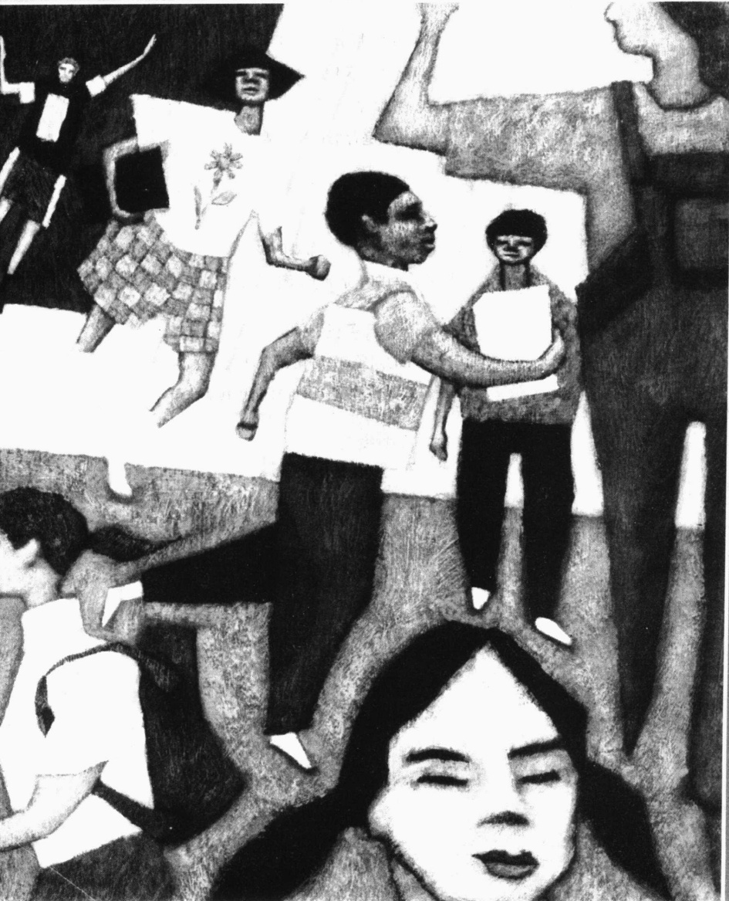

斯蒂芬·席尔德巴赫《学生们》(1999)

---

· 现代教育的发展  

早期社会的教育  

工业化和大众教育

· 全球视角中的教育

工业化程度最高国家的教育：日本

正在进行工业化国家的教育：俄罗斯

工业化程度最低国家的教育：埃及

· 冲突论视角: 再生产社会的阶级结构  

潜在课程  

带有倾向性的考试: IQ 中的歧视  

先天不利: 不平等的投入  

相一致原理  

底线: 家庭背景和教育制度

·符号互动论视角：实现教师的期望  

里斯特的研究  

罗森塔尔—雅各布森的实验  

教师的期望是如何对学生发生作用的？

· 美国教育存在的问题及其解决方法  

存在的问题: 平庸化和暴力  

解决办法: 安全化、标准化和其他改革

·本章小结

---

### 第 17 章 教育

在科罗拉多州的利特尔顿区(丹佛市西南郊区一个中产阶层聚居区)，35000名居民过着平静的生活。这里的年轻人整天无所事事。一些中学生喜欢整天穿着一身黑色的军大衣和印着德国纳粹党党徽的黑色T恤，借此来吸引别人的注意。他们自称为战壕雨衣黑手党，嘴里时不时还会蹦出几句德国话。

“他们还只是孩子，长大后就不会这样了，”大人一般都会这么说，“我们自己以前也爱做一些幼稚的事。”

这个战壕雨衣黑手党在学校餐厅里有自己的地盘，而且毕业纪念册里还有他们帮派的团体照片。其标题就是：“谁说我们不一样？疯狂就是健康……保持活力、保持个性、保持激情！还有，要远离冰淇淋苏打！”

这个学校里还有其他几个帮派：宇航员、哥特人、石匠、野人、大学预科生、古怪人。每个学校都会有这么一些小帮派。

宇航员的成员很是鄙视战壕雨衣黑手党的人。他们把战壕雨衣黑手党的人扔在箱子里锁起来，骂他们是败类、变态、畸形儿。他们还从开着的车子里向他们投掷石头和酒瓶。

埃里克·哈里斯和迪伦·克莱伯德是两个高年级学生，他们也是战壕雨衣黑手党的忠实成员。他们经常谈论要杀死班上的同学，特别是宇航员那一伙人。埃里克甚至还有自己的网页，在那上面他描写了他想怎样去杀死那些他认为应该死的人。埃里克和迪伦还制作了一段他们假装杀死他们不喜欢的同学的录像，以使这项事业看起来更加完整。当然这都只是说说而已。但是当他们钟爱的游戏“毁灭公爵”中的杀戮不能再令他们满足时，这两个孩子就开始酝酿一场真正的屠杀。这当然是很冒险的。他们可能会活着回来，也可能不会。但即使回不来，他们也会在死后声名远扬。希特勒的生日那天无疑是实行计划的最棒日子。

当炸弹爆炸、子弹呼啸而过的时候，学生们惶恐地四处逃窜，藏在壁橱里或是躲在桌子下瑟瑟发抖。哈里斯和克莱伯德拿着枪挨个房间寻找目标。在图书馆里，他们发现了几个藏在桌子下面的学生。“你们相信上帝吗？”其中一个持枪者问道。凯西·伯纳尔答道：“是的。”“根本没有什么上帝。”杀手反驳道。同时把枪对准她的脑袋扣动了扳机。

在这两个男孩把枪口转向自己之前，他们一共杀了12名自己的同学和1名老师。另外还有23名学生受伤。

资料来源：Bai（1999）；Gibbs（1999）

这件发生在科隆比纳中学的校园枪击案，深深地触动了美国人。它也使几乎每个人都疑惑不解，没有人能给出一个充分的理由来解释它为什么会发生，或者说我们能做些什么来防止它发生。当我们在本章后面再回到这个话题时，我们将会有一些惊奇的发现。但是，首先，让我们从一个更为广阔的视角来看一下教育。

---

### ☑ 现代教育的发展

为了使我们能有一些可以更好地了解现在教育体制的知识背景,我们先来看一下早期社会的教育情况,然后追溯一下大众教育的发展历程。

### 早期社会的教育

在早期社会中，并没有独立的被称为“教育”的社会制度，也没有专门的被称为“学校”的建筑，更没有人以教师这一职业谋生。当时的情况是，儿童学习生活中所必需的技能，是他们成长的一部分。如果说狩猎或做饭是基本技能，那么那些已经掌握这些技能的人们便会把这些教给儿童。教育是文化适应的同义词，即学习一种文化。这种情况在今天的一些部落群体中依然存在。

在一些社会，当足够的剩余产品出现时——像在阿拉伯、中国、希腊和北非——一种专门的制度便应运而生。那时便有一些人从事教学工作，另一些有闲余时间的人——那些富家子弟——则成为他们的学生。譬如，在古代中国，孔子教一些被挑选出来的好学生，在希腊，有亚里士多德、柏拉图和苏格拉底向上层阶级的男孩子们教授自然科学和哲学。那时的教育已经开始明显有别于以前的非正式的文化适应过程。教育（education）是一个群体传授知识、价值观和技能的一种正式制度。这种传授与那种学习传统的技能，如耕种或狩猎等，有着显著区别，因为它立足于培养思想。

昌盛于公元前后的教育，慢慢地衰落下去。在欧洲黑暗的中世纪，修道士保持了这一微弱的启明之光不灭。除了一部分富人和一些贵族外，只有修道士会读会写。虽然修道士研究哲学，但他们主要学习的是希腊语、拉丁语和希伯来语，以便他们能够学习《圣经》和早期教会领导人的著作。而犹太人在学习《旧约》时也保留着这种正规的学习方式。

正规教育一直局限于那些有空闲进行学习的人（“学校”这个词就源自于希腊语的  $ \sigma\times\omega\lambda\eta $，即“空闲”的意思）。然而工业化改变了教育，因为新的机器和新的工作种类要求工人会读会写会精确地处理数据——即19世纪著名的三R（Reading、Riting、Rithmetic，读、写、算）。

在狩猎和采集社会没有独立的被称为“教育”的社会制度。就如这张照片里的那个在南非卡拉哈里沙漠的布须曼男孩似的，儿童是从他们的父母或其他亲属那里来学习他们以后将要承担的成年人的实用角色的。

### 工业化和大众教育

美国革命之后，令新共和国的建立者担忧的是，这个新的国家内部缺乏团结，宗教和种族(民族)团体过多，使得这个国家很不稳定。为了建立统一的国家文化，杰斐逊和诺厄·韦伯斯特提议推行大众教育。标准的教科书将会逐步灌输爱国主义并宣传代议制政府的执政原则(Hellinger and Judd, 1991)。他们考虑到，要想让这项新的由政府推行的方案取得成功，必须要有受过教育的、能够作出合理决定的投票者。然而，一种统一的国家文化尚未建立起来，19世纪这个国家在政治上仍然处于

---

四分五裂的状态。许多州甚至认为它们自己就是一个几乎自主的国家。

教育本身就反映了这种分裂状态。那时没有一个统一的学校体系，只有一些各自独立的学校混杂在一起。公立学校甚至还要收学费。路德教派、长老会教派和罗马天主教，都开办了自己的学校（Hellinger and Judd，1991）。富裕家庭的孩子上私立学校，贫穷家庭的孩子却上不了学——奴隶的孩子也不能上学。中学被认为是高等教育（因此中学被称为“high school”），只有富人才能承担起学费。同样，大学也是绝大多数人可望而不可及的。

霍勒斯·曼(Horace Mann)，一名来自马萨诸塞州的教育家，认为这种连一般家庭都负担不起小学学费的现象是不正常的。1837年，他提议在他所在的州里建立由税收来支撑的“公共学校”。曼的想法得到了普及，各个州都开始提供免费的公共教育。大众教育和工业化同时出现并非偶然。因为在经济变革后，政治和市民领袖就意识到了新经济对受过教育的劳动者的需求。而且他们也害怕国外价值观的输入，于是，就像美国的建立者曾经认为的那样，他们把公共教育看做是使移民“美国化”的一种方法(Hellinger and Judd, 1991)。

到 1918 年，美国所有州都通过了义务教育法（mandatory education），规定所有的孩子都必须接受教育，直到他们完成八年制的小学学业或者年满 16 周岁。在 20 世纪早期，对大多数人来说，八年级毕业就标志着教育的终结。在那时，“辍学”就是指没有完成八年学业。

随着工业化的发展和越来越少的人以农业为生，人们开始认识到正规教育对社会健康发展来说是一个至关重要的因素。对许多中学毕业生来说，由于离最近的大学都很远，还有不菲的学费，所以不能进入大学学习。就像下面的“现实社会学”专栏中所讨论的，这促使了社区大学的出现。你将从图 17.1 中看到，在美国获得学士学位的人是以前中学毕业生的两倍。现在中学毕业生中有 63% 的人进入了大学（Statistical Abstract 2002；Table 255）。

现在仍有 1/6 的美国人没有完成中学学业，这使他们中的大多数人陷入了比较困窘的生活境地。

图 17.1 美国的教育成就

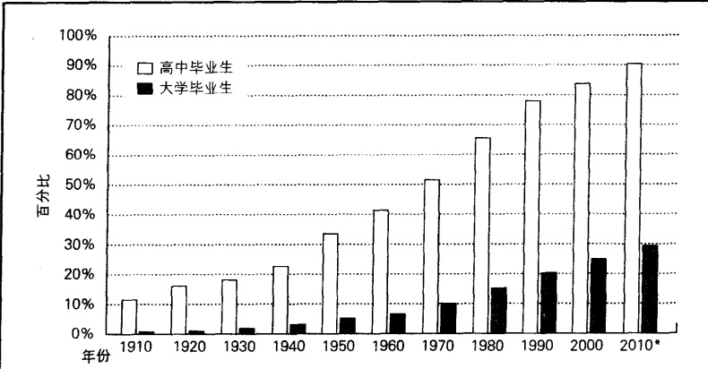

注：统计人口为25岁及以上的美国人。带星号的数据为作者的推测。

资料来源：作者根据 National Center for Education Statistics, 1991； Table 8 整理而成； Statistical Abstract 2002； Table 208。

---

### 现实社会学

### 社区大学：面临的新旧挑战

我在加利福尼亚州的奥克兰上了两年大专，从那里我拿着新发的大专文凭，转入印地安纳州威恩堡的一所高等大学，这所大学没有一年级和二年级。

我没有意识到我的大学经历正好符合一些社区学校运动发起者的设想。在20世纪早期，他们设想建立一个面向一般中学毕业生的地方学院系统，这个高等专科学院系统将使大学不必开设大一和大二的课程(Manzo,2001)。

同时，一个同样强烈的声音则在质疑，为中学毕业生进入四年制学院和综合性大学做准备，应不应该成为专科学校的目标。他们坚持认为，大专的目标应该是职业培训，是为使学生成为一名电工或其他技工做准备。在一些支持这些大专学院成为大学临时预科的声音成为主流的地方，进入大专的标准甚至比进入耶鲁大学的标准还要高（Pedersen，2000）。这场争论哪一方都没有获得真正的胜利，直到今天他们仍在争辩中。

专科学院这个名字也成了一个争论的问题。一些人认为，“专科”这个词使得他们的学校听起来好像不是一所真正的大学。是否要改变这个名字的争论随之发生，其结果是在大约30多年前，“社区大学”这个名字诞生了。

可是名字的改变并没有平息关于它的目标是为学生进入大学做准备还是进行职业培训这场争论。社区大学也继续服务于这一双重目标。

社区大学已经成为美国教育体制中非常重要的一部分，几乎一半大学生在这类学校登记注册(Kim,2002)。大多数学生都是所谓的业余生：许多人都是25岁或更大，来自工人阶级，有工作，在业余时间上课(Bryant,2001)。

为了帮助学生转到专科学院和大学，许多社区学院与一流的公立和私立学校达成协议(Chaker, 2003b)。一些学校向学生提供进入州里最优秀大学的指导，还有一些学校调整课程，以确保自己的学分制与那些综合性大学兼容，并严格规范自己的教学和考核制度。

现在社区大学所面临的挑战包括：在资源日益减少的条件下努力筹措足够的资金；继续实行开放政策；适应职业市场的变化和保证教学质量；同时也要满足学生们不断变化的需求，例如向母语非英语的移民教授英语，和向那些不再享受一种广泛的家庭支持系统的家长提供孩子的校园日间托管服务。

### 全球视角中的教育

为了能让我们从更广阔的视角来看待美国的教育体制，先来看一下其他三个国家的教育。这会使我们了解一个国家的教育是如何与它的文化和经济直接相关的。

### 工业化程度最高国家的教育：日本

社会学中关于教育的一个核心原理就是，一个国家的教育反映了它的文化。由于日本的核心价值是集体的团结，所以日本人不鼓励个体之间的竞争。在工作单位，人们是作为一个团队在一起工作的。他们不会为了升迁而相互竞争，相反，他们会作为一个团队而得到升迁（Ouchi，1993）。日本的教育也反映了这种以集体为中心的生活取向。在小学里，学生们作为一个集体来学习，所有的学生都掌握相同的技能和资料。在任何一天，全日本的孩子都学习同一课本中的同一页（“Less Rote …” 2000）。

但一个看起来非常矛盾的文化现象是,日本的大学入学申请却充满了激烈的竞争。就像美国的中

---

学生要升入大学必须通过学业评估考试(SAT)一样，在日本想要升入大学的中学生，也必须参加一场全国考试。美国的高中毕业生在考试中考得很差也能找到大学念书——只要他们的父母付得起学费。然而，在日本，只有那些高分者——富人和穷人都一样——才被允许进入大学。日本的社会学家也已发现，虽然这场考试是面向所有中学生，但是富裕家庭的孩子却更有希望进入大学。原因并不在于大学官员的偏袒，而是因为富裕家庭的父母显然可以拿出更多的钱聘请更好的家庭教师帮助他们的孩子准备这场公开考试(Ono,2001)。

### 正在进行工业化国家的教育：俄罗斯

1917年革命之后，苏维埃共产党改革了俄国的教育制度。在那时，与大多数国家一样，俄国的教育只局限于精英阶层的孩子。根据教育反映文化的社会学原理，新政府确立了社会主义价值观在学校中的主导地位，因为它意识到教育是巩固新生政治制度的一种方法。结果，学生们受的教育就是资本主义是邪恶的，而共产主义是世界的救世主。

那时，包括大学在内的教育都是免费的。学校主要教授数学和自然科学，而社会科学则很少。正如经济是由中央政府计划指导的，教育同样如此。莫斯科命令全国学校都必须教授由国家规定的相同课程，所有同一年级的学生使用相同的课本。为了防止与共产主义相对立的思想产生，学生们要背诵课文并在口试中复述讲义（Deaver, 2000）。

苏联解体后的俄罗斯处于一个“再创建”教育的时期。私立的、宗教的，甚至外国人办的学校都第一次被允许开办，教师可以鼓励学生们进行独立思考。但俄罗斯人这次遇到了许多令人头疼的问题。他们不仅要对那些教惯了模棱两可的政治条目的教师进行再培训，而且物价的持续上涨导致了学校资金的减少。一般教师每月只有33美元的工资，相当于一个普通俄罗斯工人工资的1/3（“Saving the …”，2001）。(为了对这个数字有一个认识，在此指出，住在职工宿舍一个月的费用是17美元[MacWilliams 2001a]。)一些老师数月没发工资，一所学校竟发给老师手纸和伏特加酒来代替工资(Deaver，2001)。如此低的工资，导致了腐败的产生，学生们知道向哪个老师行贿可以得到高分(MacWilliams，2001b)。

但是，上述那一关于教育的原理则到处都适用。我们可以确信，俄罗斯将会发展出一套反映本国文化的教育体系。这套体系将会歌颂它的历史英雄，并加强它的价值观和世界观。由于出现了向资本主义的过渡，俄罗斯正在转变它关于资本和私有财产的基本观念。现在俄罗斯的教育制度恰恰反映了这些变化了的价值观。

### 工业化程度最低国家的教育：埃及

工业化程度最低国家的教育与那些高度工业化国家的教育形成了鲜明对比。在工业化程度最低的国家中，即使有义务教育法，也不会被实施。由于这些国家中的绝大多数人从事农耕或是家务劳动，他们对教育的要求很低。另外，正规教育的花销太大，这些国家的大多数人都负担不起。正如我们曾在图9.2中看到的，工业化程度最低国家中的大多数人一年的花费低于1000美元。因此，在一些国家中，大多数孩子上过两年学后就不上了。图17.2对比了中国和美国的教育状况。正如曾在全世界普遍存在过的情况一样，在工业化程度最低的国家中，主要是富人才有条件和空闲时间接受正规教育——尤其是基本需求之外的知识。例如，我们可以来了解一下埃及的教育情况。

---

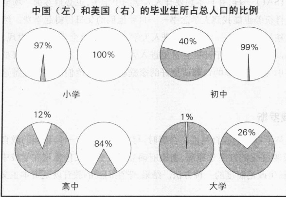

图 17.2 一个工业化程度最高(后工业)国家和一个工业化程度最低国家的教育对比

注：这是原始入学率，而不是学业完成率。美国的初中人口总数为作者的推测。

资料来源: Brauchli (1994); Kahn (2002); Statistical Abstract 2002; Table 208.

在公元前的几个世纪里，埃及的几个世界著名的学术研究圣地，出现了像阿基米德和欧几里得等举世闻名的科学家。这一古典时期的主要研究领域包括物理学、天文学、几何学、地理学、数学、哲学和医学。那时亚历山大拥有世界上最大的图书馆。这个图书馆被烧毁时残留下来的纸莎草纸手抄本残页，已经成为破译古代手抄本的无价之宝。然而，埃及被罗马击败后，教育便逐步衰落，并且再也没有恢复往日的辉煌。

虽然埃及的宪法规定每个孩子必须接受五年免费小学教育，但是许多贫穷的孩子根本没有接受过教育。而对那些接受教育的孩子来说，称职的老师又太少，教室也很拥挤。这导致的一个后果就是：一半埃及人是文盲，而妇女的文盲比率则更高（Cook，2001；Zaalouk，2001）。那些完成五年小学学业的人，将升入三年制预科学校。高中同样是三年。在前两个学年中，所有的学生学习相同的课程，在第三年里他们将分为文科、理科或数学。所有的高中生都有月考，而且在高年级的期末还有一场全国性的考试。

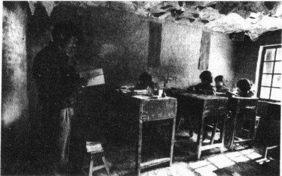

某些工业化程度最低国家的贫穷是那些在工业化程度最高的国家中长大的人们所无法想象的。它们的教育也被贫穷所笼罩。这张照片摄于中国陕西省的一个农村学校。

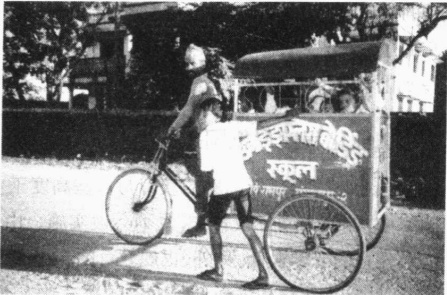

在那些工业化程度最低的国家里，也有一些由西方人任教和教授西方人的高质量学校。这张照片向我们展现的是，在尼泊尔一辆由自行车改装的校巴正在载着孩子们去英语寄宿学校。

---

### ☑功能主义视角: 有利于社会运行

功能主义的一个核心观点就是：当一个社会的各个部分正常运转时，每个部分都有利于这个社会的良性运行或稳定。人们的行动带来的可预料的积极后果被称为显性功能，而人们事先没有意识到的由行动本身所产生的积极后果则是隐性功能。让我们来看一下教育的功能。

### 传授知识和技能

教育最明显的显性功能就是传授知识和技能——既有传统的三 R 能力，也有现代社会所需要的更高级的能力，如操作计算机的能力。每一代人都必须训练下一代人担当其群体中重要的职位。既然我们的后工业社会需要受过高等教育的人，那学校就培养这样的人。

通常来说，重要的并不是学习本身，而是学习的证书。社会学家兰德尔·柯林斯(Collins,1979)注意到，我们已经成为一个文凭社会(credential society)。他指的是雇主把文凭和学位当做筛选的依据。例如，他们认定大学毕业生是有责任心的人，因为他们能够在无数次的课堂上准时到课，按时上交数十次作业，并且他们已经具有了基本的写作和思维能力。大学文凭可以表明，毕业生已经为其职位所需要的工作技能打下了基础。

在另一些情况下，工作技能是个人在担任某项工作前就必须掌握的。以前，对于医生、工程师和飞行员来说，边工作边学习是可以的，但是随着信息和技术的发展，情况已经发生了变化。这也可以解释为什么医生的文凭会如此重要。他们站在你的面前，手里拿着高等研究机构颁发的文凭，镶边的学位证书说明他们已经完成了严格的培训计划，而且已经注册，现在他们获准能够在你的身上开刀了。

### 价值观的文化传播

教育的另一个显性功能就是价值观的文化传递，通过这个过程学校将一个社会的核心价值观一代又一代地传递下去。因此，社会主义社会的学校强调社会主义价值观，资本主义社会的学校则传播资本主义价值观。例如，美国学校强调的是尊重私有财产、个人主义和竞争。

无论一个国家的经济体制如何，忠于这个国家都是一种文化价值观。全世界的学校都在宣传爱国主义。美国的学校教给学生美国是世界上最好的国家；俄罗斯的学生则会学到没有国家会比俄罗斯更好；还有法国、德国、日本和阿富汗的学生都会学到关于各自国家的诸如此类的种种说法。每个国家的小学老师都会赞美该国建立者的美德和他们为反抗压迫争取自由而进行的斗争，以及这个国家基本社会制度的优越性。

### 社会整合

学校教育也能带来社会整合；也就是说，学校能帮助学生融入一个更有凝聚力的整体中。例如，当学生们唱起国歌并向国旗敬礼时，他们就会意识到一个“更伟大的政府”，他们对国家的认同感也会增强。学校如何促进政治整合的一个最好例子，是那些进入美国学校学习美国社会主流观点和价值观的数百万移民，他们在成为美国公民时放弃了对原来的国家和文化的认同（Violas，1978；Rodriguez，1995；Carper，2000）。

---

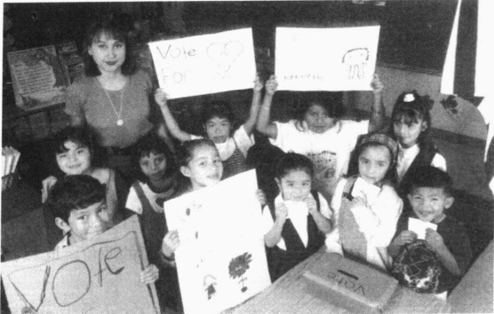

教育的主要功能就是价值观的传递，这张照片就是一个例证。教育的另一项功能是社会整合，这在照片中也能明显地看到。这些在旧金山的学生正在学习，无论他们的个人身份如何，他们都是美国人。

教育的整合功能不仅仅是使人们在外表和说话方面相似。构筑一个国家的认同感是为了稳定国家的政治制度。如果人们认同一个社会的制度并把它看做是获得福利的基本要素，他们就没有理由革命。特别是在涉及社会的底层阶级时，这个功能尤其重要，因为大多数社会革命都是由这个阶级发动的。而富裕阶层出于既得利益的考虑，当然会维护现状。但是，如果能使底层阶级认同当今这种社会制度，那么将对现行制度的维持大有好处。

残疾人经常发现自己无法融入主流社会。为了克服这一点，美国的学校

又增加了一项新的显性功能，即主流化（mainstreaming）或包容，意思是学校试图使残疾学生融入正常的社会活动。以往通常的做法是，残疾学生会被安排在特殊的学校里。在那里他们只是学习如何适应一个特殊的社会，这使他们不能很好地适应主流社会。教育的理念也转向鼓励甚至要求残疾学生进入常规学校学习。对于那些不能走路的人来说，可以为他们提供轮椅专用道；对于那些听不到声音的人来说，“手势员”（手语解说员）可以随他们一起上课。大多数盲人学生和有严重学习障碍的学生则进入专门的学校学习。但总的来说，现在有一半的残疾学生在普通学校的教室里和正常人一起学习（“State of American Education” 2000）。

### 把门

把门(gatekeeping)或者说决定谁从事什么职业，是教育的另一项功能。把门的一种类型是文凭化——用文凭和学位来决定谁胜任一份工作——它对某些人敞开了机会之门，而对另一些人来说则关上了机会之门。把门通常是通过分轨(tracking)或分类来实现的，即根据认识到的能力差别将学生划入不同的教育计划。一些美国学校将学生分为三类：一般学生、大学预备生和优等生。最下一层的学生基本上是高中毕业后就参加工作或参加职业教育。最上一层的学生通常是进入声望很高的综合性大学。中间那类学生通常是进入社区大学或地区性的州立大学。这种分轨对学生的影响是终生的，影响了他们的就业机会、收入和生活方式。虽然现在学校已经不再进行正式的分轨，但是将学生分为不同的“能力组”也是为了相同的目的(Lucas, 1999; Tach and Farkas, 2003)。

功能主义者塔尔科特·帕森斯(Parsons,1940)、金斯利·戴维斯和威尔伯特·穆尔(Moore,1945)说，把门是根据人们的才智进行分类的。他们最先提出了一种叫做社会定位(social placement)的观点，即一些工作需要很少的技能，才智不是很高的人就可以完成；而另一些工作，如外科医生，则要求高才智和高水平的教育。为了激励那些有能力的人忍受满足感的延迟到来和长年累月的枯燥学习，必须回报给他们高收入和荣誉。于是，功能主义者就将教育看成是这样一种制度：为了社会的正常运行，根据人们的能力和志向进行筛选。

---

### 代替家庭的功能

经过这些年的发展，美国学校的功能已经得到拓展；它们现在已经取代了一些家庭的功能。儿童护理就是一个例子。小学有着双重职责：它充当着父母都工作或是有工作的单身母亲的孩子的保姆。日托一直是正规教育的隐性功能，因为它是学校教育未被认识到的结果。然而，现在，由于大多数家庭的父母都参加工作，日托也开始成为显性功能。一些学校甚至还提供孩子在正常上课时间之前和之后的照料。学校的另一项功能就是向学生提供性教育和避孕的建议。这引起了争论，因为一些家庭对学校从他们手中夺走这项功能表示不满。这种价值观层面上的争论，已经引发了一场取代学校教育的运动，这也是下面的“现实社会学”专栏中将要讨论的主题。

### 现实社会学

### 家庭教育：寻求教学质量和维护自己的价值观

“你要干什么？你要在家里教育你的孩子？”这是对那些决定在家教育孩子的家长的一种典型的不信任反应，“你怎么教育啊？你又没受过培训。”

而提问者真正要问的是：“你怎么了？你想要你的孩子变成呆子，变成不能适应社会的人吗？”

家庭教育运动在开始时规模很小，只有很少的家长因不满意学校刻板的科层制度、松散的纪律、不称职的老师、低的教学标准，以及对学生个性需要的忽视，或对其宗教信仰的敌视态度而选择家庭教育。

然而星星之火可以燎原。虽然并未形成大潮，但在家接受教育的孩子数量大约是洛杉矶和芝加哥公立学校在读学生人数之和。乐观的估计是大约有100万儿童在家接受教育(Hill,2000;Lines,2000;Stevens,2001)。

家庭教育在美国好像是新兴的。但令人惊讶的是，它并不是新生事物。在殖民地时期，家庭教育就是教育的典型方式（Carper，2000）。今天的家庭教育运动，虽然保留了原有的形式，却反映了美国政治的有趣变化。当代的家庭教育始于20世纪50年代和60年代的政治和宗教自由主义者，他们反对过于保守的学校教育。在这之后没多长时间，学校教育就开始变得越来越自由。但在20世纪70年代和80年代，政治和宗教保守者却开始了家庭教育（Lines，2000；Stevens，2001）。

家庭教育到底怎么样？没有接受过培训的家长会教孩子吗？早期对家庭教育的调查结果是令人满意的，但它们只限于少数几个群体或少数几个州。1990年，一项调查在全国范围内抽取了2000个家庭教育的样本。结果显示，这些孩子比那些在公立学校的孩子要做好。这是真的吗？

为了找出确定的答案，调查者在全国测试了21000个接受家庭教育的孩子(Rudner,1999)，结果使人震惊。他们在每个年级每次考试的平均成绩都在70—80分之间，接受家庭教育的孩子比公立学校和天主教会学校的学生得分都高。

家庭教育取得如此惊人的成绩的根本原因，看起来是家长介入了孩子的教育。接受家庭教育的孩子受到了高强度的一对一教育。他们的课程——虽然它包括了各州规定的基本课程——是根据学生的兴趣和需要来设计的。90%的学生主要由母亲来教，10%的学生则由父亲教（Lines，2000）。98%的父亲都有工作，而有工作的母亲则仅占22%。学生家长的收入也高于平均水平。

那么这些孩子的社会化程度怎么样呢？接受家庭教育的孩子是不是不适应社会生活呢？这项研究表明，他们做得比人们想象的要好。他们所具有的行为方面的问题，实际上比那些在正规学校上学的孩子更少（Lines,2000）。家庭教育下的孩子并不是孤独的。在教育事项方面，他们的父母经

---

常带着他们去参观图书馆、博物馆、工厂和养老院(Medlin,2000)。在社会活动方面，许多儿童也与其他接受家庭教育的孩子见面。家庭教育协会也为家长和孩子举办交流会，甚至举行运动会。

当然，我们不会知道如果这些接受家庭教育的孩子在公立学校上学将会获得什么样的成绩。由于他们的家长对他们的教育的关心和介入程度如此之高，他们很可能在学校里也会做得非常好。最后要说的是，虽然拉德纳的研究范围很大，包括21000名学生，但它并不是一个随机样本，因此我们不能说平均的家庭教育水平是个什么样子。但是，我们也没有所有公立学校学生的随机样本。

### 思考题

你认为是什么原因使得家庭教育如此成功？按照现在的增长速度，很快就会有200万美国儿童在家接受教育，你认为这场运动最终会对美国的公立学校造成威胁吗？你愿意接受家庭教育吗？你会考虑在家教育你的孩子吗？

### 其他功能

教育还有其他一些功能。由于大多数学生未婚，高中和大学也扮演着婚姻介绍所的角色。许多年轻人都是在学校里找到他们未来的另一半的。从社会学方面来看，是学校促使拥有相似背景、兴趣和教育水平的人们走向婚姻的殿堂。学校也建立了社会网络关系，一些成年人维持着中学和大学时发展起来的友谊关系；另一些人则建立起了有利于他们事业的网络关系。最后，学校也有利于稳定就业。让成千上万的年轻人进入学校，就等于让他们离开劳动力市场，保护年龄大的工人的职位。学校也能通过让这数百万人远离街道这种方式，来维持社会稳定，否则他们就可能会因那些低技术要求的工作被转移到了其他国家而去游行和抗议。

学校的另一项功能是提供就业。在小学和高中有5300万学生，在大学里注册登记的有1500万人，美国的教育就是一个巨大的商机。小学和中学提供了290万个教师职位，还有100万人在学院和大学任教（Statistical Abstract 2002: Table 200, 239, 257）。另有数百万人为学校提供服务——助手、管理人员、汽车司机、看门人、和秘书。还有数百万人通过服务学校的产业来谋生——从修建学校到生产铅笔、纸、桌子和电脑。

### ☑ 冲突论视角: 再生产社会的阶级结构

与功能论者关注教育的积极功能不同，冲突论者分析的是教育怎样帮助精英阶层维护他们的统治地位。他们强调教育再生产了社会的阶级结构，即教育使一个社会的社会分层得以延续。比如，无论能力如何，富裕家庭的孩子更有可能学习大学预科课程，而穷人的孩子则更有可能接受职业教育。在他们出生之前，各自不同的生活机遇就已经摆在他们面前了。

下面让我们来看看,教育是怎样再生产出社会的阶级结构的。

### 潜在课程

潜在课程 (hidden curriculum) 这个术语, 是指学校在正式课程之外教授的有关行为和态度的非书面规则。例如, 对权威的服从和与主流规范保持一致。冲突论者揭示了潜在课程是怎样延续社会不平等的。

---

为了理解冲突论这一中心观点，我们可以思考一下英语的教学方法。中产阶级的学校——这里的老师知道他们的学生以后可能的工作——强调“得体”的英语和“良好”的举止。与此形成对比的是，在城区中的学校里——这里的老师也知道他们的学生以后会干什么工作——则允许学生在教室里用自己种族的语言或俚语说话。这两种教学方式都有利于再生产出社会的阶级结构。也就是说，每种方式都在为学生们今后从事与其父母相类似的职业做准备。一些孩子的社会阶级注定了他们将处于更高的地位。所以，他们要有“优雅”的举止和谈吐。另一些人的社会命运则是从事受到严密监督的底层工作。对他们来说，他们只需要服从规则（Bowles and Gintis，1976；2002），教给这些学生“优雅”的谈吐举止完全是白费功夫。

从冲突论观点来看，甚至幼儿园也有一套潜在课程。这在下面的“现实社会学”专栏中有所阐述。

## 现实社会学

### 人生的训练营：幼儿园

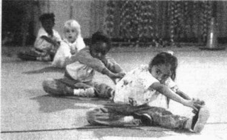

社会学家哈里·格雷西（Gracey，2003）在对一所幼儿园进行参与观察后，得出这样一个结论：幼儿园是教育的训练营。在这里，来自不同背景的小孩子们被训练成了一个服从命令、遵守班级规则的群体。例如，“站起来说”并不只是训练孩子们的表达能力，它也教导孩子们只有被允许发言时才能开口说话（“轮到你了，贾米。”）。它还教会孩子们通过举手然后被叫到这种方式来要求获得发言的机会（“谁知道艾达有什么东西？”）。这种规则也教会孩子们认识到老师的意见更正确，他/她是有能力评价学生们的行动和观点的人。

格雷西在另一些他所观察的活动中发现了潜在课程。不管学生们是在画画、听录音、吃饭还是休息，老师都会责备那些爱说话的学生而表扬那些听话的学生。简言之，孩子们收到这样一个信息：即老师——推及到整个学校——就是一个权威。

格雷西总结说，这并不是一个细枝末节的小问

题——而是幼儿园的目的所在。幼儿园老师的职责，就是教会孩子“无条件地服从要求”。通过“在教室里营造和推行一个严格的社会结构，使得老师可以在课上大部分时间里有效地控制大多数孩子的行为。”

这样就形成了三种学

生：①“好”学生；即那些服从并认同学校的强制性纪律的学生。②“中等”学生，即那些服从但并不认同学校纪律的学生。③“坏”学生，即那些拒绝遵守学校纪律的学生。处于第三类的学生就被称为“问题儿童”。为了让他们步入正轨，一种更加强硬的训练官——学校的心理医生便介入了。如果这也不起作用的话，就要给问题儿童吃利他林以使其顺从。

这种早期的训练扩展到了教室之外。就像格雷西所写的，学校就像一个人生的训练营一样，替孩子们为将来工作中的制度要求做准备，不管是在生产线还是在办公室。它帮助孩子们成长为服从“公司”强行制定的规则的顺从的工人。

### 带有倾向性的考试：IQ 中的歧视

甚至智商测验也在维持社会阶级体系中发挥着作用。例如，你会怎样回答下面的问题呢？

---

正如一本书是由___写的，一首交响乐是由作曲家作的。

___纸 ___雕刻家 ___音乐家 ___作家 ___男人

你大概会毫不费力地选择“作家”，任何一个智力正常的人不都会这样选择吗？

实际上，这个问题却触及到智力测验中的一个中心问题。并不是所有有知识的人都知道这一答案。这一问题包含着文化歧视。来自某些背景的儿童会比另一些儿童更熟悉交响乐、作曲家和雕刻家的概念。结果，这一测验就是有利于他们的（Turner，1972；Ashe，1992）。

可能下面这个问题会使这种偏向更加明显，请回答：

如果你扔了一个骰子，上面是“7”，那么下面是什么呢？

___7 ___它的眼睛 ___棚车 ___小乔斯 ___11

这个由沃茨的社区工作者阿德里安·达夫提出的问题是偏向底层阶级的生活经验的。确实很明显，这种特定的文化歧视使得测验有所偏向，以至于某些社会背景的孩子比另一些做得更好。

在智力测验中使用诸如作曲家和交响乐之类的问题并没有什么不同。一个底层阶级的孩子可能听说过说唱、Hip-Hop、摇滚乐或爵士乐，但可能没听说过交响乐。换句话说，智商测验测量的不只是智商，

冲突论者强调教育再生产出了一个国家的社会阶级结构。为了支持这一论点，他们指出美国人的社会阶级不同，他们进入的学校也不同。学校由一些来自不同背景的老师任教，学生们学习与他们的社会地位相称的世界观。这幅照片向我们展现的是，在华盛顿特区的圣奥尔本斯学校的学生和老师正在吃午饭。

还包括习得的文化知识。我们还看到，学校使用的IQ测验中的文化倾向很明显不是有利于底层阶级学生的。由此造成的后果之一就是，那些在测验中得分低的少数民族和穷人的孩子，被指派到“符合”他们智力水平的低要求的课程中(Weiler，1998；Lucas，1999)。这注定了他们长大后要从事低收入工作。所以，冲突论者把IQ测验视为使社会等级结构得以代代维系的另一种手段。

### 先天不利: 不平等的投入

各个地区的教育投入情况也是各不相同。学生居住地对他们的教育投入有着显著的决定意义。不过，冲突论者却观察到了更深一层的情况。他们强调，在所有州里，穷人们都输在了起跑线上。因为公立学校都是由本地的财产税支撑的，所以那些比较富裕的社区（财产税较高的社区）就可以在他们的孩子身上花更多的钱。而穷一些的社区则只能投入少得多的资金。结果就是，富裕的社区可以支付更高的工资，以挑选到更称职和更有积极性的老师。他们也买得起最新的课本、电脑和软件，还能提供外语、音乐、艺术等课程。

由于美国的学校反映了美国的社会阶级制度，因此，上层阶级的孩子为了在中学获得成功必然会进最好的小学。接着，他们又会为了在大学中获得成功进入最好的中学就读。他们

---

已经获得了维持其统治地位的有利条件。穷人家的孩子在这场比赛中不堪一击，就像在一场田径赛中，一个一条腿的运动员要与百米冠军琼斯赛跑。

忌之，由于教育机会的大门对一些人完全敞开，对另一些人却只开了一条狭缝，所以冲突论者认为，教育制度再生产出了(或者说延续了)社会的阶级结构。实际上，他们还认为，这就是教育的主要目的之一。

### 相一致原理

在一项经典分析中，冲突论者塞缪尔·鲍尔斯和赫伯特·金提斯(Bowles and Gintis, 1976)使用了“相一致原理”（correspondence principle）来说明学校是怎样反映社会的。这个词语的意思是一个国家各个学校的教学内容是与这个社会的特征相一致的。下面列出了一些例子。

<table border=1 style='margin: auto; word-wrap: break-word;'><tr><td style='text-align: center; word-wrap: break-word;'>社会的特征</td><td style='text-align: center; word-wrap: break-word;'>学校的特征</td></tr><tr><td style='text-align: center; word-wrap: break-word;'>1. 资本主义2. 社会不平等3. 种族偏见4. 公司的科层制结构5. 要求顺从的工人6. 要求依附性的工人7. 要求维持军事力量</td><td style='text-align: center; word-wrap: break-word;'>1. 鼓励竞争2. 学校间资金投入的不平等3. 将少数民族排挤到无需太多智力的工作培训课程中4. 在教室树立起一种权威典范5. 使学生顺从,如在幼儿园训练营那样6. 强制按时上课和交作业7. 激发爱国主义(为资本主义而战)</td></tr></table>

冲突论者总结道，美国的教育体制是用于将大多数学生培养成不会质疑老板的依附性工人。它也被用来培养一些思想和行动方面的创新者，但前提是确保他们对现存的社会制度保持忠诚（Olneck and Bills, 1980）。

### 底线：家庭背景和教育制度

不平等投入、IQ测验等等的最终结果就是：在决定某人能否进入大学时，家庭背景比考试成绩更重要。1977年，社会学家塞缪尔·鲍尔斯(Samuel Bowles)把中学毕业生中智力最高的25%和智力最低的25%的大学入学率作了一下比较。图17.3显示了比较的结果。在最聪明的25%的学生中，90%来自富裕家庭的孩子进入了大学，而低收入家庭中的只有50%。在智力最低的学生中，26%来自富裕家庭的孩子进入了大学，而贫困家庭只有6%。另一些美国和英国的社会学家也证实了这个论点：随着家庭收入的提高，他们的孩子进入大学的可能性也随之升高(Manski，1992—1993；Reay et al.,2001)。社会学家多尔顿·康利(Conley，2001)也发现了类似的现象，越富裕的家庭，他们的孩子完成的教育年数越多。

冲突论者也指出，美国的教育制度不仅再生产出社会的阶级结构，也再生产出种族和民族的分化。从图17.4中可以看到，与白人相比，非裔和拉美裔美

图 17.3 谁上了大学？社会阶级与个人能力在决定谁进入大学时的比较

<table border=1 style='margin: auto; word-wrap: break-word;'><tr><td style='text-align: center; word-wrap: break-word;'></td><td colspan="3">学生的考试成绩</td></tr><tr><td rowspan="3">学生 背景</td><td style='text-align: center; word-wrap: break-word;'></td><td style='text-align: center; word-wrap: break-word;'>高</td><td style='text-align: center; word-wrap: break-word;'>低</td></tr><tr><td style='text-align: center; word-wrap: break-word;'>富人</td><td style='text-align: center; word-wrap: break-word;'>90%</td><td style='text-align: center; word-wrap: break-word;'>26%</td></tr><tr><td style='text-align: center; word-wrap: break-word;'>穷人</td><td style='text-align: center; word-wrap: break-word;'>50%</td><td style='text-align: center; word-wrap: break-word;'>6%</td></tr></table>

资料来源：Bowles（1977）。

---

图 17.4 教育的分流效果: 不同的种族和民族

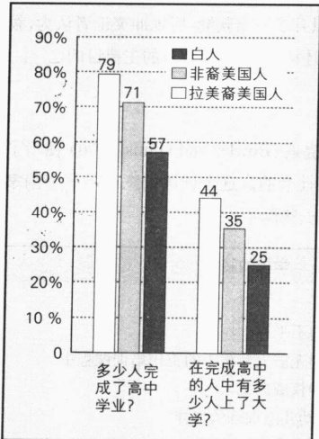

注：这份资料仅给出了三个群体的总数。

资料来源：作者根据 Statistical Abstract 2002: Table 252 整理而成。

国学生完成高中学业和进入大学的可能性都很小。差距最大的是拉美裔美国学生，因为那些没有大学学位的人更可能终生从事只有微薄工资和没有升迁可能的工作。你可以看到，这一点正好支持了冲突论者的观点——教育是怎样为下一代人再生产出种族—民族结构的。

正如你所知道的那样，你进入的大学的类别也是至关重要的。表17.1显示，在进入大学的人中，白种人、非裔美国人和亚裔美国人在进入四年制私立大学的百分比上并没有太大差别。这些数字显示了种族平等的趋势，它们没有支持冲突论者的说法。但相比之下，拉美裔美国人和土著美国人进入四年制大学的比例就要少得多。这和前面所说的他们进入大学的可能性也较小的情况，共同说明了教育是怎样帮助延续社会的种族—民族分化的。

### ▷▷小结

冲突论者强调，教育制度的主要目的是再生产社会不平等，以有助于社会阶级结构一代一代地延续下去。通过各种各样的分化途径，贫困阶级的孩子被输送到社区大学的职业培训

表 17.1 在进入大学的人里, 每一种族的入学率

<table border=1 style='margin: auto; word-wrap: break-word;'><tr><td style='text-align: center; word-wrap: break-word;'>民族一种族</td><td style='text-align: center; word-wrap: break-word;'>公立大学</td><td style='text-align: center; word-wrap: break-word;'>私立大学</td><td style='text-align: center; word-wrap: break-word;'>两年制大学</td><td style='text-align: center; word-wrap: break-word;'>四年制大学</td></tr><tr><td style='text-align: center; word-wrap: break-word;'>白人</td><td style='text-align: center; word-wrap: break-word;'>76%</td><td style='text-align: center; word-wrap: break-word;'>24%</td><td style='text-align: center; word-wrap: break-word;'>36%</td><td style='text-align: center; word-wrap: break-word;'>64%</td></tr><tr><td style='text-align: center; word-wrap: break-word;'>非裔美国人.</td><td style='text-align: center; word-wrap: break-word;'>76%</td><td style='text-align: center; word-wrap: break-word;'>24%</td><td style='text-align: center; word-wrap: break-word;'>41%</td><td style='text-align: center; word-wrap: break-word;'>59%</td></tr><tr><td style='text-align: center; word-wrap: break-word;'>亚裔美国人</td><td style='text-align: center; word-wrap: break-word;'>79%</td><td style='text-align: center; word-wrap: break-word;'>21%</td><td style='text-align: center; word-wrap: break-word;'>39%</td><td style='text-align: center; word-wrap: break-word;'>61%</td></tr><tr><td style='text-align: center; word-wrap: break-word;'>拉美裔美国人</td><td style='text-align: center; word-wrap: break-word;'>83%</td><td style='text-align: center; word-wrap: break-word;'>17%</td><td style='text-align: center; word-wrap: break-word;'>56%</td><td style='text-align: center; word-wrap: break-word;'>44%</td></tr><tr><td style='text-align: center; word-wrap: break-word;'>土著美国人</td><td style='text-align: center; word-wrap: break-word;'>85%</td><td style='text-align: center; word-wrap: break-word;'>15%</td><td style='text-align: center; word-wrap: break-word;'>50%</td><td style='text-align: center; word-wrap: break-word;'>50%</td></tr></table>

资料来源：Statistical Abstract 2002；Table 258。

班中，而中产阶级的孩子则被送到州立大学和小型的私立大学中；与此形成对比的则是，精英阶级的孩子被送到专门的寄宿制中学，由高收入的老师小班授课(Persellet al., 1992; Powell, 1996)。这些上层社会的孩子所继承的社会关系网络，包含了那些美国最优秀的大学负责学生录取的官员。这些关系网络已经足以使这些私立学校的一半毕业生升入常春藤盟校(Persell and Cookson, 1986; Golden, 2003)。

### ☑ 符号互动论视角: 实现教师的期望

功能论者着眼于教育对社会的功能，冲突论者着眼于教育如何延续社会不平等。与其相反，符号互动论者则研究教室中面对面的互动。他们发现教师的期望对他们的学生有着复杂的影响。

### 里斯特的研究

为什么一些人会进入大学预科班而另一些人会进入职业培训学校呢？答案并不是唯一的。但是社

---

会学家雷·里斯特 (Ray Rist) 在他所作的经典研究中却得到了一些有趣的发现。里斯特 (Rist, 1970) 跟着一名非裔美国教师在一所非裔美国人的小学里作了一次参与观察。他发现，幼儿园的老师仅上了八天的课，就认为自己已经很了解孩子们的能力了，并把他们划分到三排不同的座位区中。卡普罗太太将她认为的“聪明学生”分派在了第一排座位区，他们坐在教室前面，离她很近；第三排座位区中则是她认为的“笨学生”，他们坐在教室后面；第二排座位区中是“一般的学生”，他们坐在教室中间。

里斯特觉得这一切很奇怪。他知道这些学生并没有经过能力测试，但他们的老师却肯定她能够区分聪明学生和笨学生。在更深入的调查中，里斯特发现，社会阶级是将孩子们划分到不同座位区的潜在根据。中产阶级的孩子被分到第一排座位区，穷人家的孩子被分到第二排和第三排座位区。老师对靠近她的第一排座位区的孩子最关心，其次是

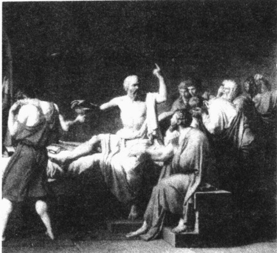

教育可能是一件危险的事情。约公元前400年，教授希腊文的苏格拉底因为观点与国家的建立者相抵触而被迫服毒自杀。但是，通常情况下，教育者都会强调精英阶级的观点，教育学生在社会中要各得其所。这幅描绘苏格拉底的画于1787年由雅克·路易斯·戴维创作完成。

第二排座位区，最后是第三排座位区。时间长了，第一排座位区的孩子们意识到他们受到了特殊优待，他们也开始认为自己比其他人更聪明。他们成为班级活动的领导者，甚至嘲笑坐在其他座位区的孩子，骂他们是“笨蛋”。最后，第三排座位区的孩子退出了许多班级活动。到年末的时候，只有第一区的孩子完成了老师为他们讲授的课程。

这种早期的分类对待会一直持续下去。他们小学一年级的老师看了他们在幼儿园完成的功课，就把原来坐在第一排座位区的孩子安排到了她的第一排座位区。她对各座位区的孩子们的态度与幼儿园的老师很像，于是第一排座位区的孩子又在班上处于领先地位。

这些孩子的名声继续跟着他们。二年级的老师察看了他们的成绩，然后也把她的班级分为三个组。她把第一组称为“老虎”，为了与他们的名字相配，她给他们阅读更有难度的读物。当然，“老虎”这一组来自于原先幼儿园中的第一座位区。她把第二组称为“红雀”。他们来自原先的第二和第三座位区。第三组由一年级时没有合格的学生组成，她称之为“小丑”。“红雀”和“小丑”两组学生则看一些很简单的读物。

里斯特总结出：每个儿童的整个受教育过程就被幼儿园的那八天决定了！这项研究与前面所说的对“圣徒”和“无赖”（在第4章中阐述过）的研究一样，都表明了标签的力量。它把人们安排到了影响其一生的活动轨道中。

这就是自我实现预言的过程。这个词是由社会学家默顿（Merton，1949）提出的，指的是关于某件事的虚假假定最后却成为真实的，这只是因为它被预言了。例如，人们相信了一个说某个银行将要倒闭的无稽谣言，他们纷纷跑去这个银行取出他们的存款。于是这个谣言——虽然起初是虚假的——现在就很可能成为真实的。

---

### 罗森塔尔—雅各布森的实验

我们都知道老师的期望——有些老师的标准更高，而且要求更高质量的功课。可是，老师的期望的作用是微妙的。在社会心理学家罗伯特·罗森塔尔和利诺·雅各布森(Rosenthal and Jacobson, 1968)所作的一次经典实验中，他们在旧金山一所小学作了一次新的测验，他们对那里的孩子们进行了能力测验，然后告诉老师哪些学生可能会在该年的学习中突飞猛进。他们告诉老师注意观察这些学生的进步，但不要让学生或家长知道这次测验的结果。到了年底，他们再次对这些学生进行了IQ测验，结果发现，那些被预言学习会有很大进步的孩子比其他孩子要高出10到15个百分点。

你可能会认为罗森塔尔和雅各布森之所以出名，是因为他们设计了如此有效的学业能力测验表。实际上，他们的“测验”只是他们秘密实验的一部分。罗森塔尔和雅各布森只是对学生们进行了一次例行的IQ测验，然后随机抽取20%的学生作为“学习进步者”，这些学生与班里其他学生没有什么不同。一个自我实现预言的过程开始了：老师对这些特殊学生具有较高的期望，而学生也努力去做。总之，期望你笨你就笨，期望你聪明你就聪明。

虽然后来对这次实验的许多次重复实验有着不同的结果(Pilling and Pringle,1978)，但是大量研究还是证实了这一点：无论能力如何，被期望表现更好的学生一般来说做得也更好，而被认为表现差的学生做得也就差(Snyder,1993;McRown and Weinstein,2002)。

### 教师的期望是如何对学生发生作用的？

社会学家乔治·法卡斯(Farkas, 1990a, 1990b, 1996) 对教师的期望如何对学生发生作用这一问题很感兴趣。他用分层抽样在得克萨斯一个大校区抽取了一部分学生。他发现，在相同的分数下，女生平均的等级成绩要好于男生，亚裔美国人比非裔美国人、拉美裔美国人和白人获得的等级成绩也更高。

起初，这看起来像是老生常谈——另一种歧视行为。但是，法卡斯的解释却并非如此，而正是这一解释使得这项发现比较令人感兴趣。看一下受害者是谁吧。老师不可能会对男生或白人产生偏见。为了解释这一没有预料到的结果，法卡斯运用了符号互动论。他注意到一些学生向老师“示意”他们是“好学生”。他们积极配合老师，迅速对老师所说的话表示同意。他们也向老师表示他们正在“努力学习”。老师注意到了这些信号，并回报给这些“好学生”以更高的成绩。观察者推论出，女生和亚裔美国人能更好地表现出老师所欣赏的这些特性。

我们没有足够的资料来说明老师是怎样形成对学生的期望,他们又是怎样把期望传达给学生的。我们对学生如何向老师“示意”的信息也知道得不多。可能你以后会成为一名教育社会学家,会对这些重要的人类行为领域更加关注。

下面的“社会学和新技术”专栏将讨论技术如何为“示意”以及学生一老师的互动提供新的形式。

### ☑美国教育存在的问题及其解决方法

在结束本章之前，我们来看一下美国教育中存在的两个问题——并考虑一下可行的解决方法。

---

社会学和新技术

### 网络大学: 没有围墙, 没有常春藤, 没有一次狂欢聚会

远程教学，即向不在场的学生传授课程，并不是什么新鲜事。数十年前，我们就已经有了函授课程。然而在今天，电子通信技术已经改变了远程教学。卫星、电脑、可视会议和视频流技术，正在使网络大学成为主流教育的一部分。使用视频连接，学生们可以在屏幕上观看老师上课；点击一个小按钮，他们就可以“举手”提问题。最后，配置了摄像头的电脑可以使班上每位同学同时看到其他所有人。蜘蛛网式的网络结构可以让老师知道谁在给谁发电子邮件，谁暂停听课。这个软件还有一项功能就是使教务长（监督者）能够监督教师。例如，教务长将获得报告，知道老师用了多长时间回复学生的电子邮件。

远程教学对增进文化多样性具有惊人的潜力，这对学生和老师都有益处。它使得不离开所在国家便可获得一次刺激的国际经历成为可能。例如，来自纽约州立大学和白俄罗斯大学(俄罗斯，明斯克市)的社会学老师联合开设了有关社会控制的在线课堂。由于他们彼此之间的政治背景有巨大差异，美国和俄罗斯的学生发现这堂课开阔了他们的视野，使他们看到了不同的社会现实(Beaman，2003)。

为什么正规教育必须局限于有围墙的教室里呢？考虑一下网络的可能性。我们可以学习人类文化，并和来自泰国、冰岛、南非、德国、埃及、中国和澳大利亚的同学比较一下饮食、约会或葬礼等方面的不同。我们可以根据课本上学到的理论背景，通过比较我们彼此的不同经历合作写一篇论文，然后交给我们共同的老师。

我们会不会与来自世界各地的人做同学，一起上幼儿园，一起上小学呢？这虽然听起来比较有趣，但没有围墙的教室同样也意味着没有了走廊或宿舍里的欢笑、没有了课间的热闹、没有了共品咖啡时的小聚……

在下面的“社会学和新技术”专栏里将讨论关于远程教学的另一种观点。

社会学和新技术

### 资本主义和远程教学：网络教育的市场化

一直在追求利润和寻求新的投资领域的资本家，看到了先进通信技术下的教育的盈利潜力。对他们来说，远程教学是投资的最佳领域，其获得利润的潜力是巨大的，因为远程教育需要很少的基础设施——不需要教室、桌子、黑板或停车处。另外，一旦发展起来，课堂内容还可以被重复包装和出售。资本家也想要扩展市场，而随着全球对教育的需求越来越高，远程教育大有用武之地。所以，从众多方面来说，远程教育都是资本家的一个梦想。

就像本书中所强调的，席卷我们所有人的一场主要的社会变革就是资本主义的全球化。远程教育参与了这个从根本上改变世界的变革过程。由于美国成为了世界头号资本主义国家，自然，美国的大学也在远程教育中统领全局，对各种网络学位进行统一规划，然后把它们销往全世界。

但是为了吸引消费能力高的客户，销售者需要出售名牌大学的产品。比如，凤凰大学——这是什么？一种鸟的名称？亚利桑那州的一个城市？从这所虚拟学校获得的学位管用吗？卡丁大学这个名字也有类似问题。

销售者怎样才能让名牌大学进入这个市场呢？一个只存在于网络中的大学——卡丁大学的发起者找到了一个绝妙的解决办法。名牌大学不敢冒险进入这个未知的领域，因为害怕它会损害它们常春藤盟

---

校的名声。但是如果联合在一起它们就可以分担风险。斯坦福、哥伦比亚、卡内基·梅隆和芝加哥大学决定共同在网上提供一个联合学位。卡丁大学的发起者高兴过望，因为他们可以经营一个与众多受人崇拜的名称相联系的学位。而且对投资教育的资本家来说，还有什么比出售商业硕士学位——即他们所提供的一套课程——更好的选择呢(Pohl,2003)?

这是一个全球化的市场，而我们就像当年西部拓荒者曾遇到的那样，到处都是机遇。新的教育资本家已经准确地抓住了这个机会，全世界成千上万人所形成的学生群体正等待他们的开发。想一想，亚洲和非洲没有进入大学的人数是多么巨大。当然，他们中绝大多数人也没有钱——但是精英阶层的孩子有，新富阶层的孩子也有。不可否认，花24000美元获得一个卡丁大学的M.B.A.学位（Pohl，2003）对大多数人来说有点过于昂贵，但是它比花10万美元获得杜克大学的网上M.B.A.学位还是要便宜许多（Forelle，2003）。

### 存在的问题: 平庸化和暴力

平庸化愈来愈严重 所有亚利桑那州高二学生参加了一场数学考试。考试覆盖了二年级学生应该掌握的数学知识。有7/8的学生没有通过。而在纽约，为了让它的学生能够毕业，政府不得不把及格线降到55分(Steinberg,2000)。一些纽约市立学校的成绩如此糟糕，以至于官员只能把它们移交给私立的营利公司(Wyatt,2000)。当测验结果显示，密歇根州的高中有1500个学校“需要改进”时，官员降低了最低分数线。于是，一夜之间，“需要改进”的学校就只有200所(Dillon,2003)。可能没有什么比社会学家托马斯·索厄尔(Sowell,1993b)所报道的这一事件更能反映美国学校所出现的问题了：

一项关于13岁儿童的国际性调查……发现：韩国人的数学成绩排第一，而美国人则排最后。当被问到他们认为自己是否“擅长数学”时，只有23%的韩国孩子说“是”——而美国孩子则有68%。美国教育除了在使学生“自我感觉良好”方面大获成功之外，在其他任何方面都是一塌糊涂。

图 17.5 学业评估考试 (SAT) 的全国成绩

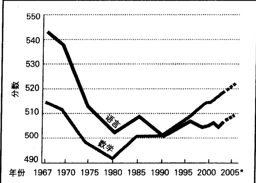

注：虚线部分为作者的推测。

资料来源：作者根据 Statistical Abstract 2002: Table 244: “SAT 分数……” 2003 整理而成。

在说明学业评估考试(SAT)的分数情况的图17.5中，可以看到学生的成绩从20世纪60年代到80年代下降得多么厉害。对于这一点，教育学家甚至国会都表示担忧，并提出了更高的要求。学校提高了标准，于是数学分数开始上升。这种回升是令人满意的，从图中你可以看到，今天高中毕业生的分数比60年代的分数要高。但语言考试的分数却没有回升到原来的水平。

为什么 SAT 分数会下降一直都有争论。美国教师联合会的主席说，较低的考试分数意味着教师工作比以往更好！他们使更多的学生呆在中学里，并进入大学。那些教育背景较少、过去常常会中学辍学的学生，也参加

---

了这种考试(Sowell,1993b)。这可能是一个原因。但即便如此，它显示的也不是成功，而是暴露了一个严重的潜在问题——老师对那些成绩差的学生敷衍了事。

既然数学成绩已经回升,我们就可以把更高的教学水平作为回升原因。管理人员对老师的要求更高,老师对学生的要求也更高,每个人都因为有更高的期待而采取相应的行动。

那么为什么语言考试的成绩会这么低呢？可能是因为孩子们读书太少，而看电视和玩游戏太多(Rigdon and Swasy, 1990)。读书太少的学生，词汇量就少，思维和口头表达也不够精确。“简单化教材”这种不需要多少思考的课本，肯定也不会对学生有太大帮助(Hayes and Wolfer, 1993)。老师的期望也会降低——更少的作业、更少的学期论文、分数贬值。也有一些疲惫不堪的老师，对收工资单比对教育学生更感兴趣。

如何在 SATs 中作弊 如果你在本学期期末考试中获得了一个很差的分数, 你难道不想用一枝魔力笔把它改为高分吗? 我想每个学生都会这么想的。现在如果你有这种力量的话, 你会不会用它?

很显然，一些权威人士已经发现了这样一枝魔力笔，并且他们已经用它提高了我们很差的全国性SAT考试分数。Statistical Abstract of the United States（1996年版）Table274表明在1995年的SAT语言考试部分中只有8.3%的学生过了600分。而紧接着的1997年版却给了我们一个惊喜。表276告诉我们在1995年有21.9%的学生超过了600分。这本书最近的版本中保留了那个较高的统计数字。多么神奇的一枝魔力笔！

一眨眼的功夫，我们就得到了一个意外的收获。不知怎么回事，以前参加过SAT考试的学生在1996年到1997年的考试中成绩都有所提高。现在我们大家都想拥有这种力量。学生们，盯住你们的成绩报告单；工人们，改掉你们工资单上的数字！

进行一场简单的测验当然要比改善教学水平容易得多。这就是发生在SAT中的事。考试内容越来越少，学生有更多的时间回答更少的题目。为了降低语言考试的难度，关于反义词的测验删去了(Manno, 1995; Stecklow, 1995)。前几年的考试成绩被重新计算，以符合现在更简单的考试。但是即便有了这些措施，全国的语言考试分数还是很低。

SAT 的 “简单化” 现象也是我们下面将要涉及的一个主题——分数贬值——的一种形式。

分数贬值、社会促销和功能性文盲 高中老师以前很少给 A，只有对杰出的表现者才会给 A。但是现在他们给的 A 比 C 还要多。成绩提高了，而学习水平却下降了，今天一些 A 的水平也就和以前 C 的水平相当。分数贬值（grade inflation）的另一种表现是，44% 的大学一年级学生在高中时的课程平均成绩是 A。94% 的学生的平均成绩在 B 以上（Statistical Abstract 2002: Table 264）。

分数贬值也冲击了常春藤盟校。在哈佛大学，有一半学生的课程得分为 A 或 A-。90% 的哈佛学生的毕业评语为“优异”。为了遏制这种“优异膨胀”，哈佛教职员投票通过把一个毕业班中学生获得“优异”的比例限制在 60% 以内（Hartocollis, 2002）。一名哈佛教授为了能赶上他同事的评分，在正式成绩单上给其学生一份掺了水分的成绩——然后私下再给一份真实反映他对学生的学习水平评价的成绩。

伴随着标准不断降低的分数贬值，是与社会促销(social promotion)一起发生的，也就是说，即使学生没有掌握到基本的知识也被允许升入下一年级。这所导致的一个后果就是功能性文盲(functional

---

illitery)，就是指那些即使高中毕业，但在阅读和写作方面仍存在困难的人。一些高中毕业生不会填写工作申请表；另一些人则搞不清百货商店找给他们的零钱到底对不对。

同龄群体的影响 两位心理学家和一位社会学家在加利福尼亚和威斯康星州研究了2万名高中生，发现同龄群体是影响未成年人在校行为方式的最重要因素（Steinberg et al., 1996）。简单地说，那些与好学生在一起的人也会倾向于往好处努力，而那些与表现不好的学生在一起的人则表现也很差劲。学生的亚文化中包括关于成绩的非正式规则。一些群体看重课堂上的出色表现，另一些群体则很瞧不起得高分的人。这次调查引发的一个应用问题是：怎样才能把学业的成就感植入学生文化中去。

学校暴力 在美国的一些学校，暴力泛滥，甚至安全都成为一个严重的问题(Cantor and Wright，2003)。要进入某些学校，学生必须经过金属检测器，配备制服保安也成为一项必要的措施。一些小学甚至在其传统的防火训练中增添了一项“枪击逃生训练”(Toch，1993；Grossman，1995)。

那么校园枪击案(就像我们在本章开头讲述的那个问题)是怎么回事呢？让我们看一下下面“社会生活中的大众媒体”专栏中所作的令人惊讶的分析。

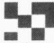

### 社会生活中的大众媒体

### 校园枪击案：破除一个神话

媒体在其关于校园枪击案的报道中经常使用一些夸张的词语，如“令人震惊的比例”、“暴力泛滥”和“失控”等等。这给了我们一个这样的印象，好像全美国的学校都将在枪火中崩溃。而公众则把枪击案看成是这个社会出现严重问题的有力证据。家长曾经以为学校是安全的避风港，但现在已经不是了。这些天真的想法已经被那些在校园里呼啸而过的子弹——或者至少是被媒体关于校园里危险和暴力日渐严重的报道给击破了。

难道真的就像媒体力图使我们相信的那样，我们的学校已经成为战场了吗？诸如本章开篇所讲的科隆比纳中学枪击事件一类的事件肯定是令人不安的，但是我们需要透过那些新闻头条或电视画面做一些更深的挖掘以理解这些事件的社会意义。

表 17.2 破除一个神话：美国校园的死亡人数 $ ^{a} $

<table border=1 style='margin: auto; word-wrap: break-word;'><tr><td rowspan="2">年份</td><td rowspan="2">枪击案死亡人数</td><td rowspan="2">其他自杀人数 $ b $</td><td colspan="3">不同性别的死亡人数</td></tr><tr><td style='text-align: center; word-wrap: break-word;'>男生</td><td style='text-align: center; word-wrap: break-word;'>女生</td><td style='text-align: center; word-wrap: break-word;'>总数</td></tr><tr><td style='text-align: center; word-wrap: break-word;'>1992—1993</td><td style='text-align: center; word-wrap: break-word;'>45</td><td style='text-align: center; word-wrap: break-word;'>11</td><td style='text-align: center; word-wrap: break-word;'>49</td><td style='text-align: center; word-wrap: break-word;'>7</td><td style='text-align: center; word-wrap: break-word;'>56</td></tr><tr><td style='text-align: center; word-wrap: break-word;'>1993—1994</td><td style='text-align: center; word-wrap: break-word;'>41</td><td style='text-align: center; word-wrap: break-word;'>12</td><td style='text-align: center; word-wrap: break-word;'>41</td><td style='text-align: center; word-wrap: break-word;'>12</td><td style='text-align: center; word-wrap: break-word;'>53</td></tr><tr><td style='text-align: center; word-wrap: break-word;'>1994—1995</td><td style='text-align: center; word-wrap: break-word;'>16</td><td style='text-align: center; word-wrap: break-word;'>5</td><td style='text-align: center; word-wrap: break-word;'>18</td><td style='text-align: center; word-wrap: break-word;'>3</td><td style='text-align: center; word-wrap: break-word;'>21</td></tr><tr><td style='text-align: center; word-wrap: break-word;'>1995—1996</td><td style='text-align: center; word-wrap: break-word;'>29</td><td style='text-align: center; word-wrap: break-word;'>7</td><td style='text-align: center; word-wrap: break-word;'>26</td><td style='text-align: center; word-wrap: break-word;'>10</td><td style='text-align: center; word-wrap: break-word;'>36</td></tr><tr><td style='text-align: center; word-wrap: break-word;'>1996—1997</td><td style='text-align: center; word-wrap: break-word;'>15</td><td style='text-align: center; word-wrap: break-word;'>11</td><td style='text-align: center; word-wrap: break-word;'>18</td><td style='text-align: center; word-wrap: break-word;'>8</td><td style='text-align: center; word-wrap: break-word;'>26</td></tr><tr><td style='text-align: center; word-wrap: break-word;'>1997—1998</td><td style='text-align: center; word-wrap: break-word;'>36</td><td style='text-align: center; word-wrap: break-word;'>8</td><td style='text-align: center; word-wrap: break-word;'>27</td><td style='text-align: center; word-wrap: break-word;'>17</td><td style='text-align: center; word-wrap: break-word;'>44</td></tr><tr><td style='text-align: center; word-wrap: break-word;'>1998—1999</td><td style='text-align: center; word-wrap: break-word;'>25</td><td style='text-align: center; word-wrap: break-word;'>6</td><td style='text-align: center; word-wrap: break-word;'>24</td><td style='text-align: center; word-wrap: break-word;'>7</td><td style='text-align: center; word-wrap: break-word;'>31</td></tr><tr><td style='text-align: center; word-wrap: break-word;'>1999—2000</td><td style='text-align: center; word-wrap: break-word;'>16</td><td style='text-align: center; word-wrap: break-word;'>16</td><td style='text-align: center; word-wrap: break-word;'>26</td><td style='text-align: center; word-wrap: break-word;'>6</td><td style='text-align: center; word-wrap: break-word;'>32</td></tr><tr><td style='text-align: center; word-wrap: break-word;'>2000—2001</td><td style='text-align: center; word-wrap: break-word;'>18</td><td style='text-align: center; word-wrap: break-word;'>4</td><td style='text-align: center; word-wrap: break-word;'>18</td><td style='text-align: center; word-wrap: break-word;'>4</td><td style='text-align: center; word-wrap: break-word;'>22</td></tr><tr><td style='text-align: center; word-wrap: break-word;'>2001—2002</td><td style='text-align: center; word-wrap: break-word;'>3</td><td style='text-align: center; word-wrap: break-word;'>1</td><td style='text-align: center; word-wrap: break-word;'>4</td><td style='text-align: center; word-wrap: break-word;'>0</td><td style='text-align: center; word-wrap: break-word;'>4</td></tr><tr><td style='text-align: center; word-wrap: break-word;'>2002—2003</td><td style='text-align: center; word-wrap: break-word;'>5</td><td style='text-align: center; word-wrap: break-word;'>1</td><td style='text-align: center; word-wrap: break-word;'>5</td><td style='text-align: center; word-wrap: break-word;'>1</td><td style='text-align: center; word-wrap: break-word;'>6</td></tr><tr><td style='text-align: center; word-wrap: break-word;'>平均1992—2003</td><td style='text-align: center; word-wrap: break-word;'>22.6</td><td style='text-align: center; word-wrap: break-word;'>7.5</td><td style='text-align: center; word-wrap: break-word;'>23.3</td><td style='text-align: center; word-wrap: break-word;'>6.8</td><td style='text-align: center; word-wrap: break-word;'>30.1</td></tr></table>

### 注：

a. 包括所有的他杀事件，在上学途中和放学路上；包括自杀事件；包括校园中发生的学校教职工被其他成年人所杀害事件；包括那些与学校无联系的人但被发现在学校地产范围内被杀害的事件。

b. 殴打致死、上吊致死、跳楼致死、刀刺致死和被扼致死。

资料来源: National School Safety Center 2003.

---

当我们深入分析下去，就会发现媒体那些耸人听闻的报道制造了一个神话。与“众人都知道”的相反，校园暴力的发展趋势根本不是越来越严重。事实正好相反——学校正在变得越来越安全。虽然有那些新闻头条中激烈的校园枪击案，但在表17.2中可以看到，校园枪击案中的死亡人数正在减少。

这并不是说校园枪击案不再是一个严重问题。即使只有一个学生受伤或死亡，那也是不允许的。但是，与媒体的大肆宣传给人们的印象相比，我们可以看到校园枪击死亡人数的下降趋势。

这就是为什么我们需要社会学：冷静地、客观地寻找事实，以便我们能够更好地理解构成我们生活的事件。解决任何问题首先都需要精确的数字，因为我们不想在臆想中编造解决方法。本专栏所提供的信息可能并不适合做一条轰动性的新闻，但它确实能够打破媒体所创造出来的神话。

### 解决办法: 安全化、标准化和其他改革

找出问题是一回事,解决问题则是另一回事。让我们思考一下我们刚才讨论过的问题的可能解决方案。

一个安全的学习环境 提供良好教育的第一步,就是让孩子们感到安全。由于美国社会中有如此频繁的暴力事件,我们可以预见到一些暴力事件会渗入学校里来。为了减少它的渗入,学校管理人员可以勒令那些威胁到其他孩子安全的学生退学。他们也不会容许校园中出现恐吓、暴力和携带武器现象。学校董事会和管理人员所采取的在校内对枪支和其他武器的零容忍政策可以使学校更安全。

更高的标准 在一个安全的学习环境里,我们可以采取措施改善教学质量。为了提供高质量的教学,我们需要高水平的老师。我们没有高水平的老师吗?大多数老师都是称职的,而且如果受到鼓励的话,他们会教得很棒。但是还有大量老师是不称职的。思考一下下面所讲的两个事件。加利福尼亚州要求它的老师通过一个教学技能考试。那里的老师表现得如此差劲,以至于官员为了能让学校里有足够的老师上课,不得不把及格线降到十年级的水平。在美国15个州里,老师的阅读水平只需达到全国平均成绩的最低1/4即可(Schema,2002)。我不知道你会怎样想,但这种形势是很可怕的,它应该被看做是一件国家大事,应该被看做是国耻。如果我们要提高教学水平,就必须让老师达到一个更高的水准。

我们的学校与私人企业在竞争同一批大学毕业生。如果其他领域的起薪比教育行业高，那些领域就会把那些比较聪明、比较有进取心的毕业生吸引过去。图 17.6 表明我们在这场竞争中处于非常不利的地位。

我们还能做些别的什么事来改善教育质量呢？社会学家科尔曼和霍弗(James Coleman and Thomas Hoffer,1987)所作的一项研究，为解决这个问题提供了有用的指导。他们想知道为什么罗马天主教会学校的学生的考试成绩会比那些公立学校的学生平均高15%—20%。是不是因为天主教会学校招收了更好的学生，而公立学校只要是学生就要呢？为了弄明白这个问题，科尔曼和霍弗在公立学校和天主教会学校调查了15000名学生。

他们的发现是什么呢？天主教会学校的二年级和四年级学生在语言和数学能力方面比公立学校的学生领先整整一个年级。他们认为，天主教会学校学生的考试成绩之所以更高，并不是因为它有更好的

---

图 17.6 美国大学毕业生的年起薪：公立学校的教师与私有企业从业人员的比较

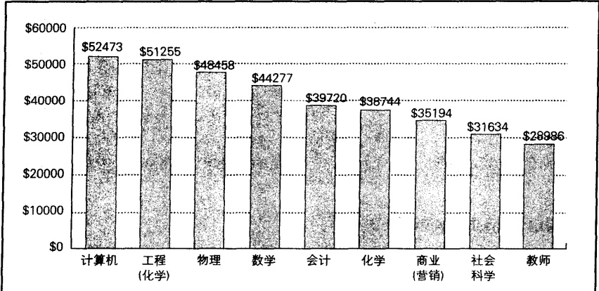

资料来源：作者根据 Statistical Abstract 2002: Table 275: "Survey and ……” 2003 整理而成。

学生,而是因为它有更高的标准。天主教会学校并没有像公立学校那样放松要求。研究者也注意到了家长介入的重要性。天主教会学校的家长和老师相互强化了各自对学生学习所应尽的义务。

这个发现支持了前面讨论过的关于教师期望的那条基本原理：如果学生被期望达到一个更高的标准，他们就会表现得更好。对于这点，你可能会说“当然了，我早就知道，谁不知道啊？”但是，不知何故，这条基本原理在很多老师那里却都没有体现出来，他们的教学质量很差，因为他们对学生几乎没有什么期望，而且监督者也接受了学生们较差的成绩。其原因可能并不在于他们没有意识到这条原理，而在于约束他们的组织，即一种仪式取代了实际表现的科层组织。为了更好地理解这一点，你可以再看一下第7章的内容。

如果我们提高标准的话，可能会遭到反对。把标准降低，然后告诉学生他们做得都很好，这比严格要求教学无疑更容易做到。当佛罗里达州决定它的高中毕业生必须参加一次过关考试才能得到毕业证书时，13000名学生没有通过这次考试。家长联合起来反对——不是要求提高教学质量，而是向州里施加经济压力以要求它取消这次新的考试。他们呼吁人们抵制迪斯尼乐园和不买佛罗里达州的橘子汁（Canedy，2003）。

所以我们不仅要对学生，而且对老师和管理者也都要有更高的标准，同时也必须让他们对高标准的教学担起责任来。一种方法是使他们的工资或至少是奖金与学生们的成绩相挂钩。当然，我们也必须确保考试成绩是真实的。不幸的是，一些老师和管理者可能会为了钱而作弊——向学生透露答案以剔除低分（Kantrowitz and McGinn, 2000）。

其他改革——从担保金到特许学校 对于改善学校环境来说，不乏各种建议。但是最令媒体关注的是——因为它是如此具有争议性又有发展潜力——担保金。州政府为每一位学龄儿童的家长提供一份担保金，由父母自行付给他们所选择的学校。公立和私立学校——甚至那些由个人和商业办的学

---

校——都将竞争这笔资金。由于每个学校的考试成绩都可以在本地报纸或网上获得，因此家长们能够对各个学校进行了解比较，并选择他们最满意的学校。对这项建议的一个主要反对意见就是认为担保金可能会被用于资助教会学校。

威斯康星州的密尔沃基市，于1990年在一次挽救城区学校的尝试中推行了试验性质的担保金计划。官员请政治学家约翰·威特对结果进行评估。威特知道他正介入一个敏感区域，就是说不管他的结果是消极的还是积极的，都会引起争论。他的主要结论是：一些学校做得好而另一些学校做得不好。总体来说，交担保金的学生成绩与那些公立学校的学生的成绩相比没有提高(Davis，2002)。

学校改革的另一个措施是创立特许学校。特许学校（charter schools）是指虽然有税收投资赞助但由独立团体所有和管理的公立学校。为了提高教学水平，他们获得了州政府或州里一些机构的特许，可以使用一些创新的教学方法。这样的例子不止一个。一些特许学校由家长所有和管理，另一些则归营利公司所有。一些在城区，另一些在市郊。在一年里开办了大批这类学校。有一家学校整个就是在网上开办的。他们的一个共同点就是不受教师联合会和公立学校科层制的约束。你可以想象得到，教师联合会和公立学校的管理人员是多么反对特许学校的创建。虽然这些学校前景很好，但现在就说它们将会取得成功还为时过早（Manno and Finn，1998；Perreault，2000；Anderson et al., 2002）。

许多赞同创建特许学校的人认为它能带来教育制度的改革，还可以避免担保金所带来的政治性争论——即资助教会学校。然而反对者则认为，特许学校将会像担保金那样由于抢夺了公立学校的资源而造成公立学校的衰落。这项改革的支持者对反对者的意见不以为然。他们说公立学校应该参与市场竞争。如果它们不能取得好成绩，它们就应该倒闭。不足为奇，那些公立学校的老师和管理者比较害怕改革。

为了促进教育改革，2002年，联邦政府通过了无人落后法案。法案要求每个州必须改善办学条件，并确保没有儿童在一所衰落的学校中学习。为了评估每个州的进展情况，学生们要参加年度考试，每个学校的成绩都将公布于众。在不好的学校里就读的学生，可以选择去更好的学校上学。现在对这项法律的效果进行评估还太早。 $ \underline{\text{但是}} $我们可以注意到实施过程中的问题正在凸显出来。例如，安娜·瓦斯格斯，她的女儿德西蕾·洛佩斯在纽约市一所不好的学校上学，所以她想把女儿转到好学校中去。当她发现这个城市的学校排名表中最好的那个学校离她家有一个半小时的路程时，她说：“这叫什么选择，我根本没有选择。”她的女儿继续呆在那所较差的学校里学习（Medina，2003）。

任何事情的改革都需要有一个指导原则。我认为这一条可以作为教育改革的指导原则：教育的问题并不在于学生的能力，而在于教育制度的性质。在下面作为本章结束语的“批判性思考”专栏中，对这条指导原则进行了阐述。

### 破除障碍——重建课堂

杰姆·埃斯卡兰特在洛杉矶一所城区学校教书。这个学校为贫穷、犯罪、毒品和黑帮所困扰。在这个人人自危的环境里，他教授微积分。他的学生在全国考试中得分如此之高，以至于官员怀疑他在作弊。他们要求他的学生重考一次。学生们照作了。而这次，学生们获得了更高的分数。

### 批判性思考

---

埃斯卡兰特究竟是怎么做到的呢？

首先，埃斯卡兰特让学生们明白：每个人都有成功的希望，就是说，学生们都可以学会。大多数拉美裔学生都被分到了手艺班学习制作首饰和禽舍。“我们的孩子和其他任何人一样有天赋，他们只是需要机会来表现。”埃斯卡兰特说，“他们只是没有想到要成为一个科学家或工程师。”

学生们也需要认识到学习是他们冲出牢笼找到好工作的一条途径。埃斯卡兰特为那些选择进入大学的学生设立了一个基金。学生们知道，只要他们努力，贫穷就挡不住他们。

埃斯卡兰特也改变了老套的教学体系。他让

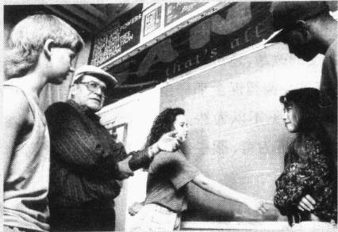

说今天的学生不如以前的学生好学其实对今天的学生是不公平的。就像本书所讨论的，杰姆·埃斯卡兰特（照片中）的经验表明，老师可以激励那些甚至不能继续学习的学生去努力学习并取得优异的成绩。他的经验使我们不得不重新思考我们的教育方式。

学生们把他们自己看成是一个团队，把他看成是一个教练，把全国数学考试看成是他们正在准备的一场奥运比赛。为了培养团队的认同感，使学生认识到自己是数学比赛团队中的一员，他们带着茄克帽子，穿着印有标识的T恤衫。在上课前，他的学生要做“热身运动”（随着一首摇滚歌曲拍手跺脚）。

埃斯卡兰特的团队与一支冠军足球队一样有着严格的训练日程。学生们必须签署一份协议书，上面规定他们必须参加数学的夏季补课，必须完成每天的功课，必须参加星期六早上和放学后的补课。为了提醒学生们自我约束会带来成功，埃斯卡兰特在教室墙上挂满了体育明星的海报——迈克尔·乔丹、巴比·露丝、杰基·乔伊纳·克斯和斯考蒂·皮品。

社会学的观点是：问题不在于学生的能力。他们在学校表现不好的原因并不在于他们本身。问题在于制度，在于所设计的课堂教学方法。当埃斯卡兰特改变了教学体系——又给学生们带来希望时——学生们的态度和表现都改变了。

### 思考题

埃斯卡兰特应用了此章和前几章所介绍的哪些原理？你认为我们能在教育上做些什么改变，以使全国的学校都能取得埃斯卡兰特那样的成果呢？

资料来源：作者根据 Barry (1989); Meek (1989); Escalante and Dirmann (1990); Hilliard (1991) 整理而成。

### 本章小结

### ☆现代教育的发展

现代教育是怎样发展起来的？

在人类历史的大多数时期，教育主要是非正规的学习，相当于文化适应。在一些早期社会中，正规教育的中心地区也确实得到了发展，像阿拉伯、中国、希腊和埃及。由于现代教育是在工业化的影响下发展起来的，因此正规教育在工业化程度最低的国家中较少普及。

### ☆全球视角中的教育

工业化程度最高国家、正在进行工业化国家和工业化程度最低国家中的教育各是怎样的？

---

一般来说，正规教育反映了一个国家的经济水平。总的来说，教育在工业化程度最高的国家很发达，在正在进行工业化的国家正经历着巨大的变化，在工业化程度最低的国家则存在缺陷。日本、俄罗斯和埃及代表了这三种不同发展程度的工业化国家的教育情况。

### ☆功能主义视角：有利于社会运行

功能主义视角中的教育是怎样的？

教育的功能有传授知识和技能、提供学习的证书、价值观的文化传播、社会整合、把门和主流化。功能主义者也注意到，教育已经取代了家庭的一些传统功能。

### ☆冲突论视角：再生产社会的阶级结构

冲突论视角中的教育是怎样的？

冲突论的基本观点是教育再生产出了社会的阶级结构，也就是说，通过不平等的资金投入和精英阶层与大众就读不同层次的学校等诸如此类的机制，教育使得根本的社会不平等得以代代延续。

### ☆符号互动论视角：实现教师的期望

符号互动论视角中的教育是怎样的？

符号互动论侧重于面对面的互动。在调查教室中的情形时，他们发现学生们的表现趋向于与老师的期望相一致，不管这种期望是高还是低。

### ☆美国教育存在的问题及其解决方法

美国教育面临的主要问题是什么？

除了暴力之外，主要问题有：SAT考试中体现出的低成就取向、分数贬值、社会促销和功能性文盲。这些问题的可能解决方法是什么？

首要的解决方法是重新建立高的教育标准，而这只能在提供给学生们一个基本安全的环境后进行。任何关于提高教学质量的解决方法，都必须建立在对学生和老师高要求的基础上。

### 批判思考题

1. 同日本、俄罗斯和埃及的教育相比，美国的教育现状是怎样的？

2. 简要分析一下你的教育经历是怎样影响你的生活的。老师和分配对你的人生目标、态度和价值观有什么影响？你的同学对你的生活有什么影响？

3. 你认为怎样能提高美国学校的教育水平？