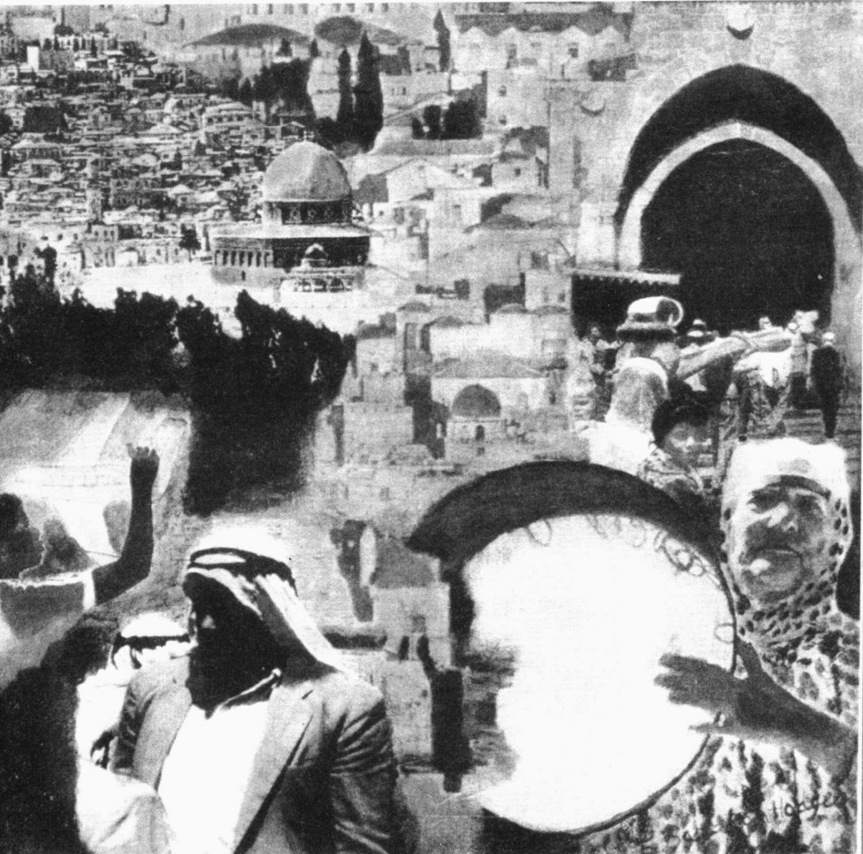
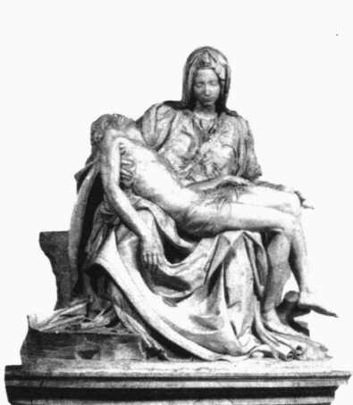
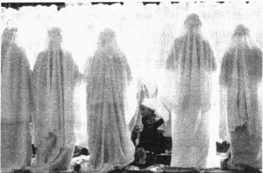
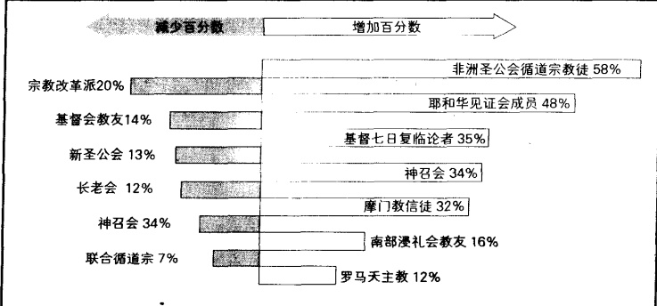

# 第 18 章 宗教

伊丽莎白·巴拉卡·霍奇斯

《耶路撒冷 XIX》(1997)

---

· 功能主义观点

宗教的功能

宗教的功能替代物

宗教的反功能

符号互动论观点

宗教符号

仪式

信仰

宗教体验

共同体

· 冲突论观点

人类的精神鸦片

社会不平等的合法性

· 宗教与资本主义精神

· 世界主要宗教

犹太教

基督教

伊斯兰教

印度教

佛教

儒教

· 宗教团体的类型

膜拜团体

教派

教会

国教

类型的多样化

当宗教与文化发生冲突时

· 美国宗教状况  

成员特征  

宗教团体的特征  

宗教和文化的世俗化

· 宗教的未来

· 本章小结

---

### 第 18 章 宗教

第一个报道就令人目瞪口呆。美国酒精、烟草与火器管理局约100名武装人员攻破了大卫教派的堡垒。大卫教派是得克萨斯州瓦科市的一个秘密宗教团体。四名武装人员牺牲，六名试图保护这座堡垒的人员也被打死。随后，对此处进行了51天的包围，美国公众从电视里目睹了这一过程，在这期间，美国酒精、烟草与火器管理局和联邦调查局作了一些奇怪的事情，如通宵达旦地用高音喇叭播放音乐。

包围期间，联邦调查局与大卫·考雷什时断时续地进行了谈判。大卫·考雷什33岁，是该团体的领导人。第51天早上6点，一辆坦克轰击了该堡垒的主要建筑物。坦克里喷出的气体含有化学成分，根据国际法，美国军队不能用这种化学成分对付伊拉克士兵。当第二辆坦克在墙上撞出洞时，妇女和儿童逃进了第二层，男人们徒劳地向坦克射击。堡垒发生爆炸，整个建筑陷入一片火海。共有80名男人、妇女和小孩被烧死。在25个被烧死的小孩里，一些烧焦的尸体紧靠在他们母亲身边。

政府移走了尸体，封锁了该地区，并推平了遗留的建筑物。幸存者宣称是政府放的火，而政府则说是大卫教派自己放的火，是纵火自杀。

政府很少如此严厉地对待宗教，但这的确发生了。本章我们要思考的话题就是主流文化与新宗教间的关系。让我们首先来看一下什么是宗教。

### 宗教是什么？

所有的人类社会都是由某种形式的家庭、某种经济体制和政治秩序组成的。正如我们看到的，这些有关生活的重要社会制度，是人类福祉的根本。这一章研究的是另外一种普遍的社会制度——宗教。

研究宗教的社会学家分析社会与宗教二者的关系，研究宗教在人们生活中扮演的角色。他们并不试图证明一种宗教比另一种好，他们的目标也不是去证实或推翻哪个人的信仰。正如第1章中提到的，社会学家没有办法判定一种行动方式比另一种更道德，更不能说某一种宗教是最正确的。宗教是信仰上的事情，而社会学家处理的则是那些他们能够观察或测量的经验事实。因此，社会学家研究宗教信条和宗教活动对于人们生活的作用。同时，他们也分析宗教是如何与分层体系相联系的。然而，与神学家不同，社会学家不能评估一种宗教教义的真实性。

1912年，涂尔干出版了一本很有影响的书《宗教生活的基本形式》(The Elementary Forms of the Religious Life)。在这本书里，他试图找出所有宗教的共同要素。通过调查世界上的宗教，涂尔干发现并没有某种具体信条或活动是所有宗教共有的。然而，他的确发现，所有宗教都围绕着它们的活动和信条发展出了一个共同体。所有的宗教也都区分了神圣与世俗。关于神圣的(sacred)，涂尔干指的是生活中的这样一些方面，它和引起惊叹、敬畏、尊敬甚至恐惧的超自然现象有关。关于世俗的(profane)，涂尔干指的是生活中这样一些方面，它和宗教或宗教意义无关，而是日常生活普通方面的一部分。涂尔干(Durkheim，1912/1965)总结道：

---

宗教是与神圣事物有关的信仰和实践的统一体。这里所说的神圣事物是区分出来的、带禁忌性的东西——信仰与实践则使所有的信奉者团结为一个叫做教会的道德共同体。

因此，涂尔干说，宗教（religion）由三个要素构成：

1. 信仰，有些事物是神圣的(禁忌性的、与世俗相分离的)；

2. 实践(宗教仪式)，以被认为是神圣的事物为中心而活动；

3. 一个道德共同体(教会), 由一批人的信仰和实践产生。

按照涂尔干的观点，世界上所有的宗教都具有信仰、实践和一个道德共同体。这里显示的是我在印度布般内斯沃拍摄的一个地方印度教寺庙。图中的形象是印度教徒信奉的数百万个神的一部分。

涂尔干所用的教会（church）一词，不是它通常所指的意义，而是指任何以关于神圣的信仰和宗教实践为中心的“道德共同体”。在涂尔干的观念里，教会指的是在神龛前跪拜的佛教徒、浸入恒河的印度教徒，以及对其祖先供奉食物的儒教信徒。相似地，道德共同体一词也不是我们大部分人所熟悉的道德的含义。简单而言，一个道德共同体就是这样一群人，他们通过宗教活动结合在一起。它包括16世纪阿兹特克人的祭司，他们每天围绕祭台聚集，摘下童贞女鲜活的心脏。

为了更好地理解研究宗教所用的社会学理论方法，让我们看看以下三种理论能提供给我们些什么。

### 功能主义观点

功能主义者强调，宗教之所以是世界性的，是因为它满足了人类的基本需要。那么宗教有哪些功能和反功能呢？

### 宗教的功能

有关终极意义的问题 纵观世界，宗教为有关终极意义的复杂问题提供了答案，比如生命的目的、人为什么受苦、来生的存在。对这些问题的回答，给了人们一种目的感。人们不再认为自己是在无目的的存在中受偶然事件的支配，相反信仰者们把他们的生活看做是符合神圣设计的。

情感慰藉 宗教对于终极意义的回答也安抚着人的心灵，这些答案使他们确信，即使是受苦受难，生活也是有意义的。同样，为那些重要事件（比如疾病和死亡）而举行的宗教仪式，则在危急时刻提供了情感安慰。个体知道别人会关怀自己，并能通过遵循熟悉的仪式找到安慰。

社会团结 宗教教义和活动把信徒结合到一个共同体，这个共同体分享共同的价值和观念（“我们

---

犹太人”、“我们基督徒”、“我们穆斯林”)。例如，围绕婚礼的宗教仪式，把新娘新郎同为他们祝福的广大群体联系在一起。别的宗教仪式也是如此，比如庆贺出生和哀悼死亡。

日常生活的准则 宗教教义并不都是抽象的。它也能为人们的日常生活提供行为指导。例如， $ \underset{\cdot}{一} $帝通过摩西对以色列人传达的《十诫》，其中四条是抽象的，但另外六条就包含着如何进行日常生活的准则。从如何与父母、奴仆及邻居相处到禁止说谎、偷窃、私通，都有规定。

遵循这些准则的人们，其行为结果是可测度的。那些去教堂的人，其酗酒和非法吸毒的可能性都要远小于那些不去教堂的人(Ostling,2001)。这对于成年人和青少年来说都属实。通常，去教堂者会遵循一种更健康的生活方式，而且他们比不去教堂的人寿命也要更长一些。

社会控制 宗教不仅为日常生活提供准则，还控制着人们的行为。宗教群体的大部分规范只针对它的成员，但另外一些也对非成员有所限制。一个例子就是，宗教教义体现在有关犯罪的法律中。比如在美国，亵渎神灵和通奸曾是一种罪，人们会因此而被逮捕、审判和判决。在周日正午之前禁止卖酒的法律，是另外一个例子。

调适功能 宗教能够帮助人们适应新环境。例如，对移民来说，适应一个新国家的风俗不是件容易的事。宗教通过保持他们的本国语言及保存熟悉的仪式和信条，为移民的传统文化提供了连续性。这是早期欧洲移民的一个实例，它对于当今来自中东和世界其他地方的移民者来说依然是事实。

支持政府 大部分宗教都为政府提供支持。一个明显的例子就是，一些教堂如此显眼地悬挂着美国国旗。另一方面，政府也以拥护上帝作为回报，不管美国总统是否信教，在他们的就职演说中，都会以上帝为证，并不断祈求上帝为国家祝福。

有的国家资助一种特定的宗教而取缔其他宗教，并为这种特定宗教修建教堂，为神学院提供财政支持，甚至付薪水给教士。这种宗教被称作国教(state religion)。16、17世纪的瑞典，其政府资助路德派，瑞士是加尔文派，意大利是罗马天主教。

还有另外一些情况，虽然政府并不资助任何一个特定宗教，但宗教信仰已扎根到国民生活中。比如，有些并不属于任何宗教的美国官员，在获得官职时也以上帝的名义宣誓履行职责。类似地，国会以它自己的牧师所主持的祈祷作为每次会议的开始。宣誓忠诚的誓言包括这句话“上帝的国家”，硬币上也铭刻着这样的文字“我们信仰上帝”。社会学家罗伯特·贝拉(Bellah，1970)用市民宗教(civil religion)一词，来描述这种宗教扎根于社会的情况。

社会变革 宗教通常与当下的社会制度关系密切，因此它会抵制社会变革。但在某些偶然情况下，宗教却成了变革的先导。例如20世纪60年代的民权运动，它为取消公共设施中的种族隔离和废除南方选举中的种族隔离提供了重要支持。

正如美国民权运动所显示的，宗教可以推动社会变革。本图显示的是小马丁·路德·金博士，一位浸礼教牧师，发表其著名的“我有一个梦想”演讲时的情形。他也是这一民权运动的主要领导人。

---

族歧视而斗争。宗教领袖领导了这一运动，尤其是美国黑人教会的领袖们，比如小马丁·路德·金。教堂也成了训练示威者和组织集会的中心。

### 宗教的功能替代物

如果社会的另外一些部分可以回答关于终极意义的问题，也能提供情感慰藉和日常生活准则等等，社会学家就称其为宗教的功能替代物（functional equivalent）。因此对有些人来说，嗜酒者互诚协会就是一个宗教的功能替代物（Chalfant，1992）。对另外一些人而言，心理疗法、人本主义、超自然冥想，甚至政治党派都起到了相似的作用。

有些宗教替代物是难以从宗教中区别出来的(Brinton, 1965, Luke, 1985)。比如，共产主义也有它的预言家(马克思和列宁)、神圣的著作(马克思、恩格斯和列宁所写的任何东西，尤其是《共产主义宣言》)、崇高的神父(共产党人的首领)、神圣的建筑(克里姆林宫)、圣坛(陈列列宁躯体的红场)、仪式(每年五一国际劳动节在红场的游行)，甚至还有殉道者(古巴的切·格瓦拉)。苏维埃共产主义政府是公开的无神论，它试图消灭所有基督教、犹太教和伊斯兰教的痕迹。它以政府提倡的那些儿童献身于国家的仪式来替代洗礼和割礼。另外，共产党也设计了自己独有的婚礼和葬礼仪式。

正如社会学家伊恩·罗伯逊(Robertson,1987)指出的，不管怎样，宗教和它的功能替代物之间还是有一个根本区别。尽管替代物可能发挥相似的作用，但它的活动并不涉及上帝、神或超自然物。

### 宗教的反功能

功能论学者也考察了宗教具有的反功能，即它是如何带来有害后果的。宗教所具有的两种主要的反功能是宗教迫害和战争及恐怖主义。

宗教为迫害辩护 13—19 世纪期间，比较有名的是罗马天主教会的特设部门——宗教法庭。在这里，他们拷打妇女，让她们承认自己是女巫，然后把她们烧死在火刑柱上。1692 年，马萨诸塞州塞勒姆的新教徒领导人，处死了 21 名被指控施行巫术的妇女和男人。2001 年，在刚果民主共和国的一次“清洗”运动中，约有 1000 名可疑的巫师被砍死（Jenkins，2002）。同样地，公平来说，阿兹特克人的宗教也有反功能，至少对于那些被奉献给神以平息神的怒气的童贞女而言是这样。简而言之，宗教被用来为压迫和许多残忍的行为作辩护。

战争和恐怖主义 历史被基于宗教的战争所充斥，其中也夹杂着政治因素。例如在11—14世纪，基督教的君王们指挥了九次流血的十字军东征，试图从穆斯林手中夺取圣地的控制权。如同下面的“现实社会学”专栏中所讨论的，恐怖主义也常冠以宗教的名义。

### 现实社会学

### 恐怖主义与上帝的旨意

警告: 下面“平等对待”的内容可能会冒犯到每一个人。

9·11之后，很多人头脑中都会浮现出这个疑问：“人们怎么能以上帝的名义作恶呢？”

美国人受到穆斯林的威胁。每个人都知道摧毁

---

纽约世贸大楼、攻击华盛顿五角大楼的恐怖分子是穆斯林。恐怖分子相信，真主赞同他们所做的事情。

人们怎么能以上帝的名义做这种事呢？为了回答这个问题，我们需要拓宽事件的背景。能问这个问题固然很好，但它并非仅仅针对伊斯兰教的恐怖分子。如果真是这样的话，它就离题了。

我们也需要考虑其他宗教。提到基督徒，我们无须追溯几个世纪前的宗教裁判所或少年十字军。我们只需看看爱尔兰贝尔法斯特的爆炸。在那里，新教徒和天主教徒以上帝的名义相互屠杀。

在美国，我们可以考虑一下堕胎医生被杀案。保罗·希尔是名牧师，他因在佛罗里达州谋杀了一名医生而被判处死刑。他相信他的行为是好的，因为他挽救了那些尚未出生的孩子的生命。在他的死刑执行前，他说，他希望自己能去天堂。他的朋友迈克尔·布雷倒没有杀人。不过，他却炸毁了堕胎诊所。

因为我想平等对待各个宗教，所以我们也不能忘记犹太教徒。巴鲁克·戈尔茨坦医生认为，耶和华想要他带着枪去犹太教圣地，射杀大批正在祈祷的巴勒斯坦人。他的敬慕者在他的墓地上竖起纪念碑(Juergensmeyer,2000)。

最后，为了公平起见，我们也不能不谈一下印度教徒、佛教徒和印度锡克教徒。在印度，他们继续相互屠杀。他们以上帝的名义袭击其他教派的礼拜堂，相互轰炸。（印度教徒事实上也是机会主义者——他们也杀害基督徒。我曾访问过一个信奉印度教的国家，在那里，他们将汽油浇在一辆吉普车上，活活烧死了一位澳洲传教士及其儿子。）

这些恐怖主义者——穆斯林、基督徒、犹太教徒、锡克教徒、佛教徒或印度教徒——都不能代表他们宗教的主流。但是他们却为了宗教原因而诉诸暴力。他们怎么能这样做呢？下面是宗教恐怖分子所共同具有的五个要素。（我从个人和群体的行为中推论出了这些原则。国家恐怖主义则是另一回事。）

第一,他们相信自己受到了攻击。邪恶势力试图破坏他们美好的世界——他们的宗教、生活方式或是未出生的孩子。

第三,他们得出结论,认为只有通过暴力才能解决这一问题,而且这种情况下的暴力是有益的。

第二，他们深信上帝想要惩罚邪恶分子。

第四，他们深信，上帝选择了他们去完成这一任务。他们不想杀人或死去，但是他们勉强接受了自己的命运。与其活得像个懦夫，不肯站出来维护正确的事情，不如为了上帝的事业而死，那样更加伟大。

第五，这些观点在一个共同体(即一个人们在其中找到了认同感的群体)中培育了出来。这个较小的群体可能认识到了，与他们有相同信仰的多数成员并不支持他们的观点，但是他们认为，那是因为其他人被敌人或自由分子、世俗化媒体同化甚至洗脑了。这个小的共同体掌握着真理。

对于那些有经文的共同体来说，那里有足够的关于暴力的注释。暴力是一种极为重要的选择性手段，当他们感觉受到威胁时，他们可以将其视为“上帝授权的”解决方式。

如果这些倾向伴随着这样一种观点，即我们最终要面对善与恶，那么它们甚至会变得更有力量。如果这是我们最后的机会，也是最后一战，我们就没有退路可言。一些基督徒、犹太教徒、穆斯林，甚至印度锡克教徒，均持这样一种观点(Juergensmeyer,2000)。

在这些情况下，道德被颠倒了。谋杀变成了一种道德行为，一件为了完成更伟大事业而做的善事。这一更伟大的善事，可能需要自我牺牲——无论是那些自杀式爆炸者，还是那些虽然计划逃脱但明知政府会穷追到底的人，都是自我牺牲者。

这些观点中有足够的事实，使这一虚假想法得以继续存在。毕竟，如果当时有人有勇气、有远见去杀害希特勒的话，对于数百万犹太人和数百万牺牲者来说，这难道不是件好事？他的死和一个人的自我牺牲不就是一件更伟大的善事吗？现在，世界上有邪恶的新教徒、天主教徒、犹太教徒、巴勒斯坦人、为人堕胎者以及美国人——这是一张冗长的名单。暴力是为了更伟大的善事，是上帝所想要的。

一旦人们接受了这一封闭的思想体系，有关相反的观点并存的问题就不会再受到重视。人们也会相信他们能够实现上帝的想法。

谁愿意违背上帝的意志呢？因而，当杀人与恐怖主义等同于上帝的意志时，那么……

---

### 符号互动论观点

符号互动论者关注的是人们赋予其经验的意义，尤其是他们如何使用符号。下面我们将这一观点应用于宗教符号、仪式及信仰，考察一下它们是如何促使具有相似观点的人形成一个共同体的。

### 宗教符号

假设两千年前，你刚刚加入一个新的宗教。你开始相信，一位最近被钉在十字架上的名叫耶稣的犹太人就是救世主，是为了救赎你的罪而出现的上帝之子(the Lamb of God)。罗马领袖迫害耶稣的追随者。由于你和你的同伴都不承认凯撒是上帝，所以他们痛恨你的宗教。

基督徒人数很少，你渴望与其他信仰者建立友谊。但是，你如何分辨谁是信仰者呢？探子到处都是。政府发誓要消灭这个新的宗教，你不想成为斗兽场中那些狮子的食物。

于是，你使用了一个简单的技巧。在与陌生人谈话时，你好像心不在焉似的在沙土里乱写乱画，随意地画了一条鱼的轮廓。只有和你一样的信仰者才明白其意义——将希腊语“Jesus（is）Christ the Son of God”中每个单词的头一个字母合起来就能拼成希腊语中“鱼”这个单词。如果另一个人没有反应，你就将轮廓擦掉，继续像平常一样与之交往。如果他们有反应，你就会急切地与之谈论你的新信仰。

所有宗教都会运用符号为其成员提供认同感和社会团结。对于穆斯林来说，主要的符号就是新月和星星；对于犹太教徒来说，则是大卫之星；对于基督徒来说，则是十字架。对于教徒来说，这些都不是普通的符号，而是能够唤起敬畏感和崇敬感的神的象征。涂尔干是这样表述的，宗教使用符号来象征其教派认为神圣的东西，以区分神圣与世俗。

符号是一种简练的沟通方式。例如，在一位信奉基督教正统派的人看来，他所佩戴的十字架意味着：“我是耶稣基督的追随者。我相信他是救世主，是上帝之子，他爱我们，他是为了救赎我的罪而死，他死后将复活，我将通过他获得永生。”

一个符号承载了太多的东西——十字架对于信奉基督教正统派的人来说并不仅仅意味着这些。对于信奉其他基督教传统的人来说，十字架传达了不同的意义——但是，对于所有的基督徒来说，十字架都是传达众多含义的简略方式。大卫之星、新月与星星、公牛(对印度教徒来说，它意味着所有生物的统一)，以及世界上众多其他宗教的各种各样的符号均是如此。

符号互动论者强调，人类的一个基本特征是，他们把意义赋予物体和事件，并且使用对这些物体或事件的表征（representations）来相互交流。一些宗教符号被用来表达敬畏和崇敬感。米开朗基罗的名作《圣母怜子》（又译《哀基督》《圣殇》等）描绘了在耶稣被钉上十字架后，玛丽亚轻轻地抱着她的儿子耶稣。这是西方世界里最受推崇的符号之一。信徒和非信徒都被它的美丽深深打动。

---

### 仪式

仪式(rituals)，即典礼或重复性惯例，也是将人们整合进一个道德共同体的符号。一些仪式，例如犹太男孩的成人礼和基督徒的圣餐，都虔诚地致力于创造与上帝间的亲密感，以及加强群体内部的团结。仪式包括在固定的时间下跪祈祷、鞠躬、反省自身、唱圣歌、点蜡烛焚香、朗读经文、列队诵经、洗礼、结婚典礼、葬礼等等。

### 信仰

符号，包括仪式，均起源于信仰。信仰可以是模糊的（“上帝是”），也可以是高度具体的（“上帝想要我们拜倒在其脚下并每天面向麦加礼拜五次”）。宗教信仰不仅仅包括价值观念（生活中那些被认为是好的、恰当的——我们应该如何生活），而且包括宇宙论（cosmology），即关于世界的统一看法。例如，犹太教徒、基督徒和穆斯林的宇宙观均是：世界上只有一个上帝，即宇宙的创造者，他关心人们的活动，并要我们对自己所做的事情负责。宇宙论给出了关于世界的一个统一的看法。

### 宗教体验

宗教体验（religious experience）指的是一种突然出现的超自然的意识，或者是与上帝相接触的感觉。有些人出现了一种模糊的感觉，比如看见一座山或是在听某段特定音乐时，他们会感觉到离上帝很近。另外一些人则声称有种脱胎换骨的体验。比如圣阿西西·弗朗西斯说，他变得能够在任何存在物中感觉到上帝所在。

一些新教徒用再生(born again)来描述那些经历过诸如脱胎换骨的宗教体验的人们。这些人说，他们觉醒到这一事实：他们有罪，而耶稣为他们的罪而死，因此上帝想让他们开始新生。他们的世界就此改变。他们期待着复活和天堂的新生，他们在新的圣灵亮光中重新看待自己与配偶、父母、孩子，甚至是老板的关系。他们也宣称需要改变与别人互相交流的方式，以使自己的生活反映把耶稣作为“救世主和上帝”的新的、个人的承诺。他们在描述这种从此开始新生活的感觉时，用了再生一词。

### 共同体

最后，从符号、仪式和信仰（或一些宗教体验）而来的共同的意义把他们结合进同一个道德共同体。同一道德共同体中的人们彼此之间有一种联结，因为他们的信仰和仪式把他们结合在一起，同时把那些不分享他们独有符号世界的人排除出去。比如，摩门教徒感到同别的摩门教徒之间存在一种（所知的）“亲缘精神”。新教浸礼会教友、犹太人、耶和华见证会成员与穆斯

宗教的功能之一是形成共同体——一种相互联系在一起，以及与上帝联系在一起的感觉。为了实现这一目标，宗教常常借助于仪式。这里表现的是阿拉马瑞波的爪哇穆斯林妇女正在庆祝斋月的结束。

---

林，都能感觉到与他们有着同一信仰的成员之间的团结。

为了表示他们是一个整体，一些宗教群体成员之间彼此称呼“兄弟”或“姐妹”。“卢贝姐姐，我们周三要去看望马尔的兄弟姐妹”，这是传递信息的一种普遍方式。“兄弟”和“姐妹”这种称呼的用意是，他们之间的关系是如此亲近，从而使得个体感觉他们是同一个家庭内的成员。

共同体是强大的,不仅因为它提供了共同身份的基础,也因为它制定了管理其成员行为的准则。成员们不遵守规则,就会失去他们作为共同体成员的资格。例如,在基督教会里,一个人的通奸行为被发现,而他拒绝祈求宽恕,就有可能被教会驱逐出去。在天主教传统中,这种人可能会被正式开除教籍。而新教通常的做法则是比较非正式的,“从名册中删除”。

对于那些身份与共同体紧密相连的人而言，被共同体开除是件严重的事情。社会学家约翰·霍斯泰特勒（Hostetler，1980）、威廉·开法特和威廉·泽尔纳（Zellner，2001）描述了基督教门诺派的“躲避”做法——在所有场合中漠视一个违规者。对待被躲避的人，就把他当做不存在一样（如果他们没有忏悔，以表示对自己行为的悔恨，他们就不能作为共同体成员而存在）。躲避是如此的彻底，以至于即便是被躲避者的家人，如果要在教徒中保持良好名声，也不能与被躲避的人说话。显然，这样会在餐桌上造成很多有趣的事。

### 冲突论观点

冲突论的观点则完全不同。冲突理论家研究的问题是，宗教如何维持现状和帮助维护社会不平等。

### 人类的精神鸦片

通常，冲突理论家会对宗教持极度的批判态度。马克思，一位公开的无神论者，认为上帝的存在是不可能的。作为冲突理论家的典型代表，他在宗教问题上提出了极为有名的论断：“宗教是麻醉、控制群众的精神武器……它是人类的精神鸦片。”（Marx，1844/1964）通过这一论断，马克思指出，宗教让受压迫的工人们找到了逃避现实的方式。对他们而言，宗教就像鸦片一样，使他们忘记自己的悲惨境地。宗教通过把他们的思想转移到来世的幸福，而使他们的目光远离当世所受的苦难，由此大大减弱了他们反抗压迫的可能性。

### 社会不平等的合法性

冲突理论家认为，宗教使社会不平等在更大的社会范围内取得了合法性。他们的意思是说，宗教教导人们，既存社会的安排就是上帝所希望的。例如，在整个中世纪，基督教神学家们一直都在宣扬“君权神授”。这一教义意味着，是上帝决定谁做君王并赋予他权力的。因此，君王是代表上帝进行统治的，而臣民的职责就是忠于君王(和上交税款)。违抗君王就是违抗上帝。

利用了这种使社会秩序合法化的高超手段(甚至有的比“君权神授”还要更进一步)，古埃及宗教规定法老就是一个神，而日本天皇同样也宣布他的神圣性。这样一来，谁还能怀疑他的决定？当今的政治家们也把自己的权限诉诸于此类宗教教义。宗教认可了这种神化！

冲突理论家举出另外一些例子，来说明宗教是如何赋予社会秩序合法性的。在印度，人们利用印度

---

教教义维护其种姓制度：一个人如果试图改变他的种姓，他在来生就会成为更低种姓中的一员，甚至还会变成动物。美国内战之前的时代，南方的牧师利用经文为奴隶制辩护，说一切都是上帝的意愿；而北方的牧师则利用经文诋毁奴隶制，说它是邪恶的，从而为他们那里的社会结构的合法性进行辩护（Ernst，1988；Nauta，1993；White，1995）。

### 宗教与资本主义精神

韦伯不同意冲突论所说的，宗教仅仅是社会秩序的表现，宗教使社会秩序合法化，以及宗教鼓励人们关注来世而 $ \underset{\cdot}{阻} $碍了社会变革等一系列观点。相反，韦伯认为，宗教对来世的关注，正是社会深刻变革的来源。

跟马克思一样，韦伯也考察了欧洲国家的工业化。他被这样的问题所吸引：为什么有些社会开创了资本主义制度，而另外一些却固守着它们的传统道路。传统是强大的，它往往把人们制约住了，然而有些社会已经发生了资本主义变革，而另外一些却保持原样。当探索这一问题时，韦伯得出结论：宗教是现代化的关键因素，现代化就是传统社会向工业社会的转变。

为了解释他的结论，韦伯写成了《新教伦理与资本主义精神》一书。韦伯的理论在第7章已有介绍，这里仅简要概括如下：

1. 资本王又个仅仅是表面性的变化。确切地说，资本主义在对待工作与金钱问题上，为我们提供了根本不同的思考方式。传统上，人们工作只是为了满足他们的基本需要，而不是为了利用盈余去投资。与传统观念完全相背的想法是，积累金钱(资本)本身就是最终目的，而不仅仅是花掉它。人们认为，投资以获取利润然后再投资赚取更多的利润是一种职责。韦伯把这种对工作、金钱的新态度称作资本主义精神。

2. 为什么资本主义精神出现在欧洲，而没有在其他诸如中国或印度这些具有相似物质资源和教育的地方出现呢？按照韦伯的理论，宗教就是关键因素。中国、印度的宗教(实际上也包括欧洲的罗马天主教)，都倡导一种传统的生活方式，而非节俭和投资。当新教登上历史舞台时，资本主义就出现了。

3. 新教，尤其是加尔文派有何特异之处呢？约翰·加尔文教导说，上帝已经预定一些人去天堂，另外一些人去地狱。具有教籍或感觉到你与上帝间的联系，都不能确定你是得救的。人直到死后才能知道自己的命运。

4. 这种教义在加尔文的信徒中间引起了强烈的忧虑：“我命中注定去天堂还是地狱？”他们很想知道。加尔文派信徒思考这一问题时，得出结论：教会成员有义务去证明他们是上帝的选民，以命定要去天堂的方式生活——工作出色是被拯救的证明。

5. 这一结论激励加尔文教徒过有道德的生活、努力工作、不浪费时间、节俭，因为懒散和不必要的花费是世俗生活的标志。韦伯把这种禁欲的生活方式称作新教伦理。

6. 当人们努力工作，并且只在必需品上花钱（一副耳环或第二双用于正式场合穿的鞋，都被认为是可耻的奢侈品）时，他们的钱就攒下来了。因为不能花费，这些资本就被用来投资，从而引发了生产的浪潮。

---

7. 由此，宗教内的变革（从天主教到新教，尤其是加尔文派）导致了思想和行为领域的根本性变革（新教伦理）。其结果就是，产生了资本主义精神。所以，资本主义发源于欧洲，而不是其它任何地方，因为其它地方的宗教不具备激发资本主义的基本要素：资本的积累和循环投资。

虽然韦伯的分析极具影响，但也不乏批评者(Kalberg,2002)。上百名学者已经攻击过他的观点，一些人指出他忽视了苏格兰(一个信仰加尔文派的国家)并没有产生资本主义，另一些人则指出这无法解释为什么工业革命产生于英格兰(一个并不信仰加尔文派的国家)。

另外数百名学者则为韦伯的理论进行辩护。目前还没有任何历史性的证据能够明确证明或证伪韦伯的命题。

从历史的角度来看，新教伦理和资本主义精神并不限定于任何明确的宗教或世界上的任何地区。进一步而言，它们成为一种文化特征，传播到了世界上的众多社会中（Greeley，1964；Yinger，1970）。美国的天主教徒与新教徒有一些相同的生活方式。另外，中国香港、日本、马来西亚、新加坡、韩国与中国台湾，这些并非信仰新教的国家和地区，也出现了资本主义（Levy，1992）。

### 世界主要宗教

世界上的宗教成千上万，其中最大的一些见表 18.1。这里我们简要考察其中 6 个。

### 犹太教

犹太教起源于亚伯拉罕，他于约4000年前生活在美索不达米亚。犹太人认为上帝与亚伯拉罕订立了契约，选中了亚伯拉罕的后代并允诺使他们“像海里的沙子一样不计其数”，并且永赐给他们一块特别的土地。订立这一契约的标志是每个男孩在出生后第八天要进行割礼。他们的血统来自亚伯拉罕和他的妻子萨拉、他们俩的儿子以撒以及他们的孙子雅各(也叫以色列)。

约瑟是雅各众子中的一个，被他的兄弟卖为奴隶并被带到了埃及。经过一系列令人毛骨悚然的冒险后，约瑟成为法老的得力助手。当雅各的家人居住的迦南发生严重的灾荒时，雅各及其另外11个儿子逃到埃及。在约瑟的领导下，他们受到了欢迎。但是，继位的下一任法老奴役了以色列人。大约400年后，摩西，一个被法老的女儿收养的以色列人直谏法老。他说服法老释放当时已多达200万的奴隶。摩西带领他们出了埃及，在沙漠中跋涉了40年后，他们终于到达了被允诺之地。在那40年中的一些时间里，摩西在西奈山上传达了十条戒律。亚伯拉罕、以撒、雅各及摩西在犹太教中都有崇高

表 18.1 世界几大宗教 $ ^{a} $

<table border=1 style='margin: auto; word-wrap: break-word;'><tr><td style='text-align: center; word-wrap: break-word;'>宗教</td><td style='text-align: center; word-wrap: break-word;'>信教人数</td></tr><tr><td style='text-align: center; word-wrap: break-word;'>基督教</td><td style='text-align: center; word-wrap: break-word;'>1900000000</td></tr><tr><td style='text-align: center; word-wrap: break-word;'>伊斯兰教</td><td style='text-align: center; word-wrap: break-word;'>1100000000</td></tr><tr><td style='text-align: center; word-wrap: break-word;'>印度教</td><td style='text-align: center; word-wrap: break-word;'>781000000</td></tr><tr><td style='text-align: center; word-wrap: break-word;'>中国民间宗教</td><td style='text-align: center; word-wrap: break-word;'>379000000</td></tr><tr><td style='text-align: center; word-wrap: break-word;'>佛教</td><td style='text-align: center; word-wrap: break-word;'>324000000</td></tr><tr><td style='text-align: center; word-wrap: break-word;'>锡克教</td><td style='text-align: center; word-wrap: break-word;'>19000000</td></tr><tr><td style='text-align: center; word-wrap: break-word;'>犹太教</td><td style='text-align: center; word-wrap: break-word;'>14000000</td></tr><tr><td style='text-align: center; word-wrap: break-word;'>属灵派</td><td style='text-align: center; word-wrap: break-word;'>12000000</td></tr><tr><td style='text-align: center; word-wrap: break-word;'>巴哈派教</td><td style='text-align: center; word-wrap: break-word;'>6100000</td></tr><tr><td style='text-align: center; word-wrap: break-word;'>儒家</td><td style='text-align: center; word-wrap: break-word;'>5300000</td></tr><tr><td style='text-align: center; word-wrap: break-word;'>耆那教</td><td style='text-align: center; word-wrap: break-word;'>4900000</td></tr><tr><td style='text-align: center; word-wrap: break-word;'>神道教</td><td style='text-align: center; word-wrap: break-word;'>2800000</td></tr></table>

注：a 宗教的分类通常比较混乱。比如，尽管万物有灵论者为数众多，但在来源资料中，他们并没有被列为一个独立的群体。通常很难说明白，哪些类别中包含哪些群体。

资料来源：Statistical Abstract 1999: Table 1348; World Almanac 2003。

---

的地位。他们的生平事迹和以色列人的早期历史，都包含在《圣经》的前五书里，被称作《律法》。

犹太教的建立，标志着宗教的一大变革，因为犹太教是第一个建立在一神教（monotheism）基础上的宗教。此前的宗教都是建立在多神教（polytheism）基础之上。例如，古希腊宗教中，宙斯是天地之神，波塞冬是海神，雅典娜是智慧女神。还有一些共同体信奉万灵论（animism），认为世上万物皆有灵，其中有一些是危险的，必须用智慧保护自身安全。

美国现代犹太教由三个分支组成：正统派、改革派和保守派。正统派犹太教徒遵循摩西教义，他们只吃特定方式制作的食物，以传统方式庆祝安息日，并在宗教仪式中将男女教徒分开。在19世纪，有一个犹太教团体想使其行为与美国文化更相容，背离了这些传统，这一自由共同体就是犹太教改革派。他们在宗教仪式中多用英语宣经布道，并且省去了大部分宗教仪式。第三个分支，犹太教保守派，则介于前两者之间。但没有一个分支沿袭了犹太人最初的婚姻习俗——一夫多妻制，这在大约1000年前的希伯来律条中被宣布为非法的。

犹太教的历史充满了冲突和迫害。以色列曾被巴比伦占领，以色列人再次沦为奴隶。他们重回以色列并重建了圣殿，晚些时候罗马又占领了以色列。公元70年在梅察达的反抗失败后，犹太人被驱逐到其他国家长达近两千年。在那些世纪里，他们面对偏见，遭受歧视，遭遇迫害(称作反犹主义，anti-Semitism)。其中最骇人听闻的是二战中纳粹的种族大屠杀，希特勒当时意欲消灭犹太民族。在纳粹占领欧洲和北非时，约有600万犹太人被屠杀，许多人死于专门用于杀人的毒气室中。

犹太教教义的核心是热爱上帝和实施善行。善行自家庭开始，其中每个成员都对其他成员有义务。罪是有意识地做坏事，只有祈祷和善行才能获得救赎。犹太人视耶路撒冷为圣城，并相信救世主有一天会降临那里，救赎他们所有人。

### 基督教

基督教是从犹太教发展出来的，基督教也是一种教。基督徒认为耶稣是上帝许诺给犹太人的救世主。

耶稣出身负寒，传统基督教相信他由处女所生。在他出生后的两年里，占领以色列的由凯撒任命的巴勒斯坦国王希律，得知人们都在谈论新的国王诞生了。当希律王派士兵要去杀死耶稣时，他的父母带着他逃到了埃及。希律王死后，他们回到小城拿撒勒定居。

大约 30 岁时，耶稣开始成为一名传道者和为人医病的牧师。他的教义与当时的宗教机构相抵触，因为耶稣日受欢迎，当时的宗教领导们便设计让罗马人杀死了他。基督徒把耶稣的死看做是对他们的罪所做的“血的救赎”。他们相信，通过耶稣之死，他们与上帝和解，并将永生。

耶稣的 12 个主要跟从者(称为门徒)，认为耶稣复活了。他们布道宣讲“重生”的必要性：承认耶稣是救世主，放弃自私的想法，过度诚的生活。新宗教最初遭到罗马帝国的敌视，其信奉者被喂给斗兽场的狮子。后来，新宗教迅速传播，公元 317 年，基督教成为罗马帝国的官方宗教。

基督教在最初的一千年里，只有一个由罗马领导的教会组织。11世纪，由于教义和政见不和，希腊东正教创立，中心在君士坦丁堡(现在的土耳其伊斯坦布尔)。中世纪，与政治密切联合的罗马天主教堂日渐腐败。一些教会职位，比如主教，都被标价出售。教皇宣称罪的救赎(包括那些未犯过的罪)可以通过购买“赎罪券”来实现。这导致了16世纪的马丁·路德宗教改革。

---

尽管马丁·路德的本意是改革教会，而非分裂它，宗教改革却导致了基督教分裂的开始。此时，封建制正在瓦解，随着旧的政治结构解体，人们不仅在意识形态领域呼唤独立，也在宗教思想领域要求解放。基督教是当今世界上最盛行的宗教，教徒约20亿。基督教分成上百个共同体，其中有些教义差别很小，只有其教徒才能分辨出极其细微的分别，他们感到正是这些细微分别将他们与别人区别开来。

### 伊斯兰教

伊斯兰教，其信徒称穆斯林，发源地与犹太教和基督教相同。伊斯兰教是世界第三大一神教，有10亿多教徒，由穆罕默德创立。穆罕默德约公元570年出生在麦加(现在的沙特阿拉伯)，娶了一个富有的寡妇——赫蒂彻。约40岁时，穆罕默德声称他有来自上帝的感应。这些以及他的教义后来都被写入《古兰经》。当时很少有人注意到穆罕默德，尽管他的堂弟阿里相信他。当穆罕默德发现有人设计谋害他时，他逃到了麦地那，这里的国民更容易接受他。于是他在这里建立了神权政治(这是一种政府，其建立原则是上帝即国王，上帝的法律是人间的法典，祭司是上帝的人间执行官)。公元630年，他作为一个征服者回到麦加(Bridgwater，1953)。

穆罕默德死后，一场争夺他所建立的帝国控制权的斗争，把伊斯兰教分裂成了保留至今的两个分支——逊尼派和什叶派。什叶派认为伊玛姆(宗教领袖)在解读《古兰经》时会受到神灵激励。他们通常比较保守，并倾向于原教旨主义(fundamentalism)，认为现代主义威胁了宗教，最初的宗教行为和仪式都应保留下来。逊尼派则不这么认为，他们通常比较自由，更易接受社会变化。

与犹太人一样，穆斯林也将其祖先追溯至亚伯拉罕。亚伯拉罕娶了他妻子萨拉的埃及女侍夏甲，并有了儿子以实玛利(Genesis 25:12)。以实玛利有12个儿子，今天的阿拉伯人大都是他们的后代。他们也视耶路撒冷为圣城。穆斯林们认为犹太教和基督教的《圣经》是神圣的，但仍视《古兰经》为他们的法典。他们认为亚伯拉罕、摩西(犹太人的)、耶稣(基督教的)的信徒改变了最初的教义，而穆罕默德则把教义还原到了最初的纯粹状态。在每个穆斯林的一生中，都有责任到麦加去朝拜。与犹太人不同，穆斯林仍实行一夫多妻制，但是他们规定一个男人最多可以有四个妻子。

由于来自中东的移民和美国黑人的皈依，在过去几十年里，伊斯兰教在美国迅速发展。这个话题将在下面的“文化多样性”专栏中展开论述。

### 美国文化多样性

### 新邻居：美国的伊斯兰教

这样一幅场景越来越常见了: 很多美国人不是去教堂或专门的犹太圣堂祷告, 而是在自己家中脱掉鞋子, 朝向麦加的方向, 面朝地板跪下祈祷。

有人称伊斯兰教是美国成长最快的宗教，它正在日益壮大。伊斯兰教的发展主要有两大根源。最主要的原因是，自20世纪80年代以来上百万中东和亚洲移民到达美国。如同欧洲移民带来了路德主义、罗马天主教和基督教的其他分支一样，穆斯林国家的避难者同样带来了他们文化的一部分——宗教。第二大原因是美国的黑人。虽然美国黑人各个阶层中都有人信仰伊斯兰教，但对其呼声最高的还是来自于城市内部(Peart,1993)。总

---

体看来，美国穆斯林中大约有 42% 是美国黑人，25% 是南亚人，12% 是阿拉伯人，剩余的则是有着混和背景的人(Power, 1998)。

伊斯兰教对于美国黑人的吸引力，在于它传达了这样的信息：黑色骄傲、自我改进以及黑色权力。虽然美国黑人穆斯林分成约20个团体，但其宗旨却是相似的：道德（拒绝毒品、犯罪和婚外性）、尊重女性和黑色权力。所有团体都要求着装简朴。其中一些团体还有极其保守的准则制约行为：男性和女性在公共场所要分开坐，女性要穿从头到脚包起来的袍子，禁止两个人单独约会（Tapia，1994）。很多男性都信奉伊斯兰教给予他们的权威。对于男性和女性来说，伊斯兰教是连结非洲之根的一种方法。

对许多美国人来说，路易·法拉克汉与美国伊斯兰教是同一的。尽管他领导的团体——伊斯兰民族——仅有一万成员，但他是最引人注目和呼声最高的穆斯林领袖(Brooke，1995)。基地在芝加哥的美国穆斯林协会，原先由迪安·穆罕默德领导，有成员20万人(Miller，1999)。

如同他们的组织多种多样，他们的观点也有很大差别。比如，就民族而言，有的认为所有民族平等，有的则认为美国黑人优越而白人是魔鬼。相似地，有些团体强调黑人分裂主义，另一些团体则强调经商及参与政府的必要性(Miller,1999)。

惊觉于伊斯兰教有如此多的皈依者，一些美国黑人基督徒开始起来反对。他们举行穆斯林意识讨论会，以警告基督徒远离伊斯兰教(Tapia,1994)。一个原来信奉伊斯兰教的人皈依了基督教，作为福音传教士，他把驳斥伊斯兰教作为他的义务，说其二者的区别在于仁慈(grace)。“伊斯兰教是工作导向的宗教，而基督教则是建立在上帝的仁慈——耶稣之上的。”

一些穆斯林反驳说：“基督教不过是奴隶宗教。”

在教堂和犹太会堂之间坐落着很多清真寺，这可以视作多文化社会成熟的标志。

### 印度教

与其他宗教不同，印度教没有具体的创立者。大约4000年前，印度教就成为印度的主要宗教。然而，印度教一词却来源于西方，在印度最接近的名称是达摩(法)。与犹太教、基督教和伊斯兰教不同，印度教没有规范的教义书，即没有被认为是由上帝授意的经文。然而却有几本书(包括《梵书》、《薄伽梵歌》、《奥义书》)都宣扬人们应努力提高道德品质，同时也描述了人们应该为神所做的牺牲。

印度教是多神教，他们相信存在很多神。他们认为诸神之一的梵天创造了宇宙。梵天连同湿婆(破坏神)、毗湿奴(守护神)三神联合构成了现代印度教的核心。中心信仰是羯磨，精神的发展。它没有末日审判，取而代之的是轮回转世说(reincarnation)，一种生、死、再生的循环。人死的只是躯体，灵魂会以某种形式转世，这种形式与此人生前的道德发展(围绕着遵循个人种姓准则下的适当行为)相匹配。如果一个人精神完美，他便达到了涅槃的境界，这标志着生死循环的结束。此时，人的灵魂与宇宙之魂合二为一。涅槃发生时，马耶(maya)——关于时间和空间的幻想，就被战胜了。

一些印度教的做法，由于受到社会抗议已被改变，尤其是孩子的婚姻和殉夫（即将活着的寡妇同其死去的丈夫一起下葬的做法）（Bridgwater，1953）。另外一些古老的仪式则被保存下来，比如每12年举行的大壶节，是有上百万人参加的在恒河的净化洗浴。

### 佛教

约公元前600年，释迦牟尼创立了佛教(佛意即“智者”，是释迦牟尼的门徒对他的尊称)。释迦牟尼

---

是印度贝拿勒斯北部地区的统治者的儿子。29岁的时候，他放弃了奢侈的生活，成为一个修道者。冥思苦想后，他发现了“四圣谛”，强调自我约束和同情。

1. 存在即受苦。

2. 受苦之根源是欲望。

3. 无欲则无痛苦。

4. 实现无欲的途径是遵循“八正道”。

八正道包括：

1. 正见，

2. 正思(放弃肉欲之乐, 不伤生),

3. 正语，

4. 正业，

5. 正命，

6. 正精进，

7. 正念，

8. 正定。

对佛的描绘见于世界各地。许多佛教徒在家中和办公室中都供奉着小佛像，并每天为其提供食物。本图中的佛像位于泰国的 Wat Chang Hom，建于 13 世纪。

佛教的核心象征物是八齿轮。每根齿轮代表道的一个方面。和印度教一样，佛教的终极目标是轮回的结束，也就是苦难的结束。佛教徒说，万物都是短暂的，肉身也不例外。万物注定要灭亡，所以没有灵魂(Reat,1994)。

佛教发展迅速，公元前3世纪，印度统治者采纳了佛教，并派传教士到亚洲各地宣传新教义（Bridgwater，1953）。到公元5世纪，佛教在印度达到鼎盛，而后消亡。然而，它却被斯里兰卡、缅甸、老挝、柬埔寨、泰国、中国、朝鲜和日本所采纳，现在也盛行于这些地方。目前佛教团体也已在美国发展起来。

### 儒教

大约就在释迦牟尼生活的那个时代，孔夫子(公元前551—前479年)在中国诞生。孔子本是名官吏，他对官府的腐败深为痛恨。与从社会生活中退隐的释迦牟尼不同，孔子力争社会变革，并发展了一套基于和平、公正和普遍秩序的道德准则。他的教诲收在《论语》一书中。

儒家思想最基本的原则是仁，即对他人充满关怀和同情。“仁”的关键是保持正当的关系——忠诚和超越个人利益的道德。在所谓“儒家黄金法则”里，孔子阐明了仁的基本原则：己所不欲，勿施与人。孔子教导说，家庭内的正确关系（忠诚、尊敬），应作为社会的模板。他倡导“中庸之道”，以免走极端。

儒家思想最初是无神论的，只是一套道德教化，并不涉及超自然物。然而，随着世事变迁，当地的神被加入到教义中，孔子本人也被尊为神。孔子的思想成为中国统治阶级的基础。约公元1000年，儒家不再强调沉思，转而注重通过获取知识以图改进。直到20世纪初，这一着重点一直占据主导地位。此时，政府已经变得僵化，对现存秩序的尊重，取代了对关系的尊重（Bridgwater，1953）。

---

### 宗教团体的类型

社会学家区分出四种宗教团体：膜拜团体、教派、教会和国教。这个概括是在社会学家厄恩斯特·特勒尔奇（Troeltsch，1931）、利斯顿·波普（Pope，1942）和本顿·约翰逊（Johnson 1963）的分析基础之上，稍作修改提出的。图 18.1 说明了各个团体之间的关系。

### 膜拜团体

“膜拜团体”一词容易让人产生奇怪的想象——光头、怪诞的音乐、洗脑，甚至仪式性的自杀也会映入脑海。然而，膜拜团体并不必定怪诞，而且很少有“洗脑”的行为或怪异的宗教仪式。事实上，所有的宗教都始于膜拜团体(Stark，1989)。一个膜拜团体(cult)只是一个新的或不同的宗教，其教义和行为使其与主流文化和主流宗教不符。因为“膜拜团体”一词在公众脑海中易于引起负面意义，所以一些学者倾向于称呼它新宗教。

膜拜团体通常以一个卡里斯马型领导人物的出现为开端，这个领导者能够鼓动大家，因为他似乎具有不同寻常的品质。卡里斯马指的就是，杰出的才能或超常的本领。人们感觉到被这个人和他发出的信息所吸引，因为他们发现这个人的某些东西具有高度的吸引力——有时，简直就是一种磁力。

世界上最盛行的宗教也是始于膜拜团体。几个追随者相信，在某个国家偏僻

图 18.1 宗教团体：从敌对到接受

资料来源：根据 Troeltsch（1931）、Pope（1942）和 Johnson（1963）整理而成。

小村中布道的没上过学的木匠是上帝之子，他被杀害后又重生。这些信念使早期基督教成为一个膜拜团体，把信奉者从社会上其他人中分离出来。宗教和政治当局的迫害，让这些早期信奉者紧密团结到一起。许多人切断了与朋友的联系，因为朋友不接受他们的新信息。在其他人看来，这些早期基督徒一定是被欺骗而且被洗脑了。

伊斯兰教也是如此。当穆罕默德说出他的所见，并说上帝之名是安拉时，只有很少人相信他。别人则认为，他一定是疯了。

---

每个膜拜团体(或新宗教)都会遇到社会上一部分人的排斥。它的教义被认为是怪诞的，其生活方式被视为奇怪的。它的成员反驳大众，说服人们相信，他们拥有对真理的独占权。新教义可能宣扬神启、异象、来自上帝和天使的拜访、某种形式的启蒙，或是找到了通向上帝的真正道路。膜拜团体要求热切的信仰，面临敌对的社会，它的追随者们紧密团结在一起，并将他们自己同非信仰者区分开来。

多数膜拜团体都失败了。没有很多人相信新的教义，膜拜团体便逐渐消没。然而，有一些则取得了成功，并改写了历史。随着时间推移，很多人开始接受新教义并成为这一宗教的信奉者。这种情况发生时，新宗教就由膜拜团体变成了教派。

### 教派

一个教派(sect)要比膜拜团体大,但其成员仍会因为他们的观点与社会盛行的信仰、价值观之间的不同,而感觉到压力。有的教派甚至敌视社会。最初,教派的成员会因社会对主流文化的侧重而不舒服,反过来,非成员也会感到教派的成员令人不舒服。

通常，教派组织松散且相对较小。他们着重强调个人的得救和与上帝关系的情感表达。拍手、喊叫、跳舞和即兴祷告，都是教派的特点。与膜拜团体相似，教派也重视传播福音，积极发展新成员。

随着教派的发展，其成员与社会其他成员的关系逐渐趋向和平。为了吸引更多人，教派调整其部分教义，重新定义一些事情，通过去掉一些过于突出的内容，来缓和与社会其他人之间的紧张。它的成员逐渐地被社会所接受，他们很少再受到敌视，即便有孤立，也是很小一点。如果一个教派如此发展下来，逐渐壮大并与社会融合，它就变成了一个教会。

### 教会

此时，这一宗教团体已经高度科层化——很可能有国家的和国际的总部对各地方分会进行指导，也可能实施了诸如谁能被委任并管理资金的法令。与上帝的关系已不再那么紧密。团体可能较少强调个人拯救和情感表达。做礼拜也比较庄重，讲道也更正式，聚会前要宣读书面的祷文。新成员不再是由狂热的个人布道者吸收进来的，而多是从内部产生，是现有成员的孩子们。皈依的理由也不再是因为看到新的真理，小孩子通过洗礼、割礼或其他方式而成为教徒。在某个特定的年龄，孩子们可能会被要求在见证会或成年礼上表示坚守于团体的信仰。

### 国教

最后，一些团体很好地融入文化中，与政府密切结盟，以至于很难分清二者的职能划分。这些国家宗教，也被称作国教(ecclesia)，与政府共同努力，管理社会。这时就不再吸收新成员，因为所有人都是教徒。但是，社会中大部分人仅是名义上属于宗教。宗教成为文化认同的一部分，而不是新的体验。瑞典很好地体现了宗教与政府间密切结合的关系。在19世纪60年代，所有瑞典公民都必须牢记路德的小本《教理问答》，并每年就此进行测试(Anderson，1995)。今天，路德派仍然是国教，但大部分瑞典人只在洗礼、婚礼和葬礼时才去教堂。

膜拜团体和教派都视上帝与个人相联系，与个人生活紧密相关，并认为对上帝要有紧密和直接的响应。与此不同，国教则认为上帝是比较公众化的，与个人的关系较远。教会仪式反映了这种超自然观，

---

他们倾向于高度形式化的仪式。主持这些仪式的牧师或神父，都在特定的学校或神学院接受过专门培训，所以都遵循既定的程序。

国教的例子有英国的圣公会(它的名字就表达了教会与国家的联合)、瑞典和丹麦的路德宗教会、伊朗和伊拉克的伊斯兰教。而在神圣罗马时代，罗马天主教是当时整个欧洲的官方宗教。

### 类型的多样化

显然，并不是所有的宗教团体都会经历这一系列阶段——从膜拜团体到教派到教会再到国教。有些因为没有吸收到足够多的成员而消亡。有些(如门诺派)则仍为教派。而且，有国教的国家为数不多，这也可以说明，很少宗教能够变成国教。

另外，这些分类并不能在实际上达到完全的对应。比如，虽然门诺派是一个教派，但它们很少甚至几年都不吸纳新成员。早期的另一个教派贵格会，避免对他们信仰的情感表达。他们会静静地在教堂沉思，没有一个人说话，直到上帝对某个人传达了信息，他们才共同分享。最后，有一些成为教会的团体，仍保留着教派的一些特征，比如强调福音传播或个人与上帝的关系。

虽然所有宗教都始于膜拜团体，但却并非某一特定宗教的所有种类都由膜拜团体开始。例如，某一主要宗教的一些教派，比如循道公会或犹太教改革派，可能最初是分裂出的团体。一个教会里的一个团体，可能会因不赞同教会教义的某个方面（不是主要教义），而脱离出去形成自己的组织。一个例子就是南方浸礼会，它为维护奴隶制度而成立于1845年（Ernst，1988；Nauta，1993；White，1995）。

### 当宗教与文化发生冲突时

正如我们所见，膜拜团体和教派体现了对过去的背弃。因此，它们挑战了社会秩序。当宗教与其所在的社会发生冲突时，将会出现三种主要的适应模式。

第一种，宗教成员会排斥主流文化，并尽可能少地与非信仰者接触。像门诺派，他们可能会退缩到一个封闭的社团内。如第4章“文化多样性”专栏中所说明的，门诺派于1693年脱离瑞士—德国的门诺派。他们试图维持其祖先的文化，他们的祖先生活在没有电视、电影、汽车，甚至没有电的那个简朴时代。为了实现这些，他们强调家庭生活和传统的男女角色。他们所穿的衣服式样，同其祖先300年前所穿的一样，他们用油灯照明，在家中和教堂说德语。他们一直拒绝收音机、电视、机动车辆和八年级以上的教育。他们的确与非门诺派教徒混在一起上街购物，但他们的交通工具(马车)、着装和语言却使他们明显地与众不同。

第二种，一个膜拜团体或教派只排斥流行文化中某些特定因素。比如，宗教教义可能会把一些不庄重的穿着视为不道德的，像短裙、暴露的泳衣、低领的套裙等等。或者认为化妆和看电影是错的。不过，大部分主流文化的要素都是可以被接受的。尽管具体的行为被禁止，但宗教成员能够参与广泛社会生活的大部分方面。他们通过顺从于宗教，或“暗地”去做那些被禁止的行为，来解决此种轻微的紧张。

第三种，社会排斥宗教团体。极端的例子，像对待早期基督徒一样，政治领导们试图毁灭它。罗马皇帝宣称，耶稣的信徒都是罗马的敌人，进而下令逮捕并消灭他们。在美国，当暴民把新摩门教徒赶出许多社区，杀害了他们的宗教创立者约瑟·史密斯后，摩门教徒决定一起逃避主流文化。1847年，他们定居在荒野，即今天的犹他州大盐湖山谷（Bridgwater，1953）。我们的开篇短文中还举了另一个例子，就是美国政府消灭大卫教派。

---

### ☑美国宗教状况

面对成百的宗教、派别，我们如何归纳美国的宗教？众多宗教团体有何共同性？它肯定不是教义，但教义也非社会学家的兴趣所在。社会学家更感兴趣的是宗教和社会的关系，以及宗教在人们生活中所扮演的角色。为了更好地理解美国社会的宗教，我们首先关注宗教团体中的人们，然后是他们所属的团体。

### 成员特征

约有 70% 的美国人是教堂、圣堂或清真寺的成员。让我们看一下这些宗教的正式成员有哪些特征。

社会阶级 在美国，宗教按社会阶级而分层。正如在图 18.2 中所见，每一宗教团体都接纳社会各个阶级的人参与其中，但有些是 “上层居多”，另外一些则是 “底层居多”。上层成员最多的是新教圣公会和犹太教，底层成员最多的是新教浸礼会和福音派（五旬节派和神圣团体）。该图也进一步证实了，类教会团体通常对成功人士有更多的吸引力，类教派团体则对不太成功的人士有吸引力。

美国人常常改变他们的宗教信仰。大约40%的美国人所信奉的教派，已经不是他幼年时所信奉的那个(Sherkat and Wilson, 1991)。社会阶级发生变化的人们，也可能改变他所信仰的教派。向上流动的人们，可能会转而信奉一个多从其所属的新阶层吸纳成员的教派。例如，一个向上流动的浸礼会教徒，可能会变成一个循道宗教徒或长老会教徒。对于罗马天主教教徒来说，情形则会有所不同。因为每一教区都是按照地域划分的，所以搬到更富裕地区的那些向上流动的个人，可能会自动转入一个拥有更大比例富人的教区。

民族和种族 全世界的宗教通常都是与民族和种族相关联的：例如，伊斯兰教和阿拉伯人、犹太教和犹太人、印度教和印度人，以及儒教和中国人。有时候，一个宗教和一个国家几乎是同义的，比如印度教和儒教。虽然基督教与西方文化相关联，但它并不与任何一个特定的国家相联系。

图 18.2 收入与宗教从属

资料来源：根据 Gallup Opinion Index, 1987: 20—27, 29 整理而成。

---

在美国，所有的主要宗教团体都源于其众多的民族和种族团体。然而，像社会阶级一样，同一民族和种族的人常会聚居在一起。拉丁血统和爱尔兰血统的人可能是罗马天主教徒，希腊血统的人可能属于希腊东正教。美国黑人则可能是新教徒，更确切地说，是浸礼会教徒或属于原教旨主义的教派。

虽然许多宗教都已相互融合，但我们有充分理由把星期天早上10:00—11:00称为“美国最具隔离性的一个小时”。美国黑人往往去美国黑人的教堂，而大多数白人则在他们的教堂只看到白人。教堂的隔离是基于世俗的观念，而非基于法律。

年龄如表 18.2 所示，一个美国人皈依基督教或犹太教的几率，是随年龄的增长而增长的。这一表格所基于的调查往往表明，在 18—29 岁的人口中，教会成员的比例较小。最近一次调查显示，在年轻一代的美国人中出现了宗教复苏的迹象。50 岁以上的人口中，信仰宗教的比例有较大增长，对这一现象可能且引人关注的解释是，有宗教信仰的人往往比没有宗教信仰的人活得更久。每年，酗酒者、吸烟者和具有其他不健康生活方式的人，都付出了沉重的代价。而大部分教会成员仍保持较平静的生活方式，这使得他们更健康，也活得更久。

表 18.2 教堂和圣堂成员

<table border=1 style='margin: auto; word-wrap: break-word;'><tr><td style='text-align: center; word-wrap: break-word;'>年龄</td><td style='text-align: center; word-wrap: break-word;'>成员比例</td></tr><tr><td style='text-align: center; word-wrap: break-word;'>18—29</td><td style='text-align: center; word-wrap: break-word;'>68%</td></tr><tr><td style='text-align: center; word-wrap: break-word;'>30—49</td><td style='text-align: center; word-wrap: break-word;'>64%</td></tr><tr><td style='text-align: center; word-wrap: break-word;'>50—64</td><td style='text-align: center; word-wrap: break-word;'>72%</td></tr><tr><td style='text-align: center; word-wrap: break-word;'>65+</td><td style='text-align: center; word-wrap: break-word;'>82%</td></tr></table>

注：资料中没有计算清真寺成员的数据。

资料来源：Statistical Abstract 2002；Table 75。

### 宗教团体的特征

下面我们分析一下美国宗教团体的特征。

多样性 美国有 35 万个教区和数百个教派，但没有一个宗教团体能占据主导地位（Statistical Abstract 2002: Table 63）。表 18.3 和本章伊斯兰教专栏的内容，都体现了美国宗教团体多样性这一显著特点。

多元主义与自由 美国政府的政策是不干预宗教，它对自己责任的定位是，确保维持一个信仰自由的环境。宗教自由如此广泛，以至于任何人都可以开办自己的教堂，宣称自己是牧师、启示者或其他任何想要的称呼。然而，当官方感受到某一宗教团体的威胁时，政府就会粗暴地打破其不干预政策，就像开篇所介绍的对待大卫教派的方式。现今，可以肯定的是，政府已渗透到清真寺，以掌控国内阿拉伯移民的活动。

竞争与纳新 美国众多的宗教团体，相互争夺信徒。它们甚至在电话号码簿的黄页上刊登广告，并在当地报纸周六或周日版的宗教栏目中，以新闻为掩饰，插入吸引人的广告。由于竞争激烈，一些团体修改了其信息，使之更接近那些成功的竞争者所提供的内容（Greeley and Hout，1999）。

义务 美国人多具有宗教信仰，大约 44% 的美国人称，他们每周都参加宗教的礼拜仪式 (Statistical Abstract 2002: Table 64)。社会学家对这一统计数据表示怀疑，他们认为总数如此之高是访问员效应导致的。因为人们想要迎合访问者，所以会略微夸大事实。为了弄清事实，社会学家斯坦利·普雷瑟和琳达·斯廷森 (Stanley Presser and Linda Stinson, 1998) 核查了人们所写的关于如何度过星期天的书面

---

表 18.3 美国最大的宗教团体 a

<table border=1 style='margin: auto; word-wrap: break-word;'><tr><td style='text-align: center; word-wrap: break-word;'>新教徒</td><td style='text-align: center; word-wrap: break-word;'>92100000</td></tr><tr><td style='text-align: center; word-wrap: break-word;'>浸礼会教友</td><td style='text-align: center; word-wrap: break-word;'>36500000</td></tr><tr><td style='text-align: center; word-wrap: break-word;'>五旬节派教徒</td><td style='text-align: center; word-wrap: break-word;'>11800000</td></tr><tr><td style='text-align: center; word-wrap: break-word;'>循道宗教徒</td><td style='text-align: center; word-wrap: break-word;'>8700000</td></tr><tr><td style='text-align: center; word-wrap: break-word;'>路德会教友</td><td style='text-align: center; word-wrap: break-word;'>8400000</td></tr><tr><td style='text-align: center; word-wrap: break-word;'>摩门教教徒</td><td style='text-align: center; word-wrap: break-word;'>5400000</td></tr><tr><td style='text-align: center; word-wrap: break-word;'>基督教派教徒</td><td style='text-align: center; word-wrap: break-word;'>5000000</td></tr><tr><td style='text-align: center; word-wrap: break-word;'>非裔（和基督）循道宗教徒</td><td style='text-align: center; word-wrap: break-word;'>4500000</td></tr><tr><td style='text-align: center; word-wrap: break-word;'>长老会教友</td><td style='text-align: center; word-wrap: break-word;'>3900000</td></tr><tr><td style='text-align: center; word-wrap: break-word;'>圣公会教派教徒</td><td style='text-align: center; word-wrap: break-word;'>2300000</td></tr><tr><td style='text-align: center; word-wrap: break-word;'>耶和华见证会成员</td><td style='text-align: center; word-wrap: break-word;'>1000000</td></tr><tr><td style='text-align: center; word-wrap: break-word;'>基督七日复临论教徒</td><td style='text-align: center; word-wrap: break-word;'>900000</td></tr><tr><td style='text-align: center; word-wrap: break-word;'>拿撒勒派教徒</td><td style='text-align: center; word-wrap: break-word;'>600000</td></tr><tr><td style='text-align: center; word-wrap: break-word;'>教会改革派信徒</td><td style='text-align: center; word-wrap: break-word;'>500000</td></tr><tr><td style='text-align: center; word-wrap: break-word;'>救世军</td><td style='text-align: center; word-wrap: break-word;'>500000</td></tr><tr><td style='text-align: center; word-wrap: break-word;'>亚美尼亚教会</td><td style='text-align: center; word-wrap: break-word;'>400000</td></tr><tr><td style='text-align: center; word-wrap: break-word;'>弟兄们教派</td><td style='text-align: center; word-wrap: break-word;'>400000</td></tr><tr><td style='text-align: center; word-wrap: break-word;'>基督教传教士联盟</td><td style='text-align: center; word-wrap: break-word;'>300000</td></tr><tr><td style='text-align: center; word-wrap: break-word;'>福音派</td><td style='text-align: center; word-wrap: break-word;'>300000</td></tr><tr><td style='text-align: center; word-wrap: break-word;'>社区教派</td><td style='text-align: center; word-wrap: break-word;'>200000</td></tr><tr><td style='text-align: center; word-wrap: break-word;'>公理会教友</td><td style='text-align: center; word-wrap: break-word;'>200000</td></tr><tr><td style='text-align: center; word-wrap: break-word;'>一位派普救论者</td><td style='text-align: center; word-wrap: break-word;'>200000</td></tr><tr><td style='text-align: center; word-wrap: break-word;'>门诺派教徒</td><td style='text-align: center; word-wrap: break-word;'>100000</td></tr><tr><td style='text-align: center; word-wrap: break-word;'>罗马天主教教徒</td><td style='text-align: center; word-wrap: break-word;'>63700000</td></tr><tr><td style='text-align: center; word-wrap: break-word;'>犹太教徒</td><td style='text-align: center; word-wrap: break-word;'>6000000</td></tr><tr><td style='text-align: center; word-wrap: break-word;'>东正教教徒</td><td style='text-align: center; word-wrap: break-word;'>3600000</td></tr><tr><td style='text-align: center; word-wrap: break-word;'>穆斯林</td><td style='text-align: center; word-wrap: break-word;'>1800000</td></tr><tr><td style='text-align: center; word-wrap: break-word;'>佛教徒</td><td style='text-align: center; word-wrap: break-word;'>400000</td></tr><tr><td style='text-align: center; word-wrap: break-word;'>印度教教徒</td><td style='text-align: center; word-wrap: break-word;'>200000</td></tr></table>

a 所有总数都是近似的。有些团体未报分支，总数接近 10 万。

资料来源: Niebuhr 2001 (for Muslim total); Statistical Abstract 2000; Table 74; Statistical Abstract 2002; Table 630.

报告(访问者不在场)。他们得出结论说,实际上,大约30%的美国人会在一周内做一次礼拜。

不论每周参加礼拜的人数占30%还是44%，教徒们都会慷慨地支持教会和慈善机构，以履行他们的义务。每年，美国人大约要捐赠800亿美元给宗教事业(Statistical Abstract 2002: Table 554)。要理解这一庞大数目的意义，就需要记住，不同于那些只有一个国教的国家，这数百亿美元不是强制性的税收，而是人们捐赠的。

宽容性 以下三种主要态度表明了美国人的宗教宽容性：(1)“所有宗教都有存在的权利——只要它们不试图对人们进行洗脑或伤害。”(2)“如果其中有真正宗教的话，面对可供选择的所有宗教，一个人如何识别哪个是真正的宗教？”(3)“我们每个人都确信自己的宗教信仰是好的，但是如果企图使别人改变信仰，就是对个人尊严的侵犯。”

原教旨主义的复兴 原教旨主义的基督教教会正在复兴。他们教导说，《圣经》是绝对正确的，获救只能通过与耶稣基督的个人关系。他们也谴责那些被他们看做是美国文化堕落的现象：电视、电影及录像带中的性、堕胎、公共政府机构中的腐败、婚前性行为、同居，以及吸毒。他们对这些问题的解答明确、简单而直接：那些通过皈依宗教而改变其内心的人，将会改变他们的生活。由于主流宗教仅提供了一个较为遥远的上帝和较少的情感参与，所以它们无法满足众多美国人的基本宗教需要。下面“现实社会学”专栏的内容，就描述了一群其需要无法从主流宗教团体中得到满足的人。

结果，主流教会正在失去信徒，而原教旨主义教会的信徒却在增加。下面的图 18.3 表明了这一变化。但罗马天主教在北美的信徒有所增加，这主要是因为有大批来自墨西哥及其他信奉罗马天主教国家的移民。

电子教堂一开始是为那些不能出门的人以及不

属于教会的人服务的牧师，发展出了一种自己独有类型的教堂。它有被称作“电视传道者”的传道士，有众多的观众，并筹集了上百万美元。它最有名的牧师包括罗伯特·舒勒（“水晶大教堂”）和帕特·罗伯逊(700俱乐部)。

---

### 摩托车骑士和圣经信徒

在阿肯色州的尤里卡温泉，当胡子拉碴、头发长过粗棉布斜纹衬衣衣领的赫比·施里夫骑着他的哈雷摩托车，隆隆地驶入镇里时，那些圣经区的教徒们瞪视着他。镇里其余数百名摩托车骑士将度过一个疯狂的周末，他们酗酒、光着身子，而且打架。

但赫比并不如此。调整好帐篷后，他搭了张桌子，向其他摩托车骑士免费提供冰水和宗教小册子。赫比说：“我不强迫别人，当时间合适时，他们会找我们的。”

赫比的父亲是一个牧师，他为了接近自己十几岁的反叛的儿子，开始对骑摩托车旅行感兴趣。由此，这一牧师团便出现了。赫比和他父亲骑着摩托车游览美国腹地，但当他们想去教堂做礼拜时，常会受到基督徒的冷落。所以赫比的父亲萌生了一个计划，即成立摩托车牧师团。老施里夫说：“耶稣说‘去高速公路那里，去树篱那里’，这句话触动了我。我觉得只要是有人的地方，就应该有教堂。”

他们成立了基督教摩托车骑士协会(CMA)，总部设在阿肯色州的哈特菲尔德。现在它在美国、加拿大和英国设有300多个分会，成员达到3.5万人。基督教摩托车骑士协会的成员称自己为“获救的摩托车骑士”、“周末勇士”。“为圣子而骑”的标语被印在他们的T恤和夹克上，这使得他们在任何地方都很显眼，尤其是在裸体者和酒鬼中。

基督教摩托车骑士协会的成员，从没有被骑摩托车的人伤害过，但是他们也曾差点受到伤害。早些时候，一群骑摩托车的人围住了赫比的帐篷，并威胁说要烧掉它。赫比的父亲说：“这群人中的一些现在已经成了我的朋友。”

跨过醉倒在他帐篷前的摩托车手，赫比穿过营地，力劝昨夜的狂欢者去参加他们在湖边举行的周日服务活动。四年前没有人听从他的劝说，但现在已有20个摩托车手愿意参加这项活动。

赫比的布道是直言不讳的，他略微讲了一下摩托车手的异化现象——未付的账单、难以忍受的老板、还有“虽然疯狂但总是正确”的正直的教会妇女。他告诉他们，耶稣爱他们，他们也可以随时打电话给他。他说：“我会帮你们整理自己的生活。”

本周末，又有一些人皈依了基督教骑士协会。赫比指着协会成员说：“你只要坚持住。你不知道他们的心何时会受到触动。他们曾是向着地狱行驶的车手，但现在他们追随了圣子。”

赫比骑上他的哈雷。当他在镇里呼啸而过，长发在他身后飘起时，那些去教堂礼拜的传统教徒怒视着他的背影。

资料来源：Graham（1990）；Shreve（1991）。

图 18.3 美国教派: 十年内的增减

注：重叠者不包含在内。不一致的报告和分类方法使得成员数量难于比较，因此这个统计也只是近似值。资料来源：作者根据Jones et al.（2002）重新计算所得。

---

许多当地牧师都把电子教堂视为竞争者。他们抱怨说，电子教堂是为了吸引他们教众的注意及教众的美元而进行竞争的。电子教堂则辩称，它的钱都捐给了慈善事业。另外，通过它的劝说，很多人都加入了当地教堂，这不但没有减弱，反而增强了当地教堂的力量。

网络与宗教 正如它影响了人们生活的众多方面，互联网也对宗教产生了影响。我们将在最后一部分讨论这一变化。

### 宗教和文化的世俗化

世俗化一词指的是，世俗事物取代神圣旨趣的过程。[“世俗”（secular）一词的意思是“属于尘世和尘世事务”。]正如我们将要看到的，宗教和文化都会变得世俗化。

### 宗教的世俗化

时尚苗条的女模特停在了美国黑人社区领袖的餐桌前，金项链在她所穿的翠绿色低领连衣裙上闪闪发光。女主人是名基督徒，她说：“现在穿更加暴露的衣服也可以，只要你穿得有品位。”然后她又补充道：“在我小的时候，人们是不能这样的，但现在(这样做已经)没关系了——而且你仍可以信仰上帝。”(作者资料)

当听到这些话时，我抓起一条餐巾匆匆记了下来，它所蕴含的深刻含义激起了我的社会学想象力。这件事好像有点奇怪，但它准确地指出了美国基督教会分裂原因的实质。让我们看一下这是如何成为可能的。

基督教不仅仅只有一个教会或至多一些教会，而是具有遍布美国各处的数百个教派和宗派。为什么会出现这种现象？最简单的答案是，对于教义的见解不同所致。作为神学家和社会学家的理查德·尼布尔指出，除了分裂和建立其他宗教组织外，还有许多方法可以解决教义的纷争。尼布尔(Niebuhr，1929)认为，答案更多地体现在社会变革上，而非宗教冲突中。

按照尼布尔的见解进行解释，如前文指出的，当一个教派变得更像教会时，它与主流文化间的紧张程度便会缓解。一个教派刚刚建立时，它的创建者及首批成员很可能是贫穷的，至少在世俗事业中不是很成功。由于在主流文化中感觉自己像陌生人，他们在自己的宗教中获得了认同感。在他们的礼拜和生活方式上，他们强调自己的价值观与主流文化的价值观是多么不同。他们也更多地强调来世的幸福，在那时他们能够从现实的痛苦中摆脱出来。

随着时间的流逝，团体的价值观念——诸如节俭、不赌博、不酗酒、不吸毒等——会有助于新一代人的成功。当他们获得更多的教育，并步入中产阶级行列时，团体成员在人们的心目中就会变得更值得尊重。他们不会再经受其团体创建者所体验过的疏离感。生活负担似乎也没那么重，死后获得解脱的需要也没有那么迫切。同样地，尘世的乐趣似乎也不会再对“真理”产生威胁。正如时装表演会上那位女士所说明的，人们试图调和他们的宗教信仰与其改变了的文化观念之间的关系。

这一过程被称为宗教的世俗化 (secularization of religion)——由对精神世界的关注转为对世俗事务的关注。任何熟悉当今主流的卫理公会教徒的人，都会对他们曾是一个教派感到惊讶。卫理公会教徒曾被严禁玩牌、跳舞和看戏剧。他们甚至将马戏表演视为有罪的。然而，当更多的卫理公会教徒成为中产

---

阶级时，他们开始改变自己对于罪恶的看法，并开始拆除他们在自己与外部世界之间建构的屏障(Finke and Stark, 1992)。

世俗化致使团体分裂，因为与世俗文化的调和使部分团体成员感到不悦，尤其是那些在世俗生活中不太成功的成员。这些人仍然感觉自己与主流文化间有鸿沟。对于他们来说，紧张和敌意仍然存在。他们认为世俗化是对团体基本真理的背弃和对世俗世界的“投降”。

顽固分子试图使团体保持清醒，但是这一努力是徒劳的。之后，团体就分裂了。例如，那些反对卫理公会教世俗化的人被驱除出了教会——即使他们代表了此团体一开始成立时的价值信念。后来，这些不满意者——他们直到现在仍被视为抱怨者——组成了一个教派。这个教派再次强调了与世俗世界的不同，强调需要更多个人的、情感性的宗教经验以及将人们从尘世生活的痛苦中拯救出来。随着时间的流逝，又开始了一次循环——一些人要求与主流文化相协调，另一些人则仍然不满于此。之后，教派再次分裂。

这一过程并不局限于教派，它也存在于教会中。2003年，美国新教圣公会教徒选举了一位公开承认自己是同性恋者的人为主教，于是一些牧师和教徒从美国教会中脱离出来，他们加入了更为保守的非洲大主教。具有讽刺意味的是，这使他们向来自于非洲的教众传教。没有人研究过那些留在选了同性恋者作主教的教会中的人，与那些加入分裂团体的人之间的相对收入/财富。如果有人作了这一研究并发现这二者之间并没有差别的话，我们将不得不修改世俗化论题。

文化的世俗化 正如宗教能够世俗化一样，文化也可以。社会学家运用文化世俗化 (secularization of culture) 一词来指曾经深受宗教影响的文化，不再保留其所受的深刻影响。美国便是这方面的一个例子。

尽管有人试图重新解释历史，但是早期移居美国的清教徒和大多数美国的创建者，的确都是十分虔诚的教徒。早期移居美国的清教徒，甚至相信是上帝引导他们创建了一个新的社区，而美国宪法的许多制定者也认为，是上帝引导他们建立了一个新型的政府。

宪法中的条款要求教会与政府相分离，这并不是将宗教排除在政府之外的一种尝试，而是避免建成如英国一样的国教的策略。在此，人们拥有信仰自由。创建者的假定甚至更加具体——新教教义代表了真正的宗教。

《独立宣言》中所讲的“人人生而平等”，指的是将上帝视作人类创造者这一核心信仰。美国国会在一名神职人员祈祷后开始工作。许多殖民法律都建立在源于《旧约》和《新约》的法则基础之上。在一些殖民地，亵渎是一种罪，无法遵守安息日的规定也一样。同样，通奸也是一种罪；在一些地方，通奸甚至会被判处死刑。即使是丈夫与妻子公开接吻也会被视为是一种冒犯行为，他们会被迫在公开场合接受惩罚(Frumkin，1967)。换句话说，宗教渗进了美国的文化。它构成了殖民者对生活看法的一部分。他们的生活、法律和文化的其它方面都反映了其宗教信仰。

今天，美国文化已经世俗化了，宗教对公共事务的影响已大大降低。法律不再是基于宗教教义而制定的。在公共场所中张贴《十诫》是不合法的。总之，关于什么是“普遍的善”的观念，已经取代宗教信仰成为文化的组织原则。

现代化潜在于文化世俗化之中。所谓现代化指的是社会工业化、城市化和大众教育的发展，以及科学与先进技术的应用。现代化的重要意义不仅仅在于这些表面变化。科学与先进技术带来了关于世界的世

---

© 1980 United Feature Syndicate

从术语上说，“传福音”意思是“宣告好消息(耶稣是救世主)”。但更通常的意义是，“传福音”意味着转变信仰。正如在“花生”中不无幽默地指出的，传福音有时候可不只是说教这么简单。

俗观点，这些观点开始渗入社会之中。它们提供了关于生活许多方面的解释，人们曾经将这些归因于上帝。现在，人们较少依靠宗教解释生活事件。这些生活事件的满足与问题——从出生到死亡——皆可归因于自然因素。当一个社会彻底世俗化的时候，即使是宗教领袖也会求教于生物学、哲学、心理学及社会学等学科提供的答案。

虽然文化的世俗化意味着，宗教在美国国民的生活中已变得不那么重要，但是美国人中的个人宗教信仰并没有消失。相反，它还在增加（Finke and 虽然文化的世俗化意味着，宗教任天）

教信仰并没有消失。相反，它还在增加（Finke and Stark, 1992）。约94%的人相信上帝的存在，77%的人相信天堂。不仅68%的人声称是教堂或圣堂的成员，而且正如我们所看到的，约30%—44%的人在每个周末参加一次礼拜（Woodward, 1989; Gallup, 1990; Statistical Abstract 2002: Table 64）。

表 18.4 表现出了这种矛盾。看看，当文化已经世俗化，宗教参与者是如何增加的。现在，美国教堂或圣堂成员所占的比例，比刚建国时高 4 倍。当然，教会成员数在宗教对人们生活所起的重要意义中，只是一个粗略的指标。有些教会成员并非具体宗教的信徒，而有些虔诚的宗教人士——比如林肯——则从未加入任何教会。

表 18.4 宗教成员的增长

<table border=1 style='margin: auto; word-wrap: break-word;'><tr><td colspan="2">到教堂或圣堂的美国人的比例</td></tr><tr><td style='text-align: center; word-wrap: break-word;'>年份</td><td style='text-align: center; word-wrap: break-word;'>成员比例</td></tr><tr><td style='text-align: center; word-wrap: break-word;'>1776</td><td style='text-align: center; word-wrap: break-word;'>17%</td></tr><tr><td style='text-align: center; word-wrap: break-word;'>1860</td><td style='text-align: center; word-wrap: break-word;'>37%</td></tr><tr><td style='text-align: center; word-wrap: break-word;'>1890</td><td style='text-align: center; word-wrap: break-word;'>45%</td></tr><tr><td style='text-align: center; word-wrap: break-word;'>1926</td><td style='text-align: center; word-wrap: break-word;'>58%</td></tr><tr><td style='text-align: center; word-wrap: break-word;'>1975</td><td style='text-align: center; word-wrap: break-word;'>71%</td></tr><tr><td style='text-align: center; word-wrap: break-word;'>2000</td><td style='text-align: center; word-wrap: break-word;'>68%</td></tr></table>

资料来源: Finke and Stark (1992); Statistical Abstract 2002; Table 64.

注：资料中不包括清真寺成员的数据。

### 宗教的未来

一批杰出的知识分子曾预见到宗教的终结。他们说，科学越来越进步，它能解释一切事情。科学将改变人类的思想并替代宗教。1966年，当时最著名的人类学家之一安东尼·华莱士(Antony Wallace)，提出了以下观点：

宗教发展的未来是灭亡。对于超自然物的信仰……将只会变成一个有意思的历史记忆……由于科学知识的充分增长和传播，全世界的宗教注定要灭亡。

---

华莱士和另外一些持相同观点的社会分析家错了。宗教在大部分具有先进科学的国家、在资本主义和社会主义国家蓬勃发展。这说明，这些分析家并不明白宗教在人们生活中的重大意义。

人类是爱探索的物种。他们意识到自己有过去、现在和未来。他们思考自己的经验，试图弄懂自己。在人类发展的历史长河中，当人们思考人生时，所有的问题都集中到一点：生命的意义。为什么我们会出生？有来世吗？如果有，我们将会去哪里？当我们到了那里，它会是怎样的呢？从这些疑虑中产生了这样的问题：如果有上帝，他想让我在此生做些什么？上帝在关于我们该如何生活的问题上有没有偏好？

毫无疑问，宗教将和人类存在的时间一样长久。因为科学(包括社会学)都不能对以上问题作出回答。科学的特性，使其不能回答我们许多人都会有的四个主要疑问：(1)上帝的存在。科学对此无话可说，因为没有实验能够分析上帝或否认上帝的存在。(2)生命的意义。尽管科学能够提供生命的定义，并且描述出生命有机体的特征，但它在终极意义问题上无话可说。(3)来世。科学对此完全不能提供任何信息，因为它没有实验能够证明或证伪“来世”。(4)

符号互动论的一个基本原则是，意义并非内在于任何物体或事件中，而是来自于人们对物体或事件的解释。古老的骨骼和化石就是很好的例子。图片中这个“直立人”头骨是否“证明”了进化论？是否“推翻”了上帝造人说？这都取决于看待这个问题的人。例如，在现今的美国大学中，“科学创世说”正颇为流行。

道德。科学能够论证行为的后果，但却不能说明一种行为比另一种行为更具有道德优越性。这就是说，科学并不能证明，爱你的家人和邻居比伤害和杀死他们更好。科学能够描述死亡和测量结果，但它不能测定任何行为的道德优越性，就像我们刚才举的这个极端的例子一样。

毫无疑问，宗教将和人类的存在一样长久。因为，没有什么能够将其取而代之。如果有什么东西能够取代它，而且回答了这些问题，那它只不过是宗教的另一个名字而已。

为了了解宗教变化的前沿,我们来看一下宗教在线宣传,并以此作为本章的结束。

### 社会生活中的大众媒体

### 网上上帝：宗教在线宣传

埃琳·波尔是一名20岁的大学生，她听收音机里路德宗教的祈祷，在网上忏悔，并用网上付费的方式向教会捐款。她说：“我不喜欢早起，用这种方式就不必去教堂，但和去教堂一样。”（Bernstein，2003）

不用梳理头发，穿着睡衣去教堂的确很有吸引力。这让一些宗教领袖很是厌烦。他们担心的是所谓“虽懒惰但虔诚”。但恐怕他们还要永远担心下去。网络只是改变了“懒惰”的形式。

但网络所做的不止这些。有人说网络把我们

---

带到了宗教改革的边缘，其意义之大相当于古登堡印刷机的发明。这听起来有些夸张，但事实可能的确如此。网络正为宗教事务所欢迎。在线搜索宗教信息的人，比在线赌博或利用网站进行拍卖的人要多(Larsen,2001)。

现在，法国的穆斯林下载布道，而且参加虚拟清真寺中礼拜者的无形社团。瑞典的犹太人把耶路撒冷的信仰者下载的信息进行分类，并登在哭墙（the Western Wall）上。加利福尼亚的基督徒们把手工制品捐赠给水晶大教堂。日本的佛教徒在网上搜寻般若。网络有助于传教士的平等：在网络上，一个异教徒团体的领袖能够直接与教皇对抗。

网络也让宗教反叛变得更容易，而让团体惩罚叛乱者变得更难。雅克·盖勒特是法国天主教的一名主教，他打乱了教会等级制度。他主张教士可以结婚，同性恋伙伴也应得到祝福。教皇把他流放到北非的撒哈拉沙漠，在过去，这常常是个很好的策略。但盖勒特在他的偏远居地并没有保持沉默，他登录因特网，通过音频设备对虚拟的人群进行布道（Huffstutter，1998；Wiliams，2003）。

网络同时也对神圣造成了危险。存在这种可能：当你正在为寻找宗教答案而上网时，你会遇到那些无处不在的色情网页中的一个。但如果你在菲律宾，而且用它最大的网络服务器供应商，就不会发生这种情况（Sindayen，2001）。因为它是由天主教主教联合会运营的。如果有人禁不起诱惑而点击被禁止的目标，就会弹出这样的信息：感谢上帝，你不能进入这种不良网站。

没有人知道结果,但这是个变革的时代。因为网络,我们现在有:

### 只在网络空间存在的新教堂

由拉比、神父、牧师、伊玛姆以及巫术领袖管理的聊天室

用信用卡和网上付费的方式进行在线捐赠

在线协商宗教问题

### 祈祷的电子邮件

虚拟宗教令人满意吗？它能替代信仰者同伴间温暖的拥抱吗？它能像那些富有同情心的教义一样，给哀悼者带来安慰吗？对有些人可以，但对另一些人则不行。我们正着眼于未来。至于这种新的媒介将会如何影响我们的宗教生活，甚至改变宗教以往的面目，我们将拭目以待。

### 本章小结

### 宗教是什么？

涂尔干为宗教确定了三个基本特征：把神圣性从世俗中分离而出的信仰、宗教仪式和道德共同体（一个教会）。

### ☆功能主义观点

宗教有哪些功能和反功能？

宗教的功能有：回答了终极意义的问题，提供情感慰藉，社会团结，日常生活准则，社会控制，调适功能，支持政府，以及社会变革。能提供这些功能的团体或行为被称作宗教的功能替代物。宗教的反功能有：宗教为迫害辩护，战争和恐怖主义。

### ☆符号互动论观点

符号互动论研究宗教的哪些方面？

---

符号互动论者关注宗教对于其成员的意义。他们考查了宗教符号、仪式、信仰、宗教体验以及宗教团体的意义。

### ☆冲突论观点

### 冲突论者研究宗教的哪些方面？

冲突论者考察了宗教与社会不平等的关系，尤其是宗教如何巩固了社会的秩序体系。

### ☆宗教与资本主义精神

### 资本主义精神与宗教有何关系？

韦伯说，宗教是社会变革的最初来源。他分析了新教是如何引起新教伦理的，新教伦理激发了他所说的资本主义精神。结果是带来社会变革的资本主义。

### ☆世界主要宗教

犹太教、基督教和伊斯兰教等所有一神教都能追溯到相同的源头——《圣经·旧约》。印度教是印度的主要宗教，它没有明确的创立者。但犹太教(亚伯拉罕)、基督教(耶稣)、伊斯兰教(穆罕默德)、佛教(释迦牟尼)以及儒教(孔子)都有明确的创立者。这六大宗教的教义和历史在文中都有表述。

### ☆宗教团体的类型

### 宗教团体有哪些类型？

社会学家把宗教团体分为四类：膜拜团体、教派、教会和国教。所有的宗教都始于膜拜团体。那些坚持下来的倾向于发展成教派，并最后成为教会。教派通常由卡里斯马型的人所领导，所以不稳固。有些被视为威胁，并被国家迫害。国教，或者说国家宗教很少见。

### ☆宗教在美国

### 美国的宗教有哪些主要特点？

由于社会阶级、年龄和民族一种族的不同，成员是多样化的。主要特点是：多样性、多元主义与自由、竞争、义务、宽容性、原教旨主义的复兴，以及电子教堂。

### 宗教世俗化与教会分裂有什么关系？

宗教世俗化，把宗教关心的焦点变为“现世”，这是理解教会分裂的关键所在。从根本上来说，当一个膜拜团体或教派为适应其成员向上的社会流动而改变调整自身时，它就变成了教会。剩下那些没有向上流动的成员会产生不满，他们转而分裂出来建立一个新的膜拜团体或教派，这一过程会被循环复制。被宗教所渗透的文化也已世俗化。这让很多成员感到不满，进而推动了社会变革。

### ☆宗教的未来

虽然工业化导致了文化的世俗化，但这并不像一些社会分析家所设想的，招致了宗教的终结。因为科学不能回答这些问题：终极意义问题、上帝的存在或来世、或提供道德准则。对宗教的需要将依然保持。在任何可预见的未来，宗教将会更发达。网络可能会对宗教产生深远的影响。

---

### ☑ 批判思考题

1. 9·11之后，很多人都想知道，宗教是如何被用来防御或引起恐怖主义的。本章的哪些材料能帮助回答这一问题？第6章群体思维的分析和第15章的去人性化如何与“现实社会学：恐怖主义与上帝的旨意”中对恐怖主义的分析相一致的？

2. 世俗化是如何影响美国(或者你的祖国)的宗教与文化的?

3. 为什么宗教能在美国及全球人类的生活中保持强大的特色和影响？