### 第 19 章 医疗与健康

中

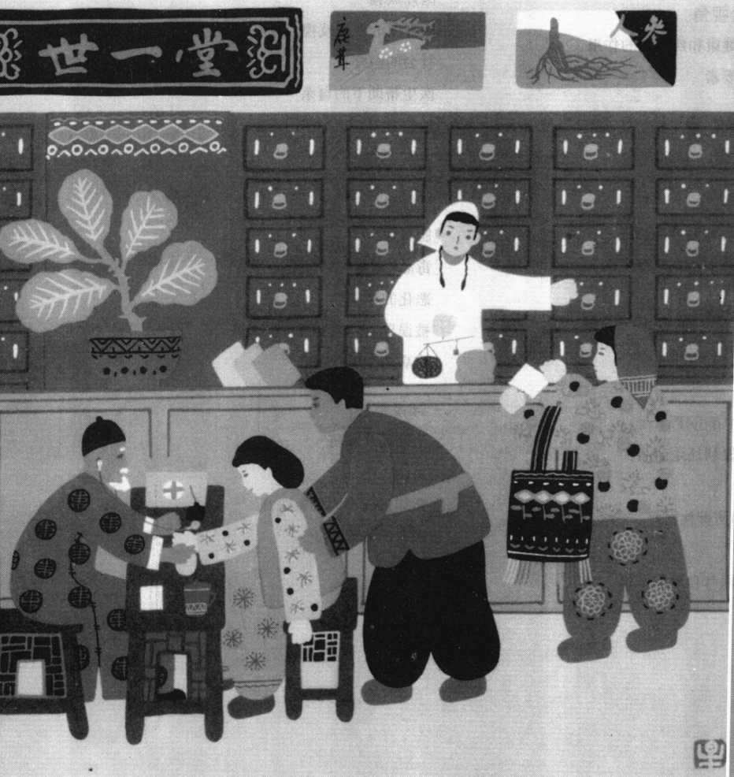

连星(音)

中医》(1998)

---

· 符号互动论视角

文化在定义健康和疾病中的作用

健康的构成要素

· 功能主义视角  

病人角色

· 冲突论视角

全球分层对健康医疗的影响

建立美国健康医疗的垄断

· 健康的历史模式  

身体健康  

心理健康

· 健康医疗中的问题  

医疗：一种权利还是商品？  

社会不平等  

渎职诉讼和防御性医疗  

医疗事故  

去人格化：医疗自助取款机

利益冲突

医疗欺骗

医疗中的性别歧视

社会的医疗化

医生帮助下的自杀

控制费用：健康保险问题

· 对健康的威胁

艾滋病

肥胖症

毒品：酒精和尼古丁

恶化的环境

被误导、愚蠢和冷漠的实验

疾病的全球化

· 寻找替代

治疗还是预防？

另类医学

全球视角下的健康医疗

医疗的未来

·本章小结

---

### 第 19 章 医疗与健康

我认为仅仅研究无家可归者是不够的，还应当帮助他们。我了解到，在圣路易斯有一个无家可归者的避难所正计划在穷人家中免费安装燃木炉具，以帮助他们节约开支，从而防止他们沦落到无家可归的境地。这不是真正的应用社会学，但我仍然作为志愿者参与了这个活动。

我从来没有做过像安装暖炉这样的事情，因此对于即将到来的训练我有点担心。当我在周六早晨进入这个无家可归者的避难所的时候，我发现整个建筑正处于半黑暗中。“他们一定在节约用电，”我心想。这时一幅令人失望的景象映入我的眼帘：两个警察官员正在追赶一个跑过大厅的裸体男人，他们抓住了他。我看到，这个老人看上去有些迷惑，艰难地穿上衣服。在警察那里，我了解到他把避难所的主线路装置里的电线拉了出来，这就是没有亮灯的原因。

我问这些官员将把这个人带到哪里，他们回答说“Malcolm Bliss”（州立医院）。这时我说：“我想他将在那里呆很长一段时间吧。”他们答道：“很可能不过一两天，上周我们救起他——当时他正在红绿灯附近的车下爬行——而医院两天后就让他出来了。”

警察随后解释道：如果想要长期住院，他必须威胁到其他人或自己。想到这个老人在十字路口已经停下的汽车下爬行，并冒着触电致死的危险赤手拉出电线，我真是惊讶于精神病专家对“危险”的定义了。

### 社会学和医疗与健康研究

这件事指出了美国健康医疗中的一个严重问题。本章我们将考察为什么穷人常常得到二流的医疗服务、有些人甚至会受到恶劣的对待。我们也将看一看猛涨的医疗费用怎样制造了伦理上的两难困境，例如是否应当提供治疗。

当我们考虑这些问题时，社会学在研究医疗（medicine，一个社会处理疾病和伤害的标准方法）中所扮演的角色将会变得显而易见。例如，因为美国医疗是一个专门职业、一个科层机构、一个庞大产业，社会学家会研究它怎样受到自我管理、科层结构和利润动机的影响。社会学家也认为，疾病和健康并非只是生物意义这么简单，例如，它们是与文化信仰、生活方式和社会阶级相联系的。因为强调这些，医学社会学才成为社会学的应用领域之一，许多医学院甚至医院都雇有社会学家。

### 符号互动论视角

让我们先从考察文化是怎样影响健康和疾病开始,这会便于我们领会符号互动论者的核心观点。

### 文化在定义健康和疾病中的作用

假如某天早晨你在照镜子时，发现脸上和胸部有一些奇怪的斑点。抱着一线这或许不太严重

---

的希望，你跑到一个医生那里。如果医生说你患了“皮肤变色的螺旋体病”，你的恐惧就会得到确认。

世界上所有人都会认为这些斑点是疾病的症状吗？不，并不是所有人都这样认为。在一个南美部落，这种皮肤病是如此普遍，以至于其中少数没有斑点的人会被认为是不健康的。因为被认为是“有病的”，他们甚至不能结婚（Ackernecht，1947；Zola，1983）。

提到心理“疾病”和心理“健康”，人们并不是因为作了某些事情而自动变得“疯狂”。相反，人们是根据文化标准来定义“疯狂”或者“正常”的。如果一个美国人对着其他人看不见的神灵大声说话，他或她很可能会被认为是疯了，并且，为了公众利益着想，很可能会被关起来。比较起来，在某些部落社会，那些能和看不见的神灵说话的人则会因为他(她)与神灵世界的密切联系而受到尊敬，并且，为了公众利益，他或她会成为巫师(shaman)或灵媒，并会去诊断和治疗疾病。

和我们可能认为的不同，“疾病”和“健康”并不是绝对的。它们不过是人们定义的产物。在我们生活的这个世界上，每种文化都提供给人们用以确定他们是“健康”或“疾病”的标准。正如在“美国的文化多样性”专栏中所讨论的，那些标准也会告诉你你的疾病是什么。这是另一个关于现实的社会建构在我们生活中扮演重要作用的例子。

### 美国文化多样性

### “你不知道什么是 empacho？那你算哪门子医生？”

当你身体感到不舒服时，你怎样知道你得了什么病呢？文化会给你答案。对于你的症状，它会提供一个单词来表示，例如流感、发烧或感冒。毫不奇怪，在不同的文化中同样的症状有着不同的名字。这是可以料想到的，因为语言不同。然而，同样的症状有不同的名字，远非只是表现在术语名称的使用上。名称也暗含着疾病的不同病因，和所需要的不同的治疗方法。这种差异可能非常显著，以至于有些存在于一种文化的疾病，并不存在于另一种文化中。

例如，墨西哥人患empacho，但美国医生甚至没有听说过这种健康问题。empacho是指食物阻塞在肠道里，这会导致严重的肚子疼痛。按摩有时能减轻empacho的症状，有助于食物在肠道里继续向前移动。喝茶和药草也都有此功效。

因此，当来自墨西哥的移民去看从来没有听过empacho 的美国医生时，会发生什么呢？医生会因为病人认为食物阻塞在肠道而认为病人在开玩笑，而病人则会因为医生不知道这么一个普通小病而认为医生很蠢。

当这些移民渐渐习惯了美国的方式后，他们将会采用一种新的考虑疾病的方法。同时，为了能够治疗这些病人，医生也需要了解移民的文化。empacho并不只是一种普通疾病的名字，它也是一种不同的思维方法，对于这些移民来说，empacho是真实存在的。认为empacho是民间传说和没有用的知识是对病人的蔑视。

医生对 empacho 的茫然也会造成病人的怀疑，如果医生甚至不知道 empacho 这个人人都知道的小病，他或她又怎能被信任来治疗其他疾病呢？

### 思考题

文化冲突是显而易见的。病人和医生都习得了看待事情的不同方法。无论对墨西哥移民或是美国医生来说，症状都是显而易见的，但其意义却完全不同。为了治疗病人——以及建立信任，你认为医生应怎样对待 empacho？

---

### 健康的构成要素

1941年，国际“健康专家”指出了健康的三个构成部分：身体的、心理的和社会的(WHO,1946)。然而他们却没能注意到我们上一章所讨论的方面，在图19.1中我加入了一个精神部分。可见，即使是健康的维度，也是有争议的。

即使我们可以在健康的构成要素上达成一致，我们仍会面临这样一个问题：什么使人们在身体上、心理上、社会上或精神上健康？正如符号互动论所强调的，这些并不是客观的问题，相反，什么被认为是“健康”或“疾病”，会因文化的不同而不同。在一个复杂多元的社会中，它们在不同群体中也有差异。

同上一章提到的宗教一样，社会学家并不是要去定义什么是“真正的”健康或“真正的”疾病，而是要分析人们关于健康和疾病的观念对其生活的影响，分析人们确定他们有病的方式。

图 19.1 健康与疾病的连续体

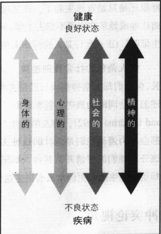

### 功能主义视角

功能主义者的观点很直白：如果一个社会要运转良好，人们需要足够健康以扮演他们的正常角色。这就意味着，社会必须建立控制疾病的各种途径。其中之一是建立一种医疗保健制度，另一种方法则是制定规则以防大量人口“生病”。让我们看一下这些途径是如何起作用的。

### 病人角色

还记得吗？那天你喉咙痛，你的妈妈或爸爸测量你的体温，温度计显示39度。尽管你抗议说明天是暑假的第一天(或者其他某一重要事情)，但你的父母仍然带你去看医生。你不得不卧床吃药度过接下来的三天。你被迫扮演社会学家所称的“病人角色”，这个词意味着什么呢？

病人角色的构成要素 帕森斯是第一个分析病人角色的功能主义者。他指出病人角色(sick role)有四种构成要素：你不必为生病负责，你可以免除正常责任，你不喜欢这个角色，你将获得有资格的人的帮助以使你回到正常状态。如果人们没有去寻找有资格的人的帮助，他们就会被认为应该为生病负责，他们没有权利从他人那里获得同情，也不被允许免除正常的活动。寻求帮助的人被给予同情和鼓励，而如果不恰当地声称病人角色，则会遭受冷遇。

病人角色的不明确性 如果发烧到38度而不是39度，你会“变成”有病还是没病呢？也就是说，你是否决定要声称病人角色？因为大多数疾病并不像心脏病和胳膊骨折那样清楚，声称病人角色的决定更多是基于社会考虑而不是身体条件。假如你正面临着期中考试，但你并没有准备好，如果你病了，你可以补考。那么你越是重视这次考试，你就越会感觉身体不舒服——这使声称病人角色的需要更合理。现在仍假定温度计显示你烧到38度，但你没有考试，你的朋友要带你出去庆祝你21岁生日，这时你不太可能会扮演病人角色。注意在这两个例子中你的身体状态是相同的。

---

病人角色的把门人 父母和医生是病人角色的主要把门人。也就是说，他们仲裁孩子们是真的不舒服还是只是宣称生病了。在父母向学校请假之前，他们会看孩子是装病还是有真正足够严重的症状而让他或她呆在家里不能去上学。对于成年人来说，医生是病人角色的把门人。如果雇主与教师收到“医生证明”（正式允许某人扮演病人角色），他们就不必怀疑一个人的病人角色了。

病人角色的社会性别差异 试着回答这个谜团。总体说来，女人比男人更健康，而且她们活得更长，但她们却经常得病而且经常去看医生（Statistical Abstract 2002；Table 149、151、152、153）。这两个陈述怎么会同时为真呢？答案显而易见，当女人感到不舒服时，女人比男人更愿意要求病人角色（Klonoff and Landrine，1992）。病人角色并不符合绝大多数男孩和男人尽力表现的男子气概形象。绝大多数男人都会尽力遵循他们是强壮的这种文化观点，宁愿自己疼痛，“强忍着”。比较起来，女人则被赋予一种应该分享她们的感情并从其他人那里寻求帮助的形象。显而易见，社会性别角色是女人比男人更健康但却更多地生病并更经常去看医生这个谜的原因。

### 冲突论视角

正如前面章节所强调的，冲突理论家的主要观点集中在人们怎样争夺稀有资源，因为医疗同样是稀缺资源之一。让我们从全球视点来看一下这种竞争，然后看一下一个群体是怎样逐步垄断美国健康医疗的。

### 全球分层对健康医疗的影响

在第9章，我们分析了那些最早工业化的国家是如何获得了能够给他们带来财富并允许他们统治整个地球的经济和军事力量的。这也导致了医疗的全球分层，即有关人们生存与死亡的全球分层。例如，打开心脏的外科手术在多数工业化国家已经非常常见。然而，最不发达的国家却不具备这项技术。这就像艾滋病一样，在美国和其他富裕国家，那些患有艾滋病的人通过昂贵的药物来延长生命，而在不发达国家，患有艾滋病的人们则负担不起医药费，对于他们，艾滋病就等于死刑。

预期寿命和婴儿死亡率也很能说明问题。在工业化国家，大多数人预期可以活到75岁，但在安哥拉、马拉维、莫桑比克和津巴布韦，大多数人在40岁前就会死去。如图19.2所示，在许多富裕国家，每1000个婴儿中有少于7个在一周岁前死去。而在另一些国家，婴儿死亡率则比这个数字几乎高出30倍。例如，在安哥拉，每1000个婴儿中，195个不会活过一周岁（Statistical Abstract 2002: Table 1312）。

全球分化甚至可以帮助判定我们会得什么病。假定你出生在位于热带地区的一个极不发达的国家，在短暂的一生中，你将面对四种疾病和死亡的威胁：疟疾(来自蚊子)、体内寄生虫(来自受污染的水)、痢疾(来自被人类粪便所污染的食物和土壤)、营养不良。但你不会面临心脏病和癌症的困扰，因为它们都是“富贵”病；也就是说，它们具有工业化国家的特点，在工业化国家人们活得很长而得这些疾病。随着国家的工业化，人们提高了健康医疗和营养，人们活得更长，那些过去是人类主要杀手的疾病减少了，取而代之的是，人们开始担心癌症和心脏病。

在工业化程度最低的国家内部，也存在着社会分层。如果把更多的资金用在公共卫生上，这些国家中许多会夺去穷人生命的疾病就能得到控制。廉价药品能够阻止疟疾，而更加安全的水资源供应和更

---

图 19.2 在一周岁前有多少婴儿死亡?

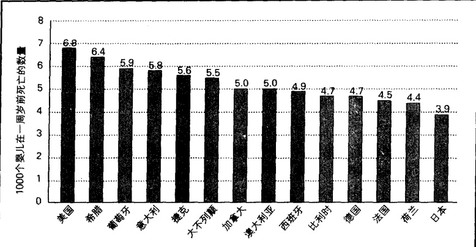

注：所列的这些国家的婴儿死亡率都比美国低。这并不是一个完整的列表，奥地利、瑞士和瑞典并不包括在内，在1997年版中，这些国家的婴儿死亡率更低。婴儿死亡率可以定义为，每1000个出生婴儿中，在一周岁前死亡的数量。

资料来源:Statis-

tical Abstract 2002:

Table 1312.

多的食物生产则将有助于消除其他主要杀手。然而，这些国家的少量资金并没有被这样使用。相反，其精英们慷慨地把国家资源的绝大部分花在自己身上。他们甚至送一些学生到西方国家的高级医学院，这让他们能够接触到高级医疗技术——从 X 光射线到生命维持系统。与此相对照，这些国家的穷人甚至没有基本的医疗服务，经常早早死去。

### 建立美国健康医疗的垄断

让我们把焦点转向美国的医疗。医疗是怎样在美国成为最大的商业的呢？它又是如何成为美国唯一的合法垄断行业的呢？为了找到答案，我们需要理解医疗是怎样实现专业化的。

医疗的专业化设想你生活在18世纪的美洲殖民地，你想成为一名医生。那时没有必修的课程，也没有入学考试。实际上，你根本不需要任何正式教育，因为也没有什么医学院校。你只需要请一个医生训练你，作为回报，你成为他的助手并帮着做一些杂活。当你认为你已经学得足够多时，你就可以挂牌开业，并宣称自己是一名医生。这个过程非常像今天的汽车修理工所经历的那样。实际上，如果你愿意，你甚至可以跳过学徒过程，直接挂牌开业——就像一个修理工那样。如果你能使人相信你是优秀的，你就会有碗饭吃。如果不能，你可以转向其他行业。

19世纪，情况开始发生变化。这时设立了几所医学院，医生也要拿到执照才能营业。这个时期的医学院就像今天的宗教：它们到处争取顾客，并对真理有不同的说法。关于什么引起疾病和怎样治疗，一个医学院传授某些观点，另一个医学院则教授其他东西。训练是短暂的，通常也不需要高中文凭。没有临床训练，课程也年年没有变化。哈佛大学医学院两个学年就可以完成学业——每个学年只有四个月(Starr，1982；Rosenberg，1987；Riessman，1984)。

后来到了20世纪。1906年美国有160所医学院。卡耐基基金会请亚伯拉罕·弗莱克斯纳，一位著名的教育家，来评价这些学院。甚至最没有实力的学校也要求他来看看，因为他们以为随后会收到来自卡耐基基金会的礼物(Rodash，1982)。在一些学院，实验室里仅有“几只试管散乱地放在一个雪茄烟盒

---

里”。另一些学校的图书馆里则没有藏书。弗莱克斯纳建议，为了提高标准，慈善基金应该投到那些最有希望的学校。他们这样作了，那些受到资助的学校更新了设备，吸引了更有能力的教员和学生。面对更高的标准和更大的竞争，其他学校中的大部分不得不关门。

弗莱克斯纳报告(1910)导致了医疗的专业化(professionalization of medicine)。当社会学家使用“专业”这个术语时，他们指的是一些非常专门的东西。随后，医生开始(1)经历严格的教育；(2)对疾病有理论理解；(3)自律；(4)宣称他们正为社会服务(而不是仅仅追求自身利益)；(5)拥有高于顾客的权威(Goode, 1960; Freidson, 2001)。

医疗垄断 当医疗成为一个专业时，它也成为了一种垄断，这是理解我们当前形势的关键。得以控制美国医疗的群体，把自己设定为唯一的医疗机构。这个群体能够通过法律来使医疗许可只被那些他们控制的学校的毕业生得到。通过控制教育和医生执业许可，医疗机构平息了大部分相对立的医疗观点。掌权的正统白人男性也拒绝让女性和少数民族进入医学院，或者严格限制他们的录取人数。

清除竞争为医疗成为一个庞大产业铺平了道路。垄断是如此彻底，以至于根据法律，只有一群严格挑选出来的人——某种医学的牧师——才被允许做诊断和治病。只有他们才知道什么对人们的健康有利，只有他们才能将秘密语言(拉丁语)潦草地写到特殊的羊皮纸(处方)上供翻译者(药剂师)解释(Miner,2003)。这个选出的群体使医疗成为这个国家最有利可图的专门职业——因为它的成员自己设定收费标准，而且几乎没有竞争。这群人如此强大，以至于它甚至能把接生婴儿的产婆赶走。下面的“现实社会学”专栏就讨论了这一点。

## 现实社会学

### 建立垄断,排除竞争:医生是怎样战胜产婆的

关于产婆的历史的研究，有助于我们理解医疗的专业化，并且可以提供关于美国医疗机构创立的洞见。在美国，像在欧洲和其他地方一样，怀孕和分娩被认为是自然的事情，妇女被认为最适合帮助其他妇女接生。结果就出现了接生婴儿的产婆。一些产婆受过培训，其他产婆则是一些有过分娩经验的邻居妇女。在许多欧洲国家，直到现在，产婆都由国家发给执照。

当医疗专业化后，医生想扩展业务。然而，他们扩张的愿望碰到了两个主要障碍：第一个是产婆，她们不想让医生侵犯她们的生意；第二个是无知，关于接生婴儿，医生一点也不了解，因为在当时，一个男人对怀孕了解得太多是不得体的，而且人们从没听说过男人帮助妇女接生这种事情。

医生贿赂了一些产婆，暗中潜入妇女分娩的卧室。说“暗中潜入”绝不夸张，因为一些医生用手和膝盖爬进卧室，以使产妇不知道有男人在场。然而，大部分医生都不能幸运地找到合作的产婆，他们不得不用人体模型来训练。在医生能够参加接生后，不得体的顾虑仍然存在；医生不得不在一个黑暗的房间里，在一张床单下盲目摸索，而且头要礼貌地转向旁边。

当医生获得政治权力后，他们对竞争者发动了无情的进攻。他们攻击产婆“脏、无知、不胜任”，甚至称她们“威胁到社会的健康”。凭借他们在美国医疗协会的政治影响，医生成功地说服许多州通过法律，使除医生外的任何人接生婴儿变成非法。然而，一些州继续允许护士—产婆接生。斗争仍没结

---

束，护士——产婆和医生有时仍在谁有权接生婴儿的问题上发生冲突。

冲突理论家强调，这是一场性别斗争——男人寻求控制和接管曾经是女人的工作。他们强调，在医生扩张领域的过程中，政治权力起着中心作用。符号互动论者并不否认政治权力的作用，但更强调现实的社会建构。他们说，事情的关键在于，医生发动了旨在清除产婆的信息攻势，使公众确信怀孕和分娩不是自然过程，而是需要一个有能力的男人帮助的医疗事件。这个新定义，推翻了几千年来女人帮助女人生产的旧传统，将分娩转变为“男人的工作”。这个工作的声望随之提高——当然，它的价格也提高了。

资料来源: Wertz and Wertz (1981); Rodash (1982); Danzi (1989); Rothman (1994).

被称为付费服务（fee-for-service，付费给医生，以换取诊断和治疗）的方法，使医学成为一门生意，这通常是毋庸置疑的。同任何垄断一样，医疗垄断提高了健康医疗的价格。这导致公共呼吁：因为穷人承担不起医疗费用，政府应该付费。美国医疗协会坚决反对政府为医疗保健付账。医生们确信，政府买单将使医疗“社会化”，这样会清除付费服务制度，把医生变为政府雇员。

在 20 世纪 60 年代，主张政府资助的倡导者获胜。医疗救助（Medicaid，政府为穷人的医疗付费）和医疗保健（Medicare，政府支持的对老年人的医疗）制度得以建立。医生的担心被证明是没有根据的，这些计划不仅没有导致医疗的“社会化”，反而给医生带来了成千上万的额外顾客。以前承担不起医疗服务费用的人，现在由政府帮助付费。正如图 13.8 所示，这些耗费巨大的计划已把数十亿美元放进了医生的口袋。

从较低的起点开始，医疗已经发展成为美国最大的产业。它不仅包括医生，而且包括护士、医生辅助人员、医院职员、药剂师、保险公司，拥有医院和养老院的企业，还有我们医药技术后面庞大的研究、生产和销售力量。医疗垄断如此强大，以至于能够游说所有州的立法机构和美国国会。像体育一样，一些医院甚至付签约费来吸引有名的外科医生（McCartney，1993）。

### ☑健康的历史模式

让我们看一下美国的健康和疾病是怎样变迁的。这将把我们带入流行病学(epidemiology)领域，它是研究健康问题是怎样在整个人口中分布的。

### 身体健康

死亡的主要原因 察看美国人身体健康状况变化的一种方法，就是比较他们在两个时期的死亡的主要原因。图 19.3 显示了巨大的变化。1900 年导致主要死亡原因占一半的疾病甚至没有出现在今天的列表中；1900 年，心脏病和癌症位于第四位和第八位，现在它们都跃居列表顶端；1900 年，肺结核和痢疾是位列第一和第三的杀手，但在今天它们都没进入前十位。同样地，谋杀和自杀在 1900 年也没进入前十位，而现在则进入了前十位。这些转变表明社会已经发生了深刻的变化。健康、疾病和死亡不仅仅是生物事件，伴随着社会变迁，它们也是社会事件。

---

美国人过去更健康吗？察看美国人身体健康变化的另一个方法，是看他们比过去更加健康还是比过去更加糟糕。这个问题使我们直接面对前面讨论的定义问题。“健康”是依据谁的标准制定的？另一个问题是今天的许多疾病在过去并没有被认识到。要避开这些难题，或许关注死亡率是个好办法。如果美国人过去活得更长，我们可以认为他们过去更加健康。然而今天的美国人绝大多数都比他的祖先活得更长，故我们可以得出结论说：当代美国人更加健康。

有人认为这个结论与大量证据背道而驰：我们都知道空气和水被污染了，也知道如图 19.3 所示，心脏病和癌症的发病率很高。事实也的确如此。有时老人会说：“当我还是小孩时，几乎没人死于癌症，现在几乎每个人都死于癌症。”他们没有注意到癌症大多袭击老年人这个事实。如果预期寿命更短，人们很少有可能死于癌症。还有，过去大部分癌症并未发现，人们仅仅说死于“年老”或“心力衰竭”。

### 心理健康

提到心理健康，我们没有办法进行比较。我们可能会认为，过去年老的人有更低的自杀率、更少的心理疾病等等。但要知道这是否是真实的，我们需要有关心理疾病或心理健康的可靠的测量尺度，而不是一些关于过去的故事。过去的美好生活——每个人在幸福温暖的家庭里成长，父母终生相伴，人们在和谐的、具有紧密联系的家族中相互帮助——根本不存在，这些不过是使现在的生活看起来更坏的神话而已(Coontz,2000)。所有的群体都有他们的心理问题，认为现在人们的心理疾病更加严重的常识仅仅反映了一种感觉，而不是可衡量的真实情况。这些感觉也许是真实的，但也可能跟事实刚好相反。因为我们甚至不知道现在的心理疾病有多严重(Scheff,1999)，我们当然更不能判断过去的状况。

图 19.3 美国 1900 年和 2000 年前十位死亡原因比较

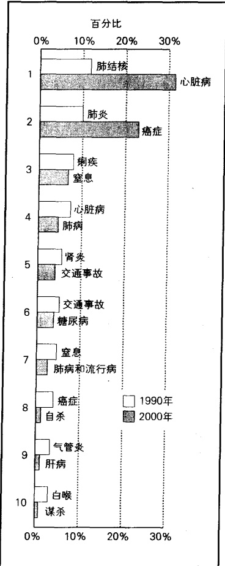

### ☑ 健康医疗中的问题

资料来源：作者根据国家卫生统计中心 National Center for Health Statistics; Statistical Abstract 2002; Table 100 整理而成。

让我们转向美国的健康医疗问题。

### 医疗：一种权利还是商品？

在美国，一个重要的争议是：医疗是一种权利还是特权？如果是一种权利，那么所有的公民都应享

---

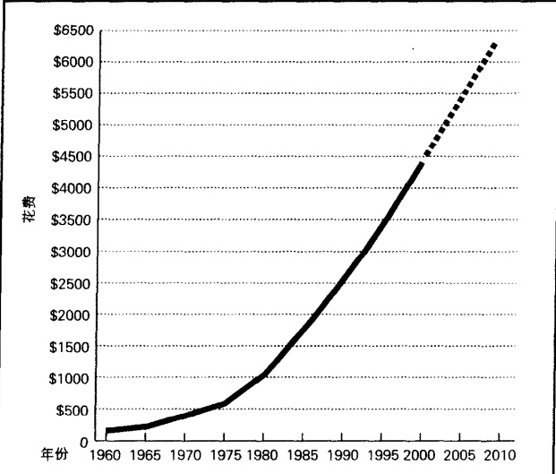

图19.4 猛涨的医疗照顾费用：每个美国人平均每年花费(美元)  资料来源：作者根据 Statistical Abstract 2002: Table 115 及早年资料整理而成。

受良好的医疗保健。如果是特权，那么像汽车、衣物和其他商品一样，富人享受一种类型的医疗，穷人则享受另一类型的医疗。目前，医疗并不是公民的权利，它是一种以高价出售的商品。那些有钱人能够买到更加优质的健康医疗，而穷人和没有保险的人则不享有或者只能等待施舍。试图用某种国家医疗制度解决这一不平等的努力，并没有收到效果。

和这个问题紧密相连的问题是医疗费用的猛涨。如图 19.4 所示，1960 年，美国人均健康医疗消费 150 美元，现在人均消费 4500 美元。要明白这意味着什么，可以考虑下面这个例子。1960 年，17 英寸黑白电视机也值 150 美元。如果电视的价格与医疗费用有着相同的增长率，17 英寸黑白电视机现在的价格也应是 4500 美元。导致医疗费用增长的原因，包括日益增长的老人数量和新的医疗技术的出现。

因为健康医疗是一种商品，而且还是一种很昂贵的商品，所以我们现在实行的是一种二等级医疗制度。也就是说，那些能负担得起费用的人享受优质服务，那些负担不起的人只能接受较差的服务。简言之，医疗与其他商品没什么不同，就像新跑车是属于富人的，而穷人只能开旧汽车。

### 社会不平等

开篇短文描述了在无家可归者避难所，一个赤裸男人被送进州立精神病院，这清楚地证明了医疗的二等级制度。有心理问题的中产阶级和富人将拜访私人心理医师，而不被送进州立精神病院。当然，首先他或她也不会出现在避难所。

自从 1939 年起，社会学家已经发现：心理问题和社会阶级问题存在反相关。换句话说，社会阶级越低，心理问题越多。这个结果已经在大量研究中被证实（Faris and Dunham, 1939；Hudson, 1988；Ross and van Willigen, 1997；Croudace et al., 2000）。不难理解在较低的社会阶级有更多的心理问题的原因，

---

因为许多压力都来自贫穷。与美国中产阶级和上层阶级比较起来，穷人有更少的工作安全感、更低的工资、更多的应付账单，以及更多的催账者。他们更可能离婚、成为暴力犯罪的牺牲品、酗酒。这些状况严重地冲击着其情感与心理健康。

在 20 世纪 60 年代，政客和精神病医生提出了一项使心理健康机构蒙羞的政策，它被称为去管制化（deinstitutionalization），该计划是打开州精神病院的铁门，释放病人，在外面为他们提供建议、劝告和治疗。病人释放了，但服务并没有到位。结果，美国街道上充斥着没有钱也没有地方去的精神病人，街道成了他们的家。

不用说，被抛弃到街道上的都是穷人。有心理问题的中产阶级和上层阶级成员可以得到私人精神病医生的咨询和治疗，如果住院，他们会去昂贵的私人精神病医院。对富人的治疗我们采用“谈话”疗法(精神治疗的各种形式)，而对穷人则采用“药物管束”(使用药物使他们安定)。

至于身体疾病，我们发现同样是不平等的。如图 19.5 所示，穷人更可能生病。然而，与中产阶级和上层阶级不同，穷人很少有私人医生，他们很多人都要花费数小时在拥挤的公共卫生诊所等待。而在等了很长时间后，一些人没有看到医生，却被告知第二天再来 (Foalka, 1993)。当最终住院时，穷人发现他们住的公立医院人手不足，资金有限。在那里，因为经常换人，实习医生不认识他们，也不了解他们的治疗进程。

图 19.5 生病天数

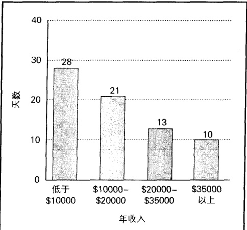

注：生病天数是指人们生病或受伤而不得不减少日常活动超过半天，包括离开工作和学校的天数。

资料来源：作者根据 Statistical Abstract 2000: Table 211 整理而成。

### 读职诉讼和防御性医疗

一些分析人士已经观察到，过去常常是医生杀死的病人比治愈的多。以前的医生不了解细菌，在外科手术和接生前不洗手，因此这样说可能并没有冤枉医生。在19世纪，医生认为疾病是由“坏液体”引起的，他们发展了四种技术来除掉这些液体：（1）放血（割开静脉或用水蛭排出“坏”血）；（2）起泡（用烫包灼伤皮肤使“坏脓”排出）；（3）呕吐（给病人吃些能使他们吐出“坏液体”的液体）；（4）清洗肠胃（给病人吃些能引起腹泻的东西）。

考虑到现在先进的治疗技术，人们或许会认为渎职诉讼应该是过去的事情。然而，事实刚好相反。在过去，法律并不允许索要损害赔偿金。因为“人都会犯错”，这也包括医生。今天，医生被以更高的标准要求——犯了错误不再被原谅。因为损害赔偿金很高，医生们很焦虑，一个医生告诉我：“我正在寻找其他事做，因为当医生不再那么有趣，每次我给病人治病，我真担心这个人是否会回过头来起诉我。”

为了自保，医生实行防御性治疗（defensive medicine）。他们咨询同事，要求化验，这并不是因为病人

---

需要这样做，而是因为他们想留下记录以防被控告。这些求助和化验——为了医生的利益而不是病人的利益——是国家每年的医疗账单增加的主要原因之一（Volti，1995；Hammerstein，2000）。为了减少防御性医疗费用，缅因州建立了医生登记制。如果医生遵守，渎职诉讼就会被撤销（Felsenthal，1993）。虽然医生们抱怨这种“成员掩饰”（“paint-by-numbers”）方法，但为了防止遭到起诉，许多人都情愿这样去做。

### 医疗事故

我的父亲死于糖尿病。他的脚上曾有一块很大的不能愈合的伤口。父亲住在明尼苏达州，他被送到罗彻斯特的梅约诊所。当我到那里去看他时——那是他活着时我最后一次看到他——医务人员推他出去做背部 X 光透视。因为不得不长时间躺在坚硬的表面上，出来后我父亲抱怨背疼。

有什么事看起来好像不对劲。为了治疗糖尿病或脚疼，他们为什么对背部作 X 无透视呢？当我发现我父亲遭受到不应有的痛苦时，我把这种情况报告给主任医生。他检查了记录，说值班医生做错了 X 光透视。单子被叠在一起，他们把别人的单子当成了我父亲的。

还有一些更糟的例子。一个妇女因为肺部问题进入一家医院，医生却为她作了子宫切除。不，我不是在编造，它发生在纽约市(Steinhauer and Fessenden, 2001)。另一个医生进行脑手术，但他作了错误的一边；还有一个医生摘错肾脏——留下癌变的那个一动未动。还有一些医生对病人做错了手术(Steinhauer, 2001)。虽然这些事情并不是每天都在发生，但它们确实发生了。

几乎没有人不同意，如果外科医生切错乳房，病人有权控告医生。但某些渎职诉讼是不公平的吗？当然，一些病人仅仅因为一些琐碎小事就控告医生，而有些事情则是医生无法控制的。然而，尽管受过严格的医学训练，医疗事故却广泛存在。如图片所示，偶尔也存在医生在病人体内落下工具的情况。医生仅仅能正确诊断病人疾病案例的55%（McGlynn et al., 2003）。在大部分病例中，后果并不太严重，但也有许多后果很严重的病例。国家科学院下属的医学院报告说，每年大约有44000—98000人死在医生手里。如果医疗事故致死也是美国人死亡的一个正式分类，它将高居死亡的十大主因之一（Steinhauer and Fessenden, 2001）。

为了减少不必要的失误和死亡(医学专业称为“不利事件”)，有些医院的病人和医生用墨水在将要进行切割的点上签上名字，这样就没有医生会切错身体器官。因为很多病人死于处方药的交叉作用，有人建议医生把所有处方输入计算机并上网，一种计算机程序将会自动检查病人记录，如果所开的处方妨碍其他的治疗，监视器将会发出警报。

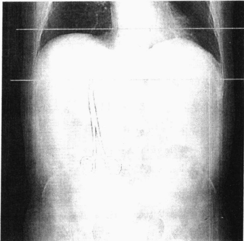

在科学医学的时代，医生和护士的失误是让人吃惊的。正如本书中所解释的，如果医疗失误被列为死亡原因的话，它们会排在前十位。

---

医学院提出了一个更加重要的建议，这触及到了问题的核心。医学院建议建立一个“联邦病人安全中心”，所有的死亡和伤害都将被报告到该中心。就像联邦航空机构调查每起飞机失事一样，该中心将调查每一起医疗损伤和死亡。根据调查确定的原因，中心将制定旨在减少同类事件发生的方针。另外，在你进入一家医院之前，你也能察看在这家医院有多少病人因为医疗事故而受到伤害或者死亡。

### 去人格化：医疗自助取款机

社会学家休·费希尔(Sue Fisher, 1986)到医院检查卵巢肿块，她这样写道：

我刚一到，一个护士就让我进入检查室，让我脱下衣服，并给了我一张纸遮羞，说是医生会很快来看我。我有些震惊，在脱衣服前我不用看医生吗？……我怎么能在检查室里不穿衣服而同时又表明自己为一个有能力有知识的人呢？因为担心很可能有癌细胞生长，我按照她说的作了。几分钟后，护士回来了说“躺下，医生来了”。我再一次遵从了。医生进入了检查室，边看着图片，边向我点头，然后开始检查，根本不曾对我说话。

对医疗行业的主要批评之一是去人格化(depersonalization)，即把病人当成病例和疾病而非一个人的做法。许多病人都有这样的印象，他们被当做一个自动取款机来对待。医生一边对他们说话，一边不耐烦地计算时间并将花费列成表格，以便他或她能够继续检查下一个顾客来挣更多的钱。别忘了，任何花费在一个病人身上的额外时间都是金钱的流失。

一些刚入医学院的学生具有崇高的动机，他们想“对待整个人”，然而他们也会学会对病人去人格化的做法。社会学家杰克·哈斯和威廉·沙菲尔（Jack Hass and William Shaffir，1993）在加拿大麦克马斯特大学作了参与观察，发现了这种状况是怎样发生的。因为大量的材料抛向实习生，所以他们对病人的感情被对高效率的需要所取代。看看这个学生的报告：

有人会说：“听听琼斯夫人的心脏，它就像有个小东西在桌子上跳动。”然后你忘记了她的余下方面……这有助于使你认识到，在某种意义上，你可以走向一个病人，把听诊器放到他的心脏上，听完，然后走出来……这样做的优点是你能很快地看完一个病人，从这个人身上得到重要的信息，然后离开(斜体为作者另加)。

这个学生对研究者的陈述显示了病人变成客体的程度。

你并不认识麻醉状态下的那个人——只是练习插进管子，这个人醒来时会喉咙疼痛，而这只是程序的一部分……有人进来并冲你抱怨，(而你说)“算了吧，来吧，你也可以来练习一下插管法”(把一个管子插进喉咙)。

### 利益冲突

当医生带来另一个人一起对她检查时，桑迪很惊讶，如果她知道这个人是位医药销售代理，她会更惊讶。为了出现在检查现场，他已经付给医生钱了。(Petersen,2002)

销售代理付费出现在检查现场，以便能推荐他们公司生产的药物来治疗病人。虽然这种情况有些过分，但是医药公司为了使医生在开处方时使用他们的药物而付给医生钱却并不罕见。一个医生因为

---

推荐其他医生开一种特殊的药，收到了30万美元(Peterson,2003)。癌症专家的大部分收入都是通过向病人卖药赚得的。他们以低价格购买化疗药品，而当他们将这些药给病人使用时则收取更高的价格(Abelson,2003)。

你能看到利益冲突。当医生看到药物不起作用时，如果他们告诉病人停止化疗，他们的利润就没有了，但如果他们继续治疗，利润就会继续。另一个例子是医药公司给予那些开他们药的医生以红利或者免费度假。一个医生会把治疗过程建立在病人利益最大化的基础上呢？还是建立在医生银行存款最大化的基础上？

### 医疗欺骗

每天有 200 万份医疗保健申请被提交，而对病人做医疗保健的医生不可能被一一审查。许多人都难以抵制欺骗的诱惑。下边的事件并不是孤立的，它们只是最不道德事件的一部分。

一个医生为一个病人开了很多 OxyContin 药方，如果病人真的要吃，他将不得不一天吃 31 片。而实际上这个病人是个药商（Meier，2001）。另一个医生在治疗病人眼睛时开出了多种医疗保健服务——可真正的问题是病人没有眼睛（Levy，2003）。加利福尼亚的精神病医生和病人发生性关系，却要求为这段时间的治疗付费。（Geis et al.，1995）

更糟糕的是医疗欺骗会危及生命。一个药剂师卖过期的电子心脏起搏器(Schatz,1995)。另一个住在堪萨斯市受人尊敬的药剂师身价千万，却不能抵制额外几美元的诱惑，在化疗中，他把经过稀释的药品提供给病人。

### 医疗中的性别歧视

在第 11 章中, 我们看到医生并不把妇女的健康抱怨同男人的抱怨一样严肃看待, 结果, 有心脏病的妇女经常被延迟手术, 这更有可能使她们死于手术。

围绕着心脏病的性别歧视非常微妙，以至于医生甚至并未认识到他们正在歧视妇女。比较起来，医疗中的某些性别歧视非常明显。最好的例子是对女性生殖系统的歧视。休·费希尔(Fisher，1996)在一所医院里作了参与观察，她遭遇了前面提到的去人性化的医疗对待。当她听到医生建议即使没有癌症出现，也最好切除全部子宫和卵巢时，她问为什么要这样做。医生解释说，子宫和卵巢是“极有可能产生疾病”的器官。他们还说，过了生育年龄后，这些器官就可有可无了，因此为什么不切除呢？

因为很少有妇女会这么想，所以为了挣钱，外科医生不得不“卖”手术。下面是一位医生和社会学家戴安娜·斯库利(Dianna Scully)谈起自己是如何“艰难地”兜售手术的：

你不得不去主动寻找外科手术，你不得不去找病人，因为没有人会疯到对你说“嗨，我在这儿，你来给我做手术吧”。有时你必须使病人相信她真的病了——如果她是，当然(笑)，就使她相信在手术后她将更加健康。

要“说服”一位妇女进行外科手术，医生告诉她，不幸的是，在子宫内检查出纤维瘤——它们可能会转化为癌症。单是这些话往往就已经足够了，因为这会使妇女感到恐惧，她们认为她们将会死于癌症。

---

为了使手术确定下来,外科医生隐瞒了余下的事实——纤维瘤也可能不会转变为癌症,以及还有几种替代的手术方案。

美国医疗界男性占统治地位，是性别歧视的原因。然而，性别比例正在迅速发生变化。1970年，美国只有8%的医学学位颁给女性，今天这一比例则达到43%（Statistical Abstract 2002；Table 281）。这一变化将会减少医疗界的性别歧视。

### 社会的医疗化

正如我们看到的，婴儿出生和妇女的生殖器官渐渐地被定义为医疗对象。社会学家用医疗化（medicalization）这个词来表示将以前并不被认为是医疗问题的事情转变为医疗问题的过程。“不良”行为是一个例子，按照精神分析的说法，犯罪不是应该被惩罚的有意的行为，而是在孩提时代产生的没有解决的心理问题的表现，这些问题需要医生治疗。人体是医疗化的最好目标，那些曾经很正常的特征——例如粉刺、秃顶、臀部和下巴下垂、乳房小和皱纹——已经成为医学问题，都需要由医生治疗。

同样，三种理论视角提供了关于人的状况的医疗化的三种观点。符号互动论观点强调，粉刺、秃顶、下巴下垂等本身不是医学问题，它们都是定义的产物：人们过去把这些状况视为生命中的正常问题；现在，他们把这些状况重新定义为医学问题。功能主义者强调，通过扩展顾客基础，这些状况的医疗化有助于医疗机构的建立。他们也提出了医疗化的另一个功能方向——它提供给人们一些倾听他们问题的人，有时这会对他们有所帮助。冲突社会学家认为这个过程暗示医疗机构的权力日益增大：医生能医疗化的生命状况越多，其利润和权力就越大。

### 医生帮助下的自杀

我开始做静脉输液，盐溶液通过针头输入她的静脉，我绑好她的手臂以使她不发生痉挛。这很难，因为她的静脉很脆弱。当她决定自杀时，她只要打开开关，装置就会自动切断盐溶液注入，通过针注入戊硫代巴比妥溶液，可以使她在10—15秒后进入睡眠状态。一分钟后，一种致命的氯化钾溶液开始通过针头进入体内。（Jack Kevorikian，引自 Denzin，1992）

美国公众对自杀问题很感兴趣。一本关于怎样自杀的书《最后的退出》卖出50多万册。“结束生命选择”(以前称为“毒芹协会”)是一个提倡晚期病人自愿安乐死的群体，它已经发展到80个分支。1997年，俄勒冈州通过一项法律允许医学帮助自杀，反对者称这使谋杀合法化。争论仍在继续，对于任何参与自杀的医生，美国司法部长已经威胁要取消其开具被控制药品的权利。

俄勒冈州的法律和凯文肯(Kevorkian)法案已使我们不得不面对既令人不安又难于解决的死亡问题。“医学帮助下的自杀”应该是合法的吗？下面的“批判性思考”专栏探讨了这些问题。

### 控制费用: 健康保险问题

我们已经看到了美国医疗价格猛涨的一些原因：先进的——同时也是昂贵的——诊断和治疗技术，日益增长的老龄人口，作为防御措施而不是医疗原因而作的化验，作为商品的医疗被卖给出价更高的人。只要这些条件还在，医疗保健的价格就会继续快速猛涨。让我们看一下一些减少费用的尝试。

---

### 医生应该被允许杀死病人吗？

除了名字，这是一个真实的故事：

比尔·辛普森70多岁了，他已跟白血病抗争多年。在医生切除了他的脾后，他的腹部脓肿，然后通过另一个手术来排出脓。一周后，脓充满腹部，比尔要求更多的外科手术，但很快脓再次充满。辛普森开始意识模糊，他的亲人建议使用安乐死。医生向他的静脉中注射了致命剂量的吗啡。

在一次医疗会议上，一位曾治愈几千位病人的癌症专家宣称，他计算了请他帮助他们死的病人。“有127名男女”，他说。然后他补充道：“我帮助他们中的25人实现了愿望。”成千上万的其他医生也都做过同样的事情(Nuland,1999)。

对于那些选择安乐死的人们，公众看上去有两种主要印象。一种印象是一个人被长期的病痛折磨，医生用安乐死仁慈地帮助他结束了痛苦。第二种印象是一个人已经脑死亡——就是植物人——躺在医院病床上，仅仅依靠机器来维持生存。这些印象准确吗？

我们以荷兰为例。在这里，以及在比利时，安乐死是合法的，但令人难以置信的是，一年大约有1000个案例是在没有得到病人同意的情况下，医生就实施了安乐死。有一个例子，一名医生结束了一名修女的生命，是因为他认为修女已经想让他这样做但又害怕提出请求，因为这样做违背了她的宗教。在另一个例子中，一名医生结束了一个患有乳腺癌的病人，而这个病人并不想安乐死。这个医生说：“她可能还能活一个星期，但我很需要这张床。”（Hendin，1997，2000）

一些荷兰人担心，如果他们得了医疗急症，他们会被执行安乐死。他们带着“护照”告诉医疗机构他们想活下去。然而，大多数荷兰人都支持安乐死，他们带着另一种“护照”，告诉医疗机构他们愿意执行安乐死(Shapiro,1997)。

杰克·凯文肯，我们在前面提到的帮助自杀的医生，使当局很不舒服。他帮助了120人自杀。他有时甚至公然挑衅，将尸体扔在汽车旅馆里或是放在货车上。凯文肯非常谨慎，他只提供“死亡机器和毒品”，但从来不会亲自操作。密歇根州因此曾以谋杀罪起诉过他四次，但陪审团拒绝认为他有罪。之后，凯文肯做过了头，他在国家电视上播放录影带，表明他在给一个将死于肌萎缩硬化症的男人注射了致命的药物致其死亡。检方再次起诉凯文肯，他最终以二级谋杀罪被判入狱10—25年。

### 思考题

你认为医生有权帮助自杀吗？除了在这里提到的，荷兰医生也杀死过严重出生缺陷的婴儿（Smith，1999）。他们的借口是这些婴儿将不会享有“生命的质量”，你支持这种观点吗？

资料来源: Gomez (1991); Markson (1992); Angell (1996); Smith (1999); Naik (2002).

但结果却差强人意。尽管医生强烈反对，我的一个朋友还是被从医院赶了出来，尽管她正在流血并发烧，因为她的 HMOs 代表不批准她在医院再多待一天。纽约州 Washington Heights 市的一位肺病专家与他的 HMO 交涉了三个小时才获得允许对一个甚至咳出威胁到生命的血量的妇女进行治疗（Steinhauer，1997）。在心脏病发作之后，一个在密苏里州堪萨斯市的男人的病只能到圣路易斯的巴内斯医院做手术。但 HMO 说：“太糟糕了，这个医院在我们的服务区之外。”在等待 HMO 作出决定时，这个男人死了……

HMOs 健康保持组织,或称 HMOs,是收取年金以换取为某个公司的雇员提供医疗服务的医疗公司。因为 HMOs 互相竞争出价,所以价格比较低。年底时,剩下的钱就是 HMOs 的利润。这种安排排除了不必要的医疗,它也给医生带来了减少必要治疗的压力。

---

好消息！你的HMO将不会再付一毛钱，我想你已经痊愈了。

卡通人物揭示了美国医疗的不幸事实。

www.frankendemerst.com

E-mail: FandEBobT@AOL.COM

自然,基本问题是:为了减少医疗支出,我们应当付出多大的生命代价?

相近诊断组 为了控制不断上涨的费用，联邦政府已经把所有的疾病分类成相近诊断组（Diagnosis-related-groups，DRGs），每种疾病的治疗都被设定了一定的付费额度。如果医院能够快速地将病人移出这一系统——如果在被分配的额度被花完之前就让病人出院，他们将会赢利；有些人则被拒绝入院，因为他们的病况看起来“比一般的更坏”。换句话说，他们可能会花费很长时间治疗，而且将花费医院大量的钱而不是给其带来利润。

### 国家健康保险

一个怀孕5个月的年轻妇女声称肚子疼而被送到医院。医院拒绝让她入住，因为她既没有钱又没有信用卡。当他们正把她转到穷人医院时，她生产了。婴儿夭折，但医院仍然坚持转走了妇女——包括死婴、脐带和所有其他东西。(Ansberry,1988)

推卸拒绝治疗无利可图的病人，送他们到公共医院，这是把利益放在治病救人之前的制度所导致的一个结果。尽管大多数事件并没有像这个妇女和死婴那么严重，但其基本做法却是一样的。美国有3000万人没有保险（Statistical Abstract 2002: Table 137）。要求政府提供国家健康保险的压力已经在增加。

国家健康保险的支持者指出，集中化大规模购买医疗和医院供应品会减少费用支出。他们也强调穷人享受的医疗非常有限。上面说到的恐怖故事，印证了他们的观点。反对者强调国家健康保险会带来官僚作风。他们对联邦机构(就像邮局一样)能否被人们信赖去承担像国家健康保险这样重要的事情存有疑问。这个争论并不新鲜，并且即便国家健康医疗的某些形式被采用，争论也很可能还将继续下去。

配给医疗 对于怎么样减少医疗费用，最有争议的建议是配给医疗。他们认为，我们无法做到将所有先进技术提供给每个人，因此，我们必须加以配给。对这个日益紧迫、并且正在变成全国性争议焦点的问题，目前还没有一个简单的答案。下面的“社会学和新技术”专栏讨论了这个难题。

---

社会学和新技术

### 谁应该活，谁应该死？配给医疗的两难困境

去看医生或到医院看病并不是没有风险的。我们看到医生一年大约杀死5万—10万名病人。但比起医生用放血和泻药治病的时代，今天的风险是很小的。今天的医生经过了专业训练，而且，医疗是建立在科学研究基础上的。新技术甚至能使我们治愈那些不久之前的不治之症。在其他例子中，一些疾病虽仍不能被治愈，但通过治疗，病人能活得更长。

但这里也存在着矛盾。尽管某种特殊的医疗技术对治疗来说是必不可少的，但我们却没有足够的量来满足每一个需要的人。有些技术非常昂贵，以至于如果我们用它们为每一个有特殊疾病的人进行治疗，社会就会负担不起。那么，谁应该享受这些新的医疗技术呢？

以透析技术为例，它使用机器清洗患有肾病的人的血液。目前，如果需要，任何人都可以去做透析，但其费用则高达一年数十亿美元。所有医疗保健支出的4%，被用来支付仅仅占医疗保健病人0.25%的病人做透析治疗。面对同样的问题，英国则只对年龄低于55岁的人做透析(Volti，1995)。

心脏手术是医学上的奇迹，但它的费用同样让人吃惊。国家医疗账单的1%被用来支付仅占所有人口0.04%的人的心脏搭桥手术。对临终病人进行治疗的问题也是如此。大约所有医疗保健资金的1/4被用在维持病人最后一年的生命上，而差不多这个数量的1/3被用在病人生命的最后一个月上(Volti,1995)。

形势仍将恶化，医疗技术——以及日益上涨的费用——还会继续提高。老年人口数量也同样会增长，而他们最需要得到医疗。

矛盾是尖锐的,如果我们实行配给医疗,许多病人会死;但如果不这样做,我们就可能倒台。

### 思考题

问题的核心不仅在于费用，也在于公正性问题，即怎样以一种平等的方式分配先进技术。请用本章或其他章中的观点、概念和原理给出一个解决这个迫切问题的建议。从冲突论、功能主义和符号互动论的不同视角来看，这个困境将会如何变化？

财富和声望应该成为决定的一部分吗？这里有一个真实的例子。由于多年的爆饮、丙型肝炎和癌症，棒球明星曼特尔的肝脏已经不能正常工作，并且癌细胞开始向其身体的其他部位扩散。曼特尔仅等了两天就得到了一个新的肝脏。但在手术后三个月，他就死了。如果这个肝脏被移植到一个健康人的身体中，这个人可能现在还活着。

对囚犯的治疗又如何呢？可以回顾一下第8章，美国囚犯的数量已经上涨到了历史最高，他们也因为年老而需要更多的医疗。考虑到昂贵的医疗费用，他们应该像普通人一样被治疗吗？例如，他们应该得到价值100万美元的心脏移植吗？如果应该，那么在有心脏可用的时候，他们应该像其他人(他们可能是从来没有犯过罪的公民)一样被给予同等考虑，并可能最终获得心脏的使用权吗？

那么年龄呢？它是一个考虑因素吗？如果是，年轻人应该得到更好的治疗吗？或者是年老的人应该得到更好的治疗？为什么？

种族呢？性别呢？社会阶层呢？

### 对健康的威胁

让我们看一下在美国和世界范围内存在的对健康的六种威胁：艾滋病、肥胖症、毒品、恶化的环境、愚昧而冷漠的实验、疾病的全球化。

---

图 19.6 美国艾滋病病例的增长

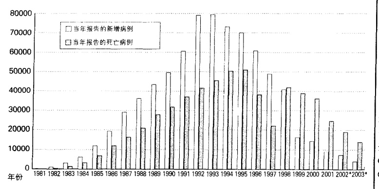

2002 年和 2003 年是作者的预测

资料来源: 作者根据 Centers for Disease Control 2003 整理而成。

### 艾滋病

1981 年, 第一例艾滋病 (AIDS, 获得性免疫缺乏综合症) 被发现。从那时起, 这种攻击人类免疫系统的病毒已经杀死了大约 50 万美国人。正如图 19.6 所示, 在美国, 艾滋病已经得到控制。新发病例在 1993 年达到高峰, 1995 年出现死亡高峰。对于美国人来说, 艾滋病已经转变为一种难以治愈的慢性病, 但得病后也不会马上死亡。今天, 大约 37.5 万美国人感染艾滋病 (或者 HIV, 引起艾滋病的病毒) (Centers for Disease Control 2003)。一个美国艾滋病人一年的平均治疗费用是 2 万美元, 这使国家一年的艾滋病治疗费用达到大约 70 亿美元。

但是，全球的艾滋病仍未得到控制。约有2500万人已经死于这一疾病，但最坏的情况仍未到来。如图19.7所示，非洲是世界重灾区。每年大约有300万非洲人民死于艾滋病。在撒哈拉南部非洲，艾滋

图 19.7 艾滋病：全球探窥

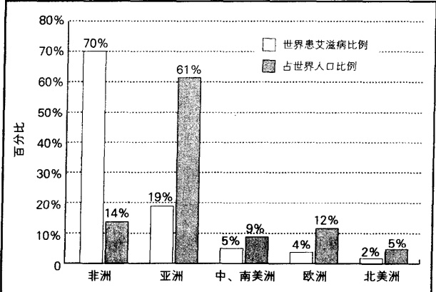

资料来源：作者根据 Haub（2003）整理而成。

---

病是死亡的主要原因。在某些国家，艾滋病预计会吞噬一半的青少年。博茨瓦纳有世界上最高的艾滋病患病比例，每5个成年人有2个(39%)被感染(United Nations 2002a)。令人难以置信的是，博茨瓦纳所有怀孕妇女中45%有艾滋病(United Nations 2002b)。

整个世界，每天有 14000 人（12000 成年人和 2000 儿童）感染艾滋病毒，也就是每分钟大约产生 10 个新病例。95% 的感染发生在工业化程度极低的国家，其中绝大部分在非洲（Lamptey et al., 2002）。

让我们看一下这种疾病的主要特征。

病源 关于艾滋病起源的问题困惑了科学家20年，但这似乎已经被解决了(Kolata，2001)。他们用基因序列追踪到刚果。显而易见，这个病毒出现在黑猩猩身上，然后传染给人类。但是至于怎么发生的仍不知道，很有可能是猎人在宰杀动物时感染了动物的血。

艾滋病的传播 感染艾滋病的唯一途径是通过体液，从一个人传给另一个人。艾滋病主要是通过血液和精液传播，但婴儿也能通过感染病毒的母亲的母乳感染艾滋病。因为艾滋病病毒出现在所有的体液中(包括汗水、眼泪、唾液和尿液)，一些人认为艾滋病也能以这些形式传播。然而，美国疾病控制中心说，偶尔接触，以及少量的液体交换并不会感染艾滋病。

艾滋病的传播模式会随着社会的变化而变化。例如，在某些社会，大部分人通过与异性性交而传染艾滋病，而在其他社会，大部分人则是在同性恋性行为中感染艾滋病的。在同一社会内部，感染模式也会因性别而有差异。图 19.8 比较了美国男性感染模式和女性感染模式。

图 19.8 美国人患艾滋病的途径

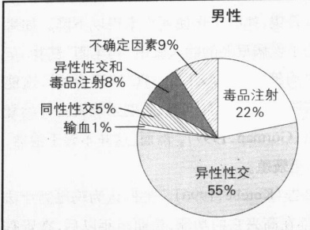

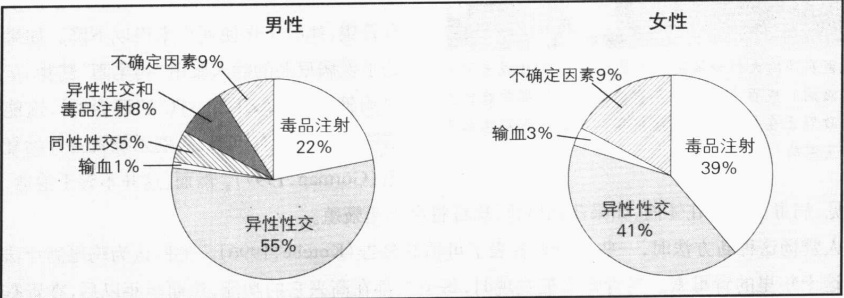

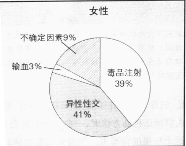

资料来源：作者根据 Centers for Disease Control 2003 整理而成。

性别、种族和艾滋病 虽然很多人都认为艾滋病是男人的疾病，但在撒哈拉南部非洲，在妇女中艾滋病更加普遍（United Nations, 2002b）。在美国，尽管艾滋病人主要是男性，但在每年的新病例中妇女占有更大比例。1982年，仅有6%的艾滋病人是妇女，但在今天，妇女已占到所有新病例中的26%（Centers for Disease Control 1997: Table 3, 10; 2002, Table 5）。艾滋病是造成美国15—24岁年龄段的男人和女人死亡的第十大原因。如表19.1所示，艾滋病的风险也与种族相联系。但其原因并不在于基因上的差别，没有哪个种族群体因为生物因素而更易感染艾滋病。风险的差异来自社会因素，例如静脉注射毒品和安全套的使用率会影响感染艾滋病的概率。

---

表 19.1 艾滋病和种族

<table border=1 style='margin: auto; word-wrap: break-word;'><tr><td style='text-align: center; word-wrap: break-word;'>艾滋病病例百分比</td><td style='text-align: center; word-wrap: break-word;'>占美国人口所百分比</td></tr><tr><td style='text-align: center; word-wrap: break-word;'>白人</td><td style='text-align: center; word-wrap: break-word;'>42.2%</td></tr><tr><td style='text-align: center; word-wrap: break-word;'>非裔美国人</td><td style='text-align: center; word-wrap: break-word;'>38.4%</td></tr><tr><td style='text-align: center; word-wrap: break-word;'>拉丁裔人</td><td style='text-align: center; word-wrap: break-word;'>18.4%</td></tr><tr><td style='text-align: center; word-wrap: break-word;'>亚裔美国人</td><td style='text-align: center; word-wrap: break-word;'>1.2%</td></tr><tr><td style='text-align: center; word-wrap: break-word;'>本土美国人</td><td style='text-align: center; word-wrap: break-word;'>0.3%</td></tr></table>

资料来源：Centers for Disease Control 2003。

艾滋病正在侵害非洲的大部分地区。在某些国家，1/3或者更多的人口患有艾滋病。成百上千万的儿童成为孤儿。那些最初忽视这个问题的政府正在尽力与艾滋病抗争。这是一张贴在乌干达坎帕拉的反艾滋病广告。

艾滋病的污名 艾滋病在社会学上的最主要方面之一是它的污名，这提供了社会因素对健康和疾病来说非常重要的另一个例子。一些人甚至拒绝作检查，因为如果他们被查出 HIV 呈阳性，他们就会背负污名。但这却导致了不幸的结果：艾滋病毒仍被那些“不想知道”的人继续传播。甚至一些国家的政府也对此视而不见。如果要控制这一疾病，人们一定要消除对它的偏见：艾滋病只是具有毁灭生物有机体作用的一种致命疾病。

艾滋病可以治愈吗？图 19.6 表明，美国艾滋病患者的数量经过增长，达到高峰，然后下降。这样一种显著的下降，意味着我们找到了治疗艾滋病的方法了吗？

因为有数千名科学家在做研究，媒体为每一种可能的新突破而欢呼。迄今为止，病毒专家(病菌研究者)何大一的治疗方法最有希望，他的工作使死亡率得以下降。如果处于疾病早期的病人服用“鸡尾酒”药物(蛋白酶抑制剂、AZT和3TC的混合物)，这能清除病毒的所有迹象，免疫系统就会开始复原(Gorman，1997)。然而，这并不等于治愈，

因为显而易见,病毒仍遗留在体内,如果药物停止,病毒将会迅速繁殖。

当许多人赞扬这种新方法时，一些研究者发表了可怕的警告(Kotelle,1996)。他们认为鸡尾酒疗法可能会成为这十年里的青霉素。当青霉素被发现时，每个人都在高兴它的功能，然而多年以后，在青霉素作用下的微生物却发生突变，产生了“超细菌”冲击我们没有保护的身体。如果艾滋病病毒也是这样，那么新的“超艾滋病”病毒也可能卷土重来，更加猛烈地袭击这个世界。

医学研究者仍在希望能发明一种有效的疫苗,然而最快的估计也要在七年以后(Lamptey et al., 2002)。

### 肥胖症

从艾滋病这样不同寻常、具有致命威胁的疾病，到像身上长了额外几磅肉这样普遍而且看似普通的问题，这看起来可能就像一种跳跃。但让我们看一下是否真的是这样。首先，我们需要注意，肥胖症已经增加(Ware，2003)。因为我们的生活方式更加惯于久坐，美国人已经长了很多肉。肥胖症，即体重超

---

过理想体重 25%，现在比以前更加普遍。大约 31% 的成年人是肥胖的 (Tarmann, 2002)。我们已经成为地球上最肥胖的国家，健康专家把这称为肥胖流行病。

可能我们只是耸耸肩说：“这有什么？”肥胖症也许只是那些说我们的体重应该是多少的人杜撰出来的。但实际上，肥胖症可不是这么简单。对美国人来说，肥胖症比艾滋病甚至酗酒更能威胁生命。健康专家估计，每年有30万美国成年人的死亡与肥胖有关（Tarmann，2002）。胖人比瘦人更可能患缩短人们生命的各种疾病，他们更可能中风（Bonow and Eckel，2003），心脏病发作（Kenchaiah et al., 2002），患上糖尿病（Troiano，2002）。另外，相比瘦人而言，他们更可能死于他们所患的疾病（Calle et al., 2003）。当我们讨论预防疾病问题时，我们将回到这个主题。

### 毒品：酒精和尼古丁

很多毒品，无论是合法的还是非法的，都会对使用者造成伤害。让我们看看酒精和尼古丁的某些健康后果，在美国，它们是两种最常使用的合法毒品。

酒精 酒精是美国人的标准消遣品，平均每年每个成年美国人消费115升酒精饮料——大约101.2升啤酒、9.2升白酒和4.6升威士忌、伏特加酒或其他蒸馏白酒。啤酒如此受欢迎，以至于美国人喝的啤酒比他们喝的茶、果汁或瓶装水都要多(Statistical Abstract 2002: Table 2197)。

如你所知，尽管法律禁止在21岁前饮酒，但实际上低年龄饮酒是很普遍的。表19.2表明，在高中生中十人中有七人在高年级时喝酒，有一半人就在上个月还喝过酒。如果醉酒就是酒精滥用，那么，毫无疑问，在高中生中，滥用酒精非常普遍。如表19.2所示，大约一半的高中高年级学生在去年喝醉过酒，而30%的人在上个月还喝醉过酒。

表 19.2 高中高年级学生服用毒品

<table border=1 style='margin: auto; word-wrap: break-word;'><tr><td style='text-align: center; word-wrap: break-word;'></td><td style='text-align: center; word-wrap: break-word;'>近一个月内</td><td style='text-align: center; word-wrap: break-word;'>近一年内</td></tr><tr><td style='text-align: center; word-wrap: break-word;'>酒精</td><td style='text-align: center; word-wrap: break-word;'>48.6%</td><td style='text-align: center; word-wrap: break-word;'>71.5%</td></tr><tr><td style='text-align: center; word-wrap: break-word;'>尼古丁(香烟)</td><td style='text-align: center; word-wrap: break-word;'>26.7%</td><td style='text-align: center; word-wrap: break-word;'>不详</td></tr><tr><td style='text-align: center; word-wrap: break-word;'>大麻</td><td style='text-align: center; word-wrap: break-word;'>21.5%</td><td style='text-align: center; word-wrap: break-word;'>36.2%</td></tr><tr><td style='text-align: center; word-wrap: break-word;'>安非他明</td><td style='text-align: center; word-wrap: break-word;'>5.5%</td><td style='text-align: center; word-wrap: break-word;'>11.1%</td></tr><tr><td style='text-align: center; word-wrap: break-word;'>巴比妥酸盐</td><td style='text-align: center; word-wrap: break-word;'>3.2%</td><td style='text-align: center; word-wrap: break-word;'>6.7%</td></tr><tr><td style='text-align: center; word-wrap: break-word;'>MDMA(摇头丸)</td><td style='text-align: center; word-wrap: break-word;'>2.4%</td><td style='text-align: center; word-wrap: break-word;'>7.4%</td></tr><tr><td style='text-align: center; word-wrap: break-word;'>可卡因</td><td style='text-align: center; word-wrap: break-word;'>2.3%</td><td style='text-align: center; word-wrap: break-word;'>5.0%</td></tr><tr><td style='text-align: center; word-wrap: break-word;'>迷幻剂a</td><td style='text-align: center; word-wrap: break-word;'>2.0%</td><td style='text-align: center; word-wrap: break-word;'>5.4%</td></tr><tr><td style='text-align: center; word-wrap: break-word;'>致幻药(LSD)</td><td style='text-align: center; word-wrap: break-word;'>0.7%</td><td style='text-align: center; word-wrap: break-word;'>3.5%</td></tr><tr><td style='text-align: center; word-wrap: break-word;'>海洛因</td><td style='text-align: center; word-wrap: break-word;'>0.5%</td><td style='text-align: center; word-wrap: break-word;'>1.0%</td></tr><tr><td style='text-align: center; word-wrap: break-word;'>醉酒</td><td style='text-align: center; word-wrap: break-word;'>30.3%</td><td style='text-align: center; word-wrap: break-word;'>50.4%</td></tr></table>

a 不同于 LSD

资料来源：Johnston et al.（2002）：Table 2。

在表 19.3 中，我们转向大学生。在他们中，酒精是最受欢迎的毒品，所有大学生中超过 80% 的人在上一年中喝过酒，每十个人中有七个在上个月喝过酒。如表所示，在喝酒这方面，男人与女人是一样的。然而，女人可能更少吸烟。正如从表中看出的，除摇头丸外，一般来说，男大学生比女大学生更多使用和滥用毒品。为什么摇头丸在女大学生中比在男大学生中更受欢迎尚不得而知。

酒有害健康吗？也不尽然，男人一天两杯、女人一天一杯能减少心脏病发作和中风的风险(Hommel and Jaillard, 1999; Mukamal, 2003)（女人体重总体上较轻，会比男人产生更少的用以新陈代谢的酶）。少量饮酒也有助于人们挺过突发的心脏病。然而超过这些量，饮酒就会增加患上从癌症到中风等几种疾病的风险，还会增加生育缺陷的可能性。每年有70万美国人因为饮酒问题而寻求治疗，大约2万人死于酒精滥用（Statistical Abstract 2000: Table 142; 2002: Table 181）。

---

表 19.3 全日制大学生服用毒品的比例

<table border=1 style='margin: auto; word-wrap: break-word;'><tr><td rowspan="2"></td><td colspan="2">近一个月内</td><td colspan="2">近一年内</td></tr><tr><td style='text-align: center; word-wrap: break-word;'>男性</td><td style='text-align: center; word-wrap: break-word;'>女性</td><td style='text-align: center; word-wrap: break-word;'>男性</td><td style='text-align: center; word-wrap: break-word;'>女性</td></tr><tr><td style='text-align: center; word-wrap: break-word;'>酒精</td><td style='text-align: center; word-wrap: break-word;'>70.2%</td><td style='text-align: center; word-wrap: break-word;'>68.0%</td><td style='text-align: center; word-wrap: break-word;'>83.6%</td><td style='text-align: center; word-wrap: break-word;'>82.4%</td></tr><tr><td style='text-align: center; word-wrap: break-word;'>尼古丁(香烟)</td><td style='text-align: center; word-wrap: break-word;'>30.0%</td><td style='text-align: center; word-wrap: break-word;'>24.6%</td><td style='text-align: center; word-wrap: break-word;'>42.7%</td><td style='text-align: center; word-wrap: break-word;'>35.5%</td></tr><tr><td style='text-align: center; word-wrap: break-word;'>大麻</td><td style='text-align: center; word-wrap: break-word;'>23.7%</td><td style='text-align: center; word-wrap: break-word;'>17.2%</td><td style='text-align: center; word-wrap: break-word;'>37.1%</td><td style='text-align: center; word-wrap: break-word;'>33.1%</td></tr><tr><td style='text-align: center; word-wrap: break-word;'>安非他明</td><td style='text-align: center; word-wrap: break-word;'>3.2%</td><td style='text-align: center; word-wrap: break-word;'>2.8%</td><td style='text-align: center; word-wrap: break-word;'>7.4%</td><td style='text-align: center; word-wrap: break-word;'>6.7%</td></tr><tr><td style='text-align: center; word-wrap: break-word;'>MDMA(摇头丸)</td><td style='text-align: center; word-wrap: break-word;'>0.9%</td><td style='text-align: center; word-wrap: break-word;'>0.7%</td><td style='text-align: center; word-wrap: break-word;'>6.4%</td><td style='text-align: center; word-wrap: break-word;'>7.1%</td></tr><tr><td style='text-align: center; word-wrap: break-word;'>可卡因</td><td style='text-align: center; word-wrap: break-word;'>2.2%</td><td style='text-align: center; word-wrap: break-word;'>1.2%</td><td style='text-align: center; word-wrap: break-word;'>5.75%</td><td style='text-align: center; word-wrap: break-word;'>4.2%</td></tr><tr><td style='text-align: center; word-wrap: break-word;'>致幻药</td><td style='text-align: center; word-wrap: break-word;'>0.4%</td><td style='text-align: center; word-wrap: break-word;'>0.1%</td><td style='text-align: center; word-wrap: break-word;'>2.8%</td><td style='text-align: center; word-wrap: break-word;'>1.6%</td></tr><tr><td style='text-align: center; word-wrap: break-word;'>海洛因</td><td style='text-align: center; word-wrap: break-word;'>0.0%</td><td style='text-align: center; word-wrap: break-word;'>0.0%</td><td style='text-align: center; word-wrap: break-word;'>0.3%</td><td style='text-align: center; word-wrap: break-word;'>0.1%</td></tr></table>

资料来源：Johnston et al. (2003): Table 8-2, 8-3。

### 尼古丁

让我们假定你有一张飞往外国度假地的机票，将会有200名乘客及机组人员登上你坐的飞机。对于旅行你很兴奋，但在去机场的途中，广播被一个通知打断，通知说那天将有五架飞机被劫持，这些飞机都将失事，所有的乘客和机组人员都会死亡。毫无疑问，五架飞机将会坠落，1000位惊恐的乘客和机组人员将会摔死。但报告者补充道，航班不会被取消。

你仍会坐飞机吗？毕竟很有可能你乘坐的飞机不是那五架飞机之一。

但我猜你会掉头回家，那天美国机场将会陷入可怕的沉静。

带来慢性肺气肿和几种癌症的尼古丁，每年大约会害死40万美国人(Surgeon General 2003)。这等于每天有五架满载着包括机组成员在内的200名乘客的飞带来慢性肺气肿和几种癌症的尼古丁，每年大约会害死于每天有五架满载着包括机组成员在内的200名乘客的飞机失事且无一人生还。如果他们所乘坐的飞机会失事，一般正常人是不会冒这个风险的。然而吸烟者却会这么做。

尼古丁是至今所有消遣性毒品中最致命的。吸烟者更有可能患心脏病、癌症、甚至在老年变盲(Goode,1989; Lagnado,1996)。大约2500百万美国人(包括500万今天的儿童)过早地死于与吸烟有关的疾病(Surgeon General 2003)。

强调吸烟危害健康的反烟草运动相当成功。面对如此多的吸烟者和华盛顿强大的烟草业游说团体，运动在开始时是弱小而无效的。然而，渐渐地，这个运动获得了越来越多的支持者和政治权力，现在它已经禁止在航班和许多办公室、饭店，甚至酒吧吸烟。图19.9表明，禁烟信息已经深入人心。在30年中，美国男人中吸烟的人数竟减少了一半，美国妇女中也下降了1/3。

图 19.9 谁仍在吸烟？美国人吸烟比例

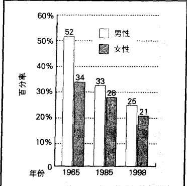

资料来源：作者根据 Statistical Abstract 2002: Table 184 整理而成。

---

然而数以百万的美国人——即使他们知道甚至只有一架飞机会失事，他们也不会考虑飞行——却仍在继续吸烟，为什么会这样？两个主要原因是吸烟上瘾和广告的作用。尼古丁可能会像海洛因一样让人上瘾(Tolchin,1988)。这听起来有些夸张，那就来看看伯格病(Buerger's disease)：

在这种疾病中，血管(尤其是供应大腿血液的血管)受到阻塞，只要尼古丁进入血液，就会妨碍血液流通。

如果一个病人继续吸烟，可能最终会有坏疽出现。首先一个脚趾可能被切除，然后是脚，然后是膝盖以下的小腿，最终到达臀部……病人被告知他们只要停止吸烟，就可以控制坏疽向腿部无情的蔓延。但一些外科医生发现，许多伯格病患者在他们作完第二或第三次切除手术的病床上，照样迫不及待地吞烟吐雾（Brecher et al., 1972）。

第二个原因是广告，在20世纪80年代，即使香烟广告在电视上被禁止播放，但它仍在报纸杂志和广告牌上作宣传。香烟工业有巨额广告预算，每年花费70亿美元鼓励人们吸烟，算下来一天就超过1800万美元（National Center for Chronic Disease 2001）。这个工业通过把吸烟与成功、时髦和独立联系起来而把目标指向年轻人。由于烟草工业的政治影响力和有4万美国人依靠这个工业生活，禁止香烟广告的努力失败了（Statistical Abstract 2002: Table 1254）。

### 恶化的环境

恶化的环境对人的健康同样有害。一些职业的健康风险是显而易见的，伐木、骑野牛竞技和驯狮是几个明显的例子。然而，在许多职业中，人们在他们认为安全的工作环境中工作多年之后才意识到风险。例如，在二战期间和二战后，有几百万人的工作涉及对石棉的处理，联邦政府估计他们中大约有1/4死于由于吸入石棉尘而得的癌症。其他一些我们不确定的物质，也很有可能会慢慢引发癌症——具有讽刺意义的是，其中包括一些石棉替代品（Meier，1987；Hawkers，2001）。

工业化提高了整个世界的生活水平，使成百上千万的人变得更加健康。具有讽刺意义的是，它也使人类的基本环境更加恶化，可能造成了有史以来对健康的最大威胁。碳燃料的燃烧导致了温室效应——可能改变全球气候、融化极地冰层、淹没海岸线的地球变暖。在冰箱和空调中使用的氟里昂气体已经把臭氧层击穿了一个洞，臭氧层是位于地球平流层以上的保护层，它过滤了大部分太阳紫外线。强烈的紫外线辐射对大部分生命形式都有害，对于人类，它会引发皮肤癌和白内障。土壤、空气和水的污染，尤其是通过核废物、杀虫剂、除草剂和其他一些化学物质所致，则对我们星球上的生命造成了另外的风险。

承认环境对健康的威胁仅仅是第一步,下一步是提出短期和长期的政策以减少这样的问题。第22章讨论的环境社会学对此有所涉及。

### 被误导、愚蠢和冷漠的实验

有时候,自以为是的医生和政府官员对人们的健康麻木不仁而不是加以保护。让我们看一下下面这两个臭名昭著的例子。

塔斯克吉(Tuskegee)梅毒实验 要了解“美国公共卫生服务”机构进行的这个恐怖实验，请阅读

---

第 15 章开篇短文。这里我们只是简要提一下：“美国公共卫生服务”机构没有告诉生活在密西西比河的399名非籍美国人他们感染了梅毒。医生们每年检查他们一次，记录症状并任其死于这一疾病。

冷战实验 现在假定你是内华达州的一名士兵，美国军队命令你所在的排穿过原子弹爆炸过的地方。因为你是士兵，所以你服从了。关于辐射，没有人知道更多，你不知道军队正在把你当做一只豚鼠来做实验：他们想看看你在没有任何防辐射装置的情况下能否挺过放射性尘埃。或者假定在1946年，你是罗彻斯特大学的一名病人，你非常相信你的医生，他说要给你一些能“帮助你”的东西。你很高兴，但结果是，他给你注射了铀(Noah，1994)。他和一组医生正在用实验研究多少铀会损伤到肾(U.S. Department of Energy，Advisory Committee)。

和塔斯克吉实验一样，这些辐射实验用毫不知情的人做实验品，仅仅是因为官方需要信息。当然还有其他一些实验。一些士兵给服用了致幻药。在佛罗里达的帕莫托，官员们向空气中释放百日咳病菌，这杀死了12名无辜儿童（Conahan，1994）。在其他实验中，像沙林这样的化学和生物药品被撒向军舰，来看看士兵们是否能挺过来。这些实验中的水手们穿着防护服，但他们并不知道他们正被当做小白鼠来做实验（Shanker，2002）。2003年，国会通过议案为这些因秘密实验而受到伤害的5842名士兵提供了健康医疗。

扮演上帝的角色 对于我们绝大多数人来说，政府官员和医疗部门如此无视人类生命，真是让人难以置信。但显而易见的是，这的确发生了。处于官员位置的人们有时会认为他们是上帝，可以决定谁生谁死。然而很明显，最可能牺牲的人是穷人和无权无势的人。像梅毒这样的实验做到富人和有钱人身上是难以想象的。精英们不会遭受这样无视人权和生命的实验。穷人要想避免这些专业人员滥用权力的伤害，唯一的办法就是公开每个已知的滥用实验的例子，并起诉那些应为实验负责的人。

这样的事情仍在发生吗？你认为呢？考虑一下医学研究是怎样做胎儿手术的。给没有出生的婴儿做手术的想法很有吸引力。这很可能会扩展医学知识，并可能使开拓者的名字出现在著名的杂志上。但这样的手术可能吗？试验结果可能需要付出生命的代价。为了减少风险，研究者首先对动物做试验，在提高他们的技术后，下一步对怀孕的波多黎各妇女做手术。在手术实验被证明有效后，主要的病人才会是未出生的白人和富人（Casper，1998）。在这个过程中采取的步骤，暴露了关于生命价值的潜在假设。就好像研究者认为自己正在一步步爬上进步的阶梯。

### 疾病的全球化

这一年是1918年，昨天看起来还很健康的男人和妇女却很快就崩溃并死亡。早晨，男人们沿着街道推车，像拾起昨晚扔在走廊上的垃圾一样，拾起尸体。连续几个月都是这样，有50万美国人死亡。在世界范围内，死亡人数达到2000万—4000万。(Phillips,1998)

是什么冷血杀手如此突然地袭击了美国和世界其他大部分国家呢？结果让人难以置信：是流感。出于目前未知的原因，一种致命的流感病毒变种突然出现了。

医学研究者担心像这样的事情会再次发生。如果确实发生的话，在1918年尚不存在的飞机旅行，可能会使其更加致命。全球旅行摧毁了过去常常可以控制疾病的自然界限。今天，实际上只需几个小时，飞机乘客就能将疾病传遍世界。但更老的疾病已经突变，并产生了对抗免疫系统的“超级病毒”，因此一旦发生疫情，死亡数量将会使1918年的数字相形见绌。

---

这正是人们所担心的。新疾病确实在世界范围内出现，而对许多疾病，抗生素都是无效的。因为某些新疾病是致命的，我们不得不求助于土方法——把人们隔离起来。1976年，依波拉病毒惊现于非洲。它具有特别恐怖的死亡形式，而控制它的唯一方法就是隔离整个扎伊尔地区（Olshansky，et al., 1997）。当SARS（严重急性呼吸系统综合症）病毒突然在2003年出现时，出于对该病毒席卷全球并在短期内造成大量人员死亡的恐惧，联合国世界卫生组织与美国疾病控制中心召开紧急会议。每一个感染SARS病毒的人都被隔离起来，一些城市和地区被宣布是危险的。旅游业萧条下来，但疾病得到了控制。世界卫生组织的官员们集体松了一口气，但仍担心会爆发另一种疾病。

### 寻找替代

让我们再一次转向美国医疗制度。对于美国医疗通常采用的方法，有什么替代性选择吗？一种最有可能的替代性手段是将重心从疾病治疗转向疾病预防。另一种被称为另类医学。在考虑了医疗的这些方法后，我们看一看其他国家的健康医疗制度，也许这三个主题提供了你可以遵循或避免的新观念。

### 治疗还是预防？

价值观和生活方式的影响 如果我们比较犹他州(摩门教徒的故乡，不赞成酗酒、咖啡因、烟草和婚外性行为)和邻近的内华达州(赌博业的故乡，在那里赌博业形成了一种相当不同的生活方式)，价值观和生活方式对健康的影响是显而易见的。虽然这两个州有着相同的收入、教育、城市化和医疗保健水平，但内华达州人更可能死于癌症、中风、心脏病、肺病和艾滋病。他们也更可能在车祸中丧生或是被谋杀和自杀(Statistical Abstract 2002: Table 104)。简言之——如同我们讨论肥胖症、吸烟和饮酒时提到的一样——许多对健康的威胁其实都是可以预防的。

即使众所周知，生活方式会影响健康，成百上千的美国人仍不知道“健康”与预防疾病的知识。学校和大众传媒宣传：健康的生活方式（有规律地锻炼身体、吃有营养的食物、保持适当的体重、不吸烟、不过度饮酒、不要有太多性伴侣）会带来健康和长寿。他们让我们知道，我们吃的食物是导致许多种癌症的重要因素。不用读太多书我们也知道富含脂肪的、低纤维的食物容易引发疾病，而吃水果、喝绿茶和有叶的蔬菜则会带来健康。

不幸的是，我们看到公众被分成两个群体：一个群体有规律地锻炼身体、注意饮食和体重；另一个群体则迷迷糊糊地长时间看电视、狼吞虎咽地吃薯条、奶酪和软饮料。面对快餐、赛事重播和光盘游戏的诱惑，人们忘记了这会导致生命的缩短和疾病的痛苦。预防需要锻炼，而疾病只需要医生开个药方。

这带给我们一个相关的问题:怎样使医生从开药方转向关注预防性治疗和“健康”呢?为了做到这一点,“健康”必须可以盈利,因为很明显,如果医生和医院仅是预防疾病,他们会得不到金钱。一种看起来有价值的建议,就是每年付给医生和医院一笔费用来保持人们健康(Cooper,1993)。一些健康维持组织正在意识到底线“健康”的益处,而不是仅仅通过让生病的病人尽快出院而获利。他们正试图使人们保持健康,不要成为病人。一些健康维持组织号召和鼓励其成员锻炼身体(Marcus,2003)。

当然还有更广义上的预防——尽力减少对人们健康有害的环境，和降低有害物品的使用。对那些把工业废气排放到大气中和把河流与海洋当做工厂下水道的行为，要给予严厉的法律制裁。同时也

---

要反对利用广告来诱使年轻人使用致命的毒品。最后，因为我们生活在地球村，健康环境的创造和保持也需要国际控制与合作。

### 另类医学

另类医学（alternative medicine）是指非(西方)传统型的医学，经常是指从亚洲国家引入的医疗做法。从传统西方医学理论与实践观点来看，大部分另类医学都是无稽之谈。西方医生认为它是无知的人们的迷信活动，对另类医学持一种歧视和敌对的眼光。最有名的另类医学是针灸。西方医生最初嘲笑针灸，因为它违背了他们对身体运行的理解。西医不能解释它的疗效，但病人对它的疗效却深信不疑。在经历了大部分医生的反对后，针灸在美国医学界慢慢地获得了承认。

因为病人开始了解另类医学并已开始寻找另类的治疗者，而不是去找西医（AMA），医生中对另类医学的兴趣也已上涨。一些用西方理论和实践培养的美国医生正在研究另类医学，我们甚至已经看到在某些地方，西方和东方的医疗方法正在被结合起来。在乔治亚州撒文纳的两家医院，西医和另类医生并肩工作。病人一边接受传统治疗，一边接受瑜伽、调养和Shirodhara疗法（用药草浸过的芝麻油慢慢地滴向病人的额头）。病人可能也会选择极限疗法（放开能量）、机能反馈疗法、中国的面部美容和芳香疗法（Abelson and Brown，2002）。时代变迁的一个信号是，斯坦福大学和马里兰医学院已经开设了医院，在那里病人能够接触到另类医学（Keates，2003）。

在美国，另类医学还是一种新生事物而难以评价，但最终医学研究者会作出可靠的评价性研究。除了评价外，这对社会学的重要意义在于，另类医学已经开始被一个专门俱乐部——美国医疗机构所接受。

### 全球视角下的健康医疗

对另类医学的研究，也将引领我们分析一下其他国家的健康医疗。最后，通过对工业化的三个不同国家的健康医疗比较，我们结束这一章。同教育的情况一样，没有一个国家能够很好地代表处在工业化特定阶段的各国所采用的不同的医疗形式。不过下面的“世界文化多样性”专栏中所列出的国家，确实阐明了整个世界健康医疗的主要特点。从文化视角分析它们的实践，有助于我们发现美国医疗卫生保障制度的积极与消极方面。

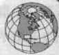

### 世界文化多样性

### 瑞典、俄罗斯和中国的健康医疗

### 工业化程度最高国家的健康医疗：瑞典

瑞典有着世界上最完善的健康医疗制度。国家医疗保险金来自政府和雇主，并覆盖所有的瑞典人和外国侨民。在瑞典，绝大部分医生都是为政府工作，除了小额咨询费，医疗和牙科治疗是免费的。政府还为路远的病人补偿旅费。处方费和住院治疗费也都微不足道（Sweydish Institute 1990）。

医疗只是瑞典从摇篮到坟墓的社会福利制度的一部分。例如，生病的人和因为小孩生病而必须呆在家的人可以得到90%的薪水。小孩出生后，瑞典允许父母休产假，而且有退休金保证。

然而，瑞典这种带有一些社会主义特色的医疗并不高效。瑞典仍未解决消除排队和鼓励医生“认真工作”这对孪生问题。因为不管看多少病人，医生的薪水都有保证，医生没有积极性，效率很低。当记者在一个工作日的早晨来到瑞典最大的医院访问

---

时，120个外科医生只有80人在岗，他们发现24个手术室有19个空着。这些空荡荡的手术室图片——考虑到要等1—2年才能做一次髋关节替换和白内障手术——引起了公众的愤怒(Bergstrom，1992)。

伴随着公众要求改变这种形势的压力，1999年，瑞典立法者作了180度的大转弯，他们认为竞争会产生效率，应该摒弃社会主义模式。他们已经开始这样作了：他们渐渐地将医疗系统转变成私人产业，政府把一些医院卖给私营公司，并与之建立合同关系，而不是把他们变成政府雇员（“Social Darwinism …”2001）。目前我们尚不知道当这种转变完成的时候，瑞典的医疗制度会是什么样。

### 正在进行工业化国家的健康医疗：俄罗斯

俄罗斯向资本主义的痛苦转变，已经将它的经济政治制度带到了崩溃的边缘。它不能偿还债务，仅仅通过向世界银行紧急贷款才保持了国家稳定和不破产——而这仅仅是因为发达工业国家担心俄罗斯陷入无政府状态会导致核灾难。

俄罗斯的健康医疗制度同样一团糟。在社会主义时代，俄罗斯建立了一种大部分人都能享有的医疗制度。像这个国家的生产制度一样，健康医疗制度也是中央集权的。政府拥有医学院，并且决定在什么专业培养多少学生。政府制定医生薪水标准支付给他们，并决定他们在哪里工作。

原有的医疗制度已经分崩离析，人口的健康也在下降。一个例子就是莫斯科的救护车过去常常是高效的——拨打03后，不出几分钟救护车就会到达，现在则要等上8—12小时，因为司机正在用救护车当出租车，他们要让急病号等一等(Field,1998)。

俄罗斯唯一一家可以和美国医院相比的医院留给精英们使用(Light,1992)。其他医院条件极其糟糕。病人必须自带床单、药品和注射器到医院。一些医院甚至没有一个医生在岗，外科手术刀被重新磨快，直到用到断裂，有时甚至剃须刀片也被用来做手术(Denlson,1992)。一些医生面临着要么不使用麻醉剂，要么就不做手术的选择(Paddock,1999)。医生的收入是如此的低，以至于他们为了获得食物不得不自己种植土豆。他们要步行工作，因为他们承担不起坐公共汽车的一毛钱费用(Goldbery and Kishkovsky,2000)。

但俄罗斯的医疗也有闪光点，虽然工资低廉，医生们仍在坚持工作。许多医生被理想和助人的愿望所激励，他们相信情况总会好转。另一个闪光点是一些医生转作私人业务，这会成为一种新的医疗体系的开端(Goldbery and Kishkovsky,2000)。

与此同时，俄罗斯的医疗体系则是分裂的。下面的例子生动地说明了这种混乱状况：

在一所西伯利亚医院，三个病人在监护病房中昏迷不醒，只是通过医院的生命维持系统来维持生命。他们两个是老人，另一个39岁。

星期三，医院从当地电力公司收到一封电报：“你们已经五年没交电费了，共欠94931美元，必须全部付清，否则停电。”第二天上午6点，电力公司停止供电。40分钟后，三个病人都死了。（Paddock，1999）

社会主义时代里多年的环境退化，也使人们付出了代价。严重的婴儿缺陷比率，已经上升到美国的4倍。可能的罪魁祸首是几十年来对核泄漏的不负责任(Spector,1995)。表19.4中的预期寿命可能是表明俄罗斯卫生恶化的最好指标(Cockerham,1997)。从20世纪60年代以来，预期寿命开始下降。预期寿命不仅是医疗问题，而且是社会健康的晴雨表。

### 工业化程度最低国家的健康医疗：中国

因为这个国家有13亿人口，并且缺少训练有素的医生、医院和药品，大部分中国人得病都去看“赤脚医生”——他们只有一些基本知识，被付给低廉的工资，从一个村走到另一个村工作。因为重视草药和针灸，中国的医学与西方有很大不同。虽

表 19.4 卫生指标

<table border=1 style='margin: auto; word-wrap: break-word;'><tr><td style='text-align: center; word-wrap: break-word;'></td><td style='text-align: center; word-wrap: break-word;'>瑞典</td><td style='text-align: center; word-wrap: break-word;'>美国</td><td style='text-align: center; word-wrap: break-word;'>俄罗斯</td><td style='text-align: center; word-wrap: break-word;'>中国</td></tr><tr><td style='text-align: center; word-wrap: break-word;'>预期寿命</td><td style='text-align: center; word-wrap: break-word;'>79.2年</td><td style='text-align: center; word-wrap: break-word;'>77.3年</td><td style='text-align: center; word-wrap: break-word;'>67.3年</td><td style='text-align: center; word-wrap: break-word;'>71.6年</td></tr><tr><td style='text-align: center; word-wrap: break-word;'>婴儿死亡率a(%)</td><td style='text-align: center; word-wrap: break-word;'>3.9</td><td style='text-align: center; word-wrap: break-word;'>6.8</td><td style='text-align: center; word-wrap: break-word;'>20.1</td><td style='text-align: center; word-wrap: break-word;'>28.1</td></tr><tr><td style='text-align: center; word-wrap: break-word;'>出生率b(%)</td><td style='text-align: center; word-wrap: break-word;'>11.7</td><td style='text-align: center; word-wrap: break-word;'>14.2</td><td style='text-align: center; word-wrap: break-word;'>9.4</td><td style='text-align: center; word-wrap: break-word;'>16.0</td></tr><tr><td style='text-align: center; word-wrap: break-word;'>死亡率b(%)</td><td style='text-align: center; word-wrap: break-word;'>10.8</td><td style='text-align: center; word-wrap: break-word;'>8.7</td><td style='text-align: center; word-wrap: break-word;'>13.9</td><td style='text-align: center; word-wrap: break-word;'>6.7</td></tr><tr><td style='text-align: center; word-wrap: break-word;'>卫生费用占国民生产总值百分比</td><td style='text-align: center; word-wrap: break-word;'>8.6</td><td style='text-align: center; word-wrap: break-word;'>12.9</td><td style='text-align: center; word-wrap: break-word;'>2.3</td><td style='text-align: center; word-wrap: break-word;'>不详</td></tr></table>

a 每 1000 个活的初生婴儿。b 每 1000 个人。

资料来源：FIELD 1998; Statistical Abstract 1998; Table 1345, 1348; Statistical Abstract 2000; Table 1355, 1358; Statistical Abstract 2002; Table 1312.

---

然西方人嘲笑中国的方法，但有些人已经渐渐改变了他们的观念。例如，一种被中国人用了1000多年的用来治疗肝病的药草，已被西方试验证明能有效地减少肝癌的发生（Tanouye，1995）。

像俄罗斯一样，当中国向市场经济转变时，它的医疗制度也面临改革(Rosenthal,2001d)。一些医生收入太低，以至于不得不作其他的兼职。个别医院在接纳病人前需要病人交纳保证金，有一家甚至要到724美元。这听起来可能不多，但别忘了中国人均年收入是286美元(Wonacott,2003)。个别医生在手术前也要钱，这些手术医生把消完毒的手臂擎在半空，却拒绝进入手术室，直到病人亲属向他们的口袋里装入现金才开始手术(Sampson,1992)。

### 思考题

没有哪个国家的医疗制度是完美的，每个国家都面临着“需求太多，费用太高”的危机（Moore and Winslow，1993）。你认为在哪些方面美国医疗制度优于和差于瑞典、俄罗斯和中国的医疗制度呢？如果可以，你会选择哪个？为什么？因为违背美国的价值体系而没有建立起来的社会化医疗制度，或许是解决本章提到的美国医疗问题的强大力量。

### 医疗的未来

预测未来总是有风险的，因为在未来的道路上，总会有许多不可预知的事件和变数。然而，有些趋势是很明显的，我们可以预见美国医疗会继续采用付费服务的办法，仍会以社会不平等为标志，以及有更多的女性会成为医生。如同另类医学的发展趋势一样，使用因特网来自我诊断和自我开药将会更加普遍。尽管其健康风险越来越为人所共知，酒精和尼古丁仍将继续被滥用，然而，吸烟人数将会继续下降。

但更重要的趋势是人类基因知识的快速发展,以及应用这些新技术改善人类的健康。这些知识和科技的变化,将会改变医学的面貌,随之,我们对健康和医疗的期待也将改变。这种变化及其后果在下面的“社会学和新技术”专栏中有进一步的讨论。

### 社会学和新技术

### 基因图: 即将到来的生物经济条件下的医学

你和你的朋友得了同样的疾病。你们去看同一个医生。在给你们两个人作了检查后，她将你们的基因图表上传到医药公司，医药公司将设计一种与你们每个人的独特的基因结构相匹配的药物。当你进入药店时，你可以得到为你量身定做的、在分子水平上治病的药物。

医生告诉你坏消息,你得了不能治愈的心脏病——至少在过去是不可治愈的,但现在你则可以到新器官诊所,在那里预定一个新心脏。这个心脏会非常匹配,因为它是用你自己的细胞培植的,这样你可以轻易地把生命延长大约50年。

这些场景夸张吗？决不夸张。基因学，即研究基因以及它们如何与疾病和健康相联系的科学，注定会改变医学的面貌。发生在2001年的一些关键事件，如人类基因系统图谱的绘制和干细胞研究的突破，将会使我们在有生之年看到这些景象变为现实。

还不止这些。在出生时，每个儿童的基因链都被录入光盘，这些记录将使医生在许多健康问题出现之前就治好它们。不是等着症状出现，相反，医生将会检查你的基因记录以发现你在生物上注定会得的疾病——然后剪断坏的分子，结合进新的分子，从而使你永远不会患上这些疾病。

至少，如果你很富有，这些都有可能发生。

没有哪项新技术不带有负面效果。基因光盘

---

不仅加剧了社会不平等，而且它们对于保险公司和雇主来说也是极有价值的信息。要预测将来的健康情况，需要有基因图。如果保险公司知道某人将遭遇虚弱的疾病，谁还会为他保险呢？谁还想雇用他们呢？实际上，谁又想与他们结婚呢？

### 思考题

假定你刚从大学毕业。你拿着你的新学士学位，去参加第一次工作面试。面试者说你看起来非常适合这项工作，然后向你要一份基因图光盘拷贝。你认为未来的雇主有权利查看你的基因结构吗？你可以用符号互动论来思考这个问题。如果你是雇主，你的答案会有什么改变吗？雇主应该雇用更加健康的工人，这难道有什么不对吗？

假定你去申请健康保险,保险公司不仅要你的病历,而且要你的基因光盘,你认为应该给他们吗?为什么?

假定你已经恋爱并正考虑结婚。一天晚上，当你正憧憬未来的时候，你的爱人对你说：“我爱你，但直到我们的基因光盘被生物研究者检查后，我们才能结婚。如果我们没有某些健康风险，那么……”你同意这样做吗？

资料来源: Cowley and Underwood (2000); Licata (2001); Wilensky (2001).

### 本章小结

### ☆社会学和医疗研究

在医疗研究中，社会学扮演着什么角色？

社会学家把医疗看做一种社会机构进行研究。正如发生在美国的情况,医疗的三个主要特征是:专业化、科层化和趋利动机。

### ☆符号互动论视角

符号互动论者关于健康和疾病的观点是什么？

健康不仅是生物问题，而且与社会密切相关。疾病也远非客观的事实，因为疾病总是从文化的框架来考虑的。群体不同，对身体和心理状况和疾病的定义也不同。

### ☆功能主义视角

功能主义关于健康和疾病的观点是什么？

功能主义者强调，作为免于承担责任的代价，人们不得不接受病人角色。他们有义务去寻找有能力的医疗帮助，并配合治疗，以迅速恢复健康和正常的活动。

### ☆冲突论视角

关于健康和疾病，冲突论的观点是什么？

健康医疗是群体竞争的稀有资源之一。在全球层次上，健康医疗遵循着我们在第9章中所讨论的分层机制。在工业化国家中有最好的卫生医疗，而在工业化程度极低的国家中，卫生医疗水平最差。

在美国殖民地时期，要成为医生并不需要训练和许可证。直到20世纪早期，医疗训练一直是可有可无的。1910年，医生的教育被一群人控制，他们清除大部分竞争对手，垄断了医学，并使其成为美国最大的商业。

### ☆健康的历史模式

健康模式是怎样随着时间转变的？

---

美国的疾病模式变化如此广泛，以至于今天的前十个致命杀手中有五个并未出现在1900年的前十名中。因为大部分美国人都比他们的祖先活得更长，我们可以认为他们更加健康。对于心理疾病，我们无法对现在和过去的状况进行比较，因为我们没有进行比较的基线。

### ☆健康医疗中的问题

### 把健康医疗作为一种商品是怎样导致社会不平等的？

因为健康医疗是一种被卖给出价更高的人的商品，美国存在着二等级医疗制度。对于心理和身体疾病，穷人只能获得较差的卫生医疗。

### 美国卫生医疗还有什么其他问题？

一个是防御性医疗问题，它是为了医生的利益而不是为了病人的利益所实行的医疗程序，意在使医生免于诉讼，这些化验和咨询极大地增加了国家医疗费用。其他问题包括医疗事故、去人性化、利益冲突、医疗欺骗和性别歧视。

### 为什么医学帮助下的自杀现在仍是一个问题？

凭借先进的技术，即便人们没有脑波动，他们也能靠技术存活。那些公开帮助自杀的医生已经遭到了严厉的批评。在荷兰，关于安乐死的研究结果，进一步激发了这种争论。

### 为了减少医疗费用，人们采取了什么措施？

成立健康保持组织和相近诊断组是已经采取的措施。招致大量反对的国家健康保险也已提出。最有争议的建议是配给医疗。

### ☆对健康的威胁

这里讨论的是艾滋病(这在美国已经开始下降,但在撒哈拉南部非洲仍很猖獗)、肥胖症、酒精和尼古丁、恶化的环境、不道德的实验(塔斯克吉梅毒实验和冷战辐射实验是其中两个例子),还有疾病的全球化。

### ☆寻找替代

对于我们当前的卫生医疗制度有替代物吗？

这里讨论了两个替代物：一个是重心从治疗向预防的转变，一个是另类医学。为了便于比较，我们参考了瑞典、俄罗斯和中国的卫生医疗制度。

### ☆医学的未来

基因学将会改变医学的面貌。我们对基因结构的了解，将会使量身定做的医药、在疾病出现前进行治疗、包括心脏在内的替代性器官的发展，都成为可能。

### 批判思考题

1. 本章的一个主要问题是：医疗是一种权利还是一种商品？这两种观点分别有哪些论据支持？

2. 价值观和生活方式是怎样影响健康的？这与社会学有什么关系？

3. 你经历过另类医学的治疗吗？或者你知道谁经历过吗？如果是这样，这种治疗(以及在这种医疗问题背后的理论)与标准治疗有什么区别？