# 第 20 章 人口与城市化

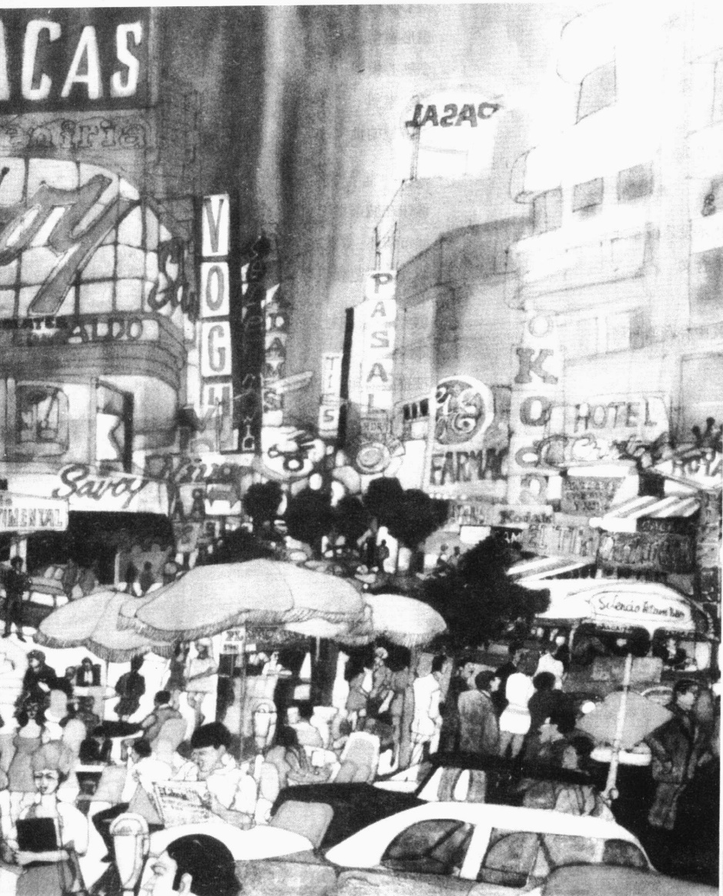

富兰克林·麦克马洪

《亚伯拉罕·林肯大道》

---

· 全球视野中的人口问题

·一个没有空间去享受生活的星球？

新马尔萨斯主义者

反马尔萨斯主义者

谁对谁错？

为什么人们会挨饿？

· 人口增长

为什么工业化不发达国家会有那么多小孩？

不同增长率的含义

三个人口学变量

预测人口增长中存在的问题

城市的发展

城市化进程

美国的城市模式

· 城市增长的几种模型

同心圆模型

扇形模型

多核心模型

边缘模型

对模型的批判

·城市生活：疏离与社群  

谁住在城市里？  

城市情怀：寻找一个熟悉的世界  

不介入规范和责任分散

· 城市问题和社会对策  

郊区化  

投资减缩和去工业化  

农村的复兴  

城市复兴的势头

·本章小结

---

### 第 20 章 人口与城市化

那幅景象依然萦绕在我心头：席琳，30岁，她隆起的肚子预示着她第13个孩子就要来到这个世界上。而她最大的孩子才仅仅14岁。用我们的标准来看，他还只是个小男孩而已，然而他接受学校教育的生涯已经到此为止。每天一大早，他都要跟随大人一块下地干活。每天直到暮色黄昏，他才拖着疲惫的身子，从亚热带炎阳下的劳力活中收工回家。

我住在墨西哥的科利马，席琳和安吉尔邀请我去吃晚饭。他们的家，明确地反映出这个家庭的贫穷。14个家庭成员住在一个只有一个房间的茅草房里。晚上，父母和较小的孩子挤在一张双人床上，最大的孩子睡在吊床上，就像村里许多家庭一样，其余的孩子就睡在铺在脏地板上的席子上。

他们的家几乎没有装修过。它只有一个燃气灶，一张桌子，一个被席琳用来装一些厨具和陶瓷餐具的橱柜。由于没有壁橱，衣服只好挂在墙钉上。也没有椅子，一把也没有。我已经习惯了这个村子的贫困，但这次却使我非常吃惊。这个家实在太穷了，连一把椅子也没有。

席琳微笑着告诉我,她是多么期待她下一个孩子的来临。但是她真是这么想的吗?很难想象其他妇女是否愿意处在她的位置上。

然而席琳是很认真的,她现在的心情与怀第一个孩子时一样满怀希望。当然,她在怀中间所有孩子时也是这样的。

为什么席琳在这么贫穷的状况下还想要那么多孩子？这个问题困扰着我，我一直想找出答案。本章会帮助我们找到答案。

### 全球视野中的人口问题

席琳的故事把我们引入到人口学研究的核心内容：人口的规模、构成、增长和分布等问题。它使我们面对这样一个现实问题：我们注定要住在一个拥挤得实际上连一点空间也没有的世界上吗？我们的地球能养活不断增长的人口吗？长期的饥荒和许多人挨饿，会是我们的悲惨命运吗？让我们先来看一下这些担心源自何处，然后听听现今的人口学家是如何说的。

### 一 个没有空间去享受生活的星球？

事情的缘由得从土豆说起。当时欧洲人还不知道什么是土豆，当西班牙入侵者发现安第斯山居民食用这种蔬菜后，他们就把它带回去。一开始，欧洲人对它抱持一种怀疑态度。不过，渐渐地，土豆成为下层阶级的主食。这样，随着食物的充足，出生率开始增长，死亡率则开始下降，欧洲的人口也就急剧增长，在18世纪几乎翻了一倍（Mckeown，1977；McNeill，1999）。

---

在早几代人时，大家庭是很普遍的。拥有许多孩子的好处是在农作物种植、食物生产和准备吃的方面多些帮手。随着国家的工业化和城市化的发展，这反而成了一个反功能。抚养孩子的费用变高了，并且他们不再具有生产的功能。结果，随着人口转型进入第三个阶段，家庭的规模变小了。今天，像图片中这样规模的家庭已从美国消失了。（注意最左边那个男孩子穿的裤子，那曾经是他父亲穿过的。）

托马斯·马尔萨斯(Thomas Malthus，1766—1834)，一位英国经济学家，把人口的急剧增加看成是一种灾难的征兆。1798年，他写了一本名著——《人口原理》(First Essay on Population，1798)。在这本书中，马氏提出了著名的马尔萨斯定理(Malthus theorem)。他指出，当人口以几何级数（从2到4、8、16等等）增长时，食物供应只能以算术级数（从1到2、3、4等等）增长。这就意味着，如果不控制人口的出生，整个国家、甚至整个世界的人口需求，迟早会超出食物的供应量。

### 新马尔萨斯主义者

马尔萨斯对吗？这个问题成为人口学家热烈讨论的焦点。一些人认为今天的形势如果不比马氏想象的严峻，至少也与马氏想象的一样恶劣，这些人可被称为新马尔萨斯主义者。例如，世界人口增长是如此的快，当你读完这一章时，又有15000—20000个婴儿出生。到明天的这个时候，地球上将有几乎25万人等着被抚养。这种增长一个小时接着一个小时，日复一日，永不停滞。图20.1显示了这种增长。

新马尔萨斯主义指出，世界人口增长呈指数增长曲线。这意味着，当人口成倍增长在一段时间内达

图 20.1 世界人口增长的速度

<table border=1 style='margin: auto; word-wrap: break-word;'><tr><td rowspan="5">加 减</td><td colspan="5">一天的结果</td><td colspan="4">累积性增长</td></tr><tr><td colspan="5">出生</td><td rowspan="2">每分钟151</td><td rowspan="2">每小时9043</td><td rowspan="2" colspan="2">每天217000</td></tr><tr><td colspan="5">死亡</td></tr><tr><td colspan="5">人口增长</td><td rowspan="2">每周1523000</td><td rowspan="2">每月6600000</td><td rowspan="2" colspan="2">每年79000000</td></tr><tr><td colspan="5">等于</td></tr></table>

资料来源：作者根据 Haub(2002c)整理而成。

---

到某个转折点时，人口增长便会突然加速。为了说清指数增长的深远含义，社会学家威廉·方斯(Faunce，1981)讲了一个穷人救富人一命的寓言故事。那个被救的有钱人打算奖励穷人的英勇行为。

穷人表示他希望奖励能持续四个星期，而且每天得到的奖励是他前一天获得的量的两倍。他还说在第一天只想要一分钱。富人听后感到非常开心，因为这个穷人太好打发了，于是当即就给了他一分钱。在第一个周末，当富人算出他仅欠穷人1美元27美分时，他很是兴奋。到第二个周末他也仅仅是欠163美元83美分。然而在第21天，富人很吃惊地发现总额增长到了20971美元51美分。当第28天到来时，他吃惊地发现，仅是这一天他就欠了1342177美元28美分，而总额已经涨到2688354美元56美分！

这就是使新马尔萨斯主义者感到惊恐的地方。他们认为，人类只是刚进入指数增长曲线的“第四个星期”。图20.2表明，为什么他们认为现在离“付账”的那天已经非常近。他们指出，在大约1800年，人类人口第一次达到10亿。然后用了130年（直到1930年）人口增长到20亿。仅仅在30年后（1960年），人口马上到了30亿。而增长到40亿的时候时间已经缩减到一半：仅仅用了15年（1975年）。又过了12年（1987年）人口达到50亿，12年后（1999年）终于达到了60亿。

图 20.2 2000 年内世界人口的增长

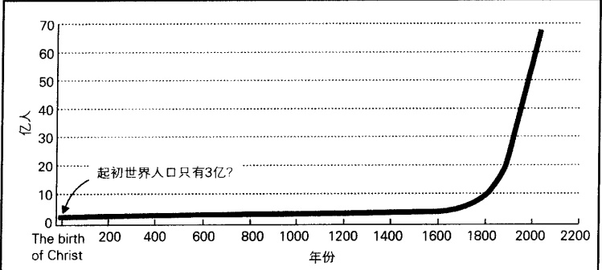

资料来源：根据 Piotrow (1973:4) 与 Haub (2002a) 绘制而成。

为了说明这种增长，新马尔萨斯主义者举了一些非常令人吃惊的数据为例。他们注意到，在工业革命前，使人口翻倍要用1600年，但是现在人口翻倍仅需40年——比以前快了40倍(Cohen,1996)。同时，在公元前8000年到公元1750年间，世界平均每年增长67000人，但是现在，每7个小时就可以增长那么多人(Weeks,1994)。

新马尔萨斯主义者指出，很明显，随着越来越多的人来到这个世界，资源将会变得越来越紧张。

### 反马尔萨斯主义者

所有的一切都很明显，没有人希望住在接踵摩肩的地球上，并为争夺残羹剩饭大打出手。那么，其他人又是如何与新马尔萨斯主义者争论的呢？

---

图20.3 人口的转型

<table border=1 style='margin: auto; word-wrap: break-word;'><tr><td style='text-align: center; word-wrap: break-word;'>出生率</td><td rowspan="2">人口增长</td><td rowspan="2">人口缩减</td></tr><tr><td style='text-align: center; word-wrap: break-word;'>死亡率</td></tr><tr><td style='text-align: center; word-wrap: break-word;'>第一阶段</td><td style='text-align: center; word-wrap: break-word;'>第二阶段</td><td style='text-align: center; word-wrap: break-word;'>第三阶段</td></tr><tr><td style='text-align: center; word-wrap: break-word;'>人口平衡: 出生率与死亡率平衡</td><td style='text-align: center; word-wrap: break-word;'>人口快速增长: 出生率远远高于死亡率</td><td style='text-align: center; word-wrap: break-word;'>人口平衡: 出生率下降 出生率与死亡率平衡</td></tr></table>

注：标准的人口转型是第一—三阶段，第四阶段是最近由一些反马尔萨斯主义者提出的。资料来源：作者本人整理而成。

一群持乐观态度的人口学家看到的是一幅更为遥远的不同的画面，我们称其为反马尔萨斯主义者。他们认为，欧洲的人口转型（demographic transition），为我们描绘了一幅关于未来的更为准确的图景。这个转型可用图20.3来表示。在大部分历史时期，欧洲都处在第一阶段。由于高死亡率抵消了高出生率，所以它的人口几乎保持年年不变。然后到了使马氏沮丧的被称为“人口爆炸”的第二阶段。出生率依然高涨，而死亡率则下降了，所以欧洲的人口迅速增长。最后，欧洲转向第三阶段：随着控制人口出生率，并使之保持与低死亡率的平衡，人口增长渐渐平稳下来。

反马尔萨斯主义者说，这种转型最终也会出现在工业化不发达国家。它们现在人口的高速增长，意味着它们已经达到人口转型的第二阶段——杂交粮食和从工业化发达国家进口的药品，使死亡率大幅下降，但出生率依然居高不下。当它们转向第三阶段时(这是一定会的)，我们就会对人们先前的大惊小怪感到不可思议。事实上，增长的减缓已经开始出现了。

### 谁对谁错？

可以看出，新马尔萨斯主义者和反马尔萨斯主义者都看到了历史趋势，并着眼于未来。新马尔萨斯主义者强调世界人口持续增长的一面，并时刻保持警醒；反马尔萨斯主义者指出工业化不发达国家的人口转型将进入第三阶段，并充满信心。

工业化不发达国家处于人口转型的第二阶段，这是没有疑问的。但现在的问题是，它们能顺利进入第三阶段吗？二战后，西方国家对全球输出它的杂交种子、除草剂、公共卫生技术。随着食物供应的增长和健康状况的改善，工业化不发达国家的死亡率急剧下降，但由于出生率维持在高水平，因此人口急速增长。像200年前马氏说过的一样，人口学家预测，如果不立即阻止人口爆炸式增长，在全球范围内将会出现大灾难（Ehrlich and Ehrlich，1972，1978）。

我们可以用冲突论观点去理解，当这些信息被工业化发达国家的首脑得知时，会发生什么事情。他

---

我们认为，工业化不发达国家急剧增长的人口，是对他们苦心经营的权力均衡的威胁。随着较穷国家人口的膨胀，它们也许会消耗掉地球资源的一大部分。这些首脑们把联合国当成随心所欲的工具，率先利用它降低世界人口的增长。效果很显著，工业化不发达国家的人口出生率已从20世纪60年代的2.1%的平均年增长率降到今天的1.6%（Haub and Yinger，1994；Haub，2003）。

对于这些变化，新马尔萨斯主义者和反马尔萨斯主义者有着有显著不同的看法。在反马尔萨斯主义者看来，人口的减缓增长正是他们一直等待的——人口转型的第三阶段就要来临了。先是工业化不发达国家死亡率的下降，再就是现在，正如他们所预测的，出生率也开始下降。不知道读者注意到没有，他们说过，使人口达到第五个10亿需要12年，再过12年后人口总数达到了60亿。而新马尔萨斯主义者则回应道，减速的人口增长仍然会预示着灾难，只不过它到达的时间延长了一些而已（Ehrlich and Ehrlich，1997）。

反马尔萨斯主义者这样反击：我们的未来会与新马尔萨斯主义者担心的相反，即世界上的孩子会变得非常少，而不是太多。不是人口膨胀将成为全球性问题，而是人口缩减（population shrinkage），即人口会越来越少。他们指出，世界上已有65个国家的出生率降到不足以维持国家人口数量平衡的程度。欧洲所有42个国家都处于这种形势（Haub, 2003）。它们拥有的棺材数比摇篮还要多。

一些反马尔萨斯主义者甚至预言了一个“人口的自由落体”（Mosher，1997）。随着越来越多的国家进入人口转型的第四阶段，世界人口将会达到约80亿或90亿的顶峰，然后开始减少。他们认为，今后200年，我们会看到世界上的人口会少很多。

谁对谁错？现在下结论尚早。就像谚语中的悲观主义者看到的是水杯中空的一半一样，新马尔萨斯主义者以消极的观点看待世界人口转变。而反马尔萨斯主义者则像乐观主义者看到半杯水满的一半，他们对未来人口转变持有积极的看法。在我们人生未来的一段日子里，也许我们会知道最终的答案。

### 为什么人们会挨饿？

看到挨饿孩子的照片,使我们的良心承受着不安的折磨。我们生存在物质富裕的环境里,而这些孩子和他们的父母却在我们眼前挨饿。为什么他们缺乏食物?是因为穷人太多?还是仅仅是由于世界范围内生产的大量食物根本到不了他们手里?

挨饿的人们，诸如这张照片中的母亲和她的孩子，会不时出现在美国人和其它工业化最发达国家人们的脑海里。我们当中的许多人都在疑惑：为什么在一些人挨饿的同时，我们却生活得如此富裕，经常吃得过多，甚至经常把吃剩的食物扔进垃圾箱？文中讨论了这些不合理的差距产生的原因。

---

图 20.4 世界人均粮食产量

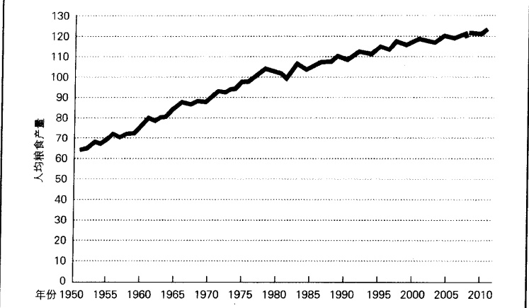

注：1979—1981=100。1975—1991是联合国的数据；1975年前的数据是根据从Simon到1979—1981的重新转化；1998年以后的数据是作者的预测。

资料来源：作者根据 Simon (1981:58); United Nations Statistical Yearbook: 1985—1986; Table 7; 1990—1991; Table 4; Statistical Abstract 1999; Table 1394, 包括前些年的资料整理

反马尔萨斯主义者提出了一个似乎无可反驳的观点。正如图 20.4 所示，现在我们能为地球上每个人提供的食物比 1950 年时多得多。尽管现在的世界人口比 1950 年时多 2.5 倍，但经过改善的种子和化肥技术，使每个人都能获得比以前更多的食物。由于生物工程学家正在寻求农业技术上的突破，因此我们会生产出更多的食物。联合国估计，即使没有生物工程的努力，我们至少在接下来的 30 年中仍有足够的食物维持世界日益增长的人口的需要 (United Nations 2000)。

那为什么还会有人死于饥饿呢？原因在于，不是由于生产的食物不够而导致饥荒，而是因为部分地区缺乏食物。而干旱和战争又是导致缺乏食物的主要原因。正如干旱会使粮食减产或绝产一样，战争也一样。经受内战蹂躏的国家，游击队或者没收或者烧掉庄稼，而农民则逃进城里。在一些国家粮食生产被中断的同时，另一些国家的粮食产量则大大超过人们的消费量。在亚洲国家遭受干旱和国内战争袭击而导致数以百万的人饿死的同时，美国政府则正在给他们的农民补偿因国家要求减少粮食生产的那部分收入。美国的问题是粮食过量，非洲西部的问题则是粮食太缺乏了。

新马尔萨斯主义者对这一观点进行了反击：世界人口仍在增长，但我们却不知道地球生产足够的粮食还能持续多久。他们提醒我们，报酬每天都在翻倍。关于地球什么时候不能生产出足够的粮食，这只是个时间问题，不是“是否”，而是“什么时候”的问题。

新马尔萨斯主义者和反马尔萨斯主义者都提出了一些重要的观点，但理论毕竟不能消除饥荒。正在挨饿的孩子一直出现在电视和杂志的画面上。他们瘦小干枯的身子和肿胀的肚子拷问着我们的良知，并告诉我们要做一些事情。不管这幅人类的悲惨境遇的深层原因是什么，我们还是有一个简单的解决办法：把食物从盈余的国家里转移出去。

---

那些挨饿的非洲人的图片给人们的一个印象是非洲人口过剩。还会有其它别的原因导致人们挨饿吗？事实远非如此。非洲拥有世界22%的土地，但人口只占世界人口的14%（Nsamenang，1992；Haub，2003b）。所以，非洲饥荒的原因不可能是人多地少。相反，非洲事实上拥有大量未被开垦的肥沃土地。

### ☑ 人口增长

即使饥荒不是由人口过剩，而是因为食物分配不均引起的，事实仍是工业化不发达国家的人口增长速度比工业化发达国家快大约16倍，前者年增长率为1.6%，后者仅为0.1%。

图 20.5 世界人口增长: 1750—2150 年

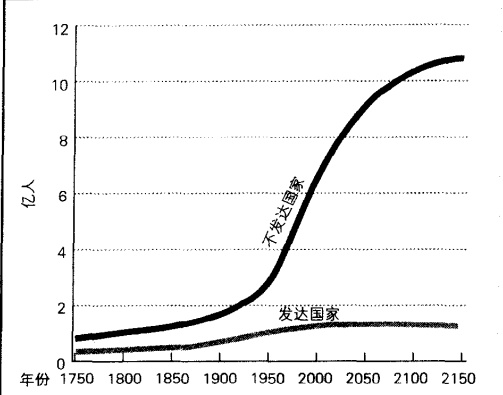

资料来源：“The World of the Child 6 Billion”, 2000。

按照这样的增长速度，工业化发达国家人口翻倍需800年时间，而工业化不发达国家只需42年(Haub and Cornelius, 2001)。图20.5从一个严峻的视角展示了这个问题。你可以看到，工业化不发达国家人口迅速增长，而工业化发达国家则几乎不增长。

### 为什么工业化不发达国家会有那么多小孩？

为什么越是养不起孩子的贫穷国家的人越是会有那么多的孩子？为了弄清这个问题，让我们想想为什么席琳会那么高兴地迎接她的第13个孩子。在这里，我们需要运用符号互动论观点，即我们必须扮演他人的角色，以使我们能从席琳和安吉尔的角度出发看问题。正如我们身处的文化会影响我们作出的选择一样，他们的选择也是文化作用的结果。而他们的文化告诉他们的则是，12个孩子是不够的，他们必须有第13个，甚至第14个、15个。这到底是怎么回事？我们找出了三个原因来解释：为什么养育众多孩子能在全世界数百万穷人生活中发挥关键作用。

首先是父母的身份地位。在工业化不发达国家，母亲的身份是一个妇女获得的最高荣誉。一个妇女生的孩子越多，她就会被认为实现了越多的人生价值。类似地，一个男人通过父亲的身份来体现大丈夫气概。他有越多的孩子(尤其是男孩)就越好，这样他的家族就能延续下去。

其次，社区支持这种观点。席琳和像她一样居住在那个社区的人拥有相同的价值观，人与人之间在各方面非常相似。在他们的社区，孩子被看成是上帝的恩赐。因而，一对夫妇拥有越多孩子越好。人们通过养育孩子来体现社区的价值观和获得自己的地位。不育的妇女，而不是有一打孩子的妇女，是很可怜的。

这些原因给多育带来强大的动机。然而还有第三个刺激因素，即对于工业化不发达国家来说，孩子是经济财富。由于这些人缺乏社会保障，也没有医疗和失业保险，所以促使他们养育更多孩子。父母为的是在生病、老得不能工作或找不到工作时，依靠孩子照顾自己。拥有越多的孩子，获得支持的力量越大。而且，就像席琳和安吉尔最大的男孩一样，孩子在小小年纪时就能对家庭收入有所贡献(见图20.6)。

在生活于工业化发达国家的人看来，生育那么多孩子似乎是不可思议的。然而，运用符号互动论的

---

图 20.6 穷人需要很多孩子的原因

注：孩子是不发达国家家庭的经济资产。根据一项在印度尼西亚的调查，以下数据显示了孩子在9或10岁时就能成为家庭纯收入的来源之一。

资料来源: U.N. Fund for Population Activities。

观点,从居住在那里的人们的思维框架出发,我们就能理解多育是一个多么合理的观点。例如,以下是一位在印度工作的政府工作人员经历的一件事:

撒曼·辛格是一位非常穷的挑水工人……他邀请我进屋，递给我一杯茶（他后来自豪地告诉我，这杯茶是掺了奶和糖的）。他说：“你们以前一直劝我不应再生孩子。但你现在看到了吗？我有6个儿子、2个女儿，我现在可以坐在家里休息了——他们长大了，会赚钱给我花了。有一个还在村外做工赚钱。你们曾跟我说我很穷，支持不了那么大的家庭，现在你看到了吧，正由于我拥有那么大的家庭，我才成为了一个富有的人。（Mamdani，1973，斜体字后加）

为什么贫穷国家的妇女多育，冲突论学派给我们提供了另一个不同的视角。他们认为，席琳已经把支持男性处于统治地位的价值观内化了。在拉美，强调男性统治的大男子主义气概非常普遍。养育很多孩子，特别是男孩，能展示大男子主义气概，能使一个男人在社区获得更高的地位。在冲突论观点看来，贫穷妇女多育的原因，其实就在于男性控制了女性的生育意愿。

### 不同增长率的含义

席琳和安吉尔（包括千千万万像他们一样的人）想要许多孩子的愿望，导致墨西哥人口在37年内翻了一倍。与此相反，西班牙的人口增长则实在太过缓慢，如果要增长一倍，需要6931年时间（Haub and Cornelius，2001）。人口学家用人口金字塔图（population pyramids）说明人口动态变化。这些图用年龄和性别来描绘一个国家的人口状况，图20.7分别是美国、墨西哥、全世界的人口金字塔图。

在这里，年龄结构是最重要的。如果出现奇迹，墨西哥在一夜之间变成像美国一样发达的工业化国家，而且也像美国那样，平均一个妇女拥有两个小孩，墨西哥的人口数依然会持续上涨。这是因为墨西哥有一大部分比例的妇女处于育龄期，所以它有非常大的人口冲量（population momentum）。

---

图 20.7 三种人口金字塔

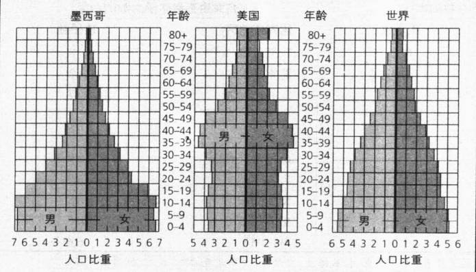

资料来源: Population Today, 26, 9, 1998 年 9 月: 4, 5。

人口成倍增长的意义是令人困惑的。即使在37年内墨西哥人口没有增长，它也必须成倍增加工作岗位、粮食生产、工厂数；医院和学校；交通设施、通讯设备、水、天然气、下水管道和电力系统；房屋、民用建筑、住宅、影剧院、商店，还有公园。如果以上东西不能翻倍的话，墨西哥本就低下的生活水平就会下降得更厉害。

冲突理论指出，不断下降的生活水平会给政治带来不安定的威胁因素：出现抗议、骚乱、甚至革命，以及由此引起的政府镇压。一个国家的政治不稳定会祸害到其它方面，威胁到整个政权的权力平衡。由于担心这样的事情发生，工业化发达国家的领导们正在利用联合国在全球范围内推动一场控制生育的运动。一方面，他们给予不发达国家农业上的技术帮助，为大众提供避孕措施；另一方面，他们则向这些国家的精英出售武器。冲突学派指出，通过这两种行动，既能实现推动政局稳定的目的，又能维持发达国家在全球分化体系中的统治地位。

### 三 个人口学变量

50 年后将有多少人住在美国？那时候世界人口又会是多少？这些都是重要的问题。教育学家想知道需要建多少所学校；制造商想要预期他们产品的需求的变化；政府想知道需要培训多少医生、工程师、行政人员；政治家则想知道有多少人能纳税，以及有多少年轻人够资格去参战。

人口学家运用三个人口学变量（demographic variables）来反映未来的人口状况：生育率、死亡率和人口迁移。

生育率 生育率 (fertility) 是平均每个妇女生育的子女数。一个有时与生育率混淆的词是生育力 (fecundity)，生育力是妇女能够生育的孩子数。世界妇女的生育力大约为 20 个。然而她们的生育率 (她们实际养育的孩子数) 则要低得多，全世界生育率是 2.8 个，即世界上每个妇女平均一生中生 2.8 个孩子。美国妇女的生育率相当低，只有 2.0 个。

世界上拥有最高生育率的地区是撒哈拉沙漠以南的非洲地区——平均每个妇女生育5.2个孩子；最

---

表 20.1 生育率的两个极端

<table border=1 style='margin: auto; word-wrap: break-word;'><tr><td colspan="2">妇女生育最少子女数的地区</td><td colspan="2">妇女生育最多子女数的地区</td></tr><tr><td style='text-align: center; word-wrap: break-word;'>国家或地区</td><td style='text-align: center; word-wrap: break-word;'>孩子数</td><td style='text-align: center; word-wrap: break-word;'>国家或地区</td><td style='text-align: center; word-wrap: break-word;'>孩子数</td></tr><tr><td style='text-align: center; word-wrap: break-word;'>1.中国香港</td><td style='text-align: center; word-wrap: break-word;'>0.9</td><td style='text-align: center; word-wrap: break-word;'>1.尼日尔</td><td style='text-align: center; word-wrap: break-word;'>8</td></tr><tr><td style='text-align: center; word-wrap: break-word;'>2.中国澳门</td><td style='text-align: center; word-wrap: break-word;'>0.9</td><td style='text-align: center; word-wrap: break-word;'>2.索马里</td><td style='text-align: center; word-wrap: break-word;'>7.2</td></tr><tr><td style='text-align: center; word-wrap: break-word;'>3.捷克共和国</td><td style='text-align: center; word-wrap: break-word;'>1.1</td><td style='text-align: center; word-wrap: break-word;'>3.利比尼亚</td><td style='text-align: center; word-wrap: break-word;'>7</td></tr><tr><td style='text-align: center; word-wrap: break-word;'>4.格鲁吉亚</td><td style='text-align: center; word-wrap: break-word;'>1.1</td><td style='text-align: center; word-wrap: break-word;'>4.马里</td><td style='text-align: center; word-wrap: break-word;'>7</td></tr><tr><td style='text-align: center; word-wrap: break-word;'>5.乌克兰</td><td style='text-align: center; word-wrap: break-word;'>1.1</td><td style='text-align: center; word-wrap: break-word;'>5.也门</td><td style='text-align: center; word-wrap: break-word;'>7</td></tr><tr><td style='text-align: center; word-wrap: break-word;'>6.保加利亚</td><td style='text-align: center; word-wrap: break-word;'>1.2</td><td style='text-align: center; word-wrap: break-word;'>6.刚果共和国</td><td style='text-align: center; word-wrap: break-word;'>6.9</td></tr><tr><td style='text-align: center; word-wrap: break-word;'>7.希腊</td><td style='text-align: center; word-wrap: break-word;'>1.2</td><td style='text-align: center; word-wrap: break-word;'>7.乌干达</td><td style='text-align: center; word-wrap: break-word;'>6.9</td></tr><tr><td style='text-align: center; word-wrap: break-word;'>8.意大利</td><td style='text-align: center; word-wrap: break-word;'>1.2</td><td style='text-align: center; word-wrap: break-word;'>8.安哥拉</td><td style='text-align: center; word-wrap: break-word;'>6.8</td></tr><tr><td style='text-align: center; word-wrap: break-word;'>9.俄罗斯</td><td style='text-align: center; word-wrap: break-word;'>1.2</td><td style='text-align: center; word-wrap: break-word;'>9.科摩罗</td><td style='text-align: center; word-wrap: break-word;'>6.8</td></tr><tr><td style='text-align: center; word-wrap: break-word;'>10.西班牙</td><td style='text-align: center; word-wrap: break-word;'>1.2</td><td style='text-align: center; word-wrap: break-word;'>10.乍得</td><td style='text-align: center; word-wrap: break-word;'>6.6</td></tr></table>

注：另外一些生育率接近1.2的国家还有：爱沙尼亚、拉脱维亚、立陶宛、罗马尼亚、斯洛伐克、斯洛文尼亚。资料来源：Haub（2003）。

低的是东欧——平均每个妇女生育1.2个。表20.1显示了生育率的两个极端。当你在看这个表格时，请注意每对生育夫妇平均生育2.1个孩子。香港和澳门地区是世界上生育率最低的地区，为0.9，非洲西部的尼日尔是世界纪录保持者，每个妇女平均生育8个孩子，是香港和澳门的9倍。

人口学家利用的是政府统计的出生婴儿数来计算一个国家的生育率。运用这些数据计算得出的是粗生育率(crude birth rate)——平均每千人口中存活的婴儿数。统计结果当然会有误差，因为大多数不发达国家的出生人口统计都是很随意的。

死亡率 第二个人口学变量是用粗死亡率（crude death rate）来测量的，即平均每千人口中的死亡人数。这一比率在不同国家和地区之间同样差别很大。西非的尼日尔在拥有世界最高生育率的同时，也是最高死亡率纪录的保持者——死亡率为 24。而中东的三个石油富国——科威特、卡塔尔、阿联酋——的死亡率仅为 2，是世界死亡率最低的地区（Haub and Cornelius，2001）。

人口迁移 第三个主要的人口学变量是迁移——人们从一个地方到另一个地方位置的变动。迁移有两种类型。第一种是在一个国家内人们从一个地区移动到另一个地区。尽管美国每个地区都有迁入和迁出两种流动，但年末每个地区的人口要么净增加，要么净减少。以美国为例，美国人往南部迁移，因为那里是经济急剧增长和政治权力的中心。南方是唯一在人口迁移中获得人口增长的地区。而其它地区，都是迁出人口多于迁入人口。东北是迁出人口最多的地区，大部分人都迁到了南方。

一部分新迁入的南方人口是回到南方的非裔美国人。在二战期间和二战后，美国发生“大迁移运动”，成千上万的黑人迁往北方。现在在历史的转变中，很多黑人又回到南方，为那儿的经济增长作出贡献，同时享受那里的温暖阳光，并与老家人团聚(Frey,2001)。

第二种迁移类型是人口从一个国家迁往另一个国家。人口学家用净迁移率（net migration rate）来代表每千人中迁入（移入一个国家）和迁出（移出一个国家）的人口数的差额。迁移不像生育率和死亡率，它不影响全球人口总数，只是人们的居住地点从一个地方换到另一个地方，或从一个国家换到另一个国家。

---

众所周知，移民是为了寻找更好的生活。他们宁愿放弃家庭和朋友给予的安全感，到一个语言和风俗完全陌生的国家。那到底是什么促使他们进行这种冒险呢？为了全面理解迁移，我们需要看推和拉这两个因素。推力是使人们想逃离的因素——贫穷、缺乏宗教信仰自由和政治自由、政治迫害等。拉力是使人们到新地方的吸引力，例如获得更高收入和更好的工作机会。

从整个世界来看，迁移流是从不发达国家向发达国家的迁移。一旦“迁移路线”建立起来，亲属、朋友网络就会形成一个更大的联系网，吸引来自同一个国家甚至同一个村庄更多的人，最终使该地区迁入率增加。

到目前为止，美国是世界上移民的首选地。每年美国接纳的移民数，比世界上其他国家加起来的总和还要多，总共是3100万居民，即每9个美国人中就有一个出生在其他国家(Statistical Abstract 2002: Table 41)。表20.2显示了美国移民的出生地。为逃离折磨人的贫困，像席琳和安吉尔那样的境况，成千

表 20.2 美国移民的出生地

<table border=1 style='margin: auto; word-wrap: break-word;'><tr><td style='text-align: center; word-wrap: break-word;'>北美</td><td style='text-align: center; word-wrap: break-word;'>5906000</td><td style='text-align: center; word-wrap: break-word;'>黎巴嫩</td><td style='text-align: center; word-wrap: break-word;'>85000</td><td style='text-align: center; word-wrap: break-word;'>智利</td><td style='text-align: center; word-wrap: break-word;'>40000</td></tr><tr><td style='text-align: center; word-wrap: break-word;'>墨西哥</td><td style='text-align: center; word-wrap: break-word;'>3950000*</td><td style='text-align: center; word-wrap: break-word;'>孟加拉国</td><td style='text-align: center; word-wrap: break-word;'>81000</td><td style='text-align: center; word-wrap: break-word;'></td><td style='text-align: center; word-wrap: break-word;'></td></tr><tr><td style='text-align: center; word-wrap: break-word;'>多明尼加共和国</td><td style='text-align: center; word-wrap: break-word;'>592000</td><td style='text-align: center; word-wrap: break-word;'>约旦</td><td style='text-align: center; word-wrap: break-word;'>72000</td><td style='text-align: center; word-wrap: break-word;'>欧洲</td><td style='text-align: center; word-wrap: break-word;'>1419000</td></tr><tr><td style='text-align: center; word-wrap: break-word;'>牙买加</td><td style='text-align: center; word-wrap: break-word;'>387000</td><td style='text-align: center; word-wrap: break-word;'>以色列</td><td style='text-align: center; word-wrap: break-word;'>68000</td><td style='text-align: center; word-wrap: break-word;'>大不列颠</td><td style='text-align: center; word-wrap: break-word;'>278000</td></tr><tr><td style='text-align: center; word-wrap: break-word;'>古巴</td><td style='text-align: center; word-wrap: break-word;'>340000</td><td style='text-align: center; word-wrap: break-word;'>伊拉克</td><td style='text-align: center; word-wrap: break-word;'>60000</td><td style='text-align: center; word-wrap: break-word;'>波兰</td><td style='text-align: center; word-wrap: break-word;'>267000</td></tr><tr><td style='text-align: center; word-wrap: break-word;'>海地</td><td style='text-align: center; word-wrap: break-word;'>322000</td><td style='text-align: center; word-wrap: break-word;'>叙利亚</td><td style='text-align: center; word-wrap: break-word;'>47000</td><td style='text-align: center; word-wrap: break-word;'>俄罗斯</td><td style='text-align: center; word-wrap: break-word;'>149000</td></tr><tr><td style='text-align: center; word-wrap: break-word;'>加拿大</td><td style='text-align: center; word-wrap: break-word;'>257000</td><td style='text-align: center; word-wrap: break-word;'>土耳其</td><td style='text-align: center; word-wrap: break-word;'>47000</td><td style='text-align: center; word-wrap: break-word;'>乌克兰</td><td style='text-align: center; word-wrap: break-word;'>141000</td></tr><tr><td style='text-align: center; word-wrap: break-word;'>特立尼达岛和多巴哥岛</td><td style='text-align: center; word-wrap: break-word;'>103000</td><td style='text-align: center; word-wrap: break-word;'>阿富汗</td><td style='text-align: center; word-wrap: break-word;'>44000</td><td style='text-align: center; word-wrap: break-word;'>德国</td><td style='text-align: center; word-wrap: break-word;'>138000</td></tr><tr><td style='text-align: center; word-wrap: break-word;'></td><td style='text-align: center; word-wrap: break-word;'></td><td style='text-align: center; word-wrap: break-word;'>印度尼西亚</td><td style='text-align: center; word-wrap: break-word;'>30000</td><td style='text-align: center; word-wrap: break-word;'>罗马尼亚</td><td style='text-align: center; word-wrap: break-word;'>97000</td></tr><tr><td style='text-align: center; word-wrap: break-word;'>亚洲</td><td style='text-align: center; word-wrap: break-word;'>5564000</td><td style='text-align: center; word-wrap: break-word;'></td><td style='text-align: center; word-wrap: break-word;'></td><td style='text-align: center; word-wrap: break-word;'>爱尔兰</td><td style='text-align: center; word-wrap: break-word;'>92000</td></tr><tr><td style='text-align: center; word-wrap: break-word;'>菲律宾</td><td style='text-align: center; word-wrap: break-word;'>1001000</td><td style='text-align: center; word-wrap: break-word;'>中美和北美</td><td style='text-align: center; word-wrap: break-word;'>1874000</td><td style='text-align: center; word-wrap: break-word;'>葡萄牙</td><td style='text-align: center; word-wrap: break-word;'>63000</td></tr><tr><td style='text-align: center; word-wrap: break-word;'>越南</td><td style='text-align: center; word-wrap: break-word;'>823000</td><td style='text-align: center; word-wrap: break-word;'>萨尔瓦多</td><td style='text-align: center; word-wrap: break-word;'>432000</td><td style='text-align: center; word-wrap: break-word;'>意大利</td><td style='text-align: center; word-wrap: break-word;'>55000</td></tr><tr><td style='text-align: center; word-wrap: break-word;'>中国</td><td style='text-align: center; word-wrap: break-word;'>712000</td><td style='text-align: center; word-wrap: break-word;'>哥伦比亚</td><td style='text-align: center; word-wrap: break-word;'>255000</td><td style='text-align: center; word-wrap: break-word;'>法国</td><td style='text-align: center; word-wrap: break-word;'>51000</td></tr><tr><td style='text-align: center; word-wrap: break-word;'>印度</td><td style='text-align: center; word-wrap: break-word;'>645000</td><td style='text-align: center; word-wrap: break-word;'>危地马拉</td><td style='text-align: center; word-wrap: break-word;'>191000</td><td style='text-align: center; word-wrap: break-word;'>南斯拉夫</td><td style='text-align: center; word-wrap: break-word;'>45000</td></tr><tr><td style='text-align: center; word-wrap: break-word;'>韩国</td><td style='text-align: center; word-wrap: break-word;'>510000</td><td style='text-align: center; word-wrap: break-word;'>秘鲁</td><td style='text-align: center; word-wrap: break-word;'>170000</td><td style='text-align: center; word-wrap: break-word;'>希腊</td><td style='text-align: center; word-wrap: break-word;'>43000</td></tr><tr><td style='text-align: center; word-wrap: break-word;'>伊朗</td><td style='text-align: center; word-wrap: break-word;'>267000</td><td style='text-align: center; word-wrap: break-word;'>圭亚那</td><td style='text-align: center; word-wrap: break-word;'>169000</td><td style='text-align: center; word-wrap: break-word;'></td><td style='text-align: center; word-wrap: break-word;'></td></tr><tr><td style='text-align: center; word-wrap: break-word;'>中国台湾</td><td style='text-align: center; word-wrap: break-word;'>207000</td><td style='text-align: center; word-wrap: break-word;'>尼加拉瓜</td><td style='text-align: center; word-wrap: break-word;'>142000</td><td style='text-align: center; word-wrap: break-word;'>非洲</td><td style='text-align: center; word-wrap: break-word;'>347000</td></tr><tr><td style='text-align: center; word-wrap: break-word;'>老挝</td><td style='text-align: center; word-wrap: break-word;'>189000</td><td style='text-align: center; word-wrap: break-word;'>厄瓜多尔</td><td style='text-align: center; word-wrap: break-word;'>132000</td><td style='text-align: center; word-wrap: break-word;'>尼日利亚</td><td style='text-align: center; word-wrap: break-word;'>103000</td></tr><tr><td style='text-align: center; word-wrap: break-word;'></td><td style='text-align: center; word-wrap: break-word;'>186000</td><td style='text-align: center; word-wrap: break-word;'>洪都拉斯</td><td style='text-align: center; word-wrap: break-word;'>116000</td><td style='text-align: center; word-wrap: break-word;'>埃及</td><td style='text-align: center; word-wrap: break-word;'>78000</td></tr><tr><td style='text-align: center; word-wrap: break-word;'>中国香港</td><td style='text-align: center; word-wrap: break-word;'>137000</td><td style='text-align: center; word-wrap: break-word;'>巴西</td><td style='text-align: center; word-wrap: break-word;'>76000</td><td style='text-align: center; word-wrap: break-word;'>埃塞俄比亚</td><td style='text-align: center; word-wrap: break-word;'>77000</td></tr><tr><td style='text-align: center; word-wrap: break-word;'>柬埔寨</td><td style='text-align: center; word-wrap: break-word;'>135000</td><td style='text-align: center; word-wrap: break-word;'>巴拿马</td><td style='text-align: center; word-wrap: break-word;'>53000</td><td style='text-align: center; word-wrap: break-word;'>加纳</td><td style='text-align: center; word-wrap: break-word;'>51000</td></tr><tr><td style='text-align: center; word-wrap: break-word;'>泰国</td><td style='text-align: center; word-wrap: break-word;'>113000</td><td style='text-align: center; word-wrap: break-word;'>阿根廷</td><td style='text-align: center; word-wrap: break-word;'>50000</td><td style='text-align: center; word-wrap: break-word;'>南非</td><td style='text-align: center; word-wrap: break-word;'>38000</td></tr><tr><td style='text-align: center; word-wrap: break-word;'>日本</td><td style='text-align: center; word-wrap: break-word;'>105000</td><td style='text-align: center; word-wrap: break-word;'>委内瑞拉</td><td style='text-align: center; word-wrap: break-word;'>48000</td><td style='text-align: center; word-wrap: break-word;'></td><td style='text-align: center; word-wrap: break-word;'></td></tr></table>

* 这个数据不包括大约 700 万—900 万美国非法移民，他们中的 70% 来自墨西哥 (Martin and Midgley, 2003)。

注：由于我们仅列出移居美国的移民数最多的国家，所以每个地区的移民数比起来源于那个地区的国家的移民数要多。中国台湾和俄罗斯 1981—1990 年的数据是分别根据中国和俄罗斯 1991—1998 年移民数的百分比来统计的。资料来源：作者根据 Statistical Abstract 2002: Table 7 整理而成。

---

上万人通过非法途径涌入美国，而他们中大部分都来自墨西哥，剩下多数来自美洲中部和南部。美国政府估计，目前国内非法移民在700万—900万之间。

移民对美国经济是一种贡献还是一种负担，专家们对此还未达成一致见解。经济学家茱丽安·西门(Simon,1986,1993)认为移民对经济有贡献作用。在减掉移民在福利上的花费和加上他们在工作和税收上的贡献后，他得出结论：移民的创造大于他们的成本。其他经济学家，如唐纳德·赫德尔(Huddle,1993)，运用数据证明移民在税收收入中只是个负担。其实合理的结论似乎是这样的：受教育程度越高的移民创造的财富多于花费在他们身上的成本，而受教育程度越低的人则与此相反。

### 预测人口增长中存在的问题

我们可以通过对三个人口学变量——生育率、死亡率、净迁移率加减减得到一个国家的人口增长率(growth rate)。人口学家所谓的“基本人口公式”(basic demographic equation)也是非常简单的：

 $$ 人口增长率 = 出生率 - 死亡率 + 净迁移率 $$ 

如果人口增长仅受生物因素影响，人口学家的工作将会轻松得多。但事实上，许多社会因素，如战争、经济繁荣或衰退、瘟疫、饥荒等，经常会影响到出生率、死亡率、迁移率的变化。正如下面“世界文化多样性”专栏所表明的，即便是杀婴，也会影响到人口增长。政府推行的项目也会使问题复杂化。一些政府会尝试说服妇女生育更少或更多的孩子。当年希特勒决定德国应拥有更多的“日耳曼人”时，德国

### 世界文化多样性

### 杀女婴——一项古老而兴盛的行为

“失踪女孩的神秘案件”，本来就可以成为本专栏的标题。在全球，每100个女孩出生，大约有105个男孩出生。然而在中国，每100个女婴出生，就有111个男婴。考虑到中国巨大的人口基数，这意味着中国比所推想的要少40万女婴。为什么呢？

……在过去几年，男婴比例一直在上涨。原因依旧是经济因素，但是这次却有了一个新的转折。随着中国打开国门，旅游和贸易开始对外开放，但这主要对男性有利，因为女性独自流动被认为是不适当的。这样，男性在找到好的职业后就可赚钱带回家，这又给父母希望生男孩增加了一个理由。

杀女婴在印度也很常见。许多印度妇女用超声波检测腹中胎儿的性别，如果得知是女婴后，她们就会选择做人工流产。医生们提着便携式超声波检测仪在村与村间行走，检测胎儿性别收取11美元的费用，做人流收44美元。每年大约有300万女婴被做人流，尽管这种方式是不合法的。

在印度，有一次胎儿性别检验触怒了公众。那次暴乱既不是关于保护女婴，也不是一项有关的反人流运动。让公众激愤的是，由于一位医生给了一对父母错误信息，而导致一名男婴被作了人流。

看来，除非强化性别歧视的社会结构被彻底铲除，否则对男婴的偏好、对女婴的杀戮是不会消失的。这需要男女平权。而社会的这个进步，如果可能发生的话，也是在遥远的未来。

资料来源: Lagaipa (1990); McGowan (1991); Polumbam (1992); Renteln (1992); Greenhalgh and Li (1995); Jordan (2000); Dugger (2001); Raghunathan (2003).

---

政府就立即宣布流产为非法，并给生育的妇女以现金奖励。因此，人口便增长了。今天，欧洲的领导人已惊觉到人口出生率已经非常低，如果没有移入人口，整个人口数将会缩小。欧盟社会事务委员会因此宣布“欧洲必须拥有更多孩子”（Population Today 2002）。但宣言似乎并未起什么用。

图 20.9 美国未来人口预测

影响一个国家人口增长率的主要因素是工业化。在每个进行工业化的国家，出生率都会有所下降。这不仅是因为工业化给人们提供了许多经济和教育机会，还因为养育孩子的成本变高了。由于孩子受教育的时间变得很长，相应地，依赖父母的时间也增加了。而且关键的一点是，赋予地位的基础，由拥有许多孩子转变为获得更多的教育

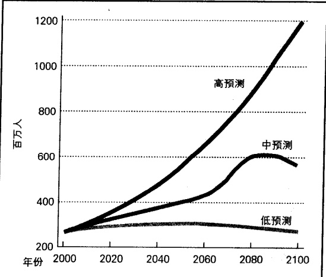

注：预测的根据是基于对出生率、死亡率、特别是人口迁移的估计。资料来源：作者根据 Statistical Abstract 2002: Table 3 整理而成。

和物质财富。像席琳和安吉尔这类人开始意识到生活的变化,所以他们的多育动机急剧降低。如果不了解工业化进程的速度和随之而来的生育行为的快速转变,就会增加人口预测的难度。

由于这一系列复杂的因素，人口学家在预测一个国家的人口增长时显得尤为谨慎。例如，美国人口在2050年会是什么情况呢？它会实现人口零增长（zero population growth），平均每1000名妇女生育2100个孩子吗？会有更大比例的女性上大学吗（妇女受教育程度越高，她们生育的孩子越少）？未来移民又会发生什么变化呢？艾滋病会失去控制吗？还会有其它别的灾难性疾病发生吗？新的全球经济将会发生什么变化？在这么多未知问题的情况下，难怪人口学家对美国人口增长作出了三种不同的预测，见图20.9。

下面让我们换个角度,从人口居住地来分析人口。世界上有越来越多的人居住在城市,因此我们将把重点放在城市化趋势和城市生活上。

### 城市化

当我爬上坐落在哥伦比亚马地林名叫埃尔提罗的小区的一座陡峭的小山时，我的导游贾罗告诉我，“这里曾是个垃圾堆”。我停下来，打量我一路走过来的道路两旁的植物，确实，我还能看见一些沾满灰土的废弃物。原来，这座“城镇”是建在垃圾堆上的。

这是当天我遇到的许多意想不到的事情的第一个。第二个就是埃尔提罗太危险了，马地林的警察都不愿意进来。我惊愕了好一会儿，但我想我有足够的理由去信任贾罗，因为他以前在这里做过几年牧师，对当地居民很了解。我知道，如果我跟着他就不会有危险的。

---

事实上，近几年这里确实安全多了。贾罗告诉我，那是因为一群年轻人联合起来努力的结果。某种前卫的正义（frontier justice）流行开来。警戒会的成员告诉卖淫者和贩毒者这里不做这样的买卖，并叫他们“到别的地方去”。他们还处死抢劫犯和杀人犯。他们甚至能使家庭更安全，因为他们会教训醉酒而殴打妻子的男人。在严厉的正义感的威慑下，这个地区变得安全多了。

贾罗还说，每户每月必须支付这个团体一定的费用(少于1美元)。每项服务还必须额外付一些钱，居民通过这样做来获得安全感。

当我们在街上逛时，它看起来确实挺安全的，但我依然紧跟着贾罗。我对保卫这里安全的那群年轻人感到好奇。当贾罗指向两个是团体成员的年轻人时，我问他们能否允许我给他们拍张相片，他们拒绝了。不过我也没有偷拍。

为了理解城市生活，也包括了解埃尔提罗，我在本章最后一部分会理清有关脉络。下面，我们先从城市是如何发展起来的这个问题入手。

### 城市的发展

在世界景象中，城市并不算新奇的事物。大约在7000—10000年前，人们就开始建造周围用围墙保护起来的小城市。一个著名的例子是《圣经》上的耶利哥（Jericho）（Homblin，1973）。大约公元前3500年发明书写时，伊朗就有比较大的城市出现（美索不达米亚）（Chandler and Fox，1974；Hawley，1981）。接着，在尼罗河、印度河、黄河流域、西非、地中海沿岸、安第斯山地区相继发展出了许多城市（Fischer，1976；Flanagan，1990）。美洲的第一个城市是Caral，位于现在的秘鲁境内（Fountain，2001）。

城市起源的关键在于更有效率的农业的发展(Lenski and Lenski, 1987)。只有当农业生产有剩余时，一些人才可以不再从事粮食生产而聚集到城市里去从事其它事情。事实上，一座城市(city)可以被定义为这样一个地方，在那里，一大群人长久居住并无需生产他们所需的粮食。在5000—6000年前发明的

早期的城市是一些由专门设计以防止敌人进攻的城墙围起来的小经济中心。这些城市被建得像城堡似的，它们经常受到来自武装部落与想扩大领土和增加国库收入的邻国的威胁。此照片是北京的故宫，曾为中国的统治者居住的地方。士兵在城墙上巡视，在上面他们可以向试图攻城的人射箭。

---

犁,带来了广泛的农业盈余,从而刺激了城镇和城市的发展(Curwin and Hart, 1961)。

比起今天的城市，大部分早期的城市都非常小，它们仅仅是聚集在农业中心或重要贸易路线上的几千人的聚落。有两个著名的城市是个例外，它们都曾在自身衰弱前的一段重要时期达到100万人口，那就是公元800年中国的长安和公元900年波斯(伊拉克)的巴格达(Chandler and Fox, 1974)。即使是雅典，在公元前500年，即其最强盛时，也只有不到20万居民。而罗马在其最鼎盛时期也大概只有100万人口(Flanagan, 1990)。

直至 200 年前，世界上唯一一个人口过百万的城市也只有中国的北平（现在的北京）（Chandler and Fox, 1974）。接着 100 年后，到 1900 年，拥有这样人口规模的城市上升到 16 个。原因在于工业革命，它以提供工作的形式把人们拉向城市。工业革命也刺激了交通和通讯的快速发展，并使人、资源、物品能够有效地流动，而所有这些都是大城

图 20.10 百万人口以上的城市增长

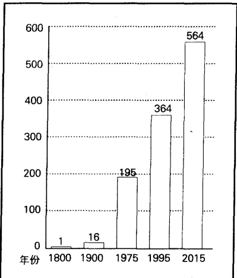

资料来源: Chandler and Fox (1974); Brockerhoff (2000)。

市赖以存在的必备因素(或曰基础设施)。到今天为止，已有大约300个人口过百万的城市。正如图20.10所示，这一数字正在持续增长中(Brockerhoff,2000)。

### 城市化进程

城市不是新奇的世界景象，但城市化是。城市化(urbanization)指的是许多人迁移到城市中；这些城市对整个社会产生持续的影响。城市化是在全球范围内产生的。1800年时，只有3%的世界人口居住在城市(Hauser and Schnore,1965)。到今天已有47%的人住在城市：其中发达国家有75%的人口居住在城市，而不发达国家的这一比例则为40%（Haub,2003）。预期2007年是一个历史性时刻，到时全世界将有过半的人居住在城市(Massey,2001)。如果没有工业革命，就不会发生这一显著的增长，因为城市广泛的基础设施可以在相对较小的区域内满足成百上千、甚至上百万人口的生存和需要。

为了弄懂城市的吸引力，我们必须分析城市生活特有的“拉力”。由于存在精细的劳动分工，城市能够提供非常丰富的多样生活：比如音乐，从摇滚乐和萨尔萨舞曲（Salsa）到乡村音乐和古典音乐；在饮食上，有适合素食者和糖尿病患者的食物，还有从世界各地进口的适合所有人的美食。城市还提供匿名性，从社会控制角度来看，许多人发现这是一种有别于农村和小城镇生活的新东西。当然，城市也提供了许多工作机会。

一些城市变得很大，并对整个地区产生巨大影响，以至于城市这个词不足以描述它们。取而代之的是大都市（metropolis）。这个词意指由周边较小城市及它们的郊区环绕而成的一个中心城市。它们通过交通和通讯进行经济上的联系，有时也通过县委员会和地区机关单位进行政治联系。

比如圣路易斯。尽管圣路易斯这个地名指的是密苏里州一个人口少于40万的城市，但它也代表了

---

居住在密苏里州和伊利诺伊州里的上百个被分割开的城镇里的200万人口。合在一起，这个地区被称为“圣路易斯或双州地区”。虽然这些城镇彼此间在政治上是独立的，但它们却是一个经济统一体。它们的联系途径有：工作（许多居住在小城镇的人在圣路易斯工作，或由圣路易斯的产业为他们提供服务）、通讯（他们分享相同的地方报纸、广播和电视发射站），还有交通（他们使用相同的州际公路、“两州巴士”系统和国际机场）。正如符号互动论指出的，被居民共同使用的符号——拱门、密西西比河、布尔彻啤酒厂、天主教信仰、羊角号（the Rams）、布鲁斯（包括冰球队和蓝调音乐）——提供了一个相同的身份认同。许多城镇都是相连的，如果你驾车穿过这个大都市，除非在这儿生活过一段时间，意识到同时存在于它们之间的极端的相同和不相同点，否则你就不会知道你正在离开这个城镇而进入另一个。

一些大都市变得太大和太有影响力，所以我们要用特大都市（megalopolis）来描述它们。特大都市覆盖的区域至少包括两个大都市和许多郊区。在美国大约20个特大都市中，三个最大的是：从缅因州到弗吉尼亚东海岸，在迈阿密、奥兰多和坦帕间的佛罗里达州地区，在旧金山和圣迭戈间的加利福利亚沿岸区。其中加利福利亚特大都市延伸到墨西哥州，还包括蒂华纳及其南部郊区。

在世界范围内正在上演着这样一幕：城市地区变成一个大都市，大都市又发展成一个特大都市。而当一个城市的人口达到1000万时，它就被叫做千万人口都市(megacity)。在1950年，纽约城是世界上唯一一个人口逾千万的城市。今天这样的城市已有19个，而到2015年则会上升到21个(Zwingle,2002)。

### 美国的城市模式

早期美国几乎只是一个农村地区。1790年，只有大约5%的美国人居住在城市里，到1920年，这个数字上升到50%。由于城市化持续不断地进行，今天已有80%的美国人居住在城市。就像我们的其它社会模式，城市化在美国的进程也是参差不齐。

美国人口统计局把全国分成 274 个统计意义上的大都市 (MSAS)。每个统计意义上的大都市，包括一个至少有 5 万人口的中心城市及附近一些被城市化的地区。大约 3/5 的美国人居住在 50 个左右的统计意义上的大都市中。

美国人为了寻求工作和更好的生活方式而迁移，所以大多数城市的人口都增长了，只有几个人口有所缩减。表 20.3 显示了人口缩减和人口增长最快的城市。这个表也显示出我们先前讨论过的迁移方式。人口增长最快的城市几乎都在西部和南部，而所有人口缩减的城市都在东北部（俄亥俄州是美国东北地区的分界线）。

随着美国人迁移的进行，为满足人们需求的郊区商城(edge cities)开始得以发展。郊区商城指的是坐落在交通要道十字路口附近成群的购物中心、旅馆、办公区和居民区。尽管这些商业群可以跨越几个城市或城镇，它们却给予在那里生活、工作和购物的人一种地区归属感。

另一种主要的美国城市模式是中产阶级化(gentrification)——中产阶级向衰败的城市地区迁移的模式。他们被那里尽管破旧但仍能被修补的廉价房子所吸引。结果之一就是一些城市街区在面貌上有了大改善——新刷好的建筑，修饰得很好的草坪，没有了用木板封住的窗户。另一个后果则是，贫穷的居民被新来的富人和上涨的物价所冲击。这两个群体间经常发生矛盾(Anderson,1990,1999)。

通常，入住的中产阶级是白人，被取代的则是少数族裔。正如下面“现实社会学”专栏所讨论的，在

---

表 20.3 人口缩减和人口增长最快的城市

<table border=1 style='margin: auto; word-wrap: break-word;'><tr><td style='text-align: center; word-wrap: break-word;'></td><td style='text-align: center; word-wrap: break-word;'>人口缩减的城市</td><td style='text-align: center; word-wrap: break-word;'>人口增长的城市</td></tr><tr><td style='text-align: center; word-wrap: break-word;'>1 - 5.3% 纽约州 尤蒂卡—罗马</td><td style='text-align: center; word-wrap: break-word;'>1 83.3% 内华达州 拉斯维加斯</td><td style='text-align: center; word-wrap: break-word;'></td></tr><tr><td style='text-align: center; word-wrap: break-word;'>2 - 4.6% 纽约州 宾厄姆</td><td style='text-align: center; word-wrap: break-word;'>2 65.3% 佛罗里达州 那不勒斯</td><td style='text-align: center; word-wrap: break-word;'></td></tr><tr><td style='text-align: center; word-wrap: break-word;'>3 - 2.2% 宾夕法尼亚州 斯克兰顿—威尔克斯—巴里</td><td style='text-align: center; word-wrap: break-word;'>3 49.7% 佛罗里达州 西部棕榈海滩—博卡莱顿</td><td style='text-align: center; word-wrap: break-word;'></td></tr><tr><td style='text-align: center; word-wrap: break-word;'>4 - 1.6% 纽约州 布法罗—尼亚加拉瀑布</td><td style='text-align: center; word-wrap: break-word;'>4 48.5% 得克萨斯州 迈克阿兰—爱丁堡</td><td style='text-align: center; word-wrap: break-word;'></td></tr><tr><td style='text-align: center; word-wrap: break-word;'>5 - 1.5% 宾夕法尼亚州 匹兹堡</td><td style='text-align: center; word-wrap: break-word;'>5 47.7% 得克萨斯州 奥斯汀—圣马科斯</td><td style='text-align: center; word-wrap: break-word;'></td></tr><tr><td style='text-align: center; word-wrap: break-word;'>6 - 1.4% 纽约州 锡拉丘斯</td><td style='text-align: center; word-wrap: break-word;'>6 47.5% 阿肯色州 费耶特维尔—斯普林代尔—罗杰斯</td><td style='text-align: center; word-wrap: break-word;'></td></tr><tr><td style='text-align: center; word-wrap: break-word;'>7 - 1.0% 俄亥俄州 扬斯敦—沃伦</td><td style='text-align: center; word-wrap: break-word;'>7 46.1% 爱达荷州 波伊西城</td><td style='text-align: center; word-wrap: break-word;'></td></tr><tr><td style='text-align: center; word-wrap: break-word;'>8 - 0.3% 马萨诸塞州 新贝德福德</td><td style='text-align: center; word-wrap: break-word;'>8 45.3% 亚利桑那州 菲尼克斯—梅萨</td><td style='text-align: center; word-wrap: break-word;'></td></tr><tr><td style='text-align: center; word-wrap: break-word;'>9 - 0.1% 俄亥俄州 代顿—斯普林菲尔德</td><td style='text-align: center; word-wrap: break-word;'>9 39.8% 犹他州 普洛沃—奥勒姆</td><td style='text-align: center; word-wrap: break-word;'></td></tr></table>

注：数据表示的是人口百分数在1990—2000年间的变化情况，负号表示人口减少。

资料来源：Statistical Abstract 2002；Table 30。

纽约的哈莱姆区，中产阶级和被取代的人都是非裔美国人。随着中产阶级和从事专业工作的非裔美国人重新开发这个地区，从星巴克咖啡馆到牙医诊所(包括一切的基础设施)也随之发展起来。房地产价格上涨是自然的了。

### 现实社会学

### 重建哈莱姆：“这抚慰了我的心灵。”

这是个众所周知的故事：内城区充满偷盗、犯罪、堕落，被乱扔在街上和堆弃在烧火的建筑物周围的腐烂垃圾发出阵阵恶臭。只有那些别无选择的人才会住在这个荒废的、危险丛生的、令人绝望的地方。

并不为人所知的是，大量非裔美国人正在重建这其中的一些破落地区。

霍华德·桑德斯正在经历一场美国梦。在哈佛商学院拿到学位后，桑德斯在曼哈顿一家投资公司任职。他住在中央公园西部一套高级公寓里，但他很想念他长大的哈莱姆地区。于是，他又举家搬回旧地。

非裔美国律师、医生、教授和银行家都是这样做的。

究竟什么在吸引他们？首先是乡愁，一种对哈莱姆传说和民间故事的文化认同。20世纪20年代，这里居住着黑人作家和艺术家，也正是在这里，蓝调音乐和爵士音乐吸引了许多年轻人，成就了大量音乐家。

第二个理由比较实际。哈莱姆提供了实惠的住房。你可以拥有面积为1800平米的、有5间卧室的大屋子。一些外墙饰以洪都拉斯桃花心木；一些褐色的石头只剩下外壳，有待刷新；但其它地方则完好无损。

这里所发生的事是社区重建。“策划”这项工程的人们希望自己成为典范，他们希望他们的孩子能在社区里看着他们去上班、下班后回家。

当中产阶级者迁出哈莱姆时，那里的生活福利设施也随之不复存在。现在年轻的专业技术人员搬回来了，所以这些设施也重新出现。以前这儿没有咖啡馆、餐厅、爵士音乐俱乐部、花店、面包店、报社、牙科诊所、眼镜店和画廊，等等，而这些东西在城市居民看来是理应存在的。现在这儿也都有了。

芝加哥西岸和美国另外一些城市也正在上演着同样的一幕。

寻找社区——一种渴望与他人相维系和寻根的驱动力是非常强烈的，正如一位移居哈莱姆的投资银行家所说：“这一切抚慰了我的心灵。”

资料来源: Cose (1999); McCormick (1999); Waldman (2000); Scott (2001); Taylor (2002); Leland (2003).

---

### ☑ 城市增长的几种模型

如第1章所述，在20世纪20年代，芝加哥大学的许多社会学家已经研究了城市这种新的生活方式，其中一位社会学家罗伯特·帕克，杜撰了一个新词“人类生态学”来说明人们如何适应生存环境（human ecology，这个概念也被称为城市生态学）（Park and Burgess，1921；Park，1936）。对于人类生态学家来说，城市增长的进程是一件有特殊意义的事件。下面我们就来看看他们总结出的四种主要模型。

### 同心圆模型

为了解释城市是如何扩展的，社会学家欧内斯特·伯吉斯（Burgess，1925）提出了一个同心圆模型。如图 20.13（A）所示，伯吉斯提出，一个城市是从中心往外扩展的。环 1 区是中心商业区。环 2 区是批发和轻工业区，它环绕在中心商业区周围，里面有旅馆和伯吉斯认为会滋生贫穷、疾病、罪恶的破旧的房屋。环 3 区是节俭的下层阶级为逃离环 2 区和为方便上班所住的区域。环 4 区包括一些更华贵的公寓、旅馆、单身公寓和有钱人生活的中产阶级住宅区。通勤者住在环 5 区，环 5 区包含了许多郊区或沿着交通要道（transit routes）发展起来的卫星城市。

伯吉斯提出这个模型，是为了反映“城镇或城市从其中心商业区向外急剧扩展的趋势”。然而，他也注意到，“没有一个城市能很好地符合这个模型”。一些城市有诸如湖泊、河流或铁道等地理障碍，使城市扩

图 20.13 城市是如何发展的——城市增长的模型

资料来源：Cousins and Nagpaul（1970）；Harris（1997）。

---

展偏离了模型。伯吉斯也指出，商人已经开始背离模型在边远地区落户。那是在1925年，他看到商人从中心商业区向郊区购物中心大转移的第一阶段。如今，这些购物中心占有全国零售业的大部分份额。

### 扇形模型

社会学家霍默·霍伊特（Hoyt，1939，1971）指出，同心圆模型并不能形成完整的圆，因此他在伯吉斯的基础上进行了修改。如图 20.13（B）所示，一个区域可以包括几个部分，其中之一是下层阶级住宅区，另一个是中产阶级住宅区，再一个是商业区，等等，它们共同争夺一个地方。

社会学家所称的“侵入链循环”（invasion-succession cycle）是这种动态竞争的一个例子。贫穷的移民和农村移民寻找低廉住处，随着人数上升，一些人又被迫赶到附近地区。

由于看到下层阶级的出现，中产阶级沮丧地迁移而去，而这则使低廉居住区得到进一步扩展。“侵入链循环”永远不会完结，因为下一组人又会代替前面的人。实际上，随着中产阶级化，这个循环是能兜回原处的，因为“入侵者”会逐渐变成中产阶级或上层阶级的人。

### 多核心模型

地理学家昌西·哈里斯和爱德华·乌尔曼注意到，一些城市有几个中心或核心，如图 20.13（C）所示，每个核心又包括许多专门活动（Harris and Ullman，1945；Ullman and Harris，1970）。一个熟悉的例子就是快餐店群集中在一个地区，而汽车买卖又在另一个地区。一些商业活动集聚在一起，是因为能从连结一体中找到利润，比如在零售区，如果有很多商店就会吸引更多顾客。另一些商业活动聚集在一起则是由于土地利用类型的不一样，比如工厂和昂贵住宅区两者就不能在一块。结果之一就是公共服务在整个城市中分布不平衡。

### 边缘模型

昌西·哈里斯(Harris,1997)还提出了一个边缘模型,见图20.13（D）。这个模型说明了在人口和服务由中心城市迁往城市边缘或郊区时,沿途的高速公路对这些迁移的影响。它同时也展示了工业和办公区的发展情况。

### 对模型的批判

上述模型都只反映了部分事实。由于历史局限，古代城市都没有遵循这些模型。此外，它们也不能很好地解释城市的规划。比如，英国已经起草法案以保证城市周边的绿化带。这有效地防止了城市向周围扩展。沃尔玛超市不能在市区外落户，它必须和其它商店一样，只能在商业区设立。诺里奇虽然有25万人口，但它却不能再向外扩展了，在其绿化带上，野鸡穿梭于田地里，绵羊在青翠的草地上吃草(Milbank, 1995)。

对于不发达国家的城市，这些模型也缺乏解释力。美国游客在看到这些国家的城市时，往往感到惊奇。有钱人占着有优雅餐厅和良好服务设施的内城区，把自己藏在高墙后面，逃离公众的眼光，享受着奢华的房子和花园。相反，穷人，特别是乡下移民，只能在城外落脚，或者像埃尔提罗的例子一样，在垃圾山上生存。下面的“世界文化多样性”专栏将讨论这一问题。

---

### 世界文化多样性

# 为什么城市的贫民窟比乡村好: 不发达国家的城市化

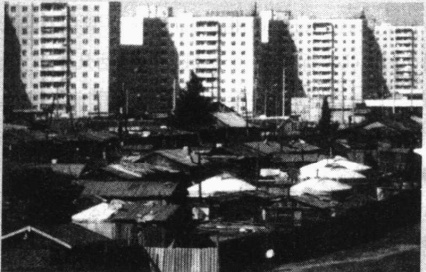

在不发达国家，大量农村人涌入城市，以至于这些国家拥有世界上人口最多的城市(见图20.11)。不发达国家的城市，每年都会增长5000万人口(Brockerhoff,2000)。这个数字比住在西班牙的人口总数还多。如果保持这个速度，在六年内，就可达到美国的人口总数。

工业化程度低的那些国家在快速的城市化过程中，要面对巨大的膨胀压力，从而会导致像这里所描述的差距。工业化程度低的国家的城市因缺乏满足越来越多的新移民的基础设施，结果贫困加剧，难以提供工作、住房，也难以改善水电、道路和学校等条件。此照片摄于蒙古乌兰巴托。

当农村移民进入美国城市时，他们通常居住在城市中心附近破败的房子里。而在不发达国家，有

日渐衰微，人口转变的第二阶段已经来临——低死亡率和高出生率使农村人口急剧增长，从而使农村缺乏足够的土地分给新生人口。另外就是“拉力”，城市能提供工作、学校、住房，以及更富刺激的生活。

一般来讲，工业化应超前于城市化，但现在却与之相反，城市化走在了工业化前面，而不发达国家落后的工业技术显然难以应对大量

为什么在这么恶劣的生活条件下还有许多人涌入城市？首先，是“推力”在起作用。农村生活

钱人往往住在商业中心区附近，移民则占用城外的地方。这是一种典型模式，就像我们在埃尔提罗地区看到的，他们移向任何可能居住的地区，包括垃圾堆。他们用废木板和废金属搭建小屋，更有甚者用拣来的铁罐头做建筑材料。一开始，他们挤占的这些地方没有诸如道路、交通线、水、下水管道、收拾垃圾服务等城市设施可以享用。慢慢地，立法者赋予了他们享用公车、最小电量、自来水等服务的权利，但只能几百个人共用一个水龙头。

移民带来的压力。

不发达国家能应对大量的人口迁移压力吗？它们也是别无选择。巴西、危地马拉、委内瑞拉和别的一些城市已出动警力甚至军队驱赶移民。但这是没用的，这只会导致暴力冲突。这一应对过程将是非常痛苦的，基础设施（道路、水、下水管道、电，等等）必须建起来，而贫穷国家又没有建设资金。随着绝望的人们不断涌向城市，问题将会更加严重。

### 思考题

你能想出什么办法解决不发达国家大量移民涌进城市这个问题吗？

### 城市生活：疏离与社群

城市在给人们提供机会的同时，也会制造许多问题。首先，我们人类是一种很复杂的生命，食物、居所、安全都是我们必需的，而且满足这些需要也是很重要的。但这仅仅是我们生存的一部分。我们还必须要有社群（community），一种归属的需要——指别人对我们的关心和我们能依靠自己身边的人。一些人能在城市里找到这种归属感，另一些人找到的则是相反的感觉——疏离感（alienation），一种没有归属的感觉，没有人关心你发生了什么事：

---

凯瑟林·吉诺维丝28岁，在她居住的皇后区，大家都叫她基蒂。有一天，当她下班回到家停完车后，突然遭到一个男人的抢劫。她大声尖叫：“天啊，有人打劫我，救命呀，救命呀！”

在半个多小时里，38位令人尊敬的、守法的市民从窗户里看到凶手前后三次袭击了基蒂。有两次，居民卧室的灯突然亮起，凶手被吓跑了。但他每次都又跑回来找到基蒂并继续袭击她。在整个过程中，没有一个居民去报警。（《纽约时报》1964年3月26日）

当警察询问他们时，一些目击者说“我不想卷进去”，另一些则说“我们以为这仅是情人间的争吵”。还有人说“我什么都不知道”。全国上下都为之震惊，似乎美国人在一天早上醒来后发现，整个国家在一夜间全变样了。他们认为，这件事显示出人们不再互相信任，城市是一个冷酷、孤独的地方。

为什么城市一定会产生疏离感？在一篇经典论文——《城市主义：一种生活方式》里，社会学家路易斯·沃斯(Wirth，1938)阐述道：城市生活破坏了亲属和邻里关系，而这两者正是社会控制和社会团结的传统基础。城市居民具有匿名性。人们相互间只是泛泛之交，对别人的事非常冷漠——就像基蒂的邻居一样。总之，城市在给予个人自由的同时，也产生了冷漠——甚至于在有人被谋杀时竟视而不见。

然而，城市不仅由一小撮感到离群或有不信任感的陌生人构成。它还包括一系列更小的世界，在这里，人们可以找到归属感。人们对他们居住、工作、购物、玩耍的小环境感到非常熟悉，即使是在外人看来很恐怖的贫民窟，也能提供一种归属感。在一项经典研究中，社会学家赫伯特·甘斯(Gans，1962:12)提到：

在波士顿西端住了几个星期后，就我的所见所闻，我对这个地区的印象发生了急剧的变化。在寻找寓所的过程中，我发现个人单元通常要比楼房的外边和过道条件好多了。接下来，当我徜徉在西端并把自己当成其中一个居民时，我发展了一种独特的认识。借此认识，我的眼睛只聚焦于正在被人们使用的地区。空荡荡的大楼和关门的商店再也看不见了，西端的人们和我一起在先前荒芜的小巷和街道来回穿梭……

由于人们要在街上从事很多活动，所以我很快就熟悉了一些新面孔。我在楼梯上和楼门前经常遇到我的邻居们。还有，一旦一种购物模式发展起来，我就可以经常看到同一个店主；同样，我也认识了小区里那些每天在固定时间、走固定路线的在街上散步的“人物”。总之，随着我经常看到他们，商店和居民的那种在我这个外人看来很奇异的属性渐渐消失了。

在他住在西端期间，甘斯渐渐形成一种局内人的视角。尽管西端有狭窄的街道、不标准的楼房，甚至有堆起来的垃圾场，但大多数人却都选择住在那里。原因在于，“在他们看来，西端是一个租金低廉的住宅区，而不是贫民窟”。这个破旧的地区形成了一个社群，人们互相走访，结成亲友关系。甘斯因此给他的书起名叫《都市村庄人》（The Urban Villagers，1962）。

后来来了一些有目的的城市规划者，他们为了避免使这个地区成为“贫民窟”，制订了一系列计划。当住在西端的居民听到城市革新者要来时，他们怀疑这些改善能否使他们获益。他们都感到非常失望，因为城市规划者带来了另一次侵入链循环。在闪耀光芒的新建筑出现的同时，更富有的人也来到这里，他们占领了这个地区。因此，以前的居民失去了占有权，他们之间的亲密关系也受到了破坏。

---

### 谁住在城市里？

在城市里，你找到的是疏离感还是社群感，取决于许多因素。甘斯把城市居民分成五类(Gans, 1962, 1968, 1991a)。你属于其中哪种类型？这些类型是如何影响到你所具有的疏离感或社群感的呢？

以下这三种类型居民自己选择居住在城市中；他们体验到一种归属感。

世界公民 世界公民包括城市里居住的学生、知识分子、专业技术人员、音乐家、艺术家和演艺人员。他们是冲着城市的便利和文化吸引力而来的。

单身者 他们是一群未婚的到城市里寻求工作和娱乐的年轻人。商业和诸如单身酒吧、单身公寓、网上约会公司等服务能满足他们的需求，但他们只是短暂居住在城市，因为他们中大多数人在结婚生子后还会搬回郊区。

同族村民 由相同的种族和社会阶级维系在一起的人，居住在紧密联系的村庄和小镇里。紧密的家庭或朋友圈子，使他们与他们所认为的城市生活的负面影响隔离开来。

以下两个群体: 被剥夺者和陷入困境者, 则很少有选择居住地的自由。由于被工业社会所疏离, 他们总是徘徊在灾难的边缘。

被剥夺者 被剥夺者住在破败的地区，那里与其说是城中村，还不如说是流浪汉的宿营地。这些人包括非常穷的人和心理不正常者，被剥夺者在收入、教育、社会地位和工作技巧上都是底层社会的代表。他们中的一些人就在这儿寻求猎物，而通常受害者也是像他们一样的人。他们对未来的美好生活几乎是无望的。

陷入困境者 陷入困境者同样逃脱不了困境。即使当一些人的住所被另一种族的人“侵入”时，他们也支付不起搬走的费用。另一些人则是不愿意离开的上了年纪的人、酗酒者和滥用药物者，还有堕落者。与被剥夺者一样，陷入困境者同样有遭遇到攻击、抢劫和强奸的高风险。

### 城市情怀: 寻找一个熟悉的世界

社会学家指出，城市被分割成许多小世界，人们能了解到它最小的细节。城市人通过使购物个性化来创造一种亲密的情感(Stone, 1954; Gans, 1970)。他们在同一家商店购物，过了一段时间，顾客和店员就能用对方的名字来打招呼了。某些酒吧、餐馆和商店，已不仅仅是建筑物，它们已经成为城市居民建立社会关系和分享社群信息的地方。

欣赏体育赛事，也有利于城市居民寻找熟悉的世界（Hudson，1991）。当红衣主教队的马克·麦圭尔击打出第61次本垒打，打破了罗杰·马里斯长期保持的纪录时，全世界的球迷都为之欢呼。但对于圣路易斯地区来说，庆祝活动就有些特别了：他们认为这是“我们的”球队的“我们的”队员赢得比赛，即使这个有着2500万人口的地区只有不到1/7的人住在城市里。社会学家戴维·卡普和威廉·约尔斯（Karp and Yoels，1990）指出，这样的身份认同是非常强烈的，甚至在搬到另一个地方居住后，许多人还对他们成长其中的那座城市的球队怀有深厚的感情。

---

### 不介入规范和责任分散

城市居民尽力避免陌生人的骚扰。在日常生活中，他们遵循不介入规范。

我们有时会利用诸如报纸等传播媒介来使自己与他人隔离开，并表明我们是不介入与他人的互动中的。事实上，我们学会了把他人“拒之门外”。关于这点，我们可以把随身听视为一种典型的传播媒介，因为它能随时使自己进入或离开。它是一种能使我们进入私人世界并有效地与他人隔绝的工具。这样的工具保护了我们自己的“个人空间”，同时也保护了我们的行为和面部表情（在地下铁道上，人们经常表现出冷漠的“面具”或皱眉头的神情）。(Karp et al., 1991)

回顾一下基蒂的例子，她的故事引起在第6章提到过的正在做一系列实验的社会心理学家约翰·达利和比布·拉塔恩（Darley and Latane，1968）的注意。在他们的实验中，达利和拉塔恩发现，路人越多，人们就越不愿意伸出援助之手。随着人群扩大，人们的责任感开始分散，因为每个人都在假设另一个人会承担责任。他们会这么想，“这么多人在这儿，这不是我的责任。”

责任分散和不介入规范都有助于解释基蒂遭遇的谋杀事件。知道她生命有威胁的旁人并不是不关心他人的人，他们确实担心一个正被袭击的妇女，但他们只是在遵守一项都市规范。这项规范在平时有助于他们的日常生活，但却在一些关键情况下具有反功能。这种规范，加上对城市谋杀、强奸、抢劫的担心，强化了人们寻求安全地带的渴望。这个问题将在下面的“现实社会学”专栏中讨论。

## 现实社会学

### 城市恐惧和防盗门

大门封闭的住宅区并不是一件什么新鲜事，它们通常被富人所用。新鲜事是中上阶层人士涌向城镇，并为城镇的设施(包括街道)支付高昂税款。

城镇并不通过区分信仰或种族来区别对待人，但它却能因为社会阶级的差异而歧视人。华盛顿的克拉汉尼(Klahanie)是个很好的例子。有人在1985年提出，用20年来开发它。现在它有非常安全的街道、120万平米的开放空间。它还禁止设置卫星接受器、旗杆，甚至不许建篮球场。结果，在这个私人社区，要价30万美元以上的湖边的房子远远供不应求(Egan，1995)。

随着越多上层阶级的人逃离城市，并意图建构田园诗般的生活，将来还会出现更多私人城镇。在拥有两万人口的谢利贝尔镇身上可以看到这种强烈的信号。该镇是由迪斯尼公司在距离迪斯尼乐园五分钟路程的地方建起来的。它将在2014年竣工，宣称拥有学校、医院、高尔夫球场，还提供散步和骑自行车的小道，一个拥有灯塔和禁猎鸟区的旅馆，以及一个可进行攀岩运动的健身中心。而房子的平均价位是30万美元(Wilkening，2000；Snyder，2001)。随着先进的光纤技术的发展，私人区的居民在被“囚禁”在他们的安乐窝时，仍能保持与外面世界的沟通交流。

### 思考题

社区包括一种共同的感情，一种相互认同感。你能举例解释这个概念中还包含了与他人隔离的一层含义吗(不仅是大门禁闭的社区这个例子)?如果我们变成一个在大门紧闭的社区居住的人(中产阶级蜗居在私人领域而与别人隔离开),你能想象这种生活的未来吗?

---

### 城市问题和社会对策

今天,城市生活的主要问题是贫穷、衰落和美国城市的整体下滑。让我们先分析出现这种状况的根本原因,再考虑如何提出应对城市问题的社会对策。

### 郊区化

郊区化（suburbanization），指人们从城市迁移到坐落在城外的社区即郊区（suburbs），并不是一件新奇的事。考古学家最近发现 Caracol（即现在的伯利兹）的马雅市就存在郊区，甚至可能是专业化的亚中心，相当于今天的沿公路排列商业区（Wilford, 2000）。人们离开美国的城市寻求更好的生活，是非常明显的。50年前，只有20%的美国人住在郊区（Karp et al., 1991），今天这样做的人已经超过一半（Palen, 2002）。

汽车是郊区化的主要推动因素。大约100年前，白人开始迁移到他们工作城市的附近小镇。在20世纪50—60年代，美国学校的种族融合后，郊区化的步伐就与白人逃离城市的步伐相一致。大约1970年，少数族裔开始卷入郊区化浪潮。在今天的一些郊区，少数族裔是当地的主要人口。

一个新发展是郊区带如此密集，以至于它们能够相互融合。在一些地方，郊区能够完全融合成一个它们自己的大城市(Firestone，2002)。从乔治亚州的亚特兰大到北卡罗来纳州的罗利这些地区，绵延不绝的郊区能达到几百英里。这种发展太迅速了，以至于我们还不知用什么来称呼它。

在这个转移过程中，美国城市衰落了。商业和工作随着人们迁出城市而转移。诸如保险公司等已领企业，率先迁至郊区，接着是一些制造业。这个过程持续不断，以至于今天郊区制造业提供的工作是城市的两倍(Palen,2002)。由于城市税收收入的缩减产生了财政负担，这不仅影响到城市的公园、图书馆、博物馆，还影响到城市的基础服务，如学校、道路、下水管道系统，以及警务和消防部门。

在这个人口和资源转移的过程中，滞留在城市里的是一些别无选择的人。在第12章中，社会学家威廉·朱利叶斯·威尔逊(Wilson，1987)提到过，这样下去，最后的结果就是内城区成为少数族裔的集中居

一部戏剧正在美国和世界各地上演，它讲述的是拥有财富的人和一无所有的人之间的斗争。拥有财富的人尽可能地将自己和一无所有的人隔离开来。然而，他们偶尔也会相遇。正如这幅在华盛顿特区拍摄的照片所展现的那样。

住区。剩下的都是些缺乏专门技能、陷于贫困、失业和依赖社会福利的家庭或个人，还包括在街角犯罪的抢劫犯。威尔逊认为，这样的居住区的出现，“意味着发生了一个根本性的社会转型……居住在这里的群体，完全不同于前些年居住在这些地区的人，他们受到了更大的社会隔离”（Karp et al., 1991）。

城市和郊区的对立 离开城市居住在郊区和本来就出生在郊区的人喜欢住在那里，他们希望城市能自行解决自身问题。他们反对城市分享郊区财政收入的提案，并拒绝城市和郊区政府联合治理人口和商业共同体的对策。郊区的领袖们总是认为，保持

---

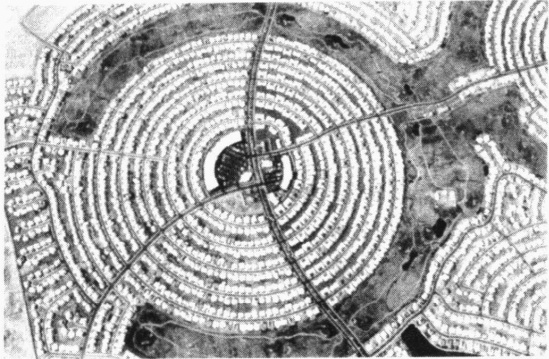

郊区一度是没有规划的，人们无规则地从城市搬往郊区去寻找田园般的生活。随着人口从城市往外涌出，一些郊区仍然没有规划。然而其它一些，如这幅图片中菲尼克斯的郊区，亚利桑那州的太阳城，在第一次动土之前就被详细地规划好了。你仔细地看一下，就会发现有跑道。

政治、经济独立和与城市隔绝，是保持自身利益的最好办法。他们不是不喜欢到城市工作、在周末享用那里的消遣活动，而是不愿意支付城市建设的账单。

看起来不断上涨的账单很快就要到期，而郊区居民则不得不为他们对城市弊端的漠不关心的态度付出代价。卡普等人(Karp et al., 1991)是这样说的：

郊区居民也许能与中心城市的问题保持距离(至少现在是这样)，但长远看来，富人会为不关心同情底层社会付出昂贵的代价。

城市时有的暴乱，也许就是账单的一部分。

逃离郊区 在一些地方，付账的日期很快就会到来。一些郊区重现了城市的境况，郊区居民正由于不断上升的犯罪率、中产阶级的迁离、税收的锐减和破烂的基础设施而感到失望。这次，轮到郊区产生螺旋式上升的不安全感，更多的中产阶级开始逃离这个地区，房价也一降再降。图 20.14 展示了这一过程，这是城市—郊区的新景象。

图 20.14 城市的成长和逃离

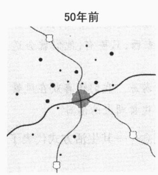

最初，城市及其周围村庄各自独立发展。

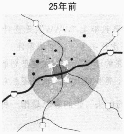

随着城市居民往郊区迁移，城市开始衰落，郊区随之发展起来。

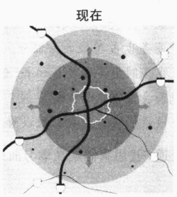

随着中产阶级继续向外迁移，城市问题开始在外围出现。

---

### 投资减缩和去工业化

随着城市税收缩减和服务设施水平的下降，住宅区变得恶化，银行开始拒绝房产抵押：为防止出现坏账，银行家划出出现问题的区域，拒绝给那里的人提供住房和商业贷款服务。投资减缩（disinvestment）使这些地区雪上加霜，青少年团伙犯罪和抢劫司空见惯，好的工作却没有——而这一切又与投资减缩有密切关系。

资本的全球化运动对美国城市是个沉重打击。正如在前面第14章提到的，为增加在国际市场上的竞争力，许多美国工业不在当地设厂。为寻找低廉劳动力成本，他们迁移到海外和南部边界。这个过程叫做去工业化（deindustrialization）。这虽然使美国工业更具竞争力，但也减少了美国制造业数百万的工作机会。由于缺乏新信息技术的训练，许多穷人无法分享席卷美国的后工业经济带来的利益。他们只能滞留在内城区，生活在绝望之中。

### 农村的复兴

美国正在经历一种前所未有的发展趋势：在20世纪70年代，人们开始从城市和郊区迁往农村地区；在90年代期间，美国农村7/10的县都呈现人口增长的势态。唯一的人口缩减发生在大平原和密西西比三角洲(K. Johnson, 1999)。小农业镇开始复苏，已经倒闭的商店和学校重又面向商人和学生开放。

友生这一根本转变的推刀是对城市犯罪及暴刀的担心，拉刀则是农村的安全、低消费水平、消遣和更多空间。加速这场运动的因素是交通和通信的改善。州际高速公路，使人们很快就能到达机场。通过卫星通讯、电话、传真机、因特网，人们就能与城市中、世界上的任何人联系，即使短时间之前，他们的住处还隔得很远。

下面听听我先前一位学生的妻子讲述的她与她丈夫迁居农村地区的原因,那里与他们每周都要去的国际机场有3个小时的路程:

我在一家加拿大公司工作，保罗为一家总部在巴黎的法国公司工作。他在国内到处飞行，给人做电脑顾问，我则给商人开设动机激励研讨会。我们只要可能，就一起开车去机场，然后走不同的路线。我尽量每年跟我丈夫去一趟巴黎。

我们周末几乎都在家一起度过。通常可以安排3—4天度周末，因为我能在家准备研讨会的材料，而保罗也能在这儿做些咨询工作。

有时购物挺不方便，但我们开车去时不必费事锁上车门。新沃尔马超市就能满足我们的大部分需要。电子商务也占了很大一部分。只要我敲上“WWW”，无论什么东西，只要有，他们就会送到我家门口。我在网上买化妆品和书，有一次还买了一个电炉零件。

为什么我们会住在这里？看看那个漂亮的湖吧。我们在这里划船和游泳。我们还喜欢在风景如画的环境里散步。在这里我们可以看到小鹿和野火鸡。我们还非常喜欢看湖上的落日。

她接着补充道“我想我们是在学习曲线的前头”，她的意思是指一种观念——其生活方式代表了未来的潮流。

### 城市复兴的势头

社会政策通常会有两种形式。第一种是先拆掉再重建，可用一个奇怪的术语称之为城市更新(urban

---

renewal）。结果是一个地区的焕然一新，但这无益于城市居民。虽然体育馆、高耸的公寓、豪华的酒馆、商店代替了衰败、便宜的住房，但由于过高的价格超出了居民的支付能力，所以他们最后都被赶到邻近地区。

第二种方式是建立一些企业新区(enterprise zone)，提供经济优惠条件，比如减税来吸引商人投资。尽管动机很好，但通常却以失败而告终。大多数商人都不愿在犯罪率高的地区投资。即使是落户在那里的人，也要为安全和犯罪损失付上高昂的代价，而这些钱比省下的上缴税款多多了。即使在这些有问题的区域雇佣工人，并付上足够的工资(通常不大可能)，工人还是照样会移居到更好的地方，而这到头来也帮助不了这个地区(Lemann，1994)。毕竟，谁愿意住在暴力的恐惧之中呢？

成功的企业新区的一个例子是“联邦赋权特区”（Federal Empowerment Zones）。除了税收优惠，这项计划还提供面向重建地区的微利贷款。这实际上是与投资减缩相反的一种做法。前面提到的哈莱姆的复兴就是例证。促进这种转变的原因在于把哈莱姆列为联邦赋权区。这种经济刺激导致商店、干洗店、视频商店的复苏，并吸引了期望享用这些服务的城市居民。随着中产阶级搬回这里，对各种商店的需求就必须随之得到满足。一种自身的循环发展，代替了以往失望、犯罪、药物滥用、投资减缩的恶性循环。

美国的城市能够复兴起来，变得安全，并适合人们居住。城市本身并不存在成为危险的贫民窟的本性，比如大多数欧洲城市都是既安全又舒适。如果美国城市想要改变以往形象，它们就必须被提上美国政府的首要议事日程。必须集中足够的资源，包括财力和人力，来摆脱城市的灾难。在哈莱姆和芝加哥北部城镇，我们已经开始看到成功的曙光，甚至是先前暴乱成灾的洛杉矶东部，也给我们预示了成功的转变是可能的。

也许我们需要的是一个治理城市问题的曼哈顿计划。在二战期间，美国政府和联军面对的是希特勒在欧洲的压倒性优势和东条英机在亚洲的胜利。美国政府聚集起它的最高智慧的科学家来制造原子弹，这项行动的代号就叫“曼哈顿计划”。它包括全国37个军事基地，至少37所大学实验室，10万人以上，还有几位获诺贝尔奖的物理学家。如果今天联邦政府也能投入同样的资源用到城市问题上，我们为什么就不能看到类似的胜利呢？

新楼换旧楼并不是解决问题的办法。相反，构建社区的社会学的基本原则必须要遵守。以下是社会学家威廉·弗拉纳根（Flanagan，1990）提出的一些指导性原则：

规模。地区性和全国性的计划很有必要。在与各方博弈后，地区最后的决定会以许多不可行的大杂烩的解决方式告终。一个成功的例子是俄勒冈州的波特兰，当地政府禁止城市向周边侵入，并保留了一个绿化带。

适合居住性。城市必须能吸引人，并能满足人们、特别是社区的需要，这些我们上面已经讨论过了。这一点会吸引中产阶级住进社区，这样就会使税收收入增加。随之而来就会有更多资金支持服务设施建设，这些服务设施能使我们的城市变得更适合居住。

社会公正。最后要分析的是，对社会政策的评价，最终必须由它如何影响到人们来衡量。“城市更新”计划如果是为了中产阶级和有钱人的利益而驱赶穷人，就不符合这条标准。同样，如果是为了创造特殊群体的“适合居住性”而忽视了穷人和无家可归者，也是违反这条标准的。

---

最后，很重要的一点是，除非我们聚焦于城市问题的根源——贫穷、落后的居住条件、破烂的学校、失业，否则我们想出的解决办法充其量也不过是暂时掩盖问题的“邦迪”止血胶布。这样的做法，将会成为那些看起来似乎是为解决影响我们生活质量的问题而作出建设性事情的政客们的形象工程罢了。

### 本章小结

### ☆一个没有空间去享受生活的星球？

### 马尔萨斯挑起了什么争论？

1798年，马尔萨斯分析得出欧洲人口的上涨趋势。他的结论被称为马尔萨斯定理，认为由于人口呈几何级数增长，而食物供应呈算术级数增长，所以世界人口的增长最终将会超出食物增长。直到今天，支持马尔萨斯的新马尔萨斯主义者和反马尔萨斯主义者的争论仍在持续。

### 为什么人们会挨饿？

挨饿不是由于世界缺乏粮食,因为今天每个人拥有的粮食比50年前的要多。挨饿是由于干旱和内战引起的食物分配不均造成的。

### ☆人口增长

### 为什么贫穷国家会有那么多小孩？

在工业化不发达国家，孩子被看成上帝赐予的礼物。他们不需花费很多来抚养，并且在很小的年纪就能为家庭收入作出贡献，还代表了父母的社会安全感。所有这些因素激励了人们创建大家庭。

### 三 个人口变量是什么？

人口学家用生育率、死亡率、迁移率来计算人口增长。基本的人口公式是：出生率减死亡率加上净迁移率等于人口增长率。

### 为什么预测人口很困难？

一个国家的人口增长受到许多不确定性因素的影响，包括经济周期、战争、饥荒、工业化和社会政策等。

### ☆城市化

### 城市跟农业、工业革命的关系是什么？

只有当农业有很大盈余，使一部分人免于农业生产时，城市才能发展起来。城市发展的重要推动力是5000—6000年前犁耕技术的发明。综观历史，以前的城市都是无一例外的小。自从工业革命刺激了交通和通信的快速发展后，城市得以迅速发展并变得大多了。今天城市化是如此深入，以至于出现了一些能控制周围地区的大都市。大都市影响的地区联合起来又构成特大都市。

### ☆城市增长的几种模式

### 城市增长提出了哪些模型？

最主要的包括同心圆、扇形、多核心及边缘模型。这些模型都不适合运用到古代和中世纪城市、许多欧洲城市、不发达国家的城市和城市规划中。

---

### ☆城市生活：疏离与社群

城市天生就是疏离的吗？

尽管一些人在城市里体验到的是疏离感，另一些人则在这里找到了社群感。居住在城市的五种类型的人是世界公民、单身者、同族村民、被剥夺者和陷入困境者。

### ☆城市问题和社会政策

### 为什么美国城市会衰退？

衰退的三种主要原因是郊区化(随着人们迁居郊区,税收收入下降、基础服务设施被破坏),投资减缩(银行撤回资金),去工业化(导致工作的消失)。

### 农村复兴是什么？

由于人们逃离城市和郊区,大部分美国农村地区的人口开始增长。这是从几百年前就开始的一场基本转移运动。

### 什么社会政策能挽救美国城市？

治理城市问题的曼哈顿计划似乎能提供可行的解决办法。三个制定城市社会政策的指导性原则是规模、适合居住性和社会公正。

### 批判思考题

1. 你认为地球会受到人口爆炸的威胁吗？从本章中找出数据来支持你的观点。

2. 为什么人口学家不能对国家未来的人口作出准确的预测？

3. 城市问题产生的根源是什么？我们如何才能解决这些问题？