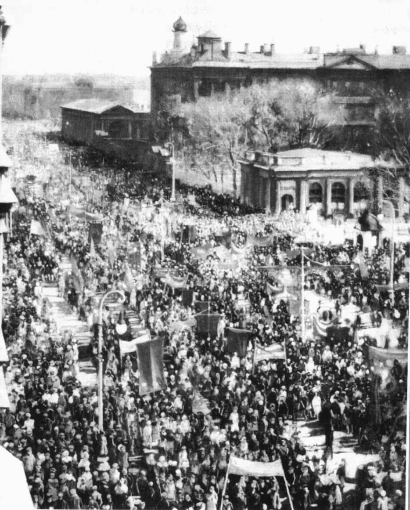
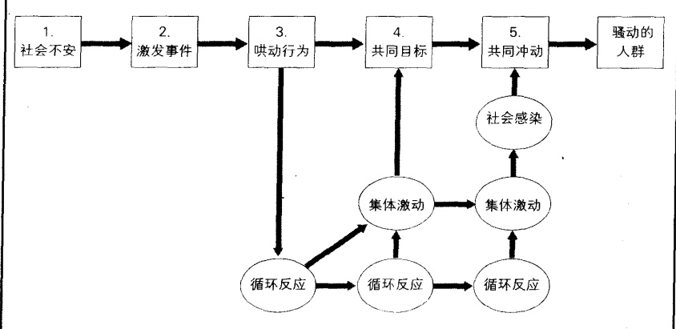
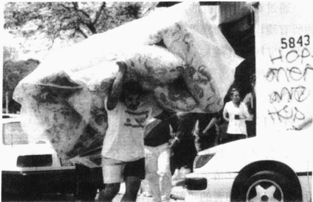
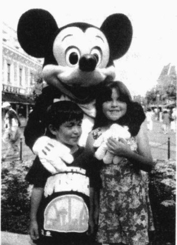
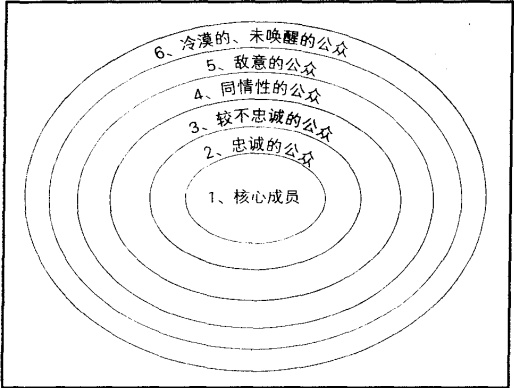
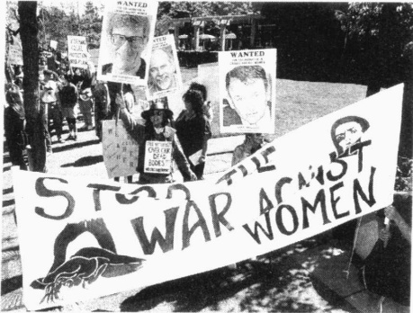
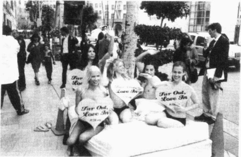
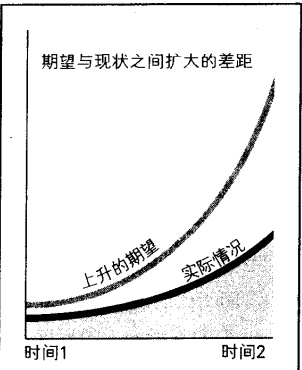

# 第 21 章 集体行为和社会运动

The quick brown fox jumps over the lazy dog.

天祥村集

艾萨克·布罗德斯基

《游行》(1930)

---

### 集体行为

·早期解释：个人的变型人群如何改变个体

骚动的人群

·当代观点：人群的理性

依限最佳策略

应变规范

· 集体行为的形式

暴乱

谣言

恐慌和大众性歇斯底里

道德恐慌

狂热和时尚

都市传闻

### 社会运动

· 社会运动的类型与策略  

社会运动的类型  

社会运动的策略  

宣传和大众媒体

·人们为什么参加社会运动？

大众社会理论

剥夺理论

道德问题和意识形态要求

一个特例: 密探

· 社会运动的成败  

社会运动的发展阶段  

阻碍重重的成功之路

·本章小结

---

### 第 21 章 集体行为和社会运动

一位警官被杀死了，消息像野火一样蔓延开来。在仅仅20分钟内，这些白人们武装起来并涌向小屋。男人们和小男孩(有些甚至不到12岁)都拿着步枪、散弹猎枪和手枪。

暴民们(现在已经增加到400人左右)包围了这座原木小屋,把一根绳子系在这个人的脖子上,并把他拖向市中心。当男人们议论杀死这个人的最好办法时,女人和孩子们纷纷响应他们的意见——吊死他,有些人则说将他活活烧死。

一些人从一个商店里拖出一个很大的木制盒子，将它放在街中心。另一些人将它塞满稻草。接着他们举起这个人，并将他的头猛挤入盒子中，那根绳子仍然缠在他的脖子上。其中一个人往他身上倒满了油，另一个人则擦着了火柴。

当火苗往上冒起时，那个人企图从盒子中挣脱出来，这时大火已经蔓延到了他的身上。为了使他的脸和眼睛避开火苗，他跑了大约6米远，刚好是绳子的长度，这时人群中有人喊道“开枪！”瞬间，许多子弹飞出来，男人和孩子们走向已经奄奄一息的他并纷纷朝他射击。

他们把那个人的尸体拖回燃烧着的盒子，并堆上了从商店里拖出来的其他更多的盒子，而且在它们上面倒满了油。每当有人往火苗上倒更多的油时，人群中总会发出叫好声。

站在大约22米外，我可以闻到那个可怜的人身体被烧焦的味道。人群中没有人试图去掩饰他们的身份，我很清楚地看到镇上的官员也在人群中，在这次事件中“帮忙”。验尸官应付差事似的进行了检查，得出的结论是，那个人的死亡“是一群被激怒的、不知法的暴民造成的”。除了这他还能得出什么结论？这个镇上任何一名陪审员都会是与那个人的死亡有关的人。

后来他们在街道一边挖了一个小坑，将那个人的骨灰和他身体所剩的部分埋了进去。

这个人的名字叫萨姆·佩蒂，任何人都知道他是一个温和的、非攻击性的人。当然我不能提我的名字，如果我那样作了，我也得自杀(才能得以解脱)。

(基于 1914 年 5 月致 The Crisis 的一封信)

### 集体行为

为什么这个小镇的人们“变得如此疯狂”？这些男人——以及在旁边响应的女人——都是普通的遵纪守法的公民。甚至一些“社区的重要人物”也参加了对萨姆·佩蒂的恶性残害，而萨姆·佩蒂很可能是清白的。

私刑是集体行为（collective behavior）的一种形式，集体行为中的“行为”是由一群超越了控制他们行为的通常规范的人们所作出的不寻常的行为（Turner and Killian，1987；Harper and Leicht，2002）。集体行为是一个很宽泛的术语，它不仅包括诸如私刑和暴乱这样的暴力行为，还包括恐慌、谣言、狂热和时尚。在分析它的具体形式之前，我们先来了解一下那些试图解释集体行为的理论。

---

### ☑ 早期解释: 个人的变型

当人们不能理解某事时，他们通常就会借助“疯狂”来进行解释。人们可能会说：“她精神失常了——这就是为什么她把车开下了桥。”“他可能发疯了，否则他不会朝人群开枪。”关于集体行为的早期解释就是基于这样的假设。让我们看看这些观点是怎样发展起来的。

### 人群如何改变个体

当英国的新闻工作者——查尔斯·麦凯（Charles Mackay，1814—1889）注意到“乡村野夫”时，集体行为的研究就开始了。这些“乡村野夫”通常都是很理性的人，但有时却也会“发疯”，当他们形成一个群体时，他们就会作出一些“可耻的、暴力性的事情”。麦凯（Mackay，1852）所能提出的最好的解释，就是认为这些人有一种“动物脑子”——即他们像一群突然就开始惊跑、奔窜的牛。

大约50年后，法国心理学家古斯塔夫·利本（Gustave LeBon，1841—1931）发展了这些最初的思想。在其1895年写成的一本书中，利本强调指出了，在人群中人们是如何认为没有人认识自己，从而对他们的所作所为不去负更多责任的。有些人甚至还形成了一种无所畏惧的思想，并开始认为，事实上，他们可以做任何事情。他说，一种集体意志（collective mind）形成后，人们会被任何一个建议冲昏头脑。接着，在某种程度上类似于群体昏迷的感染就会盛行起来，它释放了社会曾经特别小心地压制的破坏性本能。

曾经在德国求学，并于1904年写过一篇关于人群的论文的美国社会学家罗伯特·帕克，也深受利本的影响(McPhail,1991)。当帕克开始在芝加哥大学任教后，他提出了“社会骚动”和“循环反应”，丰富了原有的思想。他说，

“社会骚动”……是从一个个体传播到另一个……这样就使A所具有的不满表现传达给B，接着又从B回传到A。(Park and Burgess,1921)

帕克用“循环反应”(circular reaction)这一术语来指涉这种来回的传递。他说，这种“循环反应”造成了一种“集体冲动”，这种“集体冲动”一产生就开始“支配人群中的所有成员”。如果这种“集体冲动”听起来就像利本的“集体意志”的话，那是因为它实际上就是“集体意志”。正如上文所提出的，帕克深受利本的影响，他的稍微有所不同的用语丝毫没有改变这种基本思想。

### 骚动的人群

曾师从帕克的赫伯特·布鲁默(Hebert Blumer，1900—1987)综合了利本和帕克的思想。正如从图21.1中所看到的，布鲁默把他称之为“骚动的人群”的形成，划分成了五个阶段。所谓骚动的人群(acting crowd)就是朝向一个目标行动的一群兴奋的人。布鲁默所提出的这一模型，仍然主导着今天的警察关于群体行为的处置方法(McPhail，1989)。让我们把这一模型应用于萨姆·佩蒂被杀一事看一看。

1. 紧张或不安。集体行为的根源在于存在着紧张或不安的背景条件。当人们受到某些社会情况困扰时，就会担心或焦虑，这又使他们变得易受谣言和建议的影响。萨姆·佩蒂是在20年代早期被处以私刑的，在这一时期，传统的南方生活处于剧变之中。由于工业化，数百万美国人从农场迁到城市，从南方到北方去寻找工作。最后剩下的是很穷的、生活在农村中的南方人，不管肤色是黑还是白，他们都面

---

图21.1 布鲁默关于骚动的人群如何发展的模型

资料来源：McPhail（1991:11）。

临着一个没有任何指望、令人沮丧的未来。另外，非裔美国人也日益质疑他们所处的较低的地位和被剥夺的合法性。

2. 激发事件。当一个激发事件发生时，这个事件是如此的令人触目惊心，以至于人们都被它震惊了。在这个例子中，这个激发事件就是对一个警察的杀害。

3. 哄动。接下来就是哄动(milling)，人们或站立不动或走来走去，纷纷讨论那个激发事件。这时循环反应就开始起作用了。在人们把彼此的暗示作为想法和感受的“正确”方式时，他们彼此之间也在相互强化。在对萨姆·佩蒂施加私刑的暴民处于混乱的短暂时间内，这个小镇上的白种居民在讨论这个警官的死时，也开始变得异常激动。

4. 共同的关注目标。在这一阶段，人们的注意力开始固定在事件的某一方面，他们陷于集体激动之中。在这个例子中，人们的注意力转向萨姆·佩蒂，有人可能会说，他事前曾与那个被杀的警官讲过话或争论过。

5. 共同冲动。人们认为他们对应该怎么做持有一致的观点。这种共同冲动是由社会感染激发的，这种社会感染是一种从一个人传到另一个人的激动。在这个事例中，人们得出结论，即只有这个人立即在大家面前死去，才是最适当的报复——也能作为对其他想过要“出轨”的非裔美国人的警告。

骚动的人群也不总是像这个事例中的人们那样消极或具有破坏性，像有些包括针对压迫所产生的自发的示威。它们也不都是很严重的，如参加绝食的学生也是骚动的人群。

### ☑当代观点：人群的理性

如果让我们去看一场私刑——或者一群惊叫着的暴民，或者一起监狱中的暴动——我们中大多数人可能都会认可利本的观点，认为某种类型的“疯狂”在人群中蔓延。但是现代社会学家指出，在这一嘈

---

杂的表面之下，群众事实上是很理性的（Yamaguchi，2000；Horowitz，2001）。他们指出，人群会采取预先已经有准备的步骤去达成某些目的。正如社会学家克拉克·麦克菲尔（McPhail，1991）所说的，即便是一群“执行”私刑的暴民，也是合作的——当一些人按住那个受害人时，另一些人拿来绳子，一些人打结，而另一些人就将受害人吊起来。你从佩蒂的“死刑”中完全可以看到人们是相互合作这一点的，包括拿绳子、盒子、柴草和油。

### 依限最佳策略

人类行为的一个基本原则就是我们试图使我们的成本最小化而使我们的报酬最大化。社会学家理查德·伯克(Berk, 1974)称其为“依限最佳策略”(minimax strategy)。如果我们能从某件事中预期到较小的成本和较大的回报，我们就越有可能去做这件事。例如，如果我们相信其他人会支持某一行为，我们做的可能性就会增加。不管是一次足球比赛中一个糟糕的判罚之后，有些人要求痛打裁判一顿；还是对那个人施加“私刑”的暴民中的一员要求将受害人处死，这个原则都会起作用。总之，无论人们是与一些朋友打牌，还是会成为暴民中的一员，人类行为中的这一基本原则都是不变的。

### 应变规范

既然集体行为是种特殊的行为，那么它是否还包括特殊的规范呢？社会学家拉尔夫·特纳和刘易斯·基利安(Killian,1987)用应变规范(emergent norms)这一术语来表达这种思想。他们指出，生活通常正如我们所期望的那样发生，这样我们那些日常规范也就足以应付日常生活。但是，如果我们做事的习惯方式被打乱，我们的日常规范就可能不会满足新情况的需要。为了应对这些新情况，人们就可能会发展出一些新的规范。他们甚至可能提出关于是非的新定义，认为这些新的情况证明了他们原先认为错误的行为是正当的。

为了理解新的规范是如何形成的,我们需要记住,并不是人群中每个人都持有相同的观点(Snow et al., 1993b; Rodriguez, 1994)。正如特纳和基利安所指出的,人群中至少有5种类型的参与者:

1. 自我卷入者在特殊的事件中能感受到个人的利害关系。

2. 涉及的人在事件中也有个人利益，但不如自我卷入者强烈。

3. 不坚定的参加者对事件并不很关心，但他们参加人群是因为它能给他们一种权力感、安全感，或者说是归属感。

4. 好奇的旁观者对问题也不很关心，他们只是对正在发生的事情感到好奇。

5. 渔利者并不关心事件，他们只是利用它为自己的目的服务，比如兜售食品或T恤。例如，一场摇滚音乐会对他们来说刚好合适。

为了使人群不远离行动的具体道路，“自我卷入者”担当了最重要的角色。他们中的一些人提出该做什么的建议；另一些则采取行动。当“涉及的人”加入之后，他们也会影响人群。当事件变得白热化时，那些“不坚定者”和“好奇的旁观者”也可能会加入。尽管“渔利者”不可能参与，但他们确实给了人群一些消极性的支持。一种共同情绪完成了新规范的形成：在日常生活中“不好”的活动，现在看起来则“很好”——不管是他们参与往警察身上扔瓶子，或是冲着大学校长喊很下流的话。

---

通过对应急规范的这些分析，我们看到集体行为是理性的。例如，人群并不认为自我卷入者所提出的所有建议都是同样重要的：若要被接受，这些建议必须与人群已经具有的倾向相适合。这样，这一分析就与早期的解释大不相同。早期解释认为，人们很大程度上是被人群“改变”了，以至于他们都失去了自己的思想。

### ☑ 集体行为的形式

社会学家分析集体行为的方式，与他们分析其他形式的行为的方式是一样的。他们认为，集体行为是常人应对特殊情境时的活动。他们考虑的是那些关于人们的反应的通常的问题，诸如，人们是怎样相互影响的？参加者的年龄、性别、种族和社会阶级有什么重要性？他们原有的态度是什么？他们如何理解当前的形势？他们的理解如何转变为行动？

除了私刑，集体行为还包括暴乱、谣言、恐慌、大众性歇斯底里、道德恐慌、狂热、时尚以及都市传闻。下面让我们分别了解一下。

### 暴乱

当电视中出现洛杉矶的警官用他们的警棍殴打一名违反交通规则的非裔美国人的画面时，全国人民看得触目惊心。录像带显示，这些警官用警棍疯狂地抽打一名平躺在他们脚下的男子。全美国的电视台甚至全世界的电视台都播放了这些画面，这使观众异常震惊。

当这些警官们由于殴打那名被确认为罗德尼·金的男子而接受审讯时，判决除了有罪还能是什么？但是一个包含11个白人和1名亚裔美国人的陪审团却作出“警官是清白的，并没有过度使用暴力”的结论。这一判决引发了一场暴乱——一场针对人身和财产的暴力性群众行为。在判决宣布后的几分钟内，愤怒的人群开始聚集在洛杉矶。那天夜里，暴民们烧毁了很多商店，并疯狂地抢劫和纵火。暴乱蔓延到其他城市，包括亚特兰大、坛帕、拉斯维加斯，甚至还包括威斯康辛的麦迪逊。白人和韩国人是暴力的主要目标。

当看到洛杉矶某些地区烟火四起，看到那些抢掠者在警察眼皮底下拖走电视机和沙发，而警察则束手无策时，电视机前的美国人又一次惊呆了。雷金纳德·丹尼的那一幕最能使人深入探究公众的集体意识，丹尼是一个36岁的白人卡车司机，事发时，他被猛拖出他的卡车。正当他茫然地坐在街上时，达米安·威廉斯笑着用一节混凝土打碎了他的头盖骨。

第三天晚上，暴民们已经放了400多处火，杀害了30多人。这时，乔治·布什总统在国家电视台上宣布，美国司法部已经委派检查官对那些警察提起联邦诉讼。总统强调说，他已经命令第七步兵团、特种战争装甲部队（SWAT）和联邦调查局人员前往洛杉矶。他还要求加利福尼亚州国民卫队接受参谋长联席会议主席科林·鲍威尔的指挥。罗德尼·金在电视台上露面，他泪流满面，祈求和平。

洛杉矶暴乱是内战以来伤亡最为惨重的一次。直到整个事件结束，共有54人死亡，2328人在急诊室接受治疗，成千上万的商业机构被烧毁，有大约10亿美元的财产被毁坏。后来，依照联邦法令，那些警官中有2人被判处2年有期徒刑，金则获得了数百万美元的补偿。（Rose，1992；Stevens and Lubman，1992；Holden and Rose，1993；Cannon，1998）

---

城市暴乱的背景条件是由被剥夺感带来的挫折和愤怒。挫折和愤怒主要发生在那些被拒之于主流社会之外的人身上——他们被限制在一个缺乏教育、没有工作机会、也没有公平的范围内。这时，一个突发事件就会把那些郁结的、压抑的情感带到一个沸腾点，接着它们就会爆发为集体暴力。所有这些条件在洛杉矶暴乱中都存在，陪审团的判决就是那个突发事件。

社会学家发现，不仅仅是被剥夺者参与暴乱。针对罗德尼·金的判决，最先参与暴动的那些人并非来自那些最贫穷的居民点，而是来自那些生活比较稳定的居民区。与之相似的是，在1968年小马丁·路德·金博士被暗杀之后，大多数美国城市都爆发了

正如正文中所解释的，人们参加暴乱的原因是不同的。在1992年由对罗德尼·金的判决而引发的洛杉矶暴乱中，有些人之所以参加暴乱是因为他们被判决的结果激怒了，另一些人之所以参加暴乱则是因为他们对曾受到警察处置感到生气。然而，对一些人来说，这场暴乱仅仅提供了一个抢掠商店的机会。

暴乱，甚至一些具有较好工作的人也参与了暴乱（McPhail，1991）。为什么中产阶级的人们也会参与暴乱？社会学家维克托·罗德里格斯（Rodriguez，1994）指出，答案是相同的：挫折与愤怒。尽管他们有工作而且也过着比较稳定的生活，但少数中产阶级却憎恨其被作为二等公民来看待。

促成暴乱的事件不如暴乱产生的一般背景那么重要。突发事件是唯一能点燃燃料的火柴。这个燃料就是紧张和不安的背景——人们感到没有正义，或者长官们都纵容或鼓励不公平。平静的表面之下隐藏着沸腾的愤怒，只需一根火柴便可爆发。诸如关于罗德尼·金的判决，不仅是那些穷人感到紧张和愤恨，那些物质生活比较富裕的人也有这种感觉。突发事件使这种感觉明朗化，也促进了两个群体的相互合作。参与暴乱的还有机会主义者——即那些既不愤恨自己的一般状况，也不对突发事件感到愤怒的人。对于他们来言，暴乱仅仅提供了一个抢掠的机会——或者只是为了分享一种兴奋感。

### 谣言

在《阿拉丁》中，年轻英俊的主角嘀咕道：“所有的好孩子，都脱光衣服。”在《狮子王》中，那个调皮可爱的狮子王辛巴，搅起一团尘土，在屏幕上漂浮成了S-E-X这个词。而在《小美人鱼》中，主持婚礼的主教显然想蠢蠢欲动。

安·朗格是一位有着八个孩子的母亲，她有大量好看的迪斯尼动画影片，当听说《魔术王国》传递淫秽信息时，她感到被欺骗了。她说：“我觉得好像把我的孩子们委托给了恋童癖患者。”（Bannon，1995）

谣言(rumor) 是从一个人传到另一个人的，关于某一有意思的主题的未经证实的信息。由于起源于模糊不清的背景，谣言补缺了那些不明确的信息(Turner, 1964; Shibutani, 1966; Fine and Turner, 2001)。为了回应这类特殊的谣言，迪斯尼公司报道说，阿拉丁确实说“快跑，好老虎，脱掉衣服赶快走”。这句话确实有些让人难以理解，而且表达相当含糊，以至于让那些人听到了他们想听的信息，甚至使人们误认为这句话

---

就是鼓励十多岁的儿童去放纵。类似的含糊性也存在于辛巴的尘土和被撩起的主教那里。

大多数谣言都是短暂的。它们产生于含糊不清的情境中，等到事实性的信息出现，或另一个谣言产生时，原来的谣言就消失了。但是有时，谣言也会存在很长时间。

在 18 和 19 世纪，由于一些不为人知的原因，健康的人们变得身体衰弱，然后慢慢死去。没有人知道原因，人们只是说他们有肺病（现在被称为肺结核）。人们非常惊恐地看到，自己深爱的人逐渐萎缩得只剩下一副骨头架。在没有人知道这个病什么时候“停止”，也不知道谁会成为下一个受害者的情况下，谣言产生了。谣言宣称，是一些已经死去的人变成了吸血鬼似的东西。每到晚上，他们就从坟墓里出来去吸活人的血。证据是难以驳斥的——因为人们亲眼看到深爱的人逐渐消瘦下去。为了杀死这些吸血鬼似的“尚未完全死的人”，人们偷偷地溜进坟地。他们挖开坟墓，拿走“死人”的腿骨并将其安在胸骨上，把“死人”的头盖骨安在脚上，这样就成了一种“骷髅画”似的形状。在杀死“尚未完全死的人”之后，他们把剩下的又重新埋葬起来。这类谣言以及所引起的对死人遗体的毁

谣言因《魔术王国》的虚构情节侵蚀了儿童的道德而起。米老鼠能成为一股黑暗的力量吗？这些儿童是它的受害者吗？尽管这看起来是非常滑稽可笑的，但是一些人对待这些谣言的态度却是非常认真的。

坏，在新英格兰断断续续地一直持续到19世纪90年代。(Associated Press, November 30, 1993)

大多数谣言不仅存在时间短，而且也很少有结果。但是有时，正如下面的“现实社会学”专栏中所讨论的那样，谣言也会严重影响人们的生活，甚至是整个社区的生活。

### 现实社会学

### 谣言和暴乱：塔尔萨暴乱的目击报道

1921年，俄克拉何马州的塔尔萨被一场种族暴乱弄得支离破碎。这场暴乱纯粹起源于一个谣言。当时塔尔萨的黑人社区已经很兴旺，而且富有活力。许多黑人都拥有自己的经营项目，同白人竞争也非常成功。5月31日当一个黑人被指控袭击一个白人女孩之后，一切都变了。

巴克·科尔伯特·富兰克林(Franklin and Franklin, 1997) 是那时塔尔萨的一名黑人律师，事发时他就在现场。下面是他所说的：

成百上千的人带着已经扣开扳机的枪从四面八方涌过来。当时我正站在办公室的台阶上，我刚一看到他们就立刻被“逮捕”了，并被带到众多拘留营中的一个关了起来。那时，在空中盘旋的飞机，不断地往已被抢掠一空的大楼里扔炸弹，大卡车则把各种各样的家具和其他家居用品都拉走了。

与以后的暴乱不同的是,这次是白人抢掠者闯入黑人的商店并烧毁其家具。

富兰克林继续讲道：

不久我又回到街上,但是我的办公室所属的那栋楼已经变成了一个冒着余火的废墟,我所有的法律书籍和办公用具都被烧成灰烬。在此前几个小

---

时，我曾回过一趟家，当时还好好的，但现在它也变成了一片灰烬，连同我所有的衣服和所有准备用来搬家的钱。任何人所能看到的是，没有一个黑人居住区或商店还立着……昨天还是很富有、很悠闲地住在漂亮房子里的黑人，现在都变成了乞丐，成了靠大家养活的人，终日靠别人的施舍过活。

暴乱烧毁了所有黑人的教堂，包括刚刚建成的壮观的施洗礼者教堂。黑人所有的家园、商店和教堂，都因纵火和炸弹而毁坏。成片的街区都变成了废墟，就像龙卷风刚袭击过该地区一样。

那个因对别人进行袭击而被指控的青年人怎么样了呢？正是这一“骚扰事件”引发了这场暴乱。富兰克林说，警察来调查过，发现并没有什么袭击。这个人所做的一切只是在拥挤的电梯上，无意间踩了一个女士的脚。如富兰克林所说，“她变得非常愤怒，并打了他一个耳光，接着一个冒失的、初出茅庐的新闻记者就在他所负责的报纸上作了一个错误的报道，说一个黑人袭击了一个白人女孩，显然这个记者没有任何经验，却又急于在报上出名。”

### 思考题

把自己置于这一历史背景，我们可能很难想象，踩了一下别人的脚竟会引发这样的灾难，但事实却是如此。你能运用社会学关于谣言和暴动的研究结果去解释塔尔萨暴乱吗？你认为，为什么这么多白人会相信这一谣言，而且他们中的一些人会如此急切地去破坏这个繁荣的黑人社区？在这类暴乱中，社会学家所说的隐藏的“沸腾的愤怒”是什么？

为什么人们会相信谣言？已经确定有三个主要方面的因素在起作用。谣言涉及的是对个体来说很重要的对象，而且它们能用某种形式的确定性取代模糊性。此外，它们还能归结于一个比较可信的来源。办公室的谣言可能会这样开头：“简有可靠消息说”或“比尔偷听到老板说……”

谣言的兴起源于模糊性或不确定性，因为如果人们知道了关于某一情况的事实，谣言可能就没有存在的机会了。被包围在无法解释的疾病和死亡中，新英格兰的人们也曾思考人们为什么死去。面对这些令人困惑的事情，那些相当离奇的结论给了他们一些确定性。促使迪斯尼谣言兴起的不确定性，可能反映了一些人的想法，那就是认为现代社会的道德构架正在衰落。

谣言通常是从一个人直接传播到另一个人，但是正如我们从塔尔萨暴乱中所看到的，谣言也可能起源于大众传媒。正像下面的“现实社会学”专栏所阐述的，因特网也会成为谣言的一个来源。

### 现实社会学

### 到处潜伏着危险: 因特网和生活中的不确定性

大众社会中的生活充满了不确定性。刚从街道对面搬过来的新邻居可能是调戏儿童者，隔壁的家伙可能是个强奸犯。到处潜伏着邪恶。而且，谁知道呢？你可能就是下一个受害者。

或者是这样。在不确定性的海洋里撒下了一张面向我们那苦恼的疑心的网。下面是我收到的一封电子邮件：

请认真阅读这封邮件……接着把它发给你知道的所有在线的人。不要不当回事；这是一件你应该注意的事。

如果一个网名叫 Slave-Master（奴隶—主人）的人与你联系，千万不要回应。

不要与这个人聊天,不要回复他 / 她任何即时的信息或邮件。

---

到目前为止,他已经杀死了56个在网上同他聊天的女人。

请将这封邮件发给你好友中所有的女人,同时告诉她们把这封邮件照样发给别人。

迄今为止，他已上过美国 Yahoo 公司(Yahoo、美国在线服务公司(AOL)和 Excite 的网站，这绝对不是开玩笑！

请也将它发给男士们……以防万一！

### 思考题

与谣言相关的三个主要因素——重要性、模糊性和来源——是如何应用到这篇短文中的？它们不能应用于哪些情况？

### 恐慌和大众性歇斯底里

1938年，在万圣节前夕的一个晚上，一个电台的舞蹈音乐节目突然被一则报道打断，报道说在火星表面观测到爆炸现象。这个播音员还说，已经发现了一根来源不明的圆柱体，它插进了新泽西州一个农场的地里。接着电台又转到农场上，说在那里，一个气喘吁吁的记者对这个来自火星、外形恐怖的圆柱体作了详细的报道，指出它们那些死亡光线武器具有不为人知的破坏力。然后，一名天文学家又确认了火星人正在入侵地球这一事实。

可能有 600 万美国人收听了这一广播。其中约有 100 万人被吓坏了。数以千计的人恐慌起来，抓起他们的武器，或躲进地下室或跑到街道上。数以百计的人匆匆遣散他们的家人，跳进他们的汽车，拥塞在路上，驶向谁也不知道的方向。

当然，根本就没有什么入侵。这只是H.G.韦尔斯的《世界大战》的改编本，这部影片由奥斯·韦尔斯担任主角。在节目的前面有一个公告，而且在中间也有说明这纯属虚构，但是很明显，很多人都没有注意到。尽管对这则节目的恐慌反应对我们来说可能显得好笑，但当时的情境对于任何一个处于恐慌中的人来说，一点都不好笑。当人们如此担心以至于不能正常生活甚至选择逃离时，恐慌（panic）就发生了。

在这个例子中，人们为什么会恐慌？心理学家哈德利·坎特里尔(Cantril, 1941)把这种反应归因于对世界状况的普遍忧虑。纳粹在欧洲侵略时，成百万的美国人(确切地说，最终证明是)担心美国也会被牵连进去。他说，战争使人紧张，这就为这则广播引起大家的恐慌创造了丰富的土壤。

但是当代分析家则质疑究竟是否有恐慌。社会学家威廉·班布里奇(Bainbridge，1989)承认，有些人确实受到了惊吓，而且事实上确实有一部分人上了车并像狂躁症患者一样疯狂地开车。但他指出，有名的恐慌大都是由新闻媒体制造的。新闻工作者发现了一个好故事，接着对之进行添油加醋，加以夸张，弄得好像真的发生了似的。

班布里奇提到了瑞典1973年发生的那一事件。为了夸大原子动力的危险，瑞典电视台播放了一个关于在核电站发生意外事故的剧本。知道美国1938年类似播放的效应，瑞典社会学家等待着去观察将会发生的事情。人们会不会没有意识到它只是一个改编本？人们会不会因害怕破裂的反应堆可能泄漏的辐射性气体而恐慌？但是社会学家没有发现恐慌的迹象。一小部分人确实受了惊吓，有些人打电话给家人和警察部门；另一些人则关上窗户以防辐射性物体进入——如果考虑到他们认为发生了什么，这些都是合理的反应。

---

但是瑞典的媒体却报道了一个恐慌。很显然，一个记者给两个警察局打电话，而且也已经获悉两个警察局都接到了一些相关居民的电话。面临着可能被解雇的危险，那个记者还是决定冒一次险。他报道说警察局和消防站已经挤满了人，一些人聚在避难所里，其他人则向南逃走（Bainbridge，1989）。

可想而知，恐慌发生了。

1999年12月31日，一个谣言传遍了几内亚的首都比绍，宣称“黑死病”会在深夜突袭。正值世界进入千禧年的时候，比绍的25万居民都逃离了这座城市。（“Fears of……”2000）

当没有这样的危险存在时，没有人会在一个公共建筑中喊“着火了”。如果人们害怕死亡，他们会用企图逃掉的发疯的力量向最近的安全出口逃去。这样的恐慌在1977年阵亡将士纪念日的周末，在肯塔基州南门(Southgate)的贝弗莉·希尔晚餐夜总会(Beverly Hills Supper Club)中发生过。

俱乐部 2500 名顾客中大约有一半挤在“卡巴莱室”。这场火首先起于一个靠近大楼前部的很小的宴会室，在未被察觉的情况下燃烧起来，直到无法控制时才被发觉。当雇员发现时，他们立即告诉了顾客。人们开始很有秩序地往外走，但当火苗冲过来时，由于都想立刻到达安全门，他们开始拥挤起来，并相互践踏。安全出口被一群惊叫着的、想一下子冲出去的人塞住了。在那里，人们不断挣扎，使得剩下的人更加恐慌，他们也开始用力地想从这个瓶颈中挤出一条路，结果造成 165 人死亡。除了 2 人之外，其他所有人都死在离“卡巴莱室”两个安全出口 9 米内。

研究这次恐慌的社会学家发现了其他研究者在研究其他灾难时所发现的现象：并不是所有的人都恐慌。混乱中许多人都继续着各自的行动(Clarke,2002)。尤为突出的一点是初级群体的团结一致性。比如，父母会保护他们的孩子(Morrow 1995)。性别角色中也一样，比如，男人帮助女人要多于女人帮助男人(Johnson,1993)。甚至工作角色也仍在指导着某些行为。社会学家德鲁·约翰斯顿(Johnston)和诺里斯·约翰逊(Johnson,1989)发现，贝弗莉·希尔晚餐夜总会的所有雇员中只有29%

表 21.1 雇员们在听到火险后的第一反应

<table border=1 style='margin: auto; word-wrap: break-word;'><tr><td style='text-align: center; word-wrap: break-word;'>反应</td><td style='text-align: center; word-wrap: break-word;'>百分比</td></tr><tr><td style='text-align: center; word-wrap: break-word;'>离开</td><td style='text-align: center; word-wrap: break-word;'>29%</td></tr><tr><td style='text-align: center; word-wrap: break-word;'>帮助别人离开</td><td style='text-align: center; word-wrap: break-word;'>41%</td></tr><tr><td style='text-align: center; word-wrap: break-word;'>灭火或报警</td><td style='text-align: center; word-wrap: break-word;'>17%</td></tr><tr><td style='text-align: center; word-wrap: break-word;'>继续正常事务</td><td style='text-align: center; word-wrap: break-word;'>7%</td></tr><tr><td style='text-align: center; word-wrap: break-word;'>其他(如找朋友或亲戚)</td><td style='text-align: center; word-wrap: break-word;'>5%</td></tr></table>

注：这些数字是基于对160名员工中90%的人所做的采访得出的数据。事发时在场的有：48名男工，47名女工，其年龄都在15—59岁之间。

资料来源：Johnston and Johnson（1989）。

的人在听到火险后离开。正如表 21.1 所示，大多数工作人员或是帮助顾客逃离，或是积极灭火，或是找寻朋友和亲属。

社会学家用角色扩展(role extension)这个术语来描述这些雇员中大多数人的行为。通过这一术语，他们表达了这样一种意思，即这些工人把其他一些活动也并入了他们的职业性角色中。例如，服务者把他们的角色扩展到帮助人们获得安全。我们是怎样知道提供帮助是职业角色的一种延伸，而不仅仅是一般的帮助行为的呢？约翰斯顿和约翰逊研究发现，事发时那些不在指定岗位的服务者，为了帮助他们的顾客又返回了原来的岗位。通过阅读下面的“现实社会学”，我们可以看到一个有意思的、相关类型的集体行为。

---

### 现实社会学

### 大众性歇斯底里

让我们来看五件事情：

数百年前，在意大利那不勒斯附近发生了一件很奇怪的事情。当人们被大蜘蛛咬过之后，他们不仅感到气喘吁吁，心跳加速，还感觉到特殊的性冲动。好像还不止这些，他们还感到一种难以抵抗的想跳舞的冲动——他们一直跳舞，直到筋疲力尽。

这种疾病是传染性的。甚至那些未被咬的人们最后也因相同的症状病倒了。情况变得如此糟糕，以至于全村的人都在狂暴地跳舞而不去忙夏收。

试过许多疗法，但是除了音乐，似乎没有东西能起作用。一拨又一拨的音乐家从这个村庄走到那个村庄，通过演奏特殊的狼蛛音乐，给这些患有蜘蛛舞蹈症的受害者们提供安慰(Bynum,2001)

2001年，在印度首都新德里，一个“猴人”盯上了那些在极度炎热的夏季里睡在房顶的人。他撕裂并吃掉了100个人。恐惧占据了整个首都。人们会醒来尖叫着说，那个“猴人”就站在他们后面。为了逃避幻影，一些人从两层楼上跳下来。在“猴人”的多次袭击中，一个人在他从自家屋顶上跳下来时，摔死了（“猴……”2001）。

其实并没有类似猿的杀手。

在 Al-Ain 的阿拉伯联合酋长国大学,23 名女学生从她们宿舍的火灾中逃离出来后,直奔医院急诊室。就像你能预期的那样,她们不停地尖叫、流泪、发抖,而且很虚弱(Amin et al., 1997)。

但是这里并没有什么火灾。只是一个学生在她的宿舍里烧了一点熏香而已。燃烧着的熏香散发出的烟气，被误认为是火灾中的烟味。

法国和比利时的许多人在喝了可口可乐之后就病倒了。很快就展开了一项迅速的调查，专家诊断这一问题是可乐里边一种变质的二氧化物和杀真菌剂造成的。为此，可口可乐公司招回了1500万箱软饮料。（“Coke……”1999）

后来的调查揭示,可口可乐公司的软饮料没有任何问题。

・・・

在田纳西州的麦克明维尔，一位老师闻到一种“很奇怪的味道”。接着学生和老师们开始抱怨头疼、反胃和气短。这个学校的学生被疏散开，而且当地医院的医生已经治疗了100多人。但是有关专家并没有发现什么。

许多天过后，疾病第二次袭来。这一次，田纳西州的健康署将这所高校临时关闭了两周。他们在地基和墙壁上挖洞，并把自动摄像装置放进通气孔和导热管中，他们甚至还化验了受害人的血液(Adams,2000)。

没有发现任何异常现象。

・・・

我们可能会说，“全是他们的心理在作怪”。在某种意义上，我们是正确的。在毒蜘蛛舞蹈症或可口可乐病中，并没有什么外在的客观的原因。也没有什么“类猿人”，没有火灾，学校里也没有任何化学污染物。

但在另一种意义上，“说纯粹是他们的心理原因”，我们也可能是错误的。因为他们确实出现了这些症状。他们确实头疼、胃疼。他们也确实呕吐过，确实很虚弱。他们也确实经历过那种奇怪的性要求和想跳舞的欲望，直到他们已经筋疲力尽。

除了易受影响外，没有什么可以解释大众性歇斯底里——这是在一大群人中，由于想象的威胁而导致的身体上的症状。专家们可能会试图用奇怪的词语去解释大众性歇斯底里，但一旦你不用他们的术语，你就会发现他们其实只是简单地说“它发生了”。

可能有一天我们会知道关于大众性歇斯底里更多的原因，但现在我们应该知道，我们还不了解有关的具体细节。我们确实知道这些事情发生在多种文化里。这也揭示了大众性歇斯底里是遵循人类行为的基本原则的。总有一天，我们会理解这些原则。

---

在某些危及生命的情况下，我们可以预想到恐慌，但与之不同的是，我们发现，在这样的情境中，常常存在一种秩序感。人们在恐怖分子袭击世界贸易中心时的反应便是一个例子，当危及自身生命时，人们仍然帮助受伤的朋友甚至是陌生人逃下那么高的楼。看起来，这些人是高度社会化了的，他们既具有良好的集体意识，又具有高度的同情心。

### 道德恐慌

当一大批人对某些他认为能威胁人类道德的行为感到过分担心甚至害怕时，道德恐慌（moral panics）就发生了（Cauthen and Jasper，1994；Goode Ben-Yehuda，1994；Jenkins，1998；Jenness，2001）。人们把威胁设想得非常大，而且会对那些他们认为应负责的人产生敌意。最著名的道德恐慌，就是15世纪到17世纪中叶的欧洲人对女巫的恐惧。它导致了对那些被指控为会魔法的人的调查——审讯、拷打，甚至是火刑。

今天的道德恐慌，大都是由大众传媒引起的。在20世纪80年代，一种担心孩子在日托中心受到性虐待的恐惧在美国蔓延开来。媒体报道了由邪恶的崇拜者参加的荒诞的宗教仪式、赤身裸体的神父和怪异的男女。情况变得如此严重，以至于在某些人的眼中，几乎每一个日托工人都是可疑的。把孩子留在日托中心，父母所剩的只有担心和恐惧。尽管在日托中心确实发生过性虐待，但深入调查从未证实关于孩子们遭受荒诞的性仪式侵害的报道。

与其它恐慌一样，道德恐慌也是围绕一种危险感产生的。那个所谓的数以千计的美国儿童在操场、街道或他们自家后院里被陌生人绑架的传说，也是道德恐慌的一部分。父母非常担心，同时其他人也非常困惑：美国社会是怎样从摇篮变成人间地狱的。这个道德恐慌注定会有与其它道德恐慌一样的命运。恐惧和歇斯底里最终都会平息，而且当把孩子留在学校或让他们在外边玩时，人们也不会感到那么危险。美国每年被陌生人绑架儿童的实际人数介于200—300人之间（Bromley，1991）。

道德恐慌是由谣言引起的。在20世纪90年代，一个谣言传遍了美国。这个谣言声称，那些所谓失踪的数千儿童将被卖给撒旦式的人，这些人会对儿童实施性虐待，然后会仪式性地杀掉他们。即使这个谣言比较怪异，但是很多人却都相信了它，这是因为它已经在数以千计的被诱拐儿童事件中传播开来。那些关于撒旦式的人调戏、杀戮儿童的故事，正好填补了缺失的信息：谁诱拐他们，对儿童作了什么。那些声称亲眼见过这些牺牲品的人也出来作证。警察也已经调查过，但发现没有任何证据可以证实这些谣言。

道德恐慌因为不确定性和忧虑而滋生。家庭性质的变化，引起了大量的忧虑。因为很多母亲都参加了工作，她们担心孩子不能得到适当的照料，担心到处都潜伏着的危险会对孩子产生不利的影响。

### 狂热和时尚

狂热(fad)是指那些主要吸引人们注意力的行为中一种较新奇的行为。这种新的行为突然出现，并以模仿和认同那些已经沉迷于狂热之中的人们的方式而迅速蔓延。大众传媒的报道，也有助于传播狂热。尽管它会时不时地出现，但在很短的周期之后，狂热就会消失(Aguirre et al., 1993)。

狂热会以多种形式出现。非常短暂但强烈的狂热被称为风靡一时的事物，它们出现得非常快，消失得也非常快。“埃尔莫娃娃”和“豆荚娃娃”都曾是风靡一时的事物。同样也有风靡一时的行为，比如说

---

裸奔，它仅在1974年持续了两个月；作为一个笑料，一个人或一个群体会在某些公共场合裸奔。“闪族(Flash mobs)”是在2003年出现的风靡一时的行为，它很可能会步“裸奔”和“埃尔莫娃娃”的后尘，即降为一些微不足道的琐事。

甚至商业机构、学院以及大学中的管理者，也会追求狂热。大约有十年时间，质量研究小组成为一个狂热；它们被认为是能使工人和管理者实现合作，而且能开发出增加产量的技术的有效方式。这种管理狂热在1983年达到最高峰，接着又迅速消失（Strang and Macy，2001）。狂热也会影响培养孩子的方式——放纵式或管教；痛打或非痛打。我们的饮食也易受狂热的影响：豆腐、硬饮料、有机的这个或那个。饮食上的狂热也是时来时去，特别是对于那些追求最佳节食方式的人，他们最后也会清醒地离开饮食狂热。

有些狂热尽管能卷入数以百万计的人，但还是很快就消失了。在20世纪50年代，呼拉圈非常流行，以至于很多商店都缺货，孩子们喊着要这些欢快多彩的塑料圈。整个国家的儿童甚至成年人举行比赛，看谁转的时间最长，或者谁能一次转的最多。但是，数月之后，这一狂热就结束了。父母们开始考虑如何处理这些看起来没有任何用处的呼拉圈。

消失的狂热也可能会卷土重来。如今呼拉圈又成为儿童的一个玩具，尽管没有达到先前那种狂热、风靡的水平。

当一个狂热能够持续下去时，它就被称为时尚（fashion）。有些时尚，比如家具用品和衣服，是相互协调的国际市场体系共同制造的结果，这个体系包括设计者、生产者、广告商和零售商。通过操纵大众的品味，他们卖出了数十亿美元的产品。时尚也会涉及发型、楼房的设计和颜色，甚至父母给孩子们取的名字也不例外（Lieberson，2000）。社会学家约翰·洛夫兰德（Lofland，1985）通过下述常用语指出了时尚是怎样应用到公共用语的表达上的，如：20世纪50年代的“妙（Neat）！”，20世纪60年代的“好极了（Right on）！”，20世纪70年代的“真好（Really）！”，20世纪80年代的“绝了（Awesome）！”，20世纪90年代的“真棒（Bad）！”，21世纪早期的“真不错（Sweet）”和重新出现的“酷（Cool）”。

### 都市传闻

你听说过劳伦和保罗吗？他们把车停在赛舟会(Regatta)海湾，一起听广播。忽然音乐被一则通告给打断，说是有一个强奸杀人犯从监狱里逃脱，这个人没有右手，用一支钩子代替。劳伦说“我们该走了”，但保罗笑着说“我们没有什么原因要走啊”。当他们听到一种奇怪的声音时，保罗答应带她回家。当劳伦打开门时，她听到一种东西叮当作响。那是一支紧握着门把手的钩子！

一些关于“钩子”的故事的其它版本在美国流行了几十年。在“亲爱的艾比”中，它好像成了一件“真”事，而且我的一些学生还在上小学时就听说过。都市传闻（urban legends）就是一些有着令人意想不到的、曲折的、听起来好像是真的其实是假的故事。尽管并不真实，它们却一再被那些相信它们发生过的人们讲述着。

这儿还有另外一个传闻：

一件恐怖的事情发生了。圣路易斯的这个女孩经常闻到什么东西变质的味道，甚至在她淋浴时这种味道也还是存在。最后她去看了医生，诊断结果是她的内脏正在腐烂。她以前参加过很多次太阳浴沙龙，她的内脏被烤熟了。

---

民间传说研究者简·布鲁万德(Brunvand,1981,1984,1986,1999)指出，都市传闻是经由一些人传递下去的，这些人认为这件事就发生在传播链下面的一个或两个人身上，有时则是发生在“朋友的一个朋友”身上。通过指名道姓或引用特殊事件，这些故事具有了很强的吸引力，并且也增加了其可信度。注意一下劳伦和保罗在哪儿的细节。布鲁万德认为，都市传闻就是“现代寓言故事”；每一个故事都教给人们关于生活的道德教训。

如果我们用布鲁万德的观点去分析这些都市传闻，可以发现三个原理。首先，这些故事都可作为前车之鉴。“钩子”这个故事警告年轻人应该注意他们去哪儿、和谁在一起，以及去了之后做什么等细节。“太阳浴沙龙”这个故事警告人们要注意新技术的危险性。其次，这些故事与社会变迁有关。“钩子”与变化着的性道德有关；而“太阳浴沙龙”则与变化着的技术有关。最后，每一个都试图让我们懂得畏惧：我们每个人都应该学会害怕，因为危险无处不在，它们潜伏在隐蔽的乡下，或是就在我们身边的太阳浴沙龙中。

这些原理可以运用到在 20 世纪 80 年代晚期较为流行的任何一个都市传闻上。我已经听说过这一个传说的好几个版本；每个述说者都保证它刚刚发生在一个朋友的朋友身上。

杰里(或任何人)上周末去了一家夜总会。他在那里遇到了一个很漂亮的女人。他们相处得很好，彼此一见钟情，并在一家汽车旅馆共度了一夜。第二天早上他起来时，那个女人已经走了。当他走进洗刷间时，他看到了那个女人用口红涂在镜子上的一句话：“欢迎来到精彩的艾滋世界”。

### 社会运动

纳粹是由巴伐利亚州一些对当局不满的少数人组成的一个政党，当它在20世纪20年代第一次出现在政治舞台上时，全世界的人都觉得他们的思想很可笑、很荒谬。这一小撮人相信德国人是优等人种；相信他们会创建一个第三帝国(统治主权或国家)，而且第三帝国将会统治世界1000年；相信他们的种族注定了他们是伟大的，而其他劣等种族则注定要为他们服务，受他们剥削。

纳粹是一个由滑稽的角色组成的小团体发展起来的，它的成员就像从 B 级影片中走出来的似的。尽管是从这样一个可悲的起点开始，纳粹党最终却获得了如此大的力量，以至于他们威胁到了西方文明的存在。为什么这样一个留着奇形怪状的小胡子、被一群穿黄褐色衣服的谄媚者包围的矮个子男人，会威胁到整个世界呢？这种事在现实生活中不可能发生——只有在电影和小说中才会存在，它们是一些具有想象力的作者的梦魇。但是这确实是现实，纳粹在人类舞台上的出现，导致了数百万人的死亡和世界历史进程的改变。

本章的第二个话题是社会运动，包括对希特勒上台执政原因的解释。社会运动(social movements)是由一大批组织起来推动或阻碍社会变迁的人引发的。其成员拥有非常坚定的信念，即认为世界或世界的某一部分出了问题，并想使它们发生改变。例如，废奴主义运动(反奴隶制)、宗教战争、民权运动、白人至上主义运动、妇女运动、动物权利运动和环境运动。

社会运动的核心是不公正感(Klandermans,1997)。有些人发现，社会的某一特定条件让人无法忍

---

受,他们的目标就是推动社会变迁,其运动被称为先行性社会运动(proactive social movement)。与之相反,另一些人因为社会的某一方面正在变化而感到受到威胁,他们作出反应去阻止那种变迁,他们的运动被称为反动性社会运动(reactive social movement)。

为了进一步实现他们的目标，人们组成了社会运动组织（social movement organizations）。那些以推动社会变迁为目标的人们，组成了类似全国有色人种促进会这样的组织。相应地，那些企图抵制这些变迁的人们则组成了三K党。为了招募追随者和宣扬他们的要求，社会运动的领导人会运用吸引注意力的手段，从行军和集合抗议到室内静坐和联合抵制都是如此。

社会学家梅耶·扎尔德(Zald,1992)说，社会运动就像波涛滚滚的大海，一段时期之内，很少有社会运动出现，但不久之后，一股社会运动的浪潮就会到来，每一次运动都力争吸引大众的注意力。扎尔德提出，文化危机会引发一股社会运动。他这样说想表达的意思是，社会制度到了某一时期，会无法跟上社会变迁的速度。这时许多人的要求得不到满足，大规模的动荡就会接踵而至，而社会运动通过付诸行动则可以缩减这一差距。

### 社会运动的类型与策略

让我们先看看社会运动有哪些类型，再来分析一下它们的策略。

### 社会运动的类型

既然社会运动的目标是社会变迁，我们也就可以依据它们的目标和它们寻求的变迁程度，来划分社会运动。如图21.2所示，如果你读过该图，你将会发现前两种社会运动的目标是个人。变更性社会运动（alternative social movements）仅仅寻求改变一些具体行为，例如，女性基督教徒禁酒联盟——20世纪早期一个强大的社会运动。它的目标是促成人们戒酒。它的成员都相信：如果她们能关闭酒吧间，像贫困和欺凌妇女之类的问题就会消失。补救性社会运动（redemptive social movements）的目标同样是个人，但它的目标是整体的改变。例如强调皈依的宗教社会运动，在原教旨主义基督教中，当一个人皈依基督时，他不仅仅要改变一些特殊的行为，他整个人都必须改变。以

自我为中心的行为被对他人的关爱行为取代时，皈依者就会变成(用他们的术语来说)“一个新的创造物”。

以下两种类型的社会运动的目标是社会。改进性社会运动（reformative social movements）寻求改革社会的具体方面，例如：公权运动寻求改革社会对待少数民族的方式，从他们受教育及政治活动的地点，到他们在劳动市场上的机会。与此相反，变革性社会运动（transformative social movements）则寻求变革社会秩序本身，它的成员想用他们认为理想的社会来取代现有的社会秩序，社会革命就是例子。例如：美国独立运动、法国大革命、俄国革命运动和古巴革命。

图 21.2 社会运动的类型

<table border=1 style='margin: auto; word-wrap: break-word;'><tr><td colspan="2">变迁的目标</td><td colspan="2">变迁的目标</td></tr><tr><td rowspan="4">个人社会全球</td><td style='text-align: center; word-wrap: break-word;'>部分</td><td colspan="2">全部</td></tr><tr><td style='text-align: center; word-wrap: break-word;'>1变更性社会运动</td><td colspan="2">2补救性社会运动</td></tr><tr><td style='text-align: center; word-wrap: break-word;'>3改进性社会运动</td><td colspan="2">4变革性社会运动</td></tr><tr><td style='text-align: center; word-wrap: break-word;'>5国际性社会运动</td><td colspan="2">6跨越性社会运动</td></tr></table>

资料来源：前四类出自 Aberle（1966）；后两类由作者提出。

---

变革性社会运动的一个很有趣的例子是千禧年社会运动（millenarian social movements），它以灾难即将来临的预言为基础。其中一个特别有意思的千禧年社会运动类型，被称为船货崇拜（Worsley，1957）。大约100年前，欧洲人把南太平洋的美拉尼西亚群岛变为他们的殖民地。来自殖民者国家的船一只接一只地到达该群岛，每艘船都装有该群岛居民从未见过的物品。美拉尼西亚人眼看着这些货物被卸下，并希望其中的一些会属于他们，然而它们却都被欧洲人拿走了。美拉尼西亚的预言家透露了这些舶来品的秘密。他们自己的祖先正在制造并把这些货物运给他们，但是殖民者却拦截了这些商品。因为殖民者太强大而不能与之抗衡，太自私而不能与他们共享货物，所以美拉尼西亚人所能做的也就很少了。

接着产生了引人注目的自我实现预言。美拉尼西亚预言家揭示出：如果当地居民破坏他们的谷物、粮食并建造港口，他们的祖先就会看到他们的真诚并直接把货物运给他们。美拉尼西亚人确实这样作了。当该岛的殖民统治者看到本地居民已经破坏了谷物并坐在山顶上等待货船到达时，他们通知了本国政府。数以千计的岛民被饿死的境况太恐怖了，以至于让人难以接受。英国政府通过向岛上派遣为美拉尼西亚人运送货物的船而实现了这一预言。

如图 21.2 所示，有些社会运动还是全球性的。例如新的全球经济生活中的很多方面，以及困扰人们的不计其数的问题，都超越了国界。国际性社会运动（transnational social movements，又称新社会运动）的参与者想改变一些不仅在他们的社会存在，而且在全世界范围内也存在的情况。这些社会运动主要想改善人们的生活质量（Melucci，1989）。例如妇女运动、劳动运动、环境运动、动物权利保护运动（McAdam et al., 1988；Smith et al., 1997；Walter, 2001）。通过这些例子你可以看到：国际性社会运动也是集中关注一些具体情况，只不过那些情况是全球性的。

图 21.2 中单元 6 列出了一种罕见的社会运动类型。跨越性社会运动（metaformative social movements）的目标是改变社会秩序本身——不仅仅是一个或两个社会，而是整个世界。该运动力争重新表述有关种族、阶级、性别、宗教、政府，以及民族的全球性分层的概念与实践。例如：20 世纪早期到中期的共产主义运动和法西斯主义社会运动（法西斯包括德国纳粹党、意大利黑衣党及欧美一些组织）。因为跨越性社会运动向当时存在的社会秩序提出了挑战，甚至那些具有不同意识形态的国家或民族都会联合起来一同与它们进行斗争。

今天，我们目睹了另一种跨越性社会运动，即国家恐怖主义。与以前的社会运动相似，这种运动不是一体的，而是由多种有着不同目标的分散群体组成的。基地（Al-Qaeda）组织领导的运动，部分地是要清洗西方对伊斯兰教社会的影响。他们认为，西方的影响使男人、女人恶魔化，并腐化了他们的道德。为了达到目标，他们要求改变文明本身。他们要求用伊斯兰教极端主义者的美好社会形式来取代西方文明。这使穆斯林与非穆斯林都感到恐慌，他们对生活质量由哪些方面组成持有相当不同的看法。如果伊斯兰教的国际恐怖分子、或者是他们之前的社会主义或法西斯主义成功的话，它们将会引导人们进入一个新的社会秩序之中。

### 社会运动的策略

社会运动的领导者可以从多种多样的策略中进行选择。他们应该和平性地联合抵制，举行示威，还是该举行烛光守夜？他们应该炸毁一个建筑、烧掉一所研究实验室，还是该暗杀一位主要人物？为了理解社会运动的领导者为什么会选择其策略，我们需要研究该群体成员的层次、所面对的公众及其与当局的关系。

---

组成成员层次 图 21.3 显示了社会运动的组成部分，从中心开始向外延伸有三个层次的成员。位居中心的是核心成员，他们对运动最忠诚。核心成员确立群体的目标、时间进程和策略。处在第二层次上的人对运动同样忠诚，但不如核心成员。他们可依靠，去示威并作一些无关紧要的工作——帮忙邮寄、发传单、打电话等。第三层次的成员由对运动不太忠诚、不太可靠的较广范围的人员组成。他们的参与取决于方便性——如果一项活动不会影响他们想做的其他事情，他们就会参加其中。

图 21.3 社会运动的成员和公众

策略选择在很大程度上取决于核心成

员的性格倾向和背景。由于不同的生活背景，一些核心成员倾向于使用和平的示威运动或在报纸上刊登布告。另一些核心成员可能倾向于激烈的对抗，剩下的则倾向于暴力。策略选择同样取决于对运动忠诚的成员人数。不同策略的选择，取决于核心成员可依靠其去示威的忠诚成员的数量是700人还是仅仅7个人。

公众群体成员之外就是公众(public)，他们是对某一问题感兴趣而又分散的一群人。正如从图21.3中所看到的，公众有三种类型。其中，有同情心的公众虽位于第三组成员之外，但仍属于这一范围。不过，尽管他们对运动抱有同情心，但对运动却没有忠诚或承诺。然而他们对运动目标的同情心，使得他们成为运动成员的肥沃土壤。第二类公众是怀有敌意的。运动的价值与他们的利益是相违背的，这类公众企图阻止社会运动。第三类公众由漠不关心的一群人组成。他们或者没有觉察到社会运动，或者尽管觉察到了，但对运动毫无兴趣。

在选择策略时，领导层会关注这些公众。同情性的公众尤其重要，因为他们是新成员的来源和投票时的支持者。领导会避免选择那些他们认为可能会疏远有同情心公众的策略，他们会寻求能够从这类公众中赢得更多同情心的策略。为了使他们自己看上去是受害者(他们是权利正在被践踏的人)，领导者甚至可能会促使他们与怀有敌意的公众进行对抗。针对冷漠的或无意识的公众，采取的策略应使他们的冷漠中立化，并提高他们的认识。

与当局的关系 在决定策略时，社会运动和当局的关系也是非常重要的，尤其是当涉及在和平与暴力策略间作出选择时。如果某项社会运动是制度化的，即被当局所接受的，那么，就不需要针对当局的暴力，因为当局是支持运动的。但是，这并不意味着把针对反对派的暴力排除在外。相反，如果当局对某种社会运动的态度是敌对的，那么，激进甚至暴力的策略就会针对它们实施。例如，因为某种变革性或革命性社会运动的目标是更换政府，这种运动和政府之间显然就是有冲突的。

其它因素 研究阻止强奸妇女的社会学家埃伦·斯科特(Scott,1993)发现，和睦状况、种族或民族特

---

禁止对妇女实施暴力的社会运动对我们关于两性关系的看法、法律以及法律的实施产生了巨大的影响。正文中所讨论的是影响妇女中心进行策略选择的社会因素。这幅照片所展现的是加利福尼亚圣罗莎的“紫色贝雷帽”（Purple Berets）运动，他们正在抗议国家的官员想用讨论商议而不是通过法庭审判的方式来处理配偶虐待。

点，以及城镇的大小，对决定策略类型都是很重要的。加利福尼亚州圣克鲁斯市的妇女们选择了直接与被指控的强奸犯进行对质去羞辱他们的做法。在一个有41000人的城镇，这个策略是能起作用的。但在华盛顿特区，64万的人口规模所导致的匿名性，则使面对面的对质成为一种无效的方式。

另一个因素是种族伦理。两群妇女都是白种人，但在圣克鲁斯的情况是白人妇女面对白人男性，而在华盛顿特区，情况已经变成了白人妇女面对黑人男性。和睦状况也很重要。公开对质要求一个由将会相互支持的人组成的密切工作的团队。在圣克鲁斯，妇女们已经住在一起很多年了，但华盛顿特区的妇女群体则是一个更加正式的组织。

不管领导者如何小心地选择他们的策略，他们都可能会得到事与愿违的结果。来自圣克鲁斯中心的妇女举着一个被指控为强奸犯的男子的画像

在城镇周围游行。这位男子起诉了中心，接下来的长期诉讼耗尽了妇女们的精力，最后圣克鲁斯妇女运动中心彻底失败。

### 宣传和大众媒体

社会运动的领导者们试图利用大众媒体来影响公共舆论(public opinion)，也就是人们怎样考虑某个问题。恰当的宣传方式，可以保证领导者们唤醒有同情心的公众，并为征募到更多成员做好准备。例如，已经死亡的、血肉模糊的小海豹的照片，会给人们留下深刻印象。

宣传的应用对于那些忠于社会运动目标的人们来说是非常普遍的。他们往往只看到了社会问题使他们不满的那一面。这些参与维护动物权益运动的行动者们采取了什么手段来吸引人们的注意力？它们会起作用吗？

于是，宣传(propaganda)成了理解社会运动的关键。尽管这个词经常具有负面意义，但实际上它是一个中性术语。宣传只是试图影响人们的某些信息的一种表达方式。它的原始意义是积极的。宣传指的是罗马天主教堂红衣主教的一个委员会，它的任务是接待外国代表团(他们试图宣传，即弘扬或传播信念)。从那时起，这个术语已有了一段很长的历史；不过，在今天，它经常被用来指片面的、扭曲事实的信息表达。

从为了影响公共舆论的有组织的努力这一意义上说，宣传是日常生活中一个常见的现象。我们的新闻充斥着宣传，因为各种利益群体——从零售商到政府——都试图操纵我们对世界的认识。

---

电影也是如此，尽管电影的目的似乎是娱乐，但实际上它们也是宣传工具，这一点在战争期间表现得更为明显。下面的“现实社会学”专栏里讨论的七种基本技术，为有效的宣传提供了保证。或许通过理解这些技术将能抵制一些片面的诱惑——它们或者来自社会运动，或者来自出售牛仔裤、跑鞋或香水的小贩。

实 社 会 学

### “交易的诀窍”——宣传的高招

社会学家艾尔弗雷德·李和伊丽莎白·李(Lee,1939)发现，宣传依赖7种基本技术，他们称之为“交易的诀窍”。这些技巧的应用，必须比较巧妙才能有效，必须不能让受众意识到他们的思想和情感正在被操纵。如果宣传有效的话，人们会不知道他们为什么会支持某事，相反他们会强烈地为该事辩护。

中伤诽谤术。这项技术通过把与他们竞争的产品、候选人或政策与负面形象相联系，唤起人们对竞争者的反对。通过对比，自己的产品、候选人或政策变得更有吸引力。那些称他们的竞争对手“对罪犯手软”或“对穷人漠然”的政治候选人，使用的就是这一技巧。

♡喊口号术。和第一种技术根本不同的是，这一技术将产品、候选人或政策与能唤起积极情感的形象相联系。尽管“她是个真正的民主主义者”意思很少，但它却能使人感到这句话表达了一种实质性的含义。“他拥护个人主义”也是非常笼统的以至于其表达的意思也很少，但选民们却会认为他们从中听到了关于该候选人的具体信息。

移花接木术。就它积极的形式而言，这一技术把产品、候选人或政策与公众尊重或支持的事情相连。你可能不会被“Coors啤酒公司是爱国的”这句话打动，但如果一个啤酒瓶周围贴满一个国家的国旗，那么喝啤酒的人就会有这样的想法，即喝这种牌子的啤酒比喝其它牌子的啤酒更爱国。就它消极的形式而言，这种技术是把产品、候选人或政策与不被公众支持的事情联系起来。

名人效应术。这种技术的积极形式是借助名人对某一产品、候选人或政策的支持来加以宣传。如迈克尔·乔丹的名字印在了古龙香水、耐克产品甚至内衣上，布里特尼·斯皮尔斯极力吹捧百事的优点，泰格·伍兹告诉你别克车很棒。政治候选人恳求那些对他们甚至他们的政策几乎一无所知的影星的支持，正是在使用这一技术。这种技术的消极形式，就是把竞争者与被人们鄙视的人或事物联系起来。如果宣传家（即政治学中的“舆论导向家”）仅凭此技术要获得大家支持的话，他们会说萨达姆·侯赛因或奥萨马·本·拉登支持一位与他们相竞争的候选人。

 $ ^{2} $平易近人术。有时把产品、候选人或政策与普通人相联也能起作用。“如果玛丽或约翰等公众喜欢它，那么你也会。”一个政治候选人如果亲吻孩子们，戴一顶很不入眼的帽子，在麦当劳吃饭并被摄像师抓个正着，那么他/她就是在使用“平易近人”技术。一个穿着牛仔裤和工作服摆姿势照相的总统候选人，想要表达的信息就是“我也是个普通人”，但同时他们/她们又会确保驾驶奔驰车的司机没有出现在照片中。

玩牌术。这一技术的目的就是只表达你支持的事物的积极信息，也只表达你反对的事物的消极信息。它的目的就是使人感到，好像理性的人只能得出一方面的结论。这种技术经常会使用谎言、扭曲和不合逻辑的陈述。

随大流术。这一技术背后的思想就是：“每个人都在做这件事”。通过强调其他人买了多少这样的产品，其他人多么支持这位候选人或这项政策，会传达出这样一种信息，即任何不参与进来的人都站错了队。

他们(Lees,1939)后来又说，“一旦我们知道了一个发言人或作家是在使用这些宣传术中的一个，并企图说服我们认同他们所宣传的思想时，我们就可以将这些技术与他们所宣传的思想相分离，以便根据是非曲直看清该思想的根本所在。”

---

大众媒体扮演着一个如此重要的角色，以至于我们可以说它们是社会运动的守门人。如果那些控制大众媒体和在其中工作的人（从所有者到报道者）同情某项特殊“事业”，那么你可以肯定，这项“事业”将会受到同情性的对待。但是，如果社会运动与他们的观点相冲突，它就会被忽视或受到不利的对待。如果你不断地有这种印象：媒体正在试图控制你关于某种特殊事件或社会运动的想法、态度甚至感情，你极有可能是正确的。媒体被那些拥有权力的人们所影响和控制着，而并非在做不偏不倚的报道。在看“现实社会学”专栏关于宣传的材料时，我们必须注意大众媒体的倾向性——无论是它选择去加以公开报道的问题，还是选择去忽视的问题，以及它对某些问题和运动的有利或不利的对待，都鲜明地体现了这种倾向性。

社会学能够成为一门让人自由的学问(Berger,1963/2003)。社会学使我们对多样的现实变得敏感；这意味着，关于某个问题的任何单一观点，总会有一些与它相对的观点。每个观点都代表人们所看到的现实，人们不同的经历促使他们产生不同的认识。结果就是，不同的人发现每个观点都同样有道理。尽管一项社会运动的坚定支持者们都是忠诚的，而且他们甚至可能会为这项“事业”作出牺牲，但是他们的观点确实只反映了世界的一个方面。如果其他方面的观点也被提出来，结果将会完全不同。

### ☑人们为什么参加社会运动？

正如我们所认识到的，社会运动是由一种不公正感引起的。它们起源于广泛的、深刻的不满，这种不满使人们确信某些社会状况不能再被容忍。但是，并非每个对某一社会问题感到不满的人都会加入一项社会运动中来。为什么只是某些人，而不是另一些人加入？社会学家已经发现，新成员的加入一般会遵从一些社会网络渠道。这也就是说，人们加入一项社会运动，通常是因为他们的朋友或熟人已经身在其中（McCarthy and Wolfson, 1992；Snow et al., 1993a）。

下面就让我们来看一下对人们加入社会运动原因的三种解释。

### 大众社会理论

为了解释人们被社会运动吸引的原因，社会学家威廉·科恩豪泽（Kornhauser，1959）提出了大众社会理论（mass society theory）。科恩豪泽坚持认为，许多人之所以感到孤立，是因为他们生活在一个大众社会（mass society），即一个非个人性的、工业化的、高度科层化的社会中。社会运动通过提供一种归宿感，填补了这一空虚。在社会联系比较弱的地区，诸如美国西部，人们能够发现更多的社会运动，而在那些社会联系较强的地区，诸如中西部和南部，社会运动则较少。

这一理论表面上非常符合常识所见。的确，在西海岸，社会运动此消彼长。但是社会学家道格·麦克亚当和他的同事们（McAdam et al., 1988）访问了那些冒着生命危险参加争取民权的社会运动的人们，他们发现，这些人深深地植根于他们的家庭和社区中。并不是他们的孤立感，而是他们要更正错误和克服不公正的强烈愿望，激励了他们的加盟。就连被纳粹所吸引的很多人，也是深深地植根于他们的社区的（Oberschall, 1973）。最后，所有人中最孤立的无家可归者们，除非为了填饱肚子，一般都不会参加任何社会运动。

---

### 剥夺理论

解释人们为什么参加社会运动的第二种理论是剥夺理论。按照这一理论，感觉被剥夺的人们怀着平冤的希望参加社会运动，这种剥夺可能是金钱、正义、地位或公民基本权利。这一理论可能看上去如此显而易见，以至于不需要任何证据来说明。成千上万的非裔美国人参加了20世纪50年代的民权运动，在国会拒绝支付曾许诺给他们的补助金后，一战的老兵们在华盛顿游行……这些情况不是为这一理论的真实性提供了足够的证据吗？

剥夺理论确实提供了一个分析的出发点，但问题不止于此。差不多150年前，亚历克西斯·德·托克维尔（Tocqueville，1856/1955）作了一个生动的说明：法国农民和德国农民都生活在被剥夺状态，依照剥夺理论，如果革命会爆发，那么我们可以预见在两个国家都会发生。但是，只有法国农民反抗并推翻了他们的国王。托克维尔认为原因是相对剥夺。法国农民的生活状况已经在改变，而且他们能够预见到将来会有甚至更好的境况。与此相对照，德国农民始终处于被压迫的地位，从来没有改变过，他们没有感受到被剥夺的相对差距。

于是，基于相对剥夺理论（relative deprivation theory），重要的不是人们的真实剥夺状况。确切地说，参加社会运动的关键是相对剥夺，即：与其他人所拥有的相比，或者是相对于他们自己的过去，或者甚至是相对于他们感觉到的未来，人们认为他们应该拥有，但却没能拥有。给研究革命开拓了新视野的相对剥夺理论，具有出乎意料的效果。因为改善了的环境，刺激了人们寻求更好状况的欲望，而改变状况则能发动革命。如图21.4所示，当人们的期望超过他们实际经历的状况时，这种情况就会发生。显然，我们也能把这一理论应用于解释暴乱。

相对剥夺理论也可以解释民权运动的一个有趣方面。处境相对好的非裔美国人(大学生和教会领袖)是20世纪50年代和60年代参加南方室内静坐、游行和联合抵制活动的中心力量。他们到为

图 21.4 相对剥夺与革命

白人保留的饭店和午饭柜台，当他们被拒绝提供服务时，即便遭到诅咒，剩饭堆在他们身上，他们仍然平静地坐在那里(Morris，1993)。为什么他们要强迫自己承受这些？不要忘记，依照相对剥夺理论，重要的并不是我们拥有或没有，而是我们在把自己同谁做比较。美籍非裔示威者通过把他们同处于相同地位的白人作比较，认为自己是被剥夺的。

那么对北方的白人中产阶级大学生和教会领袖怎样解释呢？当加入南方抗议者中去时，他们也是冒着生命危险的。他们并不把自己的情况与那些比他们更好的人们作比较，而且他们的个人福利也不是处于危机中。在这里，相对剥夺理论帮不了我们。对于他们的加入，我们有必要关注道德原因（McAdam，1988；Fendrich and Lovoy，1993）。下面让我们来分析一下社会运动的行为动机。

### 道德问题和意识形态要求

社会学家詹姆斯·贾斯珀和多萝西·纳尔肯(Nelkin,1993)指出，如果我们忽视了道德问题，即人

---

我们意识到不公正并试图为其改变作出努力，我们就会忽略许多人加入社会运动的根本原因。许多人参与社会运动是因为道德震撼——在发现“真相”时的一种愤怒感觉(Jasper and Poulsen, 1995)。对从道德角度看一项社会运动的人来说，最大的问题是立场。他们感到必须选择立场，并为更正错误尽己所能。正如社会学家所指出的，他们之所以参与其中，是由于对运动的意识形态要求。

例如，关于堕胎问题的两派中的一些人就是按这种方式来看待他们的参与的。同样，动物权利保护运动的激进分子确信，为了给人类提供更安全的产品而使动物受难，是没有正当理由的。和平运动、环境运动的激进分子，以及那些抗议全球化资本主义的人们，也以同样的道德角度看待核武器、污染和权力等问题。基于道德原因，他们甘愿冒被捕和受嘲弄的风险去示威，对他们来说，无作为就是不可原谅的对子孙后代的不负责任。于是，道德因素也就成为一些人参与一项社会运动的基本原因。

### 一 个特例: 密探

密探是一类特殊的社会运动的参与者。他们是政府问谍或一项社会运动的反对派，他们的工作是打探领导层，和在可能的情况下破坏他们的活动。有些密探是从自己的运动成员中征募的，他们为了一点可怜的“犹大”美元，情愿背叛自己的朋友。其他的则是警察或敌对群体的成员，他们秘密地参加运动。

许多社会运动倡导的彻底的社会变革，对权力精英造成了一种威胁。在这些情况下，密探的使用是不足为奇的。但是值得惊奇的是，一些间谍竟然皈依了他们正在监视的社会运动。社会学家加里·马克思（Marx，1993）解释道：可以确信，间谍必定至少也具有一些群体的阶级、年龄、性别、种族、民族或宗教的特征。这一背景促使间谍们更趋向于同情运动的目标，并使他们在试图伤害这一群体时变得令人讨厌。为了有效地打探，他们必须进入一个群体的中心，这要求他们花费时间和此群体的坚定成员待在一起。一个基本的社会学规律是：我们与某些人互动越频繁，就越倾向于喜欢他们。此外，当间谍们建立信任时，他们常常被切断与自己组织的联系。这样，组织所主张的观点就会开始在他们的思想中削弱，相反，他们所关心的是对现在所信任的朋友的背叛和欺骗问题。

一些间谍所陷入的程度也是令人惊讶的。20世纪60年代，当一股激进运动的潮流席卷美国时，联邦调查局征募密探去破坏这些组织。这些间谍挑起了一系列本来不该发生的非法活动：他们诬陷领导者使他们被捕，甚至在一些情况下，诬陷他们致死。以下两个例子将使我们看清他们是如何去做的（Max，1993）：一个名为“黑色解放前线”的组织阴谋炸掉自由女神像，参与这一阴谋的四个人中有一个是密探，正是他起草计划并提供资金购买炸药和租车。在另一个例子中，联邦调查局用36500美元收买了三K党“白色骑士”中的两名成员，从而安排三K党成员炸毁了一位犹太商人的家。在这起阴谋中，一个三K党成员被杀，另一个在一起未遂事件中被捕。

### ▷▷小结

人们加入一项社会运动，通常主要是因为他们有朋友和熟人已经在里面。动机是复杂的。一些人加入是出于道德信仰，一些人是为了继续自己的事业，另一些人则是因为他们找到了一个有价值的身份，或者是因为有趣而加入其中。许多参与者仿佛都不是出于个人意愿。例如，古巴政府强迫人们出来参与群众游行，以表示对共产主义政权的支持（Aguirre，1993）。诚如我们所见，警察间谍可能会参与社

---

会运动，以便打探和破坏人们的活动。可见，人们加入任何社会活动的原因都不是单一的。正如生活中的其他一切社会活动一样，人们都是在一系列的动机作用下作出(决定与选择)的，这种情况为社会学家们提出了一个有待解决的挑战。

### ☑社会运动的成败

社会运动已经带来了广泛的变革。比如，妇女运动不仅导致了新的立法，也带来了一种思考男人和女人关系的不同方式。但是大多数社会运动都是不成功的。让我们看看它们成败的原因。

### 社会运动的发展阶段

社会学家已在社会运动的发展和成熟中划分出了五个阶段(Lang and Lang, 1961; Mauss, 1975; Spector and Kitsuse, 1977; Tilly, 1978; Jasper, 1991), 它们是：

1. 最初的不安和煽动。在第一阶段，人们对社会的某一状况不满，并想去改变它。将人们的感情表现出来并将问题具体化的领导应运而生。大多数社会运动在这一阶段就失败了。由于不能赢得足够的支持，在短暂的一阵活动之后，它们迅速销声匿迹。

2. 资源动员。社会运动能通过第一阶段的关键性因素就是资源动员（resource mobilization）。社会学家这一术语的意思是动员资源——这些资源包括时间、金钱、人们的技能，以及获得大众传媒注意力的能力。这些资源也可能包括使用教堂以组织抗议的机会（Mirola，2003）。技术和邮寄名录也是关键性的资源：包括直接邮寄、传真和电子邮件。

在某些例子中，一位有凝聚力的领导人能有效地动员资源。另外的群体，由于缺乏有能力的领导人，则变得必须依靠雇用外部的专家来动员资源。正如社会学家约翰·麦卡锡和梅耶·扎尔德（Zald and McCarthy，1977，1987）所说，即使可能有很大一批人对社会的某方面不满，如果没有资源动员，他们也仅仅是不满而已，或者可能是煽动者，而不能促成一项社会运动。

3. 组织起来。劳动分工建立起来。领导人负责政策决定，普通成员则承担那些使运动得以继续的必需的日常事务。这一阶段还包括确立集体关注的问题、运动的中心目标。

4. 制度化。在这一阶段，运动形成了科层组织，它是第7章所描述的正式等级制度的类型。权力主要集中在专门的官员手中，他们更关心自己在组织中的地位，而不太关心组织最初的领导人为之作出牺牲的运动。在这一阶段，集体热情开始减弱。

5. 组织衰落和可能的复苏。在这一阶段，领导人主要管理组织的日常事务。公共情操甚至也已发生变化，而且那些拥有共同事业的忠诚的群体也可能不复存在，运动很可能会走向衰败。但是，正如我们将要看到的，衰落也是可以避免的。

### 阻碍重重的成功之路

这些阶段，尤其是资源动员和制度化阶段，有助于我们理解为什么社会运动很少能解决社会问题。为了动员资源，一项运动必须能吸引广泛的支持者，这就意味着这个群体必须关注许多人所关心的问题。例如，只有某一特定工厂的工人对他们的工作条件不满，则他们的不满对于招募社会运动所必需的

---

一大批支持者来说是不够的。充其量，它会导致局部动乱。不过如果有数百万工人都对他们不安全的工作条件不满，这就有机会成为一项社会运动的关注点。

但是许多问题都是深嵌在社会中，这就意味着小打小闹是不够的。就像问题涉及社会中许多相关联的组成部分一样，解决办法也必须是多样的。若没有可取的捷径，社会运动就是必须的，但长期的运动又会带来失败的危险。当社会运动制度化时，它们就会转向内部并把精力集中在组织的运转上(参见社会运动的第四阶段)。

但是，许多社会运动确实极大地影响了社会。一些还成为推动社会变迁的强有力的力量，如民权运动和妇女运动。它们把大众的注意力引到问题上，并使社会走上了解决问题的道路。另一些则成为了抵制它们的成员认为是没有必要的社会变迁的有力力量。无论哪种情况，社会运动对现代社会来说，都是非常重要的；而且我们可以预期，新的社会运动将会成为我们社会图景中一个常见的特征。

正如我们所看到的，社会运动的第五个也就是最后一个阶段是衰落。但是，衰落也是可以避免的。更多的理想主义的、忠诚的领导人会出现，并将重新推动运动的发展。或者，就像堕胎运动一样，问题的对立双方间的冲突可能会鼓舞双方，这样就可以防止运动衰落。下面我们通过集中看一下堕胎的积极支持者的情况来结束这一章。

### 批判性思考

### 当支持选择权优先或支持生命优先这两派演变成一种社会

运动发生时，哪一方会是社会的一种障碍？

没有一项社会问题像堕胎一样将美国人截然分成两派。尽管大多数美国人都抱持一种比较温和的看法，一方认为无论在什么情况下，堕胎都应该被允许，即使是在怀孕的最后一个月。与之相对，另一方则坚信无论如何堕胎都不应该被允许，即使是在怀孕的第一个月。这两种极端对立的观点持续地给运动注入新的活力。

当美国最高法院在1973年作出它的决定[“罗诉韦德案(Roe v. Wade)”],指出国家不能限制堕胎时,支持自由选择的一派松了口气。胜利是他们的,而且他们认为其对手会迅速消失。但与之相反,当大量的美国人看到法律去谋害未出生的儿童时,他们开始感到困惑。

这两派的观点互不相容。那些支持自由选择的人指出，每年都有130万堕胎的妇女，这是她们行使基本生育权的例证。而那些聚集在支持生命第一的旗帜下的人，则将这些行为视为谋杀。对于支持自由选择第一的一方来说，那些反对堕胎的人是在阻碍妇女的权利——他们会在妇女想停止怀孕时去强迫她们继续生育。而对于支持生命第一的一方来说，那些支持选择优先的人应被视为容许谋杀——他们会为了学业、事业或者方便而牺牲那些未出生的儿童。

没有办法可以调和这两种对立的观点，每一方都将另一方看成是不合理的极端主义分子。而且每一方都选取最恶劣的例子去做宣传：支持选择优先的人选取那些在枪口下被强奸的年轻妇女进行宣传，她们被迫生育强奸犯的孩子；支持生命第一的一方则选择那些已经怀孕八个月的妇女去宣传，她们不生育孩子，相反却去堕胎，即杀害她们的孩子。

由于没有中间路线可选，这些观点始终处于永久对立之中。每一方在捍卫他们所认为的基本权利的同时，也给另一方注入了活力。当1989年美国最高法院在韦伯斯特诉生育服务机构案（Webster v. Reproductive Service）中指出，国家可以限制堕胎时，一方把它作为一个失败而深表哀痛，另一方则把它作为一个胜利大肆庆祝。看到政治

---

运动不利于他们，支持选择优先的一方重新集合起来去坚决抗争。支持生命优先的一方看到司法胜利已经在他们的掌握之中，也集合起全部力量以推动“罗诉韦德案”的最终瓦解。

支持生命优先一方的目标，在凯西诉计划生育案(Casey v. Planned Parenthood)中几乎变为了现实。1992年6月30日，最高法院在一项以6:3通过的决定中支持：要求妇女至少用24小时去决定是生育还是堕胎，要求18岁以下的少女必须征得一方父母的同意(去生育或堕胎)；要求(有关方面)给妇女提供养育胎儿的物质用品并应告知妇女除了堕胎以外的其他选择。在同一案中，最高法院又以5:4的票数通过：如果一个妇女想堕胎，她不必通知她的丈夫。

因为双方所看到的现实结果是不一样的，所以这项社会运动将不会停止，除非绝大多数美国人都支持一方或另一方。否则，每一个立法和司法结果——包括宪法修订案中认为堕胎是谋杀或妇女权利的两个极端在内——对于一方来说是胜利，对于另一方则是失败。于是，对坚定的行动者而言，任何一次胜利都不意味着结束。相反，每次行动都只是一场艰苦卓绝的、痛苦的道德斗争的一部分。

### 思考题

通常，社会运动的最后一个阶段是衰落。为什么某项社会运动会衰落？在什么情况下，它会衰落？

一位妇女怀孕的时间越长，赞成其堕胎的人就越少。与已经怀孕八个月相比，对于在第二个月堕胎的情况，你有何感想？对即将分娩的堕胎呢？关于强奸和乱伦情况下的堕胎，你又有何感想？你能否辨别出决定你的想法的一些社会原因？

资料来源: Neikirk and Elsasser (1992); Mckenna (1995); Williams (1995); Statistical Abstract 2002: Table 88; Henslin (2003d).

### 本章小结

### ☆早期的解释: 个人的变型

### 早期理论家是如何解释群体对个人的影响的？

集体行为的早期理论家声称，是人群使人发生了转变。查尔斯·麦凯用“动物脑子”这一术语去解释处于人群中的人们为什么会倾向于做那些疯狂的事情。古斯塔夫·利本认为，在人群中形成了一种集体意志，而且人们也会被建议冲昏头脑。罗伯特·帕克认为形成了社会骚动，并由循环反应推动其发展，从而导致了一种集体冲动。

### 人群行为的五个阶段是什么？

赫伯特·布鲁默分析了在成为一个“骚动的人群”之前，它所经历的五个阶段，即：社会不安、激发事件、哄动、共同的关注目标和共同冲动。

### ☆当代观点：人群的理性

人群行为的现代观点是什么？

现代理论家认为，人群是理性的。理查德·伯克提出了依限最佳策略，即不管人们是否在人群中，他们总是试图使他们的成本最小化，同时又使他们得到的报酬最大化。在应变规范理论中，拉尔夫·特纳和刘易斯·基利安指出，新规范的出现，使人们可以在人群中作出其他情况下不会做的事情。

### ☆集体行为的形式

---

### 集体行为都有哪些形式？

集体打刀的形式包括私刑、暴乱、谣言、恐慌、道德恐慌、大众性歇斯底里、狂热、时尚和都市传闻。不满或不确定性的条件为集体行为提供了肥沃的土壤，同时，集体行为的每一种形式都提供了应对这些条件的方式。

### ☆社会运动的类型和策略

### 社会运动有哪些类型？

社会运动是由一大批组织起来去推进或抑制社会变迁的人组成的。依据它们的目标(个人或社会的)以及它们预期的社会变迁量(部分或全部)，社会运动可被划分为：变更性社会运动、补救性社会运动、改进性社会运动、变革性社会运动、国际性社会运动和跨越性社会运动。

### 社会运动的领导是如何选择他们的策略的？

运动的领导人依照其成员的层次、公众及运动与当局的关系来选择策略。成员的三个层次分别是：核心成员、比较忠诚的成员和较不忠诚的成员。核心成员的倾向在策略的选取中是关键因素，但他们试图要依靠的公众的属性也同样重要。如果与当局的关系不好，那么选择激进或暴力策略的可能性就会增加。和睦关系、城市大小、运动参加者的种族伦理特点，以及他们的目标，对于运动策略的选取也很重要。大众媒体与社会运动是如何相关联的？

大众媒体是社会运动的守门人。因为媒体的支持或不支持范围会影响公共舆论，所以运动领导人在选取策略时都会考虑大众媒体这一因素。同时，社会运动也会利用宣传去推进他们的事业。

### ☆人们为什么参加社会运动？

### 人们为什么参加社会运动？

人们参加社会运动的一个最主要原因是他们认识的人也参加了社会运动。依据大众社会理论，社会运动减轻了人们的孤立感，这种孤立感是由非个人化、科层化的社会带来的。相对剥夺理论认为，人们参加运动是为了宣泄他们的不平；同时，公平感、道德、价值和意识形态要求，也激励人们去参加社会运动。密探理论则揭示了即使那些反对这项事业的人也可能会参与其中。

### ☆关于社会运动的成败

### 社会运动为什么成功和失败？

社会运动经历了若干个发展阶段——最初的不安和煽动、资源动员、组织起来、制度化、组织衰落和可能的复苏阶段。只能吸引少数人的群体不能成功。要吸引广泛的人群需要资源动员，而且运动也应该聚焦于大多数人所关心的问题上。这些问题深嵌入社会中，这就使得社会运动很难成功。

### ☑批判思考题

1. 你能描述一下集体行为的不同形式并解释人们为什么会参加集体行为吗？

2. 用社会学研究成果去分析一下你听说过的一个谣言或都市传闻或是你所参与过的一个时尚。

3. 运用本章所讲的社会学原理以及研究成果去选择并分析一项社会运动。