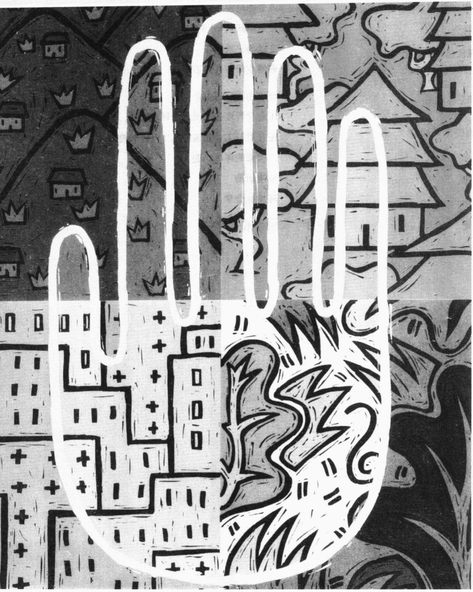
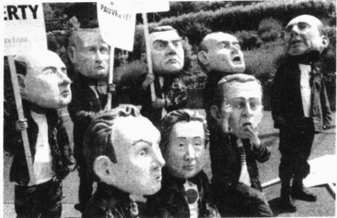
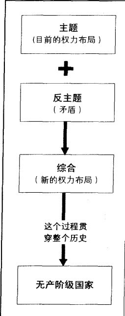
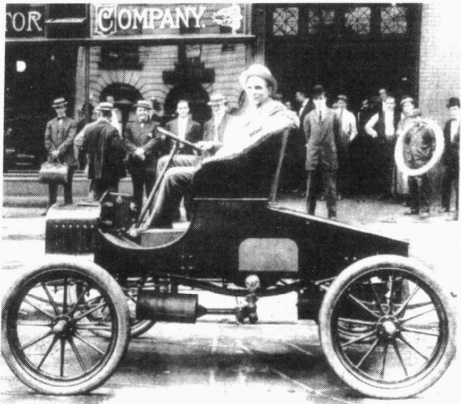
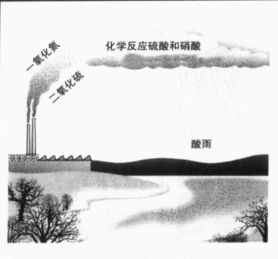
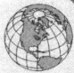

# 第 22 章 社会变迁与环境

---

· 社会变迁怎样改变社会生活  

四次社会革命  

从共同体到社会  

资本主义、现代化和工业化  

社会运动  

冲突、权力和全球政治

- 技术怎样改变社会

改变的范围

技术革新：汽车的影响

变迁的尖端领域

赛博空间与社会不平等

社会变迁的理论和过程

文化进化理论

自然循环理论

权力冲突理论

奥格本的理论

· 增长机器与地球

工业化程度最高国家的环境问题

正在进行工业化国家和工业化程度最低

国家的环境问题

环境运动

环境社会学

· 本章小结

---

### 第 22 章 社会变迁与环境

1986年1月28日，已是拂晓时分，温度却依然接近于冰点，这对处于亚热带的佛罗里达州来说是很奇怪的。在肯尼迪宇航中心，15—30厘米长的坚冰，从38米高的发射台上悬垂下来，就像钟乳石一样。上午8点刚过，全体乘务人员就进入了太空舱。8:36分，七名宇航人员已经各就各位。起飞的时候他们有些失望，因为按照时间表应该是9:38分，但由于冰雪给延误了。

由于强大的公共关系运动，公众对于航天的兴趣急剧攀升。人们的注意力都集中在克里斯塔·麦考利夫身上，她是一名37岁的中学教师，来自新罕布什尔州康科德，也是第一位以普通公民身份乘坐航天飞机的人。麦考利夫小姐从数千名申请者（包括本文作者）中脱颖而出，她将在飞行期间做一个有关她在宇宙飞船上生活的电视讲演，全国范围内正在读书的孩子们都在期盼着这次讲演。

在看台上热切等待的是乘务人员的家属和朋友，以及数千名观众。在耽误了两个小时之后，他们终于高兴地看到“挑战者”号的两名坚定而又兴奋的拥护者点燃了火焰。当这个技术创新的产物轰响着庄重地进入太空的时候，他们爆发出阵阵欢呼声。此时是上午11:38分。

73 秒钟后，“挑战者”号已经距离发射基地 11.2 公里，并且正以每秒 8.7 公里的速度飞速向太空进发。突然在它一侧的外部油箱上出现了一处耀眼的亮光，几秒钟内这束亮光就燃烧成了一个巨大的火球。人群中响起了恐怖的尖叫声。“挑战者”号在距离地面 30 公里的地方爆炸了，残骸的碎片从天空中坠落下来。

举国上下的教室里，所有的孩子都哭了。成年人目瞪口呆地盯着电视机。

资料来源：Broad（1986）；Magunson（1986）；Lewis（1988）；Maier（1993）。

如果有什么特征能描述今天的社会生活，那就是急剧的社会变迁。就像本章我们将要看到的，技术，那使“挑战者”号首先成为现实继而成为灾难的技术，就是这种变迁背后的驱动力。理解社会变迁，是为了更好地理解今天的社会，以及我们自己的生活。

### 社会变迁怎样改变社会生活

### 四 次社会革命

世界目前正在经历着的急剧的影响深远的社会变迁，并非“刚刚发生”。相反，它是过去数千年积聚的力量的结果，它以植物种植和动物驯养为开始。第一次社会革命使狩猎和采集社会发展成为园艺和游牧社会(参看第6章)。犁的发明带来了第二次社会革命，从此农业社会就出现了。蒸汽机的发明促成了第三次社会革命，引发了工业革命。我们现在正处于第四次社会革命之中，它是由集成电路块的发明带来的。变迁的进程大大加速，以至于我们正在看到由对人类基因图谱的规划所带来的生物经济时代的到来。

---

### 从共同体到社会

虽然我们生活中的如此多的方面都被改变了，但我们仍然只是看到了冰山一角。到第四次也可能是第五次社会革命全面发生时，我们的生活方式几乎无不受其影响。我们可以这样说，生活方式是伴随着早期社会革命进行变革的。例如，从农业社会到工业社会的转变，不仅意味着人们从农村转移到了城市，而且许多亲密的、终身的关系也都被非个人的、短期的联系所代替。有偿工作、契约和金钱，代替了对亲缘关系、社会地位和友谊来说最本质的互惠义务（比如帮助一个人）。就像第4章所讲的，社会学家用共同体和社会这两个术语来表示社会中的这种根本转变。

传统社会(或者说共同体)是小型的、乡村式的，而且是缓慢变迁的。它们被男人统治，性别之间有明确分工。人们常常回顾过去，并将其作为处理现在事情的准则。他们生活在扩大家庭中，几乎没有接受过正式教育，在家里治疗大部分疾病。人们倾向于以绝对的标准来看待生活和道德。相反，现代社会(或者说社会)则是大型的、更加城市化的和快速变迁的。性别之间的分工更加不固定。人们看重正式教育，并且更加具有未来导向。处于人口转型的第三阶段，家庭规模更小，婴儿死亡率更低。人们活得更长，收入更高，广泛享受更多的物质财富。

### 资本主义、现代化和工业化

为什么会从共同体转变到社会？马克思指出，这是因为所谓的“资本主义”的出现。他分析了封建社会的破产怎样把人和土地剥离，从而造成剩余劳动力。大规模的人口涌向城市，他们在那里受到生产资料(工厂、机器、工具)拥有者的剥削。这就造成了延续至今的资本家和雇佣工人之间的敌对关系。

相反，韦伯则从新教改革中追溯资本主义的源起。他注意到，宗教改革打碎了新教徒们认为的神职人员可以拯救他们的信心。当他们在天堂和地狱间挣扎的时候，他们总结出上帝并不想让他的子民们生活在不确定中。上帝肯定将会给出一个确定的信号，使他们确信他们注定要到天堂。他们认定，这个信号就是成功。结果，新教改革一个未曾预料的结果就是，使新教徒努力工作和变得节俭。这创造出了剩余财富，推动了资本主义的产生。从这一点来看，新教伦理为这场改变了世界的工业革命奠定了基础。

这场由工业革命引导的彻底的变革叫做现代化。表 22.1 总结了这些变化。表中列举的这些特征用韦伯的术语来说就是理想类型，因为没有一个社会能够完全体现出这些特征。我们的新技术已经创造出了国家内部的不平等。比如在乌干达这样一个传统社会，精英们却拥有计算机。因此表 22.1 中所列示的特征应该被解释为“多一些”或“少一些”，而不是“非此即彼”。

当技术变革的时候，社会就会发生改变。可以想一下来自工业社会的技术是怎样正在改变着传统社会。例如，当西方向欠发达工业化国家输入医学的时候，他们的人口死亡率降低了，然而出生率仍然很高。这样做的结果就是人口爆炸。人口转型的第二个阶段打破了家庭、财产和继承的传统平衡。这带来了饥饿，并导致大量人口向城市转移，而城市则只以少量的工业支撑着涌向它的大量人口。第20章讨论了一些这样的问题。

### 社会运动

社会运动揭示了变革的无情。人们结集到一起表达他们要颠覆使他们厌烦的事情。他们组织起来

---

表 22.1 传统社会和现代社会的比较

<table border=1 style='margin: auto; word-wrap: break-word;'><tr><td colspan="2">特征</td><td style='text-align: center; word-wrap: break-word;'>传统社会</td><td style='text-align: center; word-wrap: break-word;'>现代社会</td></tr><tr><td rowspan="11">总体特征</td><td style='text-align: center; word-wrap: break-word;'>社会变迁</td><td style='text-align: center; word-wrap: break-word;'>慢</td><td style='text-align: center; word-wrap: break-word;'>快</td></tr><tr><td style='text-align: center; word-wrap: break-word;'>群体规模</td><td style='text-align: center; word-wrap: break-word;'>小</td><td style='text-align: center; word-wrap: break-word;'>大</td></tr><tr><td style='text-align: center; word-wrap: break-word;'>宗教取向</td><td style='text-align: center; word-wrap: break-word;'>多</td><td style='text-align: center; word-wrap: break-word;'>少</td></tr><tr><td style='text-align: center; word-wrap: break-word;'>正式教育</td><td style='text-align: center; word-wrap: break-word;'>无</td><td style='text-align: center; word-wrap: break-word;'>有</td></tr><tr><td style='text-align: center; word-wrap: break-word;'>定居地点</td><td style='text-align: center; word-wrap: break-word;'>乡村</td><td style='text-align: center; word-wrap: break-word;'>城市</td></tr><tr><td style='text-align: center; word-wrap: break-word;'>人口转型</td><td style='text-align: center; word-wrap: break-word;'>第一阶段</td><td style='text-align: center; word-wrap: break-word;'>第三（或第四）阶段</td></tr><tr><td style='text-align: center; word-wrap: break-word;'>家庭规模</td><td style='text-align: center; word-wrap: break-word;'>大</td><td style='text-align: center; word-wrap: break-word;'>小</td></tr><tr><td style='text-align: center; word-wrap: break-word;'>婴儿死亡率</td><td style='text-align: center; word-wrap: break-word;'>高</td><td style='text-align: center; word-wrap: break-word;'>低</td></tr><tr><td style='text-align: center; word-wrap: break-word;'>预期寿命</td><td style='text-align: center; word-wrap: break-word;'>短</td><td style='text-align: center; word-wrap: break-word;'>长</td></tr><tr><td style='text-align: center; word-wrap: break-word;'>健康保健</td><td style='text-align: center; word-wrap: break-word;'>家庭</td><td style='text-align: center; word-wrap: break-word;'>医院</td></tr><tr><td style='text-align: center; word-wrap: break-word;'>时间取向</td><td style='text-align: center; word-wrap: break-word;'>过去的</td><td style='text-align: center; word-wrap: break-word;'>未来的</td></tr><tr><td rowspan="5">物质关系</td><td style='text-align: center; word-wrap: break-word;'>工业化</td><td style='text-align: center; word-wrap: break-word;'>无</td><td style='text-align: center; word-wrap: break-word;'>有</td></tr><tr><td style='text-align: center; word-wrap: break-word;'>技术</td><td style='text-align: center; word-wrap: break-word;'>简单</td><td style='text-align: center; word-wrap: break-word;'>复杂</td></tr><tr><td style='text-align: center; word-wrap: break-word;'>劳动分工</td><td style='text-align: center; word-wrap: break-word;'>简单</td><td style='text-align: center; word-wrap: break-word;'>复杂</td></tr><tr><td style='text-align: center; word-wrap: break-word;'>收入</td><td style='text-align: center; word-wrap: break-word;'>低</td><td style='text-align: center; word-wrap: break-word;'>高</td></tr><tr><td style='text-align: center; word-wrap: break-word;'>物质财富</td><td style='text-align: center; word-wrap: break-word;'>少</td><td style='text-align: center; word-wrap: break-word;'>多</td></tr><tr><td rowspan="5">社会关系</td><td style='text-align: center; word-wrap: break-word;'>基本组织</td><td style='text-align: center; word-wrap: break-word;'>共同体</td><td style='text-align: center; word-wrap: break-word;'>社会</td></tr><tr><td style='text-align: center; word-wrap: break-word;'>家庭</td><td style='text-align: center; word-wrap: break-word;'>扩大的</td><td style='text-align: center; word-wrap: break-word;'>核心的</td></tr><tr><td style='text-align: center; word-wrap: break-word;'>对老年人的尊敬</td><td style='text-align: center; word-wrap: break-word;'>多</td><td style='text-align: center; word-wrap: break-word;'>少</td></tr><tr><td style='text-align: center; word-wrap: break-word;'>地位</td><td style='text-align: center; word-wrap: break-word;'>先天获得</td><td style='text-align: center; word-wrap: break-word;'>后天取得</td></tr><tr><td style='text-align: center; word-wrap: break-word;'>性别平等</td><td style='text-align: center; word-wrap: break-word;'>少</td><td style='text-align: center; word-wrap: break-word;'>多</td></tr><tr><td rowspan="3">规范</td><td style='text-align: center; word-wrap: break-word;'>现实、生命和道德观</td><td style='text-align: center; word-wrap: break-word;'>绝对</td><td style='text-align: center; word-wrap: break-word;'>相对</td></tr><tr><td style='text-align: center; word-wrap: break-word;'>社会控制</td><td style='text-align: center; word-wrap: break-word;'>非正式</td><td style='text-align: center; word-wrap: break-word;'>正式</td></tr><tr><td style='text-align: center; word-wrap: break-word;'>对于差异的容忍</td><td style='text-align: center; word-wrap: break-word;'>少</td><td style='text-align: center; word-wrap: break-word;'>多</td></tr></table>

要求变革，或是抵制他们不喜欢的变革。因为社会运动是围绕那些烦扰大部分人生活的焦点问题而发生的，所以它可以显示哪些社会领域存在巨大的变革压力。伴随着全球化，这些问题越来越跨越了国家界限，使那些充满不满的地区得以彰显，掀起了影响生活在不同文化背景下的数百万人的全面变革。

### 冲突、权力和全球政治

伴随着所有发生在我们身边的社会变迁，准确找到最重要的事情已经是不可能的了。然而，有一件事情却经常跃入我们的视线，那就是国家之间的权力安排。到16世纪，今天的全球划分已经开始出现。那些拥有最先进技术(那时，技术就是最快的船和火力最强的大炮)的国家，通过侵略别的国家和掠夺他们的资源变得富有。接下来，随着资本主义的形成，一些国家完成了工业化。新兴的工业化国家剥削那些没有进行工业化的国家的资源。根据世界体系理论，这使得非工业化国家变得依赖(西方)，并且没有能力去发展自己国家的资源。

今天的信息革命，包括新兴的生物经济，也会对全球分层产生深远的影响。那些在这些领域取得最

---

快、最重大进步的国家，必然要主宰未来。很明显，这是工业化程度最高国家主宰的延续。

二战以后，世界权力(所谓的地缘政治)的重新调整，导致了三足鼎立的局面：以日本为中心的东方、以德国为中心的欧洲和以美国为中心的西半球。这三个权力中心和五个次权力中心——加拿大、法国、英国、意大利和俄罗斯——一起主宰了今天的世界。最初他们号称 G7，即“七国集团”。对俄罗斯核储备的恐惧以及对它在国际事务中表现出的日趋合作态度的欣赏，促使七国集团允许俄罗斯加入他们的精英俱乐部，这就是我们所知道的“八国集团”。

这些工业巨头们举行年会，以决定如何划分世界市场和调整全球经济政策，比如利率、关税和汇率。他们的目标是永保全球主宰的地位，这包括保持他们从工业化程度最低国家购买原材料的低价格。便宜的原油对这个目标来说是很重要的，这意味着他们需要控制中东，不让它成为独立的政权以搅乱他们原定的秩序。

民族冲突的复苏正在威胁着八国集团精心构建的全球划分格局。苏联帝国的解体，使一些族群几百年来被压制的民族主义野心和仇恨开始复苏。由于苏联军队和克格勃的混乱，这些集团开始互相进行武力打击。在非洲，相似的无休止的仇恨给众多民族带来了战争，欧洲政权曾经盲目地把这些民族拼凑到一起，武断地在地图上划分政治界限并称之为国家。在欧洲，前南斯拉夫分裂，随之民族冲突愈演愈烈。民族冲突可能会在德国、法国、意大利、美国和墨西哥爆发。这些积怨和仇恨会在哪一点上将它们自己玩完，现在我们还不知道。

财富和权力日益增长的中国，给八国集团造成了另一个威胁。中国想重建过去几个世纪的辉煌，并且当它扩展自己地区影响的时候，它越来越影响到八国集团的利益。为了降低冲突的可能性，妥协是不可避免的，八国集团于是允许中国作为它们年度峰会的观察员。在第15章我们曾提到，如果中国遵守八国集团的规则，那么下一步就是它会被吸纳进这个具有排外性的俱乐部。

为了控制全球，八国集团不得不依赖政治和经济的稳定，这不仅体现在在它们自己的后院，而且也表现在那些为它们提供原材料的对它们的工业生产来说极其重要的国家。这一点可以解释，为什么当

每年八国集团的领导人都要在一个秘密的地方举行会议并且作出一些控制世界的决策。而抗议者们每年都要在这个地方附近游行示威。这里显示的是2003年八国集团在法国的埃维昂（Evian）举行会议时的抗议者。

非洲国家以种族屠杀的方式进行自我毁灭的时候，多数发达工业国家几乎毫不关心，但是它们却不能忍受在它们邻国发生的种族内部战争。例如，如果让发生在波斯尼亚和科索沃的内部种族战争不受限制，就意味着要容忍冲突可能会蔓延和吞噬整个欧洲。相反，卢旺达成百上千图西人的死亡，对八国集团来说就没有什么政治重要性了。

然而，最发达工业国已经开始意识到非洲和它们自己利益之间的联系，并且它们的行动和态度已经开始改变。它们认识到，非洲的贫穷可以培育恐怖分子。此外，作为世界上最大的几乎未被开发的市场，非洲可能会为它们未完全使用的经济机器提供巨大的销路。此外，在非洲也有巨

---

大的石油储备，这可以平衡一下那些不稳定的中东国家。因此，美国为(非洲国家)抵抗艾滋病提供援助，并且像干涉利比里亚一样，开始插手非洲政务。

### ☑ 社会变迁的理论和过程

社会变迁吸引了众多的理论家。我们将分析众多解释社会变迁的理论中的四个：文化进化理论、循环理论、冲突理论，以及社会学家奥格本的开拓性观点。

### 文化进化理论

社会变迁的进化理论有两个类型：单线进化理论和多元进化理论。单线进化理论假定所有的社会都遵循同样的路径。每个社会都会从简单形式进化到复杂形式，并且都要经历相同的进化次序（Barnes，1935）。在这一进化理论的众多观点中，路易斯·摩尔根（Morgan，1877）的理论曾经一度主宰了西方思想界。摩尔根认为所有的社会都要经历三个阶段：野蛮阶段、蒙昧阶段和文明阶段。在摩尔根看来，他的祖国英国是文明社会的典型。所有其它社会都要步英国后尘。

多元进化理论代替了单线进化理论。它不认为所有社会都要遵循相同的进化次序，相反，它提出，不同的进化路线会导致相同的发展阶段。虽然都要走向工业化，但是其他社会在它们的进化过程中不必要要经历相同次序的阶段（Sahlins and Service, 1960; Lenski and Lenski, 1987）。

不管是单线进化理论还是多元进化理论，它们的中心思想都是文化进步的一种假设。部落社会被假定为是人类文化的一种原始形式。伴随着进化，它们会达到一种更高的状态，即西方世界所具有的被认为是更先进更高级的文化形式。随着对部落文化的丰富多样性和复杂性越来越多的认识，这种思想受到了怀疑。此外，西方文化也正处于危机（贫穷、种族主义、歧视、战争、恐怖主义、精神疾病、性骚扰、危险街道）之中，并且不再被认为是人类文化的顶峰。因此，文化进步的思想就被抛到了一边，并且进化理论也被抛弃了（Eder，1990；Smart，1990）。

### 自然循环理论

循环理论试图说明整体文明的成长。例如，为什么埃及、希腊和罗马曾掌控如此强大的权力和影响，结果达到顶峰后又衰落了呢？循环理论假设文明就像有机体：它们出生，经历茁壮成长的青年，达到成熟，当它们到老年的时候就衰落了，最终死去（Hughes，1962）。

为什么文明会经历这样的循环？历史学家阿诺德·汤因比(Toynbee,1946)说，每种文明都面临着生存的挑战。应对这些挑战的办法并没有被所有人接受，总有敌对的力量存在。统治精英想方设法使这种力量保持在可控的范围内，但是当文明达到顶点，当它已经成为帝国时，统治精英们就失去了“依靠魅力而不是武力”使混乱变为有序的能力。社会结构最终四分五裂。武力可以使帝国存在数百年，但是这一文明注定要走向灭亡。

在《西方的没落》（1926—1928）这本引起广泛争议的书中，斯宾格勒（一名德国高中教师）指出，西方文明已经过了顶峰，并且正在走向没落。虽然西方社会成功地克服了由希特勒和墨索里尼挑起的危机，但是正如汤因比所说，文明的覆灭不是突然完成的。因为衰落的过程可以持续数百年，所以前面提到的西方

---

文明存在的危机(贫穷、强奸、凶杀等等)，恰恰表明了斯宾格勒是正确的，并且我们也正处于衰落之中。如果果真如此，那么有迹象表明，中国正在等待成为地球上的下一个权力中心，并创造新的文明。

### 权力冲突理论

早在汤因比之前，马克思就提出在人类历史上存在一个重复出现的过程。他说每一个主题(目前的权力布局)都包含它自己的反主题(矛盾或者反对)。主题和反主题之间形成的斗争，导致了一个综合(新的权力布局)。反过来，这种新的社会秩序也变成了一个受自己反主题挑战的主题，依次类推。图22.1给出了一个有关这一过程的直观概括。

根据马克思的观点(即历史的辩证过程)，每个统治集团都播下了毁灭自己的种子。让我们来看一下资本主义。马克思说，资本主义(主题)是建立在剥削工人(反主题，或者是内在的对抗)的基础之上。伴随着工人和资本家间的冲突，这种辩证过程不会停止，直到工人建立起一个无阶级的国家(综合)。

前面对八国集团的分析遵循的就是冲突理论。目前八国集团对全球资源和市场的分割是一个主题。其他不在八国集团之列的国家的愤恨是一个反主题。如果这些工业化程度最低国家中有一个一旦获得了军事控制权，这个国家就会竭力促使世界资源的重新分配。中国、印度、巴基斯坦和北朝鲜，因为拥有核武器，正适合这种情况。基地组织努力改变中东和工业化的西方国家之间的权力平衡，也是这种情况。任何新

图22.1 马克思的历史变迁模型

资料来源：由作者整理而成。

的布局或综合，都包含它自己的反主题。这些既可能是种族敌视，也可能是领导者们感到他们自己的国家被剥夺了应当分享到的资源。这些反主题将会困扰权力布局，并且在发展到某一点后必然会成为一个综合。这个过程会一直重复下去。

### 奥格本的理论

社会学家奥格本 (Ogburn, 1922, 1961, 1964) 提出了一个以技术变革为基础的社会变迁理论。他说，技术通过三个过程改变社会：发明、发现和传播。让我们来看一下每个过程。

发明 奥格本把发明定义为：已存在的要素和物质结合起来形成新的要素或物质。我们通常认为发明只是物质的发明，比如计算机，其实也有社会发明。在本书中我们分析了三个社会发明：资本主义、科层制、公司。正如我们在这些例子中所看到的，社会发明对社会和人们之间的关系有着深远的意义。物质发明也是这样，我们在这一章中将举例说明汽车和计算机是怎样改变社会的。

发现奥格本把发现，一种看待现实的新方式，看做是变迁的第二个过程。某一现实过去就已经存在，但是人们现在却是第一次看到它。一个例子就是哥伦布“发现”北美大陆，这一事件具有如此重大的意义，以至于改变了人类历史的进程。这个例子也表明了另一个原理：一个发现只有在恰当的时候出现，

---

才会带来广泛的变迁。其他群体，像北欧海盗曾经“发现”北美大陆——显然，他们没有发现印第安人已经生活在那里。然而，北欧海盗的殖民地已经消失在历史当中，挪威文化也没有被发现。

传播 奥格本强调传播，即发明或发现从一个地方向另一个地方的传播，是怎样对人们的生活产生广泛的影响的。让我们看一个简单的物体，斧头。当传教士把钢斧介绍给澳大利亚的土著居民时，它搅翻了整个社会。在这之前，男人们控制着斧头的制作。他们使用一种只有在偏远地区才有的特殊石头，并且这种斧头的制作技术只传给儿子。女人们用斧头的时候不得不请求允许。当钢斧成为普通之物，女人也能拥有它，男人便失去了原来的地位和权力（Sharp，1995）。

传播也包括思想的传播。就像在第11章里所看到的，公民身份观念改变了整个世界的政治结构；结果，它抛弃了作为权威之毫无疑问的来源的君主制。现在，性别平等的概念正在全球传播。虽然在世界少数几个地方这被看做是自然的，但那种认为基于某人的性别来限制其权利是错误的观点，却具有革命性。但也就像公民身份观念一样，它注定要改变基本的人类关系和整个社会。

文化滞后 奥格本创造了文化滞后这一新术语，来说明文化的一些要素是怎样落后于源自发明、发现和传播的变迁的。他认为通常是技术先变革，文化滞后于技术的改变。也就是说，我们一直试图赶上变化着的技术，使我们的习惯和生活方式与其需求相适应。

对奥格本理论的评价 有人发现，奥格本的理论太单向化，也就是说，它把技术看成几乎所有社会变迁的原因。他们指出，人们适应技术的方式，只是所有社会变迁中的一部分。其他部分还包括人们控制技术的方式。人们发展他们所需要的技术，并有选择地运用它。一些群体，像阿曼门诺派教徒，当他们发现技术正在威胁他们的文化时，则拒绝了技术。其他的一些技术抵制在下面的“社会学和新技术”专栏里有所讨论。

### 社会学和新技术

### 从卢德分子到匿名炸弹杀手: 反对技术

19世纪早期的大不列颠，发明了一种能够制造女式长袜的机器。袜子制造工厂的老板非常高兴。而工人们则相反。看到他们的生活状态就好像是被人从后面猛推了一把，于是他们拿起斧头和锤子把机器砸成碎片。当地警察制止不了暴动，政府不得不出动12000名士兵来维持秩序。有些工人被处死，其他一些被流放到了澳大利亚。

有一个破坏了制作袜子的机器的学徒叫内德·卢德拉姆，自从这次暴动过后，人们就把反对新技术的人称作卢德分子。

对抗通常都是针对某项具体的新技术，但有时它也会变成对总的技术的抗议。

新技术总是会造成威胁和恐惧。因为每种新技术在代替一些既存技术的时候，总是会威胁到某些人。因此，反对新技术也就是件很平常的事情。

雅克·埃鲁尔，法国的一名社会学家，因为技术变迁而忐忑不安。他警告人们，技术正在破坏传统价值。他说（Ellul，1965），人们正在变成技术系统的“一个单一的牢固相关的组成部分”。他害怕技术将会制造出一种单一的世界文化，其中“变化性只是表面现象”。埃鲁尔以及其他一些人如尼尔·波斯特曼（Postman，1992）的观点，只是引起了少数知识分子的注意，他们在学院研讨班上讨论这个问题，并写一些有关这个问题的晦涩的论文。

20世纪80年代，一个匿名炸弹杀手发布了一条传播广泛的信息。他的警告信号犹如一声惊雷

---

响彻在公众的意识当中，它不是以书本和论文的形式，而是以邮寄爆炸物的形式伤害或杀死那些不加怀疑的接受者。17年中，他把炸弹邮寄到了密歇根州、犹他州和加利福尼亚州。

在他看似杂乱无章的袭击背后没有明显的信息。然而，令人意想不到的是，1995年，这个匿名炸弹杀手发布了一条口头信息。他许诺如果他的反对技术的35000字的短文得到发表，他将停止他的恐怖行为。《纽约时报》和《华盛顿邮报》按时将它印出。他的信息从本质上来说和埃鲁尔的类似：技术正在毁灭我们。

最终认定蒙大拿州山里的一个隐居者是这个匿名炸弹杀手。他叫特德·卡克藏斯基，拥有哈佛大学的学士学位和密歇根大学的哲学博士学位，最终他被捕并被判有罪。

### 思考题

卢德分子、雅克·埃鲁尔和匿名炸弹杀手有什么共同之处？运用这一章和前几章提出的概念，分析技术对社会的影响。我们应该害怕新技术吗？给出你的结论。

技术和社会变迁的关系实际上是双向的：技术促进社会变迁，社会变迁也促使技术变革。例如，一个大的社会变迁就是我们的社会中老年人口越来越多。他们的需求刺激了新的医疗技术的发展，例如治疗“阿尔茨海默氏症”的技术。另一个例子就是我们对待残疾人观念的改变，也就是说不应该把他们与主流社会分开，而是要让他们参与到主流社会中来。这促进了新型轮椅和康复器件的发展，它们使那些不能走的人也能够打篮球，参加残疾人奥运会，甚至进行严酷的轮椅下坡比赛。

为了对奥格本公平起见，我们必须注意，他从来没有说过技术是社会变迁的唯一力量。他并没有说，人们在势不可挡的技术力量面前只是消极被动的服从者。虽然他确实强调了，通常是物质文化(技术)先改变，而象征文化(人们的思想和生活方式)紧随其后。实际上，这种变化特点一直都存在着，因为你可以看到许多变革都是跟随在计算机的发展之后。

接下来,让我们看一下技术是如何改变社会的。

### 技术怎样改变社会

从第 2 章我们知道，技术有双层含义。它既指用来完成工作的工具，也指制作和运用这些工具的技能或程序。工具意义的技术，可以像梳子那样简单，也可以像计算机那样复杂。技术的第二层含义——制作和运用工具的技能或程序——在这里不仅是指用于制作梳子和计算机的程序，也是指那些能够作出合意的发型和连接到因特网的东西。抛开它的具体内容，技术常常是指能够拓展人的能力的人工手段。

所有的人类群体都要制造和运用技术，但是后工业社会(也叫后现代社会)的主要特征是，技术大大拓展了我们分析信息、交流和旅行的能力。这些新技术让我们作了历史上从未做过的事情：探索太空、几乎立刻就能在全球任何地方进行交流、更快地到更远的地方旅行；存储、恢复和分析庞大数量的信息。

变化是迅速的。台式电脑正让位于笔记本电脑——而一些笔记本电脑正在被带有键盘和照相机的手提装置所代替。而这还都只是开始。在我们未来的生物经济社会，我们甚至会“穿上”电脑，在我们自己的蛋白质里存储信息（Ferraro，2001）。伴随着许多的迂回曲折，我们仍然踏上了通往未来的旅程。没有人知道我们未来的生活会是什么样，但是它会充满无限的挑战，并会超越现在。

---

### 改变的范围

技术，像它本身一样令人生畏，然而实际上这只是一种表面现象。它的社会意义要更为深刻——技术怎样改变我们的生活方式。当一项技术被引入一个社会，它就会迫使社会的其他部分让路。实际上，新技术能够重塑社会。让我们看一下技术改变社会生活的四种方式。

改变社会组织 技术能改变人们的组织活动方式。在第6章，我们曾讨论过在机器技术出现之前，大部分工人都是待在家里和家人一起工作，而新的动力驱动的机器却要求他们离开家庭走到一个叫做工厂的地方工作。在开始时的工厂里，每个工人仍然要做全部工作。后来发现，如果每个工人只做一项专门的工作，他们会生产出更多的产品。一个工人在一个单一的地方捶打或拧一定数量的螺钉，然后另一个人接手这个项目并作一些其他的重复性的工作，直到第三个人来接管他的工作，依此类推。亨利·福特以此为基础发明了装配线：不是工人移动到机器所在的地方，而是机器移动到工人面前。此外，机器的各个部分还是可以相互替换的，并且易于连接（Womack et al., 1991）。

改变意识形态 技术也能促进意识形态的改变。马克思注意到，当工人只对产品的一小部分做重复性的工作时，他们感觉不到自己和最终产品的联系。他们不再认为产品是“他们的”。工人和他们的劳动产品异化了。马克思重点分析了异化是如何引起不满和不安的。

马克思也注意到，资本家对待工人就像对待机器和工具一样——只是一个可替换的部分。在工厂出现之前，工人拥有自己的工具，并且有自主性。如果不喜欢什么事情，他们可以将锤子和锯子打包一走了之。也会有其他什么人雇用他们造一辆马车，或是做一个马具。与之相反，工厂带给人一个巨大的反差，因为在这里资本家拥有机器和工具。这种拥有权带来了权力，资本家运用这种权力尽可能地压榨工人的每一分血汗钱。工人们不得不屈服，因为即使他们走了，也会有别的人来代替他们的位置。马克思相信这种剥削会导致工人革命——工人们联合起来，接管生产方式，并建立一个工人政权。

这些历史事件不仅导致行为的变化，而且也使意识形态发生了改变。当资本家建立起工厂，他们形成了一种新的意识形态：即利润最大化是道德的，甚至是神圣的追求。它造福社会，并使上帝高兴。后来，马克思的追随者们建立了社会主义来攻击资本主义：利润只能来源于对工人的剥削，工人才是社会资源的真正拥有者。我们很快就会看到，就像技术变革促进了共产主义的发展一样，技术变革对于其自身目的的实现来说，也是至关重要的。

改变价值观念 思想随着技术的改变而改变，价值也是。如果说技术限定于棍打动物，那么其力量和诡计就会被认为是重要的。动物皮也是这样。毫无疑问，当那些穿着十分珍奇或危险动物的皮毛的原始男女们高昂着头走路的时候，穿着千篇一律的旧羊皮袄的邻居们会妒嫉地看着他们。相反，今天的技术生产出了大量的人工织物。美国人夸耀自己的汽车、轮船、假期和第二故乡——并且确信他们的牛仔裤和套头衫是具有明显标识的时髦标签。总之，尽管妒嫉和骄傲是人的本性，但是，对物质主义的强调，还是要依赖于技术的发展。

改变社会关系 技术也改变了人们相互联系的方式。当男人们走出家庭去工厂工作的时候,他们就与很多日常家庭事务疏远了。成为妻子和孩子的相对陌生人的结果之一,就是离婚增多了。后来技

---

20世纪50年代人们在家里观看的那大件的家具是收音机。在电视流行之前，中产阶级的家庭会围坐在餐厅的餐桌前一起吃晚餐。晚餐过后，有时候他们会聚在起居室里听他们最喜欢的广播节目：杰克·本尼、阿摩司与安迪、霍帕朗·卡西迪等等。你能看出技术是怎样影响价值观和社会关系的吗？

术的变化使更多的女人从家庭脱离出来，走进了办公室和工厂。这也有一个相似的后果——与丈夫和孩子更大的疏远，对脆弱的婚姻产生了更大的冲击。现在一个相反的趋势是，新技术的应用使得很多人在家里工作。这样的结果可能会促进家庭的稳定。

为了更好地了解技术是怎样塑造我们的生活方式的,我们来看一下由汽车和计算机所引发的变化。

### 技术革新：汽车的影响

如果我们要挑选出过去 100 年中对社会生活影响最大的新技术——并且直到今天仍在持续影响我们的生活——那非汽车莫属。让我们看一下这项发明对美国社会影响的几个方面。

取代已有技术 以亨利·福特 1908 年开始大规模汽车流水线生产为开端，汽车逐渐把老技术推到一边。人们发现汽车变得更干净、更安全、更可靠，并且比马车更经济（Flink，1990）。人们甚至认为汽车可以降低税收，因为公众将不必再为每天堆积在街道上数以吨计的马粪的清洁而付费。现在听起来这很可笑。人们也认为汽车将会消除城市的泊车问题，因为一辆汽车只占据一匹马和一辆马车所占据空间的一半。

汽车也取代了另一种技术。美国曾经建立了巨大的城市交通系统，电车线路从城市的中心辐射到四周。当汽车越来越便宜，并且越来越可靠时，美国人发现它比公共交通方便得多。不用再步行到电车站并且不管刮风下雨都得等，人们可以按照自己的时间表，直接从家中出发旅行。

对城市的影响 电车应用的衰落,改变了美国城市的布局。美国的城市曾经是呈网状分布的,因为居民区和商业区都坐落在电车沿线。当汽车使人们不再都居住在电车线路附近时,人们填充了“网络”之间的地带。

汽车也促使了大规模的郊区化。20世纪20年代，美国人开始离开城市。他们发现，他们可以在享受更大空间和更低税收的偏远地区居住，乘车到城市工作（Preston，1979）。最终，这种向郊区移民减少了城市的税收依靠，形成了美国城市现在正在经历的许多问题(像我们在第20章中所讨论的)。

对农村生活和村庄的影响 汽车对农村生活和村庄也有深刻的影响。20世纪20年代以前，大部分

---

左边的照片显示的是，1905年亨利·福特正在骄傲地展示他具有最先进汽车技术的汽车。很明显，尤其是从汽车轮子上的辐条来看，新技术是建立在现存技术基础之上的。拍这张照片的那个时候，谁能想象就是这辆汽车改变了整个社会呢？右边的照片显示的是今天最新的汽车技术。这辆试验性的汽车由罗拉的密苏里大学制造，由太阳能驱动。

农民都远离城市。因为骑马到城市去不仅慢而且麻烦，所以他们不经常作这种旅行。然而，到了20世纪20年代，汽车的普及和低廉的价格，使得“周六到城市去”成为一件很普通的事情。在那里，农民可以贩卖商品、购物和走亲访友。这改变了农村的生活。邮购价目表不再是选购商品的首要来源，医疗保健条件改善了，教育水平也提高了(Flink，1990)。农民们开始到更大的城市旅行，在那里他们发现了更多种类的商品。当农民开始只把附近的村庄视作即时需要的补充时，这些曾经繁荣的社会和商业生活的中心便衰落了。

改变建筑 汽车对商业建筑的影响是显而易见的——从环绕商场的大片的停车区，到银行和快餐店的免下车服务窗口。汽车对美国家庭住房的改变，并没有如此明显(Flink，1990)。在有汽车之前，每个家庭在房子后面都有一个马厩，用来停放马和车。最初人们把汽车停放在那里，因为这不需要改变建筑。后来，建筑的改变经历了三步。首先，新建的房子有了独立的车库。它像马厩一样坐落在房子后面。当汽车对于美国家庭来说越来越必不可少时，车库就和房子合并到了一起。它从后面移到了房子的一侧，并通过道相连。最后一步，过道被除去，车库和房子融为一体。这使得人们不必出门就可以钻进汽车。

改变求爱习俗和性规范 到 20 世纪 20 年代，汽车广泛应用于约会。这使得孩子们躲开了父母监视的眼睛，并暗中削弱了家长的权威。警察开始收到对于“夜行者”的抱怨，说他们把汽车停靠在乡间小路上，“熄了灯，纵情欢乐”（Brilliant, 1964）。汽车用于求爱如此普遍，以至于到 20 世纪 60 年代大约有 40% 的求婚都发生在汽车上（Flink, 1990）。

1925年，莱伊特把折叠床引入汽车，就像纳什1937年所做的一样。纳什款被称为“年轻男子的理想款式”（Flink，1990）。从20世纪70年代起，汽车做爱衰落下去，主要是因为改变了的性规范，使得在起居室的活动更加方便。

---

对妇女角色的影响 汽车对于美国社会妇女角色的改变，也起到了核心作用。要看它是怎样改变的之前，我们先来看一下有汽车之前妇女的生活是什么样子。历史学家詹姆斯·弗林克(Flink,1990)这样描述道：

直到汽车革命前，中上层家庭的日用品或是由电话订购送货上门，或是由仆人或丈夫在下班回家的路上中途捎带。由于冷藏室只能储存有限的易变质食品，所以到住所附近步行范围以内的市场买东西，就成了日常琐事。菜园里的时令蔬菜和水果都要制成罐头，以备冬天食用。面包、蛋糕、松饼和馅饼都是在家里烘制。橱柜里的衣服也有很多是自己缝制的。

家庭主妇监督仆人并和他们一起工作，一起准备饭菜、洗刷、熨烫和清洁房屋。在空闲时间里，她会修补衣服，做一些装饰性的针线活，到花园里逛逛，或是哄着一群孩子玩耍。总之，她很少做家庭决策，也很少单独外出。她几乎没有家庭财政和家庭预算的知识。与之相比，中下层家庭妇女角色的首要不同在于，大部分家务都不是由仆人来做的，所以与其说她是别人工作的管理者，还不如说她是一个围着锅台转的全职家庭妇女。

因为汽车驾驶要求的是技术而不是力量，所以女人也能跟男人一样开车。这种新的流动把妇女从家庭的狭小空间中完全解放出来。就像弗林克（Flink，1990）所观察到的，汽车使妇女“从一个食物和衣服的制作者，变成了一个享受贴有国家商标的罐头食品、成品食品和成品衣服的消费者。开车可以到邻近地区以外的自选超市去购物，再加上电冰箱的帮忙，使得购买食品成为一种一周一次的活动，而不是每日必做的事情”。当妇女开始做购物这样一些活动时，她们就取得了对家庭预算更大的控制权，并且因为视野超越了家庭的限制，她们也获得了对于生活的不同看法。

总之，汽车改变了妇女在家庭中的角色，包括和丈夫的关系。它改变了她们的态度，提高了她们的机会，激励她们参与不与家庭相联系的社会生活领域。

### ▷▷小结

汽车引起的改变这么广泛，说它改变了基本价值观和我们的生活方式也不能算错。因为他们不再孤立，妇女、孩子和农民开始以不同的方式看待这个世界。所以，丈夫和妻子的婚姻关系也改变了。汽车甚至改变了求爱观、性和性别关系。

当然，没有人会把如此深刻的变化完全归因于汽车，因为仕同一阶段很多历史事件和很多其他的技术变革也发生了，并且都对社会变迁作出了自己的贡献。然而，关于汽车的社会影响的这一简要概括，却说明了汽车不只是一个孤立的工具，而是对社会生活产生着深刻的影响。

带来巨大社会变迁的第二种技术是一个技术奇迹，这就是计算机。让我们看一下它对社会的影响。

### 变迁的尖端领域

不祥的呼啸声似乎越来越近。安吉拉看了看后视镜，意识到闪烁的警灯和鸣叫的警笛有可能是冲着她来的。她感到有些困惑。“我只是在去 Soc 的路上，”她想，“我并没有超速或做其他什么事情呀。”她停下车，一个大嗓门愤怒地命令她从车里出来。

---

她一出来，就有人咆哮道：“举起手来！”安吉拉困惑地呆立原地。“举起手来！快点！”她照作了。

一个警官屈膝蹲伏在开着的车门后面，枪已上膛。当安吉拉走到警车边上——仍然举着手——警官抓住她，把她按倒在地，从背后铐住了她的手。她听到了永远都不会忘记的话：“你因为谋杀被逮捕了。你有权保持沉默。你所说的任何话都将作为呈堂证供。你有权请律师。如果你请不起，我们将给你指派。”

当安吉拉回忆起自己被捕的情形时，惊恐仍在她的脸上闪现。她甚至连一张交通罚单都没有收到过，更不用说会因为什么事情被捕了。安吉拉的噩梦来自于计算机的错误。由于两个数字的颠倒，她的驾照号取代了本应属于另一个妇女的驾照号进了警察的数据库，而那个妇女是那天早些时候通缉的一名残忍的谋杀犯。

我们当中无人不受计算机的影响，但是大部分人要想像安吉拉那样直接和戏剧性地感受到它的力量是不可能的。对大部分人来说，计算机的影响静静地躲在屏幕后。虽然计算机已经侵入我们的生活，但是我们大多数人都从未考虑过这一点。我们的成绩计算机化了，我们的支付账单可能也是。我们去买日用品的时候，计算机扫描一下我们买的东西，就会出示一张印有每件物品的名称、价格和数量的打印单。

很多人对计算机提高了我们的生活质量感到高兴。他们满足于更高质量的机器制成品和劳工的减少。通过电子邮件，我们刚刚打完一封信，按一下按钮，就可以在几秒钟内把信发给地址簿上的任何一个人。

然而，有些人则对这个计算机化的社会存有极大的异议。他们担心错误会潜入计算机记录，害怕安吉拉那样的厄运会降临到他们头上。对有些人来说，身份盗窃和隐私也成了问题。因此，也就有了针对这些问题的政治控制。随着恐怖分子和其他犯罪分子的肆意横行，有人严肃地建议，应在我们体内放置一块米粒大小的芯片（“Microchips Under…” 2001）。这块芯片不仅可以储存我们的姓名、地址、年龄、体重、身高、头发和皮肤的颜色、种族、在哪里上学、成绩、工作和医疗记录，而且可以储存我们朋友和联系人的姓名和地址，甚至任何不诚实的可疑行为。这块碎片可以被无线电激活，在我们毫不知情的情况下监督我们的活动。这样，计算机化技术就可以使“奥威尔大哥”进行全面掌控。

我们中的大多数人都熟悉计算机，但是它们对于世界来说却是新的——正如它们的影响对我们的生活来说是新的一样。这张照片抓住了计算机演化过程中一个具有重大意义的变化。最新款的膝上电脑和1946年的规模有一间房子大小的ENIAC相比，其运算能力要强大得多。

---

在这一点上,让我们来看一下计算机是如何改变教育、工作场所、商业、战争和恐怖主义的。接下来,我们还要考虑一下它可能对社会不平等产生的影响。

计算机在教育领域 计算机已经成为教育的标准项目，包括小学教育。学生们在并没有知识渊博的外语教师的学校，就能听俄语、德语、西班牙语的课程。甚至他们连社会学的教师都没有，就可以听社会学的关于性别、种族、社会阶级、甚至性、体育等课。

我们在第 17 章讨论的不平等的资助，在这个背景中很重要。学校可以提供最新的技术，使学生们为未来做好充分的准备。当然，这种优势只适于那些在私立学校上学，或是居住在最富有的公立学校居住区的学生。技术和教育的持续不平等，使得源于出身的社会不平等持续化。但是从历史的角度看，我们能够注意到，在历史的某一时点，有些学校可以没有教科书。很可能教育的数字化分水岭，也会成为遥远的记忆。

计算机将会改变教学。现在我们可以连上因特网，每个学生都可以和他或她的教授联系上——也和这个世界相连。教授们可以把整本书从办公室直接传给每个学生，或者以这种方式传回，所用的时间比你读完这个句子还要少。为了帮助学生和教授们搞研究和准备报告，计算机可以搜索很多网页。数字教科书将会取代纸质印刷版本(就像本书)。随着因特网研究能力的发展，你可以输入“社会互动”和“性别”这样的术语，选择你所喜欢的历史阶段、地理区域、年龄和种族——计算机就会输出文本、图示、移动图像和声音。几乎对任何题目你都可以这么做。你可以检验2000年军队中的性别歧视，或者比较目前洛杉矶和新奥尔良的大麻和可卡因的价格。如果你愿意，计算机可以给你一个测试——适合你所选择的难度等级——测出你对它的掌握程度。

计算机在工作场所 计算机也在变更着工作场所。最起码，它影响了我们怎样进行工作。例如，我在电脑上写了这本书的头两版，并要求印刷商制作出手稿的复印版。即使在电子时代，一系列古老的、计算机出现之前的过程还是要进行：我把打印稿邮寄给编辑，他亲手来处理手稿并分给其他也这么做的人。手稿用红笔标记后退还给我，我再寄回修改过的稿件。这个过程就像发生在富兰克林·本杰明时代的一样原始，只是没有使用羽笔和马驹。

实践最终会赶上潜力。现在我和我的编辑可以来来回回地快速翻阅电子文本。当他们在俄勒冈州或马萨诸塞州时，我可能会在美国或西班牙。这没什么不同。我不再打印和邮递任何东西。虽然距离远了，时间差却缩小了。对我而言，这个过程就是我们变化的世界的奇妙证据——或许它打乱了我们稳定的脚步，却带我们进入了一个美丽新世界。

计算机也在更深程度上带来了改变，因为它改变了社会关系。过去我常把手稿交给一个大学秘书，等上几天她打完了再取回。现在，因为我和我的编辑校对电子文稿，秘书就完全用不着了。在这个例子中，计算机改善了社会关系，因为我对秘书工作的要求少了。它也减少了紧张，因为当秘书没有准时完成打印稿，而我又看见她在工作期间去办私事的时候，她不必再为此寻找借口。

对有些人来说，包括我，计算机也颠倒了由工业化引发的工作场所的变更。就像前面讨论的，由于工业化，工作从家庭转到了工厂和办公室。现在很多工人也可以呆在家里，计算机和调制解调器将他们和他们的老板以及工作伙伴联系起来——无论他们分布在全国各地，还是地球的另一边。我们将会看到另一个历史性变迁的开始，一个使家人更紧密地待在一起的变迁。

---

消极方面就是对工人监督的增加和人性的丧失。一个电话接线员说道：

计算机可以知道任何事情。它记录下我打卡的时间，它知道我接一个电话用多长时间……我被要求接每个电话的时间平均少于18秒……我做任何事情都会通过计算机汇报给主管。如果我弄错了号码，我就会得到一个书面警告。我很少看见人……太紧张了。这就是我和计算机的全天。我告诉你，一天结束的时候，我已经累得筋疲力竭了。（Mander，1992：57）

计算机在商业和金融领域 不久前，商业中的先进技术还是点钞机和计算器。对外联系靠电话。今天，同样的商务，跟供应商、销售人员、全国乃至全世界的顾客都是电子联系。计算机记录存货的变化，并及时启动再订购和再存储的过程。它们整理出详细的销售报告，以提醒管理者根据顾客的品味和喜好随机应变。

当计算机瞬间就能把数亿美元从一个国家转到另一个国家的时候，国家疆界已没有意义。在这些处理过程中，没有“现金”传递。货币是由银行计算机存储中的数字构成的。一天当中，这些数字货币就可以从美国转到瑞士，再从那里转到大开曼群岛，然后再到艾勒夫曼。它曲折、瞬间的路径，留不下任何可以跟随的痕迹。“我的那一份呢？”当各国政府在考虑怎样对这种新技术控制和收税的时候，他们这样抱怨道。

战争和恐怖主义的改变: 星球大战的开始 第一次海湾战争只是一个序曲。美国人坐在家里看着制导导弹准确击中目标。只有少数几个美国士兵丧命。后来的阿富汗战争和第二次海湾战争，则让我们知道我们的确卷入了一种新型战争。

“掠夺者”是一种无人驾驶的飞机，可以在距敌军战线数千英尺的高空飞行。从那里它可以向基地发回流动的录像。在它转送的每个图像的底部，传感器都会通过全球定位系统报告“掠夺者”的精确位置。当基地操作员看见他们想攻击的目标，按一下按钮，“掠夺者”就会向目标发射激光。接下来，操作员就可以发射制导炸弹准确击中目标(Barry,2001)。

敌人的地面部队并不知道什么撞击了他们。他们没有看见“掠夺者”，也没有觉察到激光，但是，可能只是在他们被炸成碎片之前，他们才突然听到炸弹正呼啸而至。

地面部队仍然存在，并且他们大都也被高技术武装了。特种部队戴上可以夜视的护目镜。他们用激光测量目标的准确距离，并把坐标传给基地，然后发射由卫星定位的武器击中目标。

高光谱高分辨照相卫星“战争勇士一号”（Warfighter I）正在执行任务，它装备有广谱图像的照相机，可以通过光信号辨认物体。在高空，它可以辨别出燕麦田和大麦田。它是如此精确，以至于能够报告田里种的是自然的还是转基因的燕麦或大麦，以及它们是否有充足的氮。那么这种新型照相机有什么用呢？它能找出伪装的或是藏在树下的坦克（Hitt，2001）。

然而所有这些都只是一个序曲。美国国防部计划“武装”太空。那些计划包括一个“微波弹丸”。考虑到其他国家也会发射军事信息装置和太空武器，美国决定启动一种只有旅行箱大小，重量仅为200磅的微型卫星。这些卫星能够拖住敌军的卫星并用微波枪破坏它的信息系统。此外，地面上的战士能够发射激光，光束会被太空镜反射回来，这样带着特殊护目镜的战士就可以看见漆黑的战场。他们还有一系列星球大战型的武器：动能手枪、太空激光枪、信号电磁脉冲器、全息假目标、压缩云团、氧抽吸器，机器人干扰器，以及任何其他突发奇想的武器设计者们所能设计的武器。

---

就像一次国会会议里所说的：“任何一种介质——空气、土地和海洋——看起来都有冲突。事实表明，太空将没有什么不同”（Hitt, 2001）。太空军火库正在形成。

这些技术奇迹带给我们一个超现实的世界。我们从为了保卫生活安定的角度看待反恐战争和运动，好像战争和爆炸就是电脑游戏。然而，同利用几十年前技术的敌军作战是一回事，与拥有相似技术的敌军作战又是一回事。当这在某一时刻不可避免地发生时，我们的技术就不会再使战争看起来像不流血的游戏。

### 赛博空间与社会不平等

全世界大约有 3 亿人在网上交流。像美国在线、CompuServe 和 Prodigy 这些服务站都允许接入信息图书馆。程序进行筛选、分类，传送图像、声音和录像。我们利用电子邮件向地球另一侧的人快速传送信息和图像。这就是我们的未来，一个被瞬间交流所连接的世界，在这里信息即刻传遍全球，再也没有一个地方被称为是“偏远的”。

这种新技术的意义，对国家和全球分层来说是很严重的。在国家层面，就像在第10章的专栏里所讨论的数字化鸿沟，这种新技术可以使目前的不平等持续化。我们能够终结信息贫民，但主要是在内城居住区。在全球层面，问题是：工业化程度最低国家和工业化程度最高国家的市民，在因特网信息系统的获得方式上有什么不同呢？这带给我们本世纪更深刻的问题之一：不能接触到高科技注定要使工业化程度最低国家永远处于贫穷的地位吗？还是说获得新技术是它们走向富裕的通行证？

### ▷▷小结

技术正在改变我们的社会、文化和日常生活。有的人欢迎新技术，而已经拥有既得利益的人则抵制新技术。除了技术带来的分裂，还有两个基本问题：正在改变战争面貌的新技术，会不会回过头来危害到我们？在国家和全球两个层面上，新技术将会减少社会不平等还是会使之持续化？

### 增长机器与地球

在我们身边的所有变迁中，除了全球战争，使人类生活受到最大牵连的，看起来非影响自然环境的那些变化莫属了。

在今天的环境破坏背后是资本主义的全球化——这是我在整本书中都在强调的一个主题。为了保持主导地位和积累财富，被跨国公司促进的工业化程度最高的国家，持续推进经济增长。同时，正在进行工业化的国家则拼命追赶，努力发展它们的经济。与此同时，工业化程度最低的国家也正焦急地加入这场竞争：因为它们的起跑就已经很落后了，所以不得不推进更快的经济增长。

很多人都深信，地球经不起这样猛烈的冲击。全球经济生产造成了广泛的污染，并且更快节奏的生产，意味着以更快的速度破坏环境。在对经济发展无休止的追求中，很多动物物种受到威胁或濒临灭绝。即使地球是一个可持续环境，是一个我们可以利用物质环境满足我们的需求而不对人类的未来造成破坏的世界系统，我们也不能再继续摧毁地球了。总之，生态信息与为了追逐利润而蹂躏环境的经济信息是不相容的。

---

在看由这个问题引起的社会运动之前,让我们先分析一下主要的环境问题。我们将从工业化程度最高国家的污染开始。

### 工业化程度最高国家的环境问题

虽然即使是部落民族也会产生污染，但是对自然环境的正面冲击，直到实行工业化后才正式开始。工业化伴随着进步和繁荣。工业化程度最高国家的口号是：“不惜任何代价的增长”。

工业增长的确达到了，但自然环境却为此付出了高昂的代价。例如，那些从前水质很好的河流现在都被下水道污染了，以至于很多城市供水都不能饮用。当洛杉矶宣布“雾日”的时候，上学的孩子不得不休假，并且每个人都被警告呆在室内。核废料，我们知道其致命的杀伤力可能会持续数千年，一直储存在生锈的容器中(Wald，2002)。我们真的不知道该怎样处理这种致命的垃圾。工业废物的堆积是一个特殊问题。尽管它已造成危险，多数情况下企业只是简单地把有害废物倾倒在地面上。工业废物大部分来源于公司垃圾，有的还得到公司福利资助，下面“现实社会学”专栏讨论了这一主题。

## 现实社会学

### 公司和大福利庄家：怎样还清污染债

在美国，福利是最受争议的话题之一。它会激起美国的富人和中产阶级的愤怒，他们把享受福利的穷人看成寄生虫。但是你听说过公司福利吗？

公司福利(corporate welfare)是指给公司施舍。一个州可以给即将坐落本州或是仍在本州但威胁说要离开的公司减税。州甚至可以以低廉的价格提供土地和厂房。理由是：工作。

公司福利甚至也涉及对土地、水源和空气造成污染的公司。路易斯安那州的伯登化学制品公司在未经允许的情况下掩埋危险废料，它所释放的危险化学制品烟雾是如此浓重，以至于为了保护驾驶者，警察有时不得不关闭工厂附近的高速公路。伯登甚至污染了工厂下面的地下水，威胁着为路易斯安那州和得克萨斯州的居民提供饮用水的含水层。

伯登污染的代价是昂贵的：360万美元的罚款，300万美元净化地下水，40万美元建立当地的应急装置。这足足需要700万美元。但是如果加上公司福利，公司将不会很惨。因为它有1500万美元被减掉或取消的财产税，另外还将获得800万美元的净收入。这还没有将它在第一个地方没有正确处理有毒废料所节省下的钱计算在内。

路易斯安那州对公司福利进行了花样翻新。它提供刺激因素，以帮助初创阶段的公司。这本身并不是什么创新；那些坐落在你生活角落里的小小的“家庭式”杂货店的拥有者，在店铺刚开张的时候可能就会获得一些利润。路易斯安那州的花样，是把什么样的公司当成一种初始阶段来看待。初创阶段的公司叫做埃克森公司。虽然大约125年前埃克森就已经开始经商，但是在这一初创阶段计划中，它的财产税被减免了2.13亿美元。另一个该州认为需要一点小小的帮助的小公司是壳牌石油公司，它的税被砍掉了1.4亿美元。接下来有国际纸业、道(Dow)化学制品、联合碳化物(Union Carbide)公司、博伊斯—凯斯凯德(Boise Cascade)公司、佐治亚太平洋公司，以及宝洁公司。

### 思考题

试从功能主义、符号互动论和冲突理论视角分析公司福利。你认为哪种理论为公司福利提供了最好的解释？为什么？

---

图22.3 酸雨

地球的主要污染者是工业化程度最高的国家。我们的愚蠢行为包括，为了享受空调设备和液化喷雾器瓶的方便而破坏了臭氧层。受篇幅所限，我将集中讲述环境污染的一个至关重要的方面，即矿物燃料的燃烧。

矿物燃料和环境 工厂、汽车和动力工厂所燃烧的矿物燃料尤其有害。在加拿大与美国东北部的一些湖泊，由于酸雨（acid rain），鱼儿不能生存：如图 22.3 所示，矿物燃料的燃烧释放出硫化物和氮化物，它们遇到空气中的湿气就会再反应变成含硫和含氮的酸（Sawyer 2001）。

看不见却有着无限更严重后果的是温室效应（greenhouse effect）。就像温室的玻璃一样，矿物燃料燃烧散发的气体，使阳光轻易就进入地球大气层，但却阻止了热量的释放。这就好像是这些气体关闭了我们这个星球赖以呼吸的空气窗口。科学家们越来越确信，我们正面临着全球变暖。他们警告我们，极地冰山的顶部可能融化，并淹没世界海岸线，气候界限可能会向北推进数百英里，很多动植物物种可能会灭绝（Brown，2001；Parmesan and Yohe，2003）。然而，在是自然原因还是人类原因导致地球变暖方面，他们却未能达成一致意见（McFarling，2000）。1997年，160个国家通过了一项环境条约以减少“温室气体”，然而造成世界释放物大约四分之一的美国却退出了条约。

能源短缺和跨国公司 如果你曾读到过能源短缺,你应该确信你所读到的是假的。没有能源短缺,永远也不会有。我们可以生产出无限多的低成本的能源,来帮助整个地球的人提高生活标准。比如,太阳产生的能量,远远多于人们曾经利用的。来自潮汐和风的无限的能量,也是可以利用的。在某种情况下,我们需要更好的技术来驾驭这些能量的来源。换句话说,我们只需要运用我们已经拥有的技术。

发达国家的内燃机燃烧矿物燃料，是污染的主要来源。既然有大量对我们来说有用的可替代性能源，为什么不发展技术去利用它们呢？从冲突论视角看，这些丰富的能量来源对跨国石油公司造成了威胁。保持以汽油为动力的发动机占主导地位，是他们的利益所在。然而，随着电—汽混合汽车的上市，竞争开始了。这种混合汽车只是以燃料电池为动力的汽车变成现实之前的一种过渡（Mateja，2001）。燃料电池能将氢气转换成电能；这样，从汽车排气管中排出来的就是水，而不是一氧化碳。

环境不公正 冲突和不平等的权力导致了环境不公正——弱势群体和穷人受污染影响最大（Fitzpatrick and LaGory, 2000; Hines, 2001）。污染工业坐落在廉价的地区，这不是富人生活的地方。富人也不允许工厂污染他们居住地的周围环境。因此，经常是居住着少数民族的低收入社区，遭受更大的污染。社会学家曾经调查、组成和加入环境公正群体，为关闭污染工厂和阻挡污染工业的建立而进行斗争。

### 正在进行工业化国家和工业化程度最低国家的环境问题

工业化的严重后果，像臭氧减少、温室效应、全球变暖，不能仅仅归咎于工业化程度最高的国家。正在进行工业化的国家，由于急于成为全球竞争中的竞争者，又没有资金治理污染，并且缺少防治污染的

---

发达国家的商务领导人应对环境立法而采取的一个策略，就是把生产转移到那些法律制裁相对宽松的工业化程度低的国家。1984年，在印度的博帕尔，联合碳化物化学工厂的一个油箱破裂，它所释放出的化学毒物夺走了3800个人的生命，还有数千人永久致残。工厂给每个死去的人赔偿了3300美元，给每个致残的人赔偿了800美元。

立法，也对这个问题造成了巨大影响。例如，墨西哥城的空气非常不好，以至于生活在那里的多数孩子的肺都受到了损害（“Study …… 2001”）。

前苏联是一个特例。直到它解体之前，污染都被当成国家机密来对待。科学家和记者被禁止在公共场合提到污染。即使是号召关注污染的和平示威运动，其参与者也要被捕入狱两年(Feshback,1992)。抗议被压制，环境保护法又没有，污染自然就猖獗起来：俄罗斯将近一半的耕地变得不适合耕种，大约1/3的俄罗斯人生活在空气污染比美国允许的标准高10倍的城市里，俄罗斯一半的水龙头里流出的水不适合饮用。污染如此严重，以至于它可能也要为俄罗斯人对生活期望的丧失担负一部分责任。如果是这样，那么当我们作出如何对待环境的决策时，它对于我们来说就是一个不应该遗忘的教训。

更大的贫穷以及日益增加的污染，更加刺激了工业化程度最低国家不惜一切代价进行工业化。由于这些压力，再加上几乎没有环境立法，工业化程度最低的国家变成了污染的主要来源(Fialka，2003)。

环境保护法的缺乏，并没有被工业化程度最高国家的投机者所忽视，他们向这些国家输出产生辐射的工业，并在那里生产他们自己国家的人民无法忍受的化学制品（Smith，1995；Mol，2001）。受到日益增加的环境破坏的警示，世界银行与八国集团的金融力量，迫使工业化程度最低国家减少污染和土地流失（Lachica，1992）。当新德里的官员们尽力遵从的时候，工人们却阻断交通，纵火，使城市瘫痪了好几天（Freund，2001）。不可理解的是，工人们关注的基本问题竟是首先为他们的家人提供食物，环境倒在其次。

虽然热带雨林只占地球陆地面积的7%，然而它们却是1/3—1/2的动植物物种的故乡。尽管知道热带雨林对人类福祉来说是必不可少的，我们却致力于破坏它们。为了得到木材和农田，我们正在以每小时1000万平米的速度毁掉热带雨林(McCuen，1993)。在这个过程中，我们使数千种动植物灭绝。有人估计，我们每年破坏10000个物种——大约每小时1种(Burning，1990)。也有人说这个数字是保守的，我们每天灭绝100种动植物，每小时4种(Wolfensohn and Fuller，1998)。不管这个数字到底是什么，就像生物学家提醒我们的，一旦一个物种灭绝了，它就永远不存在了。

随着热带雨林的消失，居住在里面的印第安部落也在消失。随着他们的消失，他们的环境知识也往丧失，这是下面“世界文化多样性”这一专栏的主题。就像拿自己的遗产换一碗稀饭的埃绍一样，我们正在拿我们的将来换几根木头、几亩农田和几里牧场。

---

### 世界文化多样性

### 雨林：部落丧失，知识丧失

自 1900 年以来，巴西已经有 270 个印第安部落先后消失。其他部落迁移到村庄里，因为殖民者已经接管了他们的土地。村庄生活的开始，也是部落知识丧失的开始。

部落组织并非是不顾自己的无知勉强存活的野蛮人。相反，他们有着复杂的社会组织形式，并且拥有积累了数千年的知识。例如，2500名Kayapo印第安人，属于已经处于危机边缘的亚马逊族的一部分。Kayapo人食用250种野果、数百种坚果和块茎植物。他们种植13种香蕉、11种树薯、16种甜土豆和17种山药。其中很多品种都是非印第安人所不知道的。Kayapo人也使用数千种医药植物，其中一种含有一种药，对防治肠内寄生虫非常有效。

直到最近，西方科学家仍然把部落知识看成迷信的和无用的。然而现在，很多人已经开始认识到，丧失部落就是丧失有价值的知识。在中非共和国，一个胸部被变形虫传染病啃掉一部分的人躺在那里等死，因为药物对他来说已经不起作用。绝望之余，正在治疗他的罗马天主教修女向本地医生寻求建议。她把压碎的白蚁涂在他裂开的伤口上。令修女吃惊的是，这个人获得了明显的恢复。

雨林的消失，意味着有治疗作用的植物物种的破坏。来自雨林的一些发现，很是令人吃惊。来自印度喜马拉雅山的一种树的针状叶含有他克唑，这是一种对治疗卵巢和乳腺癌非常有效的药。来自马达加斯加的一种花，被用于治疗白血病；来自秘鲁的一种蛙，能产生一种比吗啡更有效但更不容易上瘾的镇痛剂（Wolfensohn and Fuller，1998）。

在过去的一个世纪中，亚马逊印第安人部落平均一年消失一个——由于暴力、对他们土地的贪欲，以及遭受传染性疾病而又没有任何抵制措施。种族中心主义造成了许多这种攻击。可能最极端的代表，就是哥伦比亚那些杀死18名Cueva印第安人的牧场主人。当他们被作为凶手审判的时候，这些牧场主人感到困惑。他们问为什么被指控犯罪，因为每个人都知道Cueva人是牲畜而不是人。他们指出，在哥伦比亚的西班牙语中有一个动词，cuevar，就是猎取Cueva印第安人的意思。因此，他们问他们的罪行是什么？陪审团判定他们是无辜的，因为“文化无知”。

资料来源: Durning (1990); Gorman (1991); Linden (1991); Stipp (1992); Nabhan (1998); Simons (2004)。

### 环境运动

对环境问题的关注，导致了世界范围内的社会运动。结果之一就是出现了绿党，即集中关注环境的政党。在欧洲的一些国家，这些政党取得了政治上的成功。比如在德国，绿党在国家立法机关赢得了席位。绿党在美国极少成功，但在2000年大选中，以拉尔夫·纳德为首的绿党却打破了这种平衡，将总统选票投给了乔治·布什。

环境运动中的活动家，通常是在政治、教育和立法领域寻求解决办法。看到污染仍在继续，热带雨林仍在减少，物种正在消失，一些活动家很是失望。他们相信，如果不立即采取措施，这个星球必定会毁灭。他们也选择了更为激进的方法，用极端的手段尽力激起公众的愤慨，以逼迫政府采取行动。他们坚信他们代表了正确的道德，甘愿为了他们的活动犯法进监狱。这些活动家的特征，在下面的“批判性思考”专栏中有所体现。

---

### 生态破坏

（他们）把自己绑在作好标记马上要被砍伐的大道格拉斯冷杉树上、破坏电力设施、拔出测量杆、向红木树中注入示踪物、弄沉捕鲸船、焚烧SUV车和悍马车——这些人是些对现代社会中人们的需要茫然无知而肆意妄为的危险分子吗？或者，他们是为保护地球而不惜牺牲自己的自由甚至生命的勇士？

为了理解生态破坏——对那些虽然破坏环境但却被法律所许可的行动进行干扰和破坏——为什么会发生，让我们来看看“药树”，一种生长在靠近加利福尼亚北部莎丽贝尔丛林的有着3000年树龄的红木。“佐治亚太平洋公司”，一个木材公司，决定砍伐生长在Sinkyone印第安人圣地的“药树”，它也是这个地区最古老、最大的红木。“地球优先”组织的成员把自己绑到树上以阻止砍伐。在他们被拘捕后，砍伐开始了。这时，其他抗议者跳过警察设立的警戒线，用自己的身体阻挡伸向大树的斧头和电锯。一个砍伐者抡起斧头险些砍伤了一位示威者。在这一关键时刻，警长用扩音器宣布了砍伐暂停的命令，砍伐停止了。

24岁的大卫·陈，甚至献出了他的生命。联邦政府和加利福尼亚州试图用5亿美元购买一万英亩原始红木林。在最后的谈判尚在进行的时候，来自“佐治亚太平洋木材公司”的砍伐者就要砍树，“地球优先”的活跃者们尽力阻止他们。大卫·陈被一棵砍倒的树砸到，因头盖骨破碎而死亡。

还有多少 3000 年的古树存活在这个地球上？我们是否应该为了篱笆和后院烧烤所需的野餐桌就砍掉它们呢？类似的问题——屠杀海豹、破坏雨林、溺死在一英里长的拖网中的海豚——太多了。“地球优先”和其他一些组织，比如“绿色和平组织”、“海洋牧羊人”、“呼声会”，都致力于保护环境。

“我们感到有些发狂的人好像在故意破坏我们的环境,我们不得不反击,”一个态度强硬的组织的成员这样解释道。“在保护地球母亲的问题上,没有妥协的余地!”另一个人说道。“随着饥荒和死亡的逼近,我们已经处于第三次世界大战的前夜。”另一个人接着补充道。

激进的环境主义者，有着各自不同的活动和目的。他们在策略和目标上都不统一。不过他们大都信奉更加简洁的生活方式，以减少能量消耗和降低对地球资源的压力。有些人想阻止某些具体活动，比如捕杀鲸鱼。另一些人想破坏所有的核武器，拆除核电厂。有的人想让每个人都成为素食者。有的人甚至想让地球人口降到10亿，大约相当于1800年的水平。有些人甚至想让人们回到狩猎和采集社会。这些组织的分歧如此之大，以至于当“地球优先”的创始人戴维·福尔曼发现它太背离自己的意愿时，他退出了该组织。

激进组织也取得过一些成功。他们在日本的lki岛海岸阻止了捕杀海豚，取得了捕鲸禁令，建立了垃圾回收再利用的程序，挽救了无数英亩的树木，当然，也包括“药材”。

### 思考题

我们应该为生态破坏者鼓掌，还是应该把他们投进监狱？像符号互动论者所强调的，这完全依赖于你怎样看待他们的行动。像冲突论者所说的，你的观点多半取决于你在经济生活中所处的位置。也就是说，如果你拥有一家木材公司，那么你看待生态破坏者就会跟露营爱好者有所不同。你对生态破坏者的看法，是如何与你的生活背景相关的？对那些深信我们正在破坏地球上唯一的生活支持系统的人来说，有什么有演手段可以替代生态破坏？

资料来源: Carpenter (1990); Eder (1990); Foote (1990); Parfit (1990); Reed and Benet (1990); Courtney (1995); Satchell (1998); Skow (1998); Nieves (1999); Knickerbocker (2003)。

---

### 环境社会学

大约在 1970 年, 社会学的一门分支学科环境社会学 (environmental sociology) 出现了。它的焦点集中在人类社会和环境的关系上 (Dunlap and Catton, 1979, 1983; Buttel, 1987; Freudenburg and Gramling, 1989; Laska, 1993; Redclift and Woodgate, 1997; Pfirman, 2003)。它的主要假设有：

1. 在社会学调查研究中，自然环境应是一个重要变量。

2. 人类只是众多依赖自然环境存活的物种之一。

3. 由于对自然的反馈，人类活动产生了很多未预料到的后果。

4. 世界是有限的，因此经济增长也有物质条件的限制。

5. 经济扩张要求向环境索取更多的资源。

6. 更多的索取导致生态问题。

7. 这些生态问题又限制了经济扩张。

8. 由于鼓励资本积累，政府造成了环境问题。

环境社会学的目标,不是阻止污染或核能,而是研究人类(他们的文化、价值观和行为)是怎样影响自然环境,以及自然环境又是怎样影响人类活动的。然而,环境社会学家通常也是环境学家,美国社会学协会的环境和技术分会正在尽力影响政府决策。

技术和环境:和谐的目标 人类持续发展新技术是不可避免的。但是技术对环境的破坏也是不可避免的。保守地说,对这个星球的破坏,是一个不明智的选择。

如果我们想生活在一个值得传给子孙后代的地球上，我们就必须在技术和自然环境之间寻求一种和谐。这是不容易的。一个极端是：人们声称，为了保护环境，我们必须废除工业化，并回到某种部落的生活方式。另一个极端则是：许多人对自然环境受到的损害一无所知，想让整个世界全速工业化。在某一点上，必定存在一个中立的立场。持有这种立场的人认为，工业化在这里不仅存在，而且可以被我们控制，因为它是我们创造的。只要对工业化加以控制，它就能提高我们的生活质量；若是不对其加以控制，它就会对我们造成破坏。

接下来，我们采取措施减少或消除技术对环境造成的损害，就是必不可少的。这包括确定监控技术生产、利用和处理的机制。当然，问题是，我们是否已经决定为子孙后代而采取措施保护环境。其所关系到的不是别的，而是整个地球的福祉。相信这足以鼓励我们作出明智的选择。

### 本章小结

### ☆社会变迁怎样改变社会

### 哪些主要趋势改变了人类历史的进程？

人类历史上的主要变迁是四次社会革命(驯养、农业、工业化和信息)；从共同体到社会的转变；资本主义和工业化；现代化；全球分层。社会运动表明了社会变迁的尖端领域。种族冲突威胁着八国集团设计的全球格局。我们也可能会处于新型的生物经济的尖端领域。

### ☆社会变迁的理论和过程

---

### 除了技术、资本主义、现代化等，还有哪些社会变迁的理论？

进化理论假设所有的社会从同一点开始到相似的一点结束。假定每个社会都经历相同进化路线的单线进化论，被假定不同进化路线导致相同发展阶段的多元进化论所代替。在循环理论中，文明被看成一个经历出生、成长、成熟、衰老和死亡的过程。冲突理论认为社会变迁是不可避免的，因为每个主题（基本的权力安排）都包含一个反主题（矛盾）。新综合的发展会解决这些矛盾，但是它自己也包含了必须解决的矛盾，依次类推。这叫做辩证的过程。

### 什么是奥格本的社会变迁理论？

奥格本把技术看成社会变迁的基本原因，它经历了三个过程：发明、发现和传播。文化滞后是指符号文化滞后于技术变化。

### ☆技术怎样改变社会

### 新技术怎样影响社会？

因为技术是推动社会生活的有组织的力量，所以技术变化能够产生深刻的影响。计算机被当成一个延伸的例子。它正在改变我们学习、工作、经商和作战的方式。控制和接入因特网是一个主要问题，它将在国家和全球两个层面上决定这种新技术会使社会不平等持续化还是使之减少。

### ☆增长机器与地球

### 工业化程度最高的国家有哪些环境问题？

工业化程度最高国家的环境问题包括烟雾、酸雨、温室效应等等。温室效应引起全球变暖，这将深刻地影响我们的生活。内燃机燃烧矿物燃料是很多环境问题的根源。石油公司为了自己的利益力保内燃机的主导地位，但是替代品已经出现。工厂和危险废物站的分布，造成了环境不公正，对生活在那里的少数民族和穷人有较大的影响。

### 正在进行工业化国家和工业化程度最低国家的环境问题有哪些？

在前苏联发现的最恶劣的环境问题是由共产党人不加限制地开采资源造成的。工业化程度最低的国家急于进行工业化，加重了对环境的破坏。世界正面临着通过开采地球资源获利的欲望和保持一个可持续环境的需要之间的冲突。

### 什么是环境运动？

环境运动试图为世界人民重建一个健康的环境。这场全球社会运动采取了多种形式，包括和平影响政治进程与生态破坏等。

### 什么是环境社会学？

环境社会学不是试图改变环境，而是研究人和环境的关系。环境社会学家通常也是环境活动家。

### 批判思考题

1. 你已经经历过什么样的社会变迁？它们怎样改变了你的生活？奥格本的理论是否有助于解释你的经历？

2. 技术以哪些方式改变社会？

3. 你认为一个可持续环境应该成为整个世界的目标吗？为什么是？为什么不是？如果是，你认为我们能采取哪些实际措施来创造一个可持续环境？

---

---

### 附言 为什么主修社会学？

当你在本书中与我一同探索社会生活时，我期望你自己会觉得是在与我一起思考。如果是这样的话，你将会对人们为什么那样想、那样感受和那样做获得更深入的理解——你也会更深入地洞悉你为什么会以你的方式看待社会生活。开发你的社会学想象力是我写作本书的目的。我真切地期望把一个活生生的社会学呈现给你。

### 主修社会学

如果你对揭示表象之后的世界怀有热情，对探求人们生活中的社会影响怀有热情，同时也想考察你自己生活中的这些影响，那么，这就是你主修社会学的首要的和最好的理由。随着你对更多的社会学课程的学习，你将会延展社会发现的这一启迪过程。随着你的社会学想象力不断提高，你会越来越谙悉各种社会因素如何决定着人类的行为。

除了那些有强烈愿望想着这个引人入胜的社会发现过程走下去的人之外，还有第二类人，我也敦促他们以社会学为专业。即假使你有强烈的、几乎无拘无束的想法，想要探索社会生活的许多方面。进一步假设说，因为你具有太多兴趣，你对想做什么还下不了决心。你可能想到了许许多多你想尝试的事情，但对每个人来说，还有其它同样必须去做的事情。有一位学生读了本书后给我写信，他信中是这样说的：

我想跟您说说我现在的专业——如果我是真的有所认识的话。我知道，人们上大学时所选的专业，不一定就是将来要从事的工作领域。我已听说过很多这样的情况，他们所找到的工作甚至与他们所修的专业毫无关系，对此我将信将疑。而我的问题是，我甚至不能确定我想要学习什么，或者说我将来在这方面到底想做什么。

各种各样的选择使我感到无所适从，这成了一个大问题，因为我知道我不得不选择一个，但这对我来说决不是一件易事。似乎我想要成为最棒的最出色的医生，但我还想做其它的(譬如护理人员、警察、消防人员、飞行员)，不过我也知道，我的生命只有一次。因此这个最大的问题就是：我的前途是什么？

这封信使我想起了当年的那个我。在我的回信中，我说：

我上大学时的情况听起来跟你非常相似。大四那年，在选择什么样的生活道路上，我陷入了苦恼之中。我去求助于专家咨询，并作了职业能力测验。我仍然记得那天我见到测试结果时的情景。我盼望我的未来前景会呈现在我面前，因此我仔仔细细地听着。结果我听见咨询师跟我说：你的测试结果表明，殡仪员应是你的一个职业选择。

殡仪员！我听后差点跌下椅子。这与我的想象相差太大了。我立刻放弃了这样的测试。

我喜欢你列出的那些可能的选择：医生、警察、消防人员和护理人员。此外我还可以加上这些：牛仔、流浪汉和海边的游荡者。有一天，我在干洗店（我大二要结束的时候）遇到了一位警察。我们聊起了他的工作，我离开干洗店后，我立刻去警察局递了一份求职申请。我发现他们要求求职者

---

是 21 岁，而我只有 20 岁。我又回到了学校。

我非常满意我的选择。作一个社会学家，完全符合我的兴趣。我会变成流浪者(或至少是游客，可以体验不同的文化背景)。由于想当警察，我曾开设过法律社会学的课程。

在诸多选择当中，我一直 $ \underset{\cdot}{的} $想法是成为一个作家。我几乎要放弃读研究生，转学去格林威治村做一个小说家。问题是我太怯懦、太担心不被知晓——我根本也没有任何支持者——结果自然也就没有去尝试。我最终选择了做社会学家，这也使我圆了早期想成为作家的梦。

正是社会学的宽泛性，才可以满足我们当中那些似乎无法认识到我们的兴趣局限性的人的需要，也会满足那些不能把自己的一生只寄托于一件事的人的需要。社会学囊括社会生活的一切方面。人们所做的任何事情和每一件事情都属于社会学研究的部分。对于那些觉得自己兴趣宽广，且或许有不断变化的人来说，主修社会学是最合适不过的。

但要明白的是,你若已选择了这个专业,你真的会有社会学的思维吗?你可以选择社会学为辅修专业,选修社会学课程也会激发你的社会学想像力。待大学毕业后,通过读书(包括读小说)同样会激起你的社会学兴趣。这种不断发展的社会学想像力将会使你受益终生。

### 那么主修社会学该如何做呢？

我砸均听到有人这么说：“那对你正好，因为你成了社会学家。但我不想读研究生院。我只想取得我的学士学位，然后离开大学找碗饭吃。如果这样的话，社会学的学士学位对我有用吗？”

这是一个正当的问题。那你如何看待社会学学士学位呢？

几年前，我在社会学系着手重点发展应用社会学。当时，由于这会成为学士学位的课程，我就探索了这个问题。我对这一问题的答案感到吃惊：几乎任何方面。

结果是，大多数雇主并不关心你学的是什么专业。(某些高度专业化的领域，譬如护理、计算机和工程学例外。)多数雇主只是想核实你已完成了大学学业，因为对他们大部分人来说，各个学位之间是一样的。大学提供雇主所依靠的人才基地。

由于你有了学士学位——不管它是什么专业的——雇主就认为你是一个负责任的人。雇主认为，这个文凭意味着你已证明了自己的水平：你能够顺利完成4年的大学学习，你课堂表现优秀，听演讲，做笔记，通过了测试，并完成了分派给你的任何任务。除了所认为的这些方面要顶尖外，雇主又附加了具体要求，即他们具体的工作表现必须优秀，无论是做销售或服务、保险、银行业务、零售、营销、产品开发，还是任何其它事情。

如果你主修社会学,你也不必一定要做社会学家这项工作。如果你曾决定继续读更高的学位,那很好。但这样的计划不是必要的。社会学学士学位就能帮助你承担社会中的大多数工作。

### 最后的话

我想以强调主修社会学的理由不只限于你怎样规划自己的人生来做结语。社会学观点本身就是，社会学提供了人们思维和理解的方式。无论你未来的生活道路会怎样，社会学观点将会一直伴随着你。

你正生活在一个急剧变迁的社会，的确，这个社会充斥着各种相冲突的看法，正在走向混乱。社会

---

学观点，将会对生活事件投以不同的眼光，让你用更加明智的方式去认识它们。当你看电视、参加音乐会、走访朋友、倾听上司或工友的话时——你将更能意识到决定这些人类行为的背景。你主修社会学所形成的社会学观点，将能够使你对周围的社会变迁的看法，不同于那些没有社会学背景的人的看法。即使是新闻事件，你们的看法也是不同的。

最后我想忠告你的是，“如果你喜欢社会学，为什么不选它呢？”

衷心地祝愿你事业有成!

汉斯林(James M.Henslin)